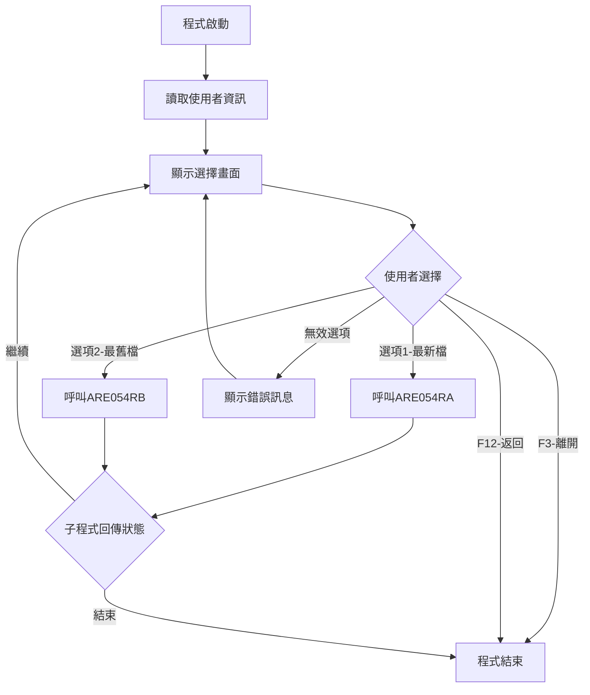
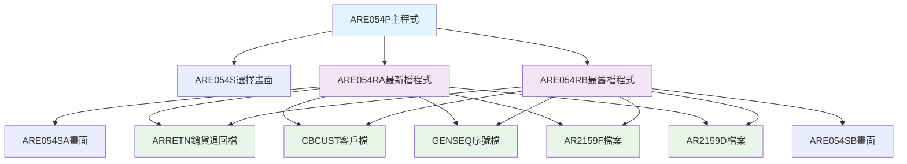
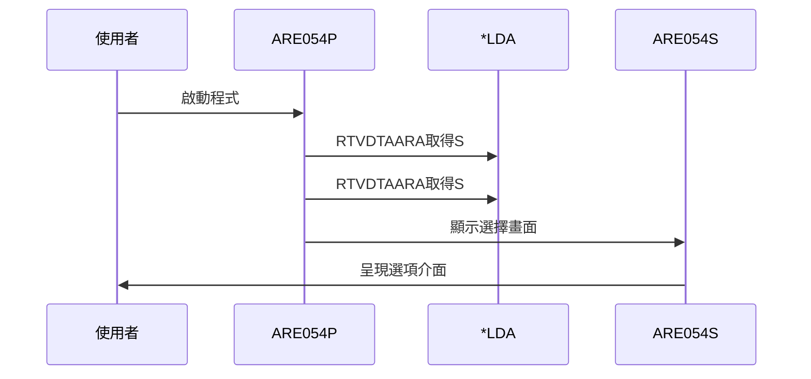
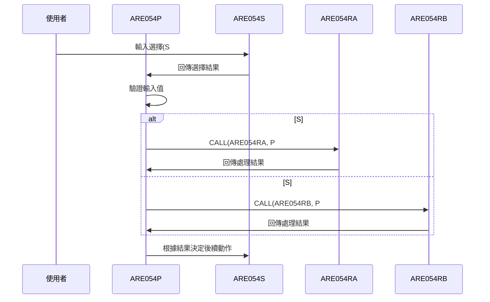
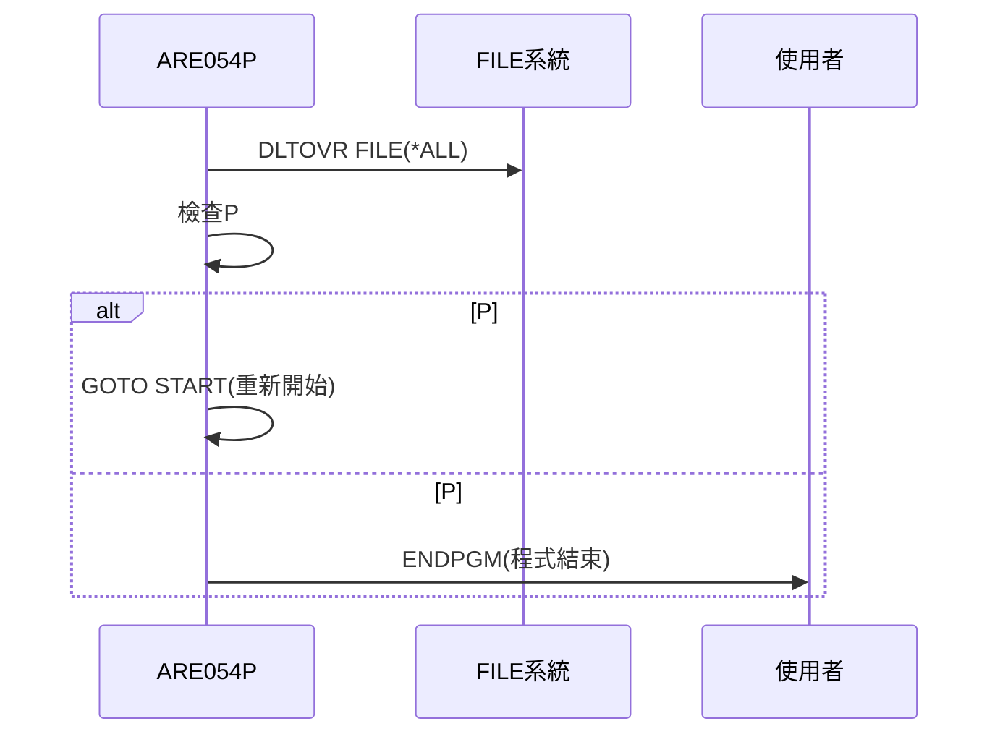
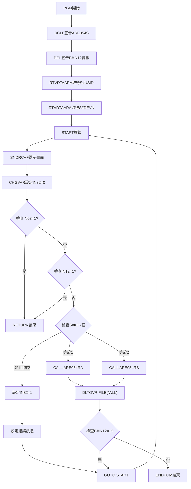
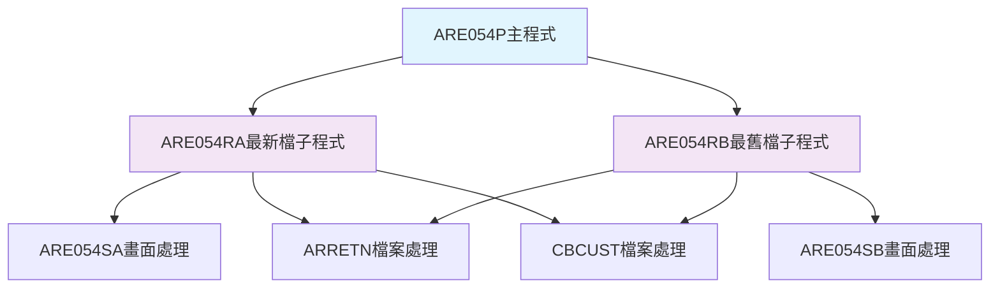
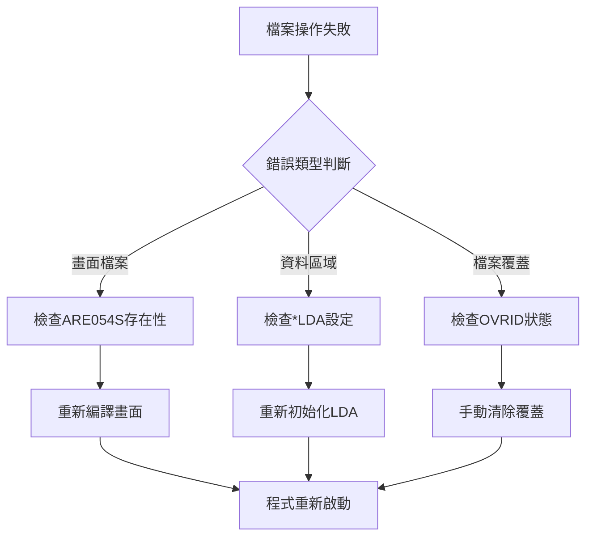

# ARE054P_P02 程式規格書

## 1. 基本資料

| 項目 | 內容 |
|------|------|
| **程式編號** | ARE054P |
| **程式名稱** | 銷貨退回輸入作業 |
| **程式類型** | CLP |
| **廠區** | P02 |
| **系統名稱** | 應收帳款系統 |
| **子系統** | 銷貨退回管理 |
| **檔案位置** | P02CLSRC_THSRC/ARE054P.txt |

## 2. 🎯 程式功能說明

### 主要功能描述
ARE054P為銷貨退回輸入作業的主控制程式，提供兩種處理模式讓使用者選擇不同的資料檢視方式：最新檔模式(選項1)和最舊檔模式(選項2)，以進行銷貨退回單據的建立、維護和查詢作業。

### 🎯 業務流程詳細說明

#### 完整業務流程圖


#### 業務流程關鍵階段說明
1. **環境初始化階段**：
   - 宣告ARE054S畫面檔案
   - 從本機資料區域取得使用者ID和設備名稱
   - 初始化指示器IN32為關閉狀態

2. **互動式選擇階段**：
   - 顯示ARE054S主選擇畫面
   - 等待使用者輸入處理方式選項
   - 檢核輸入值的有效性

3. **分流處理階段**：
   - 根據S#KEY欄位值決定處理路徑
   - 選項'1'：調用ARE054RA進行最新檔處理
   - 選項'2'：調用ARE054RB進行最舊檔處理

4. **子程式協作階段**：
   - 傳遞P#IN12參數給子程式
   - 接收子程式處理結果
   - 根據回傳狀態決定後續動作

5. **環境清理階段**：
   - 刪除所有檔案覆蓋設定
   - 判斷是否需要回到主選擇畫面
   - 程式正常結束

#### 多層次驗證機制
1. **輸入選項驗證**：檢核S#KEY必須為'1'或'2'
2. **功能鍵驗證**：處理F3(離開)和F12(返回)功能鍵
3. **指示器狀態驗證**：確保IN03和IN12的正確狀態

#### 智能處理邏輯
- 自動判斷使用者選擇並導向對應的處理程式
- 提供錯誤回復機制，無效輸入時回到選擇畫面
- 支援循環式作業流程，完成一次處理後可繼續作業

#### 資料一致性確保機制
- 參數傳遞採用標準PARM機制確保資料完整性
- 子程式回傳狀態控制主程式的流程走向
- 統一的錯誤處理和訊息顯示機制

## 3. 🎯 檔案架構與關聯圖

### 使用檔案清單
| 檔案名稱 | 檔案類型 | 使用方式 | 說明 |
|----------|----------|----------|------|
| ARE054S | DSPF | 畫面檔案 | 主選擇畫面 |

### 🎯 檔案關聯詳細視覺化圖表


### 🎯 資料流向詳細說明

#### 環境準備階段的資料流向


#### 業務處理階段的資料流向


#### 環境清理階段的資料流向


## 4. 🎯 檔案欄位規格說明

### 📋 程式變數架構

#### 畫面欄位定義
| 欄位名稱 | 長度 | 型態 | 說明 | 用途 |
|----------|------|------|------|------|
| S#USID | 10A | CHAR | 使用者ID | 來自*LDA(1001-1010)的環境資訊 |
| S#DEVN | 10A | CHAR | 設備名稱 | 來自*LDA(1011-1020)的環境資訊 |
| S#KEY | 1A | CHAR | 處理選項 | 使用者選擇處理模式('1'/'2') |
| S#ERR | 70A | CHAR | 錯誤訊息顯示欄位 | 輸入驗證錯誤時的訊息顯示 |

#### 控制變數定義
| 變數名稱 | 長度 | 型態 | 說明 | 控制範圍 |
|----------|------|------|------|----------|
| P#IN12 | 1A | CHAR | F12功能鍵回傳參數 | 子程式回傳狀態控制('0'/'1') |
| IN03 | 1A | IND | F3離開指示器 | 程式結束控制 |
| IN12 | 1A | IND | F12返回指示器 | 程式返回控制 |
| IN32 | 1A | IND | 錯誤顯示指示器 | 錯誤訊息顯示控制 |

### 🔍 欄位切割視覺化技術詳解

#### 1. LDA資料區切割視覺化
```
LDA記錄：[.............................................|使用者ID__|設備名稱__|....]
位置:    001-1000                                    1001-1010  1011-1020  1021-
         ↓                                           ↓          ↓          ↓
前段保留: [.....................................................]              LDA前段保留區域
使用者ID:                                            [USER12345]            登入使用者識別碼
設備名稱:                                                       [TERM001WS] 工作站設備名稱
後段保留:                                                                  [...] LDA後段保留
```

##### LDA資料區切割邏輯說明
**切割策略**：LDA固定位置切割法，透過RTVDTAARA指令進行精確位置的資料讀取
- **使用者ID區**：位置1001-1010存放10字元使用者識別碼
- **設備名稱區**：位置1011-1020存放10字元工作站設備名稱
- **讀取邏輯**：程式啟動時一次性讀取並設定到畫面欄位
- **實際應用**：RTVDTAARA DTAARA(*LDA (1001 10)) RTNVAR(&S#USID)

#### 2. 選項驗證切割視覺化
```
選項驗證：[輸入值] → [驗證邏輯] → [結果判斷]
階段:     使用者     雙重否定      錯誤處理
          ↓          ↓             ↓
輸入值:   [1或2]                   有效選項
驗證1:              [≠'1']         非最新檔選項
驗證2:              [≠'2']         非最舊檔選項
結果:                              [錯誤顯示] 兩條件同時為真時觸發
```

##### 選項驗證切割邏輯說明
**切割策略**：雙重否定驗證法，透過AND邏輯鏈實現精確的輸入值驗證
- **驗證條件**：(&S#KEY *NE '1') *AND (&S#KEY *NE '2')
- **邏輯核心**：兩個否定條件同時成立時觸發錯誤
- **錯誤觸發**：無效輸入時設定IN32='1'並顯示錯誤訊息
- **實際應用**：確保使用者只能選擇'1'(最新檔)或'2'(最舊檔)

#### 3. 程式調用切割視覺化
```
程式調用：[選項判斷] → [程式選擇] → [參數傳遞]
階段:     條件分支     程式切換     狀態回傳
          ↓           ↓            ↓
選項1:    [S#KEY='1']              最新檔處理模式
程式A:                [ARE054RA]   最新檔處理程式
選項2:    [S#KEY='2']              最舊檔處理模式
程式B:                [ARE054RB]   最舊檔處理程式
參數:                              [P#IN12] 雙向狀態傳遞
```

##### 程式調用切割邏輯說明
**切割策略**：條件分支程式選擇法，根據使用者選項動態調用不同的處理程式
- **分支邏輯**：IF COND(&S#KEY *EQ '1') → CALL ARE054RA
- **程式切換**：IF COND(&S#KEY *EQ '2') → CALL ARE054RB
- **參數傳遞**：PARM(&P#IN12)雙向狀態傳遞
- **實際應用**：根據業務需求分別處理最新檔和最舊檔邏輯

#### 4. 指示器狀態切割視覺化
```
指示器矩陣：[功能鍵] × [狀態值] = [控制效果]
組合:       觸發源     二進制      系統行為
            ↓          ↓           ↓
IN03狀態:   [F3鍵]     [0/1]       程式結束控制
IN12狀態:   [F12鍵]    [0/1]       程式返回控制
IN32狀態:   [驗證]     [0/1]       錯誤顯示控制
```

##### 指示器狀態切割邏輯說明
**切割策略**：二進制狀態控制法，透過單一位元指示器實現精確的程式流程控制
- **IN03控制**：F3功能鍵觸發，優先級最高，立即結束程式
- **IN12控制**：F12功能鍵觸發，次優先級，立即返回主程式
- **IN32控制**：程式邏輯觸發，控制錯誤訊息的顯示和隱藏
- **檢查順序**：IN03 → IN12 → 輸入驗證 → 程式邏輯

#### 5. 錯誤處理切割視覺化
```
錯誤處理：[驗證失敗] → [狀態設定] → [訊息顯示] → [流程重導]
階段:     觸發條件      指示器控制   畫面更新      程式控制
          ↓             ↓           ↓             ↓
觸發:     [無效輸入]                輸入驗證失敗
設定:                   [IN32='1']  錯誤指示器啟動
訊息:                               [選項錯誤!]    70字元錯誤訊息
重導:                                             [GOTO START] 回到輸入畫面
```

##### 錯誤處理切割邏輯說明
**切割策略**：四階段錯誤處理法，透過狀態設定和流程控制實現完整的錯誤處理機制
- **錯誤觸發**：輸入驗證失敗時啟動錯誤處理流程
- **狀態控制**：CHGVAR VAR(&IN32) VALUE('1')設定錯誤顯示狀態
- **訊息顯示**：CHGVAR VAR(&S#ERR) VALUE('選項錯誤!')顯示錯誤訊息
- **流程重導**：GOTO CMDLBL(START)重新回到輸入畫面

#### 6. 參數回流切割視覺化
```
參數回流：[主程式] → [子程式] → [狀態修改] → [回流判斷]
階段:     初始狀態    處理邏輯    結果設定      流程控制
          ↓           ↓           ↓             ↓
輸入:     [P#IN12]                主程式傳入參數
處理:                 [ARE054R*]  子程式處理邏輯
修改:                             [P#IN12='1'] 子程式修改狀態
判斷:                                          [流程重導] 根據回傳值決定
```

##### 參數回流切割邏輯說明
**切割策略**：雙向參數傳遞法，透過參數的雙向傳遞實現主程式與子程式的狀態協調
- **參數傳遞**：CALL PGM(ARE054RA) PARM(&P#IN12)
- **狀態修改**：子程式可修改P#IN12參數值
- **回流判斷**：IF COND(&P#IN12 *EQ '1') THEN(GOTO CMDLBL(START))
- **流程控制**：根據回傳值決定是否重新顯示輸入畫面

#### 7. 資源清理切割視覺化
```
資源清理：[檔案覆蓋] → [清理指令] → [系統重置]
階段:     覆蓋管理     清理執行      資源回收
          ↓            ↓             ↓
覆蓋:     [OVRDBF]                   可能的檔案覆蓋
清理:                  [DLTOVR]      刪除所有檔案覆蓋
重置:                                [FILE(*ALL)] 全域資源重置
```

##### 資源清理切割邏輯說明
**切割策略**：全域資源清理法，透過DLTOVR指令確保系統資源的正確清理
- **清理範圍**：DLTOVR FILE(*ALL)清理所有檔案覆蓋
- **清理時機**：程式處理完成後，返回判斷前執行
- **資源回收**：確保不會影響後續程式的檔案存取
- **系統穩定**：防止資源洩漏和檔案覆蓋衝突

### 🎯 重要業務邏輯控制

#### 處理模式定義
| 選項值 | 程式名稱 | 處理邏輯 | 業務意義 |
|--------|----------|----------|----------|
| '1' | ARE054RA | 最新檔處理 | 處理最新的銷貨退回資料 |
| '2' | ARE054RB | 最舊檔處理 | 處理最舊的銷貨退回資料 |

#### 執行流程控制
| 階段 | 資料來源 | 目標位置 | 切割邏輯 |
|------|----------|----------|----------|
| **環境初始化** | *LDA(1001-1010) | S#USID | 10字元使用者ID切割 |
| **環境初始化** | *LDA(1011-1020) | S#DEVN | 10字元設備名稱切割 |
| **畫面交互** | 使用者輸入 | S#KEY | 1字元選項切割('1'/'2') |
| **輸入驗證** | 邏輯判斷 | IN32 | 雙重否定驗證切割 |
| **程式調用** | 條件分支 | ARE054RA/RB | 動態程式選擇切割 |
| **參數回流** | 雙向傳遞 | P#IN12 | 狀態協調切割 |

## 5. 🎯 輸出/入螢幕布局

### 螢幕布局完整視覺化

```
+----------------------------------------------------------+
|  YY/MM/DD      東昌鋼鐵股份有限公司應收帳款電腦作業    ARE054S|
|  HH:MM:SS        銷貨退回輸入作業                    DEVNAME|
|  USERID                                                  |
|                                                          |
|                                                          |
|                                                          |
|                                                          |
|                                                          |
|                                                          |
|                                                          |
|                     處理方式：[_] (1.最新 2.最舊)         |
|                                                          |
|                                                          |
|                                                          |
|                                                          |
|                                                          |
|                                                          |
|                                                          |
|                                                          |
|                                                          |
|                                                          |
|                                                          |
|  F3=離開         F12=返回                               |
|  [錯誤訊息顯示區域]                                      |
+----------------------------------------------------------+
```

### 🎯 畫面欄位詳細說明
| 位置 | 欄位 | 屬性 | 說明 |
|------|------|------|------|
| 1,2 | DATE | 輸出 | 系統日期，格式YY/MM/DD |
| 1,28 | 固定文字 | 輸出 | '東昌鋼鐵股份有限公司應收帳款電腦作業' |
| 1,70 | 'ARE054S' | 輸出 | 程式識別碼 |
| 2,2 | TIME | 輸出 | 系統時間，格式HH:MM:SS |
| 2,30 | 固定文字 | 輸出 | '銷貨退回輸入作業' |
| 2,70 | S#DEVN | 輸出 | 設備名稱(10字元) |
| 3,2 | S#USID | 輸出 | 使用者ID(10字元) |
| 11,24 | 固定文字 | 輸出 | '處理方式：' |
| 11,37 | S#KEY | 輸入 | 處理方式選擇(1字元) |
| 11,39 | 固定文字 | 輸出 | '(1.最新 2.最舊)' |
| 23,2 | 固定文字 | 輸出 | 'F3=離開' |
| 23,12 | 固定文字 | 輸出 | 'F12=返回' |
| 24,2 | S#ERR | 輸出 | 錯誤訊息顯示(70字元) |

### 🎯 畫面控制邏輯
| 指示器 | 控制對象 | 狀態 | 說明 |
|--------|----------|------|------|
| IN32 | S#KEY欄位 | ON | 啟動反白和保護控制 |
| IN32 | S#ERR欄位 | ON | 啟動反白和保護控制 |

### 功能鍵詳細定義
| 功能鍵 | 處理邏輯 | 系統行為 |
|--------|----------|----------|
| **F3** | 設定IN03='1' | 程式立即結束，回到呼叫者 |
| **F12** | 設定IN12='1' | 程式立即結束，回到呼叫者 |
| **ENTER** | 觸發輸入驗證 | 檢核S#KEY值並分流處理 |

### 操作流程
1. 畫面顯示後，游標定位於S#KEY輸入欄位
2. 使用者輸入'1'或'2'選擇處理方式
3. 按ENTER確認，程式進行輸入驗證
4. 驗證通過後調用對應的子程式
5. F3或F12可隨時離開程式

## 6. 🎯 處理流程程序說明

### 🎯 主程序邏輯深度分析

#### 程式執行流程圖


#### 🎯 詳細處理步驟逐一分析

**步驟1：程式初始化**
- 程式啟動時首先宣告ARE054S畫面檔案
- 宣告P#IN12字元變數用於接收子程式回傳狀態
- 建立程式運行的基礎環境

**步驟2：使用者環境設定**
- 從本機資料區域(*LDA)位置1001-1010取得使用者ID
- 從本機資料區域(*LDA)位置1011-1020取得設備名稱
- 這些資訊用於畫面顯示和權限控制

**步驟3：互動式畫面處理**
- START標籤作為主要處理迴圈的起點
- SNDRCVF同時送出畫面並接收使用者輸入
- 初始化錯誤指示器IN32為關閉狀態

**步驟4：功能鍵檢核處理**
- 優先檢查F3功能鍵(IN03)，若按下則立即結束程式
- 次要檢查F12功能鍵(IN12)，若按下則立即結束程式
- 功能鍵檢核具有最高優先權

**步驟5：輸入值有效性驗證**
- 檢核S#KEY欄位值必須為'1'或'2'
- 使用複合邏輯條件：(&S#KEY *NE '1') *AND (&S#KEY *NE '2')
- 無效輸入時觸發錯誤處理機制

**步驟6：錯誤處理與回復**
- 設定錯誤指示器IN32='1'啟動畫面錯誤顯示
- 設定錯誤訊息S#ERR='選項錯誤!'
- 使用GOTO回到START標籤重新顯示畫面

**步驟7：分流處理邏輯**
- S#KEY='1'時調用ARE054RA處理最新檔模式
- S#KEY='2'時調用ARE054RB處理最舊檔模式
- 使用CALL PGM指令並傳遞P#IN12參數

**步驟8：子程式協作機制**
- 傳遞P#IN12參數給子程式用於狀態回傳
- 子程式可設定P#IN12='1'表示需要回到主畫面
- 子程式可設定P#IN12='0'表示程式可以結束

**步驟9：環境清理與結束**
- DLTOVR FILE(*ALL)清除所有檔案覆蓋設定
- 檢查P#IN12回傳值決定後續動作
- P#IN12='1'時回到START繼續處理，否則結束程式

#### 業務邏輯深度解析

**處理模式選擇邏輯**：
程式提供兩種不同的資料檢視和處理模式，最新檔模式適用於需要處理最近期間的銷貨退回單據，最舊檔模式適用於需要處理較早期間的歷史單據。

**錯誤恢復機制**：
程式採用友善的錯誤處理方式，當使用者輸入無效選項時，不會強制終止程式，而是顯示錯誤訊息並允許重新輸入，提供良好的使用者體驗。

**循環處理控制**：
透過P#IN12參數的回傳值控制，支援連續處理多筆作業的需求，使用者可以在完成一筆業務後繼續處理下一筆，不需要重新啟動程式。

#### 條件判斷詳細說明

**功能鍵判斷條件**：
- IF COND(&IN03 *EQ '1')：檢測F3離開鍵
- IF COND(&IN12 *EQ '1')：檢測F12返回鍵
- 這兩個條件具有最高優先權，滿足任一條件即立即結束

**輸入驗證條件**：
- IF COND((&S#KEY *NE '1') *AND (&S#KEY *NE '2'))：複合邏輯驗證
- 使用AND邏輯確保S#KEY既不是'1'也不是'2'時才觸發錯誤
- 這種設計允許未來擴展更多選項而不需修改核心邏輯

**分流處理條件**：
- IF COND(&S#KEY *EQ '1')：最新檔處理路徑
- IF COND(&S#KEY *EQ '2')：最舊檔處理路徑
- 使用互斥條件確保只會執行其中一個處理路徑

**回流控制條件**：
- IF COND(&P#IN12 *EQ '1')：決定是否回到主選擇畫面
- 此條件由子程式設定，提供彈性的流程控制機制

#### 變數使用和數據流向

**畫面交互變數**：
- S#USID、S#DEVN：從*LDA取得並顯示於畫面
- S#KEY：接收使用者選擇並用於流程控制
- S#ERR：顯示錯誤訊息給使用者

**控制指示器**：
- IN03、IN12：接收功能鍵狀態
- IN32：控制錯誤狀態的畫面顯示屬性

**參數傳遞變數**：
- P#IN12：作為子程式的雙向參數，輸入時為初始狀態，輸出時為回傳狀態

### 🎯 子程序邏輯分析

#### ARE054RA子程序功能
- 處理最新檔模式的銷貨退回輸入作業
- 提供完整的單據建立、查詢、修改、刪除功能
- 支援複製功能和會計科目選擇

#### ARE054RB子程序功能  
- 處理最舊檔模式的銷貨退回輸入作業
- 與ARE054RA功能相同但資料排序方式不同
- 適用於處理歷史資料的維護作業

#### 子程序間的調用關係圖


### 🎯 特殊邏輯處理

#### 畫面循環處理機制
程式使用START標籤建立處理迴圈，結合GOTO指令實現畫面的重複顯示和處理，這種設計允許使用者在同一個程式執行期間進行多次操作。

#### 參數雙向傳遞機制
P#IN12參數採用雙向傳遞設計，主程式可以傳入初始狀態給子程式，子程式可以回傳處理結果狀態給主程式，實現靈活的流程控制。

#### 錯誤狀態恢復機制
當發生輸入錯誤時，程式不會終止，而是設定錯誤指示器並顯示錯誤訊息，然後回到畫面接受重新輸入，保證操作的連續性。

### 🎯 錯誤處理與資料完整性控制

#### 詳細的錯誤處理邏輯
1. **輸入驗證錯誤**：檢核S#KEY值的有效性
2. **指示器控制錯誤**：確保錯誤狀態的正確顯示
3. **流程控制錯誤**：防止無效的程式流程分支

#### 資料完整性檢查機制
1. **參數傳遞完整性**：確保P#IN12參數的正確傳遞
2. **狀態一致性**：維持指示器狀態與畫面顯示的一致性
3. **環境清理完整性**：確保檔案覆蓋設定的正確清除

#### 關鍵業務規則實現
1. **選項唯一性**：只允許選擇一種處理模式
2. **功能鍵優先性**：功能鍵檢核優先於業務邏輯檢核
3. **處理連續性**：支援連續處理多筆業務的需求

## 7. 🎯 數據操作與轉換分析

### 檔案操作詳解

#### 畫面檔案操作
- **DCLF FILE(ARE054S)**：宣告主選擇畫面檔案
- **SNDRCVF**：同時執行畫面傳送和接收操作
- 採用互動式畫面處理模式，等待使用者輸入

#### 本機資料區域操作
- **RTVDTAARA DTAARA(*LDA (1001 10))**：讀取使用者ID
- **RTVDTAARA DTAARA(*LDA (1011 10))**：讀取設備名稱
- 從固定位置讀取系統環境資訊

#### 檔案覆蓋清除操作
- **DLTOVR FILE(*ALL)**：清除所有檔案覆蓋設定
- 確保程式結束時環境的乾淨狀態

### 數據轉換邏輯

#### 字元變數處理
- P#IN12變數作為子程式回傳狀態的載體
- 指示器與字元變數間的狀態轉換
- 錯誤訊息的字元串設定和顯示

#### 指示器狀態轉換
- IN03、IN12：接收功能鍵按下狀態('0'/'1')
- IN32：控制錯誤顯示狀態('0'/'1')
- 指示器狀態直接影響畫面顯示屬性

### 計算邏輯分析

程式本身不包含複雜的數學運算，主要邏輯為：
- 條件判斷的布林運算
- 字元比較的邏輯運算
- 流程控制的分支運算

### 檢核機制詳解

#### 輸入有效性檢查
```
檢核條件：(&S#KEY *NE '1') *AND (&S#KEY *NE '2')
檢核邏輯：確保輸入值只能是'1'或'2'
檢核失敗：設定IN32='1'並顯示錯誤訊息
檢核通過：繼續後續處理流程
```

#### 功能鍵狀態檢查
```
F3檢核：IF COND(&IN03 *EQ '1')
F12檢核：IF COND(&IN12 *EQ '1')  
檢核優先權：功能鍵檢核優先於輸入值檢核
檢核結果：滿足條件即執行RETURN結束程式
```

#### 子程式回傳狀態檢查
```
狀態檢核：IF COND(&P#IN12 *EQ '1')
檢核目的：決定是否回到主選擇畫面
檢核邏輯：'1'表示繼續，其他值表示結束
```

## 8. 🎯 錯誤處理程序說明

### 🎯 詳細錯誤代碼清冊

| 錯誤代碼 | 錯誤訊息 | 原因說明 | 處理方式 | 預防措施 |
|----------|---------|---------|---------|----------|
| **USER001** | 選項錯誤! | 使用者在S#KEY欄位輸入了'1'和'2'以外的值 | 1. 設定IN32='1'啟動錯誤顯示<br>2. 設定S#ERR錯誤訊息<br>3. GOTO START回到選擇畫面<br>4. 允許重新輸入 | 在畫面上明確標示有效選項範圍，提供清楚的操作說明 |
| **SYS001** | 本機資料區域讀取失敗 | RTVDTAARA指令無法正確讀取*LDA中的使用者資訊 | 1. 檢查*LDA資料區域設定<br>2. 確認使用者權限<br>3. 重新初始化資料區域<br>4. 若持續失敗則程式異常結束 | 確保*LDA正確初始化，定期檢查資料區域完整性 |
| **SYS002** | 畫面檔案宣告失敗 | ARE054S畫面檔案無法正確宣告或不存在 | 1. 檢查ARE054S畫面檔案是否存在<br>2. 確認檔案存取權限<br>3. 重新編譯畫面檔案<br>4. 檢查程式庫設定 | 確保ARE054S畫面檔案正確編譯並存放於指定程式庫 |
| **SYS003** | 子程式呼叫失敗 | ARE054RA或ARE054RB子程式無法正確呼叫 | 1. 檢查子程式是否存在於程式庫中<br>2. 確認子程式編譯狀態<br>3. 檢查參數傳遞格式<br>4. 重新編譯相關程式 | 確保所有子程式正確編譯，定期檢查程式庫完整性 |
| **FILE001** | 檔案覆蓋清除失敗 | DLTOVR FILE(*ALL)指令執行失敗 | 1. 檢查檔案覆蓋狀態<br>2. 手動清除檔案覆蓋<br>3. 重新啟動作業<br>4. 必要時重新登入系統 | 避免在程式執行期間手動設定檔案覆蓋 |

### 🎯 系統異常處理邏輯

#### 檔案操作失敗處理


#### 程式調用失敗處理
- 檢查子程式ARE054RA、ARE054RB的存在性和編譯狀態
- 確認參數P#IN12的格式和長度正確性
- 檢查程式庫列表和搜尋順序設定
- 必要時重新編譯整個程式組

#### 資料完整性錯誤處理
- 監控指示器狀態的異常變化
- 檢查變數值的邊界和格式
- 確保畫面欄位與程式變數的對應關係正確
- 實施資料一致性檢查機制

#### 並發控制失敗處理
- 處理多重使用者同時存取的衝突
- 管理畫面鎖定和釋放機制
- 控制子程式調用的序列化執行
- 防止資源競爭導致的程式異常

## 9. 🎯 備註

### 🎯 特殊注意事項

#### 程式調用順序
程式必須按照固定順序執行：環境初始化 → 畫面交互 → 輸入驗證 → 分流處理 → 環境清理，不可跳過任何步驟。

#### 參數傳遞機制
P#IN12參數為雙向傳遞，主程式傳入初始狀態，子程式可修改此參數值來控制回流，必須確保參數格式的一致性。

#### 指示器使用規範
IN32指示器專用於錯誤狀態控制，IN03和IN12專用於功能鍵檢測，各指示器功能不可混用。

#### 畫面檔案依賴性
程式強烈依賴ARE054S畫面檔案的正確定義，畫面欄位的任何變更都可能影響程式的正常運作。

#### 子程式協作要求
ARE054RA和ARE054RB必須存在且正確編譯，這兩個子程式提供實際的業務邏輯處理，主程式僅負責流程控制。

#### 環境清理重要性
程式結束前必須執行DLTOVR FILE(*ALL)清除檔案覆蓋設定，避免影響後續程式的執行環境。

#### 錯誤恢復設計
程式採用友善的錯誤恢復機制，輸入錯誤時不會強制終止，而是提供重新輸入的機會，維持作業的連續性。 