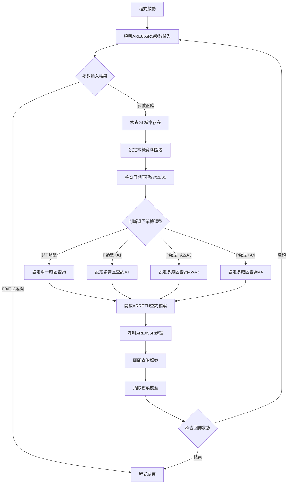
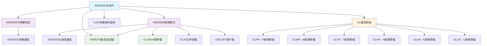
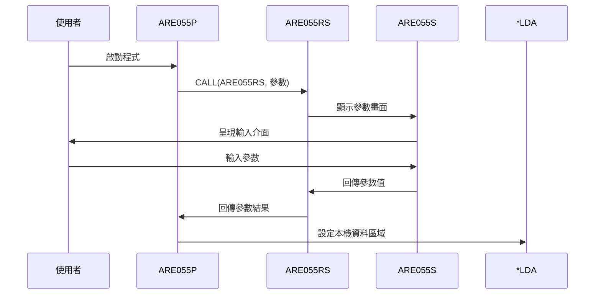
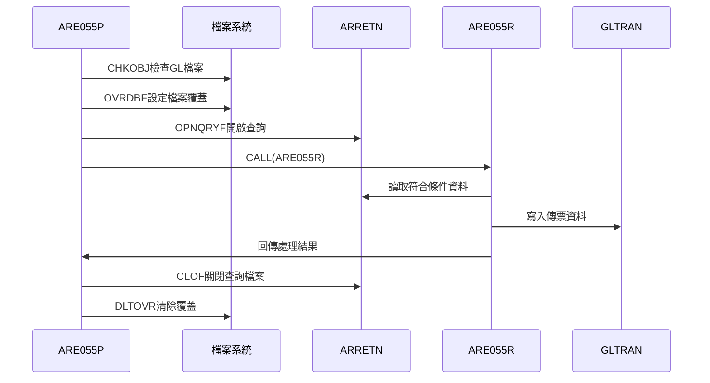
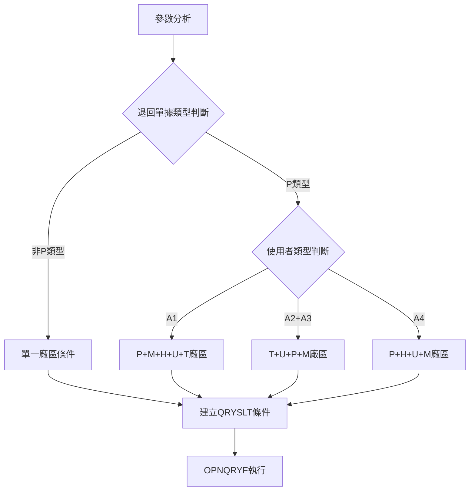
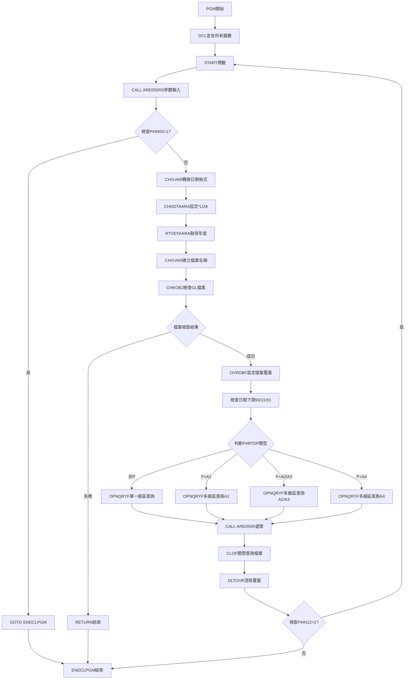
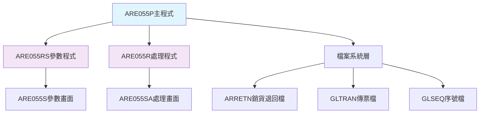
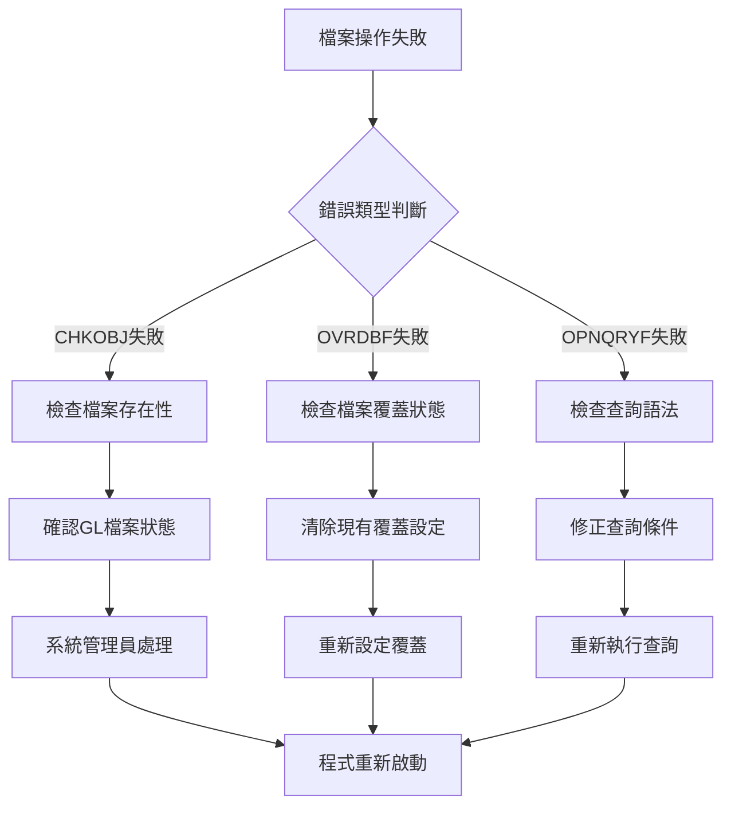

# ARE055P_P02 程式規格書

## 1. 基本資料

| 項目 | 內容 |
|------|------|
| **程式編號** | ARE055P |
| **程式名稱** | 銷貨退回過帳及傳票處理作業 |
| **程式類型** | CLP |
| **廠區** | P02 |
| **系統名稱** | 應收帳款系統 |
| **子系統** | 銷貨退回管理 |
| **檔案位置** | P02CLSRC_THSRC/ARE055P.txt |

## 2. 🎯 程式功能說明

### 主要功能描述
ARE055P為銷貨退回過帳及傳票處理作業的主控制程式，負責協調參數輸入、檔案查詢條件設定和實際處理作業。程式透過複雜的查詢條件篩選，針對不同廠區、不同使用者類型的銷貨退回單據進行過帳和傳票產生處理。

### 🎯 業務流程詳細說明

#### 完整業務流程圖


#### 業務流程關鍵階段說明
1. **參數收集階段**：
   - 呼叫ARE055RS子程式顯示參數輸入畫面
   - 接收使用者輸入的退回單據類型、期間、使用者類型等參數
   - 驗證參數的有效性和邏輯正確性

2. **環境檢查階段**：
   - 檢查對應的GL檔案是否存在且有變更權限
   - 設定本機資料區域以供後續程式使用
   - 確保系統環境符合處理要求

3. **查詢條件建立階段**：
   - 根據退回單據類型(RTDP)和使用者類型(USTP)組合建立複雜查詢條件
   - 設定檔案覆蓋以指向正確的GL檔案
   - 開啟ARRETN檔案的查詢模式

4. **資料篩選階段**：
   - 使用OPNQRYF建立動態查詢條件
   - 篩選條件包含：過帳狀態(FL01='Y')、傳票狀態(FL02='Y')、日期範圍、廠區代碼、使用者類型
   - 建立檔案存取的邏輯視圖

5. **業務處理階段**：
   - 呼叫ARE055R程式執行實際的過帳和傳票處理
   - 處理符合查詢條件的所有銷貨退回單據
   - 產生相應的會計傳票

6. **環境清理階段**：
   - 關閉查詢檔案釋放資源
   - 清除所有檔案覆蓋設定
   - 根據回傳狀態決定是否重新開始

#### 多層次驗證機制
1. **參數邏輯驗證**：檢核日期範圍、廠區代碼與使用者類型的合理組合
2. **檔案存取驗證**：確認GL檔案存在且具備變更權限
3. **業務規則驗證**：特定廠區只能由特定使用者類型處理

#### 智能處理邏輯
- 根據不同的廠區和使用者類型組合自動建立最適合的查詢條件
- 支援彈性的日期範圍設定，自動調整過早的開始日期
- 提供循環處理機制，支援連續多次作業

#### 資料一致性確保機制
- 透過檔案鎖定機制確保處理期間的資料一致性
- 使用查詢檔案模式避免直接修改原始檔案索引
- 完整的環境清理確保不影響後續作業

## 3. 🎯 檔案架構與關聯圖

### 使用檔案清單
| 檔案名稱 | 檔案類型 | 使用方式 | 說明 |
|----------|----------|----------|------|
| ARE055S | DSPF | 畫面檔案 | 參數輸入畫面 |
| ARRETN | PF | 查詢檔案 | 銷貨退回檔案(查詢模式) |
| GLTRAN | PF | 輸出檔案 | 傳票檔案(動態檔名) |
| *LDA | 資料區域 | 參數傳遞 | 本機資料區域 |

### 🎯 檔案關聯詳細視覺化圖表


### 🎯 資料流向詳細說明

#### 環境準備階段的資料流向


#### 業務處理階段的資料流向


#### 查詢條件建立階段的資料流向


## 4. 🎯 檔案欄位規格說明

### 📋 程式變數架構

#### 參數變數定義
| 變數名稱 | 長度 | 型態 | 說明 | 用途 |
|----------|------|------|------|------|
| &P#IN03 | 1A | CHAR | F3功能鍵狀態 | 使用者結束作業控制 |
| &P#IN12 | 1A | CHAR | F12功能鍵狀態 | 返回主程式控制 |
| &P#RTDP | 1A | CHAR | 退回單據類型 | 廠區選擇控制(P/M/T/H/K/U) |
| &P#USTP | 2A | CHAR | 使用者類型 | 權限控制(A1/A2/A3/A4) |
| &P#RTDS | 8P | DEC | 退回期間起始日期 | 資料篩選範圍控制 |
| &P#RTDE | 8P | DEC | 退回期間結束日期 | 資料篩選範圍控制 |
| &P#CODE | 1A | CHAR | 是否包含未登錄的 | 資料包含選項控制(Y/N) |

#### 工作變數定義
| 變數名稱 | 長度 | 型態 | 說明 | 轉換來源 |
|----------|------|------|------|----------|
| &C#RTDS | 8A | CHAR | 字元型起始日期 | 來自&P#RTDS數值轉換 |
| &C#RTDE | 8A | CHAR | 字元型結束日期 | 來自&P#RTDE數值轉換 |
| &C#YY | 2A | CHAR | 年度代碼 | 來自*LDA(302 2)讀取 |
| &FILE | 10A | CHAR | 動態檔案名稱 | 'GL'+&P#RTDP+'R'組合 |

### 🔍 欄位切割視覺化技術詳解

#### 1. 變數宣告切割視覺化
```
變數記錄：[型態__|長度__|變數名稱__|用途說明_________________]
位置:     001-06 007-12 013-22     023-50
          ↓      ↓      ↓          ↓
功能鍵1:  [*CHAR|1_____| &P#IN03___|F3功能鍵狀態____________]
功能鍵2:  [*CHAR|1_____| &P#IN12___|F12功能鍵狀態___________]
退回類型: [*CHAR|1_____| &P#RTDP___|退回單據類型____________]
使用者型: [*CHAR|2_____| &P#USTP___|使用者類型______________]
起始日期: [*DEC_|8_0___| &P#RTDS___|退回期間起始日期_________]
結束日期: [*DEC_|8_0___| &P#RTDE___|退回期間結束日期_________]
包含碼:   [*CHAR|1_____| &P#CODE___|未登錄包含選項__________]
```

##### 變數宣告切割邏輯說明
**切割策略**：型態長度功能分離法，透過DCL指令的結構化參數定義實現精確變數規格控制
- **型態多樣化**：混合使用*CHAR字元型態和*DEC數值型態
- **長度精確化**：根據業務需求和資料特性定義最佳長度
- **命名規範化**：使用前綴(&P#、&C#)區分參數變數和工作變數

#### 2. LDA資料區切割視覺化
```
LDA記錄：[..............................................|起始日期__|P|YY|....]
位置:    001-299                                    300-307    308 302-303 309-
         ↓                                          ↓          ↓   ↓       ↓
前段保留: [...................................................]           LDA前段保留區域
起始日期:                                            [20241201]         退回期間起始日期
處理碼:                                                       [Y]       處理代碼選項控制
年度碼:                                                         [24]     年度代碼(重疊讀取)
後段保留:                                                              [...] LDA後段保留
```

##### LDA資料區切割邏輯說明
**切割策略**：LDA重疊區域利用法，透過CHGDTAARA和RTVDTAARA指令進行精確位置的資料存取
- **起始日期區**：位置300-307存放8字元退回期間起始日期
- **處理代碼區**：位置308存放1字元處理代碼選項
- **年度代碼區**：位置302-303重疊讀取2字元年度代碼
- **重疊利用**：位置302-303既是起始日期的一部分，也是年度代碼

#### 3. 動態檔案名稱組合切割視覺化
```
檔案組合：[GL] + [廠區] + [R] = [動態檔名]
組合:     前綴   變動     後綴   結果
          ↓      ↓        ↓      ↓
前綴:     [GL]                   總帳檔案前綴
廠區:            [P]             廠區代碼變數
後綴:                     [R]    記錄檔案後綴
結果:                            [GLPR] P廠區總帳檔案
```

##### 動態檔案名稱組合切割邏輯說明
**切割策略**：三段式動態命名法，透過字串拼接運算子實現廠區別檔案的動態選擇
- **前綴標準化**：'GL'代表總帳(General Ledger)檔案類型
- **廠區變數化**：&P#RTDP變數代表不同廠區代碼(P/M/T/H/K/U)
- **字串拼接**：使用*CAT運算子進行CLP字串拼接
- **實際應用**：CHGVAR VAR(&FILE) VALUE('GL' *CAT &P#RTDP *CAT 'R')

#### 4. MAPFLD欄位切割視覺化
```
MAPFLD轉換：[ANRTNO____] → [%SST] → [RTNO]
階段:       原始欄位      切割函數   目標欄位
            ↓             ↓          ↓
原始欄位:   [P12345678]              原始退回單號
切割函數:                [%SST(1,1)] 取第1字元
目標欄位:                           [P] 廠區代碼
```

##### MAPFLD欄位切割邏輯說明
**切割策略**：字串截取重定義法，透過%SST函數從退回單號中提取廠區代碼
- **原始欄位**：ANRTNO為完整的退回單號
- **切割函數**：%SST(ANRTNO 1 1)截取第1字元
- **目標重定義**：RTNO作為廠區代碼的新欄位名稱
- **實際應用**：MAPFLD((RTNO '%SST(ANRTNO 1 1)' *CHAR 1))

#### 5. 權限控制切割視覺化
```
權限矩陣：[使用者類型] × [廠區代碼] = [存取權限]
組合:     使用者       廠區範圍     權限結果
          ↓            ↓            ↓
A1類型:   [A1]         [P,M,H,U,T]  全廠區存取權限
A2類型:   [A2]         [T,U,P,M]    部分廠區存取權限
A3類型:   [A3]         [T,U,P,M]    部分廠區存取權限
A4類型:   [A4]         [P,H,U,M]    特定廠區存取權限
```

##### 權限控制切割邏輯說明
**切割策略**：矩陣式權限分配法，透過使用者類型與廠區代碼的組合實現精細權限控制
- **A1權限**：最高權限，可存取所有廠區(P,M,H,U,T)
- **A2/A3權限**：中等權限，可存取部分廠區(T,U,P,M)
- **A4權限**：特定權限，可存取指定廠區(P,H,U,M)
- **條件實現**：根據不同權限組合執行不同的OPNQRYF查詢

#### 6. 查詢條件組合切割視覺化
```
查詢條件：[基本條件] AND [日期條件] AND [廠區條件] AND [使用者條件]
組合:     固定條件     期間篩選     廠區篩選     權限篩選
          ↓            ↓            ↓            ↓
基本:     [FL01=Y,FL02=Y]           過帳及傳票已完成
日期:                  [RTDT範圍]    退回日期期間篩選
廠區:                               [RTNO=廠區]   廠區代碼篩選
使用者:                                          [USTP=類型] 使用者類型篩選
```

##### 查詢條件組合切割邏輯說明
**切割策略**：四層條件疊加法，透過AND邏輯鏈實現複合查詢條件的精確組合
- **基本條件層**：ANFL01='Y' AND ANFL02='Y' 確保資料完整性
- **日期條件層**：RTDT BETWEEN 起始日期 AND 結束日期
- **廠區條件層**：RTNO符合使用者權限的廠區範圍
- **使用者條件層**：ANUSTP符合指定的使用者類型

#### 7. 檔案覆蓋切割視覺化
```
檔案覆蓋：[GLTRAN] → [動態檔名] = [實際存取]
映射:     邏輯檔名   實際檔名     存取結果
          ↓          ↓            ↓
邏輯:     [GLTRAN]                程式中的邏輯檔名
實際:                [GLPR]       P廠區實際檔案
結果:                             [動態重導向] 廠區別檔案存取
```

##### 檔案覆蓋切割邏輯說明
**切割策略**：動態檔案重導向法，透過OVRDBF指令實現廠區別檔案的動態存取
- **邏輯統一**：程式中統一使用GLTRAN邏輯檔名
- **實際分離**：根據廠區代碼動態決定實際檔案
- **存取重導向**：OVRDBF將邏輯檔名映射到實際檔案
- **實際應用**：OVRDBF FILE(GLTRAN) TOFILE(&FILE)

### 🎯 重要檔案欄位說明

#### ARRETN檔案欄位映射
| 原始欄位 | 映射定義 | 實際用途 | 挪用原因 |
|----------|----------|----------|----------|
| ANRTNO | %SST(ANRTNO 1 1) → RTNO | 取退回單據的第1個字元作為廠區代碼 | 為了支援多廠區查詢而將單據編號的第1位元重新定義為廠區識別碼 |
| ANRTDT | ANRTDT → RTDT | 退回日期的直接映射 | 無挪用，直接對應使用 |
| ANFL01 | 過帳狀態旗標 | 必須等於'Y'表示已過帳 | 作為必要的過濾條件 |
| ANFL02 | 傳票狀態旗標 | 必須等於'Y'表示已產生傳票 | 作為必要的過濾條件 |
| ANUSTP | 使用者類型 | 必須符合輸入的使用者類型 | 用於權限控制的關鍵欄位 |

### 📊 業務邏輯控制表

#### 重要變數定義
| 變數名稱 | 用途說明 | 數值範圍 | 預設值 | 業務規則 |
|----------|----------|----------|--------|----------|
| P#RTDP | 控制退回單據類型 | P,M,T,H,K,U | 無 | 決定存取的廠區檔案 |
| P#USTP | 控制使用者類型 | A1,A2,A3,A4 | 無 | 控制廠區存取權限範圍 |
| P#CODE | 控制未登錄包含 | Y,N | 無 | 決定是否包含未登錄資料 |
| C#RTDS | 日期下限控制 | ≥00931101 | 系統調整 | 最早查詢日期限制 |

#### 權限矩陣對應
```
廠區權限切割邏輯：
A1使用者：P+M+H+U+T (5個廠區)
A2/A3使用者：T+U+P+M (4個廠區，排除H)
A4使用者：P+H+U+M (4個廠區，排除T)
```

#### 執行流程控制
| 階段 | 切割來源 | 切割目標 | 切割邏輯 |
|------|----------|----------|----------|
| **參數收集** | 使用者輸入 | P#系列變數 | 6參數雙向傳遞切割 |
| **資料轉換** | P#RTDS/P#RTDE | C#RTDS/C#RTDE | 數值轉字元格式切割 |
| **LDA設定** | C#系列變數 | *LDA(300-308) | 記憶體區域定位切割 |
| **檔名建構** | P#RTDP | &FILE | 動態字串拼接切割 |
| **檔案映射** | ANRTNO | RTNO | %SST函數位置切割 |

## 5. 🎯 輸出/入螢幕布局

### 螢幕布局完整視覺化

```
+----------------------------------------------------------+
|  YY/MM/DD      東昌鋼鐵股份有限公司應收帳款電腦作業    ARE055S|
|  HH:MM:SS      銷貨退回過帳及傳票處理作業              DEVNAME|
|  USERID                                                  |
|                                                          |
|                                                          |
|                                                          |
|                                                          |
|        請輸入處理條件:                                    |
|                                                          |
|         1:退回單據: [X] (P:台灣 M:台美 T:特殊 H:公司間  |
|                         K:標準                           |
|                         U:其他)                          |
|         2:退回期間起迄: [____/__/__] ~~ [____/__/__]     |
|                                                          |
|         3:使用者類型: [XX] (A1:穩固部門 A2:台北部門     |
|                            A3:台中部門 A4:高雄部門)     |
|                                                          |
|         4:是否包含未登錄的: [X] (Y:包含,N:不包含)        |
|                                                          |
|                                                          |
|                                                          |
|                                                          |
|  作業功能:     PF3=結束作業      PF12=返回主程式        |
|  [錯誤訊息顯示區域]                                      |
+----------------------------------------------------------+
```

### 🎯 畫面欄位詳細說明
| 位置 | 欄位 | 屬性 | 說明 |
|------|------|------|------|
| 1,2 | DATE | 輸出 | 系統日期，格式YY/MM/DD |
| 1,26 | 固定文字 | 輸出 | '東昌鋼鐵股份有限公司應收帳款電腦作業' |
| 1,70 | 'ARE055S' | 輸出 | 程式識別碼 |
| 2,2 | TIME | 輸出 | 系統時間，格式HH:MM:SS |
| 2,26 | 固定文字 | 輸出 | '銷貨退回過帳及傳票處理作業' |
| 2,70 | S#DEVN | 輸出 | 設備名稱(10字元) |
| 3,2 | S#USER | 輸出 | 使用者ID(10字元) |
| 10,31 | S#RTDP | 輸出 | 退回單據類型(1字元) |
| 12,35 | S#RTDS | 輸入 | 退回期間起始日期(8數字) |
| 12,49 | S#RTDE | 輸入 | 退回期間結束日期(8數字) |
| 14,29 | S#USTP | 輸入 | 使用者類型(2字元) |
| 17,41 | S#CODE | 輸入 | 包含未登錄的選項(1字元) |
| 24,2 | S#ERR | 輸出 | 錯誤訊息顯示(70字元) |

### 🎯 畫面控制邏輯
| 指示器 | 控制對象 | 狀態 | 說明 |
|--------|----------|------|------|
| IN51 | S#RTDS欄位 | ON | 啟動反白和保護控制 |
| IN52 | S#RTDE欄位 | ON | 啟動反白和保護控制 |
| IN53 | S#USTP欄位 | ON | 啟動反白和保護控制 |

### 功能鍵詳細定義
| 功能鍵 | 處理邏輯 | 系統行為 |
|--------|----------|----------|
| **F3** | 設定P#IN03='1' | 結束作業，回到呼叫程式 |
| **F12** | 設定P#IN12='1' | 返回主程式 |
| **ENTER** | 觸發參數驗證 | 檢核所有輸入參數並回傳 |

### 操作流程
1. 畫面顯示後，游標定位於第一個輸入欄位
2. 使用者依序輸入退回單據類型、期間、使用者類型、處理選項
3. 按ENTER確認，程式進行完整參數驗證
4. 驗證通過後回傳參數給主程式繼續處理
5. F3或F12可隨時離開

## 6. 🎯 處理流程程序說明

### 🎯 主程序邏輯深度分析

#### 程式執行流程圖


#### 🎯 詳細處理步驟逐一分析

**步驟1：變數宣告與初始化**
- 宣告12個不同類型的變數用於參數傳遞和工作處理
- 包含字元型、數值型變數以支援複雜的資料轉換
- 建立程式執行的完整變數環境

**步驟2：參數收集與驗證**
- START標籤建立主處理迴圈的起點
- 呼叫ARE055RS子程式顯示參數輸入畫面
- 傳遞6個參數：P#IN03、P#RTDP、P#RTDS、P#RTDE、P#USTP、P#CODE
- 接收使用者輸入並進行完整的參數驗證

**步驟3：退出條件檢核**
- 檢查P#IN03是否為'1'(F3功能鍵)
- 若為真則直接跳轉至ENDCLPGM結束程式
- 此檢核具有最高優先權，確保使用者可隨時離開

**步驟4：資料轉換與設定**
- 將數值型日期P#RTDS、P#RTDE轉換為字元型C#RTDS、C#RTDE
- 設定本機資料區域(*LDA)位置300-308的參數值
- 從*LDA位置302-303取得年度代碼C#YY

**步驟5：動態檔案名稱建立**
- 組合檔案名稱：'GL' + P#RTDP + 'R'
- 例如：P廠區→GLPR，M廠區→GLMR
- 建立動態的傳票檔案參考

**步驟6：檔案存在性與權限檢查**
- 使用CHKOBJ檢查GL檔案是否存在
- 驗證是否具備*CHANGE權限
- 監控CPF0000訊息，失敗時直接RETURN結束

**步驟7：檔案覆蓋設定**
- OVRDBF將GLTRAN指向動態檔案名稱&FILE
- OVRDBF設定ARRETN為共享模式(SHARE(*YES))
- 建立後續處理所需的檔案環境

**步驟8：日期下限控制**
- 檢查C#RTDS是否小於'00931101'(民國93年11月1日)
- 若小於則自動調整為'00931101'
- 確保處理日期符合系統要求

**步驟9：複雜查詢條件建立**
- 根據P#RTDP和P#USTP的不同組合建立4種查詢模式
- 每種模式包含不同的廠區篩選條件
- 使用OPNQRYF建立動態查詢邏輯視圖

**步驟10：實際業務處理**
- 呼叫ARE055R程式執行過帳和傳票處理
- 傳遞P#IN12參數用於回傳處理狀態
- 處理所有符合查詢條件的銷貨退回資料

**步驟11：環境清理與回流控制**
- CLOF關閉ARRETN查詢檔案釋放資源
- DLTOVR清除所有檔案覆蓋設定
- 檢查P#IN12值決定是否回到START重新開始

#### 業務邏輯深度解析

**多廠區處理邏輯**：
程式支援複雜的多廠區權限控制，不同使用者類型只能處理特定廠區的資料。A1使用者可處理最多廠區(P+M+H+U+T)，A4使用者處理P+H+U+M廠區，A2/A3使用者處理T+U+P+M廠區。

**動態檔案管理**：
程式採用動態檔案名稱生成機制，根據退回單據類型自動指向對應的GL傳票檔案，實現多廠區檔案的統一管理。

**資料完整性控制**：
透過FL01和FL02欄位的雙重檢核，確保只處理已過帳且已產生傳票的退回單據，維護資料處理的一致性。

#### 條件判斷詳細說明

**檔案檢查條件**：
- CHKOBJ OBJ(&FILE) OBJTYPE(*FILE) AUT(*CHANGE)：檢查檔案存在性和變更權限
- MONMSG MSGID(CPF0000)：監控所有CPF開頭的系統錯誤訊息

**日期控制條件**：
- IF COND(&C#RTDS *LT '00931101')：確保處理日期不早於系統設定下限
- 自動調整過早日期確保查詢的有效性

**查詢分流條件**：
- IF COND(&P#RTDP *NE 'P')：非P廠區使用單一廠區查詢
- IF COND((&P#RTDP *EQ 'P') *AND (&P#USTP *EQ 'A1'))：P廠區A1使用者查詢
- IF COND((&P#RTDP *EQ 'P') *AND ((&P#USTP *EQ 'A2') *OR (&P#USTP *EQ 'A3')))：P廠區A2/A3使用者查詢
- IF COND((&P#RTDP *EQ 'P') *AND (&P#USTP *EQ 'A4'))：P廠區A4使用者查詢

**回流控制條件**：
- IF COND(&P#IN12 *EQ '1')：決定是否回到START重新處理

#### 變數使用和數據流向

**參數傳遞變數**：
- P#系列變數：用於與子程式間的參數傳遞
- C#系列變數：用於資料格式轉換和字元處理
- &FILE變數：用於動態檔案名稱管理

**本機資料區域使用**：
- 位置300-307：儲存退回期間起始日期
- 位置308：儲存處理代碼選項
- 位置302-303：年度代碼的雙向傳遞

**檔案覆蓋變數**：
- &FILE：動態指向不同廠區的GL檔案
- ARRETN：設定為共享模式支援並發存取

### 🎯 子程序邏輯分析

#### ARE055RS子程序功能
- 顯示參數輸入畫面並接收使用者輸入
- 執行完整的參數驗證包含日期有效性、使用者類型、廠區限制等
- 提供友善的錯誤訊息和輸入指引

#### ARE055R子程序功能  
- 執行銷貨退回過帳處理的核心業務邏輯
- 讀取符合查詢條件的退回單據進行處理
- 產生相應的會計傳票並更新相關檔案

#### 子程序間的調用關係圖


### 🎯 特殊邏輯處理

#### 動態查詢條件建構機制
程式使用OPNQRYF的QRYSLT參數建立複雜的動態查詢條件，將字元串拼接與邏輯條件結合，實現彈性的資料篩選機制。

#### 多廠區權限控制機制
根據使用者類型動態調整可存取的廠區範圍，實現細粒度的權限控制，確保資料安全性。

#### 檔案名稱動態生成機制
透過字元串拼接建立動態檔案名稱，支援多廠區環境下的檔案統一管理。

#### 日期自動調整機制
當輸入的開始日期過早時，系統自動調整為最早可處理日期，確保查詢的有效性。

### 🎯 錯誤處理與資料完整性控制

#### 詳細的錯誤處理邏輯
1. **檔案存取錯誤**：MONMSG監控檔案操作失敗並自動返回
2. **參數驗證錯誤**：ARE055RS子程式提供完整的參數檢核
3. **權限檢查錯誤**：CHKOBJ確保檔案存取權限

#### 資料完整性檢查機制
1. **狀態驗證**：FL01='Y'和FL02='Y'確保資料處理狀態正確
2. **檔案鎖定**：SHARE(*YES)避免併發存取衝突
3. **環境清理**：完整的檔案覆蓋清除確保環境乾淨

#### 關鍵業務規則實現
1. **廠區權限**：使用者類型與廠區的對應關係控制
2. **日期限制**：最早處理日期的自動控制
3. **處理狀態**：只處理符合特定狀態的退回單據

## 7. 🎯 數據操作與轉換分析

### 檔案操作詳解

#### 動態檔案操作
- **CHKOBJ OBJ(&FILE) OBJTYPE(*FILE) AUT(*CHANGE)**：檢查動態檔案存在性和權限
- **OVRDBF FILE(GLTRAN) TOFILE(&FILE)**：動態檔案覆蓋指向
- **OVRDBF FILE(ARRETN) TOFILE(ARRETN) SHARE(*YES)**：共享模式檔案覆蓋

#### 查詢檔案操作
- **OPNQRYF FILE(ARRETN) OPTION(*ALL)**：開啟全記錄查詢模式
- **QRYSLT**：動態SQL類型查詢條件建立
- **MAPFLD**：欄位映射重新定義
- **KEYFLD**：排序欄位指定
- **CLOF OPNID(ARRETN)**：關閉查詢檔案

#### 本機資料區域操作
- **CHGDTAARA DTAARA(*LDA (300 8)) VALUE(&C#RTDS)**：設定起始日期
- **CHGDTAARA DTAARA(*LDA (308 1)) VALUE(&P#CODE)**：設定處理代碼
- **RTVDTAARA DTAARA(*LDA (302 2)) RTNVAR(&C#YY)**：取得年度代碼

### 數據轉換邏輯

#### 數值到字元轉換
- CHGVAR VAR(&C#RTDS) VALUE(&P#RTDS)：8位數值日期轉為8字元
- CHGVAR VAR(&C#RTDE) VALUE(&P#RTDE)：8位數值日期轉為8字元
- 確保日期格式在查詢條件中的正確性

#### 字元串拼接轉換
- CHGVAR VAR(&FILE) VALUE('GL' *CAT &P#RTDP *CAT 'R')：動態檔案名稱建立
- 支援'GL' + 廠區代碼 + 'R'的檔案命名規則

#### 欄位映射轉換
```
MAPFLD定義：
(RTNO '%SST(ANRTNO 1 1)' *CHAR 1)  ← 取退回單號第1位作為廠區代碼
(RTDT ANRTDT *CHAR 8)              ← 退回日期直接映射
```

### 計算邏輯分析

#### 日期比較計算
- C#RTDS與'00931101'的字元比較
- 確保處理日期不早於系統設定的最早日期
- 自動調整過早日期的邏輯運算

#### 邏輯條件計算
- 複合條件：(&P#RTDP *EQ 'P') *AND (&P#USTP *EQ 'A1')
- OR邏輯：(RTNO *EQ "P") *OR (RTNO *EQ "M") *OR...
- 字元比較和邏輯運算的組合使用

### 檢核機制詳解

#### 檔案存取檢核
```
檢核項目：CHKOBJ OBJ(&FILE) OBJTYPE(*FILE) AUT(*CHANGE)
檢核目的：確認GL檔案存在且具備變更權限
檢核失敗：MONMSG MSGID(CPF0000) EXEC(RETURN)
檢核通過：繼續檔案覆蓋設定
```

#### 查詢條件檢核
```
基本檢核：(ANFL01 *EQ "Y") *AND (ANFL02 *EQ "Y")
日期檢核：(RTDT *GE "起始日期") *AND (RTDT *LE "結束日期")
廠區檢核：(RTNO *EQ "廠區代碼") 或複合OR條件
使用者檢核：(ANUSTP *EQ "使用者類型")
```

#### 日期有效性檢核
```
最早日期檢核：IF COND(&C#RTDS *LT '00931101')
自動調整：CHGVAR VAR(&C#RTDS) VALUE('00931101')
確保查詢期間的合理性和系統相容性
```

## 8. 🎯 錯誤處理程序說明

### 🎯 詳細錯誤代碼清冊

| 錯誤代碼 | 錯誤訊息 | 原因說明 | 處理方式 | 預防措施 |
|----------|---------|---------|---------|----------|
| **ERR,1** | 請先請輸入退回期間起始日期! | 使用者未輸入退回期間起始日期或輸入為0 | 1. 設定IN51='1'啟動欄位錯誤顯示<br>2. 顯示錯誤訊息<br>3. 回到輸入畫面等待重新輸入<br>4. 欄位反白提示 | 在畫面上明確標示必填欄位，提供清楚的日期格式說明 |
| **ERR,2** | 請先請輸入退回期間結束日期! | 使用者未輸入退回期間結束日期或輸入為0 | 1. 設定IN52='1'啟動欄位錯誤顯示<br>2. 顯示錯誤訊息<br>3. 回到輸入畫面等待重新輸入<br>4. 欄位反白提示 | 提供日期選擇輔助功能，確保日期格式正確性 |
| **ERR,3** | 請先退回起始日期輸入錯誤! | 退回起始日期格式不正確或日期不存在 | 1. 設定IN51='1'啟動欄位錯誤顯示<br>2. 呼叫UTS102R日期檢核程式<br>3. 根據檢核結果顯示錯誤<br>4. 要求重新輸入正確日期 | 使用日期檢核程式UTS102R進行格式驗證 |
| **ERR,4** | 請先退回期間結束日期輸入錯誤! | 退回結束日期格式不正確或日期不存在 | 1. 設定IN52='1'啟動欄位錯誤顯示<br>2. 呼叫UTS102R日期檢核程式<br>3. 根據檢核結果顯示錯誤<br>4. 要求重新輸入正確日期 | 提供日期範例和格式說明，實施即時格式檢查 |
| **ERR,5** | 請先退回期間起始日不可大於退回期間結束日! | 輸入的起始日期大於結束日期，邏輯錯誤 | 1. 設定IN51和IN52='1'同時錯誤顯示<br>2. 顯示邏輯錯誤訊息<br>3. 要求重新輸入正確的日期範圍<br>4. 兩個日期欄位同時反白 | 實施日期邏輯檢查，起始日期變更時自動檢核 |
| **ERR,6** | 請先請輸入使用者類型! | 使用者類型欄位為空白，未選擇處理權限 | 1. 設定IN53='1'啟動欄位錯誤顯示<br>2. 顯示必填錯誤訊息<br>3. 欄位反白等待輸入<br>4. 提供有效選項提示 | 提供下拉選單或選項按鈕，避免手動輸入錯誤 |
| **ERR,7** | 請先使用者類型輸入錯誤! | 輸入的使用者類型不在有效範圍(A1,A2,A3,A4)內 | 1. 設定IN53='1'啟動欄位錯誤顯示<br>2. 顯示有效選項範圍<br>3. 清除無效輸入<br>4. 要求重新選擇 | 限制輸入為有效值，提供清楚的選項說明 |
| **ERR,8** | 台灣廠區退回,只可供高雄廠處理!! | T或U廠區的退回單據只能由A4(高雄廠)使用者處理 | 1. 設定IN53='1'錯誤顯示<br>2. 顯示權限限制訊息<br>3. 要求選擇正確的使用者類型<br>4. 提供權限說明 | 實施權限控制表，在系統中明確定義廠區處理權限 |
| **ERR,9** | 台灣廠區退回,不可供高雄廠處理!! | H廠區的退回單據不能由A4(高雄廠)使用者處理 | 1. 設定IN53='1'錯誤顯示<br>2. 顯示權限限制訊息<br>3. 建議選擇A1,A2,A3使用者類型<br>4. 提供替代處理建議 | 建立清楚的權限對照表，避免無效的廠區組合 |
| **FILE001** | GL檔案不存在或無存取權限 | 對應廠區的GL檔案不存在或使用者無變更權限 | 1. MONMSG捕捉CPF錯誤<br>2. 自動執行RETURN結束程式<br>3. 系統管理員檢查檔案狀態<br>4. 確認使用者權限設定 | 定期檢查GL檔案完整性，確保權限設定正確 |
| **SYS001** | OPNQRYF執行失敗 | 查詢檔案開啟失敗，可能是語法錯誤或資源不足 | 1. 檢查查詢語法正確性<br>2. 確認檔案狀態和鎖定情況<br>3. 釋放系統資源後重試<br>4. 必要時重新啟動作業 | 監控系統資源使用狀況，避免檔案鎖定衝突 |

### 🎯 系統異常處理邏輯

#### 檔案操作失敗處理


#### 參數驗證失敗處理
- 檢查各個參數的格式和邏輯正確性
- 提供即時的錯誤回饋和修正建議
- 使用指示器控制欄位的視覺反饋
- 保持友善的使用者互動體驗

#### 權限控制失敗處理
- 實施廠區與使用者類型的權限對照檢查
- 提供清楚的權限說明和處理建議
- 避免無權限使用者進行非法操作
- 記錄權限違規嘗試以供審核

#### 資源衝突處理
- 監控檔案鎖定狀態避免併發衝突
- 實施查詢檔案的正確開啟和關閉機制
- 確保系統資源的正確釋放
- 提供資源衝突的自動恢復機制

## 9. 🎯 備註

### 🎯 特殊注意事項

#### 廠區權限控制規則
不同使用者類型對應不同的廠區處理權限：A1可處理P+M+H+U+T廠區，A2/A3可處理T+U+P+M廠區，A4只能處理P+H+U+M廠區，且T和U廠區只能由A4處理。

#### 日期控制機制
系統設定最早處理日期為民國93年11月1日，任何早於此日期的輸入將自動調整，確保處理資料的有效性。

#### 動態檔案名稱規則
GL檔案命名遵循'GL'+廠區代碼+'R'的固定格式，程式會根據退回單據類型動態產生對應的檔案名稱。

#### 查詢條件複雜性
程式使用OPNQRYF建立複雜的動態查詢條件，包含多重邏輯運算和欄位映射，修改時需特別注意語法正確性。

#### 檔案覆蓋管理
程式使用多重檔案覆蓋設定，必須確保處理完成後正確清除所有覆蓋，避免影響後續程式執行。

#### 本機資料區域使用
*LDA的特定位置用於參數傳遞，位置300-308區域已被此程式使用，其他程式應避免使用相同區域。

#### 子程式依賴性
程式依賴ARE055RS和ARE055R兩個子程式，這些程式必須存在且正確編譯，任何一個缺失都會導致主程式無法正常運作。

#### 併發處理考量
ARRETN檔案設定為共享模式，支援多重使用者同時處理，但需注意避免同時修改相同記錄造成的資料衝突。 