# ARE057R_P02 程式規格書

## 1. 基本資料

| 項目 | 內容 |
|------|------|
| **程式編號** | ARE057R |
| **程式名稱** | 銷貨發票作廢作業(可重新作廢) |
| **程式類型** | RPG |
| **廠區** | P02 |
| **系統名稱** | 應收帳款系統 |
| **子系統** | 發票管理 |
| **檔案位置** | P02RPGSRC_THSRC/ARE057R.txt |

## 2. 🎯 程式功能說明

### 主要功能描述
ARE057R為銷貨發票作廢作業程式，提供發票的作廢功能和查詢功能。程式支援重新作廢已作廢的發票，具備完整的檔案更新機制，包含發票主檔、明細檔、營業稅檔等相關檔案的維護，並具備電子發票處理功能。

### 🎯 業務流程詳細說明

#### 完整業務流程圖


#### 業務流程關鍵階段說明

1. **功能選擇階段**：
   - 使用者選擇作廢或查詢功能
   - 系統根據選擇設定不同的處理模式
   - 控制畫面欄位的保護屬性

2. **申請單號驗證階段**：
   - 檢核發票退回申請單號的有效性
   - 驗證申請單是否存在且符合作廢條件
   - 檢查使用者權限和廠區限制

3. **發票清單顯示階段**：
   - 讀取申請單相關的所有發票記錄
   - 過濾已刪除的記錄
   - 顯示發票基本資訊在子檔案清單中

4. **作廢處理階段**：
   - 更新發票主檔和明細檔的作廢標記
   - 設定作廢日期和作廢代碼
   - 更新相關聯的所有檔案

5. **營業稅處理階段**：
   - 判斷是否需要產生營業稅資料
   - 計算營業稅申報期間
   - 建立或更新營業稅檔案記錄

6. **應收帳款處理階段**：
   - 更新應收帳款保證票據餘額
   - 處理貨款異動記錄
   - 呼叫相關的應收帳款程式

7. **電子發票處理階段**：
   - 依據發票日期判斷是否為電子發票
   - 寫入電子發票處理記錄
   - 建立電子發票日誌檔案

#### 智能處理邏輯

**營業稅期間自動計算**：
- 系統根據發票日期自動計算營業稅申報期間
- 採用雙月制申報規則(1-2月→3月、3-4月→5月等)
- 自動處理跨年度的期間計算

**電子發票判斷機制**：
- 根據系統設定的電子發票啟用日期自動判斷
- 對於電子發票進行特殊處理和記錄
- 產生電子發票相關的日誌檔案

**權限控制機制**：
- 特定使用者(H173、H184、H390)具備特殊權限
- 根據使用者部門限制可處理的資料範圍
- 確保資料安全性和作業正確性

#### 資料一致性確保機制

**檔案更新順序控制**：
- 按照DELMST→DELDTL→INVMST→INVDTL→TRNDTL的順序更新
- 確保關聯檔案的一致性
- 提供完整的異動軌跡記錄

**錯誤恢復機制**：
- 在關鍵處理點進行狀態檢查
- 提供清楚的錯誤訊息指引
- 支援重新作廢功能處理異常狀況

## 3. 🎯 檔案架構與關聯圖

### 使用檔案清單
| 檔案名稱 | 檔案類型 | 使用方式 | 說明 |
|----------|----------|----------|------|
| ARE057S | DSPF | 畫面檔案 | 主畫面及子檔案定義 |
| DELMST | PF | 更新檔案 | 發票退回申請主檔 |
| DELDTL | PF | 更新檔案 | 發票退回申請明細檔 |
| INVMST | PF | 更新檔案 | 發票主檔 |
| INVDTL | PF | 更新檔案 | 發票明細檔 |
| TRNDTLL2 | PF | 更新檔案 | 交易明細檔 |
| DELMSTL1 | LF | 查詢檔案 | 發票退回申請主檔邏輯檔 |
| ARBTAX | PF | 更新檔案 | 營業稅檔案 |
| ARINVM | PF | 更新檔案 | 應收發票主檔 |
| CPRBAL | PF | 更新檔案 | 貨款保證票據檔 |
| CAMBALT | PF | 查詢檔案 | 貨款異動記錄檔 |
| ARDSDTL3 | PF | 更新檔案 | 應收帳款明細檔 |
| INEDIN | PF | 更新檔案 | 電子發票處理檔 |
| INEDING | PF | 輸出檔案 | 電子發票日誌檔 |
| CBCUST | PF | 查詢檔案 | 客戶主檔 |

### 🎯 檔案關聯詳細視覺化圖表


### 🎯 資料流向詳細說明

#### 作廢處理階段的資料流向


#### 檔案更新順序流向


## 4. 🎯 檔案欄位規格說明

### 主要資料結構

#### 畫面欄位定義
| 欄位名稱 | 長度 | 型態 | 說明 |
|----------|------|------|------|
| S#CODE | 1A | 字元 | 功能代碼(1:作廢、2:查詢) |
| S#DLNO | 6A | 字元 | 發票退回申請單號 |
| S#MODE | 6A | 字元 | 處理模式顯示 |
| S#OPT | 1A | 字元 | 子檔案選項(5:查看明細) |
| S#INNO | 10A | 字元 | 發票號碼 |
| S#CUNO | 6A | 字元 | 客戶代號 |
| S#CUNM | 10A | 字元 | 客戶名稱 |
| S#ORNO | 6A | 字元 | 訂單號碼 |
| S#AREA | 1A | 字元 | 發票廠區 |

#### 子檔案明細欄位定義
| 欄位名稱 | 長度 | 型態 | 說明 |
|----------|------|------|------|
| S#INDT | 8Y0 | 數值 | 發票日期 |
| S#AMT1 | 8Y0 | 數值 | 發票金額 |
| S#BAM1 | 8Y0 | 數值 | 保證金額 |
| S#TAX1 | 8Y0 | 數值 | 稅額 |
| S#AAMT | 9Y0 | 數值 | 總金額 |
| S#DECD | 1A | 字元 | 作廢代碼 |
| S#WTNO | 11A | 字元 | 產品序號 |
| S#PDN1 | 5A | 字元 | 產品代號 |

### 🔍 重點欄位切割技術詳解

#### 會計日期切割視覺化：
```
D#ACDT記錄：[YYYY|MM|DD]
位置:       001-04 05-06 07-08
            ↓      ↓     ↓
年度:       [2024]             4字元年度提取
月份:              [03]         2字元月份提取
日期:                    [15]   2字元日期提取
```

##### 會計日期切割邏輯說明：
**切割策略**：日期組件分離法，透過DS重定義將8字元會計日期分割為年、月、日組件
**分離機制**：
1. **年度提取**：D#YY (1-4) 提取4字元年度用於年度分析
2. **月份提取**：D#MM (5-6) 提取2字元月份用於營業稅期間計算
3. **日期提取**：D#DD (7-8) 提取2字元日期用於明細追蹤
4. **營業稅計算**：月份用於營業稅申報期間的雙月歸納計算

**分割邏輯**：
- D#ACDT：8字元完整會計日期
- D#YY (1-4)：年度，用於年度區間分析
- D#MM (5-6)：月份，用於營業稅期間計算
- D#DD (7-8)：日期，用於日期明細追蹤

#### 營業稅期間切割視覺化：
```
D#VUNO記錄：[YYYY|MM|DD] → [YYYYMM] = [營業稅期間]
位置:       001-04 05-06 07-08   001-06     期間計算
            ↓      ↓     ↓       ↓           ↓
年度:       [2024]                         年度基準
月份:              [03]                     月份基準
日期:                    [15]               日期忽略
年月:                            [202403]   6字元年月組合
期間:                                       [202405] 雙月歸納後申報期間
```

##### 營業稅期間切割邏輯說明：
**切割策略**：雙月歸納期間轉換法，透過DS重定義和邏輯計算實現營業稅申報期間轉換
**期間轉換機制**：
1. **年度保持**：D#YY1 (1-4) 保持原始年度不變
2. **月份轉換**：D#MM1 (5-6) 按雙月歸納規則進行轉換
3. **日期忽略**：D#DD1 (7-8) 在期間計算中被忽略
4. **年月組合**：D#YYMM (1-6) 形成6字元年月基準

**轉換邏輯**：
- D#VUNO：8字元原始日期
- D#YYMM (1-6)：6字元年月組合
- 營業稅期間計算：月份1,2→3月、3,4→5月、5,6→7月等
- 用途：營業稅申報期間的標準化處理

#### 產品序號組合切割視覺化：
```
D#WTNO記錄：[序號前段__|分隔|項次]
位置:       001-08     009   010-11
            ↓          ↓     ↓
序號前段:   [PROD2024]        8字元產品序號前段
分隔符號:              [-]   固定分隔符號
項次編號:                    [01] 2字元項次編號
```

##### 產品序號組合切割邏輯說明：
**切割策略**：三段式序號組合法，透過DS重定義實現產品序號的結構化分割和組合
**組合架構**：
1. **前段識別**：D#WTN1 (1-8) 8字元產品序號前段識別
2. **分隔標準化**：D#DASH (9) 固定使用"-"作為分隔符號
3. **項次編號**：D#ITEM (10-11) 2字元項次編號
4. **序號組合**：前段 + 分隔符號 + 項次形成完整產品序號

**組合邏輯**：
- D#WTNO：11字元完整產品序號
- D#WTN1 (1-8)：產品序號前段，8字元產品識別
- D#DASH (9)：分隔符號，固定"-"字元
- D#ITEM (10-11)：項次編號，2字元項次識別
- 組合：PROD2024-01 = "PROD2024" + "-" + "01"

#### 設備識別碼切割視覺化：
```
W#DSPN記錄：[設備名稱__|項次]
位置:       001-08     009-10
            ↓          ↓
設備名稱:   [DEVICE01]        8字元設備名稱前段
設備項次:              [01]   2字元設備項次
```

##### 設備識別碼切割邏輯說明：
**切割策略**：設備編號結構化分割法，透過DS重定義將10字元設備識別碼分割為名稱和項次
**識別架構**：
1. **設備名稱**：前8字元用於設備基本識別
2. **項次編號**：D#DSIT (9-10) 後2字元用於設備項次區分
3. **異動記錄**：用於異動記錄的設備識別碼生成
4. **唯一性保證**：名稱+項次組合確保設備識別的唯一性

**識別邏輯**：
- W#DSPN：10字元完整設備識別碼
- 前8字元：設備名稱前段
- D#DSIT (9-10)：設備項次，2字元項次編號
- 用途：異動記錄的設備識別碼生成和管理

#### 時間分解切割視覺化：
```
W#DETM記錄：[HH|MM|SS]
位置:       01-02 03-04 05-06
            ↓     ↓     ↓
小時:       [14]              2字元小時
分鐘:             [30]        2字元分鐘
秒鐘:                   [45]  2字元秒鐘
```

##### 時間分解切割邏輯說明：
**切割策略**：時間組件分解法，透過DS重定義將6字元時間分解為小時、分鐘、秒鐘組件
**分解機制**：
1. **小時分離**：D#H (1-2) 提取2字元小時組件
2. **分鐘分離**：D#M (3-4) 提取2字元分鐘組件
3. **秒鐘分離**：D#S (5-6) 提取2字元秒鐘組件
4. **時間精度**：提供秒級精度的時間處理能力

**分解邏輯**：
- W#DETM：6字元緊密時間格式 (HHMMSS)
- D#H (1-2)：小時，2字元小時組件
- D#M (3-4)：分鐘，2字元分鐘組件
- D#S (5-6)：秒鐘，2字元秒鐘組件

#### 格式化時間切割視覺化：
```
DNDETM記錄：[HH|:|MM|:|SS]
位置:       01-02 03 04-05 06 07-08
            ↓     ↓  ↓     ↓  ↓
小時:       [14]             格式化小時
分隔1:            [:]        小時分鐘分隔符
分鐘:                [30]    格式化分鐘
分隔2:                     [:]    分鐘秒鐘分隔符
秒鐘:                            [45] 格式化秒鐘
```

##### 格式化時間切割邏輯說明：
**切割策略**：時間格式化顯示法，透過DS重定義實現標準HH:MM:SS格式的時間顯示
**格式化機制**：
1. **小時格式化**：D1HH (1-2) 標準2字元小時格式
2. **分隔符號1**：D1C1 (3) 小時與分鐘間的":"分隔符
3. **分鐘格式化**：D1MM (4-5) 標準2字元分鐘格式
4. **分隔符號2**：D1C2 (6) 分鐘與秒鐘間的":"分隔符
5. **秒鐘格式化**：D1SS (7-8) 標準2字元秒鐘格式

**格式化邏輯**：
- DNDETM：8字元標準時間格式 (HH:MM:SS)
- D1HH (1-2)：格式化小時，2字元
- D1C1 (3)：分隔符號 ":"
- D1MM (4-5)：格式化分鐘，2字元
- D1C2 (6)：分隔符號 ":"
- D1SS (7-8)：格式化秒鐘，2字元
- 用途：電子發票時間戳記的格式化處理

#### UDS使用者環境切割視覺化：
```
UDS記錄：[部門_|部門擴_|使用者__|裝置名__|廠_]
位置:    1001  1002-04 1001-1010 1011-1020 1021
         ↓     ↓       ↓         ↓         ↓
部門代碼: [A]           1字元部門代碼
部門擴展:      [001]    3字元部門擴展代碼
使用者ID:              [USER12345] 10字元使用者識別
裝置名稱:                        [TERM01___] 10字元終端識別
廠區代碼:                                  [P] 1字元廠區識別
```

##### UDS使用者環境切割邏輯說明：
**切割策略**：UDS環境資訊多重定位法，透過精確位置定義提取使用者和環境識別資訊
**環境架構**：
1. **部門識別區**：U#DEPT (1001) 1字元部門代碼
2. **部門擴展區**：U#DEP1 (1002-1004) 3字元部門擴展代碼
3. **使用者識別區**：U#USID (1001-1010) 10字元使用者ID
4. **裝置識別區**：S#DEVN (1011-1020) 10字元終端裝置名稱
5. **廠區識別區**：U#AREA (1021) 1字元廠區代碼

**環境邏輯**：
- UDS：使用者資料區，包含完整環境識別資訊
- U#DEPT (1001)：部門代碼，1字元部門識別
- U#DEP1 (1002-1004)：部門擴展，3字元部門詳細代碼
- U#USID (1001-1010)：使用者ID，10字元使用者識別
- S#DEVN (1011-1020)：裝置名稱，10字元終端識別
- U#AREA (1021)：廠區代碼，1字元廠區識別

#### 內部交易資料區切割視覺化：
```
INTR記錄：[內部交易資料__________________________________]
位置:     001-50
          ↓
內部資料: [INTERNAL_TRANSACTION_DATA____________________] 50字元內部交易資料
```

##### 內部交易資料區切割邏輯說明：
**切割策略**：內部交易資料封裝法，透過UDS內部交易區域實現特殊資料的封裝存取
**封裝機制**：
1. **資料封裝**：D#INTR (1-50) 50字元內部交易資料封裝
2. **特殊用途**：用於內部交易的特殊資料傳遞和處理
3. **資料隔離**：與一般使用者資料區分離，確保資料安全
4. **彈性應用**：50字元空間可靈活應用於各種內部交易需求

**封裝邏輯**：
- INTR：50字元內部交易UDS區域
- D#INTR (1-50)：內部交易資料，50字元封裝空間
- 用途：內部交易資料的特殊處理和傳遞

### 🎯 欄位挪用詳細分析

#### DELMST檔案欄位映射(透過RDELMY記錄格式)
| 原始欄位 | 映射欄位 | 實際用途 | 挪用原因 |
|----------|----------|----------|----------|
| DMFLAG | F#FLAG | 處理狀態旗標 | 標記記錄的處理狀態(C:已處理、D:已刪除) |
| DMINNO | F#INNO | 發票號碼 | 關聯發票檔案的主鍵欄位 |
| DMDECD | F#DECD | 作廢代碼 | 記錄作廢原因和狀態 |
| DMDEDT | F#DEDT | 作廢日期 | 記錄實際作廢執行日期 |
| DMCUN1 | F#CUN1 | 原客戶代號 | 保留原始交易的客戶資訊 |
| DMORN1 | F#ORN1 | 原訂單號碼 | 保留原始交易的訂單資訊 |

#### 營業稅期間計算挪用邏輯
```
營業稅申報期間計算規則：
月份1,2  → 申報期間3月
月份3,4  → 申報期間5月
月份5,6  → 申報期間7月
月份7,8  → 申報期間9月
月份9,10 → 申報期間11月
月份11,12 → 申報期間1月(次年)

AXYYMM欄位挪用：
原始用途：交易年月
挪用用途：營業稅申報期間的年月
挪用原因：重新定義申報週期以符合稅務法規
```

### 重要變數定義表
| 變數名稱 | 用途說明 | 數值範圍 | 預設值 |
|----------|----------|----------|--------|
| W#PRID | 程式流程控制 | 00,01,02,03,04 | 01 |
| W#AXTM | 營業稅項次計數器 | 1-999 | 系統計算 |
| W#XAMT | 異動金額暫存 | 數值 | 0 |
| W#DSIT | 設備項次計數器 | 0-99 | 0 |
| S#NBR1 | 子檔案1記錄指標 | 數值 | 1 |
| S#NBR2 | 子檔案2記錄指標 | 數值 | 1 |

## 5. 🎯 輸出/入螢幕布局

### 主輸入畫面(AR057F1)布局

```
+----------------------------------------------------------+
|  YY/MM/DD      東昌鋼鐵股份有限公司應收帳款電腦作業    ARE057S|
|  HH:MM:SS      銷貨發票作廢作業                   MODE    |
|  USERID                                                  |
|                                                          |
|                                                          |
|                 功能: [X] (1:執行發票作廢2查看發票)       |
|                                                          |
|          發票退回申請單號: [______]                      |
|                                                          |
|                                                          |
|                                                          |
|                                                          |
|                                                          |
|                                                          |
|                                                          |
|                                                          |
|                                                          |
|                                                          |
|                                                          |
|                                                          |
|                                                          |
|  [錯誤訊息顯示區域]                                      |
|  PF03:結束         PF12:返回                            |
+----------------------------------------------------------+
```

### 發票清單子檔案畫面(AR057F2)布局

```
+----------------------------------------------------------+
|  原客戶代號: [______] [客戶名稱]        申請日期: YY/MM/DD|
|  原訂單代號: [______]  發票廠區: [X]   申請單號: ______ |
|                                                          |
|     5:查看出貨明細單號                                   |
|  選項  發票號碼   發票日期   發票金額    保證金   稅金額  |
|===========================================================|
|  [X]  [_______] [YY/MM/DD] [_____] [_____] [____] [____][X]|
|  [X]  [_______] [YY/MM/DD] [_____] [_____] [____] [____][X]|
|  [X]  [_______] [YY/MM/DD] [_____] [_____] [____] [____][X]|
|  [X]  [_______] [YY/MM/DD] [_____] [_____] [____] [____][X]|
|  [X]  [_______] [YY/MM/DD] [_____] [_____] [____] [____][X]|
|  [X]  [_______] [YY/MM/DD] [_____] [_____] [____] [____][X]|
|  [X]  [_______] [YY/MM/DD] [_____] [_____] [____] [____][X]|
|  [X]  [_______] [YY/MM/DD] [_____] [_____] [____] [____][X]|
|  [X]  [_______] [YY/MM/DD] [_____] [_____] [____] [____][X]|
|  [X]  [_______] [YY/MM/DD] [_____] [_____] [____] [____][X]|
|  [X]  [_______] [YY/MM/DD] [_____] [_____] [____] [____][X]|
|===========================================================|
|  F3=結束    F12=返回主程式    F10=確認作廢              |
|  [錯誤訊息顯示區域]                                      |
+----------------------------------------------------------+
```

### 詳細明細子檔案畫面(AR057F3)布局

```
+----------------------------------------------------------+
|  新客戶代號： [______] [客戶名稱]   新訂單代號： [______] |
|===========================================================|
|     |<-     舊進貨明細單     ->|<-  其他退貨明細  ->|   |
|  產品序號  產品代號  數量  單價  金額  數量  單價  金額   |
|           |<-    新進貨明細發票資料   ->|              |
|              數量   單價   金額   稅額  總計含稅         |
|===========================================================|
| [_________] [___] [____] [___] [____] [____] [___] [____] |
|               [____] [___] [____] [____] [_______]       |
| [_________] [___] [____] [___] [____] [____] [___] [____] |
|               [____] [___] [____] [____] [_______]       |
| [_________] [___] [____] [___] [____] [____] [___] [____] |
|               [____] [___] [____] [____] [_______]       |
| [_________] [___] [____] [___] [____] [____] [___] [____] |
|               [____] [___] [____] [____] [_______]       |
| [_________] [___] [____] [___] [____] [____] [___] [____] |
|               [____] [___] [____] [____] [_______]       |
|===========================================================|
|                                                          |
|  F03:結束    F12:返回                                   |
|  [錯誤訊息顯示區域]                                      |
+----------------------------------------------------------+
```

### 🎯 畫面欄位詳細說明

#### 主輸入畫面欄位
| 位置 | 欄位 | 屬性 | 說明 |
|------|------|------|------|
| 1,2 | DATE | 輸出 | 系統日期，格式YY/MM/DD |
| 1,26 | 固定文字 | 輸出 | '東昌鋼鐵股份有限公司應收帳款電腦作業' |
| 1,70 | 'ARE057S' | 輸出 | 程式識別碼 |
| 2,2 | TIME | 輸出 | 系統時間，格式HH:MM:SS |
| 2,30 | 固定文字 | 輸出 | '銷貨發票作廢作業' |
| 2,70 | S#DEVN | 輸出 | 設備名稱(10字元) |
| 3,2 | U#USID | 輸出 | 使用者ID(10字元) |
| 3,70 | S#MODE | 輸出 | 處理模式顯示(6字元) |
| 6,42 | S#CODE | 輸入 | 功能代碼(1字元) |
| 8,42 | S#DLNO | 輸入 | 發票退回申請單號(6字元) |

#### 子檔案畫面控制邏輯
| 指示器 | 控制對象 | 狀態 | 說明 |
|--------|----------|------|------|
| IN30 | S#CODE欄位 | ON | 啟動反白和保護控制 |
| IN31 | S#DLNO欄位 | ON | 啟動反白和保護控制 |
| IN37 | 修改保護 | ON | 查詢模式時保護輸入欄位 |
| IN38 | 模式顯示 | ON | 控制模式文字顯示 |
| IN70 | 子檔案變更 | ON | 標記子檔案有變更 |

### 功能鍵詳細定義
| 功能鍵 | 處理邏輯 | 系統行為 |
|--------|----------|----------|
| **F3** | 結束作業 | 回到呼叫程式或系統選單 |
| **F5** | 子檔案選項 | 查看出貨明細單號 |
| **F10** | 確認作廢 | 執行發票作廢處理(作廢模式) |
| **F12** | 返回上頁 | 回到前一個畫面 |

## 6. 🎯 處理流程程序說明

### 🎯 主程序邏輯深度分析

#### 程式執行流程圖

```mermaid
flowchart TD
    A[程式開始] --> B[SR0000初始化]
    B --> C[W#PRID='01']
    C --> D{主程序迴圈}
    D -->|W#PRID='01'| E[SR1000:主輸入畫面]
    D -->|W#PRID='02'| F[SR2000:發票清單畫面]
    D -->|W#PRID='03'| G[SR3000:READC處理]
    D -->|W#PRID='04'| H[SR4000:詳細明細畫面]
    D -->|W#PRID='00'| I[程式結束]
    
    E --> J{功能驗證}
    J -->|成功| K[W#PRID='02']
    J -->|失敗| L[顯示錯誤訊息]
    L --> C
    K --> D
    
    F --> M[載入發票清單]
    M --> N{有資料}
    N -->|是| O[顯示子檔案]
    N -->|否| P[顯示無資料錯誤]
    O --> Q{使用者動作}
    Q -->|F10執行| R[W#PRID='03']
    Q -->|F12返回| S[W#PRID='01']
    Q -->|選項5| T[W#PRID='04']
    P --> Q
    R --> D
    S --> D
    T --> D
    
    G --> U[SR2200:執行作廢]
    U --> V[更新所有檔案]
    V --> W[W#PRID='01']
    W --> D
    
    H --> X[顯示詳細明細]
    X --> Y[W#PRID='02']
    Y --> D
```


#### 🎯 詳細處理步驟逐一分析

**步驟1：程式初始化(SR0000)**
- 設定畫面分隔線字元(全等號'=')
- 初始化程式流程識別碼W#PRID='01'
- 重置所有指示器和工作變數
- 設定設備項次計數器W#DSIT=0

**步驟2：主輸入畫面處理(SR1000)**
- 顯示主畫面標題和使用者資訊
- 接收功能代碼和申請單號輸入
- 執行輸入欄位的完整驗證(SR1100)
- 根據驗證結果決定下一步處理

**步驟3：輸入驗證處理(SR1100)**
- 檢查功能代碼必須為'1'或'2'
- 驗證申請單號不可空白且必須存在
- 檢查申請單狀態是否可進行作廢處理
- 驗證使用者權限和部門限制

**步驟4：發票清單處理(SR2000)**
- 設定子檔案顯示模式和保護屬性
- 載入指定申請單的所有發票記錄(SR2100)
- 過濾已刪除記錄(F#FLAG='D')
- 顯示發票基本資訊供使用者選擇

**步驟5：發票資料載入(SR2100)**
- 使用K#DLMY鍵值設定檔案定位
- 循序讀取RDELMY記錄
- 過濾相同申請單號的記錄
- 建立子檔案顯示資料

**步驟6：作廢執行處理(SR2200)**
- 循環處理子檔案中的每筆記錄
- 依序執行檔案更新程序(SR2210-SR2300)
- 確保所有關聯檔案的一致性更新
- 提供完整的處理結果回饋

**步驟7：DELMST檔案更新(SR2210)**
- 更新處理狀態旗標DMFLAG='C'
- 設定作廢代碼DMDECD='D'
- 記錄作廢日期DMDEDT=系統日期
- 執行主檔記錄更新

**步驟8：DELDTL檔案更新(SR2220)**
- 使用K#DELD鍵值定位明細記錄
- 批次更新相同發票號碼的所有明細
- 設定明細作廢狀態和日期
- 確保明細檔案的完整性

**步驟9：INVMST檔案更新(SR2230)**
- 更新發票主檔的作廢狀態
- 設定作廢代碼和作廢日期
- 更新傳票廠區和傳票日期
- 維護發票檔案的狀態一致性

**步驟10：INVDTL檔案更新(SR2240)**
- 批次更新發票明細檔案
- 設定作廢狀態和日期資訊
- 更新傳票相關欄位
- 記錄申請單號供追蹤使用

**步驟11：TRNDTL檔案更新(SR2250)**
- 更新交易明細檔案狀態
- 根據部門設定發票號碼顯示方式
- 設定傳票廠區和傳票日期
- 確保交易記錄的正確性

**步驟12：營業稅處理(SR2260)**
- 計算營業稅申報期間
- 判斷是否需要建立新的營業稅記錄
- 更新ARBTAX檔案
- 處理營業稅申報相關資訊

**步驟13：ARINVM檔案更新(SR2270)**
- 更新應收發票主檔狀態
- 設定作廢相關欄位
- 記錄異動人員和時間
- 維護應收帳款的準確性

**步驟14：票據餘額處理(SR2280)**
- 檢查是否有保證金額
- 更新CPRBAL貨款保證票據檔
- 呼叫異動處理程式(SR9000)
- 確保票據餘額的正確性

**步驟15：ARDSDTL3檔案更新(SR2290)**
- 更新應收帳款明細檔案
- 設定作廢狀態和相關資訊
- 記錄異動人員和時間
- 確保應收帳款明細的一致性

**步驟16：電子發票處理(SR2300)**
- 判斷發票日期是否在電子發票實施範圍內
- 寫入INEDIN電子發票處理檔
- 建立INEDING電子發票日誌記錄
- 確保電子發票的合規處理

### 🎯 子程序邏輯詳細分析

#### 營業稅處理邏輯(SR2260)


#### 電子發票處理邏輯(SR2300)


#### 異動記錄處理邏輯(SR9000)


### 🎯 特殊邏輯處理

#### 營業稅申報期間計算機制
- 採用雙月申報制度，每兩個月申報一次
- 1-2月資料在3月申報，3-4月資料在5月申報，依此類推
- 11-12月資料在次年1月申報，需要年度計算調整
- 系統自動處理跨年度期間的計算

#### 使用者權限特殊處理
- H173、H184、H390三個特殊使用者具備特殊權限
- 這些使用者的部門代碼會自動調整為'H'或'F'
- 確保特定作業的權限控制和資料安全

#### 電子發票判斷機制
- 使用系統參數D#INTR控制電子發票的啟用日期
- 只有在啟用日期之後的發票才進行電子發票處理
- 自動產生電子發票相關的處理記錄和日誌

#### 檔案更新異常處理
- 所有檔案更新都有對應的錯誤指示器控制
- 更新失敗時會跳過該筆記錄並繼續處理其他記錄
- 提供完整的錯誤追蹤和恢復機制

### 🎯 資料完整性控制

#### 關聯檔案一致性確保
- 按照主檔→明細檔→交易檔→稅務檔的順序更新
- 每個步驟都有相對應的錯誤處理機制
- 確保所有相關檔案的狀態保持一致

#### 日期時間戳記管理
- 所有更新操作都記錄系統日期和時間
- 使用一致的日期格式(YYMMDD)
- 提供完整的異動軌跡追蹤

#### 使用者異動記錄
- 記錄執行作廢的使用者ID
- 保留異動時間戳記
- 提供完整的稽核軌跡

## 7. 🎯 數據操作與轉換分析

### 檔案操作詳解

#### 循序讀取操作
- **SETLL + READ組合**：使用於DELMSTL1、DELDTL、INVDTL檔案的循序處理
- **CHAIN操作**：用於主檔記錄的隨機存取，如DELMST、INVMST等
- **UPDATE操作**：執行檔案記錄的修改更新

#### 子檔案控制操作
- **SFLCLR操作**：清除子檔案內容，準備重新載入資料
- **WRITE子檔案記錄**：將資料寫入子檔案供畫面顯示
- **READC操作**：讀取使用者在子檔案中的選擇和修改

#### 特殊檔案操作
- **邏輯檔DELMSTL1**：使用RDELMY記錄格式存取
- **電子發票檔案**：透過RINEDIN記錄格式進行讀寫
- **營業稅檔案**：使用複合鍵值進行定位和更新

### 數據轉換邏輯

#### 日期格式轉換
```
系統日期轉換：
*DATE - 19000000 → YYMMDD格式
用於檔案欄位的日期儲存

營業稅期間轉換：
發票月份1,2 → 申報期間設為3
發票月份3,4 → 申報期間設為5
月份轉換邏輯：新期間 = (原月份+1)/2*2+1
```

#### 金額計算轉換
```
保證金額處理：
Z-ADD運算：將畫面欄位值轉為計算用數值
異動金額計算：考慮正負號的金額累計
票據餘額調整：加減保證金額的異動
```

#### 狀態代碼轉換
```
作廢狀態設定：
DMFLAG/DLFLAG/INFLAG等 → 'C'(已處理)
DMDECD/DLDECD/INDECD等 → 'D'(已作廢)
TXFL02 → ' '(清空標記)
```

#### 字元串處理轉換
```
產品序號組合：
D#WTN1 + D#DASH + D#ITEM → 完整產品序號
時間格式化：
D1HH + ':' + D1MM + ':' + D1SS → HH:MM:SS格式
```

### 計算邏輯分析

#### 營業稅項次計算
```
SETGT + READP組合檢查最大項次：
IF 找不到記錄 THEN
   W#AXTM = 1 (新建第一筆)
ELSE
   W#AXTM = AXITEM + 1 (遞增項次)
```

#### 設備項次循環計算
```
設備項次控制：
IF W#DSIT = 99 THEN
   W#DSIT = 0 (重置)
ELSE
   W#DSIT = W#DSIT + 1 (遞增)
```

#### 申報期間日期計算
```
申報日期調整：
IF 發票日 < 申報基準日 THEN
   申報月份 = 申報月份 - 1
   IF 申報月份 = 0 THEN
      申報月份 = 12
      申報年度 = 申報年度 - 1
```

### 檢核機制詳解

#### 存在性檢核
```
申請單檢核：CHAIN RDELMY檢查記錄是否存在
發票檢核：CHAIN INVMST驗證發票主檔記錄
客戶檢核：CHAIN CBCUST確認客戶資料
```

#### 狀態檢核
```
作廢狀態檢核：
IF F#DECD = 'D' THEN (已作廢不可重複作廢)
IF F#FLAG = 'D' THEN (已刪除記錄跳過處理)
```

#### 權限檢核
```
部門權限檢核：
IF F#DEPT <> U#DEPT AND F#DEPT <> U#AREA THEN
   顯示部門錯誤訊息
IF F#AREA <> U#AREA THEN
   顯示廠區錯誤訊息
```

#### 邏輯檢核
```
功能代碼檢核：S#CODE必須為'1'或'2'
申請單號檢核：S#DLNO不可空白
選項檢核：子檔案選項必須為' '或'5'
```

## 8. 🎯 錯誤處理程序說明

### 🎯 詳細錯誤代碼清冊

| 錯誤代碼 | 錯誤訊息 | 原因說明 | 處理方式 | 預防措施 |
|----------|---------|---------|---------|----------|
| **ERR,1** | 請輸入功能代碼! | 使用者未輸入功能代碼或輸入空白 | 1. 設定IN30='1'啟動欄位錯誤顯示<br>2. 顯示錯誤訊息<br>3. 欄位反白提示<br>4. 回到輸入畫面等待重新輸入 | 在畫面上明確標示必填欄位，提供功能代碼選項說明 |
| **ERR,2** | 功能代碼輸入錯誤，重輸! | 輸入的功能代碼不是'1'或'2' | 1. 設定IN30='1'啟動欄位錯誤顯示<br>2. 顯示有效選項範圍<br>3. 清除無效輸入<br>4. 要求重新選擇 | 限制輸入為有效值，提供清楚的選項說明(1:作廢、2:查詢) |
| **ERR,3** | 請輸入發票退回申請單號! | 申請單號欄位為空白 | 1. 設定IN31='1'啟動欄位錯誤顯示<br>2. 顯示必填錯誤訊息<br>3. 欄位反白等待輸入<br>4. 提供申請單號格式說明 | 提供申請單號查詢功能，避免使用者記憶錯誤 |
| **ERR,4** | 申請發票退回申請單號不存在! | 輸入的申請單號在系統中不存在 | 1. 設定IN31='1'錯誤顯示<br>2. 顯示記錄不存在訊息<br>3. 建議檢查申請單號正確性<br>4. 提供重新輸入機會 | 提供申請單號清單查詢功能，確保申請單號存在 |
| **ERR,5** | 申請發票退回申請單已作廢，查看! | 申請單已經執行過作廢處理 | 1. 設定IN31='1'錯誤顯示<br>2. 顯示已作廢狀態訊息<br>3. 建議使用查詢功能檢視狀態<br>4. 提供查詢模式切換 | 在執行作廢前檢查申請單狀態，提供狀態查詢功能 |
| **ERR,6** | 無符合條件之資料! | 申請單下沒有可處理的發票記錄 | 1. 設定IN72='1'關閉子檔案顯示<br>2. 顯示無資料訊息<br>3. 回到主輸入畫面<br>4. 建議檢查申請單內容 | 在建立申請單時確保包含有效的發票記錄 |
| **ERR,7** | 作廢部門不符! | 使用者部門與申請單建立部門不符 | 1. 設定IN31='1'錯誤顯示<br>2. 顯示部門限制訊息<br>3. 說明只能處理本部門的申請單<br>4. 建議聯繫權限管理員 | 建立清楚的部門權限控制表，確保使用者權限正確設定 |
| **ERR,8** | 無出貨明細! | 查詢模式下沒有出貨明細資料 | 1. 設定IN82='1'關閉子檔案顯示<br>2. 顯示無明細資料訊息<br>3. 回到發票清單畫面<br>4. 提供其他查詢選項 | 確保發票建立時包含完整的出貨明細資料 |
| **ERR,9** | 作廢廠區不符! | 使用者廠區與發票廠區不符 | 1. 設定IN31='1'錯誤顯示<br>2. 顯示廠區限制訊息<br>3. 說明只能處理本廠區的發票<br>4. 建議確認使用者廠區設定 | 實施嚴格的廠區權限控制，避免跨廠區的無效操作 |

### 🎯 系統異常處理邏輯

#### 檔案操作失敗處理


#### 子檔案處理異常
- 當子檔案載入失敗時，關閉子檔案顯示
- 提供明確的錯誤訊息指導使用者
- 自動回到上一個處理畫面
- 保留使用者已輸入的資料

#### 營業稅處理異常
- 營業稅記錄建立失敗時跳過營業稅處理
- 記錄處理失敗的原因和發票資訊
- 提供後續補處理的機制
- 不影響其他檔案的正常更新

#### 電子發票處理異常
- 電子發票記錄寫入失敗時記錄錯誤日誌
- 不影響主要的作廢處理流程
- 提供獨立的電子發票重新處理功能
- 確保電子發票的合規處理

#### 使用者權限異常
- 檢測到權限不符時立即停止處理
- 提供清楚的權限說明和聯繫方式
- 記錄權限違規嘗試以供稽核
- 引導使用者選擇正確的處理方式

#### 資料一致性檢查
- 定期檢查關聯檔案的狀態一致性
- 發現不一致時提供修復建議
- 記錄資料一致性檢查結果
- 提供資料修復的工具和程序

## 9. 🎯 備註

### 🎯 特殊注意事項

#### 營業稅申報規則
本程式採用雙月申報制度，1-2月在3月申報、3-4月在5月申報等，11-12月則在次年1月申報。修改申報規則時需同時調整SR2260子程序的期間計算邏輯。

#### 電子發票處理時機
電子發票處理依據系統參數D#INTR的設定日期，只有該日期之後的發票才會進行電子發票相關處理。修改啟用日期時需確保歷史資料的正確性。

#### 使用者權限特殊規則
H173、H184、H390等特定使用者具備特殊權限，其部門代碼會自動調整。新增或修改特殊使用者時需同時更新多個子程序的權限檢查邏輯。

#### 子檔案記錄限制
AR057F2子檔案最多顯示15筆記錄，AR057F3子檔案最多顯示6筆記錄。如果資料量超過限制，需要實施分頁機制或調整子檔案大小。

#### 檔案更新順序限制
檔案更新必須按照DELMST→DELDTL→INVMST→INVDTL→TRNDTL的固定順序進行，變更順序可能導致資料不一致或參考完整性錯誤。

#### 異動記錄處理依賴
SR9000子程序依賴外部程式CCP300P的正確執行，該程式異常時會影響票據餘額的計算。需確保CCP300P程式的可用性和正確性。

#### 日期格式一致性
所有檔案的日期欄位都使用YYMMDD格式(*DATE - 19000000)，不可混用其他日期格式以避免資料錯誤和比較異常。

#### 設備項次計數器限制
W#DSIT設備項次計數器在達到99時會重置為0，高頻率使用時可能造成編號重複。需考慮擴大計數器範圍或改用其他唯一識別機制。

#### 部門代碼動態調整
程式會根據特定條件動態調整使用者的部門代碼(U#DEPT)，這可能影響其他依賴部門代碼的程式。需確保部門代碼調整的一致性和正確性。 