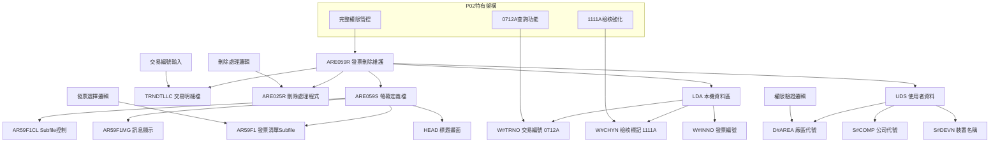
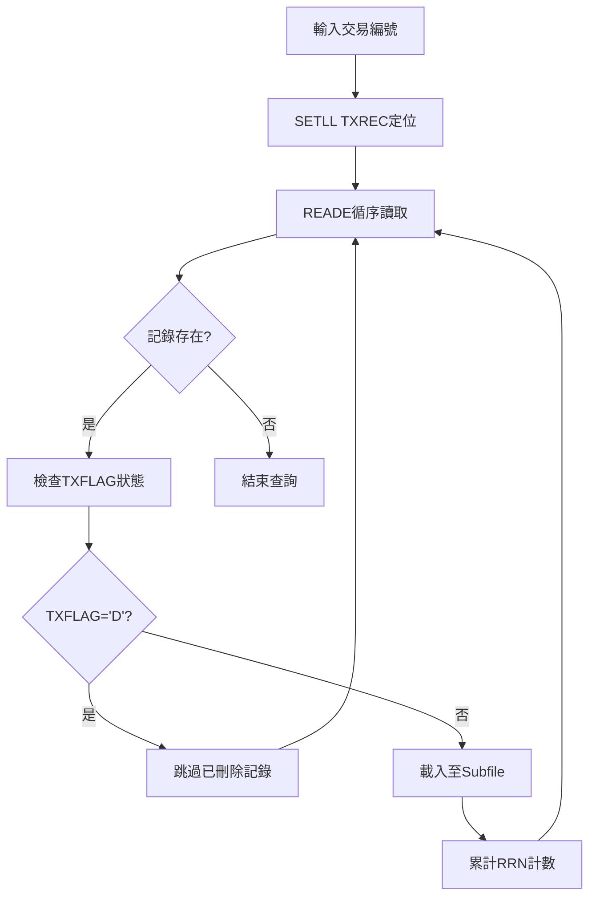
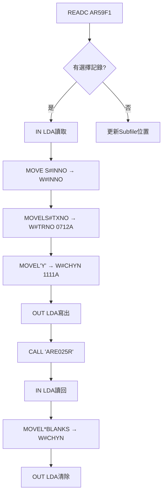
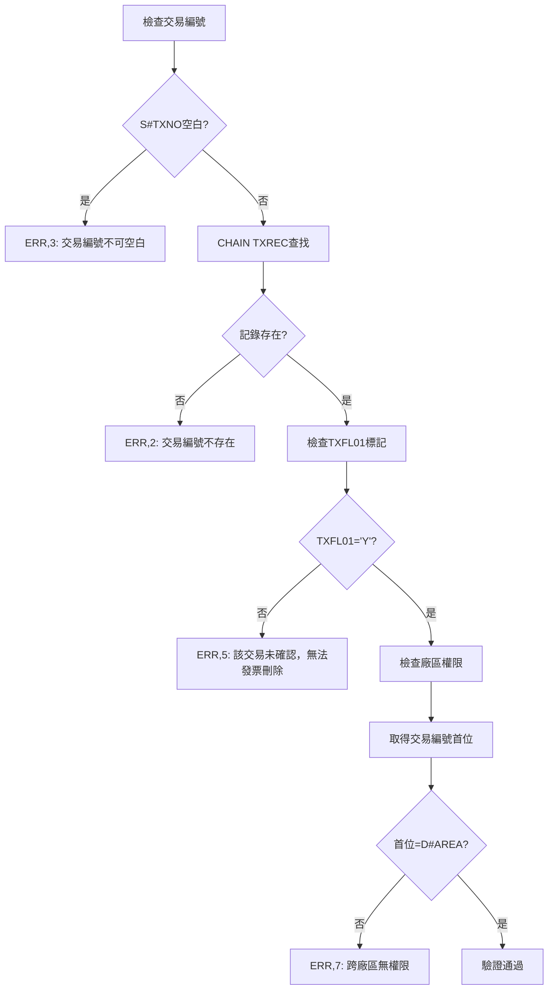
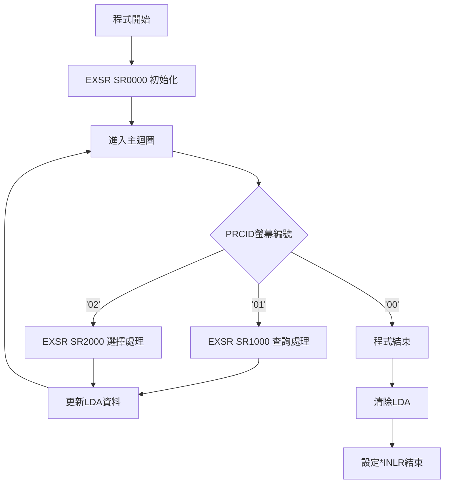
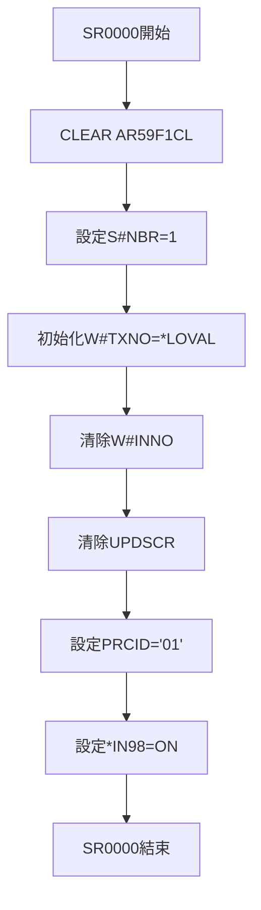
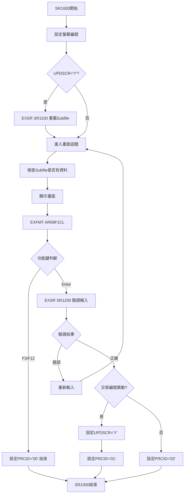
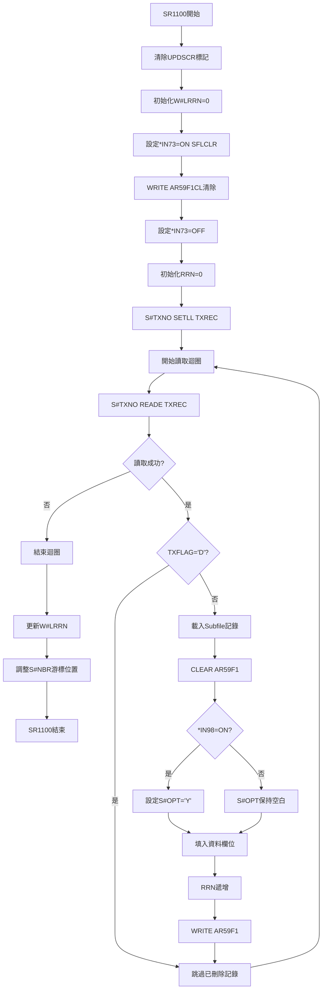
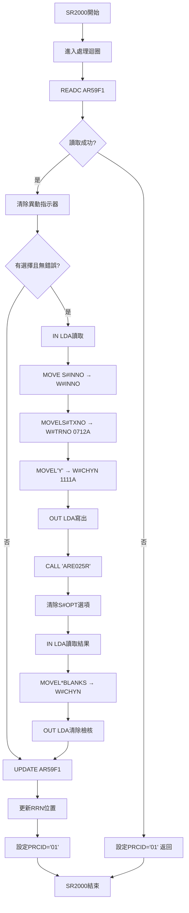
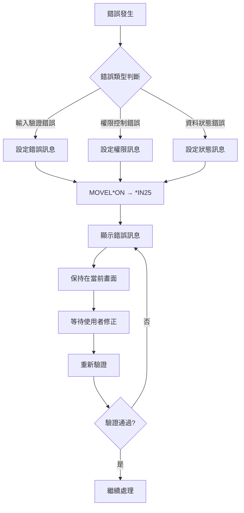

# ARE059R_P02 程式規格書

## 1. 基本資料

| 項目 | 內容 |
|------|------|
| 程式編號 | ARE059R |
| 程式名稱 | 發票刪除維護作業 |
| 程式類型 | RPG/400 |
| 廠區 | P02 |
| 程式用途 | 發票刪除維護作業的查詢選擇介面 |
| 呼叫方式 | 線上互動式作業 |
| 系統名稱 | 應收帳款管理系統 (AR) |
| 子系統 | 發票維護子系統 |
| 程式複雜度 | 中等 (2天) |

## 2. 程式功能說明

### 2.1 主要功能描述
ARE059R 為發票刪除維護作業的查詢選擇介面程式，提供使用者透過交易編號查詢相關發票資料，並選擇要進行刪除維護的發票項目。程式採用Subfile技術展示查詢結果，支援批次選擇功能，並整合ARE025R程式執行實際的刪除處理作業。

### 2.2 核心業務功能

#### 2.2.1 主要功能特色
1. **交易編號查詢**
   - 透過交易編號(TXNO)查詢相關發票
   - 支援廠區權限驗證
   - 自動篩選有效的發票記錄

2. **發票資料展示**
   - Subfile展示發票清單
   - 顯示發票編號、產品名稱、金額、稅額、總額
   - 支援選擇標記 (Y/空白)

3. **批次選擇處理**
   - 支援多筆發票的批次選擇
   - 整合ARE025R進行實際刪除處理
   - 透過LDA傳遞選擇的發票資訊

4. **權限控制機制**
   - 廠區權限驗證
   - 交易記錄狀態檢查
   - 特殊權限功能控制

#### 2.2.2 P02廠區特殊功能 
1. **1111A強化功能** (P02獨有)
   - 新增W#CHYN檢核控制
   - 強化DTAARA錯誤處理
   - 改善權限驗證機制

2. **0712A查詢功能**
   - 新增W#TRNO刪除編號查詢
   - 強化交易記錄追蹤能力

3. **完整權限管控**
   - 依據廠區代號進行存取控制
   - 交易記錄狀態驗證
   - 特殊作業權限檢查

### 2.3 核心業務價值
- **資料維護效率**: 提供直觀的發票選擇介面
- **作業安全性**: 完整的權限控制和狀態驗證
- **系統整合性**: 與ARE025R無縫整合處理
- **使用便利性**: Subfile技術提升操作體驗

## 3. 檔案架構與關聯圖



## 4. 檔案欄位規格說明

### 4.1 主要資料結構分析

#### 4.1.1 LDA (Local Data Area) 結構 - P02特有配置
程式透過LDA進行資料傳遞和狀態管理。

**LDA欄位配置 (P02版本)**:
```
LDA欄位定義:
- 401-410: W#INNO (10字元) - 選擇的發票編號
- 411-418: W#TRNO (8字元)  - 交易編號 (0712A新增)
- 419-419: W#CHYN (1字元)  - 檢核標記 (1111A新增)
- 951-985: S#COMP (35字元) - 公司名稱
- 986-9910: S#SYSD (25字元) - 系統日期
- 1011-1020: S#DEVN (10字元) - 裝置名稱
- 1021-1021: D#AREA (1字元) - 廠區代號
```

#### 4.1.2 Subfile記錄結構 (AR59F1)
```
Subfile欄位定義:
- S#OPT (1字元): 選擇選項 ('Y'=選擇, ' '=不選擇)
- S#INNO (10字元): 發票編號
- S#PDNM (5字元): 產品名稱
- S#AMT (11,0): 發票金額
- S#TAX (11,0): 稅額
- S#TTAL (12,0): 總額 (金額+稅額)
```

#### 4.1.3 螢幕控制結構
```
控制欄位定義:
- S#CSR (5,0): 游標位置記錄
- S#NBR (4,0): Subfile記錄編號
- S#TXNO (8字元): 交易編號輸入欄位
- S#SCRN (10字元): 螢幕編號
- S#ERR (70字元): 錯誤訊息欄位
```

### 4.2 🎯 欄位切割技術詳解

#### 4.2.1 LDA資料區的分段管理
**技術要點**: 透過LDA的不同區段儲存不同性質的資料

```
LDA分段結構 (P02版本):
LDA (1024字元)：[發票資料|交易資料|檢核資料|系統資料|裝置資料]
                 ↓       ↓       ↓       ↓       ↓
401-410: W#INNO  [XXXXXXXXXX]           發票編號區段
411-418: W#TRNO    [XXXXXXXX]           交易編號區段 (0712A)
419-419: W#CHYN      [X]                檢核標記區段 (1111A)
951-985: S#COMP                [35字元] 公司資料區段
1021-1021: D#AREA                      [X] 廠區區段
```

**實際程式應用:**
```
資料傳遞流程:
1. 輸入階段: MOVE S#INNO → W#INNO (儲存選擇的發票)
2. 傳遞階段: OUT LDA (傳遞給ARE025R)
3. 處理階段: ARE025R讀取LDA中的發票資訊
4. 回傳階段: IN LDA (接收處理結果)
5. 清除階段: MOVEL*BLANKS → W#INNO (清除暫存)
```

#### 4.2.2 交易編號的廠區驗證邏輯
```
交易編號結構分析:
S#TXNO (8字元)：[XXXXXXXX]
                 ↓
W#TXN1 (1字元)： [X]      首位字元 = 廠區識別碼

廠區驗證邏輯:
MOVELTXNO → W#TXN1 (取得首位字元)
IF W#TXN1 ≠ D#AREA THEN
    設定錯誤: "該筆交易屬於其他廠區，不可發票刪除"
```

#### 4.2.3 Subfile記錄的金額計算結構
```
金額欄位關聯:
TXAMT (交易金額) + TXTAX (交易稅額) = S#TTAL (顯示總額)

計算邏輯:
Z-ADDTXAMT → S#AMT     (交易金額 → 顯示金額)
Z-ADDTXTAX → S#TAX     (交易稅額 → 顯示稅額)  
TXAMT ADD TXTAX → S#TTAL (計算總額)
```

### 4.3 欄位挪用與多重用途分析

#### 4.3.1 W#TXNO的多階段用途
**原始定義**: 8字元的交易編號工作變數
**程式中的多重用途**:

1. **初始化階段**:
```
MOVEL*LOVAL → W#TXNO (設定為最低值)
用途: 準備進行SETLL定位操作
```

2. **查詢比較階段**:
```
IF S#TXNO ≠ W#TXNO THEN (檢查是否異動)
用途: 判斷使用者是否輸入新的交易編號
```

3. **更新儲存階段**:
```
MOVELS#TXNO → W#TXNO (儲存當前交易編號)
用途: 記錄當前處理的交易編號
```

#### 4.3.2 UPDSCR控制變數的狀態管理
**技術實現**: 單一字元變數控制Subfile更新時機

```
UPDSCR狀態控制:
初始: MOVEL*BLANKS → UPDSCR (空白 = 不更新)
觸發: MOVEL'Y' → UPDSCR (Y = 需要更新)  
重置: MOVE *BLANKS → UPDSCR (處理完成後重置)

應用邏輯:
IF UPDSCR = 'Y' THEN
    EXSR SR1100 (重新載入Subfile)
```

#### 4.3.3 指示器的多重功能控制
```
指示器重複使用策略:
*IN25: 錯誤欄位標亮控制
*IN70: SFLNXTCHG Subfile異動指示
*IN72: SFLDSP Subfile顯示控制
*IN73: SFLCLR Subfile清除控制
*IN98: 預設選擇標記控制
```

## 5. 數據操作與轉換分析

### 5.1 檔案操作詳解

#### 5.1.1 TRNDTLLC檔案的查詢處理

**查詢操作流程:**


**關鍵技術實現:**
```
定位查詢邏輯:
S#TXNO SETLL TXREC (定位至指定交易編號)
DO WHILE *IN52 = *OFF
    S#TXNO READE TXREC (讀取相同交易編號記錄)
    IF TXFLAG = 'D' THEN LEAVE (排除已刪除記錄)
    載入Subfile記錄...
ENDDO
```

#### 5.1.2 Subfile記錄的動態載入

**載入邏輯 (SR1100子程序):**
```
Subfile初始化:
1. MOVE *ON → *IN73 (SFLCLR=ON 清除Subfile)
2. WRITE AR59F1CL (執行清除)
3. MOVE *OFF → *IN73 (SFLCLR=OFF 停止清除)
4. Z-ADD*ZEROS → RRN (重置記錄編號)

記錄載入:
DO WHILE 查詢有效記錄
    CLEAR AR59F1 (清除Subfile記錄)
    IF *IN98 = *ON THEN MOVEL'Y' → S#OPT (預設選擇)
    填入發票資料...
    ADD 1 → RRN (遞增記錄編號)
    WRITE AR59F1 (寫入Subfile記錄)
ENDDO
```

#### 5.1.3 選擇處理的資料傳遞

**LDA資料傳遞 (SR2000子程序):**


### 5.2 數據轉換與計算邏輯

#### 5.2.1 金額欄位的格式轉換
```
TRNDTLLC → Subfile 資料轉換:
TXAMT (Packed Decimal) → S#AMT (Display)
TXTAX (Packed Decimal) → S#TAX (Display)
計算: TXAMT + TXTAX → S#TTAL (總額顯示)

技術實現:
Z-ADDTXAMT → S#AMT (零加法轉換)
Z-ADDTXTAX → S#TAX (零加法轉換)
TXAMT ADD TXTAX → S#TTAL (加法運算)
```

#### 5.2.2 螢幕編號的動態產生
```
螢幕編號生成邏輯:
MOVEASCR,1 → S#SCRN (從訊息檔讀取螢幕名稱)

螢幕控制邏輯:
PRCID = '01': 查詢輸入畫面
PRCID = '02': Subfile處理畫面  
PRCID = '00': 程式結束
```

### 5.3 檢核機制詳解

#### 5.3.1 交易編號驗證 (SR1200子程序)

**驗證流程:**


**驗證程式碼:**
```
基本驗證:
IF S#TXNO = *BLANKS THEN ERR,3
IF CHAIN失敗 THEN ERR,2  
IF TXFL01 ≠ 'Y' THEN ERR,5

廠區驗證:
MOVELTXNO → W#TXN1 (取首位字元)
IF W#TXN1 ≠ D#AREA THEN ERR,7
```

#### 5.3.2 權限控制檢核

**權限檢核邏輯:**
```
廠區權限: 交易編號首位必須匹配使用者廠區
狀態權限: 交易記錄必須已確認 (TXFL01='Y')
刪除權限: 記錄不可已標記刪除 (TXFLAG≠'D')
```

## 6. 螢幕布局與說明

### 6.1 螢幕架構總覽
ARE059R採用單層Subfile架構，提供簡潔的發票選擇介面：

```
螢幕流程架構:
ARE059F1 (交易編號輸入)
    ↓
ARE059F1 (發票清單Subfile) ← RRN KSFILE
    ↓
ARE025R (刪除處理程式)
```

### 6.2 ARE059F1 - 發票刪除維護畫面

```
+----------------------------------------------------------+
|103/04/18  東鋼股份有限公司    發票刪除維護作業  ARE059S-1|
|14:30:25                                        TERMINAL01|
|                                                          |
| 交易編號:[________]                                      |
|                                                          |
| 說明: Y=選取                                             |
|                                                          |
| 選項 發票編號    產品    發票金額    稅額    總計金額    |
| ____ __________ _____ ___________ _______ ____________    |
|  Y   2023P0001  鋼材A    150,000   7,500     157,500    |
|      2023P0002  鋼材B    200,000  10,000     210,000    |
|      2023P0003  配件C     50,000   2,500      52,500    |
|                                                          |
|                                                          |
|                                                          |
|                                                          |
|                                                          |
|                                                          |
|                                                          |
| 錯誤訊息:                                                |
| 操作指示: PF3=結束作業 PF12=返回上層                     |
+----------------------------------------------------------+
```

**主要輸入欄位:**
- S#TXNO: 交易編號 (8字元，必填)

**Subfile顯示欄位:**
- S#OPT: 選擇選項 ('Y'=選取, ' '=不選取)
- S#INNO: 發票編號 (10字元)
- S#PDNM: 產品名稱 (5字元)
- S#AMT: 發票金額 (11位數，千分位顯示)
- S#TAX: 稅額 (11位數，千分位顯示)
- S#TTAL: 總計金額 (12位數，千分位顯示)

### 6.3 Subfile技術規格

**Subfile控制設定:**
```
SFLSIZ(0013): Subfile最大記錄數 13筆
SFLPAG(0012): 每頁顯示記錄數 12筆
SFLNXTCHG: 支援異動標記
SFLCSRRRN(&S#CSR): 游標位置記錄
SFLRCDNBR(CURSOR): 游標所在記錄編號
```

**顯示控制邏輯:**
```
*IN72: SFLDSP控制 - Subfile顯示開關
*IN73: SFLCLR控制 - Subfile清除開關
*IN70: SFLNXTCHG - 異動記錄標記
```

### 6.4 錯誤提示與訊息

**錯誤顯示設定:**
```
S#ERR欄位: 70字元錯誤訊息
顯示位置: 第24行第2列
顯示屬性: 高亮度 (DSPATR(HI))
```

## 7. 處理流程程序說明

### 7.1 主程式流程 (Main Procedure)



### 7.2 初始化處理流程 (SR0000)



**初始化重點處理:**
1. **Subfile控制初始化**: 清除Subfile控制記錄
2. **工作變數初始化**: 設定查詢起始值
3. **螢幕流程初始化**: 設定進入第一畫面
4. **預設值設定**: 啟用預設選擇功能

### 7.3 查詢處理流程 (SR1000)



### 7.4 Subfile載入流程 (SR1100)



### 7.5 選擇處理流程 (SR2000)



## 8. 子程序處理邏輯說明

### 8.1 核心業務子程序

#### 8.1.1 SR0000 - 程式初始化子程序
**功能**: 程式啟動時的完整初始化作業
```
初始化順序:
1. Subfile控制記錄清除
2. 工作變數初始值設定  
3. 螢幕流程控制初始化
4. 預設值和指示器設定
```

#### 8.1.2 SR1000 - 查詢畫面處理子程序
**功能**: 交易編號輸入和查詢結果展示
```
處理邏輯:
1. 螢幕編號設定和顯示
2. Subfile更新判斷處理
3. 使用者輸入接收和驗證
4. 功能鍵處理和流程控制
5. 交易編號異動檢查
```

#### 8.1.3 SR1100 - Subfile載入子程序
**功能**: 根據交易編號載入相關發票資料至Subfile
```
載入流程:
1. Subfile初始化和清除
2. TRNDTLLC檔案定位查詢
3. 記錄過濾和狀態檢查
4. 資料轉換和格式化
5. Subfile記錄寫入
6. 游標位置控制
```

#### 8.1.4 SR1200 - 輸入驗證子程序
**功能**: 交易編號的完整驗證處理
```
驗證項目:
1. 必填欄位檢查
2. 記錄存在性驗證
3. 交易狀態確認 (TXFL01='Y')
4. 廠區權限驗證
5. 錯誤訊息設定
```

#### 8.1.5 SR2000 - 選擇處理子程序
**功能**: Subfile選擇記錄的處理和ARE025R調用
```
處理流程:
1. READC讀取異動記錄
2. 選擇驗證和錯誤檢查
3. LDA資料準備和傳遞
4. ARE025R刪除程式調用
5. 處理結果接收和清理
6. Subfile記錄更新
```

### 8.2 資料處理技術細節

#### 8.2.1 LDA資料傳遞技術
**技術特色**: 透過LDA實現程式間的資料傳遞
```
傳遞流程:
IN LDA → 讀取當前LDA內容
資料設定 → 準備傳遞資料  
OUT LDA → 寫出LDA內容
CALL程式 → 呼叫處理程式
IN LDA → 讀取處理結果
清除資料 → 清理暫存資料
OUT LDA → 寫出清除結果
```

#### 8.2.2 Subfile記錄管理技術
**技術特色**: 動態的Subfile記錄載入和控制
```
記錄管理:
SFLCLR清除 → 清除舊資料
SETLL定位 → 檔案定位
READE循環 → 循序讀取
記錄過濾 → 狀態檢查
格式轉換 → 資料準備
WRITE寫入 → Subfile載入
```

#### 8.2.3 螢幕流程控制技術
**技術特色**: 透過PRCID實現多畫面流程控制
```
流程控制:
PRCID='01' → 查詢輸入畫面
PRCID='02' → 選擇處理畫面
PRCID='00' → 程式結束
```

## 9. 🎯 跨廠區版本分析

### 9.1 三廠區版本比較總覽

| 功能項目 | P02版本 | K02版本 | U01版本 | H05版本 |
|----------|---------|---------|---------|---------|
| 程式行數 | 268行 | 257行 | 259行 | ❌不存在 |
| 1111A檢核功能 | ✅完整實現 | ❌無 | ❌無 | ❌不適用 |
| 0712A查詢功能 | ✅W#TRNO支援 | ✅W#TRNO支援 | ✅W#TRNO支援 | ❌不適用 |
| LDA配置位置 | 401-410 | 401-410 | 391-400 | ❌不適用 |
| 0405A功能 | ❌無 | ❌無 | ✅DTAARA調整 | ❌不適用 |
| 檢核標記功能 | ✅W#CHYN | ❌無 | ❌無 | ❌不適用 |

### 9.2 P02廠區特有功能詳解

#### 9.2.1 1111A檢核強化功能 (P02獨有)
**P02獨有特色:**
```
完整的檢核控制機制:
1. W#CHYN檢核標記 (LDA 419位置)
2. 強化的DTAARA錯誤處理
3. 改善的權限驗證機制
4. 與ARE025R的檢核資料傳遞
```

**實現程式碼分析:**
```
P02版本特有處理:
MOVEL'Y' → W#CHYN     (設定檢核標記)
OUT LDA               (傳遞檢核資訊)
CALL 'ARE025R'        (調用處理程式)
IN LDA               (接收處理結果)
MOVEL*BLANKS → W#CHYN (清除檢核標記)
OUT LDA              (清理LDA資料)
```

**vs 其他廠區:**
```
K02/U01版本缺少:
- W#CHYN欄位定義
- 檢核標記設定邏輯
- 檢核資料清除機制
```

#### 9.2.2 LDA配置差異分析

**P02/K02版本 (標準配置):**
```
LDA欄位配置:
401-410: W#INNO (發票編號)
411-418: W#TRNO (交易編號) - 0712A功能
```

**U01版本 (特殊配置):**
```
LDA欄位配置 (0405A調整):
381-388: W#TRNO (交易編號) - 位置前移
391-400: W#INNO (發票編號) - 位置前移

調整原因: DTAARA 401改為391的系統需求
```

#### 9.2.3 版本演進差異分析

**功能演進時程:**
```
核心功能發展:
103/04/18: 基礎版本 (P02首發)
103/04/22: K02/U01版本發佈
103/05/26: P02 0305A BUG修正
104/05/07: U01 0405A DTAARA調整
107/12/26: 全廠區 0712A查詢功能
111/11/28: P02 1111A檢核強化
```

### 9.3 廠區特化策略分析

#### 9.3.1 P02主導開發策略
**特色**: 作為主要開發和測試廠區
- 最新功能優先實現
- 最完整的檢核機制
- 最詳細的錯誤處理

#### 9.3.2 K02功能跟隨策略  
**特色**: 基本功能同步，特殊功能選擇性導入
- 基礎功能與P02一致
- 0712A查詢功能同步
- 1111A檢核功能未導入

#### 9.3.3 U01獨立適應策略
**特色**: 根據廠區特殊需求調整
- 獨特的LDA配置調整 (0405A)
- 基礎功能保持一致
- 特殊功能選擇性導入

#### 9.3.4 H05排除策略
**特色**: 該廠區未部署此功能
- 可能使用其他替代方案
- 簡化的作業流程
- 不同的發票刪除機制

### 9.4 技術實現差異分析

#### 9.4.1 程式複雜度比較
**P02版本 (268行)**:
```
最高複雜度實現:
- 完整的檢核邏輯
- 詳細的錯誤處理  
- 最新的功能強化
```

**K02版本 (257行)**:
```
標準複雜度實現:
- 基本功能完整
- 核心檢核機制
- 標準錯誤處理
```

**U01版本 (259行)**:
```
特化複雜度實現:
- 適應性調整較多
- 特殊LDA配置
- 廠區特定需求
```

#### 9.4.2 維護性比較
**維護難易度排序**: P02 > U01 > K02
- P02: 功能最完整但維護複雜度最高
- U01: 特殊配置增加維護難度
- K02: 標準化程度最高，維護相對簡單

## 10. 錯誤處理程序說明與訊息清冊

### 10.1 錯誤處理機制架構



### 10.2 完整錯誤訊息清冊

| 錯誤代號 | 錯誤訊息 | 觸發條件 | 處理建議 | 相關子程序 |
|----------|----------|----------|----------|------------|
| ERR,1 | 資料已存在！ | 重複資料檢查 | 確認資料唯一性 | 一般檢核 |
| ERR,2 | 資料不存在！ | CHAIN查詢失敗 | 確認交易編號正確性 | SR1200 |
| ERR,3 | 欄位不可空白！ | S#TXNO=*BLANKS | 必須輸入交易編號 | SR1200 |
| ERR,4 | 請先停用該項設定確認後刪除。 | 設定檢查 | 先停用相關設定 | 業務檢核 |
| ERR,5 | 該項確認未確認，無法發票刪除!! | TXFL01≠'Y' | 交易須先確認才能刪除 | SR1200 |
| ERR,6 | 列印作業完成，請查看!! | 列印完成 | 列印作業成功訊息 | 列印功能 |
| ERR,7 | 該筆交易屬於其他廠區，不可發票刪除。 | 廠區權限不符 | 確認交易編號廠區權限 | SR1200 |
| ERR,8 | 抱歉！您無權使用修改作業功能。 | 修改權限不足 | 聯絡管理員開通權限 | 權限檢查 |
| ERR,9 | 抱歉！您無權使用複製作業功能。 | 複製權限不足 | 聯絡管理員開通權限 | 權限檢查 |
| ERR,10 | 抱歉！您無權使用刪除作業功能。 | 刪除權限不足 | 聯絡管理員開通權限 | 權限檢查 |
| ERR,11 | 抱歉！您無權使用查詢作業功能。 | 查詢權限不足 | 聯絡管理員開通權限 | 權限檢查 |
| ERR,12 | 抱歉！您無權使用列印作業功能。 | 列印權限不足 | 聯絡管理員開通權限 | 權限檢查 |

### 10.3 錯誤處理程序分類

#### 10.3.1 輸入驗證錯誤 (ERR,2-3)
**特色**: 基本資料有效性驗證
```
驗證流程:
使用者輸入 → 格式檢查 → 存在性驗證 → 錯誤提示
```

#### 10.3.2 業務邏輯錯誤 (ERR,1,4-7)
**特色**: 業務規則和狀態驗證
```
業務檢查:
資料狀態 → 確認檢查 → 廠區權限 → 業務規則確認
```

#### 10.3.3 權限控制錯誤 (ERR,8-12)
**特色**: 使用者權限驗證
```
權限驗證:
功能權限 → 廠區權限 → 操作權限 → 錯誤提示
```

#### 10.3.4 成功訊息 (ERR,6)
**特色**: 作業完成確認訊息
```
成功處理:
作業完成 → 結果確認 → 成功訊息顯示
```

### 10.4 錯誤指示器設定機制

```
錯誤指示器對應表:
*IN25: 一般錯誤欄位標亮 (交易編號欄位)
*IN70: SFLNXTCHG異動指示器
*IN72: SFLDSP顯示控制  
*IN73: SFLCLR清除控制
```

**錯誤處理技術實現:**
```
錯誤設定流程:
MOVEL*ON → *IN25    (標亮錯誤欄位)
MOVEAERR,X → S#ERR  (設定錯誤訊息)
GOTO END120         (跳至子程序結束)
```

## 11. 🎯 特殊技術實現說明

### 11.1 LDA資料傳遞技術

#### 11.1.1 LDA分段管理策略
**技術要點**: 透過LDA的不同區段實現程式間資料傳遞

```
LDA區段配置策略:
發票區段 (401-410): 傳遞選擇的發票編號
交易區段 (411-418): 傳遞交易編號 (0712A)
檢核區段 (419-419): 傳遞檢核標記 (1111A)
系統區段 (951-1021): 系統環境資訊
```

**技術實現細節:**
```
資料傳遞流程:
1. IN LDA                 讀取當前LDA狀態
2. MOVE S#INNO → W#INNO   設定發票編號
3. MOVELS#TXNO → W#TRNO   設定交易編號  
4. MOVEL'Y' → W#CHYN      設定檢核標記
5. OUT LDA                寫出傳遞資料
6. CALL 'ARE025R'         調用處理程式
7. IN LDA                 讀取處理結果
8. 清除處理...            清理暫存資料
```

#### 11.1.2 跨廠區LDA配置技術
**技術挑戰**: 不同廠區的LDA配置差異管理

```
配置差異處理:
P02/K02標準配置:
- W#INNO: 401-410
- W#TRNO: 411-418

U01特殊配置 (0405A):
- W#TRNO: 381-388 (提前30位置)
- W#INNO: 391-400 (提前10位置)

技術策略: 各廠區獨立維護LDA配置
```

### 11.2 Subfile處理技術

#### 11.2.1 動態Subfile管理
**技術特色**: 根據查詢結果動態載入Subfile

```
動態載入技術架構:
初始化階段: SFLCLR清除舊資料
查詢階段: SETLL+READE循序讀取
過濾階段: TXFLAG狀態檢查
載入階段: 格式轉換後WRITE記錄
控制階段: RRN和游標位置管理
```

**關鍵技術實現:**
```
Subfile狀態控制:
MOVE *ON → *IN73      (SFLCLR=ON)
WRITE AR59F1CL        (執行清除)
MOVE *OFF → *IN73     (SFLCLR=OFF)

記錄載入控制:
DO WHILE 查詢條件成立
    CLEAR AR59F1      (清除記錄變數)
    填入資料欄位...    (資料轉換)
    ADD 1 → RRN       (遞增記錄號)
    WRITE AR59F1      (寫入Subfile)
ENDDO
```

#### 11.2.2 Subfile選擇處理技術
**技術特色**: READC技術實現批次選擇處理

```
選擇處理技術:
READC循環: 讀取所有異動記錄
選擇檢查: 判斷S#OPT='Y'
錯誤驗證: 檢查S#ERR狀態
資料傳遞: 透過LDA傳遞資料
程式調用: CALL 'ARE025R'
結果處理: UPDATE Subfile記錄
```

### 11.3 檔案存取技術

#### 11.3.1 SETLL+READE查詢技術
**技術亮點**: 高效率的區間查詢處理

```
查詢技術實現:
S#TXNO SETLL TXREC    (定位至交易編號)
DO WHILE *IN52 = *OFF
    S#TXNO READE TXREC (讀取相同編號記錄)
    IF TXFLAG = 'D' THEN LEAVE (排除已刪除)
    處理記錄...
ENDDO

效能優勢:
- 精確定位減少I/O
- 循序讀取提升效率
- 狀態過濾避免無效處理
```

#### 11.3.2 記錄狀態管理技術
**技術特色**: 透過TXFLAG實現軟刪除管理

```
狀態標記系統:
TXFLAG狀態管理:
- 'A': Active (正常記錄)
- 'D': Deleted (已刪除記錄)
- 其他: 各種業務狀態

查詢過濾邏輯:
IF TXFLAG = 'D' THEN LEAVE (排除已刪除記錄)
```

### 11.4 螢幕控制技術

#### 11.4.1 螢幕流程控制技術
**技術特色**: PRCID變數實現多畫面流程控制

```
流程控制架構:
主迴圈: DO UNTIL PRCID = '00'
畫面分派: CASE PRCID
- '01': 查詢輸入處理
- '02': 選擇處理畫面
- '00': 程式結束

流程轉換邏輯:
查詢成功 → PRCID='02'
選擇完成 → PRCID='01'  
程式結束 → PRCID='00'
```

#### 11.4.2 指示器控制技術
**技術特色**: 精確的畫面顯示控制

```
指示器控制策略:
*IN25: 錯誤欄位標亮控制
*IN70: SFLNXTCHG異動標記
*IN72: SFLDSP顯示控制
*IN73: SFLCLR清除控制
*IN98: 預設選擇控制

應用實例:
IF RRN = 0 THEN *IN72 = *ON (無資料時隱藏Subfile)
IF 錯誤發生 THEN *IN25 = *ON (錯誤時標亮欄位)
```

### 11.5 程式碼優化技術

#### 11.5.1 記憶體使用優化
**技術特色**: 有限變數的多重用途使用

```
變數重複使用:
W#TXNO: 查詢輸入 → 比較檢查 → 更新記錄
W#TXN1: 廠區驗證專用暫存變數
UPDSCR: Subfile更新控制標記
```

#### 11.5.2 錯誤處理集中化
**技術特色**: 統一的錯誤處理和訊息管理

```
錯誤處理標準化:
1. MOVELERR,X → S#ERR (設定錯誤訊息)
2. MOVEL*ON → *IN25   (標亮錯誤欄位)
3. GOTO ENDXXX        (跳至子程序結束)
4. 統一的錯誤顯示格式
```

## 12. 使用說明

### 12.1 作業前準備

#### 12.1.1 系統環境確認
```
必要條件檢查:
1. 確認使用者具備P02廠區存取權限
2. 確認ARE025R刪除處理程式可用
3. 確認TRNDTLLC檔案存取權限
4. 確認LDA功能正常運作
```

#### 12.1.2 權限與資料確認
```
權限確認事項:
1. 發票刪除功能權限
2. 交易記錄存取權限
3. 廠區資料處理權限
4. ARE025R程式執行權限

資料準備事項:
1. 確認交易編號有效性
2. 確認交易記錄已確認 (TXFL01='Y')
3. 確認記錄未被刪除 (TXFLAG≠'D')
```

### 12.2 基本操作流程

#### 12.2.1 發票刪除作業流程
```
操作步驟:
1. 執行ARE059R程式
2. 輸入交易編號 (8字元)
3. 按Enter查詢相關發票
4. 系統顯示發票清單
5. 在要刪除的發票前選擇Y
6. 按Enter執行刪除
7. 系統調用ARE025R處理
8. 確認處理結果
9. 按PF3或PF12結束作業
```

#### 12.2.2 查詢結果檢視流程
```
檢視步驟:
1. 輸入交易編號後按Enter
2. 檢視發票清單內容:
   - 發票編號
   - 產品名稱
   - 發票金額
   - 稅額
   - 總計金額
3. 確認要處理的發票項目
4. 進行選擇標記操作
```

#### 12.2.3 錯誤處理流程
```
錯誤處理步驟:
1. 注意螢幕下方錯誤訊息
2. 根據錯誤代號確認問題:
   - ERR,2: 交易編號不存在
   - ERR,3: 交易編號不可空白
   - ERR,5: 交易未確認
   - ERR,7: 廠區權限不符
3. 修正輸入後重新操作
4. 如遇權限問題聯絡管理員
```

### 12.3 進階功能說明

#### 12.3.1 批次選擇功能
**功能目的**: 同時處理多張發票的刪除作業

```
批次操作:
1. 在發票清單中標記多個Y
2. 按Enter執行批次處理
3. 系統逐一調用ARE025R
4. 每筆處理完成後更新狀態
5. 所有選擇項目處理完畢
```

#### 12.3.2 交易編號驗證機制
**功能目的**: 確保操作安全性和資料正確性

```
驗證機制:
1. 交易編號存在性檢查
2. 交易確認狀態檢查 (TXFL01='Y')
3. 廠區權限驗證 (首位字元)
4. 記錄刪除狀態檢查
```

#### 12.3.3 P02特有功能 (1111A)
**功能目的**: 強化的檢核和錯誤處理機制

```
特有功能:
1. W#CHYN檢核標記傳遞
2. 強化的DTAARA錯誤處理
3. 改善的權限驗證機制
4. 與ARE025R的檢核資料整合
```

### 12.4 注意事項與限制

#### 12.4.1 系統限制
```
操作限制:
1. 只能處理已確認的交易記錄
2. 不能跨廠區操作其他廠區交易
3. 已刪除的記錄不會顯示
4. 需要適當的操作權限
```

#### 12.4.2 業務規則
```
重要業務規則:
1. 交易編號首位必須匹配使用者廠區
2. 交易記錄必須處於確認狀態
3. 刪除操作不可復原
4. 需要完整的權限驗證
```

#### 12.4.3 錯誤排除指引
```
常見問題處理:
1. "交易編號不存在" → 確認編號正確性
2. "交易未確認" → 先進行交易確認作業
3. "廠區權限不符" → 確認交易編號廠區歸屬
4. "欄位不可空白" → 必須輸入交易編號
```

### 12.5 最佳實務建議

#### 12.5.1 作業效率提升
```
效率建議:
1. 事先確認交易編號的有效性
2. 批次處理相關的發票項目
3. 定期清理已處理的選擇標記
4. 善用功能鍵快速操作
```

#### 12.5.2 資料安全確保
```
安全控制:
1. 仔細確認要刪除的發票項目
2. 注意廠區權限的正確性
3. 確認交易狀態的適當性
4. 適時檢查處理結果
```

## 備註

### 特殊注意事項

1. **LDA資料傳遞機制**：
   - 透過LDA實現與ARE025R的資料傳遞
   - 發票編號(401-410)、交易編號(411-418)、檢核標記(419)的精確配置
   - 處理完成後需清除LDA暫存資料

2. **交易編號權限驗證**：
   - 交易編號首位字元必須匹配使用者廠區代號
   - 交易記錄必須處於已確認狀態(TXFL01='Y')
   - 已刪除記錄(TXFLAG='D')不會顯示在清單中

3. **Subfile處理特性**：
   - 支援SETLL+READE的高效查詢方式
   - 動態載入發票清單資料
   - 支援批次選擇和逐一處理

4. **P02廠區特有功能**：
   - 1111A檢核強化：W#CHYN檢核標記機制
   - 0712A查詢功能：W#TRNO刪除編號查詢
   - 完整的DTAARA錯誤處理機制

5. **ARE025R程式整合**：
   - 無縫整合刪除處理邏輯
   - 透過CALL方式調用外部處理程式
   - 支援批次處理多筆發票選擇

6. **操作安全控制**：
   - 完整的廠區權限檢查機制
   - 交易狀態驗證確保資料正確性
   - 錯誤處理機制提供清楚的操作指引 