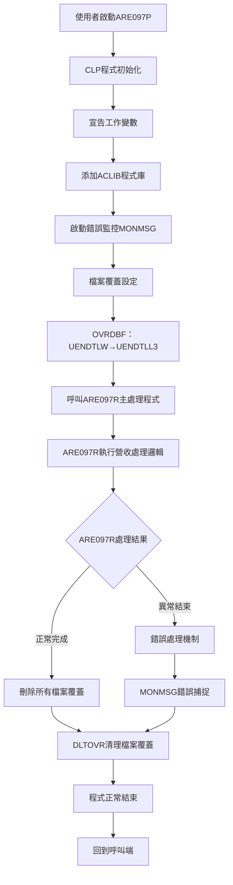
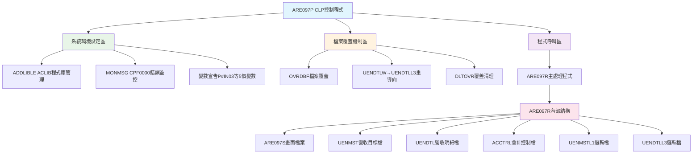
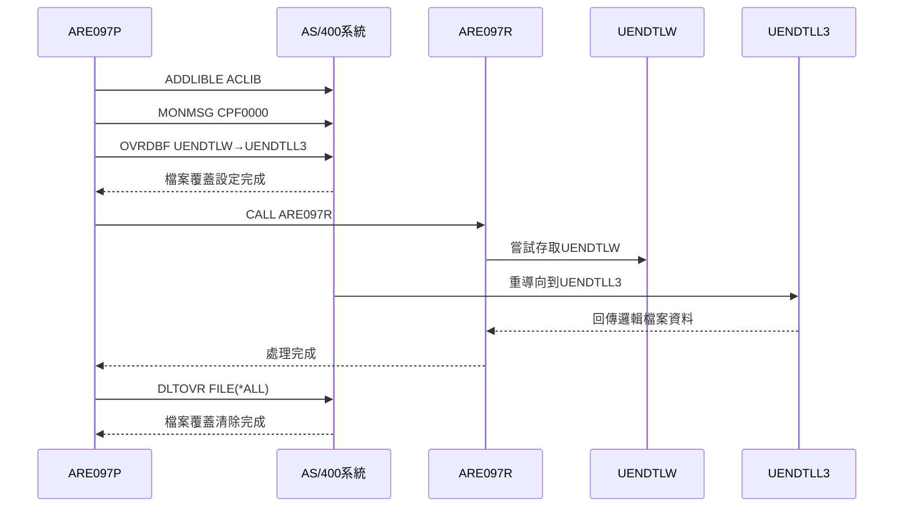
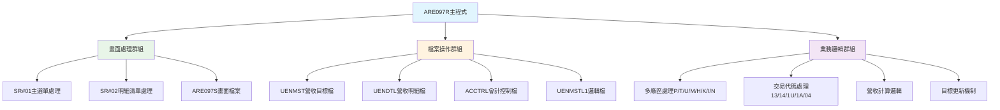
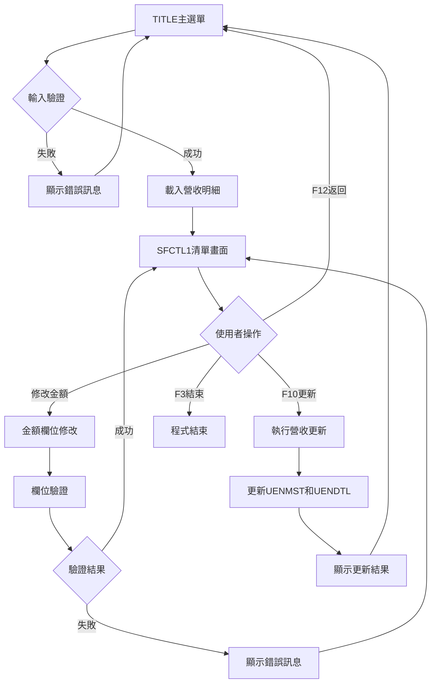
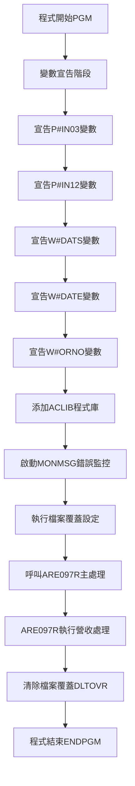
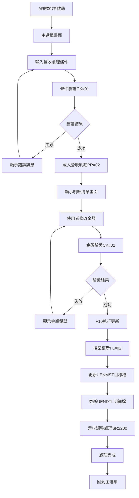
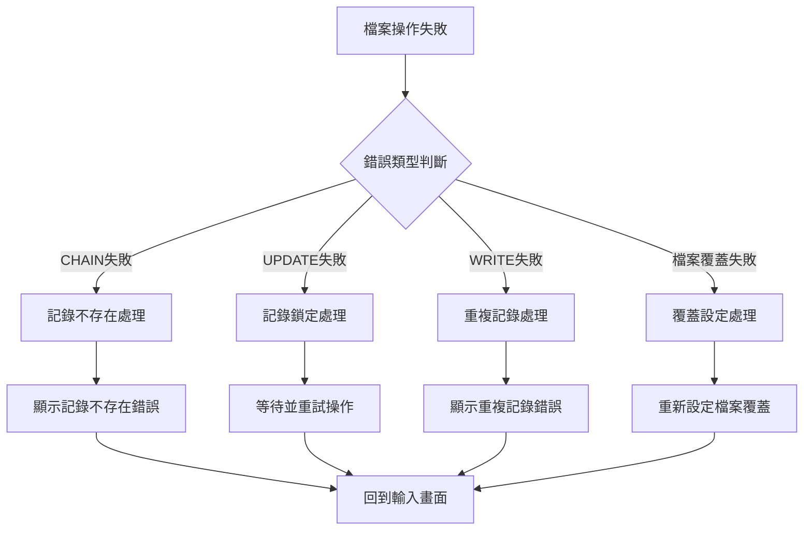

# ARE097P_U01 程式規格書

## 1. 基本資料

| 項目 | 內容 |
|------|------|
| **程式編號** | ARE097P |
| **程式名稱** | 工廠訂單目標每月營收處理作業 |
| **程式類型** | CLP |
| **廠區** | U01 |
| **系統名稱** | 應收帳款系統 |
| **子系統** | 銷貨出貨管理 |
| **檔案位置** | U01CLSRC_THSRC/ARE097P.txt |

## 2. 🎯 程式功能說明

### 主要功能描述
ARE097P為工廠訂單目標每月營收處理作業的控制程式，主要負責工廠各類訂單的月度營收目標計算和處理。此CLP程式透過檔案覆蓋機制、程式庫控制和主處理程式呼叫，提供完整的營收目標管理功能，支援多廠區(P、T、U、M、H、K、I、N)和多種交易代碼(13、14、1U、1A、04)的營收計算處理。

### 🎯 業務流程詳細說明

#### 完整業務流程圖


#### 業務流程關鍵階段說明

1. **程式啟動階段**：
   - CLP程式ARE097P作為營收處理的入口控制程式
   - 初始化營收處理的執行環境
   - 準備必要的工作變數和參數傳遞機制

2. **變數宣告階段**：
   - 宣告P#IN03和P#IN12功能鍵控制變數
   - 宣告W#DATS和W#DATE日期範圍處理變數
   - 宣告W#ORNO訂單號碼處理變數
   - 建立與ARE097R程式的參數介面

3. **系統環境準備階段**：
   - 執行ADDLIBLE ACLIB添加會計程式庫
   - 啟動MONMSG CPF0000全域錯誤監控機制
   - 準備檔案操作和錯誤處理環境

4. **檔案覆蓋設定階段**：
   - 執行OVRDBF FILE(UENDTLW) TOFILE(UENDTLL3)
   - 將營收明細工作檔案覆蓋為邏輯檔案
   - 確保ARE097R使用正確的資料來源
   - 提供靈活的檔案存取機制

5. **主處理程式執行階段**：
   - 呼叫ARE097R執行核心營收處理邏輯
   - 包含營收目標計算、交易代碼處理、廠區管理
   - 執行UENMST和UENDTL檔案的更新作業

6. **資源清理階段**：
   - 執行DLTOVR FILE(*ALL)清除所有檔案覆蓋
   - 恢復原始的檔案存取設定
   - 確保系統環境的乾淨狀態

7. **程式結束階段**：
   - 釋放所有系統資源和暫存資料
   - 回到呼叫端程式或系統選單
   - 完成整個營收處理流程

#### 智能處理邏輯

**檔案覆蓋機制**：
- 透過OVRDBF實現動態檔案重導向
- 將UENDTLW工作檔案映射到UENDTLL3邏輯檔案
- 提供彈性的資料存取控制
- 支援不同環境的檔案配置

**錯誤監控機制**：
- MONMSG CPF0000提供全域錯誤捕捉
- 確保程式異常時的優雅處理
- 維護檔案覆蓋的正確清理
- 提供完整的錯誤恢復機制

**程式庫管理**：
- ADDLIBLE ACLIB動態添加會計程式庫
- 確保ARE097R程式的依賴程式可用
- 提供模組化的程式庫控制
- 支援不同環境的程式庫配置

#### 資料流向分析

**輸入資料流**：
- 使用者透過ARE097R輸入營收目標參數
- 從UENMST讀取現有的營收目標資料
- 從UENDTL系列檔案讀取營收明細資料
- 系統參數和會計期間設定

**處理資料流**：
- ARE097R執行營收目標的計算邏輯
- 多種交易代碼的分類處理
- 廠區別的營收統計和分析
- 檔案間的資料同步和更新

**輸出資料流**：
- 更新的UENMST營收目標檔案
- 更新的UENDTL營收明細檔案
- 營收處理的執行日誌和稽核記錄
- 統計報表和分析結果

## 3. 🎯 檔案架構與關聯圖

### 使用檔案清單
| 檔案名稱 | 檔案類型 | 使用方式 | 說明 |
|----------|----------|----------|------|
| ARE097R | RPG | 程式呼叫 | 主要處理程式，執行營收目標計算邏輯 |
| UENDTLW | PF | 檔案覆蓋 | 營收明細工作檔，被覆蓋為UENDTLL3 |
| UENDTLL3 | LF | 檔案覆蓋 | 營收明細邏輯檔，覆蓋UENDTLW |
| ACLIB | 程式庫 | 程式庫添加 | 會計相關程式庫 |

### 🎯 檔案關聯詳細視覺化圖表


### 🎯 檔案覆蓋機制詳細圖


### 🎯 ARE097R主處理邏輯架構


## 4. 🎯 檔案欄位規格說明

### CLP變數定義

#### 功能鍵控制變數
| 變數名稱 | 型態 | 長度 | 說明 |
|----------|------|------|------|
| P#IN03 | *CHAR | 1 | F3結束功能鍵狀態控制 |
| P#IN12 | *CHAR | 1 | F12返回功能鍵狀態控制 |

#### 日期處理變數
| 變數名稱 | 型態 | 長度 | 說明 |
|----------|------|------|------|
| W#DATS | *CHAR | 8 | 營收計算開始日期工作變數 |
| W#DATE | *CHAR | 8 | 營收計算結束日期工作變數 |

#### 業務資料變數
| 變數名稱 | 型態 | 長度 | 說明 |
|----------|------|------|------|
| W#ORNO | *CHAR | 6 | 訂單號碼工作變數 |

### 🔍 重點欄位切割技術詳解

#### 變數宣告切割視覺化：
```
變數記錄：[型態__|長度_|變數名稱__|用途說明________________]
位置:     001-06 07-09 010-17     018-40
          ↓      ↓     ↓          ↓
功能鍵1:  [*CHAR|1____| &P#IN03___|F3結束功能鍵控制_________]
功能鍵2:  [*CHAR|1____| &P#IN12___|F12返回功能鍵控制________]
日期起:   [*CHAR|8____| &W#DATS___|營收計算開始日期_________]
日期迄:   [*CHAR|8____| &W#DATE___|營收計算結束日期_________]
訂單號:   [*CHAR|6____| &W#ORNO___|訂單號碼工作變數_________]
```

##### 變數宣告切割邏輯說明：
**切割策略**：型態長度分離法，透過DCL指令的結構化參數定義實現精確變數規格控制
**關鍵技術**：
1. **型態標準化**：統一使用*CHAR字元型態，簡化參數傳遞
2. **長度精確化**：根據業務需求精確定義每個變數的儲存長度
3. **命名規範化**：使用前綴(&P#、&W#)區分功能鍵變數和工作變數
4. **用途功能化**：每個變數對應特定的業務功能或介面需求

**宣告邏輯**：
- 功能鍵變數：DCL VAR(&P#IN03) TYPE(*CHAR) LEN(1) - 1字元布林狀態
- 日期工作變數：DCL VAR(&W#DATS) TYPE(*CHAR) LEN(8) - 8字元YYYYMMDD格式
- 業務工作變數：DCL VAR(&W#ORNO) TYPE(*CHAR) LEN(6) - 6字元訂單號碼

#### 檔案覆蓋切割視覺化：
```
覆蓋映射：[原始檔案] → [覆蓋指令] → [目標檔案] = [存取重導向]
階段:     來源檔      重導向       目標檔      實際效果
          ↓           ↓            ↓           ↓
原始:     [UENDTLW]                           營收明細工作檔
指令:                 [OVRDBF]                檔案覆蓋指令
目標:                              [UENDTLL3] 營收明細邏輯檔
結果:                                         [動態重導向] 邏輯檔案存取
```

##### 檔案覆蓋切割邏輯說明：
**切割策略**：檔案抽象層重導向法，透過OVRDBF指令實現檔案存取的動態切換
**重導向機制**：
1. **檔案識別符替換**：UENDTLW → UENDTLL3 的檔案名稱映射
2. **存取路徑切換**：從實體檔案切換到邏輯檔案的不同存取視角
3. **排序機制變更**：邏輯檔案提供預定義的排序和索引結構
4. **過濾條件整合**：邏輯檔案可能包含預設的資料過濾邏輯

**覆蓋邏輯**：
- 指令：OVRDBF FILE(UENDTLW) TOFILE(UENDTLL3)
- 作用：所有程式內對UENDTLW的檔案操作實際指向UENDTLL3
- 範圍：影響ARE097R程式中的所有檔案存取操作
- 清理：DLTOVR FILE(*ALL) 恢復原始檔案設定

#### 程式庫管理切割視覺化：
```
程式庫：[指令____] + [程式庫名] = [程式庫路徑]
組合:   動作指令    目標庫      存取路徑
        ↓           ↓           ↓
指令:   [ADDLIBLE]              程式庫添加指令
程式庫:             [ACLIB]     會計系統程式庫
結果:                           [程式庫清單擴展] ACLIB加入搜尋路徑
```

##### 程式庫管理切割邏輯說明：
**切割策略**：動態程式庫路徑擴展法，透過ADDLIBLE指令實現程式庫搜尋路徑的動態管理
**管理架構**：
1. **路徑擴展**：將ACLIB添加到當前作業的程式庫清單
2. **依賴解析**：確保ARE097R及其依賴程式的可用性
3. **模組化支援**：支援會計系統的模組化程式組織
4. **作業範圍**：影響整個作業的程式庫搜尋順序

**管理邏輯**：
- 指令：ADDLIBLE ACLIB
- 作用：將會計程式庫ACLIB添加到程式庫清單
- 目的：確保ARE097R程式能夠找到所需的依賴程式和服務程式
- 範圍：影響整個作業的程式呼叫和物件搜尋

#### 錯誤監控切割視覺化：
```
監控設定：[監控指令] + [錯誤類型] = [全域監控]
組合:     動作指令    錯誤範圍    監控範圍
          ↓           ↓           ↓
指令:     [MONMSG]                錯誤監控指令
錯誤類型:             [CPF0000]   所有CPF錯誤類型
結果:                             [全域錯誤捕捉] 程式級錯誤處理
```

##### 錯誤監控切割邏輯說明：
**切割策略**：全域錯誤捕捉法，透過MONMSG指令實現程式級的錯誤監控和處理
**監控機制**：
1. **錯誤類型通配**：CPF0000涵蓋所有CPF開頭的系統錯誤
2. **全域監控範圍**：影響程式中所有後續的指令執行
3. **優雅錯誤處理**：防止程式因系統錯誤而異常終止
4. **資源清理保證**：確保DLTOVR能夠執行，清理檔案覆蓋

**監控邏輯**：
- 指令：MONMSG CPF0000
- 作用：監控所有CPF開頭的系統錯誤訊息
- 處理：遇到錯誤時繼續執行，不中斷程式流程
- 保護：確保檔案覆蓋清理等關鍵操作能夠執行

#### 程式呼叫切割視覺化：
```
程式呼叫：[呼叫指令] + [目標程式] = [程式執行]
組合:     動作指令    程式名稱    執行控制
          ↓           ↓           ↓
指令:     [CALL]                  程式呼叫指令
程式:                 [ARE097R]   營收處理主程式
結果:                             [程式執行] 營收處理邏輯執行
```

##### 程式呼叫切割邏輯說明：
**切割策略**：單一責任委派法，透過CALL指令將核心處理邏輯委派給專門的RPG程式
**委派機制**：
1. **功能分離**：CLP負責環境設定，RPG負責業務邏輯
2. **資源準備**：在呼叫前完成檔案覆蓋和程式庫設定
3. **執行控制**：透過CALL實現程式間的流程控制
4. **狀態傳遞**：透過宣告的變數實現程式間的狀態共享

**呼叫邏輯**：
- 指令：CALL PGM(ARE097R)
- 前置：ADDLIBLE、MONMSG、OVRDBF環境準備
- 執行：ARE097R執行營收目標處理的核心邏輯
- 後置：DLTOVR清理檔案覆蓋設定

#### 資源清理切割視覺化：
```
清理操作：[清理指令] + [清理範圍] = [環境恢復]
組合:     動作指令    清理目標    恢復狀態
          ↓           ↓           ↓
指令:     [DLTOVR]                檔案覆蓋清理指令
範圍:                 [FILE(*ALL)] 所有檔案覆蓋
結果:                             [環境恢復] 原始檔案設定恢復
```

##### 資源清理切割邏輯說明：
**切割策略**：全域資源清理法，透過DLTOVR指令確保程式結束時的環境乾淨
**清理機制**：
1. **全域清理**：FILE(*ALL)清除所有活動的檔案覆蓋設定
2. **狀態恢復**：恢復到程式執行前的原始檔案存取狀態
3. **資源釋放**：釋放OVRDBF指令佔用的系統資源
4. **環境隔離**：防止檔案覆蓋影響後續的程式執行

**清理邏輯**：
- 指令：DLTOVR FILE(*ALL)
- 範圍：清除所有檔案覆蓋設定
- 時機：程式執行完畢後，確保環境乾淨
- 重要性：防止檔案覆蓋設定洩漏到其他程式

### 🎯 檔案覆蓋機制分析

#### OVRDBF覆蓋設定
```
覆蓋指令：OVRDBF FILE(UENDTLW) TOFILE(UENDTLL3)

覆蓋目的：
- 將工作檔案UENDTLW重導向到邏輯檔案UENDTLL3
- 提供不同的資料存取路徑和排序方式
- 支援多重檔案結構的彈性存取
- 實現檔案層級的抽象化

影響範圍：
- 所有對UENDTLW的檔案操作
- ARE097R程式的檔案存取邏輯
- 資料讀取的順序和過濾條件
- 檔案更新的目標檔案
```

#### 程式庫管理機制
```
程式庫指令：ADDLIBLE ACLIB

添加目的：
- 提供會計相關程式和功能的存取
- 確保ARE097R依賴程式的可用性
- 支援模組化的程式組織結構
- 實現程式庫的動態管理

管理範圍：
- 會計系統相關的程式和服務程式
- 共用的程式庫和資料區域
- 系統工具和公用程式
- 外部程式的呼叫依賴
```

### 🎯 ARE097R主處理程式規格概要

#### 主要檔案操作
| 檔案名稱 | 檔案類型 | 使用方式 | 主要用途 |
|----------|----------|----------|----------|
| ARE097S | DSPF | 畫面顯示 | 營收目標處理操作介面 |
| UENMST | PF | 更新 | 營收目標主檔 |
| UENMSTL1 | LF | 查詢 | 營收目標邏輯檔 |
| UENDTLL3 | LF | 更新 | 營收明細邏輯檔(覆蓋檔) |
| UENDTLW | PF | 更新 | 營收明細工作檔 |
| ACCTRL | PF | 查詢 | 會計期間控制檔 |

#### 支援的廠區代碼
| 廠區代碼 | 廠區說明 | 處理狀態 |
|----------|----------|----------|
| P | P廠區 | 支援 |
| T | T廠區 | 支援 |
| U | U廠區 | 支援 |
| M | M廠區 | 支援 |
| H | H廠區 | 支援 |
| K | K廠區 | 支援 |
| I | I廠區 | 支援 |
| N | N廠區 | 支援 |

#### 支援的交易代碼
| 交易代碼 | 交易說明 | 特殊處理 |
|----------|----------|----------|
| 13 | 交易類型13 | 標準營收處理 |
| 14 | 交易類型14 | 標準營收處理 |
| 1U | 交易類型1U | 標準營收處理 |
| 1A | 交易類型1A | 廠區限制處理 |
| 04 | 交易類型04 | 特殊營收處理 |

### 🎯 關鍵欄位分析

#### 營收目標檔案(UENMST)關鍵欄位
| 欄位名稱 | 長度 | 型態 | 說明 |
|----------|------|------|------|
| UNYM | 6P | 數值 | 營收年月 |
| UNAREA | 1A | 字元 | 廠區代碼 |
| UNCUNO | 6A | 字元 | 客戶代號 |
| UNTRCD | 2A | 字元 | 交易代碼 |
| UNPDNM | 5A | 字元 | 產品名稱 |
| UNSTNO | 4A | 字元 | 規格編號 |
| UNAMT | 數值 | 數值 | 營收金額 |
| UNQTY | 數值 | 數值 | 營收數量 |
| UNFLAG | 1A | 字元 | 處理標記 |

#### 營收明細檔案(UENDTL)關鍵欄位
| 欄位名稱 | 長度 | 型態 | 說明 |
|----------|------|------|------|
| UVYM | 6P | 數值 | 營收年月 |
| UVAREA | 1A | 字元 | 廠區代碼 |
| UVCUNO | 6A | 字元 | 客戶代號 |
| UVTRCD | 2A | 字元 | 交易代碼 |
| UVPDNM | 5A | 字元 | 產品名稱 |
| UVSTNO | 4A | 字元 | 規格編號 |
| UVAMT | 數值 | 數值 | 明細金額 |
| UVQTY | 數值 | 數值 | 明細數量 |
| UVUPRC | 數值 | 數值 | 單價 |
| UVTAX | 數值 | 數值 | 稅額 |
| UVFLAG | 1A | 字元 | 處理標記 |
| UVNO | 8A | 字元 | 單據號碼 |
| UVVRNO | 8A | 字元 | 憑證號碼 |

## 5. 🎯 輸出/入螢幕布局

### CLP程式流程示意

```
+----------------------------------------------------------+
|                   ARE097P CLP控制程式                    |
|                                                          |
|  ┌─────────────────────────────────────────────────────┐  |
|  │               變數宣告區                             │  |
|  │  DCL VAR(&P#IN03) TYPE(*CHAR) LEN(1)               │  |
|  │  DCL VAR(&P#IN12) TYPE(*CHAR) LEN(1)               │  |
|  │  DCL VAR(&W#DATS) TYPE(*CHAR) LEN(8)               │  |
|  │  DCL VAR(&W#DATE) TYPE(*CHAR) LEN(8)               │  |
|  │  DCL VAR(&W#ORNO) TYPE(*CHAR) LEN(6)               │  |
|  └─────────────────────────────────────────────────────┘  |
|                           ↓                              |
|  ┌─────────────────────────────────────────────────────┐  |
|  │              系統環境設定                            │  |
|  │         ADDLIBLE ACLIB                              │  |
|  │         MONMSG CPF0000                              │  |
|  └─────────────────────────────────────────────────────┘  |
|                           ↓                              |
|  ┌─────────────────────────────────────────────────────┐  |
|  │              檔案覆蓋設定                            │  |
|  │   OVRDBF FILE(UENDTLW) TOFILE(UENDTLL3)            │  |
|  │     [將工作檔重導向到邏輯檔]                         │  |
|  └─────────────────────────────────────────────────────┘  |
|                           ↓                              |
|  ┌─────────────────────────────────────────────────────┐  |
|  │              主處理程式呼叫                          │  |
|  │          CALL PGM(ARE097R)                          │  |
|  │     [執行營收目標處理主要功能]                       │  |
|  └─────────────────────────────────────────────────────┘  |
|                           ↓                              |
|  ┌─────────────────────────────────────────────────────┐  |
|  │              資源清理                                │  |
|  │         DLTOVR FILE(*ALL)                           │  |
|  │       [清除所有檔案覆蓋設定]                         │  |
|  └─────────────────────────────────────────────────────┘  |
|                           ↓                              |
|                      程式結束                            |
+----------------------------------------------------------+
```

### ARE097R主要畫面配置概要

#### 主選單輸入畫面(TITLE)
```
+----------------------------------------------------------+
|  YY/MM/DD      東鋼鋼鐵股份有限公司              ARE097S-1 |
|                **工廠訂貨與月營收作業**          DEVNAME  |
|                                                          |
|                                                          |
|                                                          |
|                                                          |
|                                                          |
|                      年月月份: [______]                  |
|                                                          |
|                      來源廠區: [X]                       |
|                      交易代碼: [XX]                      |
|                      往來廠商: [______]                  |
|                      規  格: [____] (空白表示全部)       |
|                                                          |
|                                                          |
|                                                          |
|                                                          |
|                                                          |
|                                                          |
|  [錯誤訊息顯示區域]                                      |
|  ENTER:確認    PF03:結束                                 |
+----------------------------------------------------------+
```

#### 營收明細清單畫面(SFCTL1)
```
+----------------------------------------------------------+
|  YY/MM/DD      東鋼鋼鐵股份有限公司              ARE097S-2 |
|                **工廠訂貨與月營收作業**          DEVNAME  |
|                                                          |
|                                                          |
|  年月: [YY/MM]  廠區: [X]  交易代碼: [XX]  往來廠商: [______] |
|                                          規格: [____]    |
|  -------------------------------------------------------- |
|  項次  規格   產品名稱    數量       總金額             |
|  -------------------------------------------------------- |
|  [__] [____] [_____] [_______] [_________]               |
|  [__] [____] [_____] [_______] [_________]               |
|  [__] [____] [_____] [_______] [_________]               |
|  [__] [____] [_____] [_______] [_________]               |
|  [__] [____] [_____] [_______] [_________]               |
|  [__] [____] [_____] [_______] [_________]               |
|  [__] [____] [_____] [_______] [_________]               |
|  [__] [____] [_____] [_______] [_________]               |
|  [__] [____] [_____] [_______] [_________]               |
|  [__] [____] [_____] [_______] [_________]               |
|  [__] [____] [_____] [_______] [_________]               |
|  [__] [____] [_____] [_______] [_________]               |
|  -------------------------------------------------------- |
|                      合計: [_______] [_________]         |
|  [錯誤訊息顯示區域]                                      |
|  ENTER:檢核  PF03:結束  PF10:更新  PF12:返回主畫面     |
+----------------------------------------------------------+
```

### 🎯 畫面流程控制

#### 畫面轉換邏輯


#### 功能鍵控制邏輯
| 功能鍵 | 畫面位置 | 處理邏輯 | 系統行為 |
|--------|----------|----------|----------|
| **F3** | 所有畫面 | 結束作業 | 回到呼叫程式或系統選單 |
| **F10** | 清單畫面 | 執行更新 | 更新營收目標和明細檔案 |
| **F12** | 清單畫面 | 返回主畫面 | 回到主選單輸入畫面 |
| **ENTER** | 主選單 | 確認輸入 | 驗證條件並載入明細 |
| **ENTER** | 清單畫面 | 檢核資料 | 驗證修改的金額資料 |

## 6. 🎯 處理流程程序說明

### 🎯 CLP主程序邏輯分析

#### 程式執行流程圖


#### 🎯 詳細處理步驟逐一分析

**步驟1：程式初始化**
- 執行PGM指令啟動CLP程式
- 建立營收處理的執行環境
- 準備變數宣告和檔案操作架構

**步驟2：變數宣告階段**
- 宣告P#IN03功能鍵控制變數，TYPE(*CHAR) LEN(1)
- 宣告P#IN12功能鍵控制變數，TYPE(*CHAR) LEN(1)
- 宣告W#DATS日期範圍變數，TYPE(*CHAR) LEN(8)
- 宣告W#DATE日期範圍變數，TYPE(*CHAR) LEN(8)
- 宣告W#ORNO訂單號碼變數，TYPE(*CHAR) LEN(6)

**步驟3：程式庫環境設定**
- 執行ADDLIBLE ACLIB添加會計程式庫
- 確保ARE097R程式依賴的程式和服務程式可用
- 提供會計相關功能的程式庫支援

**步驟4：錯誤監控啟動**
- 執行MONMSG CPF0000啟動全域錯誤監控
- 捕捉所有可能的系統錯誤和異常
- 確保程式異常時的優雅處理

**步驟5：檔案覆蓋設定**
- 執行OVRDBF FILE(UENDTLW) TOFILE(UENDTLL3)
- 將營收明細工作檔案重導向到邏輯檔案
- 提供彈性的檔案存取路徑

**步驟6：主處理程式呼叫**
- 執行CALL PGM(ARE097R)呼叫主處理程式
- ARE097R執行營收目標的核心計算邏輯
- 處理多廠區和多交易代碼的營收資料

**步驟7：資源清理**
- 執行DLTOVR FILE(*ALL)清除所有檔案覆蓋
- 恢復原始的檔案存取設定
- 確保系統環境的清潔

**步驟8：程式結束**
- 執行ENDPGM指令結束CLP程式
- 釋放所有系統資源
- 回到呼叫端程式

### 🎯 ARE097R主處理邏輯概要

#### 主要子程序結構
| 子程序名稱 | 功能說明 | 觸發條件 |
|------------|----------|----------|
| SR#01 | 主選單處理 | SCRN='1' |
| SR#02 | 明細清單處理 | SCRN='2' |
| KC#01 | F3結束處理 | *IN03='1' |
| KJ#02 | F10更新處理 | *IN10='1' |
| CK#01 | 主選單驗證 | 輸入條件檢查 |
| CK#02 | 明細資料驗證 | 明細金額檢查 |
| PR#02 | 子檔案初始化 | 載入營收明細 |
| SR2100 | 明細資料載入 | 從UENMST讀取 |
| SR2200 | 營收調整處理 | 金額差異處理 |
| FL#02 | 檔案更新控制 | 執行更新作業 |

#### 營收處理業務邏輯流程


### 🎯 關鍵處理邏輯

#### 多廠區支援機制
- 支援8個廠區：P、T、U、M、H、K、I、N
- 每個廠區獨立的營收目標管理
- 廠區別的交易代碼限制檢查
- 確保不同廠區間資料的隔離性

#### 交易代碼處理邏輯
- 支援5種交易代碼：13、14、1U、1A、04
- 1A交易代碼有特殊的廠區限制
- 不同交易代碼的營收計算規則
- 交易代碼與產品類別的關聯處理

#### 營收計算機制
- 營收金額 = 數量 × 單價
- 稅額 = 營收金額 × 0.05 (5%稅率)
- 支援金額調整和差異處理
- 提供營收目標與實際的比較分析

#### 會計期間控制
- 從ACCTRL檔案讀取會計期間設定
- 確保處理的年月在開放期間內
- 支援期間的開放和關閉控制
- 提供期間狀態的檢查機制

## 7. 🎯 數據操作與轉換分析

### CLP變數資料型態分析

#### 字元型變數處理
```
功能鍵變數處理：
P#IN03, P#IN12 = TYPE(*CHAR) LEN(1)
用於儲存功能鍵的ON/OFF狀態
與ARE097R程式的指示器配合使用

日期變數處理：
W#DATS, W#DATE = TYPE(*CHAR) LEN(8)
儲存YYYYMMDD格式的日期資料
支援營收處理的日期範圍控制

訂單變數處理：
W#ORNO = TYPE(*CHAR) LEN(6)
儲存6位數的訂單號碼
作為營收關聯的業務鍵值
```

#### 檔案覆蓋機制分析
```
OVRDBF檔案覆蓋：
FILE(UENDTLW) → TOFILE(UENDTLL3)
將實體工作檔案重導向到邏輯檔案
提供不同的資料存取順序和過濾
實現檔案層級的抽象化存取

覆蓋效果：
- ARE097R對UENDTLW的所有操作自動重導向
- 使用UENDTLL3的索引和過濾條件
- 提供更有效率的資料存取路徑
- 支援不同環境的檔案配置需求
```

### ARE097R檔案操作分析

#### 讀取操作
```
UENMST目標檔案讀取：
CHAIN操作：隨機存取特定營收目標記錄
SETLL + READE：範圍查詢相同條件記錄
READ操作：循序讀取營收目標資料

UENDTL明細檔案讀取：
SETLL + READE：讀取相關營收明細
條件過濾：年月、廠區、客戶、產品
數量金額累計：統計總營收數據
```

#### 更新操作
```
UENMST目標檔案更新：
建立新記錄：WRITE新的營收目標
修改現有記錄：UPDATE營收金額
設定處理標記：UNFLAG處理狀態

UENDTL明細檔案更新：
金額調整：UPDATE明細金額和稅額
單價重算：金額/數量計算單價
處理標記：UVFLAG設定處理狀態
```

### 資料轉換邏輯

#### 日期格式轉換
```
系統日期轉換：
*DATE - 19000000 = 民國年格式
YYYYMM年月格式處理
支援會計期間的日期範圍控制
```

#### 營收計算轉換
```
營收金額計算：
總金額 = 數量 × 單價
稅額 = 金額 × 0.05 (5%稅率)
差異調整 = 目標金額 - 實際金額
比例分配 = 差異金額 / 明細筆數
```

#### 廠區代碼處理
```
廠區代碼轉換：
單字元廠區代碼：P/T/U/M/H/K/I/N
廠區權限控制：不同廠區的存取限制
交易代碼限制：特定廠區的交易限制
```

### 計算邏輯分析

#### 營收統計計算
```
數量統計：
總數量 = ΣS#QTY (各明細數量加總)
平均數量 = 總數量 / 明細筆數

金額統計：
總金額 = ΣS#AMT (各明細金額加總)
平均金額 = 總金額 / 明細筆數
```

#### 差異調整計算
```
金額差異處理：
原始差異 = 目標金額 - 實際金額
調整金額 = 差異金額 × 分配比例
新金額 = 原金額 + 調整金額
新稅額 = 新金額 × 0.05
```

### 檢核機制詳解

#### 輸入資料檢核
```
年月檢核：97≤年度≤9999, 1≤月份≤12
廠區檢核：必須為P/T/U/M/H/K/I/N其中之一
交易代碼檢核：必須為13/14/1U/1A/04其中之一
客戶代號檢核：不可空白，必須存在於系統中
```

#### 業務邏輯檢核
```
營收資料檢核：
金額必須大於0
不可修改已開立發票的營收明細
不可修改已傳送憑證的營收明細

期間控制檢核：
處理年月必須在會計開放期間內
已關帳期間不允許修改營收資料
```

#### 檔案存在性檢核
```
目標檔案檢核：
檢查UENMST營收目標記錄存在性
確保有對應的明細資料可處理

明細檔案檢核：
驗證UENDTL明細記錄的完整性
檢查憑證號碼和發票號碼狀態
```

## 8. 🎯 錯誤處理程序說明

### 🎯 CLP層級錯誤處理

#### 程式呼叫失敗處理
| 錯誤狀況 | 處理方式 | 預防措施 |
|----------|----------|----------|
| **ARE097R程式不存在** | 1. MONMSG捕捉程式未找到錯誤<br>2. 顯示程式不存在訊息<br>3. 清理檔案覆蓋設定<br>4. 異常結束CLP程式 | 確保ARE097R程式存在於程式庫中 |
| **ACLIB程式庫不存在** | 1. ADDLIBLE失敗時顯示錯誤<br>2. 嘗試使用預設程式庫<br>3. 記錄程式庫問題<br>4. 繼續執行但功能受限 | 檢查ACLIB程式庫的可用性和路徑 |
| **檔案覆蓋設定失敗** | 1. OVRDBF失敗時中止處理<br>2. 顯示檔案覆蓋錯誤訊息<br>3. 不呼叫ARE097R程式<br>4. 直接跳到清理階段 | 確保目標檔案UENDTLL3存在且可存取 |

#### 檔案操作錯誤處理
| 錯誤狀況 | 處理方式 | 復原機制 |
|----------|----------|----------|
| **UENDTLW檔案不存在** | 1. 檔案覆蓋時顯示錯誤<br>2. 建議檢查檔案路徑<br>3. 提供檔案建立指引<br>4. 中止處理流程 | 自動建立遺失的工作檔案 |
| **UENDTLL3邏輯檔案問題** | 1. 檢查邏輯檔案定義<br>2. 重建邏輯檔案索引<br>3. 驗證基礎實體檔案<br>4. 重新設定檔案覆蓋 | 提供邏輯檔案重建機制 |
| **檔案鎖定衝突** | 1. MONMSG捕捉鎖定錯誤<br>2. 等待檔案釋放<br>3. 重試檔案操作<br>4. 顯示系統忙碌訊息 | 實施檔案鎖定的超時和重試機制 |

### 🎯 ARE097R詳細錯誤代碼清冊

| 錯誤代碼 | 錯誤訊息 | 原因說明 | 處理方式 | 預防措施 |
|----------|---------|---------|---------|----------|
| **ERR,1** | 年月輸入錯誤! | 年月格式不正確或超出範圍 | 1. 設定IN41='1'啟動年月欄位錯誤<br>2. 顯示有效年月範圍97-9999<br>3. 提供年月格式說明<br>4. 要求重新輸入正確年月 | 提供年月輸入的格式檢查和範例 |
| **ERR,2** | 廠區輸入錯誤! | 廠區代碼不在允許範圍內 | 1. 設定IN42='1'啟動廠區欄位錯誤<br>2. 顯示有效廠區代碼清單<br>3. 說明各廠區的對應關係<br>4. 提供廠區選擇輔助 | 提供廠區代碼的下拉選單或驗證表 |
| **ERR,3** | 交易代碼輸入錯誤! | 交易代碼不在支援範圍內 | 1. 設定IN43='1'啟動交易代碼錯誤<br>2. 顯示支援的交易代碼清單<br>3. 說明各交易代碼的業務意義<br>4. 檢查廠區與交易代碼的相容性 | 建立交易代碼與廠區的相容性檢查表 |
| **ERR,5** | 廠商編號不可空白! | 客戶代號欄位為空白 | 1. 設定IN44='1'啟動客戶欄位錯誤<br>2. 要求輸入有效的客戶代號<br>3. 提供客戶代號查詢功能<br>4. 檢查客戶代號的存在性 | 明確標示客戶代號為必填欄位 |
| **ERR,6** | 金額不可小於或等於零! | 營收金額輸入不合理 | 1. 設定IN51='1'啟動金額欄位錯誤<br>2. 要求輸入大於0的金額<br>3. 提供金額輸入格式說明<br>4. 檢查金額的合理性範圍 | 實施金額的最小值和最大值檢查 |
| **ERR,7** | 資料不存在! | 查詢條件沒有找到對應資料 | 1. 顯示無資料訊息<br>2. 建議調整查詢條件<br>3. 提供資料存在的條件範例<br>4. 檢查基礎資料的完整性 | 提供資料存在性的預檢查機制 |
| **ERR,8** | 該產品已經開立發票資料已傳送，不可更新處理! | 已開立發票不可修改 | 1. 顯示發票狀態限制訊息<br>2. 說明已開立發票的影響<br>3. 建議使用其他處理方式<br>4. 提供發票狀態查詢功能 | 在修改前檢查發票開立狀態 |
| **ERR,9** | 該年度已過帳，請與系統人員聯絡! | 會計期間已關閉 | 1. 設定IN41='1'年月欄位錯誤<br>2. 顯示期間關閉狀態<br>3. 建議聯絡系統管理員<br>4. 提供期間狀態查詢功能 | 實施會計期間狀態的即時檢查 |
| **ERR,10** | 該產品已經傳送憑證，不可更新處理! | 已傳送憑證不可修改 | 1. 顯示憑證狀態限制訊息<br>2. 說明已傳送憑證的限制<br>3. 建議檢查憑證處理狀態<br>4. 提供憑證狀態查詢功能 | 在修改前檢查憑證傳送狀態 |
| **ERR,11** | 交易代碼1A，I廠不可使用! | 特定廠區交易代碼限制 | 1. 設定IN42和IN43錯誤指示器<br>2. 說明廠區交易代碼限制<br>3. 建議使用其他交易代碼<br>4. 提供廠區規則說明 | 建立廠區與交易代碼的相容性規則表 |

### 🎯 系統異常處理邏輯

#### 檔案操作失敗處理


#### 營收計算異常處理
- 金額計算溢位時使用高精度算術
- 稅額計算錯誤時重新計算
- 數量為0時避免除以0的錯誤
- 提供計算結果的合理性檢查

#### 會計期間控制異常
- 期間檢查失敗時提供期間狀態說明
- 期間關閉時禁止所有修改操作
- 期間轉換時提供過渡期間的處理
- 支援緊急期間開放的特殊處理

#### 多廠區處理異常
- 廠區權限檢查失敗時顯示權限說明
- 廠區資料隔離異常時提供恢復機制
- 交叉廠區操作時的安全性檢查
- 廠區設定變更時的影響評估

## 9. 🎯 備註

### 🎯 特殊注意事項

#### 檔案覆蓋機制依賴性
ARE097P依賴OVRDBF檔案覆蓋機制將UENDTLW重導向到UENDTLL3，此機制的正確運作對程式功能至關重要，任何檔案路徑或權限問題都可能導致處理失敗。

#### 會計期間控制限制
程式受到ACCTRL會計控制檔案的期間限制，已關閉的會計期間不允許進行任何營收資料修改，此限制確保會計資料的完整性但可能影響營運彈性。

#### 多廠區交易代碼限制
交易代碼1A在I廠區不可使用，這是業務規則的硬性限制，修改此限制需要同步調整相關的驗證邏輯和業務流程。

#### ACLIB程式庫依賴性
程式依賴ACLIB會計程式庫的可用性，此程式庫包含會計相關的程式和服務程式，程式庫不可用時會影響部分功能的正常執行。

#### 營收計算精確度限制
營收金額和稅額計算使用有限精度算術，可能產生微小的計算誤差，建議定期進行營收資料的平衡檢查確保準確性。

#### 發票和憑證狀態控制
已開立發票或已傳送憑證的營收資料不可修改，此控制確保憑證資料的一致性，但可能需要特殊的調整機制處理例外情況。

#### 檔案鎖定競爭問題
多使用者同時存取UENMST和UENDTL檔案時可能發生鎖定競爭，建議實施適當的等待和重試機制避免處理失敗。

#### 資料同步一致性要求
UENMST營收目標檔和UENDTL營收明細檔必須保持資料同步，任一檔案更新失敗都可能導致資料不一致，需要實施完整的事務處理機制。

#### 廠區權限安全性控制
不同廠區間的資料必須嚴格隔離，跨廠區的資料存取需要特殊授權，確保各廠區營收資料的安全性和隱私性。

#### 年月格式相容性限制
程式使用民國年格式(97-9999)，西元年轉換時需要注意格式相容性，特別是跨世紀的年份處理需要額外驗證。 