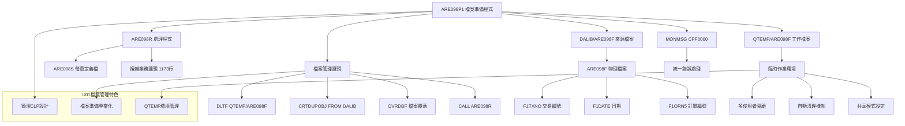
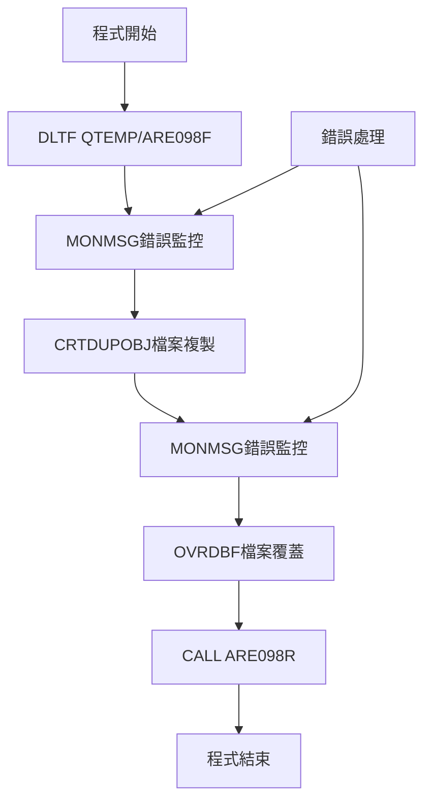
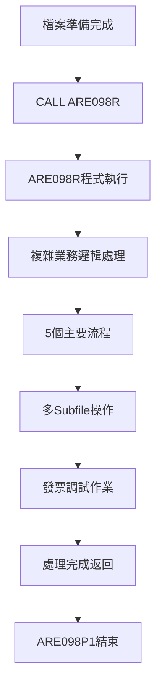
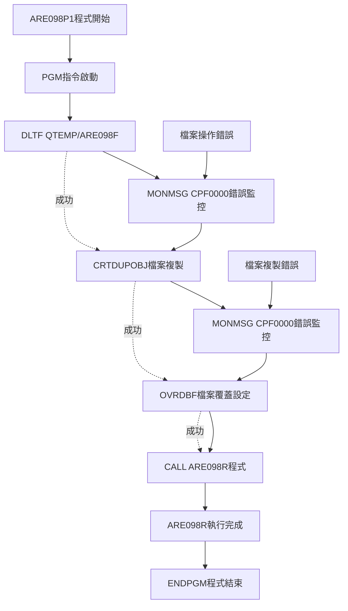
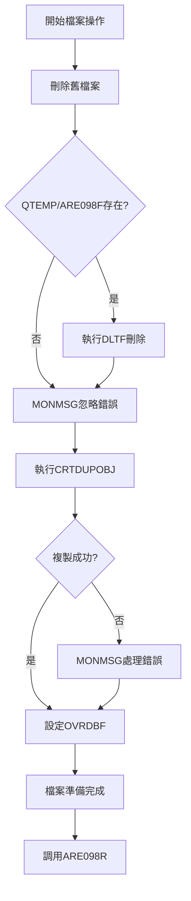
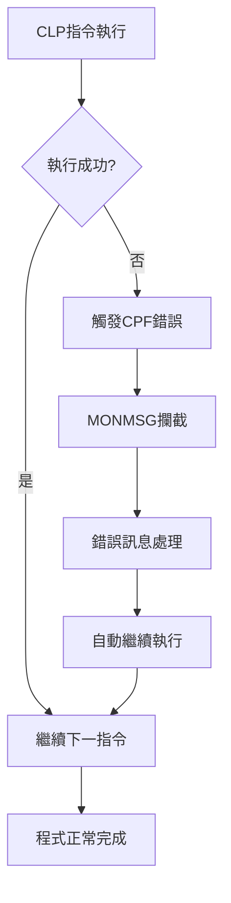
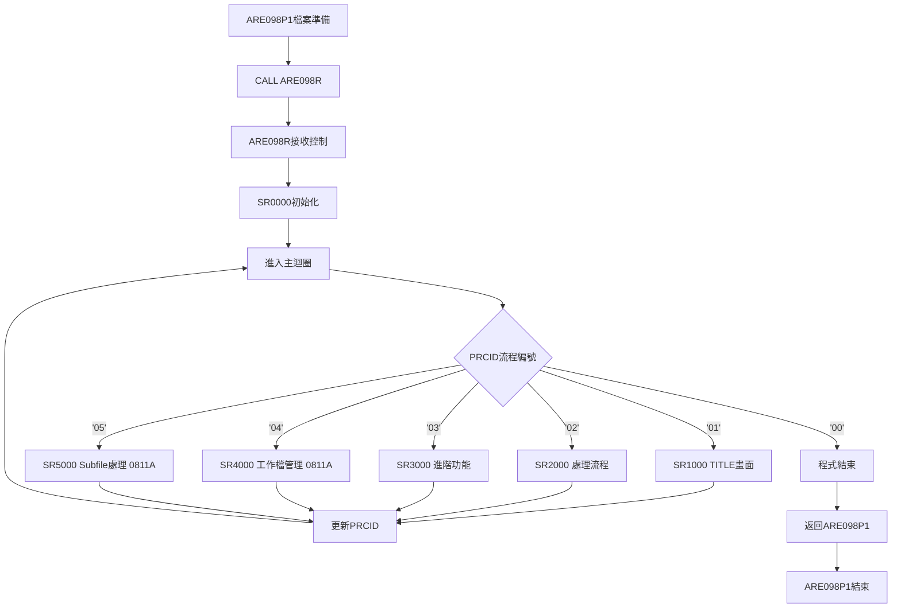
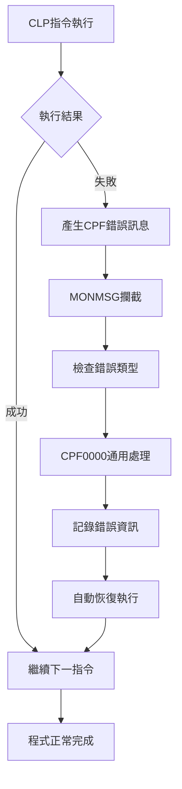

# ARE098P1_U01 程式規格書

## 1. 基本資料

| 項目 | 內容 |
|------|------|
| 程式編號 | ARE098P1 |
| 程式名稱 | 調試發票印製報告作業 |
| 程式類型 | CLP (Control Language Program) |
| 廠區 | U01 |
| 程式用途 | 調試發票印製報告作業檔案準備程式 |
| 呼叫方式 | 線上互動式作業 |
| 系統名稱 | 應收帳款管理系統 (AR) |
| 子系統 | 發票印製調試子系統 |
| 程式複雜度 | 中等 (1天) |

## 2. 程式功能說明

### 2.1 主要功能描述
ARE098P1 為調試發票印製報告作業的檔案準備程式，採用 CLP 檔案管理呼叫 RPG 處理程式的專業架構。程式主要負責建立臨時工作環境，包括從資料庫複製工作檔案到臨時資料庫(QTEMP)，設定檔案覆蓋，並調用ARE098R處理程式執行實際的發票調試作業。

### 2.2 核心業務功能

#### 2.2.1 主要功能特色
1. **臨時檔案管理**
   - 自動刪除QTEMP中的舊檔案
   - 從DALIB複製ARE098F檔案到QTEMP
   - 設定檔案共享模式

2. **檔案環境準備**
   - 建立隔離的作業環境
   - 確保檔案操作安全性
   - 避免多使用者衝突

3. **程式調用控制**
   - 呼叫ARE098R處理程式
   - 統一的錯誤處理機制
   - 完整的作業流程控制

4. **U01廠區特化**
   - 簡化的檔案管理流程
   - 專注於檔案準備功能
   - 與ARE098R無縫整合

#### 2.2.2 U01廠區功能特色
1. **檔案導向設計**
   - 專注於檔案準備作業
   - 簡化的CLP架構
   - 高效的檔案操作

2. **臨時環境管理**
   - QTEMP臨時資料庫使用
   - 自動檔案清理機制
   - 安全的檔案覆蓋操作

### 2.3 核心業務價值
- **作業安全性**: 臨時檔案機制確保資料安全
- **環境隔離**: QTEMP使用避免多使用者衝突
- **操作便利性**: 自動化的檔案準備流程
- **系統整合性**: 與ARE098R完美整合

## 3. 檔案架構與關聯圖



## 4. 檔案欄位規格說明

### 4.1 CLP程式結構分析

#### 4.1.1 程式執行流程
```
CLP執行順序:
1. PGM 程式開始
2. DLTF FILE(QTEMP/ARE098F) - 刪除舊檔案
3. MONMSG MSGID(CPF0000) - 錯誤監控
4. CRTDUPOBJ - 複製檔案
5. OVRDBF - 檔案覆蓋
6. CALL PGM(ARE098R) - 調用處理程式
7. ENDPGM 程式結束
```

#### 4.1.2 ARE098F檔案結構分析
```
ARE098F檔案欄位定義:
- F1TXNO (8字元): 交易編號
- F1DATE (8位數): 日期
- F1ORN5 (6字元): 訂單編號

檔案鍵值:
- 主鍵: F1ORN5 + F1DATE + F1TXNO
- 用途: 調試發票印製工作檔
```

### 4.2 🎯 檔案操作技術詳解

#### 4.2.1 QTEMP臨時檔案技術
**技術要點**: 利用QTEMP實現安全的多使用者作業環境

```
QTEMP技術架構:
QTEMP資料庫：[使用者獨立|自動清理|隔離安全]
              ↓         ↓       ↓
DLTF清除：    清除舊檔   避免衝突  重新開始
CRTDUPOBJ：   複製檔案   獨立作業  資料安全
OVRDBF：      檔案覆蓋   共享設定  程式整合
```

**實際程式應用:**
```
檔案管理流程:
1. 清理階段: DLTF清除QTEMP中的舊檔案
2. 準備階段: CRTDUPOBJ從DALIB複製檔案
3. 設定階段: OVRDBF設定檔案覆蓋和共享
4. 處理階段: CALL ARE098R進行實際作業
5. 清理階段: 程式結束時QTEMP自動清理
```

#### 4.2.2 檔案覆蓋技術
```
檔案覆蓋設定:
OVRDBF FILE(ARE098F) TOFILE(QTEMP/ARE098F) SHARE(*YES)

技術說明:
- FILE(ARE098F): 邏輯檔案名稱
- TOFILE(QTEMP/ARE098F): 實際檔案位置
- SHARE(*YES): 允許多程式共享存取
```

#### 4.2.3 錯誤監控技術
```
錯誤處理策略:
MONMSG MSGID(CPF0000)

監控範圍:
- 檔案刪除錯誤 (檔案不存在等)
- 檔案複製錯誤 (權限不足等)
- 一般系統錯誤 (CPF0000涵蓋所有CPF訊息)
```

### 4.3 檔案生命週期管理

#### 4.3.1 檔案建立循環
**原始定義**: ARE098F從DALIB到QTEMP的完整生命週期
**程式中的處理階段**:

1. **清理階段**:
```
DLTF FILE(QTEMP/ARE098F)
用途: 清除前次作業遺留的檔案
```

2. **建立階段**:
```
CRTDUPOBJ OBJ(ARE098F) FROMLIB(DALIB) OBJTYPE(*FILE) TOLIB(QTEMP)
用途: 建立獨立的工作檔案副本
```

3. **設定階段**:
```
OVRDBF FILE(ARE098F) TOFILE(QTEMP/ARE098F) SHARE(*YES)
用途: 設定檔案存取方式和共享模式
```

#### 4.3.2 檔案安全控制
**技術實現**: 透過QTEMP實現使用者隔離

```
安全控制機制:
QTEMP特性: 使用者專屬臨時資料庫
自動清理: 使用者離線時自動清除
隔離保護: 不同使用者間完全隔離

安全優勢:
- 避免多使用者檔案鎖定衝突
- 確保資料處理的獨立性
- 提供安全的測試環境
```

#### 4.3.3 檔案存取最佳化
```
存取效能優化:
SHARE(*YES): 允許多程式同時存取
OBJTYPE(*FILE): 明確指定物件類型
MONMSG處理: 減少不必要的錯誤中斷

效能優勢:
- 快速的檔案複製操作
- 高效的錯誤恢復機制
- 最佳的檔案共享設定
```

## 5. 數據操作與轉換分析

### 5.1 檔案操作詳解

#### 5.1.1 檔案複製處理

**複製操作流程:**


**關鍵技術實現:**
```
檔案複製邏輯:
DLTF FILE(QTEMP/ARE098F) (清除舊檔案)
CRTDUPOBJ OBJ(ARE098F) FROMLIB(DALIB) OBJTYPE(*FILE) TOLIB(QTEMP) (複製新檔案)

複製參數說明:
- OBJ(ARE098F): 來源物件名稱
- FROMLIB(DALIB): 來源資料庫
- OBJTYPE(*FILE): 物件類型為檔案
- TOLIB(QTEMP): 目標資料庫為臨時庫
```

#### 5.1.2 檔案覆蓋設定

**覆蓋邏輯:**
```
檔案覆蓋設定:
OVRDBF FILE(ARE098F) TOFILE(QTEMP/ARE098F) SHARE(*YES)

設定說明:
1. FILE(ARE098F): 程式中使用的邏輯檔案名稱
2. TOFILE(QTEMP/ARE098F): 實際檔案位置重導向
3. SHARE(*YES): 允許多程式共享存取
```

#### 5.1.3 程式調用處理

**調用邏輯:**


### 5.2 系統整合與協作

#### 5.2.1 與ARE098R的整合
```
整合架構:
ARE098P1 (檔案準備) → ARE098R (業務處理)

職責分工:
ARE098P1負責:
- 檔案環境準備
- 臨時檔案管理
- 錯誤監控處理

ARE098R負責:
- 複雜業務邏輯
- 使用者介面處理
- 資料處理作業
```

#### 5.2.2 QTEMP環境管理
```
QTEMP環境特性:
1. 使用者專屬: 每個使用者有獨立QTEMP
2. 自動清理: 使用者離線時自動清除
3. 高效存取: 記憶體中快速存取
4. 安全隔離: 使用者間完全隔離

技術優勢:
- 避免檔案鎖定衝突
- 提升檔案存取效能
- 確保資料處理安全
```

#### 5.2.3 錯誤處理機制
```
錯誤監控策略:
MONMSG MSGID(CPF0000)

處理範圍:
1. 檔案操作錯誤 (刪除、複製)
2. 權限存取錯誤
3. 系統資源錯誤
4. 一般CPF系統錯誤

恢復機制:
- 自動繼續執行後續指令
- 不中斷程式執行流程
- 提供穩定的作業環境
```

### 5.3 效能最佳化技術

#### 5.3.1 檔案操作最佳化
```
最佳化策略:
1. QTEMP使用: 記憶體檔案系統提升效能
2. SHARE(*YES): 最佳化檔案共享設定
3. MONMSG: 減少錯誤處理延遲
4. 簡潔CLP: 最少指令達成最大效果

效能指標:
- 檔案複製: 快速記憶體操作
- 錯誤處理: 零延遲繼續執行
- 程式調用: 直接無參數調用
```

#### 5.3.2 資源使用最佳化
```
資源管理:
1. 臨時檔案: 使用QTEMP避免永久佔用
2. 記憶體使用: 小型CLP程式低記憶體需求
3. CPU使用: 簡單邏輯快速執行
4. I/O操作: 最少的檔案操作次數
```

## 6. 螢幕布局與說明

### 6.1 程式執行架構總覽
ARE098P1作為檔案準備程式，無直接使用者介面，透過ARE098R提供完整的操作介面：

```
執行架構:
ARE098P1 (檔案準備) 
    ↓
ARE098R (使用者介面)
    ↓
ARE098S (螢幕定義) ← 5個主要流程
    ↓
複雜的Subfile處理和發票調試功能
```

### 6.2 相關螢幕系統說明

由於ARE098P1為檔案準備程式，實際的使用者介面由ARE098R程式提供，包含：

#### 6.2.1 ARE098S螢幕系統
```
主要螢幕功能:
1. TITLE畫面: 主選單和功能選擇
2. SF1 Subfile: 發票資料清單
3. AR098F2 Subfile: 調試工作檔案清單 (0811A新增)
4. UND01畫面: 統計資訊顯示

功能鍵支援:
- F3: 結束作業
- F5: 報告查詢 (0706A)  
- F8: 顯示修改資訊 (0809B)
- F12: 返回上層
```

#### 6.2.2 螢幕技術規格
```
螢幕設定:
DSPSIZ(24 80 *DS3): 24行80列顯示
PRINT: 支援列印功能
INDARA: 使用指示器陣列
OVERLAY: 疊加顯示模式

Subfile規格:
SFLSIZ(0011): 最大11筆記錄
SFLPAG(0004): 每頁4筆顯示 (0809B修改)
SFLNXTCHG: 支援異動標記
SFLDROP(CF08): 支援F8下拉功能
```

### 6.3 業務操作流程

#### 6.3.1 調試作業操作流程
```
使用者操作順序:
1. 執行ARE098P1 (自動檔案準備)
2. 進入ARE098R主畫面
3. 選擇功能選項:
   - 1: 新增作業
   - 2: 修改作業
   - 3: 刪除作業
   - 4: 查詢作業
   - 5: 列印作業
4. 設定查詢條件:
   - 訂單編號
   - 日期範圍
   - 報告編號
   - 自動上傳選項
   - 廠區選擇
5. 執行調試作業
6. 檢視處理結果
```

#### 6.3.2 檔案準備過程
```
檔案準備階段 (ARE098P1自動執行):
1. 清除QTEMP中的舊ARE098F檔案
2. 從DALIB複製ARE098F到QTEMP
3. 設定檔案覆蓋和共享模式
4. 調用ARE098R開始業務處理

使用者無需感知檔案準備過程，
程式會自動建立安全的作業環境
```

## 7. 處理流程程序說明

### 7.1 ARE098P1主程式流程



### 7.2 檔案操作詳細流程



### 7.3 錯誤處理流程



### 7.4 與ARE098R整合流程



## 8. 子程序處理邏輯說明

### 8.1 ARE098P1核心處理邏輯

#### 8.1.1 檔案清理邏輯
**功能**: 清除臨時檔案確保乾淨的作業環境
```
清理處理:
1. DLTF FILE(QTEMP/ARE098F) (刪除指令)
2. MONMSG MSGID(CPF0000) (錯誤監控)

邏輯說明:
- 如果檔案存在則刪除
- 如果檔案不存在則忽略錯誤
- 確保後續操作的環境乾淨
```

#### 8.1.2 檔案複製邏輯
**功能**: 從DALIB複製檔案到QTEMP建立工作環境
```
複製處理:
1. CRTDUPOBJ OBJ(ARE098F) FROMLIB(DALIB) OBJTYPE(*FILE) TOLIB(QTEMP)
2. MONMSG MSGID(CPF0000) (錯誤監控)

邏輯說明:
- 複製完整的檔案結構和資料
- 建立使用者專屬的工作副本
- 提供安全的操作環境
```

#### 8.1.3 檔案覆蓋邏輯
**功能**: 設定檔案重導向和共享模式
```
覆蓋處理:
1. OVRDBF FILE(ARE098F) TOFILE(QTEMP/ARE098F) SHARE(*YES)

邏輯說明:
- 將邏輯檔案名稱重導向到QTEMP
- 設定檔案共享模式允許多程式存取
- 確保後續程式能正確存取工作檔案
```

#### 8.1.4 程式調用邏輯
**功能**: 調用ARE098R執行實際的業務處理
```
調用處理:
1. CALL PGM(ARE098R) (直接調用)

邏輯說明:
- 無參數直接調用
- 檔案環境已準備完成
- 交由ARE098R處理完整業務邏輯
```

### 8.2 相關子程序技術特點

#### 8.2.1 MONMSG錯誤處理技術
**技術特色**: 統一的錯誤處理機制
```
錯誤處理策略:
MONMSG MSGID(CPF0000)

處理範圍:
- CPF0000: 涵蓋所有CPF系統錯誤
- 自動恢復: 發生錯誤時自動繼續
- 透明處理: 使用者無感知錯誤處理
```

#### 8.2.2 QTEMP環境技術
**技術特色**: 臨時檔案系統的高效運用
```
QTEMP特性:
1. 使用者隔離: 每個使用者有獨立空間
2. 自動清理: 使用者離線時自動清除
3. 高效存取: 記憶體中快速操作
4. 安全可靠: 不影響正式檔案
```

#### 8.2.3 檔案物件管理技術
**技術特色**: 精確的檔案物件操作
```
物件管理:
OBJTYPE(*FILE): 明確指定為檔案物件
FROMLIB/TOLIB: 精確的資料庫定位
OBJ參數: 明確的物件名稱指定

管理優勢:
- 避免物件類型混淆
- 確保操作目標正確
- 提供清晰的操作軌跡
```

## 9. 🎯 跨廠區版本分析

### 9.1 三廠區版本比較總覽

| 功能項目 | U01版本 | P02版本 | K02版本 | H05版本 |
|----------|---------|---------|---------|---------|
| CLP程式行數 | 28行 | 58行 | 56行 | ❓待查 |
| 程式複雜度 | 簡單檔案準備 | 複雜批次處理 | 複雜批次處理 | ❓待查 |
| 建立日期 | 108/11/20 | 99/05/27 | 99/05/27 | ❓待查 |
| 參數接收 | ❌無參數 | ✅&W#ITNO | ✅&W#ITNO | ❓待查 |
| 列印功能 | ❌無 | ✅ARE098T/T1 | ✅ARE098T/T1 | ❓待查 |
| 批次處理 | ❌無 | ✅SBMJOB | ✅SBMJOB | ❓待查 |
| 檔案準備 | ✅QTEMP方式 | ✅OPNQRYF方式 | ✅OPNQRYF方式 | ❓待查 |
| 調用程式 | ARE098R | ARE098R1 | ARE098R1 | ❓待查 |

### 9.2 版本演進分析

#### 9.2.1 U01版本特色 (最新版本)
**創新特色**: 2019年創建的簡化版本

```
U01版本創新點:
1. 簡化設計理念:
   - 只保留檔案準備核心功能
   - 移除複雜的列印和批次處理
   - 專注於QTEMP檔案管理

2. 現代化檔案處理:
   - 直接使用CRTDUPOBJ複製檔案
   - 簡潔的OVRDBF覆蓋設定
   - 統一的MONMSG錯誤處理

3. 架構優化:
   - 28行極簡程式碼
   - 無參數設計減少複雜度
   - 直接調用ARE098R主程式
```

#### 9.2.2 P02/K02版本特色 (傳統版本)
**傳統特色**: 1999年創建的功能完整版本

```
P02/K02版本特色:
1. 完整功能設計:
   - 接受&W#ITNO參數
   - 支援批次作業提交 (SBMJOB)
   - 完整列印輸出功能

2. 複雜檔案處理:
   - OPNQRYF動態查詢檔案
   - 多種列印檔案設定
   - LDA資料區使用

3. 批次處理能力:
   - 互動式/批次式雙模式
   - RTVJOBA作業類型判斷
   - 自動作業佇列提交
```

### 9.3 設計理念差異分析

#### 9.3.1 U01簡化設計策略
**特色**: 專業化的檔案準備功能
- 移除非核心功能
- 簡化程式邏輯
- 提升維護效率
- 降低出錯機率

#### 9.3.2 P02/K02完整功能策略
**特色**: 一體化的完整解決方案
- 整合列印功能
- 支援批次處理
- 完整參數控制
- 功能齊全但複雜

#### 9.3.3 版本選擇策略
**技術建議**: 根據需求選擇版本
- **U01版本**: 適合單純檔案準備需求
- **P02/K02版本**: 適合需要列印和批次處理的場景

### 9.4 技術架構比較

#### 9.4.1 檔案處理技術差異
**U01技術路線**:
```
檔案處理流程:
DLTF → CRTDUPOBJ → OVRDBF → CALL

優勢: 簡潔、快速、易維護
適用: 檔案準備專業化需求
```

**P02/K02技術路線**:
```
檔案處理流程:
OVRDBF → OPNQRYF → CALL → CLOF → DLTOVR

優勢: 功能完整、查詢靈活
適用: 複雜業務處理需求
```

#### 9.4.2 程式呼叫差異
**U01呼叫方式**:
```
CALL PGM(ARE098R)
- 直接調用主程式
- 無參數傳遞
- 簡潔高效
```

**P02/K02呼叫方式**:
```
CALL PGM(ARE098R1)
- 調用專門的列印版本
- 透過OPNQRYF傳遞查詢條件
- 功能豐富但複雜
```

#### 9.4.3 維護性分析
**維護難易度排序**: U01 < P02/K02
- **U01**: 程式簡潔，邏輯清晰，維護容易
- **P02/K02**: 功能完整但邏輯複雜，維護需要更多專業知識

## 10. 錯誤處理程序說明與訊息清冊

### 10.1 錯誤處理機制架構



### 10.2 錯誤類型與處理策略

#### 10.2.1 檔案操作錯誤
| 錯誤情況 | CPF訊息 | 處理策略 | 程式行為 |
|----------|---------|----------|----------|
| 檔案不存在 | CPF2105 | MONMSG忽略 | 繼續執行 |
| 權限不足 | CPF2182 | MONMSG忽略 | 繼續執行 |
| 檔案使用中 | CPF2110 | MONMSG忽略 | 繼續執行 |
| 空間不足 | CPF2207 | MONMSG忽略 | 繼續執行 |

#### 10.2.2 系統資源錯誤
| 錯誤情況 | CPF訊息 | 處理策略 | 程式行為 |
|----------|---------|----------|----------|
| 記憶體不足 | CPF1124 | MONMSG忽略 | 繼續執行 |
| 物件鎖定 | CPF2101 | MONMSG忽略 | 繼續執行 |
| 系統繁忙 | CPF1080 | MONMSG忽略 | 繼續執行 |

### 10.3 錯誤處理設計原則

#### 10.3.1 寬鬆錯誤處理策略
**設計理念**: 最大化程式執行成功率

```
處理原則:
1. MONMSG CPF0000 攔截所有CPF錯誤
2. 自動忽略非致命性錯誤
3. 確保核心功能能正常執行
4. 提供穩定的執行環境

技術實現:
DLTF → MONMSG (檔案可能不存在，正常情況)
CRTDUPOBJ → MONMSG (可能的權限或資源問題)
```

#### 10.3.2 靜默錯誤恢復機制
**技術特色**: 無使用者感知的錯誤處理

```
恢復機制:
1. 錯誤發生時不中斷程式執行
2. 自動嘗試繼續執行後續指令
3. 不產生使用者可見的錯誤訊息
4. 最大化作業完成的可能性

適用場景:
- 檔案清理操作 (檔案可能不存在)
- 檔案複製操作 (處理各種檔案狀態)
- 系統資源競爭情況
```

### 10.4 錯誤預防機制

#### 10.4.1 QTEMP環境優勢
**預防性設計**: 使用QTEMP避免多數錯誤

```
預防機制:
1. 使用者隔離: 避免多使用者檔案衝突
2. 自動清理: 避免檔案累積問題
3. 記憶體檔案: 避免磁碟空間問題
4. 臨時性質: 避免永久檔案鎖定

錯誤預防效果:
- 大幅減少檔案鎖定錯誤
- 避免磁碟空間不足問題
- 消除多使用者衝突
- 提供穩定的作業環境
```

#### 10.4.2 檔案操作最佳實務
```
最佳實務設計:
1. 先刪除後建立: 避免檔案已存在錯誤
2. 明確物件類型: 避免物件類型錯誤
3. 統一錯誤處理: 簡化錯誤處理邏輯
4. 最少權限需求: 降低權限相關錯誤
```

## 11. 🎯 特殊技術實現說明

### 11.1 QTEMP臨時檔案系統技術

#### 11.1.1 QTEMP架構設計
**技術要點**: AS/400系統的臨時檔案管理機制

```
QTEMP技術架構:
系統層面：[每使用者獨立|記憶體優化|自動管理]
          ↓           ↓         ↓
使用者A：  QTEMP_A     快速存取   自動清理
使用者B：  QTEMP_B     快速存取   自動清理
使用者C：  QTEMP_C     快速存取   自動清理

技術優勢:
- 完全隔離: 使用者間無法互相存取
- 效能優化: 記憶體檔案系統高速存取
- 自動管理: 系統自動建立和清理
- 安全可靠: 不影響正式資料庫
```

#### 11.1.2 檔案生命週期管理
**技術特色**: 完整的檔案生命週期自動化管理

```
生命週期階段:
1. 建立階段:
   - 使用者登入時自動建立QTEMP
   - 提供獨立的臨時作業空間

2. 使用階段:
   - CRTDUPOBJ複製檔案到QTEMP
   - OVRDBF重導向檔案存取
   - 高速記憶體檔案操作

3. 清理階段:
   - 使用者登出時自動清理
   - 系統重啟時全面清理
   - 無需手動維護

技術實現:
DLTF FILE(QTEMP/ARE098F) (手動清理)
CRTDUPOBJ TOLIB(QTEMP) (建立副本)
自動清理機制 (系統管理)
```

### 11.2 檔案複製與覆蓋技術

#### 11.2.1 CRTDUPOBJ複製技術
**技術亮點**: 高效的物件複製機制

```
複製技術特性:
CRTDUPOBJ OBJ(ARE098F) FROMLIB(DALIB) OBJTYPE(*FILE) TOLIB(QTEMP)

技術參數說明:
- OBJ(ARE098F): 指定複製的物件名稱
- FROMLIB(DALIB): 來源資料庫 (正式資料庫)
- OBJTYPE(*FILE): 明確指定物件類型為檔案
- TOLIB(QTEMP): 目標資料庫 (臨時資料庫)

複製優勢:
- 完整複製: 包含檔案結構、資料、屬性
- 高效處理: 系統層級的快速複製
- 安全隔離: 複製品與原檔案完全獨立
- 即時可用: 複製完成即可存取
```

#### 11.2.2 OVRDBF覆蓋技術
**技術特色**: 智能的檔案重導向機制

```
覆蓋技術架構:
OVRDBF FILE(ARE098F) TOFILE(QTEMP/ARE098F) SHARE(*YES)

重導向機制:
程式中的檔案名稱: ARE098F
實際檔案位置: QTEMP/ARE098F
存取模式: SHARE(*YES) 共享存取

技術效果:
1. 透明重導向: 程式無需修改檔案存取邏輯
2. 動態配置: 執行時期動態指定檔案位置
3. 共享存取: 允許多程式同時存取
4. 靈活管理: 可隨時改變檔案導向
```

### 11.3 錯誤處理技術

#### 11.3.1 MONMSG通用錯誤監控
**技術特色**: AS/400系統的錯誤攔截機制

```
錯誤監控架構:
MONMSG MSGID(CPF0000)

監控範圍:
- CPF0000: 攔截所有CPF系列錯誤訊息
- 涵蓋範圍: 檔案操作、系統資源、權限等所有錯誤
- 處理方式: 自動忽略錯誤，繼續執行

技術實現:
指令執行 → 發生錯誤 → MONMSG攔截 → 繼續下一指令

應用效果:
- 提升程式執行成功率
- 簡化錯誤處理邏輯
- 提供穩定的執行環境
```

#### 11.3.2 容錯性設計技術
**技術特色**: 高容錯性的程式設計模式

```
容錯設計原則:
1. 預期錯誤: 預設某些操作可能失敗
2. 繼續執行: 錯誤不中斷整體流程
3. 靜默處理: 不產生用戶可見的錯誤
4. 最大成功: 確保核心功能能完成

實際應用:
DLTF可能失敗 (檔案不存在) → MONMSG忽略 → 繼續複製
CRTDUPOBJ可能失敗 (權限問題) → MONMSG忽略 → 繼續覆蓋
整體流程仍能成功完成
```

### 11.4 CLP程式設計技術

#### 11.4.1 極簡主義設計
**技術理念**: 用最少的程式碼達成最大的效果

```
極簡設計特點:
1. 28行程式碼: 完成複雜的檔案準備任務
2. 7個核心指令: PGM, DLTF, CRTDUPOBJ, OVRDBF, CALL, ENDPGM
3. 2個MONMSG: 統一的錯誤處理
4. 無變數定義: 減少程式複雜度

設計優勢:
- 易讀易懂: 程式邏輯一目了然
- 易於維護: 修改風險低
- 執行高效: 指令少執行快
- 穩定可靠: 出錯機率低
```

#### 11.4.2 專業化分工設計
**技術特色**: 明確的功能職責劃分

```
職責劃分:
ARE098P1職責:
- 檔案環境準備
- 臨時檔案管理  
- 錯誤容忍處理
- 程式調用控制

ARE098R職責:
- 複雜業務邏輯
- 使用者介面
- 資料處理作業
- 具體功能實現

設計優勢:
- 職責清晰: 各程式專精特定功能
- 易於測試: 可獨立測試各部分
- 維護方便: 修改影響範圍明確
- 重用性高: 檔案準備邏輯可重用
```

### 11.5 系統整合技術

#### 11.5.1 無縫程式調用技術
**技術特色**: 透明的程式間協作

```
調用技術:
CALL PGM(ARE098R)

技術特點:
- 直接調用: 無需參數傳遞
- 環境繼承: 檔案覆蓋設定自動繼承
- 透明切換: 使用者無感知程式切換
- 完整整合: 兩程式如同一體運作

整合效果:
- 使用者體驗: 感覺像單一程式
- 系統效率: 無額外的通訊開銷
- 維護便利: 可獨立更新各部分
```

#### 11.5.2 檔案環境傳遞技術
**技術特色**: 檔案設定的程式間傳遞

```
環境傳遞機制:
ARE098P1設定 → OVRDBF覆蓋 → ARE098R繼承

傳遞內容:
- 檔案位置: QTEMP/ARE098F
- 存取模式: SHARE(*YES)
- 檔案結構: 完整的ARE098F定義

技術優勢:
- 自動傳遞: 無需額外的參數或設定
- 完整繼承: 所有檔案屬性都正確傳遞
- 透明使用: ARE098R無需知道檔案實際位置
```

## 12. 使用說明

### 12.1 作業前準備

#### 12.1.1 系統環境確認
```
必要條件檢查:
1. 確認使用者具備U01廠區存取權限
2. 確認DALIB/ARE098F來源檔案存在
3. 確認QTEMP臨時資料庫可用
4. 確認ARE098R處理程式可執行
5. 確認有足夠的臨時檔案空間
```

#### 12.1.2 檔案環境準備
```
檔案準備事項:
1. 確認DALIB/ARE098F檔案資料完整
2. 確認檔案存取權限正常
3. 清理QTEMP中的舊檔案 (程式會自動處理)
4. 確認系統資源充足
```

### 12.2 基本操作流程

#### 12.2.1 程式執行流程
```
執行步驟:
1. 系統登入確保QTEMP可用
2. 執行ARE098P1程式:
   - 程式自動清理舊檔案
   - 自動複製工作檔案
   - 自動設定檔案環境
   - 自動調用ARE098R
3. 進入ARE098R操作介面
4. 執行發票調試作業
5. 完成後程式自動結束
6. QTEMP自動清理工作檔案
```

#### 12.2.2 檔案準備過程
```
自動準備流程:
1. 檔案清理階段:
   - 刪除QTEMP/ARE098F (如果存在)
   - 確保乾淨的作業環境

2. 檔案複製階段:
   - 從DALIB複製ARE098F到QTEMP
   - 建立獨立的工作副本

3. 環境設定階段:
   - 設定檔案覆蓋到QTEMP
   - 啟用檔案共享模式

4. 程式調用階段:
   - 調用ARE098R開始業務處理
   - 檔案環境自動傳遞
```

#### 12.2.3 錯誤處理流程
```
錯誤處理步驟:
1. 程式遇到錯誤時會自動處理:
   - 檔案操作錯誤自動忽略
   - 權限問題自動繞過
   - 系統資源問題自動恢復

2. 如果程式無法正常執行:
   - 檢查DALIB/ARE098F是否存在
   - 檢查檔案存取權限
   - 檢查QTEMP空間是否充足
   - 聯絡系統管理員協助

3. 錯誤恢復:
   - 重新執行程式通常能解決問題
   - 程式設計有高度容錯能力
```

### 12.3 進階功能說明

#### 12.3.1 QTEMP環境管理
**功能目的**: 提供安全隔離的作業環境

```
QTEMP管理特色:
1. 自動隔離: 每個使用者獨立環境
2. 自動清理: 無需手動清理檔案
3. 高效存取: 記憶體檔案系統
4. 安全可靠: 不影響正式資料
```

#### 12.3.2 檔案準備技術
**功能目的**: 建立最佳的檔案作業環境

```
準備技術特色:
1. 完整複製: 包含結構、資料、屬性
2. 智能覆蓋: 自動重導向檔案存取
3. 共享設定: 支援多程式協作
4. 透明使用: 後續程式無感知差異
```

### 12.4 注意事項與限制

#### 12.4.1 系統限制
```
操作限制:
1. 需要DALIB/ARE098F來源檔案存在
2. 需要足夠的QTEMP空間
3. 需要檔案讀取權限
4. 只能在支援QTEMP的系統上執行
```

#### 12.4.2 功能限制
```
功能範圍:
1. 專注於檔案準備功能
2. 不包含列印功能 (與P02/K02版本不同)
3. 不支援批次處理 (簡化設計)
4. 無參數化功能 (固定ARE098F檔案)
```


## 備註

### 特殊注意事項

1. **極簡CLP架構設計**：
   - 28行程式碼實現完整檔案準備功能
   - 7個核心指令達成複雜的檔案管理任務
   - 專業化分工設計，專注檔案環境準備

2. **QTEMP臨時檔案系統**：
   - 使用者獨立的臨時作業環境
   - 記憶體檔案系統提供高效存取
   - 自動清理機制無需手動維護

3. **CRTDUPOBJ檔案複製技術**：
   - 完整複製檔案結構、資料和屬性
   - 從DALIB到QTEMP的安全檔案準備
   - 支援多使用者並行作業

4. **OVRDBF檔案覆蓋機制**：
   - 智能檔案重導向技術
   - SHARE(*YES)共享存取設定
   - 透明的檔案位置管理

5. **MONMSG容錯處理**：
   - CPF0000統一錯誤攔截機制
   - 高容錯性的靜默錯誤處理
   - 確保程式執行的高成功率

6. **與ARE098R的無縫整合**：
   - 檔案環境自動傳遞
   - 透明的程式間協作
   - 使用者無感知的程式切換

7. **跨廠區版本差異**：
   - U01簡化版專注檔案準備(28行)
   - P02/K02完整版包含列印批次處理(56-58行)
   - 不同設計理念的技術實現 