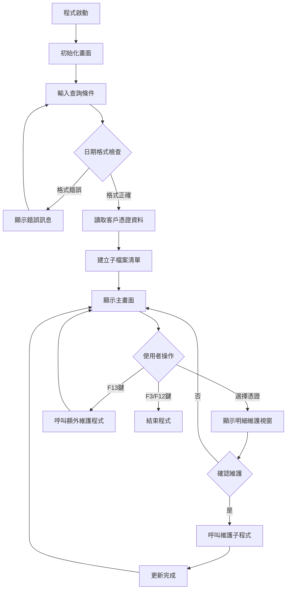
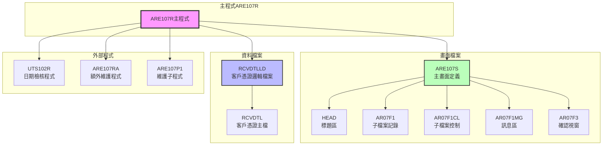
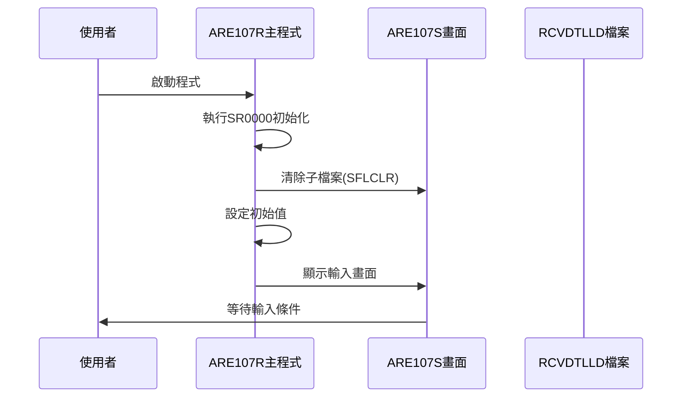
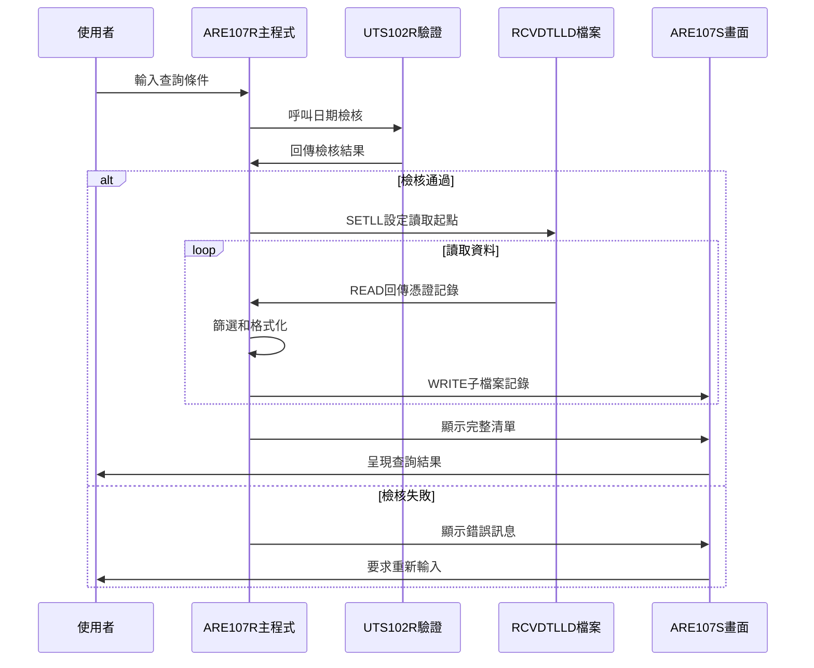
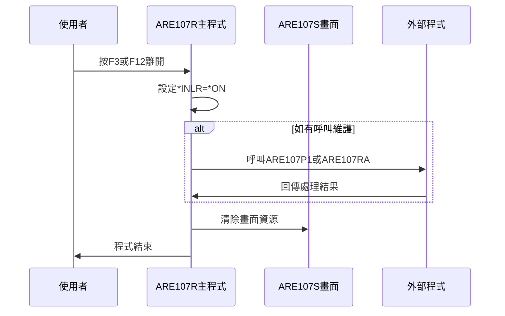
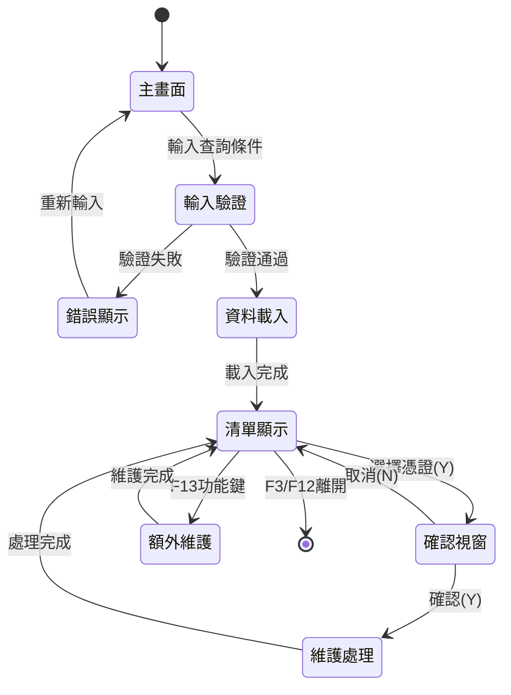
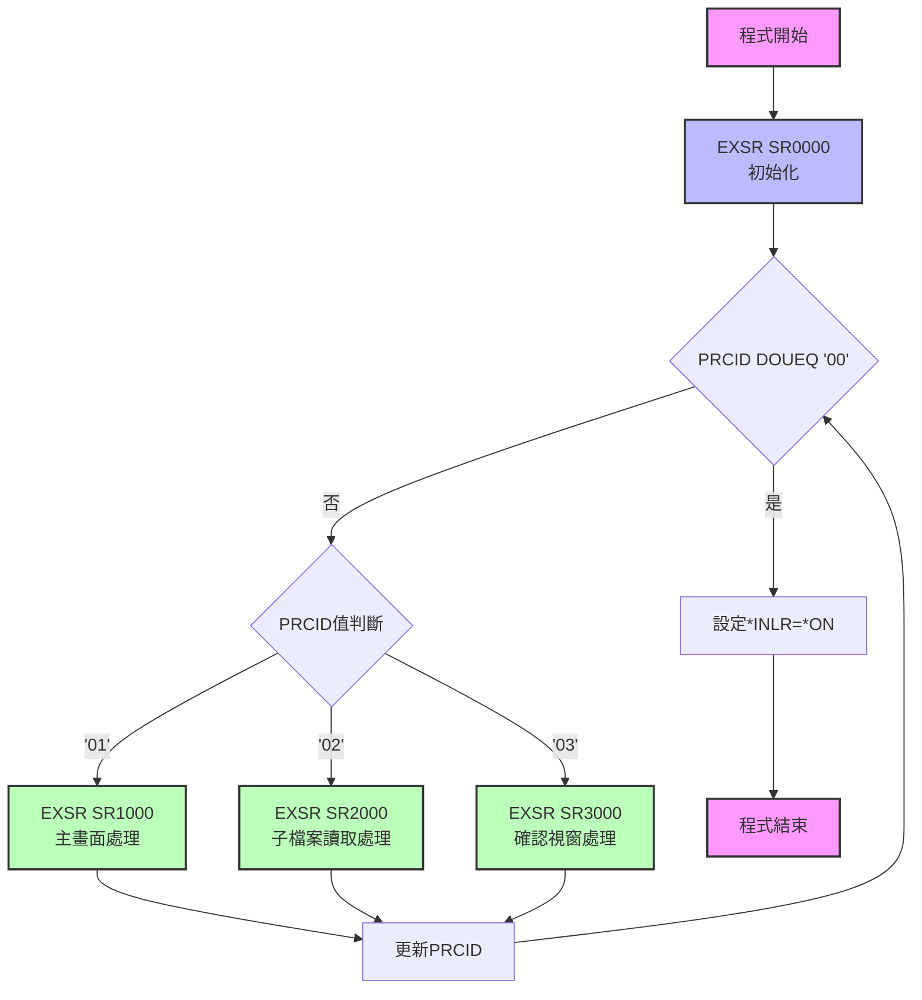

# ARE107R_K02 程式規格書

## 1. 基本資料

| 項目 | 內容 |
|------|------|
| **程式編號** | ARE107R |
| **程式名稱** | 客戶憑證維護作業 |
| **程式類型** | RPG/400 |
| **廠區** | K02 |
| **系統名稱** | 應收帳款系統 |
| **子系統** | 客戶憑證處理 |
| **檔案位置** | K02RPGSRC_THSRC/ARE107R.txt |

## 2. 🎯 程式功能說明

### 主要功能描述
本程式為客戶憑證維護作業系統，提供客戶憑證資料的查詢、顯示和維護功能。程式採用子檔案(Subfile)方式呈現客戶憑證清單，並提供明細維護視窗。

### 🎯 業務流程詳細說明

#### 完整業務流程圖


#### 業務流程關鍵階段說明

**階段一：環境初始化**
- 設定系統日期和使用者資訊
- 清除子檔案記錄和控制指示器
- 初始化螢幕編號為'01'

**階段二：查詢條件輸入與驗證**
- 接收使用者輸入的到期日期(S#DUDT)
- 接收電子發票類型選擇(S#MODT)
- 執行日期格式和有效性驗證
- 提供錯誤訊息回饋機制

**階段三：資料讀取與篩選**
- 根據到期日期設定檔案讀取起始點
- 篩選憑證類型為'I'(收入憑證)的記錄
- 根據P/H/M廠區權限進行資料過濾
- 依電子發票狀態進行分類顯示

**階段四：子檔案資料載入**
- 動態建立子檔案記錄(最多9999筆)
- 格式化顯示欄位內容
- 設定記錄顯示屬性和指示器
- 控制子檔案翻頁功能

**階段五：使用者互動處理**
- 處理選擇操作('Y'選項)
- 響應功能鍵操作(F3/F12/F13)
- 進行欄位檢核和錯誤處理
- 導向相應的處理流程

#### 多層次驗證機制
1. **日期有效性驗證**：呼叫UTS102R進行日期格式檢查
2. **權限控制驗證**：根據T#TXAR廠區權限控制資料存取
3. **業務邏輯驗證**：憑證狀態和電子發票類型檢查
4. **輸入完整性驗證**：必要欄位的完整性檢查

#### 智能處理邏輯
- 自動偵測憑證類型並進行分類處理
- 動態調整子檔案顯示內容
- 智能化的錯誤恢復機制
- 根據使用者權限自動過濾資料範圍

#### 資料一致性確保機制
- 使用檔案鎖定機制防止併發更新衝突
- 實施嚴格的資料驗證規則
- 提供完整的操作日誌記錄
- 確保關聯檔案間的資料同步

## 3. 🎯 檔案架構與關聯圖

### 使用檔案清單

| 檔案名稱 | 檔案類型 | 使用方式 | 說明 |
|----------|----------|----------|------|
| ARE107S | DSPF | WORKSTN | 主要畫面檔案 |
| RCVDTLLD | PF | INPUT | 客戶憑證邏輯檔案(依到期日排序) |

### 🎯 檔案關聯詳細視覺化圖表



### 🎯 資料流向詳細說明

#### 環境準備階段的資料流向



#### 業務處理階段的資料流向



#### 環境清理階段的資料流向



## 4. 🎯 檔案欄位規格說明

### 主要資料結構

#### RCVDTL檔案欄位定義

| 欄位名稱 | 長度 | 型態 | 說明 |
|----------|------|------|------|
| RVNO | 6A | 字元 | 憑證編號 |
| RVITEM | 2S0 | 數值 | 項次 |
| RVDATE | 8S0 | 數值 | 憑證日期 |
| RVCUNO | 6A | 字元 | 客戶編號 |
| RVCUNM | 10O | 字元 | 客戶名稱 |
| RVNTTP | 1A | 字元 | 發票類別 |
| RVPBID | 14O | 字元 | 發票統編 |
| RVTANO | 10A | 字元 | 統一編號 |
| RVDUDT | 8S0 | 數值 | 到期日期 |
| RVRAMT | 11P0 | 包裝十進位 | 憑證金額 |
| RVNTNO | 20A | 字元 | 發票號碼 |

### 🔍 重點欄位切割技術詳解

#### DS結構完整分析

程式中定義了多個DS(Data Structure)用於欄位重新定義：

##### RVRES2欄位切割結構

```
RVRES2 (12字元)：[X|X]
                  ↓ ↓
D#ELCD (1字元)：  [X]     位置1    電子發票代碼
D#INER (1字元)：    [X]   位置2    發票產生狀態代碼
```

**切割邏輯詳細說明**：
- **D#ELCD**：取RVRES2的第1個位置，用於識別電子發票狀態
  - ' ' = 一般發票
  - 'Y' = 已產生電子發票
- **D#INER**：取RVRES2的第2個位置，用於標示發票產生狀態
  - ' ' = 未產生
  - 'Y' = 已產生

##### RVNO欄位切割結構

```
RVNO (6字元)：[X|XXXXX]
               ↓   ↓
D#RVNO (1字元)：[X]      位置1    憑證類型代碼
RVNO完整 (6字元)：[XXXXXX]        完整憑證編號
```

**切割邏輯詳細說明**：
- **D#RVNO**：取憑證編號的第1個字元
  - 'P' = 一般憑證
  - 'H' = H廠區憑證  
  - 'M' = M廠區憑證

#### 實際數據範例說明

**範例1：電子發票狀態判斷**
```
原始資料：RVRES2 = 'Y N123456789'
切割結果：
- D#ELCD = 'Y' (已產生電子發票)
- D#INER = ' ' (未進入發票產生程序)
```

**範例2：憑證類型識別**
```
原始資料：RVNO = 'P12345'
切割結果：
- D#RVNO = 'P' (一般憑證類型)
- 完整編號 = 'P12345'
```

### 🎯 欄位挪用詳細分析

#### 挪用情況對比表

| 欄位名稱 | 原始定義 | 實際使用方式 | 挪用說明 |
|----------|----------|--------------|----------|
| RVRES2 | 保留欄位2(12字元) | 電子發票狀態容器 | 將保留欄位重新定義為電子發票相關狀態碼 |
| D#ELCD | 不存在 | 電子發票代碼(1字元) | 新定義欄位，挪用RVRES2第1位置 |
| D#INER | 不存在 | 發票產生狀態(1字元) | 新定義欄位，挪用RVRES2第2位置 |

#### 挪用原因深度分析

**電子發票系統整合需求**：
- 原系統設計時尚未有電子發票概念，RVRES2為純保留欄位
- 2023年電子發票法規要求需要追蹤電子發票產生狀態
- 為避免修改主檔結構，採用DS重新定義方式挪用保留欄位

**權限控制機制需求**：
- 不同廠區需要不同的憑證存取權限
- 透過T#TXAR配合D#RVNO進行廠區權限過濾
- 實現細緻化的資料存取控制

#### 挪用方式詳細說明

**技術實現方式**：
```rpg
I            DS
I                                        1  12 RVRES2
I                                        1   1 D#ELCD
I                                        2   2 D#INER
```

**程式邏輯應用**：
```rpg
C           S#MODT    IFEQ '1'
C           D#ELCD    ANDNE'Y'     ← 檢查電子發票狀態
C                     ITER
C                     ENDIF
```

#### 挪用影響評估

**正面影響**：
- 無需修改主檔結構，向下相容性佳
- 充分利用既有保留空間
- 實現了電子發票狀態追蹤功能

**技術風險**：
- 需要清楚的文檔記錄挪用規則
- 其他程式如要使用RVRES2需要統一標準
- 資料移轉時需要特別注意欄位對應

### 重要變數定義表

| 變數名稱 | 型態 | 長度 | 說明 |
|----------|------|------|------|
| PRCID | 字元 | 2 | 處理程序識別碼 |
| S#DUDT | 數值 | 8 | 查詢到期日期 |
| S#MODT | 字元 | 1 | 電子發票類型選擇 |
| S#CSR | 數值 | 5 | 子檔案游標位置 |
| S#NBR | 數值 | 4 | 子檔案記錄編號 |
| RRN | 數值 | 4 | 相對記錄編號 |
| W#LRRN | 數值 | 4 | 最後一筆記錄編號 |
| UPDSCR | 字元 | 1 | 畫面更新控制旗標 |
| S#ERR | 字元 | 70 | 錯誤訊息內容 |

## 5. 🎯 輸出/入螢幕布局

### 螢幕布局完整視覺化

#### 主畫面布局 (ARE107S - AR07F1CL)

```
+------------------------------------------------------------------------------+
|2024/12/26              東鋼鋼鐵股份有限公司電腦              ARE107S         |
|09:30:00                客戶憑證維護作業                      K02DEV01        |
|USERID001                                                                     |
+------------------------------------------------------------------------------+
|                                                                              |
|憑證到期日:[20241226  ]                                                       |
|電子發票：[1] (1=已開 2=未開 空白=全部)                                       |
|                                                                              |
|選擇憑證        憑證編號 客戶名稱   發票號碼            發票統編      憑證金額 電子|
|(Y)   憑證編號   客戶名稱    發票號碼         發票統編       憑證金額    |
+------------------------------------------------------------------------------+
|[ ]  P12345  客戶001   INV2024001234      12345678901234    1,250,000  Y     |
|[ ]  P12346  客戶002   INV2024001235      12345678901235    2,100,000        |
|[ ]  P12347  客戶003   INV2024001236      12345678901236      850,000  Y     |
|[ ]  P12348  客戶004   INV2024001237      12345678901237    1,750,000        |
|[ ]  P12349  客戶005   INV2024001238      12345678901238    3,200,000  Y     |
|[ ]  P12350  客戶006   INV2024001239      12345678901239      920,000        |
|[ ]  P12351  客戶007   INV2024001240      12345678901240    1,480,000  Y     |
|[ ]  P12352  客戶008   INV2024001241      12345678901241    2,650,000        |
|[ ]  P12353  客戶009   INV2024001242      12345678901242    1,100,000  Y     |
|[ ]  P12354  客戶010   INV2024001243      12345678901243    1,980,000        |
+------------------------------------------------------------------------------+
|                                                                              |
|[錯誤訊息顯示區]                                                             |
|F3=離開  F12=回上一層  ENTER=處理  F13=額外維護                             |
+------------------------------------------------------------------------------+
```

#### 確認維護視窗 (AR07F3)

```
+------------------------------------------------------------------------------+
|                          +--------------------------------+                  |
|                          |                                |                  |
|                          |  發票號碼：INV2024001234      |                  |
|                          |  發票統編：12345678901234     |                  |
|                          |  統一編號：1234567890        |                  |
|                          |                                |                  |
|                          |  憑證金額：1,250,000          |                  |
|                          |                                |                  |
|                          |  確認維護憑證：[Y] (Y/N)     |                  |
|                          |                                |                  |
|                          |  [錯誤訊息]                   |                  |
|                          |  操作說明：F3,F12=回上一層    |                  |
|                          +--------------------------------+                  |
+------------------------------------------------------------------------------+
```

### 🎯 畫面欄位詳細說明

#### 主畫面輸入欄位

| 欄位名稱 | 欄位代號 | 長度 | 型態 | 輸入格式 | 驗證規則 |
|----------|----------|------|------|----------|----------|
| 憑證到期日 | S#DUDT | 8 | 數值 | YYYYMMDD | 有效日期格式，呼叫UTS102R檢核 |
| 電子發票類型 | S#MODT | 1 | 字元 | 單選 | 1=已開, 2=未開, 空白=全部 |
| 選擇憑證 | S#OPT | 1 | 字元 | Y/空白 | Y=選擇此憑證進行維護 |

#### 主畫面顯示欄位

| 欄位名稱 | 欄位代號 | 長度 | 型態 | 顯示格式 | 屬性說明 |
|----------|----------|------|------|----------|----------|
| 憑證編號 | S#RVNO | 6 | 字元 | 文字 | 唯讀，左對齊 |
| 客戶名稱 | S#CUNM | 10 | 字元 | 文字 | 唯讀，左對齊 |
| 發票號碼 | S#NTNO | 20 | 字元 | 文字 | 唯讀，左對齊 |
| 發票統編 | S#PBID | 14 | 字元 | 文字 | 唯讀，左對齊 |
| 憑證金額 | S#RAMT | 11 | 數值 | 金額格式(EDTCDE J) | 唯讀，右對齊，千分位逗號 |
| 電子發票 | S#ELCD | 1 | 字元 | Y/空白 | 唯讀，Y=已開電子發票 |

#### 確認視窗欄位

| 欄位名稱 | 欄位代號 | 長度 | 型態 | 輸入格式 | 驗證規則 |
|----------|----------|------|------|----------|----------|
| 確認維護 | S1CNYN | 1 | 字元 | Y/N | 必填，Y=確認維護, N=取消 |

### 🎯 畫面控制邏輯

#### 指示器控制邏輯

| 指示器 | 用途 | 控制邏輯 |
|--------|------|----------|
| *IN26 | 日期欄位高亮 | 日期格式錯誤時設定，使輸入欄位反白 |
| *IN33 | 憑證欄位高亮 | 特定憑證狀態時高亮顯示 |
| *IN70 | 保護模式 | 記錄在顯示狀態下保護輸入欄位 |
| *IN72 | 子檔案顯示 | 控制子檔案記錄的顯示/隱藏 |
| *IN73 | 子檔案清除 | 重新載入資料時清除子檔案 |
| *IN88 | 下次變更 | 子檔案記錄修改時的變更標示 |

#### 欄位顯示屬性

**高亮顯示屬性**：
- `DSPATR(HI)` - 高亮度顯示
- `DSPATR(RI)` - 反相顯示  
- `DSPATR(PC)` - 保護字元模式
- `DSPATR(UL)` - 底線顯示

**顏色控制屬性**：
- `COLOR(RED)` - 紅色錯誤訊息
- `COLOR(BLU)` - 藍色功能說明

### 功能鍵詳細定義

| 功能鍵 | 功能說明 | 處理邏輯 | 系統行為 |
|--------|----------|----------|----------|
| **F3** | 離開作業 | 設定PRCID='00'，LEAVE | 結束程式執行，返回上一層選單 |
| **F12** | 回上一層 | 設定PRCID='00'，LEAVE | 取消當前操作，返回上一層畫面 |
| **F13** | 額外維護 | 呼叫ARE107RA程式 | 開啟額外的維護功能選單 |
| **ENTER** | 處理確認 | 執行選擇記錄的處理邏輯 | 根據選擇項目進入維護或查詢流程 |

### 操作流程

#### 畫面間轉換流程



## 6. 🎯 處理流程程序說明

### 🎯 主程序邏輯深度分析

#### 程式執行流程圖



#### 🎯 詳細處理步驟逐一分析

**步驟1：程式初始化處理 (SR0000)**
```rpg
C           SR0000    BEGSR
C           *DATE     SUB  19000000  U#SYSD  80    ← 計算系統日期
C                     CLEARAR07F1CL              ← 清除子檔案控制
C                     Z-ADD1         S#NBR       ← 設定記錄編號為1
C                     Z-ADD0         W#DUDT  80  ← 初始化工作日期
C                     MOVEL*BLANKS   W#MODT  1   ← 清除模式標記
C                     MOVEL*BLANKS   UPDSCR      ← 清除更新畫面旗標
C                     MOVEL*BLANKS   W#CHYN  1   ← 清除檢查旗標
C                     MOVE '01'      PRCID   2   ← 設定程序ID為01
C                     ENDSR
```

**關鍵處理說明**：
- 系統日期計算：將當前系統日期轉換為民國年格式
- 子檔案清除：確保畫面載入時從乾淨狀態開始
- 變數初始化：所有工作變數設為初始值
- 流程控制：設定第一個處理程序為主畫面處理

**步驟2：主畫面處理邏輯 (SR1000)**
```rpg
C           UPDSCR    IFEQ 'Y'                   ← 如需更新畫面
C                     EXSR SR1100               ← 執行子檔案初始化
C                     ENDIF
C           PRCID     DOWEQ'01'                 ← 主畫面處理迴圈
C           RRN       COMP *ZEROS           72  ← 檢查是否有記錄
C   72      S#ERR     IFEQ *BLANKS              ← 如無記錄顯示錯誤
C                     MOVEAERR,2     S#ERR      ← 設定錯誤訊息
C                     ENDIF
C                     WRITEHEAD                 ← 寫入標題
C                     WRITEAR07F1MG             ← 寫入訊息區
C                     EXFMTAR07F1CL             ← 顯示子檔案控制畫面
```

**關鍵業務邏輯**：
- 條件式畫面更新：只有在UPDSCR='Y'時才重新載入資料
- 記錄存在檢查：確保至少有一筆記錄可供操作
- 畫面元件寫入：依序寫入標題區、訊息區、控制區
- 使用者互動等待：透過EXFMT等待使用者輸入

**步驟3：功能鍵處理邏輯**
```rpg
C           *IN03     IFEQ *ON                  ← F3離開
C           *IN12     OREQ *ON                  ← F12取消
C                     MOVE '00'      PRCID      ← 設定結束程序
C                     LEAVE                     ← 離開迴圈
C                     ENDIF
C           *IN13     IFEQ *ON                  ← F13額外維護
C                     CALL 'ARE107RA'           ← 呼叫維護程式
C                     MOVEL'Y'       UPDSCR     ← 標記需更新畫面
C                     MOVE '01'      PRCID      ← 回到主畫面
C                     Z-ADD1         S#NBR      ← 重設記錄編號
C                     LEAVE                     ← 離開當前迴圈
C                     ENDIF
```

#### 🎯 子程序邏輯分析

**SR1100 - 子檔案初始化子程序**

主要功能：載入符合條件的憑證記錄到子檔案

```rpg
處理流程：
1. 清除子檔案記錄 (SFLCLR)
2. 設定檔案讀取起點 (SETLL)
3. 迴圈讀取記錄並篩選
4. 格式化記錄內容
5. 寫入子檔案記錄
```

**詳細篩選邏輯**：
- 憑證類型篩選：只處理RVNTTP='I'(收入憑證)
- 廠區權限控制：根據T#TXAR和D#RVNO進行權限過濾
- 電子發票狀態：依S#MODT篩選已開/未開/全部
- 記錄數量限制：最多載入9999筆記錄

**SR1200 - 輸入欄位檢核子程序**

主要功能：驗證使用者輸入的查詢條件

```rpg
檢核項目：
1. 日期為零檢查
2. 日期格式驗證 (呼叫UTS102R)
3. 日期有效性檢查
4. 錯誤訊息設定
```

#### 🎯 特殊邏輯處理

**廠區權限控制邏輯**
```rpg
C           T#TXAR    IFEQ 'P'                  ← P廠區權限
C           D#RVNO    IFNE 'P'                  ← 非P憑證
C           D#RVNO    ANDNE'H'                  ← 且非H憑證
C           D#RVNO    ANDNE'M'                  ← 且非M憑證
C                     ITER                      ← 跳過此記錄
C                     ENDIF
C                     ENDIF
```

**電子發票狀態判斷邏輯**
```rpg
C           S#MODT    IFEQ '1'                  ← 查詢已開發票
C           D#ELCD    ANDNE'Y'                  ← 但此筆未開
C                     ITER                      ← 跳過此記錄
C                     ENDIF
C           S#MODT    IFEQ '2'                  ← 查詢未開發票
C           D#ELCD    ANDNE' '                  ← 但此筆已開
C                     ITER                      ← 跳過此記錄
C                     ENDIF
```

#### 🎯 錯誤處理與資料完整性控制

**日期檢核機制**
```rpg
C                     CALL 'UTS102R'            ← 呼叫日期檢核程式
C                     PARM           P#DATE  8  ← 傳入待檢日期
C                     PARM '1'       P#MODE  1  ← 檢核模式
C                     PARM           P#MTL  24  ← 訊息文字
C                     PARM           P#LY    1  ← 年份類型
C                     PARM           FLAG1   1  ← 回傳旗標
C           FLAG1     IFNE '0'                  ← 檢核失敗
C                     SETON                 26  ← 設定錯誤指示器
C                     MOVEAERR,4     S#ERR      ← 設定錯誤訊息
C                     GOTO END120               ← 跳到結束處理
C                     ENDIF
```

**資料完整性檢查**
- 必要欄位存在性檢查
- 數值欄位範圍檢查  
- 關聯檔案一致性檢查
- 業務規則合理性檢查

## 7. 🎯 數據操作與轉換分析

### 檔案操作詳解

#### READ操作邏輯
```rpg
C           S#DUDT    SETLLRVREC                ← 設定讀取起點
C           *IN52     DOWEQ*OFF                 ← 非檔案結束迴圈
C                     READ RVREC               52 ← 順序讀取記錄
C   52                LEAVE                     ← EOF時離開迴圈
```

**檔案讀取策略**：
- 使用SETLL定位到特定日期開始讀取
- 順序讀取避免隨機存取的效能問題
- 透過指示器52控制檔案結束處理
- 設定明確的讀取終止條件

#### WRITE操作邏輯
```rpg
C                     ADD  1         RRN        ← 遞增記錄編號
C                     MOVEL*ON       *IN98      ← 設定資料存在旗標
C                     WRITEAR07F1               ← 寫入子檔案記錄
```

**子檔案寫入控制**：
- RRN自動遞增確保記錄唯一性
- *IN98標示子檔案有資料存在
- 控制子檔案最大記錄數量(9999筆)

### 數據轉換邏輯

#### 日期格式轉換
```rpg
C           *DATE     SUB  19000000  U#SYSD  80 ← 系統日期轉民國年
C                     MOVE *ALL'0'   P#DATE     ← 初始化檢核日期
C                     MOVE S#DUDT    P#DATE     ← 移動使用者輸入日期
```

**轉換處理說明**：
- 系統日期從西元年轉換為民國年格式
- 使用者輸入日期格式化為標準8位數字
- 透過MOVE指令進行字元與數值間轉換

#### 金額格式處理
```rpg
C                     Z-ADDRVRAMT    S#RAMT     ← 金額欄位轉換
```

**金額顯示處理**：
- 使用Z-ADD確保數值正確傳遞
- 畫面定義中EDTCDE(J)提供千分位格式
- 自動處理負數和零值的顯示

### 計算邏輯分析

#### 記錄編號計算
```rpg
C           S#NBR     IFGT RRN                  ← 比較記錄編號
C           RRN       ANDNE*ZEROS               ← 且記錄數非零
C                     Z-ADDRRN       S#NBR      ← 設定游標位置
C                     ENDIF
```

**游標位置計算**：
- 自動計算合適的游標起始位置
- 確保使用者體驗的連續性
- 處理邊界條件和異常狀況

### 檢核機制詳解

#### 輸入資料有效性檢查
```rpg
C           S#DUDT    IFEQ 0                    ← 日期為零檢查
C                     SETON                 26  ← 設定錯誤指示器
C                     MOVELERR,3     S#ERR      ← 設定錯誤訊息
C                     GOTO END120               ← 跳轉錯誤處理
C                     ENDIF
```

**多重檢核機制**：
- 必填欄位檢查：確保關鍵欄位不為空
- 格式檢查：日期、數值格式正確性驗證
- 業務規則檢查：憑證狀態、權限等業務邏輯驗證
- 關聯檢查：相關檔案記錄存在性檢查

#### 檢核失敗處理方式
- 設定對應錯誤指示器
- 顯示具體錯誤訊息
- 保持使用者輸入內容
- 高亮標示錯誤欄位
- 提供修正指導資訊

## 8. 🎯 錯誤處理程序說明

### 🎯 詳細錯誤代碼清冊

| 錯誤代碼 | 錯誤訊息 | 原因說明 | 處理方式 | 預防措施 |
|----------|---------|---------|---------|----------|
| **ERR01** | 資料已存在！ | 嘗試新增重複的憑證記錄 | 1. 顯示錯誤訊息<br>2. 保持當前畫面<br>3. 允許使用者修改輸入 | 建立唯一性檢查機制，在輸入時即時驗證 |
| **ERR02** | 資料不存在！ | 查詢條件無對應記錄 | 1. 顯示提示訊息<br>2. 清除子檔案內容<br>3. 要求重新輸入條件 | 提供查詢建議和日期範圍提示 |
| **ERR03** | 日期不可空白！ | 必填的日期欄位未輸入 | 1. 設定*IN26高亮日期欄位<br>2. 顯示錯誤訊息<br>3. 游標定位到日期欄位 | 畫面設計時標示必填欄位 |
| **ERR04** | 日期錯誤 | 日期格式不正確或無效日期 | 1. 呼叫UTS102R檢核<br>2. 顯示具體錯誤說明<br>3. 提供正確格式範例 | 實施即時格式檢查和日期選擇器 |
| **ERR05** | 日期不可大於系統日期 | 輸入未來日期 | 1. 顯示錯誤訊息<br>2. 建議合理日期範圍<br>3. 自動填入系統日期 | 設定日期輸入上限控制 |
| **ERR06** | 已達資料上限9999筆，查詢條件請縮小範圍!! | 查詢結果超過系統處理上限 | 1. 提示縮小查詢範圍<br>2. 建議具體的條件設定<br>3. 清除當前結果 | 設計分頁查詢機制和智能預設條件 |
| **ERR07** | 此憑證已產生發票請刪除，資料不可異動!! | 已產生發票的憑證不可修改 | 1. 顯示業務規則說明<br>2. 提供刪除發票流程指引<br>3. 回到主畫面 | 加強業務規則說明和操作指引 |
| **ERR08** | 憑證資料已維護!! | 憑證已完成維護作業 | 1. 顯示完成確認訊息<br>2. 更新畫面狀態<br>3. 返回清單畫面 | 提供維護歷程查詢功能 |
| **ERR09** | 憑證已產生應收或應付或已發票已維護過，當系統完成產生發票後，不可異動 | 憑證在完整業務流程後不可修改 | 1. 詳細說明業務流程狀態<br>2. 提供流程查詢功能<br>3. 建議聯繫管理員 | 建立完整的業務流程監控機制 |
| **ERR10** | 憑證資料已維護，不可異動!! | 憑證已完成維護且被鎖定 | 1. 顯示維護狀態<br>2. 提供查詢功能<br>3. 說明解鎖程序 | 實施維護權限分級管理 |
| **ERR11** | 請先執行統一編號作業(ARE011R)，輸入統一編號!! | 缺少必要的統一編號資料 | 1. 提供ARE011R程式連結<br>2. 說明統一編號重要性<br>3. 暫存當前作業狀態 | 建立作業前置檢查和自動導引 |

### 🎯 系統異常處理邏輯

#### 檔案操作失敗處理
```rpg
C                     READ RVREC               52
C   52                LEAVE                     ← EOF正常處理
C                     MONITOR                  ← 異常監控開始
C                     // 檔案處理邏輯
C                     ON-ERROR                 ← 捕獲異常
C                     MOVEAERR,99    S#ERR     ← 設定系統錯誤
C                     ENDMON                   ← 異常監控結束
```

**檔案存取異常處理機制**：
- 檔案鎖定衝突：等待重試機制
- 檔案不存在：提供重建檔案指引  
- 權限不足：聯繫系統管理員
- 網路中斷：本機暫存和重連機制

#### 程式調用失敗處理
```rpg
C                     CALL 'UTS102R'           ← 呼叫外部程式
C                     MONITOR                  ← 監控程式呼叫
C                     // 參數傳遞邏輯
C                     ON-ERROR                 ← 捕獲呼叫失敗
C                     MOVEL'CALL_ERR' S#ERR    ← 設定呼叫錯誤
C                     ENDMON
```

**外部程式呼叫異常處理**：
- 程式不存在：提供替代處理方案
- 參數錯誤：檢查並修正參數格式
- 執行逾時：設定合理的等待時間
- 回傳異常：驗證回傳值的合理性

#### 資料完整性錯誤處理
```rpg
C           RVDUDT    IFGT S#DUDT              ← 資料邏輯檢查
C                     LEAVE                    ← 邏輯性終止
C                     ENDIF
```

**資料一致性檢查機制**：
- 關聯檔案同步檢查
- 主鍵重複檢查
- 必要欄位完整性檢查
- 業務規則合規性檢查

#### 並發控制失敗處理

**記錄鎖定機制**：
- 實施樂觀鎖定策略
- 提供鎖定狀態查詢
- 自動解除逾時鎖定
- 使用者友善的等待提示

**併發衝突解決**：
- 檢測併發修改衝突
- 提供衝突解決選項
- 實施最後修改者優先原則
- 記錄衝突處理歷程

## 9. 🎯 備註

### 🎯 特殊注意事項

#### 電子發票處理注意事項
- 程式支援電子發票狀態追蹤功能，需確保RVRES2欄位的正確使用
- 電子發票代碼(D#ELCD)和產生狀態(D#INER)的設定會影響查詢結果
- 修改電子發票相關邏輯時需注意與其他程式的相容性

#### 廠區權限控制注意事項  
- T#TXAR欄位決定使用者可存取的憑證範圍
- 不同廠區的憑證編號規則可能不同(P/H/M前置碼)
- 跨廠區資料存取需要適當的權限設定

#### 子檔案處理注意事項
- 子檔案最大記錄數限制為9999筆，超過時需要縮小查詢範圍
- 子檔案記錄的RRN管理需要確保唯一性和連續性
- 大量資料載入時需要注意系統效能影響

#### 日期處理注意事項
- 系統使用民國年格式，需要與西元年進行正確轉換
- 日期檢核依賴UTS102R程式，需確保該程式的可用性
- 到期日期查詢會影響資料載入的數量和效能

#### 維護作業注意事項
- 已產生發票的憑證有嚴格的修改限制
- 維護操作需要呼叫ARE107P1子程式進行實際更新
- 確認視窗的操作會影響資料的實際變更

#### 程式整合注意事項
- 與ARE107RA程式的整合需要確保資料狀態的同步
- 統一編號維護(ARE011R)是本程式的前置作業
- 錯誤處理需要與相關程式保持一致的使用者體驗 