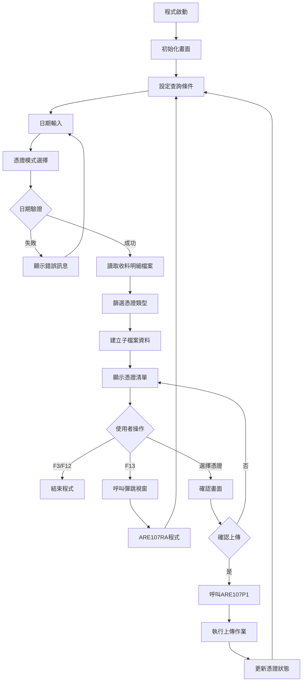
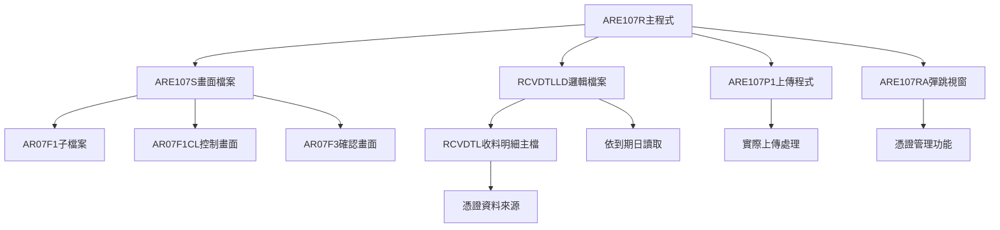
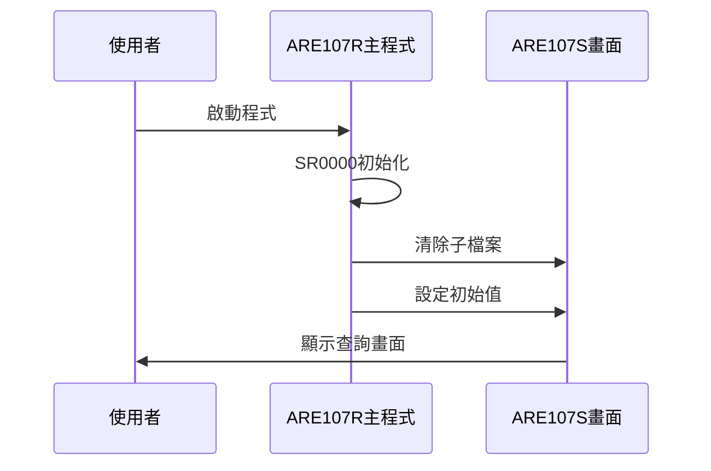
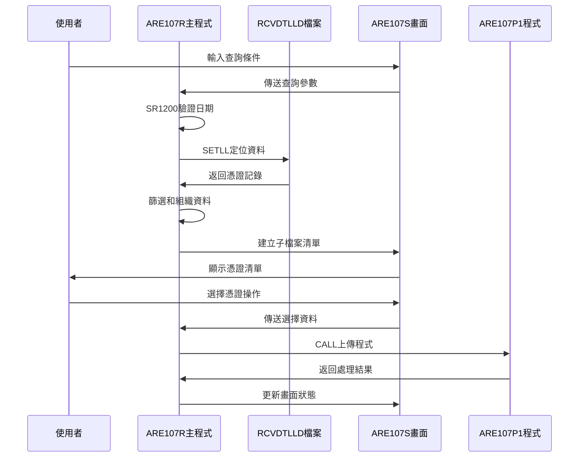
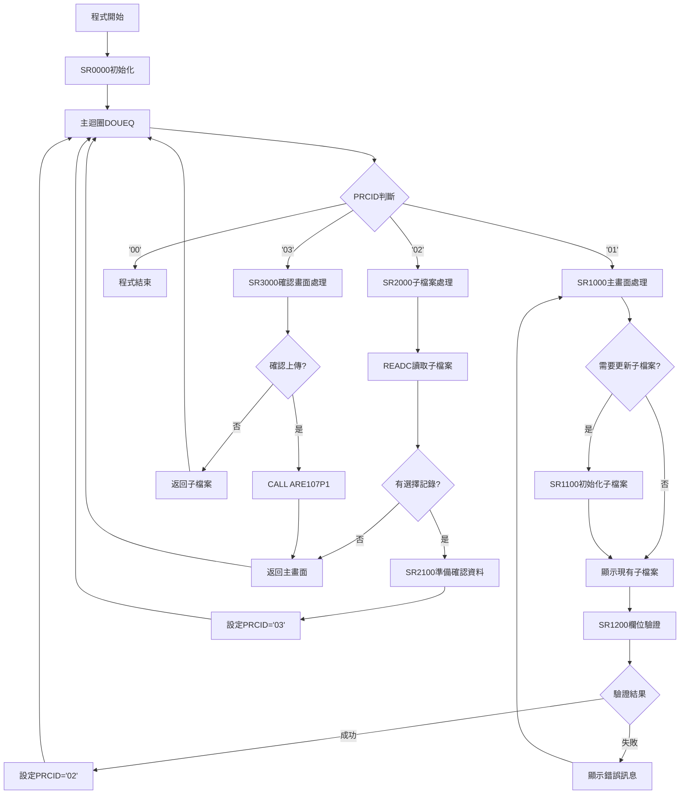

# ARE107R_P02 程式規格書

## 1. 基本資料

| 項目 | 內容 |
|------|------|
| **程式編號** | ARE107R |
| **程式名稱** | 客戶憑證維護作業 |
| **程式類型** | RPG |
| **廠區** | P02 |
| **系統名稱** | 應收帳款系統 |
| **子系統** | 客戶憑證管理 |
| **檔案位置** | P02RPGSRC_THSRC/ARE107R.txt |

## 🎯 2. 程式功能說明

### 主要功能描述
ARE107R是客戶憑證維護作業程式，主要處理電子憑證的查詢、顯示、篩選和上傳作業。程式提供完整的憑證管理介面，支援多種查詢條件和篩選模式。

### 🎯 業務流程詳細說明

#### 完整業務流程圖


#### 業務流程關鍵階段說明

**階段一：查詢條件設定**
- 使用者輸入憑證到期日(S#DUDT)
- 選擇憑證模式(S#MODT)：空白=全部、1=已核、2=未核
- 系統進行日期格式驗證和合理性檢查

**階段二：資料篩選處理**
- 根據到期日從RCVDTLLD邏輯檔案讀取資料
- 篩選條件：憑證類型(RVNTTP='I')、刪除碼(RVDECD=' ')
- 依據稅區設定(T#TXAR='P')篩選憑證類型
- 根據憑證模式篩選已核/未核狀態

**階段三：清單顯示與操作**
- 建立子檔案(AR07F1)顯示憑證資料
- 提供憑證選擇功能(S#OPT='Y')
- 支援F13彈跳視窗功能進行憑證管理
- 驗證必要欄位：統一編號(S#TANO)不可空白

**階段四：憑證上傳處理**
- 顯示確認畫面(AR07F3)包含詳細憑證資訊
- 使用者確認後調用ARE107P1進行實際上傳
- 更新憑證上傳標記並返回主畫面

## 🎯 3. 檔案架構與關聯圖

### 使用檔案清單

| 檔案名稱 | 檔案用途 | 存取方式 | 關聯說明 |
|---------|----------|----------|----------|
| **ARE107S** | 主畫面檔案 | WORKSTN | 子檔案控制畫面 |
| **RCVDTLLD** | 收料明細邏輯檔案 | INPUT | 按到期日讀取憑證資料 |
| **ARE107P1** | 上傳處理程式 | CALL | 執行憑證上傳作業 |
| **ARE107RA** | 彈跳視窗程式 | CALL | F13憑證管理功能 |

### 🎯 檔案關聯詳細視覺化圖表



### 🎯 資料流向詳細說明

#### 環境準備階段的資料流向


#### 業務處理階段的資料流向


## 🎯 4. 檔案欄位規格說明

### 主要資料結構

#### RCVDTL收料明細檔案結構
| 欄位名稱 | 型態 | 長度 | 說明 |
|---------|------|------|------|
| RVNO | CHAR | 6 | 收料編號 |
| RVITEM | PACKED | 2,0 | 項次 |
| RVDATE | PACKED | 8,0 | 收料日期 |
| RVCUNO | CHAR | 6 | 客戶編號 |
| RVCUNM | CHAR | 10 | 客戶名稱 |
| RVNTTP | CHAR | 1 | 憑證類別 |
| RVPBID | CHAR | 14 | 發票統編 |
| RVNTNO | CHAR | 20 | 發票號碼 |
| RVDUDT | PACKED | 8,0 | 到期日 |
| RVRAMT | PACKED | 11,0 | 憑證金額 |
| RVTANO | CHAR | 10 | 統一編號 |
| RVDECD | CHAR | 1 | 刪除碼 |
| RVRES2 | CHAR | 12 | 保留欄位2 |

### 🔍 重點欄位切割技術詳解

#### DS結構完整分析

**RVRES2保留欄位切割結構(12字元)**
```
RVRES2 (12字元)：[X|X]
                  ↓ ↓
D#ELCD (1字元)：  [X]     上傳憑證碼
D#INER (1字元)：    [X]   發票內容識別碼
```

**RVNO收料編號切割結構(6字元)**
```
RVNO (6字元)：    [X|XXXXX]
               ↓    ↓
D#RVNO (1字元)：[X]       收料編號首碼
RVNO完整 (6字元)：[XXXXXX] 完整收料編號
```

#### 欄位切割視覺化展示

**保留欄位2(RVRES2)的切割對應**
```
位置: 001 002 003 004 005 006 007 008 009 010 011 012
內容: [上][發][保][保][保][保][保][保][保][保][保][保]
      ↓  ↓
D#ELCD: 上傳憑證碼 (位置1)
D#INER: 發票內容識別碼 (位置2)
剩餘:   保留空間 (位置3-12)
```

### 🎯 欄位挪用詳細分析

#### 挪用情況對比表
| 欄位名稱 | 原始定義 | 實際使用方式 | 挪用用途 |
|---------|----------|-------------|----------|
| **RVRES2** | 保留欄位2 | 切割成多個功能欄位 | 上傳狀態控制 |
| **D#ELCD** | (切割後) | 上傳憑證碼 | Y=已上傳，空白=未上傳 |
| **D#INER** | (切割後) | 發票內容識別碼 | Y=已處理，空白=待處理 |

#### 挪用原因深度分析
**RVRES2保留欄位的挪用**：
- 原始設計為12字元保留空間
- 實際挪用為憑證狀態控制欄位
- 第1字元控制上傳憑證狀態
- 第2字元控制發票處理狀態
- 充分利用保留空間避免異動檔案結構

#### 挪用方式詳細說明
```
RVRES2原始: [____________] (12個空白字元)
實際使用:   [Y|Y|________] 
           ↓ ↓  ↓
         上傳|處理|保留空間
         狀態|狀態|
```

## 🎯 5. 輸出/入螢幕布局

### 🎯 主查詢畫面(AR07F1CL)

```
+----------------------------------------------------------+
|  99/12/26    東鋼企業股份有限公司              ARE107S   |
|  09:30:25      客戶憑證維護作業                  DEVNAME |
|  USERNAME                                                |
| 憑證到期日:[________]                                    |
| 電子憑證:[_] (1=已核 2=未核 空白皆顯示)                  |
|                                                          |
| 選取憑證                                       電子      |
| (Y)  憑證 客戶名稱  發票號碼         發票統編     金額    |
| [_]  [____] [____] [__________] [____________] [_______] |
| [_]  [____] [____] [__________] [____________] [_______] |
| [_]  [____] [____] [__________] [____________] [_______] |
| [_]  [____] [____] [__________] [____________] [_______] |
| [_]  [____] [____] [__________] [____________] [_______] |
| [_]  [____] [____] [__________] [____________] [_______] |
| [_]  [____] [____] [__________] [____________] [_______] |
| [_]  [____] [____] [__________] [____________] [_______] |
| [_]  [____] [____] [__________] [____________] [_______] |
| [_]  [____] [____] [__________] [____________] [_______] |
|----------------------------------------------------------|
| [錯誤訊息顯示區]                                          |
| F3=離開 F12=回前畫面 ENTER=確認 F13=彈跳視窗             |
+----------------------------------------------------------+
```

### 🎯 憑證確認畫面(AR07F3)

```
+----------------------------------------------------------+
|                                                          |
|       +--------------------------------------+           |
|       |  發票號碼：[__________________]     |           |
|       |  發票統編：[____________]           |           |
|       |  統一編號：[________]               |           |
|       |                                    |           |
|       |  憑證金額：[_________]               |           |
|       |                                    |           |
|       |  憑證上傳確認：[_] (Y/N)            |           |
|       |  [錯誤訊息顯示]                     |           |
|       |  操作說明: F3,F12=回前畫面          |           |
|       +--------------------------------------+           |
|                                                          |
+----------------------------------------------------------+
```

### 🎯 畫面欄位詳細說明

#### 主畫面欄位屬性
| 欄位名稱 | 型態 | 長度 | 輸入格式 | 驗證規則 | 說明 |
|---------|------|------|----------|----------|------|
| **S#DUDT** | 數值 | 8 | YYYYMMDD | 日期格式檢查 | 憑證到期日(必填) |
| **S#MODT** | 字元 | 1 | 1/2/空白 | 選項驗證 | 憑證模式選擇 |
| **S#OPT** | 字元 | 1 | Y/空白 | 選項檢查 | 憑證選擇標記 |

#### 確認畫面欄位屬性
| 欄位名稱 | 型態 | 長度 | 顯示格式 | 說明 |
|---------|------|------|----------|------|
| **S1NTNO** | 字元 | 20 | 左對齊 | 發票號碼(唯讀) |
| **S1PBID** | 字元 | 14 | 左對齊 | 發票統編(唯讀) |
| **S1TANO** | 字元 | 10 | 左對齊 | 統一編號(唯讀) |
| **S1RAMT** | 數值 | 11,0 | 金額格式 | 憑證金額(唯讀) |
| **S1CNYN** | 字元 | 1 | Y/N | 確認選項(必填) |

### 🎯 畫面控制邏輯

#### 指示器控制
| 指示器 | 控制邏輯 | 畫面效果 |
|--------|----------|----------|
| **IN26** | 日期錯誤時設定 | S#DUDT欄位反白顯示 |
| **IN33** | 選擇憑證時設定 | 憑證編號反白顯示 |
| **IN70** | 保護模式控制 | 選項欄位保護/開放 |
| **IN72** | 子檔案顯示控制 | 控制子檔案是否顯示 |
| **IN73** | 子檔案清除控制 | 清除子檔案內容 |
| **IN88** | 下筆異動控制 | 子檔案記錄異動標記 |

### 功能鍵詳細定義

| 功能鍵 | 處理邏輯 | 系統行為 |
|--------|----------|----------|
| **F3** | 離開程式 | 設定PRCID='00'，結束程式執行 |
| **F12** | 回前畫面 | 設定PRCID='00'，返回上層程式 |
| **F13** | 彈跳視窗 | 調用ARE107RA程式，憑證管理功能 |
| **ENTER** | 確認處理 | 執行當前畫面的資料處理邏輯 |

## 🎯 6. 處理流程程序說明

### 🎯 主程序邏輯深度分析

#### 程式執行流程圖


#### 🎯 詳細處理步驟逐一分析

**SR0000初始化子程序**
1. 計算系統日期：*DATE SUB 19000000 = U#SYSD
2. 清除子檔案控制：CLEAR AR07F1CL
3. 初始化變數：S#NBR=1, W#DUDT=0, W#MODT=空白
4. 設定更新標記：UPDSCR=空白, W#CHYN=空白
5. 設定初始程序ID：PRCID='01'

**SR1000主畫面處理子程序**
1. 檢查更新標記(UPDSCR='Y')，若需要則執行SR1100
2. 進入畫面顯示迴圈(DOWEQ'01')
3. 設定子檔案顯示屬性(IN72控制顯示/隱藏)
4. 輸出畫面：WRITE HEAD, WRITE AR07F1MG, EXFMT AR07F1CL
5. 清除錯誤訊息和指示器
6. 處理游標位置：S#CSR->S#NBR, W#LRRN->S#NBR
7. 檢查功能鍵操作(F3/F12/F13)
8. 執行欄位驗證(SR1200)
9. 比較查詢條件變更，決定是否重新整理

**SR1100子檔案初始化子程序**
1. 清除更新標記：UPDSCR=空白
2. 清除子檔案：IN73=*ON, WRITE AR07F1CL, IN73=*OFF
3. 重置變數：RRN=0, IN98=*OFF, W#CKYN=空白
4. 檔案定位：S#DUDT SETLL RVREC
5. 迴圈讀取記錄(DOWEQ*OFF)
6. 檢查記錄上限(RRN=9999)
7. 篩選條件檢查：
   - 到期日範圍(RVDUDT>S#DUDT則跳出)
   - 憑證類型(RVNTTP='I')
   - 稅區限制(T#TXAR='P'時限制憑證類型)
   - 憑證狀態(S#MODT='1'=已核/'2'=未核)
8. 組織畫面資料並寫入子檔案

**SR1200欄位驗證子程序**
1. 日期格式驗證：調用UTS102R檢查S#DUDT
2. 日期有效性檢查：FLAG1<>'0'表示格式錯誤
3. 空白日期檢查：S#DUDT=0時顯示錯誤
4. 設定錯誤指示器：IN26/IN99控制欄位反白

**SR2000子檔案處理子程序**
1. 進入子檔案處理迴圈(DOWEQ'02')
2. 讀取異動記錄：READC AR07F1
3. 驗證必要欄位：S#TANO不可空白
4. 檢查憑證狀態：S#ELCD='Y'表示已上傳
5. 處理選擇操作：S#OPT='Y'時準備確認資料
6. 調用SR2100準備確認畫面資料
7. 設定下一程序：PRCID='03'

**SR2100確認資料準備子程序**
1. 複製憑證資料：S#NTNO->S1NTNO等
2. 設定憑證相關資訊：金額、統編、編號等
3. 初始化確認標記：S1CNYN=空白
4. 準備日期和編號變數供後續處理

**SR3000確認畫面處理子程序**
1. 顯示確認畫面：EXFMT AR07F3
2. 檢查功能鍵(F3/F12返回)
3. 處理確認選項：
   - S1CNYN='N'：取消操作，返回子檔案
   - S1CNYN='Y'且未處理：調用ARE107P1執行上傳
   - S1CNYN='Y'且已處理：直接返回

### 🎯 子程序邏輯分析

#### 錯誤處理邏輯
1. **日期驗證錯誤**：設定IN26，欄位反白，顯示錯誤碼4
2. **空白日期錯誤**：設定IN26，欄位反白，顯示錯誤碼3
3. **已上傳憑證錯誤**：設定IN99，顯示錯誤碼10
4. **統編空白錯誤**：設定IN99，顯示錯誤碼11
5. **記錄數超限錯誤**：顯示錯誤碼6，停止讀取

#### 條件判斷詳細說明
1. **憑證類型判斷**：RVNTTP='I'(發票類型憑證)
2. **稅區限制判斷**：T#TXAR='P'時限制D#RVNO為P/H/M
3. **憑證狀態判斷**：D#ELCD空白=未核，'Y'=已核
4. **刪除碼判斷**：RVDECD=' '(非刪除記錄)
5. **更新標記判斷**：UPDSCR='Y'需重新整理子檔案

### 🎯 特殊邏輯處理

#### 子檔案管理技術
- 使用RRN記錄號碼控制子檔案位置
- IN73指示器控制子檔案清除(SFLCLR)
- IN72指示器控制子檔案顯示(SFLDSP)
- IN88指示器標記下筆異動(SFLNXTCHG)
- 游標位置管理(SFLCSRRRN)

#### 記憶體最佳化技術
- 使用SETLL精確定位減少檔案讀取
- 條件篩選在讀取迴圈中進行，避免多次掃描
- 子檔案分頁控制(SFLPAG=10, SFLSIZ=11)
- 適時清除不必要的變數和指示器

## 🎯 7. 數據操作與轉換分析

### 檔案操作詳解

#### RCVDTLLD檔案操作
1. **SETLL操作**：
   - 語法：S#DUDT SETLL RVREC
   - 用途：依到期日定位檔案讀取起始點
   - 效果：將檔案指標定位到指定日期或下一筆記錄

2. **READ操作**：
   - 語法：READ RVREC
   - 控制：IN52指示器控制EOF狀態
   - 處理：循序讀取符合條件的憑證記錄

3. **子檔案操作**：
   - CLEAR AR07F1：清除子檔案記錄結構
   - WRITE AR07F1：寫入子檔案記錄
   - READC AR07F1：讀取異動的子檔案記錄
   - UPDATE AR07F1：更新子檔案記錄狀態

### 數據轉換邏輯

#### 日期格式轉換
1. **系統日期計算**：
   - 公式：*DATE SUB 19000000 = U#SYSD
   - 用途：取得民國年格式的系統日期
   - 範例：20241226 - 19000000 = 1131226

2. **日期驗證轉換**：
   - 調用UTS102R程式進行日期格式檢查
   - 參數P#DATE：8位數日期字串
   - 參數P#MODE='1'：驗證模式
   - 返回FLAG1：'0'=正確，其他=錯誤

#### 數值格式轉換
1. **金額格式**：
   - RVRAMT(11P0) → S#RAMT顯示
   - 使用EDTCDE(J)進行金額編輯
   - 自動加入千分位逗號和符號

2. **數值初始化**：
   - Z-ADD指令：Z-ADD 1 S#NBR (清零後加值)
   - Z-ADD 0 W#DUDT (設定為零值)
   - ADD 1 RRN (遞增計數器)

### 計算邏輯分析

#### 子檔案計數控制
1. **記錄數控制**：
   - RRN計數器管控子檔案記錄數
   - 上限檢查：RRN IFEQ 9999時停止
   - 防止記憶體溢位和效能問題

2. **游標位置計算**：
   - S#CSR → S#NBR：使用者游標位置
   - W#LRRN → S#NBR：最後記錄位置
   - 確保游標位置在有效範圍內

### 檢核機制詳解

#### 日期有效性檢查
1. **格式檢查**：調用UTS102R檢查YYYYMMDD格式
2. **空值檢查**：S#DUDT IFEQ 0時顯示錯誤
3. **邏輯檢查**：範圍合理性驗證

#### 業務邏輯檢核
1. **憑證類型檢核**：
   - RVNTTP='I'：只處理發票類型憑證
   - 其他類型自動過濾跳過

2. **稅區限制檢核**：
   - T#TXAR='P'時檢查D#RVNO
   - 限制P/H/M類型憑證
   - 確保稅區政策符合性

3. **狀態一致性檢核**：
   - D#ELCD='Y'：已上傳憑證不可重複操作
   - S#TANO不可空白：統編必填檢查
   - RVDECD=' '：只處理未刪除記錄

## 🎯 8. 錯誤處理程序說明

### 🎯 詳細錯誤代碼清冊

| 錯誤代碼 | 錯誤訊息 | 原因說明 | 處理方式 | 預防措施 |
|----------|---------|---------|---------|----------|
| **ERR,2** | 檔案不存在！ | 子檔案無資料或查詢條件無符合記錄 | 1. 檢查查詢日期範圍<br>2. 確認憑證類型設定<br>3. 調整篩選條件 | 設定合理的查詢日期範圍 |
| **ERR,3** | 日期不可空白！ | 到期日欄位未輸入 | 1. 要求使用者輸入日期<br>2. 設定IN26反白提示<br>3. 游標定位到日期欄位 | 畫面設計時標示必填欄位 |
| **ERR,4** | 日期錯誤 | 日期格式不正確或邏輯錯誤 | 1. 呼叫UTS102R重新驗證<br>2. 顯示正確格式範例<br>3. 清除錯誤輸入 | 提供日期輸入格式說明 |
| **ERR,6** | 已達資料上限9999筆，若需更多資料，請縮小查詢條件!! | 查詢結果超過子檔案容量限制 | 1. 縮小日期查詢範圍<br>2. 增加篩選條件<br>3. 分批查詢處理 | 建議合理的查詢範圍設定 |
| **ERR,8** | 憑證資料已上傳!! | 憑證已處理，不可重複上傳 | 1. 顯示已處理狀態<br>2. 取消選擇操作<br>3. 返回憑證清單 | 即時顯示憑證處理狀態 |
| **ERR,10** | 憑證資料已上傳，不可再上傳!! | 憑證狀態為已上傳(D#ELCD='Y') | 1. 檢查憑證上傳狀態<br>2. 提示使用者選擇其他憑證<br>3. 更新畫面顯示 | 清楚標示已上傳憑證 |
| **ERR,11** | 請先執行統一編號作業(ARE011R)，輸入統一編號!! | 統一編號欄位空白，無法進行上傳 | 1. 引導至ARE011R程式<br>2. 完成統編維護後返回<br>3. 重新執行上傳作業 | 建立統編維護檢查機制 |

### 🎯 系統異常處理邏輯

#### 檔案操作失敗處理
1. **檔案讀取失敗**：
   - 檢查檔案是否存在和可存取
   - 顯示適當錯誤訊息
   - 提供重試或退出選項

2. **檔案鎖定衝突**：
   - 等待檔案鎖定釋放
   - 提示使用者稍後重試
   - 記錄衝突時間和使用者

#### 程式調用失敗處理
1. **ARE107P1調用失敗**：
   - 檢查程式是否存在
   - 驗證參數傳遞正確性
   - 記錄調用失敗原因

2. **ARE107RA調用失敗**：
   - 確認彈跳視窗程式可用性
   - 提供替代操作方式
   - 維持主程式正常運作

#### 資料完整性錯誤處理
1. **憑證狀態不一致**：
   - 重新讀取憑證資料
   - 同步更新畫面顯示
   - 防止資料狀態混亂

2. **多使用者衝突**：
   - 檢查記錄異動時間
   - 提示資料已被其他使用者修改
   - 要求重新查詢或確認

## 🎯 9. 備註

### 🎯 特殊注意事項

#### 程式調用順序
- F13功能調用ARE107RA程式進行憑證管理
- 確認上傳後調用ARE107P1執行實際上傳作業
- 兩個子程式調用完成後都會返回主程式

#### 檔案存取特性
- RCVDTLLD為邏輯檔案，依到期日排序存取
- 子檔案最大容量為9999筆記錄
- 憑證篩選在資料讀取階段進行，提升效能

#### 資料狀態控制
- D#ELCD控制憑證上傳狀態(空白=未上傳，Y=已上傳)
- D#INER控制發票內容識別(空白=待處理，Y=已處理)
- 狀態變更透過RVRES2保留欄位切割實現

#### 稅區業務邏輯
- T#TXAR='P'時限制憑證類型為P/H/M
- 不同稅區有不同的憑證處理規則
- 系統根據使用者稅區自動套用對應規則 