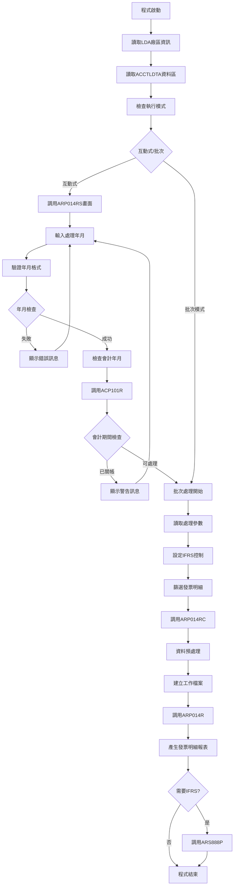
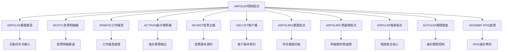
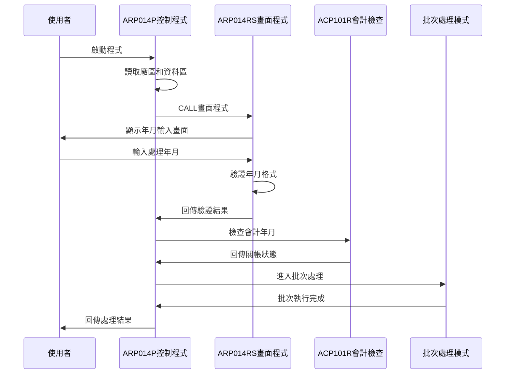
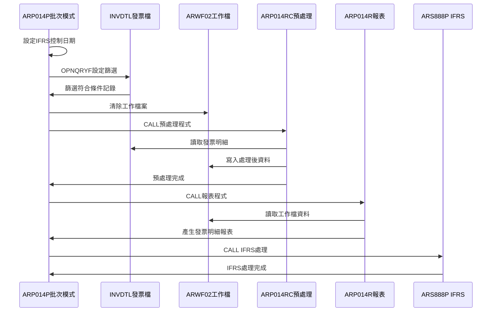
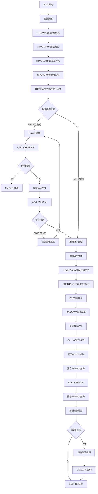

# ARP014P_K02 程式規格書

## 1. 基本資料

| 項目 | 內容 |
|------|------|
| **程式編號** | ARP014P |
| **程式名稱** | 應收帳款發票明細報表作業 |
| **程式類型** | CLP |
| **廠區** | K02 |
| **系統名稱** | 應收帳款系統 |
| **子系統** | 發票明細管理 |
| **檔案位置** | K02CLSRC_THSRC/ARP014P.txt |

## 🎯 2. 程式功能說明

### 主要功能描述
ARP014P是應收帳款發票明細報表作業的控制程式，負責處理指定年月的發票明細資料，產生相關的會計傳票和報表。程式提供互動式年月輸入和批次處理雙重模式，支援多廠區發票明細管理和IFRS會計準則相關處理。

### 🎯 業務流程詳細說明

#### 完整業務流程圖


#### 業務流程關鍵階段說明

**階段一：環境初始化與參數讀取**
- 從LDA讀取廠區代碼和工作站ID
- 讀取ACCTLDTA資料區的會計年月設定
- 使用RTVJOBA檢查執行類型判斷處理模式

**階段二：互動式處理階段**
- 調用ARP014RS進行年月輸入和驗證
- 檢查年月格式正確性(YYYYMM格式)
- 調用ACP101R檢查會計年月是否已關帳
- 關帳期間發出警告訊息並返回重新輸入

**階段三：發票明細篩選處理**
- 從ARIFRSCTL讀取IFRS控制日期並設定LDA
- 使用OPNQRYF篩選INVDTL發票明細檔案：
  * IVYM=處理年月
  * IVACNT='4'(科目代碼4)
  * IVDECD<>'D'(非刪除記錄)
  * IVFLAG<>'D'(非刪除標記)
  * IVFL03<>'Z'(處理標記非Z)
- 按發票號碼(IVNO)排序建立查詢檔案

**階段四：資料處理與報表產生**
- 清除ARWF02工作檔案準備資料處理
- 調用ARP014RC進行發票明細預處理和分類
- 建立ARWF02工作檔案查詢按日期、廠區、編號排序
- 調用ARP014R產生發票明細報表
- 根據年月判斷是否執行IFRS處理(年月<IFRS啟用日期)

## 🎯 3. 檔案架構與關聯圖

### 使用檔案清單

| 檔案名稱 | 檔案用途 | 存取方式 | 關聯說明 |
|---------|----------|----------|----------|
| **ARP014S** | 年月輸入畫面 | WORKSTN | 互動式輸入介面 |
| **INVDTL** | 發票明細主檔 | INPUT | 原始發票明細資料 |
| **ARWF02** | 發票工作檔案 | OUTPUT | 批次處理工作檔 |
| **ACTRAN** | 會計傳票檔案 | OUTPUT | 依廠區動態命名 |
| **INVMST** | 發票主檔 | INPUT | 發票基本資料 |
| **CBCUST** | 客戶基本檔 | INPUT | 客戶基本資料 |
| **ARP014RS** | 畫面處理程式 | CALL | 年月輸入驗證 |
| **ARP014RC** | 資料預處理程式 | CALL | 發票明細預處理 |
| **ARP014R** | 報表處理程式 | CALL | 主要報表生成 |
| **ACP101R** | 會計期間檢查 | CALL | 關帳狀態驗證 |
| **ARS888P** | IFRS處理程式 | CALL | 國際會計準則 |

### 🎯 檔案關聯詳細視覺化圖表



### 🎯 資料流向詳細說明

#### 互動式操作的資料流向


#### 批次處理階段的資料流向


## 🎯 4. 檔案欄位規格說明

### 主要變數結構

#### CLP程式變數定義
| 變數名稱 | 資料型態 | 長度 | 用途說明 |
|---------|----------|------|----------|
| **&P#YYMM** | CHAR | 6 | 會計年月(YYMMDD格式) |
| **&P#DATE** | CHAR | 8 | 處理日期(YYYYMMDD) |
| **&P#CODE** | CHAR | 1 | 會計檢查回傳碼 |
| **&INT** | CHAR | 1 | 執行模式(1=互動/0=批次) |
| **&OUTQ** | CHAR | 10 | 輸出佇列名稱 |
| **&IN03** | LGL | 1 | F3功能鍵指示器 |
| **&ACYM** | CHAR | 6 | 會計年月 |
| **&YM** | CHAR | 6 | 處理年月 |
| **&AREA** | CHAR | 1 | 廠區代碼 |
| **&Y** | CHAR | 4 | 年份 |
| **&M** | CHAR | 2 | 月份 |
| **&DTARA** | CHAR | 11 | 資料區名稱 |
| **&WSID** | CHAR | 10 | 工作站ID |
| **&D#VNO1** | CHAR | 6 | 傳票號碼起始 |
| **&D#VNO2** | CHAR | 6 | 傳票號碼結束 |
| **&IFRSD** | CHAR | 6 | IFRS啟用年月 |

### 🔍 重點欄位切割技術詳解

#### LDA資料區切割視覺化：
```
LDA記錄：[YYYYMM|01|..............................|FXXXXX|....|FXXXXX|....|YYYYMM|...........|工作站ID__|A|..]
位置:    001-06 07-08  09-200                    201-206  207-210  211-216  217-220  221-226  227-1010    1011-1020 1021 1022-1024
         ↓      ↓      ↓                         ↓        ↓        ↓        ↓        ↓        ↓           ↓         ↓    ↓
處理年月: [202403]                                                                                                          處理年月主儲存
日期補齊:       [01]                                                                                                       固定日期補齊
系統保留:              [..............................] 系統預留空間
IFRS起始:                                       [F00001]                                                                   IFRS傳票起始號
緩衝區A:                                                [....]                                                            保留緩衝區
IFRS結束:                                                       [F99999]                                                  IFRS傳票結束號  
緩衝區B:                                                               [....]                                            保留緩衝區
IFRS控制:                                                                       [202401]                                  IFRS啟用年月
系統擴展:                                                                               [............]                    系統擴展預留
工作站ID:                                                                                          [TERM01___]            使用者終端
廠區代碼:                                                                                                    [K]          廠區識別
尾端保留:                                                                                                      [..]       保留區域
```

##### LDA切割邏輯說明：
**切割策略**：LDA採用固定位置切割法，利用AS/400系統的RTVDTAARA和CHGDTAARA指令進行精確位置存取
**關鍵技術**：
1. **位置定位法**：使用(起始位置 長度)格式精確定位記憶體區塊
2. **區域分工**：不同功能區域分配不同位置範圍，避免資料覆蓋
3. **緩衝保護**：在重要區域間設置緩衝區，防止資料溢出
4. **動態識別**：透過廠區代碼實現多廠區環境的動態識別

**存取範例**：
- RTVDTAARA DTAARA(*LDA (1 6)) RTNVAR(&YM) - 讀取位置1-6的處理年月
- CHGDTAARA DTAARA(*LDA (201 6)) VALUE(&D#VNO1) - 設定位置201-206的IFRS起始號

#### LDA重疊讀取切割視覺化：
```
位置重疊：[2|0|2|4|0|3|0|1]
位置:     1 2 3 4 5 6 7 8
          ↓   ↓   ↓   ↓
年份:     [2024]                 4字元年份提取
年月:     [202403]               6字元年月提取  
月份:           [03]             2字元月份提取
完整日期: [20240301]             8字元完整日期
```

##### 重疊讀取切割邏輯說明：
**切割原理**：利用相同記憶體位置的不同長度讀取，實現一次儲存多次使用的效率優化
**技術實現**：
1. **位置重疊技術**：從位置1開始，使用不同長度參數讀取不同資料
2. **長度控制法**：透過RTVDTAARA的長度參數控制讀取範圍
3. **資料分解**：將8位完整日期分解為4位年份、6位年月、2位月份
4. **記憶體效率**：減少LDA空間使用，提高資料存取效率

**讀取邏輯**：
- 位置1-4：年份(&Y) = '2024'
- 位置1-6：年月(&YM) = '202403'  
- 位置5-6：月份(&M) = '03'
- 位置1-8：完整日期(&P#DATE) = '20240301'

#### MAPFLD轉換切割視覺化：
```
轉換階段：[20240315] → [20240315] → ['20240315'] → ['202403']
階段:     原始數值    ZONE6格式    CHAR6字元     年月切割
位置:     12345678    12345678     12345678      123456
          ↓           ↓            ↓             ↓
IVACDT:   [20240315]                             原始會計日期
ZONE6:                [20240315]                 數值格式化
CHAR6:                            ['20240315']   字元轉換
IVYM:                                            ['202403'] 年月萃取
```

##### MAPFLD轉換切割邏輯說明：
**切割策略**：三階段漸進式轉換，從數值型態逐步轉換為可切割的字元型態
**技術核心**：
1. **型態轉換鏈**：NUMERIC → ZONED → CHAR → SUBSTRING
2. **ZONE6階段**：統一數值格式，消除不同數值型態的差異
3. **CHAR6階段**：啟用字串操作功能，為%SST切割做準備
4. **%SST切割**：精確提取年月部分，捨棄日期部分

**轉換邏輯**：
- 階段1：IVACDT(20240315) → ZONE6(20240315) 數值標準化
- 階段2：ZONE6(20240315) → CHAR6('20240315') 字元轉換
- 階段3：CHAR6('20240315') → IVYM('%SST(CHAR6 1 6)') = '202403'

#### OPNQRYF篩選條件切割視覺化：
```
篩選條件：[IVYM=YM] AND [IVACNT=4] AND [IVDECD≠D] AND [IVFLAG≠D] AND [IVFL03≠Z]
條件:     條件1       條件2        條件3        條件4        條件5
          ↓           ↓            ↓            ↓            ↓
年月篩選: [202403]                                                    指定年月篩選
科目限制:             [4]                                             科目代碼4限制  
刪除檢查:                          [≠D]                               排除已刪除記錄
標記檢查:                                       [≠D]                  排除標記刪除
狀態檢查:                                                    [≠Z]     排除Z狀態記錄
```

##### OPNQRYF篩選切割邏輯說明：
**切割策略**：多重條件組合篩選，採用AND邏輯鏈實現精確資料過濾
**邏輯架構**：
1. **串聯篩選法**：5個條件必須全部通過，任一失敗即排除記錄
2. **優先順序**：年月→科目→刪除→標記→狀態，按重要性排序
3. **短路評估**：前面條件失敗時，後續條件不再檢查，提升效能
4. **條件隔離**：每個條件獨立評估，避免條件間相互影響

**篩選邏輯**：
- 條件1：IVYM *EQ &YM (年月必須匹配處理年月)
- 條件2：IVACNT *EQ '4' (科目代碼必須為4)
- 條件3：IVDECD *NE 'D' (排除已刪除記錄)
- 條件4：IVFLAG *NE 'D' (排除標記刪除記錄)
- 條件5：IVFL03 *NE 'Z' (排除Z狀態記錄)

#### 檔案名稱組合切割視覺化：
```
檔案組合：[AC] + [廠區] + [R] = [會計檔名]
組合:     前綴   變動     後綴   結果
          ↓      ↓        ↓      ↓
前綴:     [AC]                   會計檔案前綴
廠區:            [K]             K02廠區代碼
後綴:                     [R]    記錄檔案後綴
結果:                            [ACKR] K02廠區會計傳票檔
```

##### 檔案名稱組合切割邏輯說明：
**切割策略**：三段式字串拼接法，透過固定前後綴與變動廠區代碼實現動態檔案命名
**組合原理**：
1. **前綴識別**：'AC'代表會計(Accounting)檔案類型
2. **廠區變數**：從LDA讀取的廠區代碼作為變動識別符
3. **後綴分類**：'R'代表記錄(Record)檔案格式
4. **字串串接**：使用||運算子進行CLP字串拼接

**組合邏輯**：
- 步驟1：固定前綴 'AC' (會計檔案識別)
- 步驟2：動態廠區 &AREA (從LDA位置1021讀取)
- 步驟3：固定後綴 'R' (記錄檔案標識)
- 最終：'AC' || &AREA || 'R' = 'ACKR'

#### 資料區名稱組合切割視覺化：
```
名稱組合：[ACCTLDTA] + [廠區] = [資料區名稱]
組合:     基本名稱     變動     最終名稱
          ↓            ↓        ↓
基本:     [ACCTLDTA]            會計資料區基本名
廠區:                  [K]      K02廠區識別碼
結果:                           [ACCTLDTAK] K02廠區專屬會計資料區
```

##### 資料區名稱組合切割邏輯說明：
**切割策略**：雙段式字串拼接法，透過基本名稱與廠區標識符實現動態資料區命名
**組合架構**：
1. **基本標識**：'ACCTLDTA'代表會計帳款主資料區(ACCounting Ledger DaTa Area)
2. **廠區後綴**：廠區代碼直接附加，無分隔符號
3. **動態變數**：&AREA從LDA位置1021動態讀取
4. ***CAT運算**：CLP的字串串接運算子

**組合邏輯**：
- 步驟1：基本識別 'ACCTLDTA' (會計主資料區標識)
- 步驟2：串接運算子 *CAT (字串拼接指令)
- 步驟3：廠區變數 &AREA (動態廠區代碼)
- 最終：'ACCTLDTA' *CAT &AREA = 'ACCTLDTAK'

#### IFRS控制切割視覺化：
```
IFRS判斷：[處理年月] < [IFRS控制] = [處理結果]
比較:     待處理     比較算子  控制基準   執行判斷
          ↓          ↓        ↓          ↓
處理年月: [202312]                       待處理的年月
比較符號:            [<]                 小於比較
控制年月:                     [202401]   IFRS啟用基準
判斷結果:                                [✓執行IFRS] 需要執行IFRS處理
```

##### IFRS控制切割邏輯說明：
**切割策略**：時間軸比較法，透過年月字元比較判斷是否需要執行IFRS會計準則處理
**比較機制**：
1. **字元比較**：CLP使用*LT運算子進行字元序列比較
2. **時間邏輯**：YYYYMM格式確保字典序等同時間序
3. **控制切點**：IFRS啟用年月作為處理分界點
4. **條件執行**：只有早於IFRS啟用期間的資料才需要特殊處理

**判斷邏輯**：
- 讀取：RTVDTAARA DTAARA(ARIFRSCTL (1 6)) RTNVAR(&IFRSD)
- 比較：IF COND(&YM *LT &IFRSD)
- 範例：'202312' < '202401' = TRUE (需要IFRS處理)
- 範例：'202405' < '202401' = FALSE (不需要IFRS處理)

### 欄位挪用分析

#### LDA記憶體區域的多重挪用
- 位置001-006：原設計為暫存，挪用為處理年月主儲存
- 位置007-008：原設計為暫存，挪用為日期補齊區域
- 位置201-206：原設計為保留，挪用為IFRS傳票起始號
- 位置211-216：原設計為保留，挪用為IFRS傳票結束號
- 位置221-226：原設計為保留，挪用為IFRS控制年月
- 位置1021：原設計為環境設定，挪用為廠區代碼識別

#### MAPFLD欄位轉換的技術挪用
- ZONE6：原設計為數值格式，挪用為轉換中介層
- CHAR6：原設計為字元格式，挪用為切割預備區
- %SST函數：原設計為字串操作，挪用為年月萃取工具

#### 動態檔案名稱的業務挪用
- 前綴'AC'：原設計為檔案分類，挪用為廠區別檔案識別
- 後綴'R'：原設計為檔案類型，挪用為會計傳票檔案標記
- 廠區代碼：原設計為環境識別，挪用為檔案命名變數

### 🎯 欄位挪用詳細分析

#### LDA多用途挪用分析
| 位置範圍 | 原始用途 | 實際挪用 | 挪用原因 |
|----------|----------|----------|----------|
| **1-6** | 暫存區域 | 處理年月存放 | 跨程式年月傳遞 |
| **7-8** | 暫存區域 | 日期補齊('01') | 年月轉換為完整日期 |
| **201-206** | 保留區域 | IFRS傳票號碼起始 | IFRS處理範圍控制 |
| **211-216** | 保留區域 | IFRS傳票號碼結束 | IFRS處理範圍控制 |
| **221-226** | 保留區域 | IFRS控制年月 | IFRS啟用日期控制 |
| **1011-1020** | 使用者資訊 | 工作站識別 | 訊息發送目標 |
| **1021** | 環境設定 | 廠區代碼 | 多廠區環境識別 |

#### 發票明細篩選條件技術
```
OPNQRYF篩選條件：
IVYM *EQ "' || &YM || '"          指定年月
IVACNT *EQ "4"                    科目代碼4
IVDECD *NE "D"                    非刪除記錄
IVFLAG *NE "D"                    非刪除標記
IVFL03 *NE "Z"                    處理標記非Z

欄位對應：
ZONE6 IVACDT *ZONED 8             日期數值轉換
CHAR6 ZONE6 *CHAR 8               數值轉字元
IVYM '%SST(CHAR6 1 6)' *CHAR 6    截取年月部分
```

## 🎯 5. 輸出/入螢幕布局

### 🎯 主輸入畫面(ARP014S)

```
+----------------------------------------------------------+
|  99/12/26    東鋼企業股份有限公司              ARP014S   |
|  09:30:25      應收帳款發票明細報表作業          DEVNAME |
|                                                          |
|                                                          |
|                                                          |
|                                                          |
|                      報表產生:                          |
| 廠區代碼:[K] (P:台北K:高雄)                             |
|                                                          |
| 報表年月:[____]                                         |
|                                                          |
|                                                          |
|                                                          |
|                                                          |
|                                                          |
|                                                          |
|                                                          |
|                                                          |
|                                                          |
| [錯誤訊息顯示區]                                          |
| ENTER:確認                    PF03:離開                  |
+----------------------------------------------------------+
```

### 🎯 畫面欄位詳細說明

#### 輸入欄位規格
| 欄位名稱 | 型態 | 長度 | 輸入格式 | 驗證規則 | 說明 |
|---------|------|------|----------|----------|------|
| **AREA** | 字元 | 1 | P/K | 廠區代碼檢查 | 廠區代碼(唯讀顯示) |
| **YM** | 數值 | 6 | YYYYMM | 年月格式驗證 | 處理年月(必填) |

#### 顯示欄位規格
| 欄位名稱 | 型態 | 長度 | 顯示格式 | 說明 |
|---------|------|------|----------|------|
| **COMP** | 字元 | 35 | 左對齊 | 公司名稱 |
| **DEVNM** | 字元 | 10 | 右對齊 | 終端機名稱 |
| **ERRMSG** | 字元 | 70 | 左對齊反白 | 錯誤訊息顯示 |

### 🎯 畫面控制邏輯

#### 指示器控制
| 指示器 | 控制邏輯 | 畫面效果 |
|--------|----------|----------|
| **IN41** | 年月錯誤時設定 | YM欄位反白並強制輸入 |
| **IN99** | 程式結束控制 | 設定後結束畫面處理 |

### 功能鍵詳細定義

| 功能鍵 | 處理邏輯 | 系統行為 |
|--------|----------|----------|
| **F3** | 離開程式 | 設定*IN03='1'，結束程式執行 |
| **ENTER** | 確認處理 | 執行年月驗證和批次作業執行 |

## 🎯 6. 處理流程程序說明

### 🎯 主程序邏輯深度分析

#### 程式執行流程圖


#### 🎯 詳細處理步驟逐一分析

**步驟1: 環境初始化處理**
1. 宣告所有CLP變數並設定初始型態
2. 使用RTVJOBA取得執行類型和輸出佇列
3. 從LDA位置1021讀取廠區代碼存入&AREA
4. 從LDA位置1011-1020讀取工作站ID存入&WSID
5. 組合資料區名稱：'ACCTLDTA' || &AREA
6. 從ACCTLDTA資料區讀取上次處理的會計年月

**步驟2: 互動式模式處理邏輯**
1. 進入DISPLY迴圈調用ARP014RS畫面程式
2. 畫面程式驗證年月格式(YYYYMM)和合理性
3. 檢查F3功能鍵，按下則RETURN結束程式
4. 將年月存入LDA位置1-6，日期部分設為'01'
5. 調用ACP101R檢查會計年月關帳狀態
6. 關帳期間發送警告訊息並返回重新輸入
7. 通過檢查後繼續執行批次處理邏輯

**步驟3: 批次模式核心處理**
1. 從LDA讀取處理年月、年份、月份、廠區等參數
2. 從ARIFRSCTL資料區讀取IFRS控制年月
3. 將IFRS控制年月設定到LDA位置221-226
4. 設定INVDTL檔案共享模式存取
5. 建立OPNQRYF查詢篩選條件：
   - IVYM=處理年月：指定年月的發票
   - IVACNT='4'：科目代碼為4的發票
   - IVDECD<>'D'：非刪除記錄
   - IVFLAG<>'D'：非刪除標記
   - IVFL03<>'Z'：處理標記非Z
6. 按發票號碼(IVNO)排序並設定欄位對應

**步驟4: 資料處理與報表產生**
1. 設定ACTRAN會計傳票檔案覆蓋為廠區檔案
2. 設定ARWF02工作檔案為共享模式
3. 清除ARWF02工作檔案準備資料處理
4. 調用ARP014RC進行發票明細預處理：
   - 讀取INVDTL發票明細記錄
   - 根據廠區進行發票分類處理
   - 寫入ARWF02工作檔案
5. 關閉INVDTL查詢檔案釋放資源
6. 建立ARWF02查詢檔案按日期、廠區、編號排序
7. 調用ARP014R產生發票明細報表

**步驟5: IFRS處理與收尾作業**
1. 關閉ARWF02查詢檔案並刪除檔案覆蓋
2. 檢查處理年月是否小於IFRS控制年月
3. 需要IFRS處理時：
   - 從LDA位置201-206讀取傳票號碼起始
   - 從LDA位置211-216讀取傳票號碼結束
   - 調用ARS888P進行IFRS會計準則處理
   - 傳遞廠區、年月、傳票範圍參數
4. 執行ENDPGM正常結束程式

### 🎯 子程序邏輯分析

#### 年月驗證邏輯(ARP014RS)
1. **格式驗證**：調用UTS102R檢查YYYYMM年月格式
2. **範圍檢查**：年月合理性驗證
3. **錯誤處理**：設定指示器41進行欄位反白
4. **使用者互動**：錯誤時保持畫面等待重新輸入

#### 發票明細預處理邏輯(ARP014RC)
1. **廠區分類**：根據TXAR廠區和INAREA發票廠區進行分類
2. **客戶資料**：CHAIN CBCUST讀取客戶基本資料
3. **傳票處理**：產生會計傳票記錄到ACTRAN檔案
4. **工作檔案**：將處理結果寫入ARWF02工作檔案

#### 報表產生邏輯(ARP014R)
1. **資料讀取**：從ARWF02工作檔案讀取處理後資料
2. **報表格式**：使用132行寬格式產生報表
3. **統計計算**：計算發票明細的數量和金額統計
4. **傳票更新**：更新INVDTL發票明細的處理標記

### 🎯 特殊邏輯處理

#### 動態檔案命名技術
- 會計傳票檔案依廠區動態命名：'AC'+廠區+'R'
- 資料區名稱依廠區組合：'ACCTLDTA'+廠區代碼
- 支援多廠區獨立處理避免資料混合

#### IFRS處理判斷機制
- 從ARIFRSCTL讀取IFRS控制年月設定
- 處理年月小於IFRS控制年月時執行IFRS處理
- 使用LDA位置221-226傳遞IFRS控制資訊

#### 發票明細篩選技術
- 使用OPNQRYF的QRYSLT進行複合條件篩選
- MAPFLD進行欄位格式轉換和截取
- KEYFLD設定排序鍵值提升處理效率

## 🎯 7. 數據操作與轉換分析

### 檔案操作詳解

#### OPNQRYF發票明細篩選
1. **篩選條件設定**：
   ```
   QRYSLT條件語法：
   IVYM *EQ "' || &YM || '"          指定年月發票
   IVACNT *EQ "4"                    科目代碼4
   IVDECD *NE "D"                    非刪除記錄
   IVFLAG *NE "D"                    非刪除標記
   IVFL03 *NE "Z"                    處理標記非Z
   ```

2. **欄位對應設定**：
   ```
   MAPFLD對應：
   (ZONE6 IVACDT *ZONED 8)          日期數值格式
   (CHAR6 ZONE6 *CHAR 8)            轉換為字元格式
   (IVYM '%SST(CHAR6 1 6)' *CHAR 6) 截取年月部分
   ```

3. **排序鍵值設定**：
   ```
   KEYFLD排序：
   ((IVNO))                         按發票號碼排序
   ```

#### LDA和資料區操作
1. **RTVDTAARA讀取操作**：
   - RTVDTAARA DTAARA(*LDA (1021 1)) RTNVAR(&AREA) - 讀取廠區
   - RTVDTAARA DTAARA(&DTARA (1 6)) RTNVAR(&ACYM) - 讀取會計年月
   - RTVDTAARA DTAARA(ARIFRSCTL (1 6)) RTNVAR(&IFRSD) - 讀取IFRS控制

2. **CHGDTAARA更新操作**：
   - CHGDTAARA DTAARA(*LDA (1 6)) VALUE(&YM) - 設定處理年月
   - CHGDTAARA DTAARA(*LDA (7 2)) VALUE('01') - 設定日期部分
   - CHGDTAARA DTAARA(*LDA (221 6)) VALUE(&IFRSD) - 設定IFRS控制

### 數據轉換邏輯

#### 年月格式轉換
1. **年月輸入驗證**：
   - MOVE YM APDT - 年月轉為日期變數
   - MOVE 01 APDT - 補齊日期為01日
   - 調用UTS102R進行日期格式檢查

2. **年月分解處理**：
   - RTVDTAARA DTAARA(*LDA (1 4)) RTNVAR(&Y) - 提取年份
   - RTVDTAARA DTAARA(*LDA (5 2)) RTNVAR(&M) - 提取月份
   - RTVDTAARA DTAARA(*LDA (1 6)) RTNVAR(&YM) - 完整年月

#### 字串組合操作
1. **資料區名稱組合**：
   - CHGVAR VAR(&DTARA) VALUE('ACCTLDTA' *CAT &AREA)
   - 組合廠區專屬的會計資料區名稱

2. **會計檔案名稱組合**：
   - OVRDBF FILE(ACTRAN) TOFILE('AC' || &AREA || 'R')
   - 動態組合廠區專屬的會計傳票檔案

### 計算邏輯分析

#### IFRS年月比較
1. **IFRS處理判斷**：
   - IF COND(&YM *LT &IFRSD) - 年月字元型比較
   - 處理年月小於IFRS啟用年月時執行特殊處理
   - 確保會計準則正確適用

2. **傳票範圍控制**：
   - 從LDA位置201-206和211-216讀取傳票號碼範圍
   - 傳遞給ARS888P進行IFRS範圍處理

### 檢核機制詳解

#### 會計期間檢核
1. **關帳狀態檢查**：
   - 調用ACP101R傳入年月參數
   - 回傳P#CODE='1'表示期間已關帳
   - 已關帳期間禁止資料異動

2. **年月合理性檢核**：
   - ARP014RS中檢查年月格式
   - 確保年月輸入的正確性

#### 發票明細檢核
1. **發票狀態檢核**：
   - IVDECD<>'D'：確保非刪除發票
   - IVFLAG<>'D'：確保非刪除標記
   - IVFL03<>'Z'：確保可處理狀態

2. **科目代碼檢核**：
   - IVACNT='4'：只處理科目代碼4的發票
   - 確保處理特定類型的發票明細

## 🎯 8. 錯誤處理程序說明

### 🎯 詳細錯誤代碼清冊

| 錯誤代碼 | 錯誤訊息 | 原因說明 | 處理方式 | 預防措施 |
|----------|---------|---------|---------|----------|
| **ERR,1** | 年月不合格式 | 輸入年月格式不正確或無效年月 | 1. 重新輸入正確年月格式<br>2. 檢查年月合理性<br>3. 使用YYYYMM格式 | 提供年月格式說明和範例 |
| **P#CODE='1'** | 會計期間已關帳 | 輸入年月所屬會計期間已關帳 | 1. 選擇未關帳期間年月<br>2. 聯繫會計人員確認<br>3. 等待期間重新開啟 | 顯示可處理期間範圍 |
| **檔案鎖定** | 檔案被其他程式使用 | INVDTL檔案被其他使用者鎖定 | 1. 等待其他使用者完成<br>2. 稍後重新執行<br>3. 聯繫系統管理員 | 設定合理的檔案共享參數 |
| **資料區錯誤** | 無法存取廠區資料區 | ACCTLDTA資料區不存在或損壞 | 1. 檢查資料區是否存在<br>2. 重建資料區結構<br>3. 恢復備份資料 | 定期備份重要資料區 |
| **IFRS控制錯誤** | ARIFRSCTL資料區異常 | IFRS控制資料區存取失敗 | 1. 檢查IFRS控制設定<br>2. 重建IFRS資料區<br>3. 確認IFRS啟用狀態 | 維護IFRS控制資料一致性 |

### 🎯 系統異常處理邏輯

#### 檔案操作失敗處理
1. **OPNQRYF失敗處理**：
   - 檢查INVDTL檔案是否存在和可存取
   - 驗證查詢條件語法正確性
   - 提供檔案狀態診斷資訊
   - 記錄失敗原因供後續分析

2. **工作檔案操作失敗**：
   - 檢查ARWF02工作檔案權限
   - 確認檔案空間充足
   - 驗證檔案結構完整性
   - 提供檔案重建機制

#### 程式調用失敗處理
1. **ARP014RS調用失敗**：
   - 檢查畫面程式是否存在
   - 驗證參數傳遞正確性
   - 提供手動年月輸入替代方案
   - 記錄調用失敗詳細資訊

2. **ACP101R調用失敗**：
   - 檢查會計檢查程式可用性
   - 提供會計期間狀態查詢替代方式
   - 允許強制執行選項(管理員權限)
   - 記錄會計檢查異常狀況

#### 資料完整性錯誤處理
1. **發票明細資料不一致**：
   - 重新讀取INVDTL發票明細檔案
   - 同步更新相關檔案狀態
   - 防止部分處理造成資料錯亂
   - 提供資料一致性檢查機制

2. **IFRS處理衝突**：
   - 檢查IFRS控制年月設定
   - 確認年月比較邏輯正確
   - 避免重複執行IFRS處理
   - 建立IFRS處理記錄追蹤

## 🎯 9. 備註

### 🎯 特殊注意事項

#### 發票明細篩選邏輯
- 程式專門處理科目代碼為'4'的發票明細
- 篩選條件確保只處理有效且未刪除的發票
- IVFL03<>'Z'條件控制發票處理狀態

#### IFRS會計準則處理
- 系統根據ARIFRSCTL控制檔判斷是否執行IFRS處理
- 處理年月早於IFRS啟用年月時才執行ARS888P程式
- IFRS處理使用LDA位置201-216的傳票號碼範圍控制

#### 多廠區環境控制
- 程式依靠LDA位置1021的廠區代碼進行環境區分
- 資料區名稱和會計檔案名稱都會依廠區動態組合
- 發票明細預處理會根據廠區進行分類處理

#### 檔案共享機制
- 所有檔案都設定SHARE(*YES)支援多使用者同時存取
- OPNQRYF查詢檔案使用後必須使用CLOF適時關閉
- 檔案覆蓋使用DLTOVR FILE(*ALL)統一清除

#### 年月處理注意事項
- 系統使用YYYYMM格式進行年月輸入和處理
- 年月驗證包含格式檢查和合理性範圍檢查
- 會計期間檢查確保不會處理已關帳期間的資料

#### 工作檔案管理
- ARWF02工作檔案在每次處理前會先清除
- 工作檔案按日期、廠區、編號排序提升報表效率
- 適時關閉和清理工作檔案避免佔用系統資源 