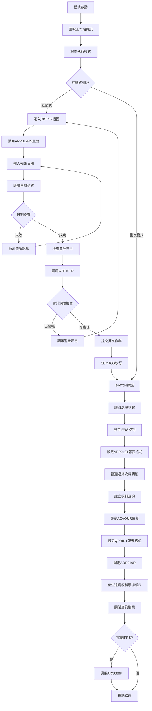
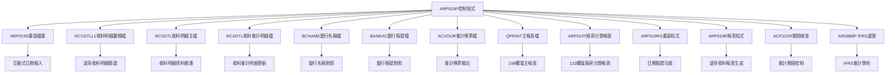
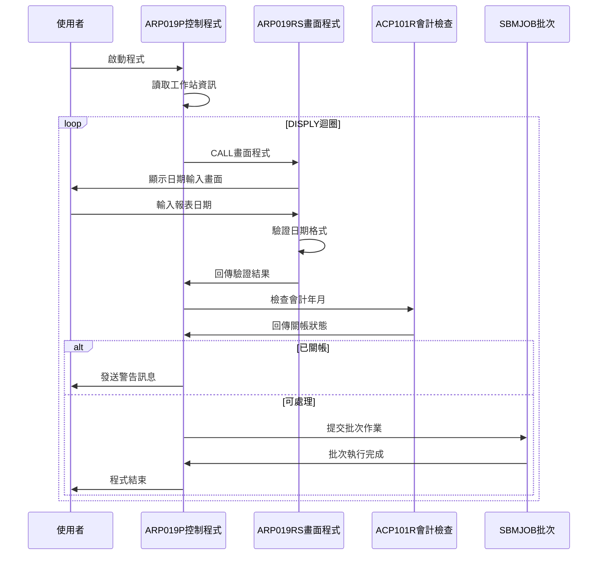
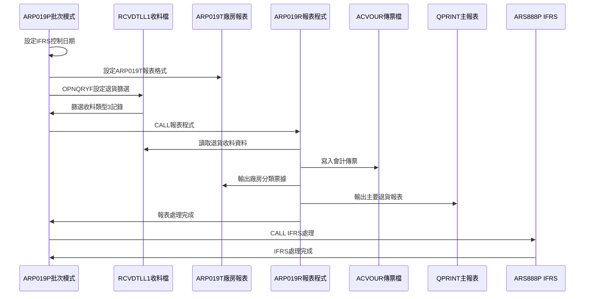
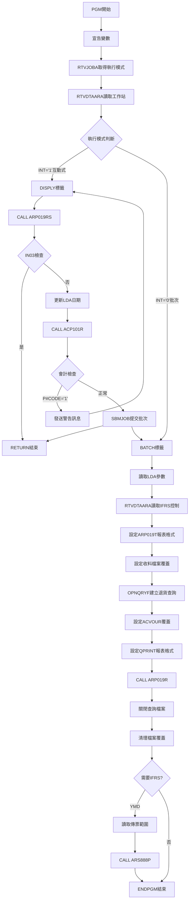

# ARP019P_U01 程式規格書

## 1. 基本資料

| 項目 | 內容 |
|------|------|
| **程式編號** | ARP019P |
| **程式名稱** | 退貨收料傳票入帳及廠房分類票據報表作業 |
| **程式類型** | CLP |
| **廠區** | U01 |
| **系統名稱** | 應收帳款系統 |
| **子系統** | 退貨收料管理 |
| **檔案位置** | U01CLSRC_THSRC/ARP019P.txt |

## 🎯 2. 程式功能說明

### 主要功能描述
ARP019P是退貨收料傳票入帳及廠房分類票據報表作業的控制程式，專門處理收料類型3(退貨收料)的資料，負責產生退貨相關的會計傳票和廠房分類票據報表。程式提供互動式日期輸入功能，支援多廠區退貨收料分類處理，產生專業的退貨收料票據格式報表，並整合IFRS會計準則相關處理。

### 🎯 業務流程詳細說明

#### 完整業務流程圖


#### 業務流程關鍵階段說明

**階段一：環境初始化與參數設定**
- 使用RTVJOBA檢查執行類型和輸出佇列
- 從LDA讀取工作站ID
- 專注於退貨收料類型3的處理

**階段二：互動式處理階段**
- 進入DISPLY迴圈持續處理使用者輸入
- 調用ARP019RS進行日期輸入和驗證
- 檢查日期格式正確性(YYYYMMDD格式)
- 調用ACP101R檢查會計年月是否已關帳
- 關帳期間發出警告訊息並返回重新輸入
- 通過檢查後使用SBMJOB提交批次作業

**階段三：退貨收料明細篩選處理**
- 從ARIFRSCTL讀取IFRS控制日期並設定
- 設定ARP019T報表格式：132欄寬、CPI 10
- 使用OPNQRYF篩選RCVDTLL1收料明細檔案：
  * RVDATE=處理日期
  * RVTYPE="3"(退貨收料類型)
  * %SST(RVNO 1 1)=廠區代碼
  * RVDECD<>'D'(非刪除記錄)
- 按收料編號(RVNO)、項次(RVITEM)排序建立查詢檔案

**階段四：退貨收料票據報表處理與收尾**
- 設定ACVOUR會計傳票檔案覆蓋為廠區檔案
- 設定QPRINT主報表格式：198欄寬、CPI 15
- 調用ARP019R產生退貨收料傳票入帳報表：
  * 讀取篩選後的退貨收料明細記錄
  * 關聯RCADTL、BCNAME、BANKAC等檔案
  * 更新RCVDTL收料明細檔案
  * 產生會計傳票記錄到ACVOUR檔案
  * 輸出ARP019T廠房分類票據報表
  * 輸出QPRINT主要退貨收料報表
- 關閉查詢檔案並清理檔案覆蓋
- 檢查處理日期是否小於IFRS控制日期
- 需要IFRS處理時調用ARS888P進行會計準則處理

## 🎯 3. 檔案架構與關聯圖

### 使用檔案清單

| 檔案名稱 | 檔案用途 | 存取方式 | 關聯說明 |
|---------|----------|----------|----------|
| **ARP019S** | 日期輸入畫面 | WORKSTN | 互動式輸入介面 |
| **RCVDTLL1** | 收料明細邏輯檔 | INPUT | 按日期、發票號碼、收料編號排序 |
| **RCVDTL** | 收料明細主檔 | UPDATE | 收料明細資料維護 |
| **RCADTL** | 收料會計明細檔 | UPDATE | 收料會計明細資料 |
| **BCNAME** | 銀行名稱檔 | INPUT | 銀行名稱對照 |
| **BANKAC** | 銀行帳號檔 | INPUT | 銀行帳號資料 |
| **ACVOUR** | 會計傳票檔案 | UPDATE | 依廠區動態命名 |
| **QPRINT** | 主報表輸出檔 | OUTPUT | 198欄寬報表輸出 |
| **ARP019T** | 廠房分類票據報表 | OUTPUT | 132欄寬專用報表 |
| **ARP019RS** | 畫面處理程式 | CALL | 日期輸入驗證 |
| **ARP019R** | 報表處理程式 | CALL | 主要報表生成 |
| **ACP101R** | 會計期間檢查 | CALL | 關帳狀態驗證 |
| **ARS888P** | IFRS處理程式 | CALL | 國際會計準則 |

### 🎯 檔案關聯詳細視覺化圖表



### 🎯 資料流向詳細說明

#### 互動式操作的資料流向


#### 批次處理階段的資料流向


## 🎯 4. 檔案欄位規格說明

### 主要資料結構

#### ARP019P程式變數宣告結構

| 變數名稱 | 型態 | 長度 | 宣告行 | 用途說明 |
|----------|------|------|--------|---------|
| **&P#YYMM** | *CHAR | 6 | 18 | 會計年月參數 |
| **&P#DATE** | *CHAR | 8 | 19 | 處理日期參數 |
| **&P#CODE** | *CHAR | 1 | 20 | 會計期間檢查回傳碼 |
| **&INT** | *CHAR | 1 | 21 | 執行模式判斷變數 |
| **&OUTQ** | *CHAR | 10 | 22 | 輸出佇列名稱 |
| **&IN03** | *LGL | 1 | 23 | F3功能鍵邏輯指示器 |
| **&YMD** | *CHAR | 8 | 24 | 報表處理日期 |
| **&AREA** | *CHAR | 1 | 25 | 廠區代碼識別 |
| **&Y** | *CHAR | 4 | 26 | 年份切割變數 |
| **&M** | *CHAR | 2 | 27 | 月份切割變數 |
| **&WSID** | *CHAR | 10 | 28 | 工作站識別碼 |
| **&D#VNO1** | *CHAR | 6 | 29 | IFRS傳票起始號 |
| **&D#VNO2** | *CHAR | 6 | 30 | IFRS傳票結束號 |
| **&YM** | *CHAR | 6 | 31 | IFRS年月參數 |
| **&IFRSD** | *CHAR | 8 | 32 | IFRS啟用基準日期 |

#### ARP019RS程式DS結構完整分析

```
ARP019RS程式中的DS結構：

DS#1: AADS (系統日期結構)
位置021-026: [XXXXXX]                 系統日期DATE
位置021-024: [XXXX]                   系統日期DATE1 
位置021-022: [XX]                     系統日期DATE2

DS#2: UDS (使用者資料結構)
位置951-985: [XXXXXXXXXXXXXXXXXXXXXXXXXXXXXXXXXXX]  公司名稱COMP
位置1011-1020: [XXXXXXXXXX]           終端機名稱DEVNM
位置1021-1021: [X]                    異動廠區TXAR
```

#### ARP019S螢幕檔案欄位結構

| 欄位名稱 | 型態 | 長度 | 位置 | 屬性 | 說明 |
|----------|------|------|------|------|------|
| **COMP** | CHAR | 35 | 1,23 | OUTPUT | 公司名稱顯示 |
| **DEVNM** | CHAR | 10 | 2,70 | OUTPUT | 終端機名稱 |
| **AREA** | CHAR | 1 | 7,33 | OUTPUT | 廠區代碼顯示 |
| **YMD** | NUMERIC | 8 | 9,21 | BOTH | 報表日期輸入 |
| **ERRMSG** | CHAR | 70 | 23,2 | OUTPUT | 錯誤訊息顯示 |

#### RCVDTL退貨收料檔案欄位結構

| 欄位名稱 | 型態 | 長度 | 篩選使用 | 業務用途 |
|----------|------|------|----------|----------|
| **RVNO** | CHAR | 6 | 字串切割 | 收料編號(第1碼用於廠區識別) |
| **RVITEM** | PACKED | 2,0 | 排序鍵值 | 收料項次 |
| **RVDATE** | PACKED | 8,0 | *EQ &YMD | 收料日期(篩選條件) |
| **RVTYPE** | CHAR | 1 | *EQ '3' | 收料類型(退貨專用) |
| **RVDECD** | CHAR | 1 | *NE 'D' | 刪除代碼(排除已刪除) |
| **RVCUNO** | CHAR | 6 | 業務處理 | 客戶編號 |
| **RVRAMT** | PACKED | 11,0 | 計算處理 | 收料金額 |

### 🔍 重點欄位切割技術詳解

#### DS結構完整分析

**AADS系統日期結構切割視覺化：**
```
AADS結構 (系統日期區域)：
位置021-026: [XXXXXX|XX|XX]
             ↓      ↓  ↓
DATE   (6位): [XXXXXX]           完整系統日期
DATE1  (4位):     [XXXX]         系統日期前4位
DATE2  (2位):         [XX]       系統日期後2位
```

**UDS使用者資料結構切割視覺化：**
```
UDS結構 (使用者資料區域)：
位置951-1021: [XXXXXXXXXXXXXXXXXXXXXXXXXXXXXXXXXXX|XXXXXXXXXX|X]
              ↓                                   ↓          ↓
COMP  (35位): [XXXXXXXXXXXXXXXXXXXXXXXXXXXXXXXXXXX]           公司名稱
DEVNM (10位):                                     [XXXXXXXXXX] 終端機名稱
TXAR  (1位):                                                [X] 異動廠區
```

#### 欄位切割視覺化展示

***LDA位置切割技術完整展示：**
```
*LDA資料區位置切割對應圖：

位置1-8：    [YYYYMMDD]              → &YMD報表處理日期
位置1-4：    [YYYY]                  → &Y年份部分
位置5-6：         [MM]               → &M月份部分
位置1-6：    [YYYYMM]                → &YM年月部分

實際範例：
&YMD = '20231215'
RTVDTAARA DTAARA(*LDA (1 4)) → &Y = '2023'
RTVDTAARA DTAARA(*LDA (5 2)) → &M = '12'
RTVDTAARA DTAARA(*LDA (1 6)) → &YM = '202312'
```

**收料編號切割技術：**
```
RVNO收料編號切割邏輯：
%SST(RVNO 1 1) *EQ &AREA

收料編號結構：[X|XXXXX]
               ↓  ↓
第1碼：        [X]       廠區識別碼
第2-6碼：         [XXXXX] 收料序號

實際範例：
RVNO = 'U12345'
%SST(RVNO 1 1) = 'U'  ← 與&AREA='U'匹配
```

#### 切割邏輯詳細說明

**%SST收料編號切割函數語法解析：**
1. **%SST(RVNO 1 1)**：
   - 來源變數：RVNO收料編號
   - 起始位置：1（第1個字元）
   - 擷取長度：1（單一字元）
   - 用途：提取廠區識別碼

**動態檔案名稱組合技術：**
```
會計傳票檔案名稱組合：
'AC' || &AREA || 'R'
前綴(2) + 廠區碼(1) + 後綴(1) = 檔案名(4)

範例：
&AREA = 'U' → ACUR
&AREA = 'K' → ACKR  
&AREA = 'P' → ACPR
```

#### 實際數據範例說明

**範例1：U01廠區退貨處理**
```
輸入資料：
&AREA = 'U'
&YMD = '20231215'

LDA處理過程：
1. CHGDTAARA DTAARA(*LDA (1 8)) VALUE('20231215')
2. RTVDTAARA DTAARA(*LDA (1 4)) RTNVAR(&Y) → '2023'
3. RTVDTAARA DTAARA(*LDA (5 2)) RTNVAR(&M) → '12'
4. RTVDTAARA DTAARA(*LDA (1 6)) RTNVAR(&YM) → '202312'

OPNQRYF篩選條件：
RVDATE *EQ '20231215'     收料日期匹配
RVTYPE *EQ '3'            退貨收料類型
%SST(RVNO 1 1) *EQ 'U'    U01廠區收料
RVDECD *NE 'D'            非刪除記錄

會計檔案覆蓋：
OVRDBF FILE(ACVOUR) TOFILE('ACUR')
```

**範例2：IFRS處理參數傳遞**
```
IFRS條件判斷：
IF COND(&YMD *LT &IFRSD) THEN(DO)

假設：
&YMD = '20231215'
&IFRSD = '20240101'
條件成立，執行IFRS處理

*LDA位置讀取：
RTVDTAARA DTAARA(*LDA (201 6)) RTNVAR(&D#VNO1)
RTVDTAARA DTAARA(*LDA (211 6)) RTNVAR(&D#VNO2)

假設讀取結果：
&D#VNO1 = 'D00001'
&D#VNO2 = 'D99999'

ARS888P參數傳遞：
CALL PGM(ARS888P) PARM('U' '202312' 'D00001' 'D99999')
```

### 🎯 欄位挪用詳細分析

#### 挪用情況對比表

| 欄位名稱 | 原始定義 | 實際挪用 | 挪用位置 | 挪用方式 |
|----------|----------|----------|----------|----------|
| ***LDA** | 系統共用資料區域 | 程式間參數傳遞 | 多個固定位置 | 位置分割使用 |
| **位置1-8** | 通用暫存區域 | 報表處理日期 | *LDA(1 8) | RTVDTAARA/CHGDTAARA |
| **位置1-4** | 日期年份部分 | 年份切割 | *LDA(1 4) | RTVDTAARA專用讀取 |
| **位置5-2** | 日期月份部分 | 月份切割 | *LDA(5 2) | RTVDTAARA專用讀取 |
| **位置1-6** | 年月組合 | IFRS年月參數 | *LDA(1 6) | RTVDTAARA專用讀取 |
| **位置201-206** | 預留擴充區域 | IFRS傳票起始號 | *LDA(201 6) | RTVDTAARA專用讀取 |
| **位置211-216** | 預留擴充區域 | IFRS傳票結束號 | *LDA(211 6) | RTVDTAARA專用讀取 |
| **位置1011-1020** | 使用者工作區域 | 工作站識別碼 | *LDA(1011 10) | RTVDTAARA專用讀取 |
| **位置1021** | 系統環境設定 | 廠區識別碼 | *LDA(1021 1) | RTVDTAARA專用讀取 |

#### 挪用原因深度分析

***LDA多位置挪用原因：**
1. **日期處理的多層次需求**：
   - 完整日期：報表處理和OPNQRYF篩選
   - 年份：會計年度處理
   - 月份：月份統計處理
   - 年月：IFRS處理和ACP101R檢查

2. **IFRS特殊處理需求**：
   - 位置201-206、211-216專門用於IFRS相關處理
   - 與ARS888P程式的參數介面協定

3. **多廠區環境支援**：
   - 位置1021儲存廠區代碼
   - 支援U01/K02/P02廠區版本

4. **訊息發送機制**：
   - 位置1011-1020儲存工作站ID
   - 用於SNDBRKMSG訊息發送目標

#### 挪用方式詳細說明

***LDA位置挪用技術實現：**
```
日期相關讀取：
RTVDTAARA DTAARA(*LDA (1 8)) RTNVAR(&YMD)    完整日期
RTVDTAARA DTAARA(*LDA (1 4)) RTNVAR(&Y)      年份部分
RTVDTAARA DTAARA(*LDA (5 2)) RTNVAR(&M)      月份部分
RTVDTAARA DTAARA(*LDA (1 6)) RTNVAR(&YM)     年月部分

系統環境讀取：
RTVDTAARA DTAARA(*LDA (1011 10)) RTNVAR(&WSID) 工作站ID
RTVDTAARA DTAARA(*LDA (1021 1)) RTNVAR(&AREA) 廠區代碼

IFRS處理讀取：
RTVDTAARA DTAARA(*LDA (201 6)) RTNVAR(&D#VNO1) IFRS起始號
RTVDTAARA DTAARA(*LDA (211 6)) RTNVAR(&D#VNO2) IFRS結束號
```

**收料編號廠區挪用：**
```
收料編號第1碼挪用為廠區識別：
%SST(RVNO 1 1) *EQ &AREA

範例：
RVNO = 'U12345' → 廠區U01
RVNO = 'K12345' → 廠區K02
RVNO = 'P12345' → 廠區P02
```

#### 挪用影響評估

**系統設計影響：**
- *LDA的多層次位置使用支援了複雜的日期處理需求
- 收料編號第1碼的廠區挪用形成了隱含的廠區識別協定
- IFRS位置的挪用與法規要求緊密關聯

**維護作業影響：**
- 日期相關的*LDA位置變更需要同步修改相關程式
- 收料編號格式變更會影響廠區識別邏輯
- IFRS相關位置的挪用與法規更新同步

### 重要變數定義表

| 變數名稱 | 資料型態 | 長度 | 來源 | 傳遞方式 | 用途說明 |
|----------|----------|------|------|----------|---------|
| **&INT** | *CHAR | 1 | RTVJOBA | 系統取得 | 執行模式('0'批次/'1'互動) |
| **&OUTQ** | *CHAR | 10 | RTVJOBA | 系統取得 | 輸出佇列名稱 |
| **&YMD** | *CHAR | 8 | ARP019RS | 畫面輸入 | 報表處理日期(YYYYMMDD) |
| **&AREA** | *CHAR | 1 | *LDA | 資料區讀取 | 廠區代碼(U/K/P) |
| **&Y** | *CHAR | 4 | *LDA切割 | 程式切割 | 年份(%SST(&YMD 1 4)) |
| **&M** | *CHAR | 2 | *LDA切割 | 程式切割 | 月份(%SST(&YMD 5 2)) |
| **&YM** | *CHAR | 6 | *LDA切割 | 程式切割 | 年月(%SST(&YMD 1 6)) |
| **&WSID** | *CHAR | 10 | *LDA | 資料區讀取 | 工作站識別碼 |
| **&P#YYMM** | *CHAR | 6 | *LDA | 資料區讀取 | 會計年月 |
| **&P#DATE** | *CHAR | 8 | *LDA | 資料區讀取 | 會計處理日期 |
| **&P#CODE** | *CHAR | 1 | ACP101R | 程式回傳 | 會計期間檢查結果 |
| **&IN03** | *LGL | 1 | ARP019RS | 畫面回傳 | F3功能鍵指示器 |
| **&D#VNO1** | *CHAR | 6 | *LDA | 資料區讀取 | IFRS傳票起始號 |
| **&D#VNO2** | *CHAR | 6 | *LDA | 資料區讀取 | IFRS傳票結束號 |
| **&IFRSD** | *CHAR | 8 | ARIFRSCTL | 資料區讀取 | IFRS啟用基準日期 |

### 檔案存取欄位規格

#### RCVDTL退貨收料檔案欄位

| 欄位名稱 | 型態 | 長度 | 篩選條件 | 業務用途 |
|----------|------|------|----------|----------|
| **RVNO** | CHAR | 6 | %SST第1碼廠區匹配 | 收料編號(廠區識別) |
| **RVITEM** | PACKED | 2,0 | 排序鍵值 | 收料項次 |
| **RVDATE** | PACKED | 8,0 | *EQ &YMD | 收料日期(篩選條件) |
| **RVTYPE** | CHAR | 1 | *EQ '3' | 收料類型(退貨專用) |
| **RVDECD** | CHAR | 1 | *NE 'D' | 刪除代碼(排除已刪除) |
| **RVCUNO** | CHAR | 6 | 業務處理 | 客戶編號 |
| **RVRAMT** | PACKED | 11,0 | 金額計算 | 收料金額 |

#### ACVOUR會計傳票檔案欄位

| 欄位名稱 | 型態 | 長度 | 檔案覆蓋 | 業務用途 |
|----------|------|------|----------|----------|
| **檔案名稱** | - | - | 'AC'+&AREA+'R' | 動態廠區檔案覆蓋 |
| **廠區對應** | - | - | U→ACUR, K→ACKR, P→ACPR | 多廠區環境支援 |

## 🎯 5. 輸出/入螢幕布局

### 🎯 主輸入畫面(ARP019S)

```
+----------------------------------------------------------+
|  99/12/26    東鋼企業股份有限公司              ARP019S   |
|           退貨收料傳票入帳及廠房分類票據報表作業  DEVNAME |
|                                                          |
|                                                          |
|                                                          |
|                                                          |
|                      報表產生:                          |
| 廠區代碼:[U] (P:台北K:高雄T:台中H:新廠台:台灣)          |
|                                                          |
| 報表日期:[________]                                     |
|                                                          |
|                                                          |
|                                                          |
|                                                          |
|                                                          |
|                                                          |
|                                                          |
|                                                          |
| [錯誤訊息顯示區]                                          |
| ENTER:確認                    PF03:離開                  |
+----------------------------------------------------------+
```

### 🎯 畫面欄位詳細說明

#### 輸入欄位規格
| 欄位名稱 | 型態 | 長度 | 輸入格式 | 驗證規則 | 說明 |
|---------|------|------|----------|----------|------|
| **AREA** | 字元 | 1 | 廠區代碼 | 唯讀顯示 | 廠區代碼(唯讀顯示) |
| **YMD** | 數值 | 8 | YYYYMMDD | 日期格式驗證 | 報表日期(必填) |

#### 顯示欄位規格
| 欄位名稱 | 型態 | 長度 | 顯示格式 | 說明 |
|---------|------|------|----------|------|
| **COMP** | 字元 | 35 | 左對齊 | 公司名稱 |
| **DEVNM** | 字元 | 10 | 右對齊 | 終端機名稱 |
| **ERRMSG** | 字元 | 70 | 左對齊反白 | 錯誤訊息顯示 |

### 🎯 畫面控制邏輯

#### 指示器控制
| 指示器 | 控制邏輯 | 畫面效果 |
|--------|----------|----------|
| **IN41** | 日期錯誤時設定 | YMD欄位反白並強制輸入 |
| **IN99** | 程式結束控制 | 設定後結束畫面處理 |

### 功能鍵詳細定義

| 功能鍵 | 處理邏輯 | 系統行為 |
|--------|----------|----------|
| **F3** | 離開程式 | 設定*IN03='1'，結束程式執行 |
| **ENTER** | 確認處理 | 執行日期驗證和批次作業提交 |

### 🎯 錯誤訊息清冊

| 錯誤編號 | 錯誤訊息 | 觸發條件 | 解決方式 |
|----------|---------|----------|----------|
| **ERR,1** | 日期輸入格式錯誤 | 日期格式不符YYYYMMDD | 重新輸入正確日期格式 |

### 🎯 報表輸出格式

#### ARP019T廠房分類票據報表格式
```
====================================================================
 PRT-ID  : ARP019T                    東鋼企業股份有限公司        列印日期:99/12/26
 USR-ID  :USER01      退貨收料傳票入帳及廠房分類票據         列印時間:14:30:25
系統:U      入帳日期:19991226                                     頁數:      1
====================================================================
收料編號  傳票編號  帳戶編號  帳戶名稱                   傳票金額  票號編號  幣別代號  帳戶金額  備註欄1  備註欄2
====================================================================
```

#### QPRINT主要報表格式(198欄寬)
```
=====================================================================================
                            東鋼企業股份有限公司
                      退貨收料傳票入帳及廠房分類票據報表
日期:99/12/26  時間:14:30:25                                        頁數:      1
=====================================================================================
收料編號      項次  帳戶類型  帳戶編號    帳戶名稱                      金額      票號編號    幣別   金額    備註1   備註2
=====================================================================================
```

## 🎯 6. 處理流程程序說明

### 🎯 主程序邏輯深度分析

#### 程式執行流程圖


#### 🎯 詳細處理步驟逐一分析

**步驟1: 環境初始化處理**
1. 宣告所有CLP變數並設定初始型態
2. 使用RTVJOBA取得執行類型和輸出佇列
3. 從LDA位置1011-1020讀取工作站ID存入&WSID
4. 簡化的初始化流程，專注於退貨收料處理

**步驟2: 互動式模式處理邏輯**
1. 檢查執行模式，若為互動式進入DISPLY處理
2. 調用ARP019RS畫面程式進行日期輸入
3. 傳遞參數：&IN03、&YMD
4. 檢查F3功能鍵，按下則RETURN結束程式
5. 將日期存入LDA位置1-8
6. 從LDA讀取年月進行會計期間檢查
7. 調用ACP101R檢查會計年月關帳狀態
8. 關帳期間發送警告訊息並GOTO返回DISPLY標籤
9. 通過檢查後使用SBMJOB提交批次作業並RETURN結束

**步驟3: 批次模式核心處理**
1. 從LDA讀取處理日期、年份、月份、年月等參數
2. 從LDA位置1021讀取廠區代碼
3. 從ARIFRSCTL資料區讀取IFRS控制日期
4. 設定ARP019T廠房分類票據報表格式：
   - 頁寬132欄、CPI 10
   - HOLD(*YES)暫存報表
   - USRDTA('廠房分類')使用者描述
5. 設定RCVDTLL1檔案共享模式存取
6. 使用OPNQRYF篩選退貨收料明細：
   ```
   篩選條件：
   - RVDATE = 處理日期
   - RVTYPE = "3" (退貨收料類型)
   - %SST(RVNO 1 1) = 廠區代碼
   - RVDECD *NE "D" (非刪除記錄)
   ```
7. 按收料編號(RVNO)、項次(RVITEM)排序

**步驟4: 退貨收料報表處理**
1. 設定ACVOUR會計傳票檔案覆蓋為廠區檔案：'AC'+廠區+'R'
2. 設定QPRINT主報表列印格式：198欄寬、CPI 15
3. 調用ARP019R產生退貨收料傳票入帳報表：
   - 讀取篩選後的退貨收料明細記錄
   - 關聯RCADTL收料會計明細檔案
   - 關聯BCNAME、BANKAC銀行相關檔案
   - 更新RCVDTL收料明細檔案
   - 產生會計傳票記錄到ACVOUR檔案
   - 輸出ARP019T廠房分類票據報表(132欄寬)
   - 輸出QPRINT主要退貨收料報表(198欄寬)
4. 關閉RCVDTLL1查詢檔案
5. 刪除所有檔案覆蓋設定

**步驟5: IFRS處理與收尾作業**
1. 檢查處理日期是否小於IFRS控制日期
2. 需要IFRS處理時：
   - 從LDA位置201-206讀取傳票號碼起始
   - 從LDA位置211-216讀取傳票號碼結束
   - 調用ARS888P進行IFRS會計準則處理
   - 傳遞廠區、年月、傳票範圍參數
3. 執行ENDPGM正常結束程式

### 🎯 子程序邏輯分析

#### 日期驗證邏輯(ARP019RS)
1. **日期格式驗證**：調用UTS102R檢查YYYYMMDD日期格式
2. **日期合理性檢查**：確保日期有效性
3. **錯誤處理**：設定指示器41進行欄位反白顯示
4. **使用者互動**：錯誤時保持畫面等待重新輸入

#### 退貨收料報表生成邏輯(ARP019R)
1. **資料讀取**：從RCVDTLL1查詢檔案讀取退貨收料明細
2. **關聯處理**：鏈結多個檔案取得完整的退貨資訊
3. **雙報表格式**：
   - ARP019T：132欄寬廠房分類票據格式
   - QPRINT：198欄寬主要退貨收料報表
4. **傳票處理**：產生會計傳票記錄並寫入ACVOUR檔案
5. **資料更新**：更新RCVDTL和RCADTL相關檔案狀態

### 🎯 特殊邏輯處理

#### 退貨收料類型專門處理技術
- 專門處理收料類型3(退貨收料)
- 與一般收料(類型1)和特殊收料(類型2)的差異化處理
- 針對退貨業務的特殊會計和報表需求

#### 雙報表輸出機制
- ARP019T廠房分類票據報表：專業格式，132欄寬
- QPRINT主要報表：標準格式，198欄寬
- 提供不同層次的退貨收料資訊展示

#### 會計傳票入帳處理
- 整合RCADTL收料會計明細檔案
- 確保退貨收料的會計處理正確性
- 支援多廠區獨立的會計傳票管理

## 🎯 7. 數據操作與轉換分析

### 檔案操作詳解

#### OPNQRYF退貨收料篩選技術
1. **退貨收料篩選條件設定**：
   ```
   QRYSLT條件語法：
   RVDATE *EQ 處理日期                指定日期退貨收料
   RVTYPE *EQ "3"                     退貨收料類型
   %SST(RVNO 1 1) *EQ 廠區代碼        收料編號前綴對應廠區
   RVDECD *NE "D"                     非刪除記錄
   ```

2. **排序鍵值設定**：
   ```
   KEYFLD排序：
   ((RVNO)(RVITEM))                   按收料編號、項次排序
   ```

#### 報表格式設定技術
1. **ARP019T廠房分類票據報表**：
   ```
   OVRPRTF設定：
   FILE(ARP019T) PAGESIZE(*N 132) CPI(10)
   HOLD(*YES) USRDTA('廠房分類')
   ```

2. **QPRINT主要報表**：
   ```
   OVRPRTF設定：
   FILE(QPRINT) PAGESIZE(*N 198) CPI(15)
   ```

#### LDA和資料區操作
1. **RTVDTAARA讀取操作**：
   - RTVDTAARA DTAARA(*LDA (1011 10)) RTNVAR(&WSID) - 讀取工作站
   - RTVDTAARA DTAARA(*LDA (1021 1)) RTNVAR(&AREA) - 讀取廠區
   - RTVDTAARA DTAARA(ARIFRSCTL (1 8)) RTNVAR(&IFRSD) - 讀取IFRS控制

2. **CHGDTAARA更新操作**：
   - CHGDTAARA DTAARA(*LDA (1 8)) VALUE(&YMD) - 設定處理日期

### 數據轉換邏輯

#### 日期格式處理
1. **日期輸入驗證**：
   - 使用UTS102R進行YYYYMMDD日期格式檢查
   - 確保日期有效性和合理性範圍

2. **日期參數傳遞**：
   - 從畫面輸入的YMD傳遞到批次處理
   - 在LDA中存儲完整8位日期格式
   - 提取年月部分進行會計期間檢查

#### 字串組合操作
1. **會計檔案名稱組合**：
   - OVRDBF FILE(ACVOUR) TOFILE('AC' || &AREA || 'R')
   - 動態組合廠區專屬的會計傳票檔案

#### 退貨收料編號前綴處理
1. **%SST函數使用**：
   - %SST(RVNO 1 1)：截取收料編號第一個字元
   - 用於識別退貨收料記錄所屬廠區

2. **退貨收料類型識別**：
   - RVTYPE='3'：專門識別退貨收料類型
   - 與一般收料和特殊收料的明確區分

### 計算邏輯分析

#### IFRS日期比較
1. **IFRS處理判斷**：
   - IF COND(&YMD *LT &IFRSD) - 日期字元型比較
   - 處理日期早於IFRS啟用日期時執行特殊處理
   - 確保會計準則正確適用

2. **日期比較邏輯**：
   - 使用8位日期格式進行完整日期比較
   - 比年月比較更精確的日期控制

### 檢核機制詳解

#### 會計期間檢核
1. **關帳狀態檢查**：
   - 調用ACP101R傳入年月參數
   - 回傳P#CODE='1'表示期間已關帳
   - 已關帳期間禁止資料異動

2. **日期合理性檢核**：
   - ARP019RS中檢查日期格式
   - 確保日期輸入的正確性

#### 退貨收料資料檢核
1. **退貨收料狀態檢核**：
   - RVDECD<>'D'：確保非刪除退貨收料記錄
   - RVTYPE='3'：確保退貨收料類型正確
   - 確保處理有效退貨收料資料

2. **廠區代碼檢核**：
   - 收料編號前綴與廠區代碼對應檢查
   - 確保退貨收料資料的廠區歸屬正確

#### 檔案存取控制
1. **檔案共享設定**：
   - RCVDTLL1設定SHARE(*YES)支援多使用者存取
   - 查詢檔案使用後使用CLOF適時關閉

2. **檔案覆蓋管理**：
   - 使用DLTOVR FILE(*ALL)統一清除覆蓋設定
   - 確保檔案覆蓋不影響其他程式執行

## 🎯 8. 錯誤處理程序說明

### 🎯 詳細錯誤代碼清冊

| 錯誤代碼 | 錯誤訊息 | 原因說明 | 處理方式 | 預防措施 |
|----------|---------|---------|---------|----------|
| **ERR,1** | 日期輸入格式錯誤 | 輸入日期格式不正確或無效日期 | 1. 重新輸入正確日期格式<br>2. 檢查日期有效性<br>3. 使用YYYYMMDD格式 | 提供日期格式說明和範例 |
| **P#CODE='1'** | 會計期間已關帳 | 輸入年月所屬會計期間已關帳 | 1. 選擇未關帳期間年月<br>2. 聯繫會計人員確認<br>3. 等待期間重新開啟 | 顯示可處理期間範圍 |
| **檔案鎖定** | 檔案被其他程式使用 | RCVDTLL1檔案被其他使用者鎖定 | 1. 等待其他使用者完成<br>2. 稍後重新執行<br>3. 聯繫系統管理員 | 設定合理的檔案共享參數 |
| **退貨類型錯誤** | 無退貨收料資料 | 指定日期無收料類型3資料 | 1. 確認退貨收料日期<br>2. 檢查退貨資料正確性<br>3. 確認廠區退貨業務 | 建立退貨收料檢核機制 |
| **IFRS控制錯誤** | ARIFRSCTL資料區異常 | IFRS控制資料區存取失敗 | 1. 檢查IFRS控制設定<br>2. 重建IFRS資料區<br>3. 確認IFRS啟用狀態 | 維護IFRS控制資料一致性 |
| **報表格式錯誤** | ARP019T報表設定失敗 | 132欄寬報表格式問題 | 1. 檢查報表格式設定<br>2. 確認列印設備支援<br>3. 調整報表參數 | 驗證報表格式相容性 |

### 🎯 系統異常處理邏輯

#### 檔案操作失敗處理
1. **OPNQRYF失敗處理**：
   - 檢查RCVDTLL1檔案是否存在和可存取
   - 驗證%SST查詢條件語法正確性
   - 檢查退貨收料類型篩選設定
   - 提供檔案狀態診斷資訊
   - 記錄失敗原因供後續分析

2. **ACVOUR檔案操作失敗**：
   - 檢查會計傳票檔案權限和存在性
   - 確認檔案空間充足
   - 驗證檔案結構完整性
   - 提供檔案重建機制

#### 程式調用失敗處理
1. **ARP019RS調用失敗**：
   - 檢查畫面程式是否存在
   - 驗證參數傳遞正確性
   - 提供手動日期輸入替代方案
   - 記錄調用失敗詳細資訊

2. **ARP019R調用失敗**：
   - 檢查報表程式可用性
   - 確認相關檔案存取權限
   - 提供報表生成狀態查詢
   - 記錄報表處理異常資訊

#### 資料完整性錯誤處理
1. **退貨收料資料不一致**：
   - 重新讀取RCVDTLL1退貨收料檔案
   - 同步更新相關檔案狀態
   - 防止部分處理造成資料錯亂
   - 提供資料一致性檢查機制

2. **會計傳票資料不匹配**：
   - 檢查RCADTL會計明細資料完整性
   - 確認退貨與會計的對應關係
   - 提供會計資料同步機制
   - 建立會計資料驗證規則

#### 報表輸出失敗處理
1. **ARP019T列印輸出異常**：
   - 檢查ARP019T報表佇列狀態
   - 確認132欄寬格式設定正確
   - 提供廠房分類報表重新產生機制
   - 記錄列印失敗詳細原因

2. **QPRINT列印輸出異常**：
   - 檢查QPRINT輸出佇列狀態
   - 確認198欄寬格式設定正確
   - 提供主報表重新產生機制
   - 記錄列印失敗詳細原因

## 🎯 9. 備註

### 🎯 特殊注意事項

#### 退貨收料專門處理特性
- 程式專門處理收料類型3(退貨收料)
- 與一般收料(類型1)和特殊收料(類型2)的差異化處理
- 針對退貨業務的特殊會計和報表需求

#### 雙報表輸出機制
- ARP019T廠房分類票據報表：132欄寬、CPI 10、專業格式
- QPRINT主要報表：198欄寬、CPI 15、標準格式
- 提供不同層次和用途的退貨收料資訊

#### 會計傳票入帳處理
- 整合RCADTL收料會計明細檔案
- 確保退貨收料的會計處理正確性
- 支援廠房分類的會計傳票管理

#### 報表格式歷史更新
- 1998年10月：原120欄寬改為132欄寬
- 1998年11月：CPI從15改為10，提供更佳列印效果
- 2007年5月：主報表改為198欄寬、CPI 15
- 持續優化退貨收料報表格式

#### 日期處理精確度
- 使用完整8位日期格式(YYYYMMDD)進行處理
- 比年月格式更精確的IFRS日期比較
- 支援單日退貨收料報表產生

#### 檔案共享機制
- RCVDTLL1設定SHARE(*YES)支援多使用者同時存取
- OPNQRYF查詢檔案使用後必須使用CLOF適時關閉
- 檔案覆蓋使用DLTOVR FILE(*ALL)統一清除

#### 廠區代碼處理邏輯
- 收料編號前綴必須與廠區代碼一致
- 支援多廠區退貨收料分類管理
- 確保退貨收料的廠區歸屬正確

#### IFRS處理時機
- 根據處理日期與IFRS啟用日期比較決定是否執行
- 使用LDA位置201-216的傳票號碼範圍控制
- 確保會計準則的正確時間適用

#### 會計檔案關聯處理
- 整合RCADTL收料會計明細檔案
- 關聯BCNAME銀行名稱檔和BANKAC銀行帳號檔
- 提供完整的退貨收料會計資訊處理

#### 程式版本歷史重要更新
- 1998年5月：ACTRAN檔案改用ACVOUR檔案
- 1998年10月：調整報表格式和欄位配置
- 1998年11月：多次優化報表格式和CPI設定
- 2000年12月：加入IFRS處理邏輯
- 2001年12月：優化IFRS處理流程
- 2007年5月：加入列印編號追蹤功能
- 2008年2月：新增多個欄位輸出功能

#### 退貨業務特色
- 專門針對退貨收料業務處理
- 支援廠房分類的退貨票據管理
- 提供退貨收料的會計傳票入帳功能
- 整合銀行相關檔案支援退貨付款處理 