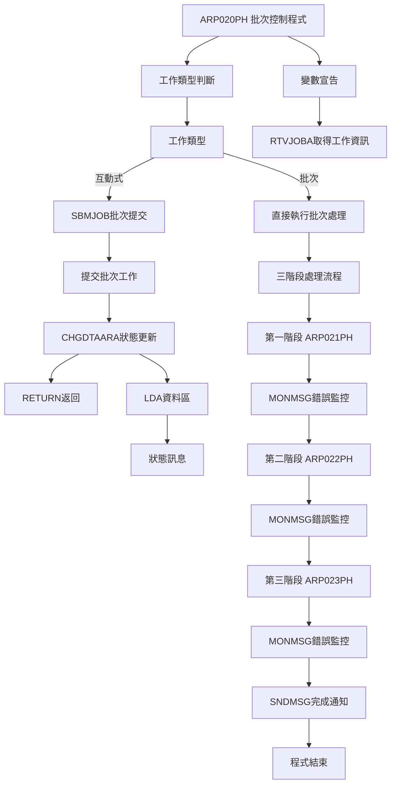
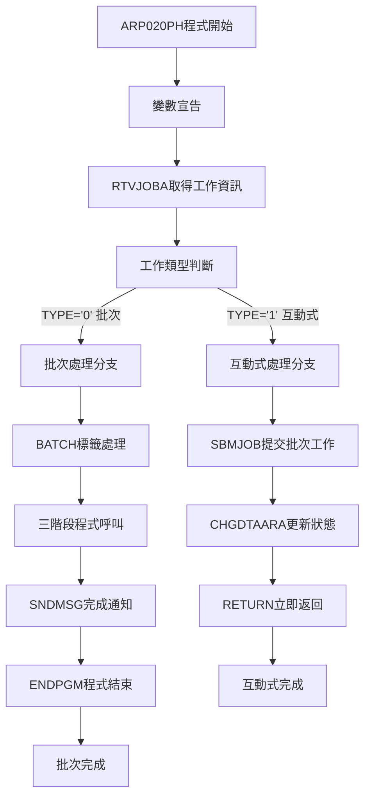
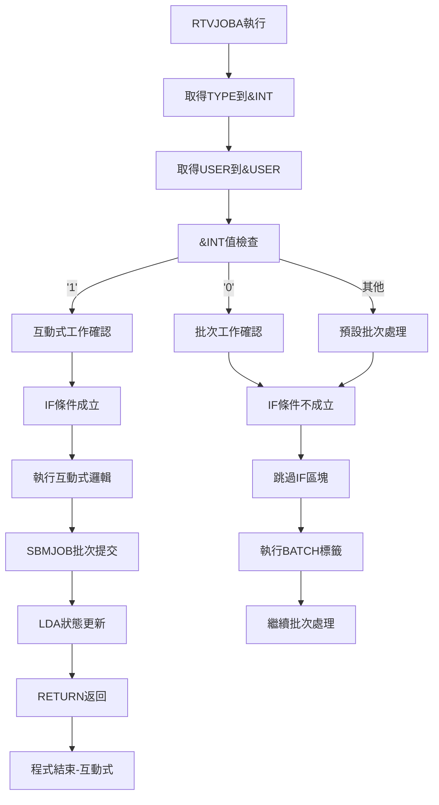
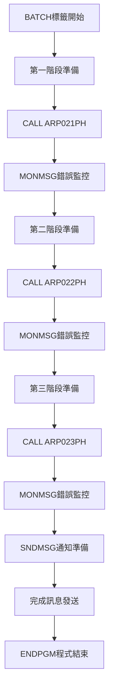
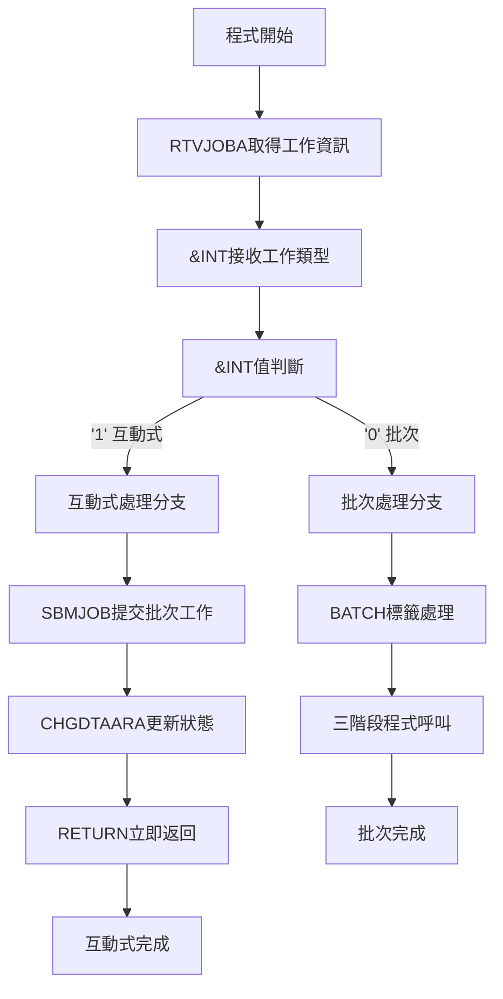
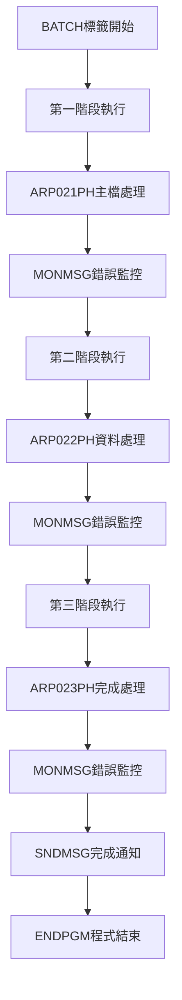
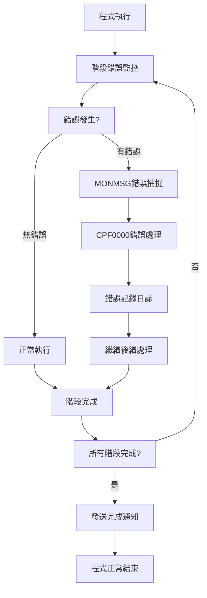

# ARP020PH_P02 程式規格書

## 1. 基本資料

| 項目 | 內容 |
|------|------|
| 程式編號 | ARP020PH |
| 程式名稱 | 定期系統主檔定期上傳作業(設定) |
| 程式類型 | CLP (Control Language Program) |
| 廠區 | P02 (處理H05廠區業務) |
| 程式用途 | H05廠區定期系統主檔上傳批次作業控制程式 |
| 呼叫方式 | 線上啟動批次作業 |
| 系統名稱 | 應收帳款管理系統 (AR) |
| 子系統 | 定期上傳管理子系統 |
| 程式複雜度 | 中等 |
| 程式規模 | 45行 |

## 2. 程式功能說明

ARP020PH為H05廠區定期系統主檔上傳作業的批次控制程式，主要功能包括：

1. 工作類型判斷：判斷工作類型(互動式/批次)
2. 批次工作提交：互動式模式自動提交批次工作
3. 三階段處理控制：批次模式執行三個處理程式
4. 狀態管理：LDA資料區狀態更新
5. 完成通知：處理完成後發送通知

功能執行流程：
- 互動式模式：提交批次工作後立即返回
- 批次模式：依序執行ARP021PH、ARP022PH、ARP023PH
- 狀態更新：更新LDA資料區狀態訊息
- 錯誤處理：每階段獨立錯誤監控
- 完成通知：處理完成發送個人化通知

業務處理範圍：
- H05廠區定期主檔資料上傳
- 系統間資料同步處理
- 批次作業流程控制
- 多階段順序處理管理

## 3. 檔案架構與關聯圖

### 系統檔案清單

| 檔案名稱 | 檔案類型 | 使用方式 | 說明 |
|---------|---------|---------|------|
| ARP021PH | RPG | 呼叫 | 第一階段主檔處理程式 |
| ARP022PH | RPG | 呼叫 | 第二階段資料處理程式 |
| ARP023PH | RPG | 呼叫 | 第三階段完成處理程式 |
| *LDA | 系統 | 寫入 | 本地資料區（狀態管理）|

### 檔案關聯視覺化圖表



### 資料流向說明

1. 工作類型判斷階段：RTVJOBA取得工作類型和使用者資訊
2. 互動式分支：提交批次工作、更新LDA狀態、立即返回
3. 批次分支：依序執行三階段處理程式
4. 錯誤處理階段：每階段獨立錯誤監控機制
5. 完成通知階段：發送個人化完成通知

## 4. 檔案欄位規格說明

### 主要變數結構分析

#### CLP變數定義
```
DCL VAR(&INT) TYPE(*CHAR) LEN(1)   - 工作類型變數
DCL VAR(&USER) TYPE(*CHAR) LEN(10) - 使用者名稱變數

變數用途:
&INT: 工作類型判斷 ('1'=互動式, '0'=批次)
&USER: 使用者識別，用於訊息發送
```

#### RTVJOBA工作資訊取得
```
RTVJOBA參數:
TYPE(&INT): 取得工作類型
  - '1': 互動式工作
  - '0': 批次工作
  
USER(&USER): 取得使用者名稱
  - 10字元使用者ID
  - 用於SNDMSG目標使用者
```

#### SBMJOB批次工作提交
```
SBMJOB參數設定:
JOB(ARP020PH): 工作名稱
JOBD(ARJOBD): 工作描述(應收帳款標準)
RQSDTA('CALL ARP020PH'): 執行的命令
LOG(0 4 *SECLVL): 日誌記錄層級
LOGCLPGM(*YES): 記錄CLP程式執行
```

### LDA資料區管理

#### 資料區位置規劃
```
LDA資料區位置分配:
CHGDTAARA DTAARA(*LDA (601 70))

位置規劃:
- 起始位置: 601
- 長度: 70字元
- 內容: "定期上傳設定發票處理資料已進入處理程序中"

歷史變更(9905A):
- 原位置: 801-870
- 新位置: 601-670  
- 變更原因: 資料區重新規劃
```

#### 狀態訊息設計
```
狀態訊息內容:
"定期上傳設定發票處理資料已進入處理程序中"

訊息設計：
1. 處理狀態描述
2. 廠區識別("設定"=H05)
3. 處理階段說明("已進入處理程序")
4. 70字元標準長度
```

### 三階段程式呼叫架構

#### 程式呼叫序列
```
三階段程式呼叫:
第一階段: CALL PGM(ARP021PH)
第二階段: CALL PGM(ARP022PH)  
第三階段: CALL PGM(ARP023PH)

每階段後: MONMSG MSGID(CPF0000)

階段功能:
ARP021PH: 主檔資料準備和驗證
ARP022PH: 資料處理和轉換
ARP023PH: 完成處理和結果確認
```

#### 錯誤處理設計
```
錯誤監控機制:
MONMSG MSGID(CPF0000) - 捕捉所有CPF錯誤

錯誤處理策略:
1. 非中斷式處理: 錯誤不停止後續程式
2. 容錯設計: 部分失敗不影響整體流程
3. 持續執行: 保證三階段都能執行
4. 完整性保證: 即使有錯誤也發送完成通知
```

### SNDMSG訊息通知系統

#### 完成通知機制
```
SNDMSG訊息發送:
MSG('定期上傳設定與信發票處理程序已執行完畢'): 完成訊息
TOUSR(&USER): 發送給啟動作業的使用者

訊息設計特色:
1. 完成狀態通知
2. 處理內容描述
3. 個人化的使用者通知
4. 標準化的訊息格式
```

#### 使用者操作流程
```
使用者操作流程:
1. 執行ARP020PH程式
2. 系統自動判斷工作類型
3. 互動式: 立即收到提交確認
4. 批次: 系統自動執行三階段處理
5. 完成: 收到個人化完成通知

操作特點:
- 互動式立即返回
- 批次自動執行
- 完成即時通知
- 狀態實時更新
```

## 5. 輸出/入螢幕布局與說明

### 程式執行介面說明

ARP020PH為純批次控制程式，無專用螢幕介面，但提供狀態回饋機制：

```
執行介面流程:
命令行執行 ARP020PH
    ↓
自動判斷工作類型
    ↓
互動式模式: 立即返回 + 狀態訊息
    ↓
批次模式: 背景執行 + 完成通知
```

### 狀態顯示機制

#### LDA資料區狀態
```
+--------------------------------------------------------+
| LDA資料區狀態顯示 (位置601-670)                       |
|                                                        |
| 定期上傳設定發票處理資料已進入處理程序中               |
|                                                        |
| 狀態: 處理中                                           |
| 廠區: H05(設定)                                        |
| 開始時間: 自動記錄                                     |
+--------------------------------------------------------+
```

#### 完成訊息通知
```
+--------------------------------------------------------+
| 系統訊息通知                                           |
|                                                        |
| 收件者: [啟動使用者]                                   |
| 標題: 批次作業完成通知                                 |
| 內容: 定期上傳設定與信發票處理程序已執行完畢           |
| 時間: [完成時間]                                       |
|                                                        |
| [確認] [關閉]                                          |
+--------------------------------------------------------+
```

### 工作提交確認畫面

#### 互動式模式回饋
```
+--------------------------------------------------------+
| 批次工作提交確認                                       |
|                                                        |
| 工作名稱: ARP020PH                                     |
| 工作描述: ARJOBD                                       |
| 處理內容: 定期上傳設定發票處理                         |
| 提交狀態: 成功                                         |
|                                                        |
| 工作已提交至批次佇列，請等待完成通知                   |
|                                                        |
| 狀態查詢: 可透過LDA資料區查看處理進度                  |
+--------------------------------------------------------+
```

## 6. 處理流程程序說明

### 主程式流程 (ARP020PH)



### 工作類型判斷流程



### 三階段批次處理流程



## 7. 數據操作與轉換說明

### 工作類型判斷處理

#### 工作類型檢測流程


技術實現詳解：
```
工作類型判斷邏輯:
RTVJOBA TYPE(&INT) USER(&USER)
IF COND(&INT *EQ '1') THEN(DO)
  [互動式處理邏輯]
ENDDO

判斷原理:
1. RTVJOBA取得當前工作屬性
2. TYPE參數返回工作類型
3. '1'表示互動式工作(使用者終端機)
4. '0'表示批次工作(系統背景執行)
```

#### 批次工作提交技術
```
SBMJOB提交技術分析:
JOB(ARP020PH) - 工作名稱保持一致
JOBD(ARJOBD) - 應收帳款標準工作描述
RQSDTA('CALL ARP020PH') - 遞迴程式呼叫
LOG(0 4 *SECLVL) - 中等安全層級日誌
LOGCLPGM(*YES) - 詳細CLP執行日誌

遞迴呼叫機制:
1. 互動式模式提交批次工作
2. 批次工作再次執行相同程式
3. 批次模式下直接執行處理邏輯
4. 避免互動式資源長時間佔用
```

### LDA資料區狀態管理

#### 資料區位置重新規劃 (9905A)
```
LDA位置變更分析:
原始設定 (註解掉):
CHGDTAARA DTAARA(*LDA (801 70))

新設定 (9905A):
CHGDTAARA DTAARA(*LDA (601 70))

變更影響分析:
1. 位置前移200字元 (801→601)
2. 長度保持70字元不變
3. 避免與其他資料區衝突
4. 統一的資料區規劃標準
```

#### 狀態訊息標準化
```
狀態訊息設計:
VALUE('定期上傳設定發票處理資料已進入處理程序中')

訊息結構分析:
- "定期上傳": 處理類型描述
- "設定": H05廠區識別碼
- "發票處理": 處理內容說明
- "資料已進入處理程序中": 狀態描述

標準化設計:
1. 固定的訊息格式
2. 廠區識別碼嵌入
3. 處理狀態表達
4. 70字元標準長度
```

### 三階段批次處理流程

#### 順序執行控制技術


階段處理技術：
```
三階段控制邏輯:
CALL PGM(ARP021PH)    // 第一階段
MONMSG MSGID(CPF0000) // 錯誤監控
CALL PGM(ARP022PH)    // 第二階段  
MONMSG MSGID(CPF0000) // 錯誤監控
CALL PGM(ARP023PH)    // 第三階段
MONMSG MSGID(CPF0000) // 錯誤監控

技術特色:
1. 序列執行: 確保處理順序正確
2. 獨立錯誤處理: 每階段獨立監控
3. 非中斷模式: 錯誤不停止後續處理
4. 完整性保證: 三階段都會執行
```

#### 錯誤容錯機制
```
錯誤處理設計:
MONMSG MSGID(CPF0000) - 捕捉所有CPF類型錯誤

容錯策略:
1. 忽略錯誤繼續: 錯誤不中斷後續階段
2. 部分失敗允許: 部分階段失敗不影響整體
3. 完成通知保證: 無論是否有錯誤都發送完成訊息
4. 日誌記錄完整: 錯誤資訊記錄在工作日誌
```

### 使用者通知機制

#### 個人化訊息發送
```
SNDMSG技術實現:
MSG('定期上傳設定與信發票處理程序已執行完畢')
TOUSR(&USER)

訊息發送機制:
1. &USER變數: 從RTVJOBA取得啟動使用者
2. 個人化通知: 只發送給實際操作者
3. 完成確認: 處理完成狀態
4. 及時通知: 處理完成立即發送
```

#### 多層次狀態回饋
```
狀態回饋層次:
1. 立即回饋: 互動式模式RETURN立即返回
2. 進度回饋: LDA資料區狀態更新
3. 完成回饋: SNDMSG個人化完成通知
4. 日誌回饋: 工作日誌詳細記錄
```

## 8. 錯誤處理程序說明與訊息清冊

### 錯誤處理機制



### 錯誤處理機制清冊

#### CLP階段錯誤處理

| 錯誤階段 | 錯誤監控 | 處理方式 | 影響範圍 |
|----------|----------|----------|----------|
| SBMJOB提交 | 無明確監控 | 系統預設處理 | 批次工作無法提交 |
| CHGDTAARA更新 | 無明確監控 | 系統預設處理 | 狀態更新失敗 |
| ARP021PH呼叫 | MONMSG CPF0000 | 忽略繼續 | 第一階段失敗 |
| ARP022PH呼叫 | MONMSG CPF0000 | 忽略繼續 | 第二階段失敗 |
| ARP023PH呼叫 | MONMSG CPF0000 | 忽略繼續 | 第三階段失敗 |
| SNDMSG發送 | 無明確監控 | 系統預設處理 | 完成通知失敗 |

#### 常見錯誤類型與處理

| 錯誤類型 | 錯誤代碼範例 | 可能原因 | 處理策略 |
|----------|--------------|----------|----------|
| 程式不存在 | CPF9801 | ARP021PH等程式不存在 | 忽略錯誤，繼續執行 |
| 檔案鎖定 | CPF4128 | 檔案被其他程式佔用 | 忽略錯誤，繼續執行 |
| 權限不足 | CPF9802 | 使用者權限不足 | 忽略錯誤，繼續執行 |
| 系統資源 | CPF3C90 | 記憶體或CPU資源不足 | 忽略錯誤，繼續執行 |
| 資料存取 | CPF5001 | 資料庫存取錯誤 | 忽略錯誤，繼續執行 |

### 錯誤處理技術實現

#### MONMSG錯誤監控技術

```
MONMSG技術實現:
MONMSG MSGID(CPF0000) - 捕捉所有CPF錯誤

監控策略:
1. 全域錯誤捕捉:
   - CPF0000通配符處理
   - 涵蓋所有CPF類型錯誤
   - 無需個別指定錯誤類型

2. 非中斷式處理:
   - 錯誤不中斷程式執行
   - 保證後續階段繼續執行
   - 確保整體流程完整性

3. 靜默錯誤處理:
   - 不顯示錯誤訊息給使用者
   - 錯誤資訊記錄在工作日誌
   - 保持使用者體驗流暢
```

#### 容錯設計策略

```
容錯設計原則:
1. 階段獨立性:
   - 每階段獨立錯誤處理
   - 單階段失敗不影響其他階段
   - 保證三階段都能執行

2. 業務連續性:
   - 重要業務流程保證執行
   - 部分功能失敗不影響功能
   - 最大化業務價值實現

3. 用戶體驗保證:
   - 錯誤不影響使用者操作
   - 完成通知保證發送
   - 狀態資訊保持透明

4. 問題診斷支援:
   - 完整的錯誤日誌記錄
   - 便於事後問題分析
   - 支援系統改善決策
```

#### 錯誤記錄與追蹤

```
錯誤記錄機制:
1. 工作日誌記錄:
   - LOG(0 4 *SECLVL): 中等安全層級
   - LOGCLPGM(*YES): CLP詳細執行日誌
   - 自動錯誤記錄: 系統自動記錄錯誤

2. 錯誤資訊內容:
   - 錯誤發生時間
   - 錯誤代碼和描述
   - 程式執行上下文
   - 系統環境資訊

3. 追蹤分析支援:
   - 歷史錯誤趨勢分析
   - 問題根本原因分析
   - 系統改善依據提供
   - 預防性維護指導
```

### 使用說明

#### 程式啟動方式

```
啟動方式選擇:
1. 命令行直接執行:
   CALL ARP020PH
   
2. 選單項目執行:
   透過應收帳款選單執行
   
3. 排程自動執行:
   設定定期排程自動執行
   
4. 其他程式呼叫:
   作為子程式被其他程式呼叫

推薦方式:
- 日常作業: 命令行直接執行
- 定期作業: 排程自動執行
- 整合作業: 其他程式呼叫
```

#### 執行流程說明

```
執行流程步驟:
1. 程式啟動:
   執行ARP020PH命令
   
2. 自動環境判斷:
   系統自動判斷互動式或批次模式
   
3. 互動式模式:
   - 立即提交批次工作
   - 更新LDA狀態資訊
   - 立即返回命令提示符
   - 使用者可繼續其他作業
   
4. 批次模式執行:
   - 背景執行三階段處理
   - ARP021PH → ARP022PH → ARP023PH
   - 每階段獨立錯誤處理
   - 完成後發送個人化通知

5. 作業完成確認:
   - 檢查個人訊息佇列
   - 查看LDA狀態資訊
   - 檢查工作日誌記錄
```

#### 狀態監控方法

```
狀態監控技術:
1. LDA資料區查詢:
   DSPDTAARA DTAARA(*LDA (601 70))
   查看當前處理狀態
   
2. 工作狀態查詢:
   WRKACTJOB SBS(批次子系統)
   查看批次工作執行狀態
   
3. 訊息佇列檢查:
   DSPMSG
   查看個人訊息佇列
   
4. 工作日誌查詢:
   DSPJOBLOG JOB(ARP020PH)
   查看詳細執行日誌
```

## 9. 備註

### 程式架構說明

ARP020PH採用批次控制程式設計模式，具有以下特點：
- 工作類型判斷：自動識別互動式或批次模式
- 遞迴程式設計：同一程式處理兩種執行模式
- 三階段控制：順序執行三個處理程式
- 狀態管理：LDA資料區即時狀態更新
- 錯誤容錯：非中斷式錯誤處理機制


### ARP020P系列程式比較

#### 多廠區程式一致性

| 比較項目 | ARP020PH | ARP020PK | ARP020PU |
|----------|----------|----------|----------|
| 程式行數 | 45行 | 45行 | 45行 |
| 程式結構 | 標準 | 相同 | 相同 |
| 建立日期 | 87/02/24 | 87/02/24 | 98/12/30 |
| 作者 | S02CLJ | S02CLJ | S00WCJ |
| 廠區功能 | H05(設定) | K02(桃園) | U01(新竹) |
| 9905A更新 | 統一 | 統一 | 統一 |
| 呼叫程式 | ARP021-023PH | ARP021-023PK | ARP021-023PU |

#### 廠區差異化管理

廠區特色差異：
1. 程式命名差異：
   - ARP020PH: H05廠區(設定)
   - ARP020PK: K02廠區(桃園)
   - ARP020PU: U01廠區(新竹)

2. 呼叫程式差異：
   - H廠區: ARP021PH, ARP022PH, ARP023PH
   - K廠區: ARP021PK, ARP022PK, ARP023PK
   - U廠區: ARP021PU, ARP022PU, ARP023PU

3. 狀態訊息差異：
   - H廠區: "定期上傳設定發票..."
   - K廠區: "定期上傳桃園發票..."
   - U廠區: "定期上傳新竹發票..."

### 技術實現特點

1. 工作類型判斷：RTVJOBA自動識別執行環境
2. 遞迴程式設計：單一程式多重執行模式
3. 三階段控制：順序執行批次處理程式
4. 狀態管理：LDA資料區即時狀態更新
5. 錯誤容錯：MONMSG非中斷式錯誤處理
6. 完成通知：SNDMSG個人化通知機制

### 系統整合說明

程式在企業系統中的整合角色：
- 定期上傳管理：H05廠區定期主檔上傳控制
- 批次作業管理：三階段批次處理流程控制
- 多廠區協調：ARP020P系列程式協同作業
- 錯誤處理：容錯機制保證業務連續性
- 狀態監控：提供完整的作業狀態追蹤