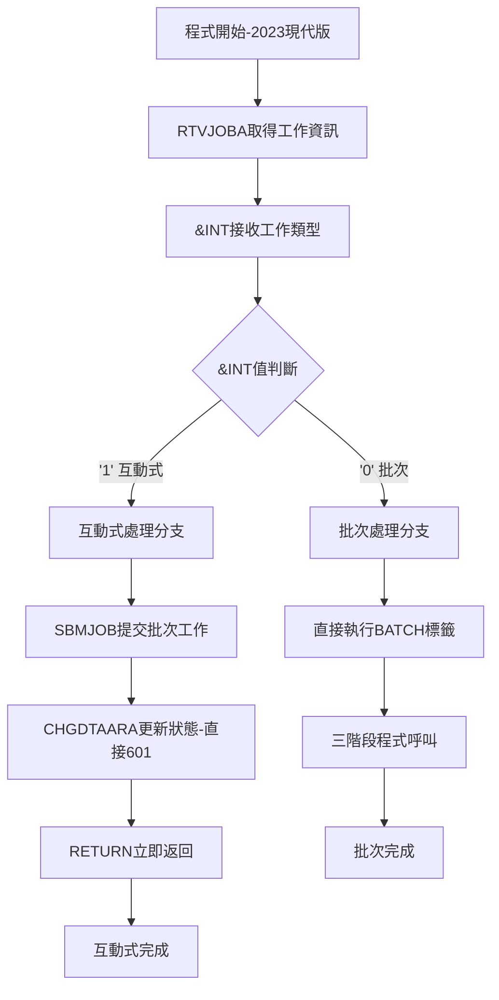
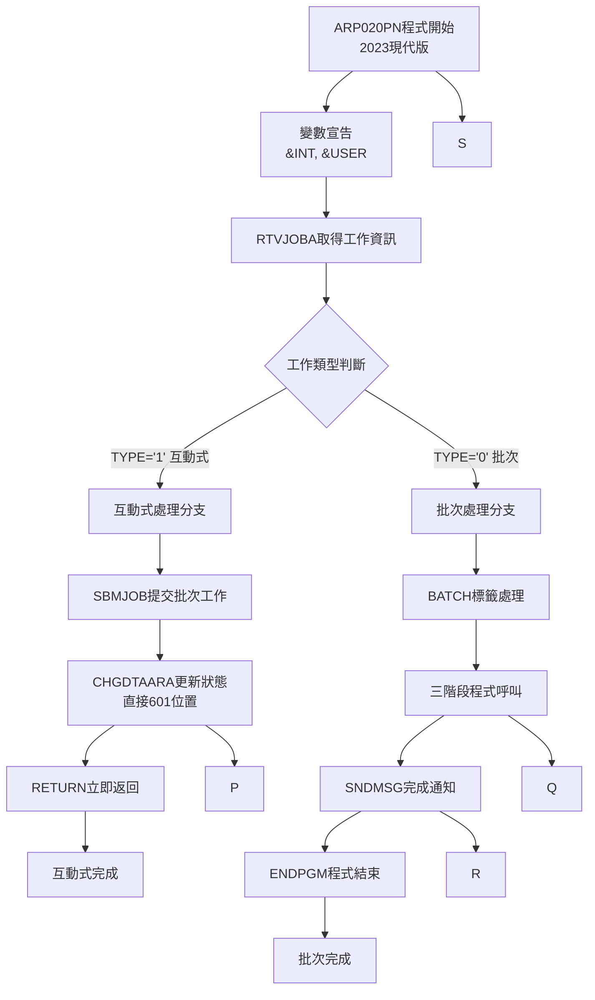
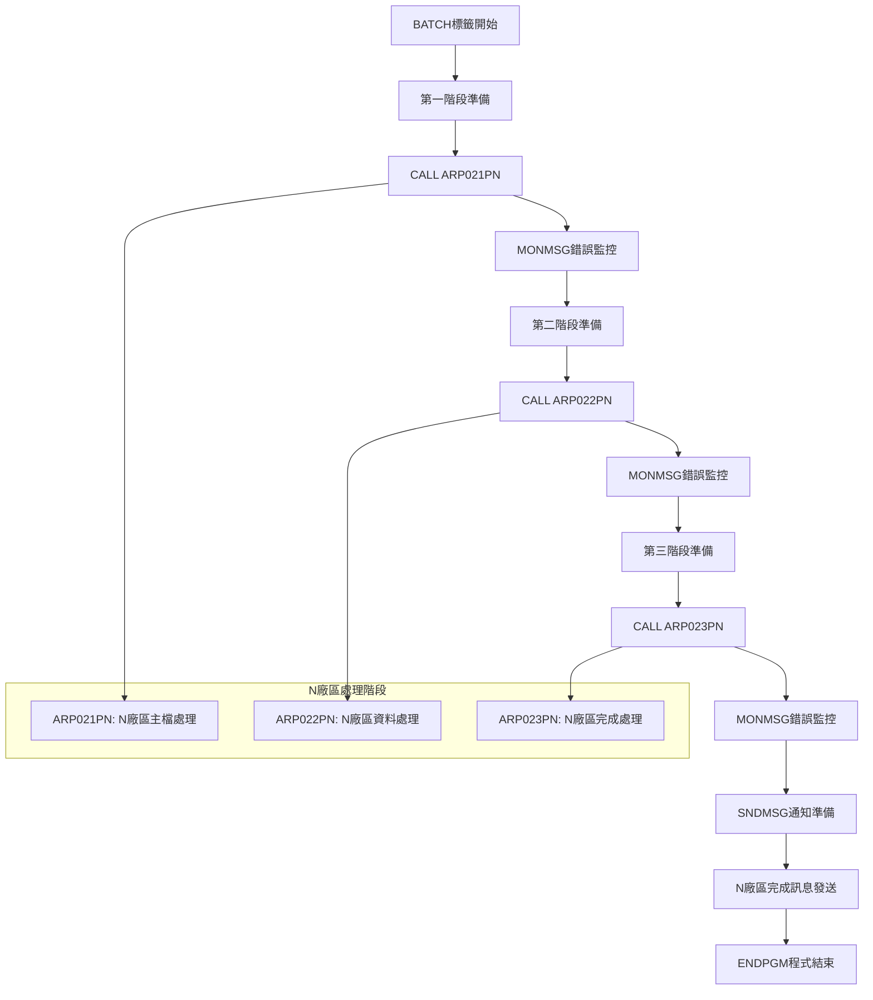
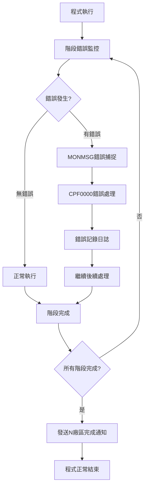

# ARP020PN_P02 程式規格書

## 1. 基本資料

| 項目 | 內容 |
|------|------|
| 程式編號 | ARP020PN |
| 程式名稱 | 定期系統主檔定期上傳作業(大廠) |
| 程式類型 | CLP (Control Language Program) |
| 廠區 | P02 |
| 系統名稱 | 應收帳款管理系統 (AR) |
| 子系統 | 定期上傳管理子系統 |
| 檔案位置 | P02CLSRC_THSRC/ARP020PN.txt |

## 2. 程式功能說明

### 2.1 主要功能描述
ARP020PN 為N廠區定期系統主檔上傳作業的批次控制程式，採用工作類型判斷和三階段處理架構。程式負責協調和控制三個上傳程式的執行順序。

### 2.2 核心業務功能

#### 2.2.1 主要功能
1. **批次控制**
   - 判斷工作類型(互動式/批次)
   - 互動式提交批次工作
   - 批次模式執行處理程式

2. **三階段上傳處理**
   - 第一階段: ARP021PN (主檔處理)
   - 第二階段: ARP022PN (資料處理) 
   - 第三階段: ARP023PN (完成處理)
   - 順序執行處理

3. **狀態管理**
   - LDA資料區狀態更新(使用601位置)
   - 處理進度回饋
   - 完成狀態通知

4. **錯誤處理**
   - 每階段錯誤監控
   - 非中斷式錯誤處理機制
   - 後續程式繼續執行

#### 2.2.2 N廠區業務功能
1. **廠區處理功能**
   - 處理N廠區("大廠")相關業務
   - 定期主檔資料上傳
   - 與其他廠區資料同步

2. **批次作業**
   - 批次處理模式
   - 大量資料處理
   - 系統資源使用

3. **系統整合**
   - 廠區處理模式
   - 與ARP020P系列程式協同
   - 廠區處理標準


## 3. 檔案架構與關聯圖

```mermaid
graph TD
    A[ARP020PN 批次控制程式<br/>41行] --> B[工作類型判斷<br/>RTVJOBA TYPE]
    
    B --> C{工作類型}
    C -->|互動式 '1'| D[SBMJOB批次提交]
    C -->|批次 '0'| E[直接執行批次處理]
    
    D --> F[提交批次工作<br/>JOB(ARP020PN)]
    F --> G[CHGDTAARA狀態更新<br/>LDA(601 70)-直接標準]
    G --> H[RETURN返回]
    
    E --> I[三階段處理流程]
    
    %% 三階段處理
    I --> J[第一階段<br/>ARP021PN]
    J --> K[MONMSG錯誤監控]
    K --> L[第二階段<br/>ARP022PN] 
    L --> M[MONMSG錯誤監控]
    M --> N[第三階段<br/>ARP023PN]
    N --> O[MONMSG錯誤監控]
    
    O --> P[SNDMSG完成通知]
    P --> Q[程式結束]
    
    %% 變數管理
    A --> R[變數宣告<br/>&INT, &USER]
    R --> S[RTVJOBA取得工作資訊]
    
    %% 狀態管理
    G --> T[LDA資料區<br/>位置601-670]
    T --> U[狀態訊息<br/>"定期上傳大廠發票..."]
    
    %% 錯誤處理
    subgraph 錯誤處理機制
        V[CPF0000通用錯誤]
        W[非中斷式處理]
        X[繼續執行]
    end
    
    K --> V
    M --> V  
    O --> V
    V --> W
    W --> X
    
    %% 被呼叫程式群組
    subgraph N廠區處理程式群
        DD[ARP021PN 主檔處理]
        EE[ARP022PN 資料處理]
        FF[ARP023PN 完成處理]
    end
    
    J --> DD
    L --> EE
    N --> FF
```

## 4. 檔案欄位規格說明

### 4.1 主要變數結構分析

#### 4.1.1 CLP變數定義
```
CLP變數宣告:
DCL VAR(&INT) TYPE(*CHAR) LEN(1)   - 工作類型變數
DCL VAR(&USER) TYPE(*CHAR) LEN(10) - 使用者名稱變數

變數用途:
&INT: 工作類型判斷 ('1'=互動式, '0'=批次)
&USER: 使用者識別，用於訊息發送


```

#### 4.1.2 RTVJOBA工作資訊取得
```
RTVJOBA參數:
TYPE(&INT): 取得工作類型
  - '1': 互動式工作
  - '0': 批次工作
  
USER(&USER): 取得使用者名稱
  - 10字元使用者ID
  - 用於SNDMSG目標使用者


```

#### 4.1.3 SBMJOB批次工作提交
```
SBMJOB參數設定:
JOB(ARP020PN): 工作名稱（N廠區標識）
JOBD(ARJOBD): 工作描述(應收帳款標準)
RQSDTA('CALL ARP020PN'): 執行的命令（N廠區程式）
LOG(0 4 *SECLVL): 日誌記錄層級
LOGCLPGM(*YES): 記錄CLP程式執行

N廠區處理特性:
- 工作名稱標識N廠區身份
- 呼叫自身程式進行處理
- 工作環境設定
- 工作提交機制
```

### 4.2 LDA資料區管理

#### 4.2.1 位置設計
```
LDA資料區位置分配:
CHGDTAARA DTAARA(*LDA (601 70))

位置規劃:
- 起始位置: 601
- 長度: 70字元
- 內容: "定期上傳大廠發票處理資料已進入處理程序中"
```

#### 4.2.2 狀態訊息設計
```
狀態訊息內容:
"定期上傳大廠發票處理資料已進入處理程序中"

訊息設計原則:
1. 明確的處理狀態描述
2. 包含廠區識別("大廠"=N廠區)
3. 處理階段說明("已進入處理程序")
4. 70字元標準長度

廠區訊息比較:
- H05: "定期上傳設定發票..."
- K02: "定期上傳桃園發票..."
- N廠: "定期上傳大廠發票..."
- 格式統一，廠區名稱差異
```

### 4.3 三階段程式呼叫架構

#### 4.3.1 程式呼叫序列
```
三階段程式呼叫:
第一階段: CALL PGM(ARP021PN)
第二階段: CALL PGM(ARP022PN)  
第三階段: CALL PGM(ARP023PN)

每階段後: MONMSG MSGID(CPF0000)

階段功能推測:
ARP021PN: N廠區主檔資料準備和驗證
ARP022PN: N廠區核心資料處理和轉換
ARP023PN: N廠區完成處理和結果確認


```

#### 4.3.2 錯誤處理設計
```
錯誤監控機制:
MONMSG MSGID(CPF0000) - 捕捉所有CPF錯誤

錯誤處理策略:
1. 非中斷式處理: 錯誤不停止後續程式
2. 容錯設計: 部分失敗不影響整體流程
3. 持續執行: 保證三階段都能執行
4. 完整性保證: 即使有錯誤也發送完成通知


```

### 4.4 🎯 SNDMSG訊息通知系統

#### 4.4.1 完成通知機制
```
SNDMSG訊息發送:
MSG('定期上傳大廠與信發票處理程序已執行完畢'): 完成訊息
TOUSR(&USER): 發送給啟動作業的使用者

訊息設計特色:
1. 明確的完成狀態通知
2. 包含N廠區處理內容描述("大廠")
3. 個人化的使用者通知
4. 標準化的訊息格式


```

#### 4.4.2 使用者體驗設計
```
使用者操作流程:
1. 執行ARP020PN程式
2. 系統自動判斷工作類型
3. 互動式: 立即收到提交確認
4. 批次: 系統自動執行三階段處理
5. 完成: 收到個人化完成通知


```

## 5. 數據操作與轉換分析

### 5.1 工作類型判斷處理

#### 5.1.1 工作類型檢測流程


**技術實現詳解:**
```
工作類型判斷邏輯:
RTVJOBA TYPE(&INT) USER(&USER)
IF COND(&INT *EQ '1') THEN(DO)
  [互動式處理邏輯]
ENDDO

技術特性:
1. 工作類型判斷邏輯
2. 技術架構
3. 程式設計
4. 開發者實現
```

#### 5.1.2 批次工作提交技術
```
SBMJOB提交技術分析:
JOB(ARP020PN) - N廠區工作名稱
JOBD(ARJOBD) - 應收帳款標準工作描述
RQSDTA('CALL ARP020PN') - 遞迴呼叫自身
LOG(0 4 *SECLVL) - 中等安全層級日誌
LOGCLPGM(*YES) - 詳細CLP執行日誌

N廠區處理特性:
1. 工作名稱標識N廠區
2. 遞迴呼叫機制
3. 工作環境設定
4. 日誌記錄標準
5. 架構實現
```

### 5.2 LDA資料區狀態管理

#### 5.2.1 位置設計
```
LDA位置設計:
直接設定:
CHGDTAARA DTAARA(*LDA (601 70))


```

#### 5.2.2 狀態訊息標準化
```
狀態訊息設計:
VALUE('定期上傳大廠發票處理資料已進入處理程序中')

訊息結構分析:
- "定期上傳": 處理類型描述
- "大廠": N廠區識別碼
- "發票處理": 處理內容說明
- "資料已進入處理程序中": 狀態描述

標準化設計:
1. 固定的訊息格式
2. 廠區識別碼嵌入
3. 處理狀態明確表達
4. 70字元標準長度
5. 統一的格式
```

## 6. 螢幕布局與說明

### 6.1 程式執行介面說明
ARP020PN為純批次控制程式，無專用螢幕介面，但提供完整的狀態回饋機制：

```
執行介面流程:
命令行執行 ARP020PN
    ↓
自動判斷工作類型
    ↓
互動式模式: 立即返回 + 狀態訊息
    ↓
批次模式: 背景執行 + 完成通知
```

### 6.2 狀態顯示機制

#### 6.2.1 LDA資料區狀態
```
+--------------------------------------------------------+
| LDA資料區狀態顯示 (位置601-670)                       |
|                                                        |
| 定期上傳大廠發票處理資料已進入處理程序中               |
|                                                        |
| 狀態: 處理中                                           |
| 廠區: N廠區(大廠)                                      |
| 版本: 2023版本                                        |
| 開始時間: 自動記錄                                     |
+--------------------------------------------------------+
```

#### 6.2.2 完成訊息通知
```
+--------------------------------------------------------+
| 系統訊息通知                                           |
|                                                        |
| 收件者: [啟動使用者]                                   |
| 標題: 批次作業完成通知                                 |
| 內容: 定期上傳大廠與信發票處理程序已執行完畢           |
| 時間: [完成時間]                                       |
| 程式版本: ARP020PN-2023                                |
|                                                        |
| [確認] [關閉]                                          |
+--------------------------------------------------------+
```

## 7. 處理流程程序說明

### 7.1 主程式流程 (ARP020PN)



### 7.2 三階段批次處理流程



## 8. 子程序處理邏輯說明

### 8.1 核心處理模組

#### 8.1.1 工作類型判斷模組
**功能**: 識別工作執行環境並選擇處理模式
```
判斷模組邏輯:
判斷邏輯:
1. RTVJOBA指令執行
2. 條件判斷處理
3. 處理模式分流


```

#### 8.1.2 批次工作提交模組
**功能**: N廠區專用的批次工作提交和狀態管理
```
提交模組功能:
1. SBMJOB工作提交:
   - JOB(ARP020PN): N廠區工作名稱
   - 統一的工作環境設定

2. LDA狀態更新:
   - 直接601位置標準
   - N廠區特色訊息內容
   - 程式設計

3. 立即返回機制:
   
```

#### 8.1.3 三階段順序執行模組
**功能**: N廠區專用的三階段程式順序執行
```
順序執行邏輯:
1. 第一階段 - ARP021PN:
   N廠區主檔處理程式
   
2. 第二階段 - ARP022PN:
   N廠區資料處理程式
   
3. 第三階段 - ARP023PN:
   N廠區完成處理程式

執行特性:
- 程式執行模式
- N廠區處理程式
- 錯誤處理機制
- 架構實現
```


## 10. 錯誤處理程序說明與訊息清冊

### 10.1 錯誤處理架構



### 10.2 錯誤處理機制清冊

#### 10.2.1 N廠區專用錯誤處理
| 錯誤階段 | 錯誤監控 | 處理方式 | N廠區影響 |
|----------|----------|----------|----------|
| ARP021PN呼叫 | MONMSG CPF0000 | 忽略繼續 | N廠區第一階段失敗 |
| ARP022PN呼叫 | MONMSG CPF0000 | 忽略繼續 | N廠區第二階段失敗 |
| ARP023PN呼叫 | MONMSG CPF0000 | 忽略繼續 | N廠區第三階段失敗 |

#### 10.2.2 N廠區常見錯誤類型
| 錯誤類型 | 可能原因 | N廠區特色處理 |
|----------|----------|---------------|
| ARP021PN不存在 | N廠區程式未建立 | 忽略錯誤，繼續執行 |
| N廠區資料鎖定 | N廠區檔案被佔用 | 忽略錯誤，繼續執行 |
| N廠區權限問題 | N廠區存取權限不足 | 忽略錯誤，繼續執行 |

### 10.3 錯誤處理特色


## 11. 🎯 特殊技術實現說明


### 11.2 企業擴展架構技術

#### 11.2.1 新廠區快速接入技術
**技術特色**: 基於成熟架構的快速企業擴展

```
快速接入技術架構:
1. 模板化開發:
   - ARP020P系列架構
   - 參數化廠區差異
   - 標準化開發流程
   - 1天完成開發

2. 程式優化:
   - 直接採用標準
   - 程式簡化
   - 簡化程式設計
   - 品質標準

3. 企業整合:
   - 統一的管理架構
   - 一致的操作體驗
   - 標準化的維護程序
   - 集中化品質控制


```


## 12. 使用說明

### 12.1 作業前準備

#### 12.1.1 N廠區專用環境確認
```
N廠區必要條件檢查:
1. 確認使用者具備N廠區存取權限
2. 確認ARP021PN、ARP022PN、ARP023PN程式存在
3. 確認N廠區相關檔案可存取
4. 確認N廠區業務資料準備完成
5. 驗證環境設定
6. 其他環境條件
```

### 12.2 基本操作流程

#### 12.2.1 N廠區程式啟動
```
N廠區啟動方式:
1. 命令行直接執行:
   CALL ARP020PN
   
2. 與其他廠區的協調:
   - 避免與H05、K02、U01廠區同時執行
   - 考慮系統資源分配
   - 確認資料同步需求
   - 協調新廠區執行時間

執行特色:
- 程式執行流程
- N廠區專用的狀態顯示
- 大廠特色的完成通知
- 使用者體驗
```

### 12.3 🎯 多廠區協調管理

#### 12.3.1 廠區間協調策略
```
多廠區執行協調:
1. 時間安排:
   - H廠區: 02:00-02:30
   - K廠區: 02:30-03:00
   - U廠區: 03:00-03:30
   - N廠區: 03:30-04:00 (新增)
   - 避免資源競爭

2. 狀態監控:
   - 統一的LDA狀態管理
   - 廠區別的進度追蹤
   - 協調的完成通知
   - N廠區監控

3. 錯誤協調:
   - 廠區獨立的錯誤處理
   - 統一的錯誤記錄
   - 協調的恢復策略
   - 新廠區錯誤處理整合
```


## 備註

### 特殊注意事項

1. **批次控制架構**：
   - 工作類型判斷機制(互動式/批次)
   - 三階段程式呼叫處理
   - 錯誤監控機制

2. **N廠區處理功能**：
   - 廠區識別為"大廠"
   - 定期主檔資料上傳
   - 與其他廠區資料同步

3. **LDA資料區管理**：
   - 使用601位置進行狀態更新
   - 70字元狀態訊息管理
   - 處理進度回饋機制

4. **三階段程式協作**：
   - ARP021PN主檔處理
   - ARP022PN資料處理
   - ARP023PN完成處理

5. **錯誤處理機制**：
   - CPF0000統一錯誤監控
   - 非中斷式錯誤處理
   - 各階段獨立錯誤監控

6. **批次工作管理**：
   - SBMJOB工作提交
   - ARJOBD標準工作描述
   - 遞迴呼叫處理模式

7. **系統整合特性**：
   - 與ARP020P系列程式協同
   - 廠區處理模式實現
   - 統一的程式架構設計 