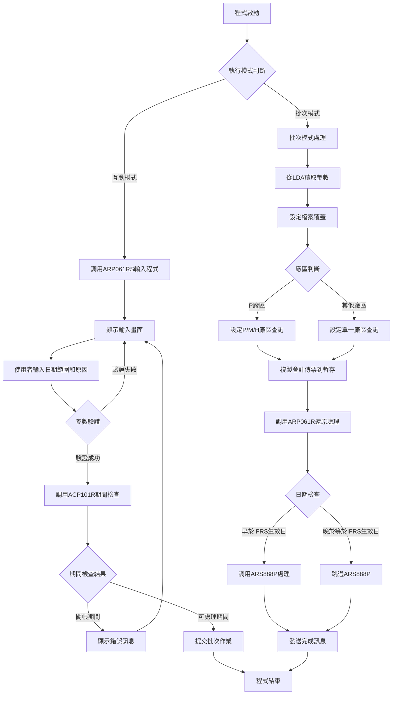
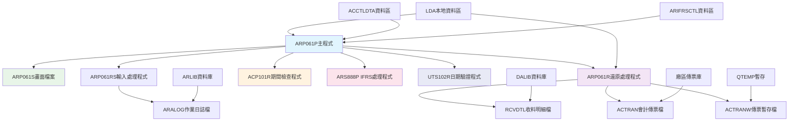
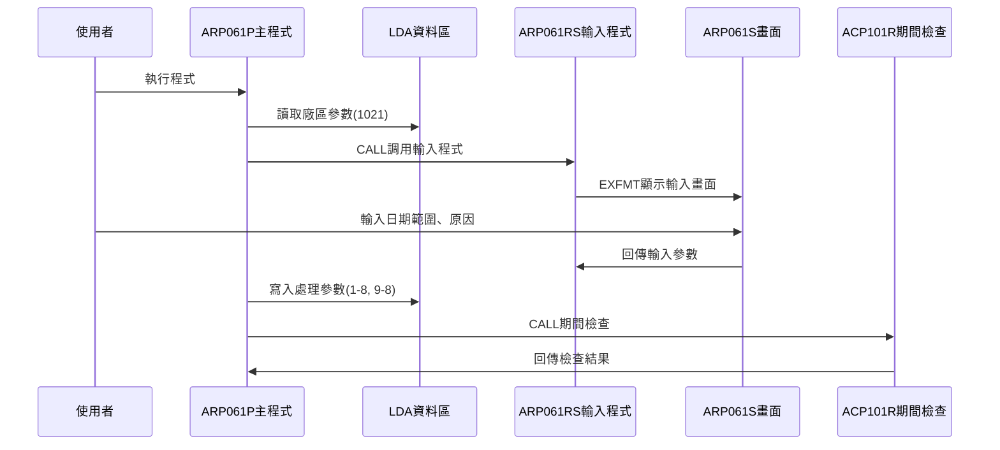
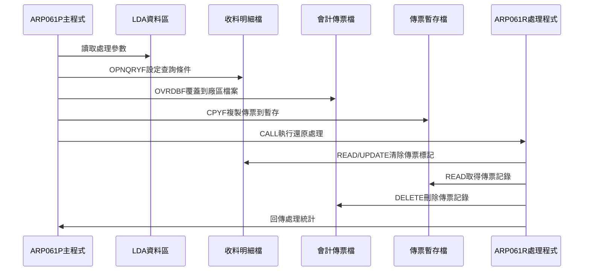
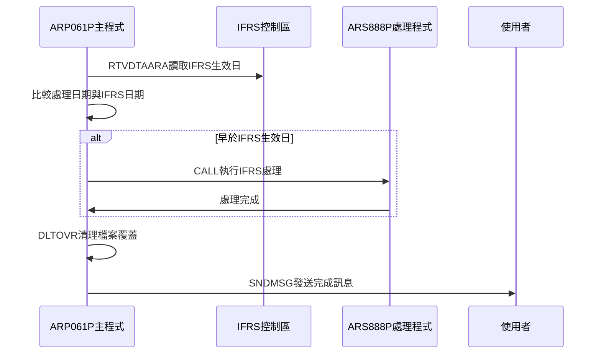
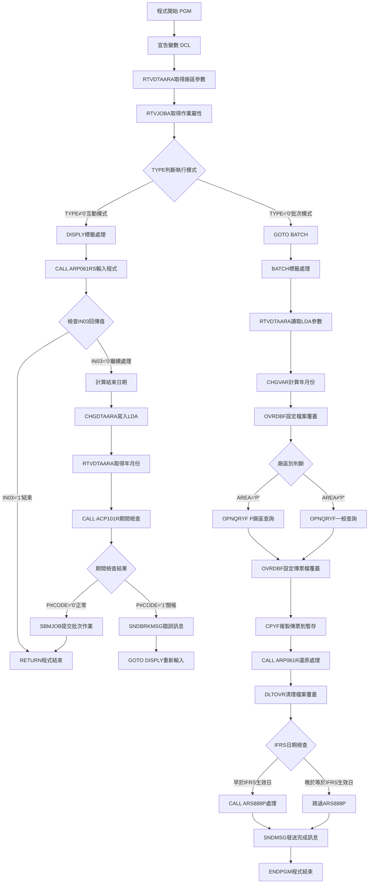

# ARP061P_U01 程式規格書

## 1. 基本資料

| 項目 | 內容 |
|------|------|
| **程式編號** | ARP061P |
| **程式名稱** | 應收帳款代製傳票還原作業 |
| **程式類型** | CLP |
| **廠區** | U01 |
| **系統名稱** | 應收帳款系統 |
| **子系統** | 應收帳款代製傳票還原處理 |
| **檔案位置** | U01CLSRC_THSRC/ARP061P.txt |

## 2. 🎯 程式功能說明

### 主要功能描述
此程式為應收帳款代製傳票還原控制程式，用於還原已產生的會計傳票和相關收料記錄。程式提供互動式參數輸入及批次處理兩種執行模式，透過期間檢查確保關帳期間的資料完整性，並執行完整的傳票還原處理，包括清除收料記錄的代製傳票標記、刪除會計傳票記錄等作業。

### 🎯 業務流程詳細說明

#### 完整業務流程圖


#### 業務流程關鍵階段說明

**第一階段：執行模式識別與參數收集**
- 透過RTVJOBA檢查執行環境類型
- 互動模式時調用ARP061RS程式收集使用者輸入
- 收集還原日期範圍和還原原因說明
- 將參數寫入LDA供批次處理使用

**第二階段：期間控制與安全檢查**
- 調用ACP101R程式檢查指定期間是否已關帳
- 防止在關帳期間進行資料異動
- 若為關帳期間則顯示錯誤訊息並要求重新輸入
- 確保會計期間的資料完整性

**第三階段：檔案設定與查詢條件建立**
- 設定RCVDTL收料檔案覆蓋並允許共享存取
- 根據廠區別建立不同的OPNQRYF查詢條件
- P廠區處理P/M/H開頭的收料單號
- 其他廠區僅處理對應廠區的收料記錄

**第四階段：會計傳票資料準備**
- 複製相關期間的會計傳票到QTEMP/ACTRANW暫存檔
- 篩選H開頭的傳票記錄且符合廠區和期間條件
- 設定會計傳票暫存檔的覆蓋以供後續處理
- 為還原處理準備完整的資料環境

**第五階段：核心還原處理執行**
- 調用ARP061R程式執行實際的還原邏輯
- 清除收料記錄的代製傳票標記(RVVNO1)
- 刪除對應的會計傳票記錄
- 統計處理的收料記錄和刪除的傳票數量

**第六階段：IFRS相關處理與完成**
- 檢查處理日期是否早於IFRS生效日
- 若早於IFRS生效日則調用ARS888P進行額外處理
- 發送處理完成訊息給執行使用者
- 清理檔案覆蓋並結束程式

#### 多層次驗證機制
- **日期格式驗證**：透過UTS102R程式驗證日期格式正確性
- **期間控制驗證**：透過ACP101R程式檢查會計期間狀態
- **檔案存在性檢查**：確認所有相關檔案可正常存取
- **廠區權限驗證**：確保只處理授權廠區的資料

#### 智能處理邏輯
- 自動判斷廠區類型並採用相應的查詢條件
- 動態產生OPNQRYF語句處理不同廠區需求
- 智能識別IFRS生效日期並執行對應處理
- 自動統計處理結果並提供詳細回饋

#### 資料一致性確保機制
- 透過檔案覆蓋確保存取正確的資料檔案
- 使用暫存檔技術避免影響原始會計傳票檔案
- 提供完整的處理統計確保作業透明度
- 記錄詳細的作業軌跡供後續查核

## 3. 🎯 檔案架構與關聯圖

### 使用檔案清單

| 檔案名稱 | 檔案類型 | 使用方式 | 說明 |
|----------|----------|----------|------|
| **ARP061S** | DSPF | CF/COMBINED | 代製傳票還原輸入畫面檔案 |
| **RCVDTL** | 邏輯檔 | UF/UPDATE | 收料明細檔案(主要還原對象) |
| **ACTRAN** | 邏輯檔 | UF/UPDATE | 會計傳票檔案 |
| **ACTRANW** | 邏輯檔 | IF/INPUT | 會計傳票暫存檔案 |
| **ARALOG** | 邏輯檔 | O/OUTPUT | 應收帳款作業日誌檔 |
| **ACCTLDTA** | 資料區 | RTVDTAARA | 會計控制資料區 |
| **ARIFRSCTL** | 資料區 | RTVDTAARA | IFRS控制資料區 |

### 🎯 檔案關聯詳細視覺化圖表



### 🎯 資料流向詳細說明

#### 環境準備階段的資料流向


#### 業務處理階段的資料流向


#### 環境清理階段的資料流向


## 4. 🎯 檔案欄位規格說明

### 主要資料結構

#### LDA本地資料區結構
| 位置 | 長度 | 欄位名稱 | 用途說明 |
|------|------|----------|----------|
| 1-8 | 8 | 開始日期 | 還原處理的開始日期(YYYYMMDD) |
| 9-8 | 8 | 結束日期 | 還原處理的結束日期(YYYYMMDD) |
| 1-6 | 6 | 年月份 | 處理年月(YYYYMM) |
| 201-206 | 6 | 憑證號起 | IFRS處理用憑證號範圍起始 |
| 211-216 | 6 | 憑證號迄 | IFRS處理用憑證號範圍結束 |
| 1021-1021 | 1 | 廠區代號 | 執行廠區別(P/M/H/T/K/U) |

#### UDS使用者資料結構
| 位置 | 長度 | 欄位名稱 | 用途說明 |
|------|------|----------|----------|
| 1-6 | 6 | U#YM | 處理年月份 |
| 201-206 | 6 | D#VNO1 | 憑證號碼範圍起始 |
| 211-216 | 6 | D#VNO2 | 憑證號碼範圍結束 |
| 951-985 | 35 | S#COMP | 公司名稱 |
| 1011-1020 | 10 | S#DEVI | 設備代號 |
| 1001-1010 | 10 | U#USID | 使用者代號 |
| 1021-1021 | 1 | U#AREA | 區域代號 |

### 🔍 重點欄位切割技術詳解

#### 會計傳票號碼結構分析(ACVRNO)
**ACVRNO結構 (6字元)**：
```
ACVRNO (6字元)：[X|XXXXX]
                 ↓   ↓
D#VRNO (1字元)： [X]        廠區代號
傳票序號 (5字元)：   [XXXXX]  傳票流水號
```

#### 暫存檔項目結構(W#VNO2)
**W#VNO2結構 (7字元)**：
```
W#VNO2 (7字元)：[X|XXXX|XX]
                 ↓   ↓   ↓
傳票標識 (1字元)：[X]            暫存檔標記
W#VRNO (4字元)：   [XXXX]        傳票編號
W#ITEM (2字元)：       [XX]      項目序號
```

#### 系統控制結構(W#SYST)
**W#SYST結構 (14字元)**：
```
W#SYST (14字元)：[XXXXXX|XXXX|XXXX]
                  ↓      ↓    ↓
D#ST (6字元)：    [XXXXXX]           系統狀態
D#SY (4字元)：            [XXXX]     系統年度
D#SMD (4字元)：                [XXXX] 系統月日
```

### 🎯 欄位挪用詳細分析

#### 憑證號碼範圍欄位的特殊用途
- **原始定義**：D#VNO1和D#VNO2為一般憑證號碼欄位
- **實際使用方式**：用於IFRS處理時的憑證號碼範圍控制
- **挪用原因**：支援IFRS會計準則的特殊處理需求
- **挪用方式詳細說明**：
  * D#VNO1：記錄處理過程中遇到的最小憑證號碼
  * D#VNO2：記錄處理過程中遇到的最大憑證號碼
  * 空白：表示尚未處理任何憑證記錄

#### 欄位挪用影響評估
此挪用方式對系統的影響：
- 提供了IFRS處理所需的憑證範圍追蹤
- 支援了版本更新的向後相容性
- 維持了原有檔案結構的完整性
- 增強了處理過程的可追蹤性

### 重要變數定義表

| 變數名稱 | 類型 | 長度 | 說明 | 使用範圍 |
|----------|------|------|------|----------|
| **&P#YYMM** | CHAR | 6 | 處理年月份(YYYYMM) | 期間檢查 |
| **&P#CODE** | CHAR | 1 | 期間檢查結果('1'=關帳) | ACP101R回傳 |
| **&INT** | CHAR | 1 | 執行模式識別(0=批次,其他=互動) | 程式流程控制 |
| **&DATEX** | CHAR | 8 | 開始日期參數(YYYYMMDD) | 日期範圍控制 |
| **&DATEE** | CHAR | 8 | 結束日期參數(YYYYMMDD) | 日期範圍控制 |
| **&ENDD** | CHAR | 2 | 結束日天數 | 日期計算 |
| **&AREA** | CHAR | 1 | 處理廠區代號 | 廠區控制 |
| **&DTARA** | CHAR | 11 | 資料區名稱 | 動態資料區名稱 |
| **&YM** | CHAR | 6 | 年月份變數 | 檔案篩選 |
| **&WSID** | CHAR | 10 | 工作站ID | 訊息發送 |
| **&CNTT** | CHAR | 6 | 處理收料記錄數 | 統計資訊 |
| **&CNTA** | CHAR | 6 | 刪除傳票記錄數 | 統計資訊 |
| **&IFRSD** | CHAR | 8 | IFRS生效日期 | 版本控制 |

## 5. 🎯 輸出/入螢幕布局

### 螢幕布局完整視覺化

```
+------------------------------------------------------------------------------+
|                     應收帳款代製傳票還原作業                      ARP061RS   |
|                                                                              |
|      注意事項:請還原\月結處理後所產生的資料進行處理。                       |
|                                                                              |
|       -----------------------------------------------------------           |
|       還原日期: [____/__/__] 至當月最後一日[__]  (請輸入月底最後日)         |
|                                                                              |
|       變動原因: [____________________________________]                      |
|       -----------------------------------------------------------           |
|                                                                              |
|                                                                              |
|                                                                              |
|                                                                              |
|                                                                              |
|                                                                              |
|                                                                              |
|                                                                              |
|                                                                              |
|                                                                              |
|F3:取消程式            F12:取消程式            ENTER:執行                   |
|[錯誤訊息顯示區]                                                              |
+------------------------------------------------------------------------------+
```

### 🎯 畫面欄位詳細說明

| 欄位名稱 | 欄位屬性 | 位置 | 長度 | 輸入格式 | 驗證規則 | 說明 |
|----------|----------|------|------|----------|----------|------|
| **S#DATE** | 輸入/輸出 | 10,28 | 8 | YYYY/MM/DD | 日期格式/不得大於系統日期 | 還原開始日期 |
| **S#ENDD** | 輸入/輸出 | 10,54 | 2 | 數字 | 1-31天數 | 月底結束日(預設31) |
| **S#CGCA** | 輸入/輸出 | 12,28 | 40 | 中文字元 | 必填 | 變動原因說明 |
| **S#COMP** | 顯示 | 1,23 | 35 | 中文字元 | 唯讀 | 公司名稱顯示 |
| **S#DEVI** | 顯示 | 2,70 | 10 | 英數字元 | 唯讀 | 設備代號顯示 |
| **S#MSG1** | 顯示 | 24,2 | 70 | 中文字元 | 唯讀 | 錯誤訊息顯示區 |

### 🎯 畫面控制邏輯

#### 指示器控制說明
- **IN03**: F3功能鍵，取消程式執行
- **IN12**: F12功能鍵，取消程式執行
- 無錯誤指示器，錯誤時直接顯示訊息

#### 欄位顯示屬性
- **S#DATE**: 使用EDTCDE(4)格式顯示為YYYY/MM/DD
- **S#ENDD**: 使用EDTCDE(4)格式顯示數字
- **S#CGCA**: 一般文字輸入欄位
- **S#MSG1**: 固定顯示為HI(高亮度)屬性

### 功能鍵詳細定義

| 功能鍵 | 處理邏輯 | 系統行為 | 說明 |
|--------|----------|----------|------|
| **F3** | 設定IN03='1' | 程式立即返回結束 | 取消程式不執行任何處理 |
| **F12** | 設定IN12='1' | 程式立即返回結束 | 取消程式回到前畫面 |
| **ENTER** | 執行驗證與處理 | 驗證輸入後提交批次作業 | 執行主要還原邏輯 |

### 操作流程
1. 畫面顯示時自動載入系統參數
2. 使用者輸入還原開始日期
3. 輸入月底結束日(可使用預設31)
4. 輸入變動原因說明(必填)
5. 按ENTER鍵進行驗證和期間檢查
6. 驗證通過後自動提交批次作業
7. 驗證失敗則顯示錯誤訊息並停留在輸入畫面

## 6. 🎯 處理流程程序說明

### 🎯 主程序邏輯深度分析

#### 程式執行流程圖


#### 🎯 詳細處理步驟逐一分析

**步驟1：程式環境初始化**
- 宣告13個程式變數，包含日期、廠區、統計等控制變數
- 從LDA位置1021讀取廠區別參數
- 動態建立資料區名稱('ACCTLDTA' + 廠區別)
- 從LDA位置1011讀取工作站ID供後續訊息發送使用

**步驟2：執行模式判斷邏輯**
- 使用RTVJOBA取得作業類型和使用者資訊
- TYPE='0'表示批次模式，直接跳轉至BATCH標籤
- TYPE≠'0'表示互動模式，進入DISPLY處理流程

**步驟3：互動模式參數收集(DISPLY)**
- 調用ARP061RS程式顯示輸入畫面
- 收集還原日期、結束日、變動原因等參數
- 透過P#IN03參數判斷使用者是否取消操作

**步驟4：日期計算與參數設定**
- 將開始日期複製到&DATEE變數
- 使用%SST函數將結束日設定到&DATEE的第7-8位
- 將開始日期寫入LDA位置1-8
- 將結束日期寫入LDA位置9-8

**步驟5：期間控制檢查機制**
- 從LDA位置1-6讀取年月份參數
- 調用ACP101R程式檢查指定期間是否已關帳
- 若P#CODE='1'表示關帳期間，發送錯誤訊息給工作站
- 若P#CODE='0'表示可處理期間，繼續後續處理

**步驟6：批次作業提交處理**
- 使用SBMJOB提交ARP061P批次作業到QCTL佇列
- 作業名稱為ARP061P，使用ARJOBD作業描述
- 批次作業執行'CALL ARP061P'指令

**步驟7：批次模式初始化(BATCH)**
- 從LDA位置1-8和9-8讀取日期範圍參數
- 從LDA位置1021讀取廠區別參數
- 從ARIFRSCTL資料區位置1-8讀取IFRS生效日期
- 使用%SST函數從開始日期擷取年月份

**步驟8：收料檔案查詢設定**
- 設定RCVDTL檔案覆蓋到DALIB/RCVDTL並允許共享存取
- 根據廠區別設定不同的OPNQRYF查詢條件
- P廠區查詢P/M/H開頭的收料單號
- 其他廠區查詢對應廠區開頭的收料單號

**步驟9：會計傳票檔案處理**
- 動態設定ACTRAN檔案覆蓋到對應廠區的傳票檔
- 使用CPYF複製符合條件的傳票記錄到QTEMP/ACTRANW
- 篩選H開頭且符合廠區、年月、日期範圍的傳票
- 設定ACTRANW暫存檔案的覆蓋供後續處理

**步驟10：核心還原處理執行**
- 調用ARP061R程式執行實際的還原邏輯
- ARP061R處理收料記錄的傳票標記清除
- ARP061R刪除對應的會計傳票記錄
- 回傳處理統計：&CNTT(收料數)和&CNTA(傳票數)

**步驟11：IFRS特殊處理判斷**
- 比較處理開始日期(&DATEX)與IFRS生效日期(&IFRSD)
- 若處理日期早於IFRS生效日則需要額外處理
- 從LDA讀取憑證號碼範圍(D#VNO1, D#VNO2)
- 調用ARS888P程式進行IFRS相關處理

**步驟12：處理完成與訊息發送**
- 清理所有檔案覆蓋設定(DLTOVR FILE(*ALL))
- 組合完成訊息包含處理統計資訊
- 使用SNDMSG發送完成訊息給執行使用者
- 訊息包含處理日期、收料數量、傳票數量等資訊

#### 業務邏輯深度解析

**還原作業的核心邏輯**：
1. 採用雙階段處理確保資料一致性
2. 透過期間檢查防止關帳期間的資料異動
3. 使用暫存檔技術避免直接異動原始傳票檔
4. 提供完整的處理統計供作業確認

**安全控制機制**：
1. 期間控制防止關帳期間異動
2. 廠區權限控制確保資料安全
3. 日期範圍驗證防止異常處理
4. IFRS規範支援確保合規性

#### 條件判斷詳細說明

**執行模式判斷**：
- `COND(&INT *EQ '0')` - 判斷是否為批次執行環境
- 批次模式時直接進入BATCH處理段
- 互動模式時進入參數收集流程

**功能鍵檢查**：
- `COND(&IN03 *EQ '0')` - 檢查使用者是否取消操作
- IN03='0'表示繼續處理
- IN03='1'表示取消並結束程式

**期間控制檢查**：
- `COND(&P#CODE *EQ '1')` - 檢查ACP101R回傳的期間狀態
- P#CODE='1'表示關帳期間不可處理
- P#CODE='0'表示正常期間可以處理

**廠區別處理判斷**：
- `COND(&AREA *EQ 'P')` - P廠區特殊處理邏輯
- P廠區處理多種單號開頭(P/M/H)
- 其他廠區僅處理對應廠區的記錄

**IFRS日期判斷**：
- `COND(&DATEX *LT &IFRSD)` - IFRS生效日期比較
- 早於IFRS生效日需要執行ARS888P處理
- 晚於等於IFRS生效日跳過額外處理

#### 變數使用和數據流向追蹤

**日期參數傳遞軌跡**：
1. S#DATE(畫面輸入) → &DATEX(程式變數) → LDA(1-8)
2. S#ENDD(畫面輸入) → &DATEE計算 → LDA(9-8)
3. &YM(年月擷取) → CPYF檔案篩選條件

**統計資訊軌跡**：
1. ARP061R處理 → &CNTT(收料數) → SNDMSG訊息
2. ARP061R處理 → &CNTA(傳票數) → SNDMSG訊息
3. 處理統計 → 使用者回饋訊息

**廠區控制軌跡**：
1. LDA(1021) → &AREA → OPNQRYF查詢條件
2. &AREA → 傳票檔覆蓋名稱 → OVRDBF設定
3. &AREA → ARS888P程式參數

### 🎯 子程序邏輯分析

#### ARP061RS輸入處理子程序
- **功能**：收集使用者輸入的還原參數
- **輸入來源**：ARP061S畫面的使用者輸入
- **處理邏輯**：日期驗證、必填檢查、格式轉換
- **輸出結果**：P#IN03(處理旗標)、P#DATX(日期)、P#ENDD(結束日)

#### ACP101R期間檢查子程序
- **功能**：檢查指定年月份是否已關帳
- **輸入來源**：&P#YYMM年月份參數
- **處理邏輯**：查詢會計期間控制檔案
- **輸出結果**：&P#CODE('0'=可處理, '1'=關帳)

#### ARP061R還原處理子程序
- **功能**：執行實際的傳票還原處理
- **輸入來源**：RCVDTL查詢結果和ACTRANW暫存檔
- **處理邏輯**：清除收料傳票標記、刪除會計傳票
- **輸出結果**：&CNTT(處理數)、&CNTA(刪除數)

#### ARS888P IFRS處理子程序
- **功能**：執行IFRS會計準則相關處理
- **輸入來源**：&AREA(廠區)、&YM(年月)、憑證範圍
- **處理邏輯**：IFRS規範的特殊會計處理
- **輸出結果**：IFRS相關傳票和調整記錄

#### UTS102R日期驗證子程序
- **功能**：驗證日期格式和邏輯正確性
- **輸入來源**：使用者輸入的日期字串
- **處理邏輯**：格式檢查、邏輯驗證、閏年處理
- **輸出結果**：驗證結果旗標

### 🎯 特殊邏輯處理

#### P廠區特殊查詢條件
```sql
QRYSLT('RVDATE *LE ' || &DATEE || ' *AND 
        RVDATE *GE ' || &DATEX || ' *AND 
        RVTYPE *EQ %VALUES("1" "2") *AND 
        RVDECD *NE "D" *AND 
        %SST(RVNO 1 1) *EQ %VALUES("P" "M" "H")')
```
- 處理日期範圍內的收料記錄
- 收料類型限制為'1'和'2'
- 排除已作廢記錄(RVDECD≠'D')
- 單號開頭為P、M、H的多廠區記錄

#### 一般廠區查詢條件
```sql
QRYSLT('RVDATE *LE ' || &DATEE || ' *AND 
        RVDATE *GE ' || &DATEX || ' *AND 
        RVTYPE *EQ %VALUES("1" "2") *AND 
        RVDECD *NE "D" *AND 
        %SST(RVNO 1 1) *EQ "' || &AREA || '"')
```
- 處理特定廠區日期範圍內的收料記錄
- 單號開頭必須符合指定廠區代號
- 其他條件與P廠區相同

#### 會計傳票複製條件
```sql
INCREL((*IF  ACVRNO *GE 'H00000' ) 
       (*AND ACVRNO *LE 'H99999' ) 
       (*AND ACAREA *EQ &AREA)     
       (*AND ACYM   *EQ &YM)       
       (*AND ACYMD  *LE &DATEE) 
       (*AND ACYMD  *GE &DATEX))
```
- 複製H開頭的會計傳票記錄
- 限制廠區和年月份
- 日期範圍與收料記錄一致

#### IFRS版本控制邏輯
- 0012A版本新增IFRS支援
- 0112A版本強化IFRS日期控制
- 1102A版本修正訊息發送BUG
- 透過版本判斷執行對應的處理邏輯

### 🎯 錯誤處理與資料完整性控制

#### 詳細的錯誤處理邏輯
1. **期間控制錯誤處理**
   - 透過ACP101R檢查會計期間狀態
   - 關帳期間發送錯誤訊息到工作站
   - 自動跳轉回輸入畫面重新設定

2. **日期驗證錯誤處理**
   - 透過UTS102R驗證日期格式
   - ARP061RS中處理日期邏輯錯誤
   - 系統日期比較防止未來日期

3. **檔案操作錯誤預防**
   - 使用SHARE(*YES)避免檔案鎖定
   - 透過OVRDBF確保檔案正確對應
   - DLTOVR清理確保資源正確釋放

#### 資料完整性檢查機制
1. **交易一致性控制**
   - 收料記錄和會計傳票同步處理
   - 使用暫存檔技術確保原始資料安全
   - 提供完整的處理統計確保透明度

2. **版本相容性控制**
   - 透過IFRS日期判斷執行對應版本邏輯
   - 憑證號碼範圍追蹤支援新版需求
   - 向後相容確保系統穩定性

## 7. 🎯 數據操作與轉換分析

### 檔案操作詳解

#### RCVDTL收料檔案操作
- **OPNQRYF操作**：動態建立查詢條件篩選收料記錄
- **UPDATE模式**：允許ARP061R程式更新收料記錄
- **SHARE模式**：設定共享存取避免檔案鎖定
- **查詢條件**：日期範圍+收料類型+廠區別的複合條件

#### ACTRAN會計傳票檔案操作
- **OVRDBF操作**：動態覆蓋到對應廠區的傳票檔案
- **CPYF操作**：複製符合條件的傳票到暫存檔案
- **DELETE操作**：透過ARP061R刪除對應的傳票記錄
- **條件篩選**：H開頭+廠區+年月+日期範圍的精確篩選

#### 暫存檔案技術應用
- **QTEMP/ACTRANW**：建立暫存檔避免直接異動原始檔案
- **MBROPT(*ADD)**：追加模式建立暫存資料
- **CRTFILE(*YES)**：自動建立暫存檔案結構
- **LVLCHK(*NO)**：跳過層級檢查提升處理效率

### 數據轉換邏輯

#### 日期格式轉換處理
- **畫面輸入格式**：YYYY/MM/DD顯示格式
- **內部處理格式**：YYYYMMDD 8位數字格式
- **結束日期計算**：開始日期+結束日天數組合
- **年月份擷取**：使用%SST函數擷取前6位字元

#### 動態名稱產生機制
- **資料區名稱**：'ACCTLDTA' + &AREA組合
- **傳票檔名稱**：'AC' + &AREA + 'R'組合
- **廠區代號對應**：P→ACPR, U→ACUR等動態對應
- **參數組合邏輯**：字串連接產生完整的檔案/資料區名稱

### 計算邏輯分析

#### 日期範圍計算
- **開始日期**：使用者輸入的S#DATE
- **結束日期**：開始日期的年月+使用者指定的結束日
- **年月份**：從開始日期擷取前6字元(YYYYMM)
- **日期比較**：RVDATE *GE 開始日期 *AND RVDATE *LE 結束日期

#### 統計數量計算
- **收料記錄數**：ARP061R處理時累加計算
- **傳票記錄數**：ARP061R刪除時累加計算
- **處理結果**：透過PARM回傳給主程式
- **訊息組合**：統計數字轉換為訊息字串

#### 憑證範圍追蹤
- **最小憑證號**：處理過程中遇到的最小ACVRNO
- **最大憑證號**：處理過程中遇到的最大ACVRNO
- **範圍更新**：動態更新D#VNO1和D#VNO2欄位
- **IFRS處理**：將憑證範圍傳遞給ARS888P程式

### 檢核機制詳解

#### 期間狀態檢核
- **ACP101R檢查**：確認指定年月份的關帳狀態
- **P#CODE判斷**：'1'表示關帳不可處理，'0'表示可處理
- **錯誤處理**：關帳期間自動跳轉回輸入畫面
- **安全控制**：防止關帳期間的資料異動

#### 日期邏輯檢核
- **UTS102R驗證**：檢查日期格式和邏輯正確性
- **系統日期比較**：防止輸入未來日期
- **結束日合理性**：結束日必須在1-31範圍內
- **日期範圍驗證**：確保開始日期≤結束日期

#### 檔案存在性檢核
- **OVRDBF驗證**：確保目標檔案存在且可存取
- **廠區對應檢查**：確認廠區代號對應的檔案存在
- **權限驗證**：確保程式有檔案的讀寫權限
- **暫存檔建立**：確保QTEMP空間足夠且可建立檔案

#### IFRS版本檢核
- **生效日期比較**：確保IFRS處理邏輯的正確執行
- **版本相容性**：支援不同版本的處理需求
- **憑證範圍驗證**：確保憑證號碼範圍的正確追蹤
- **向後相容性**：確保舊版本資料的正確處理

## 8. 🎯 錯誤處理程序說明

### 🎯 詳細錯誤代碼清冊

| 錯誤代碼 | 錯誤訊息 | 原因說明 | 處理方式 | 預防措施 |
|----------|---------|---------|---------|----------|
| **T#ERR,1** | 日期格式有誤 | UTS102R驗證日期格式失敗 | 1. 顯示錯誤訊息<br>2. 停留在輸入畫面<br>3. 要求重新輸入正確日期 | 在畫面提供日期格式說明 |
| **T#ERR,2** | 不得大於系統日期 | 輸入日期大於當前系統日期 | 1. 顯示錯誤訊息<br>2. 停留在輸入畫面<br>3. 要求輸入有效日期範圍 | 提供系統日期參考資訊 |
| **T#ERR,4** | 請先輸入變動原因 | S#CGCA變動原因欄位為空白 | 1. 顯示錯誤訊息<br>2. 游標停留在原因欄位<br>3. 要求輸入變動原因 | 強調變動原因的必要性 |
| **P#CODE='1'** | 該月份已月結，無法還原 | ACP101R檢查發現指定期間已關帳 | 1. SNDBRKMSG發送訊息到工作站<br>2. GOTO DISPLY重新輸入<br>3. 選擇其他可處理期間 | 提供期間狀態查詢功能 |
| **FILE001** | 檔案存取錯誤 | RCVDTL或ACTRAN檔案無法存取 | 1. 檢查檔案是否存在<br>2. 檢查檔案權限設定<br>3. 重新執行OVRDBF設定 | 執行前確認所有檔案可正常存取 |
| **FILE002** | 暫存檔建立失敗 | QTEMP/ACTRANW暫存檔無法建立 | 1. 檢查QTEMP空間是否足夠<br>2. 檢查暫存權限設定<br>3. 清理QTEMP舊檔案 | 定期清理QTEMP暫存空間 |
| **SYS001** | 系統資源不足 | LDA空間不足或記憶體不夠 | 1. 清理LDA不必要資料<br>2. 重新啟動作業<br>3. 檢查系統資源狀況 | 定期檢查系統資源使用情況 |

### 🎯 系統異常處理邏輯

#### 檔案操作失敗處理
- **RCVDTL檔案異常**：檢查DALIB/RCVDTL檔案的存取權限和完整性
- **ACTRAN檔案異常**：確認各廠區傳票檔案的可用性
- **暫存檔處理失敗**：檢查QTEMP空間和建立權限

#### 程式調用失敗處理
- **ARP061RS調用失敗**：檢查RPG程式是否存在且可執行
- **ACP101R調用失敗**：確認期間檢查程式的可用性
- **ARS888P調用失敗**：檢查IFRS處理程式的版本相容性

#### 資料完整性錯誤處理
- **LDA資料異常**：檢查本地資料區的資料完整性
- **期間資料不一致**：處理會計期間控制檔案的異常狀況
- **憑證範圍錯誤**：處理憑證號碼範圍追蹤的異常情況

#### 並發控制失敗處理
- **檔案鎖定衝突**：使用SHARE(*YES)設定允許多程式存取
- **資源競爭**：透過DLTOVR確保檔案覆蓋正確清理
- **批次作業衝突**：避免同時執行多個還原作業

## 9. 🎯 備註

### 🎯 特殊注意事項

#### 期間控制重要性
- 必須在會計期間開放時才能執行還原作業
- 透過ACP101R程式嚴格控制期間狀態檢查
- 關帳期間禁止執行任何還原處理以確保會計資料完整性
- 錯誤訊息會直接發送到使用者工作站提醒注意

#### 廠區處理差異
- P廠區特殊處理：同時處理P、M、H開頭的收料單號
- 其他廠區獨立處理：僅處理對應廠區開頭的收料記錄
- 會計傳票檔案動態對應：各廠區使用不同的傳票檔案
- 廠區權限控制：確保只能處理授權廠區的資料

#### IFRS會計準則支援
- 0012A版本新增IFRS相關處理邏輯
- 0112A版本強化IFRS生效日期控制機制
- 透過ARIFRSCTL資料區控制IFRS生效日期
- 早於IFRS生效日的資料需要執行ARS888P額外處理

#### 版本更新歷程
- 0012A版本：新增IFRS支援和憑證範圍追蹤
- 0112A版本：強化IFRS日期控制邏輯
- 1102A版本：修正SNDBRKMSG的BUG問題
- 各版本保持向後相容性確保系統穩定

#### 暫存檔案技術應用
- 使用QTEMP/ACTRANW避免直接異動原始傳票檔案
- 複製技術確保處理過程的資料安全性
- 暫存檔案自動清理避免系統資源浪費
- 支援大量資料的高效率處理

#### 處理統計與回饋機制
- 詳細統計處理的收料記錄數量和刪除的傳票數量
- 透過SNDMSG向使用者回報處理結果
- 包含處理日期範圍和統計數字的完整資訊
- 提供作業完成確認和結果驗證依據 