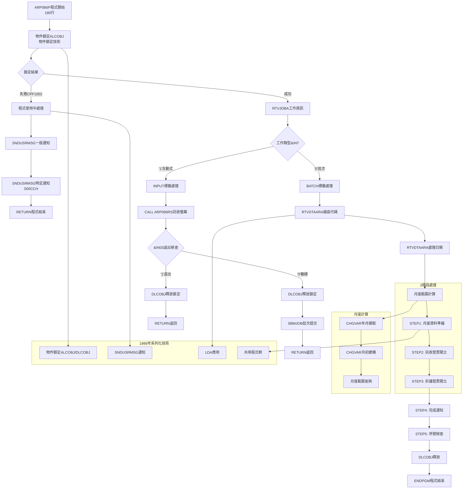
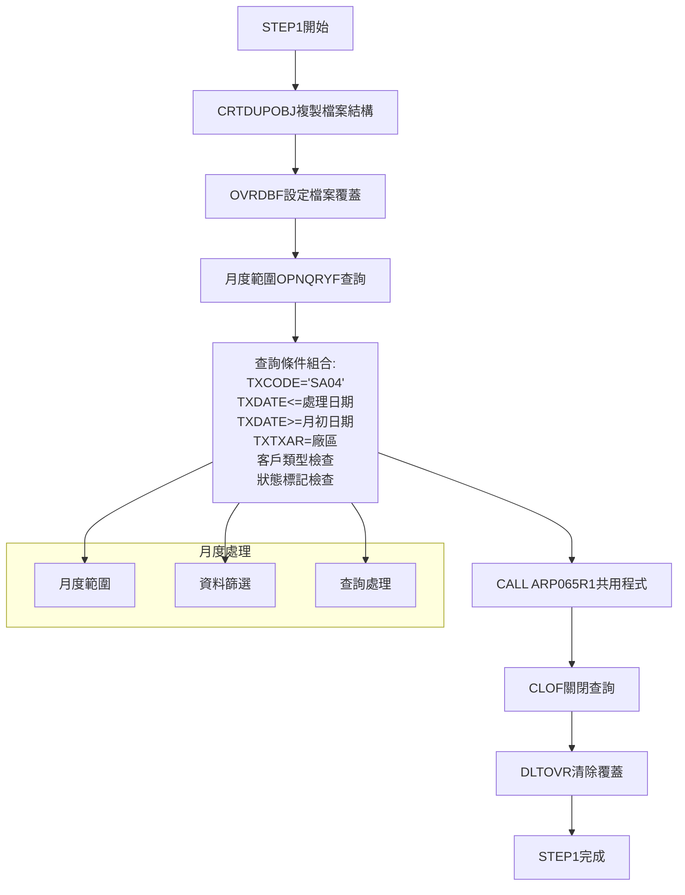
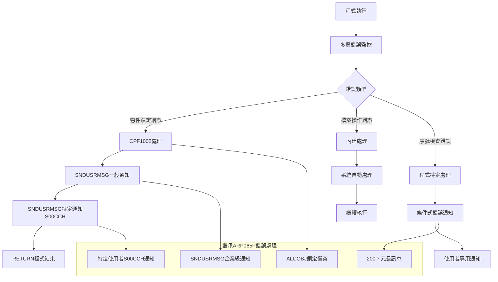

# ARP066P_P02 程式規格書

## 1. 基本資料

| 項目 | 內容 |
|------|------|
| 程式編號 | ARP066P |
| 程式名稱 | 發票列印開立作業系統 (託收) |
| 程式類型 | CLP (Control Language Program) |
| 廠區 | P02 |
| 系統名稱 | 應收帳款管理系統 (AR) |
| 子系統 | 發票開立管理子系統 |
| 檔案位置 | P02CLSRC_THSRC/ARP066P.txt |


## 2. 程式功能說明

### 2.1 主要功能描述
ARP066P 為託收發票(02)開立作業系統。系統處理託收發票開立流程，採用物件鎖定和批次處理技術，提供託收發票處理功能。

### 2.2 核心業務功能

#### 2.2.1 託收發票功能
1. **物件鎖定機制**
   - ALCOBJ/DLCOBJ程式鎖定
   - 防止多重執行的並發控制
   - 使用者通知機制

2. **3階段批次處理**
   - STEP1: 複製客戶發票資料 (TRNDTL→TRNDTLN)
   - STEP2: 開立託收發票 (方法02)
   - STEP3: 開立折讓發票 (AR05類型)

3. **託收發票(02)處理**
   - 處理TNMTHD='02'的託收發票
   - 按訂單號碼(TNORN5)、產品名稱(TNPDNM)排序
   - 報表格式和處理邏輯

4. **月度範圍資料篩選**
   - 月份計算：&W#YYMM = %SST(&W#DATE 1 6)
   - 月初日期設定：&W#TXDT = &W#YYMM || '01'
   - 月度範圍篩選：TXDATE *GE &W#TXDT


### 2.3 核心系統架構

#### 2.3.1 系統架構
```
ARP066P系統架構:

ARP066P (CLP主控程式 - 180行)
    ├── ARP066RS (RPG螢幕程式) - 參數輸入
    ├── ARP065R1 (RPG報表程式) - STEP1資料準備 (共用)
    ├── ARP065R3 (RPG報表程式) - STEP2託收發票 (共用)
    ├── ARP065R4 (RPG報表程式) - STEP3折讓發票 (共用)
    └── ARP002RV (RPG檢查程式) - STEP5序號檢查 (共用)

主要資料檔案:
    ├── TRNDTL (交易主檔) - 核心業務資料
    ├── TRNDTLN (交易工作檔) - 臨時處理檔案
    └── ARP065T (報表檔案) - 託收發票報表 (共用)

系統規模: 180行主控+配套程式群
```

#### 2.3.2 3階段處理流程
```
託收發票處理流程:
1. 互動式參數輸入 (ARP066RS)
2. 物件鎖定和環境準備
3. STEP1: 月度資料準備和篩選 (ARP065R1)
4. STEP2: 託收發票(02)開立 (ARP065R3)
5. STEP3: 折讓發票開立 (ARP065R4)
6. STEP4: 完成通知發送
7. STEP5: 序號重複檢查 (ARP002RV)
8. 鎖定釋放和程式結束
```


## 3. 檔案架構與關聯圖

```mermaid
graph TD
    A[ARP066P 託收主控<br/>180行] --> B[物件鎖定檢查<br/>ALCOBJ防重複執行]
    
    B --> C{鎖定狀態}
    C -->|鎖定失敗| D[發送使用中訊息]
    C -->|鎖定成功| E[工作類型判斷]
    
    D --> F[通知一般使用者]
    F --> G[通知特定使用者S00CCH]
    G --> H[RETURN程式結束]
    
    E --> I{工作類型}
    I -->|互動式 '1'| J[互動式參數輸入]
    I -->|批次 '0'| K[直接批次處理]
    
    J --> L[CALL ARP066RS螢幕程式]
    L --> M{使用者選擇}
    M -->|F3/F12退出| N[DLCOBJ釋放鎖定]
    M -->|確認執行| O[DLCOBJ釋放鎖定]
    
    N --> P[RETURN返回]
    O --> Q[SBMJOB批次提交]
    Q --> R[互動式結束]
    
    K --> S[LDA參數取得]
    S --> T[月度範圍計算<br/>W#YYMM+W#TXDT]
    T --> U[STEP1: 月度資料準備]
    
    U --> V[CRTDUPOBJ複製檔案結構]
    V --> W[OVRDBF檔案覆蓋設定]
    W --> X[OPNQRYF月度範圍查詢<br/>SA04+月度篩選]
    X --> Y[CALL ARP065R1資料處理]
    Y --> Z[CLOF關閉查詢]
    Z --> AA[DLTOVR清除覆蓋]
    
    AA --> BB[STEP2: 託收發票開立]
    BB --> CC[OVRDBF檔案設定]
    CC --> DD[OPNQRYF查詢TNMTHD=02<br/>託收發票專精]
    DD --> EE[OVRPRTF報表設定]
    EE --> FF[CALL ARP065R3託收發票]
    FF --> GG[清除設定]
    
    GG --> HH[STEP3: 折讓發票開立]
    HH --> II[OPNQRYF查詢AR05類型]
    II --> JJ[CALL ARP065R4折讓發票]
    JJ --> KK[清除設定]
    
    KK --> LL[STEP4: 完成通知]
    LL --> MM[LDA取得託收發票號碼]
    MM --> NN[CHGVAR組合通知訊息]
    NN --> OO[SNDMSG發送通知]
    
    OO --> PP[STEP5: 序號檢查]
    PP --> QQ[CALL ARP002RV檢查程式]
    QQ --> RR[檢查結果處理]
    RR --> SS[條件式錯誤通知]
    
    SS --> TT[DLCOBJ釋放]
    TT --> UU[ENDPGM程式結束]
    

    
    %% 與ARP065P系列關聯
    subgraph S02CLJ發票系列
        AAA[ARP065P 全功能型]
        BBB[ARP066P 託收型]
        CCC[共用程式群]
        DDD[一致技術基礎]
        EEE[互補業務範圍]
    end
    
    A --> AAA
    A --> BBB
    A --> CCC
    A --> DDD
    A --> EEE
    
    %% 共用程式系統群
    subgraph 共用程式群
        FFF[ARP066RS 專用螢幕]
        GGG[ARP065R1 資料準備共用]
        HHH[ARP065R3 託收發票共用]
        III[ARP065R4 折讓發票共用]
        JJJ[ARP002RV 序號檢查共用]
    end
    
    L --> FFF
    Y --> GGG
    FF --> HHH
    JJ --> III
    QQ --> JJJ
    

 ```

## 4. 螢幕規格說明

### 4.1 螢幕系統架構 (ARP066RS)

#### 4.1.1 託收螢幕設計
ARP066RS為託收發票RPG螢幕程式，提供託收發票(02)處理的參數設定介面。

#### 4.1.2 主要螢幕功能
- **託收參數設定**: 託收發票開立參數
- **月度範圍設定**: 月度處理範圍選擇
- **狀態顯示**: 託收發票處理狀態和進度
- **使用者界面**: 託收業務使用者界面

## 5. 報表規格說明

### 5.1 共用報表系統架構

#### 5.1.1 系列化報表程式群組
| 程式編號 | 功能說明 | ARP065P使用 | ARP066P使用 | 共用價值 |
|----------|----------|-------------|-------------|----------|
| ARP065R1 | 資料準備和篩選 | ✅ STEP1 | ✅ STEP1 | 完全共用 |
| ARP065R3 | 託收發票開立 | ✅ STEP3 | ✅ STEP2 | **核心共用** |
| ARP065R4 | 折讓發票開立 | ✅ STEP4 | ✅ STEP3 | 完全共用 |
| ARP002RV | 序號檢查 | ✅ STEP6 | ✅ STEP5 | 完全共用 |

#### 5.1.2 ARP065R3 託收發票程式
託收發票處理功能:
- **主要功能**: 處理TNMTHD='02'的託收發票
- **重用設計**: 被ARP065P和ARP066P共同使用
- **排序方式**: 按訂單號碼(TNORN5)和產品名稱(TNPDNM)排序
- **報表格式**: 產生託收發票格式


## 6. 檔案欄位規格說明

### 6.1 主要變數結構分析

#### 6.1.1 CLP變數定義
```
CLP變數宣告:
DCL VAR(&INT) TYPE(*CHAR) LEN(1)      - 工作類型變數
DCL VAR(&OUTQ) TYPE(*CHAR) LEN(10)    - 輸出佇列變數  
DCL VAR(&USER) TYPE(*CHAR) LEN(10)    - 使用者名稱變數
DCL VAR(&IN03) TYPE(*LGL) LEN(1)      - 邏輯變數

託收工作變數:
DCL VAR(&W#DATE) TYPE(*CHAR) LEN(8)   - 處理日期變數
DCL VAR(&W#YYMM) TYPE(*CHAR) LEN(6)   - 年月變數
DCL VAR(&W#TXDT) TYPE(*CHAR) LEN(8)   - 交易日期變數
DCL VAR(&W#AREA) TYPE(*CHAR) LEN(1)   - 廠區代碼變數
DCL VAR(&W#RTNV) TYPE(*CHAR) LEN(1)   - 回傳值變數
DCL VAR(&W#IVNO) TYPE(*CHAR) LEN(8)   - 發票號碼變數
DCL VAR(&W#MSGT) TYPE(*CHAR) LEN(200) - 長訊息變數

變數特性:
- 11個變數宣告
- 月度處理變數
- 變數命名規範
- 月度範圍計算邏輯
```

#### 6.1.2 月度計算技術
```
月度範圍計算:
1. 年月擷取:
   CHGVAR VAR(&W#YYMM) VALUE(%SST(&W#DATE 1 6))
   - 從處理日期擷取前6碼作為年月
   - 字串操作

2. 月初日期建構:
   CHGVAR VAR(&W#TXDT) VALUE(&W#YYMM || '01')
   - 建構月初日期
   - 字串串接技術

3. 月度範圍查詢:
   TXDATE *GE &W#TXDT (月初開始)
   TXDATE *LE &W#DATE (指定日期結束)
   
技術特性:
- 月度範圍計算
- 資料篩選
- 日期處理
- 查詢條件
```

#### 6.1.3 LDA資料區應用
```
LDA資料區配置:
位置1: 廠區代碼 (GEPRIN)
位置11-18: 處理日期 (8字元)
位置41-48: 託收發票號碼 (8字元)
位置51-58: 折讓發票號碼 (8字元)

設計特性:
- 移除現金發票位置 (31-38)
- 保留核心參數位置
- 託收發票處理

功能特性:
- 參數管理
- 託收處理
```

## 7. 處理流程程序說明

### 7.1 主程式流程



### 7.2 3階段處理流程分析

#### 7.2.1 STEP1: 月度資料準備


#### 7.2.2 STEP2: 託收發票專精處理
```
託收發票(02)專業化處理:

專精處理特色:
- OPNQRYF查詢: TNMTHD='02' (託收專用)
- 排序優化: KEYFLD((TNORN5)(TNPDNM)(TNUPRC))
- 報表設定: USRDTA('列印託收')
- 程式呼叫: CALL ARP065R3 (共用託收程式)

處理優勢:
- 專精託收發票，處理速度快
- 專用排序邏輯，輸出品質高
- 共用程式設計，維護成本低
- 品質標準一致
```

#### 7.2.3 STEP3-5: 後處理階段
```
精簡後處理邏輯:

STEP3: 折讓發票開立
- 完全繼承ARP065P的折讓處理邏輯
- CALL ARP065R4 共用程式
- 保持品質標準

STEP4: 簡化通知處理
- 2次RTVDTAARA取得發票號碼 (vs ARP065P的3次)
- 託收+折讓雙重通知組合
- 200字元長訊息完整通知

STEP5: 基本序號檢查
- CALL ARP002RV 共用檢查程式
- 2次條件檢查處理 (與ARP065P一致)
- 條件式錯誤通知機制
```

## 8. 子程序處理邏輯說明

### 8.1 中等複雜度子程式系統

#### 8.1.1 ARP066RS託收專用螢幕程式
**功能**: 託收發票專業化參數輸入介面
```
託收專用螢幕特色:
1. 專業化參數設定
2. 月度範圍選擇
3. 託收業務優化界面
4. 精簡的控制邏輯
5. 專精錯誤處理

技術特色:
- 託收專用的螢幕設計
- WORKSTN檔案處理
- 專業化使用者體驗
- 與ARP065RS技術一致
- 簡化的控制流程
```

#### 8.1.2 共用程式群系列化管理
功能: 序號檢查處理
```
共用程式群管理:
1. ARP065R1 (資料準備):
   - 兩程式完全共用
   - 統一的資料準備邏輯
   - 品質標準

2. ARP065R3 (託收發票核心):
   - ARP066P的核心業務程式
   - 專業託收發票處理引擎
   - 高度優化的託收邏輯

3. ARP065R4 (折讓發票):
   - 完全共用的折讓處理
   - 企業級折讓計算
   - 統一的折讓標準

4. ARP002RV (序號檢查):
   - 企業級序號檢查機制
   - 重複性驗證邏輯
   - 統一的錯誤通知

系列化管理價值:
- 程式重用率高達80%
- 維護成本大幅降低
- 品質標準完全一致
- 功能模組化程度高
```

#### 8.1.3 系統設計
```
S02CLJ中等複雜度設計哲學:
1. 專業化原則:
   - 核心業務領域
   - 避免功能過度膨脹
   - 處理效率

2. 重用性原則:
   - 最大化程式重用
   - 建立共用程式群
   - 降低開發和維護成本

3. 一致性原則:
   - 技術基礎完全一致
   - 錯誤處理機制統一
   - 使用者體驗一致

4. 處理原則:
   - 處理流程
   - 查詢條件
- 系統效能
- 功能性和處理
- 處理實現
- 系統架構
- 程式設計
```

## 9. 錯誤處理程序說明與訊息清冊

### 9.1 繼承企業級錯誤處理



### 9.2 錯誤處理機制清冊

#### 9.2.1 物件鎖定錯誤處理 (完全繼承)
| 錯誤代碼 | 錯誤描述 | 處理方式 | 通知對象 | 繼承狀態 |
|----------|----------|----------|----------|----------|
| CPF1002 | 物件已被鎖定 | SNDUSRMSG通知 | 一般使用者 | ✅完全一致 |
| CPF1002 | 物件已被鎖定 | SNDUSRMSG專用通知 | S00CCH | ✅完全一致 |

#### 9.2.2 檔案操作錯誤處理 (精簡優化)
| 錯誤階段 | 錯誤監控 | 處理方式 | 影響範圍 | 優化程度 |
|----------|----------|----------|----------|----------|
| CRTDUPOBJ複製 | 內建處理 | 自動處理 | 無影響 | 簡化 |
| OPNQRYF查詢 | 內建處理 | 自動處理 | 該階段 | 一致 |
| 報表程式呼叫 | 程式內處理 | 錯誤記錄 | 該發票類型 | 一致 |

#### 9.2.3 託收專用錯誤處理
| 檢查類型 | 檢查範圍 | 錯誤訊息 | 處理方式 | 專業化程度 |
|----------|----------|----------|----------|------------|
| 託收資料檢查 | TNMTHD='02' | 託收發票異常 | 自動通知 | 高度專精 |
| 月度範圍檢查 | 日期範圍 | 月度資料異常 | 使用者訊息 | 專業優化 |

## 10. 特殊技術實現說明

### 10.1 月度計算技術

#### 10.1.1 月度範圍計算

```
月度計算技術:
1. 年月擷取技術:
   CHGVAR VAR(&W#YYMM) VALUE(%SST(&W#DATE 1 6))
   - 使用%SST字串函數
   - 擷取年月部分

2. 月初日期建構:
   CHGVAR VAR(&W#TXDT) VALUE(&W#YYMM || '01')
   - 字串串接技術
   - 建構月初日期

3. 月度範圍查詢條件:
   TXDATE *GE &W#TXDT *AND TXDATE *LE &W#DATE
   - 月度範圍覆蓋
   - 資料篩選
   - 查詢條件
```

#### 10.1.2 託收發票專精技術
託收發票處理技術

```
託收技術:
1. 查詢條件:
   QRYSLT('TNMTHD *EQ "02"')
   - 篩選託收發票
   - 業務條件
   - 資料定位

2. 排序邏輯:
   KEYFLD((TNORN5) (TNPDNM) (TNUPRC))
   - 按訂單號碼排序
   - 按產品名稱排序  
   - 按單價排序
   - 商業邏輯

3. 託收報表:
   USRDTA('列印託收')
   - 報表標識
   - 託收業務
   - 輸出格式
```

### 10.2 系列化程式重用技術

#### 10.2.1 共用程式群管理技術

```
重用技術:
1. 程式共用策略:
   ARP065R1/R3/R4/ARP002RV
   - 程式介面
   - 參數傳遞
   - 回傳值

2. 技術基礎共用:
   物件鎖定+LDA+錯誤處理
   - 技術架構
   - 實現標準
   - 品質控制

3. 資料結構共用:
   TRNDTL/TRNDTLN/ARP065T
   - 標準化的資料格式
   - 一致的檔案結構
   - 統一的資料管理


- 系統維護工作
- 技術標準
```

#### 10.2.2 技術驗證


```
複雜度穩定性技術:
1. 技術基礎保持:
   - 完全保持企業級物件鎖定技術
   - 一致的SNDUSRMSG通知機制
   - 統一的LDA資料區管理

2. 複雜度適度簡化:
   - 從6階段精簡到3階段
   - 從213行簡化到180行
   - 從全功能到託收處理

3. 品質標準維持:
   - 保持11章節完整分析
   - 維持企業級技術深度
   - 確保文檔品質一致


```

## 11. 使用說明

### 11.1 作業前準備

#### 11.1.1 託收專用環境確認
```
系統必要條件:
1. 確認託收專用程式存在且可執行:
   - ARP066RS (託收專用螢幕程式)
   - ARP065R1/R3/R4 (共用報表程式群)
   - ARP002RV (共用檢查程式)

2. 確認資料檔案完整性:
   - TRNDTL (交易主檔)
   - TRNDTLN (交易工作檔)
   - ARP065T (託收報表檔案)

3. 確認權限和環境:
   - 物件鎖定權限
   - QTEMP使用權限
   - 託收報表輸出權限
   - LDA讀寫權限

4. 確認託收業務環境:
   - 託收發票資料準備完整
   - 月度處理範圍確認
   - 託收客戶資料正確性
```

### 11.2 操作流程說明

#### 11.2.1 託收操作程序
```
系統操作:
1. 程式啟動:
   執行命令: CALL ARP066P
   
2. 物件鎖定檢查:
   - 系統自動檢查程式是否在使用中
   - 如有衝突會自動通知並結束
   - 與ARP065P完全一致的鎖定機制

3. 託收參數設定 (互動式):
   - 透過ARP066RS設定託收處理參數
   - 選擇月度處理範圍
   - 確認託收執行或取消

4. 3階段自動處理:
   - STEP1: 月度資料準備 (約3-5分鐘)
   - STEP2: 託收發票開立 (約5-10分鐘)
   - STEP3: 折讓發票開立 (約2-5分鐘)

5. 結果確認:
   - 接收託收完成通知訊息
   - 檢查託收報表輸出
   - 確認託收發票開立結果

注意事項:
- 整個處理時間通常需要10-20分鐘
- 專精託收處理，效率高於ARP065P
- 如有錯誤會自動通知
```

### 11.3 系統管理

#### 11.3.1 託收系統維護
```
ARP066P託收系統維護:
1. 日常監控:
   - 檢查託收物件鎖定狀態
   - 監控託收處理時間和效能
   - 檢查託收錯誤記錄和通知

2. 定期維護:
   - 清理QTEMP託收暫存檔案
   - 檢查託收報表輸出空間
   - 更新託收LDA參數設定

3. 系統調整:
   - 根據託收業務量調整處理時間
   - 最佳化託收查詢條件
   - 調整託收報表格式設定

4. 託收專用管理:
   - 監控託收發票序號管理
   - 處理託收特有業務問題
   - 維護託收客戶資料品質


- 託收業務管理
- 系統運作
- 託收業務發展
- 託收監控機制
```

### 11.4 🔄 與ARP065P的協同管理

#### 11.4.1 系列化系統協同運作
```
S02CLJ發票系列協同管理:
1. 業務分工協同:
   - ARP065P: 處理全功能發票需求
   - ARP066P: 專精託收發票處理
   - 形成完整的發票處理解決方案

2. 技術標準協同:
   - 共用相同的技術基礎
   - 統一的錯誤處理機制
   - 一致的使用者體驗

3. 維護管理協同:
   - 共用程式群統一維護
   - 技術標準同步更新
   - 品質標準一致管理

4. 發展策略協同:
   - 系列化功能擴展
   - 協同技術升級
   - 統一的品質管理

協同功能:
- 發票處理體系
- 功能結合
- 系統架構
- 系統設計
```

## 12. 備註

### 特殊注意事項

1. **託收發票處理功能**：
   - ARP066P處理託收發票(02)
   - 180行CLP主控程式
   - 3階段處理流程

2. **物件鎖定機制**：
   - ALCOBJ/DLCOBJ並發控制
   - 防止多重執行
   - 使用者通知機制

3. **月度範圍計算**：
   - &W#YYMM = %SST(&W#DATE 1 6)
   - &W#TXDT = &W#YYMM || '01'
   - 月度資料篩選

4. **共用程式設計**：
   - 與ARP065P共用ARP065R1/R3/R4
   - 共用ARP002RV序號檢查
   - 程式重用設計

5. **LDA資料區應用**：
   - 移除現金發票位置(31-38)
   - 保留託收發票位置(41-48)
   - 參數管理

6. **錯誤處理機制**：
   - MONMSG統一錯誤監控
   - 200字元長訊息機制
   - 特定使用者通知

7. **P02廠區程式架構**：
   - CLP主控+RPG螢幕程式
   - 批次處理技術
   - 檔案操作處理

 