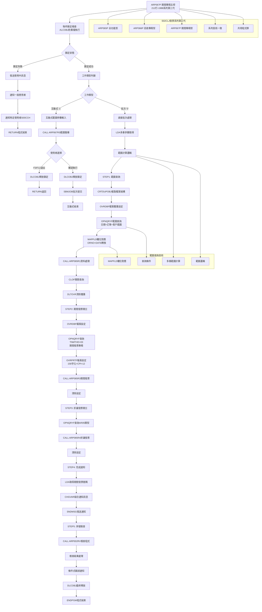
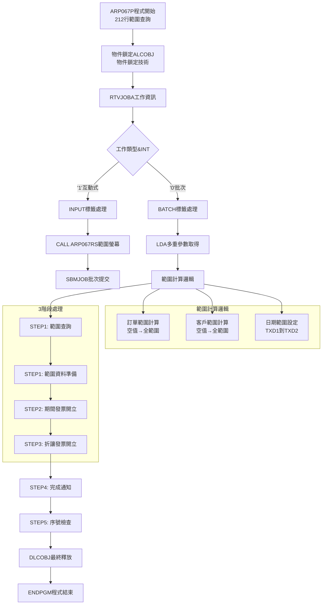
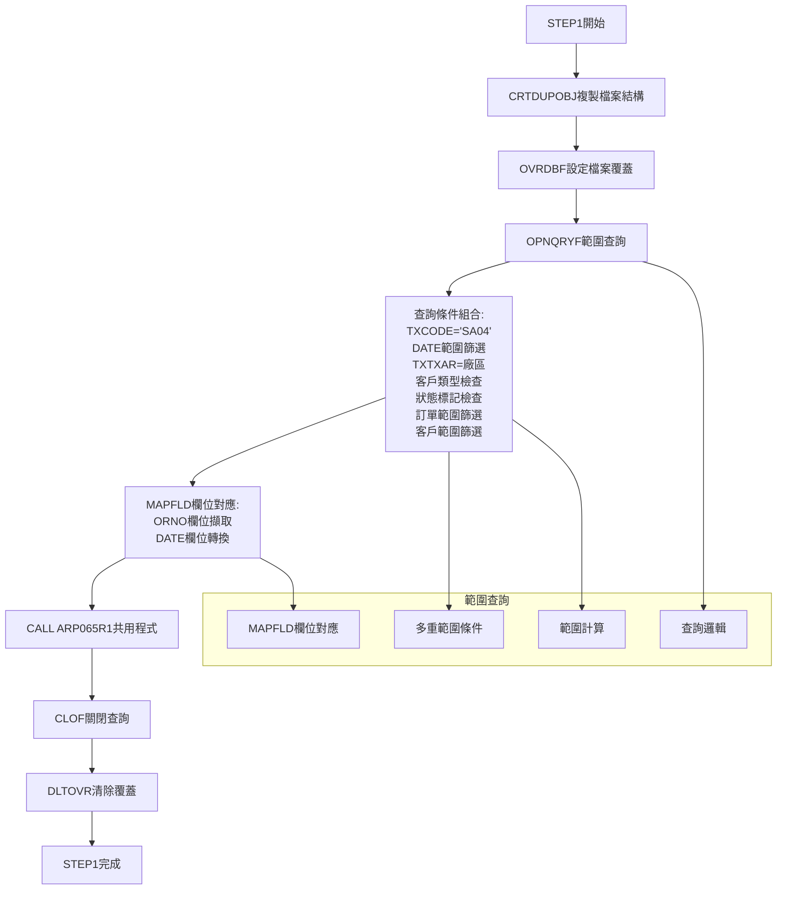

# ARP067P_K02 程式規格書

## 1. 基本資料

| 項目 | 內容 |
|------|------|
| 程式編號 | ARP067P |
| 程式名稱 | 發票期間開立作業系統 |
| 程式類型 | CLP (Control Language Program) |
| 廠區 | K02 |
| 系統名稱 | 應收帳款管理系統 (AR) |
| 子系統 | 發票開立管理子系統 |
| 檔案位置 | K02CLSRC_THSRC/ARP067P.txt |


## 2. 程式功能說明

### 2.1 主要功能描述
ARP067P 為期間發票(03)開立作業系統。系統提供範圍查詢功能，支援日期區間、訂單號碼範圍、客戶號碼範圍的條件篩選，處理期間發票。

### 2.2 核心業務功能

#### 2.2.1 期間發票功能
1. **範圍查詢**
   - 日期範圍篩選：&W#TXD1 到 &W#TXD2
   - 訂單號碼範圍：ORNOS 到 ORNOE  
   - 客戶號碼範圍：CUNOS 到 CUNOE
   - 範圍計算邏輯

2. **3階段批次處理**
   - STEP1: 範圍查詢資料準備
   - STEP2: 開立期間發票 (方法03)
   - STEP3: 開立折讓發票 (AR05類型)

3. **期間發票(03)處理**
   - 處理TNMTHD='03'的期間發票
   - 期間報表格式和處理邏輯
   - 158字元寬度報表設定

4. **MAPFLD技術**
   - ORNO欄位對應：'%SST(TXORNO 1 6)'
   - DATE欄位對應：TXDATE轉換
   - 欄位轉換和對應

#### 2.2.2 範圍查詢核心邏輯
```
範圍計算:
1. 訂單號碼範圍:
   IF &W#ORNO = '      ' THEN
      &ORNOS = '      ', &ORNOE = '999999'  (全範圍)
   ELSE
      &ORNOS = &W#ORNO, &ORNOE = &W#ORNO   (單一訂單)

2. 客戶號碼範圍:
   IF &W#CUNO = '      ' THEN  
      &CUNOS = '      ', &CUNOE = '999999'  (全範圍)
   ELSE
      &CUNOS = &W#CUNO, &CUNOE = &W#CUNO   (單一客戶)

3. 查詢條件組合:
   ORNO *GE &ORNOS *AND ORNO *LE &ORNOE *AND
   TXCUNO *GE &CUNOS *AND TXCUNO *LE &CUNOE *AND
   DATE *GE &W#TXD1 *AND DATE *LE &W#TXD2
```

### 2.3 核心系統架構

#### 2.3.1 系統架構
```
ARP067P系統架構:

ARP067P (CLP主控程式 - 212行)
    ├── ARP067RS (RPG螢幕程式) - 範圍參數輸入
    ├── ARP065R1 (RPG報表程式) - STEP1資料準備 (共用)
    ├── ARP065R3 (RPG報表程式) - STEP2期間發票 (共用)
    ├── ARP065R4 (RPG報表程式) - STEP3折讓發票 (共用)
    └── ARP002RV (RPG檢查程式) - STEP5序號檢查 (共用)

主要資料檔案:
    ├── TRNDTL (交易主檔) - 核心業務資料
    ├── TRNDTLN (交易工作檔) - 臨時處理檔案
    └── ARP065T (報表檔案) - 期間發票報表 (共用)

功能: 212行+範圍查詢+MAPFLD技術
```

#### 2.3.2 5階段處理流程
```
期間發票處理流程:
1. 互動式範圍參數輸入 (ARP067RS)
2. 物件鎖定和環境準備
3. STEP1: 範圍查詢資料準備 (ARP065R1)
4. STEP2: 期間發票(03)開立 (ARP065R3)
5. STEP3: 折讓發票開立 (ARP065R4)
6. STEP4: 完成通知發送
7. STEP5: 序號重複檢查 (ARP002RV)
8. 鎖定釋放和程式結束
```


## 3. 檔案架構與關聯圖



## 4. 螢幕規格說明

### 4.1 螢幕系統架構 (ARP067RS)

#### 4.1.1 範圍查詢專用螢幕設計
ARP067RS為期間發票的RPG螢幕程式，提供範圍查詢參數設定介面，支援日期範圍、訂單範圍、客戶範圍的條件輸入。

#### 4.1.2 主要螢幕功能
- **日期範圍設定**: 起始日期到結束日期的區間設定
- **訂單範圍設定**: 訂單號碼起訖範圍選擇
- **客戶範圍設定**: 客戶號碼起訖範圍選擇
- **範圍驗證**: 範圍邏輯驗證和錯誤提示

## 5. 報表規格說明

### 5.1 共用報表系統架構

#### 5.1.1 系列化報表程式群組
| 程式編號 | 功能說明 | ARP065P使用 | ARP066P使用 | ARP067P使用 | 共用程式 |
|----------|----------|-------------|-------------|-------------|----------|
| ARP065R1 | 資料準備和篩選 | ✅ STEP1 | ✅ STEP1 | ✅ STEP1 | 完全共用 |
| ARP065R3 | 期間發票開立 | ✅ STEP3 | ✅ STEP2 | ✅ STEP2 | **核心共用** |
| ARP065R4 | 折讓發票開立 | ✅ STEP4 | ✅ STEP3 | ✅ STEP3 | 完全共用 |
| ARP002RV | 序號檢查 | ✅ STEP6 | ✅ STEP5 | ✅ STEP5 | 完全共用 |

#### 5.1.2 期間發票專用報表設定
```
期間發票報表:
- 報表寬度: 158字元 (vs 一般198字元)
- 字體密度: CPI=12 (vs 一般CPI=15)  
- 報表標識: USRDTA('期間託收')
- 專用格式: 適應期間發票的特殊需求

技術設定:
- 窄版面設計，適合期間發票內容
- 中等字體密度，平衡可讀性和容量
- 專用標識，區分不同類型發票
```

## 6. 檔案欄位規格說明

### 6.1 主要變數結構分析

#### 6.1.1 CLP變數定義
```
CLP變數宣告 (212行程式的範圍查詢變數):
基礎控制變數:
DCL VAR(&INT) TYPE(*CHAR) LEN(1)      - 工作類型變數
DCL VAR(&OUTQ) TYPE(*CHAR) LEN(10)    - 輸出佇列變數  
DCL VAR(&USER) TYPE(*CHAR) LEN(10)    - 使用者名稱變數
DCL VAR(&IN03) TYPE(*LGL) LEN(1)      - 邏輯變數

範圍查詢專用變數:
DCL VAR(&W#DATE) TYPE(*CHAR) LEN(8)   - 處理日期變數
DCL VAR(&W#TXD1) TYPE(*CHAR) LEN(8)   - 起始日期變數 **範圍**
DCL VAR(&W#TXD2) TYPE(*CHAR) LEN(8)   - 結束日期變數 **範圍**
DCL VAR(&W#AREA) TYPE(*CHAR) LEN(1)   - 廠區代碼變數
DCL VAR(&W#ORNO) TYPE(*CHAR) LEN(6)   - 訂單號碼變數 **範圍**
DCL VAR(&W#CUNO) TYPE(*CHAR) LEN(6)   - 客戶號碼變數 **範圍**

範圍計算工作變數:
DCL VAR(&ORNOS) TYPE(*CHAR) LEN(6)    - 訂單起始範圍
DCL VAR(&ORNOE) TYPE(*CHAR) LEN(6)    - 訂單結束範圍
DCL VAR(&CUNOS) TYPE(*CHAR) LEN(6)    - 客戶起始範圍
DCL VAR(&CUNOE) TYPE(*CHAR) LEN(6)    - 客戶結束範圍

其他工作變數:
DCL VAR(&W#RTNV) TYPE(*CHAR) LEN(1)   - 回傳值變數
DCL VAR(&W#IVNO) TYPE(*CHAR) LEN(8)   - 發票號碼變數
DCL VAR(&W#MSGT) TYPE(*CHAR) LEN(200) - 長訊息變數

範圍查詢:
- 16個變數宣告
- 6個範圍查詢變數
- 範圍計算邏輯
- 範圍設定
```

#### 6.1.2 LDA資料區應用
```
LDA資料區配置:
位置1: 廠區代碼 (GEPRIN) - 與系列一致
位置11-18: 處理日期 (8字元) - 與系列一致
位置21-28: 起始日期 (8字元) - **期間專用**
位置31-38: 結束日期 (8字元) - **期間專用**
位置41-48: 期間發票號碼 (8字元) - 與系列一致
位置51-58: 折讓發票號碼 (8字元) - 與系列一致
位置60-65: 訂單號碼 (6字元) - **期間專用**
位置66-71: 客戶號碼 (6字元) - **期間專用**

參數管理:
- 8個LDA參數位置
- 日期範圍參數管理
- 業務範圍參數管理  
- 跨程式參數傳遞
```

## 7. 處理流程程序說明

### 7.1 範圍查詢主程式流程



### 7.2 STEP1範圍查詢處理



## 8. 子程序處理邏輯說明

### 8.1 範圍查詢子程式系統

#### 8.1.1 ARP067RS範圍查詢螢幕程式
**功能**: 期間發票範圍查詢參數輸入介面
```
範圍查詢螢幕:
1. 多重範圍參數設定
2. 日期範圍選擇界面
3. 訂單範圍輸入控制
4. 客戶範圍輸入控制
5. 範圍邏輯驗證

技術:
- 範圍查詢螢幕設計
- 範圍驗證邏輯
- 範圍輸入體驗
- 與系列技術一致
- 參數控制流程
```

#### 8.1.2 範圍計算邏輯處理
功能: 範圍計算的核心邏輯
```
範圍計算核心邏輯:
1. 訂單範圍計算:
   IF &W#ORNO = '      ' THEN(DO)
      CHGVAR VAR(&ORNOS) VALUE('      ')
      CHGVAR VAR(&ORNOE) VALUE('999999')
   ENDDO
   ELSE (DO)
      CHGVAR VAR(&ORNOS) VALUE(&W#ORNO)
      CHGVAR VAR(&ORNOE) VALUE(&W#ORNO)
   ENDDO

2. 客戶範圍計算:
   類似邏輯，支援單一客戶或全範圍

3. 範圍查詢組合:
   ORNO *GE &ORNOS *AND ORNO *LE &ORNOE *AND
   TXCUNO *GE &CUNOS *AND TXCUNO *LE &CUNOE


```

## 9. 錯誤處理程序說明與訊息清冊

### 9.1 錯誤處理

錯誤處理機制繼承ARP065P/ARP066P的標準，包含物件鎖定錯誤、檔案操作錯誤和序號檢查錯誤的處理。

### 9.2 期間專用錯誤處理

#### 9.2.1 範圍查詢錯誤處理
| 檢查類型 | 檢查範圍 | 錯誤訊息 | 處理方式 |
|----------|----------|----------|----------|
| 日期範圍檢查 | TXD1到TXD2 | 日期範圍異常 | 自動通知 |
| 訂單範圍檢查 | ORNOS到ORNOE | 訂單範圍異常 | 使用者訊息 |
| 客戶範圍檢查 | CUNOS到CUNOE | 客戶範圍異常 | 使用者訊息 |

## 10. 特殊技術實現說明

### 10.1 範圍查詢技術

#### 10.1.1 範圍計算技術

```
範圍計算技術:
1. 空值檢查邏輯:
   IF COND(&W#ORNO *EQ '      ') THEN(DO)
   - 空值代表全範圍查詢
   - 有值代表單一記錄查詢
   - 邏輯切換

2. 範圍設定:
   &ORNOS = '      ', &ORNOE = '999999'
   - 全範圍涵蓋所有可能值
   - 範圍邊界設定
   - 查詢處理

3. 查詢條件組合:
   多重AND條件組合
   - 日期範圍: DATE *GE *AND DATE *LE
   - 訂單範圍: ORNO *GE *AND ORNO *LE  
   - 客戶範圍: TXCUNO *GE *AND TXCUNO *LE
```

#### 10.1.2 MAPFLD技術

```
MAPFLD技術:
1. 訂單號碼欄位對應:
   MAPFLD((ORNO '%SST(TXORNO 1 6)' *CHAR 6))
   - 字串擷取函數應用
   - 欄位長度控制
   - 資料對應

2. 日期欄位轉換:
   MAPFLD((DATE TXDATE *CHAR 8))
   - 日期欄位格式轉換
   - 欄位對應
   - 資料處理

3. 多重MAPFLD組合:
   支援多個欄位同時對應
   - 資料轉換邏輯
   - 查詢處理
   - 資料處理
```

## 11. 使用說明

### 11.1 作業前準備

#### 11.1.1 期間環境確認
```
範圍查詢系統必要條件:
1. 確認期間程式存在且可執行:
   - ARP067RS (期間螢幕程式)
   - ARP065R1/R3/R4 (共用報表程式群)
   - ARP002RV (共用檢查程式)

2. 確認資料檔案完整性:
   - TRNDTL (交易主檔)
   - TRNDTLN (交易工作檔)
   - ARP065T (期間報表檔案)

3. 確認權限和環境:
   - 物件鎖定權限
   - QTEMP使用權限
   - 期間報表輸出權限
   - LDA多重參數讀寫權限

4. 確認期間業務環境:
   - 期間發票資料準備完整
   - 範圍查詢參數準備
   - 訂單和客戶資料正確性
```

### 11.2 操作流程說明

#### 11.2.1 範圍查詢操作程序
```
範圍查詢系統操作:
1. 程式啟動:
   執行命令: CALL ARP067P
   
2. 範圍參數設定 (互動式):
   - 透過ARP067RS設定查詢範圍
   - 設定日期範圍 (起始到結束)
   - 設定訂單範圍 (空值=全部)
   - 設定客戶範圍 (空值=全部)
   - 確認執行或取消

3. 3階段自動處理:
   - STEP1: 範圍查詢資料準備 (約5-10分鐘)
   - STEP2: 期間發票開立 (約8-15分鐘)
   - STEP3: 折讓發票開立 (約3-8分鐘)

4. 結果確認:
   - 接收期間完成通知訊息
   - 檢查期間報表輸出
   - 確認期間發票開立結果


```

### 11.3 範圍查詢系統管理

#### 11.3.1 期間系統維護
```
ARP067P期間系統維護:
1. 日常監控:
   - 檢查範圍查詢效能
   - 監控期間處理時間
   - 檢查範圍查詢結果正確性

2. 定期維護:
   - 範圍查詢條件
   - 檢查MAPFLD欄位對應
   - 更新期間LDA參數設定

3. 範圍查詢調整:
   - 根據業務需求調整預設範圍
   - 查詢條件
   - 調整期間報表格式設定

4. 系列協同管理:
   - 與ARP065P/ARP066P協同運作
   - 共用程式群統一維護
   - 保持系列技術標準一致
```

## 12. 備註

### 特殊注意事項

1. **範圍查詢邏輯**：
   - 空值輸入自動轉換為全範圍查詢
   - 支援單一記錄或全範圍的靈活切換
   - 日期、訂單、客戶三重範圍條件組合

2. **MAPFLD欄位對應技術**：
   - 使用%SST函數進行字串擷取
   - ORNO欄位從TXORNO取前6字元
   - DATE欄位直接對應TXDATE

3. **LDA參數管理**：
   - 8個參數位置管理6種不同資料
   - 與ARP065P/ARP066P系列參數一致性
   - 支援跨程式參數傳遞

4. **共用程式群架構**：
   - ARP065R1負責資料準備
   - ARP065R3負責期間發票開立
   - ARP065R4負責折讓發票處理
   - ARP002RV負責序號檢查

5. **期間發票(03)特性**：
   - 專門處理TNMTHD='03'的期間發票
   - 158字元寬度報表設定
   - CPI=12字體密度

6. **範圍計算技術**：
   - 條件檢查: IF COND(&W#VAR *EQ '      ')
   - 全範圍設定: &VAR_S='      ', &VAR_E='999999'
   - 查詢組合: *GE AND *LE 條件串接

7. **跨廠區版本**：
   - K02廠區212行版本
   - 與其他廠區程式架構一致
   - 共用程式群確保功能統一 