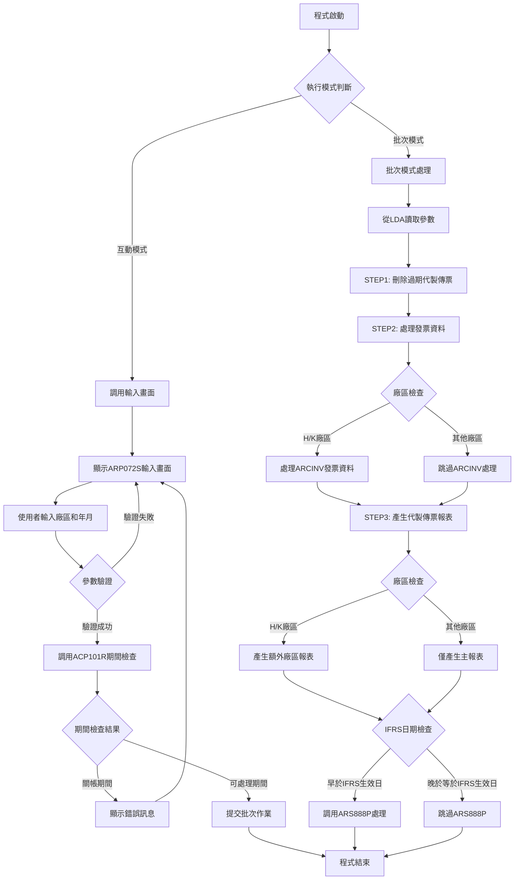
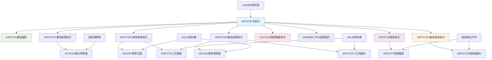
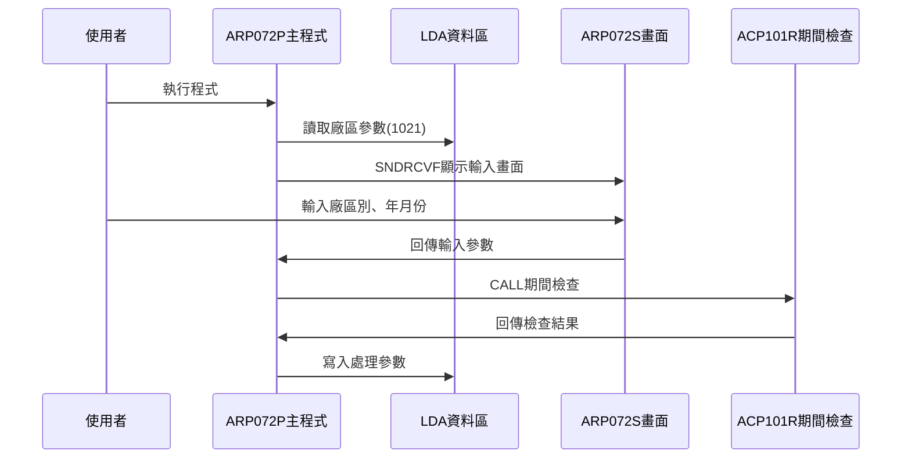
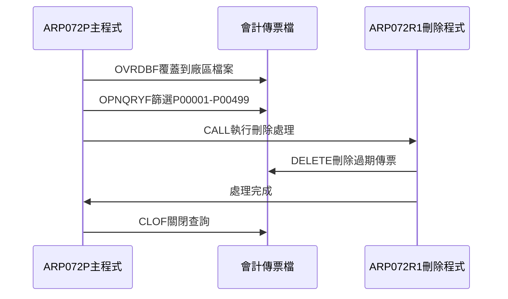
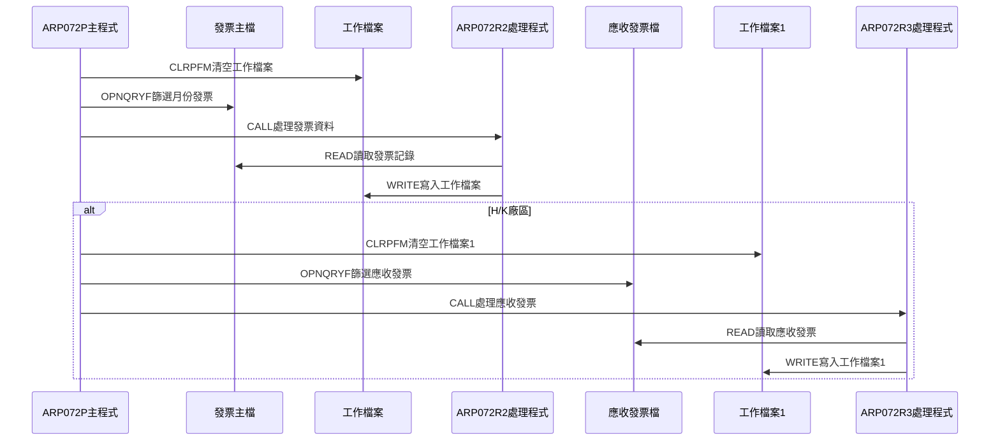
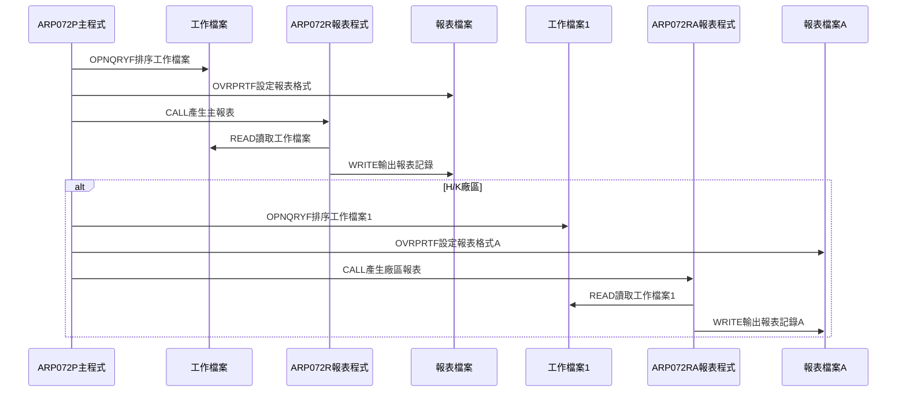
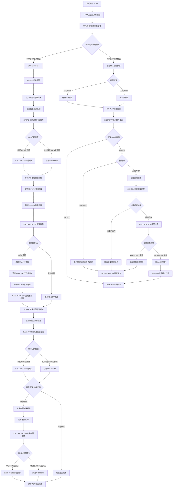

# ARP072P_H05 程式規格書

## 1. 基本資料

| 項目 | 內容 |
|------|------|
| **程式編號** | ARP072P |
| **程式名稱** | 應收帳款代製傳票報表作業 |
| **程式類型** | CLP |
| **廠區** | H05 |
| **系統名稱** | 應收帳款系統 |
| **子系統** | 應收帳款代製傳票報表處理 |
| **檔案位置** | H05CLSRC_THSRC/ARP072P.txt |

## 2. 🎯 程式功能說明

### 主要功能描述
此程式為應收帳款代製傳票報表控制程式，用於產生應收帳款代製傳票的統計報表。程式提供互動式參數輸入及批次處理兩種執行模式，透過期間檢查確保關帳期間的資料完整性，並執行完整的代製傳票報表處理，包括刪除過期代製傳票記錄、處理發票資料、產生代製傳票統計報表等作業。

### 🎯 業務流程詳細說明

#### 完整業務流程圖


#### 業務流程關鍵階段說明

**第一階段：執行模式識別與參數收集**
- 透過RTVJOBA檢查執行環境類型(批次或互動)
- 互動模式時從LDA讀取系統參數和廠區資訊
- 特殊處理：P廠區自動轉換為M廠區處理
- 收集代製傳票年月和廠區別資訊

**第二階段：期間控制與檔案檢查**
- 調用ACP101R程式檢查指定年月份是否已關帳
- 檢查對應廠區的會計傳票檔案是否存在
- 防止在關帳期間進行資料異動
- 確保會計期間的資料完整性

**第三階段：STEP1 - 刪除過期代製傳票記錄**
- 設定會計傳票檔案覆蓋到指定廠區檔案
- 使用OPNQRYF篩選P00001-P00499範圍的代製傳票
- 調用ARP072R1程式刪除過期的代製傳票記錄
- 清理過期資料確保報表準確性

**第四階段：STEP2 - 處理發票資料**
- 清空ARP072F工作檔案準備數據處理
- 使用OPNQRYF篩選指定月份的發票記錄
- 排除特定測試發票號碼(JW32774325等)
- 調用ARP072R2程式處理發票資料轉換

**第五階段：H/K廠區特殊處理**
- H廠區和K廠區需要處理ARCINV發票資料
- 清空ARP072F1工作檔案進行額外處理
- 使用OPNQRYF篩選ARCINV相關記錄
- 調用ARP072R3程式處理廠區特殊發票資料

**第六階段：STEP3 - 產生代製傳票報表**
- 設定報表輸出檔案和格式參數
- 按訂單號、發票號、產品名稱排序
- 調用ARP072R程式產生主要統計報表
- 產生"廠內代製"的統計資料

**第七階段：廠區特殊報表處理**
- H廠區和K廠區產生額外的"廠外代製"報表
- 設定不同的報表格式(158欄位寬度)
- 調用ARP072RA程式產生廠區特殊報表
- 使用ARP072F1工作檔案數據

**第八階段：IFRS相關處理與完成**
- 檢查處理年月是否早於IFRS生效日期
- 若早於IFRS生效日則調用ARS888P進行額外處理
- 從LDA讀取憑證號碼範圍進行IFRS處理
- 清理檔案覆蓋並結束程式

#### 多層次驗證機制
- **廠區權限驗證**：確保只處理授權廠區的資料
- **期間控制驗證**：透過ACP101R程式檢查會計期間狀態
- **檔案存在性檢查**：確認會計傳票檔案可正常存取
- **日期範圍驗證**：確保年月份格式正確

#### 智能處理邏輯
- 自動判斷廠區類型並採用相應的處理流程
- 動態產生檔案名稱和成員名稱
- 智能識別IFRS生效日期並執行對應處理
- 自動排除測試發票號碼避免影響正式報表

#### 資料一致性確保機制
- 透過檔案覆蓋確保存取正確的資料檔案
- 使用工作檔案技術避免影響原始發票檔案
- 分階段處理確保各步驟資料同步
- 記錄詳細的處理軌跡供後續查核

## 3. 🎯 檔案架構與關聯圖

### 使用檔案清單

| 檔案名稱 | 檔案類型 | 使用方式 | 說明 |
|----------|----------|----------|------|
| **ARP072S** | DSPF | CF/COMBINED | 代製傳票報表輸入畫面檔案 |
| **ACTRAN** | 邏輯檔 | O/OUTPUT | 會計傳票檔案(動態對應廠區) |
| **INVMST** | 邏輯檔 | IF/INPUT | 發票主檔 |
| **ARCINV** | 邏輯檔 | IF/INPUT | 應收發票檔案(H/K廠區) |
| **ARP072F** | 物理檔 | IP/INPUT | 代製傳票工作檔案 |
| **ARP072F1** | 物理檔 | IF/INPUT | 代製傳票工作檔案1(H/K廠區) |
| **ARP072T** | 報表檔 | O/OUTPUT | 代製傳票統計報表檔案 |
| **ARP072TA** | 報表檔 | O/OUTPUT | 代製傳票統計報表檔案A(H/K廠區) |

### 🎯 檔案關聯詳細視覺化圖表



### 🎯 資料流向詳細說明

#### 環境準備階段的資料流向


#### STEP1刪除處理階段的資料流向


#### STEP2發票處理階段的資料流向


#### STEP3報表產生階段的資料流向


## 4. 🎯 檔案欄位規格說明

### 主要資料結構

#### ARP072S 螢幕檔案欄位規格

| 欄位名稱 | 型態 | 長度 | 位置 | 屬性 | 說明 |
|----------|------|------|------|------|------|
| S#COMP | CHAR | 35 | 1,23 | O | 公司名稱 |
| S#DEVI | CHAR | 10 | 2,70 | O | 工作站設備代號 |
| S#YYMM | NUMERIC | 6,0 | 11,37 | B | 處理年月份(YYYYMM) |
| S#AREA | CHAR | 1 | 13,37 | B | 處理廠區代號 |
| S#ERR | CHAR | 70 | 24,2 | O | 錯誤訊息顯示 |

#### LDA本地資料區結構

| 位置範圍 | 長度 | 欄位名稱 | 用途說明 | 存取方式 |
|----------|------|----------|----------|----------|
| 1-6 | 6 | 年月份資料 | 處理年月(YYYYMM) | 讀寫 |
| 7 | 1 | 廠區代號 | 處理廠區別(M/K/H/L/T) | 讀寫 |
| 201-206 | 6 | IFRS憑證號起 | IFRS處理用憑證號範圍起始 | 讀寫 |
| 211-216 | 6 | IFRS憑證號迄 | IFRS處理用憑證號範圍結束 | 讀寫 |
| 951-985 | 35 | 公司名稱 | 系統公司名稱 | 讀取 |
| 1011-1020 | 10 | 設備代號 | 工作站設備代號 | 讀取 |
| 1021 | 1 | 區域代號 | 執行區域別 | 讀取 |

### 🔍 重點欄位切割技術詳解

#### 年月份欄位多層切割分析

**YYMM欄位的三重切割結構**：

```
&YYMM (6字元)：[YYYY|MM]
                ↓    ↓
               年度  月份
            
位置切割：
&YY = %SST(&YYMM 1 4)   // 取年度(位置1-4)
&MM = %SST(&YYMM 5 2)   // 取月份(位置5-6)

範例：
&YYMM = '202412'
&YY   = '2024'
&MM   = '12'
```

#### LDA年月份區域詳細切割

**LDA位置1-6的年月份結構**：

```
LDA年月份區域 (位置1-6)：
[YYYY|MM]
 ↓    ↓
 1-4  5-6
年度  月份

寫入操作：
CHGDTAARA DTAARA(*LDA (1 6)) VALUE(&YYMM)

讀取操作：
RTVDTAARA DTAARA(*LDA (1 6)) RTNVAR(&YYMM)
RTVDTAARA DTAARA(*LDA (1 4)) RTNVAR(&YY)
RTVDTAARA DTAARA(*LDA (5 2)) RTNVAR(&MM)
```

#### 動態檔案名稱構建邏輯

**會計傳票檔案名稱動態生成**：

```
檔案名稱構建：
&FNAME = 'AC' || &AREA || 'R'

H05廠區代碼對應表：
&AREA = 'H' → &FNAME = 'ACHR' (H05廠會計傳票檔)
&AREA = 'K' → &FNAME = 'ACKR' (K02廠會計傳票檔)  
&AREA = 'M' → &FNAME = 'ACMR' (P02廠會計傳票檔)
&AREA = 'L' → &FNAME = 'ACLR' (其他廠會計傳票檔)
&AREA = 'T' → &FNAME = 'ACTR' (T廠會計傳票檔)

檔案名稱視覺化：
['A','C'] + [廠區] + ['R']
  ↓       ↓      ↓
固定前綴  變動   固定後綴
```

#### 成員名稱動態構建邏輯

**傳票成員名稱生成規則**：

```
成員名稱構建：
&MNAME = 'VR' || &MM

月份對應表：
&MM = '01' → &MNAME = 'VR01' (1月傳票成員)
&MM = '02' → &MNAME = 'VR02' (2月傳票成員)
...
&MM = '12' → &MNAME = 'VR12' (12月傳票成員)

成員名稱視覺化：
['V','R'] + [月份]
  ↓        ↓
固定前綴   變動月份
```

#### 日期範圍欄位構建技術

**月初月底日期自動生成**：

```
日期範圍構建邏輯：
&C#SDAT = &YYMM || '01'  // 月初：年月+01
&C#EDAT = &YYMM || '31'  // 月底：年月+31

日期構建視覺化：
&YYMM    + '01' = &C#SDAT
[YYYYMM] + [01] = [YYYYMM01]
 ↓               ↓
年月份          月初日期

&YYMM    + '31' = &C#EDAT  
[YYYYMM] + [31] = [YYYYMM31]
 ↓               ↓
年月份          月底日期

實際範例：
&YYMM = '202412'
&C#SDAT = '20241201' (2024年12月1日)
&C#EDAT = '20241231' (2024年12月31日)
```

#### IFRS憑證號碼欄位特殊用途分析

**憑證號碼範圍的雙重功能**：

```
IFRS憑證號碼處理：

步驟1 - 固定範圍設定：
&D#VNO1 = 'P00001'  // 代製傳票起始號
&D#VNO2 = 'P00499'  // 代製傳票結束號

步驟2 - LDA動態讀取：
RTVDTAARA DTAARA(*LDA (201 6)) RTNVAR(&D#VNO1)
RTVDTAARA DTAARA(*LDA (211 6)) RTNVAR(&D#VNO2)

憑證號碼視覺化：
固定設定：['P','0','0','0','0','1'] - ['P','0','0','4','9','9']
動態設定：[從LDA位置201-206讀取] - [從LDA位置211-216讀取]

用途對照表：
場景1：代製傳票刪除 → 使用固定範圍(P00001-P00499)
場景2：IFRS處理     → 使用LDA動態範圍
```

#### 廠區代碼特殊處理邏輯

**P廠區到M廠區的自動轉換**：

```
廠區代碼轉換邏輯：
IF &AREA = 'P' THEN
    &AREA = 'M'
END

轉換視覺化：
輸入：['P'] → 處理：['M']
原因：P廠區實際使用M廠區的會計傳票檔案

廠區檢查邏輯：
IF &S#AREA = 'P' THEN
    錯誤：'應收帳款代製傳票作業，無法在屏東執行'
END
```

### 🎯 H05版本特殊欄位處理分析

#### H/K雙廠區處理邏輯

**H05版本雙廠區特殊處理機制**：

```
廠區檢查條件：
IF (&AREA = 'H') OR (&AREA = 'K') THEN
    // 執行ARCINV特殊處理
    // 產生額外廠區報表
END

處理流程視覺化：
['H'] or ['K'] → 啟動特殊處理
  ↓
1. ARCINV檔案處理
2. ARP072F1工作檔處理  
3. ARP072RA額外報表
4. 158欄位寬度報表格式

※註：H05版本不包含N廠區處理
```

#### H05版本報表格式差異

**H05版本專用報表設定**：

```
主報表格式：
OVRPRTF FILE(ARP072T) 
        PAGESIZE(*N 132)    // 132欄位寬度
        CPI(10)             // 10字元每吋
        USRDTA('廠內代製')

額外報表格式：
OVRPRTF FILE(ARP072T) 
        TOFILE(ARP072TA)
        PAGESIZE(*N 158)    // 158欄位寬度  
        CPI(12)             // 12字元每吋
        USRDTA('廠外代製')

格式對比視覺化：
主報表：[132欄位] + [10CPI] = 標準格式
額外：  [158欄位] + [12CPI] = 緊密格式
```

#### 測試發票排除機制

**H05版本發票排除清單**：

```
排除發票號碼清單：
標準排除：
- 'JW32774325'
- 'JW32774497'  
※註：H05版本未包含'AK88751041'(K02特有)

訂單排除：
- 'M01744' ~ 'M01767'
- 'M01781'

排除條件視覺化：
(INNO ≠ 'JW32774325') AND
(INNO ≠ 'JW32774497') AND  
(INORNO ≠ 'M01744') AND
...
(INDECD ≠ 'D')

※H05版本特色：排除清單較K02版本精簡
```

#### IFRS資料區域存取

**ARIFRSCTL資料區域讀取**：

```
IFRS生效日期讀取：
RTVDTAARA DTAARA(ARIFRSCTL (1 6)) RTNVAR(&IFRSD)

IFRS資料區域視覺化：
ARIFRSCTL: [位置1-6] → &IFRSD
           [YYYYMM]   → IFRS生效年月

用途說明：
&IFRSD用於判斷是否執行ARS888P處理
IF &YYMM < &IFRSD THEN
    // 執行IFRS相關處理
END
```

### 重要變數定義表

| 變數名稱 | 類型 | 長度 | 說明 | 切割來源 | 使用範圍 |
|----------|------|------|------|----------|----------|
| **&P#YYMM** | CHAR | 6 | 處理年月份(YYYYMM) | 螢幕輸入 | 期間檢查 |
| **&P#CODE** | CHAR | 1 | 期間檢查結果('1'=關帳) | ACP101R回傳 | 流程控制 |
| **&INT** | CHAR | 1 | 執行模式識別(0=批次,其他=互動) | RTVJOBA | 程式流程控制 |
| **&AREA** | CHAR | 1 | 處理廠區代號(M/K/H/L/T) | LDA/螢幕 | 廠區控制 |
| **&YYMM** | CHAR | 6 | 年月份變數(YYYYMM) | 螢幕/LDA | 檔案篩選 |
| **&YY** | CHAR | 4 | 年度變數(YYYY) | %SST(&YYMM 1 4) | 日期處理 |
| **&MM** | CHAR | 2 | 月份變數(MM) | %SST(&YYMM 5 2) | 檔案成員命名 |
| **&FNAME** | CHAR | 10 | 動態檔案名稱 | 'AC'+&AREA+'R' | 檔案覆蓋 |
| **&MNAME** | CHAR | 10 | 動態成員名稱 | 'VR'+&MM | 成員處理 |
| **&C#SDAT** | CHAR | 8 | 開始日期(YYYYMMDD) | &YYMM+'01' | 日期範圍控制 |
| **&C#EDAT** | CHAR | 8 | 結束日期(YYYYMMDD) | &YYMM+'31' | 日期範圍控制 |
| **&D#VNO1** | CHAR | 6 | 憑證號碼範圍起始 | 'P00001'/LDA | IFRS處理 |
| **&D#VNO2** | CHAR | 6 | 憑證號碼範圍結束 | 'P00499'/LDA | IFRS處理 |
| **&IFRSD** | CHAR | 6 | IFRS生效年月 | ARIFRSCTL | 版本控制 |

## 5. 🎯 輸出/入螢幕布局

### 螢幕布局完整視覺化

```
+------------------------------------------------------------------------------+
|                      發票及代製傳票報表作業                        ARP072S   |
|                                                                              |
|                                                                              |
|                                                                              |
|                                                                              |
|                      傳票廠區: [X] ( M:台鋼 K:祥鋼 H:東鋼                   |
|                                        L:龍昇 T:天津)                       |
|                                                                              |
|                      傳票年月: [______]                                     |
|                                                                              |
|                                                                              |
|              (此為月結作業，請務必於當月相關資料                            |
|               已建檔完成後才進行處理。)                                      |
|                                                                              |
|                                                                              |
|                                                                              |
|                                                                              |
|                                                                              |
|                                                                              |
|                                                                              |
|F3:離開                        ENTER:執行                                   |
|[錯誤訊息顯示區]                                                              |
+------------------------------------------------------------------------------+
```

### 🎯 畫面欄位詳細說明

| 欄位名稱 | 欄位屬性 | 位置 | 長度 | 輸入格式 | 驗證規則 | 說明 |
|----------|----------|------|------|----------|----------|------|
| **S#AREA** | 輸出 | 7,36 | 1 | 英文字元 | M/K/H/L/T | 傳票廠區代號 |
| **S#YYMM** | 輸入/輸出 | 10,36 | 6 | YYYYMM | 年月格式 | 傳票年月份 |
| **S#COMP** | 顯示 | 1,23 | 35 | 中文字元 | 唯讀 | 公司名稱顯示 |
| **S#DEVI** | 顯示 | 2,70 | 10 | 英數字元 | 唯讀 | 設備代號顯示 |
| **S#ERR** | 顯示 | 24,2 | 70 | 中文字元 | 唯讀 | 錯誤訊息顯示區 |

### 🎯 畫面控制邏輯

#### 指示器控制說明
- **IN03**: F3功能鍵，程式結束
- 無其他錯誤指示器，錯誤時直接顯示訊息

#### 欄位顯示屬性
- **S#AREA**: 從LDA讀取並顯示，P廠區自動轉換為M廠區
- **S#YYMM**: 使用EDTCDE(4)格式顯示為YYYY/MM
- **S#ERR**: 固定顯示為HI(高亮度)屬性

### 功能鍵詳細定義

| 功能鍵 | 處理邏輯 | 系統行為 | 說明 |
|--------|----------|----------|------|
| **F3** | 設定IN03='1' | 程式立即返回結束 | 離開程式不執行任何處理 |
| **ENTER** | 執行驗證與處理 | 驗證輸入後提交批次作業 | 執行主要報表產生邏輯 |

### 廠區代號說明
- **M**: 台鋼廠區
- **K**: 祥鋼廠區  
- **H**: 東鋼廠區
- **L**: 龍昇廠區
- **T**: 天津廠區

### 操作流程
1. 畫面顯示時自動載入系統參數和廠區資訊
2. 系統自動顯示對應的傳票廠區代號
3. 使用者輸入處理年月份(YYYYMM格式)
4. 按ENTER鍵進行驗證和期間檢查
5. 驗證通過後自動提交批次作業產生報表
6. 驗證失敗則顯示錯誤訊息並停留在輸入畫面

## 6. 🎯 處理流程程序說明

### 🎯 主程序邏輯深度分析

#### 程式執行流程圖


#### 🎯 詳細處理步驟逐一分析

**步驟1：程式環境初始化**
- 宣告ARP072S畫面檔案和15個程式變數
- 包含日期、廠區、檔案名稱、IFRS等控制變數
- 使用RTVJOBA取得作業類型、輸出佇列、使用者資訊
- 程式採用雙模式設計(互動/批次)確保彈性執行

**步驟2：執行模式判斷與系統參數讀取**
- TYPE='0'表示批次模式，直接跳轉至BATCH標籤
- 互動模式時從LDA讀取廠區、公司名稱、設備代號
- 特殊處理：P廠區自動轉換為M廠區進行處理
- 設定畫面顯示的廠區代號

**步驟3：使用者輸入與驗證處理**
- 使用SNDRCVF顯示AR072F1畫面等待使用者輸入
- 檢查F3功能鍵，若按下則直接結束程式
- 驗證廠區代號，P廠區顯示錯誤訊息不允許處理
- 收集傳票年月份輸入

**步驟4：檔案存在性和期間控制檢查**
- 動態產生會計傳票檔案名稱(AC+廠區+R)
- 使用CHKOBJ檢查對應廠區的傳票檔案是否存在
- 調用ACP101R程式檢查指定年月份是否已關帳
- 若檢查失敗則顯示對應錯誤訊息

**步驟5：批次作業提交處理**
- 將年月份和廠區代號寫入LDA位置1-6和7-1
- 使用SBMJOB提交ARP072P批次作業到使用者輸出佇列
- 批次作業執行'CALL ARP072P'指令
- 互動模式結束，批次模式開始

**步驟6：批次模式初始化與參數設定**
- 從LDA位置1-6讀取年月份(YYMM)
- 從LDA位置1-4和5-2分別讀取年度和月份
- 從LDA位置7-1讀取廠區代號
- 從ARIFRSCTL資料區讀取IFRS生效年月

**步驟7：STEP1 - 刪除過期代製傳票處理**
- 動態產生會計傳票檔案名稱和成員名稱
- 設定ACTRAN檔案覆蓋到指定廠區檔案
- 使用OPNQRYF篩選P00001-P00499範圍的代製傳票
- 調用ARP072R1程式刪除過期的代製傳票記錄

**步驟8：第一次IFRS處理檢查**
- 比較處理年月(&YYMM)與IFRS生效年月(&IFRSD)
- 若處理年月早於IFRS生效年月則需要額外處理
- 設定憑證號碼範圍D#VNO1='P00001', D#VNO2='P00499'
- 調用ARS888P程式進行IFRS相關處理

**步驟9：STEP2 - 發票資料處理準備**
- 清空ARP072F工作檔案準備數據處理
- 設定INVMST發票主檔覆蓋並允許共享存取
- 計算月份日期範圍(C#SDAT和C#EDAT)
- 準備發票資料篩選條件

**步驟10：發票記錄篩選與處理**
- 使用OPNQRYF篩選指定月份內的發票記錄
- 排除特定測試發票號碼(JW32774325、JW32774497等)
- 排除特定測試訂單號碼(M01744-M01767、M01781)
- 調用ARP072R2程式處理發票資料轉換

**步驟11：H/K廠區特殊發票處理**
- H廠區和K廠區需要處理額外的ARCINV應收發票資料
- 清空ARP072F1工作檔案1進行廠區特殊處理
- 使用OPNQRYF篩選ARCINV相關記錄
- 調用ARP072R3程式處理廠區特殊發票資料

**步驟12：STEP3 - 代製傳票報表產生**
- 設定會計傳票檔案和報表檔案覆蓋
- 設定ARP072T報表格式(132欄位寬度、10CPI)
- 按訂單號、發票號、產品名稱排序ARP072F工作檔案
- 調用ARP072R程式產生主要代製傳票統計報表

**步驟13：第二次IFRS處理檢查**
- 再次比較處理年月與IFRS生效年月
- 從LDA位置201-6和211-6讀取實際憑證範圍
- 若需要則調用ARS888P程式進行IFRS處理
- 確保報表產生後的IFRS合規性

**步驟14：H/K廠區額外報表處理**
- H廠區和K廠區產生額外的"廠外代製"報表
- 設定ARP072TA報表格式(158欄位寬度、12CPI)
- 按訂單號、發票號、產品名稱排序ARP072F1工作檔案
- 調用ARP072RA程式產生廠區特殊報表

**步驟15：第三次IFRS處理與程式結束**
- 最後一次檢查IFRS處理需求
- 若需要則進行最終的ARS888P處理
- 清理所有檔案覆蓋設定
- 程式正常結束

#### 業務邏輯深度解析

**代製傳票處理的核心邏輯**：
1. 採用三階段處理確保資料完整性和準確性
2. 透過期間檢查防止關帳期間的資料處理
3. 使用工作檔案技術避免直接異動原始檔案
4. 提供廠區特殊處理滿足不同廠區需求

**安全控制機制**：
1. 期間控制防止關帳期間處理
2. 廠區權限控制確保資料安全
3. 檔案存在性檢查防止異常處理
4. IFRS規範支援確保合規性

#### 條件判斷詳細說明

**執行模式判斷**：
- `COND(&INT *EQ '0')` - 判斷是否為批次執行環境
- 批次模式時直接進入BATCH處理段
- 互動模式時進入參數收集流程

**廠區處理判斷**：
- `COND(&AREA *EQ 'P')` - P廠區特殊處理邏輯
- 互動模式時P廠區轉換為M廠區
- 輸入驗證時P廠區不允許處理並顯示錯誤

**期間控制檢查**：
- `COND(&P#CODE *EQ '1')` - 檢查ACP101R回傳的期間狀態
- P#CODE='1'表示關帳期間不可處理
- P#CODE='0'表示正常期間可以處理

**H/K廠區特殊處理判斷**：
- `COND((&AREA *EQ 'H') *OR (&AREA *EQ 'K'))` - H/K廠區額外處理
- 需要處理ARCINV應收發票資料
- 需要產生額外的廠區特殊報表

**IFRS日期判斷**：
- `COND(&YYMM *LT &IFRSD)` - IFRS生效年月比較
- 早於IFRS生效年月需要執行ARS888P處理
- 在三個關鍵點進行IFRS檢查確保合規

#### 變數使用和數據流向追蹤

**年月參數傳遞軌跡**：
1. S#YYMM(畫面輸入) → &YYMM(程式變數) → LDA(1-6)
2. &YYMM → &YY和&MM(年月分離) → 檔案命名
3. &YYMM → OPNQRYF篩選條件 → 各處理程式

**廠區控制軌跡**：
1. LDA(1021) → &AREA → 檔案名稱產生
2. &AREA → OPNQRYF查詢條件 → 資料篩選
3. &AREA → 廠區特殊處理判斷

**檔案命名軌跡**：
1. &AREA → &FNAME(AC+廠區+R) → OVRDBF設定
2. &MM → &MNAME(VR+月份) → 成員處理
3. 動態名稱 → 檔案存在性檢查

### 🎯 子程序邏輯分析

#### ACP101R期間檢查子程序
- **功能**：檢查指定年月份是否已關帳
- **輸入來源**：&P#YYMM年月份參數
- **處理邏輯**：查詢會計期間控制檔案
- **輸出結果**：&P#CODE('0'=可處理, '1'=關帳)

#### ARP072R1刪除處理子程序
- **功能**：刪除過期的代製傳票記錄
- **輸入來源**：ACTRAN查詢結果(P00001-P00499)
- **處理邏輯**：刪除指定範圍的代製傳票
- **輸出結果**：過期傳票記錄清理

#### ARP072R2發票處理子程序
- **功能**：處理發票資料轉換到工作檔案
- **輸入來源**：INVMST篩選結果
- **處理邏輯**：發票資料格式轉換和整理
- **輸出結果**：ARP072F工作檔案數據

#### ARP072R3應收發票處理子程序
- **功能**：處理H/K廠區的應收發票資料
- **輸入來源**：ARCINV篩選結果
- **處理邏輯**：應收發票資料格式轉換
- **輸出結果**：ARP072F1工作檔案數據

#### ARP072R報表產生子程序
- **功能**：產生主要的代製傳票統計報表
- **輸入來源**：ARP072F工作檔案排序結果
- **處理邏輯**：統計分析和報表格式化
- **輸出結果**：ARP072T統計報表

#### ARP072RA廠區報表子程序
- **功能**：產生H/K廠區的特殊報表
- **輸入來源**：ARP072F1工作檔案排序結果
- **處理邏輯**：廠區特殊統計和報表格式化
- **輸出結果**：ARP072TA廠區統計報表

#### ARS888P IFRS處理子程序
- **功能**：執行IFRS會計準則相關處理
- **輸入來源**：&AREA(廠區)、&YYMM(年月)、憑證範圍
- **處理邏輯**：IFRS規範的特殊會計處理
- **輸出結果**：IFRS相關傳票和調整記錄

### 🎯 特殊邏輯處理

#### 代製傳票篩選條件
```sql
QRYSLT('ACVRNO *GE "P00001" *AND 
        ACVRNO *LE "P00499" *AND 
        ACAREA *EQ "' || &AREA || '" *AND 
        YM     *EQ "' || &YYMM || '"')
```
- 篩選P00001-P00499範圍的代製傳票
- 限制特定廠區和年月份
- 使用MAPFLD將ACYM映射為YM欄位

#### 發票記錄篩選條件
```sql
QRYSLT('(DATE *GE "' || &C#SDAT || '") *AND 
        (DATE *LE "' || &C#EDAT || '") *AND 
        (INNO *NE "JW32774325") *AND 
        (INNO *NE "JW32774497") *AND 
        (INORNO *NE "M01744") *AND 
        ... 
        (INDECD *NE "D")')
```
- 篩選指定月份內的發票記錄
- 排除多個測試發票和訂單號碼
- 排除已作廢的發票記錄(INDECD≠'D')

#### 應收發票篩選條件
```sql
QRYSLT('(R#YM   *EQ "' || &YYMM || '") *AND 
        (R1AREA *EQ "' || &AREA || '") *AND 
        (R1FLAG *NE "D")')
```
- 篩選指定年月和廠區的應收發票
- 排除已作廢的應收發票記錄
- H/K廠區特殊處理邏輯

#### IFRS版本控制邏輯
- 0011A版本新增IFRS支援
- 0112A版本強化IFRS日期控制
- 透過版本判斷在三個關鍵點執行IFRS處理
- 確保不同處理階段的IFRS合規性

### 🎯 錯誤處理與資料完整性控制

#### 詳細的錯誤處理邏輯
1. **廠區驗證錯誤處理**
   - P廠區不允許直接處理，顯示專用錯誤訊息
   - 自動轉換邏輯確保廠區代號正確性
   - 重新顯示輸入畫面要求修正

2. **檔案存在性錯誤處理**
   - 透過CHKOBJ檢查會計傳票檔案存在性
   - MONMSG捕捉檔案不存在錯誤
   - 顯示具體的檔案名稱協助排錯

3. **期間控制錯誤處理**
   - 透過ACP101R檢查會計期間狀態
   - 關帳期間顯示明確的錯誤訊息
   - 自動跳轉回輸入畫面重新設定

#### 資料完整性檢查機制
1. **分階段處理控制**
   - STEP1-STEP3分階段確保處理順序
   - 工作檔案清空確保資料乾淨
   - 檔案覆蓋和查詢正確設定

2. **版本相容性控制**
   - 透過IFRS日期判斷執行對應版本邏輯
   - 在關鍵處理點進行IFRS檢查
   - 向後相容確保系統穩定性

## 7. 🎯 數據操作與轉換分析

### 檔案操作詳解

#### ACTRAN會計傳票檔案操作
- **OVRDBF操作**：動態覆蓋到對應廠區的傳票檔案
- **OPNQRYF操作**：篩選P00001-P00499範圍的代製傳票
- **SHARE模式**：設定共享存取避免檔案鎖定
- **DELETE操作**：透過ARP072R1刪除過期的代製傳票

#### INVMST發票主檔操作
- **OPNQRYF操作**：篩選指定月份的發票記錄
- **排除邏輯**：自動排除測試發票和訂單號碼
- **日期映射**：使用MAPFLD將ININDT映射為DATE
- **資料轉換**：透過ARP072R2轉換到工作檔案

#### 工作檔案技術應用
- **ARP072F**：主要工作檔案存放發票轉換資料
- **ARP072F1**：H/K廠區專用工作檔案存放應收發票資料
- **CLRPFM操作**：清空工作檔案確保資料乾淨
- **排序處理**：按訂單號、發票號、產品名稱排序

### 數據轉換邏輯

#### 動態名稱產生機制
- **檔案名稱轉換**：'AC' + &AREA + 'R' → 廠區傳票檔名
- **成員名稱轉換**：'VR' + &MM → 月份成員名稱
- **日期格式轉換**：&YYMM + '01'/'31' → 完整日期範圍
- **廠區代號轉換**：P廠區自動轉換為M廠區處理

#### 報表格式設定邏輯
- **主報表格式**：132欄位寬度、10CPI、保持輸出
- **廠區報表格式**：158欄位寬度、12CPI、保持輸出
- **使用者資料設定**：'廠內代製'和'廠外代製'標識
- **輸出佇列設定**：使用使用者專屬輸出佇列

### 計算邏輯分析

#### 日期範圍計算
- **開始日期**：C#SDAT = &YYMM + '01'(月初)
- **結束日期**：C#EDAT = &YYMM + '31'(月底)
- **年月分離**：&YY = %SST(&YYMM 1 4), &MM = %SST(&YYMM 5 2)
- **IFRS比較**：&YYMM與&IFRSD的年月比較邏輯

#### 憑證範圍設定
- **固定範圍**：D#VNO1='P00001', D#VNO2='P00499'
- **動態範圍**：從LDA位置201-6和211-6讀取實際範圍
- **範圍用途**：IFRS處理時的憑證號碼範圍控制
- **處理時機**：在三個關鍵點設定不同的憑證範圍

#### 工作檔案排序邏輯
- **主排序**：A1ORNO(訂單號)
- **次排序**：A1IVNO(發票號)
- **末排序**：A1PDNM(產品名稱)
- **排序目的**：確保報表輸出的邏輯順序

### 檢核機制詳解

#### 檔案存在性檢核
- **CHKOBJ檢查**：確認會計傳票檔案存在
- **MONMSG處理**：捕捉檔案操作相關錯誤
- **動態檢查**：根據廠區動態檢查對應檔案
- **錯誤回饋**：顯示具體檔案名稱協助排錯

#### 期間狀態檢核
- **ACP101R檢查**：確認指定年月份的關帳狀態
- **P#CODE判斷**：'1'表示關帳不可處理，'0'表示可處理
- **錯誤處理**：關帳期間自動跳轉回輸入畫面
- **安全控制**：防止關帳期間的資料異動

#### 資料品質檢核
- **測試資料排除**：自動排除預定義的測試發票和訂單
- **作廢記錄排除**：排除INDECD='D'和R1FLAG='D'的記錄
- **日期範圍驗證**：確保處理日期在指定月份範圍內
- **廠區一致性**：確保資料與指定廠區一致

#### IFRS版本檢核
- **生效日期比較**：確保IFRS處理邏輯的正確執行
- **多點檢查**：在三個關鍵處理點進行IFRS檢查
- **版本相容性**：支援不同版本的處理需求
- **向後相容性**：確保舊版本資料的正確處理

## 8. 🎯 錯誤處理程序說明

### 🎯 詳細錯誤代碼清冊

| 錯誤代碼 | 錯誤訊息 | 原因說明 | 處理方式 | 預防措施 |
|----------|---------|---------|---------|----------|
| **P廠區錯誤** | 代製傳票報表作業，無法在此廠區執行 | 使用者在P廠區執行此程式 | 1. 顯示錯誤訊息<br>2. GOTO DISPLAY重新輸入<br>3. 要求使用其他廠區 | 在畫面說明中標示廠區限制 |
| **檔案不存在** | 代製傳票報表作業，無法找到指定的傳票檔：[檔案名] | CHKOBJ檢查發現傳票檔案不存在 | 1. 顯示具體檔案名稱<br>2. GOTO DISPLAY重新輸入<br>3. 確認廠區和年月正確 | 執行前確認所有廠區檔案存在 |
| **關帳期間** | 該月份已月結 | ACP101R檢查發現指定期間已關帳 | 1. 顯示關帳錯誤訊息<br>2. GOTO DISPLAY重新輸入<br>3. 選擇其他可處理期間 | 提供期間狀態查詢功能 |
| **CPF0000** | 檔案操作錯誤 | CHKOBJ或檔案存取發生系統錯誤 | 1. MONMSG捕捉錯誤<br>2. 顯示檔案錯誤訊息<br>3. 跳轉重新輸入 | 定期檢查檔案權限和完整性 |
| **OPNQRYF錯誤** | 查詢檔案失敗 | OPNQRYF查詢條件或檔案狀態異常 | 1. 檢查查詢條件正確性<br>2. 確認檔案可存取<br>3. 檢查檔案鎖定狀態 | 確保檔案共享設定正確 |
| **程式調用失敗** | 子程式執行錯誤 | ARP072R1/R2/R3/R/RA程式調用失敗 | 1. 檢查程式是否存在<br>2. 確認程式權限設定<br>3. 檢查參數傳遞正確性 | 定期檢查程式庫完整性 |
| **工作檔案錯誤** | 工作檔案操作失敗 | ARP072F/ARP072F1清空或存取失敗 | 1. 檢查檔案權限<br>2. 確認磁碟空間足夠<br>3. 重新執行CLRPFM | 定期清理和維護工作檔案 |

### 🎯 系統異常處理邏輯

#### 檔案操作失敗處理
- **會計傳票檔案異常**：檢查各廠區ACTRAN檔案的可用性
- **發票主檔異常**：確認INVMST檔案的存取權限和完整性
- **工作檔案異常**：處理ARP072F和ARP072F1的操作失敗

#### 程式調用失敗處理
- **ARP072R系列調用失敗**：檢查RPG程式是否存在且可執行
- **ACP101R調用失敗**：確認期間檢查程式的可用性
- **ARS888P調用失敗**：檢查IFRS處理程式的版本相容性

#### 資料完整性錯誤處理
- **查詢結果異常**：處理OPNQRYF查詢無結果或結果異常
- **排序失敗**：處理工作檔案排序異常的情況
- **報表產生失敗**：處理報表檔案輸出異常

#### 並發控制失敗處理
- **檔案鎖定衝突**：使用SHARE(*YES)設定允許多程式存取
- **報表佇列衝突**：處理報表輸出佇列的併發問題
- **批次作業衝突**：避免同時執行多個相同處理

#### IFRS處理失敗處理
- **ARIFRSCTL讀取失敗**：處理IFRS控制資料區異常
- **憑證範圍錯誤**：處理憑證號碼範圍設定異常
- **ARS888P處理失敗**：處理IFRS程式執行異常

## 9. 🎯 備註

### 🎯 特殊注意事項

#### 廠區處理限制與轉換
- P廠區不允許直接執行此程式，會顯示錯誤訊息
- P廠區在互動模式時自動轉換為M廠區進行處理
- H廠區和K廠區有額外的ARCINV資料處理和廠區報表
- 不同廠區使用不同的會計傳票檔案(ACMR、ACHR、ACKR等)

#### 三階段處理邏輯
- STEP1：刪除過期代製傳票(P00001-P00499範圍)
- STEP2：處理發票資料並轉換到工作檔案
- STEP3：產生代製傳票統計報表
- 每個階段都有對應的處理程式和特定的資料來源

#### 測試資料排除機制
- 自動排除測試發票號碼：JW32774325、JW32774497
- 自動排除測試訂單號碼：M01744-M01767、M01781
- 確保報表資料的正確性，避免測試資料影響正式統計
- 定期檢視和更新測試資料排除清單

#### IFRS會計準則支援
- 0011A版本新增IFRS相關處理邏輯
- 0112A版本強化IFRS生效年月控制機制
- 在三個關鍵處理點進行IFRS檢查和處理
- 透過ARIFRSCTL資料區控制IFRS生效年月

#### 報表格式差異化
- 主報表(ARP072T)：132欄位寬度、10CPI、"廠內代製"標識
- 廠區報表(ARP072TA)：158欄位寬度、12CPI、"廠外代製"標識
- H/K廠區需要產生兩種報表滿足不同的統計需求
- 報表使用使用者專屬輸出佇列確保安全性

#### 工作檔案管理機制
- ARP072F：主要工作檔案存放一般發票轉換資料
- ARP072F1：H/K廠區專用工作檔案存放應收發票資料
- 每次處理前都會清空工作檔案確保資料乾淨
- 工作檔案按特定欄位排序確保報表邏輯順序

#### 版本更新歷程與相容性
- 0011A版本：新增IFRS支援和憑證範圍控制
- 0112A版本：強化IFRS生效年月控制邏輯
- 1011A版本：修正廠區顯示代號問題
- 各版本保持向後相容性確保系統穩定運行 