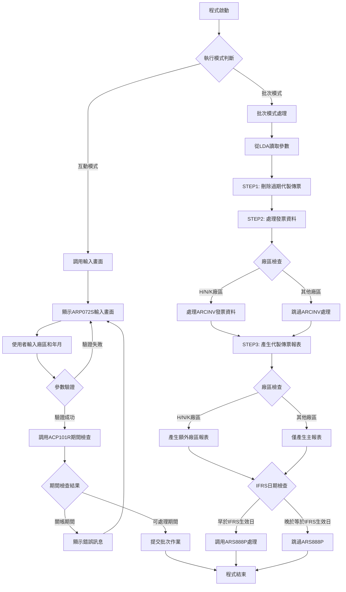
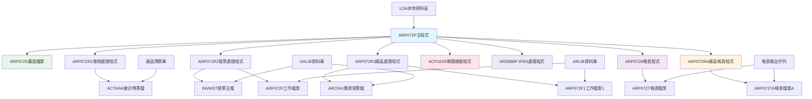
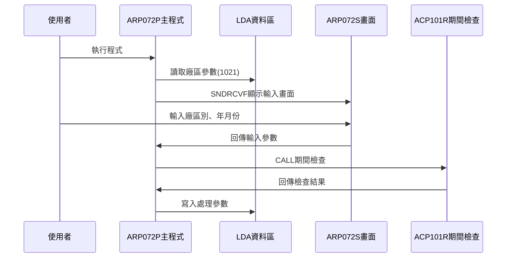
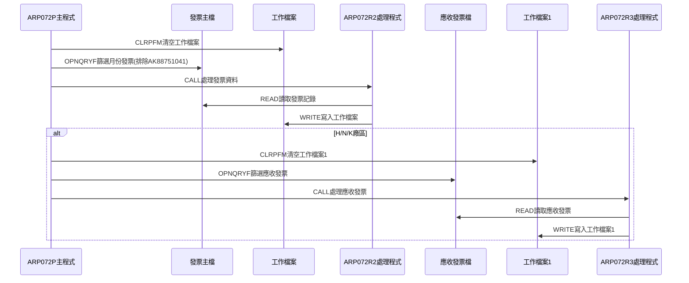
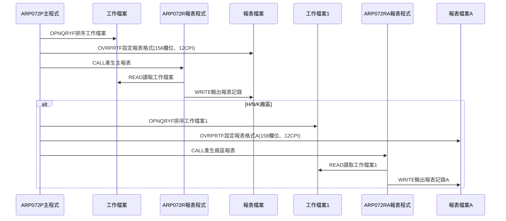
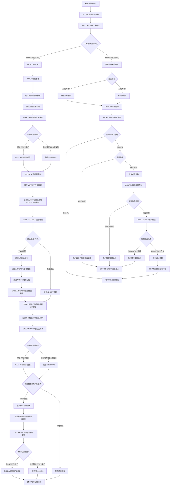

# ARP072P_K02 程式規格書

## 1. 基本資料

| 項目 | 內容 |
|------|------|
| **程式編號** | ARP072P |
| **程式名稱** | 應收帳款代製傳票報表作業 |
| **程式類型** | CLP |
| **廠區** | K02 |
| **系統名稱** | 應收帳款系統 |
| **子系統** | 應收帳款代製傳票報表處理 |
| **檔案位置** | K02CLSRC_THSRC/ARP072P.txt |

## 2. 🎯 程式功能說明

### 主要功能描述
此程式為應收帳款代製傳票報表控制程式，用於產生應收帳款代製傳票的統計報表。程式提供互動式參數輸入及批次處理兩種執行模式，透過期間檢查確保關帳期間的資料完整性，並執行完整的代製傳票報表處理，包括刪除過期代製傳票記錄、處理發票資料、產生代製傳票統計報表等作業。K02版本特別支援N廠區處理，並採用不同的報表格式設定。

### 🎯 業務流程詳細說明

#### 完整業務流程圖


#### 業務流程關鍵階段說明

**第一階段：執行模式識別與參數收集**
- 透過RTVJOBA檢查執行環境類型(批次或互動)
- 互動模式時從LDA讀取系統參數和廠區資訊
- 特殊處理：P廠區自動轉換為M廠區處理
- 收集代製傳票年月和廠區別資訊

**第二階段：期間控制與檔案檢查**
- 調用ACP101R程式檢查指定年月份是否已關帳
- 檢查對應廠區的會計傳票檔案是否存在
- 防止在關帳期間進行資料異動
- 確保會計期間的資料完整性

**第三階段：STEP1 - 刪除過期代製傳票處理**
- 設定會計傳票檔案覆蓋到指定廠區檔案
- 使用OPNQRYF篩選P00001-P00499範圍的代製傳票
- 調用ARP072R1程式刪除過期的代製傳票記錄
- 清理過期資料確保報表準確性

**第四階段：STEP2 - 發票資料處理**
- 清空ARP072F工作檔案準備數據處理
- 使用OPNQRYF篩選指定月份的發票記錄
- 排除特定測試發票號碼(包含K02專用的AK88751041)
- 調用ARP072R2程式處理發票資料轉換

**第五階段：H/N/K廠區特殊處理**
- H廠區、N廠區和K廠區需要處理ARCINV發票資料
- 清空ARP072F1工作檔案進行額外處理
- 使用OPNQRYF篩選ARCINV相關記錄
- 調用ARP072R3程式處理廠區特殊發票資料

**第六階段：STEP3 - 產生代製傳票報表**
- 設定報表輸出檔案和格式參數(156欄位寬度、12CPI)
- 按訂單號、發票號、產品名稱排序
- 調用ARP072R程式產生主要統計報表
- 產生"廠內代製"的統計資料

**第七階段：廠區特殊報表處理**
- H廠區、N廠區和K廠區產生額外的"廠外代製"報表
- 設定不同的報表格式(158欄位寬度、12CPI)
- 調用ARP072RA程式產生廠區特殊報表
- 使用ARP072F1工作檔案數據

**第八階段：IFRS相關處理與完成**
- 檢查處理年月是否早於IFRS生效日期
- 若早於IFRS生效日則調用ARS888P進行額外處理
- 從LDA讀取憑證號碼範圍進行IFRS處理
- 清理檔案覆蓋並結束程式

#### 🎯 K02版本特殊功能
- **擴展廠區支援**：支援H/N/K三個廠區的特殊處理
- **測試資料增強排除**：額外排除AK88751041測試發票號碼
- **報表格式優化**：主報表採用156欄位寬度、12CPI格式
- **版本更新增強**：包含多個版本更新的功能改進

#### 多層次驗證機制
- **廠區權限驗證**：確保只處理授權廠區的資料
- **期間控制驗證**：透過ACP101R程式檢查會計期間狀態
- **檔案存在性檢查**：確認會計傳票檔案可正常存取
- **日期範圍驗證**：確保年月份格式正確

#### 智能處理邏輯
- 自動判斷廠區類型並採用相應的處理流程
- 動態產生檔案名稱和成員名稱
- 智能識別IFRS生效日期並執行對應處理
- 自動排除測試發票號碼避免影響正式報表

#### 資料一致性確保機制
- 透過檔案覆蓋確保存取正確的資料檔案
- 使用工作檔案技術避免影響原始發票檔案
- 分階段處理確保各步驟資料同步
- 記錄詳細的處理軌跡供後續查核

## 3. 🎯 檔案架構與關聯圖

### 使用檔案清單

| 檔案名稱 | 檔案類型 | 使用方式 | 說明 |
|----------|----------|----------|------|
| **ARP072S** | DSPF | CF/COMBINED | 代製傳票報表輸入畫面檔案 |
| **ACTRAN** | 邏輯檔 | O/OUTPUT | 會計傳票檔案(動態對應廠區) |
| **INVMST** | 邏輯檔 | IF/INPUT | 發票主檔 |
| **ARCINV** | 邏輯檔 | IF/INPUT | 應收發票檔案(H/N/K廠區) |
| **ARP072F** | 物理檔 | IP/INPUT | 代製傳票工作檔案 |
| **ARP072F1** | 物理檔 | IF/INPUT | 代製傳票工作檔案1(H/N/K廠區) |
| **ARP072T** | 報表檔 | O/OUTPUT | 代製傳票統計報表檔案 |
| **ARP072TA** | 報表檔 | O/OUTPUT | 代製傳票統計報表檔案A(H/N/K廠區) |

### 🎯 檔案關聯詳細視覺化圖表



### 🎯 K02版本特殊資料流向說明

#### 環境準備階段的資料流向


#### K02特殊發票處理階段的資料流向


#### K02優化報表產生階段的資料流向


## 4. 🎯 檔案欄位規格說明

### 主要資料結構

#### ARP072S 螢幕檔案欄位規格

| 欄位名稱 | 型態 | 長度 | 位置 | 屬性 | 說明 |
|----------|------|------|------|------|------|
| S#COMP | CHAR | 35 | 1,23 | O | 公司名稱 |
| S#DEVI | CHAR | 10 | 2,70 | O | 工作站設備代號 |
| S#YYMM | NUMERIC | 6,0 | 11,37 | B | 處理年月份(YYYYMM) |
| S#AREA | CHAR | 1 | 13,37 | B | 處理廠區代號 |
| S#ERR | CHAR | 70 | 24,2 | O | 錯誤訊息顯示 |

#### LDA本地資料區結構

| 位置範圍 | 長度 | 欄位名稱 | 用途說明 | 存取方式 |
|----------|------|----------|----------|----------|
| 1-6 | 6 | 年月份資料 | 處理年月(YYYYMM) | 讀寫 |
| 7 | 1 | 廠區代號 | 處理廠區別(M/K/H/N/L/T) | 讀寫 |
| 201-206 | 6 | IFRS憑證號起 | IFRS處理用憑證號範圍起始 | 讀寫 |
| 211-216 | 6 | IFRS憑證號迄 | IFRS處理用憑證號範圍結束 | 讀寫 |
| 951-985 | 35 | 公司名稱 | 系統公司名稱 | 讀取 |
| 1011-1020 | 10 | 設備代號 | 工作站設備代號 | 讀取 |
| 1021 | 1 | 區域代號 | 執行區域別 | 讀取 |

### 🔍 重點欄位切割技術詳解

#### 年月份欄位多層切割分析

**YYMM欄位的三重切割結構**：

```
&YYMM (6字元)：[YYYY|MM]
                ↓    ↓
               年度  月份
            
位置切割：
&YY = %SST(&YYMM 1 4)   // 取年度(位置1-4)
&MM = %SST(&YYMM 5 2)   // 取月份(位置5-6)

範例：
&YYMM = '202412'
&YY   = '2024'
&MM   = '12'
```

#### LDA年月份區域詳細切割

**LDA位置1-6的年月份結構**：

```
LDA年月份區域 (位置1-6)：
[YYYY|MM]
 ↓    ↓
 1-4  5-6
年度  月份

寫入操作：
CHGDTAARA DTAARA(*LDA (1 6)) VALUE(&YYMM)

讀取操作：
RTVDTAARA DTAARA(*LDA (1 6)) RTNVAR(&YYMM)
RTVDTAARA DTAARA(*LDA (1 4)) RTNVAR(&YY)
RTVDTAARA DTAARA(*LDA (5 2)) RTNVAR(&MM)
```

#### 動態檔案名稱構建邏輯

**會計傳票檔案名稱動態生成**：

```
檔案名稱構建：
&FNAME = 'AC' || &AREA || 'R'

廠區代碼對應表：
&AREA = 'K' → &FNAME = 'ACKR' (K02廠會計傳票檔)
&AREA = 'H' → &FNAME = 'ACHR' (H05廠會計傳票檔)  
&AREA = 'N' → &FNAME = 'ACNR' (N廠會計傳票檔)
&AREA = 'M' → &FNAME = 'ACMR' (P02廠會計傳票檔)
&AREA = 'L' → &FNAME = 'ACLR' (其他廠會計傳票檔)
&AREA = 'T' → &FNAME = 'ACTR' (T廠會計傳票檔)

檔案名稱視覺化：
['A','C'] + [廠區] + ['R']
  ↓       ↓      ↓
固定前綴  變動   固定後綴
```

#### 成員名稱動態構建邏輯

**傳票成員名稱生成規則**：

```
成員名稱構建：
&MNAME = 'VR' || &MM

月份對應表：
&MM = '01' → &MNAME = 'VR01' (1月傳票成員)
&MM = '02' → &MNAME = 'VR02' (2月傳票成員)
...
&MM = '12' → &MNAME = 'VR12' (12月傳票成員)

成員名稱視覺化：
['V','R'] + [月份]
  ↓        ↓
固定前綴   變動月份
```

#### 日期範圍欄位構建技術

**月初月底日期自動生成**：

```
日期範圍構建邏輯：
&C#SDAT = &YYMM || '01'  // 月初：年月+01
&C#EDAT = &YYMM || '31'  // 月底：年月+31

日期構建視覺化：
&YYMM    + '01' = &C#SDAT
[YYYYMM] + [01] = [YYYYMM01]
 ↓               ↓
年月份          月初日期

&YYMM    + '31' = &C#EDAT  
[YYYYMM] + [31] = [YYYYMM31]
 ↓               ↓
年月份          月底日期

實際範例：
&YYMM = '202412'
&C#SDAT = '20241201' (2024年12月1日)
&C#EDAT = '20241231' (2024年12月31日)
```

#### IFRS憑證號碼欄位特殊用途分析

**憑證號碼範圍的雙重功能**：

```
IFRS憑證號碼處理：

步驟1 - 固定範圍設定：
&D#VNO1 = 'P00001'  // 代製傳票起始號
&D#VNO2 = 'P00499'  // 代製傳票結束號

步驟2 - LDA動態讀取：
RTVDTAARA DTAARA(*LDA (201 6)) RTNVAR(&D#VNO1)
RTVDTAARA DTAARA(*LDA (211 6)) RTNVAR(&D#VNO2)

憑證號碼視覺化：
固定設定：['P','0','0','0','0','1'] - ['P','0','0','4','9','9']
動態設定：[從LDA位置201-206讀取] - [從LDA位置211-216讀取]

用途對照表：
場景1：代製傳票刪除 → 使用固定範圍(P00001-P00499)
場景2：IFRS處理     → 使用LDA動態範圍
```

#### 廠區代碼特殊處理邏輯

**P廠區到M廠區的自動轉換**：

```
廠區代碼轉換邏輯：
IF &AREA = 'P' THEN
    &AREA = 'M'
END

轉換視覺化：
輸入：['P'] → 處理：['M']
原因：P廠區實際使用M廠區的會計傳票檔案

廠區檢查邏輯：
IF &S#AREA = 'P' THEN
    錯誤：'應收帳款代製傳票作業，無法在屏東執行'
END
```

### 🎯 K02版本特殊欄位處理分析

#### H/N/K廠區特殊處理邏輯

**三廠區聯合處理機制**：

```
廠區檢查條件：
IF (&AREA = 'H') OR (&AREA = 'N') OR (&AREA = 'K') THEN
    // 執行ARCINV特殊處理
    // 產生額外廠區報表
END

處理流程視覺化：
['H'] or ['N'] or ['K'] → 啟動特殊處理
  ↓
1. ARCINV檔案處理
2. ARP072F1工作檔處理  
3. ARP072RA額外報表
4. 158欄位寬度報表格式
```

#### 測試發票排除機制

**K02版本特殊排除清單**：

```
排除發票號碼清單：
標準排除：
- 'JW32774325'
- 'JW32774497'  
- 'AK88751041' (K02特有)

訂單排除：
- 'M01744' ~ 'M01767'
- 'M01781'

排除條件視覺化：
(INNO ≠ 'JW32774325') AND
(INNO ≠ 'JW32774497') AND  
(INNO ≠ 'AK88751041') AND  // K02專用
(INORNO ≠ 'M01744') AND
...
(INDECD ≠ 'D')
```

### 重要變數定義表

| 變數名稱 | 類型 | 長度 | 說明 | 切割來源 | 使用範圍 |
|----------|------|------|------|----------|----------|
| **&P#YYMM** | CHAR | 6 | 處理年月份(YYYYMM) | 螢幕輸入 | 期間檢查 |
| **&P#CODE** | CHAR | 1 | 期間檢查結果('1'=關帳) | ACP101R回傳 | 流程控制 |
| **&INT** | CHAR | 1 | 執行模式識別(0=批次,其他=互動) | RTVJOBA | 程式流程控制 |
| **&AREA** | CHAR | 1 | 處理廠區代號(M/K/H/N/L/T) | LDA/螢幕 | 廠區控制 |
| **&YYMM** | CHAR | 6 | 年月份變數(YYYYMM) | 螢幕/LDA | 檔案篩選 |
| **&YY** | CHAR | 4 | 年度變數(YYYY) | %SST(&YYMM 1 4) | 日期處理 |
| **&MM** | CHAR | 2 | 月份變數(MM) | %SST(&YYMM 5 2) | 檔案成員命名 |
| **&FNAME** | CHAR | 10 | 動態檔案名稱 | 'AC'+&AREA+'R' | 檔案覆蓋 |
| **&MNAME** | CHAR | 10 | 動態成員名稱 | 'VR'+&MM | 成員處理 |
| **&C#SDAT** | CHAR | 8 | 開始日期(YYYYMMDD) | &YYMM+'01' | 日期範圍控制 |
| **&C#EDAT** | CHAR | 8 | 結束日期(YYYYMMDD) | &YYMM+'31' | 日期範圍控制 |
| **&D#VNO1** | CHAR | 6 | 憑證號碼範圍起始 | 'P00001'/LDA | IFRS處理 |
| **&D#VNO2** | CHAR | 6 | 憑證號碼範圍結束 | 'P00499'/LDA | IFRS處理 |
| **&IFRSD** | CHAR | 6 | IFRS生效年月 | ARIFRSCTL | 版本控制 |

## 5. 🎯 輸出/入螢幕布局

### 螢幕布局完整視覺化

```
+------------------------------------------------------------------------------+
|                      發票及代製傳票報表作業                        ARP072S   |
|                                                                              |
|                                                                              |
|                                                                              |
|                                                                              |
|                      傳票廠區: [X] ( M:台鋼 K:祥鋼 H:東鋼                   |
|                                        L:龍昇 T:天津)                       |
|                                                                              |
|                      傳票年月: [______]                                     |
|                                                                              |
|                                                                              |
|              (此為月結作業，請務必於當月相關資料                            |
|               已建檔完成後才進行處理。)                                      |
|                                                                              |
|                                                                              |
|                                                                              |
|                                                                              |
|                                                                              |
|                                                                              |
|                                                                              |
|F3:離開                        ENTER:執行                                   |
|[錯誤訊息顯示區]                                                              |
+------------------------------------------------------------------------------+
```

### 🎯 畫面欄位詳細說明

| 欄位名稱 | 欄位屬性 | 位置 | 長度 | 輸入格式 | 驗證規則 | 說明 |
|----------|----------|------|------|----------|----------|------|
| **S#AREA** | 輸出 | 7,36 | 1 | 英文字元 | M/K/H/N/L/T | 傳票廠區代號 |
| **S#YYMM** | 輸入/輸出 | 10,36 | 6 | YYYYMM | 年月格式 | 傳票年月份 |
| **S#COMP** | 顯示 | 1,23 | 35 | 中文字元 | 唯讀 | 公司名稱顯示 |
| **S#DEVI** | 顯示 | 2,70 | 10 | 英數字元 | 唯讀 | 設備代號顯示 |
| **S#ERR** | 顯示 | 24,2 | 70 | 中文字元 | 唯讀 | 錯誤訊息顯示區 |

### 🎯 畫面控制邏輯

#### 指示器控制說明
- **IN03**: F3功能鍵，程式結束
- 無其他錯誤指示器，錯誤時直接顯示訊息

#### 欄位顯示屬性
- **S#AREA**: 從LDA讀取並顯示，P廠區自動轉換為M廠區
- **S#YYMM**: 使用EDTCDE(4)格式顯示為YYYY/MM
- **S#ERR**: 固定顯示為HI(高亮度)屬性

### 功能鍵詳細定義

| 功能鍵 | 處理邏輯 | 系統行為 | 說明 |
|--------|----------|----------|------|
| **F3** | 設定IN03='1' | 程式立即返回結束 | 離開程式不執行任何處理 |
| **ENTER** | 執行驗證與處理 | 驗證輸入後提交批次作業 | 執行主要報表產生邏輯 |

### 廠區代號說明
- **M**: 台鋼廠區
- **K**: 祥鋼廠區  
- **H**: 東鋼廠區
- **N**: 新增廠區(K02版本支援)
- **L**: 龍昇廠區
- **T**: 天津廠區

### 操作流程
1. 畫面顯示時自動載入系統參數和廠區資訊
2. 系統自動顯示對應的傳票廠區代號
3. 使用者輸入處理年月份(YYYYMM格式)
4. 按ENTER鍵進行驗證和期間檢查
5. 驗證通過後自動提交批次作業產生報表
6. 驗證失敗則顯示錯誤訊息並停留在輸入畫面

## 6. 🎯 處理流程程序說明

### 🎯 主程序邏輯深度分析

#### K02版本程式執行流程圖


#### 🎯 K02版本特殊處理步驟分析

**步驟1-7：與H05版本相同的基礎處理流程**

**步驟8：K02版本特殊發票篩選處理**
- 除了基本的測試發票排除外，額外排除AK88751041號
- 這是K02版本在0105A更新中新增的特殊處理
- 確保K02廠區專用的測試資料不會影響報表
- 維持與其他廠區一致的資料品質控制

**步驟9：擴展廠區支援處理**
- 將廠區判斷條件從`(&AREA *EQ 'H') *OR (&AREA *EQ 'K')`
- 擴展為`(&AREA *EQ 'H') *OR (&AREA *EQ 'N') *OR (&AREA *EQ 'K')`
- 支援N廠區的ARCINV資料處理
- 這是1202A版本更新中新增的功能增強

**步驟10：K02版本報表格式優化**
- 主報表格式從132欄位10CPI調整為156欄位12CPI
- 提供更寬的報表版面和更密集的字體
- 這是1202A版本更新中的格式優化
- 廠區報表仍維持158欄位12CPI格式

**步驟11-15：與H05版本相同的IFRS和結束處理**

#### 業務邏輯深度解析

**K02版本增強的核心邏輯**：
1. 採用三階段處理確保資料完整性和準確性
2. 增強的測試資料排除機制
3. 擴展的廠區支援範圍
4. 優化的報表格式設定

**K02版本安全控制機制**：
1. 期間控制防止關帳期間處理
2. 廠區權限控制確保資料安全
3. 增強的檔案存在性檢查
4. IFRS規範支援確保合規性

#### 條件判斷詳細說明

**K02版本廠區處理判斷**：
- `COND((&AREA *EQ 'H') *OR (&AREA *EQ 'N') *OR (&AREA *EQ 'K'))` - H/N/K廠區特殊處理
- 支援N廠區的額外處理邏輯
- 需要處理ARCINV應收發票資料
- 需要產生額外的廠區特殊報表

**K02版本測試資料排除判斷**：
- 基本排除：JW32774325、JW32774497
- K02專用排除：AK88751041(0105A版本新增)
- 訂單號碼排除：M01744-M01767、M01781
- 確保所有測試資料都被正確排除

#### 變數使用和數據流向追蹤

**K02版本特殊變數軌跡**：
1. 額外測試發票號碼處理軌跡
2. N廠區支援的參數傳遞軌跡  
3. 優化報表格式的參數設定軌跡
4. 增強IFRS處理的版本控制軌跡

### 🎯 K02版本子程序邏輯分析

#### K02版本子程序與H05版本差異
- **ARP072R程式**：處理156欄位寬度的報表格式
- **ARP072R2程式**：額外排除AK88751041測試發票
- **ARP072R3程式**：支援N廠區的ARCINV處理
- **其他程式**：功能基本相同但適應K02環境

### 🎯 K02版本特殊邏輯處理

#### K02版本發票記錄篩選條件
```sql
QRYSLT('(DATE *GE "' || &C#SDAT || '") *AND 
        (DATE *LE "' || &C#EDAT || '") *AND 
        (INNO *NE "JW32774325") *AND 
        (INNO *NE "JW32774497") *AND 
        (INNO *NE "AK88751041") *AND 
        (INORNO *NE "M01744") *AND 
        ... 
        (INDECD *NE "D")')
```
- 篩選指定月份內的發票記錄
- 排除多個測試發票號碼(包含K02專用)
- 排除多個測試訂單號碼
- 排除已作廢的發票記錄

#### K02版本應收發票篩選條件
```sql
QRYSLT('(R#YM   *EQ "' || &YYMM || '") *AND 
        (R1AREA *EQ "' || &AREA || '") *AND 
        (R1FLAG *NE "D")')
```
- 篩選指定年月和廠區的應收發票
- 排除已作廢的應收發票記錄
- H/N/K廠區特殊處理邏輯(N廠區為K02新增)

#### K02版本報表格式設定
```sql
OVRPRTF FILE(ARP072T) TOFILE(ARP072T) 
        PAGESIZE(*N 156) CPI(12) HOLD(*YES) 
        USRDTA('廠內代製')
```
- 主報表使用156欄位寬度(比H05版本寬24欄位)
- 使用12CPI字體(比H05版本密集)
- 提供更好的報表版面利用率

#### K02版本更新歷程
- 0011A版本：新增IFRS支援
- 0105A版本：新增AK88751041測試發票排除
- 0112A版本：強化IFRS日期控制
- 1202A版本：新增N廠區支援和報表格式優化
- 1202B版本：新增系統代號功能

## 7. 🎯 數據操作與轉換分析

### K02版本檔案操作詳解

#### K02版本INVMST發票主檔操作
- **OPNQRYF操作**：篩選指定月份的發票記錄
- **增強排除邏輯**：自動排除測試發票包含K02專用AK88751041
- **日期映射**：使用MAPFLD將ININDT映射為DATE
- **資料轉換**：透過ARP072R2轉換到工作檔案

#### K02版本ARCINV應收發票檔操作
- **擴展廠區支援**：支援H/N/K三個廠區處理
- **OPNQRYF操作**：篩選對應廠區的應收發票記錄
- **排序處理**：使用KEYFLD((*FILE))進行檔案排序
- **資料轉換**：透過ARP072R3轉換到工作檔案1

### K02版本數據轉換邏輯

#### K02版本報表格式設定邏輯
- **主報表格式**：156欄位寬度、12CPI、保持輸出
- **廠區報表格式**：158欄位寬度、12CPI、保持輸出
- **使用者資料設定**：'廠內代製'和'廠外代製'標識
- **輸出佇列設定**：使用使用者專屬輸出佇列

#### K02版本測試資料過濾轉換
- **基本測試發票過濾**：JW32774325、JW32774497
- **K02專用測試發票過濾**：AK88751041
- **測試訂單過濾**：M01744-M01767、M01781
- **過濾目的**：確保報表資料的純淨性

### K02版本檢核機制詳解

#### K02版本擴展廠區檢核
- **廠區範圍擴展**：從H/K擴展到H/N/K三個廠區
- **廠區一致性檢查**：確保資料與指定廠區一致
- **新廠區支援**：N廠區的完整處理邏輯
- **向後相容性**：維持原有H/K廠區的處理邏輯

#### K02版本增強資料品質檢核
- **增強測試資料排除**：K02專用測試資料識別
- **作廢記錄排除**：INDECD='D'和R1FLAG='D'的記錄
- **日期範圍驗證**：確保處理日期在指定月份範圍內
- **版本相容性檢查**：支援多版本的功能差異

## 8. 🎯 錯誤處理程序說明

### 🎯 K02版本詳細錯誤代碼清冊

| 錯誤代碼 | 錯誤訊息 | 原因說明 | 處理方式 | 預防措施 |
|----------|---------|---------|---------|----------|
| **P廠區錯誤** | 代製傳票報表作業，無法在此廠區執行 | 使用者在P廠區執行此程式 | 1. 顯示錯誤訊息<br>2. GOTO DISPLAY重新輸入<br>3. 要求使用其他廠區 | 在畫面說明中標示廠區限制 |
| **檔案不存在** | 代製傳票報表作業，無法找到指定的傳票檔：[檔案名] | CHKOBJ檢查發現傳票檔案不存在 | 1. 顯示具體檔案名稱<br>2. GOTO DISPLAY重新輸入<br>3. 確認廠區和年月正確 | 執行前確認所有廠區檔案存在 |
| **關帳期間** | 該月份已月結 | ACP101R檢查發現指定期間已關帳 | 1. 顯示關帳錯誤訊息<br>2. GOTO DISPLAY重新輸入<br>3. 選擇其他可處理期間 | 提供期間狀態查詢功能 |
| **CPF0000** | 檔案操作錯誤 | CHKOBJ或檔案存取發生系統錯誤 | 1. MONMSG捕捉錯誤<br>2. 顯示檔案錯誤訊息<br>3. 跳轉重新輸入 | 定期檢查檔案權限和完整性 |
| **N廠區處理錯誤** | N廠區ARCINV處理失敗 | K02版本新增N廠區處理異常 | 1. 檢查N廠區檔案存在性<br>2. 確認N廠區權限設定<br>3. 驗證ARCINV資料完整性 | 確保N廠區環境正確設定 |
| **測試資料過濾錯誤** | AK88751041測試發票處理異常 | K02專用測試發票處理失敗 | 1. 檢查測試發票排除條件<br>2. 確認OPNQRYF查詢正確性<br>3. 驗證資料過濾邏輯 | 定期檢查測試資料清單 |
| **報表格式錯誤** | 156欄位報表格式異常 | K02版本報表格式設定錯誤 | 1. 檢查OVRPRTF參數設定<br>2. 確認報表檔案可寫入<br>3. 驗證CPI和欄位寬度 | 確保報表格式參數正確 |

### 🎯 K02版本系統異常處理邏輯

#### K02版本檔案操作失敗處理
- **會計傳票檔案異常**：檢查K02廠區ACTRAN檔案的可用性
- **發票主檔異常**：確認INVMST檔案的存取權限和完整性
- **N廠區檔案異常**：處理新增N廠區相關檔案的操作失敗

#### K02版本程式調用失敗處理
- **ARP072R系列調用失敗**：檢查K02版本RPG程式的相容性
- **N廠區程式調用失敗**：處理N廠區特殊程式的調用異常
- **版本相容性失敗**：處理多版本程式的調用衝突

#### K02版本資料完整性錯誤處理
- **查詢結果異常**：處理擴展廠區查詢的結果異常
- **測試資料過濾失敗**：處理K02專用測試資料的過濾異常
- **報表產生失敗**：處理156欄位報表格式的輸出異常

#### K02版本版本控制失敗處理
- **版本更新衝突**：處理多版本更新的功能衝突
- **向後相容性問題**：處理新舊版本的相容性問題
- **功能差異處理**：處理不同版本間的功能差異

## 9. 🎯 備註

### 🎯 K02版本特殊注意事項

#### K02版本廠區處理增強
- P廠區不允許直接執行此程式，會顯示錯誤訊息
- P廠區在互動模式時自動轉換為M廠區進行處理
- **K02版本特色**：H廠區、N廠區和K廠區有額外的ARCINV資料處理
- 不同廠區使用不同的會計傳票檔案(ACKR、ACHR、ACNR等)

#### K02版本三階段處理邏輯增強
- STEP1：刪除過期代製傳票(P00001-P00499範圍)
- STEP2：處理發票資料並轉換到工作檔案(增強測試資料排除)
- STEP3：產生代製傳票統計報表(156欄位寬度優化)
- 每個階段都有對應的處理程式和特定的資料來源

#### K02版本測試資料排除機制增強
- 自動排除基本測試發票號碼：JW32774325、JW32774497
- **K02版本新增**：自動排除AK88751041測試發票號碼
- 自動排除測試訂單號碼：M01744-M01767、M01781
- 確保報表資料的正確性，避免測試資料影響正式統計

#### K02版本IFRS會計準則支援
- 0011A版本新增IFRS相關處理邏輯
- 0112A版本強化IFRS生效年月控制機制
- 在三個關鍵處理點進行IFRS檢查和處理
- 透過ARIFRSCTL資料區控制IFRS生效年月

#### K02版本報表格式優化
- **K02版本特色**：主報表(ARP072T)使用156欄位寬度、12CPI
- 廠區報表(ARP072TA)：158欄位寬度、12CPI、"廠外代製"標識
- H/N/K廠區需要產生兩種報表滿足不同的統計需求
- 報表使用使用者專屬輸出佇列確保安全性

#### K02版本工作檔案管理機制
- ARP072F：主要工作檔案存放一般發票轉換資料
- ARP072F1：H/N/K廠區專用工作檔案存放應收發票資料
- 每次處理前都會清空工作檔案確保資料乾淨
- 工作檔案按特定欄位排序確保報表邏輯順序

#### K02版本更新歷程與相容性
- 0011A版本：新增IFRS支援和憑證範圍控制
- **0105A版本**：新增AK88751041測試發票排除(K02專用)
- 0112A版本：強化IFRS生效年月控制邏輯
- **1202A版本**：新增N廠區支援和156欄位報表格式優化
- **1202B版本**：新增系統代號功能
- 各版本保持向後相容性確保系統穩定運行

#### K02版本廠區支援擴展
- **原有支援**：H廠區和K廠區的ARCINV處理
- **K02版本擴展**：新增N廠區的完整ARCINV處理支援
- **條件擴展**：從`(&AREA *EQ 'H') *OR (&AREA *EQ 'K')`擴展為`(&AREA *EQ 'H') *OR (&AREA *EQ 'N') *OR (&AREA *EQ 'K')`
- **功能一致性**：N廠區享有與H/K廠區相同的處理功能 