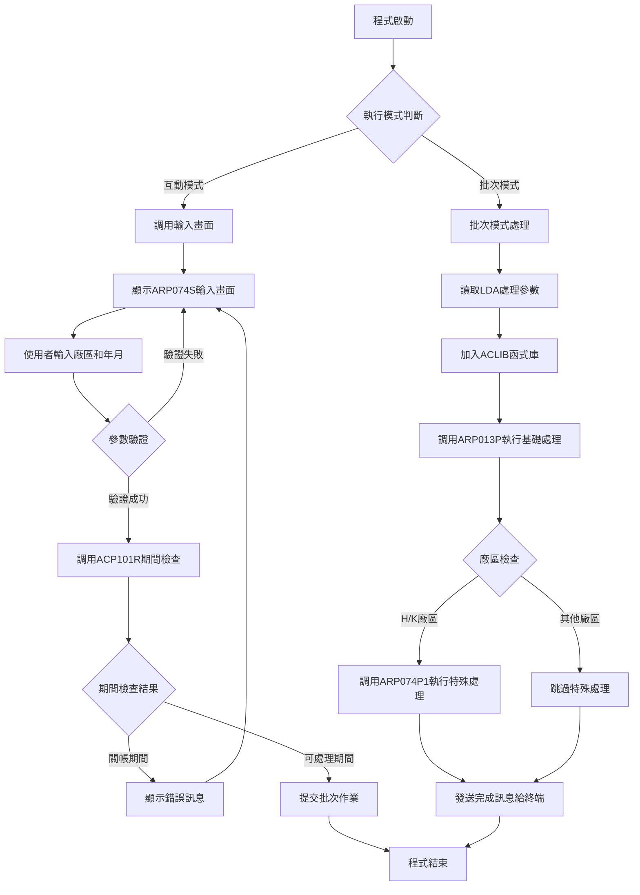
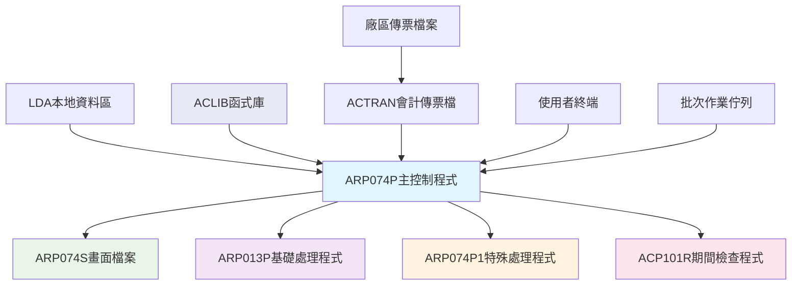
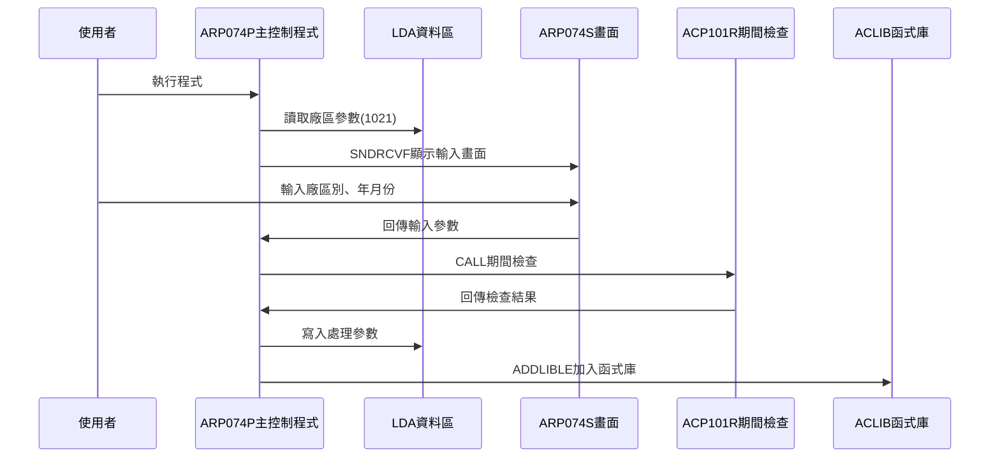
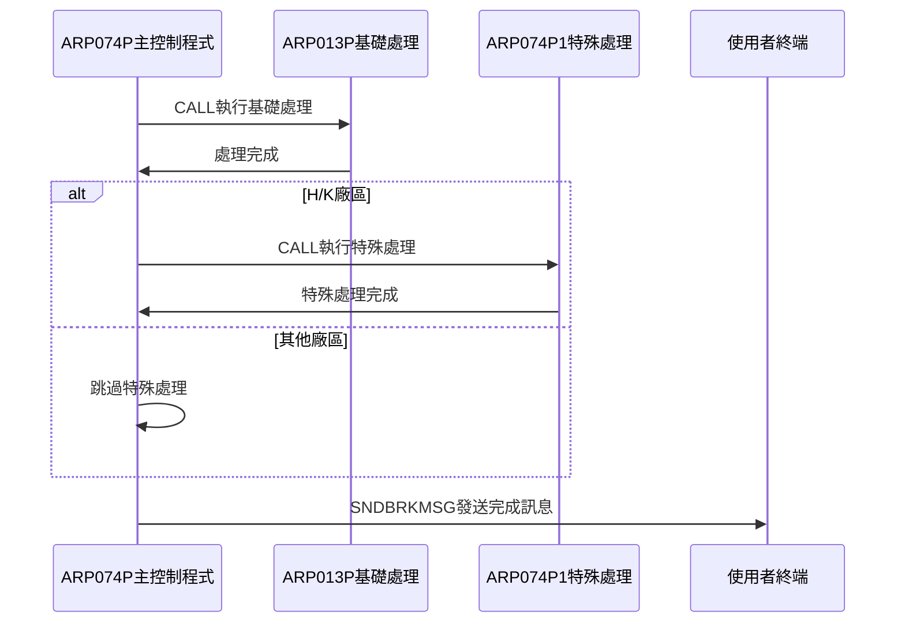
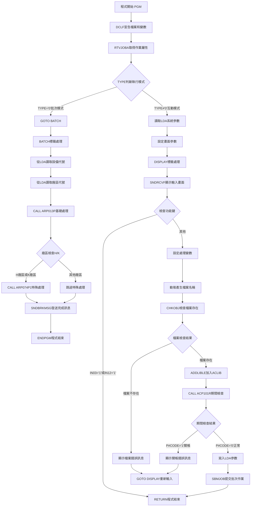

# ARP074P_P02 程式規格書

## 1. 基本資料

| 項目 | 內容 |
|------|------|
| **程式編號** | ARP074P |
| **程式名稱** | 應收帳款回收傳票報表作業 |
| **程式類型** | CLP |
| **廠區** | P02 |
| **系統名稱** | 應收帳款系統 |
| **子系統** | 應收帳款回收傳票處理 |
| **檔案位置** | P02CLSRC_THSRC/ARP074P.txt |

## 2. 🎯 程式功能說明

### 主要功能描述
此程式為應收帳款回收傳票報表作業的主控制程式，負責協調和執行應收帳款回收傳票的相關處理作業。程式提供互動式參數輸入及批次處理兩種執行模式，透過期間檢查確保會計期間的正確性，並根據不同廠區條件執行相應的處理流程。P02版本作為統一的控制調度中心，具有完整的廠區覆蓋能力和智能化的處理分派機制。

### 🎯 業務流程詳細說明

#### 完整業務流程圖


#### 業務流程關鍵階段說明

**第一階段：執行模式識別與參數收集**
- 透過RTVJOBA檢查執行環境類型(批次或互動)
- 互動模式時從LDA讀取系統參數和廠區資訊
- 收集回收傳票年月和廠區別資訊
- 設定輸出佇列和使用者資訊

**第二階段：期間控制與檔案檢查**
- 調用ACP101R程式檢查指定年月份是否已關帳
- 檢查對應廠區的會計傳票檔案是否存在
- 防止在關帳期間進行資料異動
- 確保會計期間的資料完整性

**第三階段：函式庫環境準備**
- 使用ADDLIBLE添加ACLIB函式庫
- 確保程式執行所需的函式庫可用
- 建立適當的執行環境
- 準備後續處理所需資源

**第四階段：基礎回收傳票處理**
- 調用ARP013P程式執行基礎的回收傳票處理
- 處理所有廠區通用的回收傳票邏輯
- 執行基本的資料收集和轉換
- 建立回收傳票的基礎資料結構

**第五階段：廠區特殊處理分派**
- 檢查處理廠區是否為H廠區或K廠區
- H/K廠區調用ARP074P1執行特殊處理邏輯
- 其他廠區跳過特殊處理
- 實現不同廠區的差異化處理需求

**第六階段：處理完成通知**
- 發送處理完成訊息到使用者終端
- 提供作業完成的即時回饋
- 確保使用者了解處理狀態
- 完成整個回收傳票處理流程

#### 🎯 P02版本控制調度中心特色
- **全廠區支援**：支援P/M/T/H/K/U等所有廠區處理
- **智能分派機制**：根據廠區特性自動選擇處理流程
- **統一控制介面**：提供一致的操作介面和參數驗證
- **完整函式庫管理**：動態管理所需的執行環境

#### 多層次驗證機制
- **廠區權限驗證**：確保只處理授權廠區的資料
- **期間控制驗證**：透過ACP101R程式檢查會計期間狀態
- **檔案存在性檢查**：確認會計傳票檔案可正常存取
- **日期範圍驗證**：確保年月份格式正確

#### 智能處理邏輯
- 自動判斷廠區類型並採用相應的處理流程
- 動態產生檔案名稱適應不同廠區
- 智能識別H/K廠區並執行特殊處理
- 自動管理函式庫環境確保執行穩定

#### 資料一致性確保機制
- 透過LDA參數傳遞確保子程式資料一致
- 使用標準化的期間檢查機制
- 分階段處理確保各步驟資料同步
- 提供完成狀態通知確保處理追蹤

#### P02版本統一控制介面設計理念
- **標準化操作**：提供統一的畫面操作介面
- **智能分派**：根據廠區自動選擇處理流程
- **資源管理**：統一管理函式庫和執行環境
- **狀態追蹤**：提供完整的處理狀態回饋

## 3. 🎯 檔案架構與關聯圖

### 使用檔案清單

| 檔案名稱 | 檔案類型 | 使用方式 | 說明 |
|----------|----------|----------|------|
| **ARP074S** | DSPF | CF/COMBINED | 回收傳票報表輸入畫面檔案 |
| **ACTRAN** | 邏輯檔 | 檢查 | 會計傳票檔案(動態對應廠區) |
| **ACLIB** | 函式庫 | 環境設定 | 會計系統函式庫 |

### 🎯 檔案關聯詳細視覺化圖表



### 🎯 P02版本特殊資料流向說明

#### 環境準備階段的資料流向


#### P02控制分派階段的資料流向


## 4. 🎯 檔案欄位規格說明

### 主要資料結構

#### LDA本地資料區結構(P02版本)
| 位置 | 長度 | 欄位名稱 | 用途說明 |
|------|------|----------|----------|
| 1-6 | 6 | 年月份 | 回收傳票處理年月(YYYYMM) |
| 7 | 1 | 廠區代號 | 處理廠區別(P/M/T/H/K/U) |
| 951-985 | 35 | 公司名稱 | 系統公司名稱 |
| 1011-1020 | 10 | 設備代號 | 工作站設備代號 |
| 1021 | 1 | 區域代號 | 執行區域別 |

### 🔍 重點欄位切割技術詳解

#### DS結構完整分析
程式中使用RTVDTAARA指令讀取LDA的不同位置，形成欄位切割效果：

**LDA切割視覺化展示**：
```
LDA資料區 (1024字元)：[1-6|7|951-985|1011-1020|1021]
                       ↓   ↓   ↓       ↓        ↓
年月份(6字元)：        [YYYYMM]                     回收傳票年月
廠區代號(1字元)：        [X]                        廠區識別
公司名稱(35字元)：          [35字元公司名稱]         系統識別
設備代號(10字元)：                 [10字元設備]     終端識別
區域代號(1字元)：                            [X]   區域識別
```

#### 切割邏輯詳細說明

**回收傳票參數切割邏輯**：
```
互動模式寫入：
CHGDTAARA DTAARA(*LDA (1 6)) VALUE(&YYMM)
CHGDTAARA DTAARA(*LDA (7 1)) VALUE(&S#AREA)

批次模式讀取：
RTVDTAARA DTAARA(*LDA (7 1)) RTNVAR(&AREA)
RTVDTAARA DTAARA(*LDA (1011 10)) RTNVAR(&S#DEVI)
```

#### 實際數據範例說明

**範例1：回收傳票參數處理**
```
輸入：&S#YYMM = '202412', &S#AREA = 'P'
LDA寫入：
- CHGDTAARA DTAARA(*LDA (1 6)) VALUE('202412')
- CHGDTAARA DTAARA(*LDA (7 1)) VALUE('P')
讀取結果：
- &YYMM = '202412'
- &AREA = 'P'
```

**範例2：動態檔案名稱產生**
```
&AREA = 'P'
&FNAME = 'AC' || &AREA || 'R' = 'ACPR'

&AREA = 'H'
&FNAME = 'AC' || &AREA || 'R' = 'ACHR'
```

**範例3：廠區分派邏輯**
```
廠區分派條件：
IF COND((&AREA *EQ "H") *OR (&AREA *EQ "K")) THEN(DO)
    CALL ARP074P1
ENDDO

H廠區：條件成立，執行ARP074P1
K廠區：條件成立，執行ARP074P1
P/M/T/U廠區：條件不成立，跳過ARP074P1
```

### 🎯 欄位挪用詳細分析

#### 挪用情況對比表
| 欄位位置 | 原始定義 | 實際使用方式 | 挪用說明 |
|----------|----------|-------------|----------|
| LDA 1-6 | 標準處理參數位置1-6 | 回收傳票年月參數 | 標準LDA參數空間使用 |
| LDA 7 | 標準處理參數位置7 | 回收傳票廠區參數 | 標準LDA參數空間使用 |
| LDA 951-985 | 系統公司名稱區域 | 系統公司名稱顯示 | 系統標準配置 |
| LDA 1011-1020 | 設備代號區域 | 工作站設備代號 | 終端訊息發送識別 |
| LDA 1021 | 執行區域代號 | 廠區初始設定 | 系統環境參數 |

#### 挪用原因深度分析

**位置1-7的標準參數使用**：
- **原因**：P02版本使用標準的LDA參數空間
- **需求**：遵循AS/400系統標準的參數傳遞規範
- **實現**：使用LDA的1-7位置作為標準程式參數區域

**位置1021的環境參數讀取**：
- **原因**：系統環境初始化需要廠區識別
- **需求**：自動讀取執行環境的廠區設定
- **實現**：程式啟動時自動從LDA位置1021讀取區域代號

#### 挪用方式詳細說明

**回收參數標準實現**：
```
寫入回收參數：
CHGDTAARA DTAARA(*LDA (1 6)) VALUE(&YYMM)
CHGDTAARA DTAARA(*LDA (7 1)) VALUE(&S#AREA)

讀取回收參數：
RTVDTAARA DTAARA(*LDA (7 1)) RTNVAR(&AREA)
```

**系統環境參數讀取**：
```
讀取系統環境：
RTVDTAARA DTAARA(*LDA (1021 1)) RTNVAR(&AREA)
RTVDTAARA DTAARA(*LDA (951 35)) RTNVAR(&S#COMP)
RTVDTAARA DTAARA(*LDA (1011 10)) RTNVAR(&S#DEVI)
```

**終端訊息發送**：
```
發送完成訊息：
SNDBRKMSG TOMSGQ(&S#DEVI)
功能：使用變數方式發送訊息到指定終端
```

### 重要變數定義表

| 變數名稱 | 類型 | 長度 | 說明 | 使用範圍 |
|----------|------|------|------|----------|
| **&P#YYMM** | CHAR | 6 | 期間檢查用年月份 | ACP101R期間檢查參數 |
| **&P#CODE** | CHAR | 1 | 期間檢查結果代碼 | '1'=關帳期間, '0'=可處理 |
| **&INT** | CHAR | 1 | 執行模式識別碼 | '0'=批次模式, 其他=互動模式 |
| **&OUTQ** | CHAR | 10 | 輸出佇列名稱 | 批次作業輸出佇列控制 |
| **&USER** | CHAR | 10 | 使用者識別碼 | 系統使用者資訊 |
| **&AREA** | CHAR | 1 | 廠區代號 | P/M/T/H/K/U廠區識別 |
| **&YYMM** | CHAR | 6 | 處理年月份 | 回收傳票處理年月(YYYYMM) |
| **&FNAME** | CHAR | 10 | 動態檔案名稱 | 會計傳票檔案名稱 |
| **&C#SDAT** | CHAR | 6 | 開始日期 | 日期範圍控制起始(YYYYMM) |
| **&C#EDAT** | CHAR | 6 | 結束日期 | 日期範圍控制結束(YYYYMM) |

## 5. 🎯 輸出/入螢幕布局

### 螢幕布局完整視覺化

```
+------------------------------------------------------------------------------+
|                        應收回收傳票報表作業                        ARP074S   |
|                                                                              |
|                                                                              |
|                                                                              |
|                                                                              |
|                      傳票廠區: [X] ( P:台北M:台鋼T:天津H:東鋼                |
|                                       K:祥鋼)                               |
|                                       U:新鋼)                               |
|                                                                              |
|                      傳票年月: [______]                                     |
|                                                                              |
|              (此為月結作業，請務必於當月相關資料                            |
|               已建檔完成後才進行處理。)                                      |
|                                                                              |
|                                                                              |
|                                                                              |
|                                                                              |
|                                                                              |
|                                                                              |
|                                                                              |
|F3/F12:離開                    ENTER:執行                                   |
|[錯誤訊息顯示區]                                                              |
+------------------------------------------------------------------------------+
```

### 🎯 畫面欄位詳細說明

| 欄位名稱 | 欄位屬性 | 位置 | 長度 | 輸入格式 | 驗證規則 | 說明 |
|----------|----------|------|------|----------|----------|------|
| **S#AREA** | 輸入/輸出 | 8,36 | 1 | 英文字元 | P/M/T/H/K/U | 傳票廠區代號 |
| **S#YYMM** | 輸入/輸出 | 11,36 | 6 | YYYYMM | 年月格式 | 傳票年月份 |
| **S#COMP** | 顯示 | 1,23 | 35 | 中文字元 | 唯讀 | 公司名稱顯示 |
| **S#DEVI** | 顯示 | 2,70 | 10 | 英數字元 | 唯讀 | 設備代號顯示 |
| **S#ERR** | 顯示 | 24,2 | 70 | 中文字元 | 唯讀 | 錯誤訊息顯示區 |

### 🎯 畫面控制邏輯

#### 指示器控制說明
- **IN03**: F3功能鍵，程式結束
- **IN12**: F12功能鍵，程式結束
- 無其他錯誤指示器，錯誤時直接顯示訊息

#### 欄位顯示屬性
- **S#AREA**: 可輸入廠區代號，支援P/M/T/H/K/U全廠區
- **S#YYMM**: 使用EDTCDE(4)格式顯示為YYYY/MM
- **S#ERR**: 固定顯示為HI(高亮度)屬性

### 功能鍵詳細定義

| 功能鍵 | 處理邏輯 | 系統行為 | 說明 |
|--------|----------|----------|------|
| **F3** | 設定IN03='1' | 程式立即返回結束 | 離開程式不執行任何處理 |
| **F12** | 設定IN12='1' | 程式立即返回結束 | 取消操作並離開程式 |
| **ENTER** | 執行驗證與處理 | 驗證輸入後提交批次作業 | 執行主要回收傳票處理邏輯 |

### 廠區代號說明(P02版本完整支援)
- **P**: 台北廠區
- **M**: 台鋼廠區
- **T**: 天津廠區
- **H**: 東鋼廠區
- **K**: 祥鋼廠區
- **U**: 新鋼廠區(9912A版本新增)

### 操作流程
1. 畫面顯示時自動載入系統參數和廠區資訊
2. 使用者選擇處理廠區代號(支援全廠區)
3. 使用者輸入處理年月份(YYYYMM格式)
4. 按ENTER鍵進行驗證和期間檢查
5. 驗證通過後自動提交批次作業執行處理
6. 驗證失敗則顯示錯誤訊息並停留在輸入畫面

## 6. 🎯 處理流程程序說明

### 🎯 主程序邏輯深度分析

#### P02版本程式執行流程圖


#### 🎯 P02版本控制調度中心特殊處理步驟分析

**步驟1-6：與一般控制程式相同的基礎處理流程**

**步驟7：P02版本全廠區支援畫面處理**
- 支援P/M/T/H/K/U等所有廠區的輸入和驗證
- 9912A版本新增U:新鋼廠區支援
- 提供一致的操作介面和參數驗證
- 確保各廠區都能正常執行回收傳票處理

**步驟8：函式庫環境管理**
- 使用ADDLIBLE動態加入ACLIB函式庫
- 使用MONMSG確保函式庫操作的穩定性
- 建立適當的執行環境支援後續處理
- 確保所有子程式都能正常執行

**步驟9：智能分派控制邏輯**
- 先調用ARP013P執行所有廠區通用的基礎處理
- 檢查廠區類型是否為H廠區或K廠區
- H/K廠區需要額外調用ARP074P1進行特殊處理
- 其他廠區(P/M/T/U)跳過特殊處理邏輯

**步驟10：處理狀態通知機制**
- 使用SNDBRKMSG發送處理完成訊息到使用者終端
- 提供即時的作業完成回饋
- 確保使用者了解處理執行狀態
- 增強使用者操作體驗

#### 業務邏輯深度解析

**P02版本控制調度中心的核心邏輯**：
1. 提供統一的控制介面支援所有廠區
2. 根據廠區特性智能分派處理流程
3. 統一管理執行環境和函式庫
4. 提供完整的狀態追蹤和回饋機制

**P02版本安全控制機制**：
1. 期間控制防止關帳期間處理
2. 檔案存在性檢查避免系統錯誤
3. 函式庫管理確保執行環境穩定
4. 雙重功能鍵支援(F3/F12)提升操作便利性

#### 條件判斷詳細說明

**P02版本廠區分派判斷**：
- `COND((&AREA *EQ "H") *OR (&AREA *EQ "K"))` - H/K廠區特殊處理
- H/K廠區需要額外的特殊處理邏輯
- 其他廠區(P/M/T/U)僅執行基礎處理
- 實現差異化的處理需求

#### 變數使用和數據流向追蹤

**P02版本特殊變數軌跡**：
1. 廠區代號從畫面輸入到LDA傳遞的完整軌跡
2. 動態檔案名稱產生和檢查的處理軌跡
3. 函式庫管理和環境準備的變數追蹤
4. 子程式調用的參數傳遞軌跡

### 🎯 P02版本子程序邏輯分析

#### P02版本子程序調用順序
1. **ACP101R程式**：期間檢查，確保會計期間正確性
2. **ARP013P程式**：基礎處理，執行所有廠區通用邏輯
3. **ARP074P1程式**：特殊處理，僅H/K廠區執行
4. **SNDBRKMSG指令**：狀態通知，向使用者終端發送完成訊息

#### P02版本作為控制調度中心的設計
- 統一收集和驗證各廠區的處理參數
- 智能分派不同廠區的處理需求
- 協調子程式的執行順序和參數傳遞
- 提供統一的狀態回饋和錯誤處理機制

### 🎯 P02版本控制調度中心處理邏輯

#### P02版本檔案檢查邏輯
```sql
CHKOBJ OBJ(檔案名稱) OBJTYPE(*FILE)
MONMSG CPF0000 EXEC(DO)
```
- 檢查對應廠區的會計傳票檔案是否存在
- 動態產生檔案名稱適應不同廠區
- 提供詳細的錯誤訊息包含具體檔案名稱
- 確保後續處理的檔案基礎

#### P02版本函式庫管理邏輯
```sql
ADDLIBLE ACLIB
MONMSG CPF0000
```
- 動態加入必要的會計系統函式庫
- 使用MONMSG確保函式庫操作的穩定性
- 建立適當的執行環境支援子程式
- 避免因函式庫問題導致的執行失敗

#### P02版本智能分派邏輯
```sql
CALL ARP013P                    /* 基礎處理 */
IF COND((&AREA *EQ "H") *OR (&AREA *EQ "K")) THEN(DO)
    CALL ARP074P1               /* 特殊處理 */
ENDDO
```
- 所有廠區都執行ARP013P基礎處理
- 僅H/K廠區執行ARP074P1特殊處理
- 其他廠區(P/M/T/U)跳過特殊處理
- 實現差異化的廠區需求

#### P02版本狀態通知邏輯
```sql
SNDBRKMSG MSG('<<應收回收傳票報表處理已完成，請列印....>>')
          TOMSGQ(&S#DEVI) MSGTYPE(*INFO)
```
- 向使用者終端發送處理完成訊息
- 使用*INFO類型確保訊息正常顯示
- 提供具體的後續操作指引(請列印)
- 增強使用者操作體驗

## 7. 🎯 數據操作與轉換分析

### P02版本檔案操作詳解

#### P02版本會計傳票檔案檢查
- **動態檔案名稱生成**：根據廠區代號動態產生檔案名稱
- **檔案存在性檢查**：使用CHKOBJ確認檔案可用性
- **錯誤處理機制**：提供詳細的檔案錯誤訊息
- **廠區適配性**：支援所有廠區的檔案命名規則

#### P02版本LDA參數管理
- **參數讀取**：從LDA讀取系統參數和廠區資訊
- **參數驗證**：確保參數格式和內容正確性
- **參數傳遞**：透過LDA向子程式傳遞處理參數
- **參數追蹤**：維護參數的完整性和一致性

### P02版本數據轉換邏輯

#### P02版本廠區代號轉換
- **輸入驗證**：確保廠區代號在有效範圍內(P/M/T/H/K/U)
- **檔案名稱轉換**：將廠區代號轉換為對應的檔案名稱
- **處理邏輯分派**：根據廠區代號決定處理流程
- **9912A版本增強**：新增U廠區支援和畫面顯示

#### P02版本年月份處理
- **格式驗證**：確保年月份為YYYYMM格式
- **期間檢查**：透過ACP101R驗證期間狀態
- **參數傳遞**：向子程式傳遞正確的年月份參數
- **錯誤處理**：提供關帳期間的明確錯誤訊息

### P02版本檢核機制詳解

#### P02版本廠區檢核
- **廠區範圍檢查**：支援P/M/T/H/K/U全廠區
- **檔案對應檢查**：確保廠區與檔案的對應關係
- **處理邏輯檢查**：驗證廠區與處理流程的匹配
- **版本相容性檢查**：確保9912A版本的向後相容性

#### P02版本環境檢核
- **函式庫可用性**：檢查ACLIB函式庫的可用性
- **執行權限檢查**：確認程式執行所需權限
- **系統資源檢查**：驗證系統資源的可用性
- **子程式相容性**：確保子程式的正常調用

## 8. 🎯 錯誤處理程序說明

### 🎯 P02版本詳細錯誤代碼清冊

| 錯誤代碼 | 錯誤訊息 | 原因說明 | 處理方式 | 預防措施 |
|----------|---------|---------|---------|----------|
| **檔案不存在** | 代製傳票報表作業，無法找到指定的傳票檔：[檔案名] | CHKOBJ檢查發現傳票檔案不存在 | 1. 顯示具體檔案名稱<br>2. GOTO DISPLAY重新輸入<br>3. 確認廠區和年月正確 | 執行前確認所有廠區檔案存在 |
| **關帳期間** | 該月份已月結 | ACP101R檢查發現指定期間已關帳 | 1. 顯示關帳錯誤訊息<br>2. GOTO DISPLAY重新輸入<br>3. 選擇其他可處理期間 | 提供期間狀態查詢功能 |
| **CPF0000** | 系統操作錯誤 | CHKOBJ、ADDLIBLE或其他系統操作失敗 | 1. MONMSG捕捉錯誤<br>2. 繼續執行或顯示錯誤<br>3. 確保系統穩定性 | 定期檢查系統資源和權限 |
| **函式庫錯誤** | ACLIB函式庫無法加入 | ADDLIBLE操作失敗 | 1. MONMSG捕捉錯誤<br>2. 繼續執行程式<br>3. 確認函式庫可用性 | 確保ACLIB函式庫正確設定 |
| **子程式調用失敗** | ARP013P或ARP074P1調用異常 | 子程式執行環境或參數問題 | 1. 檢查子程式存在性<br>2. 確認LDA參數正確<br>3. 驗證函式庫環境 | 確保子程式和環境正確設定 |
| **廠區參數錯誤** | 無效的廠區代號 | 輸入廠區代號不在有效範圍內 | 1. 畫面顯示有效廠區範圍<br>2. 要求重新輸入<br>3. 提供廠區選擇指引 | 在畫面上明確標示有效廠區 |
| **年月格式錯誤** | 年月份格式不正確 | YYYYMM格式驗證失敗 | 1. 顯示正確格式要求<br>2. 要求重新輸入<br>3. 提供格式範例 | 使用EDTCDE格式控制 |
| **終端訊息失敗** | 無法發送完成訊息 | SNDBRKMSG操作失敗 | 1. 程式繼續執行<br>2. 記錄訊息發送失敗<br>3. 確保處理完成 | 檢查終端設備狀態 |
| **控制調度失敗** | 智能分派邏輯異常 | 廠區判斷或流程分派錯誤 | 1. 檢查廠區判斷邏輯<br>2. 確認處理流程正確<br>3. 驗證參數傳遞 | 定期檢查控制邏輯 |

### 🎯 P02版本系統異常處理邏輯

#### P02版本檔案操作失敗處理
- **會計傳票檔案異常**：檢查P02環境下各廠區檔案的可用性
- **函式庫操作異常**：處理ACLIB函式庫的加入失敗
- **子程式檔案異常**：確認ARP013P和ARP074P1程式的存在

#### P02版本程式調用失敗處理
- **子程式調用失敗**：處理ARP013P或ARP074P1的調用異常
- **期間檢查調用失敗**：處理ACP101R程式的調用問題
- **系統指令失敗**：處理SNDBRKMSG等系統指令的異常

#### P02版本資料完整性錯誤處理
- **LDA參數異常**：處理LDA讀取或寫入的異常情況
- **廠區邏輯異常**：處理廠區判斷和分派的邏輯錯誤
- **環境準備失敗**：處理執行環境準備的失敗情況

#### P02版本控制調度失敗處理
- **智能分派失敗**：處理廠區分派邏輯的異常
- **流程控制失敗**：處理程式執行流程的控制問題
- **狀態追蹤失敗**：處理狀態通知和回饋的異常

## 9. 🎯 備註

### 🎯 P02版本控制調度中心特殊注意事項

#### P02版本作為統一控制平台
- 支援所有廠區(P/M/T/H/K/U)的回收傳票處理作業
- 提供統一的操作介面和參數驗證機制
- 根據廠區特性智能分派相應的處理流程
- 9912A版本新增U:新鋼廠區的完整支援

#### P02版本雙階段處理架構
- **第一階段**：ARP013P基礎處理(所有廠區通用)
- **第二階段**：ARP074P1特殊處理(僅H/K廠區)
- 其他廠區(P/M/T/U)僅執行第一階段處理
- 實現了差異化的廠區需求滿足

#### P02版本函式庫管理機制
- 使用ADDLIBLE動態加入ACLIB會計系統函式庫
- 透過MONMSG確保函式庫操作的穩定性
- 建立適當的執行環境支援所有子程式
- 避免因函式庫問題導致的執行失敗

#### P02版本智能分派邏輯
- 自動檢查處理廠區是否為H廠區或K廠區
- H/K廠區執行額外的特殊處理邏輯(ARP074P1)
- 其他廠區跳過特殊處理直接完成
- 提供了靈活的廠區差異化處理能力

#### P02版本狀態通知機制
- 使用SNDBRKMSG向使用者終端發送處理完成訊息
- 提供即時的作業完成回饋和後續操作指引
- 增強使用者對處理狀態的了解和控制
- 改善整體的使用者操作體驗

#### P02版本畫面增強功能
- **9912A版本更新**：新增U:新鋼廠區選項
- 提供完整的廠區選擇和說明
- 支援F3和F12雙重功能鍵提升操作便利性
- 使用EDTCDE(4)格式化年月份輸入

#### P02版本參數傳遞機制
- 透過LDA在主程式和子程式間傳遞參數
- 確保年月份和廠區代號的正確傳遞
- 維護參數的一致性和完整性
- 支援子程式的獨立執行和除錯

#### P02版本錯誤處理策略
- 提供詳細的檔案錯誤訊息包含具體檔案名稱
- 使用GOTO DISPLAY機制支援錯誤後重新輸入
- 透過MONMSG確保系統操作的穩定性
- 提供明確的關帳期間錯誤提示

#### P02版本作為控制調度中心的設計理念
- **統一介面**：提供一致的操作介面支援所有廠區
- **智能分派**：根據廠區特性自動選擇處理流程
- **環境管理**：統一管理執行環境和函式庫
- **狀態追蹤**：提供完整的處理狀態回饋機制

#### P02版本回收傳票處理特色
- 專門處理應收帳款的回收傳票相關作業
- 支援月結作業的完整處理流程
- 確保各廠區回收傳票處理的一致性
- 提供完整的期間控制和檔案檢查機制

#### P02版本系統整合特性
- 與ACP101R期間檢查系統緊密整合
- 與ACLIB會計函式庫系統完全相容
- 支援批次作業佇列的標準化處理
- 與各廠區檔案系統無縫銜接

#### P02版本使用注意事項
- 執行前確保當月相關資料已建檔完成
- 注意關帳期間無法執行此作業
- 確認對應廠區的會計傳票檔案存在
- H/K廠區處理時間可能較其他廠區長 