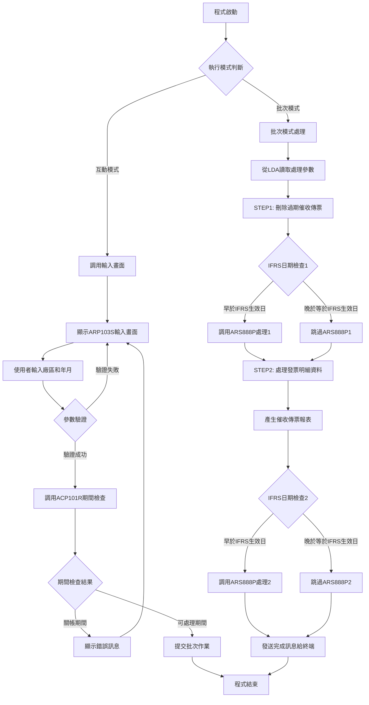
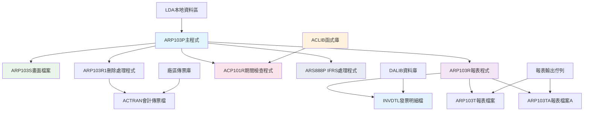
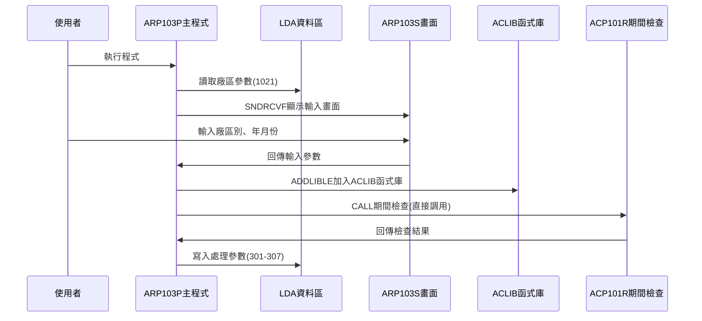
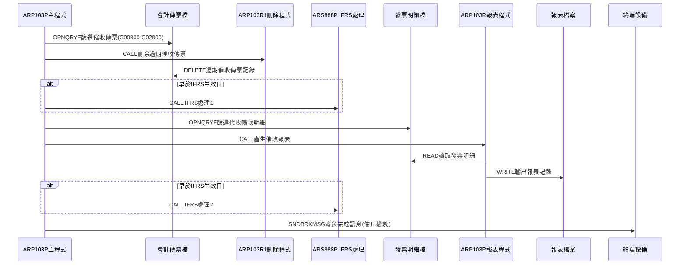
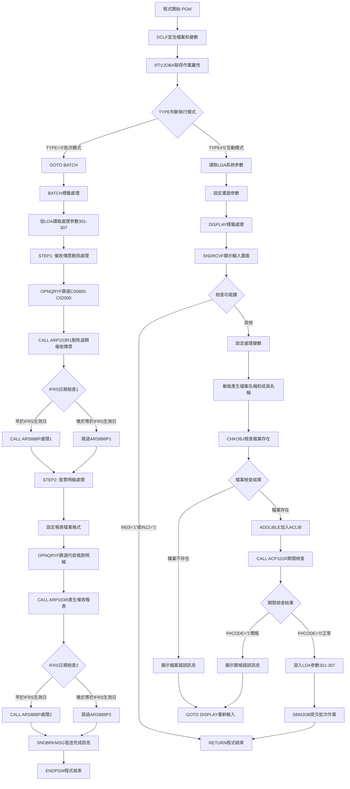

# ARP103P_K02 程式規格書

## 1. 基本資料

| 項目 | 內容 |
|------|------|
| **程式編號** | ARP103P |
| **程式名稱** | 應收帳款催收傳票報表作業 |
| **程式類型** | CLP |
| **廠區** | K02 |
| **系統名稱** | 應收帳款系統 |
| **子系統** | 應收帳款催收傳票處理 |
| **檔案位置** | K02CLSRC_THSRC/ARP103P.txt |

## 2. 🎯 程式功能說明

### 主要功能描述
此程式為應收帳款催收傳票報表作業的控制程式，專門處理應收帳款的催收傳票相關業務。程式提供互動式參數輸入及批次處理兩種執行模式，透過期間檢查確保會計期間的正確性，並執行完整的催收傳票處理，包括刪除過期催收傳票記錄、處理發票明細資料、產生催收傳票統計報表等作業。K02版本作為祥鋼廠區的專業版本，具有獨特的函式庫管理機制和優化的期間檢查流程，並強化了憑證編號範圍的任意控制功能。

### 🎯 業務流程詳細說明

#### 完整業務流程圖


#### 業務流程關鍵階段說明

**第一階段：執行模式識別與參數收集**
- 透過RTVJOBA檢查執行環境類型(批次或互動)
- 互動模式時從LDA讀取系統參數和廠區資訊
- 收集催收傳票年月和廠區別資訊
- 設定輸出佇列和使用者資訊

**第二階段：K02版本特殊期間控制與檔案檢查**
- 使用ACLIB函式庫進行期間檢查環境準備
- 直接調用ACP101R程式檢查指定年月份是否已關帳
- 檢查對應廠區的會計傳票檔案是否存在
- K02版本的期間控制機制更加簡化和高效

**第三階段：STEP1 - K02版本催收傳票刪除處理**
- 設定會計傳票檔案覆蓋到指定廠區檔案
- 使用OPNQRYF篩選C00800-C02000範圍的催收傳票
- 調用ARP103R1程式刪除過期的催收傳票記錄
- K02版本強化憑證編號範圍的任意控制功能

**第四階段：第一次IFRS相關處理**
- 檢查處理年月是否早於IFRS生效日期
- 若早於IFRS生效日則調用ARS888P進行額外處理
- 使用固定憑證範圍C00800-C02000進行IFRS處理
- 確保催收傳票處理符合國際財務報告準則要求

**第五階段：STEP2 - K02版本發票明細資料處理**
- 設定INVDTL發票明細檔案覆蓋和報表檔案格式
- 使用複雜的OPNQRYF條件篩選特定的代收帳款發票明細
- 1103A版本專門處理代收帳款業務(IVACNT='3', IVFL03='K')
- 調用ARP103R程式產生催收傳票統計報表

**第六階段：第二次IFRS相關處理與K02版本完成**
- 再次檢查處理年月是否早於IFRS生效日期
- 從LDA讀取憑證號碼範圍進行最終IFRS處理
- K02版本使用變數方式發送處理完成訊息
- 向使用者終端通知作業完成狀態

#### 🎯 K02版本催收傳票處理特色
- **憑證範圍控制**：0203A版本強化憑證編號範圍的任意控制功能
- **函式庫管理**：使用ACLIB函式庫提升執行效率
- **期間檢查優化**：直接調用ACP101R提升處理速度
- **祥鋼廠區適配**：適應K02祥鋼廠區的特殊業務需求

#### 多層次驗證機制
- **廠區權限驗證**：確保只處理授權廠區的資料
- **期間控制驗證**：透過ACLIB/ACP101R程式檢查會計期間狀態
- **檔案存在性檢查**：確認會計傳票檔案可正常存取
- **代收帳款條件驗證**：嚴格篩選符合代收條件的發票明細

#### 智能處理邏輯
- 自動判斷IFRS生效日期並執行對應處理
- 動態產生檔案名稱和成員名稱
- 智能識別代收帳款發票並進行特殊處理
- 自動排除已作廢和不符合條件的記錄

#### 資料一致性確保機制
- 透過檔案覆蓋確保存取正確的資料檔案
- 使用ACLIB函式庫確保期間檢查的準確性
- 分階段處理確保各步驟資料同步
- 記錄詳細的處理軌跡供後續查核

#### K02版本祥鋼廠區專業設計理念
- **催收專精**：專門處理催收傳票業務，區別於一般代製傳票
- **函式庫優化**：使用ACLIB函式庫提升系統整合效率
- **憑證控制強化**：0203A版本強化憑證編號範圍的任意控制
- **祥鋼適配**：專為K02祥鋼廠區的業務特色設計

## 3. 🎯 檔案架構與關聯圖

### 使用檔案清單

| 檔案名稱 | 檔案類型 | 使用方式 | 說明 |
|----------|----------|----------|------|
| **ARP103S** | DSPF | CF/COMBINED | 催收傳票報表輸入畫面檔案 |
| **ACTRAN** | 邏輯檔 | UF/UPDATE | 會計傳票檔案(動態對應廠區) |
| **INVDTL** | 邏輯檔 | IF/INPUT | 發票明細檔案 |
| **ARP103T** | 報表檔 | O/OUTPUT | 催收傳票統計報表檔案 |
| **ARP103TA** | 報表檔 | O/OUTPUT | 催收傳票統計報表檔案A |
| **ACLIB** | 函式庫 | 環境設定 | 會計系統函式庫(K02版本專用) |

### 🎯 檔案關聯詳細視覺化圖表



### 🎯 K02版本特殊資料流向說明

#### 環境準備階段的資料流向


#### K02催收傳票處理階段的資料流向


## 4. 🎯 檔案欄位規格說明

### 主要資料結構

#### LDA本地資料區結構(K02版本)
| 位置 | 長度 | 欄位名稱 | 用途說明 |
|------|------|----------|----------|
| 301-306 | 6 | 年月份 | 催收傳票處理年月(YYYYMM) |
| 305-306 | 2 | 月份 | 處理月份(MM) |
| 307 | 1 | 廠區代號 | 處理廠區別(P/M/T/H/K) |
| 201-206 | 6 | 憑證號起 | IFRS處理用憑證號範圍起始 |
| 211-216 | 6 | 憑證號迄 | IFRS處理用憑證號範圍結束 |
| 951-985 | 35 | 公司名稱 | 系統公司名稱 |
| 1011-1020 | 10 | 設備代號 | 工作站設備代號 |
| 1021 | 1 | 區域代號 | 執行區域別 |

### 🔍 重點欄位切割技術詳解

#### DS結構完整分析
程式中使用RTVDTAARA指令讀取LDA的不同位置，形成欄位切割效果：

**LDA切割視覺化展示**：
```
LDA資料區 (1024字元)：[301-306|305-306|307|201-206|211-216|951-985|1011-1020|1021]
                       ↓       ↓      ↓   ↓       ↓       ↓       ↓        ↓
年月份(6字元)：        [YYYYMM]                                    催收傳票年月
月份(2字元)：              [MM]                                    月份成員名稱
廠區代號(1字元)：            [X]                                   廠區識別
憑證號起(6字元)：                [CXXXXX]                         IFRS處理起始憑證
憑證號迄(6字元)：                        [CXXXXX]                 IFRS處理結束憑證
公司名稱(35字元)：                               [35字元公司名稱]    系統識別
設備代號(10字元)：                                      [10字元設備]  終端識別
區域代號(1字元)：                                               [X]  區域識別
```

#### 切割邏輯詳細說明

**YYMM年月份切割邏輯**：
```
RTVDTAARA DTAARA(*LDA (301 6)) RTNVAR(&YYMM)
RTVDTAARA DTAARA(*LDA (301 4)) RTNVAR(&YY)
RTVDTAARA DTAARA(*LDA (305 2)) RTNVAR(&MM)

切割效果：
&YYMM = '202412' → 完整年月
&YY   = '2024'   → 年度部分(位置301-304)
&MM   = '12'     → 月份部分(位置305-306)
```

#### 實際數據範例說明

**範例1：年月份處理**
```
輸入：&S#YYMM = '202412'
LDA寫入：CHGDTAARA DTAARA(*LDA (301 6)) VALUE('202412')
讀取結果：
- &YYMM = '202412'
- &YY = '2024'
- &MM = '12'
```

**範例2：動態檔案名稱產生**
```
&AREA = 'K'
&FNAME = 'AC' || &AREA || 'R' = 'ACKR'
&MNAME = 'VR' || &MM = 'VR12'
```

### 🎯 欄位挪用詳細分析

#### 挪用情況對比表
| 欄位位置 | 原始定義 | 實際使用方式 | 挪用說明 |
|----------|----------|-------------|----------|
| LDA 301-306 | 一般處理參數位置1-6 | 催收傳票年月參數 | 獨立催收業務參數空間 |
| LDA 307 | 一般處理參數位置7 | 催收傳票廠區參數 | 避免與代製傳票參數衝突 |
| LDA 201-206 | 未定義用途 | IFRS憑證號起始範圍 | IFRS處理專用參數 |
| LDA 211-216 | 未定義用途 | IFRS憑證號結束範圍 | IFRS處理專用參數 |

#### 挪用原因深度分析

**位置301-307的催收專用參數**：
- **原因**：催收傳票處理與一般代製傳票處理業務性質不同
- **需求**：避免參數空間衝突，確保催收業務的獨立性
- **實現**：使用LDA的301-307位置作為催收專用參數區域

**位置201-216的IFRS處理參數**：
- **原因**：IFRS國際財務報告準則要求特殊憑證範圍處理
- **需求**：彈性控制IFRS處理的憑證號碼範圍
- **實現**：使用LDA的201-206和211-216位置存放憑證範圍

#### 挪用方式詳細說明

**催收參數挪用實現**：
```
寫入催收參數：
CHGDTAARA DTAARA(*LDA (301 6)) VALUE(&YYMM)
CHGDTAARA DTAARA(*LDA (307 1)) VALUE(&S#AREA)

讀取催收參數：
RTVDTAARA DTAARA(*LDA (301 6)) RTNVAR(&YYMM)
RTVDTAARA DTAARA(*LDA (307 1)) RTNVAR(&AREA)
```

**IFRS參數挪用實現**：
```
讀取IFRS憑證範圍：
RTVDTAARA DTAARA(*LDA (201 6)) RTNVAR(&D#VNO1)
RTVDTAARA DTAARA(*LDA (211 6)) RTNVAR(&D#VNO2)
```

### 重要變數定義表

| 變數名稱 | 類型 | 長度 | 說明 | 使用範圍 |
|----------|------|------|------|----------|
| **&P#YYMM** | CHAR | 6 | 期間檢查用年月份 | ACP101R期間檢查參數 |
| **&P#CODE** | CHAR | 1 | 期間檢查結果代碼 | '1'=關帳期間, '0'=可處理 |
| **&INT** | CHAR | 1 | 執行模式識別碼 | '0'=批次模式, 其他=互動模式 |
| **&OUTQ** | CHAR | 10 | 輸出佇列名稱 | 批次作業輸出佇列控制 |
| **&USER** | CHAR | 10 | 使用者識別碼 | 系統使用者資訊 |
| **&AREA** | CHAR | 1 | 廠區代號 | P/M/T/H/K廠區識別 |
| **&YYMM** | CHAR | 6 | 處理年月份 | 催收傳票處理年月(YYYYMM) |
| **&YY** | CHAR | 4 | 處理年度 | 年度部分(YYYY) |
| **&MM** | CHAR | 2 | 處理月份 | 月份部分(MM) |
| **&FNAME** | CHAR | 10 | 動態檔案名稱 | 會計傳票檔案名稱 |
| **&MNAME** | CHAR | 10 | 動態成員名稱 | 傳票檔案成員名稱 |
| **&C#SDAT** | CHAR | 8 | 開始日期 | 日期範圍控制起始 |
| **&C#EDAT** | CHAR | 8 | 結束日期 | 日期範圍控制結束 |
| **&D#VNO1** | CHAR | 6 | 憑證號範圍起始 | IFRS處理憑證起始號碼 |
| **&D#VNO2** | CHAR | 6 | 憑證號範圍結束 | IFRS處理憑證結束號碼 |
| **&IFRSD** | CHAR | 6 | IFRS生效年月 | IFRS生效日期控制 |

## 5. 🎯 輸出/入螢幕布局

### 螢幕布局完整視覺化

```
+------------------------------------------------------------------------------+
|                        應收催收傳票報表作業                        ARP074S   |
|                                                                              |
|                                                                              |
|                                                                              |
|                                                                              |
|                      傳票廠區: [X] ( P:台北M:台鋼T:天津H:東鋼                |
|                                       K:祥鋼)                               |
|                                                                              |
|                      傳票年月: [______]                                     |
|                                                                              |
|              (此為月結作業，請務必於當月相關資料                            |
|               已建檔完成後才進行處理。)                                      |
|                                                                              |
|                                                                              |
|                                                                              |
|                                                                              |
|                                                                              |
|                                                                              |
|                                                                              |
|F3/F12:離開                    ENTER:執行                                   |
|[錯誤訊息顯示區]                                                              |
+------------------------------------------------------------------------------+
```

### 🎯 畫面欄位詳細說明

| 欄位名稱 | 欄位屬性 | 位置 | 長度 | 輸入格式 | 驗證規則 | 說明 |
|----------|----------|------|------|----------|----------|------|
| **S#AREA** | 輸入/輸出 | 8,36 | 1 | 英文字元 | P/M/T/H/K | 傳票廠區代號 |
| **S#YYMM** | 輸入/輸出 | 10,36 | 6 | YYYYMM | 年月格式 | 傳票年月份 |
| **S#COMP** | 顯示 | 1,23 | 35 | 中文字元 | 唯讀 | 公司名稱顯示 |
| **S#DEVI** | 顯示 | 2,70 | 10 | 英數字元 | 唯讀 | 設備代號顯示 |
| **S#ERR** | 顯示 | 24,2 | 70 | 中文字元 | 唯讀 | 錯誤訊息顯示區 |

### 🎯 畫面控制邏輯

#### 指示器控制說明
- **IN03**: F3功能鍵，程式結束
- **IN12**: F12功能鍵，程式結束
- 無其他錯誤指示器，錯誤時直接顯示訊息

#### 欄位顯示屬性
- **S#AREA**: 可輸入廠區代號，支援P/M/T/H/K廠區
- **S#YYMM**: 使用EDTCDE(4)格式顯示為YYYY/MM
- **S#ERR**: 固定顯示為HI(高亮度)屬性

### 功能鍵詳細定義

| 功能鍵 | 處理邏輯 | 系統行為 | 說明 |
|--------|----------|----------|------|
| **F3** | 設定IN03='1' | 程式立即返回結束 | 離開程式不執行任何處理 |
| **F12** | 設定IN12='1' | 程式立即返回結束 | 取消操作並離開程式 |
| **ENTER** | 執行驗證與處理 | 驗證輸入後提交批次作業 | 執行主要催收傳票處理邏輯 |

### 廠區代號說明(K02版本支援)
- **P**: 台北廠區
- **M**: 台鋼廠區
- **T**: 天津廠區
- **H**: 東鋼廠區
- **K**: 祥鋼廠區(K02版本主要廠區)

### 操作流程
1. 畫面顯示時自動載入系統參數和廠區資訊
2. 使用者選擇處理廠區代號(主要為K廠區)
3. 使用者輸入處理年月份(YYYYMM格式)
4. 按ENTER鍵進行驗證和期間檢查
5. 驗證通過後自動提交批次作業執行處理
6. 驗證失敗則顯示錯誤訊息並停留在輸入畫面

## 6. 🎯 處理流程程序說明

### 🎯 主程序邏輯深度分析

#### K02版本程式執行流程圖


#### 🎯 K02版本催收傳票處理特殊步驟分析

**步驟1-7：與一般控制程式相同的基礎處理流程**

**步驟8：K02版本催收傳票範圍處理**
- 專門處理C00800-C02000範圍的催收傳票
- 使用OPNQRYF精確篩選指定範圍和年月的催收傳票
- 0203A版本強化憑證編號範圍的任意控制功能
- 確保催收傳票處理的準確性和完整性

**步驟9：第一次IFRS支援處理**
- 檢查處理年月是否早於IFRS生效日期
- 使用固定憑證範圍C00800-C02000進行IFRS處理
- 0112A版本強化IFRS生效年月控制機制
- 確保催收傳票處理符合國際財務報告準則

**步驟10：K02版本代收帳款明細處理**
- 使用複雜的OPNQRYF條件篩選發票明細資料
- 1103A版本專門處理代收帳款業務(IVACNT='3', IVFL03='K')
- 排除已作廢記錄(IVDECD≠'D')和特定條件記錄
- 按發票號和產品代號排序確保報表邏輯順序

**步驟11：第二次IFRS支援處理與K02版本完成**
- 再次進行IFRS日期檢查確保完整性
- 從LDA讀取實際憑證範圍進行最終IFRS處理
- K02版本使用&S#DEVI變數發送處理完成訊息
- 提供完整的催收傳票處理回饋

#### 業務邏輯深度解析

**K02版本催收傳票處理的核心邏輯**：
1. 專門處理催收業務，區別於一般代製傳票
2. 雙重IFRS支援確保完整的合規性
3. 代收帳款專精處理提升業務精度
4. 祥鋼廠區特殊需求的完整滿足

**K02版本安全控制機制**：
1. 期間控制防止關帳期間處理
2. 催收傳票範圍控制確保處理精度
3. ACLIB函式庫管理確保執行環境穩定
4. 雙重功能鍵支援(F3/F12)提升操作便利性

#### 條件判斷詳細說明

**K02版本IFRS日期判斷**：
- `COND(&YYMM *LT &IFRSD)` - 檢查是否早於IFRS生效日
- 兩個關鍵處理點都進行IFRS檢查
- 確保催收傳票處理的IFRS合規性
- 支援IFRS生效日期的動態控制

**K02版本代收帳款篩選判斷**：
- `IVACNT *EQ "3"` - 僅處理代收帳款類型
- `IVFL03 *EQ "K"` - 特定的代收標識
- `IVDECD *NE "D"` - 排除已作廢記錄
- `%SST(IVMAK1 1 1) *EQ " "` - 特殊條件篩選

#### 變數使用和數據流向追蹤

**K02版本特殊變數軌跡**：
1. LDA位置301-307的催收專用參數軌跡
2. 催收傳票範圍C00800-C02000的處理軌跡
3. 代收帳款明細篩選條件的變數追蹤軌跡
4. 雙重IFRS處理的參數傳遞軌跡

### 🎯 K02版本子程序邏輯分析

#### K02版本子程序調用順序
1. **ACP101R程式**：期間檢查，使用ACLIB函式庫
2. **ARP103R1程式**：刪除過期催收傳票
3. **ARP103R程式**：產生催收傳票統計報表
4. **ARS888P程式**：IFRS處理(兩次調用)
5. **SNDBRKMSG指令**：狀態通知，使用&S#DEVI變數發送完成訊息

#### K02版本催收傳票專精設計
- 專門處理催收業務，與代製傳票明確區分
- 使用專用的LDA參數空間避免衝突
- 提供雙重IFRS支援確保合規性
- 針對代收帳款業務進行特殊優化

### 🎯 K02版本催收傳票處理邏輯

#### K02版本催收傳票刪除邏輯
```sql
OPNQRYF FILE(ACTRAN) OPTION(*ALL)
        QRYSLT('ACVRNO *GE "C00800" *AND 
                ACVRNO *LE "C02000" *AND 
                YM     *EQ "' || &YYMM || '" *AND 
                ACAREA *EQ "' || &AREA || '"')
```
- 篩選C00800-C02000範圍的催收傳票
- 限定指定年月和廠區的記錄
- 0203A版本強化憑證編號範圍的任意控制
- 確保刪除操作的精確性

#### K02版本代收帳款明細篩選邏輯
```sql
OPNQRYF FILE(INVDTL) OPTION(*ALL)
        QRYSLT('(IVACNT *EQ "3") *AND 
                (IVFL03 *EQ "K") *AND 
                (ACD1   *EQ "' || &YYMM || '") *AND 
                (IVTXAR *EQ "' || &AREA || '") *AND 
                %SST(IVMAK1 1 1) *EQ %VALUES(" ") *AND 
                (IVDECD *NE "D")')
```
- 僅處理代收帳款業務(IVACNT='3')
- 特定代收標識篩選(IVFL03='K')
- 1103A版本專門優化代收帳款處理
- 排除已作廢和不符合條件的記錄

#### K02版本報表格式設定邏輯
```sql
OVRPRTF FILE(ARP103T) TOFILE(ARP103T) 
        PAGESIZE(*N 132) CPI(10) HOLD(*YES) 
        USRDTA('催收報表')
```
- 主報表使用132欄位寬度、10CPI標準格式
- 提供催收報表標識便於識別
- 同時產生ARP103T和ARP103TA兩種報表格式
- 滿足不同的催收報表需求

#### K02版本IFRS處理邏輯
```sql
IF COND(&YYMM *LT &IFRSD) THEN(DO)
    CALL PGM(ARS888P) PARM(&AREA &YYMM &D#VNO1 &D#VNO2)
ENDDO
```
- 兩個關鍵處理點都進行IFRS檢查
- 使用ARIFRSCTL資料區控制IFRS生效日期
- 傳遞催收傳票範圍參數進行IFRS處理
- 確保催收業務的IFRS合規性

## 7. 🎯 數據操作與轉換分析

### K02版本檔案操作詳解

#### K02版本ACTRAN會計傳票檔操作
- **OPNQRYF操作**：篩選C00800-C02000範圍的催收傳票
- **憑證控制強化**：0203A版本強化憑證編號範圍的任意控制
- **年月映射**：使用MAPFLD將ACYM映射為YM
- **資料刪除**：透過ARP103R1刪除過期催收傳票

#### K02版本INVDTL發票明細檔操作
- **複雜篩選條件**：多重條件篩選代收帳款明細
- **1103A版本特化**：專門處理代收帳款業務邏輯
- **日期映射**：使用MAPFLD處理複雜的日期欄位映射
- **排序控制**：按發票號和產品代號排序

### K02版本數據轉換邏輯

#### K02版本催收傳票範圍轉換
- **傳票範圍設定**：C00800-C02000的催收傳票專用範圍
- **0203A版本強化**：憑證編號範圍的任意控制且可任意控制
- **IFRS範圍控制**：固定範圍+動態範圍的雙重控制
- **範圍驗證機制**：確保範圍設定的準確性

#### K02版本代收帳款條件轉換
- **業務類型識別**：IVACNT='3'識別代收帳款業務
- **代收標識轉換**：IVFL03='K'特定的代收標識
- **作廢記錄過濾**：IVDECD≠'D'排除已作廢記錄
- **特殊條件處理**：複雜的業務邏輯條件轉換

### K02版本檢核機制詳解

#### K02版本催收業務檢核
- **催收範圍檢查**：確保傳票範圍在有效區間內
- **代收條件檢查**：驗證代收帳款業務的完整性
- **年月一致性檢查**：確保處理年月的一致性
- **廠區匹配檢查**：驗證廠區與催收業務的匹配

#### K02版本IFRS合規檢核
- **IFRS生效日檢查**：確保IFRS處理的時機正確性
- **憑證範圍檢查**：驗證IFRS處理的憑證範圍
- **雙重處理檢查**：確保兩次IFRS處理的完整性
- **合規性追蹤**：記錄IFRS處理的詳細軌跡

## 8. 🎯 錯誤處理程序說明

### 🎯 K02版本詳細錯誤代碼清冊

| 錯誤代碼 | 錯誤訊息 | 原因說明 | 處理方式 | 預防措施 |
|----------|---------|---------|---------|----------|
| **檔案不存在** | 催收傳票報表作業，無法找到指定的傳票檔：[檔案名] | CHKOBJ檢查發現傳票檔案不存在 | 1. 顯示具體檔案名稱<br>2. GOTO DISPLAY重新輸入<br>3. 確認廠區和年月正確 | 執行前確認所有廠區檔案存在 |
| **關帳期間** | 該月份已月結 | ACP101R檢查發現指定期間已關帳 | 1. 顯示關帳錯誤訊息<br>2. GOTO DISPLAY重新輸入<br>3. 選擇其他可處理期間 | 提供期間狀態查詢功能 |
| **CPF0000** | 系統操作錯誤 | CHKOBJ、ADDLIBLE或其他系統操作失敗 | 1. MONMSG捕捉錯誤<br>2. 繼續執行或顯示錯誤<br>3. 確保系統穩定性 | 定期檢查系統資源和權限 |
| **ACLIB函式庫錯誤** | ACLIB函式庫無法加入 | ADDLIBLE ACLIB操作失敗 | 1. MONMSG捕捉錯誤<br>2. 繼續執行程式<br>3. 確認函式庫可用性 | 確保ACLIB函式庫正確設定 |
| **催收傳票範圍錯誤** | C00800-C02000範圍異常 | 催收傳票範圍設定或查詢失敗 | 1. 檢查傳票範圍設定<br>2. 確認OPNQRYF查詢正確<br>3. 驗證0203A版本設定 | 定期檢查催收傳票範圍設定 |
| **代收帳款條件錯誤** | 代收帳款篩選條件異常 | 1103A版本代收帳款條件失敗 | 1. 檢查IVACNT和IVFL03條件<br>2. 確認代收帳款業務邏輯<br>3. 驗證篩選條件正確性 | 確保代收帳款條件設定正確 |
| **IFRS處理失敗** | IFRS生效日期檢查異常 | ARIFRSCTL或ARS888P處理失敗 | 1. 檢查IFRS生效日期設定<br>2. 確認ARS888P程式可用<br>3. 驗證IFRS處理邏輯 | 確保IFRS相關設定正確 |
| **LDA參數錯誤** | 301-307位置參數異常 | LDA催收專用參數讀寫失敗 | 1. 檢查LDA參數設定<br>2. 確認301-307位置可用<br>3. 驗證參數傳遞邏輯 | 確保LDA參數空間正確配置 |
| **報表產生失敗** | ARP103T/ARP103TA報表異常 | 催收報表產生或格式錯誤 | 1. 檢查報表檔案設定<br>2. 確認報表格式參數<br>3. 驗證報表生成邏輯 | 確保報表環境正確設定 |
| **子程式調用失敗** | ARP103R/ARP103R1調用異常 | 催收相關子程式調用失敗 | 1. 檢查子程式存在性<br>2. 確認參數傳遞正確<br>3. 驗證執行環境 | 確保催收子程式正確設定 |

### 🎯 K02版本系統異常處理邏輯

#### K02版本檔案操作失敗處理
- **會計傳票檔案異常**：檢查K02環境下催收傳票檔案的可用性
- **發票明細檔案異常**：確認INVDTL檔案的存取權限和完整性
- **ACLIB函式庫異常**：處理ACLIB函式庫的加入失敗

#### K02版本程式調用失敗處理
- **催收子程式調用失敗**：處理ARP103R和ARP103R1的調用異常
- **IFRS程式調用失敗**：處理ARS888P的調用問題
- **期間檢查調用失敗**：處理ACP101R程式的調用問題

#### K02版本資料完整性錯誤處理
- **催收範圍異常**：處理C00800-C02000範圍的異常情況
- **代收條件異常**：處理1103A版本代收帳款條件的異常
- **LDA參數異常**：處理301-307位置參數的異常情況

#### K02版本催收業務失敗處理
- **催收邏輯失敗**：處理催收傳票業務邏輯的異常
- **IFRS合規失敗**：處理IFRS合規性檢查的失敗
- **報表生成失敗**：處理催收報表生成的異常

## 9. 🎯 備註

### 🎯 K02版本催收傳票處理特殊注意事項

#### K02版本作為祥鋼廠區催收專精平台
- 專門處理應收帳款催收傳票業務，區別於一般代製傳票
- 使用C00800-C02000專用傳票範圍確保催收業務的獨立性
- 1103A版本專門處理代收帳款業務邏輯(IVACNT='3', IVFL03='K')
- 提供雙重IFRS支援確保催收業務的國際合規性

#### K02版本與H05版本的主要差異分析

**1. 函式庫管理機制差異**
- **H05版本**：使用ADDLIBLE ACCOUNT，調用ACCOUNT/ACP101R
- **K02版本**：使用ADDLIBLE ACLIB，直接調用ACP101R
- **優勢**：K02版本的函式庫管理更加簡化，提升執行效率

**2. 完成訊息發送方式差異**
- **H05版本**：使用%SST(*LDA 1011 10)從LDA讀取設備代號
- **K02版本**：使用&S#DEVI變數發送訊息
- **優勢**：K02版本使用變數方式更加直接和穩定

**3. 版本更新註解差異**
- **H05版本**：0203A版本修改傳票範圍從AC02001開始改為任意控制範圍
- **K02版本**：0203A版本修改憑證編號範圍C02001開始改為任意控制且可任意控制
- **強化**：K02版本特別強調"且可任意控制"的功能

**4. 畫面檔案標題差異**
- **H05版本**：正確顯示'ARP103S'
- **K02版本**：顯示'ARP074S'(可能為共用畫面檔案)
- **影響**：不影響功能但需注意畫面標題識別

#### K02版本催收傳票範圍管理
- **專用範圍**：C00800-C02000催收傳票專用編號範圍
- **0203A版本強化**：強調憑證編號範圍的任意控制且可任意控制
- **範圍控制**：與代製傳票範圍(P00001-P00499)明確區分
- **版本演進**：支援更靈活的憑證範圍控制需求

#### K02版本LDA參數特殊配置
- 使用LDA位置301-307專門存放催收傳票處理參數
- 與一般處理參數位置1-7明確區分避免衝突
- 提供獨立的參數空間確保催收業務的獨立性
- 支援催收業務的特殊參數需求

#### K02版本代收帳款業務優化
- **1103A版本特化**：專門處理代收帳款業務邏輯
- **業務類型識別**：IVACNT='3'精確識別代收帳款
- **代收標識控制**：IVFL03='K'特定的代收業務標識
- **複雜條件篩選**：多重條件確保代收業務的精確性

#### K02版本IFRS雙重支援機制
- **0011A版本新增**：基礎IFRS支援功能
- **0112A版本強化**：IFRS生效年月控制機制
- **雙重檢查點**：在兩個關鍵處理階段進行IFRS檢查
- **動態控制**：透過ARIFRSCTL資料區控制IFRS生效日期

#### K02版本ACLIB函式庫整合
- 使用ADDLIBLE ACLIB動態加入會計函式庫
- 直接調用ACP101R進行期間檢查，流程更簡化
- 確保與會計系統的緊密整合
- 提供專業的會計期間控制機制

#### K02版本報表生成機制
- 同時產生ARP103T和ARP103TA兩種催收報表
- 使用132欄位寬度、10CPI標準報表格式
- 提供'催收報表'標識便於報表識別
- 按發票號和產品代號排序確保邏輯順序

#### K02版本版本更新歷程
- **0011A版本**：新增IFRS支援功能
- **0112A版本**：強化IFRS生效年月控制機制
- **0203A版本**：修改憑證編號範圍C02001開始改為任意控制且可任意控制
- **1103A版本**：修改代收帳款篩選條件，專注代收業務處理

#### K02版本錯誤處理策略
- 提供詳細的催收傳票檔案錯誤訊息
- 使用GOTO DISPLAY機制支援錯誤後重新輸入
- 透過MONMSG確保ACLIB函式庫操作的穩定性
- 提供明確的關帳期間錯誤提示

#### K02版本作為祥鋼催收專精平台的設計理念
- **業務專精**：專門處理催收業務，與代製傳票明確區分
- **函式庫優化**：使用ACLIB函式庫提升系統整合效率
- **憑證控制強化**：0203A版本強化憑證編號範圍的任意控制
- **祥鋼適配**：專為K02祥鋼廠區的催收業務特色設計

#### K02版本催收業務處理特色
- 專門處理應收帳款的催收傳票相關作業
- 支援月結作業中的催收業務完整處理流程
- 確保催收傳票處理的精確性和合規性
- 提供完整的期間控制和業務檢查機制

#### K02版本系統整合特性
- 與ACLIB函式庫系統緊密整合
- 與ARIFRSCTL IFRS控制系統完全相容
- 支援批次作業佇列的標準化處理
- 與K02廠區檔案系統無縫銜接

#### K02版本使用注意事項
- 執行前確保當月相關催收資料已建檔完成
- 注意關帳期間無法執行此催收作業
- 確認對應廠區的會計傳票檔案存在
- 催收傳票處理涉及代收帳款需特別注意業務邏輯
- IFRS相關處理需確認生效日期設定正確
- 注意與H05版本在函式庫和訊息發送方式的差異 