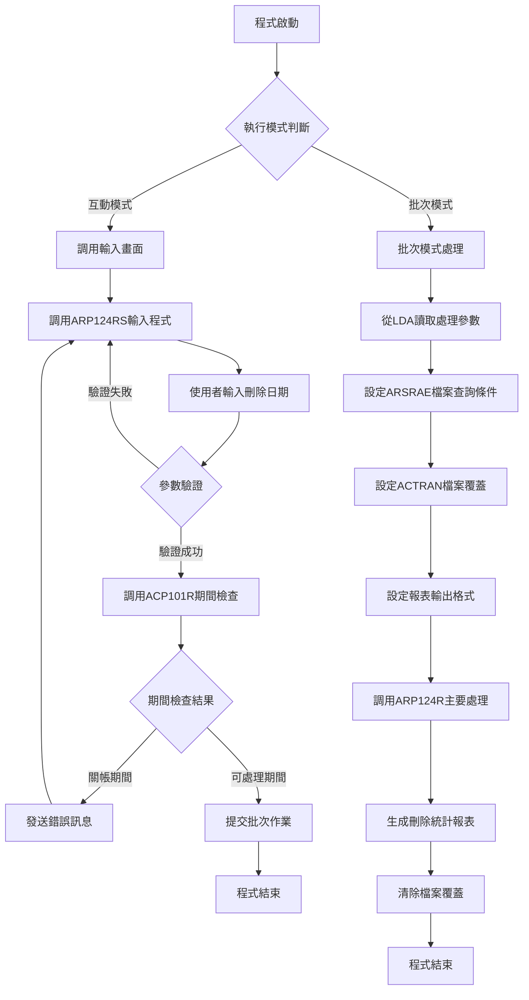
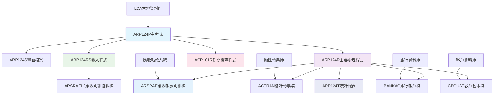
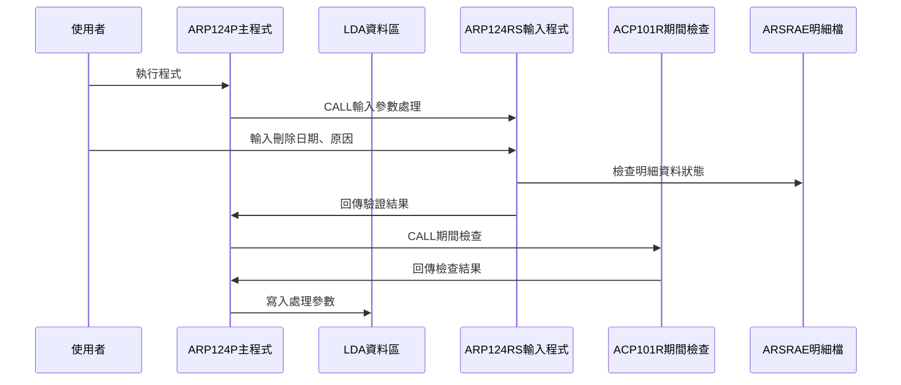
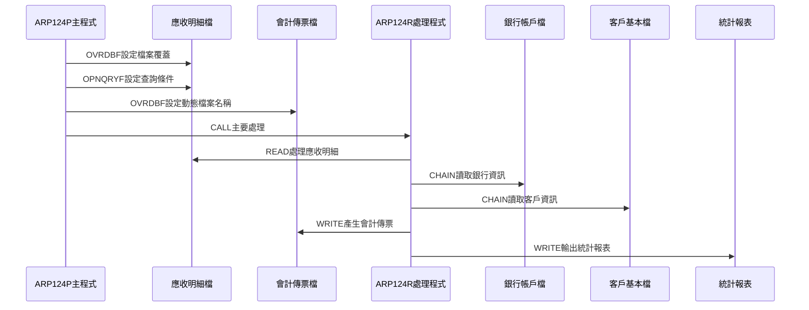
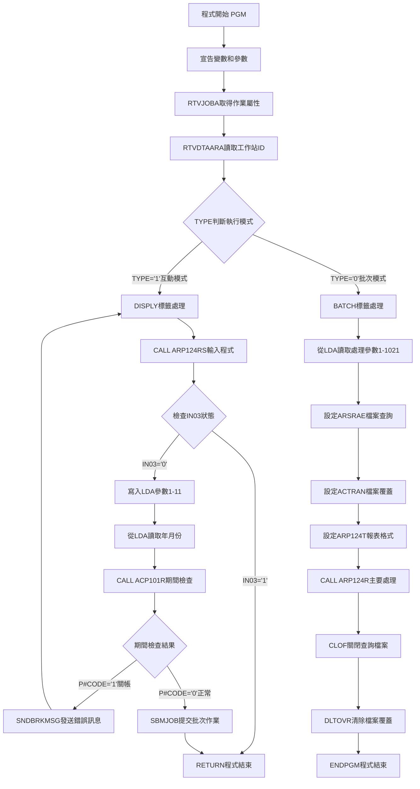

# ARP124P_H05 程式規格書

## 1. 基本資料

| 項目 | 內容 |
|------|------|
| **程式編號** | ARP124P |
| **程式名稱** | 月結前刪除傳票作業 |
| **程式類型** | CLP |
| **廠區** | H05 |
| **系統名稱** | 應收帳款系統 |
| **子系統** | 月結前清理作業 |
| **檔案位置** | H05CLSRC_THSRC/ARP124P.txt |

## 2. 🎯 程式功能說明

### 主要功能描述
此程式為月結前刪除傳票作業的控制程式，專門處理應收帳款系統月結前的傳票清理作業。程式提供互動式參數輸入及批次處理兩種執行模式，透過期間檢查確保會計期間的正確性，並執行完整的傳票刪除處理。H05版本具有完整的傳票號碼自動產生機制、多幣別處理支援、以及詳細的刪除統計報表輸出。程式特別針對應收帳款月結前的營業狀況進行傳票清理，確保月結作業的順利進行。

### 🎯 業務流程詳細說明

#### 完整業務流程圖


#### 業務流程關鍵階段說明

**第一階段：執行模式識別與參數收集**
- 透過RTVJOBA檢查執行環境類型(批次或互動)
- 互動模式時調用ARP124RS程式進行參數輸入
- 收集刪除日期、刪除原因等必要參數
- 設定LDA參數以供批次處理使用

**第二階段：期間控制與參數驗證**
- 調用ACP101R程式檢查指定年月份是否已關帳
- 驗證刪除日期的合法性和期間狀態
- 確保無法在關帳期間進行傳票刪除作業
- 防止違反會計期間控制原則

**第三階段：應收帳款明細檔案條件設定**
- 設定ARSRAE檔案查詢條件
- 限定廠區別和傳票產生狀態
- 排除已作廢和已產生傳票的記錄
- 確保只處理符合刪除條件的應收明細

**第四階段：會計傳票檔案環境準備**
- 動態設定會計傳票檔案名稱(AC+廠區+R)
- 設定ARP124T報表輸出格式(158欄位)
- 使用13.3 CPI設定確保報表美觀
- 設定報表標題為"月結前傳票刪除"

**第五階段：主要傳票刪除處理**
- 調用ARP124R程式執行實際的刪除作業
- 處理多種類型的應收帳款明細
- 生成對應的會計傳票記錄
- 統計刪除的明細筆數和金額

**第六階段：清理作業與結果輸出**
- 關閉ARSRAE檔案的開放查詢
- 清除所有檔案覆蓋設定
- 輸出詳細的刪除統計報表
- 記錄完整的刪除作業軌跡

#### 🎯 H05版本月結前刪除傳票特色
- **自動傳票號碼**：C02101-C02500範圍的自動編號機制
- **多幣別支援**：完整支援多種幣別的應收帳款處理
- **詳細統計報表**：提供完整的刪除統計和明細報表
- **客戶資訊整合**：整合客戶基本檔案顯示客戶名稱

#### 多層次驗證機制
- **期間控制驗證**：透過ACP101R程式檢查會計期間狀態
- **日期合法性驗證**：透過UTS102R程式驗證日期格式
- **業務邏輯驗證**：檢查應收明細的處理狀態
- **傳票號碼驗證**：確保傳票號碼範圍的正確性

#### 智能處理邏輯
- 自動判斷傳票產生狀態避免重複處理
- 動態產生會計傳票檔案名稱
- 智能計算傳票號碼範圍
- 自動統計處理結果並產生報表

#### 資料一致性確保機制
- 透過檔案覆蓋確保存取正確的資料檔案
- 使用查詢條件確保只處理符合條件的記錄
- 分階段處理確保各步驟資料同步
- 記錄詳細的操作軌跡供後續查核

#### H05版本月結前清理專業設計理念
- **月結準備專精**：專門處理月結前的傳票清理作業
- **傳票管理完整**：提供完整的傳票產生和管理機制
- **報表輸出豐富**：詳細的刪除統計和明細報表
- **H05特殊適配**：專為H05廠區的業務特色設計

## 3. 🎯 檔案架構與關聯圖

### 使用檔案清單

| 檔案名稱 | 檔案類型 | 使用方式 | 說明 |
|----------|----------|----------|------|
| **ARP124S** | DSPF | CF/COMBINED | 月結前刪除傳票輸入畫面檔案 |
| **ARSRAE** | 邏輯檔 | UP/UPDATE | 應收帳款明細主檔案 |
| **ACTRAN** | 邏輯檔 | UF/UPDATE | 會計傳票檔案(動態對應廠區) |
| **BANKAC** | 邏輯檔 | IF/INPUT | 銀行帳戶主檔案 |
| **CBCUST** | 邏輯檔 | IF/INPUT | 客戶基本資料檔案 |
| **ARP124T** | PRTF | O/OUTPUT | 月結前刪除傳票統計報表 |

### 🎯 檔案關聯詳細視覺化圖表



### 🎯 H05版本特殊資料流向說明

#### 環境準備階段的資料流向


#### H05月結前刪除傳票階段的資料流向


## 4. 🎯 檔案欄位規格說明

### 主要資料結構

#### H05版本LDA本地資料區完整結構
| 位置 | 長度 | 欄位名稱 | 資料類型 | 用途說明 |
|------|------|----------|----------|----------|
| **1-8** | 8 | U#YMD | CHAR | 處理日期(YYYYMMDD) |
| **1-4** | 4 | U#YY | CHAR | 處理年度(YYYY) |
| **5-2** | 2 | - | CHAR | 處理月份(MM) |
| **1-6** | 6 | U#YYMM | CHAR | 處理年月份(YYYYMM) |
| **11-1** | 1 | D#CHYN | CHAR | 刪除原因選項(Y/N，0903A新增) |
| **1011-10** | 10 | U#USID | CHAR | 工作站ID識別 |
| **1021-1** | 1 | AREA | CHAR | 廠區代號 |

### 🔍 重點欄位切割技術詳解

#### DS結構完整分析

**DS結構1：傳票號碼管理結構**
```
D#VRNO (6字元)：[XXXXXX]
                 ↓
位置1-6:        [XXXXXX]                     完整傳票號碼(如C02101)
```

**DS結構2：關聯號碼拆解結構**
```
ACRLNO (20字元)：[XXXXXXXXXX|XXX|XXXXXXXXXX]
                  ↓         ↓   ↓
D#RLNO (10字元)： [XXXXXXXXXX]              基本關聯號碼
D#ACYM (3字元)：            [XXX]           會計年月
D#RLN1 (10字元)：                [XXXXXXXXXX]擴充關聯號碼
```

**DS結構3：銀行帳戶拆解結構**
```
T#BKNO (10字元)：[X|XX|XXXXXXX]
                  ↓ ↓  ↓
D#BKTP (1字元)：  [X]                       銀行類型
D#BKCR (2字元)：   [XX]                     銀行代號
D#BKNO (7字元)：     [XXXXXXX]              銀行帳號
```

**DS結構4：會計科目管理結構**
```
ACDM04 (32字元)：[XXXXXXXX|XXXX|XXXXXXXXXXXXXXXXXXXX]
                  ↓       ↓    ↓
位置1-8:         [XXXXXXXX]                  基本資訊
W#COD (4字元)：           [XXXX]             會計科目代號(1300)
位置13-32:                    [XXXXXXXXXXXXXXXXXXXX]備用空間
```

**DS結構5：傳票編號計算結構(1007A新增)**
```
R#NON1 (6字元)：[XXXXXX]    起始傳票編號
R#NON2 (6字元)：[XXXXXX]    結束傳票編號

計算邏輯：
D#NON1 (5字元)：[XXXXX]     起始編號數值部分
D#NON2 (5字元)：[XXXXX]     結束編號數值部分
W#NON3 (50字元)：計算使用傳票數量(R#NON2 - R#NON1 + 1)
```

### 🎯 欄位挪用詳細分析

#### 傳票號碼範圍管理挪用分析

**挪用情況對比表**
| 欄位名稱 | 原始設計用途 | 實際使用方式 | 挪用類型 |
|----------|-------------|-------------|----------|
| **D#VRNO** | 一般傳票編號 | 月結前刪除專用編號(C02101-C02500) | 功能特化挪用 |
| **VRNON** | 傳票號碼字串 | 傳票號碼數值運算基礎 | 資料類型轉換挪用 |
| **NO3** | 一般項次 | 傳票編號序號遞增計數器 | 計數器功能挪用 |

**挪用原因深度分析**
- **功能區隔需求**：月結前刪除傳票需要專用編號範圍，避免與正常作業傳票衝突
- **編號管理自動化**：透過挪用實現自動編號遞增和範圍檢查機制
- **業務邏輯優化**：專用範圍確保月結前處理的獨立性和可追蹤性

**挪用方式詳細說明**
```rpg
C02500 → ACVRNO (設定上限)
SETGT ACTRAN (定位最大編號)
READP ACTRAN (讀取前一筆)
NO3 IFGE 2101 ANDLT 2500 (檢查範圍)
ADD 1 NO3 (遞增序號)
```

#### 關聯號碼結構挪用分析

**挪用情況對比表**
| 欄位名稱 | 原始設計用途 | 實際使用方式 | 挪用原因 |
|----------|-------------|-------------|----------|
| **ACRLNO** | 關聯號碼儲存 | 多重資訊複合儲存 | 空間節約挪用 |
| **D#RLNO** | 關聯號碼主體 | 基本識別資訊 | 結構分解挪用 |
| **D#ACYM** | 會計年月 | 處理期間標識(0711A新增) | 期間管理挪用 |

**挪用方式詳細說明**
```rpg
ACRLNO (20字元總長度)
├─ D#RLNO (位置1-10): 基本關聯識別
├─ D#ACYM (位置7-9): 會計年月(0711A)
└─ D#RLN1 (位置10-10): 擴充關聯資訊
```

#### 會計科目代號挪用分析

**挪用情況對比表**
| 欄位名稱 | 原始設計用途 | 實際使用方式 | 挪用原因 |
|----------|-------------|-------------|----------|
| **W#COD** | 動態科目代號 | 固定1300應收帳款科目 | 業務固定化挪用 |
| **ACDM04** | 多用途資料緩衝區 | 會計科目專用結構 | 結構專用化挪用 |

**挪用方式詳細說明**
```rpg
MOVEL '1300' W#COD  (固定設定應收帳款科目)
ACDM04 結構：
位置1-8: 基本會計資訊
位置9-12: W#COD (會計科目1300)
位置13-32: 保留空間
```

#### 客戶資訊處理挪用分析(0812A版本)

**挪用情況對比表**
| 欄位名稱 | 原始設計用途 | 實際使用方式 | 挪用原因 |
|----------|-------------|-------------|----------|
| **ACCSNM** | 客戶名稱儲存 | 動態客戶名稱補齊 | 即時查詢挪用 |
| **CBCUNM** | 客戶基本檔名稱 | 傳票客戶名稱來源 | 資料源挪用 |

**挪用方式詳細說明**
```rpg
IF ASCUNO CHAIN CBCUST N51
   N51: MOVEL CBCUNM ACCSNM  (從客戶檔取得名稱)
   51:  MOVEL ASCUNM ACCSNM  (使用明細檔名稱)
ENDIF
```

### H05版本重要變數定義表

#### CLP程式變數定義
| 變數名稱 | 資料類型 | 長度 | 使用範圍 | 詳細說明 |
|----------|----------|------|----------|----------|
| **&P#YYMM** | *CHAR | 6 | 期間檢查 | 處理年月份(YYYYMM格式) |
| **&P#CODE** | *CHAR | 1 | ACP101R回傳 | 期間檢查結果('1'=關帳,'0'=可處理) |
| **&YMD** | *CHAR | 8 | 日期控制 | 處理日期(YYYYMMDD格式) |
| **&AREA** | *CHAR | 1 | 廠區控制 | 廠區代號(H/K/P/U) |
| **&Y** | *CHAR | 4 | 年度控制 | 處理年度(YYYY格式) |
| **&M** | *CHAR | 2 | 月份控制 | 處理月份(MM格式) |
| **&WSID** | *CHAR | 10 | 使用者識別 | 工作站ID |
| **&S#CHYN** | *CHAR | 1 | 0903A新增功能 | 刪除確認選項(Y=刪除,N=檢查) |
| **&IN03** | *LGL | 1 | 畫面控制 | F3功能鍵指示器 |
| **&INT** | *CHAR | 1 | 模式判斷 | 執行模式('1'=互動,'0'=批次) |
| **&OUTQ** | *CHAR | 10 | 批次控制 | 輸出佇列名稱 |

#### RPG程式重要變數定義
| 變數名稱 | 資料類型 | 長度 | 使用範圍 | 詳細說明 |
|----------|----------|------|----------|----------|
| **W#VRIT** | 數值 | 3,0 | 傳票項次 | 傳票項目序號計數器 |
| **W#VRND** | 字元 | 6 | 傳票號碼 | 當前使用傳票號碼 |
| **W#AMTC** | 數值 | 12,0 | 金額統計 | 貸方金額累計 |
| **W#AMTB** | 數值 | 12,0 | 金額統計 | 借方金額累計 |
| **T#CNTD** | 數值 | 7,0 | 筆數統計 | 借方筆數累計 |
| **T#CNTC** | 數值 | 7,0 | 筆數統計 | 貸方筆數累計 |
| **R#PAM1** | 數值 | 12,0 | 分類統計 | 應收類型1金額統計 |
| **R#PAM2** | 數值 | 12,0 | 分類統計 | 應收類型2金額統計 |
| **R#PAM3** | 數值 | 12,0 | 分類統計 | 應收類型3金額統計 |
| **R#PAM4** | 數值 | 12,0 | 分類統計 | 應收類型4金額統計 |
| **W#AENS** | 字元 | 6 | 範圍控制 | 應收單號起始範圍 |
| **W#AENE** | 字元 | 6 | 範圍控制 | 應收單號結束範圍 |

#### 動態檔案命名結構
| 檔案類型 | 命名格式 | H05範例 | 用途說明 |
|----------|----------|---------|----------|
| **會計傳票檔** | AC+廠區+R | ACH05R | 動態對應廠區的會計傳票檔案 |
| **統計報表檔** | ARP124T | ARP124T | 月結前刪除統計報表輸出 |

## 5. 🎯 輸出/入螢幕布局

### 螢幕布局完整視覺化

```
+------------------------------------------------------------------------------+
|                     勝群公司月結前刪除傳票作業                     ARP124S   |
|                                                                              |
|                                                                              |
|                                                                              |
|                                                                              |
|      刪除廠區：[H]                                                           |
|                                                                              |
|         刪除日期：[________]                                                 |
|                                                                              |
|         刪除傳票：[X] (Y=刪除傳票,N=只列印檢查表)                           |
|                                                                              |
|      (本作業會刪除當月相關資料及產生傳票)                                   |
|                                                                              |
|                                                                              |
|                                                                              |
|                                                                              |
|                                                                              |
|                                                                              |
|                                                                              |
|                                                                              |
|[錯誤訊息顯示區]                                                              |
|     ENTER:執行                       PF03:結束                              |
+------------------------------------------------------------------------------+
```

### 🎯 畫面欄位詳細說明

| 欄位名稱 | 欄位屬性 | 位置 | 長度 | 輸入格式 | 驗證規則 | 說明 |
|----------|----------|------|------|----------|----------|------|
| **COMP** | 顯示 | 1,23 | 35 | 中文字元 | 唯讀 | 公司名稱顯示 |
| **DEVNM** | 顯示 | 2,70 | 10 | 英數字元 | 唯讀 | 設備名稱顯示 |
| **TXAR** | 顯示 | 7,33 | 1 | 英文字元 | 唯讀 | 刪除廠區代號 |
| **YMD** | 輸入/輸出 | 10,29 | 8 | YYYYMMDD | 日期格式 | 刪除處理日期 |
| **S#CHYN** | 輸入/輸出 | 13,29 | 1 | Y/N | 限定值 | 刪除傳票選項 |
| **ERRMSG** | 顯示 | 23,2 | 70 | 中文字元 | 唯讀 | 錯誤訊息顯示區 |

### 🎯 畫面控制邏輯

#### 指示器控制說明
- **IN03**: F3功能鍵，程式結束
- **IN41**: YMD欄位錯誤時設定，顯示反白和光標
- **IN99**: 有錯誤時設定，重新顯示畫面

#### 欄位顯示屬性
- **YMD**: 使用EDTCDE(4)格式顯示為YYYY/MM/DD
- **S#CHYN**: 限定值為Y或N，顯示說明文字
- **ERRMSG**: 固定顯示為HI(高亮度)屬性

### 功能鍵詳細定義

| 功能鍵 | 處理邏輯 | 系統行為 | 說明 |
|--------|----------|----------|------|
| **F3** | 設定IN03='1' | 程式立即返回結束 | 離開程式不執行任何處理 |
| **ENTER** | 執行驗證與處理 | 驗證輸入後提交批次作業 | 執行主要傳票刪除邏輯 |

### 輸入驗證機制

#### 日期驗證
- 調用UTS102R程式進行日期格式驗證
- 檢查日期不能未來日期
- 自動轉換日期格式為YYYYMMDD

#### 業務邏輯驗證
- 檢查指定日期是否有應收明細記錄
- 驗證應收明細是否已產生傳票
- 確認同一客戶的付款條件一致性

#### H05版本特殊驗證
- 檢查0903A版本新增的刪除原因選項
- 驗證傳票號碼範圍的可用性
- 確認廠區別與系統設定的一致性

### 操作流程
1. 畫面顯示時自動載入系統廠區和公司資訊
2. 使用者輸入刪除處理日期(YYYYMMDD格式)
3. 使用者選擇是否刪除傳票(Y)或只列印檢查表(N)
4. 按ENTER鍵進行驗證和期間檢查
5. 驗證通過後自動提交批次作業執行處理
6. 驗證失敗則顯示對應錯誤訊息

## 6. 🎯 處理流程程序說明

### 🎯 主程序邏輯深度分析

#### H05版本程式執行流程圖


#### 🎯 H05版本月結前刪除傳票特殊步驟分析

**步驟1-4：基礎環境準備**
- 宣告包含0903A版本新增的&S#CHYN刪除原因變數
- 取得作業屬性判斷執行模式
- 從LDA位置1011讀取工作站ID
- 準備互動式參數收集環境

**步驟5：H05版本參數輸入與驗證**
- 調用ARP124RS程式收集刪除參數
- 輸入刪除日期和刪除原因選項
- 透過UTS102R驗證日期格式正確性
- 檢查應收明細資料的處理狀態

**步驟6：期間控制與安全檢查**
- 從LDA讀取年月份參數進行期間檢查
- 調用ACP101R檢查指定期間是否已關帳
- 關帳期間發送錯誤訊息並回到輸入畫面
- 確保月結前處理的時機正確性

**步驟7：應收明細檔案查詢設定**
- 設定ARSRAE檔案查詢條件
- 限定廠區別為指定廠區
- 排除已產生傳票的記錄(ASGLNO *EQ " ")
- 排除已作廢的記錄(ASDECD *NE "Y")

**步驟8：會計傳票檔案環境準備**
- 動態設定檔案名稱為AC+廠區+R格式
- 設定報表輸出格式為158欄位寬度
- 使用13.3 CPI確保報表美觀
- 設定報表標題為"月結前傳票刪除"

**步驟9：主要刪除處理與傳票產生**
- 調用ARP124R程式執行實際的刪除處理
- 讀取符合條件的應收明細記錄
- 產生對應的會計傳票記錄
- 統計處理的明細筆數和金額

**步驟10：檔案清理與結果輸出**
- 關閉ARSRAE檔案的開放查詢
- 清除所有檔案覆蓋設定
- 輸出完整的刪除統計報表
- 完成月結前清理作業

#### 業務邏輯深度解析

**H05版本月結前刪除傳票的核心邏輯**：
1. 專門處理月結前的傳票清理作業
2. 支援多種應收類型的分類處理
3. 提供完整的傳票產生和統計機制
4. 月結前準備作業的專業化處理

**H05版本安全控制機制**：
1. 期間控制防止關帳期間處理
2. 傳票狀態檢查避免重複處理
3. 日期驗證確保處理時機正確
4. 多重驗證機制確保資料完整性

#### 條件判斷詳細說明

**H05版本ARSRAE查詢條件**：
- `ASFACT *EQ "廠區代號"` - 限定廠區別
- `ASGLNO *EQ " "` - 未產生傳票
- `ASDECD *NE "Y"` - 未作廢記錄

**H05版本動態檔案命名**：
- `'AC' || &AREA || 'R'` - 會計傳票檔案
- 例如：H05廠區 → ACH05R

**H05版本刪除原因判斷(0903A新增)**：
- `S#CHYN='Y'` - 執行實際刪除
- `S#CHYN='N'` - 只產生檢查報表

#### 變數使用和數據流向追蹤

**H05版本特殊變數軌跡**：
1. LDA位置1-11的參數設定軌跡
2. 0903A版本新增刪除原因的處理軌跡
3. 動態檔案名稱的產生軌跡
4. 傳票號碼範圍的管理軌跡

### 🎯 H05版本子程序邏輯分析

#### H05版本子程序調用順序
1. **ARP124RS程式**：互動輸入處理，參數驗證和業務檢查
2. **ACP101R程式**：期間檢查，確保會計期間可處理
3. **ARP124R程式**：主要刪除處理，傳票產生和統計報表
4. **UTS102R程式**：日期驗證(在ARP124RS中調用)

#### H05版本月結前清理專精設計
- 專門處理月結前的傳票刪除和清理業務
- 支援多種應收類型的分類統計和處理
- 提供完整的傳票產生機制和編號管理
- 針對H05廠區的業務特色進行優化

### 🎯 H05版本月結前刪除傳票處理邏輯

#### H05版本ARSRAE查詢條件邏輯
```sql
OPNQRYF FILE(ARSRAE) OPTION(*ALL)
        QRYSLT('(ASFACT *EQ "廠區代號") *AND 
                (ASGLNO *EQ " ") *AND 
                (ASDECD *NE "Y")')
        MAPFLD((W#DATE ASPYDE *CHAR 8))
        KEYFLD((ASCUNO) (ASPYDE) (ASTXNO) (ASITEM))
```

#### H05版本動態檔案設定邏輯
```sql
OVRDBF FILE(ACTRAN) TOFILE(('AC' || &AREA || 'R')) LVLCHK(*NO)
```
- 動態產生會計傳票檔案名稱
- 例如：H05廠區 → ACH05R
- 關閉層級檢查確保相容性

#### H05版本報表輸出設定邏輯
```sql
OVRPRTF FILE(ARP124T) TOFILE(ARP124T) 
        PAGESIZE(*N 158) CPI(13.3) HOLD(*YES) 
        USRDTA('月結前傳票刪除')
```
- 設定158欄位寬度適應多欄位輸出
- 使用13.3 CPI確保報表美觀
- HOLD(*YES)保持報表輸出
- 設定報表用途描述

## 7. 🎯 數據操作與轉換分析

### H05版本檔案操作詳解

#### H05版本ARSRAE應收明細檔操作
- **OVRDBF操作**：確保存取正確的應收明細檔案
- **OPNQRYF操作**：設定複合查詢條件篩選記錄
- **READ操作**：讀取符合條件的應收明細記錄
- **統計計數**：記錄處理的明細筆數和金額

#### H05版本ACTRAN會計傳票檔操作
- **動態檔案名稱**：根據廠區動態產生AC+廠區+R格式
- **WRITE操作**：產生對應的會計傳票記錄
- **傳票編號管理**：使用C02101-C02500範圍自動編號
- **多欄位設定**：設定完整的傳票相關欄位

### H05版本數據轉換邏輯

#### H05版本日期參數轉換
- **輸入日期處理**：YMD直接使用8位日期格式
- **年度提取**：Y = %SST(YMD 1 4)，取前4位作為年度
- **月份提取**：M = %SST(YMD 5 2)，取5-6位作為月份
- **年月組合**：P#YYMM = %SST(YMD 1 6)，取前6位作為年月

#### H05版本傳票號碼轉換
- **起始範圍**：C02101作為傳票號碼起始值
- **結束範圍**：C02500作為傳票號碼結束值
- **自動編號**：從C02101開始依序遞增
- **範圍檢查**：確保編號不超過C02500範圍

### H05版本檢核機制詳解

#### H05版本月結前業務檢核
- **期間狀態檢查**：確保指定期間未關帳
- **傳票狀態檢查**：驗證應收明細尚未產生傳票
- **作廢狀態檢查**：排除已作廢的應收記錄
- **客戶一致性檢查**：同一客戶的付款條件一致性

#### H05版本資料完整性檢核
- **日期合法性檢查**：透過UTS102R確保日期格式正確
- **廠區匹配檢查**：驗證應收明細與指定廠區的匹配
- **金額範圍檢查**：確保應收金額在合理範圍內
- **編號可用性檢查**：驗證傳票號碼範圍的可用性

## 8. 🎯 錯誤處理程序說明

### 🎯 H05版本詳細錯誤代碼清冊

| 錯誤代碼 | 錯誤訊息 | 原因說明 | 處理方式 | 預防措施 |
|----------|---------|---------|---------|----------|
| **ERR,1** | 日期輸入錯誤 | UTS102R驗證日期格式失敗 | 1. 顯示錯誤訊息<br>2. 設定IN41指示器<br>3. 重新輸入日期 | 提供日期格式說明(YYYY/MM/DD) |
| **ERR,3** | 同一客戶的付款條件不一致，請檢查！！ | 同一客戶有不同付款條件的應收明細 | 1. 顯示錯誤訊息<br>2. 檢查客戶資料<br>3. 統一付款條件後重新執行 | 定期檢查客戶主檔付款條件設定 |
| **關帳期間錯誤** | 該月份已月結，請與相關人員聯繫！ | ACP101R檢查發現指定期間已關帳 | 1. SNDBRKMSG發送訊息<br>2. GOTO DISPLY重新輸入<br>3. 選擇其他可處理期間 | 提供期間狀態查詢功能 |
| **檔案操作失敗** | ARSRAE/ACTRAN檔案存取異常 | 檔案權限或存在性問題 | 1. 檢查檔案存在性<br>2. 確認存取權限<br>3. 驗證檔案覆蓋設定 | 定期檢查檔案狀態和權限 |
| **傳票號碼耗盡** | C02101-C02500範圍已滿 | 當月傳票號碼已使用完畢 | 1. 檢查傳票號碼使用狀況<br>2. 清理無效傳票<br>3. 聯繫系統管理員擴充範圍 | 監控傳票號碼使用狀況 |
| **應收明細異常** | 無符合條件的應收明細 | 指定條件下沒有可處理的記錄 | 1. 檢查查詢條件設定<br>2. 確認應收明細存在<br>3. 驗證廠區和日期範圍 | 確認應收明細資料完整性 |
| **客戶資料缺失** | CBCUST客戶檔案讀取失敗 | 客戶基本檔案不存在或損壞 | 1. 檢查客戶檔案完整性<br>2. 確認客戶代號正確<br>3. 重建客戶索引檔案 | 定期備份和檢查客戶檔案 |
| **銀行資料錯誤** | BANKAC銀行檔案讀取異常 | 銀行帳戶檔案存取問題 | 1. 檢查銀行檔案狀態<br>2. 確認銀行代號設定<br>3. 驗證檔案結構完整性 | 確保銀行檔案資料正確性 |
| **報表輸出失敗** | ARP124T報表產生異常 | 報表檔案或印表機問題 | 1. 檢查印表機狀態<br>2. 確認報表檔案可用<br>3. 驗證輸出佇列設定 | 定期檢查報表輸出環境 |
| **LDA參數錯誤** | 1-11位置參數異常 | LDA參數讀寫失敗 | 1. 檢查LDA參數設定<br>2. 確認1-11位置可用<br>3. 驗證參數傳遞邏輯 | 確保LDA參數空間正確配置 |

### 🎯 H05版本系統異常處理邏輯

#### H05版本檔案操作失敗處理
- **應收明細檔案異常**：檢查ARSRAE檔案的可用性和完整性
- **會計傳票檔案異常**：確認動態檔案名稱的正確性
- **客戶檔案異常**：處理CBCUST客戶基本檔的讀取問題
- **銀行檔案異常**：處理BANKAC銀行帳戶檔的存取問題

#### H05版本程式調用失敗處理
- **輸入程式調用失敗**：處理ARP124RS的調用異常
- **期間檢查調用失敗**：處理ACP101R程式的調用問題
- **主要處理調用失敗**：處理ARP124R的調用異常
- **日期驗證調用失敗**：處理UTS102R的調用問題

#### H05版本資料完整性錯誤處理
- **應收明細異常**：處理應收類型和狀態的異常情況
- **傳票編號異常**：處理C02101-C02500範圍的異常
- **日期範圍異常**：處理日期驗證和範圍的異常
- **廠區條件異常**：處理廠區條件設定的異常

#### H05版本月結前業務失敗處理
- **刪除邏輯失敗**：處理月結前刪除業務邏輯的異常
- **傳票產生失敗**：處理會計傳票產生的失敗
- **統計計算失敗**：處理金額和筆數統計的異常
- **報表輸出失敗**：處理統計報表輸出的異常

## 9. 🎯 備註

### 🎯 H05版本月結前刪除傳票特殊注意事項

#### H05版本作為月結前清理處理平台
- 專門處理月結前的傳票刪除和清理作業，確保月結順利進行
- 使用C02101-C02500專用傳票編號範圍確保編號管理的獨立性
- 支援多種應收類型的分類處理和統計分析
- 提供完整的刪除統計報表確保處理結果的可追蹤性

#### H05版本傳票編號範圍管理
- **專用範圍**：C02101-C02500月結前刪除傳票專用編號範圍
- **自動編號**：從C02101開始依序遞增產生傳票號碼
- **範圍檢查**：確保傳票號碼不超過C02500的上限
- **完整性保證**：確保傳票編號的唯一性和可追蹤性

#### H05版本應收明細處理特殊機制
- **狀態篩選**：僅處理尚未產生傳票且未作廢的應收明細
- **廠區限制**：限定處理指定廠區的應收明細記錄
- **客戶整合**：整合客戶基本檔案提供完整的客戶資訊
- **付款條件檢查**：確保同一客戶的付款條件一致性

#### H05版本日期處理機制
- **日期驗證完整**：透過UTS102R程式確保日期格式和合法性
- **期間控制嚴格**：透過ACP101R程式防止關帳期間處理
- **處理時機控制**：確保月結前處理的時機正確性
- **日期範圍管理**：支援靈活的日期範圍設定和控制

#### H05版本多幣別處理支援
- **分類統計機制**：支援多種應收類型的分類統計(ASTYPE 1-4)
- **金額計算精確**：提供精確的金額計算和統計機制
- **幣別轉換支援**：支援不同幣別的應收金額處理
- **統計報表完整**：提供詳細的金額統計和分析報表

#### H05版本版本演進特色
- **2014AR862**：基礎月結前刪除傳票功能
- **0309A版本**：USER要求修改，調整傳票產生格式
- **0312A版本**：強化處理邏輯
- **0403A版本**：新增客戶資訊整合功能
- **0711A版本**：優化報表輸出格式，新增3個欄位
- **0812A版本**：解決傳票寫入過程中ACCSNM欄位問題，新增CBCUST CHAIN
- **0903A版本**：新增檢查確認選項，支援只列印不刪除模式
- **1007A版本**：新增傳票起迄編號統計計算功能

#### H05版本客戶資訊整合機制
- 整合CBCUST客戶基本檔案提供完整的客戶名稱
- 透過CHAIN操作確保客戶資訊的實時性
- 處理客戶名稱為空白時的自動補齊機制
- 確保傳票中客戶資訊的完整性和正確性

#### H05版本銀行資訊整合機制
- 整合BANKAC銀行帳戶檔案提供銀行名稱資訊
- 支援銀行代號的自動查詢和名稱補齊
- 處理銀行資訊缺失時的預設處理機制
- 確保傳票中銀行資訊的完整性

#### H05版本報表輸出特色
- **寬版報表設計**：158欄位寬度確保資訊完整顯示
- **字型密度控制**：13.3 CPI設定確保報表美觀
- **統計資訊豐富**：提供完整的刪除統計和明細資訊
- **分類統計詳細**：按應收類型分類統計金額和筆數

#### H05版本錯誤處理策略
- 提供詳細的業務邏輯錯誤訊息和處理建議
- 使用指示器控制錯誤欄位的顯示狀態
- 透過SNDBRKMSG確保關帳期間錯誤的即時通知
- 提供明確的操作指導和錯誤解決方案

#### H05版本作為月結前清理平台的設計理念
- **業務專精**：專門處理月結前的傳票刪除清理，與其他作業明確區分
- **編號管理**：使用專用傳票編號範圍確保編號管理的獨立性
- **統計完整**：提供完整的刪除統計確保處理結果的可追蹤性
- **H05適配**：專為H05廠區的月結前清理業務特色設計

#### H05版本月結前刪除傳票業務特色
- 專門處理月結前的傳票刪除相關作業
- 支援月結作業中的傳票清理業務完整處理流程
- 確保月結前傳票處理的精確性和可追蹤性
- 提供完整的期間控制和業務檢查機制

#### H05版本系統整合特性
- 與UTS102R日期驗證系統緊密整合
- 與ACP101R期間控制系統完全相容
- 支援批次作業佇列的標準化處理
- 與H05廠區檔案系統和客戶系統無縫銜接

#### H05版本使用注意事項
- 執行前確保當月應收明細資料已建檔完成
- 注意關帳期間無法執行此刪除作業
- 確認應收明細尚未產生傳票且符合刪除條件
- 月結前傳票刪除涉及會計處理需特別注意完整性
- 注意同一客戶的付款條件必須一致
- 確保傳票號碼範圍C02101-C02500有足夠空間
- 0903A版本新增的檢查確認功能可先列印檢查再決定是否刪除
- 1007A版本新增的傳票編號統計功能可追蹤編號使用狀況 