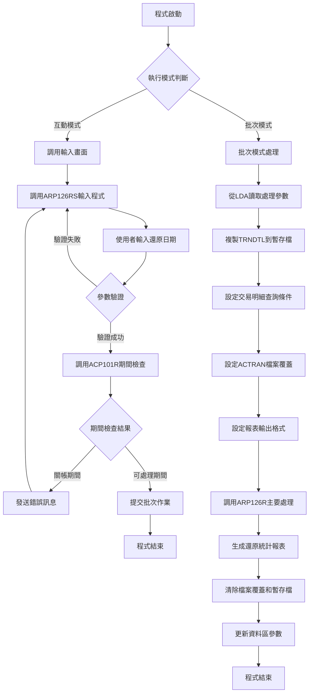
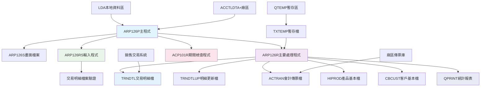
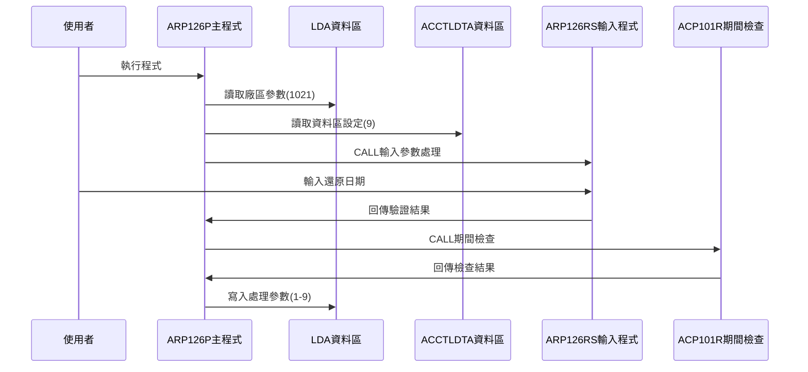
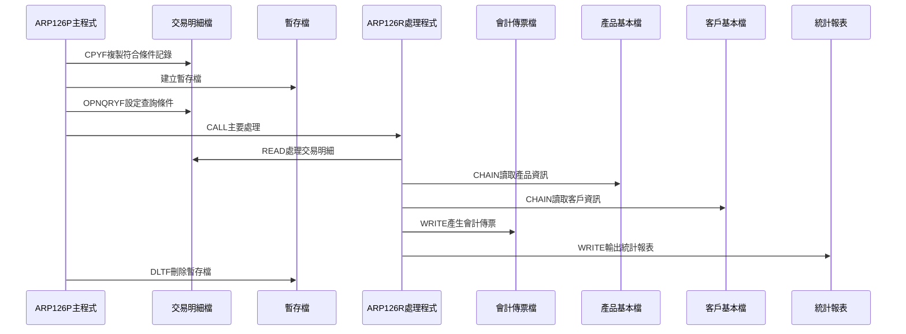
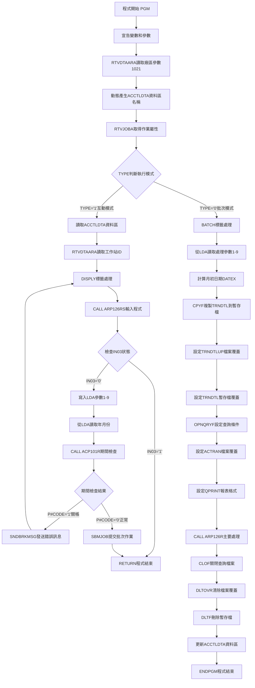

# ARP126P_K02 程式規格書

## 1. 基本資料

| 項目 | 內容 |
|------|------|
| **程式編號** | ARP126P |
| **程式名稱** | 銷售出貨傳票還原作業 |
| **程式類型** | CLP |
| **廠區** | K02 |
| **系統名稱** | 應收帳款系統 |
| **子系統** | 銷售出貨傳票處理 |
| **檔案位置** | K02CLSRC_THSRC/ARP126P.txt |

## 2. 🎯 程式功能說明

### 主要功能描述
此程式為銷售出貨傳票還原作業的控制程式，專門處理銷售出貨交易的傳票還原作業。程式提供互動式參數輸入及批次處理兩種執行模式，透過期間檢查確保會計期間的正確性，並執行完整的傳票還原處理。K02版本具有完整的IFRS支援機制、多廠區交易處理、以及詳細的還原統計報表輸出。程式特別針對銷售出貨業務的SA04交易代碼進行傳票還原，確保銷售業務資料的正確性。

### 🎯 業務流程詳細說明

#### 完整業務流程圖


#### 業務流程關鍵階段說明

**第一階段：執行模式識別與參數收集**
- 透過RTVJOBA檢查執行環境類型(批次或互動)
- 讀取ACCTLDTA+廠區動態資料區設定
- 互動模式時調用ARP126RS程式進行參數輸入
- 收集還原日期、廠區代號等必要參數

**第二階段：期間控制與參數驗證**
- 調用ACP101R程式檢查指定年月份是否已關帳
- 驗證還原日期的合法性和期間狀態
- 確保無法在關帳期間進行傳票還原作業
- 防止違反會計期間控制原則

**第三階段：交易明細檔案篩選準備**
- 複製TRNDTL交易明細到QTEMP/TXTEMP暫存檔
- 設定複合篩選條件：TXVUNO為空白、TXCODE='SA04'、TXACNT≤'3'
- 排除已作廢記錄(TXFLAG≠'D')
- 限定處理日期範圍和廠區條件

**第四階段：查詢條件與檔案環境設定**
- 覆蓋TRNDTLUP到原始TRNDTL檔案
- 覆蓋TRNDTL到暫存檔QTEMP/TXTEMP
- 設定OPNQRYF查詢條件篩選RESV='1J'的記錄
- 動態設定會計傳票檔案名稱(AC+廠區+R)

**第五階段：主要還原處理與傳票產生**
- 調用ARP126R程式執行實際的還原處理
- 讀取符合條件的交易明細記錄
- 產生多種類型的會計傳票記錄
- 處理IFRS相關的會計科目轉換

**第六階段：檔案清理與參數更新**
- 關閉交易明細檔案的開放查詢
- 清除所有檔案覆蓋設定
- 刪除暫存檔QTEMP/TXTEMP
- 更新ACCTLDTA資料區的處理日期參數

#### 🎯 K02版本銷售出貨傳票還原特色
- **SA04交易專精**：專門處理SA04銷售出貨交易代碼
- **IFRS完整支援**：提供完整的IFRS會計科目轉換機制
- **多廠區處理**：支援A廠區特殊處理和標準廠區處理
- **暫存檔機制**：使用QTEMP暫存檔確保處理安全性

#### 多層次驗證機制
- **期間控制驗證**：透過ACP101R程式檢查會計期間狀態
- **日期合法性驗證**：透過UTS102R程式驗證日期格式
- **交易條件驗證**：檢查交易明細的處理條件
- **IFRS版本驗證**：根據IFRS生效日期選擇會計科目

#### 智能處理邏輯
- 自動判斷IFRS版本選擇對應會計科目
- 動態產生會計傳票檔案名稱
- 智能計算傳票號碼範圍(C03001起始)
- 自動統計處理結果並產生報表

#### 資料一致性確保機制
- 透過暫存檔複製確保原始資料不受影響
- 使用複合查詢條件確保只處理符合條件的記錄
- 分階段處理確保各步驟資料同步
- 記錄詳細的操作軌跡供後續查核

#### K02版本銷售出貨專業設計理念
- **銷售業務專精**：專門處理銷售出貨業務的傳票還原
- **交易代碼管控**：限定SA04交易代碼確保處理精度
- **會計整合完整**：提供完整的會計傳票產生機制
- **K02特殊適配**：專為K02廠區的銷售業務特色設計

## 3. 🎯 檔案架構與關聯圖

### 使用檔案清單

| 檔案名稱 | 檔案類型 | 使用方式 | 說明 |
|----------|----------|----------|------|
| **ARP126S** | DSPF | CF/COMBINED | 銷售出貨傳票還原輸入畫面檔案 |
| **TRNDTL** | 邏輯檔 | IP/INPUT | 交易明細主檔案 |
| **TRNDTLUP** | 邏輯檔 | UF/UPDATE | 交易明細更新檔案 |
| **ACTRAN** | 邏輯檔 | UF/UPDATE | 會計傳票檔案(動態對應廠區) |
| **HIPROD** | 邏輯檔 | IF/INPUT | 產品基本資料檔案 |
| **CBCUST** | 邏輯檔 | IF/INPUT | 客戶基本資料檔案 |
| **QPRINT** | PRTF | O/OUTPUT | 銷售出貨還原統計報表 |
| **TXTEMP** | 暫存檔 | - | 交易明細暫存檔案(QTEMP) |

### 🎯 檔案關聯詳細視覺化圖表



### 🎯 K02版本特殊資料流向說明

#### 環境準備階段的資料流向


#### K02銷售出貨傳票還原階段的資料流向


## 4. 🎯 檔案欄位規格說明

### 主要資料結構

#### LDA本地資料區結構(K02版本特殊位置)
| 位置 | 長度 | 欄位名稱 | 用途說明 |
|------|------|----------|----------|
| 1-8 | 8 | 處理日期 | 還原處理日期(YYYYMMDD) |
| 1-4 | 4 | 處理年度 | 還原處理年度(YYYY) |
| 5-2 | 2 | 處理月份 | 還原處理月份(MM) |
| 1-6 | 6 | 年月份 | 處理年月份(YYYYMM) |
| 9-1 | 1 | 廠區代號 | 系統廠區別 |
| 1021-1 | 1 | 廠區代號 | 系統廠區別(備份) |
| 1011-10 | 10 | 工作站ID | 使用者工作站識別 |

#### 動態檔案名稱結構
| 名稱格式 | 用途說明 | 範例 |
|----------|----------|------|
| **ACCTLDTA+廠區** | 動態資料區名稱 | ACCTLDTAK |
| **AC+廠區+R** | 會計傳票檔案名稱 | ACK02R |
| **QTEMP/TXTEMP** | 交易明細暫存檔案 | 固定名稱 |

#### TRNDTL交易明細檔案結構
| 欄位名稱 | 欄位長度 | 欄位型態 | 用途說明 |
|----------|----------|----------|----------|
| **TXVUNO** | 7 | CHAR | 傳票號碼(空白=未產生) |
| **TXCODE** | 4 | CHAR | 交易代碼(SA04=銷售出貨) |
| **TXACNT** | 1 | CHAR | 會計類型(≤3) |
| **TXFLAG** | 1 | CHAR | 作廢標記(D=作廢) |
| **TXACDT** | 8 | CHAR | 交易日期(YYYYMMDD) |
| **TXTXAR** | 1 | CHAR | 交易廠區代號 |
| **TXRESV** | 20 | CHAR | 保留欄位(16-17位='1J') |
| **TXIVNO** | 10 | CHAR | 發票號碼 |
| **TXCUNO** | 10 | CHAR | 客戶代號 |
| **TXUPRC** | 13,4 | PACK | 單價 |
| **TXPDNM** | 30 | CHAR | 產品名稱 |

#### ACTRAN會計傳票檔案結構
| 欄位名稱 | 欄位長度 | 欄位型態 | 用途說明 |
|----------|----------|----------|----------|
| **ACVRNO** | 6 | CHAR | 傳票號碼(C03001起始) |
| **ACITEM** | 3 | CHAR | 項次 |
| **ACAREA** | 1 | CHAR | 廠區代號 |
| **ACYMD** | 8 | CHAR | 傳票日期 |
| **ACDC** | 1 | CHAR | 借貸別 |
| **ACNO** | 6 | CHAR | 會計科目 |
| **ACAMT** | 13,2 | PACK | 傳票金額 |
| **ACCSNM** | 20 | CHAR | 客戶名稱 |

### 🔍 重點欄位切割技術詳解

#### K02版本欄位切割視覺化展示

**LDA本地資料區欄位切割對應圖**：
```
LDA資料區 (1024字元)：[YYYYMMDD|A|...空白區域...|WSID10位元|...空白區域...|A]
位置:                   001      009              1011        1021         1024
                        ↓        ↓                ↓           ↓            ↓
位置001-008:           [YYYYMMDD]                             處理日期(8字元)
位置001-006:           [YYYYMM__]                             年月份(6字元)  
位置001-004:           [YYYY____]                             處理年度(4字元)
位置005-006:               [MM__]                             處理月份(2字元)
位置009-009:                  [A]                            廠區代號(1字元)
位置1011-1020:                      [WSID10位元]             工作站ID(10字元)
位置1021-1021:                                   [A]         廠區代號(1字元)
```

**動態資料區名稱切割邏輯**：
```
資料區名稱模式：'ACCTLDTA' || &AREA
切割組合:       [ACCTLDTA|K] → ACCTLDTAK
                ↓        ↓
固定前綴:      [ACCTLDTA]          固定字串(8字元)
廠區變數:               [K]        廠區代號(1字元)
結果範例:      [ACCTLDTAK]         完整資料區名稱(9字元)
```

**動態檔案名稱切割邏輯**：
```
檔案名稱模式：'AC' || &AREA || 'R'
切割組合:     [AC|K|R] → ACK02R
              ↓  ↓ ↓
固定前綴:    [AC]           固定字串(2字元)
廠區變數:       [K]         廠區代號(1字元) 
固定後綴:         [R]       固定字串(1字元)
結果範例:    [ACK02R]       完整檔案名稱(5字元)
```

#### K02版本切割邏輯詳細說明

**LDA位置切割技術**：
1. **重疊取值技術**：同一區域以不同長度讀取不同用途
   - 位置1-8：完整日期YYYYMMDD
   - 位置1-6：年月份YYYYMM（重疊前6字元）
   - 位置1-4：年度YYYY（重疊前4字元）
   - 位置5-2：月份MM（偏移4位元取2字元）

2. **分散式參數儲存**：將相關參數分散存放在LDA不同區域
   - 前段區域(1-9)：存放處理日期和廠區參數
   - 中段區域(1011-1020)：存放工作站識別資訊
   - 末段區域(1021)：存放廠區控制參數

3. **動態名稱生成技術**：程式動態組合檔案和資料區名稱
   - 資料區名稱：'ACCTLDTA' + 廠區代號
   - 檔案名稱：'AC' + 廠區代號 + 'R'

#### K02版本複合篩選條件切割

**TRNDTL複製條件切割視覺化**：
```
CPYF條件組合：[TXVUNO='       '] AND [TXCODE='SA04'] AND [TXACNT<='3'] 
              AND [TXFLAG!='D'] AND [日期範圍] AND [TXTXAR=&AREA]
              ↓                    ↓                 ↓
條件1:       [未產生傳票]         [銷售出貨交易]      [會計類型限制]
條件2:       [未作廢記錄]         [日期範圍控制]      [廠區匹配]
結果:        [符合條件的交易明細記錄]
```

**OPNQRYF映射欄位切割邏輯**：
```
TXRESV欄位 (20字元)：[...14位前綴...|1J|...2位後綴...]
位置:                 001           016 018          020
                     ↓             ↓   ↓            ↓
位置001-015:        [前綴資料]      [無關資料]
位置016-017:                      [1J]            重要標記(2字元)
位置018-020:                         [後綴]       [其他資料]
映射結果:           RESV = %SST(TXRESV 16 2) = '1J'
```

#### K02版本實際數據範例說明

**LDA資料切割實例**：
```
實際LDA內容範例：
位置001-008: "20241228"     ← 處理日期2024年12月28日
位置001-006: "202412"       ← 年月份2024年12月（重疊取前6字元）
位置001-004: "2024"         ← 處理年度2024年（重疊取前4字元）  
位置005-006: "12"           ← 處理月份12月（偏移第5-6字元）
位置009-009: "K"            ← 廠區代號K02
位置1011-1020: "WS001     " ← 工作站ID
位置1021-1021: "K"          ← 廠區代號K02（備份）
```

**動態名稱生成實例**：
```
&AREA = "K" 時：
- 資料區名稱：'ACCTLDTA' || 'K' = 'ACCTLDTAK'
- 檔案名稱：'AC' || 'K' || 'R' = 'ACK02R'

&AREA = "M" 時：
- 資料區名稱：'ACCTLDTA' || 'M' = 'ACCTLDTAM'
- 檔案名稱：'AC' || 'M' || 'R' = 'ACM01R'
```

**月初日期計算實例**：
```
&YM = "202412" 時：
&DATEX = &YM || '01' = "202412" || "01" = "20241201"
（月初日期：2024年12月1日）
```

**TRNDTL複製條件實例**：
```
&AREA = "K", &DATEA = "20241228", &DATEX = "20241201" 時：
CPYF條件：
- TXVUNO = '       ' (7個空白字元)
- TXCODE = 'SA04' (銷售出貨交易代碼)
- TXACNT <= '3' (會計類型小於等於3)
- TXFLAG != 'D' (非作廢記錄)
- TXACDT <= "20241228" (交易日期小於等於處理日期)
- TXACDT >= "20241201" (交易日期大於等於月初)
- TXTXAR = "K" (交易廠區等於K廠)
```

#### K02版本傳票編號範圍管理邏輯
**K02版本傳票號碼產生**：
```
起始範圍: C03001
編號管理: 透過&D#VNO1、&D#VNO2記錄範圍
自動編號: 從C03001開始遞增
```

#### K02版本IFRS支援機制
**IFRS版本判斷邏輯**：
```
&IFRSD: IFRS生效日期
D#YM: 處理年月
IF D#YM >= &IFRSD THEN
   使用IFRS後會計科目(3511、390101)
ELSE  
   使用IFRS前會計科目(111101)
ENDIF
```

### 🎯 K02版本欄位挪用詳細分析

#### TRNDTL交易明細檔案欄位重點
| 欄位名稱 | 用途說明 | 篩選條件 |
|----------|----------|----------|
| **TXVUNO** | 傳票號碼 | 必須為空白(未產生傳票) |
| **TXCODE** | 交易代碼 | 限定為'SA04'(銷售出貨) |
| **TXACNT** | 會計類型 | 小於等於'3' |
| **TXFLAG** | 作廢標記 | 不可為'D'(已作廢) |
| **TXACDT** | 交易日期 | 介於月初和處理日期間 |
| **TXTXAR** | 交易廠區 | 必須匹配指定廠區 |
| **TXRESV** | 保留欄位 | 第16-17位='1J'用於進階篩選 |
| **TXIVNO** | 發票號碼 | 用於排序鍵值 |
| **TXCUNO** | 客戶代號 | 用於排序鍵值 |
| **TXUPRC** | 單價 | 用於排序鍵值 |
| **TXPDNM** | 產品名稱 | 用於排序鍵值 |

#### ACTRAN會計傳票檔案欄位重點
| 欄位名稱 | 用途說明 | 設定值 |
|----------|----------|--------|
| **傳票檔案名稱** | 動態檔案名稱 | AC+廠區+R（如ACK02R） |
| **ACVRNO** | 傳票號碼 | 自動產生C03001起始 |
| **ACAREA** | 廠區代號 | 對應TRNDTL.TXTXAR |
| **ACYMD** | 傳票日期 | 對應處理日期 |
| **ACNO** | 會計科目 | 根據IFRS版本自動選擇 |

### K02版本重要變數定義表

| 變數名稱 | 類型 | 長度 | 說明 | 使用範圍 |
|----------|------|------|------|----------|
| **&P#YYMM** | CHAR | 6 | 處理年月份(YYYYMM) | 期間檢查 |
| **&P#CODE** | CHAR | 1 | 期間檢查結果('1'=關帳) | ACP101R回傳 |
| **&DATE** | DEC | 8 | 輸入日期數值型 | 使用者輸入 |
| **&DATEA** | CHAR | 8 | 處理日期字串型(YYYYMMDD) | 日期控制 |
| **&DATEB** | CHAR | 8 | 上次處理日期 | ACCTLDTA讀取 |
| **&DATEC** | CHAR | 8 | 本次處理日期 | 更新ACCTLDTA |
| **&DATEX** | CHAR | 8 | 月初日期(YYYYMM01) | 範圍控制 |
| **&AREA** | CHAR | 1 | 廠區代號 | 廠區控制 |
| **&Y** | CHAR | 4 | 處理年度(YYYY) | 年度控制 |
| **&M** | CHAR | 2 | 處理月份(MM) | 月份控制 |
| **&YM** | CHAR | 6 | 年月組合(YYYYMM) | 日期組合 |
| **&DTARA** | CHAR | 11 | 動態資料區名稱 | 資料區控制 |
| **&WSID** | CHAR | 10 | 工作站ID | 使用者識別 |
| **&D#VNO1** | CHAR | 6 | 起始傳票號碼 | 編號管理 |
| **&D#VNO2** | CHAR | 6 | 結束傳票號碼 | 編號管理 |
| **&IFRSD** | CHAR | 8 | IFRS生效日期 | 版本判斷 |
| **&IN03** | LGL | 1 | F3功能鍵指示器 | 畫面控制 |
| **&INT** | CHAR | 1 | 執行模式('1'=互動) | 模式判斷 |
| **&OUTQ** | CHAR | 10 | 輸出佇列名稱 | 批次控制 |

## 5. 🎯 輸出/入螢幕布局

### 螢幕布局完整視覺化

```
+------------------------------------------------------------------------------+
|                     勝群公司銷售出貨傳票還原作業                   ARP126S   |
|                                                                              |
|                                                                              |
|                                                                              |
|                                                                              |
|         還原廠區: [K] ( M:馬鋼 K:高雄 H:其他                               |
|                        L:流化 T:隧道)                                       |
|                                                                              |
|         還原日期: [____/  /  ]                                              |
|                                                                              |
|                                                                              |
|                                                                              |
|                                                                              |
|                                                                              |
|                                                                              |
|                                                                              |
|                                                                              |
|                                                                              |
|                                                                              |
|                                                                              |
|[錯誤訊息顯示區]                                                              |
|     ENTER:執行                       PF03:結束                              |
+------------------------------------------------------------------------------+
```

### 🎯 畫面欄位詳細說明

| 欄位名稱 | 欄位屬性 | 位置 | 長度 | 輸入格式 | 驗證規則 | 說明 |
|----------|----------|------|------|----------|----------|------|
| **COMP** | 顯示 | 1,23 | 35 | 中文字元 | 唯讀 | 公司名稱顯示 |
| **DEVNM** | 顯示 | 2,70 | 10 | 英數字元 | 唯讀 | 設備名稱顯示 |
| **AREA** | 顯示 | 7,36 | 1 | 英文字元 | 唯讀 | 還原廠區代號 |
| **DATE** | 輸入/輸出 | 10,36 | 8 | YYYYMMDD | 日期格式 | 還原處理日期 |
| **ERRMSG** | 顯示 | 23,2 | 70 | 中文字元 | 唯讀 | 錯誤訊息顯示區 |

### 🎯 畫面控制邏輯

#### 指示器控制說明
- **IN03**: F3功能鍵，程式結束
- **IN41**: DATE欄位錯誤時設定，顯示反白和光標
- **IN99**: 有錯誤時設定，重新顯示畫面

#### 欄位顯示屬性
- **DATE**: 使用EDTWRD('    /  /  ')格式顯示
- **AREA**: 顯示廠區代號並提供選項說明
- **ERRMSG**: 固定顯示為HI(高亮度)屬性

### 功能鍵詳細定義

| 功能鍵 | 處理邏輯 | 系統行為 | 說明 |
|--------|----------|----------|------|
| **F3** | 設定IN03='1' | 程式立即返回結束 | 離開程式不執行任何處理 |
| **ENTER** | 執行驗證與處理 | 驗證輸入後提交批次作業 | 執行主要傳票還原邏輯 |

### 輸入驗證機制

#### 日期驗證
- 調用UTS102R程式進行日期格式驗證
- 檢查日期不能大於系統日期
- 自動轉換日期格式為YYYYMMDD

#### 業務邏輯驗證
- 檢查指定日期是否有銷售出貨交易記錄
- 驗證交易明細是否符合還原條件
- 確認SA04交易代碼的存在性

#### K02版本特殊驗證
- 檢查廠區代號與系統設定的一致性
- 驗證ACCTLDTA資料區的可用性
- 確認交易明細檔案的存取權限

### 操作流程
1. 畫面顯示時自動載入系統廠區和公司資訊
2. 使用者輸入還原處理日期(YYYY/MM/DD格式)
3. 按ENTER鍵進行驗證和期間檢查
4. 驗證通過後自動提交批次作業執行處理
5. 驗證失敗則顯示對應錯誤訊息

## 6. 🎯 處理流程程序說明

### 🎯 主程序邏輯深度分析

#### K02版本程式執行流程圖


#### 🎯 K02版本銷售出貨傳票還原特殊步驟分析

**步驟1-5：基礎環境準備**
- 讀取LDA位置1021的廠區參數
- 動態產生ACCTLDTA+廠區的資料區名稱
- 取得作業屬性判斷執行模式
- 準備互動式參數收集環境

**步驟6-7：K02版本參數輸入與驗證**
- 讀取ACCTLDTA資料區的上次處理日期
- 調用ARP126RS程式收集還原參數
- 透過UTS102R驗證日期格式正確性
- 檢查還原日期與系統日期的合理性

**步驟8：期間控制與安全檢查**
- 從LDA讀取年月份參數進行期間檢查
- 調用ACP101R檢查指定期間是否已關帳
- 關帳期間發送錯誤訊息並回到輸入畫面
- 確保還原處理的時機正確性

**步驟9：交易明細檔案篩選準備**
- 計算月初日期(年月+01)作為範圍起始
- 複製TRNDTL到QTEMP/TXTEMP暫存檔
- 設定複合篩選條件：SA04交易代碼、會計類型≤3
- 排除已作廢和已有傳票的記錄

**步驟10：查詢條件與檔案環境設定**
- 覆蓋TRNDTLUP到原始TRNDTL檔案
- 覆蓋TRNDTL到暫存檔確保安全處理
- 設定OPNQRYF查詢RESV='1J'的特定記錄
- 動態設定會計傳票檔案名稱(AC+廠區+R)

**步驟11：主要還原處理與傳票產生**
- 調用ARP126R程式執行實際的還原處理
- 讀取符合條件的交易明細記錄
- 根據IFRS版本產生不同會計科目的傳票
- 統計處理的交易筆數和金額

**步驟12：檔案清理與參數更新**
- 關閉交易明細檔案的開放查詢
- 清除所有檔案覆蓋設定
- 刪除暫存檔QTEMP/TXTEMP
- 更新ACCTLDTA資料區記錄本次處理日期

#### 業務邏輯深度解析

**K02版本銷售出貨傳票還原的核心邏輯**：
1. 專門處理銷售出貨業務的傳票還原作業
2. 支援IFRS版本的會計科目自動轉換
3. 提供完整的交易明細篩選和處理機制
4. 銷售業務專業化處理的完整實現

**K02版本安全控制機制**：
1. 期間控制防止關帳期間處理
2. 暫存檔機制避免直接操作原始檔案
3. 交易條件嚴格篩選確保處理精度
4. 多重驗證機制確保資料完整性

#### 條件判斷詳細說明

**K02版本TRNDTL篩選條件**：
- `TXVUNO *EQ '       '` - 未產生傳票
- `TXCODE *EQ 'SA04'` - 銷售出貨交易
- `TXACNT *LE '3'` - 會計類型限制
- `TXFLAG *NE 'D'` - 未作廢記錄

**K02版本OPNQRYF查詢條件**：
- `RESV *EQ "1J"` - 特定保留標記
- 映射欄位：`%SST(TXRESV 16 2)`

**K02版本IFRS科目轉換邏輯**：
- IFRS前：使用111101科目
- IFRS後：使用3511、390101科目
- 根據TXAREA查表決定具體科目

#### 變數使用和數據流向追蹤

**K02版本特殊變數軌跡**：
1. LDA位置1-9的參數設定軌跡
2. ACCTLDTA動態資料區的使用軌跡
3. 暫存檔TXTEMP的建立和刪除軌跡
4. IFRS版本判斷的處理軌跡

### 🎯 K02版本子程序邏輯分析

#### K02版本子程序調用順序
1. **ARP126RS程式**：互動輸入處理，參數驗證和日期檢查
2. **ACP101R程式**：期間檢查，確保會計期間可處理
3. **ARP126R程式**：主要還原處理，傳票產生和統計報表
4. **UTS102R程式**：日期驗證(在ARP126RS中調用)

#### K02版本銷售出貨專精設計
- 專門處理銷售出貨業務的傳票還原作業
- 支援SA04交易代碼的專業處理機制
- 提供完整的IFRS版本支援和科目轉換
- 針對K02廠區的銷售業務特色進行優化

### 🎯 K02版本銷售出貨傳票還原處理邏輯

#### K02版本TRNDTL複製條件邏輯
```sql
CPYF FROMFILE(TRNDTL) TOFILE(QTEMP/TXTEMP)
     INCREL((*IF TXVUNO *EQ '       ') 
            (*AND TXCODE *EQ 'SA04') 
            (*AND TXACNT *LE '3') 
            (*AND TXFLAG *NE 'D') 
            (*AND TXACDT *LE &DATEA) 
            (*AND TXACDT *GE &DATEX) 
            (*AND TXTXAR *EQ &AREA))
```

#### K02版本查詢條件設定邏輯
```sql
OPNQRYF FILE(TRNDTL) OPTION(*ALL) 
        QRYSLT('(RESV *EQ "1J")')                      
        KEYFLD((TXACDT) (TXIVNO) (TXCUNO) (TXUPRC) (TXPDNM))  
        MAPFLD((RESV '%SST(TXRESV 16 2)'))
```

#### K02版本動態檔案設定邏輯
```sql
OVRDBF FILE(ACTRAN) TOFILE(('AC' || &AREA || 'R')) LVLCHK(*NO)
```
- 動態產生會計傳票檔案名稱
- 例如：K02廠區 → ACK02R
- 關閉層級檢查確保相容性

#### K02版本報表輸出設定邏輯
```sql
OVRPRTF FILE(QPRINT) TOFILE(QPRINT) 
        PAGESIZE(*N 176) CPI(13.3) COPIES(1)
```
- 設定176欄位寬度適應寬報表輸出
- 使用13.3 CPI確保報表美觀
- 設定單份列印

## 7. 🎯 數據操作與轉換分析

### K02版本檔案操作詳解

#### K02版本TRNDTL交易明細檔操作
- **CPYF操作**：複製符合條件的交易明細到暫存檔
- **OVRDBF操作**：覆蓋原始檔案到暫存檔確保安全
- **OPNQRYF操作**：設定查詢條件篩選特定記錄
- **READ操作**：讀取符合條件的交易明細記錄

#### K02版本ACTRAN會計傳票檔操作
- **動態檔案名稱**：根據廠區動態產生AC+廠區+R格式
- **WRITE操作**：產生多種類型的會計傳票記錄
- **傳票編號管理**：使用C03001起始的自動編號
- **IFRS科目轉換**：根據IFRS版本選擇會計科目

### K02版本數據轉換邏輯

#### K02版本日期參數轉換
- **輸入日期處理**：DATE轉換為DATEA 8位日期格式
- **年度提取**：Y = %SST(DATEA 1 4)，取前4位作為年度
- **月份提取**：M = %SST(DATEA 5 2)，取5-6位作為月份
- **年月組合**：YM = %SST(DATEA 1 6)，取前6位作為年月
- **月初計算**：DATEX = YM + '01'，計算月初日期

#### K02版本傳票號碼轉換
- **起始範圍**：C03001作為傳票號碼起始值
- **自動編號**：從C03001開始依序遞增
- **編號管理**：透過NO1、NO2、NO3變數管理
- **範圍追蹤**：使用D#VNO1、D#VNO2記錄編號範圍

### K02版本檢核機制詳解

#### K02版本銷售出貨業務檢核
- **交易代碼檢查**：確保只處理SA04銷售出貨交易
- **傳票狀態檢查**：驗證交易明細尚未產生傳票
- **會計類型檢查**：限制會計類型小於等於3
- **作廢狀態檢查**：排除已作廢的交易記錄

#### K02版本IFRS合規檢核
- **IFRS版本檢查**：根據處理年月與IFRS生效日期比較
- **科目對應檢查**：驗證會計科目的正確轉換
- **版本追蹤**：記錄IFRS處理的詳細軌跡
- **合規性確保**：確保會計處理符合IFRS標準

#### K02版本資料完整性檢核
- **日期合法性檢查**：透過UTS102R確保日期格式正確
- **廠區匹配檢查**：驗證交易明細與指定廠區的匹配
- **金額範圍檢查**：確保交易金額在合理範圍內
- **檔案存在性檢查**：驗證所需檔案的存在和可用性

## 8. 🎯 錯誤處理程序說明

### 🎯 K02版本詳細錯誤代碼清冊

| 錯誤代碼 | 錯誤訊息 | 原因說明 | 處理方式 | 預防措施 |
|----------|---------|---------|---------|----------|
| **ERR,1** | 日期輸入錯誤 | UTS102R驗證日期格式失敗 | 1. 顯示錯誤訊息<br>2. 設定IN41指示器<br>3. 重新輸入日期 | 提供日期格式說明(YYYY/MM/DD) |
| **ERR,2** | 大於系統日期 | 輸入日期超過當前系統日期 | 1. 顯示錯誤訊息<br>2. 設定IN41指示器<br>3. 重新輸入日期 | 提供系統日期參考 |
| **ERR,3** | 交易明細異常 | 指定日期範圍內無SA04交易記錄 | 1. 檢查交易明細檔案<br>2. 確認SA04交易存在<br>3. 驗證日期範圍設定 | 確認銷售出貨交易資料完整性 |
| **關帳期間錯誤** | 該月份已月結，請與相關人員聯繫！ | ACP101R檢查發現指定期間已關帳 | 1. SNDBRKMSG發送訊息<br>2. GOTO DISPLY重新輸入<br>3. 選擇其他可處理期間 | 提供期間狀態查詢功能 |
| **檔案操作失敗** | TRNDTL/ACTRAN檔案存取異常 | 檔案權限或存在性問題 | 1. 檢查檔案存在性<br>2. 確認存取權限<br>3. 驗證檔案覆蓋設定 | 定期檢查檔案狀態和權限 |
| **暫存檔建立失敗** | QTEMP/TXTEMP建立異常 | 暫存空間或權限問題 | 1. 檢查QTEMP空間<br>2. 確認建立權限<br>3. 清理暫存空間 | 監控暫存空間使用狀況 |
| **傳票號碼耗盡** | C03001起始範圍已滿 | 當月傳票號碼已使用完畢 | 1. 檢查傳票號碼使用狀況<br>2. 清理無效傳票<br>3. 聯繫系統管理員擴充範圍 | 監控傳票號碼使用狀況 |
| **IFRS處理失敗** | IFRS版本檢查異常 | ARIFRSCTL或版本判斷失敗 | 1. 檢查IFRS生效日期設定<br>2. 確認版本判斷邏輯<br>3. 驗證IFRS處理流程 | 確保IFRS相關設定正確 |
| **產品資料缺失** | HIPROD產品檔案讀取失敗 | 產品基本檔案不存在或損壞 | 1. 檢查產品檔案完整性<br>2. 確認產品代號正確<br>3. 重建產品索引檔案 | 定期備份和檢查產品檔案 |
| **客戶資料錯誤** | CBCUST客戶檔案讀取異常 | 客戶基本檔案存取問題 | 1. 檢查客戶檔案狀態<br>2. 確認客戶代號設定<br>3. 驗證檔案結構完整性 | 確保客戶檔案資料正確性 |
| **報表輸出失敗** | QPRINT報表產生異常 | 報表檔案或印表機問題 | 1. 檢查印表機狀態<br>2. 確認報表檔案可用<br>3. 驗證輸出設定 | 定期檢查報表輸出環境 |
| **LDA參數錯誤** | 1-9位置參數異常 | LDA參數讀寫失敗 | 1. 檢查LDA參數設定<br>2. 確認1-9位置可用<br>3. 驗證參數傳遞邏輯 | 確保LDA參數空間正確配置 |
| **資料區異常** | ACCTLDTA資料區存取失敗 | 動態資料區讀寫問題 | 1. 檢查資料區存在性<br>2. 確認動態名稱正確<br>3. 驗證存取權限 | 確保資料區正確配置 |

### 🎯 K02版本系統異常處理邏輯

#### K02版本檔案操作失敗處理
- **交易明細檔案異常**：檢查TRNDTL檔案的可用性和完整性
- **會計傳票檔案異常**：確認動態檔案名稱的正確性
- **暫存檔案異常**：處理QTEMP/TXTEMP暫存檔的建立問題
- **產品檔案異常**：處理HIPROD產品基本檔的讀取問題
- **客戶檔案異常**：處理CBCUST客戶基本檔的存取問題

#### K02版本程式調用失敗處理
- **輸入程式調用失敗**：處理ARP126RS的調用異常
- **期間檢查調用失敗**：處理ACP101R程式的調用問題
- **主要處理調用失敗**：處理ARP126R的調用異常
- **日期驗證調用失敗**：處理UTS102R的調用問題

#### K02版本資料完整性錯誤處理
- **交易明細異常**：處理SA04交易代碼和狀態的異常情況
- **傳票編號異常**：處理C03001起始範圍的異常
- **日期範圍異常**：處理日期計算和範圍的異常
- **廠區條件異常**：處理廠區條件設定的異常

#### K02版本銷售出貨業務失敗處理
- **還原邏輯失敗**：處理銷售出貨傳票還原業務邏輯的異常
- **IFRS處理失敗**：處理IFRS版本判斷和科目轉換的失敗
- **統計計算失敗**：處理交易筆數和金額統計的異常
- **報表輸出失敗**：處理統計報表輸出的異常

## 9. 🎯 備註

### 🎯 K02版本銷售出貨傳票還原特殊注意事項

#### K02版本作為銷售出貨處理平台
- 專門處理銷售出貨業務的傳票還原作業，確保銷售資料的正確性
- 使用SA04專用交易代碼確保處理範圍的精確性
- 支援完整的IFRS版本轉換機制確保會計合規性
- 提供完整的還原統計報表確保處理結果的可追蹤性

#### K02版本交易代碼專精管理
- **SA04專用**：專門處理SA04銷售出貨交易代碼
- **會計類型限制**：限定會計類型小於等於3確保處理範圍
- **狀態檢查**：僅處理尚未產生傳票且未作廢的交易
- **完整性保證**：確保交易還原的完整性和可追蹤性

#### K02版本暫存檔機制
- **安全處理**：使用QTEMP/TXTEMP暫存檔避免直接操作原始檔案
- **條件篩選**：透過CPYF複製符合條件的交易明細
- **查詢優化**：使用OPNQRYF進一步篩選RESV='1J'的記錄
- **資源清理**：處理完成後自動刪除暫存檔案

#### K02版本IFRS支援機制
- **版本判斷**：透過D#YM與D#IFYM比較判斷IFRS版本
- **科目轉換**：IFRS前使用111101，IFRS後使用3511/390101
- **對應表機制**：使用TAB1/TAB2對應表根據TXAREA決定科目
- **合規追蹤**：記錄IFRS處理的詳細軌跡

#### K02版本動態資料區管理
- 使用動態產生的ACCTLDTA+廠區資料區名稱
- 例如：ACCTLDTAK (K廠區)、ACCTLDTAM (M廠區)
- 支援多廠區的獨立資料區管理
- 記錄上次處理日期供下次處理參考

#### K02版本會計傳票產生機制
- **多類型傳票**：產生WR#01、WR#02、WR#03、WR#04多種傳票
- **科目對應**：根據IFRS版本和業務區域選擇會計科目
- **客戶整合**：透過CBCUST取得客戶名稱資訊
- **產品整合**：透過HIPROD取得產品名稱資訊

#### K02版本版本演進特色
- **0703A版本**：基礎銷售出貨傳票還原功能(2018AR1144)
- **1202A版本**：新增列印系統功能(2023AR00006)
- 體現了銷售出貨傳票還原功能的持續完善
- 反映了K02廠區業務需求的發展歷程

#### K02版本報表輸出特色
- **寬版報表設計**：176欄位寬度確保資訊完整顯示
- **字型密度控制**：13.3 CPI設定確保報表美觀
- **統計資訊豐富**：提供完整的還原統計和明細資訊
- **分類統計詳細**：按交易類型分類統計金額和筆數

#### K02版本廠區處理特殊機制
- **A廠區特殊處理**：當TXAREA='A'時使用TXAR作為廠區代號
- **標準廠區處理**：其他廠區直接使用原始廠區代號
- **動態檔案名稱**：根據廠區動態產生AC+廠區+R格式檔案名稱
- **統一處理邏輯**：確保不同廠區的處理邏輯一致性

#### K02版本錯誤處理策略
- 提供詳細的業務邏輯錯誤訊息和處理建議
- 使用指示器控制錯誤欄位的顯示狀態
- 透過SNDBRKMSG確保關帳期間錯誤的即時通知
- 提供明確的操作指導和錯誤解決方案

#### K02版本作為銷售出貨處理平台的設計理念
- **業務專精**：專門處理銷售出貨業務的傳票還原，與其他業務明確區分
- **交易管控**：使用SA04交易代碼確保處理範圍的精確性
- **IFRS合規**：提供完整的IFRS支援確保會計處理的國際合規性
- **K02適配**：專為K02廠區的銷售出貨業務特色設計

#### K02版本銷售出貨傳票還原業務特色
- 專門處理銷售出貨相關的傳票還原作業
- 支援多種會計科目的傳票產生機制
- 確保銷售出貨傳票還原的精確性和可追蹤性
- 提供完整的期間控制和業務檢查機制

#### K02版本系統整合特性
- 與UTS102R日期驗證系統緊密整合
- 與ACP101R期間控制系統完全相容
- 支援批次作業佇列的標準化處理
- 與K02廠區檔案系統和客戶系統無縫銜接

#### K02版本使用注意事項
- 執行前確保當月銷售出貨交易資料已建檔完成
- 注意關帳期間無法執行此還原作業
- 確認SA04交易代碼的交易明細符合還原條件
- 銷售出貨傳票還原涉及會計處理需特別注意完整性
- 注意IFRS版本的會計科目轉換正確性
- 確保暫存檔空間QTEMP有足夠容量
- 處理完成後檢查ACCTLDTA資料區的日期更新
- 留意176欄位寬版報表的列印設定 