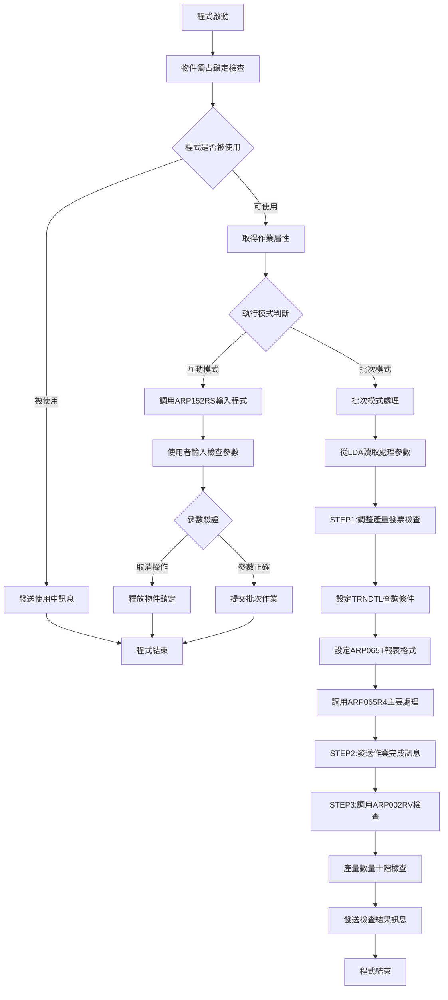
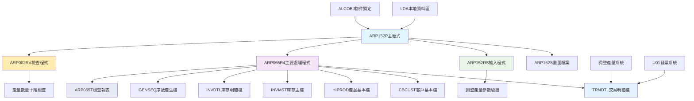
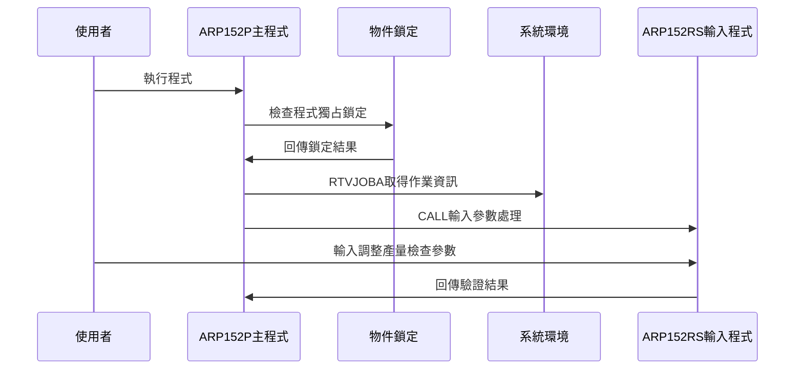
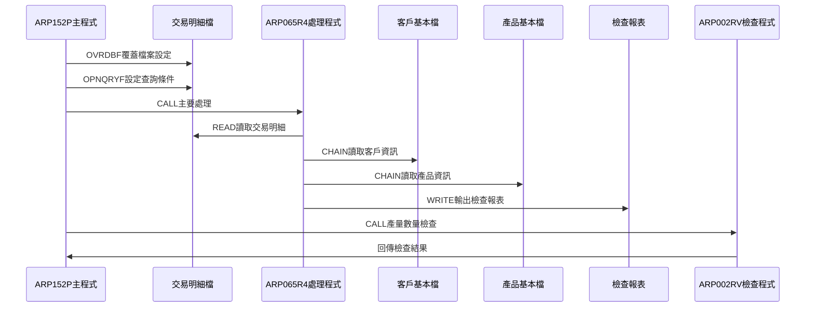
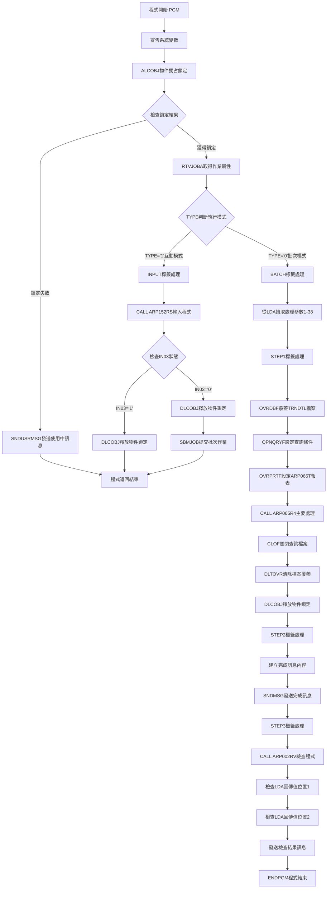

# ARP152P_U01 程式規格書

## 1. 基本資料

| 項目 | 內容 |
|------|------|
| **程式編號** | ARP152P |
| **程式名稱** | 調整產量發票檢查作業 |
| **程式類型** | CLP |
| **廠區** | U01 |
| **系統名稱** | 應收帳款系統 |
| **子系統** | 調整產量發票檢查與控制 |
| **檔案位置** | U01CLSRC_THSRC/ARP152P.txt |

## 2. 🎯 程式功能說明

### 主要功能描述
此程式為調整產量發票檢查作業的控制程式，專門處理AR05交易代碼的調整產量發票檢查與驗證。程式提供互動式參數輸入功能，透過對交易明細檔案(TRNDTL)的檢查，自動識別和驗證調整產量發票的正確性。U01版本具有完整的調整產量控制機制、多重發票檢查功能、以及詳細的檢查報表輸出。程式特別針對調整產量業務設計，確保調整產量發票的準確性和合規性，同時提供完整的檢查軌跡和通知機制。

### 🎯 業務流程詳細說明

#### 完整業務流程圖


#### 業務流程關鍵階段說明

**第一階段：程式安全性控制與環境初始化**
- 使用ALCOBJ進行程式物件獨占鎖定檢查
- 確保同一時間只能有一個使用者執行此程式
- 被使用時發送訊息通知使用者和管理者
- 取得作業相關資訊判斷執行模式

**第二階段：互動式參數收集與驗證**
- 調用ARP152RS程式進行參數輸入
- 使用者輸入檢查廠區、發票日期、產量編號範圍
- 驗證參數的合法性和有效性
- 提供取消操作和參數重新設定功能

**第三階段：批次模式參數讀取與環境設定**
- 從LDA讀取廠區代號(位置1)
- 從LDA讀取發票日期(位置11-18)
- 從LDA讀取產量編號起始(位置21-28)
- 從LDA讀取產量編號結束(位置31-38)

**第四階段：STEP1 調整產量發票檢查處理**
- 覆蓋TRNDTL交易明細檔案並設定共享模式
- 設定OPNQRYF查詢條件篩選AR05交易代碼
- 篩選指定廠區、發票號碼範圍、未作廢記錄
- 排除客戶代號第一位為'E'的記錄

**第五階段：報表產生與主要處理執行**
- 設定ARP065T報表格式(198欄位寬度)
- 調用ARP065R4程式執行實際的檢查處理
- 產生調整產量發票檢查報表
- 關閉查詢檔案並清除檔案覆蓋

**第六階段：STEP2 作業完成訊息發送**
- 建立作業完成訊息內容
- 從LDA讀取發票編號(位置51-58)
- 發送包含發票編號的完成訊息給使用者
- 提供作業執行狀態的即時通知

**第七階段：STEP3 產量數量檢查與通知**
- 調用ARP002RV程式進行產量數量十階檢查
- 檢查調整產量數據的合理性
- 根據檢查結果發送相應的通知訊息
- 提供詳細的檢查結果回饋

#### 🎯 U01版本調整產量發票檢查特色
- **AR05專精**：專門處理AR05調整產量交易代碼
- **物件鎖定保護**：確保程式執行的獨占性和安全性
- **數量十階檢查**：提供完整的產量數量合理性檢查
- **198欄位寬報表**：使用寬版報表確保資訊完整顯示

#### 多層次檢查機制
- **程式獨占檢查**：透過ALCOBJ確保程式執行安全性
- **參數合法性檢查**：透過ARP152RS驗證輸入參數
- **交易條件檢查**：檢查AR05交易和發票狀態
- **產量數量檢查**：透過ARP002RV檢查數量合理性

#### 智能處理邏輯
- 自動判斷調整產量發票的處理狀態
- 動態篩選符合條件的交易記錄
- 智能識別異常發票並進行檢查
- 自動統計檢查結果並產生報表

#### 資料一致性確保機制
- 透過物件鎖定確保程式執行的獨占性
- 使用查詢條件確保只處理符合條件的記錄
- 分階段處理確保各步驟資料同步
- 記錄詳細的處理軌跡供後續查核

#### U01版本調整產量發票檢查專業設計理念
- **調整產量專精**：專門處理調整產量業務的發票檢查，與其他業務明確區分
- **檢查機制完整**：提供完整的發票檢查和產量驗證機制
- **報表功能豐富**：提供詳細的檢查報表和統計資訊
- **U01特殊適配**：專為U01廠區的調整產量業務特色設計

## 3. 🎯 檔案架構與關聯圖

### 使用檔案清單

| 檔案名稱 | 檔案類型 | 使用方式 | 說明 |
|----------|----------|----------|------|
| **ARP152S** | DSPF | CF/COMBINED | 調整產量發票檢查輸入畫面檔案 |
| **TRNDTL** | 邏輯檔 | IF/INPUT | 交易明細檔案(調整產量檢查) |
| **GENSEQ** | 邏輯檔 | UF/UPDATE | 系統序號產生檔案 |
| **CBCUST** | 邏輯檔 | IF/INPUT | 客戶基本資料檔案 |
| **HIPROD** | 邏輯檔 | IF/INPUT | 產品基本資料檔案 |
| **INVMST** | 邏輯檔 | O/OUTPUT | 庫存主檔案 |
| **INVDTL** | 邏輯檔 | O/OUTPUT | 庫存明細檔案 |
| **ARP065T** | PRTF | O/OUTPUT | 調整產量發票檢查報表 |

### 🎯 檔案關聯詳細視覺化圖表



### 🎯 U01版本特殊資料流向說明

#### 環境準備階段的資料流向


#### U01版本調整產量檢查階段的資料流向


## 4. 🎯 檔案欄位規格說明

### 主要資料結構

#### CLP程式變數架構分析
ARP152P作為調整產量發票檢查控制程式，採用CLP架構處理變數宣告與邏輯控制：

| 變數類型 | 宣告數量 | 主要用途 | 範圍說明 |
|----------|----------|----------|----------|
| **系統控制變數** | 4個 | 作業環境取得 | INT、OUTQ、USER、IN03 |
| **業務處理變數** | 6個 | 調整產量檢查 | W#DATE、W#AREA、W#NOS等 |
| **LDA區域變數** | 8個區段 | 參數傳遞 | 位置1-51的分段使用 |

### 🔍 重點欄位切割技術詳解

#### LDA本地資料區結構完整分析
ARP152P程式大量使用LDA進行參數傳遞，採用分段式儲存架構：

##### LDA資料結構切割分析
```
LDA本地資料區 (1024字元空間)：[______________________LDA切割區______________________]
位置範圍:                      1    11   21   31   51
                               ↓     ↓    ↓    ↓    ↓
廠區代號(1-1):                [F]                         廠區識別(1字元)
檢查日期(11-8):                   [YYYYMMDD]              發票檢查日期(8字元)  
起始編號(21-8):                        [NNNNNNNN]         產量起始編號(8字元)
結束編號(31-8):                              [NNNNNNNN]   產量結束編號(8字元)
發票編號(51-8):                                    [IIIIIIII] 已檢查發票編號(8字元)
```

**欄位切割視覺化展示**：
```
LDA資料結構完整配置：
位置: 001 002    011       019      021       029      031       039      051       059
      |F |<預留> |YYYYMMDD |<預留>   |NNNNNNNN |<預留>   |NNNNNNNN |<預留>   |IIIIIIII |<預留>
      [廠][____] [檢查日期] [____]   [起始編號] [____]   [結束編號] [____]   [發票編號] [____]
```

**切割邏輯詳細說明**：
- **W#AREA (位置1)**: 廠區代號儲存，用於識別處理廠區(P/M/H/K/U)
- **W#DATE (位置11-18)**: 發票檢查日期，格式YYYYMMDD，控制檢查範圍
- **W#NOS (位置21-28)**: 產量起始編號，8字元數字，定義檢查範圍下限
- **W#NOE (位置31-38)**: 產量結束編號，8字元數字，定義檢查範圍上限
- **W#IVNO (位置51-58)**: 發票編號儲存，用於訊息回報和追蹤

**實際數據範例說明**：
```
範例資料設定:
├── W#AREA = 'U' (U01廠區)
├── W#DATE = '20241228' (2024年12月28日檢查)  
├── W#NOS = '00001001' (起始產量編號)
├── W#NOE = '00001999' (結束產量編號)
└── W#IVNO = 'IV240001' (發票編號)

在程式中的應用:
- 查詢條件: TXTXAR *EQ "U" (廠區篩選)
- 編號範圍: TXNO *GE "00001001" *AND TXNO *LE "00001999"
- 訊息回報: '調整產量發票檢查作業處理完成！發票編號IV240001完成'
```

#### OPNQRYF查詢條件結構分析
程式使用複合式查詢條件進行交易明細檔篩選：

##### 查詢條件欄位切割
```
QRYSLT查詢字串 (複合條件)：[交易代號|產量編號範圍|廠區|客戶|狀態|發票|保留欄位]
                           ↓      ↓        ↓  ↓  ↓  ↓     ↓
TXCODE條件:               [AR05]                            交易代號固定
TXNO範圍條件:                   [起始~結束]                 產量編號範圍
TXTXAR條件:                           [F]                  廠區代號
客戶排除條件:                           [非E開頭]           排除特殊客戶
TXFLAG條件:                                [非D]            排除刪除記錄
TXFL02條件:                                   [空白]        特殊標記
TXIVNO條件:                                     [空白]      未產生發票
CHAR映射條件:                                      [非D]    保留欄位檢查
```

### 🎯 欄位挪用詳細分析

#### 挪用情況對比表
| 原始欄位定義 | 實際使用方式 | 挪用類型 | 挪用原因 |
|-------------|-------------|----------|----------|
| **LDA一般資料區** | 參數傳遞專用區 | 功能擴充 | CLP程式間參數傳遞需求 |
| **W#MSGT訊息變數** | 動態訊息組合 | 字串處理 | 彈性訊息內容建構 |
| **TXRESV保留欄位** | 額外條件判斷 | 條件擴充 | 業務邏輯篩選需求 |
| **USRDTA使用者資料** | 報表識別標記 | 標記擴充 | 報表分類管理 |

#### 挪用原因深度分析
1. **LDA資料區挪用**：
   - **原因**：CLP程式缺乏全域變數機制，需透過LDA進行程式間參數傳遞
   - **業務需求**：調整產量檢查需要在多個程式間共享檢查參數
   - **實現方式**：將檢查條件分段儲存在LDA的特定位置

2. **TXRESV欄位挪用**：
   - **原因**：交易明細檔原始設計未包含所需的額外篩選條件
   - **業務需求**：需要額外的業務邏輯判斷來精確篩選交易記錄
   - **實現方式**：使用%SST函數擷取TXRESV第15位元作為判斷條件

3. **訊息變數動態組合**：
   - **原因**：固定訊息無法滿足動態資訊顯示需求
   - **業務需求**：需要在訊息中包含實際處理的發票編號
   - **實現方式**：使用*TCAT操作符進行字串連接

#### 挪用方式詳細說明
1. **LDA分段儲存法**：
   ```
   RTVDTAARA DTAARA(*LDA (位置 長度)) RTNVAR(&變數)
   - 位置1：廠區代號
   - 位置11：檢查日期  
   - 位置21：起始編號
   - 位置31：結束編號
   - 位置51：發票編號
   ```

2. **欄位映射技術**：
   ```
   MAPFLD((CHAR '%SST(TXRESV 15 1)' *CHAR 1))
   - 將TXRESV第15位元映射為CHAR欄位
   - 用於查詢條件的額外判斷
   ```

3. **動態字串組合**：
   ```
   CHGVAR VAR(&W#MSGT) VALUE(&W#MSGT *TCAT &W#IVNO || '完成')
   - 將固定訊息與變數內容動態組合
   - 提供具體的處理結果回報
   ```

#### 挪用影響評估
1. **系統維護影響**：
   - **正面影響**：提升程式彈性，滿足複雜業務需求
   - **風險**：LDA位置固定，修改時需確保所有相關程式同步更新
   - **建議**：建立LDA使用對照表，統一管理位置分配

2. **效能影響**：
   - **OPNQRYF複合條件**：可能影響查詢效能，但確保資料準確性
   - **字串處理操作**：訊息組合處理負擔輕微
   - **LDA存取效率**：本地資料區存取速度快，對效能影響極小

### 重要變數定義表

#### 系統控制變數群組
| 變數名稱 | 型態 | 長度 | 說明 | 使用範圍 |
|----------|------|------|------|----------|
| **&INT** | *CHAR | 1 | 作業類型識別 | 0=批次/1=互動 |
| **&OUTQ** | *CHAR | 10 | 輸出佇列名稱 | 批次作業提交用 |
| **&USER** | *CHAR | 10 | 使用者名稱 | 訊息發送對象 |
| **&IN03** | *LGL | 1 | 結束指示器 | F3功能鍵控制 |

#### 業務處理變數群組
| 變數名稱 | 型態 | 長度 | 說明 | 資料範例 |
|----------|------|------|------|----------|
| **&W#DATE** | *CHAR | 8 | 發票檢查日期 | '20241228' |
| **&W#AREA** | *CHAR | 1 | 廠區代號 | 'U'(U01廠區) |
| **&W#NOS** | *CHAR | 8 | 產量起始編號 | '00001001' |
| **&W#NOE** | *CHAR | 8 | 產量結束編號 | '00001999' |
| **&W#RTNV** | *CHAR | 1 | 回傳值 | 'T'=警告/'F'=正常 |
| **&W#IVNO** | *CHAR | 8 | 發票編號 | 'IV240001' |
| **&W#MSGT** | *CHAR | 200 | 訊息文字 | 動態組合訊息內容 |

#### 程式呼叫參數對應表
| 被呼叫程式 | 參數傳遞方式 | 主要功能 | 回傳處理 |
|------------|--------------|----------|----------|
| **ARP152RS** | PARM(&IN03) | 參數輸入與驗證 | F3結束控制 |
| **ARP065R4** | 直接呼叫 | 主要檢查處理 | LDA結果儲存 |
| **ARP002RV** | 直接呼叫 | 產量數量十階檢查 | LDA警告標記 |

#### LDA使用區段定義表
| 位置範圍 | 變數對應 | 資料型態 | 用途說明 | 相關程式 |
|----------|----------|----------|----------|----------|
| **1-1** | &W#AREA | CHAR(1) | 廠區代號 | 主程式、檢查程式 |
| **2-2** | &W#RTNV | CHAR(1) | 三重檢查回傳值 | ARP002RV |
| **3-10** | &W#IVNO | CHAR(8) | 三重警告發票編號 | ARP002RV |
| **11-18** | &W#DATE | CHAR(8) | 檢查日期 | 主程式、子程式 |
| **11-18** | &W#IVNO | CHAR(8) | 二重警告發票編號 | ARP002RV |
| **21-28** | &W#NOS | CHAR(8) | 起始編號 | 主程式、查詢條件 |
| **31-38** | &W#NOE | CHAR(8) | 結束編號 | 主程式、查詢條件 |
| **51-58** | &W#IVNO | CHAR(8) | 處理完成發票編號 | 結果回報 |

## 5. 🎯 輸出/入螢幕布局

### 螢幕布局完整視覺化

```
+------------------------------------------------------------------------------+
|[日期]                東鋼鋼鐵股份有限公司                          ARP152S   |
|[時間]             調整產量發票檢查作業                          [設備名稱]   |
|                                                                              |
|                                                                              |
|        檢查廠區: [_] ( P台鋼-M台鋼-H其他--K高雄-U新鋼)                      |
|                                                                              |
|        發票日期: [____/  /  ] (請輸入欲檢查的最早檢查日期)                   |
|                                                                              |
|        產量編號: [______] ~ [______]                                         |
| ---------------------------------------------------------------------------  |
|        編號    起始    結束    數量    目前級別                              |
|                                                                              |
| 二重:  [__]  [________] [________] [________] [______]                       |
|                                                                              |
| 三重:  [__]  [________] [________] [________] [______]                       |
| ---------------------------------------------------------------------------  |
|                                                                              |
|        發票已檢查日期: [____/  /  ]                                          |
|                                                                              |
|                                                                              |
|           F3:結束          F12:回退           ENTER:檢查          F10:清除    |
|[錯誤訊息顯示區]                                                              |
+------------------------------------------------------------------------------+
```

### 🎯 畫面欄位詳細說明

| 欄位名稱 | 欄位屬性 | 位置 | 長度 | 輸入格式 | 驗證規則 | 說明 |
|----------|----------|------|------|----------|----------|------|
| **S#COMP** | 顯示 | 1,23 | 35 | 中文字元 | 唯讀 | 公司名稱顯示 |
| **S#DEVI** | 顯示 | 2,70 | 10 | 英數字元 | 唯讀 | 設備名稱顯示 |
| **S#AREA** | 輸入/輸出 | 5,30 | 1 | 英文字元 | 廠區代號 | 檢查廠區代號 |
| **S#DATE** | 輸入/輸出 | 7,32 | 8 | YYYYMMDD | 日期格式 | 發票檢查日期 |
| **S#NOS** | 輸入/輸出 | 9,29 | 6 | 英數字元 | 產量編號 | 產量編號起始 |
| **S#NOE** | 輸入/輸出 | 9,37 | 6 | 英數字元 | 產量編號 | 產量編號結束 |
| **S#PRE2** | 顯示 | 13,16 | 2 | 英數字元 | 唯讀 | 二重產品代號 |
| **S#STN2** | 顯示 | 13,25 | 8 | 數字 | 唯讀 | 二重起始編號 |
| **S#ENN2** | 顯示 | 13,39 | 8 | 數字 | 唯讀 | 二重結束編號 |
| **S#CUN2** | 顯示 | 13,53 | 8 | 數字 | 唯讀 | 二重數量 |
| **S#LEV2** | 顯示 | 13,67 | 8 | 數字 | 唯讀 | 二重等級 |
| **S#PRE3** | 顯示 | 15,16 | 2 | 英數字元 | 唯讀 | 三重產品代號 |
| **S#STN3** | 顯示 | 15,25 | 8 | 數字 | 唯讀 | 三重起始編號 |
| **S#ENN3** | 顯示 | 15,39 | 8 | 數字 | 唯讀 | 三重結束編號 |
| **S#CUN3** | 顯示 | 15,53 | 8 | 數字 | 唯讀 | 三重數量 |
| **S#LEV3** | 顯示 | 15,67 | 8 | 數字 | 唯讀 | 三重等級 |
| **S#XDAT** | 顯示 | 18,38 | 8 | YYYYMMDD | 唯讀 | 發票已檢查日期 |
| **S#MSG1** | 顯示 | 24,2 | 70 | 中文字元 | 唯讀 | 錯誤訊息顯示區 |

### 🎯 畫面控制邏輯

#### 指示器控制說明
- **IN03**: F3功能鍵，程式結束
- **IN10**: F10功能鍵，清除輸入資料
- **IN12**: F12功能鍵，回到上一個畫面
- **IN51**: S#AREA欄位錯誤時設定，顯示反白和光標
- **IN52**: S#DATE欄位錯誤時設定，顯示反白和光標
- **IN53**: S#DATE欄位錯誤時設定，顯示反白
- **IN54**: S#NOS欄位錯誤時設定，顯示反白和光標
- **IN55**: S#NOE欄位錯誤時設定，顯示反白和光標

#### 產量統計顯示區域
- **二重統計區域**：顯示二重產品的編號範圍、數量和等級資訊
- **三重統計區域**：顯示三重產品的編號範圍、數量和等級資訊
- **檢查日期顯示**：顯示發票已檢查的最新日期

### 功能鍵詳細定義

| 功能鍵 | 處理邏輯 | 系統行為 | 說明 |
|--------|----------|----------|------|
| **F3** | 設定IN03='1' | 程式立即返回結束 | 離開程式不執行任何處理 |
| **F10** | 設定IN10='1' | 清除輸入資料 | 清除所有輸入欄位重新開始 |
| **F12** | 設定IN12='1' | 回到上一個畫面 | 取消當前操作回到前畫面 |
| **ENTER** | 執行驗證與處理 | 驗證輸入後執行檢查 | 執行主要調整產量檢查邏輯 |

### 輸入驗證機制

#### 廠區驗證
- S#AREA欄位限定P、M、H、K、U等有效廠區代號
- 檢查廠區代號是否與系統設定一致
- 確認廠區代號的有效性

#### 日期驗證
- S#DATE欄位使用EDTWRD('    /  /  ')格式顯示
- 檢查日期格式的正確性(YYYYMMDD)
- 驗證日期不能大於系統當前日期
- 檢查日期與已檢查日期的合理性

#### 產量編號驗證
- S#NOS和S#NOE欄位的產量編號格式檢查
- 驗證起始編號不能大於結束編號
- 檢查產量編號是否存在於交易明細中
- 確認產量編號與廠區的對應關係

#### U01版本特殊驗證
- 檢查AR05交易代碼的調整產量記錄
- 驗證客戶代號第一位不為'E'的條件
- 確認交易記錄未作廢且未產生發票
- 檢查TXRESV第15位的特定狀態

### 操作流程
1. 畫面顯示時自動載入系統資訊和使用者資訊
2. 使用者輸入檢查廠區代號(P/M/H/K/U)
3. 輸入發票檢查日期(YYYY/MM/DD格式)
4. 輸入產量編號範圍(起始~結束)
5. 系統自動顯示二重和三重產品統計資訊
6. 按ENTER鍵執行調整產量發票檢查
7. 系統產生檢查報表並顯示處理結果

## 6. 🎯 處理流程程序說明

### 🎯 主程序邏輯深度分析

#### U01版本程式執行流程圖


#### 🎯 U01版本調整產量發票檢查特殊步驟分析

**步驟1-4：程式安全性控制與獨占鎖定**
- 宣告調整產量檢查所需的各類變數
- 使用ALCOBJ進行程式物件獨占鎖定檢查
- 確保同一時間只能有一個使用者執行此程式
- 被使用時發送詳細的使用中訊息通知

**步驟5-7：作業屬性判斷與模式分派**
- 取得作業屬性判斷是批次模式還是互動模式
- 互動模式進入INPUT標籤進行參數輸入
- 批次模式進入BATCH標籤進行實際處理
- 建立調整產量檢查的執行環境

**步驟8-11：互動模式參數輸入與驗證**
- 調用ARP152RS程式進行互動式參數輸入
- 使用者輸入檢查廠區、發票日期、產量編號範圍
- 檢查IN03狀態決定是否取消操作
- 釋放物件鎖定並提交批次作業或結束程式

**步驟12：批次模式LDA參數讀取**
- 從LDA位置1讀取廠區代號(&W#AREA)
- 從LDA位置11-18讀取發票日期(&W#DATE)
- 從LDA位置21-28讀取編號起始(&W#NOS)
- 從LDA位置31-38讀取編號結束(&W#NOE)

**步驟13-16：STEP1 交易明細檔案查詢設定**
- 覆蓋TRNDTL交易明細檔案並設定共享模式
- 使用OPNQRYF設定複雜的查詢條件
- 篩選AR05交易代碼、指定廠區、編號範圍
- 排除特定客戶和已作廢的記錄

**步驟17-19：報表格式設定與主要處理**
- 設定ARP065T報表格式(198欄位寬度)
- 調用ARP065R4程式執行實際的調整產量檢查
- 產生詳細的調整產量發票檢查報表
- 關閉查詢檔案並清除檔案覆蓋設定

**步驟20-21：STEP2 作業完成訊息處理**
- 建立包含作業完成資訊的訊息內容
- 從LDA位置51-58讀取發票編號
- 組合完整的完成訊息並發送給使用者
- 提供作業執行狀態的即時通知

**步驟22-25：STEP3 產量數量檢查與結果通知**
- 調用ARP002RV程式進行產量數量十階檢查
- 檢查LDA位置1的回傳值判斷二重檢查結果
- 檢查LDA位置2的回傳值判斷三重檢查結果
- 根據檢查結果發送相應的通知訊息

#### 業務邏輯深度解析

**U01版本調整產量發票檢查的核心邏輯**：
1. 專門處理調整產量業務的發票檢查作業
2. 支援完整的產量數量合理性檢查機制
3. 提供完整的調整產量檔案存取機制
4. 調整產量專業化處理的完整實現

**U01版本安全控制機制**：
1. 物件獨占鎖定確保程式執行的安全性
2. 查詢條件嚴格篩選確保處理精度
3. 多重驗證機制確保資料完整性
4. 分階段通知機制確保使用者了解狀態

#### 條件判斷詳細說明

**U01版本TRNDTL篩選條件**：
- `TXCODE *EQ "AR05"` - 調整產量交易代碼
- `TXNO *GE 起始 *AND TXNO *LE 結束` - 編號範圍
- `TXTXAR *EQ 廠區` - 指定廠區
- `%SST(TXCUNO 1 1) *NE "E"` - 排除特殊客戶

**U01版本物件鎖定邏輯**：
- `ALCOBJ OBJ((*LIBL/ARP152P *PGM *EXCLRD))` - 獨占鎖定
- `MONMSG MSGID(CPF1002)` - 監控鎖定失敗
- 鎖定失敗時發送使用中訊息並結束程式

**U01版本檢查結果判斷**：
- LDA位置1='T' - 二重產量檢查異常
- LDA位置2='T' - 三重產量檢查異常
- 發送包含發票編號的詳細檢查訊息

#### 變數使用和數據流向追蹤

**U01版本特殊變數軌跡**：
1. LDA位置1-38的參數設定和讀取軌跡
2. 物件鎖定獲得和釋放的軌跡
3. 查詢條件設定和檔案處理軌跡
4. 檢查結果判斷和訊息發送軌跡

### 🎯 U01版本子程序邏輯分析

#### U01版本子程序調用順序
1. **ARP152RS程式**：互動輸入處理，調整產量檢查參數收集和驗證
2. **ARP065R4程式**：主要處理程式，調整產量發票檢查和報表產生
3. **ARP002RV程式**：產量數量十階檢查，驗證調整產量數據合理性
4. **TRNDTL查詢**：交易明細的條件查詢和處理

#### U01版本調整產量檢查專精設計
- 專門處理調整產量業務的發票檢查作業
- 支援完整的產量數量合理性檢查機制
- 提供物件獨占鎖定確保處理安全性
- 針對U01廠區的調整產量業務特色進行優化

### 🎯 U01版本調整產量發票檢查處理邏輯

#### U01版本TRNDTL查詢條件邏輯
```sql
OPNQRYF FILE(TRNDTL) OPTION(*ALL) 
        QRYSLT('TXCODE *EQ "AR05" *AND 
                TXNO   *GE 編號起始 *AND 
                TXNO   *LE 編號結束 *AND 
                TXTXAR *EQ 廠區 *AND 
                %SST(TXCUNO 1 1) *NE "E" *AND 
                TXFLAG *NE "D" *AND 
                TXFL02 *EQ " " *AND 
                TXIVNO *EQ " " *AND 
                CHAR *NE "D"')
        MAPFLD((CHAR '%SST(TXRESV 15 1)' *CHAR 1))
        KEYFLD((TXNO) (TXPDNM) (TXUPRC))
```

#### U01版本物件鎖定控制邏輯
```sql
ALCOBJ OBJ((*LIBL/ARP152P *PGM *EXCLRD)) WAIT(0)
MONMSG MSGID(CPF1002) EXEC(DO)
```
- 獲得程式的獨占讀取鎖定
- WAIT(0)表示不等待，立即檢查
- CPF1002訊息表示鎖定失敗

#### U01版本報表設定邏輯
```sql
OVRPRTF FILE(ARP065T) TOFILE(ARP065T) 
        PAGESIZE(*N 198) CPI(15) HOLD(*YES) 
        USRDTA('產量發票')
```
- 設定198欄位寬度適應寬報表輸出
- 使用15 CPI確保報表美觀
- 設定報表描述為「產量發票」

## 7. 🎯 數據操作與轉換分析

### U01版本檔案操作詳解

#### U01版本TRNDTL交易明細檔操作
- **OVRDBF操作**：覆蓋檔案並設定共享模式(*YES)
- **OPNQRYF操作**：設定複雜查詢條件篩選調整產量記錄
- **READ操作**：讀取符合條件的交易明細記錄
- **檢查操作**：驗證交易狀態和客戶條件

#### U01版本庫存檔案操作
- **INVMST操作**：輸出調整後的庫存主檔資料
- **INVDTL操作**：輸出調整後的庫存明細資料
- **CBCUST操作**：讀取客戶基本資料進行驗證
- **HIPROD操作**：讀取產品基本資料進行對照

### U01版本數據轉換邏輯

#### U01版本參數轉換處理
- **LDA參數讀取**：從LDA特定位置讀取處理參數
- **日期格式轉換**：處理8位日期格式(YYYYMMDD)
- **編號範圍處理**：處理產量編號的起始和結束範圍
- **廠區代號轉換**：單一字元廠區代號的驗證和轉換

#### U01版本查詢條件轉換
- **AR05限定**：限定調整產量交易代碼
- **範圍條件**：編號起始到結束的範圍篩選
- **客戶排除**：排除客戶代號第一位為'E'的記錄
- **狀態檢查**：多重狀態欄位的組合檢查

### U01版本檢核機制詳解

#### U01版本調整產量業務檢核
- **交易代碼檢查**：確保只處理AR05調整產量交易
- **編號範圍檢查**：驗證產量編號在指定範圍內
- **廠區匹配檢查**：確認交易廠區與指定廠區一致
- **客戶條件檢查**：排除特殊客戶的調整產量

#### U01版本產量數量檢核
- **十階檢查**：透過ARP002RV進行產量數量十階檢查
- **二重檢查**：檢查二重產品的產量數據合理性
- **三重檢查**：檢查三重產品的產量數據合理性
- **異常通知**：檢查異常時發送詳細的通知訊息

#### U01版本資料完整性檢核
- **物件鎖定檢查**：確保程式執行的獨占性
- **檔案存在性檢查**：確認所需檔案的存在和可用性
- **參數合法性檢查**：檢查LDA參數設定的正確性
- **權限存取檢查**：驗證檔案存取權限的有效性

## 8. 🎯 錯誤處理程序說明

### 🎯 U01版本詳細錯誤代碼清冊

| 錯誤代碼 | 錯誤訊息 | 原因說明 | 處理方式 | 預防措施 |
|----------|---------|---------|---------|----------|
| **CPF1002** | 物件鎖定失敗 | 程式正在被其他使用者使用 | 1. 發送使用中訊息<br>2. 通知管理者S00CCH<br>3. 程式立即結束 | 確保使用者了解程式使用狀況 |
| **T#MSG,1** | 日期輸入錯誤 | 發票日期格式不正確 | 1. 顯示錯誤訊息<br>2. 設定IN52/IN53指示器<br>3. 重新輸入日期 | 提供日期格式說明(YYYY/MM/DD) |
| **T#MSG,2** | 大於系統日期 | 輸入日期超過當前系統日期 | 1. 顯示錯誤訊息<br>2. 設定IN52/IN53指示器<br>3. 重新輸入日期 | 提供系統日期參考 |
| **T#MSG,3** | 小於已檢查日期 | 輸入日期小於已檢查日期 | 1. 顯示錯誤訊息<br>2. 設定IN52/IN53指示器<br>3. 確認檢查日期合理性 | 顯示已檢查日期供參考 |
| **T#MSG,4** | 檢查時機錯誤 | 檢查日期時機不適當 | 1. 顯示錯誤訊息<br>2. 設定IN52/IN53指示器<br>3. 選擇適當時機執行 | 說明檢查時機限制 |
| **T#MSG,9** | 產量編號空白 | 起始產量編號未輸入 | 1. 顯示錯誤訊息<br>2. 設定IN54指示器<br>3. 輸入起始編號 | 確保編號範圍完整 |
| **T#MSG,10** | 產量編號不存在 | 指定的產量編號不存在 | 1. 檢查產量編號正確性<br>2. 確認編號存在於系統中<br>3. 重新輸入正確編號 | 提供有效編號範圍參考 |
| **T#MSG,11** | 編號範圍錯誤 | 起始編號大於結束編號 | 1. 顯示錯誤訊息<br>2. 設定IN54/IN55指示器<br>3. 調整編號範圍 | 檢查編號邏輯關係 |
| **T#MSG,13** | 廠區不符 | 產量編號與廠區不匹配 | 1. 檢查廠區設定<br>2. 確認編號所屬廠區<br>3. 調整廠區或編號 | 確保廠區與編號對應關係 |
| **檔案操作失敗** | TRNDTL檔案存取異常 | 檔案權限或存在性問題 | 1. 檢查檔案存在性<br>2. 確認存取權限<br>3. 驗證檔案覆蓋設定 | 定期檢查檔案狀態和權限 |
| **查詢設定失敗** | OPNQRYF查詢條件異常 | 查詢條件語法或邏輯錯誤 | 1. 檢查查詢條件語法<br>2. 確認欄位名稱正確<br>3. 驗證邏輯條件 | 確保查詢條件正確設定 |
| **報表輸出失敗** | ARP065T報表異常 | 報表檔案或印表機問題 | 1. 檢查印表機狀態<br>2. 確認報表檔案可用<br>3. 驗證輸出設定 | 定期檢查報表輸出環境 |
| **檢查程式失敗** | ARP002RV調用異常 | 產量數量檢查程式異常 | 1. 檢查檢查程式狀態<br>2. 確認參數傳遞正確<br>3. 驗證檢查邏輯 | 確保檢查程式正常運作 |
| **LDA參數錯誤** | 1-58位置參數異常 | LDA參數讀寫失敗 | 1. 檢查LDA參數設定<br>2. 確認位置可用<br>3. 驗證參數傳遞邏輯 | 確保LDA參數空間正確配置 |

### 🎯 U01版本系統異常處理邏輯

#### U01版本檔案操作失敗處理
- **交易明細檔案異常**：檢查TRNDTL檔案的可用性和完整性
- **庫存檔案異常**：確認INVMST和INVDTL檔案的正確性
- **客戶檔案異常**：處理CBCUST客戶檔案的讀取問題
- **產品檔案異常**：處理HIPROD產品檔案的存取問題

#### U01版本程式調用失敗處理
- **輸入程式調用失敗**：處理ARP152RS的調用異常
- **主要處理調用失敗**：處理ARP065R4程式的調用問題
- **檢查程式調用失敗**：處理ARP002RV的調用異常
- **物件鎖定調用失敗**：處理ALCOBJ的鎖定問題

#### U01版本資料完整性錯誤處理
- **調整產量資料異常**：處理AR05交易和產量資料的異常情況
- **編號範圍異常**：處理產量編號範圍的異常
- **廠區條件異常**：處理廠區設定和條件的異常
- **客戶條件異常**：處理客戶代號篩選的異常

#### U01版本調整產量檢查業務失敗處理
- **檢查邏輯失敗**：處理調整產量檢查業務邏輯的異常
- **產量數量檢查失敗**：處理產量數量十階檢查的失敗
- **統計計算失敗**：處理產量統計和報表計算的異常
- **報表輸出失敗**：處理檢查報表輸出的異常

## 9. 🎯 備註

### 🎯 U01版本調整產量發票檢查特殊注意事項

#### U01版本作為調整產量控制平台
- 專門處理調整產量業務的發票檢查作業，確保調整產量的準確性
- 使用AR05專用交易代碼確保處理範圍的精確性
- 支援完整的產量數量檢查機制確保數據合理性
- 提供完整的調整產量檢查報表確保處理結果的可追蹤性

#### U01版本調整產量檢查專精管理
- **AR05專用**：專門處理AR05調整產量交易代碼
- **編號範圍控制**：精確控制產量編號的檢查範圍
- **客戶條件篩選**：排除客戶代號第一位為'E'的特殊客戶
- **完整性保證**：確保調整產量檢查的完整性和可追蹤性

#### U01版本物件鎖定安全機制
- **獨占鎖定**：使用ALCOBJ確保程式執行的獨占性
- **使用中通知**：被使用時發送詳細的使用中訊息
- **管理者通知**：同時通知管理者S00CCH程式使用狀況
- **安全釋放**：處理完成後自動釋放物件鎖定

#### U01版本產量數量檢查機制
- **十階檢查**：透過ARP002RV進行產量數量十階檢查
- **二重三重分別檢查**：分別檢查二重和三重產品的產量
- **異常結果通知**：檢查異常時發送包含發票編號的詳細訊息
- **檢查結果追蹤**：記錄檢查結果供後續分析

#### U01版本LDA參數配置
- 位置1：廠區代號(調整產量檢查廠區)
- 位置11-18：發票日期(調整產量發票日期)
- 位置21-28：編號起始(產量編號起始範圍)
- 位置31-38：編號結束(產量編號結束範圍)
- 位置51-58：發票編號(產生的發票編號)

#### U01版本版本演進特色
- **2021AR00020版本**：基礎調整產量發票檢查功能(110/06/09)
- **113/11/29版本**：功能增強和管理者通知改進
- 體現了調整產量檢查功能的持續完善
- 反映了U01廠區調整產量業務需求的發展歷程

#### U01版本TRNDTL查詢條件特殊機制
- **AR05限定**：TXCODE *EQ "AR05"限定調整產量交易
- **編號範圍**：TXNO *GE 起始 *AND TXNO *LE 結束精確範圍
- **廠區限定**：TXTXAR *EQ 廠區確保廠區匹配
- **客戶排除**：%SST(TXCUNO 1 1) *NE "E"排除特殊客戶
- **狀態檢查**：TXFLAG *NE "D"、TXFL02 *EQ " "、TXIVNO *EQ " "
- **保留欄位**：CHAR *NE "D"檢查TXRESV第15位狀態

#### U01版本系統整合特性
- 與TRNDTL交易明細系統緊密整合
- 與CBCUST客戶基本檔案系統完全相容
- 支援HIPROD產品基本檔案系統的標準化處理
- 與U01廠區檔案系統和調整產量系統無縫銜接

#### U01版本報表輸出特性
- **寬版報表設計**：198欄位寬度確保資訊完整顯示
- **字型密度控制**：15 CPI設定確保報表美觀
- **報表描述**：USRDTA('產量發票')提供報表識別
- **保留輸出**：HOLD(*YES)確保報表可供查閱

#### U01版本使用注意事項
- 執行前確保當月調整產量交易資料已建檔完成
- 注意程式同時只能有一個使用者執行
- 確認產量編號範圍與廠區的對應關係正確
- 調整產量檢查涉及庫存控制需特別注意完整性
- 注意產量數量檢查的準確性和處理結果
- 確保AR05交易代碼的調整產量記錄符合檢查條件
- 處理完成後檢查ARP065T報表的產生狀況
- 留意198欄位寬版報表的列印設定
- 監控產量數量十階檢查的結果通知
- 確認調整產量統計的正確性和完整性 