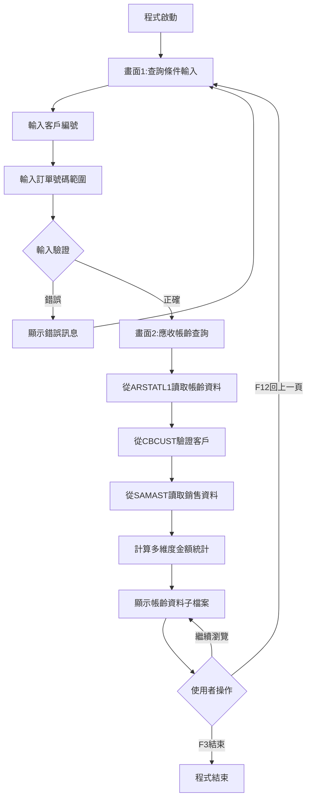
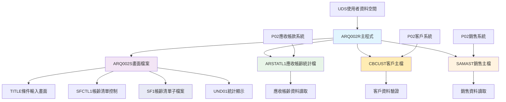
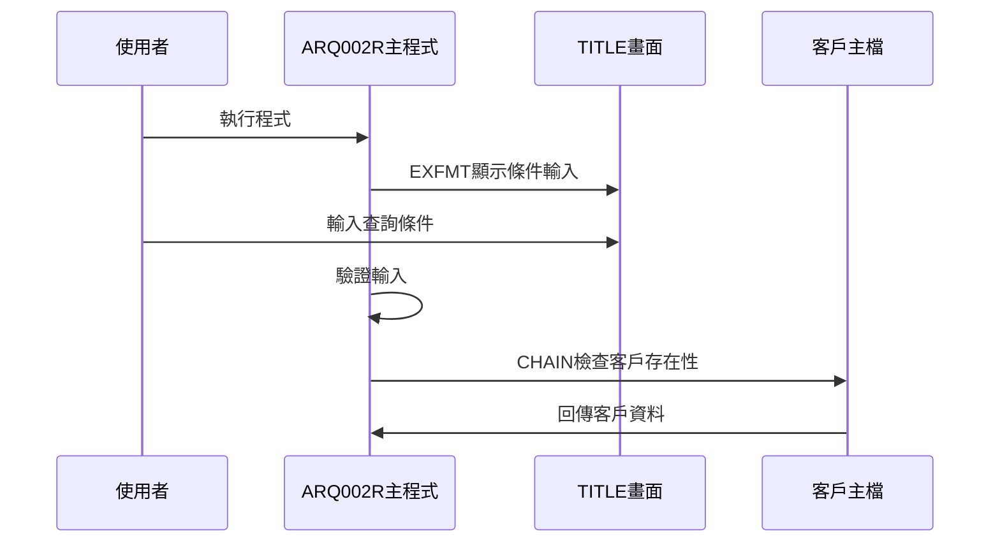
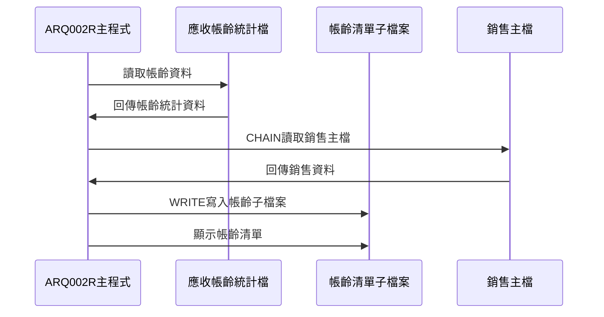
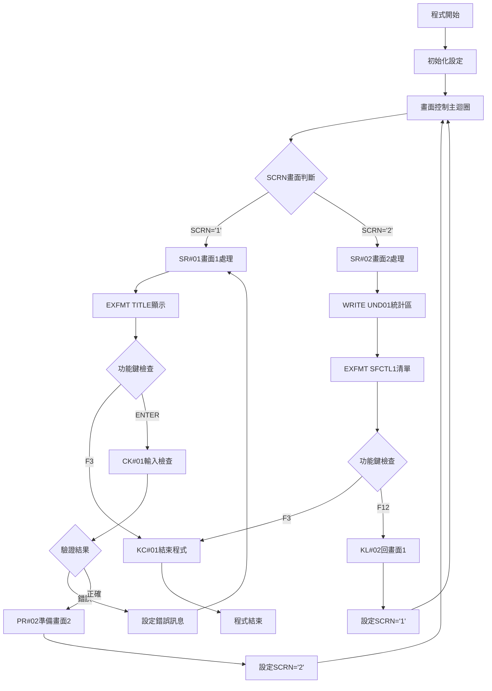

# ARQ002R_P02 程式規格書

## 1. 基本資料

| 項目 | 內容 |
|------|------|
| **程式編號** | ARQ002R |
| **程式名稱** | 客戶訂單餘額應收帳齡查詢作業 |
| **程式類型** | RPG |
| **廠區** | P02 |
| **系統名稱** | 應收帳款系統 |
| **子系統** | 應收帳款帳齡分析與查詢 |
| **檔案位置** | P02RPGSRC_THSRC/ARQ002R.txt |

## 2. 🎯 程式功能說明

### 主要功能描述
此程式為客戶訂單餘額應收帳齡查詢作業的主要處理程式，專門提供應收帳款帳齡資料的查詢和分析功能。程式採用雙階段式畫面設計，透過應收帳款帳齡統計檔(ARSTATL1)和客戶主檔(CBCUST)的資料處理，提供完整的應收帳款帳齡分析服務。P02版本具有應收帳款帳齡分層顯示機制、多維度金額統計功能、以及詳細的帳齡資料瀏覽。程式特別針對P02廠區的應收帳款帳齡分析業務設計，確保帳齡分析結果的準確性和完整性，同時提供使用者友善的操作介面和完整的帳齡資料展示功能。

### 🎯 業務流程詳細說明

#### 完整業務流程圖


#### 業務流程關鍵階段說明

**第一階段：查詢條件輸入與驗證**
- 顯示TITLE畫面進行條件輸入
- 使用者輸入客戶編號(CUST1)
- 使用者輸入訂單號碼起始(ORNO1)
- 使用者輸入訂單號碼結束(ORNO2)

**第二階段：輸入條件檢查與驗證**
- 檢查客戶編號是否存在於CBCUST
- 驗證訂單號碼範圍的合理性
- 檢查起始號碼不可大於結束號碼
- 設定相應的錯誤指示器和錯誤訊息

**第三階段：應收帳齡資料查詢與準備**
- 從ARSTATL1讀取指定客戶和訂單範圍的帳齡資料
- 取得客戶名稱(CBCUNM)進行顯示
- 讀取SAMAST銷售主檔取得作業區域資訊
- 計算各項帳齡金額和稅額統計

**第四階段：應收帳齡子檔案顯示**
- 顯示SFCTL1控制的SF1子檔案
- 展示訂單號碼、各期帳齡金額資訊
- 提供應收餘額總計(TTLAMT)
- 支援完整的帳齡資料瀏覽功能

#### 🎯 P02版本客戶訂單餘額應收帳齡查詢特色
- **雙階段畫面**：條件輸入畫面和帳齡資料顯示畫面
- **多維度帳齡**：包含銷貨金額、預收金額、產製金額等8種分類
- **完整統計**：提供應收餘額總計統計
- **雙畫面設計**：條件輸入→帳齡資料顯示

#### 多層次檢查機制
- **條件輸入檢查**：驗證客戶編號和訂單號碼範圍
- **資料存在性檢查**：確認客戶主檔資料存在
- **範圍合理性檢查**：檢查起始結束號碼邏輯
- **資料完整性檢查**：確保帳齡分析結果的完整性

#### 智能處理邏輯
- 自動讀取客戶名稱進行顯示
- 動態讀取銷售主檔取得作業區域
- 智能計算多維度帳齡金額統計
- 自動計算應收餘額總計提供決策參考

#### 資料一致性確保機制
- 透過KLIST建立正確的檔案讀取鍵值
- 使用指示器控制子檔案的顯示狀態
- 分階段處理確保各步驟資料同步
- 記錄詳細的帳齡分析軌跡供後續分析

#### P02版本客戶訂單餘額應收帳齡查詢專業設計理念
- **帳齡專精**：專門提供應收帳款帳齡資料的分析和瀏覽功能
- **使用者導向**：雙階段操作流程符合使用者習慣
- **多維分析**：提供8種不同類型的帳齡金額分析
- **P02特殊適配**：專為P02廠區的應收帳款帳齡分析需求設計

## 3. 🎯 檔案架構與關聯圖

### 使用檔案清單

| 檔案名稱 | 檔案類型 | 使用方式 | 說明 |
|----------|----------|----------|------|
| **ARQ002S** | DSPF | CF/COMBINED | 客戶訂單餘額應收帳齡查詢畫面檔案 |
| **ARSTATL1** | 邏輯檔 | IF/INPUT | 應收帳款帳齡統計檔案(邏輯檔1) |
| **CBCUST** | 邏輯檔 | IF/INPUT | 客戶主檔案 |
| **SAMAST** | 邏輯檔 | IF/INPUT | 銷售主檔案 |

### 🎯 檔案關聯詳細視覺化圖表



### 🎯 P02版本特殊資料流向說明

#### 查詢條件輸入階段的資料流向


#### P02版本應收帳齡查詢階段的資料流向


## 4. 🎯 檔案欄位規格說明

### 主要資料結構

#### 使用檔案清單
| 檔案名稱 | 檔案類型 | 使用方式 | 說明 |
|----------|----------|----------|------|
| **ARQ002S** | DSPF | CF/COMBINED | 客戶訂單餘額應收帳齡查詢畫面檔案，雙階段畫面設計 |
| **ARSTATL1** | 邏輯檔 | IF/INPUT | 應收帳款帳齡統計檔案(邏輯檔L1)，主要查詢檔案 |
| **CBCUST** | 邏輯檔 | IF/INPUT | 客戶主檔案，客戶驗證和資訊取得 |
| **SAMAST** | 邏輯檔 | IF/INPUT | 銷售主檔案，作業區域資訊取得 |

### 🔍 重點欄位切割技術詳解

#### DS結構完整分析

##### AADS日期資料結構切割分析
```
AADS日期資料結構 (6字元)：[_____日期資料_____]
位置:                      21            26
                           ↓             ↓
位置21-26:                [YMD___]       年月日資料(6字元)
```

**日期資料三重切割邏輯**：
```
YMD年月日資料 (6字元)：[年|月|日]
位置:                  21 22 23 24 25 26
                       ↓  ↓  ↓  ↓  ↓  ↓
YY(21-22):            [91]           年份(2字元)
MM(23-24):               [12]        月份(2字元)
DD(25-26):                  [31]     日期(2字元)
```

**切割邏輯詳細說明**：
- **YMD (21-26, 6字元)**：日期資料主體暫存區，應收帳齡查詢的時間基準
- **YY (21-22, 2字元)**：民國年份，2位數格式，91代表民國91年
- **MM (23-24, 2字元)**：月份，01-12範圍，數字格式
- **DD (25-26, 2字元)**：日期，01-31範圍，數字格式

**實際數據範例說明**：
```
AADS實際切割範例：
輸入: 系統計算結果 → YMD設定
切割處理:
1. YMD = "1011231" (位置21-26) → 民國101年12月31日
2. YY = "10" (位置21-22切割) → 民國101年(2012年)
3. MM = "12" (位置23-24切割) → 12月
4. DD = "31" (位置25-26切割) → 31日
5. 查詢基準: 以此日期為帳齡分析基準點
```

##### UDS使用者資料空間結構切割
```
UDS使用者資料空間 (1030字元)：[___________公司名稱區塊___________|設備名稱區塊|廠區]
位置:                          951                    985 1011    1020 1021
                                ↓                      ↓   ↓       ↓    ↓
位置951-985:                  [COMP____________________________]        公司名稱(35字元)
位置1011-1020:                                         [DEVNM____]      設備名稱(10字元)
位置1021:                                                       [TXAR]   交易廠區(1字元)
```

**切割邏輯詳細說明**：
- **COMP (951-985, 35字元)**：用於雙階段畫面標題顯示的公司名稱
- **DEVNM (1011-1020, 10字元)**：設備名稱，用於畫面右上角顯示終端機識別
- **TXAR (1021, 1字元)**：交易廠區代號，P02廠區識別和權限控制

**實際數據範例說明**：
```
UDS實際資料範例：
位置951-985: "東鋼鋼鐵股份有限公司               " (35字元) → 雙階段畫面標題
位置1011-1020: "TERM002   " (10字元) → 畫面右上角設備顯示
位置1021: "P" (1字元) → P02廠區識別
```

##### DS工作資料結構分析
```
DS工作資料結構 (6字元)：[工作訂單號碼|銷售訂單區域|銷售訂單號碼]
位置:                    1    6 1   2       6
                         ↓    ↓ ↓   ↓       ↓
位置1-6:                [W#ORNO]           工作訂單號碼(6字元)
位置1-1:                [S]                銷售訂單區域(1字元)
位置2-6:                  [1ORNO]          銷售訂單號碼(5字元)
```

**工作訂單號碼雙重切割邏輯**：
```
W#ORNO工作訂單 (6字元)：[區域|訂單號碼]
位置:                   1    2      6
                        ↓    ↓      ↓
S1OREA(1-1):          [P]          銷售訂單區域(1字元)
S1ORNO(2-6):            [OR001]     銷售訂單號碼(5字元)
```

**切割邏輯詳細說明**：
- **W#ORNO (1-6, 6字元)**：工作訂單號碼主體，用於SAMAST查詢的K#ORNO鍵值準備
- **S1OREA (1-1, 1字元)**：銷售訂單區域識別，SAMAST查詢第一部分鍵值
- **S1ORNO (2-6, 5字元)**：銷售訂單號碼，SAMAST查詢第二部分鍵值

**實際數據範例說明**：
```
DS工作資料實際切割範例：
輸入: ARORNO="POR001" → W#ORNO設定
切割處理:
1. W#ORNO = "POR001" (位置1-6) → 完整工作訂單號碼
2. S1OREA = "P" (位置1-1切割) → P02廠區識別
3. S1ORNO = "OR001" (位置2-6切割) → 訂單號碼識別
4. SAMAST查詢: K#ORNO = S1OREA + S1ORNO
```

#### 欄位切割視覺化展示

##### 三重KLIST查詢鍵值結構分析

###### ARKEY應收帳齡統計鍵值
```
ARKEY應收帳齡統計鍵值 (12字元)：[客戶編號|訂單號碼]
位置:                          001  006 007   012
                               ↓    ↓   ↓     ↓
ARCUNO(001-006):              [CU0001]       客戶編號(6字元)
ARORNO(007-012):                    [OR0001] 訂單號碼(6字元)
```

###### CBKEY客戶主檔鍵值
```
CBKEY客戶主檔鍵值 (6字元)：[客戶編號]
位置:                     001   006
                          ↓     ↓
CBCUNO(001-006):         [CU0001] 客戶編號(6字元)
```

###### K#ORNO銷售主檔鍵值
```
K#ORNO銷售主檔鍵值 (6字元)：[銷售訂單區域|銷售訂單號碼]
位置:                      001 002    006
                           ↓   ↓      ↓
S1OREA(001-001):          [P]         銷售訂單區域(1字元)
S1ORNO(002-006):            [OR001]   銷售訂單號碼(5字元)
```

##### 雙階段畫面SCRN控制切割邏輯
```
雙階段畫面控制變數：[SCRN畫面控制]
數值範圍: '1', '2'
        ↓   ↓
      條件  主
      輸入  查詢
```

**畫面切割轉換邏輯**：
```
SCRN='1' → SR#01 → TITLE條件輸入畫面
SCRN='2' → SR#02 → SFCTL1主查詢畫面
```

##### 8種帳齡金額計算切割邏輯深度分析
```
8種帳齡金額計算切割結構：
W01 = ARORNO (訂單號碼) → 直接對應
W02 = ARAAMT (銷貨金額A) → 直接累加
W03 = ARBAMT + AREAMT + ARGAMT + ARHAMT (預收類4項) → 複合累加
W04 = ARCAMT (應收金額C) → 直接累加
W05 = ARDAMT + ARFAMT (沖銷類2項) → 複合累加
W06 = ARATAX + ARCTAX + ARDTAX + ARETAX + ARFTAX + ARGTAX + ARHTAX (稅額類7項) → 複合累加
W07 = ARIAMT + ARJAMT (其他I/J類2項) → 複合累加
W08 = ARKAMT + ARLAMT (其他K/L類2項) → 複合累加
W09 = ARNBAL (應收餘額) → 直接取用 + TTLAMT累計
```

**帳齡金額計算實際範例**：
```
帳齡金額計算實際處理範例：
輸入記錄: ARORNO="POR001", ARAAMT=100000, ARBAMT=50000, AREAMT=30000
處理:
1. W01 = "POR001" (訂單號碼直接設定)
2. W02 = W02 + 100000 (銷貨金額累加)
3. W03 = W03 + 50000 + 30000 + 0 + 0 = 80000 (預收類4項累加)
4. TTLAMT = TTLAMT + ARNBAL (應收餘額總計累加)
```

#### 作業區域查詢切割機制
```
作業區域查詢切割流程：
ARORNO → W#ORNO設定 → S1OREA/S1ORNO切割 → K#ORNO組合 → SAMAST查詢
        ↓                ↓                      ↓              ↓
    POR001        P + OR001              P + OR001      S1CTNO取得
                                                          ↓
                                                      S#WKAR顯示
```

**作業區域轉換實際範例**：
```
作業區域轉換實際處理：
輸入: ARORNO="POR001"
處理:
1. W#ORNO = "POR001" (訂單號碼設定)
2. S1OREA = "P" (第1位元切割)
3. S1ORNO = "OR001" (第2-6位元切割)
4. SAMAST查詢: K#ORNO CHAIN成功
5. S#WKAR = S1CTNO (作業區域名稱取得)
```

### 🎯 欄位挪用詳細分析

#### 挪用情況對比表
| 欄位名稱 | 原始定義 | 實際使用方式 | 挪用原因 | 挪用方式詳細說明 |
|----------|----------|-------------|----------|------------------|
| **AADS DS** | 一般資料結構 | 日期資料專用處理區 | 帳齡查詢時間基準需求 | YMD分割為年、月、日三部分處理 |
| **DS工作結構** | 工作資料結構 | 訂單號碼切割專用 | SAMAST查詢鍵值準備需求 | W#ORNO切割為S1OREA+S1ORNO |
| **W01-W09** | 畫面工作變數 | 帳齡金額專用顯示 | 8種帳齡金額分類顯示 | 對應ARSTATL1各欄位的計算轉換 |
| **SCRN** | 畫面控制 | 雙階段畫面流程控制 | 條件輸入+帳齡顯示分離需求 | '1'/'2'對應兩個不同階段畫面 |
| **RRN** | 記錄號碼 | SF1子檔案管理 | 帳齡清單記錄控制需求 | 子檔案記錄序號管理 |
| **TTLAMT** | 總計變數 | 應收餘額總計專用 | 帳齡總額統計需求 | ARNBAL累計計算 |
| **S#WKAR** | 顯示變數 | 作業區域顯示專用 | 銷售作業區域顯示需求 | 從SAMAST的S1CTNO轉換 |

#### 挪用原因深度分析

##### 主要挪用變數說明
**DS工作結構訂單切割**：W#ORNO切割為S1OREA+S1ORNO，支援SAMAST銷售主檔的K#ORNO查詢
**W01-W09帳齡金額顯示**：從畫面工作變數挪用為8種帳齡金額專業顯示，支援複合累加計算
**SCRN雙階段控制**：從單一畫面控制挪用為雙階段流程管理('1'條件輸入+'2'帳齡顯示)
**TTLAMT總計統計**：從一般總計變數挪用為應收餘額專業化統計，支援ARNBAL累計
**S#WKAR作業區域**：從一般顯示變數挪用為銷售作業區域專用顯示

#### 挪用影響評估

**正面影響**：統一的訂單號碼處理、8種帳齡金額完整分類、雙階段流程清晰分離、專業作業區域顯示機制
**維護考量**：檔案結構依賴性、變數對應維護、畫面流程完整性、計算邏輯一致性

#### 實際數據範例說明

##### 完整帳齡查詢流程資料範例
```
帳齡查詢完整流程範例：
階段1 - 條件輸入:
  使用者輸入: CUST1="CU0001", ORNO1="OR0001", ORNO2="OR9999"
  客戶驗證: CBKEY CHAIN CBCUST → CBCUNM="東鋼測試客戶"
  
階段2 - 主查詢:
  帳齡資料: ARKEY SETLL ARSTATL1
  帳齡計算: ARAAMT=50000, ARBAMT=30000, ARCAMT=200000
  作業區域: W#ORNO="POR001" → S1OREA="P", S1ORNO="OR001" → S#WKAR="生產廠"
```

##### 8種帳齡金額計算實際範例
```
8種帳齡金額計算實際處理：
記錄1: ARORNO="POR001"
  W02 = 0 + 100000 = 100000 (銷貨金額累加)
  W03 = 0 + 50000 + 30000 + 0 + 0 = 80000 (預收類4項累加)
  W04 = 0 + 200000 = 200000 (應收金額累加)
  TTLAMT = 0 + 350000 = 350000 (應收餘額累計)

記錄2: ARORNO="POR002"  
  W02 = 100000 + 80000 = 180000 (銷貨金額累加)
  W03 = 80000 + 40000 + 20000 + 0 + 0 = 140000 (預收類4項累加)
  TTLAMT = 350000 + 280000 = 630000 (應收餘額累計)
```

##### 作業區域查詢實際範例
```
作業區域查詢實際處理：
訂單: ARORNO="POR001"
處理: W#ORNO="POR001" → S1OREA="P", S1ORNO="OR001"
查詢: K#ORNO CHAIN SAMAST
結果: S1CTNO="生產廠" → S#WKAR="生產廠"

訂單: ARORNO="KOR002"
處理: W#ORNO="KOR002" → S1OREA="K", S1ORNO="OR002"  
查詢: K#ORNO CHAIN SAMAST
結果: S1CTNO="裝配廠" → S#WKAR="裝配廠"
```

### 重要變數定義表

#### 查詢條件與畫面控制變數
| 變數名稱 | 類型 | 長度 | 使用範圍 | 說明 |
|----------|------|------|----------|------|
| **CUST1** | CHAR | 6 | 全程式 | 客戶編號查詢條件，CBCUST驗證對象 |
| **ORNO1** | CHAR | 6 | 全程式 | 訂單號碼起始，範圍查詢條件 |
| **ORNO2** | CHAR | 6 | 全程式 | 訂單號碼結束，預設'999999' |
| **SCRN** | CHAR | 1 | 主程式DOUEQ | 雙階段畫面控制('1'/'2') |
| **RRN** | NUM | 4 | SR#02/PR#02 | SF1帳齡子檔案記錄號碼 |

#### 客戶驗證與顯示變數
| 變數名稱 | 類型 | 長度 | 使用範圍 | 說明 |
|----------|------|------|----------|------|
| **CBCUNO** | CHAR | 6 | 客戶驗證 | 客戶主檔查詢鍵值，CUST1設定 |
| **CUSTNM** | CHAR | 10 | 客戶顯示 | 客戶名稱，CBCUNM取得 |

#### 帳齡金額顯示變數
| 變數名稱 | 類型 | 長度 | 使用範圍 | 說明 |
|----------|------|------|----------|------|
| **W01** | CHAR | 6 | SF1顯示 | 訂單號碼，ARORNO對應 |
| **W02** | NUM | 9 | SF1顯示 | 銷貨金額，ARAAMT累加 |
| **W03** | NUM | 9 | SF1顯示 | 預收等金額，ARBAMT+AREAMT+ARGAMT+ARHAMT |
| **W04** | NUM | 9 | SF1顯示 | 應收金額，ARCAMT累加 |
| **W05** | NUM | 9 | SF1顯示 | 沖銷金額，ARDAMT+ARFAMT |
| **W06** | NUM | 9 | SF1顯示 | 稅額合計，7種稅額累加 |
| **W07** | NUM | 9 | SF1顯示 | 其他I/J金額，ARIAMT+ARJAMT |
| **W08** | NUM | 9 | SF1顯示 | 其他K/L金額，ARKAMT+ARLAMT |
| **W09** | NUM | 9 | SF1顯示 | 應收餘額，ARNBAL對應 |

#### 統計與作業區域變數
| 變數名稱 | 類型 | 長度 | 使用範圍 | 說明 |
|----------|------|------|----------|------|
| **TTLAMT** | NUM | 9 | PR#02統計 | 應收餘額總計，ARNBAL累計 |
| **S#WKAR** | CHAR | 10 | SF1顯示 | 作業區域顯示，SAMAST的S1CTNO |

#### 檔案查詢鍵值變數
| 變數名稱 | 類型 | 長度 | 使用範圍 | 說明 |
|----------|------|------|----------|------|
| **ARCUNO** | CHAR | 6 | ARKEY鍵值 | 應收帳齡客戶編號，CUST1設定 |
| **ARORNO** | CHAR | 6 | ARKEY鍵值 | 應收帳齡訂單號碼，ORNO1設定 |
| **W#ORNO** | CHAR | 6 | DS工作結構 | 工作訂單號碼，ARORNO設定 |
| **S1OREA** | CHAR | 1 | K#ORNO鍵值 | 銷售訂單區域，W#ORNO切割 |
| **S1ORNO** | CHAR | 5 | K#ORNO鍵值 | 銷售訂單號碼，W#ORNO切割 |

#### 錯誤處理變數
| 變數名稱 | 類型 | 長度 | 使用範圍 | 說明 |
|----------|------|------|----------|------|
| **ERRMSG** | CHAR | 70 | CK#01檢查 | 錯誤訊息顯示，ERR表對應 |

## 5. 🎯 輸出/入螢幕布局

### 畫面1：查詢條件輸入畫面(TITLE)

```
+------------------------------------------------------------------------------+
|[日期]                東鋼鋼鐵股份有限公司                          ARQ002S-1 |
|                   ***客戶訂單餘額應收帳齡查詢***                   [設備名稱] |
|                                                                              |
|                                                                              |
|                                                                              |
|                                                                              |
|                      客戶編號: [______]                                      |
|                                                                              |
|                                                                              |
|                      訂單號碼: [______] - [______]                          |
|                                                                              |
|                                                                              |
|                                                                              |
|                                                                              |
|                                                                              |
|                                                                              |
|                                                                              |
|                                                                              |
|                                                                              |
|                                                                              |
|[錯誤訊息顯示區]                                                              |
|    ENTER:執行                    PF03:結束                                   |
+------------------------------------------------------------------------------+
```

### 畫面2：應收帳齡資料顯示畫面(SFCTL1)

```
+------------------------------------------------------------------------------+
|[日期]                東鋼鋼鐵股份有限公司                          ARQ002S-2 |
|                   ***客戶訂單餘額應收帳齡查詢***                   [設備名稱] |
|                                                                              |
|                     客戶編號: [______] 客戶名稱: [__________]                |
|                     訂單號碼: [______] - [______]                           |
|----------------------------------------------------------------------------- |
|  訂單編號      銷貨金額    預收等金額      產製金額        其他及其他      |
|   作業區域    預付及稅額    移轉等金額     利息金額        應收餘額        |
|----------------------------------------------------------------------------- |
| [______][_________][_________][_________][_________]                         |
| [__________][_________][_________][_________][_________]                     |
| [______][_________][_________][_________][_________]                         |
| [__________][_________][_________][_________][_________]                     |
|                                                                              |
|----------------------------------------------------------------------------- |
|                                     應收帳齡總餘額: [_________]             |
|            PF03:結束            PF12:回到上頁                               |
+------------------------------------------------------------------------------+
```

### 🎯 畫面欄位詳細說明

#### 畫面1輸入欄位
| 欄位名稱 | 欄位屬性 | 位置 | 長度 | 輸入格式 | 驗證規則 | 說明 |
|----------|----------|------|------|----------|----------|------|
| **CUST1** | 輸入/輸出 | 7,39 | 6 | 英數字元 | 客戶編號 | 客戶編號輸入 |
| **ORNO1** | 輸入/輸出 | 10,39 | 6 | 英數字元 | 訂單號碼 | 訂單號碼起始 |
| **ORNO2** | 輸入/輸出 | 10,47 | 6 | 英數字元 | 訂單號碼 | 訂單號碼結束 |

#### 畫面2顯示欄位
| 欄位名稱 | 欄位屬性 | 說明 |
|----------|----------|------|
| **CUST1** | 顯示 | 客戶編號顯示 |
| **CUSTNM** | 顯示 | 客戶名稱顯示 |
| **ORNO1/ORNO2** | 顯示 | 訂單範圍顯示 |
| **W01-W09** | 顯示 | 帳齡資料內容 |
| **S#WKAR** | 顯示 | 作業區域顯示 |
| **TTLAMT** | 顯示 | 應收餘額總計 |

### 功能鍵詳細定義

| 功能鍵 | 處理邏輯 | 系統行為 | 說明 |
|--------|----------|----------|------|
| **F3** | 設定IN03='1' | 程式立即結束 | 離開查詢作業 |
| **F12** | 回到上一畫面 | 畫面流程控制 | 返回上一個操作畫面 |
| **ENTER** | 執行查詢 | 根據畫面執行相應動作 | 執行查詢條件 |

### 輸入驗證機制

#### 查詢條件驗證
- CUST1客戶編號必須存在於CBCUST
- ORNO1起始號碼不可為空白
- ORNO2結束號碼不可小於起始號碼
- 範圍設定合理性檢查

#### P02版本特殊驗證
- 檢查客戶主檔的資料完整性
- 驗證訂單號碼的有效性
- 確認帳齡資料的存在性

## 6. 🎯 處理流程程序說明

### 🎯 主程序邏輯深度分析

#### P02版本程式執行流程圖


#### 🎯 P02版本客戶訂單餘額應收帳齡查詢特殊步驟分析

**步驟1：程式初始化設定**
- 設定初始變數值(CUST1, ORNO1, ORNO2='999999')
- 設定初始畫面編號(SCRN='1')
- 啟動主控制迴圈

**步驟2：SR#01畫面1查詢條件輸入處理**
- 顯示TITLE畫面進行條件輸入
- 檢查F3功能鍵決定是否結束程式
- 執行CK#01輸入條件檢查
- 驗證通過則執行PR#02準備畫面2資料

**步驟3：CK#01輸入條件檢查邏輯**
- 檢查客戶編號(CUST1)是否存在於CBCUST
- 驗證訂單號碼範圍(ORNO1 <= ORNO2)
- 設定相應的錯誤指示器(41, 42, 43, 99)
- 產生相應的錯誤訊息供使用者參考

**步驟4：PR#02應收帳齡資料準備**
- 清除統計變數(TTLAMT)和錯誤訊息
- 從ARSTATL1讀取指定客戶和訂單範圍的帳齡資料
- 計算8種不同類型的帳齡金額
- 讀取SAMAST取得作業區域資訊

**步驟5：應收帳齡金額計算邏輯**
- W02：直接取用ARAAMT銷貨金額
- W03：合計ARBAMT+AREAMT+ARGAMT+ARHAMT
- W04：直接取用ARCAMT應收金額
- W05：合計ARDAMT+ARFAMT沖銷金額
- W06：合計7種稅額(ARATAX~ARHTAX)
- W07：合計ARIAMT+ARJAMT其他金額
- W08：合計ARKAMT+ARLAMT其他金額
- W09：直接取用ARNBAL應收餘額並累計

**步驟6：SR#02畫面2應收帳齡顯示處理**
- 顯示UND01統計資訊區域
- 顯示SFCTL1控制的SF1子檔案
- 處理使用者的功能鍵操作
- 提供帳齡資料瀏覽功能

#### 業務邏輯深度解析

**P02版本客戶訂單餘額應收帳齡查詢的核心邏輯**：
1. 提供雙階段式的應收帳齡查詢和分析功能
2. 支援應收帳齡分層顯示機制確保資料完整性
3. 提供智能的客戶資料驗證和帳齡分析功能
4. 帳齡專業化分析的完整實現

**P02版本效能優化機制**：
1. 使用相對記錄號碼控制子檔案顯示
2. 分階段處理確保查詢效能
3. 智能分類處理8種不同帳齡金額
4. 提供應收餘額總計統計

#### 條件判斷詳細說明

**P02版本客戶驗證判斷**：
- `CBKEY CHAIN CBCUST` - 檢查客戶編號存在性
- `*IN31 = '1'` - 客戶不存在時設定錯誤

**P02版本訂單範圍判斷**：
- `ORNO1 IFGT ORNO2` - 起始號碼大於結束號碼時錯誤
- `ORNO2 IFEQ *BLANK` - 結束號碼空白時設為最大值

#### 變數使用和數據流向追蹤

**P02版本特殊變數軌跡**：
1. 畫面控制變數(SCRN)的狀態轉換軌跡
2. 子檔案記錄號碼(RRN)的管理軌跡
3. 統計變數(TTLAMT, W01-W09)的累計軌跡
4. 錯誤處理變數(ERRMSG, 指示器)的設定軌跡

### 🎯 P02版本子程序邏輯分析

#### P02版本子程序調用順序
1. **CK#01程序**：輸入條件檢查，驗證查詢條件的合法性
2. **PR#02程序**：應收帳齡準備，讀取和處理帳齡統計資料
3. **KC#01程序**：F3功能鍵處理，程式結束控制
4. **KL#02程序**：F12功能鍵處理，回到上一畫面

#### P02版本客戶訂單餘額應收帳齡查詢專精設計
- 專門提供應收帳款帳齡資料的查詢和分析功能
- 支援完整的雙階段操作流程
- 提供多維度帳齡分析機制
- 針對P02廠區的應收帳款帳齡業務特色進行優化

## 7. 🎯 數據操作與轉換分析

### P02版本檔案操作詳解

#### P02版本ARSTATL1應收帳齡統計檔操作
- **SETLL操作**：設定檔案指標到指定客戶位置
- **READE操作**：順序讀取指定客戶和訂單範圍的帳齡記錄
- **條件篩選**：根據客戶編號和訂單範圍進行精確篩選

#### P02版本CBCUST客戶主檔操作
- **CHAIN操作**：直接讀取指定客戶編號的客戶記錄
- **資料驗證**：確認客戶編號的存在性
- **名稱取得**：取得客戶名稱進行顯示

#### P02版本SAMAST銷售主檔操作
- **CHAIN操作**：根據訂單號碼讀取銷售主檔
- **區域取得**：取得作業區域資訊(S1CTNO)
- **顯示處理**：將作業區域轉換為顯示格式

### P02版本數據轉換邏輯

#### P02版本帳齡金額分類轉換
- **銷貨類**：ARAAMT → W02 (直接轉換)
- **預收類**：ARBAMT+AREAMT+ARGAMT+ARHAMT → W03 (合計轉換)
- **應收類**：ARCAMT → W04 (直接轉換)
- **沖銷類**：ARDAMT+ARFAMT → W05 (合計轉換)
- **稅額類**：7種稅額合計 → W06 (複合轉換)
- **其他I/J類**：ARIAMT+ARJAMT → W07 (合計轉換)
- **其他K/L類**：ARKAMT+ARLAMT → W08 (合計轉換)
- **餘額類**：ARNBAL → W09 (直接轉換並累計)

#### P02版本畫面資料轉換
- **帳齡清單轉換**：帳齡統計資料轉換為清單顯示格式
- **客戶資料轉換**：客戶主檔資料轉換為客戶顯示格式
- **統計資料轉換**：累計數據轉換為統計顯示格式
- **銷售資料轉換**：銷售主檔資料轉換為作業區域顯示

### P02版本檢核機制詳解

#### P02版本查詢條件檢核
- **存在性檢查**：客戶編號是否存在於客戶主檔
- **範圍合理性檢查**：起始號碼不可大於結束號碼
- **格式有效性檢查**：輸入格式是否符合規範
- **邏輯一致性檢查**：查詢條件的邏輯合理性

#### P02版本資料完整性檢核
- **主檔資料檢查**：確保客戶主檔資料的完整性
- **帳齡資料檢查**：確保應收帳齡資料的正確性
- **關聯性檢查**：客戶與帳齡資料的關聯一致性
- **統計準確性檢查**：各項金額統計的準確性

#### P02版本顯示效能檢核
- **資料量控制**：控制帳齡清單顯示的資料量
- **子檔案管理**：正確管理帳齡子檔案的顯示狀態
- **記憶體使用**：控制資料載入量避免記憶體不足
- **響應時間**：確保查詢響應時間在合理範圍

## 8. 🎯 錯誤處理程序說明

### 🎯 P02版本詳細錯誤代碼清冊

| 錯誤代碼 | 錯誤訊息 | 原因說明 | 處理方式 | 預防措施 |
|----------|---------|---------|---------|----------|
| **ERR,1** | 訂單異常 | 訂單號碼相關錯誤 | 1. 檢查訂單號碼格式<br>2. 確認訂單範圍設定<br>3. 重新輸入正確號碼 | 確保輸入的訂單號碼正確 |
| **ERR,2** | 訂單結束編號異常 | 起始號碼大於結束號碼 | 1. 檢查號碼範圍設定<br>2. 調整起始和結束號碼<br>3. 確認查詢範圍邏輯 | 檢查輸入範圍的合理性 |
| **ERR,3** | 客戶編號異常 | 客戶編號不存在於客戶主檔 | 1. 檢查客戶編號輸入<br>2. 確認客戶是否已建檔<br>3. 重新輸入正確編號 | 確保輸入的客戶編號正確 |
| **指示器41** | ORNO1欄位錯誤 | 訂單號碼起始輸入錯誤 | 1. 重新輸入起始號碼<br>2. 檢查號碼格式<br>3. 確認範圍設定 | 提供有效號碼範圍參考 |
| **指示器42** | ORNO2欄位錯誤 | 訂單號碼結束輸入錯誤 | 1. 重新輸入結束號碼<br>2. 檢查範圍邏輯<br>3. 確認號碼有效性 | 檢查號碼範圍邏輯關係 |
| **指示器43** | CUST1欄位錯誤 | 客戶編號輸入錯誤 | 1. 重新輸入客戶編號<br>2. 檢查編號格式<br>3. 確認編號存在性 | 提供客戶編號格式說明 |
| **指示器99** | 一般處理錯誤 | 資料處理或驗證失敗 | 1. 檢查資料完整性<br>2. 重新執行查詢<br>3. 確認系統狀態 | 定期檢查資料檔案狀態 |
| **子檔案顯示失敗** | SF1清單異常 | 子檔案資料載入問題 | 1. 檢查記憶體使用<br>2. 重新載入資料<br>3. 減少查詢範圍 | 控制查詢資料量 |
| **帳齡計算錯誤** | 金額統計異常 | 帳齡統計計算邏輯錯誤 | 1. 檢查帳齡資料正確性<br>2. 重新計算統計<br>3. 驗證計算邏輯 | 確保帳齡資料的完整性 |
| **畫面轉換失敗** | SCRN控制異常 | 畫面流程控制錯誤 | 1. 檢查畫面控制邏輯<br>2. 重新執行操作<br>3. 確認功能鍵處理 | 確保畫面流程控制正確 |

### 🎯 P02版本系統異常處理邏輯

#### P02版本檔案操作失敗處理
- **應收帳齡檔異常**：檢查ARSTATL1檔案的可用性和完整性
- **客戶主檔異常**：確認CBCUST檔案的正確性和存取權限
- **銷售主檔異常**：處理SAMAST檔案的存取問題
- **畫面檔案異常**：處理ARQ002S畫面檔案的顯示問題

#### P02版本資料完整性錯誤處理
- **查詢條件異常**：處理輸入條件和驗證的異常情況
- **帳齡資料異常**：處理應收帳齡統計資料的異常
- **客戶資料異常**：處理客戶主檔資料的異常
- **關聯性異常**：處理客戶與帳齡關聯的異常

#### P02版本使用者操作錯誤處理
- **輸入格式異常**：處理使用者輸入格式的錯誤
- **功能鍵異常**：處理功能鍵操作的異常情況
- **畫面流程異常**：處理畫面切換和流程的異常

#### P02版本客戶訂單餘額應收帳齡查詢業務失敗處理
- **查詢邏輯失敗**：處理帳齡查詢業務邏輯的異常
- **統計功能失敗**：處理帳齡統計和彙總的異常
- **顯示功能失敗**：處理帳齡資料顯示的異常

## 9. 🎯 備註

### 🎯 P02版本客戶訂單餘額應收帳齡查詢特殊注意事項

#### P02版本作為應收帳齡查詢分析平台
- 專門提供應收帳款帳齡資料的查詢和分析功能，確保帳齡分析結果的準確性
- 使用應收帳齡分層顯示機制確保資料顯示的完整性
- 支援完整的雙階段操作流程確保使用者體驗
- 提供完整的應收帳齡分析功能確保業務需求的滿足

#### P02版本客戶訂單餘額應收帳齡查詢專精管理
- **雙階段畫面**：條件輸入畫面和帳齡資料顯示畫面
- **多維度分析**：提供8種不同類型的帳齡金額分析
- **完整統計**：提供應收餘額總計確保統計完整性
- **完整性保證**：確保帳齡查詢分析的完整性和可追蹤性

#### P02版本資料顯示安全機制
- **資料量控制**：適當控制帳齡清單顯示的資料量
- **客戶驗證**：確保只顯示有效客戶的帳齡資料
- **統計功能**：提供完整的帳齡金額統計和彙總
- **安全查詢**：確保只顯示使用者有權查看的資料

#### P02版本應收帳齡分類處理機制
- **銷貨類處理**：一般銷貨金額的標準處理
- **預收類處理**：預收、產製、其他金額的合計處理
- **應收類處理**：應收帳款金額的直接處理
- **沖銷類處理**：各種沖銷金額的合計處理
- **稅額類處理**：7種不同稅額的綜合處理
- **其他類處理**：其他I/J類和K/L類金額的分別處理
- **餘額類處理**：應收餘額的累計統計處理

#### P02版本ARSTATL1和關聯檔案查詢條件特殊機制
- **ARSTATL1查詢**：ARCUNO+ARORNO的組合鍵查詢
- **CBCUST查詢**：CBCUNO的單一鍵值查詢
- **SAMAST查詢**：S1OREA+S1ORNO的組合鍵查詢
- **範圍控制**：支援訂單號碼範圍的精確查詢
- **客戶篩選**：根據客戶編號進行精確篩選

#### P02版本系統整合特性
- 與ARSTATL1應收帳齡統計檔系統緊密整合
- 與CBCUST客戶主檔系統完全相容
- 與SAMAST銷售主檔系統無縫銜接
- 支援ARQ002S畫面系統的標準化處理
- 與P02廠區檔案系統和應收帳款系統無縫銜接

#### P02版本使用者體驗特性
- **直觀操作**：雙階段操作流程符合使用者習慣
- **豐富資訊**：提供完整的客戶和帳齡資訊
- **靈活查詢**：支援範圍查詢和客戶查詢
- **即時統計**：提供即時的帳齡金額統計和彙總

#### P02版本使用注意事項
- 執行前確保應收帳齡統計檔和客戶主檔資料完整
- 注意查詢範圍不宜過大以免影響效能
- 確認使用者有查詢相關客戶帳齡資料的權限
- 應收帳齡查詢涉及敏感財務資料需特別注意保密性
- 確保畫面檔案ARQ002S的正確設定
- 處理完成後注意子檔案資料的清理
- 留意帳齡金額統計的正確性
- 監控查詢效能避免長時間等待
- 確認帳齡分析統計的正確性和完整性

