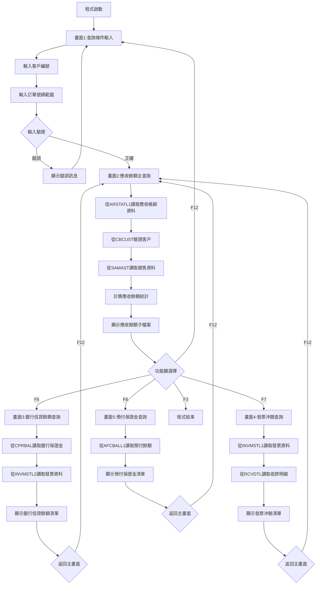
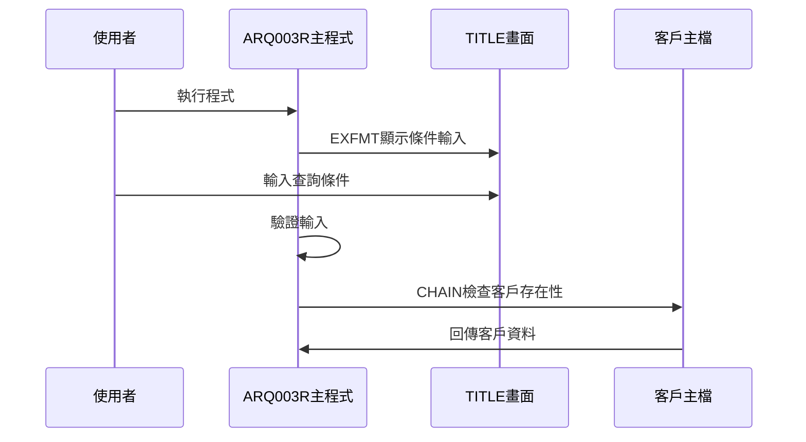
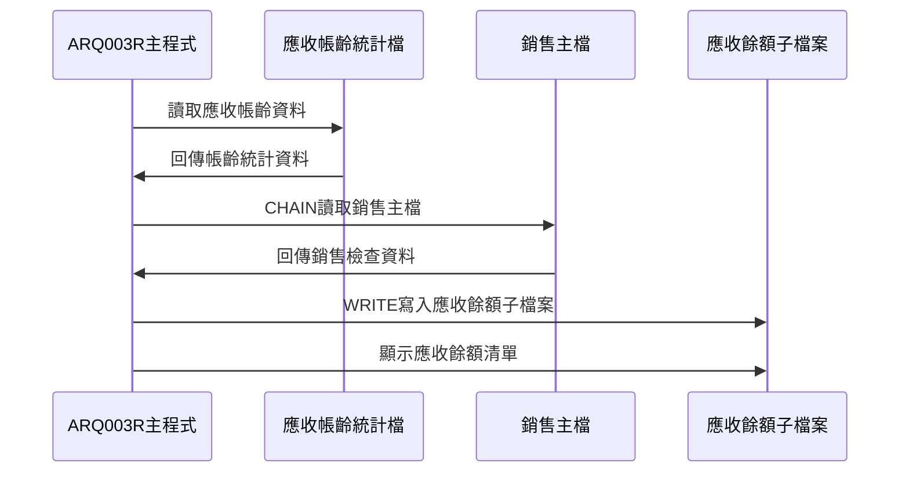
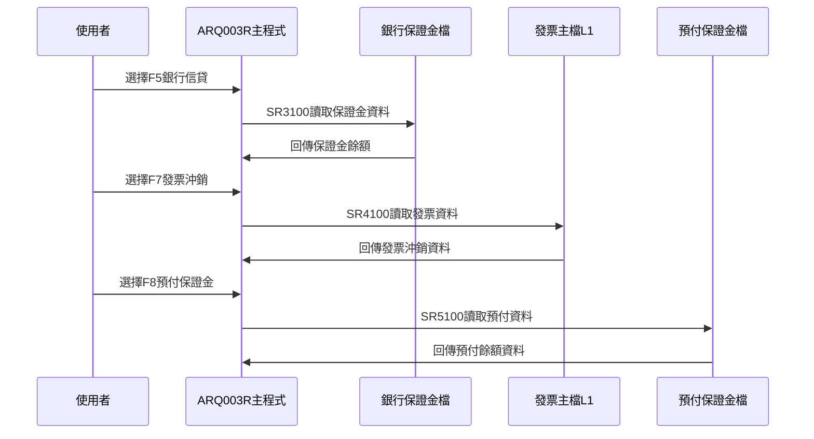
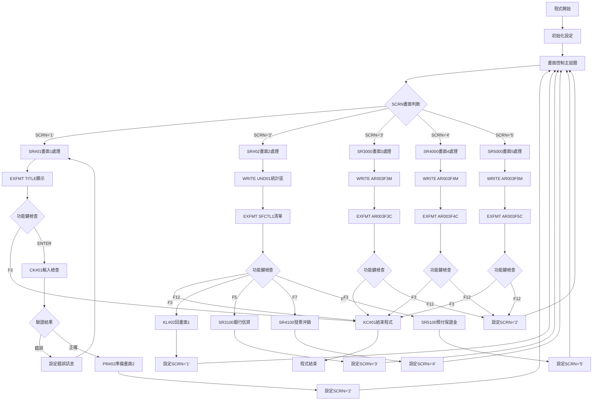

# ARQ003R_P02 程式規格書

## 1. 基本資料

| 項目 | 內容 |
|------|------|
| **程式編號** | ARQ003R |
| **程式名稱** | 應收帳款綜合餘額查詢作業 |
| **程式類型** | RPG |
| **廠區** | P02 |
| **系統名稱** | 應收帳款系統 |
| **子系統** | 應收帳款綜合餘額分析與查詢 |
| **檔案位置** | P02RPGSRC_THSRC/ARQ003R.txt |

## 2. 🎯 程式功能說明

### 主要功能描述
此程式為應收帳款綜合餘額查詢作業的核心處理程式，提供「五合一」的應收帳款餘額分析功能。程式採用多階段式畫面設計，透過應收帳款帳齡統計檔(ARSTATL1)、客戶主檔(CBCUST)、銀行保證金餘額檔(CPRBAL)、發票主檔(INVMSTL1/L2)、收款明細檔(RCVDTL)、預付保證金餘額檔(AFCBALL1)等多個檔案的整合處理，提供完整的應收帳款綜合餘額分析服務。P02版本具有五種專業查詢模式、多檔案同步整合機制、以及詳細的餘額資料瀏覽功能。程式特別針對P02廠區的應收帳款綜合餘額分析業務設計，確保餘額分析結果的準確性和完整性，同時提供使用者友善的操作介面和完整的綜合餘額展示功能。

### 🎯 業務流程詳細說明

#### 完整業務流程圖


#### 業務流程關鍵階段說明

**第一階段：查詢條件輸入與驗證**
- 顯示TITLE畫面進行條件輸入
- 使用者輸入客戶編號(CUST1)
- 使用者輸入訂單號碼起始(ORNO1)
- 使用者輸入訂單號碼結束(ORNO2)

**第二階段：主要應收餘額查詢**
- 檢查客戶編號是否存在於CBCUST
- 驗證訂單號碼範圍的合理性
- 從ARSTATL1讀取應收帳齡統計資料
- 計算應收餘額的複合金額

**第三階段：多功能查詢選擇**
- F5：銀行信貸餘額查詢(畫面3)
- F7：發票沖銷查詢(畫面4)
- F8：預付保證金查詢(畫面5)
- 各功能獨立運作並可返回主畫面

**第四階段：銀行信貸餘額查詢處理**
- 從CPRBAL讀取銀行保證金餘額資料
- 從INVMSTL2交叉查詢發票資料
- 計算保證金、增加、減少、餘額等統計
- 顯示詳細的銀行信貸餘額清單

**第五階段：發票沖銷查詢處理**
- 從INVMSTL1讀取發票主檔資料
- 從RCVDTL讀取收款明細
- 查詢沖銷金額、沖銷憑證、沖銷日期
- 顯示詳細的發票沖銷清單和沖銷狀態

**第六階段：預付保證金查詢處理**
- 從AFCBALL1讀取預付保證金餘額
- 計算預付金額、未預付金額、預付餘額
- 顯示詳細的預付保證金清單

#### 🎯 P02版本應收帳款綜合餘額查詢特色
- **五合一功能**：應收帳齡、銀行信貸、發票沖銷、預付保證金、綜合查詢
- **多檔案整合**：整合7個主要檔案的資料進行綜合分析
- **多階段畫面**：主查詢畫面+4個專業功能畫面
- **完整統計**：提供各類餘額的完整統計和分析

#### 多層次檢查機制
- **條件輸入檢查**：驗證客戶編號和訂單號碼範圍
- **資料存在性檢查**：確認各主檔資料存在
- **關聯性檢查**：檢查跨檔案資料的關聯一致性
- **資料完整性檢查**：確保餘額分析結果的完整性

#### 智能處理邏輯
- 自動讀取客戶名稱進行顯示
- 動態計算銷售檢查(S1CHK)確定稅額處理
- 智能計算多維度餘額統計
- 自動分類處理不同類型的餘額資料

#### 資料一致性確保機制
- 透過多個KLIST建立正確的檔案讀取鍵值
- 使用多個指示器控制不同子檔案的顯示狀態
- 分階段處理確保各步驟資料同步
- 記錄詳細的綜合餘額分析軌跡供後續分析

#### P02版本應收帳款綜合餘額查詢專業設計理念
- **綜合專精**：一個程式提供五種不同的餘額查詢功能
- **使用者導向**：多階段操作流程符合使用者習慣
- **多維分析**：提供完整的應收帳款綜合餘額分析
- **P02特殊適配**：專為P02廠區的應收帳款綜合業務需求設計

## 3. 🎯 檔案架構與關聯圖

### 使用檔案清單

| 檔案名稱 | 檔案類型 | 使用方式 | 說明 |
|----------|----------|----------|------|
| **ARQ003S** | DSPF | CF/COMBINED | 應收帳款綜合餘額查詢畫面檔案 |
| **ARSTATL1** | 邏輯檔 | IF/INPUT | 應收帳款帳齡統計檔案(邏輯檔1) |
| **CBCUST** | 邏輯檔 | IF/INPUT | 客戶主檔案 |
| **CPRBAL** | 邏輯檔 | IF/INPUT | 銀行保證金餘額檔案 |
| **INVMSTL1** | 邏輯檔 | IF/INPUT | 發票主檔案(邏輯檔1) |
| **INVMSTL2** | 邏輯檔 | IF/INPUT | 發票主檔案(邏輯檔2) |
| **RCVDTL** | 邏輯檔 | IF/INPUT | 收款明細檔案 |
| **SAMAST** | 邏輯檔 | IF/INPUT | 銷售主檔案 |
| **AFCBALL1** | 邏輯檔 | IF/INPUT | 預付保證金餘額檔案(邏輯檔1) |

### 🎯 檔案關聯詳細視覺化圖表

```mermaid
graph TD
    A[ARQ003R主程式] --> B[ARQ003S畫面檔案]
    A --> C[ARSTATL1應收帳齡統計檔]
    A --> D[CBCUST客戶主檔]
    A --> E[CPRBAL銀行保證金餘額檔]
    A --> F[INVMSTL1發票主檔L1]
    A --> G[INVMSTL2發票主檔L2]
    A --> H[RCVDTL收款明細檔]
    A --> I[SAMAST銷售主檔]
    A --> J[AFCBALL1預付保證金餘額檔]
    
    B --> K[TITLE條件輸入畫面]
    B --> L[SFCTL1應收餘額清單控制]
    B --> M[SF1應收餘額清單子檔案]
    B --> N[AR003F3C銀行信貸控制]
    B --> O[AR003F3銀行信貸子檔案]
    B --> P[AR003F4C發票沖銷控制]
    B --> Q[AR003F4發票沖銷子檔案]
    B --> R[AR003F5C預付保證金控制]
    B --> S[AR003F5預付保證金子檔案]
    
    C --> T[應收帳齡資料讀取]
    D --> U[客戶資料驗證]
    E --> V[銀行保證金資料讀取]
    F --> W[發票沖銷資料讀取]
    G --> X[發票交叉查詢]
    H --> Y[收款明細資料讀取]
    I --> Z[銷售資料讀取]
    J --> AA[預付保證金資料讀取]
    
    BB[UDS使用者資料空間] --> A
    CC[P02應收帳款系統] --> C
    DD[P02客戶系統] --> D
    EE[P02銀行系統] --> E
    FF[P02發票系統] --> F
    GG[P02發票系統] --> G
    HH[P02收款系統] --> H
    II[P02銷售系統] --> I
    JJ[P02預付系統] --> J
    
    style A fill:#e1f5fe
    style B fill:#f3e5f5
    style C fill:#e8f5e8
    style D fill:#ffecb3
    style E fill:#fff3e0
    style M fill:#e8eaf6
    style O fill:#f1f8e9
    style Q fill:#fef7e0
    style S fill:#f3e5f5
```



### 🎯 P02版本特殊資料流向說明

#### 查詢條件輸入階段的資料流向


#### P02版本應收餘額查詢階段的資料流向


#### P02版本五合一功能選擇階段的資料流向


## 4. 🎯 檔案欄位規格說明

### 主要資料結構

#### 使用檔案清單
| 檔案名稱 | 檔案類型 | 使用方式 | 說明 |
|----------|----------|----------|------|
| **ARQ003S** | DSPF | CF/COMBINED | 應收帳款綜合餘額查詢畫面檔案，含五階段畫面 |
| **ARSTATL1** | 邏輯檔 | IF/INPUT | 應收帳款帳齡統計檔案(邏輯檔L1)，主要查詢檔案 |
| **CBCUST** | 邏輯檔 | IF/INPUT | 客戶主檔案，客戶驗證和資訊取得 |
| **CPRBAL** | 邏輯檔 | IF/INPUT | 銀行保證金餘額檔案，F5功能查詢 |
| **INVMSTL1** | 邏輯檔 | IF/INPUT | 發票主檔案(邏輯檔L1)，F7功能查詢 |
| **INVMSTL2** | 邏輯檔 | IF/INPUT | 發票主檔案(邏輯檔L2)，F5功能交叉查詢 |
| **RCVDTL** | 邏輯檔 | IF/INPUT | 收款明細檔案，F7功能沖銷狀態分析 |
| **SAMAST** | 邏輯檔 | IF/INPUT | 銷售主檔案，稅額計算檢查 |
| **AFCBALL1** | 邏輯檔 | IF/INPUT | 預付保證金餘額檔案(邏輯檔L1)，F8功能查詢 |

### 🔍 重點欄位切割技術詳解

#### DS結構完整分析

##### AADS日期資料結構切割分析
```
AADS日期資料結構 (6字元)：[_____日期資料_____]
位置:                      21            26
                           ↓             ↓
位置21-26:                [YMD___]       年月日資料(6字元)
```

**日期資料三重切割邏輯**：
```
YMD年月日資料 (6字元)：[年|月|日]
位置:                  21 22 23 24 25 26
                       ↓  ↓  ↓  ↓  ↓  ↓
YY(21-22):            [91]           年份(2字元)
MM(23-24):               [12]        月份(2字元)
DD(25-26):                  [31]     日期(2字元)
```

**切割邏輯詳細說明**：
- **YMD (21-26, 6字元)**：日期資料主體暫存區，應收帳款綜合餘額查詢的時間基準
- **YY (21-22, 2字元)**：民國年份，2位數格式，91代表民國91年
- **MM (23-24, 2字元)**：月份，01-12範圍，數字格式
- **DD (25-26, 2字元)**：日期，01-31範圍，數字格式

**實際數據範例說明**：
```
AADS實際切割範例：
輸入: 系統計算結果 → YMD設定
切割處理:
1. YMD = "1011231" (位置21-26) → 民國101年12月31日
2. YY = "10" (位置21-22切割) → 民國101年(2012年)
3. MM = "12" (位置23-24切割) → 12月
4. DD = "31" (位置25-26切割) → 31日
5. 查詢基準: 以此日期為應收餘額分析基準點
```

##### UDS使用者資料空間結構切割
```
UDS使用者資料空間 (1030字元)：[___________公司名稱區塊___________|設備名稱區塊|廠區]
位置:                          951                    985 1011    1020 1021
                                ↓                      ↓   ↓       ↓    ↓
位置951-985:                  [COMP____________________________]        公司名稱(35字元)
位置1011-1020:                                         [DEVNM____]      設備名稱(10字元)
位置1021:                                                       [TXAR]   交易廠區(1字元)
```

**切割邏輯詳細說明**：
- **COMP (951-985, 35字元)**：用於五階段畫面標題顯示的公司名稱
- **DEVNM (1011-1020, 10字元)**：設備名稱，用於畫面右上角顯示終端機識別
- **TXAR (1021, 1字元)**：交易廠區代號，P02廠區識別和權限控制

**實際數據範例說明**：
```
UDS實際資料範例：
位置951-985: "東鋼鋼鐵股份有限公司               " (35字元) → 五階段畫面標題
位置1011-1020: "TERM003   " (10字元) → 畫面右上角設備顯示
位置1021: "P" (1字元) → P02廠區識別
```

##### INRECL2發票記錄重命名結構分析
```
INRECL2發票記錄重命名結構：[______完整發票記錄欄位重命名對照______]
原始記錄: INVMSTL2.INREC
重命名為: INRECL2 (35個欄位完整重命名)
```

**重要欄位重命名對照表**：
```
原始欄位     重命名欄位    用途說明
INFLAG   →   F#FLAG      記錄標記(記錄狀態識別)
INTYPE   →   F#TYPE      發票類型('2'=正常發票)
INDECD   →   F#DECD      作廢代碼(空白=有效)
INNO     →   F#NO        發票號碼(10字元)
INCUNO   →   F#CUNO      客戶編號(6字元)
INORNO   →   F#ORNO      訂單號碼(6字元)
ININDT   →   F#INDT      發票日期(8字元數值)
INEAMT   →   F#EAMT      沖銷金額(9字元數值)
INRCNO   →   F#RCNO      收款憑證號(10字元)
INRCDT   →   F#RCDT      收款憑證日期(8字元數值)
```

**實際數據範例說明**：
```
發票記錄重命名實際範例：
原始: INVMSTL2.INNO="IV20231215"
重命名: F#NO="IV20231215"
用途: 銀行信貸查詢(F5功能)時的發票交叉驗證

原始: INVMSTL2.INETYPE="2"  
重命名: F#TYPE="2"
用途: 篩選正常發票記錄(排除作廢發票)
```

##### ERR錯誤訊息表結構分析
```
ERR錯誤訊息表 (70字元)：[完整錯誤訊息內容____________________________________]
位置:                   1                                                70
                        ↓                                                ↓
位置1-70:              [訂單範圍錯誤，請檢查起始和結束號碼設定！        ]  錯誤訊息(70字元)
```

**實際錯誤訊息表資料**：
```
ERR,1 → "訂單異常，請檢查訂單號碼格式和範圍設定！"
ERR,2 → "訂單結束編號異常，起始號碼不可大於結束號碼！"
ERR,3 → "客戶編號異常，請確認客戶是否已建檔！"
```

#### 欄位切割視覺化展示

##### 七重KLIST查詢鍵值結構分析

###### ARKEY應收帳齡統計鍵值
```
ARKEY應收帳齡統計鍵值 (12字元)：[客戶編號|訂單號碼]
位置:                          001  006 007   012
                               ↓    ↓   ↓     ↓
ARCUNO(001-006):              [CU0001]       客戶編號(6字元)
ARORNO(007-012):                    [OR0001] 訂單號碼(6字元)
```

###### CBKEY客戶主檔鍵值
```
CBKEY客戶主檔鍵值 (6字元)：[客戶編號]
位置:                     001   006
                          ↓     ↓
CBCUNO(001-006):         [CU0001] 客戶編號(6字元)
```

###### W#INVM發票主檔L1鍵值
```
W#INVM發票主檔L1鍵值 (30字元)：[客戶編號|沖銷憑證號|發票日期|發票號碼]
位置:                          001  006 007     016 017  024 025     034
                               ↓    ↓   ↓       ↓   ↓    ↓   ↓       ↓
INCUNO(001-006):              [CU0001]           客戶編號(6字元)
INAPNO(007-016):                    [AP20231215] 沖銷憑證號(10字元)
ININDT(017-024):                                [20231215] 發票日期(8字元)
INNO(025-034):                                            [IV20231215] 發票號碼(10字元)
```

###### W#INL2發票主檔L2鍵值
```
W#INL2發票主檔L2鍵值 (16字元)：[訂單號碼|發票號碼]
位置:                          001  006 007     016
                               ↓    ↓   ↓       ↓
F#ORNO(001-006):              [OR0001]         訂單號碼(6字元)
F#NO(007-016):                      [IV20231215] 發票號碼(10字元)
```

###### W#RCVD收款明細鍵值
```
W#RCVD收款明細鍵值 (13字元)：[收款憑證號|收款項目]
位置:                        001      010 011  013
                             ↓        ↓   ↓    ↓
RVNO(001-010):              [RC20231215]     收款憑證號(10字元)
RVITEM(011-013):                      [001] 收款項目(3字元)
```

###### W#SAMT銷售主檔鍵值
```
W#SAMT銷售主檔鍵值 (7字元)：[銷售訂單區域|銷售訂單號碼]
位置:                      001 002    007
                           ↓   ↓      ↓
S1OREA(001-001):          [P]         銷售訂單區域(1字元)
S1ORNO(002-007):            [OR0001] 銷售訂單號碼(6字元)
```

###### K#AFCB預付保證金鍵值
```
K#AFCB預付保證金鍵值 (12字元)：[客戶編號|訂單號碼]
位置:                          001  006 007   012
                               ↓    ↓   ↓     ↓
AFCUNO(001-006):              [CU0001]       客戶編號(6字元)
AFORNO(007-012):                    [OR0001] 訂單號碼(6字元)
```

##### 五階段畫面SCRN控制切割邏輯
```
五階段畫面控制變數：[SCRN畫面控制]
數值範圍: '1', '2', '3', '4', '5'
        ↓   ↓   ↓   ↓   ↓
      條件  主  銀行 發票 預付
      輸入  查詢 信貸 沖銷 保證金
```

**畫面切割轉換邏輯**：
```
SCRN='1' → SR#01 → TITLE條件輸入畫面
SCRN='2' → SR#02 → SFCTL1主查詢畫面
SCRN='3' → SR3000 → AR003F3C銀行信貸畫面
SCRN='4' → SR4000 → AR003F4C發票沖銷畫面
SCRN='5' → SR5000 → AR003F5C預付保證金畫面
```

##### 稅額計算切割邏輯深度分析
```
稅額計算S1CHK判斷切割：
SAMAST銷售檢查 → S1CHK欄位 → '2'含稅/'其他'免稅
                           ↓
                      含稅處理分支
                           ↓
              ARBAMT DIV 1.05 → W03 (除稅後金額)
              ARBAMT DIV 21 → W#BTAX (營業稅額)
              W#BTAX MULT -1 → W#BTAX (稅額負值)
              ARPBAL ADD W#BTAX → W06 (餘額調整)
```

**稅額計算實際範例**：
```
稅額計算實際處理範例：
條件: S1CHK='2' (含稅處理)
輸入: ARBAMT=105000 (含稅金額)
計算:
1. W03 = 105000 ÷ 1.05 = 100000 (未稅金額)
2. W#BTAX = 105000 ÷ 21 = 5000 (營業稅額)
3. W#BTAX = 5000 × (-1) = -5000 (稅額負值)
4. W06 = ARPBAL + (-5000) (應收餘額減稅額調整)
```

##### 沖銷狀態分析切割邏輯
```
收款明細沖銷狀態三重判斷：
RVNTTP(收款狀態) ∈ {'A','B','C','D','E'}
         ↓
RVACNO(會計科目) ∈ {'1131','111001'}
         ↓
RVNTCD(沖銷狀態) → ' '=未沖帳/'1'=沖帳/'2'=其他
         ↓
S#NTCD(中文顯示) → '未沖帳'/'沖帳'/'其他'
```

**沖銷狀態轉換實際範例**：
```
沖銷狀態轉換實際處理：
輸入: RVNTTP='A', RVACNO='1131', RVNTCD=' '
處理: 符合收款狀態和會計科目條件
結果: S#NTCD='未沖帳'

輸入: RVNTTP='B', RVACNO='1131', RVNTCD='1'  
處理: 符合收款狀態和會計科目條件
結果: S#NTCD='沖帳'

輸入: RVNTTP='X', RVACNO='9999', RVNTCD='1'
處理: 不符合收款狀態或會計科目條件
結果: S#NTCD='沖帳'(預設)
```

##### 五合一功能分支切割架構
```
五合一功能分支切割架構：
主畫面(SCRN='2') → F5/F7/F8功能鍵選擇
                   ↓
      ┌─────────────┼─────────────┐
      ↓             ↓             ↓
   F5銀行信貸    F7發票沖銷    F8預付保證金
   SCRN='3'      SCRN='4'      SCRN='5'
   SR3100        SR4100        SR5100
   CPRBAL        INVMSTL1      AFCBALL1
   +INVMSTL2     +RCVDTL       獨立查詢
   交叉查詢      狀態分析
```

**功能分支實際執行流程**：
```
分支執行實際範例：
主畫面 → 使用者按F5 → *IN05='1'
      → EXSR SR3100 → 銀行信貸資料準備
      → MOVEL'3' SCRN → 畫面轉換
      → 下次迴圈進入SR3000 → 顯示銀行信貸畫面
      → F12返回 → MOVEL'2' SCRN → 回主畫面
```

#### 多子檔案記錄管理切割機制
```
四子檔案記錄號碼管理：
RRN (主查詢)    → SF1子檔案記錄控制
RRN3(銀行信貸) → AR003F3子檔案記錄控制  
RRN4(發票沖銷) → AR003F4子檔案記錄控制
RRN5(預付保證金)→ AR003F5子檔案記錄控制

記錄數統計：
S#SFN3 → 銀行信貸記錄總數
S#SFN4 → 發票沖銷記錄總數  
S#SFN5 → 預付保證金記錄總數
```

### 🎯 欄位挪用詳細分析

#### 挪用情況對比表
| 欄位名稱 | 原始定義 | 實際使用方式 | 挪用原因 | 挪用方式詳細說明 |
|----------|----------|-------------|----------|------------------|
| **AADS DS** | 一般資料結構 | 日期資料專用處理區 | 應收餘額時間基準需求 | YMD分割為年、月、日三部分處理 |
| **INRECL2** | 記錄重命名 | 發票檔案專用欄位對照 | INVMSTL2欄位名稱標準化 | 35個欄位完整重命名，F#前綴統一 |
| **W01-W07** | 畫面工作變數 | 應收餘額專用顯示 | 主查詢多維度餘額顯示 | 對應ARSTATL1各欄位的顯示轉換 |
| **S#變數群** | 子檔案變數 | 三功能專用顯示變數 | F5/F7/F8功能分離顯示 | 銀行信貸、發票沖銷、預付保證金專用 |
| **SCRN** | 畫面控制 | 五階段畫面流程控制 | 五合一功能分離需求 | '1'~'5'對應五個不同階段畫面 |
| **W#BTAX** | 工作變數 | 稅額計算專用 | 含稅金額處理需求 | 營業稅額計算和負值處理 |
| **RRN系列** | 記錄號碼 | 四子檔案獨立管理 | 多子檔案同時控制需求 | RRN/RRN3/RRN4/RRN5分別管理 |
| **S1OREA** | 銷售區域 | 稅額檢查參數 | 稅額計算準確性需求 | 從ARORNO切割給S1OREA做銷售查詢 |

#### 挪用原因深度分析

##### 主要挪用變數說明
**INRECL2發票記錄重命名**：INVMSTL2檔案35個欄位重命名為F#前綴，支援銀行信貸交叉查詢
**W01-W07應收餘額顯示**：從畫面工作變數挪用為多維度應收餘額專業顯示，支援稅額計算
**S#變數群三功能專用**：F5/F7/F8三功能獨立顯示變數，提供銀行信貸、發票沖銷、預付保證金專用介面
**W#BTAX稅額計算**：含稅金額專業化計算，支援S1CHK='2'的除稅和負值處理
**SCRN五階段控制**：從單一畫面控制挪用為五合一功能流程管理('1'~'5')

#### 挪用影響評估

**正面影響**：統一的發票欄位處理、多維度顯示格式一致、五合一功能完整分離、專業稅額計算機制
**維護考量**：檔案結構依賴性、變數對應維護、畫面流程完整性、稅額邏輯一致性

#### 實際數據範例說明

##### 完整應收餘額查詢流程資料範例
```
應收餘額查詢完整流程範例：
階段1 - 條件輸入:
  使用者輸入: CUST1="CU0001", ORNO1="OR0001", ORNO2="OR9999"
  客戶驗證: CBKEY CHAIN CBCUST → CBCUNM="東鋼測試客戶"
  
階段2 - 主查詢:
  應收資料: ARKEY SETLL ARSTATL1
  餘額計算: ARHAMT=50000, ARBAMT=105000, ARPBAL=200000
  稅額處理: S1CHK='2' → W03=100000, W#BTAX=-5000, W06=195000
  
階段3 - 銀行信貸(F5):
  保證金資料: CPCUNO="CU0001" → CPPBAL=300000, CPAAMT=50000
  發票交叉: F#ORNO="OR0001" → F#NO="IV20231215"
  
階段4 - 發票沖銷(F7):  
  發票資料: INCUNO="CU0001" → INNO="IV20231215", INEAMT=95000
  沖銷狀態: RVNTTP='A', RVACNO='1131', RVNTCD=' ' → S#NTCD='未沖帳'
  
階段5 - 預付保證金(F8):
  預付資料: AFCUNO="CU0001" → AFFAMT=100000, AFEAMT=50000, AFNBAL=50000
```

##### 稅額計算實際處理範例
```
稅額計算實際處理完整範例：
條件: 客戶CU0001, 訂單OR0001, 應收金額105000
查詢: S1OREA='P', S1ORNO='OR0001' → SAMAST
結果: S1CHK='2' (含稅處理)

計算過程:
1. W#BTAX = 0 (初始化)
2. W03 = 105000 ÷ 1.05 = 100000 (未稅金額)  
3. W#BTAX = 105000 ÷ 21 = 5000 (營業稅額)
4. W#BTAX = 5000 × (-1) = -5000 (負值稅額)
5. W06 = 200000 + (-5000) = 195000 (調整後應收餘額)

顯示結果:
W03=100000 (未預付金額)
W06=195000 (應收餘額)
稅額影響=-5000 (減少應收餘額)
```

##### 沖銷狀態分析實際範例  
```
沖銷狀態分析實際處理：
發票: INNO="IV20231215", INRCNO="RC20231220"
收款查詢: RVNO="RC20231220", RVITEM="001"

狀態判斷:
輸入: RVNTTP='A', RVACNO='1131', RVNTCD=' '
條件1: RVNTTP ∈ {'A','B','C','D','E'} ✓
條件2: RVACNO='1131' ✓  
結果: RVNTCD=' ' → S#NTCD='未沖帳'

顯示: 
S#ORNO="OR0001"
S#INNO="IV20231215"  
S#EAMT=95000
S#RCNO="RC20231220"
S#RCDT=20231220
S#NTCD="未沖帳"
```

##### 多子檔案記錄管理實際範例
```
多子檔案記錄管理實際運作：
主查詢 (SF1):
  RRN=1: W01="OR0001", W02=50000, W03=100000, W06=195000
  RRN=2: W01="OR0002", W02=30000, W03=80000, W06=110000
  總記錄數: RRN=2

銀行信貸 (AR003F3):  
  RRN3=1: S#ORNO="OR0001", S#PBAL=300000, S#INNO="IV20231215"
  RRN3=2: S#ORNO="OR0002", S#PBAL=200000, S#INNO="IV20231216"
  總記錄數: S#SFN3=2

發票沖銷 (AR003F4):
  RRN4=1: S#ORNO="OR0001", S#INNO="IV20231215", S#NTCD="未沖帳"
  總記錄數: S#SFN4=1

預付保證金 (AR003F5):
  RRN5=1: S#ORNO="OR0001", S#AAMT=100000, S#CAMT=50000
  總記錄數: S#SFN5=1
```

### 重要變數定義表

#### 日期處理與DS結構變數
| 變數名稱 | 類型 | 長度 | 使用範圍 | 說明 |
|----------|------|------|----------|------|
| **YMD** | NUM | 6 | AADS DS結構 | 年月日資料主體(位置21-26) |
| **YY** | NUM | 2 | AADS DS結構 | 年份分割(位置21-22) |
| **MM** | NUM | 2 | AADS DS結構 | 月份分割(位置23-24) |
| **DD** | NUM | 2 | AADS DS結構 | 日期分割(位置25-26) |

#### 查詢條件與客戶驗證變數
| 變數名稱 | 類型 | 長度 | 使用範圍 | 說明 |
|----------|------|------|----------|------|
| **CUST1** | CHAR | 6 | 全程式 | 客戶編號查詢條件，CBCUST驗證對象 |
| **ORNO1** | CHAR | 6 | 全程式 | 訂單號碼起始，範圍查詢條件 |
| **ORNO2** | CHAR | 6 | 全程式 | 訂單號碼結束，預設'999999' |
| **CBCUNO** | CHAR | 6 | 客戶驗證 | 客戶主檔查詢鍵值，CUST1設定 |
| **CUSTNM** | CHAR | 10 | 客戶顯示 | 客戶名稱，CBCUNM取得 |

#### 畫面控制與子檔案變數
| 變數名稱 | 類型 | 長度 | 使用範圍 | 說明 |
|----------|------|------|----------|------|
| **SCRN** | CHAR | 1 | 主程式DOUEQ | 五階段畫面控制('1'~'5') |
| **RRN** | NUM | 4 | SR#02/PR#02 | SF1主查詢子檔案記錄號碼 |
| **RRN3** | NUM | 4 | SR3000/SR3100 | AR003F3銀行信貸子檔案記錄號碼 |
| **RRN4** | NUM | 4 | SR4000/SR4100 | AR003F4發票沖銷子檔案記錄號碼 |
| **RRN5** | NUM | 4 | SR5000/SR5100 | AR003F5預付保證金子檔案記錄號碼 |

#### 應收餘額顯示變數  
| 變數名稱 | 類型 | 長度 | 使用範圍 | 說明 |
|----------|------|------|----------|------|
| **W01** | CHAR | 6 | SF1顯示 | 訂單號碼，ARORNO對應 |
| **W02** | NUM | 9 | SF1顯示 | 預付金額，ARHAMT對應 |
| **W03** | NUM | 9 | SF1顯示 | 未預付金額，ARBAMT稅額處理 |
| **W04** | NUM | 9 | SF1顯示 | 預收回笑金額，ARGAMT對應 |
| **W05** | NUM | 9 | SF1顯示 | 預付輸入金額，ARMAMT對應 |
| **W06** | NUM | 9 | SF1顯示 | 應收餘額，ARPBAL+稅額調整 |
| **W07** | NUM | 9 | SF1顯示 | 其他預收金額，AREAMT對應 |

#### 三功能專用顯示變數
| 變數名稱 | 類型 | 長度 | 使用範圍 | 說明 |
|----------|------|------|----------|------|
| **S#ORNO** | CHAR | 6 | 三功能共用 | 訂單號碼(銀行信貸/發票沖銷/預付保證金) |
| **S#PBAL** | NUM | 9 | AR003F3顯示 | 保證金餘額，CPPBAL對應 |
| **S#AAMT** | NUM | 9 | AR003F3/F5顯示 | 增加金額/預付金額 |
| **S#BAMT** | NUM | 9 | AR003F3/F5顯示 | 減少金額/未預付金額 |
| **S#NBAL** | NUM | 9 | AR003F3顯示 | 應收餘額，CPNBAL對應 |
| **S#CAMT** | NUM | 9 | AR003F5顯示 | 預付餘額，AFNBAL對應 |
| **S#INNO** | CHAR | 10 | AR003F3/F4顯示 | 發票號碼(銀行信貸交叉/發票沖銷) |
| **S#EAMT** | NUM | 9 | AR003F4顯示 | 沖銷金額，INEAMT對應 |
| **S#RCNO** | CHAR | 10 | AR003F4顯示 | 沖銷憑證號，INRCNO對應 |
| **S#RCDT** | NUM | 8 | AR003F4顯示 | 沖銷日期，INRCDT對應 |
| **S#NTCD** | CHAR | 8 | AR003F4顯示 | 沖銷狀態，RCVDTL分析結果 |

#### 記錄數統計變數
| 變數名稱 | 類型 | 長度 | 使用範圍 | 說明 |
|----------|------|------|----------|------|
| **S#SFN3** | NUM | 4 | SR3100統計 | 銀行信貸記錄總數 |
| **S#SFN4** | NUM | 4 | SR4100統計 | 發票沖銷記錄總數 |
| **S#SFN5** | NUM | 4 | SR5100統計 | 預付保證金記錄總數 |

#### 檔案查詢鍵值變數
| 變數名稱 | 類型 | 長度 | 使用範圍 | 說明 |
|----------|------|------|----------|------|
| **ARCUNO** | CHAR | 6 | ARKEY鍵值 | 應收帳齡客戶編號，CUST1設定 |
| **ARORNO** | CHAR | 6 | ARKEY鍵值 | 應收帳齡訂單號碼，ORNO1設定 |
| **INCUNO** | CHAR | 6 | W#INVM鍵值 | 發票客戶編號，CBCUNO設定 |
| **INAPNO** | CHAR | 10 | W#INVM鍵值 | 發票沖銷憑證號，空白設定 |
| **ININDT** | NUM | 8 | W#INVM鍵值 | 發票日期，0設定 |
| **INNO** | CHAR | 10 | W#INVM鍵值 | 發票號碼，空白設定 |
| **RVNO** | CHAR | 10 | W#RCVD鍵值 | 收款憑證號，S#RCNO設定 |
| **RVITEM** | NUM | 3 | W#RCVD鍵值 | 收款項目，0設定 |
| **S1OREA** | CHAR | 1 | W#SAMT鍵值 | 銷售訂單區域，ARORNO設定 |
| **S1ORNO** | CHAR | 6 | W#SAMT鍵值 | 銷售訂單號碼，ARORNO設定 |
| **F#ORNO** | CHAR | 6 | W#INL2鍵值 | 發票L2訂單號碼，S#ORNO設定 |
| **F#NO** | CHAR | 10 | W#INL2鍵值 | 發票L2號碼，空白設定 |
| **AFCUNO** | CHAR | 6 | K#AFCB鍵值 | 預付客戶編號，CUST1設定 |
| **AFORNO** | CHAR | 6 | K#AFCB鍵值 | 預付訂單號碼，ORNO1設定 |

#### 稅額計算與工作變數
| 變數名稱 | 類型 | 長度 | 使用範圍 | 說明 |
|----------|------|------|----------|------|
| **W#BTAX** | NUM | 5 | 稅額計算 | 營業稅額計算，ARBAMT÷21 |
| **W#CNT** | NUM | 2 | 循環控制 | 銀行信貸發票計數器 |
| **S1CHK** | CHAR | 1 | 稅額檢查 | 銷售檢查代碼，'2'=含稅 |

#### 錯誤處理變數
| 變數名稱 | 類型 | 長度 | 使用範圍 | 說明 |
|----------|------|------|----------|------|
| **ERRMSG** | CHAR | 70 | CK#01/KL#02 | 錯誤訊息顯示，ERR表對應 |

## 5. 🎯 輸出/入螢幕布局

### 畫面1：查詢條件輸入畫面(TITLE)

```
+------------------------------------------------------------------------------+
|[日期]                東鋼鋼鐵股份有限公司                          ARQ003S-1 |
|                     ***應收帳款餘額查詢***                        [設備名稱] |
|                                                                              |
|                                                                              |
|                                                                              |
|                                                                              |
|                      客戶編號: [______]                                      |
|                                                                              |
|                                                                              |
|                      訂單號碼: [______] - [______]                          |
|                                                                              |
|                                                                              |
|                                                                              |
|                                                                              |
|                                                                              |
|                                                                              |
|                                                                              |
|                                                                              |
|                                                                              |
|                                                                              |
|[錯誤訊息顯示區]                                                              |
|    ENTER:執行                    PF03:結束                                   |
+------------------------------------------------------------------------------+
```

### 畫面2：應收餘額主查詢畫面(SFCTL1)

```
+------------------------------------------------------------------------------+
|[日期]                東鋼鋼鐵股份有限公司                          ARQ003S-2 |
|                     ***應收帳款餘額查詢***                        [設備名稱] |
|                     客戶編號: [______] 客戶名稱: [__________]                |
|                     訂單號碼: [______] - [______]                           |
|----------------------------------------------------------------------------- |
|訂單      預付金額    未預付金額      預收金額    預付    預付    應收餘額   |
|編號                  第一、二次        退款       他的    輸入    ────────  |
|                      ────────        金額       金額    金額      ────────  |
| [______][_________][_________][_________][________][_______][_________]     |
| [______][_________][_________][_________][________][_______][_________]     |
| [______][_________][_________][_________][________][_______][_________]     |
| [______][_________][_________][_________][________][_______][_________]     |
|                                                                              |
|                                                                              |
|                                                                              |
|                                                                              |
|                                                                              |
|                                                                              |
|                                                                              |
|----------------------------------------------------------------------------- |
|PF03:結束PF12:回上頁PF05:銀行信貸餘額查詢PF07:查詢發票沖銷PF08:查預付保證金  |
+------------------------------------------------------------------------------+
```

### 畫面3：銀行信貸餘額查詢畫面(AR003F3C)

```
+------------------------------------------------------------------------------+
|[日期]                東鋼鋼鐵股份有限公司                          ARQ003S-3 |
|                   ***銀行信貸應收餘額查詢***                       [設備名稱] |
|                     客戶編號: [______] 客戶名稱: [__________]                |
|                     訂單號碼: [______] - [______]                           |
|----------------------------------------------------------------------------- |
|訂單      應收       應收餘額         增加金額        減少金額      應收餘額  |
|編號      發票號碼                                                            |
|----------------------------------------------------------------------------- |
| [______][__________][__________][____________][____________][____________]  |
| [______][__________][__________][____________][____________][____________]  |
| [______][__________][__________][____________][____________][____________]  |
| [______][__________][__________][____________][____________][____________]  |
|                                                                              |
|                                                                              |
|                                                                              |
|                                                                              |
|                                                                              |
|                                                                              |
|                                                                              |
|----------------------------------------------------------------------------- |
|            PF03:結束                     PF12:回到上頁                       |
+------------------------------------------------------------------------------+
```

### 畫面4：發票沖銷查詢畫面(AR003F4C)

```
+------------------------------------------------------------------------------+
|[日期]                東鋼鋼鐵股份有限公司                          ARQ003S-4 |
|                   ***按訂單查詢應收發票沖銷***                     [設備名稱] |
|                     客戶編號: [______] 客戶名稱: [__________]                |
|                     訂單號碼: [______] - [______]                           |
|----------------------------------------------------------------------------- |
|  訂單編號      發票號碼        沖銷金額    沖銷憑證    沖銷日期    沖銷狀     |
|----------------------------------------------------------------------------- |
| [______][__________][___________][______][____/__/__][________]            |
| [______][__________][___________][______][____/__/__][________]            |
| [______][__________][___________][______][____/__/__][________]            |
| [______][__________][___________][______][____/__/__][________]            |
|                                                                              |
|                                                                              |
|                                                                              |
|                                                                              |
|                                                                              |
|                                                                              |
|                                                                              |
|----------------------------------------------------------------------------- |
|            PF03:結束                     PF12:回到上頁                       |
+------------------------------------------------------------------------------+
```

### 畫面5：預付保證金查詢畫面(AR003F5C)

```
+------------------------------------------------------------------------------+
|[日期]                東鋼鋼鐵股份有限公司                          ARQ003S-5 |
|                   ***按訂單查詢應收預付保證金***                   [設備名稱] |
|                     客戶編號: [______] 客戶名稱: [__________]                |
|                     訂單號碼: [______] - [______]                           |
|----------------------------------------------------------------------------- |
|  訂單編號        預付金額      未預付金額    應收預付餘額                   |
|----------------------------------------------------------------------------- |
| [______][____________][____________][____________]                          |
| [______][____________][____________][____________]                          |
| [______][____________][____________][____________]                          |
| [______][____________][____________][____________]                          |
|                                                                              |
|                                                                              |
|                                                                              |
|                                                                              |
|                                                                              |
|                                                                              |
|                                                                              |
|----------------------------------------------------------------------------- |
|            PF03:結束                     PF12:回到上頁                       |
+------------------------------------------------------------------------------+
```

### 🎯 畫面欄位詳細說明

#### 畫面1輸入欄位
| 欄位名稱 | 欄位屬性 | 位置 | 長度 | 輸入格式 | 驗證規則 | 說明 |
|----------|----------|------|------|----------|----------|------|
| **CUST1** | 輸入/輸出 | 7,39 | 6 | 英數字元 | 客戶編號 | 客戶編號輸入 |
| **ORNO1** | 輸入/輸出 | 10,39 | 6 | 英數字元 | 訂單號碼 | 訂單號碼起始 |
| **ORNO2** | 輸入/輸出 | 10,47 | 6 | 英數字元 | 訂單號碼 | 訂單號碼結束 |

#### 畫面2應收餘額顯示欄位
| 欄位名稱 | 欄位屬性 | 說明 |
|----------|----------|------|
| **W01** | 顯示 | 訂單編號 |
| **W02** | 顯示 | 預付金額 |
| **W03** | 顯示 | 未預付金額(含稅額計算) |
| **W04** | 顯示 | 預收回笑金額 |
| **W07** | 顯示 | 其他預收金額 |
| **W05** | 顯示 | 預付輸入金額 |
| **W06** | 顯示 | 應收餘額 |

#### 畫面3銀行信貸顯示欄位
| 欄位名稱 | 欄位屬性 | 說明 |
|----------|----------|------|
| **S#ORNO** | 顯示 | 訂單編號 |
| **S#INNO** | 顯示 | 發票號碼 |
| **S#PBAL** | 顯示 | 保證金餘額 |
| **S#AAMT** | 顯示 | 增加金額 |
| **S#BAMT** | 顯示 | 減少金額 |
| **S#NBAL** | 顯示 | 應收餘額 |

#### 畫面4發票沖銷顯示欄位
| 欄位名稱 | 欄位屬性 | 說明 |
|----------|----------|------|
| **S#ORNO** | 顯示 | 訂單編號 |
| **S#INNO** | 顯示 | 發票號碼 |
| **S#EAMT** | 顯示 | 沖銷金額 |
| **S#RCNO** | 顯示 | 沖銷憑證號 |
| **S#RCDT** | 顯示 | 沖銷日期 |
| **S#NTCD** | 顯示 | 沖銷狀態 |

#### 畫面5預付保證金顯示欄位
| 欄位名稱 | 欄位屬性 | 說明 |
|----------|----------|------|
| **S#ORNO** | 顯示 | 訂單編號 |
| **S#AAMT** | 顯示 | 預付金額 |
| **S#BAMT** | 顯示 | 未預付金額 |
| **S#CAMT** | 顯示 | 預付餘額 |

### 功能鍵詳細定義

| 功能鍵 | 處理邏輯 | 系統行為 | 說明 |
|--------|----------|----------|------|
| **F3** | 設定IN03='1' | 程式立即結束 | 離開查詢作業 |
| **F12** | 回到上一畫面 | 畫面流程控制 | 返回上一個操作畫面 |
| **F5** | 設定IN05='1' | 進入銀行信貸餘額查詢 | 畫面3功能 |
| **F7** | 設定IN07='1' | 進入發票沖銷查詢 | 畫面4功能 |
| **F8** | 設定IN08='1' | 進入預付保證金查詢 | 畫面5功能 |
| **ENTER** | 執行查詢 | 根據畫面執行相應動作 | 執行查詢條件 |

### 輸入驗證機制

#### 查詢條件驗證
- CUST1客戶編號必須存在於CBCUST
- ORNO1起始號碼不可為空白
- ORNO2結束號碼不可小於起始號碼
- 範圍設定合理性檢查

#### P02版本特殊驗證
- 檢查各主檔的資料完整性
- 驗證跨檔案資料的關聯性
- 確認各類餘額資料的存在性
- 檢查銷售檢查代碼對稅額計算的影響

## 6. 🎯 處理流程程序說明

### 🎯 主程序邏輯深度分析

#### P02版本程式執行流程圖


#### 🎯 P02版本應收帳款綜合餘額查詢特殊步驟分析

**步驟1：程式初始化設定**
- 設定初始變數值(CUST1, ORNO1, ORNO2='999999')
- 設定初始畫面編號(SCRN='1')
- 啟動主控制迴圈

**步驟2：SR#01畫面1查詢條件輸入處理**
- 顯示TITLE畫面進行條件輸入
- 檢查F3功能鍵決定是否結束程式
- 執行CK#01輸入條件檢查
- 驗證通過則執行PR#02準備畫面2資料

**步驟3：CK#01輸入條件檢查邏輯**
- 檢查客戶編號(CUST1)是否存在於CBCUST
- 驗證訂單號碼範圍(ORNO1 <= ORNO2)
- 設定相應的錯誤指示器(41, 42, 43, 99)
- 產生相應的錯誤訊息供使用者參考

**步驟4：PR#02應收餘額資料準備**
- 清除錯誤訊息和統計變數
- 從ARSTATL1讀取指定客戶和訂單範圍的應收帳齡資料
- 計算6種不同類型的應收餘額
- 處理銷售檢查代碼對稅額計算的影響

**步驟5：應收餘額計算邏輯**
- W01：直接取用ARORNO訂單號碼
- W02：直接取用ARHAMT預付金額
- W03：處理ARBAMT預收金額(根據S1CHK調整稅額)
- W04：直接取用ARGAMT預收回笑金額
- W07：直接取用AREAMT其他預收金額
- W05：直接取用ARMAMT預付輸入金額
- W06：計算ARPBAL+稅額修正應收餘額

**步驟6：SR#02畫面2應收餘額顯示處理**
- 顯示UND01統計資訊區域
- 顯示SFCTL1控制的SF1子檔案
- 處理使用者的功能鍵操作(F5/F7/F8)
- 提供五合一功能選擇

**步驟7：SR3100銀行信貸餘額查詢處理**
- 從CPRBAL讀取銀行保證金餘額資料
- 從INVMSTL2交叉查詢發票資料
- 計算保證金、增加、減少、餘額等統計
- 顯示AR003F3子檔案

**步驟8：SR4100發票沖銷查詢處理**
- 從INVMSTL1讀取發票主檔資料
- 從RCVDTL讀取收款明細
- 處理沖銷狀態分析(未沖帳/沖帳/其他)
- 顯示AR003F4子檔案

**步驟9：SR5100預付保證金查詢處理**
- 從AFCBALL1讀取預付保證金餘額
- 計算預付金額、未預付金額、預付餘額
- 顯示AR003F5子檔案

#### 業務邏輯深度解析

**P02版本應收帳款綜合餘額查詢的核心邏輯**：
1. 提供五合一的應收帳款綜合餘額查詢和分析功能
2. 支援多檔案同步整合確保資料完整性
3. 提供智能的稅額計算和銷售檢查功能
4. 綜合餘額專業化分析的完整實現

**P02版本效能優化機制**：
1. 使用多個相對記錄號碼控制不同子檔案顯示
2. 分階段處理確保查詢效能
3. 智能分類處理不同類型的餘額資料
4. 提供完整的五合一功能切換

#### 條件判斷詳細說明

**P02版本客戶驗證判斷**：
- `CBKEY CHAIN CBCUST` - 檢查客戶編號存在性
- `*IN31 = '1'` - 客戶不存在時設定錯誤

**P02版本稅額計算判斷**：
- `S1CHK ANDEQ '2'` - 檢查銷售檢查代碼
- `ARBAMT DIV 1.05` - 含稅金額除稅計算
- `ARBAMT DIV 21` - 稅額計算邏輯

**P02版本發票沖銷狀態判斷**：
- `RVNTTP IFEQ 'A'/'B'/'C'/'D'/'E'` - 收款狀態分類
- `RVACNO ANDEQ '1131'/'111001'` - 會計科目檢查
- `RVNTCD WHEQ ' '/'1'/'2'` - 沖銷狀態分類

#### 變數使用和數據流向追蹤

**P02版本特殊變數軌跡**：
1. 畫面控制變數(SCRN)的五階段狀態轉換軌跡
2. 多個子檔案記錄號碼(RRN, RRN3, RRN4, RRN5)的管理軌跡
3. 餘額統計變數(W01-W07, S#變數群)的累計軌跡
4. 錯誤處理變數(ERRMSG, 指示器)的設定軌跡

### 🎯 P02版本子程序邏輯分析

#### P02版本子程序調用順序
1. **CK#01程序**：輸入條件檢查，驗證查詢條件的合法性
2. **PR#02程序**：應收餘額準備，讀取和處理應收帳齡資料
3. **SR3100程序**：銀行信貸餘額準備，處理保證金資料
4. **SR4100程序**：發票沖銷查詢準備，處理發票沖銷資料
5. **SR4110程序**：收款明細查詢，分析沖銷狀態
6. **SR5100程序**：預付保證金查詢準備，處理預付資料
7. **KC#01程序**：F3功能鍵處理，程式結束控制
8. **KL#02程序**：F12功能鍵處理，回到上一畫面

#### P02版本應收帳款綜合餘額查詢專精設計
- 專門提供五合一的應收帳款綜合餘額查詢和分析功能
- 支援完整的多階段操作流程
- 提供多檔案整合的綜合餘額分析機制
- 針對P02廠區的應收帳款綜合業務特色進行優化

## 7. 🎯 數據操作與轉換分析

### P02版本檔案操作詳解

#### P02版本ARSTATL1應收帳齡統計檔操作
- **SETLL操作**：設定檔案指標到指定客戶位置
- **READE操作**：順序讀取指定客戶和訂單範圍的帳齡記錄
- **條件篩選**：根據客戶編號和訂單範圍進行精確篩選

#### P02版本CPRBAL銀行保證金餘額檔操作
- **SETLL操作**：從*LOVAL開始讀取所有記錄
- **READ操作**：順序讀取銀行保證金記錄
- **條件過濾**：只處理符合客戶編號的記錄

#### P02版本INVMSTL1/L2發票主檔操作
- **SETLL操作**：根據客戶編號、憑證號、日期、號碼設定指標
- **READE操作**：順序讀取符合條件的發票記錄
- **交叉查詢**：在兩個邏輯檔案間進行資料交叉驗證

#### P02版本RCVDTL收款明細檔操作
- **SETLL操作**：根據收款憑證號和項目設定指標
- **READ操作**：讀取收款明細資料
- **狀態分析**：分析收款狀態和會計科目

#### P02版本AFCBALL1預付保證金餘額檔操作
- **SETLL操作**：根據客戶編號和訂單號碼設定指標
- **READ操作**：讀取預付保證金資料
- **餘額計算**：計算預付金額、未預付金額、餘額

### P02版本數據轉換邏輯

#### P02版本應收餘額分類轉換
- **訂單號碼**：ARORNO → W01 (直接轉換)
- **預付金額**：ARHAMT → W02 (直接轉換)
- **預收金額**：ARBAMT → W03 (含稅額計算轉換)
- **預收回笑**：ARGAMT → W04 (直接轉換)
- **其他預收**：AREAMT → W07 (直接轉換)
- **預付輸入**：ARMAMT → W05 (直接轉換)
- **應收餘額**：ARPBAL+稅額修正 → W06 (複合轉換)

#### P02版本銀行信貸資料轉換
- **保證金餘額**：CPPBAL → S#PBAL (直接轉換)
- **增加金額**：CPAAMT → S#AAMT (直接轉換)
- **減少金額**：CPBAMT → S#BAMT (直接轉換)
- **應收餘額**：CPNBAL → S#NBAL (直接轉換)
- **發票號碼**：發票交叉查詢 → S#INNO (交叉轉換)

#### P02版本發票沖銷資料轉換
- **沖銷金額**：INEAMT → S#EAMT (直接轉換)
- **沖銷憑證**：INRCNO → S#RCNO (直接轉換)
- **沖銷日期**：INRCDT → S#RCDT (直接轉換)
- **沖銷狀態**：RCVDTL查詢結果 → S#NTCD (邏輯轉換)

#### P02版本預付保證金資料轉換
- **預付金額**：AFFAMT → S#AAMT (直接轉換)
- **未預付金額**：AFEAMT → S#BAMT (直接轉換)
- **預付餘額**：AFNBAL → S#CAMT (直接轉換)

### P02版本檢核機制詳解

#### P02版本查詢條件檢核
- **存在性檢查**：客戶編號是否存在於客戶主檔
- **範圍合理性檢查**：起始號碼不可大於結束號碼
- **格式有效性檢查**：輸入格式是否符合規範
- **邏輯一致性檢查**：查詢條件的邏輯合理性

#### P02版本資料完整性檢核
- **主檔資料檢查**：確保各主檔資料的完整性
- **關聯性檢查**：客戶與各類餘額資料的關聯一致性
- **交叉驗證檢查**：發票主檔間的資料交叉驗證
- **統計準確性檢查**：各項餘額統計的準確性

#### P02版本顯示效能檢核
- **資料量控制**：控制各子檔案顯示的資料量
- **子檔案管理**：正確管理多個子檔案的顯示狀態
- **記憶體使用**：控制資料載入量避免記憶體不足
- **響應時間**：確保綜合查詢響應時間在合理範圍

#### P02版本業務邏輯檢核
- **稅額計算檢查**：根據銷售檢查代碼正確計算稅額
- **沖銷狀態檢查**：正確判定發票沖銷狀態
- **餘額一致性檢查**：確保各類餘額的邏輯一致性
- **功能切換檢查**：五合一功能間的正確切換

## 8. 🎯 錯誤處理程序說明

### 🎯 P02版本詳細錯誤代碼清冊

| 錯誤代碼 | 錯誤訊息 | 原因說明 | 處理方式 | 預防措施 |
|----------|---------|---------|---------|----------|
| **ERR,1** | 訂單異常 | 訂單號碼相關錯誤 | 1. 檢查訂單號碼格式<br>2. 確認訂單範圍設定<br>3. 重新輸入正確號碼 | 確保輸入的訂單號碼正確 |
| **ERR,2** | 訂單結束編號異常 | 起始號碼大於結束號碼 | 1. 檢查號碼範圍設定<br>2. 調整起始和結束號碼<br>3. 確認查詢範圍邏輯 | 檢查輸入範圍的合理性 |
| **ERR,3** | 客戶編號異常 | 客戶編號不存在於客戶主檔 | 1. 檢查客戶編號輸入<br>2. 確認客戶是否已建檔<br>3. 重新輸入正確編號 | 確保輸入的客戶編號正確 |
| **指示器41** | ORNO1欄位錯誤 | 訂單號碼起始輸入錯誤 | 1. 重新輸入起始號碼<br>2. 檢查號碼格式<br>3. 確認範圍設定 | 提供有效號碼範圍參考 |
| **指示器42** | ORNO2欄位錯誤 | 訂單號碼結束輸入錯誤 | 1. 重新輸入結束號碼<br>2. 檢查範圍邏輯<br>3. 確認號碼有效性 | 檢查號碼範圍邏輯關係 |
| **指示器43** | CUST1欄位錯誤 | 客戶編號輸入錯誤 | 1. 重新輸入客戶編號<br>2. 檢查編號格式<br>3. 確認編號存在性 | 提供客戶編號格式說明 |
| **指示器99** | 一般處理錯誤 | 資料處理或驗證失敗 | 1. 檢查資料完整性<br>2. 重新執行查詢<br>3. 確認系統狀態 | 定期檢查資料檔案狀態 |
| **指示器50** | 銷售主檔異常 | SAMAST檔案讀取失敗 | 1. 檢查銷售主檔狀態<br>2. 驗證銷售檢查代碼<br>3. 重新執行查詢 | 確保銷售主檔資料完整 |
| **指示器60** | 發票記錄異常 | INVMSTL2讀取失敗 | 1. 檢查發票檔案狀態<br>2. 驗證發票記錄格式<br>3. 重新載入資料 | 定期檢查發票檔案狀態 |
| **指示器69** | 保證金檔異常 | CPRBAL讀取失敗 | 1. 檢查保證金檔案狀態<br>2. 驗證保證金記錄<br>3. 重新執行查詢 | 確保保證金檔案完整性 |
| **指示器40** | 發票主檔異常 | INVMSTL1讀取失敗 | 1. 檢查發票主檔狀態<br>2. 驗證發票資料完整性<br>3. 重新載入資料 | 定期檢查發票主檔狀態 |
| **指示器41** | 收款明細異常 | RCVDTL讀取失敗 | 1. 檢查收款明細檔案<br>2. 驗證收款記錄格式<br>3. 重新執行查詢 | 確保收款明細檔案完整 |
| **子檔案顯示失敗** | SF1/AR003F3/F4/F5異常 | 子檔案資料載入問題 | 1. 檢查記憶體使用<br>2. 重新載入資料<br>3. 減少查詢範圍 | 控制查詢資料量 |
| **稅額計算錯誤** | 稅額統計異常 | 稅額計算邏輯錯誤 | 1. 檢查銷售檢查代碼<br>2. 重新計算稅額<br>3. 驗證計算邏輯 | 確保銷售檢查資料正確性 |
| **沖銷狀態異常** | 沖銷分析錯誤 | 沖銷狀態判定錯誤 | 1. 檢查收款明細資料<br>2. 驗證會計科目<br>3. 重新分析狀態 | 確保收款明細完整性 |
| **畫面轉換失敗** | SCRN控制異常 | 畫面流程控制錯誤 | 1. 檢查畫面控制邏輯<br>2. 重新執行操作<br>3. 確認功能鍵處理 | 確保畫面流程控制正確 |

### 🎯 P02版本系統異常處理邏輯

#### P02版本檔案操作失敗處理
- **應收帳齡檔異常**：檢查ARSTATL1檔案的可用性和完整性
- **客戶主檔異常**：確認CBCUST檔案的正確性和存取權限
- **銀行保證金檔異常**：處理CPRBAL檔案的存取問題
- **發票主檔異常**：處理INVMSTL1/L2檔案的存取問題
- **收款明細檔異常**：處理RCVDTL檔案的存取問題
- **銷售主檔異常**：處理SAMAST檔案的存取問題
- **預付保證金檔異常**：處理AFCBALL1檔案的存取問題
- **畫面檔案異常**：處理ARQ003S畫面檔案的顯示問題

#### P02版本資料完整性錯誤處理
- **查詢條件異常**：處理輸入條件和驗證的異常情況
- **應收餘額異常**：處理應收帳齡統計資料的異常
- **銀行信貸異常**：處理銀行保證金資料的異常
- **發票沖銷異常**：處理發票沖銷資料的異常
- **預付保證金異常**：處理預付保證金資料的異常
- **關聯性異常**：處理跨檔案資料關聯的異常

#### P02版本使用者操作錯誤處理
- **輸入格式異常**：處理使用者輸入格式的錯誤
- **功能鍵異常**：處理功能鍵操作的異常情況
- **畫面流程異常**：處理畫面切換和流程的異常
- **子檔案操作異常**：處理多個子檔案操作的異常

#### P02版本應收帳款綜合餘額查詢業務失敗處理
- **綜合查詢邏輯失敗**：處理五合一查詢業務邏輯的異常
- **餘額統計功能失敗**：處理各類餘額統計和彙總的異常
- **稅額計算失敗**：處理稅額計算邏輯的異常
- **沖銷分析失敗**：處理發票沖銷分析的異常
- **顯示功能失敗**：處理綜合餘額資料顯示的異常

## 9. 🎯 備註

### 🎯 P02版本應收帳款綜合餘額查詢特殊注意事項

#### P02版本作為應收帳款綜合餘額查詢分析平台
- 專門提供五合一的應收帳款綜合餘額查詢和分析功能，確保餘額分析結果的準確性
- 使用多檔案同步整合機制確保資料顯示的完整性
- 支援完整的多階段操作流程確保使用者體驗
- 提供完整的應收帳款綜合餘額分析功能確保業務需求的滿足

#### P02版本應收帳款綜合餘額查詢專精管理
- **五合一功能**：應收帳齡、銀行信貸、發票沖銷、預付保證金、綜合查詢
- **多檔案整合**：整合7個主要檔案進行綜合分析
- **多階段畫面**：主查詢畫面+4個專業功能畫面
- **完整性保證**：確保綜合餘額查詢分析的完整性和可追蹤性

#### P02版本資料顯示安全機制
- **資料量控制**：適當控制各類餘額清單顯示的資料量
- **客戶驗證**：確保只顯示有效客戶的餘額資料
- **綜合統計功能**：提供完整的各類餘額統計和彙總
- **安全查詢**：確保只顯示使用者有權查看的資料

#### P02版本應收帳款五合一處理機制
- **應收帳齡處理**：基於ARSTATL1的標準應收帳齡分析
- **銀行信貸處理**：基於CPRBAL的銀行保證金餘額分析
- **發票沖銷處理**：基於INVMSTL1和RCVDTL的發票沖銷分析
- **預付保證金處理**：基於AFCBALL1的預付保證金餘額分析
- **綜合查詢處理**：整合所有餘額類型的綜合查詢分析

#### P02版本多檔案查詢條件特殊機制
- **ARSTATL1查詢**：ARCUNO+ARORNO的組合鍵查詢
- **CPRBAL查詢**：CPCUNO的客戶匹配查詢
- **INVMSTL1查詢**：INCUNO+INAPNO+ININDT+INNO的複合鍵查詢
- **INVMSTL2查詢**：F#ORNO+F#NO的發票交叉查詢
- **RCVDTL查詢**：RVNO+RVITEM的收款明細查詢
- **SAMAST查詢**：S1OREA+S1ORNO的銷售資料查詢
- **AFCBALL1查詢**：AFCUNO+AFORNO的預付保證金查詢

#### P02版本稅額計算特殊機制
- **銷售檢查代碼**：根據SAMAST的S1CHK決定稅額處理方式
- **含稅金額處理**：S1CHK='2'時進行除稅計算(DIV 1.05)
- **稅額計算**：計算營業稅額(DIV 21)並進行負值處理
- **稅額修正**：將計算的稅額加入應收餘額統計

#### P02版本沖銷狀態分析機制
- **收款狀態分類**：根據RVNTTP('A'/'B'/'C'/'D'/'E')進行分類
- **會計科目檢查**：檢查RVACNO('1131'/'111001')確定處理方式
- **沖銷狀態判定**：根據RVNTCD(' '/'1'/'2')判定為未沖帳/沖帳/其他
- **狀態顯示轉換**：將沖銷代碼轉換為中文顯示

#### P02版本系統整合特性
- 與ARSTATL1應收帳齡統計檔系統緊密整合
- 與CBCUST客戶主檔系統完全相容
- 與CPRBAL銀行保證金系統無縫銜接
- 與INVMSTL1/L2發票主檔系統完整整合
- 與RCVDTL收款明細系統同步處理
- 與SAMAST銷售主檔系統協調運作
- 與AFCBALL1預付保證金系統完全整合
- 支援ARQ003S畫面系統的標準化處理
- 與P02廠區檔案系統和應收帳款系統無縫銜接

#### P02版本使用者體驗特性
- **直觀操作**：多階段操作流程符合使用者習慣
- **豐富資訊**：提供完整的客戶和各類餘額資訊
- **靈活查詢**：支援範圍查詢和多功能查詢
- **即時統計**：提供即時的各類餘額統計和彙總
- **功能整合**：五合一功能在同一程式內完整提供

#### P02版本使用注意事項
- 執行前確保所有相關檔案(7個主檔)資料完整
- 注意查詢範圍不宜過大以免影響效能
- 確認使用者有查詢相關客戶各類餘額資料的權限
- 應收帳款綜合餘額查詢涉及敏感財務資料需特別注意保密性
- 確保畫面檔案ARQ003S的正確設定
- 處理完成後注意多個子檔案資料的清理
- 留意稅額計算邏輯的正確性
- 監控綜合查詢效能避免長時間等待
- 確認沖銷狀態分析的正確性
- 注意銀行保證金資料的時效性
- 確認預付保證金餘額的準確性
- 監控多檔案同步查詢的效能
- 確認綜合餘額統計的正確性和完整性

