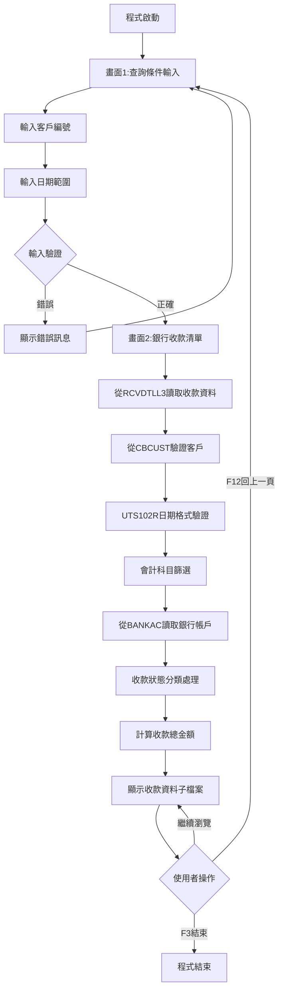
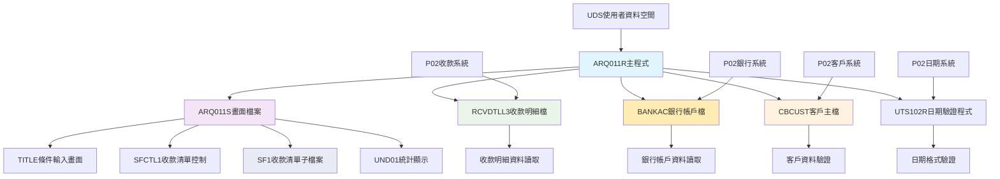
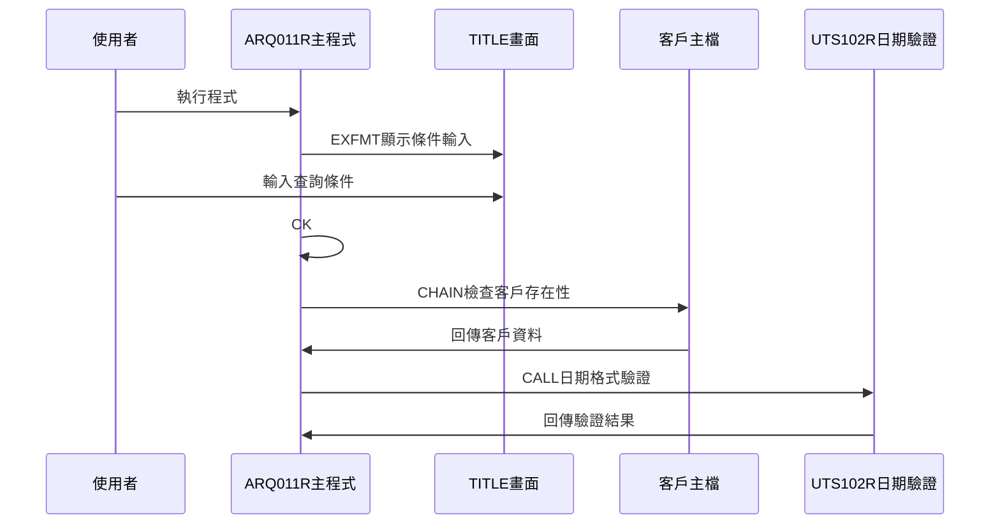
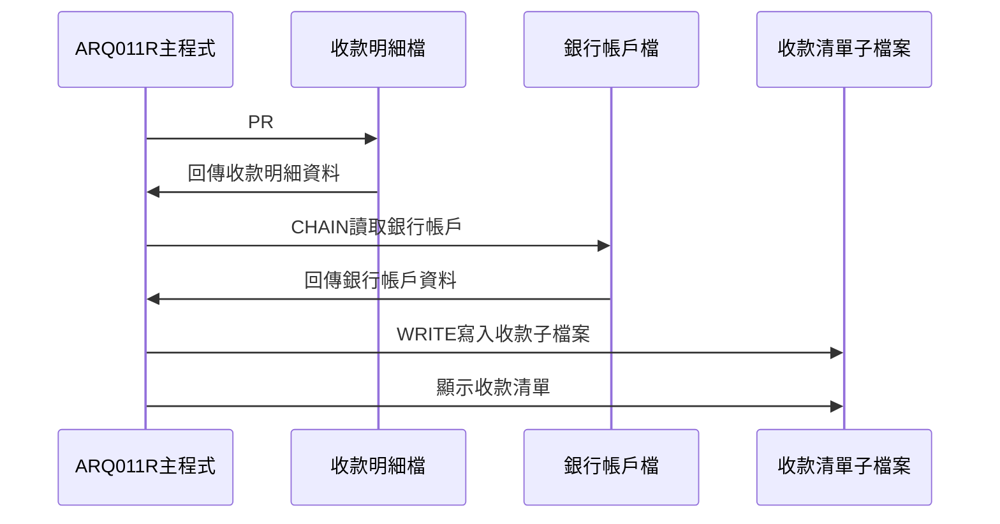
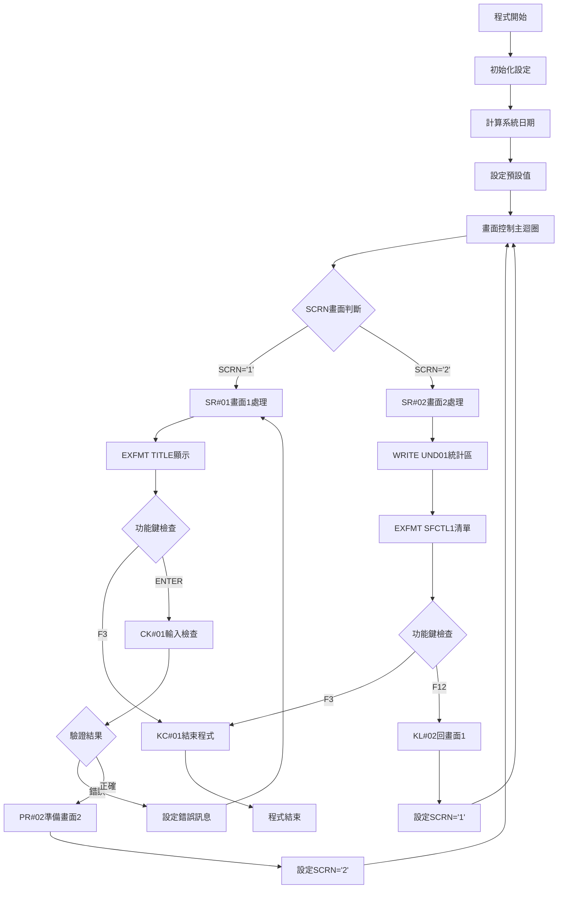

# ARQ011R_P02 程式規格書

## 1. 基本資料

| 項目 | 內容 |
|------|------|
| **程式編號** | ARQ011R |
| **程式名稱** | 銀行收款資料查詢作業 |
| **程式類型** | RPG |
| **廠區** | P02 |
| **系統名稱** | 應收帳款系統 |
| **子系統** | 銀行收款管理與查詢 |
| **檔案位置** | P02RPGSRC_THSRC/ARQ011R.txt |

## 2. 🎯 程式功能說明

### 主要功能描述
此程式為銀行收款資料查詢作業的主要處理程式，專門提供銀行收款明細的查詢和分析功能。程式採用雙階段式畫面設計，透過收款明細檔(RCVDTLL3)、銀行帳戶檔(BANKAC)和客戶主檔(CBCUST)的整合處理，提供完整的銀行收款查詢分析服務。P02版本具有日期範圍篩選機制、銀行帳戶分類功能、收款狀態分析、以及詳細的收款資料瀏覽。程式特別針對P02廠區的銀行收款管理業務設計，確保收款查詢結果的準確性和完整性，同時提供使用者友善的操作介面和完整的銀行收款資料展示功能。程式支援專業日期驗證、會計科目篩選、收款狀態分類，並提供收款總金額統計功能。

### 🎯 業務流程詳細說明

#### 完整業務流程圖


#### 業務流程關鍵階段說明

**第一階段：查詢條件輸入與驗證**
- 顯示TITLE畫面進行條件輸入
- 使用者輸入客戶編號(CUST1)
- 使用者輸入日期範圍(DATE1-DATE2)
- 系統自動設定預設日期範圍

**第二階段：輸入條件檢查與驗證**
- 檢查客戶編號是否存在於CBCUST
- 呼叫UTS102R程式進行雙重日期格式驗證
- 驗證日期範圍的合理性(DATE1 <= DATE2)
- 設定相應的錯誤指示器和錯誤訊息

**第三階段：銀行收款資料查詢與準備**
- 從RCVDTLL3讀取指定客戶和日期範圍的收款資料
- 根據會計科目(1131/111001)進行篩選
- 從BANKAC讀取對應的銀行帳戶資料
- 進行收款狀態分類和分析

**第四階段：收款狀態分類處理**
- 分析收款狀態代碼(RVNTCD)
- 處理匯款地點代碼(RVPLAC)
- 進行收款類型分類(沖銷/其他/處理/列印)
- 計算符合條件的收款總金額

**第五階段：銀行收款子檔案顯示**
- 顯示SFCTL1控制的SF1子檔案
- 展示銀行帳戶、收款憑證、金額等資訊
- 提供收款總金額統計(TTLAMT)
- 支援完整的收款資料瀏覽功能

#### 🎯 P02版本銀行收款資料查詢特色
- **雙階段畫面**：條件輸入畫面和收款資料顯示畫面
- **日期範圍查詢**：支援起始和結束日期的範圍查詢
- **銀行帳戶整合**：整合BANKAC提供完整銀行帳戶資訊
- **收款狀態分析**：提供詳細的收款狀態分類和分析

#### 多層次檢查機制
- **客戶驗證檢查**：驗證客戶編號的有效性
- **日期格式檢查**：透過UTS102R程式進行專業日期驗證
- **會計科目檢查**：篩選指定的會計科目(1131/111001)
- **收款狀態檢查**：分析和分類收款狀態

#### 智能處理邏輯
- 自動設定系統日期為預設起始日期
- 智能處理日期範圍的預設值設定
- 動態讀取銀行帳戶資料提供完整資訊
- 自動分類收款狀態提供決策參考

#### 資料一致性確保機制
- 透過多個KLIST建立正確的檔案讀取鍵值
- 使用指示器控制子檔案的顯示狀態
- 分階段處理確保各步驟資料同步
- 記錄詳細的收款查詢軌跡供後續分析

#### P02版本銀行收款資料查詢專業設計理念
- **收款專精**：專門提供銀行收款資料的查詢和分析功能
- **使用者導向**：雙階段操作流程符合使用者習慣
- **多維整合**：整合客戶、銀行、收款的完整資訊
- **P02特殊適配**：專為P02廠區的銀行收款管理需求設計

## 3. 🎯 檔案架構與關聯圖

### 使用檔案清單

| 檔案名稱 | 檔案類型 | 使用方式 | 說明 |
|----------|----------|----------|------|
| **ARQ011S** | DSPF | CF/COMBINED | 銀行收款資料查詢畫面檔案 |
| **RCVDTLL3** | 邏輯檔 | IF/INPUT | 收款明細檔案(邏輯檔L3) |
| **BANKAC** | 邏輯檔 | IF/INPUT | 銀行帳戶檔案 |
| **CBCUST** | 邏輯檔 | IF/INPUT | 客戶主檔案 |

### 🎯 檔案關聯詳細視覺化圖表



### 🎯 P02版本特殊資料流向說明

#### 查詢條件輸入階段的資料流向


#### P02版本銀行收款查詢階段的資料流向


## 4. 🎯 檔案欄位規格說明

### 主要資料結構

#### 使用檔案清單
| 檔案名稱 | 檔案類型 | 使用方式 | 說明 |
|----------|----------|----------|------|
| **ARQ011S** | DSPF | CF/COMBINED | 銀行收款資料查詢畫面檔案，含TITLE和SFCTL1 |
| **RCVDTLL3** | 邏輯檔 | IF/INPUT | 收款明細檔案(邏輯檔L3)，主要查詢檔案 |
| **BANKAC** | 邏輯檔 | IF/INPUT | 銀行帳戶檔案，銀行帳戶資訊查詢 |
| **CBCUST** | 邏輯檔 | IF/INPUT | 客戶主檔案，客戶驗證和名稱查詢 |

### 🔍 重點欄位切割技術詳解

#### DS結構完整分析

##### AADS資料結構切割分析
```
AADS資料結構 (26字元)：[___銀行帳戶ID___|_____日期資料_____]
位置:                  11           20 21            26
                       ↓            ↓  ↓             ↓
位置11-20:            [PID_______]     銀行帳戶ID(10字元)
位置21-26:                         [YMD___]          年月日資料(6字元)
```

**銀行帳戶ID三重切割邏輯**：
```
PID銀行帳戶ID (10字元)：[類型|幣別|____帳戶號碼____]
位置:                    11   12   13              20
                         ↓    ↓    ↓               ↓
PID1(11-11):            [B]                        帳戶類型(1字元)
PID2(12-12):                 [2]                   帳戶幣別(1字元)
PID3(13-20):                      [34567890]       帳戶號碼(8字元)
```

**日期資料三重切割邏輯**：
```
YMD年月日資料 (6字元)：[年|月|日]
位置:                  21 22 23 24 25 26
                       ↓  ↓  ↓  ↓  ↓  ↓
YY(21-22):            [91]           年份(2字元)
MM(23-24):               [12]        月份(2字元)
DD(25-26):                  [31]     日期(2字元)
```

**切割邏輯詳細說明**：
- **PID (11-20, 10字元)**：從RCVDTLL3的RVTANO欄位移入，作為銀行帳戶ID查詢基礎
- **PID1 (11-11, 1字元)**：PID第1位，識別銀行帳戶類型(B=活存,S=定存)
- **PID2 (12-12, 1字元)**：PID第2位，識別帳戶幣別(1=台幣,2=美金)
- **PID3 (13-20, 8字元)**：PID第3-10位，銀行帳戶號碼，用於ACKEY查詢
- **YMD (21-26, 6字元)**：日期資料暫存區，年月日格式處理
- **YY (21-22, 2字元)**：民國年份，2位數格式
- **MM (23-24, 2字元)**：月份，01-12範圍
- **DD (25-26, 2字元)**：日期，01-31範圍

**實際數據範例說明**：
```
AADS實際切割範例：
輸入: RVTANO="B234567890" → MOVEL至PID
切割處理:
1. PID = "B234567890" (位置11-20)
2. PID1 = "B" (位置11切割) → 銀行活存帳戶
3. PID2 = "2" (位置12切割) → 美金帳戶
4. PID3 = "34567890" (位置13-20切割) → 帳戶號碼
5. ACKEY組合: ACTYPE="B" + ACCURR="2" + ACACNO="34567890"
```

##### UDS使用者資料空間結構切割
```
UDS使用者資料空間 (1030字元)：[___________公司名稱區塊___________|設備名稱區塊|廠區]
位置:                          951                    985 1011    1020 1021
                                ↓                      ↓   ↓       ↓    ↓
位置951-985:                  [COMP____________________________]        公司名稱(35字元)
位置1011-1020:                                         [DEVNM____]      設備名稱(10字元)
位置1021:                                                       [TXAR]   交易廠區(1字元)
```

**切割邏輯詳細說明**：
- **COMP (951-985, 35字元)**：用於TITLE和SFCTL1畫面標題顯示的公司名稱
- **DEVNM (1011-1020, 10字元)**：設備名稱，用於畫面右上角顯示終端機識別
- **TXAR (1021, 1字元)**：交易廠區代號，P02廠區識別和權限控制

**實際數據範例說明**：
```
UDS實際資料範例：
位置951-985: "東鋼鋼鐵股份有限公司               " (35字元) → TITLE畫面標題
位置1011-1020: "TERM001   " (10字元) → 畫面右上角設備顯示
位置1021: "P" (1字元) → P02廠區識別
```

##### ERR錯誤訊息表結構分析
```
ERR錯誤訊息表 (70字元)：[完整錯誤訊息內容____________________________________]
位置:                   1                                                70
                        ↓                                                ↓
位置1-70:              [日期格式錯誤，請檢查輸入的日期格式是否正確！    ]  錯誤訊息(70字元)
```

**實際錯誤訊息表資料**：
```
ERR,1 → "日期格式錯誤，請檢查輸入的日期格式是否正確！"
ERR,2 → "日期範圍錯誤，起始日期不可大於結束日期！"
ERR,3 → "客戶編號錯誤，客戶編號不存在，請檢查！"
```

##### TAB2狀態對照表結構分析
```
TAB2狀態對照表 (7字元)：[狀態代號|狀態名稱__]
位置:                   1       2        7
                        ↓       ↓        ↓
位置1:                 [1]               狀態代號(1字元)
位置2-7:                [沖銷  ]        狀態名稱(6字元)
```

**實際對照表資料**：
```
TAB2,1 → "沖銷"
TAB2,2 → "其他"
TAB2,3 → "處理"
TAB2,4 → "列印"
```

#### 欄位切割視覺化展示

##### 三重KLIST查詢鍵值結構完整分析
```
RVKEY收款明細查詢鍵值 (34字元)：[CUNO__|DUDT____|NTNO___|NO________|ITEM]
位置:                           001   007     015     025      035
                                ↓     ↓       ↓       ↓        ↓
RVCUNO(001-006):               [CU0001]                        客戶編號(6字元)
RVDUDT(007-014):                     [20231231]               到期日(8字元)
RVNTNO(015-021):                              [RN00001]       異動號碼(7字元)
RVNO(022-031):                                       [RV00000001] 收款憑證號(10字元)
RVITEM(032-034):                                               [001] 收款項目(3字元)

ACKEY銀行帳戶查詢鍵值 (10字元)：[TYPE|CURR|___ACNO___]
位置:                           001  002  003       010
                                ↓    ↓    ↓         ↓
ACTYPE(001-001):               [B]                  帳戶類型(1字元)
ACCURR(002-002):                   [2]              帳戶幣別(1字元)
ACACNO(003-010):                       [34567890]  帳戶號碼(8字元)

CBKEY客戶主檔查詢鍵值 (6字元)：[CUST1_]
位置:                          001  006
                               ↓    ↓
CUST1(001-006):               [CU0001] 客戶編號(6字元)
```

##### 查詢條件與驗證變數組合結構
```
查詢條件完整組合 (22字元)：[CUST1_|DATE1___|DATE2___|FLAG]
位置:                      001   007     015     023
                           ↓     ↓       ↓       ↓
CUST1(001-006):           [CU0001]                客戶編號(6字元)
DATE1(007-014):                [20231201]        起始日期(8字元數值)
DATE2(015-022):                        [20231231] 結束日期(8字元數值)
FLAG(023-023):                                [0] 驗證結果旗標(1字元)
```

**查詢邏輯使用範例**：
```
實際查詢組合範例：
輸入: CUST1="CU0001", DATE1=20231201, DATE2=20231231
處理: CBKEY客戶驗證 → RVKEY設定 → SETLL定位 → READ順序讀取
條件: RVCUNO=CUST1 AND DATE1≤RVDUDT≤DATE2 AND RVACNO IN('1131','111001')
```

##### 銀行帳戶分割轉換完整流程
```
銀行帳戶ID分割轉換流程：
步驟1: RCVDTLL3讀取 → RVTANO="B234567890"
步驟2: MOVEL轉移 → PID="B234567890"
步驟3: 位置切割 → PID1="B", PID2="2", PID3="34567890"
步驟4: ACKEY組合 → ACTYPE="B" + ACCURR="2" + ACACNO="34567890"
步驟5: BANKAC查詢 → CHAIN取得ACBNAM銀行帳戶名稱
步驟6: 結果顯示 → W01=ACBNAM, W02=RVTANO
```

**分割視覺化詳細展示**：
```
原始帳戶ID: RVTANO (10字元) = [B|2|34567890]
                             ↓ ↓ ↓
分割結果:    PID1="B"     → ACTYPE  (銀行帳戶類型)
            PID2="2"     → ACCURR  (帳戶幣別)
            PID3="34567890" → ACACNO (帳戶號碼)
                             ↓
查詢鍵值:   ACKEY="B" + "2" + "34567890"
                             ↓
銀行資料:   BANKAC → ACBNAM="台灣銀行美金帳戶"
```

### 🎯 欄位挪用詳細分析

#### 挪用情況對比表
| 欄位名稱 | 原始定義 | 實際使用方式 | 挪用原因 | 挪用方式詳細說明 |
|----------|----------|-------------|----------|------------------|
| **AADS DS** | 一般資料結構 | 銀行帳戶ID專用分割區 | 銀行帳戶查詢需求 | PID分割為帳戶類型、幣別、號碼三部分 |
| **W01-W27** | 畫面工作變數 | 收款明細專用顯示欄位 | 子檔案資料顯示需求 | 對應RCVDTLL3各欄位的顯示轉換 |
| **SCRN** | 畫面控制 | 雙階段畫面流程控制 | 條件輸入和資料顯示分離 | '1'=條件輸入畫面，'2'=收款清單畫面 |
| **RRN** | 記錄號碼 | 子檔案記錄序號控制 | SF1子檔案管理需求 | 控制收款清單顯示順序和數量 |
| **P#DATE** | 參數欄位 | UTS102R日期驗證專用 | 日期格式驗證需求 | DATE1和DATE2的格式驗證轉換 |
| **FLAG** | 旗標變數 | UTS102R驗證結果專用 | 日期驗證回傳控制 | '0'=正確，非'0'=格式錯誤 |
| **ERR表** | 錯誤訊息 | 三類錯誤專用訊息 | 分類錯誤處理需求 | 日期、範圍、客戶三種錯誤分類 |
| **TAB2表** | 對照表 | 收款狀態專用轉換 | 狀態代號友善顯示 | RVNTCD代號轉換為中文狀態名稱 |

#### 挪用原因深度分析

##### AADS DS銀行帳戶分割挪用分析
**原始定義**：一般資料結構暫存區
**實際使用**：銀行帳戶ID專業分割機制
**挪用原因**：
1. RCVDTLL3的RVTANO欄位包含銀行帳戶類型、幣別、號碼的複合資訊
2. BANKAC檔案的ACKEY需要分別的ACTYPE、ACCURR、ACACNO三個鍵值
3. 需要高效的字串分割機制進行銀行帳戶資料轉換
4. 提供統一的銀行帳戶處理邏輯

**挪用方式詳細說明**：
```
銀行帳戶分割挪用機制：
步驟1：資料接收
  MOVELRVTANO → PID (將收款明細帳戶ID移入DS結構)
  
步驟2：位置分割
  PID1 = PID位置11 (帳戶類型分割)
  PID2 = PID位置12 (帳戶幣別分割)  
  PID3 = PID位置13-20 (帳戶號碼分割)
  
步驟3：查詢鍵值組合
  MOVELPID1 → ACTYPE (帳戶類型設定)
  MOVELPID2 → ACCURR (帳戶幣別設定)
  MOVELPID3 → ACACNO (帳戶號碼設定)
  
步驟4：銀行檔案查詢
  ACKEY CHAIN BANKAC (銀行帳戶資料查詢)
```

##### W01-W27收款顯示欄位挪用分析
**原始定義**：畫面工作變數
**實際使用**：收款明細專業化顯示欄位
**挪用原因**：
1. SF1子檔案需要大量的收款明細資料顯示
2. RCVDTLL3檔案欄位名稱不適合直接顯示
3. 需要整合BANKAC、TAB2等檔案的資料轉換
4. 提供統一的收款資料顯示格式

**挪用方式詳細說明**：
```
收款顯示欄位挪用機制：
W01 → 銀行帳戶名稱 (MOVELACBNAM → W01)
     來源：BANKAC檔案ACBNAM欄位
     用途：顯示完整銀行帳戶名稱
     
W02 → 銀行帳戶ID (MOVELRVTANO → W02)
     來源：RCVDTLL3檔案RVTANO欄位
     用途：顯示原始帳戶ID便於識別
     
W03 → 異動號碼 (MOVELRVNTNO → W03)
     來源：RCVDTLL3檔案RVNTNO欄位
     用途：顯示收款交易識別號
     
W04-W06 → 日期金額 (Z-ADD轉換)
W21-W27 → 其他收款資訊 (MOVEL轉換)
```

##### SCRN雙階段畫面控制挪用分析
**原始定義**：畫面控制變數
**實際使用**：銀行收款查詢專業流程控制
**挪用原因**：
1. 銀行收款查詢需要條件輸入和資料顯示的分離設計
2. 需要清楚的畫面流程控制和轉換邏輯
3. 提供使用者友善的操作體驗
4. 支援F12回轉功能的畫面記錄

**挪用方式詳細說明**：
```
雙階段畫面控制挪用邏輯：
初始化：SCRN='1' (條件輸入畫面)
     ↓
CASEQ判斷：
  SCRN='1' → EXSR SR#01 (條件輸入處理)
    ↓ 驗證成功
  SCRN='2' → EXSR SR#02 (收款清單處理)
    ↓ F12回轉
  SCRN='1' → 回到條件輸入
  
畫面轉換控制：
CK#01驗證通過 → MOVE '2' → SCRN (進入清單畫面)
KL#02 F12處理 → MOVE '1' → SCRN (回到條件畫面)
```

#### 挪用影響評估

##### 系統維護影響分析
**正面影響**：
1. **資料處理效率**：AADS DS結構提供高效的銀行帳戶分割機制
2. **顯示統一性**：W01-W27變數提供一致的收款資料顯示格式
3. **流程清晰性**：SCRN控制提供清楚的雙階段操作流程
4. **錯誤處理統一**：ERR表提供分類的錯誤訊息處理

**維護考量**：
1. **DS結構依賴**：AADS結構變更需考慮銀行帳戶分割邏輯
2. **變數對應關係**：W變數與檔案欄位的對應需維持一致性
3. **流程邏輯依賴**：SCRN控制邏輯變更需整體考量
4. **表格維護複雜性**：ERR和TAB2表維護需對應程式邏輯

#### 實際數據範例說明

##### 完整收款查詢流程資料範例
```
銀行收款查詢完整流程範例：
階段1 - 初始化:
  系統日期: *DATE=20231201 → U#SYSD=1121201
  預設值: DATE1=1121201, DATE2=1991231, SCRN='1'
  
階段2 - 條件輸入:
  使用者輸入: CUST1="CU0001", DATE1=20231201, DATE2=20231231
  客戶驗證: CBKEY CHAIN CBCUST → CUSTNM="東鋼公司"
  日期驗證: UTS102R兩次驗證 → FLAG='0'(成功)
  
階段3 - 收款查詢:
  RVKEY設定: RVCUNO="CU0001" + RVDUDT=20231201 + 其他空白
  SETLL定位: RCVDTLL3檔案指標定位
  READ循環: 順序讀取符合條件記錄
  
階段4 - 銀行帳戶處理:
  帳戶分割: RVTANO="B234567890" → PID1="B", PID2="2", PID3="34567890"
  銀行查詢: ACKEY CHAIN BANKAC → ACBNAM="台灣銀行美金帳戶"
  
階段5 - 收款顯示:
  子檔案: W01="台灣銀行美金帳戶", W02="B234567890", W06=50000
  統計: TTLAMT累計未沖銷金額
```

##### 銀行帳戶分割實際範例
```
銀行帳戶分割實際處理：
原始資料: RCVDTLL3 → RVTANO="B234567890"
DS處理:
  MOVELRVTANO → PID="B234567890"
  PID位置11-20="B234567890"
  
分割結果:
  PID1 = PID[11] = "B" → 銀行活存帳戶
  PID2 = PID[12] = "2" → 美金幣別
  PID3 = PID[13-20] = "34567890" → 實際帳戶號碼
  
查詢組合:
  ACTYPE="B" + ACCURR="2" + ACACNO="34567890"
  ACKEY CHAIN BANKAC → 取得完整銀行資料
  
顯示結果:
  W01=ACBNAM="台灣銀行美金帳戶"
  W02=RVTANO="B234567890"(原始ID保留)
```

##### 收款狀態轉換實際範例
```
收款狀態轉換實際處理：
狀態轉換: RVNTCD="1" → TAB2 LOKUP → TABR2="沖銷" → W24="沖銷"
地點轉換: RVPLAC="D" → W26="國內", RVPLAC="E" → W26="國外"
金額統計: RVNTCD=' '(空白) → TTLAMT += RVRAMT (只累計未沖銷)
```

### 重要變數定義表

#### 銀行帳戶與DS結構變數
| 變數名稱 | 類型 | 長度 | 使用範圍 | 說明 |
|----------|------|------|----------|------|
| **PID** | CHAR | 10 | AADS DS結構 | 銀行帳戶ID暫存區(位置11-20) |
| **PID1** | CHAR | 1 | AADS DS結構 | 帳戶類型分割(位置11) |
| **PID2** | CHAR | 1 | AADS DS結構 | 帳戶幣別分割(位置12) |
| **PID3** | CHAR | 8 | AADS DS結構 | 帳戶號碼分割(位置13-20) |
| **YMD** | NUM | 6 | AADS DS結構 | 年月日暫存區(位置21-26) |
| **YY** | NUM | 2 | AADS DS結構 | 年份分割(位置21-22) |
| **MM** | NUM | 2 | AADS DS結構 | 月份分割(位置23-24) |
| **DD** | NUM | 2 | AADS DS結構 | 日期分割(位置25-26) |

#### 查詢條件與日期驗證變數
| 變數名稱 | 類型 | 長度 | 使用範圍 | 說明 |
|----------|------|------|----------|------|
| **CUST1** | CHAR | 6 | 全程式 | 客戶編號查詢條件，CBKEY和RVKEY使用 |
| **DATE1** | NUM | 8 | 全程式 | 起始日期查詢條件，UTS102R驗證對象 |
| **DATE2** | NUM | 8 | 全程式 | 結束日期查詢條件，UTS102R驗證對象 |
| **CUSTNM** | CHAR | 10 | 畫面2顯示 | 客戶名稱，CBCUNM查詢結果 |
| **U#SYSD** | NUM | 8 | 初始化 | 系統日期，*DATE-19000000計算結果 |
| **P#DATE** | CHAR | 8 | UTS102R參數 | 日期驗證參數，DATE1/DATE2轉換 |
| **P#MODE** | CHAR | 1 | UTS102R參數 | 驗證模式，固定'1' |
| **P#MTL** | CHAR | 24 | UTS102R參數 | 訊息欄位，24字元訊息回傳 |
| **P#LY** | CHAR | 1 | UTS102R參數 | 年份檢查，1字元旗標 |
| **FLAG** | CHAR | 1 | UTS102R回傳 | 驗證結果旗標，'0'=正確 |

#### 畫面控制與子檔案變數
| 變數名稱 | 類型 | 長度 | 使用範圍 | 說明 |
|----------|------|------|----------|------|
| **SCRN** | CHAR | 1 | 主程式DOUEQ | 畫面控制變數('1'/'2') |
| **RRN** | NUM | 4 | SR#02/PR#02 | SF1子檔案記錄號碼 |
| **R#L01** | NUM | 3 | PR#02 | 記錄限制數量(990) |
| **TTLAMT** | NUM | 11 | PR#02統計 | 收款總金額累計 |

#### 收款明細顯示變數
| 變數名稱 | 類型 | 長度 | 使用範圍 | 說明 |
|----------|------|------|----------|------|
| **W01** | CHAR | 16 | SF1顯示 | 銀行帳戶名稱，ACBNAM對應 |
| **W02** | CHAR | 10 | SF1顯示 | 銀行帳戶ID，RVTANO對應 |
| **W03** | CHAR | 7 | SF1顯示 | 異動號碼，RVNTNO對應 |
| **W04** | NUM | 8 | SF1顯示 | 收款日期，RVDATE對應 |
| **W05** | NUM | 8 | SF1顯示 | 到期日，RVDUDT對應 |
| **W06** | NUM | 11 | SF1顯示 | 收款金額，RVRAMT對應 |
| **W21** | CHAR | 10 | SF1顯示 | 銀行憑證ID，RVPBID對應 |
| **W22** | CHAR | 10 | SF1顯示 | 銀行憑證號，RVPANO對應 |
| **W23** | CHAR | 10 | SF1顯示 | 收款憑證號，RVNO對應 |
| **W24** | CHAR | 6 | SF1顯示 | 收款狀態，TAB2轉換結果 |
| **W25** | CHAR | 10 | SF1顯示 | 憑證號碼2，RVVNO2對應 |
| **W26** | CHAR | 6 | SF1顯示 | 匯款地點，RVPLAC轉換結果 |
| **W27** | CHAR | 1 | SF1顯示 | 使用者類型，RVUSTP對應 |

#### 檔案查詢鍵值變數
| 變數名稱 | 類型 | 長度 | 使用範圍 | 說明 |
|----------|------|------|----------|------|
| **RVCUNO** | CHAR | 6 | RVKEY鍵值 | 收款客戶編號，CUST1設定 |
| **RVDUDT** | NUM | 8 | RVKEY鍵值 | 收款到期日，DATE1設定 |
| **RVNTNO** | CHAR | 7 | RVKEY鍵值 | 收款異動號，空白初始 |
| **RVNO** | CHAR | 10 | RVKEY鍵值 | 收款憑證號，空白初始 |
| **RVITEM** | CHAR | 3 | RVKEY鍵值 | 收款項目，空白初始 |
| **ACTYPE** | CHAR | 1 | ACKEY鍵值 | 銀行帳戶類型，PID1設定 |
| **ACCURR** | CHAR | 1 | ACKEY鍵值 | 銀行帳戶幣別，PID2設定 |
| **ACACNO** | CHAR | 8 | ACKEY鍵值 | 銀行帳戶號碼，PID3設定 |

#### 錯誤處理變數
| 變數名稱 | 類型 | 長度 | 使用範圍 | 說明 |
|----------|------|------|----------|------|
| **ERRMSG** | CHAR | 70 | CK#01/KL#02 | 錯誤訊息顯示，ERR表對應 |

## 5. 🎯 輸出/入螢幕布局

### 畫面1：查詢條件輸入畫面(TITLE)

```
+------------------------------------------------------------------------------+
|[日期]                東鋼鋼鐵股份有限公司                          ARQ011S-1 |
|                   ***  銀行收款資料查詢  ***                      [設備名稱] |
|                                                                              |
|                                                                              |
|                                                                              |
|                                                                              |
|                      客戶編號: [______]                                      |
|                                                                              |
|                                                                              |
|                      查詢日期: [____/__/__] - [____/__/__]                 |
|                                                                              |
|                                                                              |
|                                                                              |
|                                                                              |
|                                                                              |
|                                                                              |
|                                                                              |
|                                                                              |
|                                                                              |
|                                                                              |
|[錯誤訊息顯示區]                                                              |
|    ENTER:執行                    PF03:結束                                   |
+------------------------------------------------------------------------------+
```

### 畫面2：銀行收款資料顯示畫面(SFCTL1)

```
+------------------------------------------------------------------------------+
|[日期]                東鋼鋼鐵股份有限公司                          ARQ011S-2 |
|                   ***  銀行收款資料查詢  ***                      [設備名稱] |
|                      客戶編號: [______] 客戶名稱: [__________]               |
|                      查詢日期: [____/__/__] - [____/__/__]                 |
|----------------------------------------------------------------------------- |
|                                                                              |
|      銀行           行            收           沖銷編號        收款金額       |
|    行憑證          名              ú           ú款日期        到期日期       |
|  銀行帳戶名稱        庫      異動號碼  ú款日期      到期日      收款金額      |
|----------------------------------------------------------------------------- |
| [___________][________________][_____][____/__/__][____/__/__][_________]   |
| [___________][________________][_____][____/__/__][____/__/__][_________]   |
| [___________][________________][_____][____/__/__][____/__/__][_________]   |
| [___________][________________][_____][____/__/__][____/__/__][_________]   |
| [___________][________________][_____][____/__/__][____/__/__][_________]   |
| [___________][________________][_____][____/__/__][____/__/__][_________]   |
| [___________][________________][_____][____/__/__][____/__/__][_________]   |
|                                                                              |
|----------------------------------------------------------------------------- |
|                                  銀行收款總金額合計: [___________]          |
|    ENTER:重整                   PF03:結束              PF12:回到上頁         |
+------------------------------------------------------------------------------+
```

### 🎯 畫面欄位詳細說明

#### 畫面1輸入欄位
| 欄位名稱 | 欄位屬性 | 位置 | 長度 | 輸入格式 | 驗證規則 | 說明 |
|----------|----------|------|------|----------|----------|------|
| **CUST1** | 輸入/輸出 | 7,39 | 6 | 英數字元 | 客戶編號 | 客戶編號輸入 |
| **DATE1** | 輸入/輸出 | 10,39 | 8 | 年/月/日 | UTS102R驗證 | 起始日期輸入 |
| **DATE2** | 輸入/輸出 | 10,52 | 8 | 年/月/日 | UTS102R驗證 | 結束日期輸入 |

#### 畫面2顯示欄位
| 欄位名稱 | 欄位屬性 | 說明 |
|----------|----------|------|
| **W01** | 顯示 | 銀行帳戶名稱 |
| **W02** | 顯示 | 銀行帳戶ID |
| **W03** | 顯示 | 異動號碼 |
| **W04** | 顯示 | 收款日期 |
| **W05** | 顯示 | 到期日 |
| **W06** | 顯示 | 收款金額 |
| **W21-W27** | 顯示 | 其他收款相關資訊 |
| **TTLAMT** | 顯示 | 收款總金額 |

### 功能鍵詳細定義

| 功能鍵 | 處理邏輯 | 系統行為 | 說明 |
|--------|----------|----------|------|
| **F3** | 設定IN03='1' | 程式立即結束 | 離開查詢作業 |
| **F12** | 回到上一畫面 | 畫面流程控制 | 返回上一個操作畫面 |
| **ENTER** | 執行查詢 | 根據畫面執行相應動作 | 執行查詢條件 |

### 輸入驗證機制

#### 查詢條件驗證
- CUST1客戶編號必須存在於CBCUST
- DATE1和DATE2透過UTS102R程式進行格式驗證
- DATE1不可大於DATE2
- 日期範圍設定合理性檢查

#### P02版本特殊驗證
- 檢查客戶主檔的資料完整性
- 驗證日期格式的正確性
- 確認收款明細檔的存在性
- 檢查銀行帳戶檔的關聯性

## 6. 🎯 處理流程程序說明

### 🎯 主程序邏輯深度分析

#### P02版本程式執行流程圖


#### 🎯 P02版本銀行收款資料查詢特殊步驟分析

**步驟1：程式初始化設定**
- 計算系統日期(*DATE - 19000000)
- 設定預設起始日期為系統日期
- 設定預設結束日期為1991231
- 設定記錄限制數(R#L01=990)
- 設定初始畫面編號(SCRN='1')

**步驟2：SR#01畫面1查詢條件輸入處理**
- 顯示TITLE畫面進行條件輸入
- 檢查F3功能鍵決定是否結束程式
- 執行CK#01輸入條件檢查
- 驗證通過則執行PR#02準備畫面2資料

**步驟3：CK#01輸入條件檢查邏輯**
- 檢查客戶編號(CUST1)是否存在於CBCUST
- 取得客戶名稱(CBCUNM)進行顯示
- 驗證日期範圍(DATE1 <= DATE2)
- 呼叫UTS102R程式進行雙重日期格式驗證
- 設定相應的錯誤指示器(41, 42, 43, 99)

**步驟4：UTS102R日期驗證處理**
- 對DATE1進行日期格式驗證
- 對DATE2進行日期格式驗證
- 檢查兩次驗證結果旗標FLAG
- 若任一驗證失敗則設定錯誤指示器和訊息

**步驟5：PR#02銀行收款資料準備**
- 清除錯誤訊息和統計變數
- 從RCVDTLL3讀取指定客戶和日期範圍的收款資料
- 根據會計科目(1131/111001)進行篩選
- 從BANKAC讀取對應的銀行帳戶資料
- 進行收款狀態分類和金額統計

**步驟6：收款資料篩選與處理邏輯**
- 根據客戶編號(RVCUNO = CUST1)篩選
- 根據到期日範圍(DATE1 <= RVDUDT <= DATE2)篩選
- 檢查會計科目(RVACNO = '1131' 或 '111001')
- 處理銀行帳戶ID分割(RVTANO → PID1, PID2, PID3)
- 累計符合條件的收款金額(RVNTCD = ' ')

**步驟7：收款狀態分類處理**
- 使用TAB2對照表轉換收款狀態(RVNTCD)
- 處理匯款地點代碼(RVPLAC: D=國內, E=國外)
- 設定列印控制標記(RVPRCD = 'Y')
- 控制顯示記錄數量(RRN <= R#L01)

**步驟8：SR#02畫面2銀行收款資料顯示處理**
- 顯示UND01統計資訊區域
- 顯示SFCTL1控制的SF1子檔案
- 處理使用者的功能鍵操作
- 提供收款資料瀏覽功能

#### 業務邏輯深度解析

**P02版本銀行收款資料查詢的核心邏輯**：
1. 提供雙階段式的銀行收款查詢和分析功能
2. 支援多檔案整合機制確保查詢完整性
3. 提供專業的日期格式驗證功能
4. 銀行收款專業化查詢的完整實現

**P02版本效能優化機制**：
1. 使用記錄限制數控制子檔案顯示效能
2. 分階段處理確保查詢效能
3. 智能篩選處理減少不必要的資料載入
4. 提供收款總金額統計

#### 條件判斷詳細說明

**P02版本客戶驗證判斷**：
- `CBKEY CHAIN CBCUST` - 檢查客戶編號存在性
- `*IN31 = '1'` - 客戶不存在時設定錯誤

**P02版本日期驗證判斷**：
- `DATE1 IFGT DATE2` - 起始日期大於結束日期時錯誤
- `FLAG IFNE '0'` - UTS102R驗證失敗時設定錯誤

**P02版本會計科目篩選判斷**：
- `RVACNO COMP '1131'` - 檢查會計科目1131
- `RVACNO COMP '111001'` - 檢查會計科目111001

#### 變數使用和數據流向追蹤

**P02版本特殊變數軌跡**：
1. 日期變數(DATE1, DATE2, U#SYSD, P#DATE)的處理軌跡
2. 畫面控制變數(SCRN)的狀態轉換軌跡
3. 子檔案記錄號碼(RRN)和限制數(R#L01)的管理軌跡
4. 統計變數(TTLAMT)的累計軌跡
5. 銀行帳戶變數(PID, PID1, PID2, PID3)的分割軌跡
6. 錯誤處理變數(ERRMSG, 指示器)的設定軌跡

### 🎯 P02版本子程序邏輯分析

#### P02版本子程序調用順序
1. **CK#01程序**：輸入條件檢查，驗證查詢條件的合法性
2. **PR#02程序**：銀行收款資料準備，讀取和處理收款明細資料
3. **KC#01程序**：F3功能鍵處理，程式結束控制
4. **KL#02程序**：F12功能鍵處理，回到上一畫面

#### P02版本銀行收款資料查詢專精設計
- 專門提供銀行收款資料的查詢和分析功能
- 支援完整的雙階段操作流程
- 提供多檔案整合的收款查詢機制
- 針對P02廠區的銀行收款管理業務特色進行優化

## 7. 🎯 數據操作與轉換分析

### P02版本檔案操作詳解

#### P02版本RCVDTLL3收款明細檔操作
- **SETLL操作**：設定檔案指標到指定客戶和日期位置
- **READ操作**：順序讀取收款明細記錄
- **條件篩選**：根據客戶編號、日期範圍、會計科目進行精確篩選

#### P02版本BANKAC銀行帳戶檔操作
- **CHAIN操作**：根據銀行帳戶組合鍵讀取帳戶資料
- **帳戶分析**：分割銀行帳戶ID取得類型、幣別、號碼
- **名稱取得**：取得銀行帳戶名稱進行顯示

#### P02版本CBCUST客戶主檔操作
- **CHAIN操作**：直接讀取指定客戶編號的客戶記錄
- **資料驗證**：確認客戶編號的存在性
- **名稱取得**：取得客戶名稱進行顯示

### P02版本數據轉換邏輯

#### P02版本收款資料轉換
- **銀行帳戶轉換**：ACBNAM → W01 (銀行帳戶名稱)
- **收款憑證轉換**：RVTANO → W02, RVNO → W23 (憑證資訊)
- **日期轉換**：RVDATE → W04, RVDUDT → W05 (日期格式轉換)
- **金額轉換**：RVRAMT → W06 (收款金額)
- **狀態轉換**：RVNTCD → W24 (透過TAB2對照表)

#### P02版本銀行帳戶分割轉換
- **帳戶ID分割**：RVTANO(10位) → PID(10位)
- **類型分割**：PID第1位 → PID1(帳戶類型)
- **幣別分割**：PID第2位 → PID2(帳戶幣別)
- **號碼分割**：PID第3-10位 → PID3(帳戶號碼)

#### P02版本狀態分類轉換
- **收款狀態轉換**：TAB2對照表(1=沖銷,2=其他,3=處理,4=列印)
- **匯款地點轉換**：RVPLAC(D=國內,E=國外)
- **總金額累計**：符合條件收款金額的累計統計

### P02版本檢核機制詳解

#### P02版本查詢條件檢核
- **客戶存在性檢查**：客戶編號是否存在於客戶主檔
- **日期格式檢查**：透過UTS102R程式進行專業驗證
- **日期範圍檢查**：起始日期不可大於結束日期
- **邏輯一致性檢查**：查詢條件的邏輯合理性

#### P02版本資料完整性檢核
- **收款檔案檢查**：確保收款明細檔資料的完整性
- **銀行帳戶檢查**：確保銀行帳戶檔資料的正確性
- **客戶資料檢查**：確保客戶主檔資料的完整性
- **關聯性檢查**：客戶與收款資料的關聯一致性

#### P02版本顯示效能檢核
- **記錄數控制**：透過R#L01控制顯示記錄數量
- **子檔案管理**：正確管理收款子檔案的顯示狀態
- **記憶體使用**：控制資料載入量避免記憶體不足
- **響應時間**：確保查詢響應時間在合理範圍

#### P02版本業務邏輯檢核
- **會計科目檢查**：確保只處理指定的會計科目
- **收款狀態檢查**：正確分類和顯示收款狀態
- **銀行帳戶檢查**：確保銀行帳戶資料的正確關聯
- **金額統計檢查**：確保收款總金額的計算正確性

## 8. 🎯 錯誤處理程序說明

### 🎯 P02版本詳細錯誤代碼清冊

| 錯誤代碼 | 錯誤訊息 | 原因說明 | 處理方式 | 預防措施 |
|----------|---------|---------|---------|----------|
| **ERR,1** | 日期格式錯誤 | 日期格式不正確 | 1. 檢查日期輸入格式<br>2. 使用正確的年/月/日格式<br>3. 重新輸入正確日期 | 確保輸入的日期格式正確 |
| **ERR,2** | 日期範圍錯誤 | 起始日期大於結束日期 | 1. 檢查日期範圍設定<br>2. 調整起始和結束日期<br>3. 確認查詢範圍邏輯 | 檢查輸入範圍的合理性 |
| **ERR,3** | 客戶編號錯誤 | 客戶編號不存在於客戶主檔 | 1. 檢查客戶編號輸入<br>2. 確認客戶是否已建檔<br>3. 重新輸入正確編號 | 確保輸入的客戶編號正確 |
| **指示器41** | DATE1欄位錯誤 | 起始日期輸入錯誤 | 1. 重新輸入起始日期<br>2. 檢查日期格式<br>3. 確認日期有效性 | 提供有效日期格式說明 |
| **指示器42** | DATE2欄位錯誤 | 結束日期輸入錯誤 | 1. 重新輸入結束日期<br>2. 檢查日期範圍邏輯<br>3. 確認日期有效性 | 檢查日期範圍邏輯關係 |
| **指示器43** | CUST1欄位錯誤 | 客戶編號輸入錯誤 | 1. 重新輸入客戶編號<br>2. 檢查編號格式<br>3. 確認編號存在性 | 提供客戶編號格式說明 |
| **指示器99** | 一般處理錯誤 | 資料處理或驗證失敗 | 1. 檢查資料完整性<br>2. 重新執行查詢<br>3. 確認系統狀態 | 定期檢查資料檔案狀態 |
| **UTS102R驗證失敗** | 日期驗證程式異常 | 日期驗證程式執行失敗 | 1. 檢查UTS102R程式狀態<br>2. 驗證日期參數設定<br>3. 重新執行驗證 | 確保UTS102R程式正常運作 |
| **BANKAC讀取失敗** | 銀行帳戶檔異常 | 銀行帳戶資料讀取失敗 | 1. 檢查銀行帳戶檔狀態<br>2. 驗證帳戶ID格式<br>3. 重新載入資料 | 確保銀行帳戶檔完整性 |
| **子檔案顯示失敗** | SF1清單異常 | 子檔案資料載入問題 | 1. 檢查記憶體使用<br>2. 重新載入資料<br>3. 減少查詢範圍 | 控制查詢資料量 |
| **收款統計錯誤** | 金額統計異常 | 收款統計計算邏輯錯誤 | 1. 檢查收款資料正確性<br>2. 重新計算統計<br>3. 驗證計算邏輯 | 確保收款資料的完整性 |
| **畫面轉換失敗** | SCRN控制異常 | 畫面流程控制錯誤 | 1. 檢查畫面控制邏輯<br>2. 重新執行操作<br>3. 確認功能鍵處理 | 確保畫面流程控制正確 |

### 🎯 P02版本系統異常處理邏輯

#### P02版本檔案操作失敗處理
- **收款明細檔異常**：檢查RCVDTLL3檔案的可用性和完整性
- **銀行帳戶檔異常**：處理BANKAC檔案的存取問題
- **客戶主檔異常**：確認CBCUST檔案的正確性和存取權限
- **畫面檔案異常**：處理ARQ011S畫面檔案的顯示問題
- **日期驗證程式異常**：處理UTS102R程式的執行問題

#### P02版本資料完整性錯誤處理
- **查詢條件異常**：處理輸入條件和驗證的異常情況
- **收款資料異常**：處理收款明細資料的異常
- **銀行帳戶異常**：處理銀行帳戶資料的異常
- **客戶資料異常**：處理客戶主檔資料的異常
- **日期資料異常**：處理日期格式和範圍的異常

#### P02版本使用者操作錯誤處理
- **輸入格式異常**：處理使用者輸入格式的錯誤
- **功能鍵異常**：處理功能鍵操作的異常情況
- **畫面流程異常**：處理畫面切換和流程的異常

#### P02版本銀行收款資料查詢業務失敗處理
- **查詢邏輯失敗**：處理銀行收款查詢業務邏輯的異常
- **篩選功能失敗**：處理多條件篩選的異常
- **統計功能失敗**：處理收款統計和彙總的異常
- **顯示功能失敗**：處理收款資料顯示的異常

## 9. 🎯 備註

### 🎯 P02版本銀行收款資料查詢特殊注意事項

#### P02版本作為銀行收款資料查詢分析平台
- 專門提供銀行收款資料的查詢和分析功能，確保收款查詢結果的準確性
- 使用多檔案整合機制確保資料顯示的完整性
- 支援完整的雙階段操作流程確保使用者體驗
- 提供完整的銀行收款資料分析功能確保業務需求的滿足

#### P02版本銀行收款資料查詢專精管理
- **雙階段畫面**：條件輸入畫面和收款資料顯示畫面
- **多檔案整合**：整合收款明細、銀行帳戶、客戶主檔
- **日期範圍查詢**：支援起始和結束日期的範圍查詢
- **收款狀態分析**：提供詳細的收款狀態分類和分析
- **完整性保證**：確保銀行收款查詢分析的完整性和可追蹤性

#### P02版本資料顯示安全機制
- **記錄數控制**：透過R#L01限制顯示記錄數量避免效能問題
- **客戶驗證**：確保只顯示有效客戶的收款資料
- **會計科目篩選**：只顯示指定會計科目(1131/111001)的收款資料
- **安全查詢**：確保只顯示使用者有權查看的資料

#### P02版本銀行收款查詢條件處理機制
- **客戶條件處理**：支援具體客戶的精確查詢
- **日期範圍處理**：支援靈活的日期範圍查詢
- **會計科目處理**：自動篩選相關會計科目的收款資料
- **收款狀態處理**：分類顯示不同狀態的收款資料

#### P02版本多檔案整合特殊機制
- **RCVDTLL3查詢**：RVCUNO+RVDUDT+RVNTNO+RVNO+RVITEM的複合鍵查詢
- **BANKAC查詢**：ACTYPE+ACCURR+ACACNO的銀行帳戶組合鍵查詢
- **CBCUST查詢**：CUST1的客戶編號單一鍵值查詢
- **UTS102R驗證**：專業的日期格式驗證程式整合
- **帳戶ID分割**：RVTANO的10位帳戶ID分割為類型、幣別、號碼

#### P02版本收款狀態分類特殊機制
- **TAB2對照表**：1=沖銷、2=其他、3=處理、4=列印
- **匯款地點分類**：D=國內、E=國外
- **收款金額統計**：只統計RVNTCD=' '的收款金額
- **列印控制**：RVPRCD='Y'的記錄進行特殊標記

#### P02版本系統整合特性
- 與RCVDTLL3收款明細檔系統緊密整合
- 與BANKAC銀行帳戶檔系統完全相容
- 與CBCUST客戶主檔系統無縫銜接
- 與UTS102R日期驗證系統完全整合
- 支援ARQ011S畫面系統的標準化處理
- 與P02廠區檔案系統和銀行收款系統無縫銜接

#### P02版本使用者體驗特性
- **直觀操作**：雙階段操作流程符合使用者習慣
- **豐富資訊**：提供完整的客戶、銀行、收款資訊
- **靈活查詢**：支援日期範圍和客戶查詢
- **即時統計**：提供即時的收款金額統計和彙總
- **狀態分析**：提供詳細的收款狀態分類和分析

#### P02版本使用注意事項
- 執行前確保收款明細檔、銀行帳戶檔、客戶主檔資料完整
- 注意查詢範圍不宜過大以免影響效能(記錄限制R#L01=990)
- 確認使用者有查詢相關客戶收款資料的權限
- 銀行收款查詢涉及敏感財務資料需特別注意保密性
- 確保畫面檔案ARQ011S的正確設定
- 確保UTS102R日期驗證程式的正常運作
- 處理完成後注意子檔案資料的清理
- 留意收款金額統計的正確性
- 監控查詢效能避免長時間等待
- 確認銀行帳戶分割邏輯的正確性
- 注意收款狀態分類的準確性
- 確認收款分析統計的正確性和完整性

