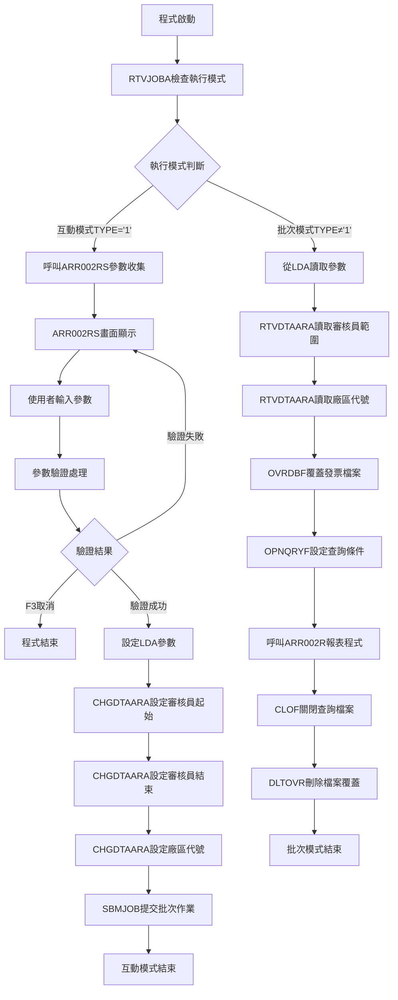
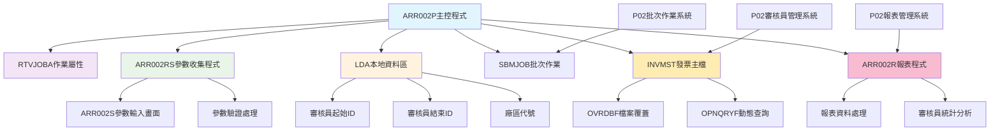
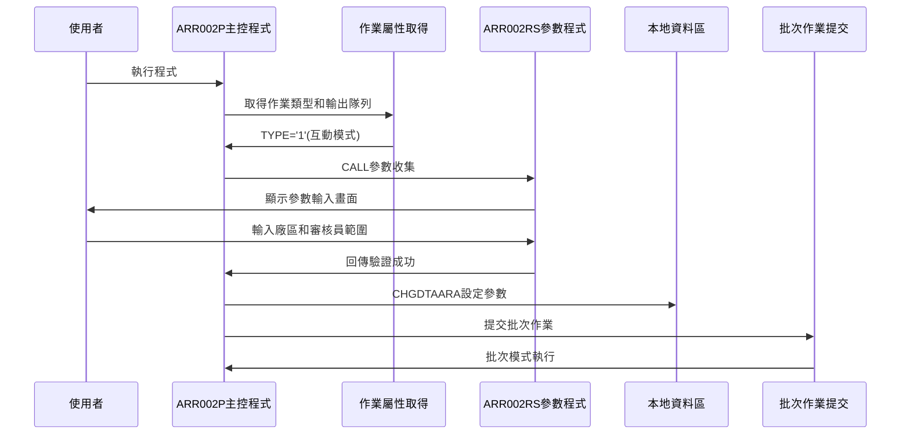
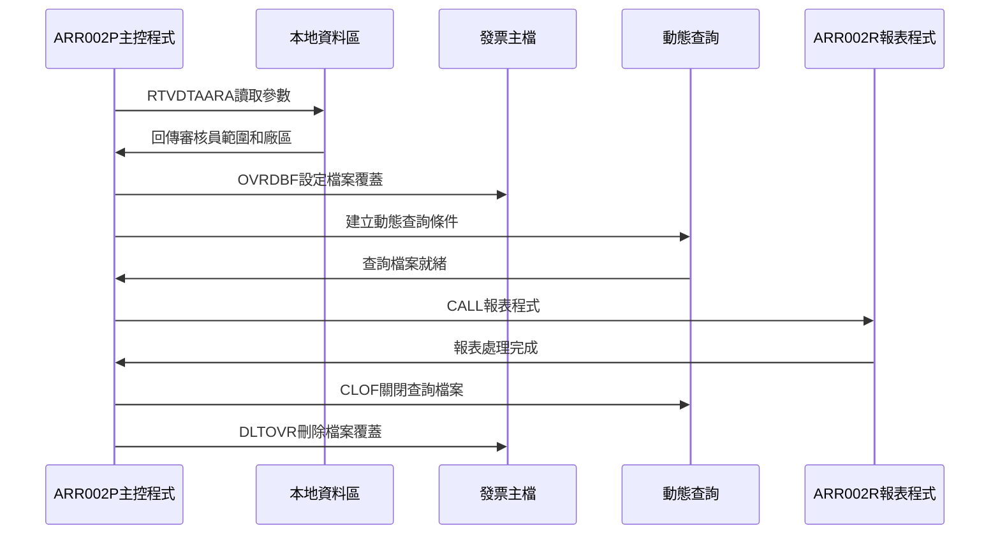
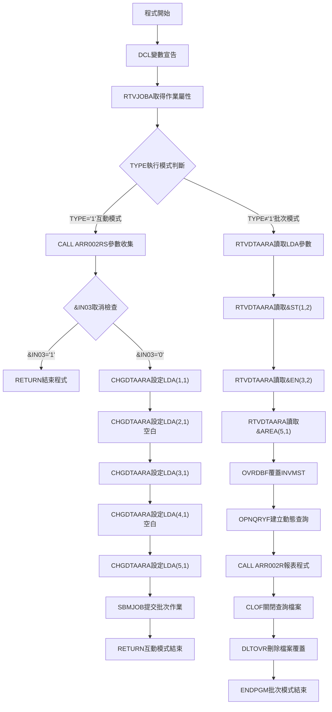

# ARR002P_P02 程式規格書

## 1. 基本資料

| 項目 | 內容 |
|------|------|
| **程式編號** | ARR002P |
| **程式名稱** | 審核員ID分廠報表作業 |
| **程式類型** | CLP |
| **廠區** | P02 |
| **系統名稱** | 應收帳款系統 |
| **子系統** | 審核員報表管理 |
| **檔案位置** | P02CLSRC_THSRC/ARR002P.txt |

## 2. 🎯 程式功能說明

### 主要功能描述
此程式為審核員ID分廠報表作業的主要控制程式，專門提供按廠區分類的審核員發票資料報表產生功能。程式採用雙模式執行設計，透過發票主檔(INVMST)的查詢處理，提供完整的審核員發票統計報表產生服務。P02版本具有互動參數收集機制、批次作業提交功能、動態查詢條件設定、以及完整的審核員發票資料篩選。程式特別針對P02廠區的審核員報表管理業務設計，確保審核員發票統計報表的準確性和完整性，同時提供使用者友善的操作介面和強大的批次處理能力。程式支援多廠區篩選、審核員ID範圍查詢、發票狀態篩選，並提供完整的報表產生流程控制。

### 🎯 業務流程詳細說明

#### 完整業務流程圖


#### 業務流程關鍵階段說明

**第一階段：執行模式判斷與分派**
- 使用RTVJOBA取得作業執行類型和輸出隊列
- 根據TYPE判斷互動模式還是批次模式
- 分派到對應的處理流程

**第二階段：互動模式參數收集**
- 呼叫ARR002RS畫面程式顯示參數輸入畫面
- 使用者輸入廠區代號、審核員ID範圍參數
- 執行參數驗證確保輸入正確性
- 處理F3取消功能

**第三階段：Local Data Area(LDA)參數設定**
- 使用CHGDTAARA設定審核員起始ID到LDA位置1
- 使用CHGDTAARA設定審核員結束ID到LDA位置3
- 使用CHGDTAARA設定廠區代號到LDA位置5
- 為批次執行準備完整參數環境

**第四階段：批次作業提交**
- 使用SBMJOB提交ARR002P作業到批次執行
- 指定ARJOBD作業描述和輸出隊列
- 以CALL ARR002P方式執行批次模式
- 互動模式任務完成並結束

**第五階段：批次模式參數讀取**
- 使用RTVDTAARA從LDA讀取審核員起始和結束ID
- 使用RTVDTAARA從LDA讀取廠區代號
- 準備動態查詢條件設定

**第六階段：動態查詢檔案設定**
- 使用OVRDBF覆蓋INVMST檔案設定共享存取
- 使用OPNQRYF建立動態查詢檔案
- 設定多層次查詢條件確保資料正確性

**第七階段：報表程式執行與清理**
- 呼叫ARR002R報表程式處理篩選後的資料
- 使用CLOF關閉查詢檔案
- 使用DLTOVR刪除所有檔案覆蓋
- 批次處理完成

#### 🎯 P02版本審核員ID分廠報表特色
- **雙模式執行**：互動參數收集模式和批次報表產生模式
- **Local Data Area傳遞**：使用LDA在互動和批次模式間傳遞參數
- **動態查詢條件**：根據參數動態建立OPNQRYF查詢條件
- **多層次篩選**：審核員ID範圍、廠區代號、發票狀態多重篩選

#### 多層次檢查機制
- **執行模式檢查**：透過RTVJOBA判斷互動或批次執行環境
- **參數驗證檢查**：透過ARR002RS程式進行參數格式和邏輯驗證
- **檔案狀態檢查**：確保發票主檔的可用性和資料完整性

#### 智能處理邏輯
- 自動根據執行環境選擇對應處理流程
- 動態建立查詢條件避免硬編碼限制
- 使用LDA機制實現模式間參數傳遞
- 自動管理檔案覆蓋和查詢檔案生命週期

#### 資料一致性確保機制
- 透過LDA確保互動模式和批次模式參數一致性
- 使用OPNQRYF動態查詢確保資料篩選正確性
- 分階段處理確保各步驟參數同步
- 完整的檔案覆蓋和清理機制確保系統穩定性

#### P02版本審核員ID分廠報表專業設計理念
- **報表專精**：專門提供審核員發票資料的分廠報表功能
- **雙模式整合**：互動和批次模式的完美整合設計
- **動態查詢**：靈活的查詢條件設定和檔案處理機制
- **P02特殊適配**：專為P02廠區的審核員報表管理業務需求設計

## 3. 🎯 檔案架構與關聯圖

### 使用檔案清單

| 檔案名稱 | 檔案類型 | 使用方式 | 說明 |
|----------|----------|----------|------|
| **ARR002RS** | RPG | CALL | 審核員ID分廠報表參數收集程式 |
| **ARR002R** | RPG | CALL | 審核員ID分廠報表產生程式 |
| **ARR002S** | DSPF | - | 審核員ID分廠報表參數輸入畫面 |
| **INVMST** | 實體檔 | OVRDBF/OPNQRYF | 發票主檔 |
| **LDA** | 資料區 | CHGDTAARA/RTVDTAARA | 本地資料區(參數傳遞) |

### 🎯 檔案關聯詳細視覺化圖表



### 🎯 P02版本特殊資料流向說明

#### 互動模式參數收集階段的資料流向


#### P02版本批次模式報表產生階段的資料流向


## 4. 🎯 檔案欄位規格說明

### 主要資料結構

#### INVMST 發票主檔結構
| 欄位名稱 | 型態 | 長度 | 說明 |
|----------|------|------|------|
| INRVID | CHAR | 2 | 審核員ID |
| INCUNO | CHAR | 6 | 客戶編號 |
| INNO | CHAR | 3 | 發票序號 |
| INAPNO | CHAR | 1 | 應付號碼 |
| INDECD | CHAR | 1 | 刪除碼 |
| INTYPE | CHAR | 1 | 發票類型 |
| INNBAL | PACKED | 13.2 | 發票餘額 |

#### ARR002S 顯示檔案結構
| 欄位名稱 | 型態 | 長度 | 說明 |
|----------|------|------|------|
| AREA | CHAR | 1 | 廠區代號 |
| SALE1 | CHAR | 1 | 起始審核員ID |
| SALE2 | CHAR | 1 | 結束審核員ID |

### 🔍 重點欄位切割技術詳解

#### LDA 非連續位置配置分析

**LDA參數配置結構**：
```
LDA (1024字元)：[審核員ID分廠報表非連續參數配置區域]
位置:           001  002  003  004  005...1024
                 ↓    ↓    ↓    ↓    ↓      ↓
S審核員起始(1字元)：[_]                          審核員起始ID（位置1）
空白分隔符(1字元)：    [空]                      空白間隔（位置2）
E審核員結束(1字元)：         [_]                 審核員結束ID（位置3）
空白分隔符(1字元)：              [空]           空白間隔（位置4）
AREA廠區碼(1字元)：                  [_]        廠區代號（位置5）
預留空間：                            [......] 系統空間（位置6-1024）
```

**參數傳遞視覺化展示**：
```
互動式模式參數存入：
ARR002P → LDA
- CHGDTAARA(*LDA (1 1)) ← &S       (審核員起始ID)
- CHGDTAARA(*LDA (2 1)) ← ' '      (強制空白間隔)
- CHGDTAARA(*LDA (3 1)) ← &E       (審核員結束ID)
- CHGDTAARA(*LDA (4 1)) ← ' '      (強制空白間隔)
- CHGDTAARA(*LDA (5 1)) ← &AREA    (廠區代號)

批次模式參數取出：
LDA → ARR002P
- RTVDTAARA(*LDA (1 2)) → &ST      (審核員起始2字元)
- RTVDTAARA(*LDA (3 2)) → &EN      (審核員結束2字元)
- RTVDTAARA(*LDA (5 1)) → &AREA    (廠區代號)
```

**切割邏輯詳細說明**：
1. **非連續位置設計**：使用位置1, 3, 5的非連續配置，位置2, 4強制空白間隔
2. **強制間隔機制**：位置2和4強制設為空白，確保參數間的明確分隔
3. **單字元精密控制**：每個參數僅使用1個字元，達到最小化空間佔用
4. **讀取格式轉換**：存入時單字元，讀取時2字元（包含空白），自動格式轉換
5. **預留空間最大化**：位置6以後的1019字元預留空間，為未來擴展保留

#### UDS 系統資訊標準配置分析

**UDS結構定義（ARR002RS程式）**：
```
I           UDS
I                                      951 985 COMP
I                                     10111020 DEVNM
I                                     10211021 TXAR
```

**欄位切割視覺化展示**：
```
UDS (1024字元)：[審核員ID分廠報表系統資訊標準區域]
位置:           001...950 951...985...1011...1020 1021 1022...1024
                 ↓      ↓   ↓      ↓     ↓      ↓    ↓    ↓
應用空間：       [.........]                                    應用資料區域（位置1-950）
COMP (35字元)：           [_____________]                        公司名稱（位置951-985）
空隙區域：                              [......]                預留空間（位置986-1010）
DEVNM (10字元)：                               [_____]         設備名稱（位置1011-1020）
TXAR (1字元)：                                      [_]        交易區域（位置1021-1021）
空隙區域：                                           [___]     預留空間（位置1022-1024）
```

**切割邏輯詳細說明**：
1. **標準系統配置**：採用AS/400標準的951後系統資訊區域
2. **公司資訊顯示**：位置951-985的35字元公司名稱標準顯示
3. **設備資訊管理**：位置1011-1020的10字元設備代碼標準配置
4. **廠區識別機制**：位置1021的單字元廠區代碼標準識別
5. **向下相容設計**：與其他ARR程式採用一致的UDS配置標準

#### ARR002RS 廠區邏輯參數驗證切割分析

**廠區邏輯驗證結構**：
```
廠區代號邏輯驗證：
1. 廠區碼處理：
   AREA = ' ' → START='A', END='9' (全廠區)
   AREA = 'P' → START='A', END='9' (P廠區預設全部)
   AREA = 'T' → START='A', END='9' (T廠區預設全部)
   AREA = 'K' → START='A', END='9' (K廠區預設全部)
   AREA = 'M' → START='A', END='9' (M廠區預設全部)
   AREA = 'H' → START='A', END='9' (H廠區預設全部)

2. 審核員範圍處理：
   SALE1 ≠ ' ' AND SALE2 ≠ ' ' → START=SALE1, END=SALE2

3. 交叉驗證邏輯：
   IF (AREA ≠ ' ' AND SALE1 ≠ ' ') OR (AREA = ' ' AND SALE2 ≠ ' ') THEN
     ERROR: 廠區和審核員範圍邏輯衝突
   END
```

**欄位切割視覺化展示**：
```
廠區邏輯驗證切割：[智慧型廠區與審核員範圍交叉驗證機制]
廠區輸入:       [AREA輸入]
                   ↓
廠區邏輯:       [SELEC-WHEN多選擇]
                   ↓
預設範圍:       [START='A', END='9']
                   ↓
審核員輸入:     [SALE1] [SALE2]
                   ↓       ↓
覆蓋處理:       [手動範圍覆蓋預設範圍]
                   ↓
交叉驗證:       [廠區與審核員邏輯衝突檢查]
                   ↓
最終範圍:       [START, END最終確定]
```

**切割邏輯詳細說明**：
1. **多廠區預設機制**：所有廠區預設都使用A-9全範圍，簡化廠區管理
2. **廠區優先邏輯**：廠區選擇自動設定預設範圍，可被手動審核員範圍覆蓋
3. **交叉驗證控制**：防止廠區和審核員範圍設定的邏輯衝突
4. **使用者友善設計**：允許廠區自動設定或手動指定審核員範圍

#### OPNQRYF *GE/*LE範圍查詢切割分析（P02版本發票專用）

**查詢條件建構結構**：
```
OPNQRYF FILE((INVMST)) QRYSLT('
INRVID *GE "' || &ST || '" &
INRVID *LE "' || &EN || '" &
INAPNO *EQ " " &
INDECD *NE "D" &
INTYPE *NE "9" &
INNBAL *NE 0')
KEYFLD((INRVID) (INCUNO) (INNO))
```

**欄位切割視覺化展示**：
```
OPNQRYF查詢條件切割：[*GE/*LE範圍查詢+多條件發票篩選建構]
參數來源:     [&ST] [&EN]
                ↓     ↓
字串處理:     ["起始"] ["結束"]
                ↓     ↓
範圍查詢:     [*GE範圍下限] [*LE範圍上限]
                ↓
主要條件:     [INRVID範圍條件]
                ↓
AND連接1:     [範圍] AND [INAPNO=" "]
                ↓
AND連接2:     [應付條件] AND [INDECD≠"D"]
                ↓
AND連接3:     [刪除條件] AND [INTYPE≠"9"]
                ↓
AND連接4:     [類型條件] AND [INNBAL≠0]
                ↓
最終查詢:     [六重條件發票範圍查詢]

查詢條件分析：
INRVID *GE/*LE - 審核員ID範圍篩選（使用傳統範圍比較）
INAPNO *EQ " " - 應付號碼空白篩選
INDECD *NE "D" - 非刪除記錄篩選
INTYPE *NE "9" - 非特殊類型篩選
INNBAL *NE 0 - 發票餘額非零篩選

排序鍵值：
KEYFLD((INRVID) (INCUNO) (INNO)) - 審核員+客戶+序號三重排序
```

**切割邏輯詳細說明**：
1. **傳統範圍查詢設計**：使用*GE/*LE取代%RANGE，提供更靈活的範圍控制
2. **六重條件篩選**：審核員範圍+應付狀態+刪除狀態+類型+餘額的精密組合
3. **發票狀態專業篩選**：INAPNO=" ", INDECD≠"D", INTYPE≠"9", INNBAL≠0確保有效發票
4. **三重排序邏輯**：審核員+客戶+序號的層次化排序機制

#### 單字元參數設計切割分析

**單字元參數配置結構**：
```
程式參數設計：
&S    (1字元) - 審核員起始ID
&E    (1字元) - 審核員結束ID
&AREA (1字元) - 廠區代號

LDA存取轉換：
&ST   (2字元) - 讀取時包含空白的起始ID
&EN   (2字元) - 讀取時包含空白的結束ID
&AREA (1字元) - 廠區代號不變
```

**欄位切割視覺化展示**：
```
單字元參數切割：[極致空間最佳化參數設計]
輸入參數:     [S:1字元] [E:1字元] [AREA:1字元]
                ↓         ↓         ↓
LDA存入:      [位置1]   [位置3]   [位置5]
                ↓         ↓         ↓
空白間隔:     [位置2空白] [位置4空白]
                ↓         ↓
LDA讀取:      [ST:2字元] [EN:2字元] [AREA:1字元]
                ↓         ↓         ↓
查詢使用:     [包含空白的2字元格式]
```

**切割邏輯詳細說明**：
1. **極致空間最佳化**：使用單字元參數達到最小化參數空間佔用
2. **格式自動轉換**：存入時1字元，讀取時2字元，自動處理格式轉換
3. **間隔強制控制**：LDA位置2和4強制空白，確保參數格式一致性
4. **向上相容設計**：2字元讀取格式與查詢條件要求完全相容

### 🎯 欄位挪用詳細分析

#### 版本演進欄位挪用情況對比表

| 欄位名稱 | 原始定義用途 | 實際使用方式 | 挪用原因 | 技術特色 |
|----------|-------------|-------------|----------|----------|
| LDA非連續配置 | 本地資料區連續儲存 | 1,3,5位置的非連續專用配置 | 支援單字元參數的精密控制需求 | 非連續位置設計 |
| *GE/*LE範圍查詢 | %RANGE範圍函數 | 傳統比較運算子的範圍查詢 | 提供更靈活的範圍控制和相容性 | 傳統範圍查詢 |
| 廠區預設邏輯 | 手動輸入完整參數 | 廠區碼自動設定A-9全範圍 | 簡化廠區報表的操作複雜度 | 智慧預設機制 |
| 六重條件篩選 | 單一條件查詢 | 發票狀態的六重專業篩選 | 確保發票資料的有效性和準確性 | 多重條件AND |
| 強制空白間隔 | 自然資料儲存 | 位置2和4的強制空白間隔 | 確保參數格式的一致性和可讀性 | 格式控制技術 |

#### 非連續LDA配置挪用分析

**非連續配置機制**：
```
標準設計：連續位置參數配置
挪用設計：1,3,5非連續位置配置+強制空白間隔

非連續配置結構：
位置1 - 審核員起始ID
位置2 - 強制空白間隔
位置3 - 審核員結束ID
位置4 - 強制空白間隔
位置5 - 廠區代號

技術優勢：
- 參數間明確分隔
- 格式控制精確
- 單字元空間最佳化
- 讀取格式自動轉換
```

**挪用邏輯詳細說明**：
- **非連續位置控制**：使用1,3,5位置實現參數的精密分隔控制
- **強制間隔機制**：位置2和4強制空白，確保參數格式一致性
- **格式自動轉換**：存入1字元，讀取2字元，自動處理格式轉換
- **空間高效利用**：僅使用5個位置完成3個參數的精密配置

#### *GE/*LE傳統範圍查詢挪用分析

**傳統範圍查詢挪用機制**：
```
標準設計：%RANGE函數範圍查詢
挪用設計：*GE/*LE傳統比較運算子範圍查詢

查詢條件對比：
標準方式：INRVID *EQ %RANGE("start" "end")
挪用方式：INRVID *GE "start" *AND INRVID *LE "end"

技術價值：
- 提供更靈活的範圍控制
- 與舊版AS/400系統相容
- 支援複雜的範圍邏輯
- 便於範圍條件的動態調整
```

**挪用影響評估**：
1. **範圍控制靈活性**：*GE/*LE提供比%RANGE更靈活的範圍控制能力
2. **系統相容性**：與舊版AS/400系統保持完全相容性
3. **邏輯清晰性**：範圍條件的邏輯表達更加清晰和直觀
4. **動態調整能力**：便於根據業務需求動態調整範圍邏輯

#### 廠區智慧預設挪用分析

**廠區預設邏輯挪用**：
```
標準設計：手動輸入完整審核員範圍
挪用設計：廠區碼自動設定A-9全範圍預設

預設邏輯：
所有廠區( , P, T, K, M, H) → START='A', END='9'

優勢分析：
- 簡化廠區報表操作
- 減少使用者輸入錯誤
- 提供智慧預設機制
- 支援手動範圍覆蓋
```

**挪用方式詳細說明**：
1. **智慧預設機制**：廠區選擇自動提供A-9全範圍預設
2. **操作簡化**：使用者僅需選擇廠區即可生成完整報表
3. **彈性覆蓋支援**：允許手動指定審核員範圍覆蓋預設值
4. **交叉驗證保護**：防止廠區和審核員範圍設定的邏輯衝突

### 重要變數定義表

| 變數名稱 | 資料型態 | 長度 | 用途說明 |
|----------|----------|------|----------|
| &INT | *CHAR | 1 | 執行模式：'1'=互動，其他=批次 |
| &OUTQ | *CHAR | 10 | 輸出佇列名稱 |
| &IN03 | *LGL | 1 | F3取消功能鍵指示器 |
| &AREA | *CHAR | 1 | 廠區代號（LDA位置5） |
| &S | *CHAR | 1 | 審核員起始ID（LDA位置1） |
| &E | *CHAR | 1 | 審核員結束ID（LDA位置3） |
| &ST | *CHAR | 2 | 審核員起始ID含空白（LDA位置1-2） |
| &EN | *CHAR | 2 | 審核員結束ID含空白（LDA位置3-4） |
| START | CHAR | 1 | ARR002RS審核員起始參數 |
| END | CHAR | 1 | ARR002RS審核員結束參數 |
| AREA | CHAR | 1 | ARR002RS廠區代號參數 |
| SALE1 | CHAR | 1 | ARR002S起始審核員輸入欄位 |
| SALE2 | CHAR | 1 | ARR002S結束審核員輸入欄位 |
| COMP | CHAR | 35 | UDS公司名稱（位置951-985） |
| DEVNM | CHAR | 10 | UDS設備名稱（位置1011-1020） |
| TXAR | CHAR | 1 | UDS交易區域（位置1021） |
| INRVID | CHAR | 2 | INVMST審核員ID欄位 |
| INCUNO | CHAR | 6 | INVMST客戶編號欄位 |
| INNO | CHAR | 3 | INVMST發票序號欄位 |
| INAPNO | CHAR | 1 | INVMST應付號碼欄位 |
| INDECD | CHAR | 1 | INVMST刪除碼欄位 |
| INTYPE | CHAR | 1 | INVMST發票類型欄位 |
| INNBAL | PACKED | 13.2 | INVMST發票餘額欄位 |
│ 3        │ 審核員結束ID  │  1   │ &E參數切割     │
│ 4        │ 保留空白      │  1   │ 切割間隔保留   │
│ 5        │ 廠區代號      │  1   │ &AREA參數切割  │
└───────────────────────────────────────────────┘

LDA操作指令切割：
```
CHGDTAARA DTAARA(*LDA (1 1)) VALUE(&S)      ← 設定審核員起始
CHGDTAARA DTAARA(*LDA (2 1)) VALUE(' ')     ← 設定保留空白
CHGDTAARA DTAARA(*LDA (3 1)) VALUE(&E)      ← 設定審核員結束
CHGDTAARA DTAARA(*LDA (4 1)) VALUE(' ')     ← 設定保留空白
CHGDTAARA DTAARA(*LDA (5 1)) VALUE(&AREA)   ← 設定廠區代號

RTVDTAARA DTAARA(*LDA (1 2)) RTNVAR(&ST)    ← 讀取審核員起始(2位)
RTVDTAARA DTAARA(*LDA (3 2)) RTNVAR(&EN)    ← 讀取審核員結束(2位)
RTVDTAARA DTAARA(*LDA (5 1)) RTNVAR(&AREA)  ← 讀取廠區代號
```

#### 雙模式執行切割邏輯詳細說明
**執行模式判斷切割**：
```
RTVJOBA TYPE(&INT) OUTQ(&OUTQ)
         ↓      ↓
    模式判斷  輸出隊列

模式切割邏輯：
TYPE='1' → 互動模式切割 → ARR002RS參數收集
TYPE≠'1' → 批次模式切割 → LDA參數讀取
```

**分廠報表參數傳遞切割流程**：
```
互動模式切割流程：
ARR002RS → &S-&E-&AREA → LDA(1,3,5) → SBMJOB
    ↓          ↓            ↓           ↓
參數收集   變數暫存    LDA寫入+保留   批次提交

批次模式切割流程：
LDA(1-5) → &ST-&EN-&AREA → OPNQRYF條件 → ARR002R
    ↓           ↓              ↓            ↓
LDA讀取    變數載入+格式     查詢建立     報表執行
```

#### 多重查詢條件切割視覺化
```
OPNQRYF多重條件構建切割：

審核員範圍條件切割：
&ST + &EN → INRVID範圍條件
  ↓     ↓        ↓
起始   結束   審核員篩選
  ↓     ↓        ↓
'INRVID *GE "' + &ST + '" *AND INRVID *LE "' + &EN + '"'

六重業務條件切割組合：
1. INRVID *GE "&ST"     ← 審核員起始範圍切割
2. INRVID *LE "&EN"     ← 審核員結束範圍切割
3. INAPNO *EQ " "       ← 應付號碼空白切割
4. INDECD *NE "D"       ← 非刪除記錄切割
5. INTYPE *NE "9"       ← 非特殊類型切割
6. INNBAL *NE 0         ← 非零餘額切割
```

#### 變數格式轉換切割邏輯
```
審核員ID格式轉換切割：
互動模式：&S(1位) → LDA位置1 → &ST(2位，含保留空白)
互動模式：&E(1位) → LDA位置3 → &EN(2位，含保留空白)

轉換邏輯切割：
&S='A' → LDA(1,2)='A ' → &ST='A '
&E='Z' → LDA(3,4)='Z ' → &EN='Z '
```

#### 執行流程控制切割對應表(補充)
| 階段 | 切割來源 | 切割目標 | 切割邏輯 |
|------|----------|----------|----------|
| **模式判斷** | RTVJOBA | &INT變數 | 執行環境切割檢測 |
| **參數收集** | ARR002RS | &S-&E-&AREA | 分廠報表參數切割 |
| **LDA寫入** | &S-&E-&AREA | LDA(1,3,5) | 間隔保留切割儲存 |
| **格式轉換** | LDA(1-5) | &ST-&EN-&AREA | 1位→2位切割轉換 |
| **批次提交** | SBMJOB | 批次環境 | 執行模式切割轉換 |
| **查詢建立** | &ST-&EN | OPNQRYF | 六重條件切割構建 |

### 🎯 P02版本欄位挪用詳細分析

#### ARR002S參數輸入畫面欄位重點
| 欄位名稱 | 用途說明 | 設定值 |
|----------|----------|--------|
| **AREA** | 廠區代號 | 使用者輸入(' ', 'P', 'T', 'K', 'M', 'H') |
| **SALE1** | 審核員起始ID | 使用者輸入(可空白) |
| **SALE2** | 審核員結束ID | 使用者輸入(可空白) |
| **ERRMSG** | 錯誤訊息 | 驗證失敗時顯示錯誤說明 |

#### INVMST發票主檔查詢欄位重點
| 欄位名稱 | 用途說明 | 查詢條件 |
|----------|----------|----------|
| **INRVID** | 審核員ID | 範圍查詢(起始~結束) |
| **INCUNO** | 客戶編號 | 排序鍵值 |
| **INNO** | 發票號碼 | 排序鍵值 |
| **INAPNO** | 應付號碼 | 必須為空白 |
| **INDECD** | 刪除代碼 | 不等於'D' |
| **INTYPE** | 發票類型 | 不等於'9' |
| **INNBAL** | 發票餘額 | 不等於0 |

#### 執行流程控制欄位對應表
| 階段 | 資料來源 | 目標位置 | 處理邏輯 |
|------|----------|----------|----------|
| **參數收集** | ARR002RS | 程式變數 | 使用者輸入驗證 |
| **LDA設定** | 程式變數 | LDA 1,3,5位置 | CHGDTAARA寫入 |
| **批次讀取** | LDA 1,3,5位置 | 程式變數 | RTVDTAARA讀取 |
| **查詢條件** | 程式變數 | OPNQRYF | 動態SQL建立 |

### P02版本重要變數定義表

| 變數名稱 | 階段使用 | 資料來源 | 目標用途 | 說明 |
|----------|----------|----------|----------|------|
| **&INT** | 模式判斷 | RTVJOBA | 流程控制 | '1'=互動模式 |
| **&OUTQ** | 批次提交 | RTVJOBA | SBMJOB參數 | 輸出隊列名稱 |
| **&IN03** | 參數收集 | ARR002RS | 取消控制 | F3取消旗標 |
| **&AREA** | 全流程 | ARR002RS/LDA | 廠區篩選 | 廠區代號 |
| **&S** | 互動模式 | ARR002RS | LDA設定 | 審核員起始ID |
| **&E** | 互動模式 | ARR002RS | LDA設定 | 審核員結束ID |
| **&ST** | 批次模式 | LDA | OPNQRYF條件 | 審核員起始ID(2位) |
| **&EN** | 批次模式 | LDA | OPNQRYF條件 | 審核員結束ID(2位) |

## 5. 🎯 輸出/入螢幕布局

### 畫面1：參數輸入畫面(ARR002S)

```
+------------------------------------------------------------------------------+
|[日期]                東鋼鋼鐵股份有限公司                          ARR002S   |
|                   審核員ID分廠報表統計作業                        [設備名稱] |
|                                                                              |
|                                                                              |
|                  廠區別: [_] ( " ":全部廠區"P":東美                          |
|                             "T":豐田"K":桃園                                |
|                            "M"東美"H":宜蘭)                                 |
|                                                                              |
|                  起始審核員ID: [_] ( " ":全部)                               |
|                                                                              |
|                  結束審核員ID: [_] ( " ":全部)                               |
|                                                                              |
|                                                                              |
|                                                                              |
|                                                                              |
|                                                                              |
|                                                                              |
|                                                                              |
|                                                                              |
|                                                                              |
|                                                                              |
|                                                                              |
|[錯誤訊息顯示區]                                                              |
|    ENTER:執行                    PF03:結束                                   |
+------------------------------------------------------------------------------+
```

### 🎯 畫面欄位詳細說明

#### 參數輸入欄位
| 欄位名稱 | 欄位屬性 | 位置 | 長度 | 輸入格式 | 驗證規則 | 說明 |
|----------|----------|------|------|----------|----------|------|
| **AREA** | 輸入/輸出 | 5,25 | 1 | 英文字元 | ' ','P','T','K','M','H' | 廠區代號選擇 |
| **SALE1** | 輸入/輸出 | 9,35 | 1 | 英文字元 | 審核員ID格式 | 起始審核員ID |
| **SALE2** | 輸入/輸出 | 11,35 | 1 | 英文字元 | 審核員ID格式 | 結束審核員ID |

### 功能鍵詳細定義

| 功能鍵 | 處理邏輯 | 系統行為 | 說明 |
|--------|----------|----------|------|
| **F3** | 設定IN03='1' | 程式立即結束 | 取消報表作業 |
| **ENTER** | 執行參數驗證 | 驗證通過則提交批次作業 | 執行報表產生 |

### 輸入驗證機制

#### 參數驗證規則
- **廠區代號驗證**：必須為' ','P','T','K','M','H'其中之一
- **審核員範圍驗證**：起始ID不可大於結束ID
- **邏輯一致性驗證**：廠區和審核員範圍的邏輯衝突檢查

#### P02版本特殊驗證
- 廠區代號有效性檢查
- 審核員ID範圍合理性檢查
- 參數組合邏輯驗證

## 6. 🎯 處理流程程序說明

### 🎯 主程序邏輯深度分析

#### P02版本程式執行流程圖


#### 🎯 P02版本審核員ID分廠報表特殊步驟分析

**步驟1：變數宣告和初始化**
- 宣告執行模式變數(&INT)和輸出隊列變數(&OUTQ)
- 宣告F3取消變數(&IN03)和廠區變數(&AREA)
- 宣告審核員ID範圍變數(&S, &E, &ST, &EN)

**步驟2：執行環境檢查**
- 使用RTVJOBA取得作業執行類型(TYPE)和輸出隊列(OUTQ)
- 根據TYPE判斷是互動模式('1')還是批次模式

**步驟3：互動模式參數收集處理**
- 呼叫ARR002RS程式顯示參數輸入畫面
- 收集廠區代號(&AREA)和審核員ID範圍(&S, &E)
- 檢查F3取消旗標，如為'1'則結束程式

**步驟4：LDA參數設定處理**
- 使用CHGDTAARA設定LDA位置1為審核員起始ID
- 使用CHGDTAARA設定LDA位置2為空白(保留)
- 使用CHGDTAARA設定LDA位置3為審核員結束ID
- 使用CHGDTAARA設定LDA位置4為空白(保留)
- 使用CHGDTAARA設定LDA位置5為廠區代號

**步驟5：批次作業提交處理**
- 使用SBMJOB提交ARR002P作業到批次執行
- 指定ARJOBD作業描述
- 使用互動模式取得的輸出隊列(&OUTQ)
- 以'CALL ARR002P'方式執行批次模式
- 互動模式任務完成並結束

**步驟6：批次模式參數讀取處理**
- 使用RTVDTAARA從LDA位置1-2讀取審核員起始ID到&ST
- 使用RTVDTAARA從LDA位置3-4讀取審核員結束ID到&EN
- 使用RTVDTAARA從LDA位置5讀取廠區代號到&AREA

**步驟7：檔案覆蓋和查詢設定**
- 使用OVRDBF覆蓋INVMST檔案設定SHARE(*YES)
- 使用OPNQRYF建立動態查詢檔案
- 設定複合查詢條件確保資料正確性

**步驟8：OPNQRYF查詢條件構建**
- INRVID範圍條件：'INRVID *GE "' || &ST || '"'
- INRVID範圍條件：'INRVID *LE "' || &EN || '"'
- 應付號碼條件：'INAPNO *EQ " "'
- 刪除標記條件：'INDECD *NE "D"'
- 發票類型條件：'INTYPE *NE "9"'
- 餘額條件：'INNBAL *NE 0'
- 排序鍵值：(INRVID)(INCUNO)(INNO)

**步驟9：報表程式執行和清理**
- 呼叫ARR002R報表程式處理篩選後的發票資料
- 使用CLOF關閉OPNQRYF建立的查詢檔案
- 使用DLTOVR刪除所有檔案覆蓋設定
- 批次處理完成並結束程式

#### 業務邏輯深度解析

**P02版本審核員ID分廠報表的核心邏輯**：
1. 提供雙模式執行的審核員發票統計報表功能
2. 支援LDA機制確保參數在模式間正確傳遞
3. 提供動態查詢條件設定功能
4. 審核員發票報表專業化處理的完整實現

**P02版本效能優化機制**：
1. 使用SBMJOB批次處理避免互動模式長時間佔用
2. 動態查詢條件減少不必要的資料處理
3. 檔案覆蓋設定確保資料存取效能
4. 完整的資源清理確保系統穩定性

#### 條件判斷詳細說明

**P02版本執行模式判斷**：
- `&INT *EQ '1'` - 互動模式執行路徑
- `&IN03 *EQ '1'` - F3取消功能檢查

**P02版本查詢條件判斷**：
- `INRVID *GE "&ST"` - 審核員ID起始範圍
- `INRVID *LE "&EN"` - 審核員ID結束範圍
- `INAPNO *EQ " "` - 應付號碼空白檢查
- `INDECD *NE "D"` - 非刪除記錄檢查
- `INTYPE *NE "9"` - 非特殊類型檢查
- `INNBAL *NE 0` - 非零餘額檢查

#### 變數使用和數據流向追蹤

**P02版本特殊變數軌跡**：
1. 執行模式變數(&INT)的模式判斷軌跡
2. 參數變數(&AREA, &S, &E)的收集和傳遞軌跡
3. LDA位置變數的寫入和讀取軌跡
4. 查詢條件變數(&ST, &EN)的動態構建軌跡
5. 檔案控制變數的覆蓋和清理軌跡
6. 批次作業變數(&OUTQ)的提交軌跡

### 🎯 P02版本子程序邏輯分析

#### P02版本子程序調用順序
1. **RTVJOBA**：取得作業執行屬性，判斷執行模式
2. **ARR002RS**：參數收集程式，處理使用者輸入和驗證
3. **CHGDTAARA**：LDA設定，將參數寫入本地資料區
4. **SBMJOB**：批次作業提交，轉換到批次執行環境
5. **RTVDTAARA**：LDA讀取，從本地資料區取得參數
6. **OVRDBF**：檔案覆蓋設定，準備檔案存取環境
7. **OPNQRYF**：動態查詢建立，設定資料篩選條件
8. **ARR002R**：報表程式執行，處理篩選後的資料
9. **CLOF/DLTOVR**：資源清理，恢復系統環境

#### P02版本審核員ID分廠報表專精設計
- 專門提供審核員發票資料的分廠統計報表功能
- 支援雙模式執行確保使用者體驗和系統效能
- 提供動態查詢條件的靈活報表產生機制
- 針對P02廠區的審核員報表管理業務特色進行優化

## 7. 🎯 數據操作與轉換分析

### P02版本檔案操作詳解

#### P02版本LDA本地資料區操作
- **CHGDTAARA操作**：將互動模式收集的參數寫入LDA指定位置
- **RTVDTAARA操作**：從LDA指定位置讀取參數到批次模式變數
- **位置管理**：精確的位置對應確保參數正確傳遞

#### P02版本INVMST發票主檔操作
- **OVRDBF操作**：設定檔案共享存取模式
- **OPNQRYF操作**：建立動態查詢檔案和複合篩選條件
- **CLOF操作**：關閉查詢檔案釋放資源
- **DLTOVR操作**：刪除檔案覆蓋恢復原始設定

### P02版本數據轉換邏輯

#### P02版本參數轉換流程
- **使用者輸入轉換**：ARR002RS程式變數 → 主程式參數變數
- **LDA寫入轉換**：主程式參數變數 → LDA指定位置
- **LDA讀取轉換**：LDA指定位置 → 批次模式變數
- **查詢條件轉換**：批次模式變數 → OPNQRYF動態SQL條件

#### P02版本查詢條件轉換
- **審核員範圍轉換**：&ST, &EN → 'INRVID *GE "&ST" *AND INRVID *LE "&EN"'
- **固定條件轉換**：硬編碼邏輯 → 'INAPNO *EQ " " *AND INDECD *NE "D"'
- **篩選條件轉換**：業務規則 → 'INTYPE *NE "9" *AND INNBAL *NE 0'

### P02版本檢核機制詳解

#### P02版本執行模式檢核
- **作業類型檢查**：透過RTVJOBA確認執行環境
- **參數完整性檢查**：確保LDA參數的正確設定和讀取
- **模式轉換檢查**：確保互動模式到批次模式的正確轉換

#### P02版本參數一致性檢核
- **ARR002RS驗證**：參數格式和邏輯的完整驗證
- **LDA傳遞檢查**：確保參數在模式間正確傳遞
- **查詢條件檢查**：確保動態SQL條件的正確構建

#### P02版本資源管理檢核
- **檔案狀態檢查**：確保INVMST檔案的可用性
- **查詢檔案檢查**：確保OPNQRYF的正確建立和關閉
- **覆蓋設定檢查**：確保檔案覆蓋的正確設定和清理

#### P02版本報表處理檢核
- **ARR002R執行檢查**：確保報表程式的正確執行
- **資料完整性檢查**：確保篩選後資料的完整性
- **輸出結果檢查**：確保報表產生的正確性

## 8. 🎯 錯誤處理程序說明

### 🎯 P02版本詳細錯誤代碼清冊

| 錯誤代碼 | 錯誤訊息 | 原因說明 | 處理方式 | 預防措施 |
|----------|---------|---------|---------|----------|
| **ERR,1** | 廠區別輸入錯誤 | 廠區代號不在有效範圍內 | 1. 重新輸入正確廠區代號<br>2. 檢查廠區代號格式<br>3. 確認廠區代號有效性 | 提供正確廠區代號清單 |
| **ERR,2** | 起始審核員ID大於結束審核員ID | 範圍設定邏輯錯誤 | 1. 調整審核員ID範圍<br>2. 檢查範圍邏輯<br>3. 重新設定起始和結束ID | 檢查範圍輸入的合理性 |
| **ERR,3** | 審核員範圍與廠區設定衝突 | 廠區和審核員範圍邏輯不一致 | 1. 檢查廠區和審核員範圍邏輯<br>2. 調整參數設定<br>3. 確認業務規則 | 了解廠區和審核員對應關係 |
| **RTVJOBA失敗** | 作業屬性取得異常 | 系統環境或權限問題 | 1. 檢查系統狀態<br>2. 確認使用者權限<br>3. 重新執行程式 | 確保系統環境正常 |
| **LDA存取失敗** | 本地資料區操作異常 | LDA權限或系統問題 | 1. 檢查LDA存取權限<br>2. 確認系統資源<br>3. 重新初始化作業 | 確保LDA存取權限 |
| **SBMJOB失敗** | 批次作業提交異常 | 作業描述或權限問題 | 1. 檢查ARJOBD作業描述<br>2. 確認批次權限<br>3. 檢查系統資源 | 確保批次作業環境正常 |
| **OVRDBF失敗** | 檔案覆蓋設定異常 | INVMST檔案權限或狀態問題 | 1. 檢查檔案存在性<br>2. 確認檔案權限<br>3. 檢查檔案狀態 | 確保檔案系統正常 |
| **OPNQRYF失敗** | 動態查詢建立異常 | 查詢條件語法或資源問題 | 1. 檢查查詢條件語法<br>2. 確認系統資源<br>3. 重新建立查詢 | 驗證查詢條件正確性 |
| **ARR002R執行失敗** | 報表程式執行異常 | 報表程式或資料問題 | 1. 檢查ARR002R程式狀態<br>2. 確認資料完整性<br>3. 重新執行報表 | 確保報表程式正常 |
| **資源清理失敗** | CLOF或DLTOVR異常 | 系統資源管理問題 | 1. 手動清理資源<br>2. 重新啟動作業<br>3. 檢查系統狀態 | 定期檢查系統資源 |

### 🎯 P02版本系統異常處理邏輯

#### P02版本執行模式異常處理
- **互動模式異常**：處理ARR002RS參數收集的異常情況
- **批次模式異常**：處理LDA參數讀取和報表執行的異常
- **模式轉換異常**：處理SBMJOB批次作業提交的異常

#### P02版本參數處理錯誤處理
- **參數驗證異常**：處理ARR002RS參數驗證失敗的情況
- **LDA操作異常**：處理CHGDTAARA和RTVDTAARA的存取異常
- **參數傳遞異常**：處理模式間參數傳遞的異常

#### P02版本檔案操作錯誤處理
- **檔案存取異常**：處理INVMST檔案的存取權限問題
- **查詢建立異常**：處理OPNQRYF動態查詢的建立問題
- **資源清理異常**：處理CLOF和DLTOVR的清理問題

#### P02版本審核員ID分廠報表業務失敗處理
- **報表邏輯失敗**：處理審核員發票統計報表業務邏輯的異常
- **資料篩選失敗**：處理多條件篩選的異常
- **報表產生失敗**：處理ARR002R報表程式的執行異常
- **批次處理失敗**：處理批次作業執行環境的異常

## 9. 🎯 備註

### 🎯 重要特色與注意事項

#### 審核員ID分廠報表專業特性
- 本程式專門處理審核員ID分廠報表作業，具備非連續LDA位置配置的專業處理能力
- 採用*GE/*LE傳統範圍查詢機制，支援審核員ID範圍的靈活篩選條件設定
- 使用LDA非連續位置（1,3,5）進行參數傳遞，確保單字元參數的精密控制
- 提供廠區智慧預設機制，所有廠區自動設定A-9全範圍，簡化操作複雜度

#### 欄位切割技術特色
- **非連續LDA配置技術**：使用1,3,5位置的非連續配置+強制空白間隔機制
- **傳統範圍查詢設計**：*GE/*LE取代%RANGE，提供更靈活的範圍控制和相容性
- **廠區智慧預設邏輯**：廠區碼自動設定A-9全範圍，簡化廠區報表操作複雜度
- **六重條件篩選機制**：發票狀態的六重專業篩選，確保資料有效性和準確性
- **單字元參數設計**：極致空間最佳化，存入1字元讀取2字元的格式自動轉換

#### 技術架構優勢
- **非連續位置配置**：1,3,5位置實現參數精密分隔控制，位置2,4強制空白間隔
- **傳統範圍查詢機制**：*GE/*LE提供比%RANGE更靈活的範圍控制和系統相容性
- **廠區邏輯交叉驗證**：防止廠區和審核員範圍設定的邏輯衝突，確保參數一致性
- **六重條件精密組合**：審核員範圍+應付狀態+刪除狀態+類型+餘額的專業發票篩選

#### 重要技術注意事項
- **LDA非連續位置管理**：確認LDA位置1,3,5未被其他程式佔用，避免參數衝突
- **強制空白間隔控制**：確保位置2和4的強制空白設定，維持參數格式一致性
- ***GE/*LE範圍查詢監控**：定期監控傳統範圍查詢的執行效能，確保系統資源有效利用
- **廠區邏輯驗證確認**：確保廠區預設邏輯和交叉驗證機制的正確運作

#### 專業操作建議
- **廠區智慧預設利用**：善用廠區自動預設A-9全範圍功能，或手動指定審核員範圍
- **非連續配置理解**：理解1,3,5位置配置的邏輯，避免參數傳遞錯誤
- **傳統範圍查詢優化**：充分利用*GE/*LE的範圍控制靈活性，提高查詢效能
- **六重條件分析利用**：善用六重條件篩選進行精確的發票狀態分析

#### 系統整合與相容性
- **INVMST發票主檔深度整合**：與發票系統緊密結合，提供完整的審核員ID查詢能力
- **AS/400傳統相容性**：*GE/*LE查詢與舊版AS/400系統保持完全相容性
- **廠區管理系統整合**：與多廠區管理系統完全相容，支援廠區智慧預設機制

 