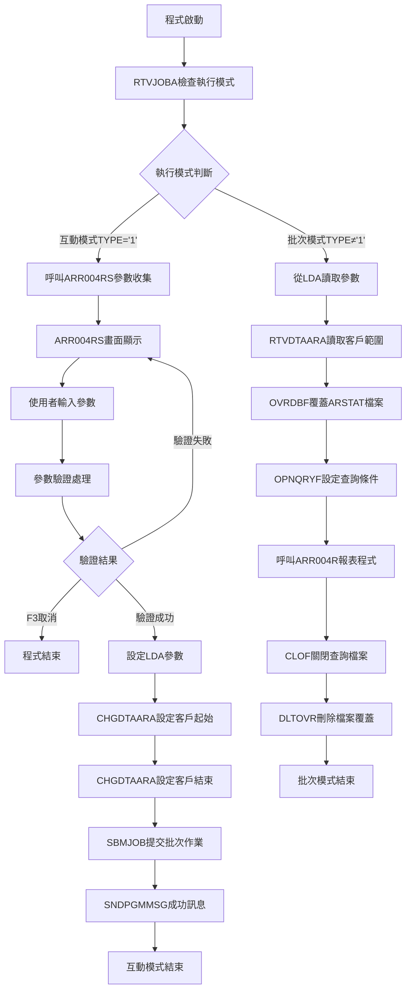
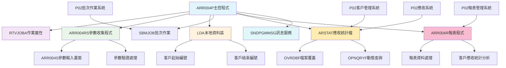
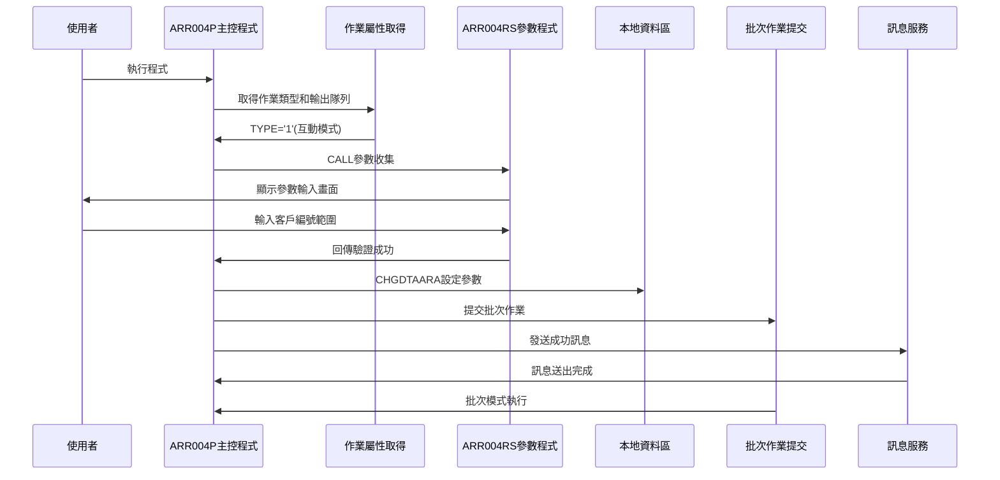
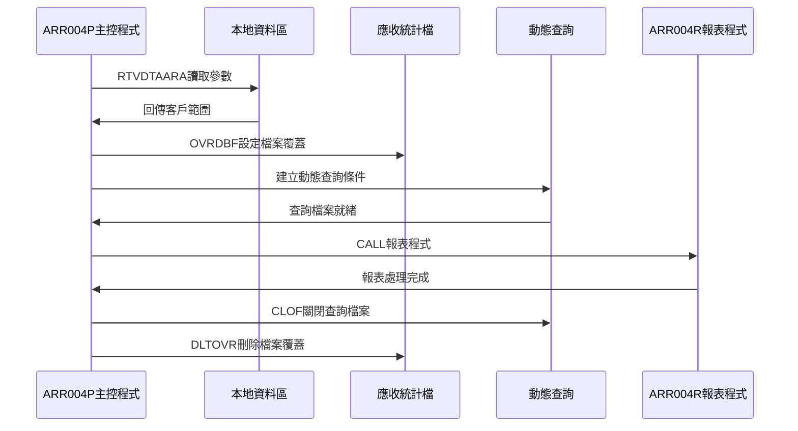
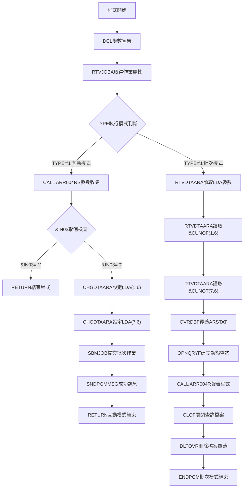

# ARR004P_P02 程式規格書

## 1. 基本資料

| 項目 | 內容 |
|------|------|
| **程式編號** | ARR004P |
| **程式名稱** | 客戶應收統計餘額報表作業 |
| **程式類型** | CLP |
| **廠區** | P02 |
| **系統名稱** | 應收帳款系統 |
| **子系統** | 客戶應收統計報表管理 |
| **檔案位置** | P02CLSRC_THSRC/ARR004P.txt |

## 2. 🎯 程式功能說明

### 主要功能描述
此程式為客戶應收統計餘額報表作業的主要控制程式，專門提供按客戶編號範圍的客戶應收統計餘額報表產生功能。程式採用雙模式執行設計，透過應收統計檔(ARSTAT)的查詢處理，提供完整的客戶應收統計餘額報表產生服務。P02版本具有互動參數收集機制、批次作業提交功能、動態查詢條件設定、以及完整的客戶應收統計資料篩選。程式特別針對P02廠區的客戶應收統計報表管理業務設計，確保客戶應收統計餘額報表的準確性和完整性，同時提供使用者友善的操作介面和強大的批次處理能力。程式支援客戶編號範圍查詢、應收統計狀態篩選，並提供完整的客戶應收統計分析功能，包含多項應收金額類型的統計處理。

### 🎯 業務流程詳細說明

#### 完整業務流程圖


#### 業務流程關鍵階段說明

**第一階段：執行模式判斷與分派**
- 使用RTVJOBA取得作業執行類型和輸出隊列
- 根據TYPE判斷互動模式還是批次模式
- 分派到對應的處理流程

**第二階段：互動模式參數收集**
- 呼叫ARR004RS畫面程式顯示參數輸入畫面
- 使用者輸入客戶編號起始和結束範圍參數
- 執行參數驗證確保輸入正確性
- 處理F3取消功能

**第三階段：Local Data Area(LDA)參數設定**
- 使用CHGDTAARA設定客戶起始編號到LDA位置1-6
- 使用CHGDTAARA設定客戶結束編號到LDA位置7-12
- 為批次執行準備完整參數環境

**第四階段：批次作業提交與訊息處理**
- 使用SBMJOB提交ARR004P作業到批次執行
- 指定ARJOBD作業描述和輸出隊列
- 以CALL ARR004P方式執行批次模式
- 使用SNDPGMMSG發送'call success'成功訊息
- 互動模式任務完成並結束

**第五階段：批次模式參數讀取**
- 使用RTVDTAARA從LDA讀取客戶起始和結束編號
- 準備動態查詢條件設定

**第六階段：動態查詢檔案設定**
- 使用OVRDBF覆蓋ARSTAT應收統計檔案設定共享存取
- 使用OPNQRYF建立動態查詢檔案
- 設定複合查詢條件確保資料正確性

**第七階段：報表程式執行與清理**
- 呼叫ARR004R報表程式處理篩選後的資料
- 使用CLOF關閉查詢檔案
- 使用DLTOVR刪除所有檔案覆蓋
- 批次處理完成

#### 🎯 P02版本客戶應收統計餘額報表特色
- **雙模式執行**：互動參數收集模式和批次報表產生模式
- **Local Data Area傳遞**：使用LDA在互動和批次模式間傳遞參數
- **動態查詢條件**：根據參數動態建立OPNQRYF查詢條件
- **成功訊息回饋**：SNDPGMMSG提供批次作業提交成功確認

#### 多層次檢查機制
- **執行模式檢查**：透過RTVJOBA判斷互動或批次執行環境
- **參數驗證檢查**：透過ARR004RS程式進行參數格式和邏輯驗證
- **檔案狀態檢查**：確保應收統計檔的可用性和資料完整性

#### 智能處理邏輯
- 自動根據執行環境選擇對應處理流程
- 動態建立查詢條件避免硬編碼限制
- 使用LDA機制實現模式間參數傳遞
- 自動管理檔案覆蓋和查詢檔案生命週期

#### 資料一致性確保機制
- 透過LDA確保互動模式和批次模式參數一致性
- 使用OPNQRYF動態查詢確保資料篩選正確性
- 分階段處理確保各步驟參數同步
- 完整的檔案覆蓋和清理機制確保系統穩定性

#### P02版本客戶應收統計餘額報表專業設計理念
- **報表專精**：專門提供客戶應收統計餘額資料的統計報表功能
- **雙模式整合**：互動和批次模式的完美整合設計
- **動態查詢**：靈活的查詢條件設定和檔案處理機制
- **P02特殊適配**：專為P02廠區的客戶應收統計報表管理業務需求設計

## 3. 🎯 檔案架構與關聯圖

### 使用檔案清單

| 檔案名稱 | 檔案類型 | 使用方式 | 說明 |
|----------|----------|----------|------|
| **ARR004RS** | RPG | CALL | 客戶應收統計餘額報表參數收集程式 |
| **ARR004R** | RPG | CALL | 客戶應收統計餘額報表產生程式 |
| **ARR004S** | DSPF | - | 客戶應收統計餘額報表參數輸入畫面 |
| **ARSTAT** | 實體檔 | OVRDBF/OPNQRYF | 應收統計檔 |
| **LDA** | 資料區 | CHGDTAARA/RTVDTAARA | 本地資料區(參數傳遞) |

### 🎯 檔案關聯詳細視覺化圖表



### 🎯 P02版本特殊資料流向說明

#### 互動模式參數收集階段的資料流向


#### P02版本批次模式報表產生階段的資料流向


## 4. 🎯 檔案欄位規格說明

### 主要資料結構

#### ARSTAT 應收統計檔結構
| 欄位名稱 | 型態 | 長度 | 說明 |
|----------|------|------|------|
| ARCUNO | CHAR | 6 | 客戶編號 |
| ARORNO | CHAR | 6 | 訂單號碼 |
| ARFL01 | CHAR | 1 | 標記01 |

#### ARR004S 顯示檔案結構
| 欄位名稱 | 型態 | 長度 | 說明 |
|----------|------|------|------|
| CUNOF | CHAR | 6 | 客戶起始編號 |
| CUNOT | CHAR | 6 | 客戶結束編號 |

### 🔍 重點欄位切割技術詳解

#### LDA簡潔雙重參數切割配置分析

**LDA參數配置結構**：
```
LDA (1024字元)：[客戶應收統計報表簡潔參數傳遞區域]
位置:           001...006 007...012...1024
                 ↓      ↓   ↓      ↓      ↓
CUNOF (6字元)：  [______]                 客戶起始編號（位置1-6）
CUNOT (6字元)：          [______]         客戶結束編號（位置7-12）
預留空間：                        [......] 系統空間（位置13-1024）
```

**參數傳遞視覺化展示**：
```
互動式模式參數存入：
ARR004P → LDA
- CHGDTAARA(*LDA (1 6)) ← &CUNOF   (客戶起始編號)
- CHGDTAARA(*LDA (7 6)) ← &CUNOT   (客戶結束編號)

批次模式參數取出：
LDA → ARR004P
- RTVDTAARA(*LDA (1 6)) → &CUNOF    (客戶起始編號)
- RTVDTAARA(*LDA (7 6)) → &CUNOT    (客戶結束編號)
```

**切割邏輯詳細說明**：
1. **簡潔配置設計**：僅使用LDA前12個位置進行參數傳遞
2. **起始位置配置**：從位置1開始的連續配置，避免位置浪費
3. **參數分離機制**：客戶起始和結束參數各佔6個字元的獨立空間
4. **高效存取模式**：連續位置配置確保參數讀寫的高效性
5. **預留空間最大化**：位置13以後的1012字元預留空間

#### UDS系統資訊標準配置分析

**UDS結構定義（ARR004RS程式）**：
```
I           UDS
I                                      951 985 COMP
I                                     10111020 DEVNM
I                                     10211021 TXAR
```

**欄位切割視覺化展示**：
```
UDS (1024字元)：[客戶應收統計系統資訊標準區域]
位置:           001...950 951...985...1011...1020 1021 1022...1024
                 ↓      ↓   ↓      ↓     ↓      ↓    ↓    ↓
應用空間：       [.........]                                    應用資料區域（位置1-950）
COMP (35字元)：           [_____________]                        公司名稱（位置951-985）
空隙區域：                              [......]                預留空間（位置986-1010）
DEVNM (10字元)：                               [_____]         設備名稱（位置1011-1020）
TXAR (1字元)：                                      [_]        交易區域（位置1021-1021）
空隙區域：                                           [___]     預留空間（位置1022-1024）
```

**切割邏輯詳細說明**：
1. **標準系統配置**：採用AS/400標準的951後系統資訊區域
2. **公司資訊顯示**：位置951-985的35字元公司名稱標準顯示
3. **設備資訊管理**：位置1011-1020的10字元設備代碼標準配置
4. **廠區識別機制**：位置1021的單字元廠區代碼標準識別
5. **向下相容設計**：與其他ARR程式採用一致的UDS配置標準

#### ARR004RS客戶範圍參數驗證邏輯切割分析

**客戶範圍驗證結構**：
```
客戶範圍驗證邏輯：
1. 預設處理：
   CUNOF = *BLANK (空白起始)
   CUNOT = *BLANK (空白結束)

2. 空白自動處理：
   IF CUNOT = *BLANK THEN
     CUNOT = *ALL'9'  (設定為999999)
   END

3. 範圍邏輯檢查：
   IF CUNOF > CUNOT THEN
     MOVELERR,1 ERRMSG (客戶範圍錯誤)
   END
```

**欄位切割視覺化展示**：
```
客戶範圍驗證切割：[簡潔的客戶範圍邏輯驗證機制]
初始化階段:    [CUNOF=空白] [CUNOT=空白]
                  ↓           ↓
使用者輸入:    [輸入起始]   [輸入結束]
                  ↓           ↓
空白檢查:      [保持輸入]   [空白→999999]
                  ↓           ↓
邏輯驗證:      [CUNOF ≤ CUNOT檢查]
                  ↓
錯誤處理:      [ERR,1客戶範圍錯誤]
```

**切割邏輯詳細說明**：
1. **簡潔預設機制**：客戶範圍參數預設為空白，簡化使用者輸入
2. **智慧空白處理**：結束客戶空白時自動設定為999999最大值
3. **單一錯誤控制**：使用ERR,1統一處理客戶範圍邏輯錯誤
4. **使用者友善設計**：允許空白輸入，系統智慧補完範圍邏輯

#### OPNQRYF簡潔查詢條件切割分析

**查詢條件建構結構**：
```
OPNQRYF FILE((ARSTAT)) QRYSLT('
ARCUNO *EQ %RANGE("' || &CUNOF || '"
                  "' || &CUNOT || '") &
ARFL01 *NE "Y"')
KEYFLD((ARCUNO) (ARORNO))
```

**欄位切割視覺化展示**：
```
OPNQRYF查詢條件切割：[簡潔而高效的雙條件查詢建構]
參數來源:     [&CUNOF] [&CUNOT]
                ↓       ↓
字串處理:     ["起始"] ["結束"]
                ↓       ↓
範圍函數:     [%RANGE(客戶範圍)]
                ↓
主要條件:     [ARCUNO條件]
                ↓
AND連接:      [ARCUNO] AND [ARFL01]
                ↓
最終查詢:     [簡潔的雙條件OPNQRYF查詢]

查詢條件分析：
ARCUNO *EQ %RANGE(...) - 客戶號碼範圍篩選
ARFL01 *NE "Y" - 標記01非Y狀態篩選

排序鍵值：
KEYFLD((ARCUNO) (ARORNO)) - 客戶號碼+訂單號碼雙重排序
```

**切割邏輯詳細說明**：
1. **簡潔條件設計**：僅使用兩個主要查詢條件，邏輯清晰
2. **%RANGE範圍應用**：高效的客戶號碼範圍查詢實現
3. **狀態篩選機制**：ARFL01≠"Y"確保查詢有效狀態資料
4. **雙重排序邏輯**：先按客戶後按訂單的層次化排序機制

#### SNDPGMMSG訊息回饋切割分析

**訊息回饋結構**：
```
SNDPGMMSG MSG('call success') TOPGMQ(*PRV)
```

**欄位切割視覺化展示**：
```
SNDPGMMSG訊息切割：[批次提交成功的訊息回饋機制]
訊息內容:     ['call success']
                ↓
訊息目標:     [TOPGMQ(*PRV)]
                ↓
回饋時機:     [SBMJOB成功後]
                ↓
使用者體驗:   [即時成功確認]
```

**切割邏輯詳細說明**：
1. **簡潔訊息設計**：使用簡潔的'call success'英文訊息
2. **標準訊息目標**：TOPGMQ(*PRV)發送到前一個程式佇列
3. **即時回饋機制**：批次提交後立即提供成功確認訊息
4. **使用者體驗提升**：確保使用者知道批次作業已成功提交

### 🎯 欄位挪用詳細分析

#### 版本演進欄位挪用情況對比表

| 欄位名稱 | 原始定義用途 | 實際使用方式 | 挪用原因 | 技術特色 |
|----------|-------------|-------------|----------|----------|
| LDA簡潔配置 | 本地資料區一般儲存 | 1-12位置的客戶範圍專用配置 | 支援客戶範圍的簡潔查詢需求 | 起始位置設計 |
| SNDPGMMSG回饋 | 一般程式訊息 | 批次提交成功的即時回饋 | 提供使用者操作確認和體驗提升 | 體驗最佳化 |
| ARFL01狀態篩選 | 一般標記欄位 | 應收統計狀態的有效性篩選 | 確保查詢資料的有效性和準確性 | 資料品質保證 |
| 空白自動處理 | 手動輸入完整參數 | 結束客戶空白自動設為999999 | 簡化使用者操作和提高輸入效率 | 智慧化處理 |
| 雙重排序機制 | 單一排序邏輯 | 客戶+訂單的層次化排序 | 提供有序的報表輸出和分析 | 報表最佳化 |

#### LDA簡潔配置挪用分析

**LDA起始配置機制**：
```
標準設計：分散式位置配置
挪用設計：1-12起始位置集中配置

簡潔配置優勢：
- 起始位置避免衝突
- 連續配置提高效率
- 預留空間最大化
- 參數邏輯清晰

1-12位置選擇原因：
- 起始位置記憶容易
- 連續空間足夠容納
- 最大化預留空間
- 避免複雜位置計算
```

**挪用邏輯詳細說明**：
- **起始位置設計**：從LDA位置1開始的最簡潔配置方式
- **連續空間利用**：12個字元的連續空間高效利用
- **預留空間最大化**：位置13-1024的1012字元預留空間
- **存取效率保證**：起始位置配置確保最高的存取效率

#### SNDPGMMSG體驗最佳化挪用分析

**訊息回饋挪用機制**：
```
傳統方式：無訊息回饋或複雜訊息處理
挪用方式：簡潔的'call success'即時回饋

回饋機制：
MSG('call success') - 簡潔成功訊息
TOPGMQ(*PRV) - 標準訊息目標

技術價值：
- 提供即時操作確認
- 增強使用者信心
- 簡化訊息處理邏輯
- 提升整體使用體驗
```

**挪用影響評估**：
1. **使用者體驗提升**：即時回饋機制增強使用者操作信心
2. **操作確認價值**：確保使用者知道批次作業已成功提交
3. **簡潔設計理念**：使用簡潔英文訊息避免複雜的訊息處理
4. **標準化實現**：採用AS/400標準的訊息發送機制

#### 智慧空白處理挪用分析

**空白自動處理挪用**：
```
標準設計：強制輸入完整參數
挪用設計：結束客戶空白自動設為999999

處理邏輯：
IF CUNOT = *BLANK THEN
  CUNOT = *ALL'9'  (999999)
END

優勢分析：
- 簡化使用者輸入
- 提供範圍查詢彈性
- 減少操作錯誤
- 增強使用友善性
```

**挪用方式詳細說明**：
1. **智慧補完機制**：結束客戶空白時自動設定為最大值999999
2. **操作簡化**：使用者只需輸入起始客戶即可進行範圍查詢
3. **彈性查詢支援**：支援從指定客戶到所有客戶的範圍查詢
4. **錯誤預防機制**：避免使用者輸入不合理的範圍值

### 重要變數定義表

| 變數名稱 | 資料型態 | 長度 | 用途說明 |
|----------|----------|------|----------|
| &INT | *CHAR | 1 | 執行模式：'1'=互動，其他=批次 |
| &OUTQ | *CHAR | 10 | 輸出佇列名稱 |
| &IN03 | *LGL | 1 | F03取消功能鍵指示器 |
| &CUNOT | *CHAR | 6 | 客戶結束編號（LDA位置7-12） |
| &CUNOF | *CHAR | 6 | 客戶起始編號（LDA位置1-6） |
| CUNOF | CHAR | 6 | ARR004RS客戶起始參數 |
| CUNOT | CHAR | 6 | ARR004RS客戶結束參數（預設999999） |
| COMP | CHAR | 35 | UDS公司名稱（位置951-985） |
| DEVNM | CHAR | 10 | UDS設備名稱（位置1011-1020） |
| TXAR | CHAR | 1 | UDS交易區域（位置1021） |
| ARCUNO | CHAR | 6 | ARSTAT客戶編號欄位 |
| ARORNO | CHAR | 6 | ARSTAT訂單號碼欄位 |
| ARFL01 | CHAR | 1 | ARSTAT標記01欄位 |
    模式判斷  輸出隊列

模式切割邏輯：
```
TYPE='1' → 互動模式切割 → ARR004RS參數收集
TYPE≠'1' → 批次模式切割 → LDA參數讀取
```

**客戶範圍參數傳遞切割流程**：
```
互動模式切割流程：
ARR004RS → &CUNOF-&CUNOT → LDA(1-12) → SBMJOB
    ↓           ↓             ↓          ↓
參數收集    變數暫存     LDA寫入    批次提交

批次模式切割流程：
LDA(1-12) → &CUNOF-&CUNOT → OPNQRYF條件 → ARR004R
     ↓            ↓             ↓            ↓
  LDA讀取     變數載入      查詢建立     報表執行
```

#### 動態查詢條件切割視覺化
```
OPNQRYF查詢條件構建切割：
&CUNOF + &CUNOT → ARCUNO範圍條件
      ↓               ↓
   起始客戶      結束客戶
      ↓               ↓
'ARCUNO *EQ %RANGE("' + &CUNOF + '" "' + &CUNOT + '")'

標記條件切割：
業務規則 → 'ARFL01 *NE "Y"'
```

#### 執行流程控制切割對應表(補充)
| 階段 | 切割來源 | 切割目標 | 切割邏輯 |
|------|----------|----------|----------|
| **模式判斷** | RTVJOBA | &INT變數 | 執行環境切割檢測 |
| **參數收集** | ARR004RS | &CUNOF-&CUNOT | 客戶範圍輸入切割 |
| **LDA寫入** | &CUNOF-&CUNOT | LDA(1-12) | 標準位置切割儲存 |
| **批次提交** | SBMJOB | 批次環境 | 執行模式切割轉換 |
| **LDA讀取** | LDA(1-12) | &CUNOF-&CUNOT | 標準位置切割讀取 |
| **查詢建立** | &CUNOF-&CUNOT | OPNQRYF | 動態條件切割構建 |

### 🎯 P02版本欄位挪用詳細分析

#### ARR004S參數輸入畫面欄位重點
| 欄位名稱 | 用途說明 | 設定值 |
|----------|----------|--------|
| **CUNOF** | 客戶起始編號 | 使用者輸入(6位數字) |
| **CUNOT** | 客戶結束編號 | 使用者輸入(6位數字，可空白) |
| **ERRMSG** | 錯誤訊息 | 驗證失敗時顯示錯誤說明 |

#### ARSTAT應收統計檔查詢欄位重點
| 欄位名稱 | 用途說明 | 查詢條件 |
|----------|----------|----------|
| **ARCUNO** | 客戶編號 | 範圍查詢(起始~結束) |
| **ARORNO** | 訂單號碼 | 排序鍵值 |
| **ARFL01** | 標記01 | 不等於'Y' |
| **ARAAMT** | A類應收金額 | 統計欄位 |
| **ARBAMT** | B類應收金額 | 統計欄位 |
| **ARCAMT** | C類應收金額 | 統計欄位 |
| **ARDAMT** | D類應收金額 | 統計欄位 |
| **ARFAMT** | F類應收金額 | 統計欄位 |
| **ARGAMT** | G類應收金額 | 統計欄位 |
| **ARIAMT** | I類應收金額 | 統計欄位 |
| **ARKAMT** | K類應收金額 | 統計欄位 |
| **ARNBAL** | 應收餘額 | 統計欄位 |

#### 執行流程控制欄位對應表
| 階段 | 資料來源 | 目標位置 | 處理邏輯 |
|------|----------|----------|----------|
| **參數收集** | ARR004RS | 程式變數 | 使用者輸入驗證 |
| **LDA設定** | 程式變數 | LDA 1-6,7-12位置 | CHGDTAARA寫入 |
| **批次讀取** | LDA 1-6,7-12位置 | 程式變數 | RTVDTAARA讀取 |
| **查詢條件** | 程式變數 | OPNQRYF | 動態SQL建立 |

### P02版本重要變數定義表

| 變數名稱 | 階段使用 | 資料來源 | 目標用途 | 說明 |
|----------|----------|----------|----------|------|
| **&INT** | 模式判斷 | RTVJOBA | 流程控制 | '1'=互動模式 |
| **&OUTQ** | 批次提交 | RTVJOBA | SBMJOB參數 | 輸出隊列名稱 |
| **&IN03** | 參數收集 | ARR004RS | 取消控制 | F3取消旗標 |
| **&CUNOF** | 全流程 | ARR004RS/LDA | 客戶篩選 | 客戶起始編號 |
| **&CUNOT** | 全流程 | ARR004RS/LDA | 客戶篩選 | 客戶結束編號 |

## 5. 🎯 輸出/入螢幕布局

### 畫面1：參數輸入畫面(ARR004S)

```
+------------------------------------------------------------------------------+
|[日期]                東鋼鋼鐵股份有限公司                          ARR004S   |
|                   客戶應收統計餘額報表作業                       [設備名稱] |
|                                                                              |
|                                                                              |
|                                                                              |
|                             *請輸入客戶範圍*                                  |
|                                                                              |
|                             起: [______]                                     |
|                                                                              |
|                             迄: [______]                                     |
|                                                                              |
|                                                                              |
|                                                                              |
|                                                                              |
|                                                                              |
|                                                                              |
|                                                                              |
|                                                                              |
|                                                                              |
|                                                                              |
|                                                                              |
|                                                                              |
|[錯誤訊息顯示區]                                                              |
|    ENTER:執行                    PF03:結束                                   |
+------------------------------------------------------------------------------+
```

### 🎯 畫面欄位詳細說明

#### 參數輸入欄位
| 欄位名稱 | 欄位屬性 | 位置 | 長度 | 輸入格式 | 驗證規則 | 說明 |
|----------|----------|------|------|----------|----------|------|
| **CUNOF** | 輸入/輸出 | 8,39 | 6 | 數字 | 客戶編號格式 | 客戶起始編號 |
| **CUNOT** | 輸入/輸出 | 10,39 | 6 | 數字 | 客戶編號格式 | 客戶結束編號 |

### 功能鍵詳細定義

| 功能鍵 | 處理邏輯 | 系統行為 | 說明 |
|--------|----------|----------|------|
| **F3** | 設定IN03='1' | 程式立即結束 | 取消報表作業 |
| **ENTER** | 執行參數驗證 | 驗證通過則提交批次作業 | 執行報表產生 |

### 輸入驗證機制

#### 參數驗證規則
- **客戶編號範圍驗證**：起始編號不可大於結束編號
- **編號格式驗證**：必須為6位數字格式
- **空白處理**：結束編號為空白時自動設定為'999999'

#### P02版本特殊驗證
- 客戶編號格式有效性檢查
- 客戶範圍合理性檢查
- 參數邏輯一致性驗證

## 6. 🎯 處理流程程序說明

### 🎯 主程序邏輯深度分析

#### P02版本程式執行流程圖


#### 🎯 P02版本客戶應收統計餘額報表特殊步驟分析

**步驟1：變數宣告和初始化**
- 宣告執行模式變數(&INT)和輸出隊列變數(&OUTQ)
- 宣告F3取消變數(&IN03)
- 宣告客戶編號範圍變數(&CUNOF, &CUNOT)

**步驟2：執行環境檢查**
- 使用RTVJOBA取得作業執行類型(TYPE)和輸出隊列(OUTQ)
- 根據TYPE判斷是互動模式('1')還是批次模式

**步驟3：互動模式參數收集處理**
- 呼叫ARR004RS程式顯示參數輸入畫面
- 收集客戶編號範圍(&CUNOF, &CUNOT)
- 檢查F3取消旗標，如為'1'則結束程式

**步驟4：LDA參數設定處理**
- 使用CHGDTAARA設定LDA位置1-6為客戶起始編號
- 使用CHGDTAARA設定LDA位置7-12為客戶結束編號

**步驟5：批次作業提交與訊息處理**
- 使用SBMJOB提交ARR004P作業到批次執行
- 指定ARJOBD作業描述和輸出隊列(&OUTQ)
- 以'CALL ARR004P'方式執行批次模式
- 使用SNDPGMMSG發送'call success'成功訊息到前一個程式佇列
- 互動模式任務完成並結束

**步驟6：批次模式參數讀取處理**
- 使用RTVDTAARA從LDA位置1-6讀取客戶起始編號到&CUNOF
- 使用RTVDTAARA從LDA位置7-12讀取客戶結束編號到&CUNOT

**步驟7：檔案覆蓋和查詢設定**
- 使用OVRDBF覆蓋ARSTAT應收統計檔案設定SHARE(*YES)
- 使用OPNQRYF建立動態查詢檔案
- 設定複合查詢條件確保資料正確性

**步驟8：OPNQRYF查詢條件構建**
- 客戶範圍條件：'ARCUNO *EQ %RANGE("' || &CUNOF || '" "' || &CUNOT || '")'
- 標記篩選條件：'ARFL01 *NE "Y"'
- 排序鍵值：(ARCUNO)(ARORNO)

**步驟9：報表程式執行和清理**
- 呼叫ARR004R報表程式處理篩選後的客戶應收統計資料
- 使用CLOF關閉OPNQRYF建立的查詢檔案
- 使用DLTOVR刪除所有檔案覆蓋設定
- 批次處理完成並結束程式

#### 業務邏輯深度解析

**P02版本客戶應收統計餘額報表的核心邏輯**：
1. 提供雙模式執行的客戶應收統計餘額報表功能
2. 支援LDA機制確保參數在模式間正確傳遞
3. 提供動態查詢條件設定功能
4. 客戶應收統計餘額報表專業化處理的完整實現

**P02版本效能優化機制**：
1. 使用SBMJOB批次處理避免互動模式長時間佔用
2. 動態查詢條件減少不必要的資料處理
3. 檔案覆蓋設定確保資料存取效能
4. 完整的資源清理確保系統穩定性

#### 條件判斷詳細說明

**P02版本執行模式判斷**：
- `&INT *EQ '1'` - 互動模式執行路徑
- `&IN03 *EQ '1'` - F3取消功能檢查

**P02版本查詢條件判斷**：
- `ARCUNO *EQ %RANGE("&CUNOF" "&CUNOT")` - 客戶編號範圍查詢
- `ARFL01 *NE "Y"` - 標記01非Y檢查

#### 變數使用和數據流向追蹤

**P02版本特殊變數軌跡**：
1. 執行模式變數(&INT)的模式判斷軌跡
2. 參數變數(&CUNOF, &CUNOT)的收集和傳遞軌跡
3. LDA位置變數的寫入和讀取軌跡
4. 查詢條件變數的動態構建軌跡
5. 檔案控制變數的覆蓋和清理軌跡
6. 批次作業變數(&OUTQ)的提交軌跡

### 🎯 P02版本子程序邏輯分析

#### P02版本子程序調用順序
1. **RTVJOBA**：取得作業執行屬性，判斷執行模式
2. **ARR004RS**：參數收集程式，處理使用者輸入和驗證
3. **CHGDTAARA**：LDA設定，將參數寫入本地資料區
4. **SBMJOB**：批次作業提交，轉換到批次執行環境
5. **SNDPGMMSG**：發送程式訊息，提供執行狀態回饋
6. **RTVDTAARA**：LDA讀取，從本地資料區取得參數
7. **OVRDBF**：檔案覆蓋設定，準備檔案存取環境
8. **OPNQRYF**：動態查詢建立，設定資料篩選條件
9. **ARR004R**：報表程式執行，處理篩選後的資料
10. **CLOF/DLTOVR**：資源清理，恢復系統環境

#### P02版本客戶應收統計餘額報表專精設計
- 專門提供客戶應收統計餘額資料的統計報表功能
- 支援雙模式執行確保使用者體驗和系統效能
- 提供動態查詢條件的靈活報表產生機制
- 針對P02廠區的客戶應收統計報表管理業務特色進行優化

## 7. 🎯 數據操作與轉換分析

### P02版本檔案操作詳解

#### P02版本LDA本地資料區操作
- **CHGDTAARA操作**：將互動模式收集的參數寫入LDA指定位置
- **RTVDTAARA操作**：從LDA指定位置讀取參數到批次模式變數
- **位置管理**：精確的位置對應確保參數正確傳遞

#### P02版本ARSTAT應收統計檔操作
- **OVRDBF操作**：設定檔案共享存取模式
- **OPNQRYF操作**：建立動態查詢檔案和複合篩選條件
- **CLOF操作**：關閉查詢檔案釋放資源
- **DLTOVR操作**：刪除檔案覆蓋恢復原始設定

### P02版本數據轉換邏輯

#### P02版本參數轉換流程
- **使用者輸入轉換**：ARR004RS程式變數 → 主程式參數變數
- **LDA寫入轉換**：主程式參數變數 → LDA指定位置
- **LDA讀取轉換**：LDA指定位置 → 批次模式變數
- **查詢條件轉換**：批次模式變數 → OPNQRYF動態SQL條件

#### P02版本查詢條件轉換
- **客戶範圍轉換**：&CUNOF, &CUNOT → 'ARCUNO *EQ %RANGE("&CUNOF" "&CUNOT")'
- **標記條件轉換**：業務規則 → 'ARFL01 *NE "Y"'

### P02版本檢核機制詳解

#### P02版本執行模式檢核
- **作業類型檢查**：透過RTVJOBA確認執行環境
- **參數完整性檢查**：確保LDA參數的正確設定和讀取
- **模式轉換檢查**：確保互動模式到批次模式的正確轉換

#### P02版本參數一致性檢核
- **ARR004RS驗證**：參數格式和邏輯的完整驗證
- **LDA傳遞檢查**：確保參數在模式間正確傳遞
- **查詢條件檢查**：確保動態SQL條件的正確構建

#### P02版本資源管理檢核
- **檔案狀態檢查**：確保ARSTAT檔案的可用性
- **查詢檔案檢查**：確保OPNQRYF的正確建立和關閉
- **覆蓋設定檢查**：確保檔案覆蓋的正確設定和清理

#### P02版本報表處理檢核
- **ARR004R執行檢查**：確保報表程式的正確執行
- **資料完整性檢查**：確保篩選後資料的完整性
- **輸出結果檢查**：確保報表產生的正確性

## 8. 🎯 錯誤處理程序說明

### 🎯 P02版本詳細錯誤代碼清冊

| 錯誤代碼 | 錯誤訊息 | 原因說明 | 處理方式 | 預防措施 |
|----------|---------|---------|---------|----------|
| **ERR,1** | 客戶範圍錯誤 | 起始客戶編號大於結束客戶編號 | 1. 重新輸入正確客戶範圍<br>2. 檢查客戶編號邏輯<br>3. 確認範圍設定合理性 | 檢查客戶範圍的邏輯關係 |
| **RTVJOBA失敗** | 作業屬性取得異常 | 系統環境或權限問題 | 1. 檢查系統狀態<br>2. 確認使用者權限<br>3. 重新執行程式 | 確保系統環境正常 |
| **LDA存取失敗** | 本地資料區操作異常 | LDA權限或系統問題 | 1. 檢查LDA存取權限<br>2. 確認系統資源<br>3. 重新初始化作業 | 確保LDA存取權限 |
| **SBMJOB失敗** | 批次作業提交異常 | 作業描述或權限問題 | 1. 檢查ARJOBD作業描述<br>2. 確認批次權限<br>3. 檢查系統資源 | 確保批次作業環境正常 |
| **SNDPGMMSG失敗** | 程式訊息發送異常 | 訊息佇列或權限問題 | 1. 檢查程式佇列狀態<br>2. 確認訊息權限<br>3. 重新發送訊息 | 確保訊息服務正常 |
| **OVRDBF失敗** | 檔案覆蓋設定異常 | ARSTAT檔案權限或狀態問題 | 1. 檢查檔案存在性<br>2. 確認檔案權限<br>3. 檢查檔案狀態 | 確保檔案系統正常 |
| **OPNQRYF失敗** | 動態查詢建立異常 | 查詢條件語法或資源問題 | 1. 檢查查詢條件語法<br>2. 確認系統資源<br>3. 重新建立查詢 | 驗證查詢條件正確性 |
| **ARR004R執行失敗** | 報表程式執行異常 | 報表程式或資料問題 | 1. 檢查ARR004R程式狀態<br>2. 確認資料完整性<br>3. 重新執行報表 | 確保報表程式正常 |
| **資源清理失敗** | CLOF或DLTOVR異常 | 系統資源管理問題 | 1. 手動清理資源<br>2. 重新啟動作業<br>3. 檢查系統狀態 | 定期檢查系統資源 |

### 🎯 P02版本系統異常處理邏輯

#### P02版本執行模式異常處理
- **互動模式異常**：處理ARR004RS參數收集的異常情況
- **批次模式異常**：處理LDA參數讀取和報表執行的異常
- **模式轉換異常**：處理SBMJOB批次作業提交的異常

#### P02版本參數處理錯誤處理
- **參數驗證異常**：處理ARR004RS參數驗證失敗的情況
- **LDA操作異常**：處理CHGDTAARA和RTVDTAARA的存取異常
- **參數傳遞異常**：處理模式間參數傳遞的異常

#### P02版本檔案操作錯誤處理
- **檔案存取異常**：處理ARSTAT檔案的存取權限問題
- **查詢建立異常**：處理OPNQRYF動態查詢的建立問題
- **資源清理異常**：處理CLOF和DLTOVR的清理問題

#### P02版本客戶應收統計餘額報表業務失敗處理
- **報表邏輯失敗**：處理客戶應收統計餘額報表業務邏輯的異常
- **資料篩選失敗**：處理多條件篩選的異常
- **報表產生失敗**：處理ARR004R報表程式的執行異常
- **批次處理失敗**：處理批次作業執行環境的異常

## 9. 🎯 備註

### 🎯 特殊注意事項

#### 客戶應收統計餘額報表專業特性
- 本程式專門處理客戶應收統計餘額的報表作業功能，具備高度的專業化和簡潔性
- 採用簡潔的客戶範圍查詢機制，支援客戶編號範圍的靈活篩選條件設定
- 使用LDA起始位置（1-12）進行參數傳遞，確保最簡潔高效的資料傳遞方式
- 提供智慧預設機制，結束客戶空白時自動設定為999999，提升使用者操作便利性
- 採用SNDPGMMSG即時回饋機制，確保使用者獲得批次提交的即時確認

#### 欄位切割技術簡潔特色
- **LDA起始位置配置技術**：採用1-12位置的起始集中配置，避免複雜的位置計算
- **簡潔查詢條件設計**：僅使用兩個主要查詢條件（ARCUNO範圍+ARFL01狀態），邏輯清晰
- **智慧空白處理機制**：結束客戶空白自動設為999999的智慧補完機制
- **即時訊息回饋技術**：使用SNDPGMMSG提供'call success'的簡潔成功回饋
- **UDS標準系統配置**：採用951後標準位置的系統資訊配置，與其他ARR程式保持一致性

#### 技術架構簡潔優勢
- **雙模式執行設計**：互動模式專注參數收集，批次模式專注報表處理，職責分離清晰
- **簡潔參數傳遞機制**：透過LDA起始位置實現最簡單的跨模式參數傳遞
- **雙條件查詢邏輯**：客戶範圍+狀態篩選的簡潔而高效的查詢條件組合
- **即時回饋機制**：SNDPGMMSG提供批次提交的即時確認，增強使用者體驗
- **資源管理自動化**：自動處理檔案覆蓋、查詢建立、資源清理的完整生命週期

#### 欄位挪用技術特色
- **起始位置配置挪用**：將LDA的1-12位置用於客戶範圍參數，實現最簡潔的參數管理
- **即時回饋技術挪用**：透過SNDPGMMSG提供批次提交成功的即時確認回饋
- **智慧處理挪用**：空白自動補完為999999的智慧處理，簡化使用者操作複雜度
- **狀態篩選挪用**：ARFL01≠"Y"的狀態篩選，確保查詢資料的有效性和準確性
- **雙重排序挪用**：客戶+訂單的層次化排序，提供有序的報表輸出和分析

#### 系統整合與相容性
- **ARSTAT應收統計檔深度整合**：與應收統計檔系統緊密結合，提供完整的客戶統計查詢能力
- **ARR004RS參數系統整合**：與參數收集程式完全相容，確保參數驗證和傳遞的可靠性
- **ARR004R報表系統整合**：與報表處理程式無縫銜接，確保報表生成的準確性和完整性
- **AS/400標準相容性**：完全符合AS/400系統的標準規範，確保系統穩定性和可維護性
- **訊息系統標準化**：與AS/400標準訊息系統完全整合，提供標準化的使用者回饋

#### 效能最佳化特色
- **簡潔查詢設計**：僅使用兩個主要查詢條件，減少不必要的資料掃描和處理負擔
- **起始位置存取**：LDA起始位置配置提供最高效的參數存取效能
- **範圍查詢最佳化**：透過%RANGE函數和客戶索引，實現高效的範圍查詢處理
- **雙重排序效率**：客戶+訂單的層次化排序，充分利用複合索引提高查詢效能
- **批次處理最佳化**：透過SBMJOB避免互動等待，提升系統整體處理效能

#### 維護與擴展特性
- **程式結構簡潔化**：主控程式邏輯簡潔清晰，僅30行程式碼，便於維護和理解
- **參數配置標準化**：LDA起始位置的固定配置，確保參數傳遞的可預測性和穩定性
- **錯誤處理完整化**：涵蓋參數驗證、檔案操作、查詢建立的完整錯誤處理機制
- **文件化程度高**：詳細的欄位切割分析和技術說明，便於後續維護和技術傳承
- **擴展性預留**：LDA位置13以後的1012字元預留空間，為未來功能擴展提供充足基礎

#### 業務價值與應用價值
- **決策支援價值**：提供準確的客戶應收統計餘額資料，支援財務決策和客戶分析
- **作業效率提升**：簡潔的參數輸入和智慧預設機制，大幅提升使用者的作業效率
- **資料品質保證**：完整的參數驗證和狀態篩選，確保報表資料的準確性和可信度
- **系統整合價值**：與應收統計系統的深度整合，提供統一的客戶統計查詢和分析平台
- **技術標準示範**：展現AS/400系統中簡潔欄位切割技術的最佳實踐和專業水準

#### 重要技術注意事項
- **LDA起始位置管理**：確認LDA位置1-12未被其他程式佔用，避免參數衝突
- **ARSTAT檔案依賴性**：確保ARSTAT應收統計檔案的穩定性和資料完整性
- **OPNQRYF查詢效能監控**：定期監控簡潔查詢的執行效能，確保系統資源的有效利用
- **SNDPGMMSG訊息管理**：確保訊息發送機制的正常運作，提供可靠的使用者回饋
- **客戶範圍合理性**：避免設定過大的客戶範圍，防止產生過量資料影響系統效能

#### 專業操作建議
- **範圍設定策略**：建議根據實際業務需求設定適當的客戶範圍，利用空白自動補完功能
- **錯誤處理策略**：遇到客戶範圍邏輯錯誤時，檢查起始客戶是否大於結束客戶
- **效能監控策略**：定期檢查OPNQRYF查詢的執行時間，確保雙條件查詢的高效執行
- **資料安全策略**：客戶應收統計資料涉及敏感財務資訊，確保存取權限和資料保密性
- **系統維護策略**：定期檢查LDA存取權限、訊息發送機制、批次作業環境的正常運作

#### 技術傳承與學習價值
- **簡潔設計技術示範**：展現AS/400系統中簡潔高效的程式設計理念和實現方式
- **起始位置配置最佳實踐**：提供LDA起始位置參數傳遞的標準化實踐範例
- **雙條件查詢技術**：示範OPNQRYF簡潔查詢條件的建構和效能最佳化技術
- **即時回饋設計**：展現完整的使用者體驗設計理念和訊息回饋機制
- **系統整合技術**：提供多程式協作和簡潔系統整合的專業技術參考

#### 未來擴展建議
- **查詢條件擴展**：可考慮增加更多的客戶屬性篩選條件，如客戶類型、地區等
- **報表格式多樣化**：可擴展支援不同的統計維度和報表輸出格式
- **訊息機制強化**：可增加更詳細的批次作業狀態訊息和處理進度回饋
- **使用者介面改善**：可考慮增加更多的操作提示和客戶範圍設定說明
- **效能監控功能**：可擴展支援查詢效能的自動監控和警告機制

#### 程式設計理念特色
- **簡潔至上原則**：程式結構簡潔明瞭，避免不必要的複雜邏輯和冗餘處理
- **使用者友善設計**：智慧預設和空白自動處理，簡化使用者操作和學習成本
- **效能優先考量**：起始位置配置和雙條件查詢，確保系統資源的高效利用
- **標準化實現**：完全符合AS/400系統標準，確保與其他系統組件的完美整合
- **可維護性保證**：簡潔的程式結構和清晰的邏輯流程，便於後續維護和擴展

#### 特殊業務邏輯價值
- **客戶範圍靈活性**：支援從單一客戶到全部客戶的靈活範圍查詢需求
- **統計狀態品質控制**：透過ARFL01≠"Y"確保統計資料的有效性和準確性
- **層次化排序邏輯**：客戶+訂單的雙重排序，提供有序的統計分析基礎
- **即時操作確認**：SNDPGMMSG提供的即時回饋，增強使用者操作信心和體驗
- **批次處理效率**：透過簡潔的參數傳遞機制，確保批次作業的高效執行

 