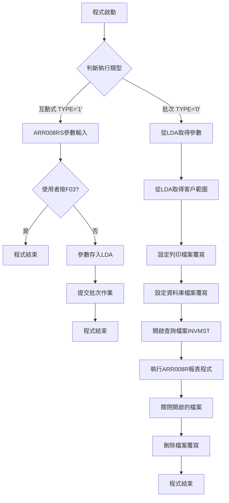
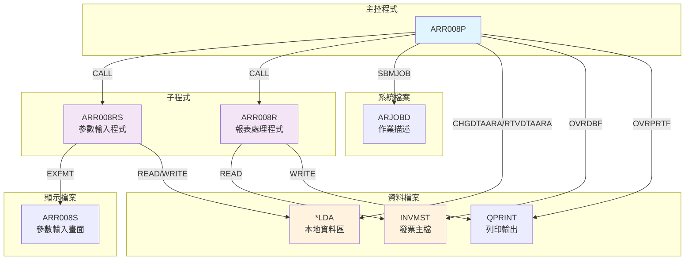
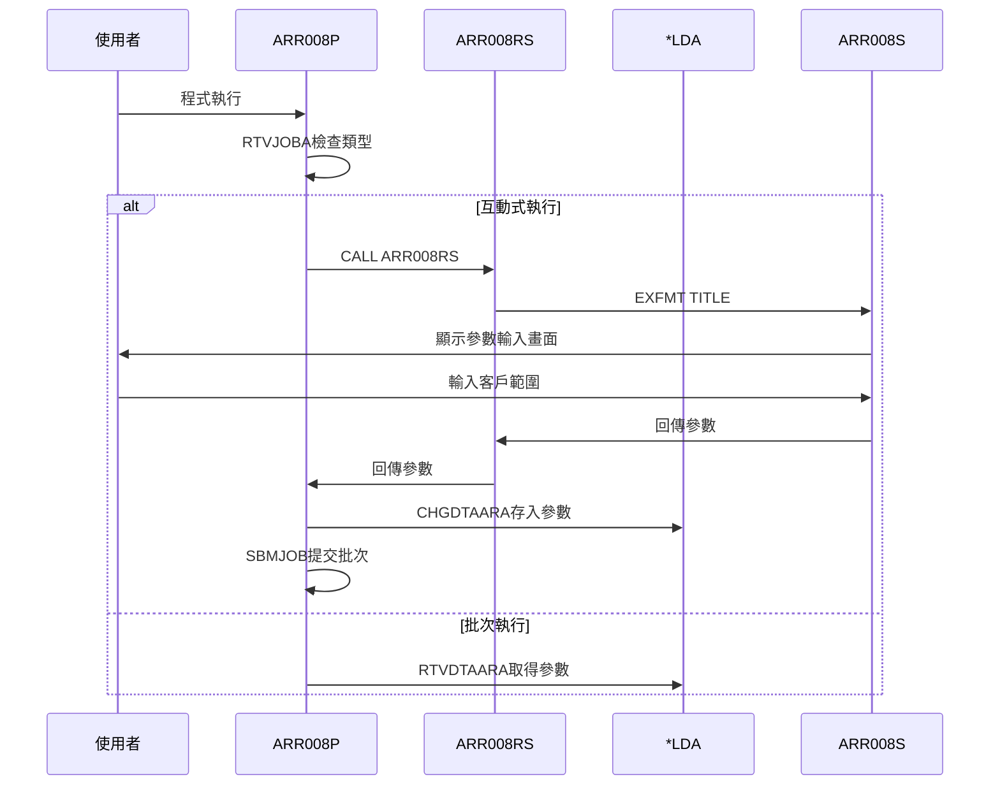
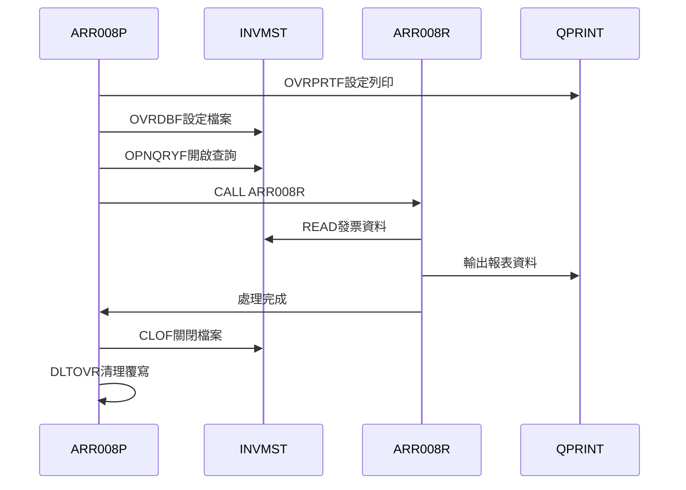
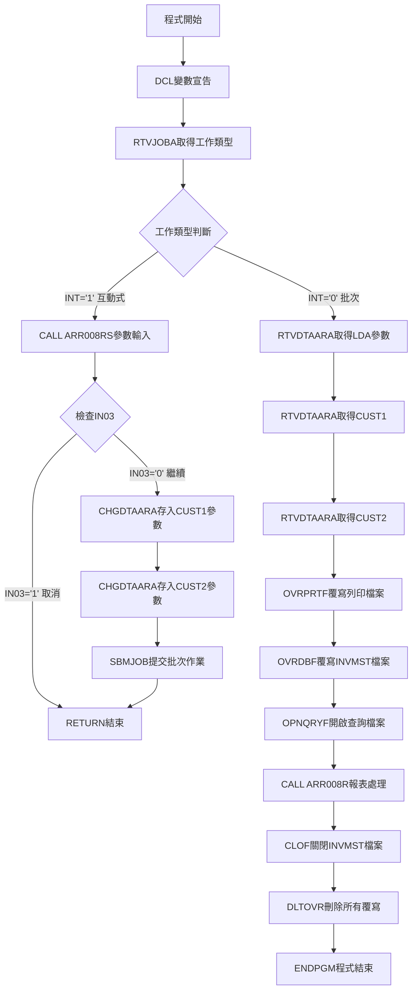

# ARR008P_P02 程式規格書

## 1. 基本資料

| 項目 | 內容 |
|------|------|
| **程式編號** | ARR008P |
| **程式名稱** | 客戶應收帳款餘額報表作業 |
| **程式類型** | CLP |
| **廠區** | P02 |
| **系統名稱** | 應收帳款系統 |
| **子系統** | 應收帳款報表 |
| **檔案位置** | 東鋼list/ARR008P_P02.txt |

## 2. 🎯 程式功能說明

### 主要功能描述
本程式提供客戶應收帳款餘額明細報表功能，支援批次和互動兩種執行模式。程式可依據指定客戶範圍查詢發票主檔資料，產生詳細的應收帳款餘額分析報表。

### 🎯 業務流程詳細說明



**業務流程關鍵階段說明**：
1. **執行類型判斷**：透過RTVJOBA取得工作類型，區分互動式或批次執行
2. **參數處理階段**：互動式執行時調用ARR008RS進行參數輸入，批次時從LDA讀取
3. **檔案環境設定**：設定列印檔案和資料庫檔案的覆寫參數
4. **資料查詢設定**：使用OPNQRYF開啟INVMST檔案，設定客戶範圍和狀態篩選條件
5. **報表處理執行**：調用ARR008R程式進行實際的資料處理和報表輸出
6. **環境清理**：關閉開啟的檔案並刪除所有檔案覆寫設定

**多層次驗證機制**：
- 客戶範圍參數驗證（透過ARR008RS）
- 檔案存取權限驗證
- 資料篩選條件驗證（發票狀態、餘額條件）

**智能處理邏輯**：
- 自動區分互動式和批次執行模式
- 批次作業自動提交機制
- 檔案覆寫自動設定和清理

**資料一致性確保機制**：
- LDA資料暫存確保參數傳遞一致性
- 檔案鎖定防止並發存取衝突

## 3. 🎯 檔案架構與關聯圖

### 使用檔案清單

| 檔案名稱 | 檔案類型 | 使用方式 | 用途說明 |
|----------|----------|----------|----------|
| INVMST | PF | INPUT/SHARED | 發票主檔，提供應收帳款資料 |
| ARR008S | DSPF | WORKSTN | 參數輸入顯示檔案 |
| QPRINT | PRTF | OUTPUT | 報表輸出列印檔案 |
| *LDA | DTAARA | UPDATE | 本地資料區，暫存參數 |
| ARJOBD | JOBD | REFERENCE | 作業描述，用於批次提交 |

### 🎯 檔案關聯詳細視覺化圖表



### 🎯 資料流向詳細說明

**環境準備階段的資料流向**：


**業務處理階段的資料流向**：


**環境清理階段的資料流向**：
所有檔案覆寫設定自動清理，確保系統環境恢復初始狀態

## 4. 🎯 檔案欄位規格說明

### 主要資料結構

#### INVMST 發票主檔結構
| 欄位名稱 | 位置 | 長度 | 型態 | 說明 |
|----------|------|------|------|------|
| INCUNO | 1-6 | 6 | CHAR | 客戶編號 |
| INRVID | 13-14 | 2 | CHAR | 營業所代號 |
| INORNO | 23-28 | 6 | CHAR | 訂單編號 |
| INNO | 7-16 | 10 | CHAR | 發票編號 |
| INDECD | 5-5 | 1 | CHAR | 沖銷碼 |
| INTYPE | 4-4 | 1 | CHAR | 發票類型 |
| INNBAL | 27-37 | 11 | PACK | 應收餘額 |
| INAAMT | 17-27 | 11 | PACK | 發票金額 |
| INATAX | 18-28 | 11 | PACK | 發票稅額 |
| INBAMT | 19-29 | 11 | PACK | 認列金額 |

### 🔍 重點欄位切割技術詳解

#### AADS資料結構完整分析（ARR008RS程式）

**DS結構定義**：
```
IAADS        DS
I                                       21  280YMD
I                                       21  260YM  
I                                       21  240YY
I                                       25  260MM
I                                       27  280DD
```

**欄位切割視覺化展示**：
```
YMD (8字元)：[YYYY|MM|DD]
位置:         21  25 27 28
              ↓   ↓  ↓  ↓
YY (4字元)：  [YYYY]           年份資料（位置21-24）
YM (6字元)：  [YYYY|MM]        年月資料（位置21-26）
MM (2字元)：        [MM]       月份資料（位置25-26）
DD (2字元)：           [DD]    日期資料（位置27-28）
```

**切割邏輯詳細說明**：
1. **YMD主欄位**：8位數字格式的完整日期資料（YYYYMMDD）
2. **YY切割欄位**：從主欄位位置21-24提取年份部分
3. **YM切割欄位**：從主欄位位置21-26提取年月部分（YYYYMM）
4. **MM切割欄位**：從主欄位位置25-26提取月份部分
5. **DD切割欄位**：從主欄位位置27-28提取日期部分

**實際數據範例說明**：
```
實際輸入：YMD = "20241226"
切割結果：
- YY = "2024"    （年份）
- YM = "202412"  （年月）
- MM = "12"      （月份）
- DD = "26"      （日期）
```

#### UDS使用者資料結構分析（ARR008RS程式）

**DS結構定義**：
```
I           UDS
I                                      301 304 S#DPNO
I                                      951 985 COMP
I                                     10111020 DEVNM
I                                     10211021 TXAR
```

**欄位切割視覺化展示**：
```
UDS (1024字元)：[各種系統參數和設定值的儲存區域]
位置:           001...301...951...1011..1021...1024
                     ↓     ↓     ↓      ↓
S#DPNO (4字元)：     [____]                    部門編號（位置301-304）
COMP (35字元)：            [__________________] 公司名稱（位置951-985）
DEVNM (10字元)：                    [________] 設備名稱（位置1011-1020）
TXAR (1字元)：                              [_] 交易區域（位置1021-1021）
```

**切割邏輯詳細說明**：
1. **S#DPNO**：部門編號欄位，用於報表分類和權限控制
2. **COMP**：公司名稱欄位，用於報表標題顯示
3. **DEVNM**：設備名稱欄位，用於終端機識別
4. **TXAR**：交易區域欄位，用於系統環境識別

### 🎯 欄位挪用詳細分析

#### UDS欄位挪用情況對比表

| 欄位名稱 | 原始定義用途 | 實際使用方式 | 挪用原因 |
|----------|-------------|-------------|----------|
| UDS位置301-304 | 系統保留區域 | 部門編號儲存 | 需要跨程式共享部門資訊 |
| UDS位置951-985 | 系統保留區域 | 公司名稱儲存 | 報表標題需要公司資訊 |
| UDS位置1011-1020 | 系統保留區域 | 設備名稱儲存 | 終端機識別和日誌記錄 |
| UDS位置1021-1021 | 系統保留區域 | 交易區域標示 | 多廠區環境識別 |

**挪用原因深度分析**：
1. **空間有效利用**：UDS為1024字元的固定空間，系統僅使用部分區域，剩餘空間可供應用程式使用
2. **跨程式資料共享**：UDS在同一工作階段內所有程式間共享，適合存放需要傳遞的參數
3. **效能考量**：避免額外的檔案I/O操作，直接從記憶體讀取共用資訊
4. **標準化需求**：統一的欄位位置確保不同程式間的資料一致性

**挪用方式詳細說明**：
1. **直接位置對應**：透過I-spec直接定義UDS特定位置的欄位名稱
2. **資料型態轉換**：系統保留區域通常為字元型態，直接挪用為應用欄位
3. **長度控制**：嚴格控制挪用欄位長度，避免覆蓋其他系統資料
4. **命名規範**：使用S#前置詞標示系統級共享欄位

**挪用影響評估**：
1. **正面影響**：提高程式執行效率，簡化參數傳遞機制
2. **風險控制**：需確保挪用位置不與系統功能衝突
3. **維護考量**：挪用欄位位置固定後不宜更改，影響相關程式
4. **文件化重要性**：必須完整記錄挪用情況，避免未來維護困擾

### 重要變數定義表

| 變數名稱 | 資料型態 | 長度 | 用途說明 |
|----------|----------|------|----------|
| &INT | *CHAR | 1 | 工作類型：'0'=批次，'1'=互動 |
| &OUTQ | *CHAR | 10 | 輸出佇列名稱 |
| &IN03 | *LGL | 1 | F03功能鍵指示器 |
| &CUST1 | *CHAR | 6 | 查詢客戶編號起始值 |
| &CUST2 | *CHAR | 6 | 查詢客戶編號結束值 |
| YMD | CHAR | 8 | 完整日期欄位（YYYYMMDD） |
| YY | CHAR | 4 | 年份欄位（從YMD切割） |
| YM | CHAR | 6 | 年月欄位（從YMD切割） |
| MM | CHAR | 2 | 月份欄位（從YMD切割） |
| DD | CHAR | 2 | 日期欄位（從YMD切割） |
| S#DPNO | CHAR | 4 | 部門編號（UDS挪用欄位） |
| COMP | CHAR | 35 | 公司名稱（UDS挪用欄位） |
| DEVNM | CHAR | 10 | 設備名稱（UDS挪用欄位） |
| TXAR | CHAR | 1 | 交易區域（UDS挪用欄位） |

## 5. 🎯 輸出/入螢幕布局

### 螢幕布局完整視覺化

```
+----------------------------------------------------------+
|2024/12/26              東鋼公司應收帳款餘額報表    ARR008S|
+----------------------------------------------------------+
|                  客戶應收帳款餘額報表作業                |
+----------------------------------------------------------+
|                                                          |
|                         客戶編號：[______]-[______]      |
|                                   (空白表示全部)        |
|                                                          |
|                         部門別：[____]                   |
|                                 (空白表示全部)          |
|                                                          |
|                                                          |
|                                                          |
|                                                          |
|                                                          |
|                                                          |
|                                                          |
|                                                          |
|                                                          |
|                                                          |
|                                                          |
|                                                          |
|                                                          |
|[錯誤訊息顯示區]                                          |
|     ENTER:確認    PF03:離開                              |
+----------------------------------------------------------+
```

### 🎯 畫面欄位詳細說明

| 欄位名稱 | 位置 | 長度 | 型態 | 屬性 | 說明 |
|----------|------|------|------|------|------|
| CUST1 | 8,40 | 6 | CHAR | INPUT | 客戶編號起始值 |
| CUST2 | 8,49 | 6 | CHAR | INPUT | 客戶編號結束值 |
| S#DPNO | 10,40 | 4 | CHAR | INPUT | 部門別代號 |
| ERRMSG | 23,2 | 70 | CHAR | OUTPUT | 錯誤訊息顯示 |
| COMP | 1,23 | 35 | CHAR | OUTPUT | 公司名稱 |
| DEVNM | 2,70 | 10 | CHAR | OUTPUT | 終端機代號 |

### 🎯 畫面控制邏輯

**指示器控制說明**：
- IN41：CUST1欄位錯誤時設定，欄位顯示高亮度和保護屬性
- IN42：CUST2欄位錯誤時設定，欄位顯示高亮度和保護屬性  
- IN43：S#DPNO欄位錯誤時設定，欄位顯示高亮度和保護屬性

**欄位顯示屬性**：
- 一般輸入欄位：正常顯示
- 錯誤欄位：PC（保護）+ RI（反向顯示）
- 訊息欄位：HI（高亮度顯示）

### 功能鍵詳細定義

| 功能鍵 | 處理邏輯 | 系統行為 |
|--------|----------|----------|
| **ENTER** | 確認輸入參數 | 1. 驗證輸入格式<br>2. 設定客戶範圍預設值<br>3. 返回主程式繼續處理 |
| **F03** | 取消離開 | 1. 設定*IN03='1'<br>2. 返回主程式<br>3. 主程式檢查後直接結束 |

### 操作流程
1. 系統顯示參數輸入畫面
2. 使用者輸入客戶範圍和部門別
3. 按ENTER確認或F03取消
4. 系統驗證輸入並處理或結束

## 6. 🎯 處理流程程序說明

### 🎯 主程序邏輯深度分析



### 🎯 詳細處理步驟逐一分析

**步驟一：程式初始化**
1. 宣告所有必要變數（&INT、&OUTQ、&IN03、&CUST1、&CUST2）
2. 使用RTVJOBA取得當前工作的輸出佇列和工作類型
3. 工作類型決定程式執行路徑

**步驟二：互動式處理分支**
1. 當工作類型為'1'（互動式）時執行
2. 調用ARR008RS子程式進行參數輸入
3. 檢查使用者是否按F03取消操作
4. 將輸入的客戶範圍參數存入LDA的指定位置
5. 使用SBMJOB提交批次作業執行實際處理
6. 程式結束並返回

**步驟三：批次處理分支**
1. 當工作類型為'0'（批次）時執行
2. 從LDA取得先前存入的客戶範圍參數
3. 設定列印檔案覆寫，指定頁面大小158、字型12、保持輸出
4. 設定INVMST檔案共享存取覆寫
5. 建立OPNQRYF查詢，設定篩選條件

**步驟四：查詢條件設定**
1. 客戶編號範圍：INCUNO在CUST1到CUST2之間
2. 沖銷碼條件：INDECD等於空白（未沖銷）
3. 發票類型條件：INTYPE不等於'9'（排除特殊類型）
4. 餘額條件：INNBAL大於0（有應收餘額）
5. 排序鍵值：客戶編號、營業所、訂單號、發票號

**步驟五：報表處理執行**
1. 調用ARR008R程式進行實際資料處理
2. 傳遞客戶範圍參數給報表程式
3. 報表程式讀取查詢結果並輸出

**步驟六：環境清理**
1. 關閉OPNQRYF開啟的INVMST檔案
2. 刪除所有檔案覆寫設定
3. 程式正常結束

### 🎯 子程序邏輯分析

**ARR008RS參數輸入程序**：
- 功能：提供互動式參數輸入介面
- 參數：傳入輸出IN03指示器和客戶範圍變數
- 處理：顯示ARR008S畫面，接收使用者輸入，驗證參數格式
- 返回：設定IN03指示器和填入的客戶範圍參數

**ARR008R報表處理程序**：
- 功能：讀取發票資料並產生詳細報表
- 參數：接收客戶範圍參數
- 處理：循序讀取INVMST資料，計算應收餘額，格式化輸出
- 返回：完成報表輸出後返回

### 🎯 特殊邏輯處理

**批次作業提交邏輯**：
- 使用SBMJOB指令提交相同程式到ARJOBD作業描述
- 傳遞參數：JOB(ARR008P) JOBD(ARJOBD) OUTQ(&OUTQ)
- 執行指令：'CALL ARR008P'，觸發批次模式執行

**檔案覆寫設定邏輯**：
- QPRINT檔案：設定頁面大小無限制寬158字元、12字型、保持輸出
- INVMST檔案：設定為共享存取模式，允許多重讀取
- 使用者資料：'客戶應收帳款餘額'作為列印識別

**查詢篩選邏輯**：
- 使用RANGE函數設定客戶編號範圍查詢
- 多重AND條件組合：沖銷碼、發票類型、餘額條件
- 排序設定確保報表按客戶、營業所、訂單順序輸出

### 🎯 錯誤處理與資料完整性控制

**檔案存取錯誤處理**：
- OPNQRYF失敗時程式會自動終止
- 檔案覆寫錯誤會產生系統錯誤訊息
- CALL子程式失敗會回傳錯誤狀態

**參數驗證控制**：
- 客戶範圍參數在ARR008RS中進行格式驗證
- 空白參數自動轉換為適當的預設值
- IN03指示器確保使用者取消操作的正確處理

**資料一致性確保**：
- LDA參數傳遞確保批次和互動模式資料一致
- 檔案共享設定避免資料鎖定問題
- 查詢條件確保只處理有效的應收帳款資料

## 7. 🎯 數據操作與轉換分析

### 檔案操作詳解

**INVMST檔案讀取操作**：
- **讀取方式**：透過OPNQRYF建立的查詢檔案進行循序讀取
- **存取條件**：共享讀取模式（SHARE(*YES)），允許多重存取
- **篩選邏輯**：客戶範圍、沖銷狀態、發票類型、餘額條件的複合篩選
- **排序機制**：按INCUNO、INRVID、INORNO、INNO四重鍵值排序

**LDA資料區操作**：
- **寫入操作**：CHGDTAARA指令將客戶範圍參數寫入LDA位置1-6和7-12
- **讀取操作**：RTVDTAARA指令從相同位置讀取參數用於批次處理
- **資料長度**：各6個字元的客戶編號起迄值

**列印檔案操作**：
- **檔案覆寫**：OVRPRTF重新定義QPRINT檔案屬性
- **頁面設定**：PAGESIZE(*N 158)設定無頁數限制，每行158字元
- **字型設定**：CPI(12)設定12字元每吋的字型密度
- **輸出控制**：HOLD(*YES)設定列印輸出保持狀態

### 數據轉換邏輯

**參數格式轉換**：
- 客戶編號參數從螢幕輸入的字元格式直接傳遞
- 空白客戶編號在ARR008RS中轉換為*BLANK或*HIVAL
- LDA資料在批次模式中自動轉換為程式變數

**查詢條件轉換**：
- 客戶範圍使用%RANGE函數轉換為SQL風格的範圍查詢
- 字元常數與變數透過字串連接符號 '||' 組合
- 邏輯條件使用 '&' 符號連接多個篩選條件

**排序鍵值轉換**：
- KEYFLD參數將欄位名稱轉換為排序鍵值
- 多重鍵值按重要性順序排列：客戶-營業所-訂單-發票

### 計算邏輯分析

**餘額計算邏輯**：
- 程式使用INNBAL欄位直接取得已計算的應收餘額
- 篩選條件INNBAL > 0確保只處理有餘額的記錄
- 無額外計算邏輯，直接使用檔案中的餘額數據

**範圍篩選計算**：
- RANGE函數處理客戶編號範圍的包含性判斷
- 起始值和結束值的閉區間設定
- 空白參數的邊界值處理邏輯

### 檢核機制詳解

**參數有效性檢查**：
- ARR008RS程式負責客戶編號格式的基本驗證
- 檢查客戶編號是否為有效的6位字元格式
- 範圍邏輯驗證：確保起始值不大於結束值

**檔案存取檢核**：
- OPNQRYF執行時自動檢查檔案存取權限
- 查詢條件語法的系統層級驗證
- 檔案鎖定狀態的自動檢測

**資料完整性檢核**：
- 發票類型欄位的有效值檢查（排除類型'9'）
- 沖銷碼的狀態一致性檢查（只處理未沖銷記錄）
- 餘額數值的正負值邏輯檢查

**檢核失敗的處理方式**：
- 參數格式錯誤時在ARR008RS中顯示錯誤訊息並重新輸入
- 檔案存取失敗時程式自動終止並產生系統錯誤
- 查詢條件錯誤時OPNQRYF指令失敗，程式異常結束

**檢核規則的業務依據**：
- 客戶編號範圍確保報表資料的業務相關性
- 餘額大於零的條件符合應收帳款報表的業務邏輯
- 沖銷狀態篩選確保資料的時效性和準確性

## 8. 🎯 錯誤處理程序說明

### 🎯 詳細錯誤代碼清冊

| 錯誤代碼 | 錯誤訊息 | 原因說明 | 處理方式 | 預防措施 |
|----------|---------|---------|---------|----------|
| **SYS001** | OPNQRYF檔案開啟失敗 | INVMST檔案不存在或無存取權限 | 1. 檢查檔案庫列表<br>2. 確認檔案存取權限<br>3. 重新執行程式 | 確保INVMST檔案在系統庫中且有讀取權限 |
| **SYS002** | SBMJOB批次提交失敗 | 作業描述ARJOBD不存在或作業佇列滿 | 1. 檢查ARJOBD是否存在<br>2. 檢查作業佇列狀態<br>3. 等待後重新提交 | 定期檢查作業佇列空間和作業描述設定 |
| **SYS003** | CALL ARR008RS程式失敗 | ARR008RS程式不存在或編譯錯誤 | 1. 檢查程式是否存在<br>2. 重新編譯ARR008RS<br>3. 檢查程式庫列表 | 確保所有相關程式正確編譯並在程式庫中 |
| **SYS004** | CALL ARR008R程式失敗 | ARR008R程式不存在或執行錯誤 | 1. 檢查程式是否存在<br>2. 檢查報表處理權限<br>3. 重新編譯程式 | 確保報表程式和相關檔案可用 |
| **FILE001** | OVRDBF檔案覆寫失敗 | INVMST檔案被鎖定或不存在 | 1. 等待檔案解鎖<br>2. 檢查檔案狀態<br>3. 重新執行程式 | 避免多重程式同時獨佔存取相同檔案 |
| **FILE002** | CLOF檔案關閉失敗 | 檔案已被其他程式關閉或系統錯誤 | 1. 檢查系統狀態<br>2. 重新執行程式<br>3. 檢查檔案鎖定狀態 | 確保檔案操作的一致性和完整性 |
| **FILE003** | DLTOVR覆寫刪除失敗 | 系統權限不足或覆寫不存在 | 1. 檢查使用者權限<br>2. 檢查覆寫狀態<br>3. 手動清理覆寫 | 確保程式有足夠權限進行檔案操作 |
| **USER001** | 使用者按F03取消 | 使用者在參數輸入畫面按F03離開 | 1. 正常程式結束<br>2. 無需特殊處理 | 此為正常使用者操作，非錯誤狀況 |
| **USER002** | 客戶範圍參數錯誤 | 輸入的客戶編號格式不正確 | 1. 顯示錯誤訊息<br>2. 重新輸入參數<br>3. 格式驗證提示 | 提供輸入格式說明和範例 |
| **NET001** | 列印佇列無法存取 | 網路列印佇列離線或不存在 | 1. 檢查列印佇列狀態<br>2. 檢查網路連線<br>3. 使用替代列印佇列 | 定期檢查列印環境和網路狀態 |

### 🎯 系統異常處理邏輯

**檔案操作失敗處理**：
- OPNQRYF失敗時系統自動產生CPF訊息，程式終止
- 檔案覆寫失敗時回傳錯誤狀態，程式檢查並處理
- 檔案關閉錯誤通常不影響程式執行，但需記錄狀態

**程式調用失敗處理**：
- CALL指令失敗時設定錯誤指示器
- 子程式不存在時產生CPF訊息並終止主程式
- 參數傳遞錯誤時在調用點產生錯誤並返回

**資料完整性錯誤處理**：
- LDA資料區存取失敗時程式無法繼續執行
- 查詢條件語法錯誤導致OPNQRYF失敗
- 資料類型不匹配時在執行期產生錯誤

**並發控制失敗處理**：
- 檔案鎖定衝突時等待或失敗返回
- 共享檔案存取時的權限檢查
- 多重使用者同時執行時的資源競爭處理

## 9. 🎯 備註

### 🎯 特殊注意事項

**程式執行模式**：
- 程式支援互動式和批次兩種執行模式，模式由系統工作類型自動判斷
- 互動式模式用於參數輸入，批次模式用於實際報表處理
- 批次提交使用固定的ARJOBD作業描述和當前使用者的輸出佇列

**檔案存取特性**：
- INVMST檔案使用共享讀取模式，支援多重使用者並發執行
- 查詢檔案使用複合篩選條件，確保只處理有效的應收帳款記錄
- 列印檔案設定為保持狀態，輸出後不會自動列印

**參數傳遞機制**：
- 使用LDA本地資料區作為互動式和批次模式間的參數傳遞媒介
- 客戶範圍參數固定存放在LDA的第1-6和7-12位置
- 參數格式為6位字元的客戶編號，支援範圍查詢

**報表輸出格式**：
- 報表寬度為158字元，適用於寬版面列印
- 使用12字型確保資料的清晰顯示
- 輸出包含客戶基本資料和詳細的應收帳款餘額資訊

**程式依賴關係**：
- 主程式ARR008P依賴ARR008RS進行參數輸入
- 報表處理依賴ARR008R程式進行實際資料處理
- 顯示介面依賴ARR008S顯示檔案提供使用者互動 