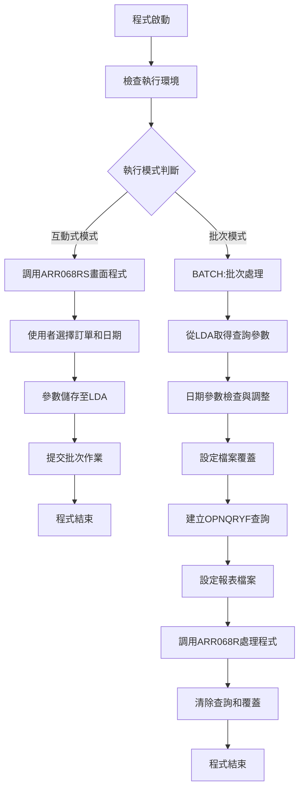
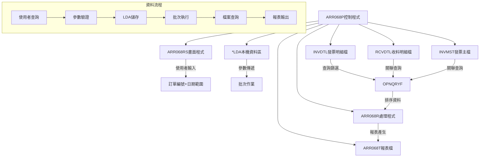
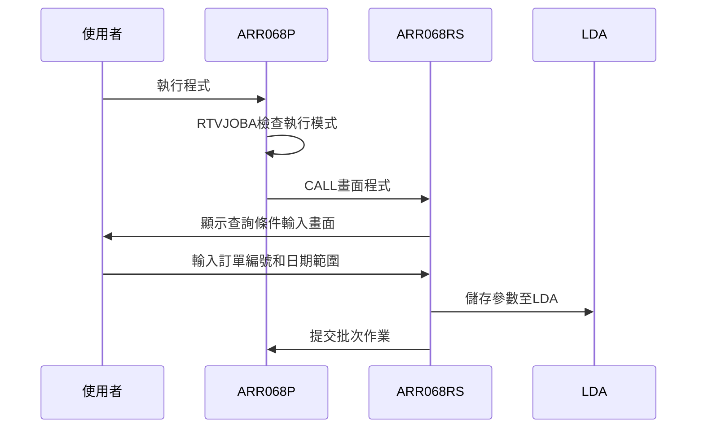
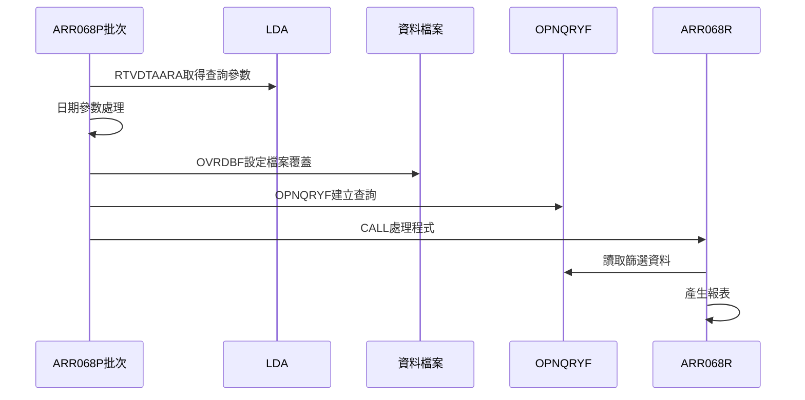
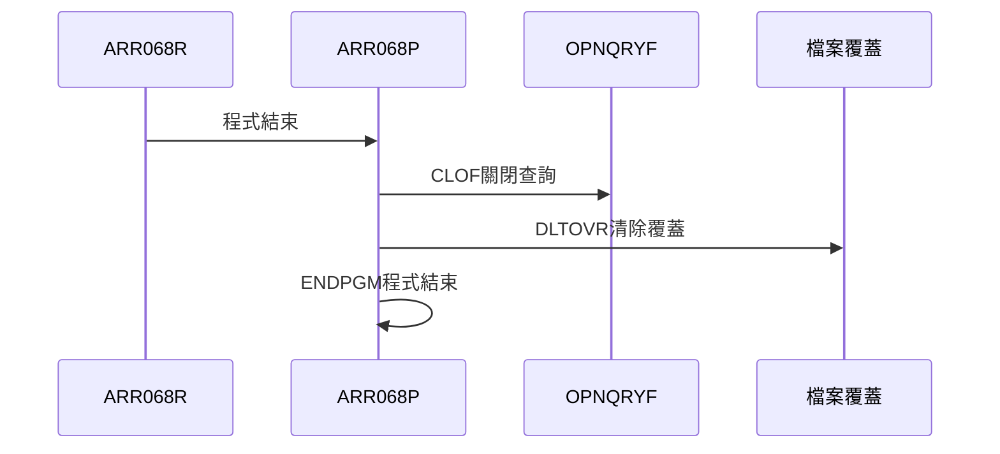
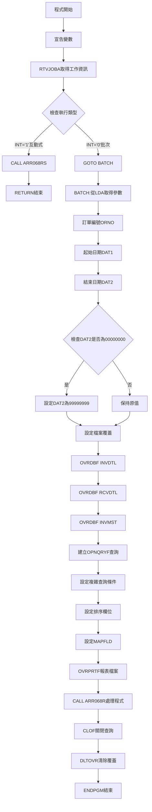
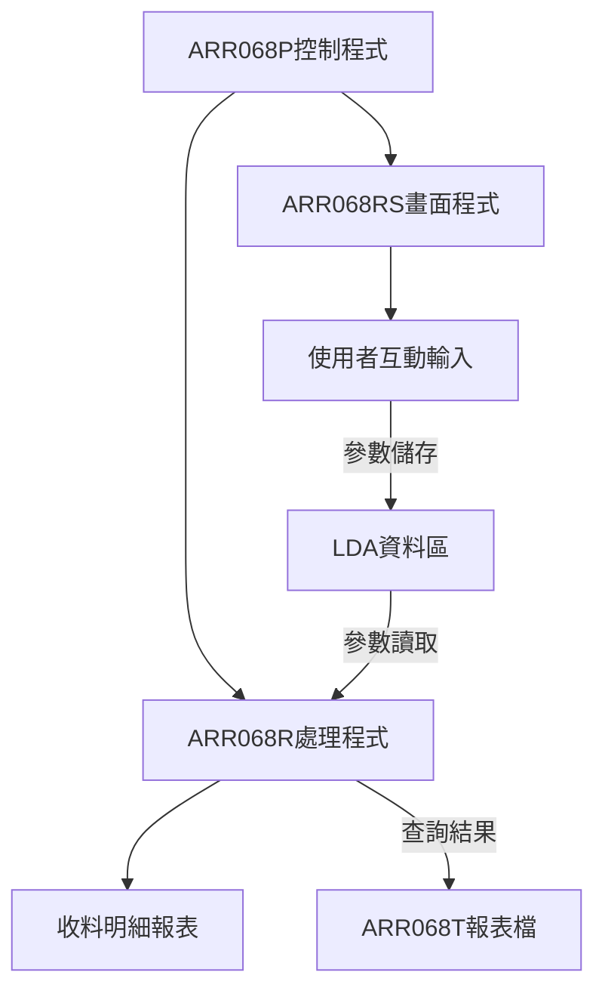

# ARR068P_P02 程式規格書

## 1. 基本資料

| 項目 | 內容 |
|------|------|
| **程式編號** | ARR068P |
| **程式名稱** | 訂單收料明細查詢控制程式 |
| **程式類型** | CLP |
| **廠區** | P02 |
| **系統名稱** | 應收帳款系統 |
| **子系統** | 訂單收料明細查詢 |
| **檔案位置** | P02CLSRC_THSRC/ARR068P.txt |

## 2. 🎯 程式功能說明

### 主要功能描述
此程式為訂單收料明細查詢的控制程式，提供訂單收料資料的查詢和列印功能。程式支援互動式查詢模式和批次報表產生模式，可依據訂單編號和日期範圍篩選收料明細資料。

### 🎯 業務流程詳細說明

#### 完整業務流程圖


#### 業務流程關鍵階段說明

**階段一：執行模式判斷**
- 使用RTVJOBA取得工作類型資訊
- 判斷是互動式執行還是批次執行
- 根據執行模式選擇不同的處理流程

**階段二：互動式參數收集**
- 調用ARR068RS畫面程式顯示查詢條件輸入畫面
- 使用者輸入訂單編號和收料日期範圍
- 參數驗證和儲存後提交批次作業

**階段三：批次處理參數準備**
- 從LDA固定位置提取查詢參數
- 訂單編號(位置1-6)、起始日期(位置7-14)、結束日期(位置15-22)
- 對結束日期進行預設值處理

**階段四：查詢檔案設定**
- 設定INVDTL、RCVDTL、INVMST檔案覆蓋
- 建立複雜的OPNQRYF查詢條件
- 包含訂單編號、帳務類型、日期範圍等多重篩選

**階段五：報表處理執行**
- 設定ARR068T報表檔案參數
- 調用ARR068R程式進行資料處理和報表產生
- 清除查詢和檔案覆蓋設定

## 3. 🎯 檔案架構與關聯圖

### 使用檔案清單

| 檔案名稱 | 檔案類型 | 使用方式 | 說明 |
|----------|----------|----------|------|
| ARR068RS | 程式 | CALL | 互動式畫面程式 |
| ARR068R | 程式 | CALL | 批次處理程式 |
| INVDTL | 實體檔 | INPUT | 發票明細主檔 |
| RCVDTL | 實體檔 | INPUT | 收料明細主檔 |
| INVMST | 實體檔 | INPUT | 發票主檔 |
| ARR068T | 報表檔 | OUTPUT | 報表輸出檔案 |
| *LDA | 資料區 | I/O | 本機資料區(參數傳遞) |

### 🎯 檔案關聯詳細視覺化圖表



### 🎯 資料流向詳細說明

#### 環境準備階段的資料流向


#### 業務處理階段的資料流向


#### 環境清理階段的資料流向


## 4. 🎯 檔案欄位規格說明

### 主要資料結構

#### 程式變數定義
| 變數名稱 | 型態 | 長度 | 用途說明 |
|----------|------|------|----------|
| &ORNO | *CHAR | 6 | 訂單編號 |
| &DAT1 | *CHAR | 8 | 查詢起始日期 |
| &DAT2 | *CHAR | 8 | 查詢結束日期 |
| &INT | *CHAR | 1 | 工作類型識別 |
| &OUTQ | *CHAR | 10 | 輸出佇列名稱 |

#### INVDTL發票明細檔案結構
| 欄位名稱 | 位置 | 長度 | 型態 | 說明 |
|----------|------|------|------|------|
| IVFLAG | 1 | 1 | A | 處理旗標 |
| IVNO | 2-11 | 10 | A | 發票編號 |
| IVACNT | 12 | 1 | A | 帳務類型 |
| IVITEM | 13-14 | 2 | S | 項次 |
| IVACDT | 15-22 | 8 | S | 入帳日期 |
| IVORNO | 23-31 | 9 | A | 訂單編號 |
| IVAPNO | 46-53 | 8 | A | 憑證編號 |

### 🔍 重點欄位切割技術詳解

#### 本機資料區(LDA)欄位切割視覺化展示
```
LDA資料區 (1024字元)：[OOOOOO|DDDDDDDD|DDDDDDDD|..................................................]
位置:                   001    007     015
                        ↓      ↓       ↓
ORNO (6字元)：         [OOOOOO]                                                 訂單編號
DAT1 (8字元)：               [DDDDDDDD]                                       起始日期
DAT2 (8字元)：                       [DDDDDDDD]                               結束日期
```

#### 切割邏輯詳細說明
- **位置1-6**：訂單編號，6字元固定長度
- **位置7-14**：查詢起始日期，格式YYYYMMDD
- **位置15-22**：查詢結束日期，格式YYYYMMDD

#### OPNQRYF查詢條件欄位切割技術
```39:49:東鋼list/ARR068P_P02.txt
OPNQRYF  FILE(INVDTL)  +
         QRYSLT(+
            '%SST(IVORNO 1 6) *EQ "' || &ORNO || '" *AND +
             IVACNT *EQ "6" *AND                         +
             IVFLAG *NE "D" *AND                         +
             IVDECD *NE "D" *AND                         +
             ACDT   *GE "' || &DAT1 || '"           *AND +
             ACDT   *LE "' || &DAT2 || '"           *AND +
             %SST(IVAPNO 6 1) *NE " "')                  +
         KEYFLD((IVAPNO) (IVNO))                         +
         MAPFLD((ACDT   IVACDT   *CHAR 8))
```

**切割技術應用實例**：
- **%SST(IVORNO 1 6)**：從訂單編號欄位的第1位取6字元
- **%SST(IVAPNO 6 1)**：從憑證編號欄位的第6位取1字元

### 🎯 欄位挪用詳細分析

#### 挪用情況對比表

| 欄位名稱 | 原始定義 | 實際使用方式 | 挪用類型 | 使用狀態 |
|----------|----------|-------------|----------|----------|
| **IVORNO訂單編號** | 完整訂單編號(9字元) | 只使用前6字元比對 | 部分性挪用 | 前6字元篩選 |
| **IVAPNO憑證編號** | 完整憑證編號(8字元) | 檢查第6位是否為空白 | 檢核性挪用 | 狀態判斷 |
| **ACDT對應欄位** | 原始IVACDT欄位 | 重新對應為ACDT字元格式 | 格式性挪用 | 日期比較 |

#### 挪用原因深度分析

**1. 訂單編號部分挪用(%SST(IVORNO 1 6))**
- **原始設計目的**：IVORNO欄位設計為9字元完整訂單編號
- **實際挪用原因**：
  - 查詢需求簡化：使用者輸入的查詢條件為6字元編號
  - 相容性考量：配合現有的訂單編號輸入格式
  - 效能最佳化：避免全欄位比對，提升查詢效率
- **業務邏輯影響**：透過部分比對實現模糊查詢效果

**2. 憑證編號狀態檢核挪用(%SST(IVAPNO 6 1))**
- **原始設計目的**：IVAPNO為完整的憑證編號欄位
- **實際挪用原因**：
  - 狀態判斷需求：第6位元用作狀態指示器
  - 資料完整性檢查：確保憑證編號有效性
  - 業務規則實現：排除未完成的憑證資料
- **業務邏輯影響**：確保只查詢已完成處理的收料資料

**3. 日期欄位格式挪用(MAPFLD(ACDT IVACDT *CHAR 8))**
- **原始設計目的**：IVACDT為數值型日期欄位
- **實際挪用原因**：
  - 查詢條件需求：需要字元型格式進行範圍比較
  - 格式統一化：與使用者輸入的日期格式一致
  - 比較運算最佳化：字元型比較比數值型更直觀
- **業務邏輯影響**：提供彈性的日期範圍查詢功能

#### 挪用方式詳細說明

**訂單編號部分挪用實現方式**：
```41:41:東鋼list/ARR068P_P02.txt
'%SST(IVORNO 1 6) *EQ "' || &ORNO || '" *AND +
```
- **挪用技術**：使用%SST函數取前6字元
- **比對方式**：與使用者輸入的6字元訂單編號完全比對
- **應用場景**：支援簡化的訂單編號查詢

**憑證編號狀態挪用實現方式**：
```47:47:東鋼list/ARR068P_P02.txt
'%SST(IVAPNO 6 1) *NE " "')                  +
```
- **挪用技術**：檢查第6位元是否為空白
- **狀態判斷**：空白表示未完成，非空白表示已處理
- **資料篩選**：排除未完成的憑證資料

**日期格式挪用實現方式**：
```49:49:東鋼list/ARR068P_P02.txt
MAPFLD((ACDT   IVACDT   *CHAR 8))
```
- **格式轉換**：數值型IVACDT轉換為字元型ACDT
- **欄位重對應**：建立新的查詢欄位名稱
- **查詢最佳化**：支援字元型範圍比較

#### 挪用影響評估

**正面影響**：
- **查詢效率提升**：部分欄位比對減少比較工作量
- **使用者體驗改善**：簡化輸入要求，提高操作便利性
- **資料完整性保障**：透過狀態檢核確保資料品質
- **格式相容性**：統一的日期格式處理

**潛在風險**：
- **查詢精確度**：部分比對可能產生意外的匹配結果
- **維護複雜性**：需要理解欄位挪用的完整邏輯
- **擴展限制**：未來如需完整欄位比對需要修改邏輯

**維護注意事項**：
- 修改訂單編號格式時需考慮前6字元的唯一性
- 憑證編號第6位的使用規則需要文檔化
- 日期格式變更需同步修改MAPFLD定義

### 重要變數定義表

| 變數名稱 | 型態 | 長度 | 用途說明 |
|----------|------|------|----------|
| &ORNO | *CHAR | 6 | 訂單編號查詢條件 |
| &DAT1 | *CHAR | 8 | 查詢起始日期(YYYYMMDD) |
| &DAT2 | *CHAR | 8 | 查詢結束日期(YYYYMMDD) |
| &INT | *CHAR | 1 | 工作類型(0=批次,1=互動式) |
| &OUTQ | *CHAR | 10 | 輸出佇列名稱 |

## 5. 🎯 輸出/入螢幕布局

### 螢幕布局完整視覺化
```
+----------------------------------------------------------+
|  12/28/24     東鋼金屬股份有限公司               ARR068S  |
|  10:30:25     訂單收料明細查詢畫面選擇訂單           SYS001   |
|                                                          |
| 選項: 1 --> 列印選購訂單收料明細查詢                     |
|              收料範圍請輸入多筆就請選擇畫面                |
| -------------------------------------------------------- |
| 選項  訂單編號    日期   傳票編號  客戶編號和名稱  收料起迄 |
| -------------------------------------------------------- |
|                                                          |
| [_] [______] [    /  /  ] [________] [______] [____/__] [____/__] |
|                                                          |
|                                                          |
| 訂單編號：[______]                                      |
|                                                          |
|                                                          |
|                                                          |
|                                                          |
|                                                          |
|                                                          |
| -------------------------------------------------------- |
|       F3:回到主畫面    ENTER:確認輸入                   |
|                        PGUP:上一頁   PGDN:下一頁        |
| [錯誤訊息顯示區]                                         |
+----------------------------------------------------------+
```

### 🎯 畫面欄位詳細說明

#### Subfile明細區欄位
| 欄位標題 | 欄位名稱 | 輸入長度 | 型態 | 屬性 | 檢核規則 |
|----------|----------|----------|------|------|----------|
| 選項 | S#OPT1 | 1 | A | 必填 | 必須為1或空白 |
| 訂單編號 | S#ORNO | 6 | A | 顯示 | 系統產生 |
| 日期 | S#ORDT | 8 | S | 顯示 | 系統產生 |
| 傳票編號 | S#CTNO | 10 | A | 顯示 | 系統產生 |
| 客戶編號 | S#CUNO | 6 | A | 顯示 | 系統產生 |
| 客戶名稱 | S#CUNM | 10 | A | 顯示 | 系統產生 |
| 收料起始 | S#DAT1 | 8 | Y | 輸入 | 有效日期格式 |
| 收料結束 | S#DAT2 | 8 | Y | 輸入 | 必須≥起始日期 |

#### 查詢條件輸入區
| 欄位標題 | 欄位名稱 | 輸入長度 | 型態 | 屬性 | 檢核規則 |
|----------|----------|----------|------|------|----------|
| 訂單編號 | S#ORN1 | 6 | A | 輸入 | 6字元訂單編號 |

### 🎯 畫面控制邏輯

#### Subfile控制參數
- **SFLSIZ(0011)**：Subfile大小11筆記錄
- **SFLPAG(0011)**：每頁顯示11筆記錄
- **SFLNXTCHG**：記錄異動時設定指示器
- **SFLCSRRRN**：游標位置記錄號碼

#### 指示器控制邏輯
- **指示器70**：SFLNXTCHG記錄異動控制
- **指示器71**：SFLDSPCTL顯示控制
- **指示器72**：SFLDSP顯示Subfile
- **指示器73**：SFLCLR清除Subfile
- **指示器74**：SFLEND結束指示

### 功能鍵詳細定義

| 功能鍵 | 功能說明 | 處理邏輯 | 系統行為 |
|--------|----------|----------|----------|
| F3 | 回到主畫面 | 設定指示器03 | 結束程式回到呼叫點 |
| F12 | 取消作業 | 設定指示器12 | 取消目前作業 |
| Enter | 確認輸入 | 處理使用者選擇 | 執行查詢或列印 |
| PageUp | 上一頁 | 向上捲動Subfile | 顯示前11筆記錄 |
| PageDown | 下一頁 | 向下捲動Subfile | 顯示後11筆記錄 |

### 操作流程

1. **畫面載入**：顯示可查詢的訂單清單
2. **條件輸入**：在明細區輸入收料日期範圍
3. **選項設定**：選擇要處理的訂單(輸入1)
4. **查詢執行**：按Enter執行查詢或列印
5. **結果瀏覽**：使用PageUp/PageDown瀏覽結果

## 6. 🎯 處理流程程序說明

### 🎯 主程序邏輯深度分析

#### 程式執行流程圖


#### 🎯 詳細處理步驟逐一分析

**步驟1：程式初始化**
```12:17:東鋼list/ARR068P_P02.txt
DCL        VAR(&ORNO) TYPE(*CHAR) LEN(6)
DCL        VAR(&DAT1) TYPE(*CHAR) LEN(8)
DCL        VAR(&DAT2) TYPE(*CHAR) LEN(8)
DCL        VAR(&INT)  TYPE(*CHAR) LEN(1)
DCL        VAR(&OUTQ) TYPE(*CHAR) LEN(10)
```
- 宣告訂單編號、日期範圍、工作類型等關鍵變數
- 準備程式執行所需的資料容器

**步驟2：執行環境檢查**
```19:23:東鋼list/ARR068P_P02.txt
RTVJOBA    OUTQ(&OUTQ) TYPE(&INT)
IF         COND(&INT *EQ '0') THEN(GOTO BATCH)

CALL       ARLIB/ARR068RS
RETURN
```
- 判斷執行模式：0=批次，1=互動式
- 互動式模式直接調用畫面程式後結束
- 批次模式跳轉到BATCH標籤繼續處理

**步驟3：批次參數讀取**
```25:33:東鋼list/ARR068P_P02.txt
BATCH:
RTVDTAARA  DTAARA(*LDA (1  6)) RTNVAR(&ORNO)
RTVDTAARA  DTAARA(*LDA (7  8)) RTNVAR(&DAT1)
RTVDTAARA  DTAARA(*LDA (15 8)) RTNVAR(&DAT2)

IF         COND(&DAT2  *EQ '00000000') THEN(DO)
CHGVAR     VAR(&DAT2)     VALUE('99999999')
ENDDO
```
- 從LDA固定位置讀取查詢參數
- 對結束日期進行預設值處理：若為全零則設為最大值

**步驟4：檔案覆蓋設定**
```35:37:東鋼list/ARR068P_P02.txt
OVRDBF   FILE(INVDTL)  TOFILE(DALIB/INVDTLL1) SHARE(*YES)
OVRDBF   FILE(RCVDTL)  TOFILE(DALIB/RCVDTL) SHARE(*YES)
OVRDBF   FILE(INVMST)  TOFILE(DALIB/INVMST) SHARE(*YES)
```
- 設定發票明細檔(INVDTL)覆蓋到實際資料庫檔案
- 設定收料明細檔(RCVDTL)和發票主檔(INVMST)覆蓋
- 使用SHARE(*YES)允許多使用者共用存取

**步驟5：查詢條件建立**
```39:49:東鋼list/ARR068P_P02.txt
OPNQRYF  FILE(INVDTL)  +
         QRYSLT(+
            '%SST(IVORNO 1 6) *EQ "' || &ORNO || '" *AND +
             IVACNT *EQ "6" *AND                         +
             IVFLAG *NE "D" *AND                         +
             IVDECD *NE "D" *AND                         +
             ACDT   *GE "' || &DAT1 || '"           *AND +
             ACDT   *LE "' || &DAT2 || '"           *AND +
             %SST(IVAPNO 6 1) *NE " "')                  +
         KEYFLD((IVAPNO) (IVNO))                         +
         MAPFLD((ACDT   IVACDT   *CHAR 8))
```
- 建立複雜的查詢條件組合
- 訂單編號前6字元比對
- 限定帳務類型為"6"
- 排除刪除記錄和作廢記錄
- 日期範圍篩選和憑證狀態檢查

**步驟6：報表設定與處理**
```51:54:東鋼list/ARR068P_P02.txt
OVRPRTF  FILE(ARR068T) TOFILE(ARLIB/ARR068T) +
         HOLD(*YES) USRDTA('收料明細')

CALL     PGM(ARR068R) PARM(&ORNO &DAT1 &DAT2)
```
- 設定報表檔案覆蓋和保留參數
- 調用ARR068R程式進行實際的資料處理
- 傳遞查詢參數供處理程式使用

### 🎯 子程序邏輯分析

#### ARR068RS畫面程式調用
- **調用方式**：CALL ARLIB/ARR068RS
- **程式庫**：ARLIB程式庫
- **功能**：提供訂單收料明細查詢條件輸入畫面
- **參數傳遞**：透過LDA進行參數傳遞

#### ARR068R處理程式調用
- **調用方式**：CALL PGM(ARR068R) PARM(&ORNO &DAT1 &DAT2)
- **參數**：訂單編號、起始日期、結束日期
- **功能**：執行實際的資料查詢和報表產生
- **輸出**：產生ARR068T格式的收料明細報表

#### 程式調用關係圖


### 🎯 特殊邏輯處理

#### 日期參數預設值處理邏輯
```30:32:東鋼list/ARR068P_P02.txt
IF         COND(&DAT2  *EQ '00000000') THEN(DO)
CHGVAR     VAR(&DAT2)     VALUE('99999999')
ENDDO
```
- **檢查條件**：結束日期是否為全零(未輸入)
- **預設處理**：設定為最大日期值99999999
- **業務邏輯**：提供開放式日期範圍查詢功能

#### 複雜查詢條件組合邏輯
1. **訂單編號篩選**：使用%SST函數比對前6字元
2. **帳務類型限制**：固定為"6"類型
3. **狀態篩選**：排除刪除和作廢記錄
4. **憑證狀態檢查**：確保憑證編號第6位非空白
5. **日期範圍控制**：使用字元型日期進行範圍比較

#### 檔案覆蓋最佳化策略
- **共享模式**：SHARE(*YES)支援多使用者並行存取
- **效能考量**：使用邏輯檔案(INVDTLL1)提升查詢效率
- **資源管理**：執行完成後自動清除所有覆蓋設定

## 7. 🎯 數據操作與轉換分析

### 檔案操作詳解

#### 多檔案覆蓋操作
```35:37:東鋼list/ARR068P_P02.txt
OVRDBF   FILE(INVDTL)  TOFILE(DALIB/INVDTLL1) SHARE(*YES)
OVRDBF   FILE(RCVDTL)  TOFILE(DALIB/RCVDTL) SHARE(*YES)
OVRDBF   FILE(INVMST)  TOFILE(DALIB/INVMST) SHARE(*YES)
```
- **操作類型**：檔案重新導向覆蓋
- **目標資料庫**：DALIB程式庫的實際資料檔案
- **併發控制**：共享模式允許多使用者同時存取
- **效能最佳化**：使用邏輯檔案提升查詢速度

#### 查詢檔案建立操作
```39:49:東鋼list/ARR068P_P02.txt
OPNQRYF  FILE(INVDTL)  +
         QRYSLT(...) +
         KEYFLD((IVAPNO) (IVNO)) +
         MAPFLD((ACDT   IVACDT   *CHAR 8))
```
- **查詢類型**：複雜條件篩選查詢
- **排序設定**：依憑證編號(IVAPNO)和發票編號(IVNO)排序
- **欄位對應**：數值型日期轉換為字元型便於比較
- **篩選條件**：多重AND條件組合

### 數據轉換邏輯

#### 日期格式轉換處理
```49:49:東鋼list/ARR068P_P02.txt
MAPFLD((ACDT   IVACDT   *CHAR 8))
```
- **轉換來源**：IVACDT數值型日期欄位(8S 0)
- **轉換目標**：ACDT字元型日期欄位(8字元)
- **轉換用途**：支援字元型日期範圍比較
- **格式維持**：保持YYYYMMDD格式不變

#### 字串函數操作處理
```41:41:東鋼list/ARR068P_P02.txt
'%SST(IVORNO 1 6) *EQ "' || &ORNO || '" *AND +
```
- **函數應用**：%SST取子字串函數
- **字串串接**：使用||運算子動態組合查詢條件
- **參數置換**：變數值動態插入SQL條件字串

#### 預設值設定轉換
```30:32:東鋼list/ARR068P_P02.txt
IF         COND(&DAT2  *EQ '00000000') THEN(DO)
CHGVAR     VAR(&DAT2)     VALUE('99999999')
ENDDO
```
- **條件判斷**：檢查日期是否為初始值
- **值轉換**：將無效日期轉換為最大日期
- **邏輯目的**：實現開放式日期範圍查詢

### 檢核機制詳解

#### 多層次資料篩選檢核
```42:47:東鋼list/ARR068P_P02.txt
IVACNT *EQ "6" *AND                         +
IVFLAG *NE "D" *AND                         +
IVDECD *NE "D" *AND                         +
ACDT   *GE "' || &DAT1 || '"           *AND +
ACDT   *LE "' || &DAT2 || '"           *AND +
%SST(IVAPNO 6 1) *NE " "')
```
- **帳務類型檢核**：限定為類型"6"的記錄
- **記錄狀態檢核**：排除已刪除的記錄
- **作廢狀態檢核**：排除已作廢的明細
- **日期範圍檢核**：確保在指定日期範圍內
- **憑證完整性檢核**：確保憑證編號有效

#### 參數有效性檢核邏輯
- **訂單編號檢核**：透過%SST函數進行前6字元比對
- **日期格式檢核**：由ARR068RS畫面程式負責
- **範圍邏輯檢核**：結束日期必須大於等於起始日期
- **空值處理檢核**：自動轉換無效的結束日期

## 8. 🎯 錯誤處理程序說明

### 🎯 詳細錯誤代碼清冊

| 錯誤代碼 | 錯誤訊息 | 原因說明 | 處理方式 | 預防措施 |
|----------|---------|---------|---------|----------|
| **FILE001** | 檔案覆蓋失敗 | INVDTL/RCVDTL/INVMST檔案無法覆蓋 | 1. 檢查檔案權限<br>2. 確認檔案存在<br>3. 重新執行程式 | 確保資料庫檔案正常 |
| **FILE002** | 查詢建立失敗 | OPNQRYF指令執行失敗 | 1. 檢查查詢語法<br>2. 確認檔案結構<br>3. 重新建立查詢 | 驗證查詢條件正確性 |
| **SYS001** | 程式調用失敗 | ARR068RS或ARR068R程式調用失敗 | 1. 檢查ARLIB程式庫<br>2. 確認程式存在<br>3. 檢查程式權限 | 確保被調用程式可用 |
| **FILE003** | LDA存取錯誤 | 本機資料區讀寫失敗 | 1. 重新啟動工作<br>2. 檢查工作環境<br>3. 重新執行程式 | 確保工作環境正常 |
| **FILE004** | 報表檔案錯誤 | ARR068T報表檔案設定失敗 | 1. 檢查ARLIB程式庫<br>2. 確認檔案權限<br>3. 重新設定覆蓋 | 確保報表檔案可用 |

### 🎯 系統異常處理邏輯

#### 檔案操作失敗處理
- **覆蓋失敗**：檔案權限不足或檔案不存在
- **查詢失敗**：OPNQRYF語法錯誤或檔案結構不符
- **關聯失敗**：多檔案關聯時欄位不匹配

#### 程式調用失敗處理
- **畫面程式錯誤**：ARR068RS程式無法找到或執行
- **處理程式錯誤**：ARR068R程式調用異常
- **程式庫路徑錯誤**：ARLIB程式庫路徑不正確

#### 資料完整性錯誤處理
- **參數傳遞錯誤**：LDA資料讀取異常
- **查詢條件錯誤**：動態SQL組合失敗
- **日期格式錯誤**：日期轉換或比較異常

#### 並發控制失敗處理
- **檔案鎖定衝突**：多使用者同時存取相同檔案
- **查詢衝突**：同時建立相同查詢檔案
- **資源競爭**：系統資源不足導致處理失敗

### 🎯 錯誤恢復機制

#### 自動清理保護機制
```56:58:東鋼list/ARR068P_P02.txt
CLOF     OPNID(INVDTL)
DLTOVR   FILE(*ALL)
ENDPGM
```
- **查詢清理**：自動關閉OPNQRYF查詢
- **覆蓋清理**：清除所有檔案覆蓋設定
- **資源釋放**：確保系統資源正確釋放

#### 檔案狀態恢復機制
- **覆蓋保護**：即使程式異常，檔案覆蓋會自動清除
- **共享模式**：SHARE(*YES)避免獨佔鎖定問題
- **錯誤隔離**：單一使用者錯誤不影響其他使用者

## 9. 🎯 備註

### 🎯 特殊注意事項

#### 程式設計特色
- **雙模式設計**：支援互動式查詢和批次報表兩種模式
- **複雜查詢邏輯**：使用多重條件篩選和字串函數處理
- **檔案關聯處理**：整合發票明細、收料明細和發票主檔

#### 查詢條件邏輯
- **訂單編號比對**：僅使用前6字元進行模糊比對
- **帳務類型限制**：固定查詢類型"6"的收料記錄
- **狀態篩選機制**：排除刪除、作廢和未完成的記錄
- **日期範圍處理**：支援開放式結束日期查詢

#### 檔案覆蓋策略
- **INVDTL → DALIB/INVDTLL1**：使用邏輯檔案提升查詢效率
- **RCVDTL → DALIB/RCVDTL**：收料明細實際資料檔案
- **INVMST → DALIB/INVMST**：發票主檔參考資料

#### LDA參數配置
- **位置1-6**：訂單編號查詢條件
- **位置7-14**：查詢起始日期
- **位置15-22**：查詢結束日期

#### 程式協作機制
- **ARR068RS**：提供使用者友善的查詢條件輸入介面
- **ARR068R**：執行實際的資料處理和報表產生
- **ARR068T**：標準化的收料明細報表格式

#### 查詢最佳化技術
- **MAPFLD應用**：數值型日期轉換為字元型比較
- **%SST函數使用**：部分字串比對提升效率
- **排序欄位設定**：依憑證編號和發票編號排序

#### 系統整合說明
- 與應收帳款系統緊密整合
- 依賴DALIB資料庫的檔案結構
- 需要ARLIB程式庫的支援程式
- 支援多使用者並行查詢作業 