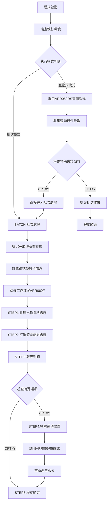
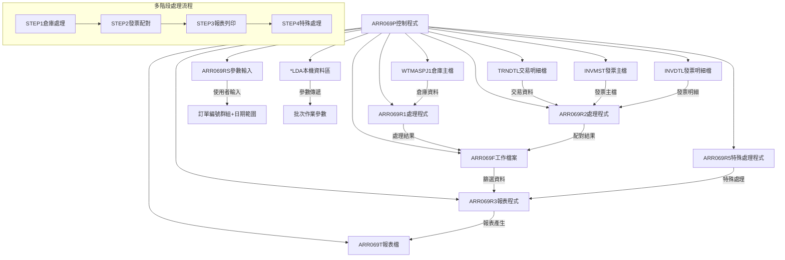
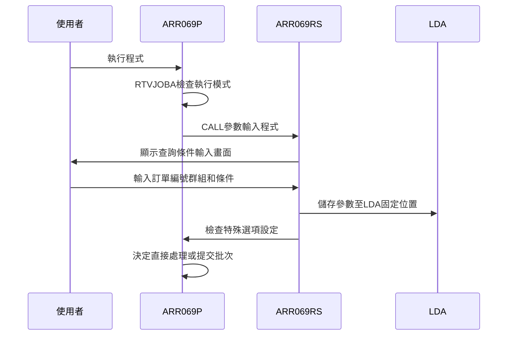
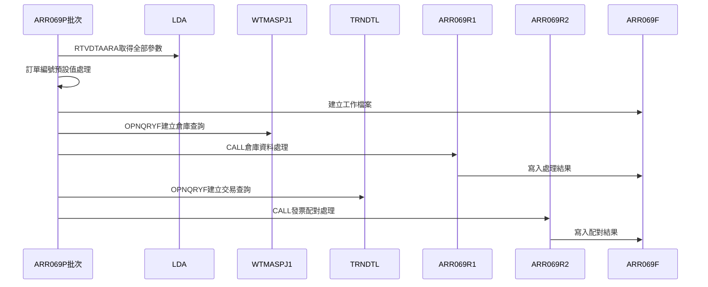
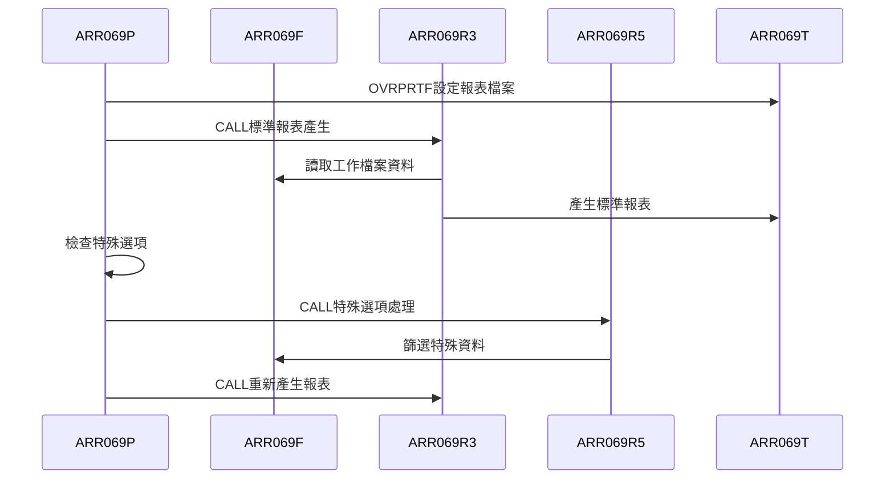
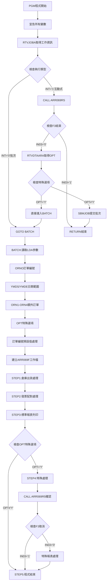
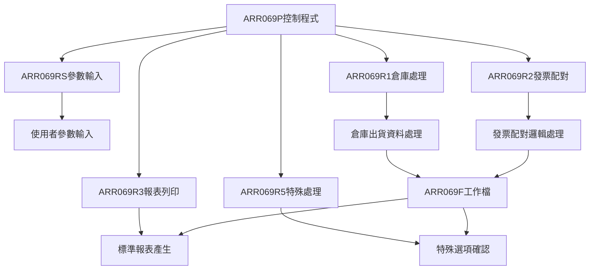

# ARR069P_P02 程式規格書

## 1. 基本資料

| 項目 | 內容 |
|------|------|
| **程式編號** | ARR069P |
| **程式名稱** | 訂單出貨及發票配對報表控制程式 |
| **程式類型** | CLP |
| **廠區** | P02 |
| **系統名稱** | 應收帳款系統 |
| **子系統** | 訂單出貨及發票配對報表 |
| **檔案位置** | P02CLSRC_THSRC/ARR069P.txt |

## 2. 🎯 程式功能說明

### 主要功能描述
此程式為訂單出貨及發票配對報表的控制程式，提供完整的多階段報表處理功能。程式整合倉庫出貨資料和發票配對資料，產生綜合性的訂單出貨及發票配對分析報表，支援多廠區和特殊選項處理。

### 🎯 業務流程詳細說明

#### 完整業務流程圖


#### 業務流程關鍵階段說明

**階段一：參數收集與驗證**
- 互動式模式調用ARR069RS畫面收集查詢條件
- 支援主訂單編號和額外4個訂單編號輸入
- 日期範圍設定和廠區類型選擇
- 特殊選項設定(顯示特殊列印選項)

**階段二：批次環境準備**
- 從LDA讀取完整的查詢參數組合
- 對空白訂單編號設定預設值999999
- 建立QTEMP工作檔案ARR069F
- 設定各階段所需的檔案覆蓋

**階段三：倉庫出貨資料處理(STEP1)**
- 查詢WTMASPJ1倉庫主檔案
- 使用複雜的多條件篩選邏輯
- 支援多種交易代碼和廠區分類
- 調用ARR069R1進行資料處理

**階段四：發票配對資料處理(STEP2)**
- 查詢TRNDTL交易明細檔案
- 整合INVMST和INVDTL發票資料
- 執行訂單與發票的配對邏輯
- 調用ARR069R2處理配對結果

**階段五：報表產生與特殊處理**
- 標準報表列印(STEP3)
- 特殊選項處理(STEP4)：提供使用者確認和篩選功能
- 重新產生客製化報表

## 3. 🎯 檔案架構與關聯圖

### 使用檔案清單

| 檔案名稱 | 檔案類型 | 使用方式 | 說明 |
|----------|----------|----------|------|
| ARR069RS | 程式 | CALL | 互動式參數輸入程式 |
| ARR069R1 | 程式 | CALL | 倉庫出貨資料處理程式 |
| ARR069R2 | 程式 | CALL | 發票配對資料處理程式 |
| ARR069R3 | 程式 | CALL | 報表列印程式 |
| ARR069R5 | 程式 | CALL | 特殊選項處理程式 |
| WTMASPJ1 | 邏輯檔 | INPUT | 倉庫主檔案(聯合檔案) |
| INVMST | 實體檔 | INPUT | 發票主檔 |
| INVDTL | 實體檔 | INPUT | 發票明細檔 |
| TRNDTL | 實體檔 | INPUT | 交易明細檔 |
| ARR069F | 工作檔 | I/O | 臨時工作檔案 |
| ARR069T | 報表檔 | OUTPUT | 報表輸出檔案 |
| *LDA | 資料區 | I/O | 本機資料區(參數傳遞) |

### 🎯 檔案關聯詳細視覺化圖表



### 🎯 資料流向詳細說明

#### 環境準備階段的資料流向


#### 業務處理階段的資料流向


#### 報表產生階段的資料流向


## 4. 🎯 檔案欄位規格說明

### 主要資料結構

#### 程式變數定義
| 變數名稱 | 型態 | 長度 | 用途說明 |
|----------|------|------|----------|
| &INT | *CHAR | 1 | 工作類型識別 |
| &OUTQ | *CHAR | 10 | 輸出佇列名稱 |
| &IN03 | *LGL | 1 | F3功能鍵指示器 |
| &ORNO | *CHAR | 6 | 主要訂單編號 |
| &YMDS | *CHAR | 8 | 查詢起始日期 |
| &YMDE | *CHAR | 8 | 查詢結束日期 |
| &ORN1 | *CHAR | 6 | 額外訂單編號1 |
| &ORN2 | *CHAR | 6 | 額外訂單編號2 |
| &ORN3 | *CHAR | 6 | 額外訂單編號3 |
| &ORN4 | *CHAR | 6 | 額外訂單編號4 |
| &OPT | *CHAR | 1 | 特殊選項旗標 |

#### WTMASPJ1倉庫主檔案結構
| 欄位名稱 | 位置 | 長度 | 型態 | 說明 |
|----------|------|------|------|------|
| W6FLAG | 1 | 1 | A | 處理旗標 |
| W6ENTD | 2-9 | 8 | S | 入庫日期 |
| W6ORNO | 10-15 | 6 | A | 訂單編號 |
| W6TRCD | 16-17 | 2 | A | 交易代碼 |
| W7AREA | 18 | 1 | A | 廠區代碼 |
| W7SPLT | 19 | 1 | A | 分類代碼 |

#### TRNDTL交易明細檔案結構
| 欄位名稱 | 位置 | 長度 | 型態 | 說明 |
|----------|------|------|------|------|
| TXDATE | 1-8 | 8 | S | 交易日期 |
| TXVUNO | 9-14 | 6 | A | 訂單編號 |
| TXORNO | 15-20 | 6 | A | 原始訂單編號 |
| TXIVNO | 21-30 | 10 | A | 發票編號 |
| TXCODE | 31-34 | 4 | A | 交易代碼 |

### 🔍 重點欄位切割技術詳解

#### 本機資料區(LDA)欄位切割視覺化展示
```
LDA資料區 (1024字元)：[....................OOOOOO|DDDDDDDD|DDDDDDDD|......OOOOOO|OOOOOO|OOOOOO|OOOOOO|...................P|...]
位置:                              401    407     415           429    435    441    447                    461
                                   ↓      ↓       ↓             ↓      ↓      ↓      ↓                      ↓
ORNO (6字元)：                    [OOOOOO]                                                                   主訂單編號
YMDS (8字元)：                          [DDDDDDDD]                                                          起始日期
YMDE (8字元)：                                  [DDDDDDDD]                                                  結束日期
ORN1 (6字元)：                                          [OOOOOO]                                           額外訂單1
ORN2 (6字元)：                                                [OOOOOO]                                     額外訂單2
ORN3 (6字元)：                                                      [OOOOOO]                               額外訂單3
ORN4 (6字元)：                                                            [OOOOOO]                         額外訂單4
OPT (1字元)：                                                                               [P]             特殊選項
```

#### 切割邏輯詳細說明
- **位置401-406**：主要訂單編號，6字元固定長度
- **位置407-414**：查詢起始日期，格式YYYYMMDD
- **位置415-422**：查詢結束日期，格式YYYYMMDD
- **位置429-454**：4個額外訂單編號，每個6字元
- **位置461**：特殊選項旗標，Y=啟用特殊處理

#### OPNQRYF查詢條件欄位切割技術

**STEP1倉庫查詢切割實例**：
```101:116:東鋼list/ARR069P_P02.txt
OPNQRYF  FILE(WTMASPJ1) +
         QRYSLT( +
            'W6FLAG *NE "D" *AND +
             W6ENTD *GE ' || &YMDS || ' *AND +
             W6ENTD *LE ' || &YMDE || ' *AND +
             (W6ORNO *EQ "' || &ORNO || '" *OR +
              W6ORNO *EQ "' || &ORN1 || '" *OR +
              W6ORNO *EQ "' || &ORN2 || '" *OR +
              W6ORNO *EQ "' || &ORN3 || '" *OR +
              W6ORNO *EQ "' || &ORN4 || '" ) *AND +
             W6TRCD *EQ %VALUES("11" "1E" "1F" "1G" +
                           "0A" "14" "1B" "1C") *AND +
             W7SPLT *EQ %VALUES("W" "1" "2" "3" "4" +
                     "5" "6" "7" "8" "9") ')     +
         KEYFLD((W6ORNO) (W6ENTD) (W7AREA) (W7VNO2) +
                (W7NAME) (W7QULT) (W7SPE1) (W7SQIT))
```

**STEP2交易查詢切割實例**：
```125:139:東鋼list/ARR069P_P02.txt
OPNQRYF    FILE(TRNDTL) +
           QRYSLT(   +
            '(TXDATE *GE ' || &YMDS || '  *AND    +
              TXDATE *LE ' || &YMDE || ') *AND    +
             (TXVUNO *EQ "' || &ORNO ||'" *OR   +
              TXVUNO *EQ "' || &ORN1 ||'" *OR   +
              TXVUNO *EQ "' || &ORN2 ||'" *OR   +
              TXVUNO *EQ "' || &ORN3 ||'" *OR   +
              TXVUNO *EQ "' || &ORN4 ||'" ) *AND +
              TXIVNO *NE "          " *AND       +
              IVNO   *NE "000000"     *AND       +
              TXCODE *EQ "SA04"') +
           MAPFLD((TXVUNO '%SST(TXORNO 1 6)')  +
                  (IVNO   '%SST(TXIVNO 1 6)')) +
           KEYFLD((TXVUNO) (TXNO) (TXIVNO))
```

### 🎯 欄位挪用詳細分析

#### 挪用情況對比表

| 欄位名稱 | 原始定義 | 實際使用方式 | 挪用類型 | 使用狀態 |
|----------|----------|-------------|----------|----------|
| **TXVUNO交易訂單號** | 交易明細中的訂單編號 | 實際存放原始訂單前6字元 | 對應性挪用 | MAPFLD重新對應 |
| **IVNO發票編號** | 完整發票編號 | 只使用前6字元進行檢核 | 部分性挪用 | 長度縮減使用 |
| **ORN1-ORN4訂單群組** | 獨立訂單編號欄位 | 統一預設值999999處理 | 預設性挪用 | 空值標準化 |
| **OPT特殊選項** | 一般選項旗標 | 控制STEP4特殊處理流程 | 流程性挪用 | 條件分支控制 |

#### 挪用原因深度分析

**1. 交易訂單編號對應挪用(TXVUNO)**
- **原始設計目的**：交易明細檔案中記錄交易相關的訂單編號
- **實際挪用原因**：
  - 資料一致性需求：需要與原始訂單編號格式對應
  - 查詢效率最佳化：使用%SST函數取前6字元比對
  - 歷史相容性：配合既有的訂單編號長度標準
- **業務邏輯影響**：透過MAPFLD重新對應實現準確的訂單配對

**2. 發票編號部分挪用(IVNO)**
- **原始設計目的**：IVNO為完整的發票編號欄位
- **實際挪用原因**：
  - 有效性檢核：只需要前6字元判斷發票是否有效
  - 效能考量：減少比較位元數提升查詢速度
  - 業務規則：排除特定格式的無效發票(000000)
- **業務邏輯影響**：確保只處理有效的發票配對資料

**3. 訂單群組預設值挪用(ORN1-ORN4)**
- **原始設計目的**：提供多個訂單編號的查詢功能
- **實際挪用原因**：
  - 查詢邏輯統一：空白值統一設為999999避免查詢條件異常
  - OR邏輯完整性：確保所有OR條件都有有效值
  - 系統穩定性：防止空白值造成的查詢錯誤
- **業務邏輯影響**：提供靈活的多訂單查詢並確保查詢邏輯完整

**4. 特殊選項流程挪用(OPT)**
- **原始設計目的**：一般性選項控制旗標
- **實際挪用原因**：
  - 流程分支控制：決定是否執行STEP4特殊處理
  - 互動式擴展：提供額外的使用者互動功能
  - 報表客製化：支援特殊格式或篩選需求
- **業務邏輯影響**：實現彈性的報表處理模式

#### 挪用方式詳細說明

**交易訂單編號重新對應實現方式**：
```137:138:東鋼list/ARR069P_P02.txt
MAPFLD((TXVUNO '%SST(TXORNO 1 6)')  +
       (IVNO   '%SST(TXIVNO 1 6)'))
```
- **對應技術**：使用MAPFLD將原欄位重新對應到新名稱
- **切割技術**：%SST函數取前6字元
- **查詢最佳化**：建立標準化的比對欄位

**訂單編號預設值處理實現方式**：
```55:73:東鋼list/ARR069P_P02.txt
IF         COND(&ORNO *EQ '      ') THEN(DO)
CHGVAR     VAR(&ORN1)    VALUE('999999')
ENDDO

IF         COND(&ORN1 *EQ '      ') THEN(DO)
CHGVAR     VAR(&ORN1)    VALUE('999999')
ENDDO
```
- **檢查機制**：逐一檢查每個訂單編號是否為空白
- **標準化設定**：統一設定為999999預設值
- **邏輯完整性**：確保OR查詢條件的有效性

**特殊選項流程控制實現方式**：
```152:152:東鋼list/ARR069P_P02.txt
IF     COND(&OPT  *NE 'Y') THEN(GOTO STEP5)
```
- **條件分支**：根據OPT值決定是否執行特殊處理
- **流程跳轉**：非Y值直接跳到程式結束
- **功能擴展**：Y值啟用完整的特殊處理功能

#### 挪用影響評估

**正面影響**：
- **查詢效率提升**：部分欄位比對和重新對應減少處理時間
- **資料品質保障**：預設值處理避免空值造成的查詢異常
- **功能擴展彈性**：特殊選項提供額外的處理模式
- **系統穩定性**：標準化處理減少異常情況

**潛在風險**：
- **維護複雜性**：MAPFLD和%SST函數增加理解難度
- **資料精確度**：部分欄位比對可能遺漏完整匹配需求
- **邏輯依賴性**：預設值999999的選擇需要與業務邏輯配合

**維護注意事項**：
- MAPFLD定義變更時需同步修改相關處理程式
- 訂單編號格式變更需檢查前6字元比對邏輯
- 特殊選項功能擴展需確保向下相容性

### 重要變數定義表

| 變數名稱 | 型態 | 長度 | 用途說明 |
|----------|------|------|----------|
| &ORNO | *CHAR | 6 | 主要查詢訂單編號 |
| &YMDS | *CHAR | 8 | 查詢起始日期(YYYYMMDD) |
| &YMDE | *CHAR | 8 | 查詢結束日期(YYYYMMDD) |
| &ORN1-ORN4 | *CHAR | 6 | 額外查詢訂單編號群組 |
| &OPT | *CHAR | 1 | 特殊選項控制旗標(Y/N) |
| &IN03 | *LGL | 1 | F3結束功能鍵指示器 |

## 5. 🎯 輸出/入螢幕布局

### 螢幕布局完整視覺化
```
+----------------------------------------------------------+
|  12/28/24     東鋼金屬股份有限公司               ARR069S  |
|  10:30:25     訂單出貨及發票配對報表             SYS001   |
|                                                          |
|                                                          |
|                                                          |
|                                                          |
|       請輸入您的條件：                                   |
|                       1.訂單：[______][______][______]   |
|                              [______][______]             |
|                       2.輸入期間：[____/__/__]至         |
|                                   [____/__/__]           |
|                       3.出貨系統：[_] (V=勝綱M=台鋼H=高雄|
|                                      D=大綱U=嘉聯K=嘉綱  |
|                                      X=廠綱N=大亞)        |
|                                   R=廢鋼鐵R Q=廢鋼鋼鐵    |
|                                   請輸入適當)             |
|                       4.顯示特殊：[_] (Y)                |
|                                                          |
|                                                          |
|                                                          |
|                                                          |
|                                                          |
| F3:離開     F12:回到主畫面        ENTER:確認             |
| [錯誤訊息顯示區]                                         |
+----------------------------------------------------------+
```

### 🎯 畫面欄位詳細說明

| 欄位標題 | 欄位名稱 | 輸入長度 | 型態 | 屬性 | 檢核規則 |
|----------|----------|----------|------|------|----------|
| 訂單1 | S#ORNO | 6 | A | 輸入 | 有效訂單編號 |
| 訂單2 | S#ORN1 | 6 | A | 輸入 | 有效訂單編號 |
| 訂單3 | S#ORN2 | 6 | A | 輸入 | 有效訂單編號 |
| 訂單4 | S#ORN3 | 6 | A | 輸入 | 有效訂單編號 |
| 訂單5 | S#ORN4 | 6 | A | 輸入 | 有效訂單編號 |
| 起始日期 | S#YMDS | 8 | Y | 輸入 | 有效日期格式YYYY/MM/DD |
| 結束日期 | S#YMDE | 8 | Y | 輸入 | 必須≥起始日期 |
| 出貨系統 | S#AREA | 1 | A | 輸入 | 限定值清單 |
| 顯示特殊 | S#OPT | 1 | A | 輸入 | Y或空白 |

#### 出貨系統代碼說明
- **V**：勝綱系統
- **M**：台鋼系統
- **H**：高雄系統
- **D**：大綱系統
- **U**：嘉聯系統
- **K**：嘉綱系統
- **X**：廠綱系統
- **N**：大亞系統
- **R**：廢鋼鐵R系統
- **Q**：廢鋼鋼鐵系統

### 🎯 畫面控制邏輯

#### 指示器控制
- **指示器52**：起始日期欄位控制(RI+PC)
- **指示器53**：結束日期欄位控制(RI+PC)
- CA03(03)：F3功能鍵控制
- CA12(12)：F12功能鍵控制

### 功能鍵詳細定義

| 功能鍵 | 功能說明 | 處理邏輯 | 系統行為 |
|--------|----------|----------|----------|
| F3 | 離開程式 | 設定&IN03='1' | 直接結束程式回到呼叫點 |
| F12 | 回到主畫面 | 設定指示器12 | 回到主系統畫面 |
| Enter | 確認執行 | 驗證輸入條件 | 儲存參數並啟動批次處理 |

### 操作流程

1. **畫面顯示**：顯示查詢條件輸入畫面
2. **條件輸入**：使用者輸入訂單編號群組和查詢條件
3. **日期設定**：設定查詢的日期範圍
4. **系統選擇**：選擇出貨系統類型
5. **特殊選項**：設定是否啟用特殊處理模式
6. **確認執行**：按Enter開始執行報表處理

## 6. 🎯 處理流程程序說明

### 🎯 主程序邏輯深度分析

#### 程式執行流程圖


#### 🎯 詳細處理步驟逐一分析

**步驟1：程式初始化與變數宣告**
```19:32:東鋼list/ARR069P_P02.txt
PGM
DCL        VAR(&INT)  TYPE(*CHAR) LEN(1)
DCL        VAR(&OUTQ) TYPE(*CHAR) LEN(10)
DCL        VAR(&IN03) TYPE(*LGL)  LEN(1)
DCL        VAR(&ORNO) TYPE(*CHAR) LEN(6)
DCL        VAR(&YMDS) TYPE(*CHAR) LEN(8)
DCL        VAR(&YMDE) TYPE(*CHAR) LEN(8)
DCL        VAR(&ORN1) TYPE(*CHAR) LEN(6)
DCL        VAR(&ORN2) TYPE(*CHAR) LEN(6)
DCL        VAR(&ORN3) TYPE(*CHAR) LEN(6)
DCL        VAR(&ORN4) TYPE(*CHAR) LEN(6)
DCL        VAR(&OPT)  TYPE(*CHAR) LEN(1)
```
- 定義工作類型和輸出佇列變數
- 定義功能鍵指示器
- 定義主訂單和4個額外訂單變數
- 定義日期範圍和特殊選項變數

**步驟2：執行模式判斷與互動處理**
```33:44:東鋼list/ARR069P_P02.txt
RTVJOBA    OUTQ(&OUTQ) TYPE(&INT)
IF         COND(&INT *EQ '0') THEN(GOTO BATCH)

CALL       PGM(ARR069RS) PARM(&IN03)
IF         COND(&IN03 *EQ '1') THEN(RETURN)

RTVDTAARA    DTAARA(*LDA (461 1))   RTNVAR(&OPT)
IF     COND(&OPT *NE 'Y') THEN(DO)
SBMJOB     JOB(ARR069P) JOBD(ARJOBD) OUTQ(&OUTQ) +
             RQSDTA('CALL ARR069P')
RETURN
ENDDO
```
- 判斷互動式或批次執行模式
- 互動式模式調用參數輸入程式
- 檢查特殊選項決定直接處理或提交批次

**步驟3：批次參數讀取與預設值處理**
```46:73:東鋼list/ARR069P_P02.txt
BATCH:      RTVDTAARA  DTAARA(*LDA (401 6))      RTNVAR(&ORNO)
            RTVDTAARA  DTAARA(*LDA (407 8))      RTNVAR(&YMDS)
            RTVDTAARA  DTAARA(*LDA (415 8))      RTNVAR(&YMDE)
            RTVDTAARA  DTAARA(*LDA (429 6))      RTNVAR(&ORN1)
            RTVDTAARA  DTAARA(*LDA (435 6))      RTNVAR(&ORN2)
            RTVDTAARA  DTAARA(*LDA (441 6))      RTNVAR(&ORN3)
            RTVDTAARA  DTAARA(*LDA (447 6))      RTNVAR(&ORN4)
            RTVDTAARA  DTAARA(*LDA (461 1))      RTNVAR(&OPT)

            IF         COND(&ORNO *EQ '      ') THEN(DO)
            CHGVAR     VAR(&ORN1)    VALUE('999999')
            ENDDO
```
- 從LDA固定位置讀取所有查詢參數
- 對空白的訂單編號設定預設值999999
- 確保OR查詢邏輯的完整性

**步驟4：工作檔案準備**
```75:79:東鋼list/ARR069P_P02.txt
DLTF       FILE(QTEMP/ARR069F)
MONMSG     MSGID(CPF0000)
CRTDUPOBJ  OBJ(ARR069F) FROMLIB(ARLIB) OBJTYPE(*FILE) +
             TOLIB(QTEMP)
OVRDBF   FILE(ARR069F) TOFILE(QTEMP/ARR069F) SHARE(*YES)
```
- 清除臨時工作檔案
- 複製ARR069F檔案結構到QTEMP
- 設定檔案覆蓋供後續處理使用

**步驟5：STEP1倉庫出貨資料處理**
```81:119:東鋼list/ARR069P_P02.txt
STEP1:                 /* 倉庫出貨資料 */
OVRDBF   FILE(WTMASPJ1) TOFILE(DALIB/WTMASPJ1) SHARE(*YES)
OPNQRYF  FILE(WTMASPJ1) +
         QRYSLT( +
            'W6FLAG *NE "D" *AND +
             W6ENTD *GE ' || &YMDS || ' *AND +
             W6ENTD *LE ' || &YMDE || ' *AND +
             (W6ORNO *EQ "' || &ORNO || '" *OR +
              W6ORNO *EQ "' || &ORN1 || '" *OR +
              W6ORNO *EQ "' || &ORN2 || '" *OR +
              W6ORNO *EQ "' || &ORN3 || '" *OR +
              W6ORNO *EQ "' || &ORN4 || '" ) *AND +
             W6TRCD *EQ %VALUES("11" "1E" "1F" "1G" +
                           "0A" "14" "1B" "1C") *AND +
             W7SPLT *EQ %VALUES("W" "1" "2" "3" "4" +
                     "5" "6" "7" "8" "9") ')     +
         KEYFLD((W6ORNO) (W6ENTD) (W7AREA) (W7VNO2) +
                (W7NAME) (W7QULT) (W7SPE1) (W7SQIT))
CALL       PGM(ARR069R1)
CLOF       OPNID(WTMASPJ1)
```
- 設定倉庫主檔案覆蓋
- 建立複雜的多條件查詢
- 支援多種交易代碼和分類代碼
- 調用ARR069R1處理倉庫出貨資料

**步驟6：STEP2訂單發票配對處理**
```121:141:東鋼list/ARR069P_P02.txt
STEP2:                 /* 訂單發票配對處理 */
OVRDBF     FILE(INVMST) TOFILE(DALIB/INVMST) SHARE(*YES)
OVRDBF     FILE(INVDTL) TOFILE(DALIB/INVDTL) SHARE(*YES)
OVRDBF     FILE(TRNDTL) TOFILE(DALIB/TRNDTL) SHARE(*YES)
OPNQRYF    FILE(TRNDTL) +
           QRYSLT(   +
            '(TXDATE *GE ' || &YMDS || '  *AND    +
              TXDATE *LE ' || &YMDE || ') *AND    +
             (TXVUNO *EQ "' || &ORNO ||'" *OR   +
              TXVUNO *EQ "' || &ORN1 ||'" *OR   +
              TXVUNO *EQ "' || &ORN2 ||'" *OR   +
              TXVUNO *EQ "' || &ORN3 ||'" *OR   +
              TXVUNO *EQ "' || &ORN4 ||'" ) *AND +
              TXIVNO *NE "          " *AND       +
              IVNO   *NE "000000"     *AND       +
              TXCODE *EQ "SA04"') +
           MAPFLD((TXVUNO '%SST(TXORNO 1 6)')  +
                  (IVNO   '%SST(TXIVNO 1 6)')) +
           KEYFLD((TXVUNO) (TXNO) (TXIVNO))
CALL       PGM(ARR069R2)
CLOF       OPNID(TRNDTL)
```
- 設定發票相關檔案覆蓋
- 建立交易明細查詢條件
- 使用MAPFLD重新對應欄位
- 調用ARR069R2處理發票配對

### 🎯 子程序邏輯分析

#### ARR069RS參數輸入程式
- **調用方式**：CALL PGM(ARR069RS) PARM(&IN03)
- **功能**：提供使用者友善的參數輸入介面
- **參數傳遞**：透過LDA和功能鍵指示器

#### ARR069R1倉庫資料處理程式
- **調用方式**：CALL PGM(ARR069R1)
- **資料來源**：WTMASPJ1倉庫主檔案查詢結果
- **處理功能**：分析倉庫出貨資料並寫入工作檔案

#### ARR069R2發票配對處理程式
- **調用方式**：CALL PGM(ARR069R2)
- **資料來源**：TRNDTL交易明細檔案查詢結果
- **處理功能**：執行訂單與發票的配對邏輯

#### ARR069R3報表列印程式
- **調用方式**：CALL PGM(ARR069R3)
- **資料來源**：ARR069F工作檔案
- **輸出功能**：產生標準化的配對報表

#### ARR069R5特殊處理程式
- **調用方式**：CALL PGM(ARR069R5) PARM(&IN03)
- **功能**：提供使用者確認和特殊篩選功能
- **互動性**：支援使用者取消或修改處理選項

#### 程式調用關係圖


### 🎯 特殊邏輯處理

#### 多訂單編號OR邏輯處理
```106:110:東鋼list/ARR069P_P02.txt
(W6ORNO *EQ "' || &ORNO || '" *OR +
 W6ORNO *EQ "' || &ORN1 || '" *OR +
 W6ORNO *EQ "' || &ORN2 || '" *OR +
 W6ORNO *EQ "' || &ORN3 || '" *OR +
 W6ORNO *EQ "' || &ORN4 || '" ) *AND +
```
- **邏輯設計**：支援最多5個訂單編號的並行查詢
- **預設值保護**：空白訂單編號設為999999避免異常
- **查詢效率**：使用OR邏輯實現靈活的多條件查詢

#### 交易代碼分類處理邏輯
```111:114:東鋼list/ARR069P_P02.txt
W6TRCD *EQ %VALUES("11" "1E" "1F" "1G" +
               "0A" "14" "1B" "1C") *AND +
W7SPLT *EQ %VALUES("W" "1" "2" "3" "4" +
        "5" "6" "7" "8" "9") ')
```
- **交易類型篩選**：限定特定的交易代碼類型
- **分類代碼控制**：確保只處理有效的業務分類
- **版本演進**：註解顯示從舊版本增加了"1B" "1C"代碼

#### 特殊選項流程控制邏輯
```152:169:東鋼list/ARR069P_P02.txt
IF     COND(&OPT  *NE 'Y') THEN(GOTO STEP5)

STEP4:      
OVRDBF   FILE(ARR069F) TOFILE(QTEMP/ARR069F) SHARE(*YES)
CALL       PGM(ARR069R5)   PARM(&IN03)
IF         COND(&IN03 *EQ '1') THEN(RETURN)

OVRPRTF    FILE(ARR069T) TOFILE(ARLIB/ARR069T) +
             PAGESIZE(*N 158) CPI(12) HOLD(*YES) +
             SAVE(*YES) USRDTA('訂單出貨')
OPNQRYF    FILE(ARR069F) +
           QRYSLT('(WFOPT  *NE " ")')   +
           KEYFLD(*FILE)
CALL       PGM(ARR069R3)
```
- **條件分支**：根據OPT值決定處理路徑
- **使用者確認**：ARR069R5提供互動確認功能
- **篩選查詢**：只處理WFOPT非空白的記錄
- **報表客製化**：使用SAVE(*YES)儲存特殊報表

## 7. 🎯 數據操作與轉換分析

### 檔案操作詳解

#### 多檔案覆蓋操作策略
```82:124:東鋼list/ARR069P_P02.txt
OVRDBF   FILE(WTMASPJ1) TOFILE(DALIB/WTMASPJ1) SHARE(*YES)
OVRDBF     FILE(INVMST) TOFILE(DALIB/INVMST) SHARE(*YES)
OVRDBF     FILE(INVDTL) TOFILE(DALIB/INVDTL) SHARE(*YES)
OVRDBF     FILE(TRNDTL) TOFILE(DALIB/TRNDTL) SHARE(*YES)
```
- **操作範圍**：涵蓋倉庫、發票、交易三大檔案系統
- **共享模式**：SHARE(*YES)支援多使用者並行存取
- **效能最佳化**：使用DALIB資料庫的實際檔案
- **資源管理**：自動在程式結束時清除覆蓋

#### 複雜查詢檔案建立
```101:116:東鋼list/ARR069P_P02.txt
OPNQRYF  FILE(WTMASPJ1) +
         QRYSLT(...) +
         KEYFLD((W6ORNO) (W6ENTD) (W7AREA) (W7VNO2) +
                (W7NAME) (W7QULT) (W7SPE1) (W7SQIT))
```
- **查詢類型**：多重條件AND/OR邏輯組合
- **排序設定**：複雜的多欄位排序邏輯
- **效能考量**：使用邏輯檔案提升查詢速度
- **資料篩選**：動態SQL條件組合

### 數據轉換邏輯

#### MAPFLD欄位重新對應轉換
```137:138:東鋼list/ARR069P_P02.txt
MAPFLD((TXVUNO '%SST(TXORNO 1 6)')  +
       (IVNO   '%SST(TXIVNO 1 6)'))
```
- **轉換目的**：將原始欄位重新對應為查詢友善格式
- **切割技術**：使用%SST函數取前6字元
- **邏輯統一**：統一訂單編號格式便於比對
- **效能提升**：減少字串比較長度

#### 預設值標準化轉換
```55:73:東鋼list/ARR069P_P02.txt
IF         COND(&ORNO *EQ '      ') THEN(DO)
CHGVAR     VAR(&ORN1)    VALUE('999999')
ENDDO
```
- **轉換邏輯**：空白值統一轉換為999999
- **業務目的**：確保OR查詢邏輯的完整性
- **標準化處理**：避免空值造成的查詢異常
- **效率考量**：減少條件判斷的複雜性

#### 工作檔案結構轉換
```75:79:東鋼list/ARR069P_P02.txt
DLTF       FILE(QTEMP/ARR069F)
MONMSG     MSGID(CPF0000)
CRTDUPOBJ  OBJ(ARR069F) FROMLIB(ARLIB) OBJTYPE(*FILE) +
             TOLIB(QTEMP)
```
- **檔案複製**：從ARLIB複製結構到QTEMP
- **臨時處理**：建立程式專用的工作空間
- **錯誤處理**：MONMSG處理檔案不存在的情況
- **資源隔離**：避免多使用者間的檔案衝突

### 檢核機制詳解

#### 多層次資料有效性檢核
```103:114:東鋼list/ARR069P_P02.txt
'W6FLAG *NE "D" *AND +
 W6ENTD *GE ' || &YMDS || ' *AND +
 W6ENTD *LE ' || &YMDE || ' *AND +
 W6TRCD *EQ %VALUES("11" "1E" "1F" "1G" +
               "0A" "14" "1B" "1C") *AND +
 W7SPLT *EQ %VALUES("W" "1" "2" "3" "4" +
         "5" "6" "7" "8" "9") ')'
```
- **狀態檢核**：排除已刪除的記錄(FLAG≠"D")
- **日期檢核**：確保在指定日期範圍內
- **業務檢核**：限定有效的交易代碼
- **分類檢核**：確保業務分類的正確性

#### 發票配對有效性檢核
```134:136:東鋼list/ARR069P_P02.txt
TXIVNO *NE "          " *AND       +
IVNO   *NE "000000"     *AND       +
TXCODE *EQ "SA04"') +
```
- **發票編號檢核**：確保發票編號非空白
- **有效性檢核**：排除無效的發票編號(000000)
- **交易類型檢核**：限定為SA04類型交易
- **配對準確性**：確保只處理有效的配對資料

## 8. 🎯 錯誤處理程序說明

### 🎯 詳細錯誤代碼清冊

| 錯誤代碼 | 錯誤訊息 | 原因說明 | 處理方式 | 預防措施 |
|----------|---------|---------|---------|----------|
| **USER001** | 功能鍵F3結束 | 使用者按下F3結束程式 | 1. 正常結束程式<br>2. 清理臨時檔案<br>3. 回到呼叫點 | 使用者操作選擇 |
| **FILE001** | 工作檔案建立失敗 | ARR069F工作檔案無法建立 | 1. 檢查QTEMP權限<br>2. 確認ARLIB檔案存在<br>3. 重新執行程式 | 確保檔案權限正常 |
| **FILE002** | 檔案覆蓋失敗 | WTMASPJ1/INVMST等檔案覆蓋失敗 | 1. 檢查DALIB權限<br>2. 確認檔案結構<br>3. 重新設定覆蓋 | 確保資料庫檔案可用 |
| **FILE003** | 查詢建立失敗 | OPNQRYF指令執行失敗 | 1. 檢查查詢語法<br>2. 確認檔案關聯<br>3. 重新建立查詢 | 驗證查詢條件正確性 |
| **SYS001** | 子程式調用失敗 | ARR069R1/R2/R3/R5程式調用失敗 | 1. 檢查程式庫路徑<br>2. 確認程式存在<br>3. 檢查程式權限 | 確保子程式可用 |
| **FILE004** | LDA存取錯誤 | 本機資料區讀寫失敗 | 1. 重新啟動工作<br>2. 檢查LDA結構<br>3. 重新執行程式 | 確保工作環境正常 |
| **FILE005** | 報表檔案錯誤 | ARR069T報表檔案設定失敗 | 1. 檢查ARLIB權限<br>2. 確認列印設定<br>3. 重新設定報表 | 確保報表檔案可用 |

### 🎯 系統異常處理邏輯

#### 檔案操作失敗處理
- **工作檔案異常**：QTEMP空間不足或權限問題
- **覆蓋設定異常**：資料庫檔案無法存取或結構不符
- **查詢建立異常**：SQL語法錯誤或檔案關聯失敗

#### 程式調用失敗處理
- **子程式缺失**：ARR069R系列程式無法找到
- **參數傳遞錯誤**：LDA參數格式或位置錯誤
- **程式權限錯誤**：程式庫存取權限不足

#### 資料完整性錯誤處理
- **LDA參數異常**：參數讀取位置或格式錯誤
- **查詢條件異常**：動態SQL組合失敗
- **日期格式異常**：日期範圍設定不正確

#### 並發控制失敗處理
- **檔案鎖定衝突**：多使用者同時存取相同檔案
- **工作檔案衝突**：QTEMP檔案同名衝突
- **資源競爭**：系統資源不足導致處理失敗

### 🎯 錯誤恢復機制

#### 自動清理保護機制
```149:149:東鋼list/ARR069P_P02.txt
DLTOVR     FILE(*ALL)
```
- **覆蓋清理**：自動清除所有檔案覆蓋設定
- **資源釋放**：確保系統資源正確釋放
- **多點清理**：在多個處理階段都執行清理

#### 檔案錯誤處理機制
```75:76:東鋼list/ARR069P_P02.txt
DLTF       FILE(QTEMP/ARR069F)
MONMSG     MSGID(CPF0000)
```
- **錯誤監控**：MONMSG攔截所有檔案操作錯誤
- **繼續執行**：檔案不存在時不中斷程式執行
- **容錯設計**：允許重複執行而不產生錯誤

#### 查詢資源管理機制
```119:119:東鋼list/ARR069P_P02.txt
CLOF       OPNID(WTMASPJ1)
```
- **查詢關閉**：每個STEP完成後立即關閉查詢
- **資源回收**：避免查詢資源累積佔用
- **系統穩定**：防止查詢衝突和記憶體洩漏

## 9. 🎯 備註

### 🎯 特殊注意事項

#### 程式設計特色
- **多階段處理架構**：STEP1-STEP5的模組化設計
- **雙模式支援**：互動式參數輸入和批次報表處理
- **特殊選項擴展**：可選的使用者確認和篩選功能
- **複雜查詢邏輯**：支援多訂單編號和多重條件篩選

#### 版本演進歷史
- **9904A版本**：新增"1B" "1C"交易代碼支援
- **0406A版本**：增加特殊選項功能
- **0906A版本**：修改TXRESV欄位使用，修正ARR069R2的BUG
- **多次更新**：持續擴展廠區類型和交易代碼支援

#### 查詢邏輯複雜性
- **STEP1倉庫查詢**：支援8種交易代碼和10種分類代碼
- **STEP2發票配對**：整合3個檔案進行複雜配對邏輯
- **多訂單支援**：最多5個訂單編號的並行查詢
- **MAPFLD應用**：欄位重新對應提升查詢效率

#### LDA參數配置策略
- **位置401-406**：主要訂單編號
- **位置407-422**：日期範圍設定
- **位置429-454**：4個額外訂單編號(每個6字元)
- **位置461**：特殊選項控制旗標

#### 檔案關聯架構
- **WTMASPJ1**：倉庫主檔案(聯合檔案)，提供出貨基礎資料
- **TRNDTL**：交易明細檔案，記錄發票配對資訊
- **INVMST/INVDTL**：發票主檔和明細檔，提供發票詳細資料
- **ARR069F**：臨時工作檔案，整合所有處理結果

#### 特殊處理功能
- **選項控制**：OPT='Y'啟用STEP4特殊處理
- **使用者確認**：ARR069R5提供互動確認功能
- **篩選查詢**：WFOPT欄位控制特殊資料篩選
- **報表客製化**：支援標準和特殊兩種報表格式

#### 系統整合特點
- 與應收帳款系統完整整合
- 支援多廠區的統一處理架構
- 依賴DALIB資料庫的完整檔案結構
- 需要ARLIB程式庫的完整支援程式群組

#### 效能最佳化技術
- **SHARE(*YES)**：多使用者並行存取
- **MAPFLD欄位對應**：減少字串比較長度
- **預設值處理**：簡化OR邏輯查詢條件
- **分階段處理**：避免大量資料的一次性處理 