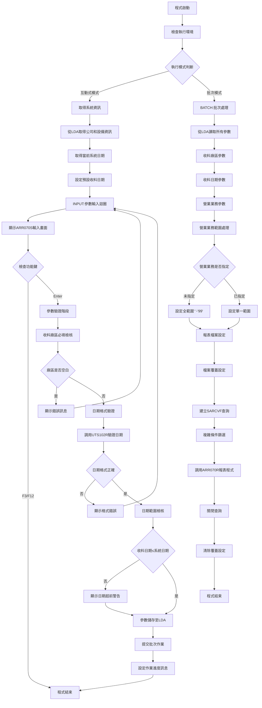
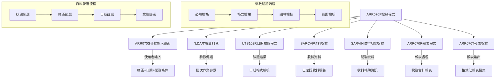
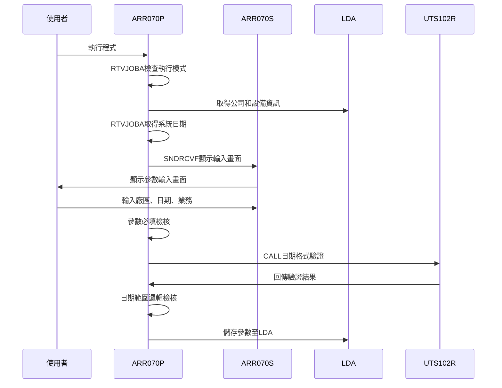
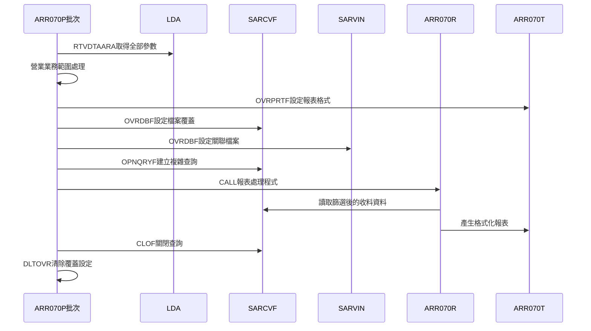
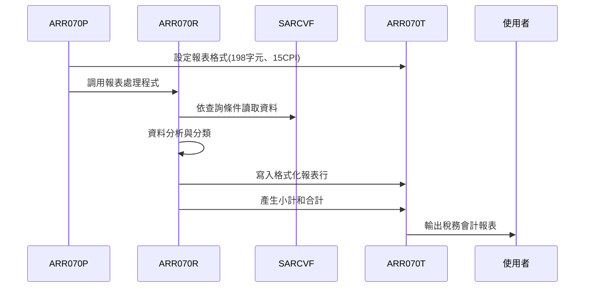
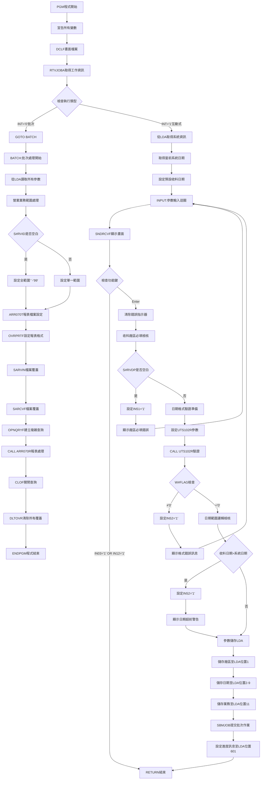
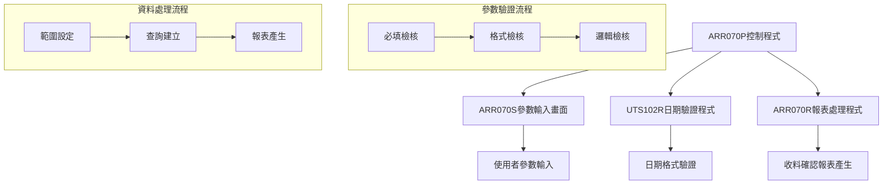

# ARR070P_P02 程式規格書

## 1. 基本資料

| 項目 | 內容 |
|------|------|
| **程式編號** | ARR070P |
| **程式名稱** | 應收入庫及稅務會計報表控制程式 |
| **程式類型** | CLP |
| **廠區** | P02 |
| **系統名稱** | 應收帳款系統 |
| **子系統** | 收料確認報表系統 |
| **檔案位置** | P02CLSRC_THSRC/ARR070P.txt |

## 2. 🎯 程式功能說明

### 主要功能描述
此程式為應收入庫及稅務會計報表的控制程式，專門處理已確認收料的報表產生作業。程式整合收料確認資料，按照廠區和營業業務分類，產生稅務會計所需的收料確認報表，支援多廠區處理和日期範圍控制。

### 🎯 業務流程詳細說明

#### 完整業務流程圖


#### 業務流程關鍵階段說明

**階段一：參數收集與驗證**
- 互動式畫面收集收料廠區、收料日期、營業業務等條件
- 多層次驗證機制：必填檢核、格式驗證、邏輯檢核
- 使用UTS102R進行專業日期格式驗證
- 系統日期比對防止未來日期輸入

**階段二：多廠區支援處理**
- 支援P(台北)、M(台中)、T(臺南)、H(高雄)、K(嘉義)等五大廠區
- 廠區代碼嚴格限制在預設值清單內
- 各廠區獨立的收料確認處理邏輯

**階段三：營業業務範圍控制**
- 0710A版本新增營業業務篩選功能
- 支援單一業務指定或全範圍處理
- 自動範圍設定：空白時自動設為'  '-'99'的全範圍

**階段四：收料資料篩選與處理**
- 使用OPNQRYF對SARCVF進行複雜條件查詢
- 多重狀態旗標篩選：SRFL01='Y'、SRFL02=' '、SRFL03=' '
- %SST函數進行收料編號首位廠區比對
- 精確的日期和營業業務範圍比對

**階段五：報表產生與輸出**
- 設定ARR070T報表檔案格式(198字元寬度、15CPI)
- 調用ARR070R進行實際報表處理
- 自動清理檔案覆蓋和查詢資源

## 3. 🎯 檔案架構與關聯圖

### 使用檔案清單

| 檔案名稱 | 檔案類型 | 使用方式 | 說明 |
|----------|----------|----------|------|
| ARR070S | 畫面檔 | DCLF | 參數輸入畫面檔案 |
| ARR070R | 程式 | CALL | 報表處理程式 |
| UTS102R | 程式 | CALL | 日期格式驗證程式 |
| SARCVF | 實體檔 | INPUT | 收料檔案(主要資料來源) |
| SARVIN | 實體檔 | INPUT | 收料相關檔案 |
| ARR070T | 報表檔 | OUTPUT | 報表輸出檔案 |
| *LDA | 資料區 | I/O | 本機資料區(參數傳遞) |

### 🎯 檔案關聯詳細視覺化圖表



### 🎯 資料流向詳細說明

#### 環境準備階段的資料流向


#### 業務處理階段的資料流向


#### 報表產生階段的資料流向


## 4. 🎯 檔案欄位規格說明

### 主要資料結構

#### 程式變數定義
| 變數名稱 | 型態 | 長度 | 用途說明 |
|----------|------|------|----------|
| &INT | *CHAR | 1 | 工作類型識別 |
| &OUTQ | *CHAR | 10 | 輸出佇列名稱 |
| &W#FLAG | *CHAR | 1 | 處理旗標 |
| &W#DATE | *DEC | 8,0 | 日期數值(YYYYMMDD) |
| &W#UDATE | *CHAR | 8 | 字串日期格式 |
| &W#RVDT | *CHAR | 8 | 收料日期 |
| &P#PDAT | *CHAR | 8 | 日期驗證輸入參數 |
| &P#MODE | *CHAR | 1 | 驗證模式參數 |
| &P#MTL | *CHAR | 24 | 月份資訊 |
| &P#LEAP | *CHAR | 1 | 閏年旗標 |
| &W#RVIS | *CHAR | 2 | 營業業務起始範圍 |
| &W#RVIE | *CHAR | 2 | 營業業務結束範圍 |
| &S#RVID | *CHAR | 1 | 營業業務代碼 |

#### SARCVF收料檔案結構
| 欄位名稱 | 型態 | 長度 | 位置 | 說明 |
|----------|------|------|------|------|
| SRRVNO | A | 6 | 1-6 | 收料編號 |
| SRFL01 | A | 1 | 7 | 收料確認旗標 |
| SRFL02 | A | 1 | 8 | 會計處理旗標 |
| SRFL03 | A | 1 | 9 | 收料列印旗標 |
| SRNAMT | P | 11,0 | 10-15 | 收料金額含稅 |
| SRXAMT | P | 11,0 | 16-21 | 沖銷發票金額含稅 |
| SRRVDT | S | 8,0 | 22-25 | 收料日期 |
| SRCUNO | A | 6 | 26-31 | 客戶編號 |
| SRDPNO | A | 4 | 32-35 | 部門編號 |
| SRRVID | A | 2 | 36-37 | 營收業務員 |
| SRITEM | S | 2,0 | 38-39 | 項次 |
| SRACTP | A | 1 | 40 | 會計科目代碼 |
| SRUSTP | A | 2 | 41-42 | 收據代碼 |
| SRNTTP | A | 1 | 43 | 營收類別 |

#### ARR070S畫面檔案結構
| 欄位名稱 | 型態 | 長度 | 屬性 | 說明 |
|----------|------|------|------|------|
| S#COMP | A | 35 | O | 公司名稱(顯示) |
| S#DEVI | A | 10 | O | 設備名稱(顯示) |
| S#RVDP | A | 1 | B | 收料廠區(輸入) |
| S#RVDT | Y | 8,0 | B | 收料日期(輸入) |
| S#RVID | A | 1 | B | 營業業務(輸入) |
| S#MSG1 | A | 70 | O | 錯誤訊息(顯示) |

### 🔍 重點欄位切割技術詳解

#### 本機資料區(LDA)欄位切割視覺化展示
```
LDA資料區 (1024字元)：[P|DDDDDDDD|I|..............................]
位置:                  1  2      11                              
                       ↓  ↓       ↓                               
RVDP (1字元)：        [P]                                         收料廠區
RVDT (8字元)：          [DDDDDDDD]                                收料日期
RVID (1字元)：                   [I]                              營業業務
```

#### LDA參數配置詳細說明
- **位置1**：收料廠區代碼，限定值P/M/T/H/K
- **位置2-9**：收料日期，格式YYYYMMDD
- **位置11**：營業業務代碼，0710A版本新增

#### OPNQRYF查詢條件欄位切割技術

**SARCVF查詢條件實例**：
```123:133:東鋼list/ARR070P_P02.txt
OPNQRYF    FILE(SARCVF) +
           OPTION(*ALL) +
           QRYSLT( +
            'SRFL02 *EQ " " *AND   +
             SRFL03 *EQ " " *AND   +
             SRFL01 *EQ "Y" *AND   +
             (SRRVID *GE "' || &W#RVIS || '" *AND +
              SRRVID *LE "' || &W#RVIE || '") *AND +
        %SST(SRRVNO 1 1) *EQ "' || &S#RVDP || '" *AND +
             SRRVDT *EQ ' || &W#RVDT ) +
           KEYFLD((SRRVID) (SRRVDT) (SRRVNO) (SRITEM))
```

#### 營業業務範圍處理邏輯
```105:113:東鋼list/ARR070P_P02.txt
IF      COND(&S#RVID *EQ ' ') THEN(DO)
     CHGVAR    VAR(&W#RVIS)   VALUE('  ')
     CHGVAR    VAR(&W#RVIE)   VALUE('99')
ENDDO

IF      COND(&S#RVID *NE ' ') THEN(DO)
     CHGVAR    VAR(&W#RVIS)   VALUE(&S#RVID || ' ')
     CHGVAR    VAR(&W#RVIE)   VALUE(&S#RVID || ' ')
ENDDO
```

### 🎯 欄位挪用詳細分析

#### 挪用情況對比表

| 欄位名稱 | 原始定義 | 實際使用方式 | 挪用類型 | 使用狀態 |
|----------|----------|-------------|----------|----------|
| **%SST(SRRVNO 1 1)** | 收料編號首位 | 收料廠區識別碼 | 位置性挪用 | 廠區比對邏輯 |
| **W#RVIS/W#RVIE範圍變數** | 一般範圍變數 | 營業業務範圍控制 | 功能性挪用 | 動態範圍設定 |
| **W#DATE日期變數** | 6位數日期格式 | 8位數日期格式 | 格式性挪用 | 9908A版本升級 |
| **LDA位置11** | 未使用區域 | 營業業務參數 | 擴展性挪用 | 0710A版本新增 |

#### 挪用原因深度分析

**1. 收料編號首位廠區挪用(%SST(SRRVNO 1 1))**
- **原始設計目的**：SRRVNO為完整的6位數收料編號
- **實際挪用原因**：
  - 廠區識別需求：第一位字元代表收料所屬廠區
  - 查詢效率最佳化：只比對首位避免全欄位掃描
  - 業務邏輯需求：不同廠區的收料需要分別處理
- **業務邏輯影響**：實現廠區層級的收料資料篩選

**2. 營業業務範圍變數挪用(W#RVIS/W#RVIE)**
- **原始設計目的**：W#RVIS和W#RVIE為一般的範圍控制變數
- **實際挪用原因**：
  - 彈性查詢需求：支援單一業務或全範圍查詢
  - 條件簡化：統一的範圍比對邏輯
  - 預設值處理：空白時自動設為全範圍('  '-'99')
- **業務邏輯影響**：提供靈活的營業業務篩選功能

**3. 日期變數格式挪用(W#DATE)**
- **原始設計目的**：W#DATE原為6位數日期變數(YYMMDD)
- **實際挪用原因**：
  - Y2K問題解決：9908A版本升級為8位數(YYYYMMDD)
  - 向下相容性：保持原有邏輯結構
  - 精確度提升：完整年份資訊避免歧義
- **業務邏輯影響**：提升日期處理精確度和相容性

**4. LDA區域擴展挪用(位置11)**
- **原始設計目的**：LDA位置11原為保留區域
- **實際挪用原因**：
  - 功能擴展需求：0710A版本新增營業業務篩選
  - 參數傳遞需求：批次模式需要額外參數空間
  - 向下相容：不影響原有的位置1-10參數結構
- **業務邏輯影響**：支援更精細的業務分類查詢

#### 挪用方式詳細說明

**收料編號首位挪用實現方式**：
```131:131:東鋼list/ARR070P_P02.txt
%SST(SRRVNO 1 1) *EQ "' || &S#RVDP || '" *AND +
```
- **切割技術**：使用%SST函數取收料編號第1位字元
- **比對邏輯**：與使用者輸入的廠區代碼精確比對
- **效能最佳化**：避免全欄位掃描提升查詢速度

**營業業務範圍處理實現方式**：
```105:113:東鋼list/ARR070P_P02.txt
IF      COND(&S#RVID *EQ ' ') THEN(DO)
     CHGVAR    VAR(&W#RVIS)   VALUE('  ')
     CHGVAR    VAR(&W#RVIE)   VALUE('99')
ENDDO

IF      COND(&S#RVID *NE ' ') THEN(DO)
     CHGVAR    VAR(&W#RVIS)   VALUE(&S#RVID || ' ')
     CHGVAR    VAR(&W#RVIE)   VALUE(&S#RVID || ' ')
ENDDO
```
- **條件分支**：根據輸入值決定範圍設定
- **預設處理**：空白值自動設為全範圍
- **精確比對**：指定值設為相同起末範圍

**日期格式升級實現方式**：
```22:25:東鋼list/ARR070P_P02.txt
/*9908A  DCL        VAR(&W#DATE)  TYPE(*DEC)    LEN(6 0) */
/*9908A*/DCL        VAR(&W#DATE)  TYPE(*DEC)    LEN(8 0)
/*9908A  DCL        VAR(&W#UDATE) TYPE(*CHAR)   LEN(6)  */
/*9908A*/DCL        VAR(&W#UDATE) TYPE(*CHAR)   LEN(8)
```
- **版本註解**：清楚標示9908A版本的變更
- **長度調整**：從6位數升級為8位數
- **型態一致**：數值和字串變數同步調整

#### 挪用影響評估

**正面影響**：
- **查詢效率提升**：%SST首位比對大幅減少查詢時間
- **功能擴展彈性**：營業業務篩選提供更精細的控制
- **日期精確度**：8位數日期格式解決Y2K問題
- **向下相容性**：LDA擴展不影響原有參數結構

**潛在風險**：
- **維護複雜性**：%SST函數增加查詢邏輯理解難度
- **數據依賴性**：收料編號首位必須嚴格對應廠區代碼
- **範圍邏輯**：營業業務範圍設定需要精確理解業務規則

**維護注意事項**：
- 收料編號格式變更需檢查%SST切割邏輯
- 營業業務代碼變更需調整範圍處理邏輯
- 日期格式相關程式需確保8位數格式一致性

### 重要變數定義表

| 變數名稱 | 型態 | 長度 | 用途說明 |
|----------|------|------|----------|
| &S#RVDP | *CHAR | 1 | 收料廠區代碼(P/M/T/H/K) |
| &S#RVDT | *CHAR | 8 | 收料日期(YYYYMMDD) |
| &S#RVID | *CHAR | 1 | 營業業務代碼 |
| &W#RVIS | *CHAR | 2 | 營業業務查詢起始範圍 |
| &W#RVIE | *CHAR | 2 | 營業業務查詢結束範圍 |

## 5. 🎯 輸出/入螢幕布局

### 螢幕布局完整視覺化
```
+----------------------------------------------------------+
|  12/28/24     東鋼金屬股份有限公司               ARR070S  |
|  10:30:25     應收入庫已確認收料報表             SYS001   |
|                                                          |
|                                                          |
|                                                          |
|                                                          |
|       請輸入您的條件：                                   |
|                       1.收料廠區：[_] (P:台北 M:台中     |
|                                      T:臺南 H:高雄       |
|                                      K:嘉義)             |
|                       2.收料日期：[____/__/__]           |
|                       3.營收業務：[_] (請輸入適當)       |
|                                                          |
|                       說明：本程式將會輸入您所指定收料   |
|                       日期，並且會處理已會計處理入庫     |
|                       收料會計報表。                     |
|                                                          |
|                                                          |
|                                                          |
|                                                          |
| F3:離開     F12:回到主畫面        ENTER:確認             |
| [錯誤訊息顯示區]                                         |
+----------------------------------------------------------+
```

### 🎯 畫面欄位詳細說明

| 欄位標題 | 欄位名稱 | 輸入長度 | 型態 | 屬性 | 檢核規則 |
|----------|----------|----------|------|------|----------|
| 收料廠區 | S#RVDP | 1 | A | 輸入 | VALUES('P' 'M' 'T' 'H' 'K') |
| 收料日期 | S#RVDT | 8 | Y | 輸入 | EDTWRD('    /  /  ') |
| 營收業務 | S#RVID | 1 | A | 輸入 | 可空白 |

#### 收料廠區代碼說明
- **P**：台北廠區
- **M**：台中廠區  
- **T**：臺南廠區
- **H**：高雄廠區
- **K**：嘉義廠區

### 🎯 畫面控制邏輯

#### 指示器控制
- **指示器51**：收料廠區欄位錯誤控制(PC+RI)
- **指示器52**：收料日期欄位錯誤控制(PC+RI)
- CA03(03)：F3功能鍵控制
- CA12(12)：F12功能鍵控制

### 功能鍵詳細定義

| 功能鍵 | 功能說明 | 處理邏輯 | 系統行為 |
|--------|----------|----------|----------|
| F3 | 離開程式 | IN03='1' | 直接結束程式回到呼叫點 |
| F12 | 回到主畫面 | IN12='1' | 回到主系統畫面 |
| Enter | 確認執行 | 進行參數驗證 | 驗證成功後提交批次作業 |

### 操作流程

1. **畫面顯示**：顯示收料確認報表參數輸入畫面
2. **廠區選擇**：選擇要處理的收料廠區(必填)
3. **日期設定**：輸入要查詢的收料日期
4. **業務指定**：可選擇特定營業業務或留空處理全部
5. **確認執行**：按Enter開始驗證並執行報表處理

## 6. 🎯 處理流程程序說明

### 🎯 主程序邏輯深度分析

#### 程式執行流程圖


#### 🎯 詳細處理步驟逐一分析

**步驟1：程式初始化與環境設定**
```18:36:東鋼list/ARR070P_P02.txt
PGM
DCL        VAR(&INT)     TYPE(*CHAR)   LEN(1)
DCL        VAR(&OUTQ)    TYPE(*CHAR)   LEN(10)
DCL        VAR(&W#FLAG)  TYPE(*CHAR)   LEN(1)
DCL        VAR(&W#DATE)  TYPE(*DEC)    LEN(8 0)
DCL        VAR(&W#UDATE) TYPE(*CHAR)   LEN(8)
DCL        VAR(&W#RVDT)  TYPE(*CHAR)   LEN(8)
DCL        VAR(&P#PDAT) TYPE(*CHAR) LEN(8)
DCL        VAR(&P#MODE) TYPE(*CHAR) LEN(1)
DCL        VAR(&P#MTL)  TYPE(*CHAR) LEN(24)
DCL        VAR(&P#LEAP) TYPE(*CHAR) LEN(1)
DCL        VAR(&W#RVIS) TYPE(*CHAR) LEN(2)
DCL        VAR(&W#RVIE) TYPE(*CHAR) LEN(2)
DCL        VAR(&S#RVID) TYPE(*CHAR) LEN(1)

DCLF       FILE(ARLIB/ARR070S)
```
- 定義核心處理變數和日期驗證參數
- 宣告畫面檔案供互動式處理使用
- 包含9908A版本的8位數日期格式升級
- 新增0710A版本的營業業務處理變數

**步驟2：執行模式判斷與系統資訊取得**
```39:51:東鋼list/ARR070P_P02.txt
RTVJOBA    OUTQ(&OUTQ) TYPE(&INT)
IF         COND(&INT *EQ '0') THEN(GOTO BATCH)

RTVDTAARA  DTAARA(*LDA ( 951 35)) RTNVAR(&S#COMP)
RTVDTAARA  DTAARA(*LDA (1011 10)) RTNVAR(&S#DEVI)

RTVJOBA    CYMDDATE(&W#UDATE)
CHGVAR     VAR(&W#UDATE)   VALUE('0' *CAT &W#UDATE)
CHGVAR     VAR(&S#RVDT)  VALUE(&W#UDATE)
```
- 判斷互動式或批次執行模式
- 從LDA取得公司名稱和設備資訊
- 取得當前系統日期作為預設收料日期
- 9908A版本改用RTVJOBA CYMDDATE取代RTVSYSVAL

**步驟3：互動式參數輸入與驗證迴圈**
```52:76:東鋼list/ARR070P_P02.txt
INPUT:
SNDRCVF    RCDFMT(AR070F1)
IF         COND(&IN03 *EQ '1' *OR &IN12 *EQ '1') +
           THEN(RETURN)

CHGVAR     VAR(&IN51) VALUE('0')
CHGVAR     VAR(&IN52) VALUE('0')

IF         COND(&S#RVDP *EQ ' ') THEN(DO)
   CHGVAR  VAR(&IN51) VALUE('1')
   CHGVAR  VAR(&S#MSG1) VALUE('收料廠區不可空白')
   GOTO INPUT
ENDDO

CHGVAR     VAR(&P#PDAT) VALUE(&S#RVDT)
CHGVAR     VAR(&P#MODE) VALUE('1')
CALL       PGM(UTS102R) PARM(&P#PDAT &P#MODE +
                             &P#MTL &P#LEAP &W#FLAG)
IF         COND(&W#FLAG *NE '0') THEN(DO)
   CHGVAR  VAR(&IN52) VALUE('1')
   CHGVAR  VAR(&S#MSG1) VALUE('日期格式有誤！')
    GOTO    INPUT
ENDDO
```
- 顯示AR070F1參數輸入畫面
- 檢查F3/F12功能鍵直接結束
- 收料廠區必填驗證
- 調用UTS102R進行專業日期格式驗證

**步驟4：日期邏輯檢核與參數儲存**
```78:97:東鋼list/ARR070P_P02.txt
CHGVAR     VAR(&W#DATE)  VALUE(&W#UDATE)
IF         COND(&S#RVDT *GT &W#DATE) THEN(DO)
   CHGVAR  VAR(&IN52) VALUE('1')
   CHGVAR  VAR(&S#MSG1) VALUE('日期不可超過系統日期')
ENDDO

CHGDTAARA  DTAARA(*LDA (1 1)) VALUE(&S#RVDP)
CHGVAR     VAR(&W#RVDT)       VALUE(&S#RVDT)
CHGDTAARA  DTAARA(*LDA (2 8)) VALUE(&W#RVDT)
CHGDTAARA  DTAARA(*LDA (11 1)) VALUE(&S#RVID)
SBMJOB     JOB(ARR070P) JOBD(ARJOBD) OUTQ(&OUTQ) +
           RQSDTA('CALL ARR070P')

CHGDTAARA  DTAARA(*LDA (601 70)) +
VALUE('應收入庫已會計處理收料會計報表已送入處理程序。')
RETURN
```
- 系統日期範圍檢核(允許警告但不阻擋)
- 儲存參數至LDA固定位置
- 提交批次作業執行報表處理
- 設定作業進度訊息供使用者查看

**步驟5：批次模式參數讀取與處理**
```100:113:東鋼list/ARR070P_P02.txt
BATCH:
RTVDTAARA  DTAARA(*LDA (1 1)) RTNVAR(&S#RVDP)
RTVDTAARA  DTAARA(*LDA (2 8)) RTNVAR(&W#RVDT)
RTVDTAARA  DTAARA(*LDA (11 1)) RTNVAR(&S#RVID)

IF      COND(&S#RVID *EQ ' ') THEN(DO)
     CHGVAR    VAR(&W#RVIS)   VALUE('  ')
     CHGVAR    VAR(&W#RVIE)   VALUE('99')
ENDDO

IF      COND(&S#RVID *NE ' ') THEN(DO)
     CHGVAR    VAR(&W#RVIS)   VALUE(&S#RVID || ' ')
     CHGVAR    VAR(&W#RVIE)   VALUE(&S#RVID || ' ')
ENDDO
```
- 從LDA讀取所有批次處理參數
- 營業業務範圍動態設定邏輯
- 空白時設為全範圍'  '-'99'
- 指定時設為相同起末範圍

**步驟6：報表檔案設定與資料查詢**
```116:133:東鋼list/ARR070P_P02.txt
OVRPRTF    FILE(ARR070T) TOFILE(ARLIB/ARR070T) +
           PAGESIZE(*N 198) CPI(15) +
           OVRFLW(57) HOLD(*YES) USRDTA('收料確認') +
           COPIES(1)
OVRDBF     FILE(SARVIN) TOFILE(SARVIN)
OVRDBF     FILE(SARCVF) TOFILE(SARCVF) SHARE(*YES)
OPNQRYF    FILE(SARCVF) +
           OPTION(*ALL) +
           QRYSLT( +
            'SRFL02 *EQ " " *AND   +
             SRFL03 *EQ " " *AND   +
             SRFL01 *EQ "Y" *AND   +
             (SRRVID *GE "' || &W#RVIS || '" *AND +
              SRRVID *LE "' || &W#RVIE || '") *AND +
        %SST(SRRVNO 1 1) *EQ "' || &S#RVDP || '" *AND +
             SRRVDT *EQ ' || &W#RVDT ) +
           KEYFLD((SRRVID) (SRRVDT) (SRRVNO) (SRITEM))
```
- 設定ARR070T報表檔案(198字元寬度、15CPI)
- 設定相關檔案覆蓋
- 建立複雜的SARCVF查詢條件
- 使用%SST進行收料編號廠區比對

### 🎯 子程序邏輯分析

#### UTS102R日期驗證程式
- **調用方式**：CALL PGM(UTS102R) PARM(&P#PDAT &P#MODE &P#MTL &P#LEAP &W#FLAG)
- **功能**：專業的日期格式驗證和轉換
- **參數說明**：
  - &P#PDAT：輸入日期
  - &P#MODE：驗證模式('1')
  - &P#MTL：月份資訊輸出
  - &P#LEAP：閏年旗標輸出
  - &W#FLAG：驗證結果('0'=正確)

#### ARR070R報表處理程式
- **調用方式**：CALL PGM(ARR070R)
- **資料來源**：SARCVF查詢結果
- **處理功能**：產生稅務會計收料確認報表
- **輸出格式**：198字元寬度、15CPI格式

#### 程式調用關係圖


### 🎯 特殊邏輯處理

#### 營業業務範圍動態設定邏輯
```105:113:東鋼list/ARR070P_P02.txt
IF      COND(&S#RVID *EQ ' ') THEN(DO)
     CHGVAR    VAR(&W#RVIS)   VALUE('  ')
     CHGVAR    VAR(&W#RVIE)   VALUE('99')
ENDDO

IF      COND(&S#RVID *NE ' ') THEN(DO)
     CHGVAR    VAR(&W#RVIS)   VALUE(&S#RVID || ' ')
     CHGVAR    VAR(&W#RVIE)   VALUE(&S#RVID || ' ')
ENDDO
```
- **設計邏輯**：支援單一業務或全範圍查詢
- **全範圍處理**：空白時自動設為'  '-'99'
- **精確比對**：指定業務時設為相同起末範圍
- **字串連接**：使用||運算子進行字串組合

#### 收料編號廠區比對邏輯
```131:131:東鋼list/ARR070P_P02.txt
%SST(SRRVNO 1 1) *EQ "' || &S#RVDP || '" *AND +
```
- **切割技術**：使用%SST函數取收料編號第1位
- **廠區對應**：收料編號首位代表所屬廠區
- **效能最佳化**：避免全欄位比對提升查詢效率
- **業務邏輯**：確保只處理指定廠區的收料資料

#### 多重狀態旗標篩選邏輯
```126:128:東鋼list/ARR070P_P02.txt
'SRFL02 *EQ " " *AND   +
 SRFL03 *EQ " " *AND   +
 SRFL01 *EQ "Y" *AND   +
```
- **SRFL01='Y'**：收料確認完成
- **SRFL02=' '**：會計處理未完成
- **SRFL03=' '**：收料列印未完成
- **業務邏輯**：只處理已確認但未完成後續作業的收料

#### 版本演進邏輯處理
- **9908A版本**：日期格式從6位數升級為8位數
- **0710A版本**：新增營業業務篩選功能
- **9905A版本**：LDA訊息位置從801調整為601

## 7. 🎯 數據操作與轉換分析

### 檔案操作詳解

#### 多檔案覆蓋操作策略
```121:122:東鋼list/ARR070P_P02.txt
OVRDBF     FILE(SARVIN) TOFILE(SARVIN)
OVRDBF     FILE(SARCVF) TOFILE(SARCVF) SHARE(*YES)
```
- **檔案覆蓋目的**：確保使用正確的檔案庫和版本
- **SHARE(*YES)**：支援多使用者並行存取
- **資源管理**：自動在程式結束時清除覆蓋

#### 複雜查詢條件建立
```123:133:東鋼list/ARR070P_P02.txt
OPNQRYF    FILE(SARCVF) +
           OPTION(*ALL) +
           QRYSLT( +
            'SRFL02 *EQ " " *AND   +
             SRFL03 *EQ " " *AND   +
             SRFL01 *EQ "Y" *AND   +
             (SRRVID *GE "' || &W#RVIS || '" *AND +
              SRRVID *LE "' || &W#RVIE || '") *AND +
        %SST(SRRVNO 1 1) *EQ "' || &S#RVDP || '" *AND +
             SRRVDT *EQ ' || &W#RVDT ) +
           KEYFLD((SRRVID) (SRRVDT) (SRRVNO) (SRITEM))
```
- **多重AND條件**：5個主要篩選條件
- **範圍查詢**：營業業務使用GE/LE範圍比對
- **字串函數**：%SST進行收料編號切割
- **排序設定**：四層排序邏輯

### 數據轉換邏輯

#### 日期格式轉換處理
```48:49:東鋼list/ARR070P_P02.txt
RTVJOBA    CYMDDATE(&W#UDATE)
CHGVAR     VAR(&W#UDATE)   VALUE('0' *CAT &W#UDATE)
```
- **系統日期取得**：使用RTVJOBA CYMDDATE
- **格式轉換**：前加'0'轉為8位數格式
- **版本升級**：9908A版本改善的日期處理
- **一致性確保**：確保與其他程式日期格式一致

#### 營業業務範圍轉換
```105:113:東鋼list/ARR070P_P02.txt
IF      COND(&S#RVID *EQ ' ') THEN(DO)
     CHGVAR    VAR(&W#RVIS)   VALUE('  ')
     CHGVAR    VAR(&W#RVIE)   VALUE('99')
ENDDO

IF      COND(&S#RVID *NE ' ') THEN(DO)
     CHGVAR    VAR(&W#RVIS)   VALUE(&S#RVID || ' ')
     CHGVAR    VAR(&W#RVIE)   VALUE(&S#RVID || ' ')
ENDDO
```
- **條件轉換**：單一值轉為範圍查詢格式
- **預設處理**：空白轉為最大範圍
- **字串操作**：使用||進行字串連接
- **查詢最佳化**：統一範圍比對邏輯

#### LDA參數格式轉換
```85:88:東鋼list/ARR070P_P02.txt
CHGDTAARA  DTAARA(*LDA (1 1)) VALUE(&S#RVDP)
CHGVAR     VAR(&W#RVDT)       VALUE(&S#RVDT)
CHGDTAARA  DTAARA(*LDA (2 8)) VALUE(&W#RVDT)
CHGDTAARA  DTAARA(*LDA (11 1)) VALUE(&S#RVID)
```
- **位置對應**：參數轉換為LDA固定位置格式
- **型態轉換**：畫面輸入轉為字串格式儲存
- **參數傳遞**：為批次處理準備參數結構
- **版本擴展**：0710A版本新增位置11參數

### 檢核機制詳解

#### 多層次參數有效性檢核
```60:76:東鋼list/ARR070P_P02.txt
IF         COND(&S#RVDP *EQ ' ') THEN(DO)
   CHGVAR  VAR(&IN51) VALUE('1')
   CHGVAR  VAR(&S#MSG1) VALUE('收料廠區不可空白')
   GOTO INPUT
ENDDO

CALL       PGM(UTS102R) PARM(&P#PDAT &P#MODE +
                             &P#MTL &P#LEAP &W#FLAG)
IF         COND(&W#FLAG *NE '0') THEN(DO)
   CHGVAR  VAR(&IN52) VALUE('1')
   CHGVAR  VAR(&S#MSG1) VALUE('日期格式有誤！')
    GOTO    INPUT
ENDDO
```
- **必填檢核**：收料廠區不可空白
- **格式檢核**：調用UTS102R專業日期驗證
- **錯誤顯示**：設定指示器顯示錯誤欄位
- **流程控制**：檢核失敗返回輸入畫面

#### 業務邏輯檢核機制
```78:83:東鋼list/ARR070P_P02.txt
CHGVAR     VAR(&W#DATE)  VALUE(&W#UDATE)
IF         COND(&S#RVDT *GT &W#DATE) THEN(DO)
   CHGVAR  VAR(&IN52) VALUE('1')
   CHGVAR  VAR(&S#MSG1) VALUE('日期不可超過系統日期')
ENDDO
```
- **邏輯合理性**：收料日期不應超過系統日期
- **警告機制**：顯示警告但不阻擋執行
- **業務規則**：符合收料作業的實際需求
- **使用者體驗**：提醒但保持操作靈活性

## 8. 🎯 錯誤處理程序說明

### 🎯 詳細錯誤代碼清冊

| 錯誤代碼 | 錯誤訊息 | 原因說明 | 處理方式 | 預防措施 |
|----------|---------|---------|---------|----------|
| **USER001** | 功能鍵F3結束 | 使用者按下F3離開程式 | 1. 正常結束程式<br>2. 回到呼叫點 | 使用者操作選擇 |
| **USER002** | 功能鍵F12返回 | 使用者按下F12回到主畫面 | 1. 正常結束程式<br>2. 回到主系統畫面 | 使用者操作選擇 |
| **INPUT001** | 收料廠區不可空白 | 必填欄位S#RVDP未輸入 | 1. 設定IN51='1'<br>2. 顯示錯誤訊息<br>3. 返回輸入畫面 | 加強欄位必填提示 |
| **INPUT002** | 日期格式有誤！ | UTS102R驗證失敗 | 1. 設定IN52='1'<br>2. 顯示格式錯誤<br>3. 返回輸入畫面 | 提供日期格式範例 |
| **INPUT003** | 日期不可超過系統日期 | 收料日期大於當前日期 | 1. 設定IN52='1'<br>2. 顯示警告訊息<br>3. 允許繼續執行 | 設定合理預設日期 |
| **SYS001** | UTS102R程式調用失敗 | 日期驗證程式無法執行 | 1. 檢查程式庫路徑<br>2. 確認程式存在<br>3. 重新執行 | 確保UTS102R程式可用 |
| **FILE001** | SARCVF檔案存取失敗 | 收料檔案無法開啟 | 1. 檢查檔案權限<br>2. 確認檔案存在<br>3. 重新設定覆蓋 | 確保收料檔案可用 |
| **FILE002** | ARR070R程式調用失敗 | 報表程式無法執行 | 1. 檢查程式庫<br>2. 確認程式權限<br>3. 重新調用 | 確保報表程式可用 |

### 🎯 系統異常處理邏輯

#### 檔案操作失敗處理
- **覆蓋設定異常**：SARCVF或SARVIN檔案無法存取
- **查詢建立異常**：OPNQRYF指令執行失敗
- **報表檔案異常**：ARR070T報表檔案設定失敗

#### 程式調用失敗處理
- **UTS102R調用異常**：日期驗證程式無法執行
- **ARR070R調用異常**：報表處理程式無法執行
- **參數傳遞錯誤**：LDA參數格式或位置錯誤

#### 資料完整性錯誤處理
- **LDA參數異常**：參數讀取位置或格式錯誤
- **查詢條件異常**：動態SQL組合失敗
- **日期範圍異常**：日期格式或範圍設定不正確

#### 使用者操作錯誤處理
- **必填欄位空白**：收料廠區未輸入
- **日期格式錯誤**：不符合YYYY/MM/DD格式
- **廠區代碼錯誤**：不在VALUES清單內的代碼

### 🎯 錯誤恢復機制

#### 自動清理保護機制
```137:137:東鋼list/ARR070P_P02.txt
DLTOVR     FILE(*ALL)
```
- **覆蓋清理**：自動清除所有檔案覆蓋設定
- **資源釋放**：確保系統資源正確釋放
- **程式結束保護**：無論正常或異常結束都執行清理

#### 輸入驗證循環機制
```52:76:東鋼list/ARR070P_P02.txt
INPUT:
SNDRCVF    RCDFMT(AR070F1)
IF         COND(&IN03 *EQ '1' *OR &IN12 *EQ '1') +
           THEN(RETURN)

CHGVAR     VAR(&IN51) VALUE('0')
CHGVAR     VAR(&IN52) VALUE('0')
```
- **錯誤重置**：每次迴圈開始清除錯誤指示器
- **持續驗證**：直到所有參數正確才允許繼續
- **使用者友善**：提供清楚的錯誤訊息和修正指引

#### 查詢資源管理機制
```136:136:東鋼list/ARR070P_P02.txt
CLOF       OPNID(SARCVF)
```
- **查詢關閉**：處理完成後立即關閉查詢
- **資源回收**：避免查詢資源累積佔用
- **系統穩定**：防止查詢衝突和記憶體洩漏

#### 日期驗證保護機制
```70:76:東鋼list/ARR070P_P02.txt
CALL       PGM(UTS102R) PARM(&P#PDAT &P#MODE +
                             &P#MTL &P#LEAP &W#FLAG)
IF         COND(&W#FLAG *NE '0') THEN(DO)
   CHGVAR  VAR(&IN52) VALUE('1')
   CHGVAR  VAR(&S#MSG1) VALUE('日期格式有誤！')
    GOTO    INPUT
ENDDO
```
- **專業驗證**：使用UTS102R進行嚴格日期檢核
- **錯誤回饋**：提供明確的格式錯誤訊息
- **流程保護**：確保只有有效日期才能進入處理

## 9. 🎯 備註

### 🎯 特殊注意事項

#### 程式設計特色
- **雙模式架構**：互動式參數輸入和批次報表處理分離
- **專業日期驗證**：整合UTS102R提供嚴格的日期格式檢核
- **多廠區支援**：支援P/M/T/H/K五大廠區的統一處理
- **營業業務擴展**：0710A版本新增的業務篩選功能

#### 版本演進歷史
- **9905A版本**：調整LDA訊息位置從801改為601
- **9908A版本**：日期格式從6位數升級為8位數(Y2K解決)
- **0710A版本**：新增營業業務篩選功能
- **0905A版本**：數值增加收料數量

#### 查詢邏輯複雜性
- **多重狀態篩選**：SRFL01='Y'且SRFL02=' '且SRFL03=' '
- **%SST廠區比對**：收料編號首位對應廠區代碼
- **營業業務範圍**：支援單一業務或全範圍查詢
- **複合排序**：按營業業務、日期、編號、項次四層排序

#### LDA參數配置策略
- **位置1**：收料廠區代碼(P/M/T/H/K)
- **位置2-9**：收料日期(YYYYMMDD格式)
- **位置11**：營業業務代碼(0710A版本新增)
- **位置601-670**：作業進度訊息區域(9905A版本調整)

#### 檔案關聯架構
- **SARCVF**：收料檔案，記錄所有收料確認資訊
- **SARVIN**：收料相關檔案，提供輔助資訊
- **ARR070T**：報表檔案，198字元寬度、15CPI格式
- **ARR070S**：參數輸入畫面，支援多項驗證功能

#### 業務處理邏輯
- **收料確認狀態**：只處理SRFL01='Y'的已確認收料
- **會計處理控制**：篩選SRFL02=' '的未會計處理資料
- **列印狀態管理**：確保SRFL03=' '的未列印資料
- **稅務會計需求**：產生符合稅務法規的收料確認報表

#### 日期處理機制
- **系統日期取得**：使用RTVJOBA CYMDDATE
- **格式標準化**：統一為8位數YYYYMMDD格式
- **範圍檢核**：防止未來日期輸入但允許執行
- **專業驗證**：UTS102R提供完整的日期格式檢核

#### 使用者介面設計
- **友善提示**：清楚的欄位說明和操作指引
- **錯誤處理**：明確的錯誤訊息和修正建議
- **功能鍵支援**：F3離開、F12返回、Enter確認
- **視覺回饋**：錯誤欄位高亮顯示(PC+RI屬性)

#### 系統整合特點
- 與應收帳款系統完整整合
- 支援多廠區的統一處理架構
- 依賴標準檔案庫的完整結構
- 整合UTS102R通用日期驗證程式

#### 報表輸出特性
- **格式設定**：198字元寬度適合稅務報表需求
- **字體設定**：15CPI提供適當的資訊密度
- **分頁控制**：OVRFLW(57)設定分頁行數
- **輸出管理**：HOLD(*YES)支援輸出暫存和審核 