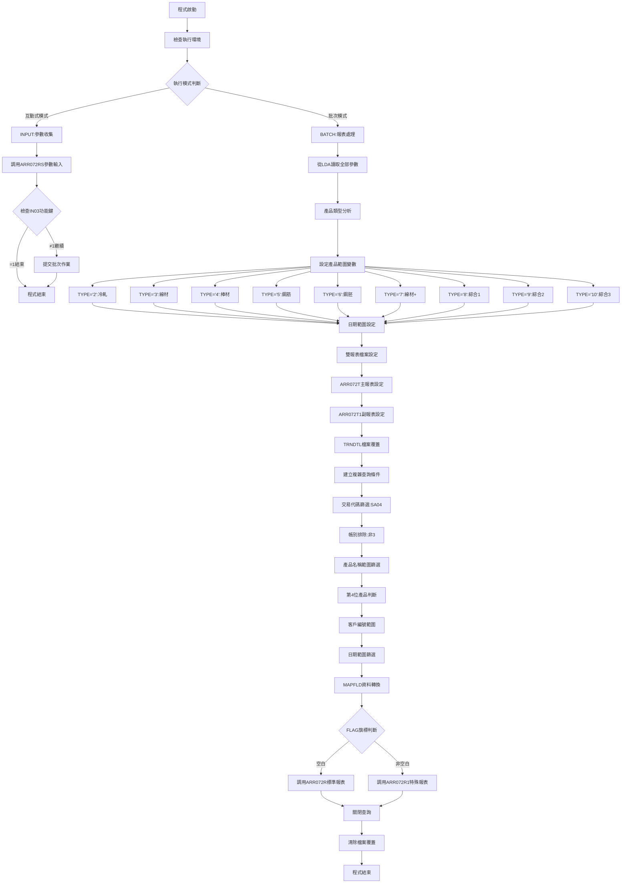
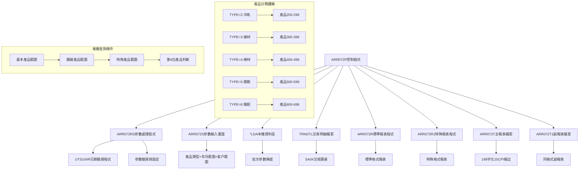
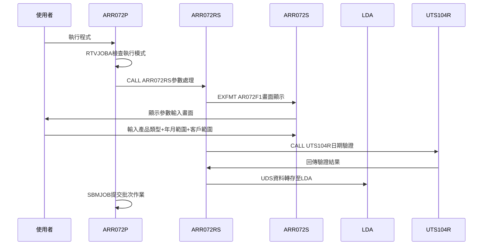
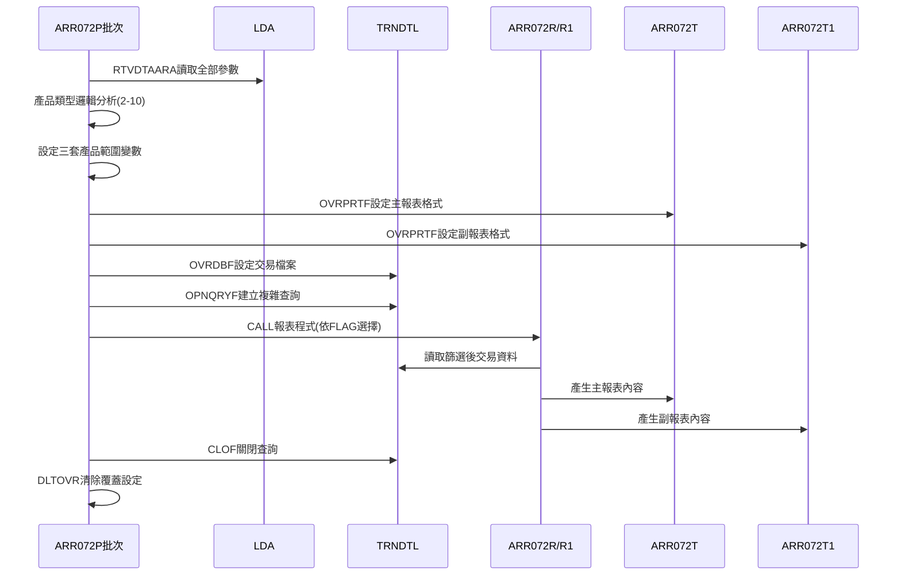
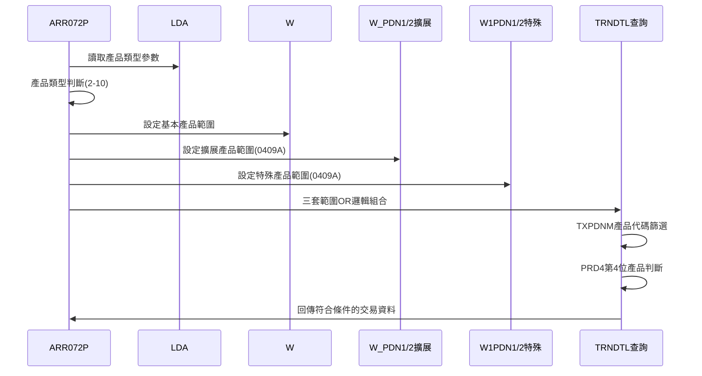
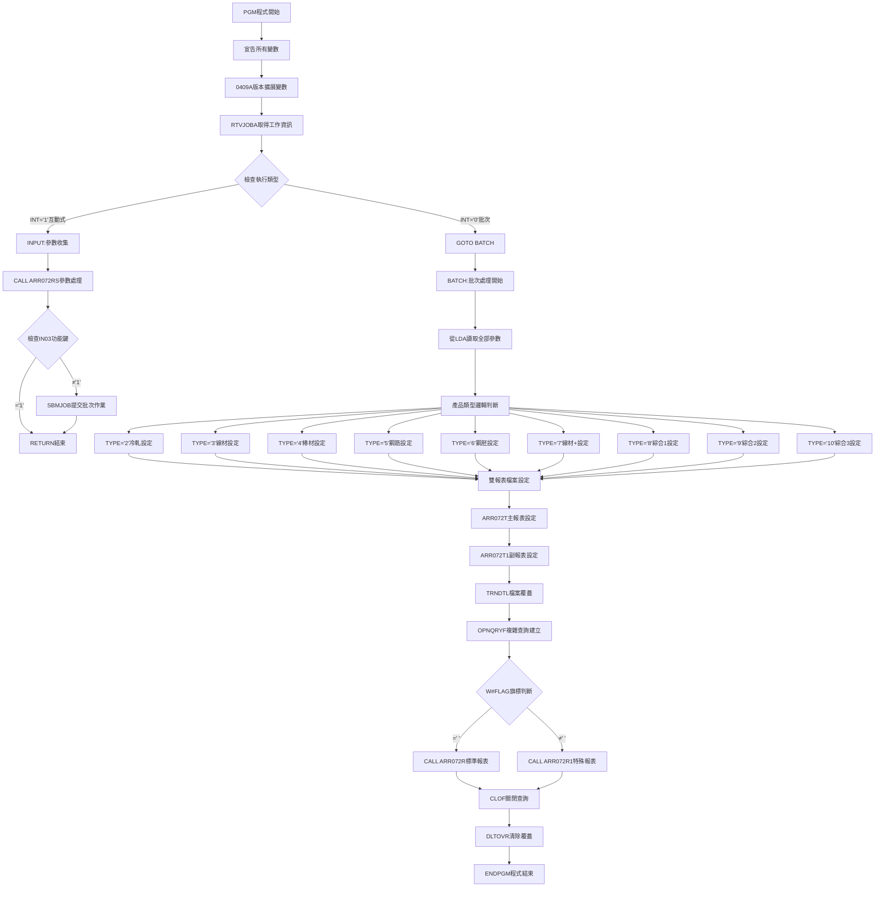
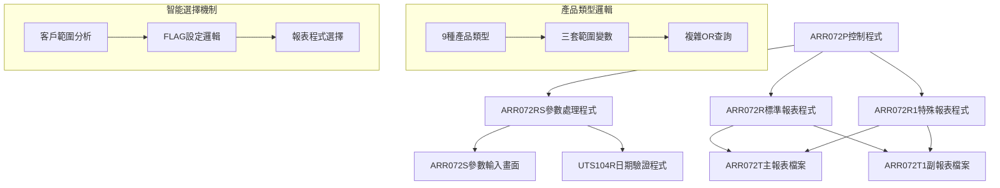

# ARR072P_P02 程式規格書

## 1. 基本資料

| 項目 | 內容 |
|------|------|
| **程式編號** | ARR072P |
| **程式名稱** | 客戶產品交易分析表控制程式 |
| **程式類型** | CLP |
| **廠區** | P02 |
| **系統名稱** | 應收帳款系統 |
| **子系統** | 客戶產品交易分析報表系統 |
| **檔案位置** | P02CLSRC_THSRC/ARR072P.txt |

## 2. 🎯 程式功能說明

### 主要功能描述
此程式為客戶產品交易分析表的控制程式，專門處理特定產品類型的交易資料分析報表。程式支援多種產品分類邏輯(產品類型2-10)，能夠依據交易類型、客戶範圍、年月範圍等條件，從交易明細檔案中篩選並分析客戶產品交易資料，產生詳細的交易分析報表，為業務管理提供決策支援資訊。

### 🎯 業務流程詳細說明

#### 完整業務流程圖


#### 業務流程關鍵階段說明

**階段一：多元產品分類處理**
- 支援9種產品類型(2-10)，每種對應不同的產品代碼範圍
- 0409A版本擴展：從3位產品代碼升級為5位產品代碼支援
- 三套產品範圍變數：W#PDN1/2(基本)、W_PDN1/2(擴展)、W1PDN1/2(特殊)
- 複雜的產品分類邏輯滿足不同業務需求

**階段二：進階查詢條件建構**
- SA04交易代碼專用篩選：特定類型的銷售交易
- 帳別排除邏輯：排除類型3的特殊帳別
- 三層產品範圍組合：基本+擴展+特殊的OR邏輯組合
- 產品第4位特殊判斷：使用%SST函數進行精確分類

**階段三：彈性客戶範圍控制**
- 支援單一客戶、客戶範圍、全客戶三種模式
- 智能範圍設定：空白時自動設為全範圍(000000-999999)
- FLAG特殊標記：單一客戶時設定特殊處理旗標
- 客戶編號驗證和範圍邏輯檢核

**階段四：雙軌報表產生機制**
- 雙報表檔案並行：ARR072T主報表、ARR072T1副報表
- 根據FLAG旗標選擇報表程式：ARR072R或ARR072R1
- 統一報表格式：198字元寬度、15CPI高密度輸出
- 資料完整性控制：確保雙報表資料一致性

## 3. 🎯 檔案架構與關聯圖

### 使用檔案清單

| 檔案名稱 | 檔案類型 | 使用方式 | 說明 |
|----------|----------|----------|------|
| ARR072RS | 程式 | CALL | 參數輸入處理程式 |
| ARR072S | 畫面檔 | INPUT | 參數輸入畫面檔案 |
| ARR072R | 程式 | CALL | 標準報表處理程式 |
| ARR072R1 | 程式 | CALL | 特殊報表處理程式 |
| TRNDTL | 實體檔 | INPUT | 交易明細檔案(主要資料來源) |
| ARR072T | 報表檔 | OUTPUT | 主報表輸出檔案 |
| ARR072T1 | 報表檔 | OUTPUT | 副報表輸出檔案 |
| UTS104R | 程式 | CALL | 日期驗證程式 |
| *LDA | 資料區 | I/O | 本機資料區(參數傳遞) |

### 🎯 檔案關聯詳細視覺化圖表



### 🎯 資料流向詳細說明

#### 環境準備階段的資料流向


#### 業務處理階段的資料流向


#### 產品分類邏輯的資料流向


## 4. 🎯 檔案欄位規格說明

### 主要資料結構

#### 程式變數定義
| 變數名稱 | 型態 | 長度 | 用途說明 |
|----------|------|------|----------|
| &INT | *CHAR | 1 | 工作類型識別 |
| &OUTQ | *CHAR | 10 | 輸出佇列名稱 |
| &IN03 | *CHAR | 1 | F3功能鍵狀態 |
| &W#TYPE | *CHAR | 2 | 產品類型代碼(2-10) |
| &W#BYMD | *CHAR | 8 | 起始年月日(YYYYMM01) |
| &W#EYMD | *CHAR | 8 | 結束年月日(YYYYMM31) |
| &W#YYMM | *CHAR | 6 | 年月暫存變數 |
| &W#CUN1 | *CHAR | 6 | 客戶編號起始範圍 |
| &W#CUN2 | *CHAR | 6 | 客戶編號結束範圍 |
| &W#COD1 | *CHAR | 1 | 交易判斷旗標 |
| &W#FLAG | *CHAR | 1 | 報表選擇旗標 |

#### 0409A版本擴展變數
| 變數名稱 | 型態 | 長度 | 用途說明 |
|----------|------|------|----------|
| &W#PDN1/2 | *CHAR | 5 | 基本產品範圍(3位升5位) |
| &W_PDN1/2 | *CHAR | 5 | 擴展產品範圍(新增) |
| &W1PDN1/2 | *CHAR | 5 | 特殊產品範圍(新增) |

#### TRNDTL交易明細檔案結構
| 欄位名稱 | 型態 | 長度 | 位置 | 說明 |
|----------|------|------|------|------|
| TXFLAG | A | 1 | 1 | 處理旗標 |
| TXCODE | A | 4 | 2-5 | 交易代碼 |
| TXNO | A | 8 | 6-13 | 交易號碼 |
| TXITEM | S | 2,0 | 14-15 | 項次 |
| TXACNT | A | 1 | 16 | 帳別代碼 |
| TXDATE | S | 8,0 | 17-20 | 交易日期 |
| TXACDT | S | 8,0 | 21-24 | 入帳日期 |
| TXCUNO | A | 6 | 25-30 | 客戶編號 |
| TXCUNM | A | 10 | 31-40 | 客戶名稱 |
| TXORNO | A | 9 | 41-49 | 訂單編號 |
| TXIVNO | A | 10 | 50-59 | 發票號碼 |
| TXPCNO | A | 8 | 60-67 | 採購單號 |
| TXVUNO | A | 7 | 68-74 | 傳票號碼 |
| TXRVID | A | 2 | 75-76 | 收料業務員 |
| TXSALE | A | 2 | 77-78 | 銷售業務員 |
| TXSATP | A | 1 | 79 | 銷貨類型 |
| TXIVTP | A | 1 | 80 | 發票類型 |
| TXPDNM | A | 5 | 81-85 | 產品名稱代碼(0409A擴展) |
| TXQTY | P | 7,0 | 86-89 | 數量 |
| TXUPRC | P | 5,3 | 90-92 | 單價 |
| TXAMT | P | 11,0 | 93-98 | 金額 |
| TXTAX | P | 11,0 | 99-104 | 稅額 |
| TXFL01 | A | 1 | 105 | 收料確認旗標 |
| TXFL02 | A | 1 | 106 | 發票產生旗標 |
| TXTXAR | A | 1 | 107 | 轉傳廠區 |
| TXTXDT | S | 8,0 | 108-111 | 轉傳日期 |
| TXRESV | A | 30 | 112-141 | 保留欄位 |

#### ARR072S畫面檔案結構
| 欄位名稱 | 型態 | 長度 | 屬性 | 說明 |
|----------|------|------|------|------|
| S#COMP | A | 35 | O | 公司名稱(顯示) |
| S#DEVI | A | 10 | O | 設備名稱(顯示) |
| S#COD1 | A | 1 | B | 交易判斷(輸入) |
| S#TYPE | A | 2 | B | 產品類型(輸入) |
| S#FRYM | Y | 6,0 | B | 起始年月(輸入) |
| S#TOYM | Y | 6,0 | B | 結束年月(輸入) |
| S#CUN1 | A | 6 | B | 客戶編號起始(輸入) |
| S#CUN2 | A | 6 | B | 客戶編號結束(輸入) |
| S#MSG1 | A | 70 | O | 錯誤訊息(顯示) |

### 🔍 重點欄位切割技術詳解

#### 本機資料區(LDA)欄位切割視覺化展示
```
LDA資料區 (1024字元)：[TT|YYYYMM|YYYYMM|J|CCCCCC|CCCCCC|F|...]
位置:                  1  11      21      27 28     34     40
                       ↓  ↓       ↓       ↓  ↓      ↓      ↓
產品類型 (2字元)：    [TT]                                  產品分類代碼(2-10)
起始年月 (6字元)：      [YYYYMM]                           查詢起始年月
結束年月 (6字元)：             [YYYYMM]                    查詢結束年月
交易判斷 (1字元)：                     [J]                 交易類型判斷
客戶起始 (6字元)：                       [CCCCCC]          客戶編號範圍起始
客戶結束 (6字元)：                               [CCCCCC]  客戶編號範圍結束
處理旗標 (1字元)：                                      [F] 報表選擇旗標
```

#### 產品類型對應表詳細說明
```
產品類型對應關係表：
TYPE='2'  --> 冷軋產品     --> 基本:200-299  擴展:2AAA-2999  特殊:2AAA-2999
TYPE='3'  --> 線材產品     --> 基本:300-399  擴展:33AA-3399  特殊:33AA-3399
TYPE='4'  --> 棒材產品     --> 基本:400-499  擴展:34AA-3499  特殊:39AA-3999
TYPE='5'  --> 鋼筋產品     --> 基本:500-599  擴展:35AA-3599  特殊:35AA-3599
TYPE='6'  --> 鋼胚產品     --> 基本:600-699  擴展:36AA-3699  特殊:38AA-3899
TYPE='7'  --> 線材+產品    --> 基本:3A0-399  擴展:3AAA-3399  特殊:37AA-3799
TYPE='8'  --> 綜合產品1    --> 基本:300-699  擴展:33AA-3699  特殊:38AA-3999
TYPE='9'  --> 綜合產品2    --> 基本:3A0-699  擴展:33AA-3999  特殊:33AA-3999
TYPE='10' --> 綜合產品3    --> 基本:300-699  擴展:33AA-3899  特殊:33AA-3899
```

#### OPNQRYF複雜查詢條件實例
```157:176:東鋼list/ARR072P_P02.txt
OPNQRYF    FILE((TRNDTL)) QRYSLT(' +
           (TXCODE  *EQ "SA04")  *AND +
           (TXACNT  *NE "3"   )  *AND +
         (((TXPDNM  *GE "' || &W#PDN1 || '") *AND +
           (TXPDNM  *LE "' || &W#PDN2 || '") *AND +
           (PRD4 *EQ " ")) *OR   +
          ((TXPDNM  *GE "' || &W_PDN1 || '") *AND +
           (TXPDNM  *LE "' || &W_PDN2 || '") *AND +
           (PRD4 *NE " ")) *OR  +
          ((TXPDNM  *GE "' || &W1PDN1 || '") *AND +
           (TXPDNM  *LE "' || &W1PDN2 || '") *AND +
           (PRD4 *NE " ")))   *AND +
           (TXCUNO  *GE "' || &W#CUN1 || '") *AND +
           (TXCUNO  *LE "' || &W#CUN2 || '") *AND +
           (DATE    *GE "' || &W#BYMD || '") *AND +
           (DATE    *LE "' || &W#EYMD || '")') +
           KEYFLD((TXTXDT) (TXCUNO) (TXNO)) +
           MAPFLD((TXTXDT 'TXDATE / 100')  +
                  (DATE  TXDATE  *CHAR 8) +
                  (PRD4 '%SST(TXPDNM 4 1)' *CHAR 1))
```

### 🎯 欄位挪用詳細分析

#### 挪用情況對比表

| 欄位名稱 | 原始定義 | 實際使用方式 | 挪用類型 | 使用狀態 |
|----------|----------|-------------|----------|----------|
| **TXTXDT交易轉傳日期** | 8位數值日期 | 數學運算結果(TXDATE/100) | 計算性挪用 | MAPFLD轉換 |
| **DATE虛擬欄位** | 不存在欄位 | TXDATE字串轉換 | 創建性挪用 | 日期格式轉換 |
| **PRD4產品第4位** | 不存在欄位 | %SST(TXPDNM 4 1)切割 | 切割性挪用 | 產品細分類 |
| **W#YYMM年月變數** | 單一年月值 | 雙重用途變數 | 重複性挪用 | 起始+結束設定 |
| **產品範圍變數組** | 3位產品代碼 | 5位產品代碼 | 擴展性挪用 | 0409A版本升級 |
| **客戶範圍邏輯** | 一般範圍比對 | 智能預設邏輯 | 邏輯性挪用 | 空白自動全範圍 |

#### 挪用原因深度分析

**1. TXTXDT交易轉傳日期計算挪用(TXDATE/100)**
- **原始設計目的**：TXTXDT為轉傳日期儲存欄位
- **實際挪用原因**：
  - 日期格式轉換需求：將TXDATE從8位數轉為6位數
  - 查詢效能最佳化：創建新的排序鍵值
  - 業務邏輯需求：按轉傳週期而非詳細日期排序
- **業務邏輯影響**：實現按年月週期的交易分析排序

**2. PRD4產品第4位切割挪用(%SST(TXPDNM 4 1))**
- **原始設計目的**：TXPDNM為完整5位產品代碼
- **實際挪用原因**：
  - 產品細分類需求：第4位代表產品子類別
  - 0409A版本業務擴展：從3位升級為5位產品代碼
  - 複雜篩選邏輯：結合第4位判斷實現精確產品分類
- **業務邏輯影響**：支援更細緻的產品分類和分析

**3. W#YYMM變數重複挪用**
- **原始設計目的**：W#YYMM為單一年月暫存變數
- **實際挪用原因**：
  - 記憶體使用最佳化：重複使用相同變數減少宣告
  - 邏輯簡化需求：統一的年月處理邏輯
  - 日期範圍建構：先處理起始後處理結束
- **業務邏輯影響**：簡化年月範圍設定邏輯

**4. 產品範圍變數擴展挪用(3位→5位)**
- **原始設計目的**：W#PDN1/2為3位產品代碼範圍
- **實際挪用原因**：
  - 0409A版本需求：產品代碼從3位擴展為5位
  - 向下相容考量：保持原有3位邏輯並新增5位支援
  - 複雜產品分類：支援更多樣化的產品編碼規則
- **業務邏輯影響**：大幅擴展產品分類精確度和範圍

**5. 客戶範圍智能預設挪用**
- **原始設計目的**：客戶範圍為直接輸入比對
- **實際挪用原因**：
  - 使用者友善設計：空白時自動設為全範圍
  - 業務便利性需求：降低參數設定複雜度
  - FLAG特殊標記：單一客戶查詢的特殊處理
- **業務邏輯影響**：提供更靈活的客戶範圍查詢功能

**6. DATE虛擬欄位創建挪用**
- **原始設計目的**：TXDATE為數值型日期欄位
- **實際挪用原因**：
  - 查詢條件需求：字串格式日期比對
  - OPNQRYF限制：需要字串型態進行範圍比對
  - 格式統一需求：確保日期比對邏輯一致性
- **業務邏輯影響**：實現精確的日期範圍篩選功能

#### 挪用方式詳細說明

**MAPFLD數學計算挪用實現方式**：
```174:175:東鋼list/ARR072P_P02.txt
MAPFLD((TXTXDT 'TXDATE / 100')  +
       (DATE  TXDATE  *CHAR 8) +
```
- **數學運算**：TXDATE除以100實現8位數轉6位數
- **型態轉換**：數值型TXDATE轉為字串型DATE
- **雙重映射**：同一來源欄位映射為兩個不同用途欄位

**產品第4位切割實現方式**：
```176:176:東鋼list/ARR072P_P02.txt
(PRD4 '%SST(TXPDNM 4 1)' *CHAR 1))
```
- **字串切割**：使用%SST函數取第4位字元
- **新欄位創建**：PRD4為虛擬欄位名稱
- **分類邏輯**：結合PRD4=' '或≠' '進行產品分類

**三套產品範圍組合實現方式**：
```160:168:東鋼list/ARR072P_P02.txt
(((TXPDNM  *GE "' || &W#PDN1 || '") *AND +
  (TXPDNM  *LE "' || &W#PDN2 || '") *AND +
  (PRD4 *EQ " ")) *OR   +
 ((TXPDNM  *GE "' || &W_PDN1 || '") *AND +
  (TXPDNM  *LE "' || &W_PDN2 || '") *AND +
  (PRD4 *NE " ")) *OR  +
 ((TXPDNM  *GE "' || &W1PDN1 || '") *AND +
  (TXPDNM  *LE "' || &W1PDN2 || '") *AND +
  (PRD4 *NE " ")))   *AND +
```
- **三層OR邏輯**：基本+擴展+特殊的產品範圍組合
- **條件關聯**：每個範圍結合PRD4判斷實現精確篩選
- **0409A升級**：從單一範圍擴展為三套範圍支援

**客戶範圍智能設定實現方式**：
```149:165:P02RPGSRC_THSRC/ARR072RS.txt
SELEC
S#CUN1    WHEQ *BLANK                     客戶編號
S#CUN2    ANDEQ*BLANK
          MOVEL*BLANK    U#CUN1
          MOVEL'999999'  U#CUN2
          MOVEL*BLANK    U#FLAG
S#CUN1    WHNE *BLANK
S#CUN2    ANDEQ*BLANK
          MOVELS#CUN1    U#CUN1
          MOVELS#CUN1    U#CUN2
          MOVEL'X'       U#FLAG
```
- **空白全範圍**：兩個都空白時設為000000-999999
- **單一客戶**：起始有值結束空白時設為單一客戶並設FLAG='X'
- **範圍客戶**：起始結束都有值時設為範圍查詢

**年月日期範圍轉換實現方式**：
```58:61:東鋼list/ARR072P_P02.txt
RTVDTAARA  DTAARA(*LDA (11 6))  RTNVAR(&W#YYMM)
CHGVAR     VAR(&W#BYMD) VALUE(&W#YYMM || '01')
RTVDTAARA  DTAARA(*LDA (21 6))  RTNVAR(&W#YYMM)
CHGVAR     VAR(&W#EYMD) VALUE(&W#YYMM || '31')
```
- **重複變數使用**：W#YYMM先讀起始年月，再讀結束年月
- **日期補足**：YYYYMM自動補'01'和'31'形成日期範圍
- **範圍設定**：確保涵蓋整月的交易資料

#### 挪用影響評估

**正面影響**：
- **查詢精確度提升**：PRD4第4位切割實現更精確的產品分類
- **MAPFLD效能最佳化**：數學運算和格式轉換一次完成
- **使用者體驗改善**：客戶範圍智能預設降低操作複雜度
- **產品分類擴展**：0409A版本支援更廣泛的產品編碼

**潛在風險**：
- **維護複雜性**：三套產品範圍變數增加邏輯複雜度
- **數據依賴性**：MAPFLD計算依賴TXDATE欄位的數值正確性
- **版本相容性**：0409A版本變更可能影響舊版本相容性

**維護注意事項**：
- 產品代碼格式變更需同步調整三套範圍變數設定
- TXPDNM欄位結構變更需檢查%SST切割邏輯
- MAPFLD數學運算需確保TXDATE欄位數值有效性
- 客戶範圍邏輯變更需同步調整FLAG設定邏輯

### 重要變數定義表

| 變數名稱 | 型態 | 長度 | 用途說明 |
|----------|------|------|----------|
| &W#TYPE | *CHAR | 2 | 產品類型代碼(2-10) |
| &W#BYMD/EYMD | *CHAR | 8 | 查詢日期範圍(YYYYMMDD) |
| &W#CUN1/2 | *CHAR | 6 | 客戶編號範圍 |
| &W#PDN1/2 | *CHAR | 5 | 基本產品代碼範圍 |
| &W_PDN1/2 | *CHAR | 5 | 擴展產品代碼範圍(0409A) |
| &W1PDN1/2 | *CHAR | 5 | 特殊產品代碼範圍(0409A) |
| &W#FLAG | *CHAR | 1 | 報表程式選擇旗標 |

## 5. 🎯 輸出/入螢幕布局

### 螢幕布局完整視覺化
```
+----------------------------------------------------------+
|  12/28/24     東鋼金屬股份有限公司               ARR072S  |
|  10:30:25  客戶產品交易分析表作業             SYS001   |
|                                                          |
|                                                          |
|     交易判斷：[_] (1銷貨2服務3非交易)                    |
|                                                          |
|     產品類型：[__] (2冷軋3線材(線材+鋼棒)4棒材-          |
|                    5鋼筋6鋼胚7線材+                      |
|                                                          |
|                    8線材+棒材+鋼胚    9線材+              |
|                    +棒材+鋼胚+線材+                      |
|                                                          |
|                    10線材+鋼筋+鋼胚)                     |
|                                                          |
|     年月範圍：[____/__] 至 [____/__]                    |
|                (結束空白則僅查詢起始)                     |
|                                                          |
|     客戶編號：[______] 至 [______]                      |
|                (結束空白則僅查詢該客戶)                   |
|                (兩個都空白則查詢全部客戶)                 |
|                                                          |
|                                                          |
| F3:離開     F12:回到主畫面        ENTER:確認             |
| [錯誤訊息顯示區]                                         |
+----------------------------------------------------------+
```

### 🎯 畫面欄位詳細說明

| 欄位標題 | 欄位名稱 | 輸入長度 | 型態 | 屬性 | 檢核規則 |
|----------|----------|----------|------|------|----------|
| 交易判斷 | S#COD1 | 1 | A | 輸入 | VALUES('1' '2' '3') |
| 產品類型 | S#TYPE | 2 | A | 輸入 | VALUES('2' '3' '4' '5' '6' '7' '8' '9' '10') |
| 起始年月 | S#FRYM | 6 | Y | 輸入 | EDTCDE(4) |
| 結束年月 | S#TOYM | 6 | Y | 輸入 | EDTCDE(4) |
| 客戶起始 | S#CUN1 | 6 | A | 輸入 | - |
| 客戶結束 | S#CUN2 | 6 | A | 輸入 | - |

#### 產品類型代碼說明
- **2**：冷軋產品
- **3**：線材產品(線材+鋼棒)
- **4**：棒材產品
- **5**：鋼筋產品
- **6**：鋼胚產品
- **7**：線材+產品
- **8**：線材+棒材+鋼胚(綜合1)
- **9**：線材++棒材+鋼胚+線材+(綜合2)
- **10**：線材+鋼筋+鋼胚(綜合3)

#### 交易判斷類型說明
- **1**：銷貨交易
- **2**：服務交易
- **3**：非交易類型

#### 客戶範圍邏輯說明
- **全部空白**：查詢全部客戶(000000-999999)
- **起始有值+結束空白**：查詢單一客戶(設FLAG='X')
- **起始+結束都有值**：查詢客戶範圍

### 🎯 畫面控制邏輯

#### 指示器控制
- **指示器51**：起始年月欄位錯誤控制(PC+RI)
- **指示器52**：結束年月欄位錯誤控制(PC+RI)
- **指示器53**：客戶起始欄位錯誤控制(PC+RI)
- **指示器54**：客戶結束欄位錯誤控制(PC+RI)
- **指示器55**：交易判斷欄位錯誤控制(PC+RI)
- CA03(03)：F3功能鍵控制
- CA12(12)：F12功能鍵控制

### 功能鍵詳細定義

| 功能鍵 | 功能說明 | 處理邏輯 | 系統行為 |
|--------|----------|----------|----------|
| F3 | 離開程式 | IN03='1' | 直接結束程式回到呼叫點 |
| F12 | 回到主畫面 | IN12='1' | 回到主系統畫面 |
| Enter | 確認執行 | 進行參數驗證 | 驗證成功後提交批次作業 |

### 操作流程

1. **交易類型選擇**：選擇銷貨、服務或非交易類型
2. **產品類型設定**：選擇要分析的產品類型(2-10)
3. **年月範圍設定**：設定分析的年月範圍
4. **客戶範圍設定**：設定要分析的客戶範圍
5. **確認執行**：按Enter開始驗證並執行報表處理

## 6. 🎯 處理流程程序說明

### 🎯 主程序邏輯深度分析

#### 程式執行流程圖


#### 🎯 詳細處理步驟逐一分析

**步驟1：程式初始化與變數擴展**
```24:41:東鋼list/ARR072P_P02.txt
PGM
DCL        VAR(&INT)     TYPE(*CHAR)   LEN(1)
DCL        VAR(&OUTQ)    TYPE(*CHAR)   LEN(10)
DCL        VAR(&IN03)    TYPE(*CHAR)   LEN(1)
DCL        VAR(&W#TYPE)  TYPE(*CHAR)   LEN(2)
DCL        VAR(&W#BYMD)  TYPE(*CHAR)   LEN(8)
DCL        VAR(&W#EYMD)  TYPE(*CHAR)   LEN(8)
DCL        VAR(&W#YYMM)  TYPE(*CHAR)   LEN(6)
DCL        VAR(&W#CUN1)  TYPE(*CHAR)   LEN(6)
DCL        VAR(&W#CUN2)  TYPE(*CHAR)   LEN(6)
DCL        VAR(&W#COD1)  TYPE(*CHAR)   LEN(1)
DCL        VAR(&W#FLAG)  TYPE(*CHAR)   LEN(1)
/*0409A*/   DCL        VAR(&W#PDN1)  TYPE(*CHAR)   LEN(5)
/*0409A*/   DCL        VAR(&W#PDN2)  TYPE(*CHAR)   LEN(5)
/*0409A*/   DCL        VAR(&W_PDN1)  TYPE(*CHAR)   LEN(5)
/*0409A*/   DCL        VAR(&W_PDN2)  TYPE(*CHAR)   LEN(5)
/*0409A*/   DCL        VAR(&W1PDN1)  TYPE(*CHAR)   LEN(5)
/*0409A*/   DCL        VAR(&W1PDN2)  TYPE(*CHAR)   LEN(5)
```
- 定義基本控制變數和日期、客戶範圍變數
- 0409A版本重大擴展：新增三套產品範圍變數組
- 支援從3位產品代碼擴展為5位產品代碼
- 為複雜產品分類邏輯奠定基礎

**步驟2：互動式參數收集與作業提交**
```44:53:東鋼list/ARR072P_P02.txt
RTVJOBA    OUTQ(&OUTQ) TYPE(&INT)
IF         COND(&INT *EQ '0') THEN(GOTO BATCH)

INPUT:
CALL       PGM(ARR072RS) PARM(&IN03)
IF         COND(&IN03 *EQ '1') THEN(RETURN)

SBMJOB     JOB(ARR072P) JOBD(ARJOBD) OUTQ(&OUTQ) +
           RQSDTA('CALL ARR072P')
RETURN
```
- 判斷互動式或批次執行模式
- 調用ARR072RS進行複雜的參數收集和驗證
- 檢查F3功能鍵直接結束
- 提交批次作業進行實際報表處理

**步驟3：批次參數讀取與日期範圍設定**
```56:65:東鋼list/ARR072P_P02.txt
BATCH:
RTVDTAARA  DTAARA(*LDA (1  2))  RTNVAR(&W#TYPE)
RTVDTAARA  DTAARA(*LDA (11 6))  RTNVAR(&W#YYMM)
CHGVAR     VAR(&W#BYMD) VALUE(&W#YYMM || '01')
RTVDTAARA  DTAARA(*LDA (21 6))  RTNVAR(&W#YYMM)
CHGVAR     VAR(&W#EYMD) VALUE(&W#YYMM || '31')
RTVDTAARA  DTAARA(*LDA (27 1)) RTNVAR(&W#COD1)
RTVDTAARA  DTAARA(*LDA (28 6)) RTNVAR(&W#CUN1)
RTVDTAARA  DTAARA(*LDA (34 6)) RTNVAR(&W#CUN2)
RTVDTAARA  DTAARA(*LDA (40 1)) RTNVAR(&W#FLAG)
```
- 從LDA讀取完整的批次參數
- 重複使用W#YYMM變數分別處理起始和結束年月
- 自動補足日期：年月+'01'和'31'形成完整月份範圍
- 讀取交易判斷、客戶範圍、處理旗標等控制參數

**步驟4：複雜產品類型邏輯分析**
```67:146:東鋼list/ARR072P_P02.txt
IF         COND(&W#TYPE *EQ '2'    ) THEN(DO)
CHGVAR     VAR(&W#PDN1)  VALUE('200')
CHGVAR     VAR(&W#PDN2)  VALUE('299')
/*0409A*/   CHGVAR     VAR(&W_PDN1)  VALUE('2AAA')
/*0409A*/   CHGVAR     VAR(&W_PDN2)  VALUE('2999')
/*0409A*/   CHGVAR     VAR(&W1PDN1)  VALUE('2AAA')
/*0409A*/   CHGVAR     VAR(&W1PDN2)  VALUE('2999')
ENDDO
...類似邏輯處理TYPE='3'到'10'
```
- 9種產品類型(2-10)的完整邏輯分析
- 每種類型設定三套產品範圍：基本、擴展、特殊
- 0409A版本核心功能：支援複雜的產品分類需求
- 產品範圍從簡單3位數擴展為複雜5位字元範圍

**步驟5：雙報表檔案並行設定**
```148:155:東鋼list/ARR072P_P02.txt
OVRPRTF    FILE(ARR072T) TOFILE(ARLIB/ARR072T) +
           PAGESIZE(*N 198)  CPI(15) +
           OVRFLW(57) HOLD(*YES) USRDTA('客戶產品') +
           COPIES(1)
OVRPRTF    FILE(ARR072T1) TOFILE(ARLIB/ARR072T1) +
           PAGESIZE(*N 198)  CPI(15) +
           OVRFLW(57) HOLD(*YES) USRDTA('客戶產品') +
           COPIES(1)
```
- 設定雙報表檔案：ARR072T主報表、ARR072T1副報表
- 統一報表格式：198字元寬度、15CPI高密度輸出
- 分頁控制：OVRFLW(57)設定分頁行數
- 輸出管理：HOLD(*YES)支援輸出暫存和審核

**步驟6：複雜多層查詢條件建構**
```156:177:東鋼list/ARR072P_P02.txt
OVRDBF     FILE(TRNDTL) TOFILE(DALIB/TRNDTL) SHARE(*YES)
OPNQRYF    FILE((TRNDTL)) QRYSLT(' +
           (TXCODE  *EQ "SA04")  *AND +
           (TXACNT  *NE "3"   )  *AND +
         (((TXPDNM  *GE "' || &W#PDN1 || '") *AND +
           (TXPDNM  *LE "' || &W#PDN2 || '") *AND +
           (PRD4 *EQ " ")) *OR   +
          ((TXPDNM  *GE "' || &W_PDN1 || '") *AND +
           (TXPDNM  *LE "' || &W_PDN2 || '") *AND +
           (PRD4 *NE " ")) *OR  +
          ((TXPDNM  *GE "' || &W1PDN1 || '") *AND +
           (TXPDNM  *LE "' || &W1PDN2 || '") *AND +
           (PRD4 *NE " ")))   *AND +
           (TXCUNO  *GE "' || &W#CUN1 || '") *AND +
           (TXCUNO  *LE "' || &W#CUN2 || '") *AND +
           (DATE    *GE "' || &W#BYMD || '") *AND +
           (DATE    *LE "' || &W#EYMD || '")') +
           KEYFLD((TXTXDT) (TXCUNO) (TXNO)) +
           MAPFLD((TXTXDT 'TXDATE / 100')  +
                  (DATE  TXDATE  *CHAR 8) +
                  (PRD4 '%SST(TXPDNM 4 1)' *CHAR 1))
```
- 設定TRNDTL檔案覆蓋支援多使用者存取
- 建立多層AND條件：交易代碼+帳別+產品+客戶+日期
- 三層OR產品邏輯：基本範圍+擴展範圍+特殊範圍
- MAPFLD進階功能：數學運算、格式轉換、字串切割

**步驟7：智能報表程式選擇與資源管理**
```178:188:東鋼list/ARR072P_P02.txt
/* 有特定客戶時,CALL ARR072R1  */
IF         COND(&W#FLAG  *EQ ' ') THEN(DO)
CALL       PGM(ARR072R)
ENDDO
ELSE (DO)
CALL       PGM(ARR072R1)
ENDDO
CLOF       OPNID(TRNDTL)
DLTOVR     FILE(*ALL)

ENDPGM
```
- 根據FLAG智能選擇報表程式：空白用ARR072R，非空白用ARR072R1
- FLAG來源：客戶範圍設定邏輯(單一客戶時設為'X')
- 完善的資源管理：關閉查詢、清除覆蓋設定
- 確保系統資源正確釋放

### 🎯 子程序邏輯分析

#### ARR072RS參數處理程式
- **調用方式**：CALL PGM(ARR072RS) PARM(&IN03)
- **主要功能**：
  - 顯示AR072F1參數輸入畫面
  - 執行複雜的參數驗證邏輯
  - 調用UTS104R進行日期格式驗證
  - 客戶範圍智能設定和FLAG邏輯處理
  - UDS資料轉存至LDA準備批次處理

#### ARR072R標準報表程式
- **調用條件**：W#FLAG=' '(一般查詢)
- **處理功能**：產生標準格式的客戶產品交易分析報表
- **資料來源**：TRNDTL複雜查詢結果
- **輸出格式**：ARR072T主報表、ARR072T1副報表

#### ARR072R1特殊報表程式
- **調用條件**：W#FLAG≠' '(特定客戶查詢)
- **處理功能**：產生特殊格式的客戶產品交易分析報表
- **特殊邏輯**：針對單一客戶的詳細分析
- **輸出格式**：同樣使用ARR072T和ARR072T1檔案

#### UTS104R日期驗證程式
- **調用來源**：ARR072RS參數處理程式
- **驗證功能**：年月格式驗證和日期邏輯檢核
- **參數傳遞**：日期、模式、天數、回傳值、錯誤碼
- **回傳結果**：驗證成功或失敗狀態

#### 程式調用關係圖


### 🎯 特殊邏輯處理

#### 0409A版本產品分類擴展邏輯
- **基本邏輯**：原有3位產品代碼邏輯保持不變
- **擴展邏輯**：新增5位產品代碼支援，使用字母混合編碼
- **特殊邏輯**：針對特定產品類型的額外範圍設定
- **相容性設計**：確保新舊產品代碼格式並存運作

#### 三層產品範圍OR組合邏輯
```160:168:東鋼list/ARR072P_P02.txt
(((TXPDNM  *GE "' || &W#PDN1 || '") *AND +
  (TXPDNM  *LE "' || &W#PDN2 || '") *AND +
  (PRD4 *EQ " ")) *OR   +
 ((TXPDNM  *GE "' || &W_PDN1 || '") *AND +
  (TXPDNM  *LE "' || &W_PDN2 || '") *AND +
  (PRD4 *NE " ")) *OR  +
 ((TXPDNM  *GE "' || &W1PDN1 || '") *AND +
  (TXPDNM  *LE "' || &W1PDN2 || '") *AND +
  (PRD4 *NE " ")))   *AND +
```
- **第一層**：基本產品範圍且PRD4=' '(原有3位產品)
- **第二層**：擴展產品範圍且PRD4≠' '(新5位產品)
- **第三層**：特殊產品範圍且PRD4≠' '(特殊5位產品)
- **組合邏輯**：三層OR確保涵蓋所有可能的產品分類

#### MAPFLD進階欄位轉換邏輯
```174:176:東鋼list/ARR072P_P02.txt
MAPFLD((TXTXDT 'TXDATE / 100')  +
       (DATE  TXDATE  *CHAR 8) +
       (PRD4 '%SST(TXPDNM 4 1)' *CHAR 1))
```
- **數學計算**：TXDATE除以100將日期從8位轉為6位
- **格式轉換**：數值型TXDATE轉為字串型DATE用於比對
- **字串切割轉換**：%SST取產品代碼第4位字元
- **虛擬欄位創建**：TXTXDT、DATE、PRD4作為查詢專用欄位

#### 客戶範圍智能邏輯
- **全範圍模式**：兩個客戶編號都空白時自動設為000000-999999
- **單一客戶模式**：起始有值結束空白時設為單一客戶並FLAG='X'
- **範圍客戶模式**：起始結束都有值時設為範圍查詢
- **FLAG影響**：決定調用ARR072R(標準)或ARR072R1(特殊)

#### 產品類型綜合邏輯
- **TYPE='8'**：線材+棒材+鋼胚的綜合分析
- **TYPE='9'**：線材++棒材+鋼胚+線材+的超級綜合
- **TYPE='10'**：線材+鋼筋+鋼胚的特定組合
- **業務意義**：支援多產品類型的交叉分析需求

## 7. 🎯 數據操作與轉換分析

### 檔案操作詳解

#### 雙報表檔案並行操作
```148:155:東鋼list/ARR072P_P02.txt
OVRPRTF    FILE(ARR072T) TOFILE(ARLIB/ARR072T) +
           PAGESIZE(*N 198)  CPI(15) +
           OVRFLW(57) HOLD(*YES) USRDTA('客戶產品') +
           COPIES(1)
OVRPRTF    FILE(ARR072T1) TOFILE(ARLIB/ARR072T1) +
           PAGESIZE(*N 198)  CPI(15) +
           OVRFLW(57) HOLD(*YES) USRDTA('客戶產品') +
           COPIES(1)
```
- **並行設定**：同時設定主報表和副報表檔案
- **格式統一**：兩個報表使用相同的格式設定
- **高密度輸出**：198字元寬度、15CPI適合詳細資料
- **輸出控制**：HOLD(*YES)支援審核和多副本管理

#### 複雜多條件查詢操作
```157:173:東鋼list/ARR072P_P02.txt
OPNQRYF    FILE((TRNDTL)) QRYSLT(' +
           (TXCODE  *EQ "SA04")  *AND +
           (TXACNT  *NE "3"   )  *AND +
         (((TXPDNM  *GE "' || &W#PDN1 || '") *AND +
           (TXPDNM  *LE "' || &W#PDN2 || '") *AND +
           (PRD4 *EQ " ")) *OR   +
          ((TXPDNM  *GE "' || &W_PDN1 || '") *AND +
           (TXPDNM  *LE "' || &W_PDN2 || '") *AND +
           (PRD4 *NE " ")) *OR  +
          ((TXPDNM  *GE "' || &W1PDN1 || '") *AND +
           (TXPDNM  *LE "' || &W1PDN2 || '") *AND +
           (PRD4 *NE " ")))   *AND +
           (TXCUNO  *GE "' || &W#CUN1 || '") *AND +
           (TXCUNO  *LE "' || &W#CUN2 || '") *AND +
           (DATE    *GE "' || &W#BYMD || '") *AND +
           (DATE    *LE "' || &W#EYMD || '")') +
```
- **交易類型篩選**：限定SA04銷售交易類型
- **帳別排除**：排除類型3的特殊帳別
- **三層產品OR邏輯**：支援複雜的產品分類
- **客戶範圍控制**：支援單一或範圍客戶查詢
- **日期範圍限制**：精確的月份範圍控制

### 數據轉換邏輯

#### MAPFLD多重數據轉換
```174:176:東鋼list/ARR072P_P02.txt
MAPFLD((TXTXDT 'TXDATE / 100')  +
       (DATE  TXDATE  *CHAR 8) +
       (PRD4 '%SST(TXPDNM 4 1)' *CHAR 1))
```
- **數學運算轉換**：TXDATE/100將日期從8位轉為6位
- **型態格式轉換**：數值型TXDATE轉為字串型DATE
- **字串切割轉換**：%SST取產品代碼第4位字元
- **虛擬欄位創建**：TXTXDT、DATE、PRD4作為查詢欄位

#### 年月日期範圍轉換
```58:61:東鋼list/ARR072P_P02.txt
RTVDTAARA  DTAARA(*LDA (11 6))  RTNVAR(&W#YYMM)
CHGVAR     VAR(&W#BYMD) VALUE(&W#YYMM || '01')
RTVDTAARA  DTAARA(*LDA (21 6))  RTNVAR(&W#YYMM)
CHGVAR     VAR(&W#EYMD) VALUE(&W#YYMM || '31')
```
- **格式擴展**：年月(YYYYMM)轉為完整日期(YYYYMMDD)
- **範圍設定**：起始日固定為01，結束日固定為31
- **變數重用**：W#YYMM重複使用減少記憶體需求
- **涵蓋完整**：確保包含整月的所有交易資料

#### 產品代碼範圍動態設定
```67:74:東鋼list/ARR072P_P02.txt
IF         COND(&W#TYPE *EQ '2'    ) THEN(DO)
CHGVAR     VAR(&W#PDN1)  VALUE('200')
CHGVAR     VAR(&W#PDN2)  VALUE('299')
/*0409A*/   CHGVAR     VAR(&W_PDN1)  VALUE('2AAA')
/*0409A*/   CHGVAR     VAR(&W_PDN2)  VALUE('2999')
/*0409A*/   CHGVAR     VAR(&W1PDN1)  VALUE('2AAA')
/*0409A*/   CHGVAR     VAR(&W1PDN2)  VALUE('2999')
ENDDO
```
- **動態範圍設定**：根據產品類型動態設定查詢範圍
- **三套範圍變數**：基本、擴展、特殊的完整範圍組合
- **字元數值混合**：支援數字+字母的複雜產品編碼
- **0409A版本擴展**：從3位數字升級為5位字元

### 計算邏輯分析

#### 日期數學運算邏輯
- **TXDATE/100運算**：
  - 原始：20241228 (8位數日期)
  - 運算：20241228 ÷ 100 = 202412 (6位年月)
  - 用途：轉傳日期排序和分組
- **業務意義**：按年月週期進行交易統計分析

#### 產品範圍比對邏輯
- **基本範圍**：'200' ≤ TXPDNM ≤ '299' (3位數字比對)
- **擴展範圍**：'2AAA' ≤ TXPDNM ≤ '2999' (5位字元比對)
- **字元比對原則**：ASCII碼順序比對支援數字+字母組合

#### 客戶範圍計算邏輯
- **全範圍設定**：000000-999999涵蓋所有可能客戶編號
- **單一客戶設定**：起始=結束實現精確客戶查詢
- **範圍客戶設定**：起始≤客戶編號≤結束的標準範圍比對

### 檢核機制詳解

#### 多層產品分類檢核
```160:168:東鋼list/ARR072P_P02.txt
(((TXPDNM  *GE "' || &W#PDN1 || '") *AND +
  (TXPDNM  *LE "' || &W#PDN2 || '") *AND +
  (PRD4 *EQ " ")) *OR   +
 ((TXPDNM  *GE "' || &W_PDN1 || '") *AND +
  (TXPDNM  *LE "' || &W_PDN2 || '") *AND +
  (PRD4 *NE " ")) *OR  +
 ((TXPDNM  *GE "' || &W1PDN1 || '") *AND +
  (TXPDNM  *LE "' || &W1PDN2 || '") *AND +
  (PRD4 *NE " ")))   *AND +
```
- **三層OR驗證**：確保涵蓋所有產品分類可能性
- **範圍檢核**：每層都進行GE/LE範圍驗證
- **第4位檢核**：PRD4=' '或≠' '區分新舊產品格式
- **組合邏輯檢核**：複雜的AND/OR組合確保邏輯正確

#### 交易類型與帳別檢核
```158:159:東鋼list/ARR072P_P02.txt
(TXCODE  *EQ "SA04")  *AND +
(TXACNT  *NE "3"   )  *AND +
```
- **交易代碼檢核**：限定SA04銷售交易類型
- **帳別排除檢核**：排除類型3的特殊帳務處理
- **業務邏輯檢核**：確保只處理正常的銷售交易資料

#### 日期範圍完整性檢核
```171:172:東鋼list/ARR072P_P02.txt
(DATE    *GE "' || &W#BYMD || '") *AND +
(DATE    *LE "' || &W#EYMD || '")') +
```
- **起始日期檢核**：確保交易日期不早於查詢起始
- **結束日期檢核**：確保交易日期不晚於查詢結束
- **完整月份檢核**：01-31的設定確保涵蓋整月資料

## 8. 🎯 錯誤處理程序說明

### 🎯 詳細錯誤代碼清冊

| 錯誤代碼 | 錯誤訊息 | 原因說明 | 處理方式 | 預防措施 |
|----------|---------|---------|---------|----------|
| **USER001** | 功能鍵F3結束 | 使用者按下F3離開程式 | 1. 正常結束程式<br>2. 回到呼叫點 | 使用者操作選擇 |
| **USER002** | 功能鍵F12返回 | 使用者按下F12回到主畫面 | 1. 正常結束程式<br>2. 回到主系統畫面 | 使用者操作選擇 |
| **INPUT001** | 起始年月日期有誤！ | UTS104R驗證起始年月失敗 | 1. 設定IN51='1'<br>2. 顯示錯誤訊息<br>3. 返回輸入畫面 | 提供年月格式範例 |
| **INPUT002** | 結束年月日期有誤！ | UTS104R驗證結束年月失敗 | 1. 設定IN52='1'<br>2. 顯示錯誤訊息<br>3. 返回輸入畫面 | 確認年月格式正確性 |
| **INPUT003** | 起始年月不可大於結束年月！ | 年月邏輯範圍錯誤 | 1. 設定IN5152='1'<br>2. 顯示邏輯錯誤<br>3. 返回輸入畫面 | 提供邏輯檢核說明 |
| **INPUT004** | 交易判斷輸入有誤！ | COD1不在VALUES範圍內 | 1. 設定IN55='1'<br>2. 顯示範圍錯誤<br>3. 返回輸入畫面 | 明確顯示可選值 |
| **INPUT005** | 客戶編號輸入有誤！ | 客戶範圍邏輯錯誤 | 1. 設定IN54='1'<br>2. 顯示邏輯錯誤<br>3. 返回輸入畫面 | 說明客戶範圍邏輯 |
| **SYS001** | ARR072RS程式調用失敗 | 參數處理程式無法執行 | 1. 檢查程式庫路徑<br>2. 確認程式存在<br>3. 重新執行 | 確保ARR072RS程式可用 |
| **SYS002** | UTS104R程式調用失敗 | 日期驗證程式無法執行 | 1. 檢查程式庫<br>2. 確認程式權限<br>3. 重新調用 | 確保UTS104R程式可用 |
| **FILE001** | TRNDTL檔案存取失敗 | 交易明細檔案無法開啟 | 1. 檢查檔案權限<br>2. 確認檔案存在<br>3. 重新設定覆蓋 | 確保交易檔案可用 |
| **FILE002** | ARR072R程式調用失敗 | 標準報表程式無法執行 | 1. 檢查程式庫<br>2. 確認程式權限<br>3. 重新調用 | 確保標準報表程式可用 |
| **FILE003** | ARR072R1程式調用失敗 | 特殊報表程式無法執行 | 1. 檢查程式庫<br>2. 確認程式權限<br>3. 重新調用 | 確保特殊報表程式可用 |
| **QUERY001** | OPNQRYF查詢建立失敗 | 複雜查詢條件建立異常 | 1. 檢查變數值<br>2. 簡化查詢條件<br>3. 重新建立查詢 | 驗證查詢參數正確性 |

### 🎯 系統異常處理邏輯

#### 檔案操作失敗處理
- **TRNDTL覆蓋異常**：交易明細檔案無法存取或權限不足
- **報表檔案異常**：ARR072T或ARR072T1檔案設定失敗
- **查詢建立異常**：OPNQRYF複雜條件建立失敗

#### 程式調用失敗處理
- **ARR072RS調用異常**：參數處理程式無法執行
- **UTS104R調用異常**：日期驗證程式調用失敗
- **報表程式異常**：ARR072R或ARR072R1程式無法執行

#### 參數驗證錯誤處理
- **年月格式異常**：UTS104R驗證失敗
- **年月邏輯異常**：起始大於結束的邏輯錯誤
- **產品類型異常**：不在VALUES範圍內的產品類型
- **客戶範圍異常**：客戶編號邏輯設定錯誤

#### 複雜查詢條件異常處理
- **變數值異常**：產品範圍變數設定錯誤
- **MAPFLD異常**：字串切割或數學運算失敗
- **OR邏輯異常**：三層產品範圍邏輯衝突

### 🎯 錯誤恢復機制

#### 自動清理保護機制
```185:186:東鋼list/ARR072P_P02.txt
CLOF       OPNID(TRNDTL)
DLTOVR     FILE(*ALL)
```
- **查詢清理**：自動關閉OPNQRYF查詢避免資源佔用
- **覆蓋清理**：清除所有檔案覆蓋設定
- **資源釋放**：確保系統資源正確釋放

#### 參數驗證循環機制
- **多層驗證**：UTS104R專業驗證+邏輯範圍驗證
- **錯誤指示器**：IN51-55精確標示錯誤欄位
- **持續修正**：直到所有參數正確才允許繼續
- **智能提示**：提供具體的修正建議和格式說明

#### 產品類型容錯機制
- **範圍驗證**：確保產品類型在2-10範圍內
- **預設處理**：異常產品類型時的安全預設值
- **三套變數保護**：基本、擴展、特殊變數的完整設定
- **0409A相容性**：確保新舊版本邏輯相容

#### 客戶範圍智能恢復
- **空白自動處理**：自動設定為全範圍查詢
- **單一客戶保護**：自動設定FLAG和範圍邏輯
- **範圍邏輯檢核**：確保起始≤結束的邏輯正確性
- **FLAG同步機制**：確保客戶範圍與FLAG設定一致

## 9. 🎯 備註

### 🎯 特殊注意事項

#### 程式設計複雜度
- **多產品類型支援**：9種產品類型(2-10)的完整邏輯實現
- **0409A版本重大擴展**：從3位產品代碼升級為5位產品代碼支援
- **三套產品範圍變數**：基本+擴展+特殊的複雜組合邏輯
- **MAPFLD進階應用**：數學運算+格式轉換+字串切割的綜合運用

#### 版本演進歷史
- **初版(87/06/28)**：基本的客戶產品交易分析功能
- **修訂版(92/06/24)**：增強查詢條件和報表格式
- **0409A版本(104/10/01)**：重大擴展-支援產品3位到5位的完整升級

#### 查詢邏輯特色
- **SA04交易專用**：限定銷售交易類型確保資料準確性
- **帳別排除邏輯**：排除類型3特殊帳別避免干擾
- **三層OR產品邏輯**：基本+擴展+特殊的完整產品分類覆蓋
- **PRD4第4位判斷**：使用%SST實現產品細分類

#### LDA參數配置特色
- **位置1-2**：產品類型代碼(2-10)，支援9種分類
- **位置11-16**：起始年月(YYYYMM)，查詢範圍起點
- **位置21-26**：結束年月(YYYYMM)，查詢範圍終點
- **位置27**：交易判斷旗標(1/2/3)
- **位置28-33**：客戶編號起始範圍
- **位置34-39**：客戶編號結束範圍
- **位置40**：處理旗標，決定報表程式選擇

#### 檔案關聯架構特色
- **TRNDTL**：交易明細檔案，核心資料來源
- **ARR072T/T1**：雙報表檔案，主副報表並行輸出
- **ARR072R/R1**：雙報表程式，標準與特殊格式選擇
- **ARR072RS/S**：參數處理，複雜的輸入驗證邏輯

#### 業務處理邏輯特色
- **客戶範圍智能**：空白自動全範圍、單一客戶特殊處理
- **年月範圍自動**：自動補'01'和'31'形成完整月份
- **FLAG智能選擇**：根據客戶範圍自動選擇報表程式
- **雙報表機制**：主副報表同步產生確保資料完整

#### 產品分類邏輯特色
```
TYPE='2':冷軋 --> 200-299 + 2AAA-2999 + 2AAA-2999
TYPE='3':線材 --> 300-399 + 33AA-3399 + 33AA-3399  
TYPE='4':棒材 --> 400-499 + 34AA-3499 + 39AA-3999
TYPE='5':鋼筋 --> 500-599 + 35AA-3599 + 35AA-3599
TYPE='6':鋼胚 --> 600-699 + 36AA-3699 + 38AA-3899
TYPE='7':線材+ -> 3A0-399 + 3AAA-3399 + 37AA-3799
TYPE='8':綜合1 -> 300-699 + 33AA-3699 + 38AA-3999
TYPE='9':綜合2 -> 3A0-699 + 33AA-3999 + 33AA-3999
TYPE='10':綜合3 -> 300-699 + 33AA-3899 + 33AA-3899
```

#### MAPFLD欄位挪用特色
- **TXTXDT計算挪用**：TXDATE/100實現8位轉6位日期
- **DATE格式挪用**：數值型轉字串型用於查詢比對
- **PRD4切割挪用**：%SST取第4位實現產品細分類
- **虛擬欄位創建**：TXTXDT、DATE、PRD4作為查詢專用欄位

#### 0409A版本升級特點
- **產品代碼擴展**：從3位數字升級為5位字元(數字+字母)
- **三套範圍變數**：W#PDN1/2、W_PDN1/2、W1PDN1/2
- **複雜OR邏輯**：三層產品範圍組合支援新舊格式並存
- **向下相容設計**：確保原有3位邏輯繼續運作

#### 與其他程式的差異
- **複雜度最高**：9種產品類型+三套範圍變數+雙報表機制
- **擴展性最強**：0409A版本的重大功能擴展
- **邏輯最複雜**：三層OR產品邏輯+MAPFLD多重轉換
- **相容性最佳**：新舊產品代碼格式完整支援

#### 系統整合特點
- 與應收帳款系統完整整合
- 與交易明細檔案深度關聯
- 依賴UTS104R通用日期驗證程式
- 支援多使用者並行存取(SHARE(*YES))

#### 報表輸出特性
- **雙檔案機制**：ARR072T主報表、ARR072T1副報表
- **高密度格式**：198字元寬度、15CPI適合詳細分析
- **智能選擇**：FLAG決定標準或特殊報表格式
- **分頁控制**：OVRFLW(57)優化分頁顯示

#### 使用者介面設計
- **多參數輸入**：交易判斷+產品類型+年月範圍+客戶範圍
- **智能預設邏輯**：客戶範圍空白自動全範圍設定
- **詳細說明文字**：完整的產品類型和範圍說明
- **複雜驗證邏輯**：多層參數驗證確保資料正確性 