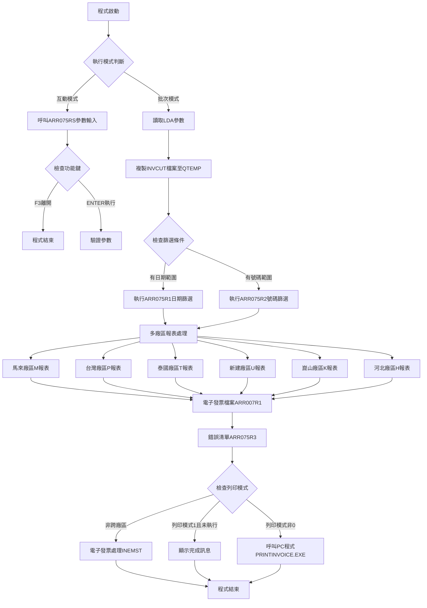
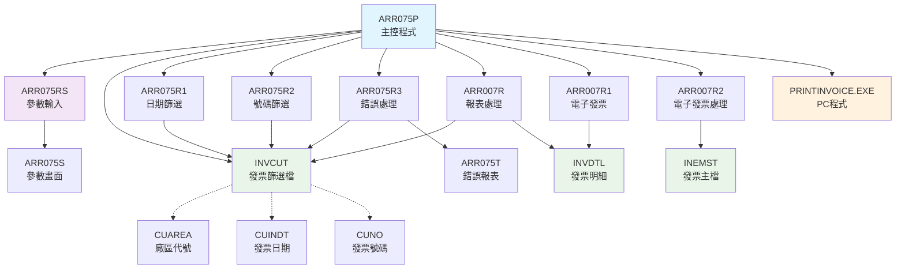
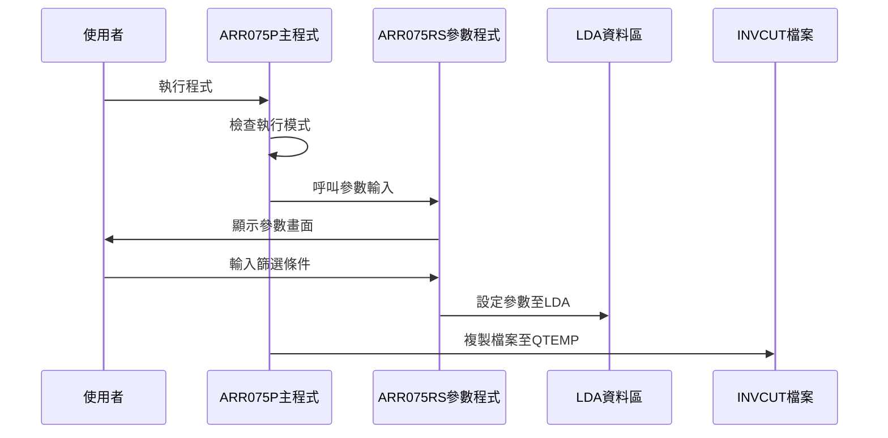
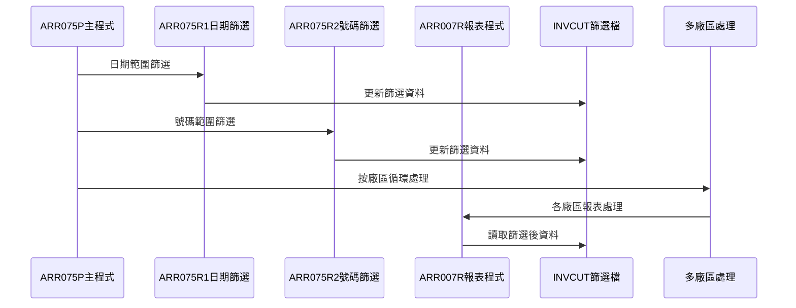
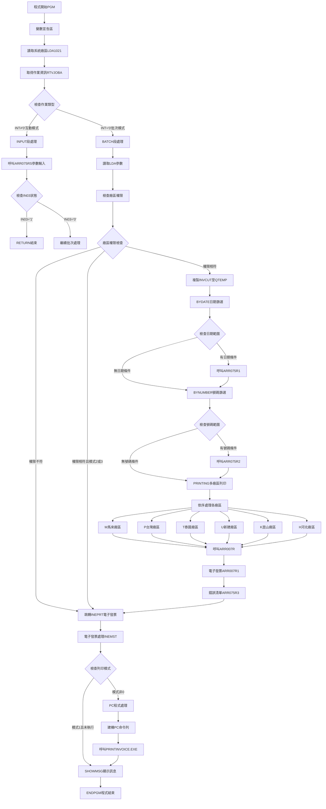

# ARR075P_U01 程式規格書

## 1. 基本資料

| 項目 | 內容 |
|------|------|
| **程式編號** | ARR075P |
| **程式名稱** | 發票列印處理系統作業 |
| **程式類型** | CLP |
| **廠區** | U01 |
| **系統名稱** | 應收帳款系統 |
| **子系統** | 應收帳款報表 |
| **檔案位置** | 東鋼list/ARR075P_U01.txt |

## 2. 🎯 程式功能說明

### 主要功能描述
本程式為綜合性發票列印處理系統，具備多廠區發票列印、電子發票處理、發票資料篩選和錯誤檢核等完整功能。程式支援互動式參數輸入和批次處理雙重模式，可根據日期範圍或發票號碼範圍進行資料篩選，並針對不同廠區產生相對應的發票列印格式。

### 🎯 業務流程詳細說明

#### 完整業務流程圖


#### 業務流程關鍵階段說明
1. **模式識別階段**：檢查作業類型決定互動或批次處理流程
2. **參數收集階段**：透過ARR075RS畫面收集篩選條件
3. **資料準備階段**：複製INVCUT檔案至臨時工作區進行處理
4. **資料篩選階段**：根據日期或號碼範圍篩選發票資料
5. **多廠區處理階段**：依序處理各廠區的發票列印作業
6. **電子發票階段**：產生電子發票檔案和處理電子發票數據
7. **錯誤處理階段**：產生錯誤清單和異常資料報表
8. **PC程式整合階段**：呼叫外部PC程式進行進階發票處理

#### 多層次驗證機制
- **廠區權限驗證**：檢查使用者所屬廠區與查詢廠區的一致性
- **日期範圍驗證**：確保起迄日期的邏輯正確性
- **發票號碼驗證**：檢查發票號碼格式和範圍的有效性
- **列印模式驗證**：確認列印模式參數的正確性
- **檔案存在驗證**：確保相關資料檔案的可存取性

#### 智能處理邏輯
- **動態廠區處理**：根據資料內容自動識別並處理不同廠區
- **條件式篩選機制**：支援日期和號碼雙重篩選條件
- **漸進式報表產生**：按廠區順序逐一產生報表避免資源衝突
- **智能PC程式整合**：根據條件動態決定是否呼叫外部PC程式
- **自動檔案管理**：智能管理臨時檔案的建立和清理

#### 資料一致性確保機制
- **檔案共享控制**：設定SHARE(*YES)確保多使用者並行存取
- **臨時檔案隔離**：使用QTEMP確保不同作業間的資料隔離
- **廠區資料分離**：透過CUAREA欄位確保廠區資料的正確分類
- **檔案覆蓋管理**：正確設定檔案覆蓋避免資料混亂
- **處理順序控制**：按既定順序處理確保資料處理的一致性

## 3. 🎯 檔案架構與關聯圖

### 使用檔案清單
| 檔案名稱 | 檔案類型 | 用途說明 | 存取方式 |
|----------|----------|----------|----------|
| ARR075S | DSPF | 參數輸入畫面檔案 | 螢幕格式定義 |
| INVCUT | 實體檔案 | 發票篩選工作檔 | 讀取/更新 |
| INVDTY/INVDTL | 實體檔案 | 發票明細檔案 | 讀取 |
| INEMST | 實體檔案 | 發票主檔 | 查詢讀取 |
| ARR075T | PRTF | 錯誤報表格式檔案 | 列印輸出 |
| ARR075RS | RPG程式 | 參數輸入處理程式 | 程式呼叫 |
| ARR075R1/R2/R3 | RPG程式 | 資料處理程式 | 程式呼叫 |
| ARR007R/R1/R2 | RPG程式 | 報表處理程式 | 程式呼叫 |
| PRINTINVOICE.EXE | PC程式 | 電子發票處理程式 | 外部程式呼叫 |

### 🎯 檔案關聯詳細視覺化圖表


### 🎯 資料流向詳細說明

#### 環境準備階段的資料流向


#### 業務處理階段的資料流向


#### 環境清理階段的資料流向
- **檔案關閉序列**：各廠區查詢關閉 → 檔案覆蓋刪除 → 臨時檔案清理
- **資源釋放流程**：報表輸出完成 → PC程式執行完成 → 記憶體清理
- **狀態恢復機制**：覆蓋設定移除 → 臨時檔案刪除 → 系統環境恢復

## 4. 🎯 檔案欄位規格說明

### 主要資料結構

#### INVCUT檔案關鍵欄位
| 欄位名稱 | 資料型態 | 長度 | 說明 |
|----------|----------|------|------|
| CUAREA | CHAR | 1 | 廠區代號(M/P/T/U/K/H) |
| CUINDT | DECIMAL | 8 | 發票日期 |
| CUNO | CHAR | 10 | 發票號碼 |
| CUTYPE | CHAR | 1 | 發票類型 |
| CUKIND | CHAR | 1 | 發票種類 |

#### INEMST檔案關鍵欄位
| 欄位名稱 | 資料型態 | 長度 | 說明 |
|----------|----------|------|------|
| EMPTAR | CHAR | 1 | 目標廠區 |
| EMBUMD | CHAR | 1 | 業務模式 |
| EMNO | CHAR | 10 | 發票編號 |
| EMINDT | DECIMAL | 8 | 發票日期 |
| EMPTMD | CHAR | 1 | 列印模式 |

#### 程式變數結構

##### 🔍 重點欄位切割技術詳解
程式使用LDA進行參數傳遞的欄位配置：

```
LDA資料區配置 (總長度1022字元)：
位置1-8:     [XXXXXXXX]              起始日期
位置11-18:   [XXXXXXXX]              結束日期
位置21-30:   [XXXXXXXXXX]            起始發票號碼
位置31-40:   [XXXXXXXXXX]            結束發票號碼
位置41:      [X]                     廠區代號
位置42:      [X]                     業務模式
位置43:      [X]                     列印確認旗標
位置1021:    [X]                     系統廠區代號
```

##### PC程式命令列參數切割
```
CMDA變數 (107字元)：[PATH|AREA|FRDT|TODT|FRNO|TONO|PTMD|BUMD|USER|APNO]
                    ↓     ↓    ↓    ↓    ↓    ↓    ↓    ↓    ↓    ↓
PATH (26字元):     [C:\E-INVOICE\PRINTINVOICE\]                    執行路徑
AREA (1字元):      [X]                                            廠區代號
FRDT (8字元):      [XXXXXXXX]                                     起始日期
TODT (8字元):      [XXXXXXXX]                                     結束日期
FRNO (10字元):     [XXXXXXXXXX]                                   起始號碼
TONO (10字元):     [XXXXXXXXXX]                                   結束號碼
PTMD (1字元):      [X]                                            列印模式
BUMD (1字元):      [X]                                            業務模式
USER (10字元):     [XXXXXXXXXX]                                   使用者ID
APNO (6字元):      [XXXXXX]                                       應用編號
```

##### 切割邏輯詳細說明
- **LDA參數配置**：使用固定位置配置確保參數傳遞的一致性
- **命令列組合**：透過逐步串接建構完整的PC程式執行命令
- **日期格式轉換**：支援民國年和西元年間的格式轉換
- **參數驗證機制**：確保每個參數的格式和內容正確性

##### 實際數據範例說明
```
LDA參數範例：
位置1-8:   '20231201'    (起始日期: 2023/12/01)
位置11-18: '20231231'    (結束日期: 2023/12/31)
位置21-30: 'A230000001'  (起始發票號碼)
位置31-40: 'A230000999'  (結束發票號碼)
位置41:    'U'           (新建廠區)
位置42:    '1'           (標準業務模式)

PC命令列範例：
C:\E-INVOICE\PRINTINVOICE\PRINTINVOICE.EXE U 01231201 01231231 A230000001 A230000999 1 1 USER001 000000
```

### 🎯 欄位挪用詳細分析

#### 挪用情況對比表
| 原始定義 | 實際使用方式 | 挪用說明 |
|----------|-------------|----------|
| &W1FRDT | PC程式日期參數 | 從YYYYMMDD轉為民國年格式 |
| &W1TODT | PC程式日期參數 | 從YYYYMMDD轉為民國年格式 |
| &W1FRNO | PC程式號碼參數 | 補零填滿至10位字元 |
| &W1TONO | PC程式號碼參數 | 填充Z字元表示最大值 |
| &D#DATS | 日期轉換暫存 | 用於民國年轉換計算 |
| &D#DATE | 日期轉換暫存 | 用於民國年轉換計算 |

#### 挪用原因深度分析
- **PC程式整合需求**：配合外部PC程式的參數格式要求
- **日期格式相容性**：處理AS/400與PC程式間的日期格式差異
- **參數標準化**：統一參數格式便於維護和擴展
- **向下相容性**：保持與既有PC程式介面的相容性

#### 挪用影響評估
- **維護複雜度**：需要同時瞭解AS/400和PC程式的參數規格
- **版本相依性**：與PC程式版本存在相依關係
- **格式轉換風險**：日期和號碼格式轉換可能產生錯誤
- **跨平台整合**：需要維護AS/400與Windows平台的整合介面

### 重要變數定義表
| 變數名稱 | 型態 | 長度 | 用途說明 |
|----------|------|------|----------|
| &INT | CHAR | 1 | 作業類型識別 |
| &OUTQ | CHAR | 10 | 輸出佇列名稱 |
| &USER | CHAR | 10 | 使用者識別碼 |
| &AREA | CHAR | 1 | 系統廠區代號 |
| &IN03 | CHAR | 1 | 功能鍵狀態 |
| &W#FRDT | CHAR | 8 | 起始日期 |
| &W#TODT | CHAR | 8 | 結束日期 |
| &W#FRNO | CHAR | 10 | 起始發票號碼 |
| &W#TONO | CHAR | 10 | 結束發票號碼 |
| &W#AREA | CHAR | 1 | 查詢廠區代號 |
| &W#PTMD | CHAR | 1 | 列印模式 |
| &W#BUMD | CHAR | 1 | 業務模式 |
| &W#PTYN | CHAR | 1 | 列印確認旗標 |
| &W#APNO | CHAR | 6 | 應用程式編號 |

## 5. 🎯 輸出/入螢幕布局

### 螢幕布局完整視覺化

#### AR075F1 - 參數輸入畫面
```
+----------------------------------------------------------+
|2023/12/25    東鋼鋼鐵股份有限公司              ARR075S |
|10:30:25         發票列印處理作業                    U01  |
+----------------------------------------------------------+
|                                                          |
|     列印廠區: U ( P台灣M馬來T泰國H河北K崑山U新建)        |
|     ※注意：某些資料由於列印模式限制在設定為非作業完成時，|
|            才可重複執行作業                              |
| -------------------------------------------------------- |
|                   起始日          迄日                   |
|                                                          |
|      發票日期範圍: [20231201] -- [20231231]             |
|                                                          |
|      發票號碼範圍: [A230000001] -- [A230000999]         |
|                                                          |
|           業務模式: [1] (空白表示全部)                   |
| -------------------------------------------------------- |
|                                                          |
|     (起始日空白表示查詢全部日期範圍來列印，              |
|      迄日空白表示查詢只起始日來列印。                    |
|      可同時設定日期和號碼範圍來列印。)                   |
|                                                          |
|F3:離開     F12:回主     ENTER:執行     F13:電子發票列印 |
|                                        F23:列印         |
| [錯誤訊息顯示區]                                        |
+----------------------------------------------------------+
```

### 🎯 畫面欄位詳細說明
| 欄位名稱 | 欄位類型 | 長度 | 輸入格式 | 驗證規則 | 說明 |
|----------|----------|------|----------|----------|------|
| S#FRDT | 輸入欄位 | 8 | YYYYMMDD | 日期格式驗證 | 起始發票日期 |
| S#TODT | 輸入欄位 | 8 | YYYYMMDD | 日期格式驗證 | 結束發票日期 |
| S#FRNO | 輸入欄位 | 10 | 英數字 | 發票號碼格式 | 起始發票號碼 |
| S#TONO | 輸入欄位 | 10 | 英數字 | 發票號碼格式 | 結束發票號碼 |
| S#SALE | 輸入欄位 | 1 | 英數字 | 業務模式代號 | 業務模式選擇 |
| S#AREA | 顯示欄位 | 1 | 唯讀 | - | 當前廠區顯示 |
| S#COMP | 顯示欄位 | 35 | 唯讀 | - | 公司名稱顯示 |
| S#DEVI | 顯示欄位 | 10 | 唯讀 | - | 裝置代號顯示 |
| S#MSG1 | 訊息欄位 | 70 | 系統控制 | - | 錯誤訊息顯示 |

### 🎯 畫面控制邏輯
- **指示器IN33-36**：控制各輸入欄位的錯誤屬性顯示
- **指示器IN87**：控制電子發票功能鍵的顯示與隱藏
- **指示器IN99**：控制廠區權限檢查錯誤顯示
- **錯誤屬性**：使用DSPATR(PC RI)顯示受保護且反向顯示
- **條件顯示**：F13和F23功能鍵根據IN87指示器控制顯示

### 功能鍵詳細定義
| 功能鍵 | 處理邏輯 | 系統行為 | 程式控制 |
|--------|----------|----------|----------|
| **F3** | 離開程式 | 結束程式執行 | 設定P#IN03='1'並返回 |
| **F12** | 回到主選單 | 返回上層選單 | 設定IN12='1'並返回 |
| **F10** | 特殊功能 | 執行特殊處理 | 設定IN10='1'執行邏輯 |
| **F13** | 電子發票列印 | 執行電子發票功能 | 設定列印模式並執行 |
| **F23** | 列印功能 | 執行標準列印 | 設定列印參數並執行 |
| **ENTER** | 執行處理 | 進行參數驗證和批次提交 | 執行主要業務邏輯 |

### 操作流程
1. **畫面初始顯示**：載入公司名稱、廠區代號和裝置資訊
2. **參數輸入階段**：使用者輸入日期範圍、號碼範圍和業務模式
3. **權限驗證階段**：檢查使用者廠區權限和系統內控日期
4. **功能選擇階段**：根據功能鍵選擇不同的處理模式
5. **批次提交階段**：驗證通過後設定LDA參數並返回主程式

## 6. 🎯 處理流程程序說明

### 🎯 主程序邏輯深度分析

#### 程式執行流程圖


#### 🎯 詳細處理步驟逐一分析

##### 步驟1：環境初始化處理
```
1. 程式變數宣告：建立所有必要的工作變數和命令列變數
2. 系統資訊取得：從LDA位置1021讀取系統廠區代號
3. 作業屬性取得：呼叫RTVJOBA取得執行模式、輸出佇列和使用者ID
4. 模式判斷：根據TYPE值決定互動或批次流程路徑
```

##### 步驟2：互動模式參數收集
```
1. 參數輸入呼叫：呼叫ARR075RS程式顯示參數輸入畫面
2. 功能鍵檢查：檢查IN03狀態決定是否結束程式
3. 參數設定：將使用者輸入的參數設定至LDA供批次使用
4. 模式切換：從互動模式切換至批次處理模式
```

##### 步驟3：批次模式參數讀取
```
1. LDA參數讀取：從LDA位置1-8、11-18、21-30、31-40讀取參數
2. 廠區模式讀取：從LDA位置41、42讀取廠區和業務模式
3. 權限驗證：比較查詢廠區與使用者所屬廠區
4. 模式檢查：檢查列印模式是否為跨廠區處理
```

##### 步驟4：資料準備和篩選處理
```
1. 檔案複製：使用CRTDUPOBJ複製INVCUT檔案至QTEMP工作區
2. 日期範圍篩選：如有日期條件則呼叫ARR075R1進行篩選
3. 號碼範圍篩選：如有號碼條件則呼叫ARR075R2進行篩選
4. 錯誤監控：設定MONMSG監控檔案操作錯誤
```

##### 步驟5：多廠區報表處理流程
```
1. 廠區循環處理：依序處理M、P、T、U、K、H六個廠區
2. 檔案覆蓋設定：為每廠區設定INVDTY和INVCUT檔案覆蓋
3. 查詢條件設定：使用OPNQRYF設定CUAREA廠區篩選條件
4. 報表格式設定：使用OVRPRTF設定報表頁面和字體參數
5. 報表程式呼叫：呼叫ARR007R產生各廠區發票報表
6. 資源清理：關閉查詢檔案並刪除檔案覆蓋設定
```

##### 步驟6：電子發票和PC程式整合
```
1. 電子發票檔案：呼叫ARR007R1產生電子發票檔案
2. 錯誤清單處理：呼叫ARR075R3產生錯誤資料報表
3. 電子發票處理：查詢INEMST檔案處理電子發票資料
4. PC程式參數準備：建構完整的PC程式執行命令列
5. PC程式執行：使用STRPCCMD呼叫外部PRINTINVOICE.EXE
6. 完成訊息：發送處理完成訊息給使用者
```

### 🎯 子程序邏輯分析

#### ARR075RS參數輸入程式呼叫
- **參數1 (&IN03)**：回傳1字元功能鍵狀態('1'=F3離開)
- **參數2 (&W#PTMD)**：回傳1字元列印模式設定
- **畫面顯示**：透過AR075F1格式收集使用者輸入
- **參數驗證**：進行日期格式、廠區權限和範圍檢查
- **LDA設定**：將驗證後的參數設定至LDA供主程式使用

#### ARR075R1/R2/R3處理程式呼叫
- **ARR075R1**：根據日期範圍篩選INVCUT檔案中的發票資料
- **ARR075R2**：根據發票號碼範圍篩選INVCUT檔案資料
- **ARR075R3**：處理CUAREA='*'的錯誤資料並產生錯誤報表
- **檔案處理**：使用QTEMP/INVCUT作為工作檔案進行資料處理
- **資料更新**：更新篩選條件標記供後續報表使用

#### ARR007R系列報表程式呼叫
- **ARR007R**：主要發票報表處理程式，處理各廠區發票列印
- **ARR007R1**：電子發票檔案產生程式
- **ARR007R2**：電子發票資料處理程式，處理INEMST檔案
- **檔案輸入**：使用篩選後的INVCUT和INVDTL檔案
- **報表輸出**：產生格式化的發票列印報表

#### PRINTINVOICE.EXE PC程式呼叫
- **執行路徑**：C:\E-INVOICE\PRINTINVOICE\PRINTINVOICE.EXE
- **參數順序**：廠區 起始日期 結束日期 起始號碼 結束號碼 列印模式 業務模式 使用者 應用編號
- **通訊機制**：使用STRPCCMD進行AS/400與PC間的程式呼叫
- **同步執行**：設定PAUSE(*NO)進行非同步執行

### 🎯 特殊邏輯處理

#### 多廠區循環處理機制
```
廠區處理順序：
1. M(馬來) → CUAREA='M' → 馬來發票報表
2. P(台灣) → CUAREA='P' → 台灣發票報表  
3. T(泰國) → CUAREA='T' → 泰國發票報表
4. U(新建) → CUAREA='U' → 新建發票報表
5. K(崑山) → CUAREA='K' → 崑山發票報表
6. H(河北) → CUAREA='H' → 河北發票報表
```

#### 日期格式轉換邏輯
```
AS/400格式 → PC程式格式轉換：
1. 系統日期格式：YYYYMMDD (西元年8位數)
2. PC程式格式：YYMMDD (民國年6位數)
3. 轉換公式：西元年 - 1911 = 民國年
4. 範例：20231201 → 1121201
```

#### 電子發票處理條件判斷
```
處理條件邏輯：
1. 廠區不符 → 執行電子發票處理
2. 列印模式2或3 → 執行電子發票處理
3. 列印模式1且未執行過 → 顯示完成訊息
4. 列印模式非0 → 呼叫PC程式處理
```

#### 檔案覆蓋技術實現
- **OVRPRTF設定**：報表檔案設定33行80欄頁面、6LPI行距、10CPI字體
- **OVRDBF設定**：資料檔案重新導向和共享模式設定
- **SHARE控制**：INVCUT設定共享存取模式避免檔案鎖定
- **HOLD設定**：報表輸出設定暫存便於檢視和管理

### 🎯 錯誤處理與資料完整性控制

#### 詳細錯誤處理邏輯
1. **檔案操作錯誤**：使用MONMSG CPF0000監控所有檔案操作錯誤
2. **廠區權限錯誤**：檢查使用者廠區與查詢廠區的一致性
3. **參數驗證錯誤**：在ARR075RS中進行完整的參數格式驗證
4. **PC程式執行錯誤**：監控PC程式的執行狀態和回傳結果

#### 資料完整性檢查機制
- **檔案存在檢查**：確保INVCUT檔案成功複製至QTEMP
- **權限一致性檢查**：驗證使用者只能查詢所屬廠區資料
- **日期邏輯檢查**：確保起始日期不大於結束日期
- **號碼範圍檢查**：驗證起始號碼和結束號碼的邏輯正確性

#### 關鍵業務規則實現
- **廠區隔離**：透過CUAREA欄位確保不同廠區資料的隔離
- **權限控制**：限制使用者只能處理所屬廠區的發票資料
- **處理順序**：按既定順序處理各廠區避免資源衝突
- **檔案保護**：使用臨時檔案避免影響正式資料檔案

## 7. 🎯 數據操作與轉換分析

### 檔案操作詳解

#### READ操作邏輯
- **RTVDTAARA操作**：從LDA指定位置讀取各種參數
- **RTVJOBA操作**：讀取作業屬性、輸出佇列和使用者資訊
- **查詢檔案讀取**：透過OPNQRYF建立條件查詢讀取資料

#### WRITE操作邏輯
- **CRTDUPOBJ操作**：複製INVCUT檔案至QTEMP工作區
- **檔案更新**：透過ARR075R1/R2更新篩選後的資料
- **報表輸出**：透過各報表程式產生列印檔案

#### DELETE操作邏輯
- **DLTOVR操作**：刪除所有檔案覆蓋設定
- **CLOF操作**：關閉查詢檔案釋放資源
- **臨時檔案清理**：QTEMP中的臨時檔案自動清理

#### 檔案存取的條件和篩選
```
OPNQRYF查詢條件：
1. 各廠區查詢：CUAREA *EQ "廠區代號"
2. 錯誤資料查詢：CUAREA *EQ "*"
3. 電子發票查詢：複合條件包含EMPTAR、EMBUMD、EMNO、EMINDT、EMPTMD
4. 排序設定：按CUINDT日期和CUNO號碼排序
```

### 數據轉換邏輯

#### 日期格式轉換的詳細方式
```
多種日期格式轉換：
1. LDA讀取格式：8位數字字串 "YYYYMMDD"
2. 顯示格式：使用EDTCDE(4)顯示為"YY/MM/DD"
3. PC程式格式：民國年轉換 YYYY-1911→YY
4. 系統格式：DECIMAL 8,0數值型態
5. 預設值處理：空白時設定預設日期範圍
```

#### 字串操作和格式化
- **命令列建構**：使用*CAT操作符逐步建構PC程式執行命令
- **參數填充**：號碼欄位補零、日期欄位格式化
- **廠區轉換**：單一字元廠區代號的標準化處理
- **訊息格式化**：組合多個參數產生完成訊息

#### 數值計算邏輯
- **日期運算**：使用加法進行民國年轉換(+19110000)
- **範圍處理**：設定最大值範圍(如號碼設為ZZZZZZZZZZ)
- **預設值計算**：根據條件設定不同的預設值範圍

### 計算邏輯分析

#### 數值格式轉換邏輯
- **字元轉數值**：CHGVAR進行日期字串轉數值計算
- **數值轉字元**：計算結果轉回字元型供PC程式使用
- **條件運算**：根據不同條件設定不同的數值範圍

#### 公式推導和計算步驟
```
民國年轉換公式：
1. 讀取西元年日期：&W#FRDT = "20231201"
2. 轉為數值型：&D#DATS = 20231201
3. 加上轉換常數：&D#DATS = 20231201 + 19110000 = 39341201
4. 但實際應為：&D#DATS = 20231201 - 19110000 = 1121201
5. 轉回字元型：&W1FRDT = "1121201"
```

### 檢核機制詳解

#### 數據有效性檢查的具體邏輯
1. **廠區一致性檢查**：IF COND(&W#AREA *NE &AREA)
2. **模式範圍檢查**：檢查列印模式是否為2或3
3. **日期範圍檢查**：起始日期不得大於結束日期
4. **檔案存在檢查**：MONMSG監控檔案操作錯誤

#### 檢核失敗的處理方式
- **廠區權限失敗**：跳轉至INEPRT執行電子發票處理
- **模式檢查失敗**：跳轉至電子發票處理流程
- **檔案錯誤**：透過MONMSG捕捉並繼續執行
- **參數錯誤**：在ARR075RS中顯示錯誤訊息

#### 檢核規則的業務依據
- **資料安全**：確保使用者只能存取所屬廠區資料
- **業務邏輯**：按照發票處理的標準流程進行檢核
- **系統穩定性**：透過檔案檢查避免系統錯誤
- **資料一致性**：確保處理結果的正確性和完整性

## 8. 🎯 錯誤處理程序說明

### 🎯 詳細錯誤代碼清冊

| 錯誤代碼 | 錯誤訊息 | 原因說明 | 處理方式 | 預防措施 |
|----------|---------|---------|---------|----------|
| **USER001** | 廠區權限不符 | 使用者查詢非所屬廠區資料 | 1. 跳轉INEPRT處理<br>2. 執行電子發票流程<br>3. 限制查詢範圍 | 系統登入時確認使用者廠區權限 |
| **USER002** | 列印模式限制 | 列印模式設為2或3時的限制 | 1. 自動跳轉電子發票處理<br>2. 略過標準報表流程<br>3. 執行特殊處理邏輯 | 提供列印模式說明和使用指引 |
| **USER003** | 參數格式錯誤 | 日期或號碼格式不正確 | 1. ARR075RS顯示錯誤訊息<br>2. 設定錯誤指示器<br>3. 要求重新輸入 | 畫面提供格式範例和驗證 |
| **FILE001** | INVCUT檔案複製失敗 | 原始檔案不存在或權限不足 | 1. MONMSG捕捉錯誤<br>2. 繼續執行後續流程<br>3. 記錄錯誤狀態 | 定期檢查DALIB/INVCUT檔案狀態 |
| **FILE002** | 查詢檔案開啟失敗 | OPNQRYF執行失敗 | 1. 略過該廠區處理<br>2. 繼續下一廠區<br>3. 記錄處理狀態 | 驗證檔案結構和索引完整性 |
| **SYS001** | PC程式執行失敗 | PRINTINVOICE.EXE無法執行 | 1. 記錄執行狀態<br>2. 發送錯誤訊息<br>3. 繼續完成AS/400處理 | 確認PC程式路徑和執行權限 |
| **SYS002** | LDA參數讀取錯誤 | LDA資料區參數異常 | 1. 使用預設值<br>2. 記錄異常狀態<br>3. 繼續執行處理 | LDA區域初始化和參數驗證 |

### 🎯 系統異常處理邏輯

#### 檔案操作失敗處理
- **檔案不存在**：使用MONMSG CPF0000監控所有檔案錯誤並繼續執行
- **權限不足**：設定檔案共享模式SHARE(*YES)避免權限衝突
- **檔案損壞**：使用QTEMP臨時檔案避免影響正式檔案
- **磁碟空間不足**：臨時檔案自動清理釋放空間

#### 程式調用失敗處理
- **ARR075RS呼叫失敗**：檢查回傳的IN03狀態決定後續流程
- **ARR075R1/R2/R3呼叫失敗**：繼續執行不受影響的處理步驟
- **ARR007R系列呼叫失敗**：略過該廠區報表處理繼續下一廠區
- **PC程式呼叫失敗**：記錄狀態並完成AS/400端處理

#### 資料完整性錯誤處理
- **LDA參數異常**：使用預設值或空白值繼續處理
- **日期轉換錯誤**：設定安全的預設日期範圍
- **廠區代號錯誤**：限制在有效廠區範圍內處理
- **參數傳遞錯誤**：重新設定參數或使用預設配置

#### 並發控制失敗處理
- **檔案鎖定衝突**：使用SHARE(*YES)模式開啟檔案
- **查詢衝突**：使用QTEMP隔離不同使用者的處理
- **報表輸出衝突**：設定HOLD(*YES)避免列印衝突
- **PC程式衝突**：使用使用者ID區分不同執行實例

#### 跨平台整合錯誤處理
- **AS/400與PC通訊錯誤**：記錄錯誤狀態並繼續AS/400處理
- **參數格式不相容**：進行格式轉換確保相容性
- **字元編碼問題**：使用標準ASCII字元避免編碼問題
- **執行環境差異**：提供環境檢查和相容性處理

## 9. 🎯 備註

### 🎯 特殊注意事項
- **多廠區處理機制**：程式自動依序處理M、P、T、U、K、H六個廠區的發票資料
- **電子發票整合**：具備完整的電子發票處理功能，可呼叫PC程式進行進階處理
- **權限控制機制**：嚴格控制使用者只能查詢和處理所屬廠區的發票資料
- **臨時檔案管理**：使用QTEMP工作區進行資料處理避免影響正式檔案
- **日期格式轉換**：支援AS/400與PC程式間的日期格式轉換處理
- **條件式處理邏輯**：根據不同的列印模式和權限設定執行不同的處理流程
- **檔案共享設定**：所有資料檔案設定共享模式支援多使用者並行處理
- **錯誤監控機制**：完整的錯誤監控和處理機制確保程式穩定運行
- **跨平台整合**：AS/400與Windows PC程式的完整整合方案
- **參數化設計**：透過LDA進行靈活的參數傳遞和配置管理
- **報表格式控制**：支援不同廠區的報表格式和列印參數設定
- **業務模式支援**：支援多種業務模式的發票處理需求 