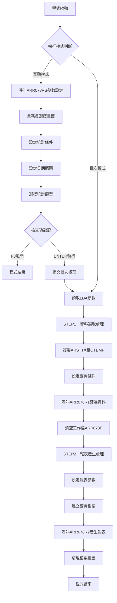
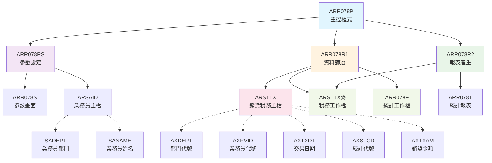
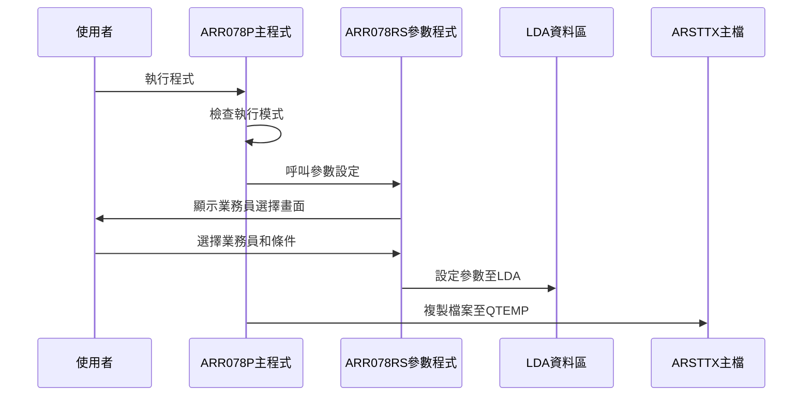
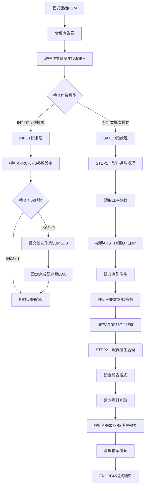

# ARR078P_P02 程式規格書

## 1. 基本資料

| 項目 | 內容 |
|------|------|
| **程式編號** | ARR078P |
| **程式名稱** | 銷貨業務員業績統計作業 |
| **程式類型** | CLP |
| **廠區** | P02 |
| **系統名稱** | 應收帳款系統 |
| **子系統** | 應收帳款報表 |
| **檔案位置** | 東鋼list/ARR078P_P02.txt |

## 2. 🎯 程式功能說明

### 主要功能描述
本程式為綜合性銷貨業務員業績統計系統，具備業務員選擇、業績資料篩選、多維度統計分析和業績報表產生等完整功能。程式支援互動式參數設定和批次處理雙重模式，可根據日期範圍、業務員選擇、業績狀態等條件進行精確的業績統計分析，並產生詳細的業務員業績報表。

### 🎯 業務流程詳細說明

#### 完整業務流程圖


#### 業務流程關鍵階段說明
1. **參數設定階段**：透過ARR078RS畫面收集業務員選擇和統計條件
2. **業務員選擇階段**：使用子檔案畫面進行多業務員選擇
3. **條件設定階段**：設定日期範圍、統計類型和業績狀態
4. **資料準備階段**：複製ARSTTX檔案至QTEMP工作區進行處理
5. **資料篩選階段**：根據設定條件篩選銷貨稅務資料
6. **統計分析階段**：透過ARR078R1進行業績資料統計處理
7. **報表產生階段**：透過ARR078R2產生格式化的業績統計報表
8. **資源清理階段**：清理臨時檔案和檔案覆蓋設定

#### 多層次驗證機制
- **業務員權限驗證**：確認使用者對所選業務員資料的存取權限
- **日期範圍驗證**：確保起迄日期的邏輯正確性和合理性
- **統計條件驗證**：檢查統計類型和業績狀態的有效性
- **資料存在驗證**：確保相關業績資料檔案的可存取性
- **參數完整性驗證**：確認所有必要參數的完整性

#### 智能處理邏輯
- **動態業務員篩選**：根據使用者選擇動態建構業務員篩選條件
- **多維度統計處理**：支援按部門、業務員、日期等多維度統計
- **條件式報表格式**：根據統計類型調整報表格式和內容
- **智能資料分組**：自動按部門和業務員進行資料分組處理
- **最佳化查詢條件**：動態組合查詢條件提升處理效率

#### 資料一致性確保機制
- **檔案共享控制**：設定SHARE(*YES)確保多使用者並行存取
- **臨時檔案隔離**：使用QTEMP確保不同作業間的資料隔離
- **業務員資料同步**：確保業務員主檔與統計資料的一致性
- **檔案覆蓋管理**：正確設定檔案覆蓋避免資料混亂
- **統計資料完整性**：確保統計結果的準確性和完整性

## 3. 🎯 檔案架構與關聯圖

### 使用檔案清單
| 檔案名稱 | 檔案類型 | 用途說明 | 存取方式 |
|----------|----------|----------|----------|
| ARR078S | DSPF | 參數設定畫面檔案 | 螢幕格式定義 |
| ARSTTX | 實體檔案 | 銷貨稅務主檔 | 讀取查詢 |
| ARSTTX@ | 暫存檔案 | 銷貨稅務工作檔 | 讀取/更新 |
| ARR078F | 實體檔案 | 業績統計工作檔 | 清空/更新 |
| ARR078T | PRTF | 業績統計報表格式檔 | 列印輸出 |
| ARSAID | 實體檔案 | 業務員主檔 | 查詢讀取 |
| ARR078RS | RPG程式 | 參數設定處理程式 | 程式呼叫 |
| ARR078R1 | RPG程式 | 資料篩選處理程式 | 程式呼叫 |
| ARR078R2 | RPG程式 | 報表產生處理程式 | 程式呼叫 |

### 🎯 檔案關聯詳細視覺化圖表


### 🎯 資料流向詳細說明

#### 環境準備階段的資料流向


#### 業務處理階段的資料流向
```mermaid
sequenceDiagram
    participant ARR078P as ARR078P主程式
    participant ARR078R1 as ARR078R1篩選程式
    participant ARR078R2 as ARR078R2報表程式
    participant ARSTTX@ as ARSTTX@工作檔
    participant ARR078F as ARR078F統計檔
    participant ARR078T as ARR078T報表
    
    ARR078P->>ARR078R1: 資料篩選處理
    ARR078R1->>ARSTTX@: 篩選符合條件資料
    ARR078R1->>ARR078F: 產生統計資料
    ARR078P->>ARR078R2: 報表產生處理
    ARR078R2->>ARSTTX@: 讀取篩選後資料
    ARR078R2->>ARR078T: 產生業績統計報表
```

#### 環境清理階段的資料流向
- **檔案關閉序列**：查詢檔案關閉 → 檔案覆蓋刪除 → 臨時檔案清理
- **資源釋放流程**：報表輸出完成 → 工作檔清理 → 記憶體清理
- **狀態恢復機制**：覆蓋設定移除 → 臨時檔案刪除 → 系統環境恢復

## 4. 🎯 檔案欄位規格說明

### 主要資料結構

#### ARSTTX檔案關鍵欄位
| 欄位名稱 | 資料型態 | 長度 | 說明 |
|----------|----------|------|------|
| AXCUNO | CHAR | 6 | 客戶編號 |
| AXORNO | CHAR | 6 | 訂單號碼 |
| AXSAID | CHAR | 2 | 銷貨業務員 |
| AXRVID | CHAR | 2 | 收款業務員 |
| AXDEPT | CHAR | 4 | 業務部門 |
| AXTXCD | CHAR | 4 | 稅務代號 |
| AXTXNO | CHAR | 8 | 統一編號 |
| AXTXDT | DECIMAL | 8 | 統計日期 |
| AXTXAM | DECIMAL | 11 | 銷貨金額 |
| AXINNO | CHAR | 10 | 發票號碼 |
| AXAPNO | CHAR | 6 | 應付帳號 |
| AXRVNO | CHAR | 6 | 收款帳號 |
| AXRVDT | DECIMAL | 8 | 收款日期 |
| AXSTCD | CHAR | 1 | 統計代號 |
| AXRESV | OUTPUT | 10 | 保留欄位 |

#### ARSAID檔案關鍵欄位
| 欄位名稱 | 資料型態 | 長度 | 說明 |
|----------|----------|------|------|
| SADEPT | CHAR | 4 | 業務員部門 |
| SAREVN | CHAR | 2 | 業務員代號 |
| SANAME | CHAR | 10 | 業務員姓名 |

#### 程式變數結構

##### 🔍 重點欄位切割技術詳解
程式使用LDA進行參數傳遞的欄位配置：

```
LDA資料區配置 (總長度1022字元)：
位置1-200:   [業務員清單...]                     業務員選擇清單(每筆16字元)
位置201-204: [XXXX]                           第一期統計日期
位置205-208: [XXXX]                           保證期統計日期
位置209-212: [XXXX]                           延期統計日期
位置216:     [X]                              第一期列印旗標
位置217:     [X]                              保證期列印旗標
位置218:     [X]                              保證期列印旗標
位置219:     [X]                              延期列印旗標
位置221:     [X]                              開立發票統計旗標
位置222:     [X]                              應收帳款統計旗標
位置223:     [X]                              保證期統計旗標
位置224:     [X]                              衝銷等統計旗標
位置231-238: [XXXXXXXX]                       結算計算日期
```

##### 業務員清單資料切割
```
業務員資料格式 (每筆16字元)：[DEPT|RVID|NAME            ]
                             ↓    ↓    ↓
DEPT (4字元):                [XXXX]                     部門代號
RVID (2字元):                [XX]                       業務員代號  
NAME (10字元):               [XXXXXXXXXX]               業務員姓名
```

##### 切割邏輯詳細說明
- **業務員清單配置**：使用固定16字元格式儲存業務員資訊
- **日期範圍配置**：分別儲存三個統計期間的日期範圍
- **旗標位元配置**：使用單一字元儲存各種統計選項
- **彈性擴充設計**：預留空間供未來功能擴充使用

##### 實際數據範例說明
```
LDA參數範例：
位置1-16:   'A00101張三      '    (部門A001, 業務員01, 姓名張三)
位置17-32:  'A00202李四      '    (部門A002, 業務員02, 姓名李四)
位置201-204: '1201'               (第一期統計：12月01日)
位置205-208: '1215'               (保證期統計：12月15日)
位置209-212: '1231'               (延期統計：12月31日)
位置216:     'Y'                  (列印第一期統計)
位置217:     'Y'                  (列印保證期統計)
位置221:     'Y'                  (開立發票統計)
位置231-238: '20231231'           (結算日期: 2023/12/31)
```

### 🎯 欄位挪用詳細分析

#### 挪用情況對比表
| 原始定義 | 實際使用方式 | 挪用說明 |
|----------|-------------|----------|
| U#MBRS | 業務員選擇清單 | 從單純會員清單挪用為業務員資料集合 |
| U#DAY1/2/3 | 統計期間設定 | 從一般日期挪用為統計區間定義 |
| S#FLG1-4 | 期間列印控制 | 從簡單旗標挪用為複雜期間控制 |
| S#STC1-4 | 統計類型選擇 | 從狀態代號挪用為統計功能選擇 |
| U#ETXD | 結算計算日期 | 從結束日期挪用為統計基準日 |
| AXRESV | 報表輸出欄位 | 從保留欄位挪用為計算結果欄位 |

#### 挪用原因深度分析
- **業務需求複雜化**：原始設計無法滿足多維度統計需求
- **參數傳遞最佳化**：利用既有LDA結構避免重新設計
- **向下相容性考量**：保持與既有系統介面的相容性
- **開發成本控制**：避免大幅修改既有資料結構

#### 挪用影響評估
- **維護複雜度增加**：需要理解欄位的實際用途與原始定義差異
- **文件同步問題**：程式文件與資料結構文件可能不一致
- **擴充性限制**：受限於原始欄位長度和格式設計
- **理解困難度**：新維護人員需要額外時間理解挪用邏輯

### 重要變數定義表
| 變數名稱 | 型態 | 長度 | 用途說明 |
|----------|------|------|----------|
| &INT | CHAR | 1 | 作業類型識別 |
| &OUTQ | CHAR | 10 | 輸出佇列名稱 |
| &USER | CHAR | 10 | 使用者識別碼 |
| &IN03 | LGL | 1 | 功能鍵狀態 |
| &W#MBRS | CHAR | 200 | 業務員選擇清單 |
| &W#ETXD | CHAR | 8 | 結算計算日期 |

## 5. 🎯 輸出/入螢幕布局

### 螢幕布局完整視覺化

#### AR078F1 - 業務員選擇及統計參數設定畫面
```
+----------------------------------------------------------+
|2023/12/25    東鋼鋼鐵股份有限公司              ARR078S-1|
|10:30:25         銷貨業務員業績統計作業                P02|
+----------------------------------------------------------+
|                                                          |
|  統計期統計日期：1201   保證期統計日期：1215            |
|  延期統計日期：1231                                      |
|  <設定列印期統計日期範圍按Y>     第一期 Y  保證期 Y      |
|  保證期 Y  延期 Y                                        |
|  <設定列印統計狀態按Y>   開立發票 Y  應收帳款 Y         |
|  保證期 Y  衝銷等 Y                                      |
|  結算計算日期: 20231231 (請輸入月結算計算基準日)        |
| -------------------------------------------------------- |
|          選項    部門      業務員      (要列印請選Y)     |
| -------------------------------------------------------- |
|           Y     A001        01       張三               |
|           Y     A002        02       李四               |
|                 A003        03       王五               |
|                 A004        04       趙六               |
|                 A005        05       錢七               |
|                 A006        06       孫八               |
|                 A007        07       李九               |
|                 A008        08       周十               |
|                 A009        09       吳一               |
|                 A010        10       鄭二               |
| -------------------------------------------------------- |
| F3:離開      F12:回主      F5:重新整理    F9:全選       |
|                           F10:清除                       |
| [錯誤訊息顯示區]                                        |
+----------------------------------------------------------+
```

### 🎯 畫面欄位詳細說明
| 欄位名稱 | 欄位類型 | 長度 | 輸入格式 | 驗證規則 | 說明 |
|----------|----------|------|----------|----------|------|
| S#DAY1 | 輸入欄位 | 4 | MMDD | 日期格式驗證 | 第一期統計日期 |
| S#DAY2 | 輸入欄位 | 4 | MMDD | 日期格式驗證 | 保證期統計日期 |
| S#DAY3 | 輸入欄位 | 4 | MMDD | 日期格式驗證 | 延期統計日期 |
| S#FLG1-4 | 輸入欄位 | 1 | Y/空白 | Y或空白值 | 期間列印選擇 |
| S#STC1-4 | 輸入欄位 | 1 | Y/空白 | Y或空白值 | 統計類型選擇 |
| S#ETXD | 輸入欄位 | 8 | YYYYMMDD | 日期格式驗證 | 結算計算日期 |
| S#OPT1 | 輸入欄位 | 1 | Y/空白 | Y或空白值 | 業務員選擇 |
| S#DEPT | 顯示欄位 | 4 | 唯讀 | - | 業務員部門 |
| S#RVID | 顯示欄位 | 2 | 唯讀 | - | 業務員代號 |
| S#NAME | 顯示欄位 | 10 | 唯讀 | - | 業務員姓名 |
| S#COMP | 顯示欄位 | 35 | 唯讀 | - | 公司名稱顯示 |
| S#DEVI | 顯示欄位 | 10 | 唯讀 | - | 裝置代號顯示 |
| S#MSG1 | 訊息欄位 | 70 | 系統控制 | - | 錯誤訊息顯示 |

### 🎯 畫面控制邏輯
- **子檔案顯示控制**：IN71控制SFLDSPCTL、IN72控制SFLDSP、IN73控制SFLCLR
- **子檔案結束控制**：IN74控制SFLEND指示器
- **欄位錯誤顯示**：IN51-53控制各輸入欄位的錯誤屬性
- **游標定位控制**：使用SFLCSRRRN控制子檔案游標位置
- **子檔案修改控制**：IN70控制SFLNXTCHG子檔案修改指示器

### 功能鍵詳細定義
| 功能鍵 | 處理邏輯 | 系統行為 | 程式控制 |
|--------|----------|----------|----------|
| **F3** | 離開程式 | 結束程式執行 | 設定P#IN03='1'並返回 |
| **F12** | 回到主選單 | 返回上層選單 | 設定IN12='1'並返回 |
| **F5** | 重新整理 | 重新載入業務員清單 | 重新讀取ARSAID檔案 |
| **F9** | 全選功能 | 選擇所有業務員 | 設定所有S#OPT1='Y' |
| **F10** | 清除功能 | 清除所有選擇 | 設定所有S#OPT1=空白 |
| **ENTER** | 執行處理 | 進行參數驗證和批次提交 | 執行主要業務邏輯 |

### 操作流程
1. **畫面初始顯示**：載入公司名稱、裝置資訊和業務員清單
2. **統計條件設定**：設定統計期間、列印選項和統計類型
3. **業務員選擇**：透過子檔案選擇要統計的業務員
4. **參數驗證**：檢查日期格式、選擇項目的有效性
5. **批次提交**：驗證通過後設定LDA參數並提交批次處理

## 6. 🎯 處理流程程序說明

### 🎯 主程序邏輯深度分析

#### 程式執行流程圖


#### 🎯 詳細處理步驟逐一分析

##### 步驟1：環境初始化處理
```
1. 程式變數宣告：建立所有必要的工作變數
2. 作業屬性取得：呼叫RTVJOBA取得執行模式、輸出佇列和使用者ID
3. 模式判斷：根據TYPE值決定互動或批次流程路徑
4. 系統環境檢查：確認必要的檔案和資源可用性
```

##### 步驟2：互動模式參數收集
```
1. 參數設定呼叫：呼叫ARR078RS程式顯示參數設定畫面
2. 業務員選擇處理：透過子檔案選擇要統計的業務員
3. 統計條件設定：設定日期範圍、列印選項和統計類型
4. 參數驗證：驗證所有輸入參數的格式和邏輯正確性
5. 批次作業提交：使用SBMJOB提交批次處理作業
6. 完成訊息設定：將處理完成訊息設定至LDA
```

##### 步驟3：批次模式資料處理
```
1. LDA參數讀取：從LDA位置1-200讀取業務員清單
2. 統計參數讀取：從LDA位置231-238讀取結算計算日期
3. 檔案準備：使用CRTDUPOBJ複製ARSTTX檔案至QTEMP
4. 查詢條件建構：根據參數建構複雜的查詢條件
5. 資料篩選處理：呼叫ARR078R1進行資料篩選和預處理
6. 工作檔清理：清空ARR078F工作檔準備統計處理
```

##### 步驟4：統計分析處理
```
1. 報表格式設定：使用OVRPRTF設定198欄寬度、15CPI字體
2. 查詢檔案建立：使用OPNQRYF建立按部門、業務員排序的查詢
3. 統計程式呼叫：呼叫ARR078R2進行業績統計和報表產生
4. 資源清理：關閉查詢檔案並刪除所有檔案覆蓋設定
5. 程式結束：完成所有處理並正常結束程式
```

### 🎯 子程序邏輯分析

#### ARR078RS參數設定程式呼叫
- **參數1 (&IN03)**：回傳1字元功能鍵狀態('1'=F3離開)
- **子檔案處理**：透過子檔案顯示業務員清單供選擇
- **參數驗證**：進行日期格式、統計條件的完整驗證
- **LDA設定**：將驗證後的參數設定至LDA供主程式使用
- **業務員篩選**：從ARSAID檔案讀取業務員資料供選擇

#### ARR078R1資料篩選處理程式呼叫
- **查詢條件應用**：根據LDA參數建構複雜的OPNQRYF查詢條件
- **資料篩選**：篩選符合日期範圍和業務員條件的銷貨資料
- **工作檔更新**：將篩選後的資料更新至ARSTTX@工作檔
- **統計預處理**：進行統計分析前的資料準備工作

#### ARR078R2報表產生處理程式呼叫
- **資料分組處理**：按部門、業務員、日期進行資料分組
- **統計計算**：進行各種業績統計計算
- **報表格式化**：產生格式化的業績統計報表
- **小計總計處理**：計算各層次的小計和總計金額

### 🎯 特殊邏輯處理

#### 複雜查詢條件建構
```sql
OPNQRYF查詢條件範例：
QRYSLT('AXTXDT *LE ' || &W#ETXD || ' *AND 
        AXTXCD *NE "    " *AND 
        AXRVID *EQ %VALUES(' *TCAT &W#MBRS *TCAT ') ')

解釋：
1. AXTXDT <= 結算日期
2. AXTXCD 稅務代號不為空白
3. AXRVID 業務員代號在選擇清單中
```

#### 業務員清單處理邏輯
- **多選處理**：支援選擇多個業務員進行統計
- **清單建構**：將選擇的業務員組合成查詢條件
- **部門分組**：按部門分組顯示業務員清單
- **動態載入**：從ARSAID檔案動態載入業務員資料

#### 統計期間處理邏輯
- **三期間設定**：支援第一期、保證期、延期三個統計期間
- **期間交集處理**：處理期間重疊的統計邏輯
- **日期範圍驗證**：確保日期範圍的邏輯正確性
- **彈性期間設定**：支援靈活的期間組合設定

#### 檔案覆蓋技術實現
- **OVRPRTF設定**：報表檔案設定198欄寬度、15CPI字體
- **OVRDBF設定**：資料檔案重新導向和共享模式設定
- **SHARE控制**：ARSTTX設定共享存取模式避免檔案鎖定
- **HOLD設定**：報表輸出設定暫存便於檢視和管理

## 7. 🎯 數據操作與轉換分析

### 檔案操作詳解

#### READ操作邏輯
- **RTVDTAARA操作**：從LDA指定位置讀取業務員清單和統計參數
- **RTVJOBA操作**：讀取作業屬性、輸出佇列和使用者資訊
- **查詢檔案讀取**：透過OPNQRYF建立條件查詢讀取銷貨資料

#### WRITE操作邏輯
- **CRTDUPOBJ操作**：複製ARSTTX檔案至QTEMP工作區
- **檔案更新**：透過ARR078R1更新篩選後的統計資料
- **報表輸出**：透過ARR078R2產生業績統計報表

#### DELETE操作邏輯
- **CLRPFM操作**：清空ARR078F工作檔準備新的統計資料
- **DLTOVR操作**：刪除所有檔案覆蓋設定
- **CLOF操作**：關閉查詢檔案釋放資源

#### 檔案存取的條件和篩選
```
OPNQRYF查詢條件：
1. 主要篩選：AXTXDT *LE 結算日期
2. 有效資料：AXTXCD *NE 空白
3. 業務員篩選：AXRVID *EQ %VALUES(業務員清單)
4. 排序設定：按AXDEPT、AXRVID、AXRESV、AXORNO、AXINDU排序
```

### 數據轉換邏輯

#### 日期格式轉換的詳細方式
```
多種日期格式轉換：
1. 畫面輸入格式：4位數字 "MMDD"
2. 系統內部格式：8位數字 "YYYYMMDD"
3. 報表顯示格式：使用EDTWRD('    /  /  ')顯示
4. 查詢條件格式：8位DECIMAL型態
5. 統計基準日：完整的YYYYMMDD格式
```

#### 字串操作和格式化
- **業務員清單組合**：使用*TCAT操作符組合業務員選擇清單
- **查詢條件建構**：動態建構複雜的SQL查詢條件
- **訊息格式化**：組合參數產生處理完成訊息
- **報表標題格式化**：動態產生報表標題和統計期間

#### 數值計算邏輯
- **金額統計**：各期間銷貨金額的累計計算
- **比率計算**：各期間業績比率的計算
- **差額計算**：期間差額和變動率的計算
- **排序權重**：按金額、日期等進行排序處理

### 計算邏輯分析

#### 業績統計計算邏輯
- **分組統計**：按部門、業務員進行分組統計
- **期間統計**：按第一期、保證期、延期分別統計
- **累計統計**：各層次累計金額的計算
- **比較分析**：期間間的比較分析計算

#### 公式推導和計算步驟
```
業績統計公式：
1. 期間銷貨金額 = Σ(AXTXAM WHERE 期間條件)
2. 業務員業績 = Σ(期間銷貨金額 WHERE AXRVID = 業務員)
3. 部門業績 = Σ(業務員業績 WHERE AXDEPT = 部門)
4. 業績達成率 = (實際業績 / 目標業績) × 100%
```

### 檢核機制詳解

#### 數據有效性檢查的具體邏輯
1. **日期範圍檢查**：確保統計日期的邏輯正確性
2. **業務員存在檢查**：驗證選擇的業務員在ARSAID檔案中存在
3. **金額範圍檢查**：檢查統計金額的合理性
4. **統計條件檢查**：確保至少選擇一個統計條件

#### 檢核失敗的處理方式
- **日期錯誤**：在ARR078RS中顯示日期格式錯誤訊息
- **業務員錯誤**：提示選擇的業務員不存在或無權限
- **檔案錯誤**：透過MONMSG捕捉並記錄檔案操作錯誤
- **統計錯誤**：檢查統計結果的合理性並提供警告

#### 檢核規則的業務依據
- **業務規則遵循**：按照銷貨業績統計的標準流程進行檢核
- **資料完整性**：確保統計資料的完整性和準確性
- **權限控制**：確保使用者只能統計有權限的業務員資料
- **系統穩定性**：透過完整檢核避免系統錯誤

## 8. 🎯 錯誤處理程序說明

### 🎯 詳細錯誤代碼清冊

| 錯誤代碼 | 錯誤訊息 | 原因說明 | 處理方式 | 預防措施 |
|----------|---------|---------|---------|----------|
| **USER001** | 未選擇業務員 | 使用者未選擇任何業務員進行統計 | 1. 顯示錯誤訊息<br>2. 返回選擇畫面<br>3. 提示至少選擇一位業務員 | 畫面提供預設選擇或全選功能 |
| **USER002** | 日期格式錯誤 | 統計日期格式不正確 | 1. 設定錯誤指示器<br>2. 顯示格式說明<br>3. 要求重新輸入 | 提供日期格式範例和驗證 |
| **USER003** | 統計期間重疊 | 設定的統計期間有邏輯錯誤 | 1. 檢查期間邏輯<br>2. 提示正確設定方式<br>3. 自動調整建議 | 提供期間設定指引和範例 |
| **FILE001** | ARSTTX檔案存取失敗 | 銷貨稅務檔案無法存取 | 1. MONMSG捕捉錯誤<br>2. 記錄錯誤狀態<br>3. 提供替代處理方案 | 定期檢查檔案權限和完整性 |
| **FILE002** | ARR078F工作檔清空失敗 | 統計工作檔無法清空 | 1. 嘗試強制清空<br>2. 記錄清空失敗狀態<br>3. 繼續執行後續處理 | 確保工作檔的存取權限 |
| **SYS001** | 批次作業提交失敗 | SBMJOB執行失敗 | 1. 記錄提交失敗原因<br>2. 提供直接執行選項<br>3. 檢查系統資源狀態 | 監控系統作業佇列狀態 |
| **SYS002** | LDA參數設定錯誤 | LDA資料區參數異常 | 1. 使用預設參數<br>2. 記錄異常狀態<br>3. 提供手動設定選項 | LDA區域初始化和參數驗證 |

### 🎯 系統異常處理邏輯

#### 檔案操作失敗處理
- **檔案不存在**：使用MONMSG CPF0000監控檔案錯誤並提供替代方案
- **權限不足**：設定檔案共享模式SHARE(*YES)避免權限衝突
- **檔案損壞**：使用QTEMP臨時檔案避免影響正式檔案
- **磁碟空間不足**：自動清理臨時檔案釋放空間

#### 程式調用失敗處理
- **ARR078RS呼叫失敗**：檢查回傳的IN03狀態決定後續流程
- **ARR078R1呼叫失敗**：記錄篩選失敗狀態並嘗試直接統計
- **ARR078R2呼叫失敗**：提供簡化報表格式作為替代方案
- **子檔案顯示失敗**：提供文字模式的業務員選擇介面

#### 資料完整性錯誤處理
- **LDA參數異常**：使用預設參數繼續處理並記錄異常
- **業務員資料缺失**：從ARSAID檔案重新載入業務員清單
- **統計資料異常**：提供統計資料檢核和修正功能
- **日期範圍錯誤**：自動調整至合理的日期範圍

#### 並發控制失敗處理
- **檔案鎖定衝突**：使用SHARE(*YES)模式開啟檔案
- **查詢衝突**：使用QTEMP隔離不同使用者的處理
- **報表輸出衝突**：設定HOLD(*YES)避免列印衝突
- **資源競爭**：提供佇列機制控制並發存取

#### 統計處理錯誤處理
- **統計資料不足**：提供資料不足的警告和建議
- **計算溢位錯誤**：使用較大的資料型態避免溢位
- **分組處理錯誤**：提供單一業務員統計作為替代
- **報表格式錯誤**：提供簡化的報表格式

## 9. 🎯 備註

### 🎯 特殊注意事項
- **複雜統計邏輯**：支援多期間、多業務員、多統計類型的複雜統計分析
- **靈活參數設定**：提供豐富的參數選項滿足不同統計需求
- **子檔案操作**：使用子檔案技術提供友善的業務員選擇介面
- **批次處理整合**：完整的互動與批次處理整合機制
- **資料完整性保證**：多層次的資料驗證確保統計結果的準確性
- **效能最佳化設計**：使用QTEMP和查詢檔案技術提升處理效能
- **多維度分析支援**：支援按部門、業務員、期間等多維度分析
- **報表格式彈性**：可根據統計需求調整報表格式和內容
- **錯誤復原機制**：完整的錯誤處理和復原機制確保系統穩定
- **使用者友善介面**：提供直觀的參數設定和業務員選擇介面
- **資源管理最佳化**：智能的檔案和記憶體資源管理
- **統計準確性保證**：多重檢核機制確保統計結果的準確性和可靠性 