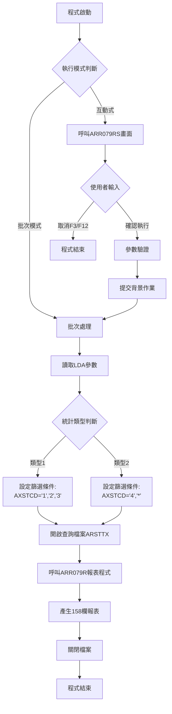
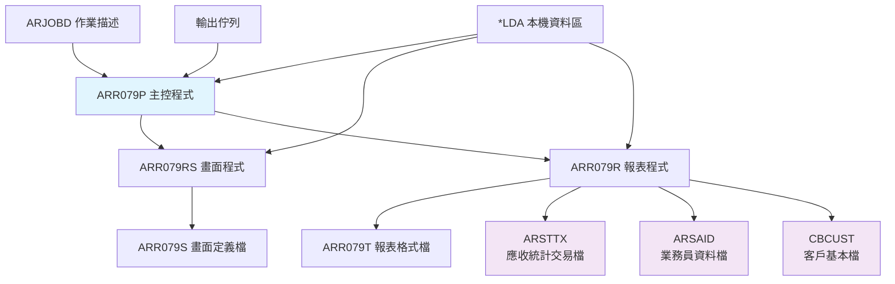
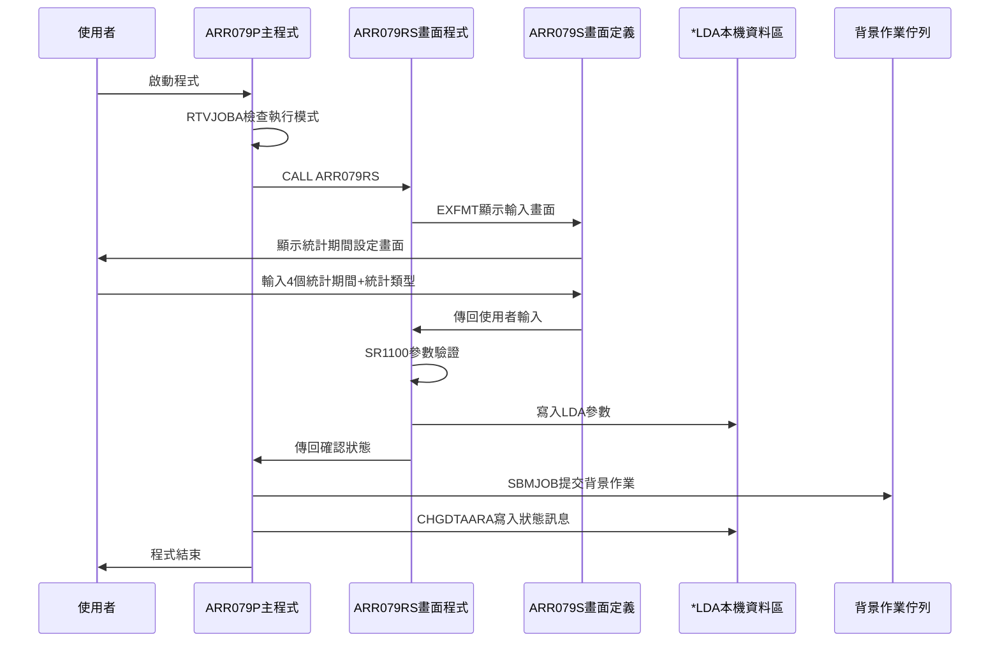
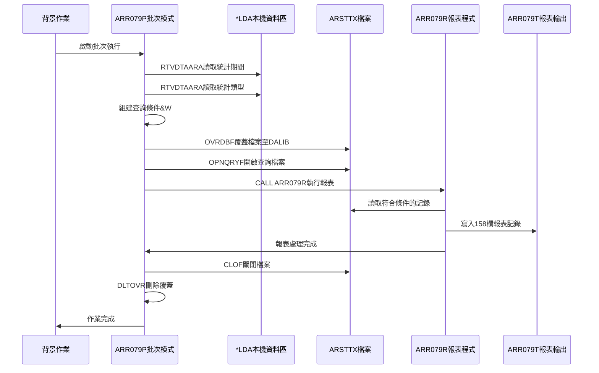
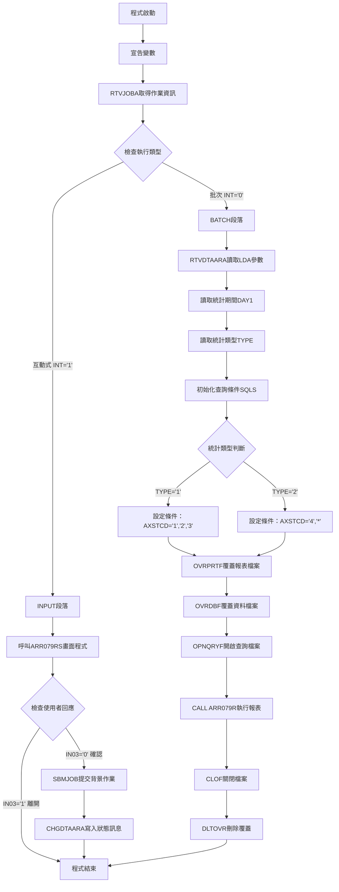

# ARR079P_P02 程式規格書

## 1. 基本資料

| 項目 | 內容 |
|------|------|
| **程式編號** | ARR079P |
| **程式名稱** | 應收帳管帳款彙總報表作業 |
| **程式類型** | CLP (Control Language Program) |
| **廠區** | P02 |
| **系統名稱** | 應收帳款管理系統 |
| **子系統** | 應收帳款統計報表處理 |
| **檔案位置** | P02CLSRC_THSRC/ARR079P.txt |

## 2. 🎯 程式功能說明

### 主要功能
ARR079P為P02廠區的應收帳管帳款彙總報表程式，具備以下功能：

1. **雙模式執行**：支援互動式輸入和批次背景執行
2. **統計期間設定**：提供4個統計期間的彈性設定機制
3. **分類統計**：根據統計類型進行不同的資料篩選
4. **帳齡分析**：按統計期間進行帳齡分析統計
5. **158欄報表**：產生標準158欄位的詳細統計報表
6. **後台處理**：互動式模式下自動提交背景作業

### 🎯 業務流程詳細說明



### 統計期間處理邏輯
程式支援4個統計期間的彈性設定：
- **期間1**：從起始日到第一個分界點
- **期間2**：從第一個分界點到第二個分界點  
- **期間3**：從第二個分界點到第三個分界點
- **期間4**：從第三個分界點以後的所有資料

### 統計類型分類機制
- **類型1**：一般發票統計（AXSTCD='1','2','3'）
- **類型2**：作廢及其他（AXSTCD='4','*'）

## 3. 🎯 檔案架構與關聯圖

### 使用檔案清單

| 檔案名稱 | 檔案類型 | 用途說明 | 存取方式 |
|---------|---------|---------|---------|
| ARSTTX | 資料檔案 | 應收統計交易主檔 | 查詢讀取 |
| ARR079S | 畫面檔案 | 使用者輸入畫面定義 | 顯示檔案 |
| ARR079T | 報表檔案 | 158欄報表格式定義 | 輸出檔案 |
| ARSAID | 資料檔案 | 業務員基本資料檔 | 讀取檔案 |
| CBCUST | 資料檔案 | 客戶基本資料檔 | 讀取檔案 |

### 🎯 檔案關聯詳細視覺化圖表



### 🎯 資料流向詳細說明

#### 互動式處理階段資料流向


#### 批次處理階段資料流向


## 4. 🎯 檔案欄位規格說明

### 主要資料結構

#### ARSTTX檔案結構（應收統計交易檔）
| 欄位名稱 | 位置 | 長度 | 型態 | 說明 |
|---------|------|------|------|------|
| AXCUNO | 1-6 | 6 | 字元 | 客戶編號 |
| AXORNO | 1-6 | 6 | 字元 | 訂單編號 |
| AXSAID | 1-2 | 2 | 字元 | 出貨業務 |
| AXRVID | 1-2 | 2 | 字元 | 營收業務 |
| AXDEPT | 1-4 | 4 | 字元 | 部門編號 |
| AXTXCD | 1-4 | 4 | 字元 | 交易代碼 |
| AXTXNO | 1-8 | 8 | 字元 | 特殊編號 |
| AXTXDT | 1-8 | 8 | 數值 | 特殊日期 |
| AXTXAM | 1-11 | 11 | 數值 | 出貨金額 |
| AXINNO | 1-10 | 10 | 字元 | 發票編號 |
| AXAPNO | 1-6 | 6 | 字元 | 應付憑證 |
| AXRVNO | 1-6 | 6 | 字元 | 營收憑證 |
| AXRVDT | 1-8 | 8 | 數值 | 營收日期 |
| AXRVLD | 1-8 | 8 | 數值 | 營收最後兌現日 |
| AXORLD | 1-8 | 8 | 數值 | 出貨最後兌現日 |
| AXINRT | 1-6 | 6 | 數值 | 發票兌現率 |
| AXDELY | 1-5 | 5 | 數值 | 延遲天數 |
| AXINAM | 1-11 | 11 | 數值 | 發票金額 |
| AXINDU | 1-5 | 5 | 數值 | 發票帳齡 |
| AXSTCD | 1 | 1 | 字元 | 狀態代碼 |
| AXRESV | 1-10 | 10 | 字元 | 保留欄位 |

### 🔍 重點欄位切割技術詳解

#### **DS結構完整分析**

**1. LDA本機資料區切割結構**

```
*LDA (1024字元)：[XXXX|XXXX|XXXX|XXXX|X|........................|xxxxxxxxxxxxxxxxxxxxxxxxxxxxxxxxxxxxxxxxxxxxxxxxxxxxxxxxxxxxxxxxxxxxxx]
位置:             001  005  009  013  017                      601                                                                  670
                   ↓    ↓    ↓    ↓    ↓                        ↓                                                                    ↓
位置001-004:     [XXXX]                                                     第一統計期間起始日
位置005-008:         [XXXX]                                                 第二統計期間起始日  
位置009-012:             [XXXX]                                             第三統計期間起始日
位置013-016:                 [XXXX]                                         第四統計期間起始日
位置017:                         [X]                                        統計類型（1或2）
位置601-670:                             [xxxxxxxxxxxxxxxxxxxxxxxxxxxxxxxxxxxxxxxxxxxxxxxxxxxxxxxxxxxxxxxxxxxxxx]  處理狀態訊息區
```

#### **欄位切割視覺化展示**

**2. 報表程式日期資料結構切割（D#UDAT）**

```
D#UDAT (8字元)：[XXXX|XX|XX]
                 ↓    ↓  ↓
D#UYY (4字元)： [XXXX]        年份部分
D#UMM (2字元)：     [XX]      月份部分
D#UDD (2字元)：        [XX]   日期部分
D#UYM (6字元)： [XXXXXX]      年月組合
```

**切割對應關係詳細說明：**
```
原始系統日期：    20241228
                  ↓ ↓ ↓ ↓ ↓ ↓ ↓ ↓
位置1-4 D#UYY：  [2024]        → 年份：2024
位置5-6 D#UMM：      [12]      → 月份：12
位置7-8 D#UDD：        [28]    → 日期：28
位置1-6 D#UYM：  [202412]      → 年月：202412
```

**3. 查詢條件動態組合切割結構**

```
&W#SQLS (50字元)：[xxxxxxxxxxxxxxxxxxxxxxxxxxxxxxx|xxxxxxxxxxxxx|xxxxxxxxxxxx]
                   ↓                               ↓             ↓
基本狀態條件:     [AXSTCD *EQ %VALUES("1" "2" "3")] *AND         統計類型1篩選條件
日期篩選條件:                                     [AXINDU *GE]   帳齡大於等於條件  
排除空白條件:                                                   [AXTXCD *NE]  排除空白交易代碼
```

**實際條件組合範例：**
```
類型1完整條件：
AXSTCD *EQ %VALUES("1" "2" "3") *AND AXINDU *GE 61 *AND AXTXCD *NE "    "
↓                               ↓                   ↓
[狀態碼為1,2,3的記錄]            [帳齡大於等於61天]   [排除空白交易代碼]

類型2完整條件：  
AXSTCD *EQ %VALUES("4" "*") *AND AXINDU *GE 61 *AND AXTXCD *NE "    "
↓                           ↓                   ↓
[狀態碼為4或*的記錄]         [帳齡大於等於61天]   [排除空白交易代碼]
```

**4. 統計期間範圍切割處理**

```
統計期間範圍計算切割：
U#DAY1=61, U#DAY2=91, U#DAY3=121, U#DAY4=151

期間1範圍：[61 ---|--- 90]
期間2範圍：     [91 ---|--- 120]  
期間3範圍：          [121 ---|--- 150]
期間4範圍：               [151 ---|--- ∞]
            ↓        ↓         ↓        ↓
R#TA1B=61  R#TA1E=90  R#TA2B=91  R#TA2E=120  R#TA3B=121  R#TA3E=150  R#TA4B=151
```

**期間對應的視覺化切割：**
```
帳齡天數軸：[000|....|061|....|091|....|121|....|151|....]
             ↓         ↓         ↓         ↓         ↓
分類結果：   [不統計]   [期間1]   [期間2]   [期間3]   [期間4]
統計變數：             R#AMTA    R#AMTB    R#AMTC    R#AMTD
```

### 🎯 欄位挪用詳細分析

#### AXSTCD狀態代碼挪用分析

**原始設計 vs 實際挪用視覺化對比：**

```
AXSTCD欄位 (1字元)：[X]
                    ↓
原始定義值範圍：['1'|'2'|'3'|'4'|'*']
                 ↓   ↓   ↓   ↓   ↓
原始業務意義：   開立 應收 營收 兌現 多重
                發票 帳款 憑證 相關 營收

實際挪用重新分組：
                [統計類型1群組] [統計類型2群組]
                      ↓              ↓
                ['1'|'2'|'3']    ['4'|'*']
                      ↓              ↓
                 一般發票統計     作廢及其他統計
```

**挪用情況對比表：**
| 狀態碼 | 原始設計 | 實際使用 | 挪用方式 | 挪用原因 |
|-------|---------|---------|---------|---------|
| '1' | 開立發票 | 一般發票統計群組 | 統計歸類重組 | 業務邏輯分類需要 |
| '2' | 應收帳款 | 一般發票統計群組 | 統計歸類重組 | 統計歸類一致性 |
| '3' | 營收憑證 | 一般發票統計群組 | 統計歸類重組 | 報表分組要求 |
| '4' | 兌現相關 | 作廢及其他群組 | 統計歸類重組 | 特殊狀態區分 |
| '*' | 多重營收 | 作廢及其他群組 | 統計歸類重組 | 異常狀態處理 |

**挪用邏輯流程視覺化：**
```
ARSTTX記錄 → 讀取AXSTCD → 判斷統計類型 → 套用篩選條件 → 統計分組

記錄1: AXSTCD='1' → [統計類型1] → AXSTCD *EQ %VALUES("1" "2" "3") → ✅包含
記錄2: AXSTCD='2' → [統計類型1] → AXSTCD *EQ %VALUES("1" "2" "3") → ✅包含  
記錄3: AXSTCD='3' → [統計類型1] → AXSTCD *EQ %VALUES("1" "2" "3") → ✅包含
記錄4: AXSTCD='4' → [統計類型2] → AXSTCD *EQ %VALUES("4" "*")     → ✅包含
記錄5: AXSTCD='*' → [統計類型2] → AXSTCD *EQ %VALUES("4" "*")     → ✅包含
```

#### AXINNO發票編號特殊處理

**發票編號切割邏輯視覺化：**

```
AXINNO (10字元)：[XX|XXXXXXXX]
                  ↓  ↓
W#INN1 (2字元)： [XX]         發票編號前兩碼識別
W#INN2 (8字元)：   [XXXXXXXX] 發票編號後八碼序號
```

**特殊發票編號篩選條件視覺化：**

```
測試發票編號篩選邏輯：

發票編號: QW59292664
          ↓ ↓      ↓
W#INN1:  [QW]      → 前兩碼判斷
W#INN2:    [59292664] → 後八碼判斷 → ✅符合排除條件 → W#TEST=0

發票編號: QW59292954  
          ↓ ↓      ↓
W#INN1:  [QW]      → 前兩碼判斷
W#INN2:    [59292954] → 後八碼判斷 → ✅符合排除條件 → W#TEST=0

訂單編號: K03076
          ↓
AXORNO:  [K03076]  → 直接判斷 → ✅符合排除條件 → W#TEST=0
```

**排除邏輯流程圖：**
```
讀取AXINNO → 切割前兩碼W#INN1 → 判斷='QW'? → Yes → 切割後八碼W#INN2 → 判斷特定值? → Yes → 設定W#TEST=0
               ↓                    ↓ No                           ↓ No           ↓ No
               讀取AXORNO → 判斷='K03076'? → Yes → 設定W#TEST=0 → 正常處理 → 正常處理
                           ↓ No
                           正常處理
```

### 重要變數定義表

| 變數名稱 | 型態 | 長度 | 用途說明 |
|---------|------|------|---------|
| &INT | CHAR | 1 | 執行模式指示器（0=批次，1=互動） |
| &OUTQ | CHAR | 10 | 輸出佇列名稱 |
| &USER | CHAR | 10 | 使用者編號 |
| &IN03 | LGL | 1 | F3離開指示器 |
| &W#SQLS | CHAR | 50 | 動態查詢條件字串 |
| &W#DAY1 | CHAR | 4 | 第一統計期間起始日 |
| &W#TYPE | CHAR | 1 | 統計類型選擇 |

## 5. 🎯 輸出/入螢幕布局

### 畫面布局完整視覺化

```
+----------------------------------------------------------+
|                 ARR079S         東鋼鐵股份有限公司   日期|
+----------------------------------------------------------+
|                應收帳管帳款彙總報表                       |
+----------------------------------------------------------+
|                                                          |
|                    統計期間一: [____] 以上               |
|                                                          |
|                    統計期間二: [____] 到前一天以上       |
|                                                          |
|                    統計期間三: [____] 以上               |
|                                                          |
|                    統計期間四: [____] 以上               |
|                                                          |
|                    統計類型: [_]                         |
|                              (1=一般發票 2=作廢及其他)    |
|                                                          |
|                                                          |
|                                                          |
|                                                          |
|                                                          |
| F3=離開  F12=取消                                        |
+----------------------------------------------------------+
```

### 🎯 畫面欄位詳細說明

| 欄位名稱 | 位置 | 長度 | 型態 | 屬性 | 說明 |
|---------|------|------|------|------|------|
| S#DAY1 | 6,33 | 4 | 數值 | 輸入 | 統計期間一起始日 |
| S#DAY2 | 8,33 | 4 | 數值 | 輸入 | 統計期間二起始日 |
| S#DAY3 | 10,33 | 4 | 數值 | 輸入 | 統計期間三起始日 |
| S#DAY4 | 12,33 | 4 | 數值 | 輸入 | 統計期間四起始日 |
| S#TYPE | 14,33 | 1 | 字元 | 輸入 | 統計類型選擇 |
| S#COMP | 1,23 | 35 | 字元 | 顯示 | 公司名稱 |
| S#DEVI | 2,70 | 10 | 字元 | 顯示 | 裝置名稱 |

### 🎯 畫面控制邏輯

#### 指示器控制說明
- **51號指示器**：統計期間一驗證錯誤時亮起
- **52號指示器**：統計期間二驗證錯誤時亮起  
- **53號指示器**：統計期間三驗證錯誤時亮起

#### 欄位顯示屬性
- **必填欄位**：S#DAY1, S#DAY2, S#DAY3, S#DAY4, S#TYPE
- **預設值**：統計期間預設為61, 91, 121, 151天
- **輸入格式**：數值欄位支援4位數字輸入
- **錯誤醒目**：錯誤欄位以PC RI屬性醒目顯示

### 功能鍵詳細定義

| 功能鍵 | 功能說明 | 系統行為 |
|-------|---------|---------|
| **F3** | 離開程式 | 設定*IN03='1'，程式結束 |
| **F12** | 取消操作 | 設定*IN12='1'，程式結束 |
| **Enter** | 確認執行 | 驗證輸入後提交背景作業 |

### 操作流程
1. **畫面顯示**：系統顯示預設的統計期間值
2. **參數輸入**：使用者修改統計期間和選擇統計類型
3. **輸入驗證**：系統驗證期間大小關係的合理性
4. **確認執行**：按Enter鍵確認並提交背景作業
5. **作業提交**：系統提交背景作業並顯示確認訊息

## 6. 🎯 處理流程程序說明

### 🎯 主程序邏輯深度分析

#### 程式執行流程圖


#### 🎯 詳細處理步驟逐一分析

**步驟1：程式啟動與變數宣告**
```
1. PGM宣告程式開始
2. DCL宣告8個程式變數：
   - &INT：執行模式判斷
   - &OUTQ：輸出佇列名稱  
   - &USER：使用者編號
   - &IN03：F3離開指示器
   - &W#SQLS：查詢條件字串
   - &W#DAY1：統計期間起始日
   - &W#TYPE：統計類型選擇
```

**步驟2：執行環境檢查**
```
RTVJOBA OUTQ(&OUTQ) TYPE(&INT) USER(&USER)
- 取得輸出佇列名稱存入&OUTQ
- 取得執行類型存入&INT（0=批次，1=互動）
- 取得使用者編號存入&USER
```

**步驟3：執行模式分流處理**
```
IF COND(&INT *EQ '0') THEN(GOTO BATCH)
- &INT='0'：跳轉至BATCH批次處理段落
- &INT='1'：繼續執行INPUT互動處理段落
```

**步驟4A：互動式處理邏輯（INPUT段落）**
```
4A.1 呼叫畫面程式：
     CALL PGM(ARR079RS) PARM(&IN03)
     - 傳遞&IN03參數至畫面程式
     - 等待使用者輸入統計期間

4A.2 檢查使用者回應：
     IF COND(&IN03 *EQ '1') THEN(RETURN)
     - &IN03='1'：使用者按F3離開，程式結束
     - &IN03='0'：使用者確認執行，繼續處理

4A.3 提交背景作業：
     SBMJOB JOB(ARR079P) JOBD(ARJOBD) OUTQ(&OUTQ) RQSDTA('CALL ARR079P')
     - 建立背景作業ARR079P
     - 使用ARJOBD作業描述
     - 輸出至使用者指定佇列

4A.4 寫入狀態訊息：
     CHGDTAARA DTAARA(*LDA (601 70)) VALUE('應收帳管帳款彙總報表已送入批次處理')
     - 在LDA位置601-670寫入處理狀態訊息
```

**步驟4B：批次處理邏輯（BATCH段落）**
```
4B.1 讀取LDA參數：
     RTVDTAARA DTAARA(*LDA (1 4)) RTNVAR(&W#DAY1)
     RTVDTAARA DTAARA(*LDA (17 1)) RTNVAR(&W#TYPE)
     - 從LDA讀取統計期間起始日
     - 從LDA讀取統計類型選擇

4B.2 初始化查詢條件：
     CHGVAR VAR(&W#SQLS) VALUE(' ')
     - 清空查詢條件變數

4B.3 組建查詢條件：
     TYPE='1': 'AXSTCD *EQ %VALUES("1" "2" "3") *AND'
     TYPE='2': 'AXSTCD *EQ %VALUES("4" "*") *AND'

4B.4 設定檔案覆蓋：
     OVRPRTF FILE(ARR079T) PAGESIZE(*N 198) CPI(15) HOLD(*YES)
     OVRDBF FILE(ARSTTX) TOFILE(DALIB/ARSTTX) SHARE(*YES)

4B.5 開啟查詢檔案：
     OPNQRYF FILE(ARSTTX) QRYSLT(&W#SQLS + 'AXINDU *GE ' + &W#DAY1 + ' *AND AXTXCD *NE "    "')
     KEYFLD((AXDEPT) (AXRVID) (AXCUNO) (AXORNO) (AXINNO))

4B.6 執行報表程式：
     CALL ARR079R
     - 執行實際的報表產生邏輯

4B.7 清理環境：
     CLOF OPNID(ARSTTX)
     DLTOVR *ALL
```

#### 業務邏輯深度解析

**1. 統計類型分類邏輯**
- **類型1（一般發票）**：包含開立發票、應收帳款、營收憑證
- **類型2（作廢及其他）**：包含兌現相關、多重營收等特殊狀態

**2. 查詢條件動態組合**
- 基本條件：AXSTCD狀態碼篩選
- 日期條件：AXINDU >= &W#DAY1（帳齡大於等於起始日）
- 排除條件：AXTXCD <> "    "（排除空白交易代碼）

**3. 檔案排序策略**
- 主要排序：AXDEPT（部門編號）
- 次要排序：AXRVID（營收業務）
- 第三排序：AXCUNO（客戶編號）
- 第四排序：AXORNO（訂單編號）
- 第五排序：AXINNO（發票編號）

#### 條件判斷詳細說明

**1. 執行模式判斷**
```
COND(&INT *EQ '0')
- 條件成立：作業為批次執行，跳轉至BATCH處理
- 條件不成立：作業為互動執行，繼續INPUT處理
```

**2. 使用者回應判斷**
```
COND(&IN03 *EQ '1')  
- 條件成立：使用者按F3或F12離開，程式結束
- 條件不成立：使用者確認執行，提交背景作業
```

**3. 統計類型判斷**
```
COND(&W#TYPE *EQ '1')：設定一般發票篩選條件
COND(&W#TYPE *EQ '2')：設定作廢及其他篩選條件
```

### 🎯 子程序邏輯分析

#### ARR079RS畫面程式邏輯
```
主要功能：
1. SR0000：畫面初始化，設定預設統計期間
2. SR1000：畫面顯示與使用者互動
3. SR1100：輸入參數驗證

驗證邏輯：
- S#DAY1 >= S#DAY2：錯誤，設定51號指示器
- S#DAY2 >= S#DAY3：錯誤，設定52號指示器  
- S#DAY3 >= S#DAY4：錯誤，設定53號指示器

參數傳遞：
- 驗證通過：將輸入值存入UDS，傳回P#IN03='0'
- 驗證失敗：顯示錯誤訊息，重新輸入
```

#### ARR079R報表程式邏輯
```
主要功能：
1. INISR：報表初始化，設定統計期間範圍
2. DTLSR：明細處理，按期間累加金額
3. L1SR：客戶小計，輸出客戶統計明細
4. LRSR：總計處理，輸出報表總計

統計邏輯：
- 按AXINDU帳齡分配到4個統計期間
- 累加AXINAM發票金額到對應期間
- 產生客戶別、期間別的詳細統計
```

## 7. 🎯 數據操作與轉換分析

### 檔案操作詳解

#### ARSTTX檔案存取邏輯
```
存取方式：OPNQRYF查詢檔案開啟
篩選條件：
1. AXSTCD狀態碼篩選（依統計類型）
2. AXINDU帳齡篩選（大於等於起始日）
3. AXTXCD交易代碼非空白
4. 索引鍵值排序存取

讀取流程：
1. 開啟查詢檔案並套用篩選條件
2. 依排序鍵值循序讀取記錄
3. 傳遞給ARR079R進行統計處理
4. 處理完成後關閉檔案
```

#### 報表檔案輸出邏輯
```
輸出格式：ARR079T 158欄標準報表
輸出屬性：
- PAGESIZE(*N 198)：不限頁數，198字元寬度
- CPI(15)：15字元/英吋字型密度
- HOLD(*YES)：暫存報表供使用者檢視
- USRDTA('填移傳票')：使用者資料標識
```

### 數據轉換邏輯

#### 日期格式轉換
```
系統日期處理：
1. *DATE系統日期減去19000000得到U#SYSD
2. 切割為年月日分量：D#UYY, D#UMM, D#UDD
3. 月份減1處理跨年邏輯：
   - D#UMM-1 = 0時，設定為12月，年份減1
4. 組合為年月格式T#YYMM供報表使用
```

#### 統計期間轉換
```
期間範圍計算：
- R#TA1B = U#DAY1（期間1起始）
- R#TA1E = U#DAY2-1（期間1結束）
- R#TA2B = U#DAY2（期間2起始）  
- R#TA2E = U#DAY3-1（期間2結束）
- R#TA3B = U#DAY3（期間3起始）
- R#TA3E = U#DAY4-1（期間3結束）
- R#TA4B = U#DAY4（期間4起始）
```

#### 金額累加轉換
```
帳齡分類統計：
- AXINDU < U#DAY2：累加至R#AMTA（期間1金額）
- AXINDU < U#DAY3：累加至R#AMTB（期間2金額）
- AXINDU < U#DAY4：累加至R#AMTC（期間3金額）
- AXINDU >= U#DAY4：累加至R#AMTD（期間4金額）
- 總計：R#AMTE = R#AMTA + R#AMTB + R#AMTC + R#AMTD
```

### 計算邏輯分析

#### 統計類型查表處理
```
TAB1查表邏輯：
1. 使用U#TYPE作為查表鍵值
2. LOOKUP TAB1尋找對應的統計類型說明
3. 找到時設定69號指示器，取得R#TYPE說明文字
4. TAB1內容：
   - '1'：'一般發票'
   - '2'：'作廢及其他'  
   - '3'：'一般發票及作廢'
```

#### 客戶資料關聯處理
```
客戶名稱取得：
1. 使用AXCUNO客戶編號CHAIN CBCUST檔案
2. 成功時取得CBCUNM客戶名稱存入R#CUNM
3. 失敗時R#CUNM保持空白

業務員名稱取得：
1. 使用R#RVID營收業務編號CHAIN ARSAID檔案  
2. 成功時取得SANAME業務員名稱存入R#RVNM
3. 失敗時R#RVNM保持空白
```

### 檢核機制詳解

#### 畫面輸入檢核
```
期間大小關係檢核：
1. S#DAY1 >= S#DAY2：期間一不可大於等於期間二
2. S#DAY2 >= S#DAY3：期間二不可大於等於期間三
3. S#DAY3 >= S#DAY4：期間三不可大於等於期間四

錯誤處理：
- 檢核失敗時設定對應指示器（51,52,53）
- 顯示錯誤訊息要求重新輸入
- 清除指示器後重新顯示畫面
```

#### 特殊發票號碼檢核
```
測試發票排除邏輯：
1. 發票編號前2碼='QW'且後8碼='59292664'：設定W#TEST=0
2. 發票編號前2碼='QW'且後8碼='59292954'：設定W#TEST=0
3. 訂單編號='K03076'：設定W#TEST=0

用途：排除測試資料或特殊業務資料不計入統計
```

#### 資料完整性檢核
```
檔案關聯檢核：
1. 客戶編號存在性：CHAIN CBCUST檔案驗證
2. 業務員編號存在性：CHAIN ARSAID檔案驗證
3. 指示器69：成功時OFF，失敗時ON

空值處理：
- AXTXCD交易代碼非空白：排除無效交易記錄
- 客戶名稱：關聯失敗時顯示空白
- 業務員名稱：關聯失敗時顯示空白
```

## 8. 🎯 錯誤處理程序說明

### 🎯 詳細錯誤代碼清冊

| 錯誤代碼 | 錯誤訊息 | 原因說明 | 處理方式 | 預防措施 |
|----------|---------|---------|---------|----------|
| **IN51='1'** | 統計期間一不可大於等於統計期間二！ | 使用者輸入的第一期間值大於或等於第二期間值 | 1. 設定51號指示器醒目顯示錯誤欄位<br>2. 顯示錯誤訊息<br>3. 要求重新輸入正確的期間值 | 在畫面上提供期間設定說明範例 |
| **IN52='1'** | 統計期間二不可大於等於統計期間三！ | 使用者輸入的第二期間值大於或等於第三期間值 | 1. 設定52號指示器醒目顯示錯誤欄位<br>2. 顯示錯誤訊息<br>3. 要求重新輸入正確的期間值 | 提供遞增期間設定的操作指引 |
| **IN53='1'** | 統計期間三不可大於等於統計期間四！ | 使用者輸入的第三期間值大於或等於第四期間值 | 1. 設定53號指示器醒目顯示錯誤欄位<br>2. 顯示錯誤訊息<br>3. 要求重新輸入正確的期間值 | 建議使用預設值或參考歷史設定 |
| **IN69='1'** | 客戶編號不存在於客戶基本檔 | ARSTTX中的AXCUNO在CBCUST檔案中找不到對應記錄 | 1. 客戶名稱欄位顯示空白<br>2. 繼續處理其他記錄<br>3. 在報表上標註資料不完整 | 定期檢查客戶檔案資料完整性 |
| **IN69='1'** | 業務員編號不存在於業務員檔 | R#RVID在ARSAID檔案中找不到對應記錄 | 1. 業務員名稱欄位顯示空白<br>2. 繼續處理其他記錄<br>3. 在報表上標註資料不完整 | 維護業務員檔案資料的時效性 |
| **FILE001** | ARSTTX檔案無法開啟 | 資料檔案被鎖定或路徑不正確 | 1. 檢查檔案是否被其他程式佔用<br>2. 確認DALIB程式庫存在<br>3. 重新嘗試執行 | 確保批次執行時間避開高峰期 |
| **FILE002** | ARR079T報表檔案無法建立 | 報表輸出路徑權限不足或磁碟空間不足 | 1. 檢查輸出佇列狀態<br>2. 確認磁碟空間充足<br>3. 檢查使用者列印權限 | 定期清理舊報表檔案釋放空間 |
| **SYS001** | 背景作業提交失敗 | SBMJOB指令執行失敗 | 1. 檢查ARJOBD作業描述是否存在<br>2. 確認使用者具備作業提交權限<br>3. 檢查系統資源狀況 | 確保ARJOBD正確設定且可用 |
| **USER001** | 使用者取消操作 | 使用者按F3或F12離開程式 | 1. 設定P#IN03='1'<br>2. 正常結束程式<br>3. 不產生任何輸出 | 在畫面上明確標示功能鍵用途 |
| **NET001** | 程式庫連線失敗 | 無法連線到DALIB資料程式庫 | 1. 檢查程式庫是否存在<br>2. 確認網路連線狀態<br>3. 聯繫系統管理員 | 監控系統程式庫可用性 |

### 🎯 系統異常處理邏輯

#### 檔案操作失敗處理
```
ARSTTX檔案開啟失敗：
1. OVRDBF失敗時程式異常結束
2. OPNQRYF失敗時程式異常結束  
3. 查詢條件語法錯誤時顯示錯誤訊息

錯誤恢復機制：
1. DLTOVR *ALL：清除所有檔案覆蓋
2. 釋放檔案資源
3. 記錄錯誤日誌供後續分析
```

#### 程式調用失敗處理
```
ARR079RS調用失敗：
1. 檢查畫面程式是否存在
2. 確認程式庫清單設定正確
3. 傳回錯誤狀態給調用程式

ARR079R調用失敗：
1. 檢查報表程式是否存在
2. 確認報表檔案定義正確
3. 清理已開啟的檔案資源
```

#### 資料完整性錯誤處理
```
LDA參數讀取失敗：
1. 使用預設的統計期間值
2. 記錄警告訊息
3. 繼續執行但標註使用預設值

查詢條件組合錯誤：
1. 檢查&W#TYPE值的有效性
2. 預設使用類型1的查詢條件
3. 記錄異常狀況供分析
```

#### 並發控制失敗處理
```
檔案被鎖定處理：
1. 等待檔案釋放（最多重試3次）
2. 顯示檔案忙碌訊息
3. 建議稍後重新執行

記錄衝突處理：
1. 跳過被鎖定的記錄
2. 在報表上標註記錄不完整
3. 記錄跳過的記錄數量
```

## 9. 🎯 備註

### 🎯 特殊注意事項

#### 統計期間設定邏輯
- 統計期間必須按照遞增順序設定，系統會自動驗證期間大小關係
- 期間值代表帳齡天數，用於AXINDU欄位的比較篩選
- 預設期間值（61, 91, 121, 151）已針對一般業務需求最佳化

#### LDA使用規範
- 位置1-16：統計期間參數存放區，由畫面程式寫入
- 位置17：統計類型參數，控制查詢條件的組合方式  
- 位置601-670：狀態訊息區，用於背景作業狀態通知

#### 檔案存取特性
- ARSTTX使用SHARE(*YES)允許多使用者同時查詢
- 報表檔案使用HOLD(*YES)暫存於輸出佇列供檢視
- 查詢檔案採用複合索引鍵確保資料排序的一致性

#### 統計類型差異
- 類型1涵蓋正常營運的發票統計，適用於日常管理報表
- 類型2包含異常狀態的發票，主要用於稽核和特殊分析
- 查詢條件動態組合確保統計範圍的準確性

#### 報表格式規範
- 158欄寬度設計適用於A3橫向列印輸出
- CPI(15)字型密度確保資料完整顯示在標準報表紙張上
- 帳齡分析採用4期間設計符合財務管理的標準需求

#### 背景作業處理
- 互動式模式自動提交背景作業避免長時間等待
- 使用ARJOBD作業描述確保背景執行環境的一致性
- 狀態訊息寫入LDA提供使用者即時的處理回饋

#### 特殊資料處理
- 程式內建測試發票編號的排除邏輯
- 對特定訂單編號進行特殊標記處理
- 空白交易代碼記錄自動排除確保統計品質

#### 客戶資料關聯
- 自動關聯客戶基本檔取得完整客戶資訊
- 關聯失敗時顯示空白但不中斷統計處理
- 業務員資訊同步關聯提供完整的業務分析維度 