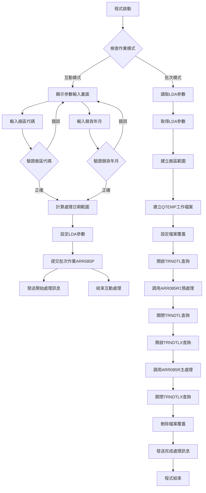
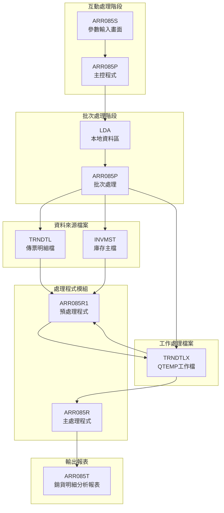
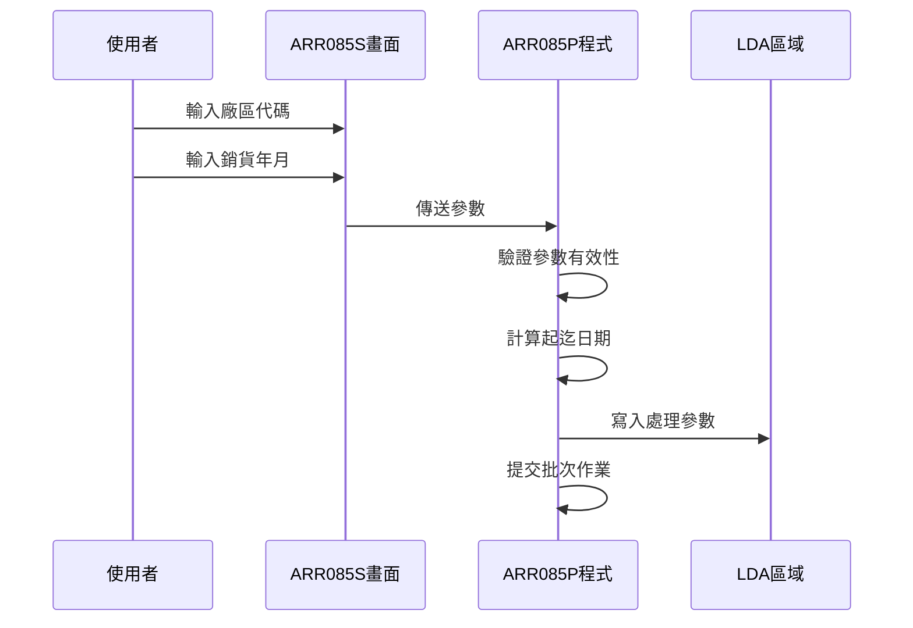
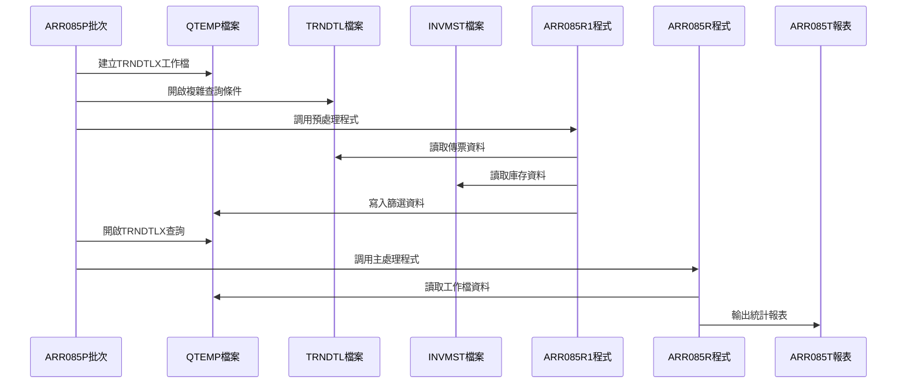
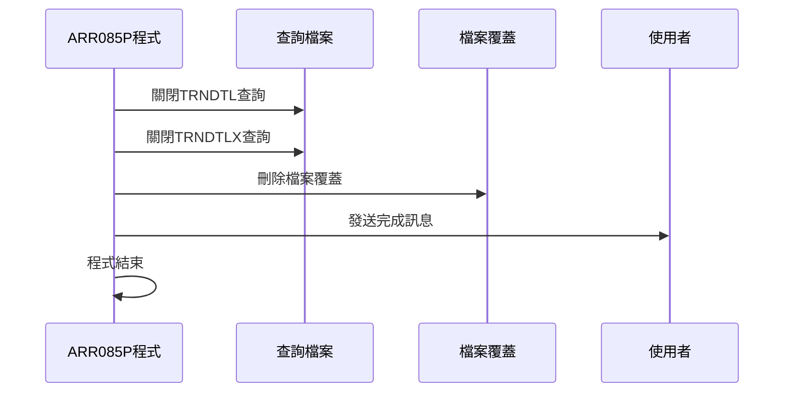
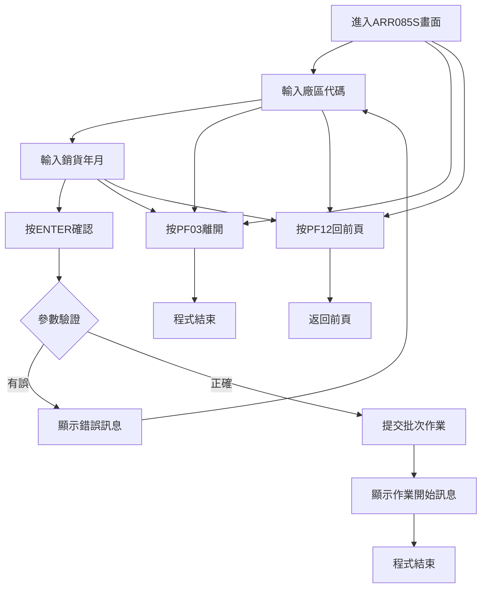
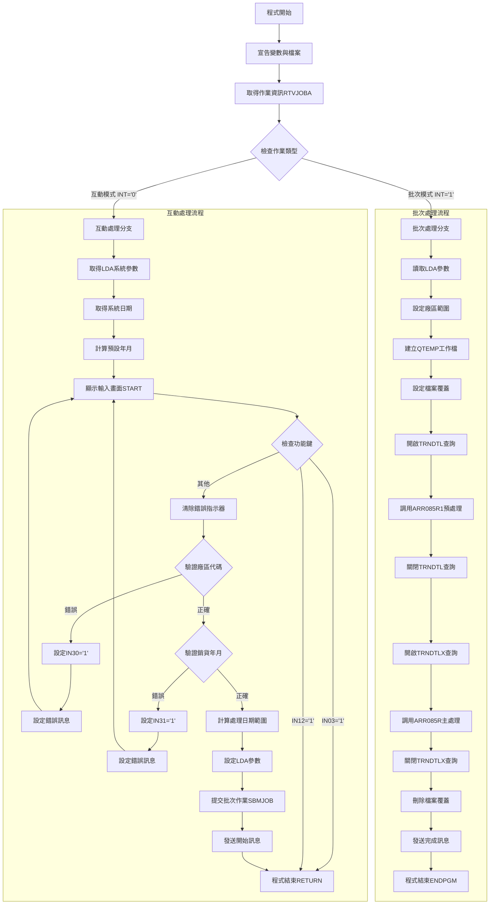
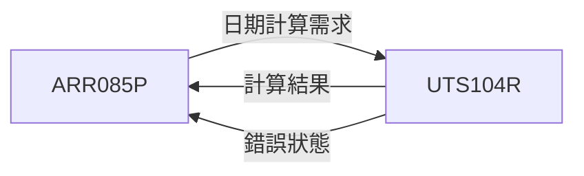

# ARR085P_P02 程式規格書

## 1. 基本資料

| 項目 | 內容 |
|------|------|
| **程式編號** | ARR085P |
| **程式名稱** | 銷貨明細分析報表作業 |
| **程式類型** | CLP |
| **廠區** | P02 |
| **系統名稱** | 應收帳款系統 |
| **子系統** | 應收帳款報表模組 |
| **檔案位置** | 東鋼list/ARR085P_P02.txt |

## 2. 🎯 程式功能說明

### 主要功能描述
ARR085P程式是銷貨明細分析報表產生作業，負責統計特定月份內的銷貨傳票資料與發票開立記錄的詳細對照分析。程式會針對不同廠區產生銷貨明細統計報表，包含客戶資料、傳票資料、發票資料及相關金額統計。

### 🎯 業務流程詳細說明

#### 完整業務流程圖


#### 業務流程關鍵階段說明

**第一階段：參數設定與驗證**
- 接收使用者輸入的廠區代碼（S#AREA），支援T、U、H、M、K、D、V、Q、R、N等廠區
- 驗證廠區代碼的有效性
- 接收使用者輸入的銷貨年月（S#YYMM）
- 驗證銷貨年月不可為0

**第二階段：日期計算處理**
- 將輸入年月轉換為完整日期格式
- 調用UTS104R程式計算月份的起始和結束日期
- 建立查詢用的日期範圍（DATES到DATEE）

**第三階段：批次作業提交**
- 將參數寫入LDA（Local Data Area）
- 提交批次作業到ARJOBD作業描述
- 發送作業開始處理的通知訊息

**第四階段：資料預處理**
- 建立QTEMP暫存檔案TRNDTLX
- 設定TRNDTL傳票明細檔的複雜查詢條件
- 調用ARR085R1程式進行資料篩選與預處理
- 將符合條件的資料寫入TRNDTLX工作檔

**第五階段：報表產生與輸出**
- 開啟TRNDTLX工作檔案查詢
- 調用ARR085R程式進行主要報表處理
- 產生ARR085T銷貨明細分析報表
- 發送作業完成的通知訊息

#### 多層次驗證機制
- 廠區代碼多值驗證（支援10個不同廠區代碼）
- 銷貨年月格式驗證和邏輯驗證
- 日期計算結果驗證
- 檔案操作狀態驗證

#### 智能處理邏輯
- 自動判斷互動與批次執行模式
- 動態建立廠區查詢範圍
- 兩階段處理：預處理篩選+主處理統計
- 複雜查詢條件動態組合

#### 資料一致性確保機制
- 參數驗證確保資料正確性
- 工作檔案重新建立確保初始狀態一致
- 複雜查詢條件確保資料精確性
- 分階段處理確保資料完整性

## 3. 🎯 檔案架構與關聯圖

### 使用檔案清單

| 檔案名稱 | 檔案類型 | 用途說明 | 存取方式 |
|----------|----------|----------|----------|
| ARR085S | 螢幕檔案 | 參數輸入畫面 | 輸入輸出 |
| TRNDTL | 資料檔案 | 傳票明細檔 | 查詢讀取 |
| TRNDTLX | 工作檔案 | 傳票明細工作檔 | 更新處理 |
| INVMST | 資料檔案 | 庫存主檔 | 查詢讀取 |
| ARR085T | 報表檔案 | 銷貨明細分析報表 | 列印輸出 |

### 🎯 檔案關聯詳細視覺化圖表



### 🎯 資料流向詳細說明

#### 環境準備階段的資料流向


#### 業務處理階段的資料流向


#### 環境清理階段的資料流向


## 4. 🎯 檔案欄位規格說明

### 主要資料結構

#### ARR085S 螢幕檔案欄位
| 欄位名稱 | 類型 | 長度 | 位置 | 說明 |
|----------|------|------|------|------|
| U#DATE | DEC | 8,0 | 1,2 | 系統日期 |
| S#COMP | CHAR | 35 | 1,23 | 公司名稱 |
| S#DEVI | CHAR | 10 | 2,70 | 設備代號 |
| S#AREA | CHAR | 1 | 7,43 | 廠區代碼 |
| S#YYMM | DEC | 6,0 | 18,43 | 銷貨年月 |
| S#ERR | CHAR | 70 | 23,2 | 錯誤訊息 |

#### TRNDTLX 工作檔案欄位
| 欄位名稱 | 類型 | 長度 | 說明 |
|----------|------|------|------|
| TXCODE | CHAR | 4 | 傳票代碼 |
| TXNO | CHAR | 8 | 傳票編號 |
| TXITEM | DEC | 3,0 | 傳票項次 |
| TXCUNO | CHAR | 6 | 客戶編號 |
| TXCUNM | CHAR | 10 | 客戶名稱 |
| TXDATE | DEC | 8,0 | 傳票日期 |
| TXORNO | CHAR | 6 | 訂單編號 |
| TXPDNM | CHAR | 5 | 品名 |
| TXUPRC | DEC | 5,2 | 單價 |
| TXQTY | DEC | 7,0 | 數量 |
| TXAMT | DEC | 11,0 | 金額 |
| TXIVNO | CHAR | 10 | 發票編號 |
| TXACDT | DEC | 8,0 | 會計日期 |
| TXTXAR | CHAR | 1 | 廠區代碼 |
| TXTAX | DEC | 11,0 | 稅額 |
| TXPCNO | CHAR | 8 | 入庫單號 |

### 🔍 重點欄位切割技術詳解

#### DS結構完整分析

**程式中主要DS結構定義**：

```
1. 日期處理結構（ARR085R1程式）:
   DS
    1  80 D#DATE       ← 完整日期處理區（80字元）
    1  60 D#DAT1       ← 日期部分1（前60字元）

2. 傳票編號分析結構:
   DS
    1   8 D#NO         ← 完整傳票編號（8字元）
    1   1 D#AREA       ← 廠區代碼（第1字元）
    1   6 D#TEST       ← 測試用欄位（前6字元）
```

#### 欄位切割視覺化展示

**日期欄位切割對應**：
```
D#DATE (80字元)：[YYYYMMDD................................................]
                  ↓
D#DAT1 (60字元)：[YYYYMMDD........................................] 日期處理區
```

**傳票編號切割對應**：
```
D#NO (8字元)：   [AXXXXXXX]
                  ↓    ↓
D#AREA (1字元)：  [A]        廠區代碼（第1字元）
D#TEST (6字元)：  [AXXXXX]   測試欄位（前6字元）
```

#### 切割邏輯詳細說明

**日期切割用途**：
- D#DATE：用於完整日期運算和比較
- D#DAT1：提取關鍵日期資訊進行邏輯判斷

**傳票編號切割用途**：
- D#NO：完整傳票編號處理
- D#AREA：提取廠區資訊用於比較
- D#TEST：特殊測試或驗證用途

#### 實際數據範例說明

**日期切割範例**：
```
輸入：D#DATE = "20230501..." + 空白填充至80字元
結果：D#DAT1 = "20230501..." + 空白填充至60字元
```

**傳票編號切割範例**：
```
輸入：D#NO = "P1234567"
結果：D#AREA = "P"（廠區代碼）
      D#TEST = "P12345"（前6字元）
```

### 🎯 欄位挪用詳細分析

#### 挪用情況對比表

| 欄位名稱 | 原始定義 | 實際使用方式 | 挪用說明 |
|----------|----------|-------------|----------|
| TXFL01 | 傳票旗標1 | 傳票編號首位 | 將旗標欄位用來存放傳票編號的第一個字元 |
| TXFL02 | 傳票旗標2 | 入庫單首位 | 將旗標欄位用來存放入庫單號的第一個字元 |
| DATE1 | 日期1 | 傳票日期 | 將通用日期欄位專門用於傳票日期 |
| CHAR2 | 字元2 | 發票編號首位 | 將通用字元欄位用來存放發票編號首位 |
| CHAR4 | 字元4 | 發票編號前6碼 | 將通用字元欄位用來存放發票編號前段 |

#### 挪用原因深度分析

**傳票編號切割挪用（TXFL01）**：
- **原因**：需要按廠區分類處理傳票資料
- **業務邏輯**：不同廠區的傳票編號首位不同，需要分別統計
- **技術考量**：利用現有欄位避免修改檔案結構

**入庫單號切割挪用（TXFL02）**：
- **原因**：需要識別入庫單的廠區來源
- **業務邏輯**：入庫單號首位代表廠區，用於對照分析
- **資料完整性**：確保統計分析的準確性

**查詢條件欄位挪用**：
- **原因**：OPNQRYF需要動態查詢條件
- **業務邏輯**：複雜的多條件查詢需要欄位對應
- **查詢效率**：利用索引欄位提升查詢速度

#### 挪用方式詳細說明

**MAPFLD欄位對應實現**：
```
MAPFLD((TXFL01 '%SST(TXNO 1 1)')           // 傳票編號首位對應
       (TXFL02 '%SST(TXPCNO 1 1)')         // 入庫單號首位對應
       (DATE1 TXDATE *CHAR 8)              // 傳票日期字元化
       (CHAR2 '%SST(TXIVNO 1 1)' *CHAR 1)  // 發票編號首位
       (CHAR4 '%SST(TXIVNO 1 6)' *CHAR 8)) // 發票編號前段
```

**查詢條件動態組合**：
```
QRYSLT條件中使用挪用欄位：
((TXCODE *EQ "SA04") *AND (TXFL01 *GE "廠區起") *AND (TXFL01 *LE "廠區迄"))
```

#### 挪用影響評估

**維護影響**：
- 欄位意義與名稱不符，需要詳細文檔說明
- 查詢條件複雜化，維護人員需要深入理解
- MAPFLD對應關係需要特別維護

**系統整合影響**：
- 其他程式讀取此檔案時需要了解挪用邏輯
- 報表產生需要正確解釋挪用欄位意義
- 資料交換時需要特殊處理挪用對應

### 重要變數定義表

| 變數名稱 | 類型 | 長度 | 用途說明 |
|----------|------|------|----------|
| &DSPID | CHAR | 10 | 顯示設備ID |
| &OUTQ | CHAR | 10 | 輸出佇列名稱 |
| &INT | CHAR | 1 | 互動模式指示器 |
| &QDATE | CHAR | 8 | 系統日期 |
| &C#DATE | CHAR | 6 | 處理日期 |
| &D#DATE | DEC | 8,0 | 數值日期 |
| &DATES | CHAR | 8 | 起始日期 |
| &DATEE | CHAR | 8 | 結束日期 |
| &AREAS | CHAR | 1 | 起始廠區 |
| &AREAE | CHAR | 1 | 結束廠區 |

## 5. 🎯 輸出/入螢幕布局

### 螢幕布局完整視覺化

```
+----------------------------------------------------------+
|107/03/15  東鋼股份有限公司                    ARR085S  |
|08:30:15        銷貨明細分析報表作業                    P02|
+----------------------------------------------------------+
|                                                          |
|                                                          |
|                                                          |
|                                                          |
|                                                          |
|                                                          |
|               廠區代碼：[_] (   T :嘉義                   |
|                                 U :花蓮                   |
|                                 H :高雄                   |
|                                 M :台中                   |
|                                 K :桃園                   |
|                                 D :台東                   |
|                                 V :澎湖                   |
|                                 Q :金門馬祖               |
|                                 R :雲嘉                   |
|                                 N :台北                   |
|                                空白:全部)                 |
|               銷貨年月：[____/__]                         |
|                                                          |
|                                                          |
|                                                          |
|                                                          |
|                                                          |
|[錯誤訊息顯示區域]                                          |
|    PF03:離開            PF12:回到前頁                     |
+----------------------------------------------------------+
```

### 🎯 畫面欄位詳細說明

| 欄位名稱 | 位置 | 長度 | 型態 | 屬性 | 說明 |
|----------|------|------|------|------|------|
| 日期 | 1,2 | 8 | DATE | 顯示 | 系統日期，格式YY/MM/DD |
| 時間 | 2,2 | 8 | TIME | 顯示 | 系統時間，格式HH:MM:SS |
| S#COMP | 1,23 | 35 | CHAR | 顯示 | 公司名稱，從LDA取得 |
| S#DEVI | 2,70 | 10 | CHAR | 顯示 | 設備代號，從LDA取得 |
| S#AREA | 7,43 | 1 | CHAR | 輸入 | 廠區代碼，單一字元 |
| S#YYMM | 18,43 | 6 | DEC | 輸入 | 銷貨年月，格式YYYY/MM |
| S#ERR | 23,2 | 70 | CHAR | 顯示 | 錯誤訊息，高亮度顯示 |

### 🎯 畫面控制邏輯

#### 指示器控制說明
- **IN30**：廠區代碼錯誤時設為'1'，欄位顯示反白+閃爍
- **IN31**：銷貨年月錯誤時設為'1'，欄位顯示反白+閃爍
- **IN03**：PF03按鍵，程式返回離開
- **IN12**：PF12按鍵，程式返回前頁

#### 欄位顯示屬性
- **必填欄位**：S#AREA和S#YYMM為必須輸入欄位
- **錯誤顯示**：錯誤時欄位顯示反白閃爍（DSPATR(RI PC)）
- **提示資訊**：廠區代碼旁顯示完整的廠區對照說明

#### 廠區代碼支援範圍
- **T**：嘉義廠區
- **U**：花蓮廠區  
- **H**：高雄廠區
- **M**：台中廠區
- **K**：桃園廠區
- **D**：台東廠區
- **V**：澎湖廠區
- **Q**：金門馬祖廠區
- **R**：雲嘉廠區
- **N**：台北廠區
- **空白**：全部廠區

### 功能鍵詳細定義

| 功能鍵 | 功能說明 | 處理邏輯 | 系統行為 |
|--------|----------|----------|----------|
| **PF03** | 離開程式 | 設定IN03='1' | 直接結束程式，返回呼叫端 |
| **PF12** | 回到前頁 | 設定IN12='1' | 結束程式，返回前一個程式 |
| **ENTER** | 確認執行 | 驗證輸入參數 | 驗證通過後提交批次作業 |

### 操作流程

#### 畫面間轉換流程


## 6. 🎯 處理流程程序說明

### 🎯 主程序邏輯深度分析

#### 程式執行流程圖


#### 🎯 詳細處理步驟逐一分析

**步驟1：環境初始化處理**
```
RTVJOBA JOB(&DSPID) OUTQ(&OUTQ) TYPE(&INT)
```
- 取得當前作業的顯示設備ID
- 取得輸出佇列名稱
- 取得作業類型（互動='0', 批次='1'）

**步驟2：互動模式參數準備**
```
RTVDTAARA DTAARA(*LDA (951 35)) RTNVAR(&S#COMP)    // 公司名稱
RTVDTAARA DTAARA(*LDA (1011 10)) RTNVAR(&S#DEVI)   // 設備代號
RTVDTAARA DTAARA(*LDA (1021 1)) RTNVAR(&S#AREA)    // 廠區代碼
```
- 從LDA區域取得系統基本參數
- 設定畫面顯示用的預設值

**步驟3：系統日期取得與處理**
```
RTVJOBA CYMDDATE(&QDATE)                            // 取得西元年月日
CHGVAR VAR(&QDATE) VALUE('0' *CAT &QDATE)          // 前補0
CHGVAR VAR(&C#DATE) VALUE(%SST(&QDATE 1 6))        // 取前6碼年月
```
- 取得系統當前日期
- 格式化為YYYYMM格式作為預設年月

**步驟4：預設月份計算**
```
CALL PGM(UTS104R) PARM(&W#LDAY &W#MOD &W#FUN &W#CNT &W#CDAY &W#ERR)
```
- 調用日期計算程式UTS104R
- 計算上個月份作為預設處理年月
- W#MOD='1'（月份模式），W#FUN='1'（往前），W#CNT='0001'（1個月）

**步驟5：廠區代碼驗證處理**
```
IF COND((&S#AREA *NE ' ') *AND (&S#AREA *NE 'T') *AND
        (&S#AREA *NE 'U') *AND (&S#AREA *NE 'H') *AND
        (&S#AREA *NE 'M') *AND (&S#AREA *NE 'D') *AND
        (&S#AREA *NE 'V') *AND (&S#AREA *NE 'Q') *AND
        (&S#AREA *NE 'R') *AND (&S#AREA *NE 'N') *AND
        (&S#AREA *NE 'K')) THEN(DO)
    CHGVAR (&IN30) VALUE('1')                       // 設定錯誤指示器
    CHGVAR (&S#ERR) VALUE('廠區代碼輸入錯誤!')      // 設定錯誤訊息
    GOTO CMDLBL(START)                              // 回到輸入畫面
ENDDO
```
- 驗證廠區代碼是否為有效值
- 支援空白（全部）、T、U、H、M、D、V、Q、R、N、K等廠區

**步驟6：銷貨年月驗證處理**
```
IF COND(&S#YYMM *EQ 0) THEN(DO)
    CHGVAR (&IN31) VALUE('1')                       // 設定錯誤指示器
    CHGVAR (&S#ERR) VALUE('銷貨年月不可為0!')       // 設定錯誤訊息
    GOTO CMDLBL(START)                              // 回到輸入畫面
ENDDO
```
- 檢查銷貨年月是否為0
- 設定錯誤指示器與訊息並重新顯示畫面

**步驟7：QTEMP工作檔案建立**
```
DLTF FILE(QTEMP/TRNDTLX)                            // 刪除既有工作檔
MONMSG MSGID(CPF0000)                               // 監控所有錯誤
CRTDUPOBJ OBJ(TRNDTLX) FROMLIB(DALIB) OBJTYPE(*FILE) TOLIB(QTEMP)
```
- 先刪除可能存在的工作檔案
- 從DALIB複製TRNDTLX檔案結構到QTEMP
- 建立乾淨的工作處理環境

**步驟8：複雜查詢條件設定**
```
OPNQRYF FILE(TRNDTL) QRYSLT('
    (((TXCODE *EQ "SA04") *AND (TXFL01 *GE "' || &AREAS || '") *AND (TXFL01 *LE "' || &AREAE || '")) *OR
     ((TXCODE *EQ "AR05") *AND (TXFL02 *GE "' || &AREAS || '") *AND (TXFL02 *LE "' || &AREAE || '"))) *AND
    (DATE1 *GE "' || &DATES || '") *AND (DATE1 *LE "' || &DATEE || '") *AND
    (CHAR4 *NE "000000") *AND (CHAR2 *NE "*") *AND (CHAR2 *NE "#")')
```
- 設定複雜的多條件查詢
- 包含傳票代碼、廠區範圍、日期範圍、特殊條件篩選

#### 業務邏輯深度解析

**兩階段處理邏輯**：
- **第一階段（ARR085R1）**：資料預處理和篩選，將符合條件的資料寫入TRNDTLX
- **第二階段（ARR085R）**：讀取預處理資料，產生統計報表

**廠區範圍處理邏輯**：
- 空白廠區：設定範圍為' '到'9'，查詢全部廠區
- 特定廠區：設定範圍為該廠區碼，精確查詢
- 支援10個不同廠區的個別或整體查詢

**複雜查詢條件邏輯**：
- SA04傳票：使用TXFL01（傳票編號首位）進行廠區篩選
- AR05傳票：使用TXFL02（入庫單首位）進行廠區篩選
- 日期範圍：使用DATE1（傳票日期）進行時間篩選
- 特殊排除：排除特定發票編號格式（*, #開頭）

#### 條件判斷詳細說明

**作業模式判斷**：
```
IF COND(&INT *EQ '0') THEN(GOTO BATCH)
```
- INT='0'：互動模式，顯示輸入畫面
- INT='1'：批次模式，直接執行處理

**多值廠區驗證**：
```
IF COND((&S#AREA *NE ' ') *AND ... *AND (&S#AREA *NE 'K'))
```
- 檢查廠區代碼是否在有效清單中
- 支援空白代表全部廠區查詢

**檔案狀態判斷**：
```
MONMSG MSGID(CPF0000)                               // 監控所有錯誤類型
```
- 監控廣泛的檔案操作錯誤
- 允許程式在各種檔案狀態下繼續執行

#### 變數使用和數據流向

**核心變數追蹤**：
- **&S#AREA**：使用者輸入 → 驗證 → 廠區範圍計算 → 查詢條件
- **&S#YYMM**：使用者輸入 → 日期計算 → LDA設定 → 批次處理
- **&DATES/&DATEE**：日期計算結果 → LDA設定 → 查詢條件
- **&AREAS/&AREAE**：廠區範圍計算 → 動態查詢條件組合

**資料傳遞流向**：
```
畫面輸入 → 程式變數 → LDA區域 → 批次程式 → 查詢條件 → 預處理 → 主處理 → 報表輸出
```

### 🎯 子程序邏輯分析

#### UTS104R日期計算程序
**功能描述**：計算指定日期的前後月份
**參數傳遞**：
- 輸入：&W#LDAY（基準日期）、&W#MOD（模式）、&W#FUN（方向）、&W#CNT（數量）
- 輸出：&W#CDAY（計算結果）、&W#ERR（錯誤狀態）

**調用關係**：


#### ARR085R1預處理程序
**功能描述**：讀取TRNDTL資料，篩選符合條件的記錄，寫入TRNDTLX工作檔
**資料來源**：TRNDTL傳票明細檔、INVMST庫存主檔
**輸出結果**：TRNDTLX工作檔案

**處理邏輯**：
- 讀取傳票明細資料
- 與庫存主檔進行關聯比對
- 進行廠區和日期的複雜驗證
- 篩選有效資料寫入工作檔

#### ARR085R主處理程序
**功能描述**：讀取TRNDTLX工作檔資料，產生銷貨明細分析報表
**資料來源**：TRNDTLX工作檔案
**輸出結果**：ARR085T報表

**統計邏輯**：
- 按廠區、客戶、傳票進行分層統計
- 計算數量和金額的各層合計
- 產生明細和合計報表記錄

### 🎯 特殊邏輯處理

#### MAPFLD欄位對應邏輯
```
MAPFLD((TXFL01 '%SST(TXNO 1 1)')           // 傳票編號首位映射
       (TXFL02 '%SST(TXPCNO 1 1)')         // 入庫單號首位映射
       (DATE1 TXDATE *CHAR 8)              // 傳票日期字元化
       (CHAR2 '%SST(TXIVNO 1 1)' *CHAR 1)  // 發票編號首位
       (CHAR4 '%SST(TXIVNO 1 6)' *CHAR 8)) // 發票編號前段
```
- 動態產生查詢用的對應欄位
- 將數值欄位轉換為字元型態便於查詢
- 提取關鍵欄位的部分內容作為篩選條件

#### 複雜條件組合邏輯
```
(((TXCODE *EQ "SA04") *AND (TXFL01 條件)) *OR
 ((TXCODE *EQ "AR05") *AND (TXFL02 條件))) *AND
(日期條件) *AND (排除條件)
```
- 根據不同傳票類型採用不同的廠區判斷邏輯
- 組合多個AND和OR條件形成複雜篩選
- 動態產生查詢條件字串

#### 工作檔案管理邏輯
```
DLTF FILE(QTEMP/TRNDTLX)                    // 刪除舊檔案
CRTDUPOBJ OBJ(TRNDTLX) FROMLIB(DALIB) TOLIB(QTEMP)  // 複製新檔案
OVRDBF FILE(TRNDTLX) TOFILE(QTEMP/TRNDTLX)  // 檔案路徑覆蓋
```
- 確保每次執行都有乾淨的工作環境
- 建立獨立的暫存處理空間
- 避免多使用者間的資料衝突

### 🎯 錯誤處理與資料完整性控制

#### 詳細的錯誤處理邏輯

**廣泛錯誤監控**：
```
MONMSG MSGID(CPF0000)                       // 監控所有CPF錯誤
```
- 監控檔案操作的所有可能錯誤
- 允許程式在多種異常情況下繼續執行
- 確保工作檔案管理的強健性

**多層參數驗證**：
- 廠區代碼：10個有效值的完整驗證
- 銷貨年月：非零值驗證和日期邏輯驗證
- 日期計算：UTS104R程式返回狀態驗證

**檔案狀態驗證**：
- 工作檔案建立前清理
- 檔案覆蓋設定正確性
- 查詢檔案開啟狀態確認

#### 資料完整性檢查機制

**分階段處理完整性**：
- 第一階段完成後才進行第二階段處理
- 每階段都有獨立的錯誤檢查
- 確保資料處理的連貫性

**查詢條件完整性**：
- 複雜條件的邏輯正確性驗證
- 動態欄位對應的一致性確保
- 排除條件的有效性檢查

#### 關鍵業務規則實現

**廠區處理規則**：
- 支援10個不同廠區代碼的個別處理
- 空白代表全部廠區的統一邏輯
- 不同傳票類型對應不同廠區判斷欄位

**傳票篩選規則**：
- SA04和AR05傳票的不同處理邏輯
- 特殊發票編號格式的排除機制
- 日期範圍的精確控制

**資料關聯規則**：
- 傳票與庫存資料的關聯驗證
- 廠區一致性的多重檢查
- 日期邏輯的一致性確保

## 7. 🎯 數據操作與轉換分析

### 檔案操作詳解

#### READ/WRITE/UPDATE/DELETE的具體邏輯

**檔案讀取操作**：
```
// ARR085R1程式中的檔案讀取
READ TRNDTL     // 讀取傳票明細檔
CHAIN INVMST    // 鏈結讀取庫存主檔
CHAIN TXRECX    // 鏈結讀取工作檔記錄
```
- 使用CHAIN進行精確記錄定位
- 透過指示器控制讀取狀態
- 支援多檔案關聯讀取

**檔案寫入操作**：
```
// ARR085R1程式中的檔案寫入
WRITE TXRECX    // 寫入工作檔新記錄
UPDATE TXRECX   // 更新工作檔既有記錄
WRITE AR085T1   // 寫入報表明細記錄
```
- 條件式寫入和更新
- 工作檔案的動態維護
- 報表記錄的格式化輸出

**檔案更新操作**：
```
// 工作檔案的條件更新
C 40N50 WRITE TXRECX     // 新記錄時寫入
CN40N50 UPDATE TXRECX    // 既有記錄時更新
```
- 根據檔案狀態選擇操作方式
- 避免重複記錄的產生
- 確保資料的一致性

**檔案刪除操作**：
```
DLTF FILE(QTEMP/TRNDTLX)     // 刪除工作檔案
MONMSG MSGID(CPF0000)        // 監控刪除錯誤
```
- 程式開始時清理舊檔案
- 使用廣泛錯誤監控處理各種狀況

#### 檔案鎖定和併發處理

**共享模式設定**：
```
OVRDBF FILE(TRNDTL) TOFILE(DALIB/TRNDTL) SHARE(*YES)
OVRDBF FILE(INVMST) TOFILE(DALIB/INVMST) SHARE(*YES)
```
- 設定SHARE(*YES)允許多使用者同時存取
- 避免檔案鎖定衝突
- 確保系統並行處理能力

**工作檔案隔離**：
```
OVRDBF FILE(TRNDTLX) TOFILE(QTEMP/TRNDTLX)
```
- 使用QTEMP確保使用者間的資料隔離
- 每個作業有獨立的工作空間
- 避免多使用者資料混合

#### 檔案存取的條件和篩選

**TRNDTL檔案複雜查詢條件**：
```
QRYSLT('(((TXCODE *EQ "SA04") *AND (TXFL01 *GE "' || &AREAS || '") *AND (TXFL01 *LE "' || &AREAE || '")) *OR
         ((TXCODE *EQ "AR05") *AND (TXFL02 *GE "' || &AREAS || '") *AND (TXFL02 *LE "' || &AREAE || '"))) *AND
        (DATE1 *GE "' || &DATES || '") *AND (DATE1 *LE "' || &DATEE || '") *AND
        (CHAR4 *NE "000000") *AND (CHAR2 *NE "*") *AND (CHAR2 *NE "#")')
```
- 多重OR和AND條件組合
- 動態廠區範圍篩選
- 特殊記錄排除邏輯

**TRNDTLX檔案查詢條件**：
```
KEYFLD((TXFL01) (TXCUNO) (TXNO) (TXTXAR) (TXIVNO))
```
- 多欄位組合排序
- 建立處理順序邏輯
- 確保報表輸出順序

### 數據轉換邏輯

#### 數值格式轉換的詳細方式

**日期格式轉換**：
```
// CLP程式中的日期轉換
RTVJOBA CYMDDATE(&QDATE)                    // 取得CYYMMDD格式
CHGVAR VAR(&QDATE) VALUE('0' *CAT &QDATE)  // 轉換為YYYYMMDD
CHGVAR VAR(&C#DATE) VALUE(%SST(&QDATE 1 6)) // 取前6碼YYYYMM
```
- 系統日期從CYYMMDD轉換為YYYYMMDD
- 提取年月部分作為處理基準

**MAPFLD欄位轉換**：
```
// OPNQRYF中的欄位轉換
MAPFLD((TXFL01 '%SST(TXNO 1 1)')           // 字串切割轉換
       (TXFL02 '%SST(TXPCNO 1 1)')         // 字串切割轉換
       (DATE1 TXDATE *CHAR 8)              // 數值轉字元
       (CHAR2 '%SST(TXIVNO 1 1)' *CHAR 1)  // 字串切割+型態轉換
       (CHAR4 '%SST(TXIVNO 1 6)' *CHAR 8)) // 字串切割+長度轉換
```
- 動態欄位切割和型態轉換
- 數值日期轉換為字元格式便於查詢
- 複雜的字串操作組合

**RPG程式中的資料轉換**：
```
// ARR085R程式中的轉換
Z-ADD TXDATE T#DATE        // 數值轉數值
MOVEL TXCUNO T#CUNO        // 字串轉字串（左對齊）
MOVE TXCUNM T#CUNM         // 字串轉字串（右對齊）
```
- 使用Z-ADD進行數值間轉換
- 使用MOVEL/MOVE進行字串轉換和對齊

#### 日期時間處理邏輯

**月份範圍計算**：
```
CHGVAR VAR(&DATES) VALUE(&C#DATE || '01')  // 月初日期：YYYYMM01
CHGVAR VAR(&DATEE) VALUE(&C#DATE || '31')  // 月底日期：YYYYMM31
```
- 自動組合年月與日期產生範圍
- 使用01和31確保涵蓋整個月份

**日期比較處理**：
```
// ARR085R1程式中的日期比較
Z-ADD TXDATE D#DATE        // 傳票日期
Z-ADD D#DAT1 W#DAT1        // 處理日期1
Z-ADD ININDT D#DATE        // 發票日期
Z-ADD D#DAT1 W#DAT2        // 處理日期2
W#DAT1 IFEQ W#DAT2         // 日期一致性檢查
```
- 複雜的日期比較邏輯
- 多層日期驗證機制
- 確保資料時間一致性

#### 字串操作和格式化

**字串切割操作**：
```
%SST(TXNO 1 1)             // 取傳票編號第1位
%SST(TXPCNO 1 1)           // 取入庫單號第1位
%SST(TXIVNO 1 1)           // 取發票編號第1位
%SST(TXIVNO 1 6)           // 取發票編號前6位
```
- 精確的字串位置控制
- 支援動態長度切割
- 用於複雜查詢條件組合

**字串串接操作**：
```
CHGVAR VAR(&QDATE) VALUE('0' *CAT &QDATE)   // 前補字元
CHGVAR VAR(&DATES) VALUE(&C#DATE || '01')   // 字串串接
```
- 使用*CAT進行字串串接
- 使用||運算子進行直接串接

### 計算邏輯分析

#### 所有數學運算的業務意義

**累計統計計算**：
```
// ARR085R程式中的統計計算
ADD TXQTY T#QTY1          // 廠區數量累計
ADD TXAMT T#AMT1          // 廠區金額累計
ADD TXQTY T#QTY5          // 總數量累計
ADD TXAMT T#AMT5          // 總金額累計
```
- 多層次的數量統計（廠區層、總計層）
- 金額統計的階層式累計
- 支援分層報表呈現

**日期運算**：
```
*DATE SUB 19000000 U#DATE // 系統日期減基準日期
```
- 計算相對日期值
- 用於報表標題顯示

#### 公式推導和計算步驟

**廠區統計公式**：
```
廠區總數量 = Σ(各筆傳票數量)
廠區總金額 = Σ(各筆傳票金額)
```
- 按廠區分組進行累計統計
- 支援不同廠區的個別統計

**全廠統計公式**：
```
全廠總數量 = Σ(各廠區總數量)
全廠總金額 = Σ(各廠區總金額)
```
- 最高層級的統計匯總
- 提供整體營運數據

#### 精度處理和四捨五入規則

**數值精度定義**：
```
TXUPRC 5S 2    // 單價：5位數，2位小數
TXAMT 11S 0    // 金額：11位數，無小數
TXQTY 7S 0     // 數量：7位數，無小數
```
- 單價保留2位小數精度
- 金額和數量使用整數處理
- 避免小數運算的精度問題

### 檢核機制詳解

#### 數據有效性檢查的具體邏輯

**廠區一致性檢核**：
```
// ARR085R1程式中的廠區檢核
D#AREA IFNE INAREA        // 傳票廠區與庫存廠區比較
INDECD ANDNE 'D'          // 排除已刪除記錄
```
- 確保傳票與庫存資料的廠區一致性
- 排除無效或已刪除的資料記錄

**特殊記錄排除檢核**：
```
(CHAR4 *NE "000000")      // 排除特定發票編號格式
(CHAR2 *NE "*")           // 排除星號開頭記錄
(CHAR2 *NE "#")           // 排除井號開頭記錄
```
- 排除測試或特殊用途記錄
- 確保只處理正常業務資料

**日期邏輯檢核**：
```
W#DAT1 IFEQ W#DAT2        // 傳票日期與發票日期一致性
```
- 確保傳票與發票的日期邏輯正確
- 驗證資料時間的合理性

#### 檢核失敗的處理方式

**條件排除處理**：
```
C 40N50 WRITE TXRECX      // 條件符合時寫入
CN40N50 UPDATE TXRECX     // 條件符合時更新
```
- 只有通過檢核的資料才會被處理
- 不符條件的資料自動跳過

**錯誤狀態處理**：
```
*IN41 IFEQ *OFF           // 檔案讀取成功指示器
```
- 檢查檔案操作的成功狀態
- 只有在成功狀態下才繼續處理

#### 檢核規則的業務依據

**廠區代碼檢核規則**：
- 支援的廠區：T、U、H、M、K、D、V、Q、R、N
- 每個廠區有特定的業務邏輯
- 廠區一致性確保統計準確性

**傳票類型檢核規則**：
- SA04：銷貨傳票，使用傳票編號廠區判斷
- AR05：應收傳票，使用入庫單號廠區判斷
- 不同類型對應不同的廠區識別邏輯

**資料完整性檢核規則**：
- 發票編號不可為特殊格式（000000、*、#開頭）
- 廠區資訊必須一致
- 日期邏輯必須合理

## 8. 🎯 錯誤處理程序說明

### 🎯 詳細錯誤代碼清冊

| 錯誤代碼 | 錯誤訊息 | 原因說明 | 處理方式 | 預防措施 |
|----------|---------|---------|---------|----------|
| **USER001** | 廠區代碼輸入錯誤! | 輸入的廠區代碼不在有效範圍內 | 1. 設定IN30='1'錯誤指示器<br>2. 欄位顯示反白閃爍<br>3. 顯示有效廠區代碼清單<br>4. 返回輸入畫面重新輸入 | 提供完整的廠區代碼對照表供使用者參考 |
| **USER002** | 銷貨年月不可為0! | 使用者未輸入銷貨年月或輸入為0 | 1. 設定IN31='1'錯誤指示器<br>2. 欄位顯示反白閃爍<br>3. 返回輸入畫面重新輸入 | 在畫面設計時明確標示必填欄位 |
| **SYS001** | 銷貨年月輸入錯誤! | UTS104R程式計算日期失敗 | 1. 檢查輸入日期格式<br>2. 驗證日期邏輯正確性<br>3. 返回輸入畫面重新輸入 | 確保輸入日期為有效格式 |
| **FILE001** | CPF0000 | QTEMP工作檔案操作錯誤 | 1. 使用MONMSG忽略可忽略錯誤<br>2. 繼續執行檔案建立程序<br>3. 確保工作檔案正常建立 | 程式開始時統一清理QTEMP檔案 |
| **FILE002** | 檔案開啟失敗 | 資料檔案無法正常開啟或查詢 | 1. 檢查檔案是否存在<br>2. 檢查檔案權限設定<br>3. 聯繫系統管理員處理 | 定期檢查關鍵檔案的可用性 |
| **IN03='1'** | 使用者按PF03離開 | 使用者主動選擇離開程式 | 1. 直接執行RETURN指令<br>2. 結束程式執行<br>3. 返回呼叫端程式 | 提供明確的功能鍵說明 |
| **IN12='1'** | 使用者按PF12回前頁 | 使用者選擇回到前一個程式 | 1. 直接執行RETURN指令<br>2. 結束程式執行<br>3. 返回前一個程式 | 確保前頁程式的正確性 |

### 🎯 系統異常處理邏輯

#### 檔案操作失敗處理
```
DLTF FILE(QTEMP/TRNDTLX)
MONMSG MSGID(CPF0000)                    // 監控所有CPF錯誤
```
**處理邏輯**：
- 使用廣泛的錯誤監控（CPF0000）處理各種檔案錯誤
- 允許檔案不存在或其他非關鍵錯誤時繼續執行
- 確保每次執行都能正常建立工作檔案

#### 程式調用失敗處理
```
CALL PGM(UTS104R) PARM(&W#LDAY &W#MOD &W#FUN &W#CNT &W#CDAY &W#ERR)
IF COND(&W#ERR *EQ '1') THEN(DO)         // 檢查程式執行錯誤
```
**處理邏輯**：
- 檢查被調用程式的返回狀態
- 根據錯誤狀態進行相應處理
- 避免錯誤狀態傳播影響後續處理

#### 資料完整性錯誤處理
```
IF COND(&S#YYMM *EQ 0) THEN(DO)         // 資料完整性檢查
    CHGVAR (&IN31) VALUE('1')            // 設定錯誤指示器
    CHGVAR (&S#ERR) VALUE('銷貨年月不可為0!')
    GOTO CMDLBL(START)                   // 回到輸入處理
ENDDO
```
**處理邏輯**：
- 即時驗證資料完整性
- 提供明確的錯誤訊息指引
- 引導使用者重新輸入正確資料

#### 並發控制失敗處理
```
OVRDBF FILE(TRNDTL) TOFILE(DALIB/TRNDTL) SHARE(*YES)
OVRDBF FILE(INVMST) TOFILE(DALIB/INVMST) SHARE(*YES)
```
**處理邏輯**：
- 設定檔案共享模式避免鎖定衝突
- 允許多使用者同時執行程式
- 使用QTEMP隔離不同使用者的工作資料

## 9. 🎯 備註

### 🎯 特殊注意事項

**檔案處理注意事項**：
- QTEMP工作檔案TRNDTLX會在每次執行時重新建立，確保資料的一致性
- 分兩階段處理（ARR085R1預處理+ARR085R主處理），第一階段完成後才執行第二階段
- 檔案覆蓋設定必須在處理完成後清除，避免影響其他程式

**參數設定注意事項**：
- 廠區代碼支援10個不同值（T、U、H、M、K、D、V、Q、R、N），每個廠區有特定業務邏輯
- 銷貨年月必須為6位數字格式（YYYYMM），不可包含特殊字元
- LDA參數設定位置與ARR084P不完全相同，需要注意位置差異

**查詢條件注意事項**：
- OPNQRYF使用複雜的多條件組合，包含OR和AND邏輯
- MAPFLD欄位對應使用字串切割和型態轉換，修改時需要特別謹慎
- 特殊記錄排除條件（*, #開頭）確保只處理正常業務資料

**報表輸出注意事項**：
- 報表檔案設定為HOLD模式，需要手動釋放列印
- 報表寬度設定為172字元，需要使用適當印表機
- 支援多層次統計（廠區小計、總計），報表結構較為複雜

**程式執行注意事項**：
- 批次作業提交後無法中途取消，執行前請確認參數正確
- 程式執行期間會建立QTEMP工作檔案，可能占用系統資源
- 執行完成後會自動發送通知訊息到提交者的訊息佇列

**多廠區處理注意事項**：
- 不同廠區使用不同的欄位進行篩選（SA04用TXFL01，AR05用TXFL02）
- 廠區範圍設定會直接影響查詢效率和結果準確性
- 空白廠區代表全部廠區查詢，可能產生大量資料需要較長處理時間 