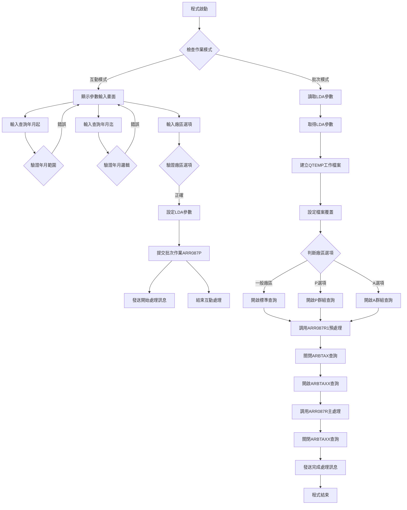
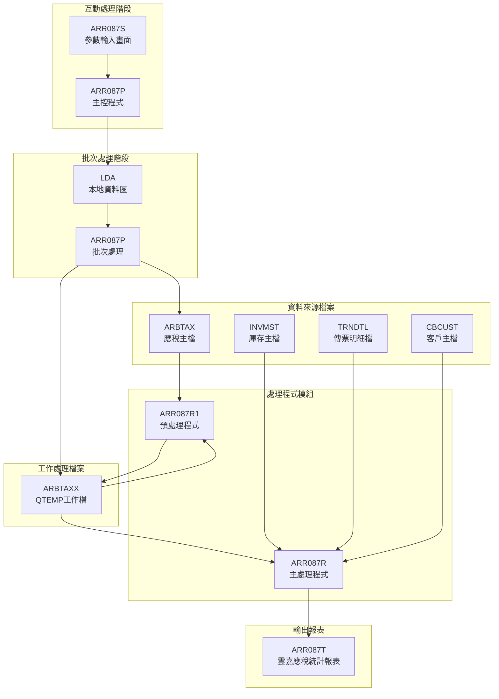
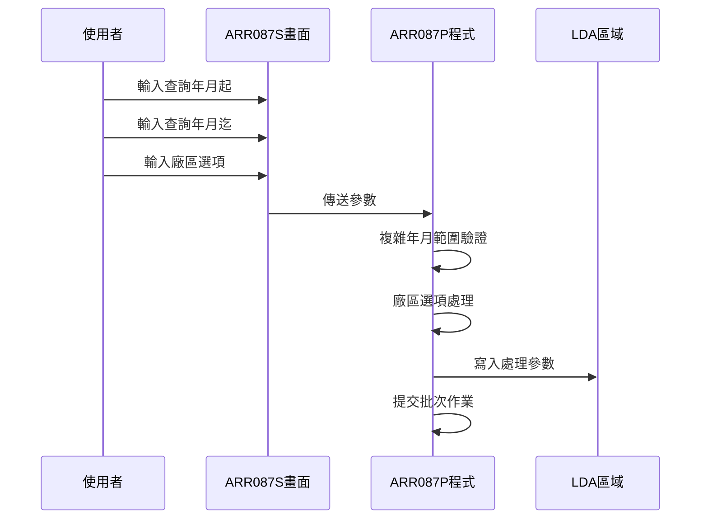
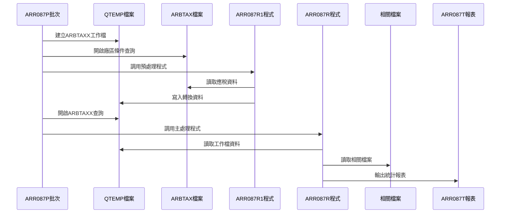
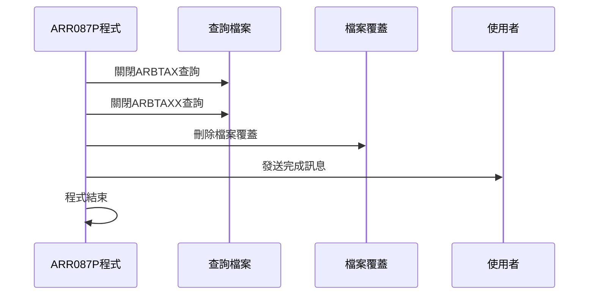
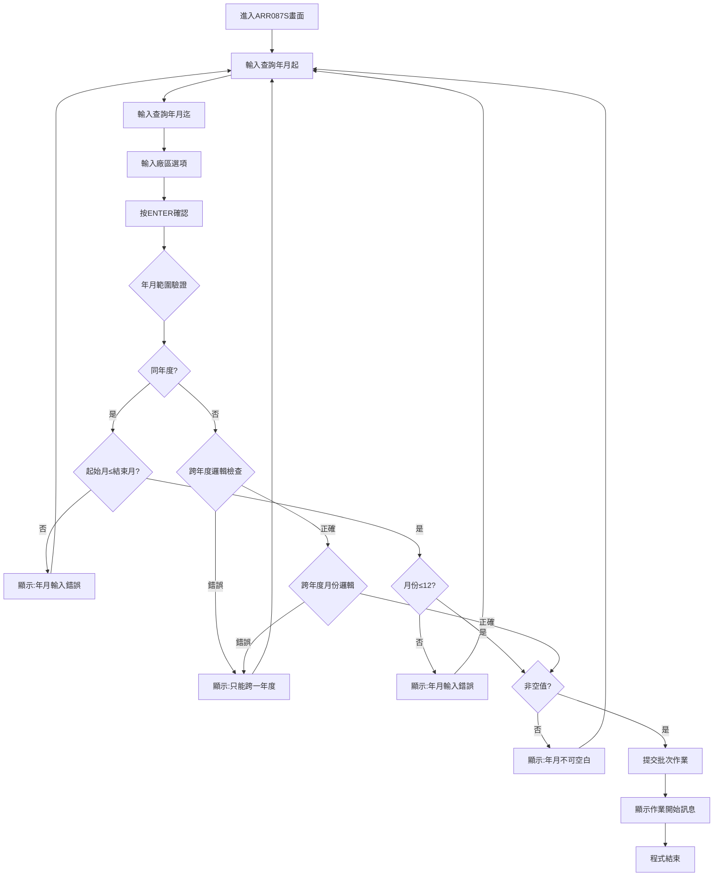
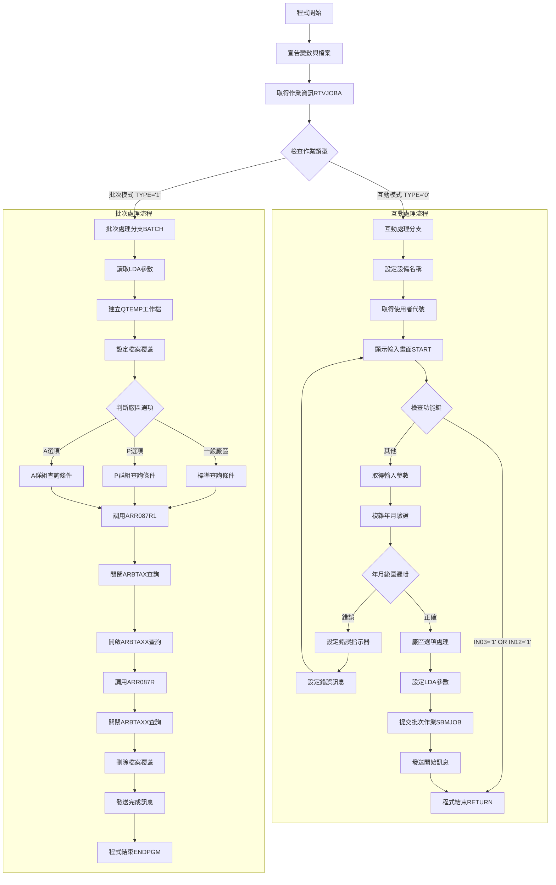

# ARR087P_P02 程式規格書

## 1. 基本資料

| 項目 | 內容 |
|------|------|
| **程式編號** | ARR087P |
| **程式名稱** | 雲嘉應稅作業 |
| **程式類型** | CLP |
| **廠區** | P02 |
| **系統名稱** | 應收帳款系統 |
| **子系統** | 應收帳款報表模組 |
| **檔案位置** | 東鋼list/ARR087P_P02.txt |

## 2. 🎯 程式功能說明

### 主要功能描述
ARR087P程式是雲嘉應稅作業的主控程式，負責處理指定年月範圍內的應稅資料統計分析。程式會根據不同的廠區選項進行應稅資料查詢，並產生詳細的應稅統計報表，包含客戶資料、發票資料、稅額計算及相關統計資訊。

### 🎯 業務流程詳細說明

#### 完整業務流程圖


#### 業務流程關鍵階段說明

**第一階段：參數設定與複雜驗證**
- 接收使用者輸入的查詢年月起（S#YYMM）和查詢年月迄（S#YYM1）
- 進行複雜的年月範圍邏輯驗證，包含同年度和跨年度的不同處理邏輯
- 接收廠區選項（S#OPT），支援H、K、M、N、P、A等特殊選項
- 驗證月份不可超過12，年月範圍必須符合業務邏輯

**第二階段：年月範圍邏輯處理**
- 同年度範圍：起始月份不可大於結束月份
- 跨年度範圍：只允許跨一個年度，且有特定的月份邏輯限制
- 空值檢查：起始和結束年月都不可為空值
- 特殊業務邏輯：跨年度時結束年度必須為起始年度+1

**第三階段：廠區選項分類處理**
- 空白選項：查詢全部廠區（範圍' '到'9'）
- 特定廠區：設定該廠區的精確查詢
- P選項：特殊群組查詢（P、U、T廠區）
- A選項：擴展群組查詢（P、M、U、T廠區）

**第四階段：批次作業提交與預處理**
- 將複雜參數寫入LDA特定位置
- 提交批次作業到ARJOBD作業描述
- 建立QTEMP暫存檔案ARBTAXX
- 根據廠區選項設定不同的查詢條件

**第五階段：兩階段資料處理**
- **預處理階段**：ARR087R1程式讀取ARBTAX原始資料，進行資料轉換和季度歸屬處理
- **主處理階段**：ARR087R程式讀取預處理後的ARBTAXX資料，產生統計報表
- 複雜的季度處理邏輯和月份歸屬計算

#### 多層次驗證機制
- 年月格式驗證（YYYYMM格式）
- 年月範圍邏輯驗證（同年度/跨年度不同邏輯）
- 月份有效性驗證（1-12月）
- 廠區選項有效性驗證
- 空值完整性驗證

#### 智能處理邏輯
- 自動判斷同年度或跨年度查詢並採用不同驗證邏輯
- 智能廠區分組：P選項和A選項的不同廠區組合
- 季度自動歸屬：根據月份自動計算所屬季度
- 動態查詢條件組合

#### 資料一致性確保機制
- 複雜的年月範圍邏輯確保查詢合理性
- 分階段處理確保資料轉換正確性
- 廠區分組邏輯確保統計準確性
- 季度歸屬計算確保報表一致性

## 3. 🎯 檔案架構與關聯圖

### 使用檔案清單

| 檔案名稱 | 檔案類型 | 用途說明 | 存取方式 |
|----------|----------|----------|----------|
| ARR087S | 螢幕檔案 | 參數輸入畫面 | 輸入輸出 |
| ARBTAX | 資料檔案 | 應稅主檔 | 查詢讀取 |
| ARBTAXX | 工作檔案 | 應稅工作檔 | 更新處理 |
| INVMST | 資料檔案 | 庫存主檔 | 查詢讀取 |
| TRNDTL | 資料檔案 | 傳票明細檔 | 查詢讀取 |
| CBCUST | 資料檔案 | 客戶主檔 | 查詢讀取 |
| ARR087T | 報表檔案 | 雲嘉應稅統計報表 | 列印輸出 |

### 🎯 檔案關聯詳細視覺化圖表



### 🎯 資料流向詳細說明

#### 環境準備階段的資料流向


#### 業務處理階段的資料流向


#### 環境清理階段的資料流向


## 4. 🎯 檔案欄位規格說明

### 主要資料結構

#### ARR087S 螢幕檔案欄位
| 欄位名稱 | 類型 | 長度 | 位置 | 說明 |
|----------|------|------|------|------|
| DATE | DATE | 8 | 1,2 | 系統日期 |
| TIME | TIME | 8 | 2,2 | 系統時間 |
| S#DEVN | CHAR | 10 | 2,70 | 設備名稱 |
| S#USER | CHAR | 10 | 3,2 | 使用者代號 |
| S#YYMM | DEC | 6,0 | 8,45 | 查詢年月起 |
| S#YYM1 | DEC | 6,0 | 9,45 | 查詢年月迄 |
| S#OPT | CHAR | 1 | 10,45 | 廠區選項 |
| S#ERR | CHAR | 40 | 23,2 | 錯誤訊息 |

#### ARBTAXX 工作檔案欄位
| 欄位名稱 | 類型 | 長度 | 說明 |
|----------|------|------|------|
| AXCUNO | CHAR | 6 | 客戶編號 |
| AXCUNM | CHAR | 10 | 客戶名稱 |
| AXFLAG | CHAR | 1 | 狀態旗標 |
| AXYYMM | DEC | 6,0 | 年月 |
| AXORNO | CHAR | 6 | 訂單編號 |
| AXITEM | DEC | 3,0 | 項次 |
| AXIVNO | CHAR | 10 | 發票編號 |
| AXATTX | DEC | 11,0 | 稅額 |
| AXCODE | CHAR | 1 | 代碼 |
| AXVNNO | CHAR | 8 | 憑證編號 |
| AXVUNO | CHAR | 8 | 單據編號 |
| AXADDM | CHAR | 2 | 增加月份 |
| AXADDD | DEC | 2,0 | 增加日期 |
| AXADDT | DEC | 6,0 | 增加日期時間 |

### 🔍 重點欄位切割技術詳解

#### DS結構完整分析

**程式中主要DS結構定義**：

```
1. 年月處理結構（ARR087P程式）:
   無明顯DS結構，使用字串切割函數

2. 年月切割結構（ARR087R1程式）:
   DS
    1  60 W#YYMM       ← 完整年月（6字元）
    1  40 W#YY         ← 年份部分（前4字元）
    5  60 W#MM         ← 月份部分（第5-6字元）

3. 發票編號處理結構（ARR087R程式）:
   DS
    1  10 TXIVNO       ← 完整發票編號（10字元）
    1   1 D#IVNO       ← 發票編號首位（第1字元）

4. 日期處理結構（ARR087R程式）:
   DS
    1  60 W#ADDT       ← 完整日期（6字元）
    1   2 W#Y1         ← 年份（前2字元）
    3   4 W#Y2         ← 年份擴展（第3-4字元）
    5  60 W#M1         ← 月份（第5-6字元）
```

#### 欄位切割視覺化展示

**年月欄位切割對應**：
```
W#YYMM (6字元)：[YYYYMM]
                 ↓    ↓
W#YY (4字元)：   [YYYY]      年份部分（位置1-4）
W#MM (2字元)：       [MM]    月份部分（位置5-6）
```

**日期欄位切割對應**：
```
W#ADDT (6字元)：[YYMMDD]
                 ↓↓  ↓↓
W#Y1 (2字元)：   [YY]        年份前段（位置1-2）
W#Y2 (2字元)：     [MM]      年份後段（位置3-4）
W#M1 (2字元)：       [DD]    月份（位置5-6）
```

**發票編號切割對應**：
```
TXIVNO (10字元)：[AXXXXXXXXX]
                  ↓
D#IVNO (1字元)：  [A]         發票編號首位識別
```

#### 切割邏輯詳細說明

**年月切割用途**：
- W#YYMM：完整年月進行季度歸屬計算
- W#YY：年份部分用於跨年度處理
- W#MM：月份部分用於季度判斷和統計分組

**日期切割用途**：
- W#ADDT：完整日期用於報表顯示
- W#Y1/W#Y2：年份拆解用於特殊計算
- W#M1：月份用於月份對照表處理

**發票編號切割用途**：
- TXIVNO：完整發票編號處理
- D#IVNO：首位字元用於特殊發票排除邏輯

#### 實際數據範例說明

**年月切割範例**：
```
輸入：W#YYMM = "202305"
結果：W#YY = "2023"（年份）
      W#MM = "05"（月份）
```

**日期切割範例**：
```
輸入：W#ADDT = "230515"
結果：W#Y1 = "23"（年份前段）
      W#Y2 = "05"（月份）
      W#M1 = "15"（日期）
```

**發票編號切割範例**：
```
輸入：TXIVNO = "A123456789"
結果：D#IVNO = "A"（首位識別符）
```

### 🎯 欄位挪用詳細分析

#### 挪用情況對比表

| 欄位名稱 | 原始定義 | 實際使用方式 | 挪用說明 |
|----------|----------|-------------|----------|
| AXADDM | 增加月份 | 季度歸屬標記 | 將增加月份欄位用來標記資料所屬季度 |
| AXADDT | 增加日期時間 | 季度歸屬日期 | 將日期時間欄位用來存放季度歸屬的計算結果 |
| YYMM | 年月 | 字元化年月 | 在MAPFLD中將數值年月轉換為字元格式 |

#### 挪用原因深度分析

**季度歸屬欄位挪用（AXADDM、AXADDT）**：
- **原因**：程式需要將月份資料歸屬到對應的季度進行統計
- **業務邏輯**：1-2月歸屬第1季度、3-4月歸屬第2季度，依此類推
- **技術考量**：利用現有欄位避免修改檔案結構，實現季度分組功能

**年月字元化挪用（YYMM）**：
- **原因**：OPNQRYF查詢需要字元格式的年月欄位
- **業務邏輯**：數值年月需要轉換為字元格式才能進行範圍查詢
- **查詢效率**：MAPFLD轉換提升查詢條件的靈活性

#### 挪用方式詳細說明

**季度歸屬演算法實現**：
```
ARR087R1程式中的季度處理邏輯：
W#MM IFEQ 1 OR 2  → AXADDT = YY02 (歸屬第1季度)
W#MM IFEQ 3 OR 4  → AXADDT = YY04 (歸屬第2季度)
W#MM IFEQ 5 OR 6  → AXADDT = YY06 (歸屬第3季度)
... 依此類推
```

**MAPFLD欄位轉換實現**：
```
MAPFLD((YYMM AXYYMM *CHAR 6))
將數值格式的AXYYMM轉換為字元格式的YYMM供查詢使用
```

#### 挪用影響評估

**維護影響**：
- 季度歸屬邏輯與欄位名稱不符，需要詳細註記
- 月份到季度的對應關係需要特別維護
- 其他程式讀取此檔案時需要了解挪用邏輯

**業務邏輯影響**：
- 季度統計的準確性依賴挪用邏輯的正確性
- 報表產生需要正確解釋挪用欄位的實際意義
- 年度跨越時的季度歸屬需要特殊處理

### 重要變數定義表

| 變數名稱 | 類型 | 長度 | 用途說明 |
|----------|------|------|----------|
| &YM | CHAR | 2 | 起始月份 |
| &YM1 | CHAR | 2 | 結束月份 |
| &YM2 | DEC | 4,0 | 起始年份 |
| &YM3 | DEC | 4,0 | 結束年份 |
| &C#YMS | CHAR | 6 | 起始年月字串 |
| &C#YME | CHAR | 6 | 結束年月字串 |
| &Y1 | CHAR | 6 | 處理起始年月 |
| &Y2 | CHAR | 6 | 處理結束年月 |
| &DSPID | CHAR | 10 | 顯示設備ID |
| &TYPE | CHAR | 1 | 作業類型 |
| &C_ARE1 | CHAR | 1 | 起始廠區 |
| &C_ARE2 | CHAR | 1 | 結束廠區 |

## 5. 🎯 輸出/入螢幕布局

### 螢幕布局完整視覺化

```
+----------------------------------------------------------+
|107/03/15  東進鋼鐵股份有限公司-廠          ARR087S      |
|08:30:15        雲嘉應稅作業                           P02|
|USER001                                                   |
+----------------------------------------------------------+
|                                                          |
|                                                          |
|                                                          |
|                                                          |
|                                                          |
|                                                          |
|                                                          |
|               請輸入查詢年月(起)：[______]                |
|               請輸入查詢年月(迄)：[______]                |
|               請選擇廠區        ：[_] (H:高雄 K:桃園 M:台中|
|                                       N:台北)            |
|                                      (P:台南,花蓮)       |
|                                      (A: P,M,T,U)        |
|                                      (空白表全部)        |
|                                                          |
|                                                          |
|                                                          |
|                                                          |
|                                                          |
|                                                          |
|                                                          |
|F3:離開               F12:回上頁                           |
|[錯誤訊息顯示區域]                                          |
+----------------------------------------------------------+
```

### 🎯 畫面欄位詳細說明

| 欄位名稱 | 位置 | 長度 | 型態 | 屬性 | 說明 |
|----------|------|------|------|------|------|
| DATE | 1,2 | 8 | DATE | 顯示 | 系統日期，格式YY/MM/DD |
| TIME | 2,2 | 8 | TIME | 顯示 | 系統時間，格式HH:MM:SS |
| S#DEVN | 2,70 | 10 | CHAR | 顯示 | 設備名稱，從作業資訊取得 |
| S#USER | 3,2 | 10 | CHAR | 顯示 | 使用者代號，從LDA取得 |
| S#YYMM | 8,45 | 6 | DEC | 輸入 | 查詢年月起，格式YYYYMM |
| S#YYM1 | 9,45 | 6 | DEC | 輸入 | 查詢年月迄，格式YYYYMM |
| S#OPT | 10,45 | 1 | CHAR | 輸入 | 廠區選項，單一字元 |
| S#ERR | 23,2 | 40 | CHAR | 顯示 | 錯誤訊息，錯誤時顯示 |

### 🎯 畫面控制邏輯

#### 指示器控制說明
- **IN30**：查詢年月起錯誤時設為'1'，欄位顯示反白
- **IN31**：查詢年月迄錯誤時設為'1'，欄位顯示反白
- **IN03**：PF03按鍵，程式返回離開
- **IN12**：PF12按鍵，程式返回前頁

#### 欄位顯示屬性
- **必填欄位**：S#YYMM和S#YYM1為必須輸入欄位
- **選填欄位**：S#OPT為選填，空白代表全部廠區
- **錯誤顯示**：錯誤時欄位顯示反白（DSPATR(RI)）
- **格式控制**：年月欄位使用EDTCDE(Z)進行零壓縮顯示

#### 廠區選項支援範圍
- **H**：高雄廠區
- **K**：桃園廠區
- **M**：台中廠區
- **N**：台北廠區
- **P**：台南、花蓮廠區群組
- **A**：P、M、T、U廠區群組
- **空白**：全部廠區

### 功能鍵詳細定義

| 功能鍵 | 功能說明 | 處理邏輯 | 系統行為 |
|--------|----------|----------|----------|
| **F3** | 離開程式 | 設定IN03='1' | 直接結束程式，返回呼叫端 |
| **F12** | 回上頁 | 設定IN12='1' | 結束程式，返回前一個程式 |
| **ENTER** | 確認執行 | 複雜參數驗證 | 驗證通過後提交批次作業 |

### 操作流程

#### 複雜驗證邏輯流程


## 6. 🎯 處理流程程序說明

### 🎯 主程序邏輯深度分析

#### 程式執行流程圖


#### 🎯 詳細處理步驟逐一分析

**步驟1：環境初始化與作業模式判斷**
```
RTVJOBA JOB(&DSPID) OUTQ(&OUTQ) TYPE(&TYPE)
IF COND(&TYPE *EQ '0') THEN(GOTO CMDLBL(BATCH))
```
- 取得當前作業的設備ID、輸出佇列、作業類型
- TYPE='0'為互動模式，直接跳轉到BATCH標籤
- TYPE='1'為批次模式，繼續互動處理

**步驟2：互動模式參數準備**
```
CHGVAR VAR(&S#DEVN) VALUE(&DSPID)              // 設定設備名稱
RTVDTAARA DTAARA(*LDA (1001 10)) RTNVAR(&S#USER) // 取得使用者代號
```
- 設定畫面顯示的設備名稱
- 從LDA特定位置取得使用者代號

**步驟3：複雜年月範圍驗證邏輯**
```
// 提取月份部分
CHGVAR VAR(&YM) VALUE(%SST(&C#YMS 5 2))        // 起始月份
CHGVAR VAR(&YM1) VALUE(%SST(&C#YME 5 2))       // 結束月份

// 提取年份部分
CHGVAR VAR(&YM2) VALUE(%SST(&C#YMS 1 4))       // 起始年份
CHGVAR VAR(&YM3) VALUE(%SST(&C#YME 1 4))       // 結束年份
```
- 使用字串切割函數分別提取年份和月份
- 分別處理年份和月份的邏輯驗證

**步驟4：同年度範圍驗證**
```
IF COND(&YM2 *EQ &YM3) THEN(DO)               // 同年度
    IF COND(&YM *GT &YM1) THEN(DO)            // 起始月不可大於結束月
        CHGVAR VAR(&S#ERR) VALUE('年月輸入錯誤!')
        CHGVAR VAR(&IN30) VALUE('1')
        CHGVAR VAR(&IN31) VALUE('1')
        GOTO CMDLBL(START)
    ENDDO
ENDDO
```
- 同年度時，起始月份不可大於結束月份
- 錯誤時設定兩個年月欄位的錯誤指示器

**步驟5：跨年度範圍驗證**
```
IF COND(&YM2 *NE &YM3) THEN(DO)               // 跨年度
    CHGVAR VAR(&YM3) VALUE(&YM3-1)            // 結束年減1
    IF COND(&YM2 *NE &YM3) THEN(DO)           // 檢查是否只跨一年
        CHGVAR VAR(&S#ERR) VALUE('只能跨一個年度')
        GOTO CMDLBL(START)
    ENDDO
    IF COND(&YM *LE &YM1) THEN(DO)            // 跨年度月份邏輯錯誤
        CHGVAR VAR(&S#ERR) VALUE('只能跨一個年度')
        GOTO CMDLBL(START)
    ENDDO
ENDDO
```
- 只允許跨一個年度（結束年 = 起始年 + 1）
- 跨年度時起始月必須大於結束月（如：202312到202401）

**步驟6：月份有效性驗證**
```
IF COND(&YM *GT '12') THEN(DO)                // 起始月份驗證
    CHGVAR VAR(&S#ERR) VALUE('年月輸入錯誤!')
    CHGVAR VAR(&IN30) VALUE('1')
    GOTO CMDLBL(START)
ENDDO
IF COND(&YM1 *GT '12') THEN(DO)               // 結束月份驗證
    CHGVAR VAR(&S#ERR) VALUE('年月輸入錯誤!')
    CHGVAR VAR(&IN31) VALUE('1')
    GOTO CMDLBL(START)
ENDDO
```
- 起始月份和結束月份都不可超過12
- 分別設定對應欄位的錯誤指示器

**步驟7：空值完整性驗證**
```
IF COND(&C#YMS *EQ '      ') THEN(DO)         // 起始年月空值檢查
    CHGVAR VAR(&S#ERR) VALUE('起始年月不可空白!')
    CHGVAR VAR(&IN30) VALUE('1')
    GOTO CMDLBL(START)
ENDDO
IF COND(&C#YME *EQ '      ') THEN(DO)         // 結束年月空值檢查
    CHGVAR VAR(&S#ERR) VALUE('結束年月不可空白!')
    CHGVAR VAR(&IN31) VALUE('1')
    GOTO CMDLBL(START)
ENDDO
```
- 起始年月和結束年月都不可為空值
- 空值時設定對應的錯誤指示器和訊息

**步驟8：廠區選項處理**
```
IF COND(&S#OPT *EQ ' ') THEN(DO)              // 空白選項
    CHGVAR VAR(&C_ARE1) VALUE(' ')            // 起始廠區
    CHGVAR VAR(&C_ARE2) VALUE('9')            // 結束廠區
ENDDO
ELSE (DO)                                      // 特定廠區
    CHGVAR VAR(&C_ARE1) VALUE(&S#OPT)         // 起始廠區 = 選項
    CHGVAR VAR(&C_ARE2) VALUE(&S#OPT)         // 結束廠區 = 選項
ENDDO
```
- 空白選項代表查詢全部廠區（範圍' '到'9'）
- 特定廠區選項設定精確的廠區範圍

#### 業務邏輯深度解析

**複雜年月邏輯的業務意義**：
- **同年度查詢**：如202301到202306，用於季度內或年度內統計
- **跨年度查詢**：如202312到202401，用於跨年度統計分析
- **限制跨年範圍**：只允許跨一個年度，避免過大範圍查詢影響效能

**廠區選項的業務分組**：
- **P選項**：台南、花蓮、嘉義三廠區群組（P、U、T）
- **A選項**：擴展群組，包含台南、台中、花蓮、嘉義（P、M、U、T）
- **單一廠區**：H（高雄）、K（桃園）、M（台中）、N（台北）等

**LDA參數傳遞邏輯**：
- 位置501-506：起始年月（6字元）
- 位置507-512：結束年月（6字元）
- 位置519-528：設備ID（10字元）
- 位置529：起始廠區（1字元）
- 位置530：結束廠區（1字元）
- 位置531：廠區選項（1字元）

#### 條件判斷詳細說明

**作業模式判斷邏輯**：
```
IF COND(&TYPE *EQ '0') THEN(GOTO BATCH)
```
- TYPE='0'：互動模式，需要顯示畫面收集參數
- TYPE='1'：批次模式，直接從LDA讀取參數執行

**年月範圍邏輯矩陣**：
```
同年度（&YM2 = &YM3）：
  - 起始月 ≤ 結束月：正確
  - 起始月 > 結束月：錯誤

跨年度（&YM2 ≠ &YM3）：
  - 只跨一年（&YM3 = &YM2 + 1）且起始月 > 結束月：正確
  - 其他情況：錯誤
```

**廠區查詢條件組合**：
```
一般廠區：AXAREA *GE "&C_ARE1" *AND AXAREA *LE "&C_ARE2"
P選項：(AXAREA *EQ "P") *OR (AXAREA *EQ "U") *OR (AXAREA *EQ "T")
A選項：(AXAREA *EQ "P") *OR (AXAREA *EQ "M") *OR (AXAREA *EQ "U") *OR (AXAREA *EQ "T")
```

#### 變數使用和數據流向

**核心變數追蹤**：
- **&C#YMS/&C#YME**：使用者輸入 → 字串切割 → 驗證 → LDA設定
- **&YM/&YM1/&YM2/&YM3**：切割結果 → 複雜邏輯驗證
- **&C_ARE1/&C_ARE2**：廠區選項處理 → 查詢範圍設定
- **&S#OPT**：廠區選項 → 條件分岐 → 查詢邏輯

**資料傳遞流向**：
```
畫面輸入 → 字串切割 → 複雜驗證 → LDA設定 → 批次程式 → 查詢條件 → 報表處理
```

### 🎯 子程序邏輯分析

#### ARR087R1預處理程序
**功能描述**：讀取ARBTAX應稅資料，進行季度歸屬處理，寫入ARBTAXX工作檔
**季度歸屬邏輯**：
```
1-2月 → 歸屬第1季度（月末02）
3-4月 → 歸屬第2季度（月末04）
5-6月 → 歸屬第3季度（月末06）
7-8月 → 歸屬第4季度（月末08）
9-10月 → 歸屬第5季度（月末10）
11-12月 → 歸屬第6季度（月末12）
```
**資料轉換**：將原始應稅資料轉換為季度統計格式

#### ARR087R主處理程序
**功能描述**：讀取ARBTAXX工作檔資料，關聯其他檔案，產生詳細統計報表
**多檔案關聯**：
- ARBTAXX：主要應稅資料
- INVMST：發票資料
- TRNDTL：傳票明細
- CBCUST：客戶資料

**統計層次**：
- 憑證號碼層次統計（L1）
- 客戶層次統計（L2）
- 月份層次統計（L3）
- 總計層次統計（LR）

### 🎯 特殊邏輯處理

#### 複雜年月驗證演算法
```
年月驗證邏輯：
1. 字串切割：%SST提取年份和月份
2. 同年度檢查：起始年 = 結束年
3. 跨年度檢查：結束年 = 起始年 + 1
4. 月份邏輯：同年度時起始月≤結束月，跨年度時起始月>結束月
5. 範圍限制：月份1-12，只能跨一個年度
```

#### 廠區群組處理邏輯
```
廠區分組邏輯：
- 空白：查詢全部廠區（' '到'9'）
- 單一廠區：精確查詢該廠區
- P群組：OR條件組合（P、U、T）
- A群組：OR條件組合（P、M、U、T）
```

#### 季度歸屬演算法
```
季度歸屬邏輯（ARR087R1）：
月份對應表：
01,02 → 02 (第1季度)
03,04 → 04 (第2季度)
05,06 → 06 (第3季度)
07,08 → 08 (第4季度)
09,10 → 10 (第5季度)
11,12 → 12 (第6季度)
```

### 🎯 錯誤處理與資料完整性控制

#### 詳細的錯誤處理邏輯

**多層次參數驗證**：
- 第一層：空值檢查
- 第二層：格式檢查（月份1-12）
- 第三層：邏輯檢查（年月範圍合理性）
- 第四層：業務檢查（跨年度限制）

**檔案操作錯誤處理**：
```
DLTF FILE(QTEMP/ARBTAXX)
MONMSG MSGID(CPF0000)                          // 監控所有錯誤
```
- 允許檔案不存在的情況
- 確保工作檔案能正常建立

#### 資料完整性檢查機制

**年月範圍完整性**：
- 確保查詢範圍的邏輯正確性
- 避免過大範圍查詢影響系統效能
- 跨年度限制確保業務合理性

**廠區選項完整性**：
- 廠區群組的邏輯正確性
- 查詢條件的完整性
- 特殊廠區組合的業務正確性

#### 關鍵業務規則實現

**年月範圍規則**：
- 同年度：起始月份 ≤ 結束月份
- 跨年度：只能跨一個年度，且起始月份 > 結束月份
- 月份有效性：1-12月

**廠區處理規則**：
- P選項：台南、花蓮、嘉義群組
- A選項：台南、台中、花蓮、嘉義群組
- 單一廠區：精確查詢
- 空白：全部廠區查詢

**季度歸屬規則**：
- 雙月歸屬：每兩個月歸屬一個季度
- 季度標記：使用季度末月份作為標記
- 年度處理：跨年度時保持年份一致性

## 7. 🎯 數據操作與轉換分析

### 檔案操作詳解

#### READ/WRITE/UPDATE/DELETE的具體邏輯

**檔案讀取操作**：
```
// ARR087R程式中的檔案讀取
READ ARBTAXX    // 讀取應稅工作檔
CHAIN INVMST    // 鏈結讀取庫存主檔
CHAIN TRNDTL    // 鏈結讀取傳票明細檔
CHAIN CBCUST    // 鏈結讀取客戶主檔
```
- 使用CHAIN進行精確記錄定位
- 多檔案關聯讀取建立完整資料集
- 透過指示器控制讀取狀態

**檔案寫入操作**：
```
// ARR087R1程式中的檔案寫入
WRITE RARBTA1   // 寫入工作檔記錄
// ARR087R程式中的報表寫入
WRITE ARR087H   // 寫入報表標題
WRITE ARR0871   // 寫入明細記錄
WRITE ARR0872   // 寫入統計記錄
```
- 預處理階段寫入轉換後的工作檔資料
- 主處理階段寫入格式化的報表記錄

**檔案更新操作**：
```
// 工作檔案的重新建立
DLTF FILE(QTEMP/ARBTAXX)               // 刪除舊工作檔
CRTDUPOBJ OBJ(ARBTAX) TOLIB(QTEMP)     // 複製新工作檔
```
- 透過刪除和重新建立確保工作檔案的乾淨狀態
- 避免資料累積和衝突

**檔案刪除操作**：
```
DLTF FILE(QTEMP/ARBTAXX)               // 刪除工作檔案
MONMSG MSGID(CPF0000)                  // 監控刪除錯誤
```
- 程式開始時清理舊的工作檔案
- 使用廣泛錯誤監控處理各種狀況

#### 檔案鎖定和併發處理

**共享模式設定**：
```
OVRDBF FILE(ARBTAX) TOFILE(DALIB/ARBTAX) SHARE(*YES)
OVRDBF FILE(ARBTAXX) TOFILE(QTEMP/ARBTAXX) SHARE(*YES)
```
- 設定SHARE(*YES)允許多使用者同時存取
- 工作檔案使用QTEMP確保使用者間隔離

#### 檔案存取的條件和篩選

**ARBTAX檔案複雜查詢條件**：
```
// 一般廠區查詢
QRYSLT('(AXFLAG *NE "D") *AND 
        (AXAREA *GE "' || &C_ARE1 || '") *AND 
        (AXAREA *LE "' || &C_ARE2 || '") *AND 
        (YYMM *GE "' || &Y1 || '") *AND 
        (YYMM *LE "' || &Y2 || '")')

// P選項群組查詢
QRYSLT('(AXFLAG *NE "D") *AND 
        ((AXAREA *EQ "P") *OR (AXAREA *EQ "U") *OR (AXAREA *EQ "T")) *AND 
        (YYMM *GE "' || &Y1 || '") *AND 
        (YYMM *LE "' || &Y2 || '")')

// A選項群組查詢
QRYSLT('(AXFLAG *NE "D") *AND 
        ((AXAREA *EQ "P") *OR (AXAREA *EQ "M") *OR (AXAREA *EQ "U") *OR (AXAREA *EQ "T")) *AND 
        (YYMM *GE "' || &Y1 || '") *AND 
        (YYMM *LE "' || &Y2 || '")')
```
- 根據廠區選項動態組合不同的查詢條件
- 排除已刪除記錄（AXFLAG <> 'D'）
- 年月範圍篩選

**ARBTAXX工作檔案查詢條件**：
```
QRYSLT('(YYMM *GE "' || &Y1 || '") *AND (YYMM *LE "' || &Y2 || '")')
KEYFLD((AXADDT) (AXYYMM) (AXORNO) (AXIVNO))
```
- 按季度歸屬日期、年月、訂單編號、發票編號排序
- 確保報表輸出的順序正確性

### 數據轉換邏輯

#### 數值格式轉換的詳細方式

**年月字串切割轉換**：
```
// CLP程式中的年月切割
CHGVAR VAR(&YM) VALUE(%SST(&C#YMS 5 2))        // 提取月份
CHGVAR VAR(&YM1) VALUE(%SST(&C#YME 5 2))       // 提取月份
CHGVAR VAR(&YM2) VALUE(%SST(&C#YMS 1 4))       // 提取年份
CHGVAR VAR(&YM3) VALUE(%SST(&C#YME 1 4))       // 提取年份
```
- 從6位年月字串中分別提取年份和月份
- 支援複雜的年月邏輯驗證

**MAPFLD欄位轉換**：
```
// OPNQRYF中的欄位轉換
MAPFLD((YYMM AXYYMM *CHAR 6))
```
- 將數值格式的AXYYMM轉換為字元格式的YYMM
- 便於字串範圍查詢條件的組合

**RPG程式中的資料轉換**：
```
// ARR087R1程式中的轉換
Z-ADD AXYYM1 W#YYMM        // 數值轉數值
Z-ADD AXYYM1 AXYYMM        // 數值複製
Z-ADD W#YYM1 AXADDT        // 季度歸屬日期設定
```
- 使用Z-ADD進行數值間轉換
- 季度歸屬的特殊計算邏輯

#### 日期時間處理邏輯

**季度歸屬計算**：
```
// ARR087R1程式中的季度處理
W#MM IFEQ 1 OR 2   → W#Y1 = W#YY, W#M1 = 2,  AXADDT = W#YYM1
W#MM IFEQ 3 OR 4   → W#Y1 = W#YY, W#M1 = 4,  AXADDT = W#YYM1
W#MM IFEQ 5 OR 6   → W#Y1 = W#YY, W#M1 = 6,  AXADDT = W#YYM1
W#MM IFEQ 7 OR 8   → W#Y1 = W#YY, W#M1 = 8,  AXADDT = W#YYM1
W#MM IFEQ 9 OR 10  → W#Y1 = W#YY, W#M1 = 10, AXADDT = W#YYM1
W#MM IFEQ 11 OR 12 → W#Y1 = W#YY, W#M1 = 12, AXADDT = W#YYM1
```
- 將月份資料歸屬到雙月季度
- 使用季度末月份作為歸屬標記

**月份對照表處理**：
```
// ARR087R程式中的月份轉換
W#MM LOOKUP TAB1 TAB2      // 月份對照表查詢
```
- 使用編譯時表格進行月份名稱轉換
- 支援月份顯示格式的標準化

#### 字串操作和格式化

**複雜字串切割**：
```
%SST(&C#YMS 1 4)          // 年份切割（位置1-4）
%SST(&C#YMS 5 2)          // 月份切割（位置5-6）
%SST(&C#YME 1 4)          // 結束年份切割
%SST(&C#YME 5 2)          // 結束月份切割
```
- 精確的字串位置控制
- 支援年月分離處理邏輯

**參數字串串接**：
```
CHGVAR VAR(&Y1) VALUE(&C#YMS)     // 起始年月字串
CHGVAR VAR(&Y2) VALUE(&C#YME)     // 結束年月字串
```
- 將驗證後的年月參數轉換為處理格式
- 確保參數傳遞的正確性

### 計算邏輯分析

#### 所有數學運算的業務意義

**季度統計計算**：
```
// ARR087R程式中的統計計算
ADD T#BAMT T#BAM1         // 開立金額累計
ADD T#AAMT T#AAM1         // 未稅金額累計  
ADD T##AMT T##AM1         // 含稅金額累計
ADD T#ATAX T#ATA1         // 稅額累計
ADD T#AATT T#AAT1         // 總額累計
```
- 多層次的金額統計（憑證層、客戶層、月份層、總計層）
- 包含未稅、含稅、稅額的完整稅務統計

**年份計算邏輯**：
```
CHGVAR VAR(&YM3) VALUE(&YM3-1)    // 跨年度驗證用年份調整
```
- 跨年度驗證時的年份邏輯計算
- 確保跨年範圍的正確性

#### 公式推導和計算步驟

**稅額計算公式**：
```
含稅金額計算：T##AMT = T#AAMT + T#BAMT
總額計算：T#AATT = T#ATAX + T##AMT
未稅金額反推：T#AAMT = INAAMT / 1.05 (適用於特定稅率)
稅額計算：T#ATAX = T##AMT * 0.05
```
- 支援不同稅率的計算邏輯
- 含稅和未稅金額的轉換計算

**層次累計公式**：
```
憑證層累計 → 客戶層累計 → 月份層累計 → 總計層累計
T#xxx1 → T#xxx2 → T#xxx3 → T#xxx4
```
- 多層次階層式統計結構
- 支援不同粒度的統計分析

#### 精度處理和四捨五入規則

**金額精度定義**：
```
T#BAMT  11S 0    // 開立金額：11位數，無小數
T#AAMT   8S 0    // 未稅金額：8位數，無小數
T#ATAX   8S 0    // 稅額：8位數，無小數
T#AATT   8S 0    // 總額：8位數，無小數
```
- 金額統計使用整數處理
- 避免小數運算的精度問題

**除法運算精度**：
```
INAAMT DIV 1.05 → 結果保持整數精度
T##AMT MULT 0.05 → 稅額計算保持整數
```
- 稅額計算使用固定稅率
- 除法運算後維持整數格式

### 檢核機制詳解

#### 數據有效性檢查的具體邏輯

**年月範圍邏輯檢核**：
```
// 同年度檢核
IF COND(&YM2 *EQ &YM3) AND COND(&YM *GT &YM1)  // 起始月大於結束月
// 跨年度檢核  
IF COND(&YM2 *NE &YM3) AND COND(&YM2 *NE &YM3-1) // 非跨一年度
```
- 複雜的年月範圍邏輯檢核
- 確保查詢範圍的業務合理性

**月份有效性檢核**：
```
IF COND(&YM *GT '12')     // 起始月份不可超過12
IF COND(&YM1 *GT '12')    // 結束月份不可超過12
```
- 基本的月份範圍檢核
- 確保月份值的有效性

**空值完整性檢核**：
```
IF COND(&C#YMS *EQ '      ')  // 起始年月不可空白
IF COND(&C#YME *EQ '      ')  // 結束年月不可空白
```
- 必要欄位的空值檢查
- 確保參數的完整性

#### 檢核失敗的處理方式

**錯誤指示器設定**：
```
CHGVAR (&IN30) VALUE('1')              // 起始年月錯誤
CHGVAR (&IN31) VALUE('1')              // 結束年月錯誤
CHGVAR (&S#ERR) VALUE('錯誤訊息')      // 設定錯誤訊息
GOTO CMDLBL(START)                     // 返回輸入畫面
```
- 分別設定對應欄位的錯誤指示器
- 提供具體的錯誤訊息指引
- 回到輸入畫面重新處理

**資料排除處理**：
```
AXFLAG *NE "D"            // 排除已刪除記錄
```
- 查詢時排除無效資料
- 確保統計結果的準確性

#### 檢核規則的業務依據

**年月範圍檢核規則**：
- 同年度：起始月 ≤ 結束月（如：202301到202306）
- 跨年度：只能跨一年且起始月 > 結束月（如：202312到202401）
- 月份範圍：1-12月
- 避免過大查詢範圍影響系統效能

**廠區選項檢核規則**：
- 支援的廠區：H、K、M、N、P、A
- P選項：台南、花蓮、嘉義群組
- A選項：台南、台中、花蓮、嘉義群組
- 空白：全部廠區查詢

**資料狀態檢核規則**：
- AXFLAG <> 'D'：排除已刪除的應稅記錄
- 年月範圍：確保在指定期間內
- 廠區範圍：確保在指定廠區內

## 8. 🎯 錯誤處理程序說明

### 🎯 詳細錯誤代碼清冊

| 錯誤代碼 | 錯誤訊息 | 原因說明 | 處理方式 | 預防措施 |
|----------|---------|---------|---------|----------|
| **USER001** | 年月輸入錯誤! | 月份超過12或同年度起始月大於結束月 | 1. 設定IN30='1'或IN31='1'錯誤指示器<br>2. 欄位顯示反白<br>3. 返回輸入畫面重新輸入 | 提供年月輸入格式說明和範例 |
| **USER002** | 只能跨一個年度 | 跨年度查詢超過一年或跨年度月份邏輯錯誤 | 1. 設定IN30='1'和IN31='1'錯誤指示器<br>2. 顯示跨年度規則說明<br>3. 返回輸入畫面重新輸入 | 說明跨年度查詢的業務規則和限制 |
| **USER003** | 起始年月不可空白! | 使用者未輸入起始年月 | 1. 設定IN30='1'錯誤指示器<br>2. 欄位顯示反白<br>3. 返回輸入畫面重新輸入 | 在畫面設計時明確標示必填欄位 |
| **USER004** | 結束年月不可空白! | 使用者未輸入結束年月 | 1. 設定IN31='1'錯誤指示器<br>2. 欄位顯示反白<br>3. 返回輸入畫面重新輸入 | 在畫面設計時明確標示必填欄位 |
| **FILE001** | CPF0000 | QTEMP工作檔案操作錯誤 | 1. 使用MONMSG忽略可忽略錯誤<br>2. 繼續執行檔案建立程序<br>3. 確保工作檔案正常建立 | 程式開始時統一清理QTEMP檔案 |
| **FILE002** | 檔案開啟失敗 | 應稅檔案或相關檔案無法正常開啟 | 1. 檢查檔案是否存在<br>2. 檢查檔案權限設定<br>3. 聯繫系統管理員處理 | 定期檢查關鍵檔案的可用性 |
| **IN03='1'** | 使用者按F3離開 | 使用者主動選擇離開程式 | 1. 直接執行RETURN指令<br>2. 結束程式執行<br>3. 返回呼叫端程式 | 提供明確的功能鍵說明 |
| **IN12='1'** | 使用者按F12回上頁 | 使用者選擇回到前一個程式 | 1. 直接執行RETURN指令<br>2. 結束程式執行<br>3. 返回前一個程式 | 確保前頁程式的正確性 |

### 🎯 系統異常處理邏輯

#### 檔案操作失敗處理
```
DLTF FILE(QTEMP/ARBTAXX)
MONMSG MSGID(CPF0000)                    // 監控所有CPF錯誤
```
**處理邏輯**：
- 使用廣泛的錯誤監控（CPF0000）處理各種檔案錯誤
- 允許檔案不存在或其他非關鍵錯誤時繼續執行
- 確保每次執行都能正常建立工作檔案

#### 程式調用失敗處理
```
CALL PGM(ARLIB/ARR087R1)               // 調用預處理程式
CALL PGM(ARLIB/ARR087R)                // 調用主處理程式
```
**處理邏輯**：
- 程式調用使用完整的程式庫路徑
- 確保能正確找到和執行被調用程式
- 分階段處理降低單一程式的複雜度

#### 資料完整性錯誤處理
```
複雜年月範圍驗證：
- 同年度邏輯檢查
- 跨年度邏輯檢查  
- 月份有效性檢查
- 空值完整性檢查
```
**處理邏輯**：
- 多層次的參數驗證確保資料正確性
- 提供具體的錯誤訊息指引使用者
- 分別設定對應欄位的錯誤指示器

#### 併發控制失敗處理
```
OVRDBF FILE(ARBTAX) TOFILE(DALIB/ARBTAX) SHARE(*YES)
OVRDBF FILE(ARBTAXX) TOFILE(QTEMP/ARBTAXX) SHARE(*YES)
```
**處理邏輯**：
- 設定檔案共享模式避免鎖定衝突
- 使用QTEMP隔離不同使用者的工作資料
- 允許多使用者同時執行程式

## 9. 🎯 備註

### 🎯 特殊注意事項

**複雜年月邏輯注意事項**：
- 年月輸入必須為6位數字格式（YYYYMM），系統會進行嚴格的邏輯驗證
- 同年度查詢：起始月份必須小於或等於結束月份
- 跨年度查詢：只允許跨一個年度，且起始月份必須大於結束月份（如：202312到202401）
- 月份範圍限制在1-12，超出範圍會產生錯誤

**廠區選項處理注意事項**：
- P選項代表特定廠區群組（台南、花蓮、嘉義），會產生特殊的OR條件查詢
- A選項代表擴展廠區群組（台南、台中、花蓮、嘉義），包含更多廠區
- 空白選項代表查詢全部廠區，可能產生大量資料需要較長處理時間
- H、K、M、N選項代表單一廠區的精確查詢

**季度歸屬處理注意事項**：
- ARR087R1程式會將月份資料重新歸屬到雙月季度（1-2月歸屬02、3-4月歸屬04等）
- 季度歸屬邏輯影響統計結果的呈現方式，修改時需要特別謹慎
- AXADDT欄位被挪用作為季度歸屬標記，實際意義與欄位名稱不符

**檔案處理注意事項**：
- QTEMP工作檔案ARBTAXX會在每次執行時重新建立，確保資料的一致性
- 分兩階段處理（ARR087R1預處理+ARR087R主處理），必須依序執行
- 檔案覆蓋設定必須在處理完成後清除，避免影響其他程式

**報表輸出注意事項**：
- 報表檔案設定為HOLD模式，需要手動釋放列印
- 報表寬度設定為198字元，需要使用寬幅印表機
- 報表包含多層次統計（憑證、客戶、月份、總計），結構較為複雜

**程式執行注意事項**：
- 批次作業提交後無法中途取消，執行前請確認年月範圍和廠區選項正確
- 程式執行期間會建立QTEMP工作檔案，可能占用系統資源
- 跨年度查詢和大範圍廠區查詢可能需要較長處理時間

**LDA參數注意事項**：
- LDA參數位置固定且有特定格式要求，修改時需要同步更新互動和批次部分
- 廠區參數會影響查詢條件的組合方式，需要確保邏輯一致性
- 年月參數的傳遞格式必須與驗證邏輯保持一致 