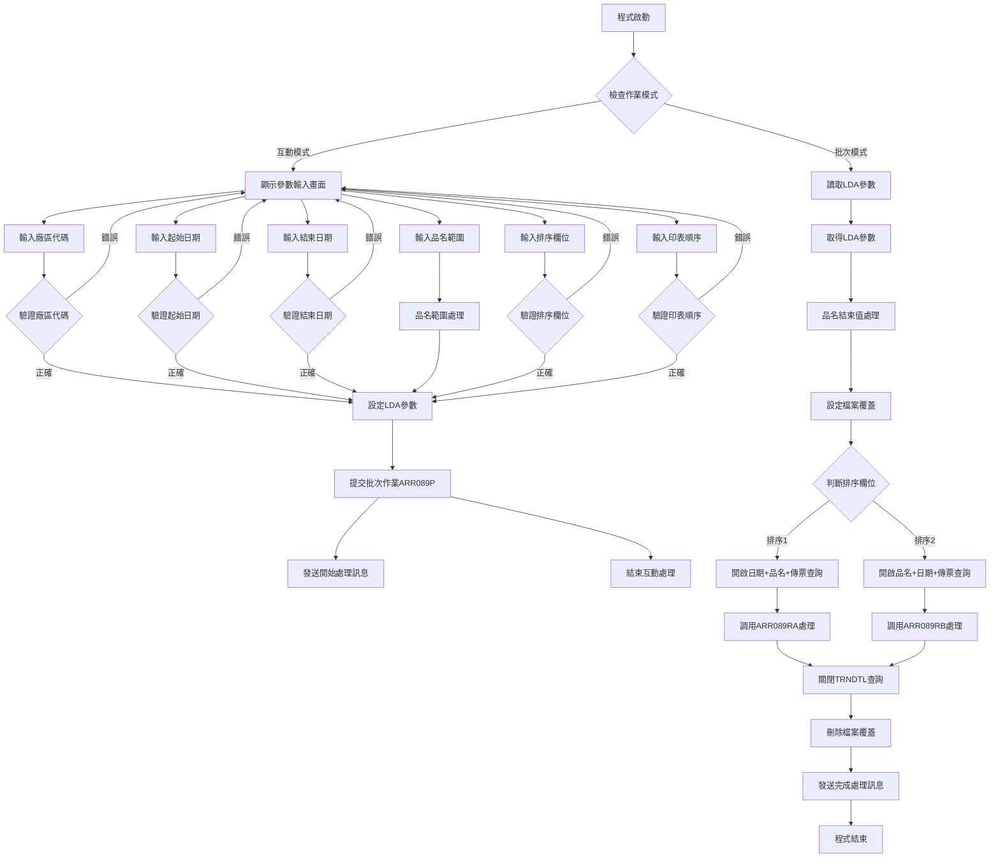
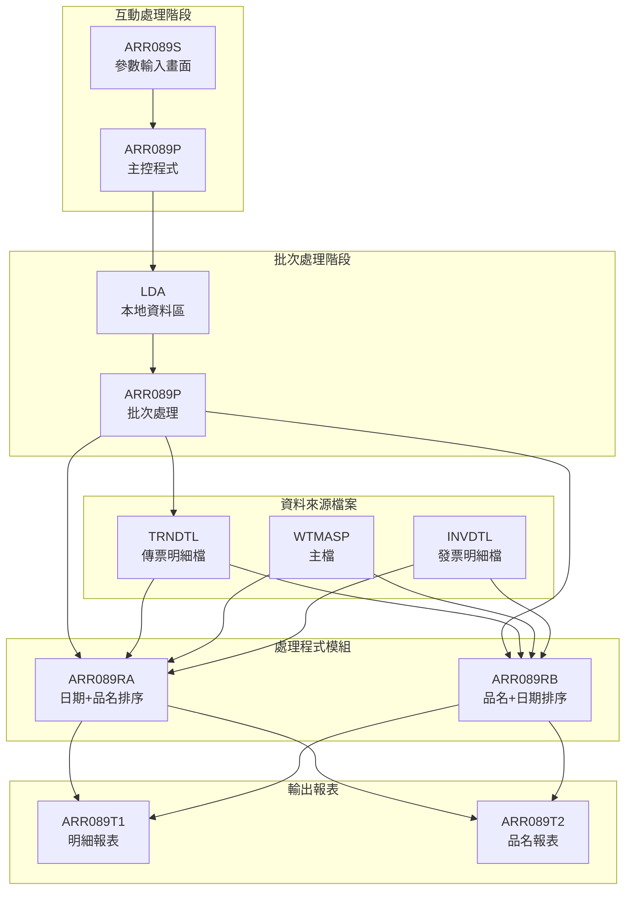
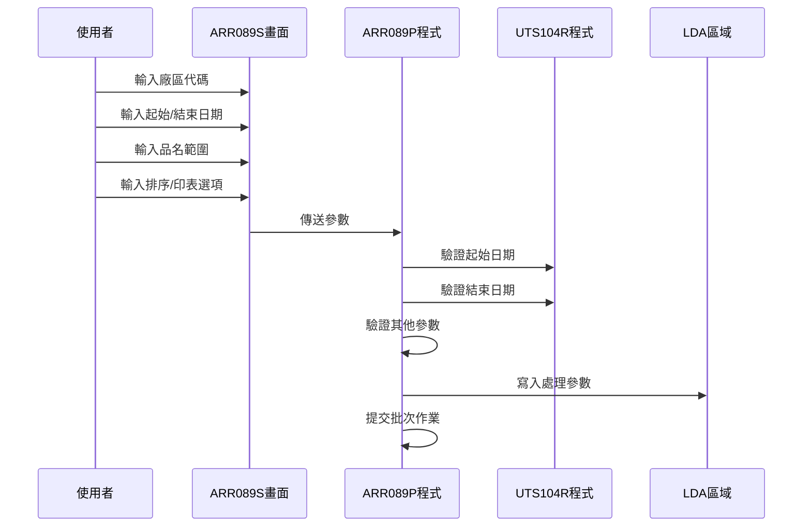
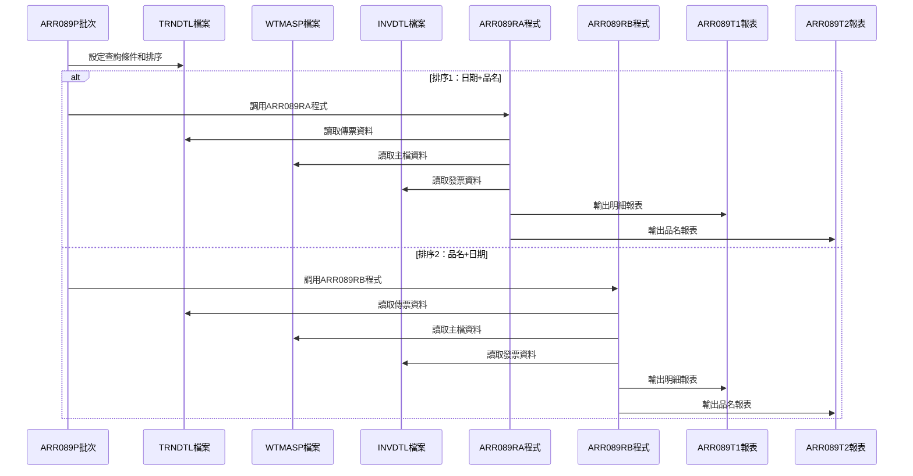
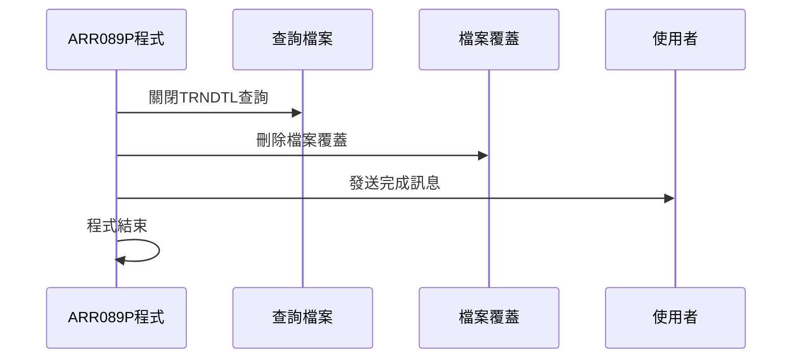
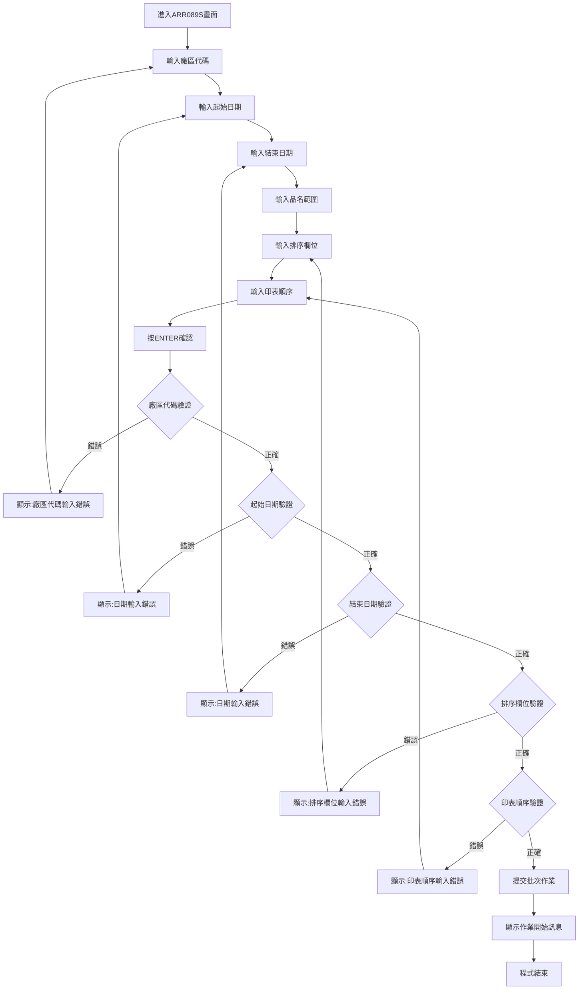
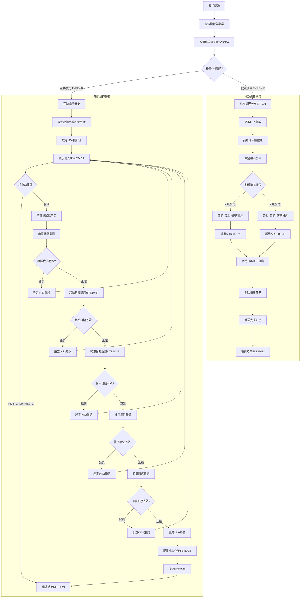
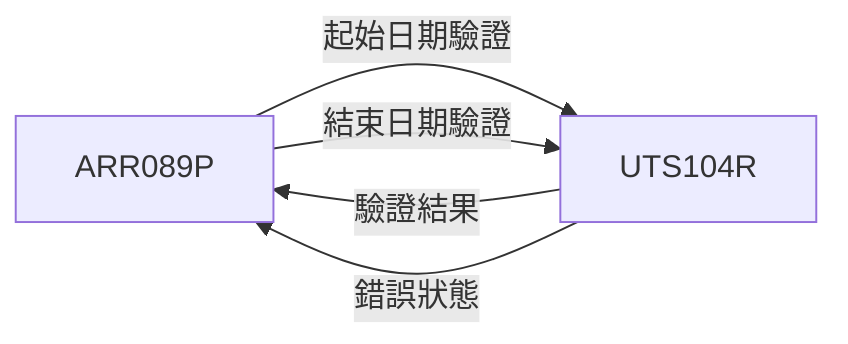

# ARR089P_H05 程式規格書

## 1. 基本資料

| 項目 | 內容 |
|------|------|
| **程式編號** | ARR089P |
| **程式名稱** | 營運業務出貨作業 |
| **程式類型** | CLP |
| **廠區** | H05 |
| **系統名稱** | 應收帳款系統 |
| **子系統** | 應收帳款報表模組 |
| **檔案位置** | 東鋼list/ARR089P_H05.txt |

## 2. 🎯 程式功能說明

### 主要功能描述
ARR089P程式是營運業務出貨作業的主控程式，負責處理指定日期範圍內的營運業務出貨資料統計分析。程式會根據不同的排序欄位和印表順序選項產生兩種不同的出貨報表：明細報表和品名彙總報表，並支援特殊品名（39XX系列）的處理邏輯。

### 🎯 業務流程詳細說明

#### 完整業務流程圖


#### 業務流程關鍵階段說明

**第一階段：參數設定與複合驗證**
- 接收使用者輸入的廠區代碼（S#AREA），支援P、T、H、M、K等廠區
- 接收起始日期（S#DATS）和結束日期（S#DATE），支援YYYYMMDD格式
- 接收品名範圍（S#PDNS到S#PDNE），支援品名範圍查詢
- 接收排序欄位（S#KFLD）：1=日期+品名，2=品名+日期
- 接收印表順序（S#PRTF）：A=明細表，B=彙總表

**第二階段：日期驗證處理**
- 調用UTS104R程式驗證起始日期的有效性
- 調用UTS104R程式驗證結束日期的有效性
- 確保日期格式和邏輯的正確性

**第三階段：排序與印表選項驗證**
- 排序欄位必須為'1'或'2'，決定報表排序方式
- 印表順序必須為'A'或'B'，決定報表格式類型
- 驗證失敗時設定對應的錯誤指示器

**第四階段：批次作業提交與檔案設定**
- 將所有驗證後的參數寫入LDA特定位置
- 提交批次作業到ARJOBD作業描述
- 設定TRNDTL和WTMASP檔案的覆蓋參數

**第五階段：動態程式調用處理**
- **排序1（S#KFLD='1'）**：按日期+品名+傳票排序，調用ARR089RA程式
- **排序2（S#KFLD='2'）**：按品名+日期+傳票排序，調用ARR089RB程式
- 兩種排序方式產生不同格式的ARR089T1和ARR089T2報表

#### 多層次驗證機制
- 廠區代碼五值驗證（P、T、H、M、K）
- 日期格式和邏輯雙重驗證（使用UTS104R程式）
- 排序欄位邏輯驗證（1或2）
- 印表順序邏輯驗證（A或B）
- 品名範圍有效性處理

#### 智能處理邏輯
- 自動判斷互動與批次執行模式
- 品名結束值自動補全（空值時設為'999'）
- 根據排序欄位動態調用不同RPG程式
- 支援兩種不同的報表格式輸出

#### 資料一致性確保機制
- 複雜的參數驗證確保查詢條件正確性
- 日期程式驗證確保時間範圍合理性
- 動態程式調用確保處理邏輯一致性
- 檔案覆蓋設定確保查詢環境正確性

## 3. 🎯 檔案架構與關聯圖

### 使用檔案清單

| 檔案名稱 | 檔案類型 | 用途說明 | 存取方式 |
|----------|----------|----------|----------|
| ARR089S | 螢幕檔案 | 參數輸入畫面 | 輸入輸出 |
| TRNDTL | 資料檔案 | 傳票明細檔 | 查詢讀取 |
| WTMASP | 資料檔案 | 主檔 | 查詢讀取 |
| INVDTL | 資料檔案 | 發票明細檔 | 查詢讀取 |
| ARR089T1 | 報表檔案 | 明細報表 | 列印輸出 |
| ARR089T2 | 報表檔案 | 品名報表 | 列印輸出 |

### 🎯 檔案關聯詳細視覺化圖表



### 🎯 資料流向詳細說明

#### 環境準備階段的資料流向


#### 業務處理階段的資料流向


#### 環境清理階段的資料流向


## 4. 🎯 檔案欄位規格說明

### 主要資料結構

#### ARR089S 螢幕檔案欄位
| 欄位名稱 | 類型 | 長度 | 位置 | 說明 |
|----------|------|------|------|------|
| DATE | DATE | 8 | 1,2 | 系統日期 |
| TIME | TIME | 8 | 2,2 | 系統時間 |
| S#DEVN | CHAR | 10 | 2,70 | 設備名稱 |
| S#USER | CHAR | 10 | 3,2 | 使用者代號 |
| S#AREA | CHAR | 1 | 8,37 | 廠區代碼 |
| S#DATS | DEC | 8,0 | 10,37 | 起始日期 |
| S#DATE | DEC | 8,0 | 10,50 | 結束日期 |
| S#PDNS | CHAR | 5 | 12,37 | 品名起始 |
| S#PDNE | CHAR | 5 | 12,44 | 品名結束 |
| S#KFLD | CHAR | 1 | 14,37 | 排序欄位 |
| S#PRTF | CHAR | 1 | 16,37 | 印表順序 |
| S#ERR | CHAR | 40 | 23,2 | 錯誤訊息 |

#### TRNDTL 傳票明細檔主要欄位
| 欄位名稱 | 類型 | 長度 | 說明 |
|----------|------|------|------|
| TXCODE | CHAR | 4 | 傳票代碼 |
| TXNO | CHAR | 8 | 傳票編號 |
| TXDATE | DEC | 8,0 | 傳票日期 |
| TXCUNO | CHAR | 6 | 客戶編號 |
| TXCUNM | CHAR | 10 | 客戶名稱 |
| TXORNO | CHAR | 6 | 訂單編號 |
| TXPDNM | CHAR | 5 | 品名 |
| TXQTY | DEC | 7,0 | 數量 |
| TXUPRC | DEC | 5,3 | 單價 |
| TXAMT | DEC | 11,0 | 金額 |
| TXIVNO | CHAR | 10 | 發票編號 |

### 🔍 重點欄位切割技術詳解

#### DS結構完整分析

**程式中主要DS結構定義**：

```
1. 傳票編號分析結構（ARR089RA/RB程式）:
   DS
    1   8 D#NO         ← 完整傳票編號（8字元）
    1   1 D#AREA       ← 廠區代碼（第1字元）
    2   3 D#VNO1       ← 編號部分1（第2-3字元）
    4   8 D#VNO2       ← 編號部分2（第4-8字元）

2. 發票馬達陣列結構（ARR089RA/RB程式）:
   DS
    1  44 D#ARY        ← 完整陣列資料（44字元）
    1   2 D#IV1        ← 發票首位（前2字元）
    3  10 D#NO1        ← 編號（第3-10字元）
   11  15 D#CUNO       ← 客戶編號（第11-15字元）
   16  25 D#CUNM       ← 客戶名稱（第16-25字元）
   26  31 D#ORNO       ← 訂單編號（第26-31字元）
   32  39 D#DATE       ← 日期（第32-39字元）
   40  44 D#PDCD       ← 品名代碼（第40-44字元）

3. 發票編號處理結構（ARR089RA/RB程式）:
   DS
    1  10 TXIVNO       ← 完整發票編號（10字元）
    1   2 W#IV1        ← 發票首位（前2字元）
    3  10 W#NO1        ← 編號部分（第3-10字元）

4. 品名處理結構（ARR089RA/RB程式）:
   DS
    1   5 TXPDNM       ← 完整品名（5字元）
    1   2 D#PDN1       ← 品名首位（前2字元）
    4   4 D#PDN4       ← 品名第4位（第4字元）
```

#### 欄位切割視覺化展示

**傳票編號切割對應**：
```
D#NO (8字元)：      [AXXXXXXX]
                    ↓  ↓   ↓
D#AREA (1字元)：    [A]          廠區代碼（位置1）
D#VNO1 (2字元)：      [XX]       編號部分1（位置2-3）
D#VNO2 (5字元)：        [XXXXX]  編號部分2（位置4-8）
```

**發票馬達陣列切割對應**：
```
D#ARY (44字元)：[AABBBBBBBBCCCCCDDDDDDDDDDEEEEEE...]
                 ↓↓    ↓↓↓↓↓  ↓↓↓↓↓    ↓↓↓↓↓
D#IV1 (2字元)：  [AA]           發票首位（位置1-2）
D#NO1 (8字元)：    [BBBBBBBB]   編號（位置3-10）
D#CUNO (5字元)：             [CCCCC]  客戶編號（位置11-15）
D#CUNM (10字元)：                   [DDDDDDDDDD] 客戶名稱（位置16-25）
... 依此類推至位置44
```

**品名切割對應**：
```
TXPDNM (5字元)：[AABCD]
                 ↓↓  ↓
D#PDN1 (2字元)： [AA]     品名首位（位置1-2）
D#PDN4 (1字元)：    [D]   品名第4位（位置4）
```

#### 切割邏輯詳細說明

**傳票編號切割用途**：
- D#NO：完整傳票編號進行查詢和關聯
- D#AREA：提取廠區代碼用於廠區篩選
- D#VNO1/D#VNO2：傳票編號分段處理和比對

**發票馬達陣列切割用途**：
- D#ARY：完整陣列資料的結構化存取
- D#IV1：發票編號識別和特殊處理
- D#CUNO/D#CUNM：客戶資訊提取
- D#ORNO：訂單編號關聯
- D#DATE：日期比對和驗證
- D#PDCD：品名代碼處理

**品名切割用途**：
- TXPDNM：完整品名進行範圍查詢
- D#PDN1：品名分類識別（如'39'代表特殊品名）
- D#PDN4：品名細節驗證和處理

#### 實際數據範例說明

**傳票編號切割範例**：
```
輸入：D#NO = "H1234567"
結果：D#AREA = "H"（廠區代碼）
      D#VNO1 = "12"（編號部分1）
      D#VNO2 = "34567"（編號部分2）
```

**發票馬達陣列切割範例**：
```
輸入：D#ARY = "991234567890ABCDE0123456789120230515PDN01"
結果：D#IV1 = "99"（發票首位）
      D#NO1 = "12345678"（編號）
      D#CUNO = "ABCDE"（客戶編號）
      ... 依此類推
```

**品名切割範例**：
```
輸入：TXPDNM = "39ABC"
結果：D#PDN1 = "39"（特殊品名識別）
      D#PDN4 = "B"（品名第4位）
```

### 🎯 欄位挪用詳細分析

#### 挪用情況對比表

| 欄位名稱 | 原始定義 | 實際使用方式 | 挪用說明 |
|----------|----------|-------------|----------|
| ENTD | 一般日期欄位 | 傳票日期映射 | 在MAPFLD中將TXDATE映射為ENTD進行查詢 |
| AREA | 一般區域欄位 | 廠區代碼映射 | 將傳票編號首位映射為AREA進行廠區篩選 |
| ARY陣列 | 一般陣列 | 發票馬達陣列 | 將30個44字元陣列用作複雜發票資料結構 |

#### 挪用原因深度分析

**日期欄位挪用（ENTD）**：
- **原因**：OPNQRYF需要字元格式的日期欄位進行範圍查詢
- **業務邏輯**：將TXDATE數值日期轉換為字元格式便於查詢條件組合
- **技術考量**：MAPFLD轉換提升查詢效率和靈活性

**廠區代碼挪用（AREA）**：
- **原因**：需要從傳票編號中提取廠區資訊進行篩選
- **業務邏輯**：傳票編號首位代表廠區，需要獨立欄位進行查詢
- **查詢效率**：利用挪用欄位建立查詢條件

**發票馬達陣列挪用（ARY）**：
- **原因**：需要處理複雜的發票對應關係和資料結構
- **業務邏輯**：發票馬達包含客戶、訂單、日期、品名等複合資訊
- **記憶體管理**：使用陣列結構有效管理複雜資料關聯

#### 挪用方式詳細說明

**MAPFLD欄位對應實現**：
```
排序1（KFLD='1'）：
MAPFLD((ENTD TXDATE *CHAR 8)           // 日期字元化
       (AREA '%SST(TXNO 1 1)' *CHAR 1)) // 廠區代碼提取

排序2（KFLD='2'）：
相同的MAPFLD對應，但排序欄位不同
```

**發票馬達陣列處理實現**：
```
ARR089RA/RB程式中的陣列操作：
SORTAARY                               // 陣列排序
MOVE ARY,I D#ARY                      // 陣列元素存取
// 透過DS結構化存取陣列內容
```

#### 挪用影響評估

**維護影響**：
- 欄位意義與名稱不符，需要詳細文檔說明
- MAPFLD對應關係需要特別維護
- 發票馬達陣列邏輯複雜，修改時需要謹慎

**系統整合影響**：
- 查詢條件的準確性依賴挪用邏輯
- 發票馬達處理影響報表產生的正確性
- 其他程式需要了解挪用欄位的實際意義

### 重要變數定義表

| 變數名稱 | 類型 | 長度 | 用途說明 |
|----------|------|------|----------|
| &DSPID | CHAR | 10 | 顯示設備ID |
| &OUTQ | CHAR | 10 | 輸出佇列名稱 |
| &TYPE | CHAR | 1 | 作業類型 |
| &DATES | CHAR | 8 | 起始日期 |
| &DATEE | CHAR | 8 | 結束日期 |
| &W#DAY | DEC | 8,0 | 日期數值 |
| &W#LDAY | CHAR | 8 | 日期字串 |
| &W#CDAY | CHAR | 8 | 計算日期 |
| &W#ERR | CHAR | 1 | 錯誤狀態 |
| &W#MOD | CHAR | 1 | 處理模式 |
| &W#CNT | CHAR | 4 | 計數器 |
| &W#FUN | CHAR | 1 | 功能碼 |

## 5. 🎯 輸出/入螢幕布局

### 螢幕布局完整視覺化

```
+----------------------------------------------------------+
|107/03/15  東進鋼鐵股份有限公司-廠          ARR089S      |
|08:30:15        營運業務出貨作業                       H05|
|USER001                                                   |
+----------------------------------------------------------+
|                                                          |
|                                                          |
|                                                          |
|                                                          |
|                                                          |
|                                                          |
|                                                          |
|                        廠區代碼：[_]                      |
|                                                          |
|                        起始日期：[____/__/__] 到         |
|                                  [____/__/__]           |
|                        品名範圍：[_____] 到 [_____]      |
|                        排序欄位：[_] (1.日期+品名 2.品名+日期)|
|                                                          |
|                        印表順序：[_] (A.明細表 B.彙總表)  |
|                                                          |
|                                                          |
|                                                          |
|                                                          |
|                                                          |
|F3:離開               F12:回上頁                           |
|[錯誤訊息顯示區域]                                          |
+----------------------------------------------------------+
```

### 🎯 畫面欄位詳細說明

| 欄位名稱 | 位置 | 長度 | 型態 | 屬性 | 說明 |
|----------|------|------|------|------|------|
| DATE | 1,2 | 8 | DATE | 顯示 | 系統日期，格式YY/MM/DD |
| TIME | 2,2 | 8 | TIME | 顯示 | 系統時間，格式HH:MM:SS |
| S#DEVN | 2,70 | 10 | CHAR | 顯示 | 設備名稱，從作業資訊取得 |
| S#USER | 3,2 | 10 | CHAR | 顯示 | 使用者代號，從LDA取得 |
| S#AREA | 8,37 | 1 | CHAR | 輸入 | 廠區代碼，單一字元 |
| S#DATS | 10,37 | 8 | DEC | 輸入 | 起始日期，格式YYYY/MM/DD |
| S#DATE | 10,50 | 8 | DEC | 輸入 | 結束日期，格式YYYY/MM/DD |
| S#PDNS | 12,37 | 5 | CHAR | 輸入 | 品名起始，5字元 |
| S#PDNE | 12,44 | 5 | CHAR | 輸入 | 品名結束，5字元 |
| S#KFLD | 14,37 | 1 | CHAR | 輸入 | 排序欄位，單一字元 |
| S#PRTF | 16,37 | 1 | CHAR | 輸入 | 印表順序，單一字元 |
| S#ERR | 23,2 | 40 | CHAR | 顯示 | 錯誤訊息，錯誤時顯示 |

### 🎯 畫面控制邏輯

#### 指示器控制說明
- **IN30**：廠區代碼錯誤時設為'1'，欄位顯示閃爍+反白
- **IN31**：起始日期錯誤時設為'1'，欄位顯示閃爍+反白
- **IN32**：結束日期錯誤時設為'1'，欄位顯示閃爍+反白
- **IN33**：排序欄位錯誤時設為'1'，欄位顯示閃爍+反白
- **IN34**：印表順序錯誤時設為'1'，欄位顯示閃爍+反白
- **IN03**：F3按鍵，程式返回離開
- **IN12**：F12按鍵，程式返回前頁

#### 欄位顯示屬性
- **必填欄位**：S#AREA、S#DATS、S#DATE、S#KFLD、S#PRTF為必須輸入欄位
- **選填欄位**：S#PDNS、S#PDNE為選填，用於品名範圍限制
- **錯誤顯示**：錯誤時欄位顯示閃爍+反白（DSPATR(PC RI)）
- **格式控制**：日期欄位使用EDTWRD格式化顯示

#### 廠區代碼支援範圍
- **P**：P廠區
- **T**：T廠區（嘉義）
- **H**：H廠區（高雄）
- **M**：M廠區（台中）
- **K**：K廠區（桃園）

### 功能鍵詳細定義

| 功能鍵 | 功能說明 | 處理邏輯 | 系統行為 |
|--------|----------|----------|----------|
| **F3** | 離開程式 | 設定IN03='1' | 直接結束程式，返回呼叫端 |
| **F12** | 回上頁 | 設定IN12='1' | 結束程式，返回前一個程式 |
| **ENTER** | 確認執行 | 多層參數驗證 | 驗證通過後提交批次作業 |

### 操作流程

#### 參數驗證流程


## 6. 🎯 處理流程程序說明

### 🎯 主程序邏輯深度分析

#### 程式執行流程圖


#### 🎯 詳細處理步驟逐一分析

**步驟1：環境初始化與作業模式判斷**
```
RTVJOBA JOB(&DSPID) OUTQ(&OUTQ) TYPE(&TYPE)
IF COND(&TYPE *EQ '0') THEN(GOTO CMDLBL(BATCH))
```
- 取得當前作業的設備ID、輸出佇列、作業類型
- TYPE='0'為互動模式，直接跳轉到BATCH標籤
- TYPE='1'為批次模式，繼續互動處理

**步驟2：互動模式參數準備**
```
CHGVAR VAR(&S#DEVN) VALUE(&DSPID)              // 設定設備名稱
RTVDTAARA DTAARA(*LDA (1001 10)) RTNVAR(&S#USER) // 取得使用者代號
RTVDTAARA DTAARA(*LDA (1021 1)) RTNVAR(&S#AREA)  // 取得預設廠區
```
- 設定畫面顯示的設備名稱
- 從LDA特定位置取得使用者代號和預設廠區

**步驟3：廠區代碼多值驗證**
```
IF COND((&S#AREA *NE 'P') *AND (&S#AREA *NE 'T') *AND 
        (&S#AREA *NE 'H') *AND (&S#AREA *NE 'M') *AND 
        (&S#AREA *NE 'K')) THEN(DO)
    CHGVAR VAR(&IN30) VALUE('1')               // 設定錯誤指示器
    CHGVAR VAR(&S#ERR) VALUE('廠區代碼輸入錯誤!')
    GOTO CMDLBL(START)                         // 回到輸入畫面
ENDDO
```
- 驗證廠區代碼是否為P、T、H、M、K之一
- 錯誤時設定IN30錯誤指示器和錯誤訊息

**步驟4：起始日期驗證處理**
```
CHGVAR VAR(&W#DAY) VALUE(&S#DATS)             // 起始日期轉換
CHGVAR VAR(&W#LDAY) VALUE(&W#DAY)
CHGVAR VAR(&W#MOD) VALUE('1')                 // 月份模式
CHGVAR VAR(&W#CNT) VALUE('0000')              // 計數器
CHGVAR VAR(&W#FUN) VALUE('2')                 // 功能：往後
CALL PGM(UTS104R) PARM(&W#LDAY &W#MOD &W#FUN &W#CNT &W#CDAY &W#ERR)
IF COND(&W#ERR *NE '0') THEN(DO)
    CHGVAR VAR(&IN31) VALUE('1')              // 設定錯誤指示器
    CHGVAR VAR(&S#ERR) VALUE('日期輸入錯誤')
    GOTO CMDLBL(START)
ENDDO
```
- 調用UTS104R程式驗證起始日期的有效性
- 使用月份模式（W#MOD='1'）和往後功能（W#FUN='2'）
- 錯誤時設定IN31錯誤指示器

**步驟5：結束日期驗證處理**
```
CHGVAR VAR(&W#DAY) VALUE(&S#DATE)             // 結束日期轉換
CHGVAR VAR(&W#LDAY) VALUE(&W#DAY)
CALL PGM(UTS104R) PARM(&W#LDAY &W#MOD &W#FUN &W#CNT &W#CDAY &W#ERR)
IF COND(&W#ERR *NE '0') THEN(DO)
    CHGVAR VAR(&IN32) VALUE('1')              // 設定錯誤指示器
    CHGVAR VAR(&S#ERR) VALUE('日期輸入錯誤')
    GOTO CMDLBL(START)
ENDDO
```
- 使用相同參數驗證結束日期
- 錯誤時設定IN32錯誤指示器

**步驟6：排序欄位驗證**
```
IF COND((&S#KFLD *NE '1') *AND (&S#KFLD *NE '2')) THEN(DO)
    CHGVAR VAR(&IN33) VALUE('1')              // 設定錯誤指示器
    CHGVAR VAR(&S#ERR) VALUE('排序欄位輸入錯誤!')
    GOTO CMDLBL(START)
ENDDO
```
- 驗證排序欄位必須為'1'或'2'
- '1'=日期+品名排序，'2'=品名+日期排序

**步驟7：印表順序驗證**
```
IF COND((&S#PRTF *NE 'A') *AND (&S#PRTF *NE 'B')) THEN(DO)
    CHGVAR VAR(&IN34) VALUE('1')              // 設定錯誤指示器
    CHGVAR VAR(&S#ERR) VALUE('印表順序輸入錯誤!')
    GOTO CMDLBL(START)
ENDDO
```
- 驗證印表順序必須為'A'或'B'
- 'A'=明細表，'B'=彙總表

**步驟8：LDA參數設定**
```
CHGVAR VAR(&DATES) VALUE(&S#DATS)             // 起始日期
CHGVAR VAR(&DATEE) VALUE(&S#DATE)             // 結束日期
CHGDTAARA DTAARA(*LDA (400 1)) VALUE(&S#AREA) // 廠區代碼
CHGDTAARA DTAARA(*LDA (401 8)) VALUE(&DATES)  // 起始日期
CHGDTAARA DTAARA(*LDA (431 8)) VALUE(&DATEE)  // 結束日期
CHGDTAARA DTAARA(*LDA (441 5)) VALUE(&S#PDNS) // 品名起始
CHGDTAARA DTAARA(*LDA (451 5)) VALUE(&S#PDNE) // 品名結束
CHGDTAARA DTAARA(*LDA (419 1)) VALUE(&S#KFLD) // 排序欄位
CHGDTAARA DTAARA(*LDA (420 1)) VALUE(&S#PRTF) // 印表順序
CHGDTAARA DTAARA(*LDA (421 10)) VALUE(&DSPID) // 設備ID
```
- 將所有驗證後的參數寫入LDA特定位置
- 位置固定且有特定的格式要求

**步驟9：批次處理-品名結束值處理**
```
IF COND(&S#PDNE *EQ '   ') THEN(DO)           // 品名結束值空值檢查
    CHGVAR VAR(&S#PDNE) VALUE('999')          // 設定為最大值
ENDDO
```
- 品名結束值空值時自動設定為'999'
- 確保品名範圍查詢的完整性

**步驟10：檔案覆蓋設定**
```
OVRDBF FILE(TRNDTL) TOFILE(DALIB/TRNDTL) SHARE(*YES)
OVRDBF FILE(WTMASP) TOFILE(DALIB/WTMASP)
OVRPRTF FILE(ARR089T1) TOFILE(ARR089T1) PAGESIZE(*N 132) CPI(10) HOLD(*YES)
OVRPRTF FILE(ARR089T2) TOFILE(ARR089T2) PAGESIZE(*N 132) CPI(10) HOLD(*YES)
```
- 設定檔案路徑覆蓋和共享模式
- 設定報表檔案的列印參數

**步驟11：動態查詢條件設定**
```
// 排序1：日期+品名+傳票排序
IF COND(&S#KFLD *EQ '1') THEN(DO)
    OPNQRYF FILE(TRNDTL) QRYSLT('
        (TXCODE *EQ "SA04") *AND 
        (AREA *EQ "' || &S#AREA || '") *AND 
        (ENTD *GE "' || &DATES || '") *AND 
        (ENTD *LE "' || &DATEE || '") *AND 
        (TXPDNM *GE "' || &S#PDNS || '") *AND 
        (TXPDNM *LE "' || &S#PDNE || '")') 
        KEYFLD((TXDATE) (TXPDNM) (TXNO)) 
        MAPFLD((ENTD TXDATE *CHAR 8) (AREA '%SST(TXNO 1 1)' *CHAR 1))
    CALL PGM(ARLIB/ARR089RA)
ENDDO

// 排序2：品名+日期+傳票排序
ELSE (DO)
    OPNQRYF FILE(TRNDTL) QRYSLT('相同查詢條件') 
        KEYFLD((TXPDNM) (TXDATE) (TXNO)) 
        MAPFLD((ENTD TXDATE *CHAR 8) (AREA '%SST(TXNO 1 1)' *CHAR 1))
    CALL PGM(ARLIB/ARR089RB)
ENDDO
```
- 根據排序欄位（S#KFLD）動態設定不同的排序條件
- 使用MAPFLD進行欄位對應和轉換
- 調用對應的RPG程式進行處理

#### 業務邏輯深度解析

**雙重日期驗證機制**：
- 使用UTS104R程式進行標準日期驗證
- 確保起始日期和結束日期都是有效的日期格式
- 支援YYYYMMDD格式的日期輸入和驗證

**動態程式調用邏輯**：
- **排序1（KFLD='1'）**：按日期→品名→傳票排序，產生明細報表
- **排序2（KFLD='2'）**：按品名→日期→傳票排序，產生品名彙總報表
- 兩種排序方式對應不同的業務需求和報表格式

**品名範圍處理邏輯**：
- 支援品名起始（S#PDNS）到品名結束（S#PDNE）的範圍查詢
- 品名結束值空值時自動設為'999'，確保查詢完整性
- 品名範圍可以為空，代表查詢所有品名

**複雜查詢條件組合**：
- TXCODE='SA04'：固定查詢銷貨傳票
- AREA=廠區代碼：根據使用者輸入的廠區篩選
- ENTD範圍：根據起始和結束日期篩選
- TXPDNM範圍：根據品名範圍篩選

#### 條件判斷詳細說明

**作業模式判斷邏輯**：
```
IF COND(&TYPE *EQ '0') THEN(GOTO BATCH)
```
- TYPE='0'：互動模式，需要顯示畫面收集參數
- TYPE='1'：批次模式，直接從LDA讀取參數執行

**多層驗證邏輯**：
- 第一層：廠區代碼五值驗證（P、T、H、M、K）
- 第二層：日期格式和邏輯驗證（使用UTS104R）
- 第三層：排序欄位二值驗證（1、2）
- 第四層：印表順序二值驗證（A、B）

**錯誤處理邏輯**：
- 每個驗證階段都有獨立的錯誤指示器（IN30-IN34）
- 錯誤時設定對應的錯誤訊息並回到輸入畫面
- 支援多個欄位同時錯誤的情況處理

#### 變數使用和數據流向

**核心變數追蹤**：
- **&S#AREA**：使用者輸入 → 廠區驗證 → LDA設定 → 查詢條件
- **&S#DATS/&S#DATE**：使用者輸入 → 日期驗證 → LDA設定 → 查詢範圍
- **&S#KFLD**：使用者輸入 → 排序驗證 → 程式分岐 → 動態調用
- **&S#PRTF**：使用者輸入 → 印表驗證 → 報表格式決定

**資料傳遞流向**：
```
畫面輸入 → 多層驗證 → LDA設定 → 批次程式 → 動態查詢 → RPG處理 → 報表輸出
```

### 🎯 子程序邏輯分析

#### UTS104R日期驗證程序
**功能描述**：驗證日期格式和邏輯正確性
**參數傳遞**：
- 輸入：&W#LDAY（日期）、&W#MOD（模式）、&W#FUN（功能）、&W#CNT（計數）
- 輸出：&W#CDAY（計算結果）、&W#ERR（錯誤狀態）

**調用關係**：


#### ARR089RA處理程序
**功能描述**：按日期+品名+傳票排序處理，產生明細導向報表
**排序邏輯**：TXDATE→TXPDNM→TXNO
**報表特色**：按日期分組，適合時間序列分析

#### ARR089RB處理程序
**功能描述**：按品名+日期+傳票排序處理，產生品名導向報表
**排序邏輯**：TXPDNM→TXDATE→TXNO
**報表特色**：按品名分組，適合產品分析

### 🎯 特殊邏輯處理

#### MAPFLD欄位對應邏輯
```
MAPFLD((ENTD TXDATE *CHAR 8)                   // 日期字元化對應
       (AREA '%SST(TXNO 1 1)' *CHAR 1))        // 廠區代碼提取對應
```
- 將數值日期TXDATE轉換為字元格式ENTD便於查詢
- 從傳票編號TXNO中提取首位作為廠區代碼AREA

#### 品名範圍自動處理邏輯
```
IF COND(&S#PDNE *EQ '   ') THEN(DO)
    CHGVAR VAR(&S#PDNE) VALUE('999')           // 自動補全最大值
ENDDO
```
- 品名結束值空值時自動設為'999'
- 確保品名範圍查詢的完整性和邏輯正確性

#### 動態排序條件邏輯
```
排序1：KEYFLD((TXDATE) (TXPDNM) (TXNO))        // 時間序列排序
排序2：KEYFLD((TXPDNM) (TXDATE) (TXNO))        // 產品序列排序
```
- 根據使用者選擇動態決定排序條件
- 支援不同的業務分析需求

### 🎯 錯誤處理與資料完整性控制

#### 詳細的錯誤處理邏輯

**多層參數驗證**：
- 廠區代碼：P、T、H、M、K五值驗證
- 日期驗證：使用UTS104R程式進行標準驗證
- 排序欄位：1、2二值驗證
- 印表順序：A、B二值驗證

**錯誤指示器管理**：
```
CHGVAR VAR(&IN30) VALUE('0')                  // 重置所有錯誤指示器
CHGVAR VAR(&IN31) VALUE('0')
CHGVAR VAR(&IN32) VALUE('0')
CHGVAR VAR(&IN33) VALUE('0')
```
- 每次處理前重置所有錯誤指示器
- 分別對應不同欄位的錯誤狀態

#### 資料完整性檢查機制

**日期邏輯完整性**：
- 使用標準日期驗證程式確保日期有效性
- 起始日期和結束日期都必須通過驗證
- 支援YYYYMMDD格式的嚴格驗證

**品名範圍完整性**：
- 品名起始可以空值，品名結束空值時自動補全
- 確保品名範圍查詢的邏輯正確性
- 支援部分範圍和全範圍查詢

#### 關鍵業務規則實現

**廠區處理規則**：
- 支援五個廠區：P、T、H、M、K
- 廠區代碼影響查詢範圍和報表內容
- 不同廠區可能有不同的業務邏輯

**排序處理規則**：
- 排序1：適合時間序列分析，按日期優先排序
- 排序2：適合產品分析，按品名優先排序
- 不同排序對應不同的RPG程式和報表格式

**報表格式規則**：
- 印表順序A：明細表，顯示詳細交易記錄
- 印表順序B：彙總表，顯示統計彙總資訊
- 兩種格式滿足不同層級的管理需求

## 7. 🎯 數據操作與轉換分析

### 檔案操作詳解

#### READ/WRITE/UPDATE/DELETE的具體邏輯

**檔案讀取操作**：
```
// ARR089RA/RB程式中的檔案讀取
READ TRNDTL     // 讀取傳票明細檔
READ WTMASP     // 讀取主檔
READE INVDTL    // 依鍵值讀取發票明細檔
SETLL/READE     // 定位和循環讀取
```
- 使用READ進行順序讀取
- 使用SETLL進行記錄定位
- 使用READE進行相等鍵值讀取

**檔案寫入操作**：
```
// ARR089RA/RB程式中的報表寫入
WRITE AR089H    // 寫入報表標題
WRITE AR089T1   // 寫入明細記錄
WRITE AR089T2   // 寫入統計記錄
CLEAR AR089T1   // 清除記錄區域
```
- 條件式報表記錄寫入
- 記錄區域清除確保資料乾淨

**檔案更新操作**：
```
// 無明顯更新操作，主要為查詢和報表輸出
```
- 程式主要進行查詢和報表產生
- 不涉及資料檔案的更新操作

**檔案刪除操作**：
```
DLTOVR FILE(*ALL)                          // 刪除檔案覆蓋
```
- 程式結束時清除檔案覆蓋設定
- 恢復正常的檔案存取路徑

#### 檔案鎖定和併發處理

**共享模式設定**：
```
OVRDBF FILE(TRNDTL) TOFILE(DALIB/TRNDTL) SHARE(*YES)
OVRDBF FILE(WTMASP) TOFILE(DALIB/WTMASP)
```
- TRNDTL檔案設定為共享模式
- 允許多使用者同時存取傳票明細檔

**報表檔案設定**：
```
OVRPRTF FILE(ARR089T1) TOFILE(ARR089T1) PAGESIZE(*N 132) CPI(10) HOLD(*YES)
OVRPRTF FILE(ARR089T2) TOFILE(ARR089T2) PAGESIZE(*N 132) CPI(10) HOLD(*YES)
```
- 設定報表檔案為HOLD模式
- 報表寬度132字元，字型CPI(10)

#### 檔案存取的條件和篩選

**TRNDTL檔案複雜查詢條件**：
```
QRYSLT('(TXCODE *EQ "SA04") *AND 
        (AREA *EQ "' || &S#AREA || '") *AND 
        (ENTD *GE "' || &DATES || '") *AND 
        (ENTD *LE "' || &DATEE || '") *AND 
        (TXPDNM *GE "' || &S#PDNS || '") *AND 
        (TXPDNM *LE "' || &S#PDNE || '")')
```
- 固定查詢銷貨傳票（TXCODE='SA04'）
- 動態廠區篩選
- 動態日期範圍篩選
- 動態品名範圍篩選

**排序條件設定**：
```
排序1：KEYFLD((TXDATE) (TXPDNM) (TXNO))    // 日期優先排序
排序2：KEYFLD((TXPDNM) (TXDATE) (TXNO))    // 品名優先排序
```
- 根據使用者選擇設定不同排序條件
- 影響報表的呈現順序和格式

### 數據轉換邏輯

#### 數值格式轉換的詳細方式

**MAPFLD欄位轉換**：
```
// OPNQRYF中的欄位轉換
MAPFLD((ENTD TXDATE *CHAR 8)               // 數值日期轉字元
       (AREA '%SST(TXNO 1 1)' *CHAR 1))    // 字串切割轉字元
```
- 將數值日期TXDATE轉換為字元格式ENTD
- 從傳票編號中提取首位作為廠區代碼

**日期格式轉換**：
```
// CLP程式中的日期轉換
CHGVAR VAR(&W#DAY) VALUE(&S#DATS)          // DEC轉DEC
CHGVAR VAR(&W#LDAY) VALUE(&W#DAY)          // DEC轉CHAR
```
- 日期在數值和字元格式間轉換
- 配合UTS104R程式的參數要求

**RPG程式中的資料轉換**：
```
// ARR089RA/RB程式中的轉換
Z-ADD TXDATE T#ENTD        // 數值轉數值
MOVE TXNO T#TXNO          // 字串轉字串
MOVEL TXCUNO T#CUNO       // 字串轉字串（左對齊）
```
- 使用Z-ADD進行數值轉換
- 使用MOVE/MOVEL進行字串轉換和對齊

#### 日期時間處理邏輯

**日期驗證處理**：
```
// UTS104R程式調用
W#MOD='1'  (月份模式)
W#FUN='2'  (往後功能)
W#CNT='0000'  (計數器)
```
- 使用月份模式進行日期驗證
- 往後功能確保日期邏輯正確性

**日期範圍處理**：
```
CHGVAR VAR(&DATES) VALUE(&S#DATS)         // 起始日期
CHGVAR VAR(&DATEE) VALUE(&S#DATE)         // 結束日期
```
- 建立日期範圍用於查詢條件
- 支援任意時間範圍的查詢

#### 字串操作和格式化

**傳票編號切割**：
```
'%SST(TXNO 1 1)'          // 取傳票編號第1位
```
- 精確的字串位置控制
- 提取廠區代碼用於查詢條件

**品名範圍處理**：
```
CHGVAR VAR(&S#PDNE) VALUE('999')          // 品名結束值補全
```
- 空值時自動設定最大值
- 確保範圍查詢的完整性

### 計算邏輯分析

#### 所有數學運算的業務意義

**統計累計計算**：
```
// ARR089RA/RB程式中的統計計算
ADD T#QTY T#QTY1          // 品名數量累計
ADD T#AMT T#AMT1          // 品名金額累計
ADD T#QTY1 T#QTY2         // 日期數量累計
ADD T#AMT1 T#AMT2         // 日期金額累計
ADD T#QTY2 T#QTY3         // 總數量累計
ADD T#AMT2 T#AMT3         // 總金額累計
```
- 多層次的數量統計（品名層、日期層、總計層）
- 金額統計的階層式累計
- 支援不同粒度的報表呈現

**單價計算**：
```
// ARR089RB程式中的單價計算
T#AMT DIV T#QTY T#UPRC    // 平均單價計算
```
- 根據總金額和數量計算平均單價
- 避免除零錯誤的邏輯處理

#### 公式推導和計算步驟

**層次統計公式**：
```
品名小計 = Σ(各筆傳票數量/金額)
日期小計 = Σ(各品名小計)
總計 = Σ(各日期小計)
```
- 按不同層次進行累計統計
- 支援多層次報表結構

**平均單價公式**：
```
平均單價 = 總金額 ÷ 總數量
```
- 計算期間內的平均單價
- 提供價格趨勢分析資訊

#### 精度處理和四捨五入規則

**數值精度定義**：
```
T#QTY   7S 0    // 數量：7位數，無小數
T#UPRC  5S 3    // 單價：5位數，3位小數
T#AMT  11S 0    // 金額：11位數，無小數
```
- 數量和金額使用整數處理
- 單價保留3位小數精度
- 避免小數運算的精度問題

### 檢核機制詳解

#### 數據有效性檢查的具體邏輯

**廠區代碼檢核**：
```
IF COND((&S#AREA *NE 'P') *AND (&S#AREA *NE 'T') *AND 
        (&S#AREA *NE 'H') *AND (&S#AREA *NE 'M') *AND 
        (&S#AREA *NE 'K')) THEN(DO)
```
- 五值驗證確保廠區代碼有效性
- 只接受預定義的廠區代碼

**日期邏輯檢核**：
```
CALL PGM(UTS104R) PARM(&W#LDAY &W#MOD &W#FUN &W#CNT &W#CDAY &W#ERR)
IF COND(&W#ERR *NE '0') THEN(DO)
```
- 使用標準日期程式驗證日期邏輯
- 確保日期格式和邏輯的正確性

**排序選項檢核**：
```
IF COND((&S#KFLD *NE '1') *AND (&S#KFLD *NE '2')) THEN(DO)
IF COND((&S#PRTF *NE 'A') *AND (&S#PRTF *NE 'B')) THEN(DO)
```
- 二值驗證確保選項的有效性
- 防止無效選項影響程式執行

#### 檢核失敗的處理方式

**錯誤指示器設定**：
```
CHGVAR (&IN30) VALUE('1')                 // 設定欄位錯誤指示器
CHGVAR (&S#ERR) VALUE('錯誤訊息')         // 設定錯誤訊息
GOTO CMDLBL(START)                        // 返回輸入畫面
```
- 分別設定對應欄位的錯誤指示器
- 提供具體的錯誤訊息指引
- 回到輸入畫面重新處理

**資料排除處理**：
```
TXCODE *EQ "SA04"         // 只處理銷貨傳票
```
- 查詢時排除非銷貨傳票
- 確保報表資料的一致性

#### 檢核規則的業務依據

**廠區代碼檢核規則**：
- 支援的廠區：P、T、H、M、K
- 每個廠區有特定的業務邏輯
- 廠區代碼影響查詢範圍和報表內容

**日期檢核規則**：
- 必須為有效的日期格式（YYYYMMDD）
- 起始日期和結束日期都必須有效
- 支援任意時間範圍的查詢

**排序選項檢核規則**：
- 排序欄位：1=日期+品名，2=品名+日期
- 印表順序：A=明細表，B=彙總表
- 不同選項對應不同的處理邏輯和報表格式

## 8. 🎯 錯誤處理程序說明

### 🎯 詳細錯誤代碼清冊

| 錯誤代碼 | 錯誤訊息 | 原因說明 | 處理方式 | 預防措施 |
|----------|---------|---------|---------|----------|
| **USER001** | 廠區代碼輸入錯誤! | 輸入的廠區代碼不在P、T、H、M、K範圍內 | 1. 設定IN30='1'錯誤指示器<br>2. 欄位顯示閃爍+反白<br>3. 返回輸入畫面重新輸入 | 提供完整的廠區代碼說明和有效值清單 |
| **USER002** | 日期輸入錯誤 | UTS104R程式驗證起始日期失敗 | 1. 設定IN31='1'錯誤指示器<br>2. 欄位顯示閃爍+反白<br>3. 返回輸入畫面重新輸入 | 提供日期格式說明（YYYY/MM/DD） |
| **USER003** | 日期輸入錯誤 | UTS104R程式驗證結束日期失敗 | 1. 設定IN32='1'錯誤指示器<br>2. 欄位顯示閃爍+反白<br>3. 返回輸入畫面重新輸入 | 確保輸入日期為有效格式和邏輯日期 |
| **USER004** | 排序欄位輸入錯誤! | 排序欄位不是'1'或'2' | 1. 設定IN33='1'錯誤指示器<br>2. 欄位顯示閃爍+反白<br>3. 返回輸入畫面重新輸入 | 明確說明排序選項：1=日期+品名，2=品名+日期 |
| **USER005** | 印表順序輸入錯誤! | 印表順序不是'A'或'B' | 1. 設定IN34='1'錯誤指示器<br>2. 欄位顯示閃爍+反白<br>3. 返回輸入畫面重新輸入 | 明確說明印表選項：A=明細表，B=彙總表 |
| **FILE001** | 檔案開啟失敗 | TRNDTL、WTMASP或INVDTL檔案無法正常開啟 | 1. 檢查檔案是否存在<br>2. 檢查檔案權限設定<br>3. 聯繫系統管理員處理 | 定期檢查關鍵檔案的可用性 |
| **IN03='1'** | 使用者按F3離開 | 使用者主動選擇離開程式 | 1. 直接執行RETURN指令<br>2. 結束程式執行<br>3. 返回呼叫端程式 | 提供明確的功能鍵說明 |
| **IN12='1'** | 使用者按F12回上頁 | 使用者選擇回到前一個程式 | 1. 直接執行RETURN指令<br>2. 結束程式執行<br>3. 返回前一個程式 | 確保前頁程式的正確性 |

### 🎯 系統異常處理邏輯

#### 檔案操作失敗處理
```
OVRDBF FILE(TRNDTL) TOFILE(DALIB/TRNDTL) SHARE(*YES)
OVRDBF FILE(WTMASP) TOFILE(DALIB/WTMASP)
```
**處理邏輯**：
- 設定檔案路徑覆蓋和共享模式
- 確保檔案能正常開啟和存取
- SHARE(*YES)避免檔案鎖定衝突

#### 程式調用失敗處理
```
CALL PGM(UTS104R) PARM(...)               // 日期驗證程式調用
CALL PGM(ARLIB/ARR089RA)                  // RPG處理程式調用
CALL PGM(ARLIB/ARR089RB)                  // RPG處理程式調用
```
**處理邏輯**：
- 檢查被調用程式的返回狀態（如UTS104R的&W#ERR）
- 根據錯誤狀態進行相應處理
- 使用完整程式庫路徑確保程式能正確找到

#### 資料完整性錯誤處理
```
多層參數驗證：
- 廠區代碼五值驗證
- 日期雙重驗證（起始+結束）
- 排序欄位二值驗證
- 印表順序二值驗證
```
**處理邏輯**：
- 即時驗證資料完整性
- 提供明確的錯誤訊息指引
- 引導使用者重新輸入正確資料

#### 併發控制失敗處理
```
OVRDBF FILE(TRNDTL) SHARE(*YES)            // 設定共享模式
```
**處理邏輯**：
- 設定檔案共享模式避免鎖定衝突
- 允許多使用者同時執行程式
- 報表檔案使用HOLD模式管理輸出

## 9. 🎯 備註

### 🎯 特殊注意事項

**日期驗證注意事項**：
- 起始日期和結束日期都必須使用UTS104R程式進行驗證，確保日期格式和邏輯的正確性
- 日期格式必須為YYYYMMDD，支援完整的8位數日期
- 日期驗證失敗時會設定對應的錯誤指示器（IN31、IN32），需要重新輸入

**排序邏輯注意事項**：
- 排序欄位'1'和'2'決定調用不同的RPG程式（ARR089RA vs ARR089RB）
- 排序1（KFLD='1'）：按日期+品名+傳票排序，適合時間序列分析
- 排序2（KFLD='2'）：按品名+日期+傳票排序，適合產品分析
- 不同排序方式產生不同格式和內容的報表

**品名範圍處理注意事項**：
- 品名起始（S#PDNS）和品名結束（S#PDNE）都為選填欄位
- 品名結束值空值時程式會自動設定為'999'，確保查詢完整性
- 品名範圍支援部分查詢和全範圍查詢，提供靈活的篩選功能
- 特殊品名'39XX'有特殊處理邏輯，會在RPG程式中進行額外處理

**廠區代碼注意事項**：
- 支援的廠區代碼：P、T、H、M、K，每個廠區對應不同的業務區域
- 廠區代碼影響查詢範圍和報表內容，不同廠區可能有不同的業務邏輯
- 廠區代碼會從傳票編號的首位進行提取和驗證

**報表輸出注意事項**：
- 程式產生兩個報表檔案：ARR089T1（明細報表）和ARR089T2（品名報表）
- 報表檔案設定為HOLD模式，需要手動釋放列印
- 報表寬度設定為132字元，字型CPI(10)，需要使用適當印表機
- 印表順序'A'和'B'決定報表的詳細程度和格式

**程式執行注意事項**：
- 批次作業提交後無法中途取消，執行前請確認所有參數正確
- 程式會調用多個檔案（TRNDTL、WTMASP、INVDTL），執行期間可能需要較長時間
- 大範圍日期查詢和全品名查詢可能產生大量資料，影響系統效能

**LDA參數注意事項**：
- LDA參數位置固定且有特定格式要求，修改時需要同步更新互動和批次部分
- 參數包含廠區代碼（位置400）、日期範圍（位置401-438）、品名範圍（位置441-455）等
- 排序欄位（位置419）和印表順序（位置420）會影響程式執行流程

**發票馬達陣列注意事項**：
- ARY陣列（30個44字元）用於複雜的發票對應關係處理
- 陣列結構包含發票編號、客戶資訊、訂單編號、日期、品名代碼等
- 陣列處理邏輯複雜，修改時需要特別謹慎，確保資料結構一致性 