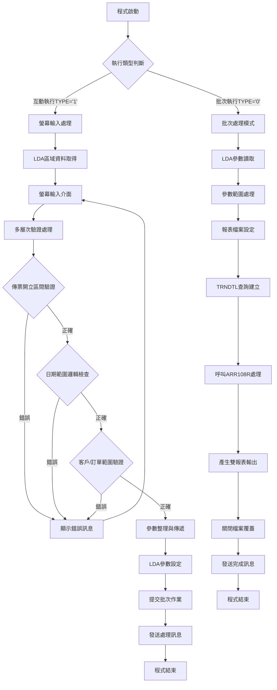
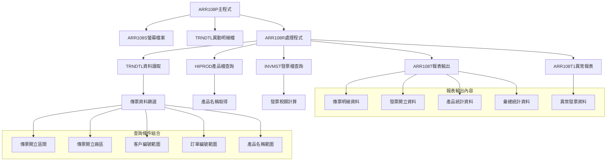
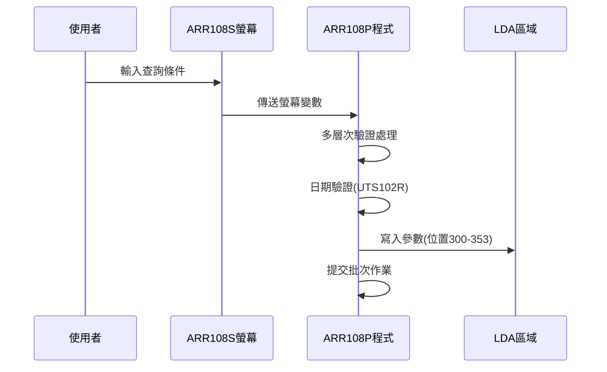
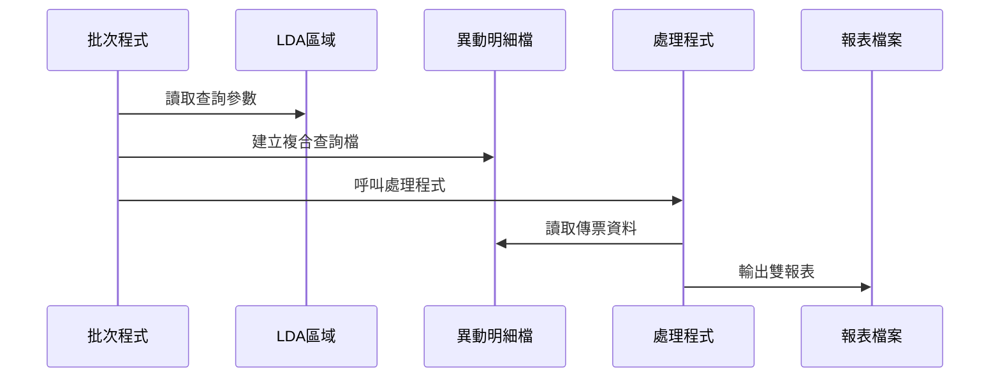
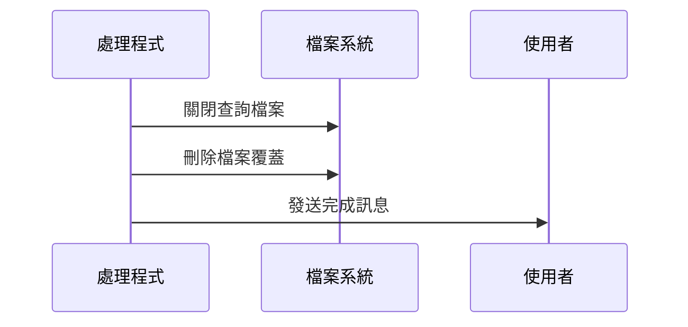
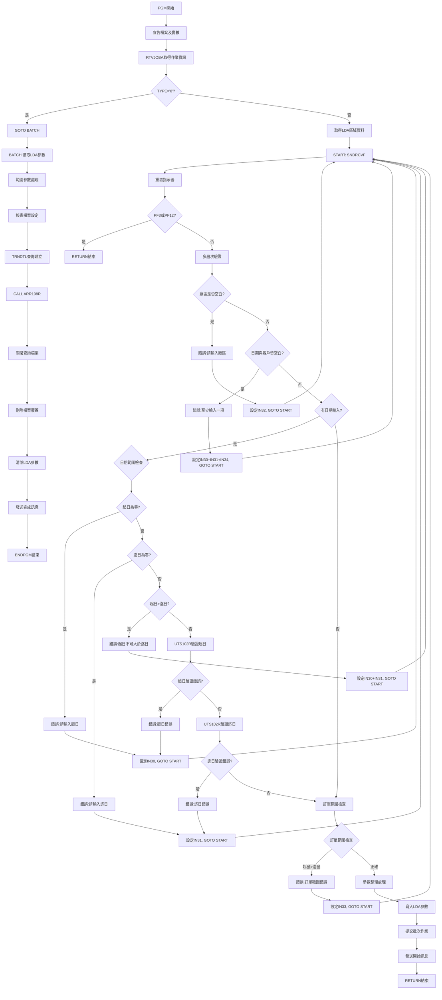

# ARR108P_P02 程式規格書

## 1. 基本資料

| 項目 | 內容 |
|------|------|
| **程式編號** | ARR108P |
| **程式名稱** | 內部傳票開立發票作業 |
| **程式類型** | CLP |
| **廠區** | P02 |
| **系統名稱** | 應收帳款系統 |
| **子系統** | 傳票發票管理作業 |
| **檔案位置** | P02CLSRC_THSRC/ARR108P.txt |

## 2. 🎯 程式功能說明

### 主要功能描述
ARR108P是內部傳票開立發票作業的控制程式，主要功能包含：
- 傳票開立區間的查詢條件設定
- 多維度篩選條件處理（客戶、訂單、產品名稱）
- 傳票發票明細報表產生
- 發票異常情況報表輸出
- 產品統計和彙總分析

### 🎯 業務流程詳細說明



#### 業務流程關鍵階段說明

**階段一：執行模式識別**
- 透過RTVJOBA取得作業執行類型
- TYPE='0'為批次模式，直接跳轉BATCH處理
- TYPE='1'為互動模式，進入螢幕輸入流程

**階段二：螢幕互動處理**
- 從LDA區域取得使用者資訊(DEVN,USER,AREA)
- 透過SNDRCVF進行螢幕互動
- 初始化所有錯誤指示器

**階段三：多層次驗證機制**
- 傳票開立廠區必須輸入
- 開立區間與客戶編號至少一項必須輸入
- 傳票開立起迄日期邏輯檢查
- 日期格式有效性驗證(UTS102R)
- 訂單編號範圍邏輯驗證

**階段四：條件式查詢邏輯**
- 依據輸入條件智能設定查詢範圍
- 空白客戶自動設為全範圍查詢
- 空白訂單自動設為全範圍查詢
- 空白產品名稱自動設為全範圍查詢

**階段五：TRNDTL查詢處理**
- 建立多條件OPNQRYF查詢
- 包含傳票代碼(AR05)、廠區、日期範圍等複合條件
- 依傳票入帳日期和傳票號碼排序
- 呼叫ARR108R程式進行資料處理

**階段六：雙報表產生**
- ARR108T：傳票發票明細報表
- ARR108T1：發票異常報表
- 支援多種格式輸出和統計功能

### 🎯 智能處理邏輯
- 條件自動補強：輸入條件不完整時自動設定合理預設值
- 範圍智能擴展：空白範圍自動設為最大範圍查詢
- 廠區代碼轉換：自動轉換廠區代碼為中文說明
- 異常資料處理：自動識別並處理發票異常情況

### 🎯 資料一致性確保機制
- LDA參數機制：確保互動與批次處理參數一致性
- 檔案共享模式：TRNDTL檔案使用SHARE(*YES)避免鎖定
- 查詢條件完整性：多重條件確保查詢結果準確性
- 錯誤處理機制：完整的錯誤檢查和恢復機制

## 3. 🎯 檔案架構與關聯圖

### 使用檔案清單

| 檔案名稱 | 檔案類型 | 用途說明 | 存取方式 |
|----------|----------|----------|----------|
| ARR108S | DSPF | 螢幕輸入檔案 | 輸入/輸出 |
| TRNDTL | PF | 內部傳票異動明細檔案 | 查詢 |
| HIPROD | PF | 產品主檔 | 查詢 |
| INVMST | PF | 發票主檔 | 查詢 |
| ARR108T | PRTF | 傳票發票明細報表檔案 | 輸出 |
| ARR108T1 | PRTF | 發票異常報表檔案 | 輸出 |

### 🎯 檔案關聯詳細視覺化圖表



### 🎯 資料流向詳細說明

#### 環境準備階段的資料流向


#### 業務處理階段的資料流向


#### 環境清理階段的資料流向


## 4. 🎯 檔案欄位規格說明

### 主要資料結構

#### ARR108S 螢幕檔案欄位規格

| 欄位名稱 | 型態 | 長度 | 位置 | 屬性 | 說明 |
|----------|------|------|------|------|------|
| S#DEVN | CHAR | 10 | 2,70 | O | 終端機代號 |
| S#USER | CHAR | 10 | 3,2 | O | 使用者代號 |
| S#DAT1 | NUMERIC | 8,0 | 9,42 | B | 傳票開立起日 |
| S#DAT2 | NUMERIC | 8,0 | 9,54 | B | 傳票開立迄日 |
| S#AREA | CHAR | 1 | 11,42 | B | 傳票開立廠區 |
| S#CUNO | CHAR | 6 | 13,31 | B | 傳票客戶編號 |
| S#ORNS | CHAR | 6 | 15,42 | B | 傳票訂單起號 |
| S#ORNE | CHAR | 6 | 15,51 | B | 傳票訂單迄號 |
| S#PDN1 | CHAR | 3 | 17,42 | B | 傳票產品名稱 |
| S#ERR | CHAR | 70 | 24,2 | O | 錯誤訊息 |

#### TRNDTL 異動明細檔案欄位規格

| 欄位名稱 | 型態 | 長度 | 說明 |
|----------|------|------|------|
| TXFLAG | CHAR | 1 | 處理標記 |
| TXCODE | CHAR | 4 | 異動代碼 |
| TXNO | CHAR | 8 | 異動單號 |
| TXITEM | NUMERIC | 2,0 | 項次 |
| TXACNT | CHAR | 1 | 會計記號 |
| TXDATE | NUMERIC | 8,0 | 異動日期 |
| TXACDT | NUMERIC | 8,0 | 入帳日期 |
| TXCUNO | CHAR | 6 | 客戶編號 |
| TXCUNM | CHAR | 10 | 客戶名稱 |
| TXORNO | CHAR | 9 | 訂單編號 |
| TXIVNO | CHAR | 10 | 發票號碼 |
| TXPCNO | CHAR | 8 | 裝運編號 |
| TXVUNO | CHAR | 7 | 憑證號碼 |
| TXRVID | CHAR | 2 | 營業員代號 |
| TXSALE | CHAR | 2 | 出貨員代號 |
| TXSATP | CHAR | 1 | 稅記號 |
| TXIVTP | CHAR | 1 | 發票記號 |
| TXPDNM | CHAR | 5 | 產品代號 |
| TXAMT | NUMERIC | 11,0 | 異動金額 |
| TXQTY | NUMERIC | 7,0 | 異動數量 |
| TXUPRC | NUMERIC | 5,3 | 單價 |

### 🔍 重點欄位切割技術詳解

#### DS結構完整分析

**ARR108R程式中的D#TEXT欄位切割**：

```
D#TEXT (22字元)：[XXXX|XXXXXXXXXXXXXXXXXX]
                  ↓    ↓
D#PDNM (4字元)： [XXXX]                  產品代號
D#CHIN (18字元)：     [XXXXXXXXXXXXXXXXXX] 中文說明
```

#### 產品陣列切割技術

**D#ARY1陣列結構切割**：

```
D#ARY1 (47字元)：[XXXXX|XXXXXXXXXXXX|XXXXXXXX|XXXXXXXX|XXXXXXXXXXXX]
                  ↓     ↓            ↓        ↓        ↓
D#PDNO (5字元)：  [XXXXX]                                        產品代號
D#AMT (12字元)：        [XXXXXXXXXXXX]                           金額累計
D#QTY (8字元)：                      [XXXXXXXX]                  數量累計  
D#TAX (8字元)：                               [XXXXXXXX]         稅額累計
D#TAMT (12字元)：                                      [XXXXXXXXXXXX] 含稅金額
```

#### 傳票保留欄位切割

**TXRESV欄位重用技術**：

```
TXRESV (30字元)：[XXXXX|XXXXXXXX|XX|XXX|XXXXXX]
                  ↓     ↓        ↓  ↓   ↓
D#PDN1 (5字元)：  [XXXXX]                     產品代號1
保留欄位：            [XXXXXXXX]              保留空間
D#VRTM (2字元)：                [XX]          版次
D#PDS1 (3字元)：                   [XXX]      產品系列1
其他保留：                           [XXXXXX] 其他用途
```

#### 實際數據範例說明
```
產品陣列範例：
- D#PDNO = 'ST001' (鋼材產品)
- D#AMT = 1500000 (金額)
- D#QTY = 100 (數量)
- D#TAX = 75000 (5%稅額)
- D#TAMT = 1575000 (含稅總額)

傳票欄位範例：
- TXCODE = 'AR05' (應收傳票)
- TXNO = 'T2024001' (傳票號碼)
- TXACDT = 20241228 (入帳日期)
```

### 重要變數定義表

| 變數名稱 | 型態 | 長度 | 說明 | 使用位置 |
|----------|------|------|------|----------|
| &TYPE | CHAR | 1 | 作業類型(0:批次,1:互動) | 程式主體 |
| &S#DEVN | CHAR | 10 | 終端機代號 | LDA讀取 |
| &S#USER | CHAR | 10 | 使用者代號 | LDA讀取 |
| &W#DAT1 | CHAR | 8 | 開立起日暫存 | 日期處理 |
| &W#DAT2 | CHAR | 8 | 開立迄日暫存 | 日期處理 |
| &W#FLAG | CHAR | 1 | 日期驗證旗標 | UTS102R回傳 |
| &P#PDAT | CHAR | 8 | 日期參數 | UTS102R輸入 |
| &P#MODE | CHAR | 1 | 驗證模式 | UTS102R輸入 |
| &P#MTL | CHAR | 24 | 月份資料 | UTS102R輸出 |
| &P#LEAP | CHAR | 1 | 閏年標記 | UTS102R輸出 |
| &W#CUNS | CHAR | 6 | 客戶起始編號 | 範圍處理 |
| &W#CUNE | CHAR | 6 | 客戶結束編號 | 範圍處理 |
| &W#PDNS | CHAR | 5 | 產品起始代號 | 範圍處理 |
| &W#PDNE | CHAR | 5 | 產品結束代號 | 範圍處理 |

## 5. 🎯 輸出/入螢幕布局

### 螢幕布局完整視覺化

```
+----------------------------------------------------------+
|99/12/28      東鋼鐵股份有限公司暨關係企業       ARR108S  |
|08:30:25      內部傳票開立發票作業              TERMINAL |
|USER01                                                    |
|                                                          |
|                                                          |
|                                                          |
|                                                          |
|                                                          |
|        傳票開立區間：[______/__/__] ~~ [______/__/__]    |
|                     (空白為全部期間)                     |
|        傳票開立廠區：[_]                                 |
|                                                          |
|        傳票客戶編號：[______] (空白為全部客戶)           |
|                                                          |
|        傳票訂單編號：[______] ~ [______] (空白為全部)    |
|                                                          |
|         傳票產品名稱：[___] (空白為全部產品)             |
|                                                          |
|                                                          |
|                                                          |
|                                                          |
|                                                          |
|執行動作:     PF3=離開作業     PF12=回到前頁              |
|[錯誤訊息顯示區]                                          |
+----------------------------------------------------------+
```

### 🎯 畫面欄位詳細說明

| 欄位 | 位置 | 長度 | 類型 | 輸入格式 | 驗證規則 | 必填 |
|------|------|------|------|----------|----------|------|
| 開立起日 | 9,42 | 8 | 數字 | YYYYMMDD | 日期格式,與客戶編號至少一項必填 | C |
| 開立迄日 | 9,54 | 8 | 數字 | YYYYMMDD | 日期格式,不可小於起日 | C |
| 開立廠區 | 11,42 | 1 | 英文字母 | P/M/T/K/H/U | 必須為有效廠區代碼 | Y |
| 客戶編號 | 13,31 | 6 | 英數字 | XXXXXX | 與開立日期至少一項必填 | C |
| 訂單起號 | 15,42 | 6 | 英數字 | XXXXXX | 可空白 | N |
| 訂單迄號 | 15,51 | 6 | 英數字 | XXXXXX | 不可小於起號 | N |
| 產品名稱 | 17,42 | 3 | 英數字 | XXX | 可空白 | N |

### 🎯 畫面控制邏輯

#### 指示器控制說明
- **IN30**：開立起日錯誤時亮起，欄位顯示反白閃爍
- **IN31**：開立迄日錯誤時亮起，欄位顯示反白閃爍
- **IN32**：開立廠區錯誤時亮起，欄位顯示反白閃爍
- **IN33**：訂單編號範圍錯誤時亮起，欄位顯示反白閃爍
- **IN34**：客戶編號錯誤時亮起，欄位顯示反白閃爍

#### 欄位顯示屬性
- **DSPATR(PC)**：保護字元，防止游標停留
- **DSPATR(RI)**：反向顯示，錯誤時反白提示
- **EDTCDE(Z)**：數字編輯，前導零顯示

#### 廠區代碼說明
- **P**：屏東廠
- **M**：屏東廠
- **T**：台中廠
- **K**：高雄廠
- **H**：花蓮廠
- **U**：新竹廠

### 功能鍵詳細定義

| 功能鍵 | 功能說明 | 處理邏輯 | 系統行為 |
|--------|----------|----------|----------|
| **PF3** | 離開作業 | 設定IN03='1' | 直接RETURN結束程式 |
| **PF12** | 回到前頁 | 設定IN12='1' | 直接RETURN結束程式 |
| **ENTER** | 確認執行 | 觸發驗證邏輯 | 驗證通過後提交批次作業 |

### 操作流程
1. 輸入傳票開立區間（與客戶編號至少一項必填）
2. 選擇傳票開立廠區（必填）
3. 輸入客戶編號（可空白）
4. 輸入訂單編號範圍（可空白）
5. 輸入產品名稱（可空白）
6. 按ENTER確認，系統進行驗證
7. 驗證通過後提交批次作業
8. 顯示處理開始訊息

## 6. 🎯 處理流程程序說明

### 🎯 主程序邏輯深度分析

#### 程式執行流程圖


#### 🎯 詳細處理步驟逐一分析

**步驟1：環境初始化與識別**
- 宣告ARR108S螢幕檔案
- 定義多組工作變數及參數變數
- 取得作業執行類型判斷執行模式

**步驟2：LDA區域資料處理**
- 讀取終端機代號(位置1011-1020)
- 讀取使用者代號(位置1001-1010) 
- 讀取使用者廠區(位置1021)

**步驟3：螢幕互動循環處理**
- SNDRCVF等待使用者輸入
- 重置五個錯誤指示器(IN30-IN34)
- 清除錯誤訊息變數

**步驟4：功能鍵處理**
- 檢查IN03(PF3)或IN12(PF12)
- 任一按下即RETURN結束程式

**步驟5：必填欄位驗證**
- 廠區必須輸入檢查
- 日期區間與客戶編號至少一項必填檢查

**步驟6：條件式日期驗證**
- 僅在有輸入日期時進行驗證
- 起日迄日非零檢查
- 日期區間邏輯檢查
- UTS102R日期格式驗證

**步驟7：訂單範圍驗證**
- 訂單起號不可大於迄號檢查
- 自動補齊迄號邏輯

**步驟8：LDA參數傳遞機制**
- 位置300-307：開立起日
- 位置308-315：開立迄日
- 位置316：開立廠區
- 位置320-325：客戶編號
- 位置331-336：訂單起號
- 位置341-346：訂單迄號
- 位置351-353：產品名稱

**步驟9：批次作業提交**
- SBMJOB提交ARR108P批次作業
- 使用ARJOBD作業描述
- 作業名稱設為ARR108P

### 🎯 子程序邏輯分析

#### ARR108R主處理程序
**功能**：傳票發票明細報表產生
**邏輯**：
1. 初始化報表環境和統計變數
2. 讀取TRNDTL異動明細記錄
3. 查詢HIPROD取得產品中文名稱
4. 進行產品統計和金額累計
5. 輸出ARR108T明細報表

#### 發票異常處理程序
**功能**：產生ARR108T1異常報表
**邏輯**：
1. 查詢INVMST發票主檔取得稅額
2. 計算含稅金額
3. 進行異常發票統計
4. 輸出異常報表記錄

#### 產品統計陣列處理
**功能**：產品別金額數量統計
**邏輯**：
1. 使用36元素陣列進行產品統計
2. 動態新增產品項目
3. 累計金額、數量、稅額
4. 排序後輸出統計結果

### 🎯 特殊邏輯處理

#### 廠區代碼轉換邏輯
```
SELECT廠區代碼轉換：
P → '屏東'
M → '屏東'  
T → '台中'
K → '高雄'
H → '花蓮'
U → '新竹'
```

#### 範圍參數處理邏輯
```
客戶範圍處理：
IF 客戶編號空白 THEN
    W#CUNS = '      '(6個空格)
    W#CUNE = '999999'
ELSE
    W#CUNS = W#CUNE = 客戶編號

訂單範圍處理：
IF 訂單起迄皆空白 THEN
    S#ORNS = '      '
    S#ORNE = '999999'

產品範圍處理：
IF 產品名稱空白 THEN
    W#PDNS = '     '(5個空格)
    W#PDNE = '99999'
ELSE
    W#PDNS = W#PDNE = 產品名稱
```

#### TRNDTL查詢條件建構
```
複合查詢條件：
TXCODE = 'AR05' (應收傳票)
TXFLAG ≠ 'D' (非刪除記錄)
NO = 廠區代碼
TXCUNO 在客戶範圍內
TXORNO 在訂單範圍內  
TXPDNM 在產品範圍內
DATE 在日期範圍內
```

### 🎯 錯誤處理與資料完整性控制

#### 錯誤檢查優先順序
1. 必填欄位檢查(廠區)
2. 組合必填檢查(日期與客戶)
3. 條件式邏輯檢查(日期範圍)
4. 格式有效性檢查(日期格式)
5. 業務規則檢查(訂單範圍)

#### 資料完整性保障機制
- LDA參數完整性：確保所有參數正確傳遞
- 查詢條件完整性：多重條件確保查詢準確
- 檔案存取完整性：共享模式避免資料鎖定
- 報表輸出完整性：雙報表確保資訊完整

## 7. 🎯 數據操作與轉換分析

### 檔案操作詳解

#### READ操作邏輯
- **TRNDTL讀取**：使用OPNQRYF建立多條件查詢檔案
- **HIPROD讀取**：使用CHAIN依產品代碼查詢產品名稱
- **INVMST讀取**：使用CHAIN依發票號碼查詢稅額資料
- **查詢排序**：依傳票入帳日期和傳票號碼排序

#### WRITE操作邏輯
- **報表標題**：每頁開始時WRITE標題記錄
- **明細記錄**：逐筆WRITE傳票明細資料
- **統計記錄**：階段性WRITE小計和總計記錄
- **異常記錄**：條件式WRITE異常發票資料

#### 陣列操作邏輯
- **產品陣列**：36元素陣列動態管理產品統計
- **陣列排序**：使用SORTA進行產品陣列排序
- **陣列搜尋**：循環搜尋現有產品項目
- **陣列更新**：動態新增和更新產品統計

### 數據轉換邏輯

#### 日期格式處理
```
螢幕輸入：8位數字格式(YYYYMMDD)
LDA傳遞：8字元字串格式
UTS102R驗證：標準日期驗證格式
報表輸出：'YYYY/MM/DD'格式化顯示
```

#### 廠區代碼轉換
```
輸入代碼 → 中文說明：
P → '屏東'
M → '屏東'
T → '台中'
K → '高雄'  
H → '花蓮'
U → '新竹'
```

#### 金額數量累計轉換
```
明細累計：逐筆累計傳票金額和數量
發票累計：逐張累計發票金額和稅額
產品累計：按產品分類累計統計
總計轉換：各級統計轉換為報表格式
```

### 計算邏輯分析

#### 金額統計計算
```
發票小計：W#AMT1 = Σ(傳票金額)
發票總計：T#AMTT = Σ(發票金額)
產品統計：D#AMT = Σ(產品別金額)
最終統計：W#AMT3 = Σ(產品統計)
```

#### 稅額計算邏輯
```
發票稅額查詢：CHAIN INVMST取得INATAX
含稅金額計算：T1TAM = T1AMT + T1TAX
產品稅額累計：D#TAX = Σ(稅額)
稅額總計：W#TAX3 = Σ(產品稅額)
```

#### 數量統計計算
```
明細數量：T#QTY = TXQTY
發票數量：T#QTYT = Σ(明細數量)
產品數量：D#QTY = Σ(產品別數量)
總數量：W#QTY3 = Σ(產品數量)
```

### 檢核機制詳解

#### 資料有效性檢核
```
傳票代碼檢核：必須為'AR05'
傳票標記檢核：TXFLAG ≠ 'D'
日期範圍檢核：DATE在指定範圍內
客戶範圍檢核：TXCUNO在指定範圍內
訂單範圍檢核：TXORNO在指定範圍內
```

#### 產品資料檢核
- 產品代碼存在性：CHAIN HIPROD檢查
- 產品名稱有效性：取得F4CHIN中文名稱
- 陣列邊界檢核：防止陣列越界存取
- 空值處理：產品名稱空白時顯示'尚未命名'

#### 發票資料檢核
- 發票號碼有效性：CHAIN INVMST檢查
- 稅額計算正確性：稅額非空值檢核  
- 含稅金額合理性：金額計算邏輯檢核
- 異常資料識別：異常發票自動標記

#### 檢核失敗處理方式
1. 記錄檢核失敗項目
2. 使用預設值或空值處理
3. 繼續處理下一筆資料
4. 在報表中標記異常項目

## 8. 🎯 錯誤處理程序說明

### 🎯 詳細錯誤代碼清冊

| 錯誤代碼 | 錯誤訊息 | 原因說明 | 處理方式 | 預防措施 |
|----------|---------|---------|---------|----------|
| **USER001** | 請輸入傳票開立廠區 | 廠區欄位為空白 | 1. 設定IN32='1'顯示錯誤<br>2. 回到輸入畫面<br>3. 游標定位至廠區欄位 | 在畫面上提供廠區代碼說明 |
| **USER002** | 開立區間與客戶編號至少輸入一項 | 日期範圍和客戶編號皆為空白 | 1. 設定IN30+IN31+IN34='1'<br>2. 多欄位同時反白提示<br>3. 要求至少輸入一項條件 | 提供範例說明輸入要求 |
| **USER003** | 請輸入傳票開立起日 | 有輸入迄日但起日為零 | 1. 設定IN30='1'錯誤顯示<br>2. 回到輸入畫面<br>3. 要求輸入完整日期區間 | 提供日期區間輸入提示 |
| **USER004** | 請輸入傳票開立迄日 | 有輸入起日但迄日為零 | 1. 設定IN31='1'錯誤顯示<br>2. 回到輸入畫面<br>3. 要求輸入完整日期區間 | 自動帶入系統日期作預設 |
| **USER005** | 開立迄日不可大於開立起日 | 日期區間邏輯錯誤 | 1. 設定IN30+IN31='1'<br>2. 兩個日期欄位同時反白<br>3. 要求重新輸入正確區間 | 提供日期區間邏輯說明 |
| **USER006** | 傳票開立起日錯誤！ | UTS102R日期驗證失敗 | 1. 設定IN30='1'錯誤顯示<br>2. 檢查日期格式和有效性<br>3. 重新輸入正確日期 | 使用日期編輯碼輔助輸入 |
| **USER007** | 傳票開立迄日錯誤！ | UTS102R日期驗證失敗 | 1. 設定IN31='1'錯誤顯示<br>2. 檢查日期格式和有效性<br>3. 重新輸入正確日期 | 提供日期格式範例說明 |
| **USER008** | 訂單起號不可大於迄號！ | 訂單範圍邏輯錯誤 | 1. 設定IN33='1'錯誤顯示<br>2. 訂單範圍欄位反白<br>3. 重新輸入正確範圍 | 提供訂單編號範圍說明 |
| **FILE001** | TRNDTL檔案查詢失敗 | 異動明細檔無法存取 | 1. 檢查檔案是否存在<br>2. 確認檔案權限<br>3. 重新執行程式 | 定期檢查檔案狀態 |
| **FILE002** | ARR108T報表檔案建立失敗 | 報表檔案無法建立 | 1. 檢查輸出佇列狀態<br>2. 確認磁碟空間<br>3. 重新提交作業 | 監控系統資源狀況 |
| **FILE003** | HIPROD產品檔案存取失敗 | 產品主檔無法查詢 | 1. 檢查產品檔案狀態<br>2. 確認檔案權限<br>3. 使用預設值繼續處理 | 定期維護產品主檔 |
| **SYS001** | 批次作業提交失敗 | SBMJOB指令執行錯誤 | 1. 檢查作業佇列狀態<br>2. 確認ARJOBD作業描述<br>3. 手動重新提交 | 定期檢查作業佇列 |
| **IN03='1'** | 使用者按下PF3離開 | 正常離開程式功能 | 直接RETURN結束程式 | 提供確認訊息避免誤按 |
| **IN12='1'** | 使用者按下PF12返回 | 正常返回前頁功能 | 直接RETURN結束程式 | 保存使用者輸入資料 |

### 🎯 系統異常處理邏輯

#### 檔案操作失敗處理
- **TRNDTL查詢失敗**：檢查查詢條件，重新建立查詢檔案
- **HIPROD存取失敗**：使用產品代碼作為名稱，繼續處理
- **INVMST查詢失敗**：稅額設為零，標記為異常發票
- **報表檔案錯誤**：終止報表產生，發送錯誤訊息

#### 程式調用失敗處理
- **UTS102R呼叫失敗**：視為日期格式錯誤，要求重新輸入
- **ARR108R處理失敗**：記錄失敗位置，發送詳細錯誤訊息
- **子程序調用失敗**：跳過該筆處理，繼續下一筆資料

#### 資料完整性錯誤處理
- **LDA參數異常**：使用預設值並記錄警告訊息
- **查詢條件無效**：調整為最大範圍查詢
- **統計數據異常**：重新計算或使用近似值

#### 並發控制失敗處理
- **檔案鎖定衝突**：使用SHARE(*YES)共享模式
- **查詢檔案衝突**：等待後重新建立查詢
- **報表輸出衝突**：調整輸出佇列或延後處理

## 9. 🎯 備註

### 🎯 特殊注意事項

#### LDA參數傳遞擴展機制
- 程式支援多組參數傳遞，包含日期、廠區、客戶、訂單、產品範圍
- 參數位置固定且擴展性強，新增查詢條件時易於擴充
- 批次模式參數清除機制確保下次執行不受影響

#### 多維度查詢條件處理
- 支援五種查詢維度的組合查詢
- 空白條件自動轉換為最大範圍查詢
- 條件互斥性檢查避免無效查詢組合

#### 雙報表輸出機制
- ARR108T：主要傳票發票明細報表
- ARR108T1：發票異常狀況報表
- 兩報表同時產生，提供完整資訊視角

#### 產品統計陣列技術
- 使用36元素陣列進行動態產品統計
- 支援產品代碼自動分類和金額累計
- 陣列排序功能提供有序統計結果

#### 廠區代碼自動轉換
- 單字元廠區代碼自動轉換為中文說明
- 支援六個廠區的代碼轉換機制
- 報表輸出使用中文廠區名稱

#### 條件式驗證邏輯
- 日期驗證僅在有輸入日期時執行
- 客戶與日期至少一項必填的智能判斷
- 訂單範圍邏輯檢查和自動補齊

#### 檔案共享存取模式
- TRNDTL檔案使用SHARE(*YES)模式
- 避免批次處理時的檔案鎖定問題
- 支援多使用者同時查詢操作

#### 錯誤恢復機制
- 完整的錯誤指示器控制系統
- 多層次錯誤檢查和恢復邏輯
- 使用者友善的錯誤訊息顯示

#### 報表格式標準化
- 統一的報表標題和頁碼格式
- 標準化的欄位對齊和數值格式
- 支援198字元寬度報表輸出

#### 版本演進歷程說明
- 程式經多次功能擴充和修正
- 支援客戶範圍、訂單範圍、產品範圍等逐步新增功能
- 異常報表功能為後期新增的重要功能 