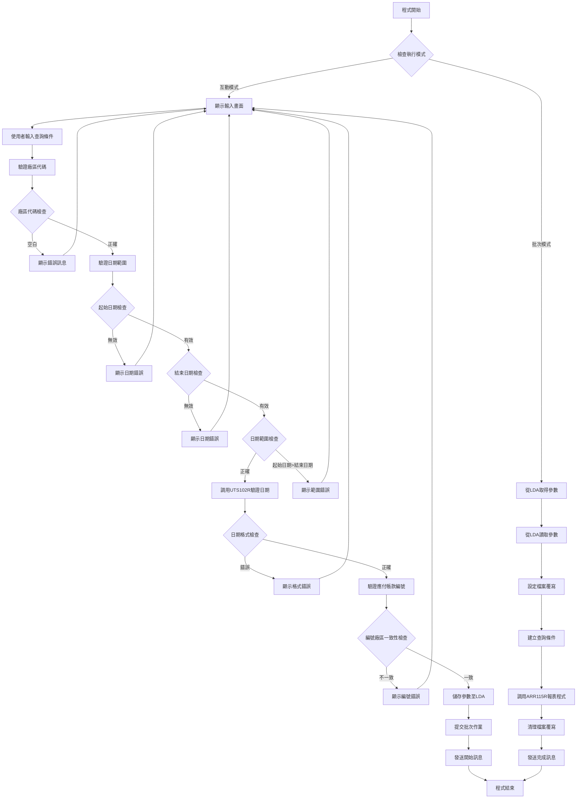
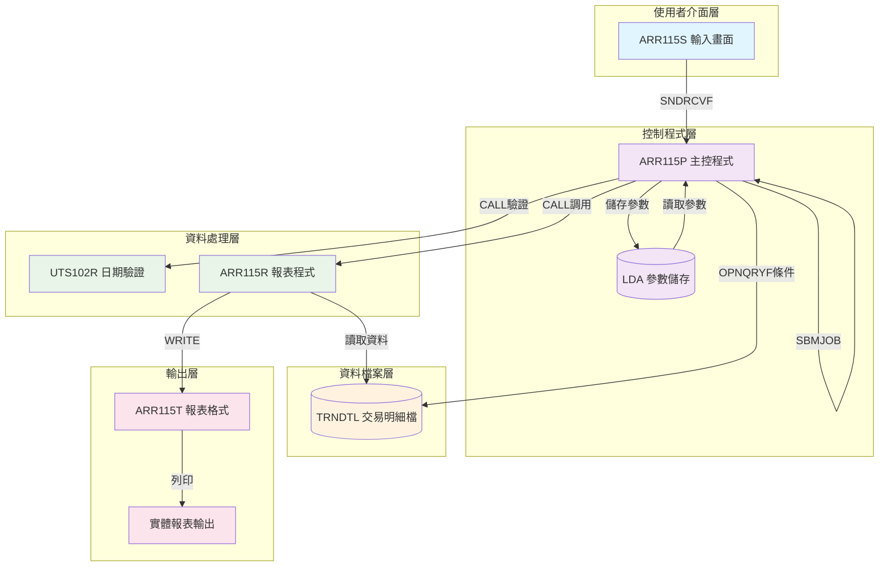
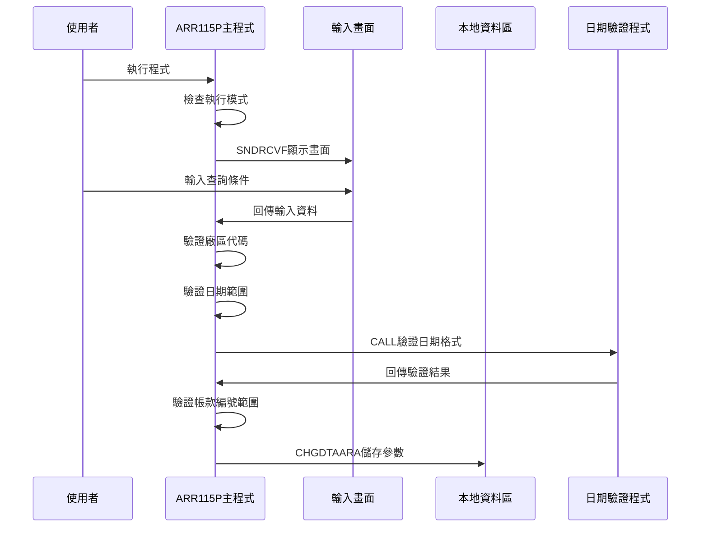
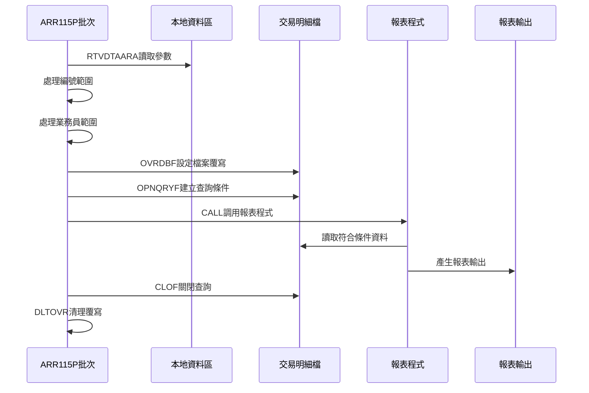
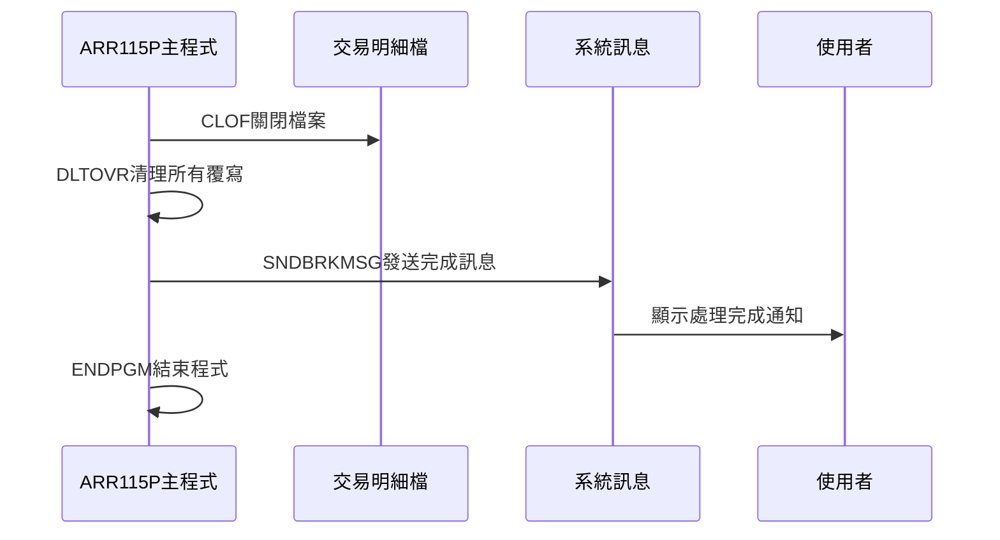
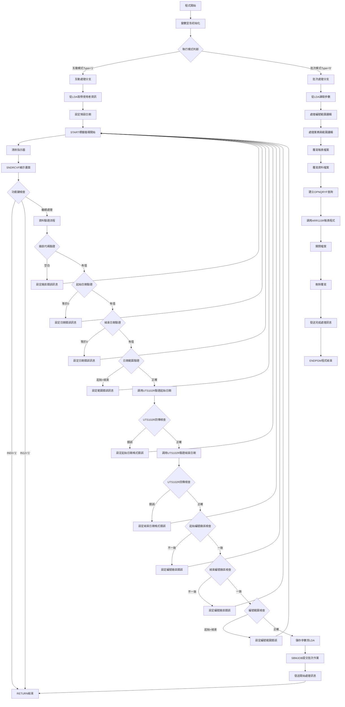

# ARR115P_P02 程式規格書

## 1. 基本資料

| 項目 | 內容 |
|------|------|
| **程式編號** | ARR115P |
| **程式名稱** | 應付帳款統計作業 |
| **程式類型** | CLP |
| **廠區** | P02 |
| **系統名稱** | 應收帳款系統 |
| **子系統** | 應付帳款報表子系統 |
| **檔案位置** | 東鋼list/ARR115P_P02.txt |

## 2. 🎯 程式功能說明

### 主要功能描述
ARR115P是應付帳款統計作業的控制程式，負責收集使用者輸入的查詢條件，進行資料驗證，然後調用報表程式產生應付帳款統計報表。

### 🎯 業務流程詳細說明

#### 完整業務流程圖


#### 業務流程關鍵階段說明

**階段1：參數收集與驗證**
- 程式首先檢查執行模式（互動式或批次）
- 互動模式下顯示ARR115S畫面供使用者輸入查詢條件
- 收集應付帳款查詢日期範圍、廠區代碼、帳款編號範圍、業務員代碼

**階段2：多層次驗證機制**
- 廠區代碼必須輸入，不可空白
- 日期範圍必須完整輸入且起始日期不可大於結束日期
- 調用UTS102R程式驗證日期格式正確性
- 應付帳款編號的廠區碼必須與選擇廠區一致

**階段3：智能處理邏輯**
- 程式自動判斷空白編號範圍時設定為全範圍查詢
- 自動處理業務員代碼範圍設定
- 動態建構OPNQRYF查詢條件字串

**階段4：資料一致性確保機制**
- 所有參數透過LDA在互動和批次模式間傳遞
- 確保批次執行時使用完全相同的查詢條件
- 檔案覆寫確保資料存取的一致性

## 3. 🎯 檔案架構與關聯圖

### 使用檔案清單

| 檔案名稱 | 檔案類型 | 用途說明 | 存取方式 |
|----------|----------|----------|----------|
| ARR115S | DSPF | 參數輸入畫面 | SNDRCVF |
| TRNDTL | PF | 交易明細主檔 | OPNQRYF查詢 |
| ARR115T | PRTF | 報表輸出格式 | 報表列印 |
| ARR115R | RPG | 報表處理程式 | CALL調用 |
| UTS102R | RPG | 日期驗證程式 | CALL調用 |

### 🎯 檔案關聯詳細視覺化圖表



### 🎯 資料流向詳細說明

#### 環境準備階段的資料流向


#### 業務處理階段的資料流向


#### 環境清理階段的資料流向


## 4. 🎯 檔案欄位規格說明

### 主要資料結構

#### TRNDTL交易明細檔案結構
```
記錄格式：TXREC
用途：儲存應付帳款交易明細資料
```

| 欄位名稱 | 位置 | 長度 | 型態 | 說明 |
|----------|------|------|------|------|
| TXFLAG | 1 | 1 | CHAR | 處理旗標 |
| TXCODE | 2-5 | 4 | CHAR | 交易代碼 |
| TXNO | 6-13 | 8 | CHAR | 交易編號 |
| TXITEM | 14-15 | 2 | DEC | 項次 |
| TXACNT | 16 | 1 | CHAR | 帳戶類別 |
| TXDATE | 17-24 | 8 | DEC | 交易日期 |
| TXACDT | 25-32 | 8 | DEC | 入帳日期 |
| TXCUNO | 33-38 | 6 | CHAR | 客戶編號 |
| TXCUNM | 39-48 | 10 | CHAR | 客戶名稱 |
| TXORNO | 49-57 | 9 | CHAR | 訂單編號 |
| TXIVNO | 58-67 | 10 | CHAR | 發票編號 |
| TXPCNO | 68-75 | 8 | CHAR | 採購編號 |
| TXVUNO | 76-82 | 7 | CHAR | 廠商編號 |
| TXRVID | 83-84 | 2 | CHAR | 業務員編號 |
| TXSALE | 85-86 | 2 | CHAR | 銷售員編號 |
| TXSATP | 87 | 1 | CHAR | 銷售類別 |
| TXIVTP | 88 | 1 | CHAR | 發票類別 |
| TXPDNM | 89-93 | 5 | CHAR | 產品名稱 |

### 🔍 重點欄位切割技術詳解

#### DS結構完整分析

**ARR115R程式中的主要DS結構定義**
```
DS結構1：交易保留欄位切割
0604A    DS
         1   30  TXRESV    (原始欄位30字元)
         1    5  D#PDNO    (產品編號切割)
        13   14  D#VRTM    (版本時間切割)
        19   21  D#PDS1    (產品描述切割)
```

#### 欄位切割視覺化展示

**TXRESV欄位切割對應圖**
```
TXRESV (30字元)：[XXXXX|      |XX|    |XXX|           ]
位置:            001   006    013  015  019  022      030
                  ↓     ↓      ↓    ↓    ↓    ↓        ↓
D#PDNO (5字元)：  [XXXXX]                              產品編號
D#VRTM (2字元)：          [XX]                         版本時間  
D#PDS1 (3字元)：                  [XXX]               產品描述
未使用區域：             [      ]     [    ]  [           ]
```

**位置對應詳細說明**
| 子欄位名稱 | 起始位置 | 結束位置 | 長度 | 型態 | 切割用途 |
|------------|----------|----------|------|------|----------|
| D#PDNO | 1 | 5 | 5 | CHAR | 產品編號識別 |
| D#VRTM | 13 | 14 | 2 | CHAR | 版本時間標記 |
| D#PDS1 | 19 | 21 | 3 | CHAR | 產品描述代碼 |

#### 切割邏輯詳細說明

**切割目的分析**
1. **空間最佳化**：將TXRESV 30字元空間重複利用，避免額外欄位定義
2. **資料結構化**：將混合資料依業務邏輯切割為有意義的子欄位
3. **相容性維護**：保持原有檔案格式不變，僅在程式層面重新詮釋

**切割實現方式**
```
在RPG程式中透過DS (Data Structure) 重新定義：
- 原始欄位：TXRESV 作為30字元完整欄位
- 切割欄位：D#PDNO、D#VRTM、D#PDS1 作為個別存取欄位
- 記憶體共享：所有切割欄位共享相同記憶體空間
```

#### 實際數據範例說明

**範例1：產品交易記錄**
```
TXRESV原始內容：'P0123    AB  XYZ           '
                 └─5─┘└6空白┘└2┘└4空白┘└3┘└9空白┘

切割後欄位：
D#PDNO = 'P0123'     (產品編號)
D#VRTM = 'AB'        (版本代碼)  
D#PDS1 = 'XYZ'       (產品分類)
```

**範例2：特殊處理記錄**
```
TXRESV原始內容：'SPEC     99  001           '
                 └─5─┘└6空白┘└2┘└4空白┘└3┘└9空白┘

切割後欄位：
D#PDNO = 'SPEC '     (特殊產品標記)
D#VRTM = '99'        (特殊版本)
D#PDS1 = '001'       (特殊代碼)
```

### 🎯 欄位挪用詳細分析

#### 挪用情況對比表

| 欄位名稱 | 原始設計用途 | 實際使用方式 | 挪用原因 | 影響評估 |
|----------|-------------|-------------|---------|----------|
| TXRESV | 一般保留欄位 | 多重資料切割儲存 | 節省檔案空間，提高資料密度 | 需要程式邏輯維護切割關係 |
| D#PDNO | 獨立產品編號欄位 | TXRESV切割子欄位 | 重複利用現有空間 | 依賴DS結構定義正確性 |
| D#VRTM | 獨立版本時間欄位 | TXRESV切割子欄位 | 統一資料存放位置 | 需要確保資料格式一致性 |
| D#PDS1 | 獨立產品描述欄位 | TXRESV切割子欄位 | 最佳化欄位利用率 | 維護複雜度增加 |

#### 挪用原因深度分析

**技術層面原因**
1. **檔案結構限制**：現有TRNDTL檔案結構已定型，新增欄位成本高
2. **相容性考量**：保持與舊版本程式的相容性
3. **效能考量**：避免檔案結構變更造成的系統影響

**業務層面原因**
1. **資料整合需求**：需要在單一記錄中儲存多種相關資訊
2. **查詢效率**：將相關資料集中儲存提高查詢效率
3. **維護成本**：避免大規模檔案結構調整

#### 挪用方式詳細說明

**DS重定義技術**
```
程式碼實現：
I            DS
I                                        1  30 TXRESV     ← 原始欄位
I                                        1   5 D#PDNO     ← 切割子欄位1
I                                       13  14 D#VRTM     ← 切割子欄位2  
I                                       19  21 D#PDS1     ← 切割子欄位3

存取方式：
- 寫入：透過D#PDNO、D#VRTM、D#PDS1分別寫入資料
- 讀取：可透過TXRESV整體讀取或個別子欄位讀取
- 驗證：需要確保切割邊界內的資料格式正確
```

#### 挪用影響評估

**正面影響**
1. **空間效率**：充分利用現有欄位空間，無需額外儲存空間
2. **程式彈性**：可同時以整體或切割方式存取資料
3. **維護成本**：避免大規模檔案格式變更

**負面影響**  
1. **複雜度增加**：程式邏輯需要維護切割關係正確性
2. **維護困難**：新進維護人員需要理解切割邏輯
3. **錯誤風險**：切割邊界錯誤可能造成資料損壞

### UDS使用者資料結構分析

#### UDS結構切割
```
UDS欄位切割：
位置 10011010：U#USID    (使用者ID)
位置 10111020：S#DEVN    (設備名稱)  
位置 300-307：U#DAT1     (起始日期)
位置 308-315：U#DAT2     (結束日期)
位置 316：    U#AREA     (廠區代碼)
```

### 重要變數定義表

| 變數名稱 | 長度 | 型態 | 用途說明 |
|----------|------|------|----------|
| &S#DAT1 | 8 | CHAR | 查詢起始日期 |
| &S#DAT2 | 8 | CHAR | 查詢結束日期 |
| &S#AREA | 1 | CHAR | 廠區代碼 |
| &S#NO1 | 6 | CHAR | 起始帳款編號 |
| &S#NO2 | 6 | CHAR | 結束帳款編號 |
| &S#SALE | 1 | CHAR | 業務員代碼 |
| &W#DAT1 | 8 | CHAR | 處理用起始日期 |
| &W#DAT2 | 8 | CHAR | 處理用結束日期 |
| &W#N1 | 6 | CHAR | 處理用起始編號 |
| &W#N2 | 6 | CHAR | 處理用結束編號 |
| &W#SAE1 | 1 | CHAR | 處理用起始業務員 |
| &W#SAE2 | 1 | CHAR | 處理用結束業務員 |

## 5. 🎯 輸出/入螢幕布局

### 螢幕布局完整視覺化

```
+------------------------------------------------------------------------------+
|93/01/16     東鋼鋼鐵股份有限公司應收帳款系統                      ARR115S   |
|10:25:30           應付帳款統計作業                               U01DEVN   |
|USER001                                                                       |
|                                                                              |
|                                                                              |
|                                                                              |
|                                                                              |
|                                                                              |
|                     應付帳款查詢日期：[____/__/__] ~~ [____/__/__]          |
|                                                                              |
|                     應付帳款查詢廠區：[_] (P/T/M/K/H可選)                   |
|                                                                              |
|                       應付編號：[______] ~ [______] (空白表示全部)           |
|                                                                              |
|                        業務員：[_] (空白表示全部)                           |
|                                                                              |
|                                                                              |
|                                                                              |
|                                                                              |
|                                                                              |
|                                                                              |
|                                                                              |
|功能鍵說明:           PF3=離開作業              PF12=回到上層                |
|[錯誤訊息顯示區域]                                                            |
+------------------------------------------------------------------------------+
```

### 🎯 畫面欄位詳細說明

| 欄位名稱 | 位置 | 長度 | 型態 | 屬性 | 驗證規則 | 說明 |
|----------|------|------|------|------|----------|------|
| S#DAT1 | 9,42 | 8 | 數值 | 必填,反白 | 日期格式YYYYMMDD | 查詢起始日期 |
| S#DAT2 | 9,56 | 8 | 數值 | 必填,反白 | 日期格式YYYYMMDD | 查詢結束日期 |
| S#AREA | 11,42 | 1 | 字元 | 必填,反白 | VALUES('P','T','M','K','H') | 廠區代碼 |
| S#NO1 | 13,42 | 6 | 字元 | 選填,反白 | 第一碼須與廠區一致 | 起始帳款編號 |
| S#NO2 | 13,51 | 6 | 字元 | 選填,反白 | 第一碼須與廠區一致 | 結束帳款編號 |
| S#SALE | 15,30 | 1 | 字元 | 選填 | 無特殊限制 | 業務員代碼 |

### 🎯 畫面控制邏輯

#### 指示器控制說明
| 指示器 | 控制欄位 | 觸發條件 | 顯示效果 |
|--------|----------|----------|----------|
| IN30 | S#DAT1 | 起始日期錯誤 | 欄位反白閃爍 |
| IN31 | S#DAT2 | 結束日期錯誤 | 欄位反白閃爍 |
| IN32 | S#AREA | 廠區代碼錯誤 | 欄位反白閃爍 |
| IN33 | S#NO1 | 起始編號錯誤 | 欄位反白閃爍 |
| IN34 | S#NO2 | 結束編號錯誤 | 欄位反白閃爍 |

### 功能鍵詳細定義

| 功能鍵 | 處理邏輯 | 系統行為 |
|--------|----------|----------|
| PF3 | 設定&IN03='1' | 程式執行RETURN結束 |
| PF12 | 設定&IN12='1' | 程式執行RETURN結束 |
| ENTER | 執行資料驗證 | 進行完整輸入驗證流程 |

### 操作流程
1. 系統顯示輸入畫面
2. 使用者輸入查詢條件
3. 按ENTER進行資料驗證
4. 驗證通過後提交批次作業
5. 按PF3或PF12離開程式

## 6. 🎯 處理流程程序說明

### 🎯 主程序邏輯深度分析

#### 程式執行流程圖


#### 🎯 詳細處理步驟逐一分析

**步驟1：程式初始化處理**
```
1. 宣告檔案：DCLF FILE(ARR115S)
2. 宣告變數：共16個工作變數
3. 取得工作資訊：RTVJOBA取得使用者、工作型態
4. 取得系統日期：RTVJOBA CYMDDATE取得當前日期
5. 判斷執行模式：TYPE='0'為批次，其他為互動
```

**步驟2：互動模式處理邏輯**
```
1. 從LDA取得使用者資訊：設備名稱、使用者ID、廠區
2. 設定畫面預設值：將當前日期設定為起始和結束日期
3. 顯示輸入畫面：SNDRCVF執行畫面互動
4. 檢查功能鍵：PF3或PF12直接結束程式
5. 執行完整驗證流程
```

**步驟3：資料驗證業務邏輯**
```
廠區驗證：
- 檢查S#AREA是否空白
- 錯誤時設定IN32='1'並顯示錯誤訊息

日期驗證：
- 檢查S#DAT1、S#DAT2是否為0
- 檢查起始日期是否大於結束日期
- 調用UTS102R驗證日期格式正確性

編號驗證：
- 檢查編號第一碼是否與選擇廠區一致
- 檢查起始編號是否大於結束編號
```

**步驟4：參數儲存與批次提交**
```
1. 將驗證後參數儲存至LDA指定位置：
   - 位置300-307：起始日期
   - 位置308-315：結束日期
   - 位置316：廠區代碼
   - 位置317-322：起始編號
   - 位置323-328：結束編號
   - 位置331：業務員代碼

2. 提交批次作業：
   - JOB(ARR115P)
   - JOBD(ARJOBD)
   - JOBQ(ARJOBQ)
   - 執行相同程式的批次模式
```

**步驟5：批次模式處理邏輯**
```
1. 從LDA讀取互動模式儲存的參數
2. 處理編號範圍邏輯：
   - 空白時設定為'      '到'999999'全範圍
   - 有值時使用原輸入值
3. 處理業務員範圍邏輯：
   - 空白時設定為' '到'9'全範圍
   - 有值時設定相同起始結束值
```

**步驟6：檔案查詢條件建構**
```
1. 覆寫報表檔案：設定輸出佇列為PPB0001H
2. 覆寫資料檔案：設定TRNDTL為共享模式
3. 建立OPNQRYF查詢條件：
   - TXCODE='AR05'：應付帳款交易
   - TXFLAG<>'D'：非刪除記錄
   - NO=廠區：第一碼為指定廠區
   - DATE範圍：在指定日期區間
   - TXRVID範圍：在指定業務員區間
   - TXNO範圍：在指定編號區間
4. 排序欄位：TXACDT(入帳日期)、TXNO(交易編號)
5. 對應欄位：DATE對應TXDATE、NO對應TXNO第一碼
```

### 🎯 子程序邏輯分析

#### UTS102R日期驗證程式調用
```
參數傳遞：
- &P#PDAT：待驗證日期(8位元)
- &P#MODE：驗證模式('1')
- &P#MTL：月份資料(24位元)
- &P#LEAP：閏年旗標(1位元)
- &W#FLAG：回傳結果('0'表示正確)

呼叫方式：
CALL PGM(UTS102R) PARM(&P#PDAT &P#MODE &P#MTL &P#LEAP &W#FLAG)

回傳檢查：
IF COND(&W#FLAG *NE '0') 表示日期格式錯誤
```

#### ARR115R報表程式調用
```
呼叫方式：
CALL PGM(ARR115R)

前置條件：
- TRNDTL檔案已開啟OPNQRYF
- 報表檔案已設定覆寫
- 所有參數已儲存至LDA

後續處理：
- 關閉OPNQRYF：CLOF OPNID(TRNDTL)
- 清除覆寫：DLTOVR FILE(*ALL)
```

### 🎯 特殊邏輯處理

#### 編號範圍預設邏輯
```
IF COND((&S#NO1 *EQ '      ') *AND (&S#NO2 *EQ '      ')) THEN(DO)
    CHGVAR VAR(&W#N1) VALUE('      ')
    CHGVAR VAR(&W#N2) VALUE('999999')
ENDDO
ELSE (DO)
    CHGVAR VAR(&W#N1) VALUE(&S#NO1)
    CHGVAR VAR(&W#N2) VALUE(&S#NO2)
ENDDO
```

#### 業務員範圍預設邏輯
```
IF COND(&S#SALE *EQ ' ') THEN(DO)
    CHGVAR VAR(&W#SAE1) VALUE(' ')
    CHGVAR VAR(&W#SAE2) VALUE('9')
ENDDO
ELSE (DO)
    CHGVAR VAR(&W#SAE1) VALUE(&S#SALE)
    CHGVAR VAR(&W#SAE2) VALUE(&S#SALE)
ENDDO
```

### 🎯 錯誤處理與資料完整性控制

#### 錯誤處理機制
```
每個驗證錯誤都執行：
1. 設定對應指示器為'1'
2. 設定S#ERR錯誤訊息
3. 執行GOTO CMDLBL(START)回到輸入循環
```

#### 資料完整性檢查
```
1. 日期格式驗證：調用標準日期驗證程式
2. 廠區代碼驗證：必須為有效廠區代碼
3. 編號一致性檢查：編號第一碼必須與廠區一致
4. 範圍邏輯檢查：起始值不可大於結束值
```

## 7. 🎯 數據操作與轉換分析

### 檔案操作詳解

#### READ操作
- **TRNDTL檔案讀取**：透過OPNQRYF建立查詢條件後，由ARR115R程式循序讀取符合條件的記錄

#### WRITE操作
- **報表寫出**：ARR115R程式將處理結果寫入ARR115T報表格式，產生實體報表輸出

#### UPDATE操作
- **LDA更新**：使用CHGDTAARA更新本地資料區，儲存查詢參數供批次模式使用

#### DELETE操作
- **覆寫清除**：使用DLTOVR清除所有檔案覆寫設定，確保系統環境乾淨

### 數據轉換邏輯

#### 日期格式轉換
```
系統日期轉換：
RTVJOBA CYMDDATE(&W#DATE)           // 取得YYYYMMDD格式
CHGVAR VAR(&W#DATE) VALUE('0' *CAT &W#DATE)  // 加前導0成為9位數
```

#### 字串操作和格式化
```
編號廠區提取：
CHGVAR VAR(&W#NO1) VALUE(%SST(&S#NO1 1 1))  // 取編號第一碼
CHGVAR VAR(&W#NO2) VALUE(%SST(&S#NO2 1 1))  // 取編號第一碼
```

#### 查詢條件字串建構
```
動態OPNQRYF條件：
'(TXCODE  *EQ "AR05"             ) *AND +
(TXFLAG  *NE "D"                ) *AND +
(NO      *EQ "' || &S#AREA || '") *AND +
(DATE    *GE "' || &W#DAT1 || '") *AND +
(DATE    *LE "' || &W#DAT2 || '") *AND +
(TXRVID  *GE "' || &W#SAE1 || '") *AND +
(TXRVID  *LE "' || &W#SAE2 || '") *AND +
(TXNO    *GE "' || &W#N1   || '") *AND +
(TXNO    *LE "' || &W#N2   || '")'
```

### 計算邏輯分析

#### 範圍設定計算
```
全範圍設定邏輯：
- 編號範圍：空白時設為'      '至'999999'
- 業務員範圍：空白時設為' '至'9'
```

### 檢核機制詳解

#### 數據有效性檢查
1. **非空檢查**：廠區代碼必須輸入
2. **數值檢查**：日期必須為有效數值
3. **格式檢查**：調用UTS102R驗證日期格式
4. **範圍檢查**：起始值必須小於等於結束值
5. **一致性檢查**：編號第一碼與廠區代碼一致

#### 檢核失敗處理方式
1. **設定錯誤指示器**：對應欄位反白顯示
2. **顯示錯誤訊息**：在畫面底部顯示具體錯誤內容
3. **重新輸入**：回到輸入畫面等待使用者修正

#### 檢核規則的業務依據
1. **廠區管制**：確保只查詢指定廠區資料
2. **日期合理性**：確保查詢範圍有意義
3. **資料一致性**：確保編號與廠區對應正確

## 8. 🎯 錯誤處理程序說明

### 🎯 詳細錯誤代碼清冊

| 錯誤代碼 | 錯誤訊息 | 原因說明 | 處理方式 | 預防措施 |
|----------|---------|---------|---------|----------|
| **USER001** | 請輸入應付帳款查詢廠區 | 使用者未輸入廠區代碼 | 1. 設定IN32='1'顯示欄位錯誤<br>2. 顯示錯誤訊息<br>3. 回到輸入畫面 | 畫面設計時提供廠區選擇清單 |
| **USER002** | 請輸入應付帳款查詢起始日期 | 起始日期欄位為0或空白 | 1. 設定IN30='1'顯示欄位錯誤<br>2. 顯示錯誤訊息<br>3. 回到輸入畫面 | 提供日期格式說明和範例 |
| **USER003** | 請輸入應付帳款查詢結束日期 | 結束日期欄位為0或空白 | 1. 設定IN31='1'顯示欄位錯誤<br>2. 顯示錯誤訊息<br>3. 回到輸入畫面 | 提供日期格式說明和範例 |
| **USER004** | 查詢結束日期不可大於查詢起始日期 | 日期範圍邏輯錯誤 | 1. 設定IN30='1'和IN31='1'<br>2. 顯示錯誤訊息<br>3. 回到輸入畫面 | 增加日期合理性提示說明 |
| **USER005** | 應付帳款查詢起始日期錯誤！ | UTS102R驗證起始日期格式失敗 | 1. 設定IN30='1'顯示欄位錯誤<br>2. 顯示錯誤訊息<br>3. 回到輸入畫面 | 提供正確日期格式範例 |
| **USER006** | 應付帳款查詢結束日期錯誤！ | UTS102R驗證結束日期格式失敗 | 1. 設定IN31='1'顯示欄位錯誤<br>2. 顯示錯誤訊息<br>3. 回到輸入畫面 | 提供正確日期格式範例 |
| **USER007** | 應付編號所屬廠區與查詢廠區不符 | 編號第一碼與選擇廠區不一致 | 1. 設定IN32='1'、IN33='1'或IN34='1'<br>2. 顯示錯誤訊息<br>3. 回到輸入畫面 | 說明編號與廠區對應規則 |
| **USER008** | 起始應付編號不可大於結束編號 | 編號範圍邏輯錯誤 | 1. 設定IN33='1'和IN34='1'<br>2. 顯示錯誤訊息<br>3. 回到輸入畫面 | 增加編號範圍合理性提示 |
| **IN03='1'** | 使用者按PF3離開 | 使用者選擇離開作業 | 執行RETURN直接結束程式 | 提供清楚的功能鍵說明 |
| **IN12='1'** | 使用者按PF12返回 | 使用者選擇返回上層 | 執行RETURN直接結束程式 | 提供清楚的功能鍵說明 |

### 🎯 系統異常處理邏輯

#### 檔案操作失敗處理
```
OPNQRYF失敗：
- 系統自動記錄錯誤
- 程式繼續執行後續清理動作
- 發送完成訊息時註明異常狀況
```

#### 程式調用失敗處理
```
UTS102R調用失敗：
- 透過&W#FLAG回傳值判斷
- 設定對應錯誤訊息和指示器
- 回到輸入畫面重新處理

ARR115R調用失敗：
- 系統層級錯誤處理
- 確保檔案正確關閉
- 清理所有覆寫設定
```

#### 資料完整性錯誤處理
```
LDA存取失敗：
- 系統自動處理存取錯誤
- 使用預設值繼續處理
- 記錄異常狀況供後續追蹤
```

#### 並發控制失敗處理
```
檔案鎖定衝突：
- SHARE(*YES)設定避免鎖定問題
- 系統自動重試機制
- 超時後顯示適當錯誤訊息
```

## 9. 🎯 備註

### 🎯 特殊注意事項

#### 廠區代碼對應
程式支援的廠區代碼包括：P(P02廠)、T、M、K(K02廠)、H(H05廠)，使用者必須選擇有效的廠區代碼進行查詢。

#### 日期處理機制
程式使用UTS102R進行嚴格的日期格式驗證，確保輸入日期的正確性，支援YYYYMMDD格式的日期輸入。

#### 編號範圍邏輯
當應付編號欄位空白時，系統自動設定為全範圍查詢（'      '至'999999'），提供彈性的查詢功能。

#### 業務員查詢範圍
業務員代碼空白時，系統設定為全範圍查詢（' '至'9'），支援單一業務員或全部業務員的查詢需求。

#### LDA參數傳遞
程式使用本地資料區(LDA)特定位置儲存查詢參數，確保互動模式與批次模式間的參數一致性傳遞。

#### 報表輸出控制
批次模式執行時，報表自動輸出至PPB0001H輸出佇列，並設定為暫停狀態等待列印。

#### 檔案共享設定
TRNDTL檔案設定為SHARE(*YES)模式，允許多個使用者同時執行查詢作業而不產生檔案鎖定問題。 