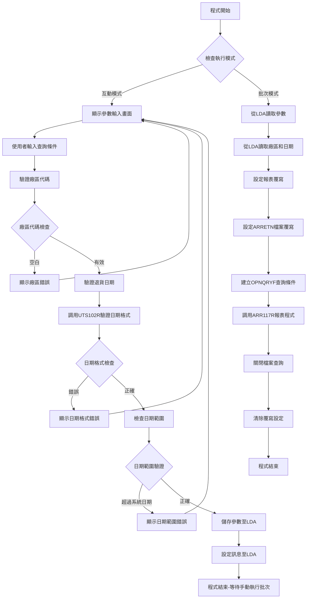
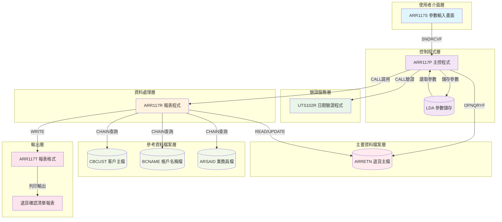
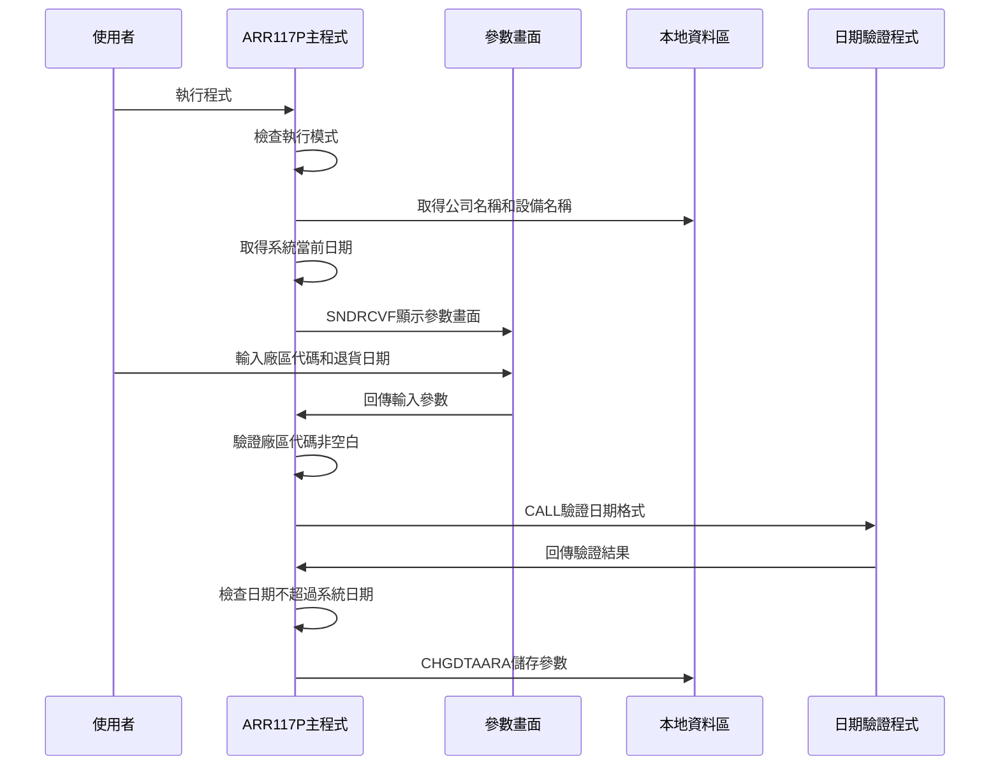
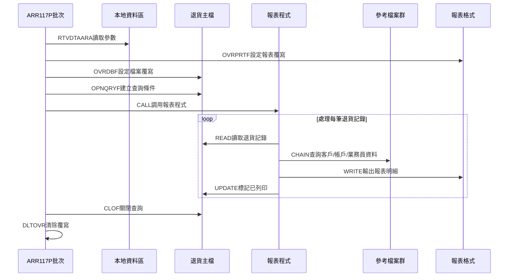
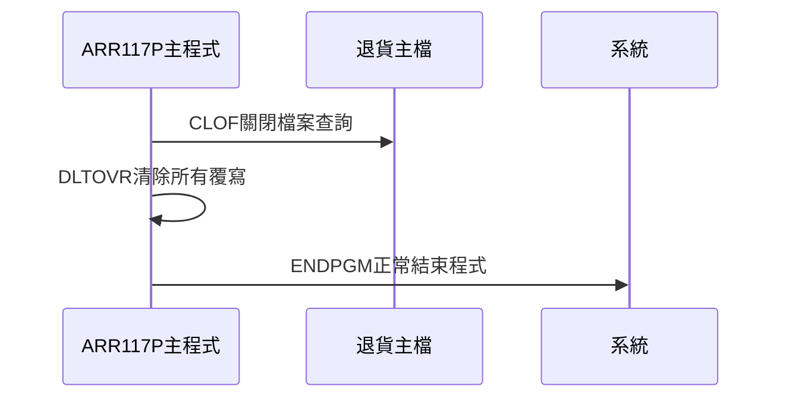
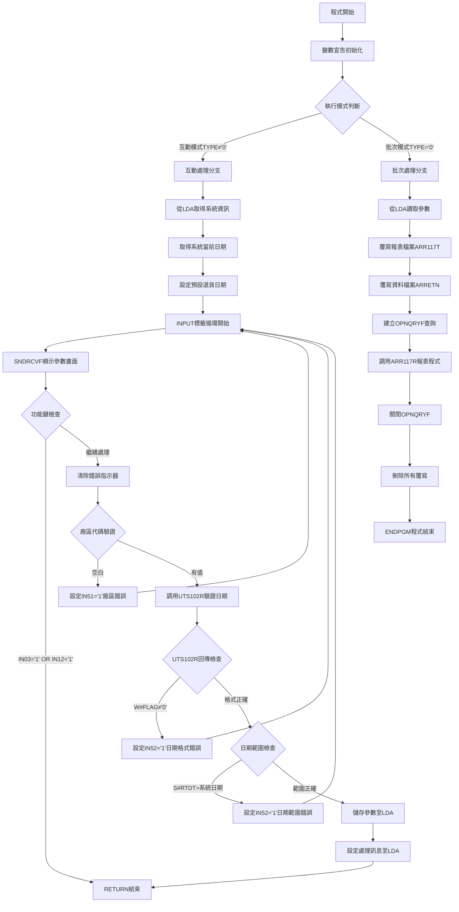

# ARR117P_P02 程式規格書

## 1. 基本資料

| 項目 | 內容 |
|------|------|
| **程式編號** | ARR117P |
| **程式名稱** | 銷貨退貨已確認清單作業 |
| **程式類型** | CLP |
| **廠區** | P02 |
| **系統名稱** | 應收帳款系統 |
| **子系統** | 銷貨退貨管理子系統 |
| **檔案位置** | 東鋼list/ARR117P_P02.txt |

## 2. 🎯 程式功能說明

### 主要功能描述
ARR117P是銷貨退貨已確認清單作業的控制程式，負責收集使用者輸入的查詢條件（廠區代碼和退貨日期），進行資料驗證後，調用報表程式產生指定日期的銷貨退貨已確認清單報表。

### 🎯 業務流程詳細說明

#### 完整業務流程圖


#### 業務流程關鍵階段說明

**階段1：參數收集與驗證**
- 程式檢查執行模式，互動模式顯示ARR117S參數輸入畫面
- 收集退貨查詢條件：廠區代碼（P/M/T/H/K）和退貨日期
- 從LDA取得公司名稱和設備名稱等系統資訊

**階段2：多層次驗證機制**
- 廠區代碼不可空白，必須為有效值（P/M/T/H/K）
- 調用UTS102R程式進行日期格式驗證
- 檢查退貨日期不可超過系統當前日期

**階段3：智能處理邏輯**
- 驗證通過後將參數儲存至LDA固定位置
- 設定處理中訊息至LDA，供其他程式參考
- 不自動提交批次作業，需要手動執行批次處理

**階段4：資料一致性確保機制**
- 批次模式從LDA讀取完全相同的查詢參數
- 使用OPNQRYF建立精確的查詢條件
- 透過ARRETN檔案標記處理狀態確保資料一致性

## 3. 🎯 檔案架構與關聯圖

### 使用檔案清單

| 檔案名稱 | 檔案類型 | 用途說明 | 存取方式 |
|----------|----------|----------|----------|
| ARR117S | DSPF | 參數輸入畫面 | SNDRCVF |
| ARRETN | PF | 銷貨退貨主檔 | OPNQRYF查詢/UPDATE |
| ARR117T | PRTF | 報表輸出格式 | 報表列印 |
| ARR117R | RPG | 報表處理程式 | CALL調用 |
| UTS102R | RPG | 日期驗證程式 | CALL調用 |
| CBCUST | PF | 客戶主檔 | CHAIN查詢 |
| BCNAME | PF | 帳戶名稱檔 | CHAIN查詢 |
| ARSAID | PF | 業務員檔 | CHAIN查詢 |

### 🎯 檔案關聯詳細視覺化圖表



### 🎯 資料流向詳細說明

#### 環境準備階段的資料流向


#### 業務處理階段的資料流向


#### 環境清理階段的資料流向


## 4. 🎯 檔案欄位規格說明

### 主要資料結構

#### ARRETN銷貨退貨主檔結構
```
記錄格式：RARRETN
用途：儲存銷貨退貨相關資料
```

| 欄位名稱 | 位置 | 長度 | 型態 | 說明 |
|----------|------|------|------|------|
| ANFLAG | 1 | 1 | CHAR | 處理旗標 |
| ANRTNO | 2-7 | 6 | CHAR | 退貨編號 |
| ANITEM | 8-9 | 2 | DEC | 退貨項次 |
| ANCUNO | 10-15 | 6 | CHAR | 客戶編號 |
| ANCUNM | 16-25 | 10 | CHAR | 客戶名稱 |
| ANORNO | 26-31 | 6 | CHAR | 訂單編號 |
| ANAREA | 32 | 1 | CHAR | 退貨廠區 |
| ANDECD | 33 | 1 | CHAR | 借貸碼 |
| ANDEDT | 34-41 | 8 | DEC | 借貸日期 |
| ANDC | 42 | 1 | CHAR | 帳戶區分 |
| ANUSTP | 43-44 | 2 | CHAR | 客戶類別 |
| ANACNO | 45-53 | 9 | CHAR | 會計科目 |
| ANFL01 | 54 | 1 | CHAR | 處理旗標1 |
| ANFL02 | 55 | 1 | CHAR | 處理旗標2 |
| ANFL03 | 56 | 1 | CHAR | 處理旗標3 |
| ANRTDT | 57-64 | 8 | DEC | 退貨日期 |

### 🔍 重點欄位切割技術詳解

#### DS結構完整分析

**ARR117R程式中的主要DS結構定義**
```
DS結構1：帳戶名稱切割
        1   10  T#ACNM     (帳戶名稱10字元)
       10   10  D#NOF      (名稱標記切割)

DS結構2：訂單狀態切割  
       11   12  W#OEOF     (訂單結束標記2字元)
       11   11  D#OE       (訂單結束碼)
       12   12  D#OF       (結束旗標)

DS結構3：訂單編號切割
        1    8  D#ORNO     (訂單編號8字元)
        1    1  D#ORN1     (訂單第1碼)
        2    7  D#ORN2     (訂單中間6碼)
        8    8  D#ORN3     (訂單最後1碼)

DS結構4：相關編號切割
        1   10  ANRLNO     (相關編號10字元)
        1    6  D#RLNO     (相關編號前6碼)
```

#### 欄位切割視覺化展示

**T#ACNM帳戶名稱欄位切割對應圖**
```
T#ACNM (10字元)：[XXXXXXXXX|X]
位置:             001     009 10
                   ↓        ↓
帳戶名稱 (9字元)：[XXXXXXXXX]     實際帳戶名稱
D#NOF (1字元)：             [X]   名稱結束標記
```

**W#OEOF訂單狀態欄位切割對應圖**
```
W#OEOF (2字元)：[X|X]
位置:            11 12
                 ↓  ↓
D#OE (1字元)：   [X]     訂單結束碼
D#OF (1字元)：     [X]   最終旗標
```

**D#ORNO訂單編號欄位切割對應圖**
```
D#ORNO (8字元)：[X|XXXXXX|X]
位置:            1 2     7 8
                 ↓  ↓      ↓
D#ORN1 (1字元)：[X]        廠區代碼
D#ORN2 (6字元)：  [XXXXXX] 序號部分
D#ORN3 (1字元)：        [X] 檢查碼
```

**ANRLNO相關編號欄位切割對應圖**
```
ANRLNO (10字元)：[XXXXXX|    ]
位置:             001  6 7  10
                   ↓     ↓
D#RLNO (6字元)：  [XXXXXX]      有效編號部分
未使用 (4字元)：         [    ]  保留空間
```

#### 切割邏輯詳細說明

**切割目的分析**
1. **資料結構化**：將複合欄位依業務邏輯切割為有意義的子欄位
2. **程式效率**：避免反覆使用%SST函數提升處理效率
3. **程式可讀性**：使用有意義的欄位名稱增加程式可讀性
4. **相容性維護**：保持原有檔案格式，僅在程式內重新定義

**切割實現方式**
```
在RPG程式中透過DS (Data Structure) 重新定義：
I            DS
I                                        1  10 T#ACNM     ← 原始欄位
I                                       10  10 D#NOF      ← 切割子欄位

存取優勢：
- 同時存取：可透過T#ACNM存取完整資料或D#NOF存取子部分
- 記憶體共享：所有切割欄位共享相同記憶體空間
- 自動對應：子欄位變更自動反映到原始欄位
```

#### 實際數據範例說明

**範例1：帳戶名稱處理**
```
T#ACNM原始內容：'ABC銀行   N'
                 └─9字元─┘└1字元┘

切割後欄位：
- 帳戶名稱：'ABC銀行   ' (去除標記的純名稱)
- D#NOF標記：'N'          (名稱結束標記)
```

**範例2：訂單編號解析**
```
D#ORNO原始內容：'P123456A'
                 └1┘└─6─┘└1┘

切割後欄位：
- D#ORN1：'P'       (廠區代碼P02)
- D#ORN2：'123456'  (訂單序號)
- D#ORN3：'A'       (檢查碼或分類碼)
```

### 🎯 欄位挪用詳細分析

#### 挪用情況對比表

| 欄位名稱 | 原始設計用途 | 實際使用方式 | 挪用原因 | 影響評估 |
|----------|-------------|-------------|---------|----------|
| ANFL01 | 一般處理旗標 | 退貨確認標記 | 標記退貨處理狀態 | 需要固定值'Y'標記處理完成 |
| ANFL02 | 一般處理旗標 | 報表列印標記 | 標記是否已列印報表 | 程式中設定為'Y'表示已列印 |
| ANFL03 | 一般處理旗標 | 保留未使用 | 預留未來擴充 | 查詢條件中固定檢查為空白 |
| T#ACNM | 完整帳戶名稱 | 名稱+標記組合 | 同時儲存名稱和控制標記 | 需要程式邏輯分離名稱和標記 |

#### 挪用原因深度分析

**業務需求原因**
1. **狀態追蹤**：需要標記退貨記錄的處理狀態和列印狀態
2. **重複處理控制**：避免同一筆退貨記錄重複處理或列印
3. **資料完整性**：確保退貨流程的每個階段都有明確標記

**技術實現原因**
1. **檔案結構限制**：ARRETN檔案結構已固定，利用旗標欄位實現狀態控制
2. **查詢效率**：透過旗標組合快速篩選需要處理的記錄
3. **程式邏輯**：使用固定旗標值簡化程式判斷邏輯

#### 挪用方式詳細說明

**旗標欄位使用方式**
```
查詢條件中的旗標使用：
QRYSLT('ANFL02 *EQ " " *AND      ← 尚未列印報表
        ANFL03 *EQ " " *AND      ← 保留欄位為空白
        ANFL01 *EQ "Y" *AND      ← 已確認退貨
        %SST(ANRTNO 1 1) *EQ "' || &S#RTDP || '" *AND  ← 廠區匹配
        ANRTDT *EQ ' || &W#RTDT )  ← 日期匹配

處理後更新：
MOVEL'Y'       ANFL02           ← 標記已列印
UPDATRARRETN                    ← 更新記錄
```

#### 挪用影響評估

**正面影響**
1. **處理控制**：有效控制退貨記錄的處理流程
2. **重複防護**：避免重複列印相同報表
3. **狀態追蹤**：清楚追蹤每筆記錄的處理狀態

**負面影響**
1. **理解困難**：旗標意義需要查閱程式碼才能理解
2. **維護複雜**：修改處理邏輯時需要同步更新旗標設定
3. **除錯困難**：旗標狀態錯誤時難以診斷問題原因

### 重要變數定義表

| 變數名稱 | 長度 | 型態 | 用途說明 |
|----------|------|------|----------|
| &S#RTDP | 1 | CHAR | 退貨廠區代碼 |
| &S#RTDT | 8 | CHAR | 退貨查詢日期 |
| &W#RTDT | 8 | CHAR | 處理用退貨日期 |
| &W#UDATE | 8 | CHAR | 系統當前日期 |
| &W#DATE | 8 | DEC | 數值型系統日期 |
| &P#PDAT | 8 | CHAR | 日期驗證參數 |
| &P#MODE | 1 | CHAR | 驗證模式 |
| &P#MTL | 24 | CHAR | 月份資料 |
| &P#LEAP | 1 | CHAR | 閏年旗標 |
| &W#FLAG | 1 | CHAR | 驗證結果旗標 |

## 5. 🎯 輸出/入螢幕布局

### 螢幕布局完整視覺化

```
+------------------------------------------------------------------------------+
|93/07/28     東鋼鋼鐵股份有限公司                               ARR117S      |
|10:25:30           銷貨退貨已確認清單作業                           DEVN001   |
|                                                                              |
|                                                                              |
|                                                                              |
|                                                                              |
|                                                                              |
|       請輸入查詢條件:                                                        |
|                                                                              |
|        1.退貨廠區: [_] (P:台灣 M:台中 T:苗栗 H:彰化 K:高雄)                  |
|                                                                              |
|        2.退貨日期: [____/__/__]                                             |
|                                                                              |
|                                                                              |
|                                                                              |
|        注意：本程式將最快輸入查詢條件後立即輸出                              |
|        已確認單並且銷貨退貨已確認清單作業。                                  |
|                                                                              |
|                                                                              |
|                                                                              |
|                                                                              |
|                                                                              |
| F3:離開                F12:回到上層               ENTER:執行                |
|[錯誤訊息顯示區域]                                                            |
+------------------------------------------------------------------------------+
```

### 🎯 畫面欄位詳細說明

| 欄位名稱 | 位置 | 長度 | 型態 | 屬性 | 驗證規則 | 說明 |
|----------|------|------|------|------|----------|------|
| S#RTDP | 10,30 | 1 | 字元 | 必填,反白 | VALUES('P','M','T','H','K') | 退貨廠區代碼 |
| S#RTDT | 12,30 | 8 | 數值 | 必填,反白 | 日期格式YYYYMMDD,不可超過系統日期 | 退貨查詢日期 |

### 🎯 畫面控制邏輯

#### 指示器控制說明
| 指示器 | 控制欄位 | 觸發條件 | 顯示效果 |
|--------|----------|----------|----------|
| IN51 | S#RTDP | 廠區代碼空白 | 欄位反白閃爍 |
| IN52 | S#RTDT | 日期格式錯誤或超過系統日期 | 欄位反白閃爍 |

### 功能鍵詳細定義

| 功能鍵 | 處理邏輯 | 系統行為 |
|--------|----------|----------|
| PF3 | 設定&IN03='1' | 程式執行RETURN結束 |
| PF12 | 設定&IN12='1' | 程式執行RETURN結束 |
| ENTER | 執行資料驗證 | 進行完整輸入驗證流程 |

### 操作流程
1. 系統顯示參數輸入畫面
2. 使用者選擇退貨廠區代碼
3. 輸入退貨查詢日期
4. 按ENTER進行資料驗證
5. 驗證通過後儲存參數，程式結束
6. 手動執行批次模式產生報表

## 6. 🎯 處理流程程序說明

### 🎯 主程序邏輯深度分析

#### 程式執行流程圖


#### 🎯 詳細處理步驟逐一分析

**步驟1：程式初始化處理**
```
1. 宣告檔案：DCLF FILE(ARR117S)
2. 宣告變數：共10個工作變數
3. 取得工作資訊：RTVJOBA取得輸出佇列和工作型態
4. 判斷執行模式：INT='0'為批次，其他為互動
```

**步驟2：互動模式初始化**
```
1. 從LDA取得系統資訊：
   - 位置951-985：公司名稱(S#COMP)
   - 位置1011-1020：設備名稱(S#DEVN)
2. 取得系統當前日期：
   - RTVJOBA CYMDDATE取得YYYYMMDD格式
   - 加前導0形成9位數日期
3. 設定預設值：將系統日期設為預設退貨日期
```

**步驟3：參數輸入循環處理**
```
INPUT循環標籤處理：
1. SNDRCVF顯示ARR117S畫面
2. 檢查功能鍵：PF3或PF12直接結束
3. 清除錯誤指示器：IN51和IN52設為'0'
4. 執行輸入驗證流程
```

**步驟4：輸入驗證邏輯**
```
廠區代碼驗證：
- 檢查S#RTDP是否空白
- 錯誤時設定IN51='1'並顯示錯誤訊息

日期驗證：
- 調用UTS102R驗證日期格式
- 檢查W#FLAG回傳值，'0'表示正確
- 比較輸入日期與系統日期，不可超過當前日期
```

**步驟5：參數儲存處理**
```
驗證通過後執行：
1. CHGDTAARA儲存廠區代碼至LDA位置1
2. CHGDTAARA儲存退貨日期至LDA位置2-9
3. CHGDTAARA儲存處理訊息至LDA位置601-670
4. 程式結束，等待手動執行批次
```

**步驟6：批次模式處理**
```
1. 從LDA讀取參數：
   - RTVDTAARA讀取廠區代碼
   - RTVDTAARA讀取退貨日期
2. 設定檔案覆寫：
   - 報表檔案：設定頁面大小132，字型10，暫停列印
   - 資料檔案：設定為DALIB/ARRETN，共享模式
3. 建立查詢條件並調用報表程式
```

### 🎯 子程序邏輯分析

#### UTS102R日期驗證程式調用
```
參數傳遞：
- &P#PDAT：待驗證日期(8位元)
- &P#MODE：驗證模式('1')
- &P#MTL：月份資料(24位元)
- &P#LEAP：閏年旗標(1位元)
- &W#FLAG：回傳結果('0'表示正確)

呼叫方式：
CALL PGM(UTS102R) PARM(&P#PDAT &P#MODE &P#MTL &P#LEAP &W#FLAG)

回傳檢查：
IF COND(&W#FLAG *NE '0') 表示日期格式錯誤
```

#### ARR117R報表程式調用
```
呼叫方式：
CALL PGM(ARR117R)

前置條件：
- ARRETN檔案已開啟OPNQRYF查詢
- 報表檔案已設定覆寫
- 所有參數已透過UDS傳遞

後續處理：
- 關閉OPNQRYF：CLOF OPNID(ARRETN)
- 清除覆寫：DLTOVR FILE(*ALL)
```

### 🎯 特殊邏輯處理

#### 日期範圍檢查邏輯
```
系統日期取得：
RTVJOBA CYMDDATE(&W#UDATE)              ← 取得YYYYMMDD
CHGVAR VAR(&W#UDATE) VALUE('0' *CAT &W#UDATE)  ← 加前導0
CHGVAR VAR(&W#DATE) VALUE(&W#UDATE)     ← 轉為數值比較

範圍檢查：
IF COND(&S#RTDT *GT &W#DATE) THEN(DO)
    設定錯誤：退貨日期不可超過系統日期
ENDDO
```

#### OPNQRYF查詢條件建構
```
查詢條件邏輯：
QRYSLT('ANFL02 *EQ " " *AND         ← 未列印標記
        ANFL03 *EQ " " *AND         ← 預留旗標
        ANFL01 *EQ "Y" *AND         ← 已確認標記
        %SST(ANRTNO 1 1) *EQ "' || &S#RTDP || '" *AND  ← 廠區匹配
        ANRTDT *EQ ' || &W#RTDT               ← 日期匹配
```

### 🎯 錯誤處理與資料完整性控制

#### 錯誤處理機制
```
每個驗證錯誤都執行：
1. 設定對應指示器為'1'
2. 設定S#ERR錯誤訊息
3. 執行GOTO INPUT回到輸入循環
```

#### 資料完整性檢查
```
1. 日期格式驗證：調用標準UTS102R日期驗證程式
2. 廠區代碼驗證：必須為有效廠區代碼(P/M/T/H/K)
3. 日期範圍驗證：不可超過系統當前日期
4. 處理狀態控制：透過ANFL02標記防止重複列印
```

## 7. 🎯 數據操作與轉換分析

### 檔案操作詳解

#### READ操作
- **ARRETN檔案讀取**：透過OPNQRYF建立查詢條件後，由ARR117R程式循序讀取符合條件的退貨記錄

#### UPDATE操作
- **ARRETN記錄更新**：ARR117R程式處理每筆記錄後，將ANFL02設為'Y'標記已列印

#### 檔案鎖定和併發處理
- **共享模式**：使用SHARE(*YES)設定允許多使用者同時查詢
- **記錄鎖定**：UPDATE操作時自動鎖定單筆記錄

### 數據轉換邏輯

#### 日期格式轉換
```
系統日期轉換：
RTVJOBA CYMDDATE(&W#UDATE)              ← 取得YYYYMMDD格式
CHGVAR VAR(&W#UDATE) VALUE('0' *CAT &W#UDATE)  ← 轉為9位數字串
CHGVAR VAR(&W#DATE) VALUE(&W#UDATE)     ← 轉為數值型便於比較
```

#### 字串操作和格式化
```
廠區代碼提取：
%SST(ANRTNO 1 1) *EQ "廠區代碼"        ← 提取退貨編號第一位比對廠區
```

#### 查詢條件字串建構
```
動態OPNQRYF條件：
'ANFL02 *EQ " " *AND +                 ← 未列印標記
 ANFL03 *EQ " " *AND +                 ← 預留旗標
 ANFL01 *EQ "Y" *AND +                 ← 已確認標記
 %SST(ANRTNO 1 1) *EQ "' || &S#RTDP || '" *AND +  ← 廠區匹配
 ANRTDT *EQ ' || &W#RTDT               ← 日期匹配
```

### 計算邏輯分析

#### 日期比較計算
```
日期大小比較：
IF COND(&S#RTDT *GT &W#DATE)          ← 數值比較確保日期不超過系統日期
```

### 檢核機制詳解

#### 數據有效性檢查
1. **非空檢查**：廠區代碼必須輸入
2. **格式檢查**：調用UTS102R驗證日期格式
3. **範圍檢查**：退貨日期不可超過系統當前日期
4. **廠區匹配**：退貨編號第一碼與選擇廠區一致

#### 檢核失敗處理方式
1. **設定錯誤指示器**：對應欄位反白顯示
2. **顯示錯誤訊息**：在畫面底部顯示具體錯誤內容
3. **重新輸入**：回到INPUT循環等待使用者修正

#### 檢核規則的業務依據
1. **廠區管制**：確保只查詢指定廠區的退貨資料
2. **日期合理性**：確保不查詢未來日期的退貨記錄
3. **處理狀態**：確保只處理已確認但未列印的退貨記錄

## 8. 🎯 錯誤處理程序說明

### 🎯 詳細錯誤代碼清冊

| 錯誤代碼 | 錯誤訊息 | 原因說明 | 處理方式 | 預防措施 |
|----------|---------|---------|---------|----------|
| **USER001** | 退貨廠區不可空白 | 使用者未選擇退貨廠區代碼 | 1. 設定IN51='1'顯示欄位錯誤<br>2. 顯示錯誤訊息<br>3. 回到INPUT循環 | 畫面設計時提供明確的廠區選項說明 |
| **USER002** | 日期格式錯誤！ | UTS102R驗證日期格式失敗 | 1. 設定IN52='1'顯示欄位錯誤<br>2. 顯示錯誤訊息<br>3. 回到INPUT循環 | 提供正確日期格式範例(YYYY/MM/DD) |
| **USER003** | 日期不可超過系統日期 | 輸入的退貨日期大於系統當前日期 | 1. 設定IN52='1'顯示欄位錯誤<br>2. 顯示錯誤訊息<br>3. 回到INPUT循環 | 顯示系統當前日期供參考 |
| **IN03='1'** | 使用者按PF3離開 | 使用者選擇離開作業 | 執行RETURN直接結束程式 | 提供清楚的功能鍵說明 |
| **IN12='1'** | 使用者按PF12返回 | 使用者選擇返回上層 | 執行RETURN直接結束程式 | 提供清楚的功能鍵說明 |

### 🎯 系統異常處理邏輯

#### 檔案操作失敗處理
```
OPNQRYF失敗：
- 系統自動記錄錯誤
- 程式繼續執行後續清理動作
- 確保DLTOVR正確執行

ARRETN檔案存取失敗：
- 檢查檔案是否存在於DALIB
- 確認檔案存取權限
- 記錄詳細錯誤資訊
```

#### 程式調用失敗處理
```
UTS102R調用失敗：
- 透過&W#FLAG回傳值判斷
- 設定對應錯誤訊息和指示器
- 回到INPUT循環重新處理

ARR117R調用失敗：
- 系統層級錯誤處理
- 確保檔案正確關閉
- 清理所有覆寫設定
```

#### 資料完整性錯誤處理
```
LDA存取失敗：
- 系統自動處理存取錯誤
- 使用預設值繼續處理
- 記錄異常狀況供後續追蹤

日期轉換失敗：
- 數值轉換錯誤時使用系統日期
- 記錄轉換失敗的原始值
- 確保程式能繼續正常執行
```

#### 並發控制失敗處理
```
檔案鎖定衝突：
- SHARE(*YES)設定避免查詢鎖定問題
- UPDATE時短暫鎖定單筆記錄
- 系統自動重試機制處理暫時性衝突
```

## 9. 🎯 備註

### 🎯 特殊注意事項

#### 執行模式說明
程式設計為兩階段執行模式：第一階段互動收集參數，第二階段手動執行批次處理，此設計允許使用者確認參數後再決定是否產生報表。

#### 廠區代碼對應
程式支援的廠區代碼包括：P(台灣)、M(台中)、T(苗栗)、H(彰化)、K(高雄)，退貨編號第一碼必須與選擇廠區一致。

#### 日期處理限制
退貨查詢日期不可超過系統當前日期，確保不會查詢未來的退貨資料，維持資料的合理性。

#### 處理狀態控制
程式使用ARRETN檔案的旗標欄位控制處理流程：ANFL01='Y'表示已確認退貨，ANFL02=' '表示尚未列印報表，ANFL03保留未使用。

#### 報表輸出設定
批次模式執行時，報表設定為132欄寬度，10字型，暫停列印狀態，使用者需要到輸出佇列手動釋放列印。

#### 檔案共享機制
ARRETN檔案設定為共享模式，允許多使用者同時查詢，但UPDATE操作時會鎖定單筆記錄確保資料一致性。

#### LDA參數傳遞
程式使用本地資料區固定位置傳遞參數：位置1為廠區代碼，位置2-9為退貨日期，位置601-670為處理狀態訊息。 