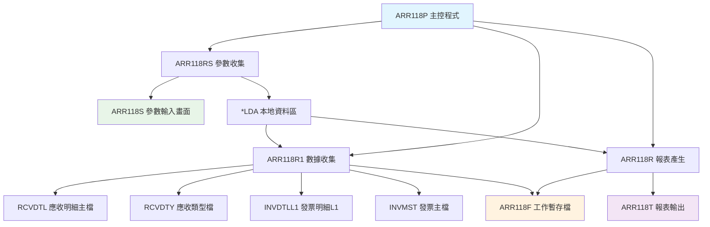
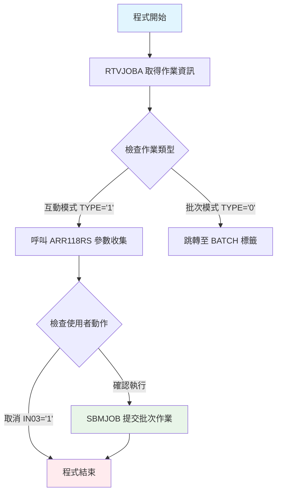
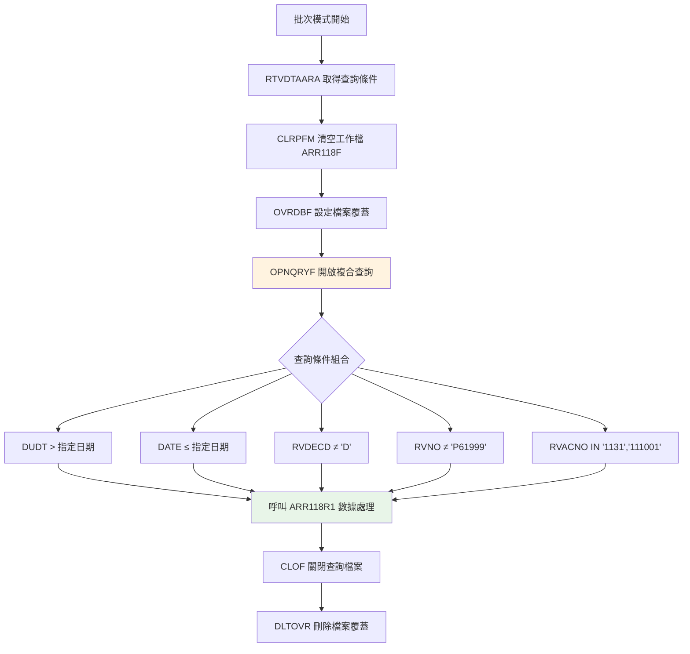
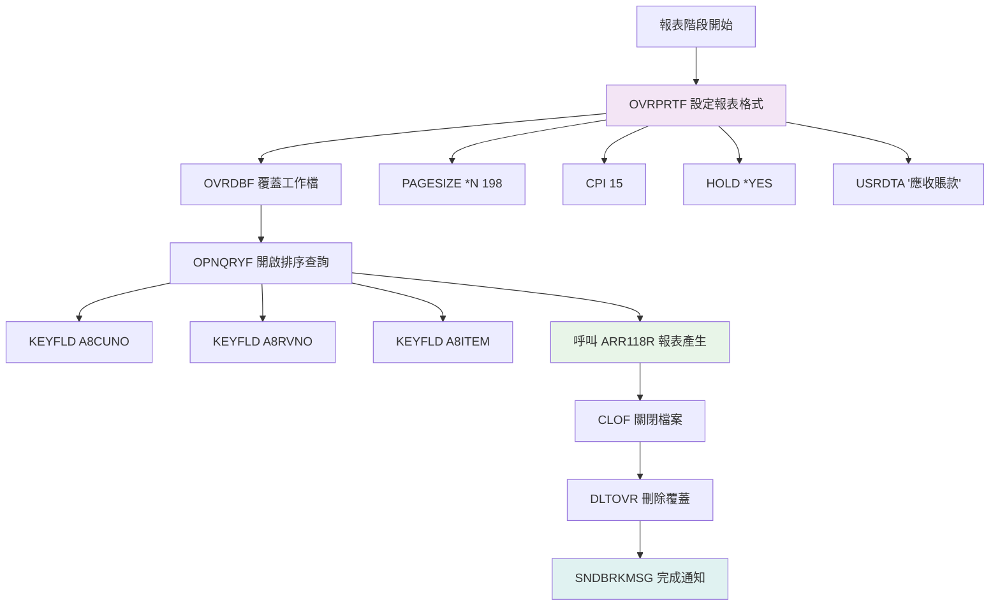
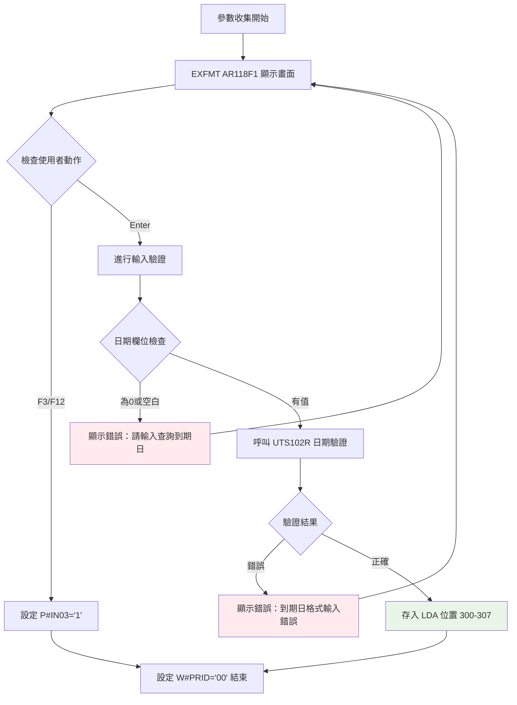

# ARR118P_P02 程式規格書

## 📋 基本資料

| 項目 | 內容 |
|------|------|
| **程式編號** | ARR118P |
| **程式名稱** | 應收帳款逾期對帳查詢報表系統 |
| **程式類型** | CLP (Control Language Program) |
| **系統名稱** | 應收帳款管理系統 (AR) |
| **子系統** | 應收帳款報表子系統 |
| **廠區** | P02 |
| **開發人員** | S02CSF |
| **建立日期** | 1994/04/13 |
| **最後修改** | 2012/09/25 (2012AR682 S00WCJ) |
| **程式路徑** | `P02CLSRC_THSRC/ARR118P.txt` |

## 📖 程式功能說明

### 主要功能
ARR118P是一個專門針對**應收帳款逾期對帳**的查詢報表系統，主要功能包括：

1. **逾期應收帳款篩選**：根據使用者指定的到期日基準，篩選出所有超過到期日且尚未收回的應收帳款記錄
2. **多維度數據整合**：整合應收明細檔（RCVDTL）、發票明細檔（INVDTLL1）、發票主檔（INVMST）等多個數據源
3. **智能帳務過濾**：自動排除已刪除記錄、特定排除單號，並專注於特定會計科目的應收帳款
4. **高解析度報表輸出**：產生198欄寬度的詳細對帳報表，支援多層級統計

### 業務流程說明
此程式主要用於**月度或季度的應收帳款對帳作業**，協助財務人員：
- 識別逾期未收的客戶應收款項
- 分析應收帳款的賬齡結構
- 提供客戶對帳的詳細資料
- 支援應收帳款的催收管理

## 🗂️ 檔案架構與關聯圖

### 使用檔案清單

| 檔案名稱 | 檔案類型 | 使用方式 | 說明 |
|---------|---------|---------|------|
| **ARR118S** | DSPF | 輸入 | 參數輸入畫面（到期日查詢條件）|
| **RCVDTL** | 主檔 | 讀取 | 應收明細主檔（主要數據源）|
| **RCVDTY** | 主檔 | 讀取 | 應收類型檔（邏輯檔記錄格式）|
| **INVDTLL1** | 主檔 | 讀取 | 發票明細邏輯檔L1 |
| **INVMST** | 主檔 | 讀取 | 發票主檔 |
| **ARR118F** | 工作檔 | 讀寫 | 處理結果暫存檔 |
| **ARR118T** | PRTF | 輸出 | 報表輸出格式檔 |

### 檔案關聯視覺化圖表



### 資料流向說明

1. **參數收集階段**：ARR118RS 透過 ARR118S 畫面收集查詢條件（到期日），並存入 *LDA
2. **數據篩選階段**：ARR118R1 從 RCVDTL 主檔讀取符合條件的應收記錄，整合相關檔案資料後寫入 ARR118F
3. **報表產生階段**：ARR118R 讀取 ARR118F 工作檔，產生格式化的 ARR118T 報表

## 📊 檔案欄位規格說明

### 主要資料結構

#### ARR118F 工作檔案結構
```
A          R RAR118F                   TEXT('對帳查詢暫存')
A            A8CUNO         6A         COLHDG('客戶代號')
A            A8CUNM        10O         COLHDG('客戶名稱')
A            A8ACTP         1A         COLHDG('帳別碼')
A            A8ACNO         9A         COLHDG('會計科目')     ←2012年擴充
A            A8USTP         2A         COLHDG('客戶別')
A            A8ORNO         6A         COLHDG('訂單號碼')
A            A8RVDT         8S 0       COLHDG('應收日期')
A            A8RVNO         6A         COLHDG('應收單號')
A            A8ITEM         2S 0       COLHDG('應收項次')
A            A8VNO1         7A         COLHDG('發票號碼')
A            A8NTNO        20A         COLHDG('銀收單號')
A            A8DUDT         8S 0       COLHDG('到期日')
A            A8AMT          9S 0       COLHDG('金額')
```

### 欄位定義表格

| 欄位名稱 | 資料型態 | 長度 | 說明 | 特殊處理 |
|---------|---------|------|------|---------|
| **A8CUNO** | CHAR | 6 | 客戶代號 | 對應 RVCUNO |
| **A8CUNM** | CHAR | 10 | 客戶名稱 | 對應 RVCUNM |
| **A8ACTP** | CHAR | 1 | 帳別碼 | D=借方，C=貸方 |
| **A8ACNO** | CHAR | 9 | 會計科目 | 🎯2012年從6位擴充至9位 |
| **A8USTP** | CHAR | 2 | 客戶別 | 業務分類代碼 |
| **A8ORNO** | CHAR | 6 | 訂單號碼 | 若為空白則從發票檔查詢 |
| **A8RVDT** | DECIMAL | 8,0 | 應收日期 | YYYYMMDD格式 |
| **A8RVNO** | CHAR | 6 | 應收單號 | 主要關鍵欄位 |
| **A8ITEM** | DECIMAL | 2,0 | 應收項次 | 配合單號使用 |
| **A8VNO1** | CHAR | 7 | 發票號碼 | 對應 RVVNO1 |
| **A8NTNO** | CHAR | 20 | 銀收單號 | 對應 RVNTNO |
| **A8DUDT** | DECIMAL | 8,0 | 到期日 | 🎯核心查詢條件欄位 |
| **A8AMT** | DECIMAL | 9,0 | 金額 | 應收金額（新台幣） |

### 🎯 欄位挪用分析

#### LDA本地資料區使用
```
位置 300-307 (8位元): 到期日查詢條件 (D#DUDT)
位置 1001-1010 (10位元): 使用者代號 (U#USID)
```

#### 特殊欄位處理邏輯
1. **訂單號碼智能填補**：
   - 當 RVRLNO（應收檔訂單號）為空白時
   - 自動查詢 INVDTLL1 發票明細檔
   - 取得對應的發票訂單號（IVORNO）

2. **會計科目2012年擴充**：
   - 原始定義：6位數字
   - 2012年修改：擴充至9位
   - 影響：A8ACNO欄位定義及相關處理邏輯

## 🖥️ 輸出/入螢幕布局

### ARR118S 參數輸入畫面

```
┌─────────────────────────────────────────────────────────────────────────────┐
│ 12/26/24              東森鋼鐵股份有限公司各廠區                   ARR118S │
│ 09:30:00         應收帳款帳款報表及對帳查詢帳冊                            │
│ DEVNAME01                                                                   │
│                                                                             │
│                                                                             │
│                                                                             │
│                                                                             │
│                                                                             │
│                        到期日期：[____/__/__]                              │
│                                                                             │
│                        (例：查詢第一期最遲，請輸入XX年3月31日)               │
│                                                                             │
│                                                                             │
│                                                                             │
│                                                                             │
│                                                                             │
│                                                                             │
│                                                                             │
│                                                                             │
│                                                                             │
│                                                                             │
│                                                                             │
│                                                                             │
│ 操作說明：         PF3=結束作業        PF12=回到上層                        │
│ [錯誤訊息顯示區域]                                                          │
└─────────────────────────────────────────────────────────────────────────────┘
```

### 欄位配置說明
- **到期日期輸入**：8位數字，格式 YYYY/MM/DD
- **日期驗證**：呼叫 UTS102R 進行日期格式驗證
- **錯誤處理**：顯示對應錯誤訊息於畫面下方

### 功能鍵定義
| 功能鍵 | 說明 | 處理方式 |
|--------|------|---------|
| **F3** | 結束作業 | 設定 *IN03='1'，返回上層 |
| **F12** | 回到上層 | 設定 *IN12='1'，返回上層 |
| **Enter** | 確認執行 | 驗證輸入後提交批次作業 |

## ⚙️ 處理流程程序說明

### 🎯 主程序邏輯深度分析

#### 第一階段：作業模式判定與參數收集


#### 第二階段：數據篩選與處理


#### 第三階段：報表產生與輸出


### 🎯 子程序邏輯分析

#### ARR118RS 參數收集程式邏輯


#### ARR118R1 數據收集程式邏輯
1. **檔案讀取與關聯**：
   - 主要讀取：RCVDTL（應收明細檔）
   - 輔助查詢：RCVDTY、INVDTLL1、INVMST
   - 輸出寫入：ARR118F（工作暫存檔）

2. **數據轉換邏輯**：
   - L1 Control Level：以應收單號（RVNO）分組
   - 欄位對應：將 RCVDTL 的欄位對應到 ARR118F 結構
   - 訂單號補齊：當 RVRLNO 為空時，查詢 INVDTLL1 取得訂單號

3. **特殊處理邏輯**：
   - 排除邏輯：RVNO='K52835' 時設定特殊處理標記
   - 金額累計：依據帳別碼（ACTP='D'）進行借方金額統計

#### ARR118R 報表產生程式邏輯
1. **報表分層架構**：
   - L2 Level：客戶層級統計
   - L1 Level：應收單號層級統計
   - Detail Level：明細資料輸出

2. **格式化輸出**：
   - 報表標題：包含查詢條件（到期日）
   - 明細行：198欄寬度，包含客戶、日期、金額等資訊
   - 統計行：客戶小計、總計

### 🎯 特殊邏輯處理

#### 會計科目篩選邏輯
```sql
-- 主要查詢條件（2012年修改版本）
(RVACNO *EQ "1131") *OR (RVACNO *EQ "111001")

-- 科目意義：
-- 1131：應收帳款-一般客戶
-- 111001：應收帳款-關係企業（擴充科目）
```

#### 特殊排除機制
```sql
-- 硬編碼排除單號
RVNO *NE "P61999"    -- 排除特定測試或特殊處理單號

-- 記錄狀態篩選
RVDECD *NE "D"       -- 排除已刪除記錄

-- 日期範圍邏輯
DUDT *GT "查詢日期"   -- 超過到期日（逾期記錄）
DATE *LE "查詢日期"   -- 入帳日期不超過查詢日期
```

#### 金額統計架構
```
客戶層級統計 (L2)
├── 借方金額統計 (ACTP='D')
├── 貸方金額統計 (ACTP='C')  
└── 客戶小計顯示

總計層級統計 (LR)
└── 全部客戶總計金額
```

## 🔧 技術特點分析

### 程式設計特色

1. **📊 多階段處理架構**
   - **階段分離**：參數收集 → 數據篩選 → 報表產生
   - **模組化設計**：每個階段獨立程式負責
   - **資料暫存**：使用 ARR118F 工作檔緩存處理結果

2. **🎯 智能查詢條件組合**
   - **時間區間邏輯**：DUDT > 查詢日期 AND DATE ≤ 查詢日期
   - **多重排除機制**：刪除記錄、特殊單號、非目標科目
   - **會計科目擴充**：2012年支援9位科目代碼

3. **📈 高解析度報表輸出**
   - **寬幅報表**：198欄寬度設計
   - **精密字體**：15CPI高密度字型
   - **多層統計**：明細、客戶小計、總計三層架構

4. **🔄 歷史相容性維護**
   - **平滑升級**：2012年修改保持向下相容
   - **欄位擴充**：會計科目從6位擴至9位
   - **邏輯增強**：新增 111001 科目支援

### 與同系列程式比較

| 特性比較 | ARR118P | ARR097P | ARR039P |
|---------|---------|---------|---------|
| **主要功能** | 逾期對帳查詢 | 歷史統計 | 銷貨入帳報表 |
| **查詢方式** | 單一日期條件 | 年月範圍 | 四維邏輯 |
| **報表寬度** | 198欄 | 158欄 | 158欄 |
| **數據來源** | RCVDTL | ARSTWF | TRNDTL |
| **處理複雜度** | 中等 | 高 | 超高 |
| **特殊機制** | 逾期篩選 | 硬編碼排除 | 動態條件 |

### 業務價值分析

1. **💰 財務管控效益**
   - **逾期監控**：即時掌握超過到期日的應收帳款
   - **客戶分析**：按客戶統計逾期金額，支援催收決策
   - **賬齡管理**：提供詳細的應收賬款賬齡資訊

2. **📋 作業流程優化**
   - **自動化查詢**：取代人工逐筆檢查逾期記錄
   - **標準化報表**：統一的對帳報表格式
   - **批次處理**：大量數據的高效處理能力

3. **🎯 決策支援價值**
   - **風險預警**：識別高風險逾期客戶
   - **現金流管理**：預估應收帳款回收時程
   - **業務策略**：支援信用政策調整決策

## 📝 重要商業邏輯摘要

### 核心業務規則
1. **逾期定義**：到期日 > 查詢基準日的所有應收記錄
2. **科目範圍**：限定 1131（一般客戶）和 111001（關係企業）
3. **排除原則**：自動排除已刪除記錄和特定測試單號
4. **統計邏輯**：按借貸別分別統計，支援沖銷邏輯

### 系統整合要點
1. **檔案依賴**：高度依賴 RCVDTL 應收明細檔的資料品質
2. **效能考量**：複合查詢條件需要適當的索引支援
3. **擴充彈性**：2012年的科目擴充展現良好的系統彈性

此程式體現了**「精準篩選、多維統計、高效輸出」**的設計理念，是應收帳款管理系統中重要的監控和分析工具。 