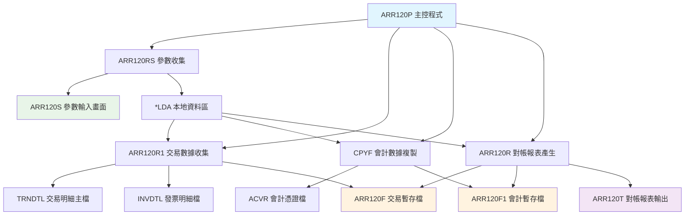
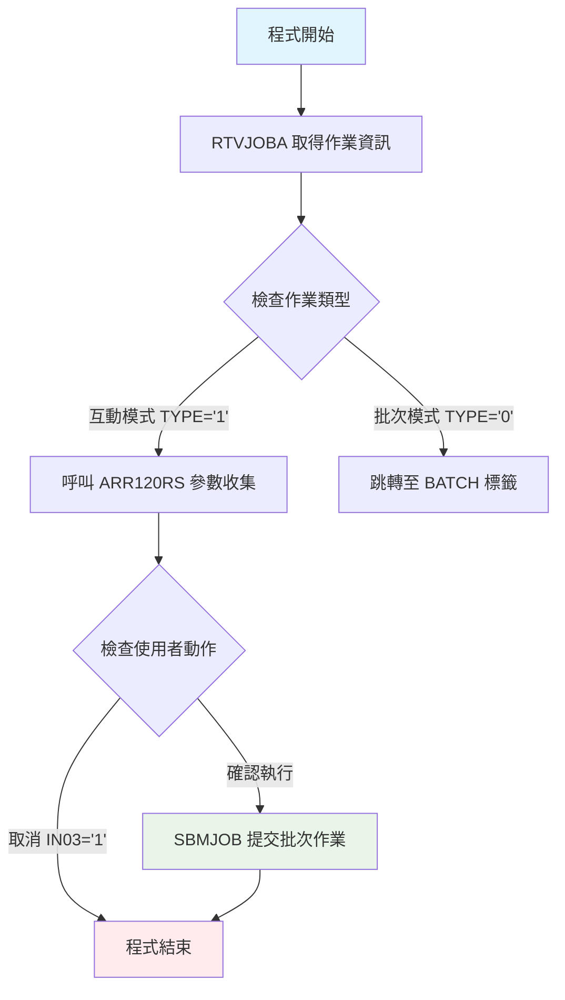
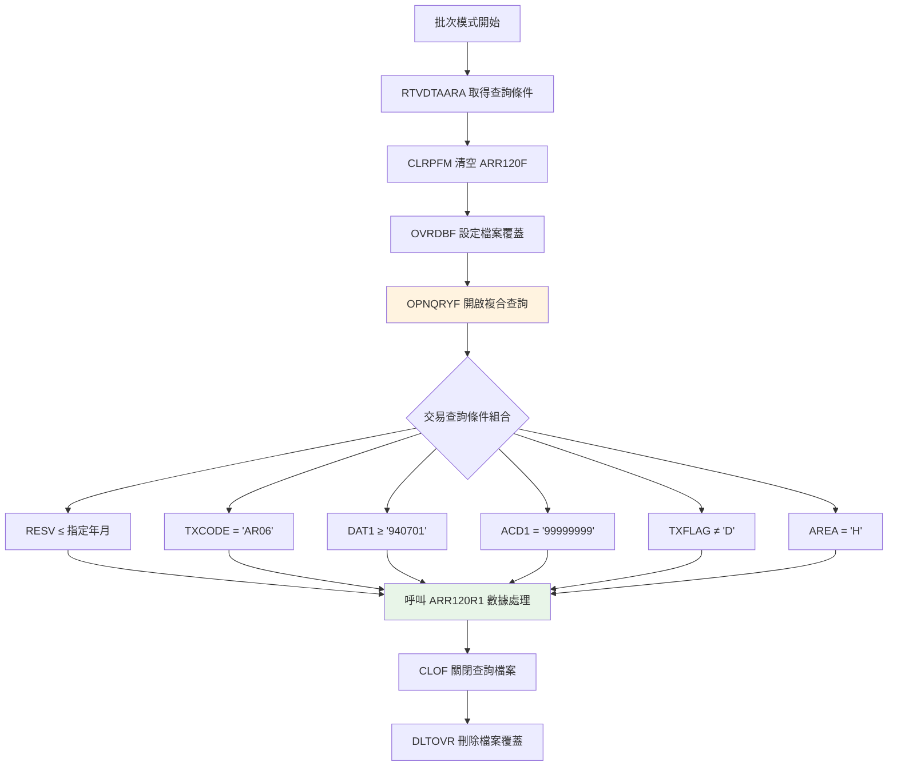
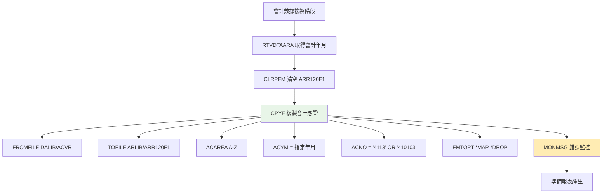
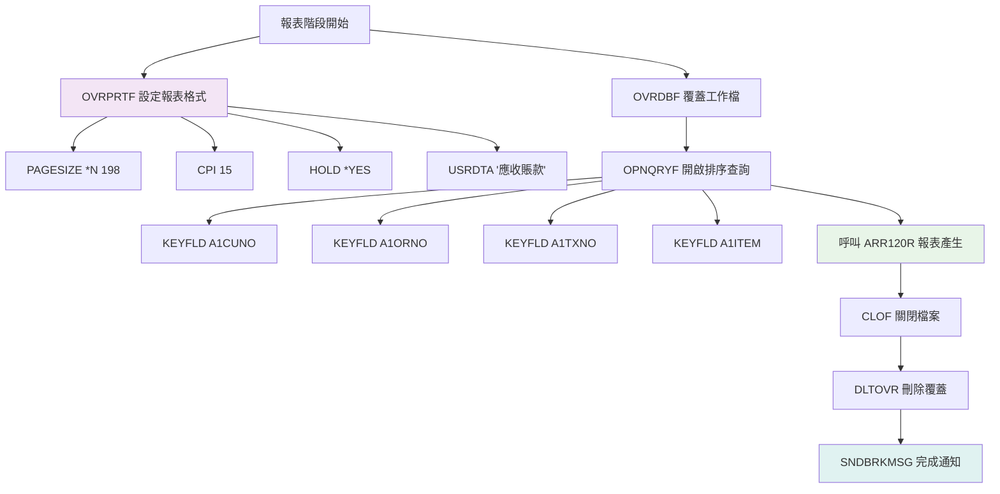
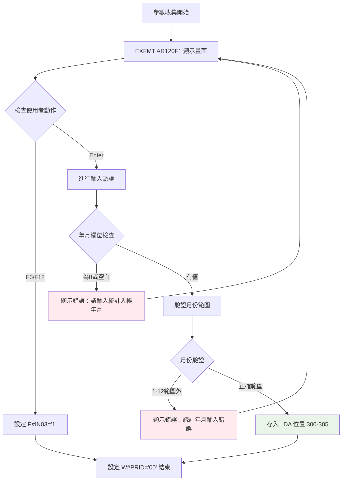

# ARR120P_P02 程式規格書

## 📋 基本資料

| 項目 | 內容 |
|------|------|
| **程式編號** | ARR120P |
| **程式名稱** | 應收帳款報表及對帳查詢帳冊系統 |
| **程式類型** | CLP (Control Language Program) |
| **系統名稱** | 應收帳款管理系統 (AR) |
| **子系統** | 應收帳款報表子系統 |
| **廠區** | P02 |
| **開發人員** | S02CSF |
| **建立日期** | 1994/08/08 |
| **最後修改** | 2012/09/25 (2012AR682 S00WCJ) |
| **程式路徑** | `P02CLSRC_THSRC/ARR120P.txt` |

## 📖 程式功能說明

### 主要功能
ARR120P是一個專門用於**應收帳款對帳核對**的查詢報表系統，主要功能包括：

1. **雙源數據對比分析**：同時分析交易明細檔（TRNDTL）與會計憑證檔（ACVR）的應收帳款資料
2. **多維度應收帳款統計**：按客戶、訂單、交易單號進行多層級的應收帳款統計分析
3. **帳務核對機制**：透過科目4113和410103的會計憑證資料，核對應收帳款的正確性
4. **高解析度報表輸出**：產生198欄寬度的詳細對帳報表，支援複雜的財務分析需求

### 業務流程說明
此程式主要用於**月度應收帳款對帳作業**，協助財務人員：
- 核對交易系統與會計系統的應收帳款一致性
- 分析特定月份的應收帳款明細資料
- 檢核應收帳款科目的正確性與完整性
- 提供多層級的應收帳款統計資訊
- 支援月度、季度財務報表的編製作業

## 🗂️ 檔案架構與關聯圖

### 使用檔案清單

| 檔案名稱 | 檔案類型 | 使用方式 | 說明 |
|---------|---------|---------|------|
| **ARR120S** | DSPF | 輸入 | 參數輸入畫面（查詢年月條件）|
| **TRNDTL** | 主檔 | 讀取 | 交易明細主檔（主要數據源）|
| **INVDTL** | 主檔 | 讀取 | 發票明細檔（關聯查詢）|
| **ACVR** | 主檔 | 複製 | 會計憑證檔（對比數據源）|
| **ARR120F** | 工作檔 | 讀寫 | 交易資料處理結果暫存檔 |
| **ARR120F1** | 工作檔 | 讀寫 | 會計憑證資料暫存檔 |
| **ARR120T** | PRTF | 輸出 | 對帳報表輸出格式檔 |

### 檔案關聯視覺化圖表



### 資料流向說明

1. **參數收集階段**：ARR120RS 透過 ARR120S 畫面收集查詢年月條件，並存入 *LDA
2. **交易數據收集階段**：ARR120R1 從 TRNDTL 主檔讀取符合條件的AR06交易記錄，整合 INVDTL 檔案資料後寫入 ARR120F
3. **會計數據複製階段**：使用 CPYF 指令從 ACVR 會計憑證檔複製特定科目（4113、410103）的記錄到 ARR120F1
4. **對帳報表產生階段**：ARR120R 同時讀取 ARR120F 和 ARR120F1 工作檔，進行對比分析並產生格式化的 ARR120T 報表

## 📊 檔案欄位規格說明

### 主要資料結構

#### ARR120F 交易資料工作檔案結構
```
A          R RAR120F                   TEXT('對帳查詢暫存')
A            A1TXNO         6A         COLHDG('交易單號')
A            A1ITEM         2S 0       COLHDG('交易項次')
A            A1IVNO        10A         COLHDG('發票號碼')
A            A1CUNO         6A         COLHDG('客戶代號')
A            A1CUNM        10O         COLHDG('客戶名稱')
A            A1ORNO         6A         COLHDG('訂單號碼')
A            A1ACDT         6S 0       COLHDG('發票年月')
A            A1AMT1         6S 0       COLHDG('發票金額')
A            A1TAX          5S 0       COLHDG('發票稅額')
A            A1AMT2         7S 0       COLHDG('發票總額')
```

#### ARR120F1 會計憑證工作檔案結構
```
A          R RAR120F1                  TEXT('憑證暫存')
A            ACAREA         1A         COLHDG('廠辦別')
A            ACCARD         1A         COLHDG('卡別')
A            ACKIND         1A         COLHDG('類別')
A            ACYM           6S 0       COLHDG('年月')
A            ACYMD          8S 0       COLHDG('入帳日期')
A            ACVRNO         6A         COLHDG('憑證號碼')
A            ACITEM         3S 0       COLHDG('項次')
A            ACDC           1A         COLHDG('借貸')
A            ACNO           9A         COLHDG('會計科目')     ←重要科目欄位
A            ACTYCO         2A         COLHDG('往來對象代號')
A            ACDPNO         8A         COLHDG('部門代號')
A            ACBKNO        10A         COLHDG('銀行代號')
A            ACRLNO        20O         COLHDG('相關號碼')
A            ACDUE          8S 0       COLHDG('到期日')
A            ACCSNM        10O         COLHDG('客戶簡稱')
A            ACAMT         13S 2       COLHDG('金額')
A            ACDSC1        20O         COLHDG('摘要一')
A            ACDSC2        20O         COLHDG('摘要二')
A            ACDM04        32A         ←關鍵關聯欄位
```

### 欄位定義表格

| 欄位名稱 | 資料型態 | 長度 | 說明 | 特殊處理 |
|---------|---------|------|------|---------|
| **A1TXNO** | CHAR | 6 | 交易單號 | 主要關鍵欄位 |
| **A1ITEM** | DECIMAL | 2,0 | 交易項次 | 配合單號使用 |
| **A1IVNO** | CHAR | 10 | 發票號碼 | 對應 TXIVNO |
| **A1CUNO** | CHAR | 6 | 客戶代號 | 對應 TXCUNO |
| **A1CUNM** | CHAR | 10 | 客戶名稱 | 對應 TXCUNM |
| **A1ORNO** | CHAR | 6 | 訂單號碼 | 對應 TXORNO |
| **A1ACDT** | DECIMAL | 6,0 | 發票年月 | YYYYMM格式 |
| **A1AMT1** | DECIMAL | 6,0 | 發票金額 | 未稅金額 |
| **A1TAX** | DECIMAL | 5,0 | 發票稅額 | 營業稅額 |
| **A1AMT2** | DECIMAL | 7,0 | 發票總額 | 含稅總金額 |
| **ACNO** | CHAR | 9 | 會計科目 | 🎯核心科目：4113/410103 |
| **ACDM04** | CHAR | 32 | 關聯號碼 | 🎯與交易單號關聯 |

### 🎯 欄位挪用分析

#### LDA本地資料區使用
```
位置 300-305 (6位元): 查詢年月條件 (D#YYMM)
位置 306-311 (6位元): 會計入帳年月 (U#ACDT)
位置 1001-1010 (10位元): 使用者代號 (U#USID)
```

#### 特殊欄位對應關係
1. **ACDM04 關聯機制**：
   - 在 ARR120F1 中：ACDM04 = 交易單號
   - 用於關聯 ARR120F 與 ARR120F1 的核心欄位
   - 實現交易系統與會計系統的資料串接

2. **MAPFLD 動態欄位重組**：
   ```sql
   MAPFLD((RESV  '%SST(TXRESV 1 6)' *CHAR 6)    -- 提取前6位年月
          (AREA  '%SST(TXNO   1 1)' *CHAR 1)    -- 提取廠區代碼
          (ACD1   TXACDT            *CHAR 8)    -- 會計日期
          (DATE   TXDATE            *CHAR 8)    -- 交易日期
          (DAT1  '%SST(DATE   3 6)' *CHAR 6))   -- 提取年月部分
   ```

## 🖥️ 輸出/入螢幕布局

### ARR120S 參數輸入畫面

```
┌─────────────────────────────────────────────────────────────────────────────┐
│ 12/26/24              東森鋼鐵股份有限公司各廠區                   ARR120S │
│ 09:30:00         應收帳款報表及對帳查詢帳冊                                │
│ DEVNAME01                                                                   │
│                                                                             │
│                                                                             │
│                                                                             │
│                                                                             │
│                                                                             │
│                        統計入帳年月：[____/__]                             │
│                                                                             │
│                        (例：查詢第一期最遲，請輸入XX年3月)                 │
│                                                                             │
│                                                                             │
│                                                                             │
│                                                                             │
│                                                                             │
│                                                                             │
│                                                                             │
│                                                                             │
│                                                                             │
│                                                                             │
│                                                                             │
│                                                                             │
│ 操作說明：         PF3=結束作業        PF12=回到上層                        │
│ [錯誤訊息顯示區域]                                                          │
└─────────────────────────────────────────────────────────────────────────────┘
```

### 欄位配置說明
- **統計入帳年月輸入**：6位數字，格式 YYYY/MM
- **月份驗證**：自動檢查月份必須在01-12之間
- **錯誤處理**：顯示對應錯誤訊息於畫面下方

### 功能鍵定義
| 功能鍵 | 說明 | 處理方式 |
|--------|------|---------|
| **F3** | 結束作業 | 設定 *IN03='1'，返回上層 |
| **F12** | 回到上層 | 設定 *IN12='1'，返回上層 |
| **Enter** | 確認執行 | 驗證輸入後提交批次作業 |

## ⚙️ 處理流程程序說明

### 🎯 主程序邏輯深度分析

#### 第一階段：作業模式判定與參數收集


#### 第二階段：交易數據收集與處理


#### 第三階段：會計憑證數據複製


#### 第四階段：對帳報表產生與輸出


### 🎯 子程序邏輯分析

#### ARR120RS 參數收集程式邏輯


#### ARR120R1 交易數據收集程式邏輯
1. **多檔案關聯處理**：
   - 主要讀取：TRNDTL（交易明細檔）
   - 關聯查詢：INVDTL（發票明細檔）
   - 輸出寫入：ARR120F（交易暫存檔）

2. **L2/L1 Control Level 處理**：
   - L2 Level：以交易單號（TXNO）分組
   - L1 Level：以發票號碼（TXIVNO）分組
   - Detail Level：明細資料處理

3. **發票資料關聯邏輯**：
   ```sql
   -- 發票明細關聯查詢
   IVNO = TXIVNO AND IVACNT = '6' AND IVDECD ≠ 'D'
   
   -- 會計日期比較邏輯
   IF IVACDT > U#YYMM THEN 寫入ARR120F
   ```

#### ARR120R 對帳報表產生程式邏輯
1. **IFRS控制機制**（2012年新增）：
   ```rpg
   IF U#YYMM < D#IFYM THEN
       ACNO = '4113'      (使用舊科目)
   ELSE
       ACNO = '410103'    (使用新科目)
   ```

2. **多層級統計架構**：
   - L2 Level：客戶層級統計
   - L1 Level：訂單層級統計
   - Detail Level：交易明細輸出

3. **會計憑證關聯查詢**：
   ```rpg
   -- 關聯查詢邏輯
   ACNO = (4113 或 410103) AND ACDM04 = T#TXNO
   ```

### 🎯 特殊邏輯處理

#### 複合查詢條件邏輯
```sql
-- TRNDTL 主要查詢條件
(RESV   *LE "指定年月")      -- 預留欄位年月限制
*AND (TXCODE *EQ "AR06")     -- 限定AR06交易類型
*AND (DAT1   *GE "940701")   -- 資料起始日期限制
*AND (ACD1   *EQ "99999999") -- 會計日期特殊標記
*AND (TXFLAG *NE "D")        -- 排除已刪除記錄
*AND (AREA   *EQ "H")        -- 限定H廠區資料

-- 動態欄位重組
MAPFLD((RESV  '%SST(TXRESV 1 6)' *CHAR 6)
       (AREA  '%SST(TXNO   1 1)' *CHAR 1)
       (ACD1   TXACDT            *CHAR 8)
       (DATE   TXDATE            *CHAR 8)
       (DAT1  '%SST(DATE   3 6)' *CHAR 6))
```

#### 會計科目選擇邏輯
```sql
-- ACVR 會計憑證複製條件
(ACAREA *GE 'A' AND ACAREA *LE 'Z')  -- 廠區代碼範圍
*AND (ACYM *EQ 指定年月)              -- 符合查詢年月
*AND (ACNO *EQ '4113' OR ACNO *EQ '410103') -- 特定應收科目

-- 科目意義：
-- 4113：應收帳款-營業收入（舊制）
-- 410103：應收帳款-營業收入（IFRS新制）
```

#### 對帳核對機制
```
交易系統資料 (ARR120F)
├── 交易單號 (A1TXNO)
├── 發票資訊 (A1IVNO, A1AMT1, A1TAX, A1AMT2)
└── 客戶資訊 (A1CUNO, A1CUNM, A1ORNO)

會計系統資料 (ARR120F1)
├── 關聯單號 (ACDM04) ←→ 對應 A1TXNO
├── 會計科目 (ACNO: 4113/410103)
├── 憑證資訊 (ACVRNO, ACAMT)
└── 摘要資訊 (ACDSC1, ACDSC2)

核對邏輯：A1TXNO = ACDM04 進行資料串接
```

## 🔧 技術特點分析

### 程式設計特色

1. **🔄 雙軌並行數據處理架構**
   - **交易軌**：TRNDTL → INVDTL → ARR120F
   - **會計軌**：ACVR → ARR120F1
   - **匯流機制**：透過交易單號進行資料關聯

2. **📊 智能科目切換機制**（2012年IFRS導入）
   - **自動判斷**：根據年月自動選擇適用科目
   - **平滑轉換**：舊制4113 ↔ 新制410103
   - **向下相容**：保持歷史資料查詢能力

3. **🎯 精準查詢條件組合**
   - **多重篩選**：交易類型、日期範圍、廠區、狀態
   - **動態欄位**：使用MAPFLD重組欄位結構
   - **效能優化**：透過複合查詢減少I/O操作

4. **📈 高解析度報表設計**
   - **寬幅報表**：198欄寬度支援複雜資料呈現
   - **精密排版**：15CPI高密度字型
   - **多層統計**：客戶→訂單→交易三層級統計

5. **🔍 強化對帳功能**
   - **資料完整性檢核**：交易系統 vs 會計系統
   - **異常識別**：透過關聯查詢發現差異
   - **追蹤機制**：提供完整的資料軌跡

### 與同系列程式比較

| 特性比較 | ARR120P | ARR118P | ARR097P |
|---------|---------|---------|---------|
| **主要功能** | 雙軌對帳查詢 | 逾期對帳查詢 | 歷史統計 |
| **數據來源** | TRNDTL+ACVR | RCVDTL | ARSTWF |
| **查詢方式** | 年月範圍 | 單一日期條件 | 年月範圍 |
| **報表寬度** | 198欄 | 198欄 | 158欄 |
| **處理複雜度** | 高 | 中等 | 高 |
| **特殊機制** | 雙軌並行+IFRS | 逾期篩選 | 硬編碼排除 |
| **核心價值** | 對帳核對 | 風險監控 | 歷史分析 |

### 業務價值分析

1. **💰 財務內控效益**
   - **對帳自動化**：減少人工核對作業，提升準確性
   - **差異識別**：即時發現交易系統與會計系統的不一致
   - **內控強化**：透過雙軌核對機制強化財務內控

2. **📋 作業流程優化**
   - **標準化核對**：建立統一的對帳核對標準
   - **效率提升**：大幅縮短月度結帳時間
   - **錯誤減少**：自動化處理降低人為錯誤機率

3. **🎯 決策支援價值**
   - **資料品質保證**：確保財務報表資料的正確性
   - **合規支援**：支援IFRS等會計準則要求
   - **審計友善**：提供完整的核對軌跡供審計查核

## 📝 重要商業邏輯摘要

### 核心業務規則
1. **交易範圍定義**：限定AR06類型交易，排除測試和異常資料
2. **科目切換邏輯**：根據IFRS實施時點自動選擇適用科目
3. **對帳核心機制**：以交易單號為關鍵建立雙軌資料關聯
4. **時間窗口控制**：透過年月條件控制查詢範圍和效能

### 系統整合要點
1. **多系統資料整合**：整合交易系統、發票系統、會計系統
2. **IFRS相容性**：支援新舊會計準則的平滑轉換
3. **效能考量**：複雜查詢需要適當的索引和記憶體支援
4. **擴充彈性**：科目切換機制展現良好的系統適應性

此程式體現了**「雙軌並行、精準核對、智能切換」**的設計理念，是應收帳款管理系統中重要的對帳核對和內控工具，為財務資料的正確性和完整性提供了強有力的保障。 