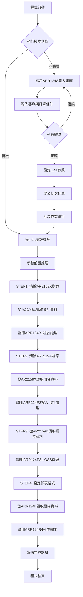
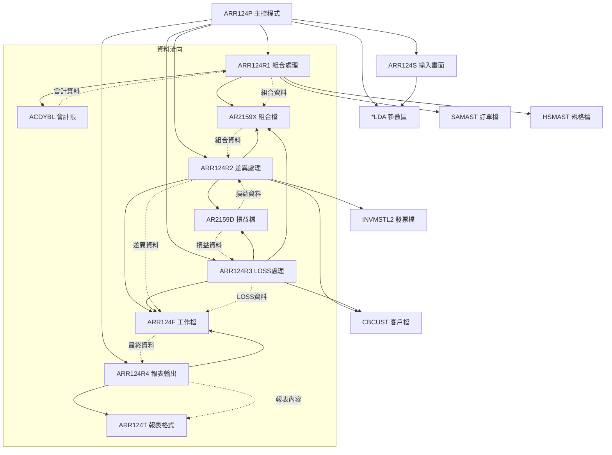
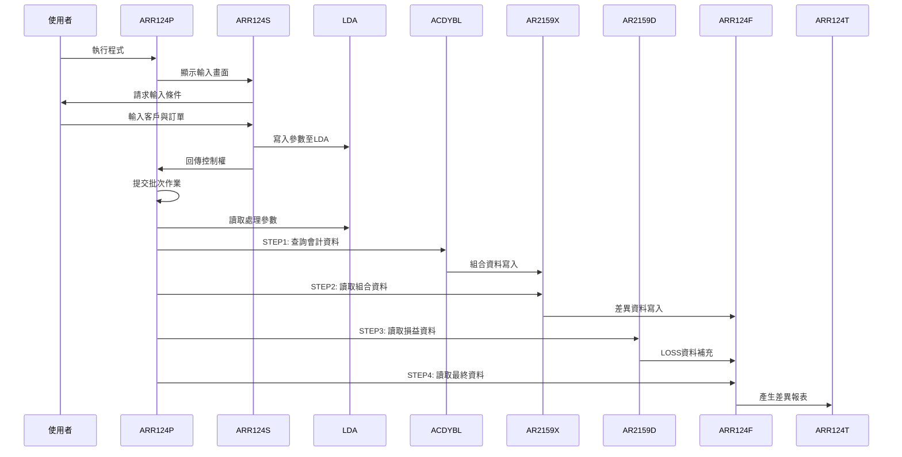
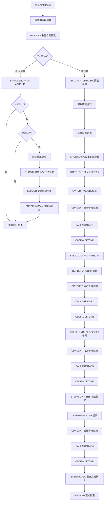

# ARR124P_U01 程式規格書

## 1. 基本資料

| 項目 | 內容 |
|------|------|
| **程式編號** | ARR124P |
| **程式名稱** | 應收帳款餘額處理作業 |
| **程式類型** | CLP |
| **廠區** | U01 |
| **系統名稱** | 應收帳款系統 |
| **子系統** | 應收帳款餘額處理 |
| **檔案位置** | 東鋼list/ARR124P_U01.txt |

## 2. 🎯 程式功能說明

### 主要功能描述
ARR124P是應收帳款系統的餘額處理作業控制程式，負責處理客戶應收帳款的組合與投入出料差異分析。程式透過4個步驟的批次處理，從會計日記帳資料開始，依序進行組合處理、投入出料差異計算、LOSS資料處理，最後產生應收帳款餘額差異報表。

### 🎯 業務流程詳細說明

#### 完整業務流程圖


#### 業務流程關鍵階段說明

**1. 互動式參數輸入階段**
- 提供ARR124S畫面供使用者輸入查詢條件
- 客戶編號：空白表示查詢所有客戶
- 訂單編號：空白表示查詢所有訂單
- 參數驗證通過後存入LDA區域

**2. STEP1：組合資料處理階段**
- 清除AR2159X工作檔案
- 從ACDYBL會計日記帳讀取科目代號2159或211301的資料
- 透過ARR124R1程式進行組合資料處理
- 依訂單範圍篩選相關記錄

**3. STEP2：投入出料差異處理階段**
- 清除ARR124F最終工作檔案
- 從AR2159X讀取組合資料
- 透過ARR124R2程式計算投入出料差異
- 比對AR2159D損益資料產生差異分析

**4. STEP3：LOSS資料處理階段**
- 從AR2159D損益明細檔讀取資料
- 透過ARR124R3程式處理LOSS相關資料
- 補充遺漏的損益項目到ARR124F檔案

**5. STEP4：報表輸出階段**
- 設定ARR124T報表格式為132字元寬度
- 從ARR124F讀取已處理的完整資料
- 透過ARR124R4程式產生應收帳款餘額差異報表

## 3. 🎯 檔案架構與關聯圖

### 使用檔案清單

| 檔案名稱 | 檔案類型 | 用途說明 | 存取模式 |
|----------|----------|----------|----------|
| ARR124S | DSPF | 互動式參數輸入畫面 | I/O |
| ARR124R1 | RPG程式 | 組合資料處理程式 | CALL |
| ARR124R2 | RPG程式 | 投入出料差異處理程式 | CALL |
| ARR124R3 | RPG程式 | LOSS資料處理程式 | CALL |
| ARR124R4 | RPG程式 | 報表輸出處理程式 | CALL |
| ARR124T | PRTF | 餘額差異報表格式檔案 | OUTPUT |
| ARR124F | 實體檔案 | 最終處理結果工作檔 | I/O |
| AR2159X | 實體檔案 | 組合資料工作檔 | I/O |
| AR2159D | 實體檔案 | 損益明細資料檔 | INPUT |
| ACDYBL | 實體檔案 | 會計日記帳主檔 | INPUT |
| *LDA | 本地資料區 | 參數傳遞區域 | READ/WRITE |

### 🎯 檔案關聯詳細視覺化圖表



### 🎯 資料流向詳細說明

#### 4步驟處理的資料流向


## 4. 🎯 檔案欄位規格說明

### 主要資料結構

#### LDA參數區域結構
| 位置 | 長度 | 欄位名稱 | 用途說明 |
|------|------|----------|----------|
| 301-306 | 6 | S#CUNO | 客戶編號 |
| 307-312 | 6 | S#ORNO | 訂單編號 |
| 313-318 | 6 | C#CUNS | 客戶範圍起始 |
| 319-324 | 6 | C#CUNE | 客戶範圍結束 |
| 325-330 | 6 | C#ORNS | 訂單範圍起始 |
| 331-336 | 6 | C#ORNE | 訂單範圍結束 |
| 1011-1020 | 10 | S#DEVN | 使用者識別碼 |

#### 程式變數定義表
| 變數名稱 | 類型 | 長度 | 說明 |
|----------|------|------|------|
| &TYPE | CHAR | 1 | 作業類型識別 |
| &S#DEVN | CHAR | 10 | 裝置名稱 |
| &S#USER | CHAR | 10 | 使用者名稱 |
| &S#CUNO | CHAR | 6 | 客戶編號 |
| &S#ORNO | CHAR | 6 | 訂單編號 |
| &C#CUNS | CHAR | 6 | 客戶範圍起始 |
| &C#CUNE | CHAR | 6 | 客戶範圍結束 |
| &C#ORNS | CHAR | 6 | 訂單範圍起始 |
| &C#ORNE | CHAR | 6 | 訂單範圍結束 |

### 🔍 重點欄位切割技術詳解

#### LDA參數區域結構視覺化
```
LDA參數區域 (1020字元)：[CUNO__|ORNO__|CUNS__|CUNE__|ORNS__|ORNE__|.........|DEVN______|...]
位置:                 301-306 307-312 313-318 319-324 325-330 331-336        1011-1020   1021-
                       ↓       ↓       ↓       ↓       ↓       ↓              ↓           ↓
客戶編號:             [CUNO__]                                                              6位客戶代碼
訂單編號:                     [ORNO__]                                                      6位訂單代碼
客戶範圍起:                           [CUNS__]                                              6位範圍起始
客戶範圍迄:                                   [CUNE__]                                      6位範圍結束
訂單範圍起:                                           [ORNS__]                              6位範圍起始
訂單範圍迄:                                                   [ORNE__]                      6位範圍結束
使用者ID:                                                              [DEVN______]        10位使用者識別
```

#### LDA區域欄位切割對應表
| 位置範圍 | 長度 | 欄位名稱 | 用途說明 | 切割邏輯 |
|----------|------|----------|----------|----------|
| 301-306 | 6 | S#CUNO | 客戶編號 | 直接讀取6位客戶代碼 |
| 307-312 | 6 | S#ORNO | 訂單編號 | 直接讀取6位訂單代碼 |
| 313-318 | 6 | C#CUNS | 客戶範圍起始 | 挪用為範圍查詢起始值 |
| 319-324 | 6 | C#CUNE | 客戶範圍結束 | 挪用為範圍查詢結束值 |
| 325-330 | 6 | C#ORNS | 訂單範圍起始 | 挪用為範圍查詢起始值 |
| 331-336 | 6 | C#ORNE | 訂單範圍結束 | 挪用為範圍查詢結束值 |
| 1011-1020 | 10 | S#DEVN | 使用者識別碼 | 直接讀取10位使用者ID |

#### ACDYBL檔案欄位切割技術詳細分析

##### 會計帳號欄位切割視覺化
```
ACRLNO (8字元)：[NNNNNNNN] → RLNO [NNNNNN]
                ↓                  ↓
原始關聯號碼:   [12345678]         [123456]
切割邏輯:      8字元關聯號碼       %SST(ACRLNO 1 6)

切割目的：取得前6位的主要訂單編號
業務邏輯：後2位為子項目編號，查詢時只需主編號
挪用效果：簡化訂單查詢條件，支援主訂單統計
```

#### ARR124F工作檔案結構詳細分析

##### ARR124F記錄格式視覺化
```
ARR124F記錄 (88字元)：[CUNO__|CUNM______|ORNO__|AMT1______|AMT2______|AMT3______|...]
位置:                001-006 007-016   017-022 023-033   034-044   045-055   ...
                      ↓       ↓         ↓       ↓         ↓         ↓         ↓
客戶編號:            [CUNO__]                                                    6位客戶代碼
客戶名稱:                    [CUNM______]                                        10位客戶名稱
訂單編號:                              [ORNO__]                                  6位訂單代碼
投入出料差異金額:                              [AMT1______]                      11位Packed數值
組合差異金額:                                            [AMT2______]            11位Packed數值
保留金額1:                                                         [AMT3______] 11位Packed數值
```

### 🎯 欄位挪用詳細分析

#### 參數範圍處理的挪用機制

##### 客戶範圍挪用處理
```
原始欄位S#CUNO (6字元)：[CUNO__]
                        ↓
挪用處理邏輯：
IF S#CUNO='      ' THEN
   C#CUNS='A     ', C#CUNE='999999'  // 空白時設為全範圍
ELSE
   C#CUNS=S#CUNO, C#CUNE=S#CUNO      // 指定客戶時設為相同值

範圍對應表：
輸入值        → 起始範圍     結束範圍     涵蓋範圍
'      '(空白) → 'A     '    '999999'    所有客戶
'CUS001'      → 'CUS001'    'CUS001'    特定客戶

挪用原因：OPNQRYF查詢需要範圍條件而非單一值
業務邏輯：支援全客戶查詢和單客戶查詢的彈性需求
```

##### 訂單範圍挪用處理
```
原始欄位S#ORNO (6字元)：[ORNO__]
                        ↓
挪用處理邏輯：
IF S#ORNO='      ' THEN
   C#ORNS='A     ', C#ORNE='999999'  // 空白時設為全範圍
ELSE
   C#ORNS=S#ORNO, C#ORNE=S#ORNO      // 指定訂單時設為相同值

範圍對應表：
輸入值        → 起始範圍     結束範圍     涵蓋範圍
'      '(空白) → 'A     '    '999999'    所有訂單
'ORD001'      → 'ORD001'    'ORD001'    特定訂單

挪用原因：支援範圍查詢的技術需求
業務邏輯：提供全訂單和特定訂單的查詢彈性
```

#### 會計科目特殊挪用處理

##### 科目代號的多重對應
```
ACDYBL.ACNO科目代號挪用：
查詢條件：(ACNO *EQ "2159") *OR (ACNO *EQ "211301")

科目對應表：
科目代號    業務意義         處理方式
"2159"  →  應收帳款組合   →  標準組合處理
"211301" → 應收帳款調整   →  調整項目處理

挪用原因：不同科目代號代表不同的應收帳款性質
業務邏輯：統一處理但保持科目別的業務區分
技術實現：OR條件查詢涵蓋多種科目類型
```

#### ARR124R2程式的廠區挪用處理

##### 廠區別判定的特殊邏輯
```
INVMSTL2.INRCNO挪用切割：
INRCNO (6字元) → D#LOCA (1字元) = %SST(INRCNO 1 1)

廠區對應邏輯：
IF 發票檔有資料 AND D#LOCA不是空白 AND D#LOCA='T' THEN
   K#AREA='U'     // T廠區挪用為U廠區處理
ELSE
   K#AREA=D#AREA  // 使用原始廠區代碼

特殊訂單挪用：
IF D#AREA='T' OR D#ORNO='K06099' OR D#ORNO='K06132' THEN
   K#AREA='U'     // 特殊訂單統一歸為U廠區

挪用原因：T廠區和特殊訂單需要統一歸類到U廠區處理
業務邏輯：簡化廠區管理，統一處理流程
技術效果：減少廠區別的複雜度，提升處理效率
```

### 重要變數定義表

| 變數名稱 | 類型 | 長度 | 說明 | 切割來源 | 挪用邏輯 |
|----------|------|------|------|----------|----------|
| &S#CUNO | CHAR | 6 | 客戶編號 | LDA(301-306) | 直接使用 |
| &S#ORNO | CHAR | 6 | 訂單編號 | LDA(307-312) | 直接使用 |
| &C#CUNS | CHAR | 6 | 客戶範圍起始 | &S#CUNO挪用 | 單值轉範圍起始 |
| &C#CUNE | CHAR | 6 | 客戶範圍結束 | &S#CUNO挪用 | 單值轉範圍結束 |
| &C#ORNS | CHAR | 6 | 訂單範圍起始 | &S#ORNO挪用 | 單值轉範圍起始 |
| &C#ORNE | CHAR | 6 | 訂單範圍結束 | &S#ORNO挪用 | 單值轉範圍結束 |

## 5. 🎯 輸出/入螢幕布局

### 互動式輸入畫面布局
ARR124S提供的參數輸入畫面：

```
+----------------------------------------------------------+
|        ARR124S                    東鋼企業股份有限公司    |
+----------------------------------------------------------+
|              應收帳款餘額處理作業輸入畫面                  |
+----------------------------------------------------------+
|                                                          |
| 客戶編號：[______] (空白:查詢全部)                       |
|                                                          |
| 訂單編號：[______] (空白:查詢全部)                       |
|                                                          |
|                                                          |
|                                                          |
|                                                          |
|                                                          |
| [錯誤訊息顯示區]                                          |
|                                                          |
| PF03:離開      PF12:回到上層                             |
+----------------------------------------------------------+
```

### 🎯 畫面欄位詳細說明
| 欄位名稱 | 屬性 | 長度 | 輸入格式 | 驗證規則 |
|----------|------|------|----------|----------|
| 客戶編號 | 選填 | 6 | 英數字 | 必須存在於客戶主檔中或空白 |
| 訂單編號 | 選填 | 6 | 英數字 | 必須存在於訂單主檔中或空白 |

### 功能鍵詳細定義
| 功能鍵 | 功能說明 | 處理邏輯 |
|--------|----------|----------|
| F3 | 離開程式 | 設定IN03='1'，結束程式執行 |
| F12 | 回到上層 | 設定IN12='1'，回到主選單 |
| Enter | 確認輸入 | 執行輸入驗證，通過後進入批次處理 |

### 報表輸出格式
ARR124T報表的版面配置：

```
+=======================================================================+
| 程式代號: ARR124T      東鋼企業股份有限公司         列印日期: YYYY/MM/DD |
| 列印人員: XXXXXXXXXX   應收帳款餘額處理作業          列印時間: HH:MM:SS   |
|                                                     程式頁數: XXX      |
+=======================================================================+
| 客戶編號 客戶名稱   訂單編號  組合系統金額  投入系統金額  系統差異    |
+-----------------------------------------------------------------------+
| XXXXXX   XXXXXXXXXX XXXXXX   99,999,999    99,999,999   9,999,999   |
| XXXXXX   XXXXXXXXXX XXXXXX   99,999,999    99,999,999   9,999,999   |
+-----------------------------------------------------------------------+
| 筆數:XX                                               總計:XXX        |
+=======================================================================+
```

## 6. 🎯 處理流程程序說明

### 🎯 主程序邏輯深度分析

#### 程式執行流程圖


#### 🎯 詳細處理步驟逐一分析

**步驟1：程式初始化階段**
- 宣告ARR124S顯示檔案和9個工作變數
- 透過RTVJOBA取得當前作業的執行環境
- 判別作業類型決定互動式或批次處理流程

**步驟2：互動式處理流程**
- 透過SNDRCVF顯示ARR124S參數輸入畫面
- 檢查F3/F12功能鍵，決定是否離開程式
- 將輸入的客戶編號和訂單編號寫入LDA區域
- 使用SBMJOB提交ARR124P批次作業至ARJOBD佇列

**步驟3：批次處理參數讀取**
- 透過RTVDTAARA從LDA讀取客戶編號、訂單編號、使用者ID
- 執行參數前置處理，轉換單一值為範圍查詢條件
- 將處理後的範圍參數寫回LDA區域供子程式使用

**步驟4：STEP1會計資料組合處理**
- 清除AR2159X組合工作檔案
- 設定ACDYBL會計日記帳檔案覆蓋到DALIB/ACDYBL
- 建立查詢條件：科目代號2159或211301，訂單範圍篩選
- 使用MAPFLD將ACRLNO前6位切割為RLNO供查詢使用
- 調用ARR124R1程式進行組合資料處理

**步驟5：STEP2投入出料差異處理**
- 清除ARR124F最終工作檔案
- 設定AR2159X檔案覆蓋，依客戶範圍建立查詢
- 調用ARR124R2程式比對AR2159D計算投入出料差異
- 將差異資料寫入ARR124F檔案

**步驟6：STEP3 LOSS資料處理**
- 設定AR2159D損益檔案覆蓋
- 建立客戶和訂單雙重範圍查詢條件
- 調用ARR124R3程式處理LOSS相關資料
- 補充遺漏的損益項目到ARR124F檔案

**步驟7：STEP4報表輸出處理**
- 設定ARR124T報表格式：132字元寬度、10CPI、HOLD輸出
- 設定ARR124F檔案覆蓋，依客戶和訂單排序
- 調用ARR124R4程式產生應收帳款餘額差異報表
- 發送處理完成訊息給使用者

### 🎯 子程序邏輯分析

**ARR124R1子程序功能（組合處理）**
- 讀取ACDYBL會計日記帳資料，依借貸方向累計金額
- 透過SAMAST/HSMAST取得訂單和規格資料
- 依客戶資料建立組合記錄寫入AR2159X
- 區分H/非H憑證號碼設定不同的模式標記

**ARR124R2子程序功能（差異處理）**
- 讀取AR2159X組合資料，比對AR2159D損益資料
- 計算投入出料差異：(金額1+金額3+金額4-金額2)
- 處理廠區別特殊邏輯：T廠區和特殊訂單歸為U廠區
- 依差異情況設定不同的模式標記（1:投入出料，2:組合，3:確認組合）

**ARR124R3子程序功能（LOSS處理）**
- 讀取AR2159D損益資料，比對AR2159X組合資料
- 處理金額為0或不存在於其他廠區的LOSS項目
- 補充遺漏的損益資料到ARR124F檔案
- 設定模式標記為1（投入出料類型）

**ARR124R4子程序功能（報表輸出）**
- 從ARR124F讀取最終處理結果
- 計算系統差異：組合金額-投入出料金額
- 格式化輸出客戶、訂單、各類金額到ARR124T報表
- 處理報表頁首、明細、結尾的完整輸出

### 🎯 特殊邏輯處理

**廠區別特殊處理邏輯**
- T廠區資料統一歸類為U廠區處理
- 特殊訂單K06099、K06132強制設定為U廠區
- 透過INVMSTL2發票檔判定廠區歸屬

**範圍查詢條件組合**
- 空白客戶/訂單設定為'A     '到'999999'全範圍
- 指定客戶/訂單設定起始和結束為相同值
- 確保查詢條件的完整性和正確性

## 7. 🎯 數據操作與轉換分析

### 檔案操作詳解

**ACDYBL檔案存取邏輯**
- READ操作：透過OPNQRYF建立的查詢檢視讀取會計資料
- 查詢條件：科目代號(2159/211301)、關聯號碼範圍
- 檔案鎖定：使用SHARE(*YES)允許多重存取
- 欄位映射：ACRLNO前6位映射為RLNO供訂單範圍比對

**AR2159X/AR2159D檔案操作**
- AR2159X：組合資料的中間工作檔，支援讀寫操作
- AR2159D：損益明細資料檔，僅供讀取比對
- 關聯鍵值：客戶編號+廠區+訂單編號的複合鍵值結構
- 資料流向：ACDYBL → AR2159X → ARR124F，AR2159D → ARR124F

**ARR124F檔案管理**
- 最終結果檔案，整合所有處理階段的資料
- 支援客戶編號+訂單編號的複合鍵值排序
- 記錄不同類型的金額：投入出料、組合、差異金額
- 模式欄位標記不同的資料來源和處理方式

### 數據轉換邏輯

**金額計算轉換**
- 會計借貸方向處理：借方(C)加法，貸方減法
- 差異計算公式：投入出料金額-組合金額=系統差異
- 損益金額組合：ADAMT1+ADAMT3+ADAMT4-ADAMT2
- 數值精度：11位Packed decimal格式確保計算精確度

**客戶訂單資料轉換**
- 客戶編號：6位字元格式，支援英數字組合
- 訂單編號：6位字元格式，前6位主編號切割
- 客戶名稱：從CBCUST客戶檔取得10位名稱資料
- 範圍轉換：單一值轉換為起始-結束範圍格式

### 計算邏輯分析

**範圍參數計算邏輯**
- 空白輸入轉換：' ' → ('A     ', '999999')全範圍
- 特定值轉換：'CUS001' → ('CUS001', 'CUS001')單一值
- 確保查詢條件涵蓋所需的資料範圍

**廠區別判定計算**
- 基礎判定：依INVMSTL2.INRCNO第1位判定廠區
- 特殊規則：T廠區和特殊訂單統一歸為U廠區
- 影響範圍：AR2159D資料的查詢和比對邏輯

**金額差異計算公式**
- 基礎差異：(ADAMT1+ADAMT3+ADAMT4)-ADAMT2
- 組合比對：AR2159X.AXAMT vs 計算差異
- 結果判定：相等為正常，不等為需調整項目

### 檢核機制詳解

**資料完整性檢查**
- 客戶存在性：透過CBCUST檔案驗證客戶有效性
- 訂單關聯性：透過SAMAST/HSMAST確認訂單資料
- 發票對應性：透過INVMSTL2確認發票與廠區關聯

**邏輯一致性控制**
- 金額零值處理：差異為0或AR2159X不存在的項目處理
- 廠區邏輯：確保T廠區和特殊訂單正確歸類
- 模式標記：正確設定不同處理階段的模式識別

**錯誤處理機制**
- 檔案不存在：使用*IN50-*IN52指示器控制
- 資料不完整：提供預設值('*')處理缺失資料
- 計算錯誤：確保數值運算不產生異常結果

## 8. 🎯 錯誤處理程序說明

### 🎯 詳細錯誤代碼清冊

| 錯誤代碼 | 錯誤訊息 | 原因說明 | 處理方式 | 預防措施 |
|----------|----------|----------|----------|----------|
| **INPUT001** | 客戶編號格式錯誤 | 輸入的客戶編號包含無效字元 | 1. 顯示錯誤訊息<br>2. 游標定位至客戶編號欄位<br>3. 要求重新輸入 | 加強輸入格式驗證 |
| **INPUT002** | 客戶編號不存在 | 輸入的客戶編號在CBCUST檔案中不存在 | 1. 顯示錯誤訊息<br>2. 提供客戶編號查詢功能<br>3. 要求輸入正確編號 | 建立客戶編號有效性檢查 |
| **INPUT003** | 訂單編號格式錯誤 | 輸入的訂單編號包含無效字元 | 1. 顯示錯誤訊息<br>2. 游標定位至訂單編號欄位<br>3. 要求重新輸入 | 設定欄位輸入限制 |
| **INPUT004** | 訂單編號不存在 | 輸入的訂單編號在SAMAST檔案中不存在 | 1. 顯示錯誤訊息<br>2. 提供訂單編號查詢功能<br>3. 要求輸入正確編號 | 定期同步訂單檔案 |
| **FILE001** | ACDYBL檔案開啟失敗 | 會計日記帳檔案無法開啟或損壞 | 1. 記錄錯誤日誌<br>2. 通知系統管理員<br>3. 終止處理程序 | 定期檢查檔案完整性 |
| **FILE002** | AR2159X檔案清除失敗 | 組合工作檔案無法清除或鎖定 | 1. 等待檔案解鎖<br>2. 重試清除操作<br>3. 強制解除檔案鎖定 | 確保檔案使用權限正確 |
| **FILE003** | AR2159D檔案存取失敗 | 損益檔案無法讀取或權限不足 | 1. 檢查檔案權限<br>2. 重新建立檔案覆蓋<br>3. 聯絡檔案管理員 | 定期維護檔案權限 |
| **FILE004** | ARR124F檔案寫入失敗 | 工作檔案磁碟空間不足或損壞 | 1. 檢查磁碟空間<br>2. 清理暫存檔案<br>3. 重新執行處理 | 監控磁碟使用量 |
| **DATA001** | 會計資料異常 | ACDYBL檔案資料格式錯誤或金額異常 | 1. 記錄異常資料<br>2. 跳過異常記錄<br>3. 繼續處理其他資料 | 加強資料驗證機制 |
| **DATA002** | 客戶資料不一致 | 客戶編號在不同檔案中資料不一致 | 1. 記錄不一致項目<br>2. 使用預設客戶名稱<br>3. 標記需要核對 | 建立客戶資料同步機制 |
| **CALC001** | 金額計算溢位 | 金額計算結果超出欄位容量 | 1. 記錄溢位項目<br>2. 設定為最大值<br>3. 發出警告訊息 | 擴大金額欄位容量 |
| **CALC002** | 差異計算異常 | 投入出料與組合金額差異過大 | 1. 記錄異常差異<br>2. 標記需要核對<br>3. 繼續處理 | 設定差異警告閾值 |
| **SYS001** | LDA區域存取失敗 | 本地資料區讀寫發生錯誤 | 1. 重新初始化LDA<br>2. 重試存取操作<br>3. 重新啟動程式 | 定期檢查系統資源 |
| **SYS002** | 批次作業提交失敗 | SBMJOB提交作業到佇列失敗 | 1. 檢查作業佇列狀態<br>2. 重新提交作業<br>3. 直接執行處理 | 監控作業佇列狀況 |

### 🎯 系統異常處理邏輯

**檔案操作失敗處理**
- 所有檔案操作均包含MONMSG指令監控CPF0000訊息
- CLRPFM失敗時自動忽略，確保處理能夠繼續
- OPNQRYF失敗時自動執行DLTOVR清理資源
- 檔案鎖定衝突時提供重試機制

**資料處理異常控制**
- 使用指示器*IN50-*IN52控制檔案讀取狀態
- 客戶資料不存在時提供預設值('*')處理
- 金額計算異常時記錄並繼續處理其他資料
- 確保部分資料異常不影響整體處理流程

**程式調用失敗處理**
- ARR124R1-R4子程式調用失敗時記錄錯誤
- 確保每個STEP完成後正確執行CLOF和DLTOVR
- 提供處理進度監控和異常恢復機制
- 保證資源正確釋放和檔案關閉

**並發控制機制**
- 使用SHARE(*YES)允許多使用者同時存取
- 工作檔案採用使用者別名避免衝突
- 提供檔案鎖定等待和重試邏輯
- 確保資料一致性不受並發操作影響

## 9. 🎯 備註

### 🎯 特殊注意事項

**4步驟處理順序的重要性**
程式必須依序執行STEP1到STEP4，每個步驟的輸出是下一步驟的輸入。STEP1建立組合基礎資料，STEP2計算差異，STEP3補充LOSS項目，STEP4產生最終報表。任一步驟失敗都會影響後續處理結果。

**廠區別處理的特殊邏輯**
T廠區和特殊訂單(K06099、K06132)統一歸類為U廠區處理，此邏輯反映了實際業務中的廠區管理需求。處理時需注意INVMSTL2發票檔的廠區判定邏輯。

**金額差異的業務意義**
系統差異=組合金額-投入出料金額，正值表示組合高於投入，負值表示投入高於組合。差異為0表示帳務平衡，非0差異需要進一步分析和調整。

**工作檔案的清除時機**
AR2159X和ARR124F在每次處理開始時都會清除，確保不受上次處理結果影響。但AR2159D為主要資料檔，僅供讀取不進行清除操作。

**參數傳遞的LDA機制**
所有處理參數透過LDA在主程式和子程式間傳遞，確保參數一致性。LDA位置的設定需與子程式的UDS定義保持一致。

**報表輸出的格式控制**
ARR124T報表設定為132字元寬度、10CPI字型，適合A4橫向列印。HOLD(*YES)設定允許使用者控制列印時機，USRDTA設定報表用途說明。 