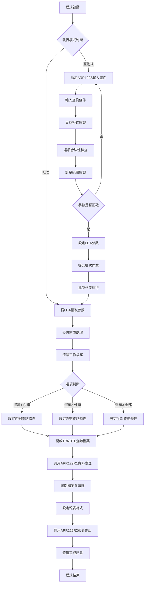
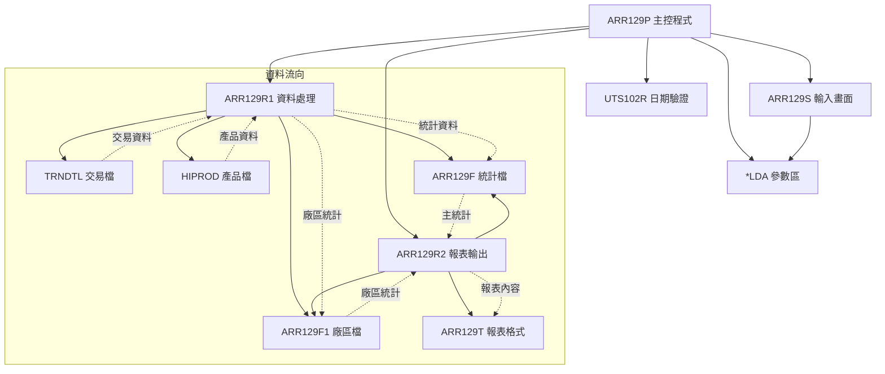
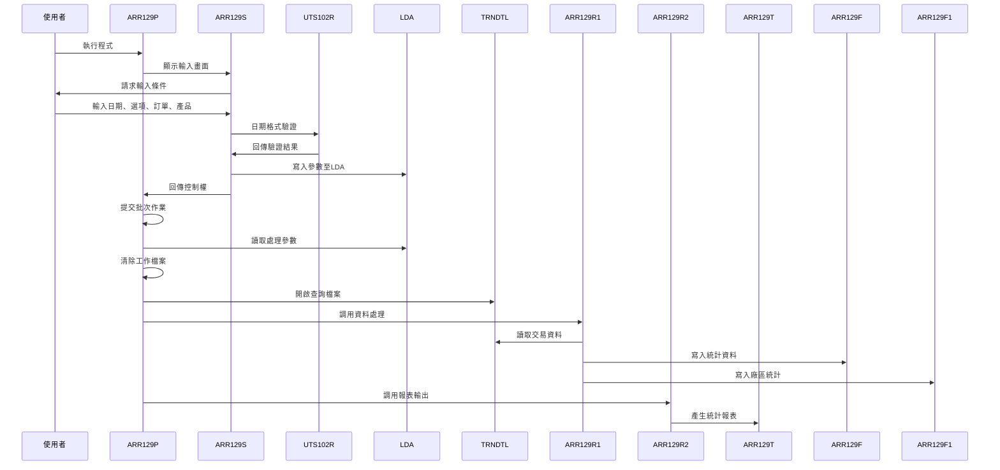
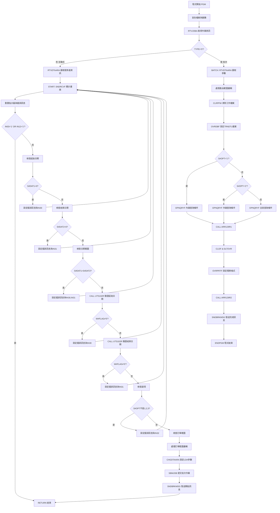

# ARR129P_P02 程式規格書

## 1. 基本資料

| 項目 | 內容 |
|------|------|
| **程式編號** | ARR129P |
| **程式名稱** | 單筆應收帳款發票記入處理 |
| **程式類型** | CLP |
| **廠區** | P02 |
| **系統名稱** | 應收帳款系統 |
| **子系統** | 應收帳款發票記入分析 |
| **檔案位置** | 東鋼list/ARR129P_P02.txt |

## 2. 🎯 程式功能說明

### 主要功能描述
ARR129P是應收帳款系統的單筆發票記入處理控制程式，負責統計分析指定期間內的應收帳款發票記入情況。程式支援依據內銷、外銷、全部等不同選項進行分類統計，並可依訂單編號、產品名稱進行篩選，最終產生詳細的發票記入統計報表。

### 🎯 業務流程詳細說明

#### 完整業務流程圖


#### 業務流程關鍵階段說明

**1. 互動式參數輸入階段**
- 提供ARR129S畫面供使用者輸入查詢條件
- 應收帳款起迄區間：YYYYMMDD格式的日期範圍
- 選項設定：1=內銷、2=外銷、3=全部
- 訂單編號範圍：支援起始到結束的訂單篩選
- 產品名稱：可指定特定產品進行統計

**2. 參數驗證階段**
- 日期格式驗證：透過UTS102R程式驗證日期有效性
- 邏輯驗證：確保起始日期不大於結束日期
- 選項檢查：限定選項必須為1、2、3其中之一
- 訂單範圍檢查：起始訂單不可大於結束訂單

**3. 批次處理資料篩選階段**
- 依選項設定不同的TRNDTL查詢條件
- 內銷：排除訂單號碼第一位為'H'的記錄
- 外銷：僅包含訂單號碼第一位為'H'的記錄
- 全部：包含所有符合其他條件的記錄
- 共同條件：交易代碼AR05、非刪除狀態、日期範圍、訂單範圍、產品篩選

**4. 資料處理階段**
- 透過ARR129R1程式進行應收帳款資料統計
- 依廠區別進行分類累計(P/T/U/D/J/O/R/X/V/Q/M/K)
- 將統計結果寫入ARR129F主要統計檔案
- 將廠區別統計寫入ARR129F1輔助統計檔案

**5. 報表輸出階段**
- 設定ARR129T報表格式為132字元寬度
- 透過ARR129R2程式產生發票記入統計報表
- 包含產品明細、廠區別統計、總計等多層次資訊

## 3. 🎯 檔案架構與關聯圖

### 使用檔案清單

| 檔案名稱 | 檔案類型 | 用途說明 | 存取模式 |
|----------|----------|----------|----------|
| ARR129S | DSPF | 互動式參數輸入畫面 | I/O |
| ARR129R1 | RPG程式 | 應收帳款資料處理程式 | CALL |
| ARR129R2 | RPG程式 | 統計報表輸出程式 | CALL |
| ARR129T | PRTF | 發票記入統計報表格式 | OUTPUT |
| ARR129F | 實體檔案 | 產品別統計主檔 | I/O |
| ARR129F1 | 實體檔案 | 廠區別統計輔助檔 | I/O |
| TRNDTL | 實體檔案 | 交易明細主檔 | INPUT |
| HIPROD | 實體檔案 | 產品資料主檔 | INPUT |
| UTS102R | RPG程式 | 日期驗證公用程式 | CALL |
| *LDA | 本地資料區 | 參數傳遞區域 | READ/WRITE |

### 🎯 檔案關聯詳細視覺化圖表



### 🎯 資料流向詳細說明

#### 互動式與批次處理的資料流向


## 4. 🎯 檔案欄位規格說明

### 主要資料結構

#### LDA參數區域結構
| 位置 | 長度 | 欄位名稱 | 用途說明 |
|------|------|----------|----------|
| 301-308 | 8 | C#DAT1 | 應收帳款起始日期 |
| 309-316 | 8 | C#DAT2 | 應收帳款結束日期 |
| 317-317 | 1 | S#OPT | 查詢選項(1:內銷 2:外銷 3:全部) |
| 321-326 | 6 | S#ORNS | 訂單編號範圍起始 |
| 331-336 | 6 | S#ORNE | 訂單編號範圍結束 |
| 341-345 | 5 | S#PDNM | 產品名稱篩選條件 |
| 1001-1010 | 10 | S#USER | 使用者名稱 |
| 1011-1020 | 10 | S#DEVN | 使用者識別碼 |

#### 程式變數定義表
| 變數名稱 | 類型 | 長度 | 說明 |
|----------|------|------|------|
| &TYPE | CHAR | 1 | 作業類型識別 |
| &S#DEVN | CHAR | 10 | 裝置名稱 |
| &S#USER | CHAR | 10 | 使用者名稱 |
| &C#DAT1 | CHAR | 8 | 應收帳款起始日期 |
| &C#DAT2 | CHAR | 8 | 應收帳款結束日期 |
| &W#FLAG | CHAR | 1 | 日期驗證旗標 |
| &P#PDAT | CHAR | 8 | 日期驗證參數 |
| &P#MODE | CHAR | 1 | 驗證模式 |
| &P#MTL | CHAR | 24 | 月份表 |
| &P#LEAP | CHAR | 1 | 閏年旗標 |
| &W#PDNS | CHAR | 5 | 產品範圍起始 |
| &W#PDNE | CHAR | 5 | 產品範圍結束 |

### 🔍 重點欄位切割技術詳解

#### LDA參數區域結構視覺化
```
LDA參數區域 (1020字元)：[DAT1____|DAT2____|O|.....|ORNS__|ORNE__|PDNM_|.....|USER______|DEVN______|...]
位置:                 301-308  309-316  317     321-326 331-336 341-345      1001-1010  1011-1020  1021-
                       ↓        ↓        ↓       ↓       ↓       ↓            ↓          ↓          ↓
起始日期:             [DAT1____]                                                                      8位YYYYMMDD格式
結束日期:                      [DAT2____]                                                              8位YYYYMMDD格式
查詢選項:                               [O]                                                           1位選項代碼
訂單範圍起:                                     [ORNS__]                                            6位訂單編號
訂單範圍迄:                                             [ORNE__]                                    6位訂單編號
產品名稱:                                                       [PDNM_]                             5位產品代碼
使用者名稱:                                                              [USER______]               10位使用者名稱
使用者ID:                                                                         [DEVN______]      10位使用者識別
```

#### LDA區域欄位切割對應表
| 位置範圍 | 長度 | 欄位名稱 | 用途說明 | 切割邏輯 |
|----------|------|----------|----------|----------|
| 301-308 | 8 | C#DAT1 | 應收帳款起始日期 | 直接讀取YYYYMMDD格式 |
| 309-316 | 8 | C#DAT2 | 應收帳款結束日期 | 直接讀取YYYYMMDD格式 |
| 317-317 | 1 | S#OPT | 查詢選項 | 單字元選項代碼 |
| 321-326 | 6 | S#ORNS | 訂單範圍起始 | 直接讀取6位訂單編號 |
| 331-336 | 6 | S#ORNE | 訂單範圍結束 | 直接讀取6位訂單編號 |
| 341-345 | 5 | S#PDNM | 產品名稱 | 直接讀取5位產品代碼 |
| 1001-1010 | 10 | S#USER | 使用者名稱 | 直接讀取10位使用者名稱 |
| 1011-1020 | 10 | S#DEVN | 使用者識別碼 | 直接讀取10位使用者ID |

#### TRNDTL檔案欄位切割技術詳細分析

##### 交易檔案欄位切割視覺化
```
TXDATE (8字元)：[YYYYMMDD] → DATE [YYYYMMDD]
                ↓                  ↓
原始交易日期:   [20231215]         [20231215]
切割邏輯:      8字元交易日期       MAPFLD直接映射

TXORNO (9字元)：[NNNNNNNNN] → ORN1 [N]
                ↓                   ↓
原始訂單號碼:   [H12345678]        [H]
切割邏輯:      9字元訂單號碼       %SST(TXORNO 1 1)

TXPDNM (6字元)：[NNNNNN] → TXPDNM [NNNNN] + TXTXAR [N]
                ↓                ↓                ↓
原始產品代碼:   [AB123T]         [AB123]          [T]
切割邏輯:      6字元產品代碼     前5位產品名稱     第6位廠區別
```

#### ARR129F工作檔案結構詳細分析

##### ARR129F記錄格式視覺化
```
ARR129F記錄 (68字元)：[PDNO_|PDNM__________________|AMTP______|AMTT______|AMTM______|AMTK______|...]
位置:                001-005 006-025               026-036   037-047   048-058   059-069   ...
                      ↓       ↓                     ↓         ↓         ↓         ↓         ↓
產品編號:            [PDNO_]                                                                  5位產品代碼
產品名稱:                    [PDNM__________________]                                          20位產品名稱
台灣廠區金額:                                      [AMTP______]                              11位Packed數值
內銷廠區金額:                                                [AMTT______]                    11位Packed數值
台中廠區金額:                                                          [AMTM______]          11位Packed數值
高雄廠區金額:                                                                    [AMTK______] 11位Packed數值
```

#### ARR129F1廠區別統計檔案結構分析

##### ARR129F1記錄格式視覺化
```
ARR129F1記錄 (38字元)：[A|PDNO_|AMTT______|AMTM______|AMTK______|...]
位置:                 001 002-006 007-017   018-028   029-039   ...
                       ↓   ↓       ↓         ↓         ↓         ↓
廠區別:               [A]                                        1位廠區代碼
產品編號:                 [PDNO_]                               5位產品代碼
內銷金額:                         [AMTT______]                 11位Packed數值
台中金額:                                   [AMTM______]       11位Packed數值
高雄金額:                                             [AMTK______] 11位Packed數值
```

### 🎯 欄位挪用詳細分析

#### 產品範圍處理的挪用機制

##### 產品名稱範圍挪用處理
```
原始欄位S#PDNM (5字元)：[PDNM_]
                        ↓
挪用處理邏輯：
IF S#PDNM=' ' THEN
   W#PDNS='     ', W#PDNE='99999'  // 空白時設為全範圍
ELSE
   W#PDNS=S#PDNM, W#PDNE=S#PDNM    // 指定產品時設為相同值

範圍對應表：
輸入值        → 起始範圍     結束範圍     涵蓋範圍
'     '(空白)  → '     '     '99999'     所有產品
'ABC12'       → 'ABC12'     'ABC12'     特定產品

挪用原因：OPNQRYF查詢需要範圍條件而非單一值
業務邏輯：支援全產品查詢和特定產品查詢的彈性需求
```

##### 訂單範圍挪用處理
```
原始欄位S#ORNS/S#ORNE (6字元)：[ORNS__]/[ORNE__]
                               ↓        ↓
挪用處理邏輯：
IF S#ORNS≠' ' AND S#ORNE=' ' THEN
   S#ORNE=S#ORNS                      // 只有起始時，結束設為起始值

IF S#ORNS=' ' AND S#ORNE=' ' THEN
   S#ORNE='999999'                    // 全部空白時，結束設為最大值

範圍對應表：
起始值    結束值    → 實際範圍
'      '  '      ' → '      ' to '999999'  (全部訂單)
'A12345'  '      ' → 'A12345' to 'A12345'  (單一訂單)
'A12345'  'B99999' → 'A12345' to 'B99999'  (範圍查詢)

挪用原因：簡化使用者輸入，支援單一訂單和範圍查詢
業務邏輯：提供查詢條件的使用彈性
```

#### TRNDTL檔案查詢條件的特殊挪用

##### 內銷外銷判定的欄位挪用
```
TXORNO首位字元挪用：
TXORNO (9字元)：[NNNNNNNNN] → ORN1 [N]
                ↓                   ↓
原始訂單號碼:   [H12345678]        [H]

內銷外銷判定邏輯：
選項1 (內銷)：ORN1 *NE "H"        // 第一位不是H的訂單
選項2 (外銷)：ORN1 *EQ "H"        // 第一位是H的訂單  
選項3 (全部)：無此條件             // 不限制第一位字元

挪用原因：訂單號碼第一位字元代表內銷/外銷屬性
業務邏輯：H開頭為外銷訂單，非H開頭為內銷訂單
技術實現：透過%SST(TXORNO 1 1)取得首位字元進行判定
```

#### 產品代碼與廠區別的複合挪用

##### TXPDNM的雙重切割處理
```
TXPDNM (6字元)：[NNNNNN] → TXPDNM [NNNNN] + TXTXAR [N]
                ↓                ↓                ↓
原始產品代碼:   [AB123T]         [AB123]          [T]
                                ↓                ↓
用途:          6字元完整代碼     前5位產品名稱     第6位廠區別

Data Structure定義：
DS:
  D#TXPD (6字元)
    TXPDNM (1-5字元) - 產品名稱
    TXTXAR (6-6字元) - 廠區別

挪用原因：產品代碼包含產品名稱和廠區資訊
業務邏輯：前5位為產品識別，第6位為廠區歸屬
技術效果：一個欄位同時支援產品篩選和廠區統計
```

#### 廠區別統計的多重挪用邏輯

##### 廠區代碼的業務歸類挪用
```
廠區代碼業務歸類：
原始廠區 → 統計歸類
'P'      → 台灣廠區 (F#AMTP)
'T'      → 內銷廠區 (F#AMTT)  
'U'      → 內銷廠區 (F#AMTT)
'D'      → 內銷廠區 (F#AMTT)
'J'      → 內銷廠區 (F#AMTT)
'O'      → 內銷廠區 (F#AMTT)
'R'      → 內銷廠區 (F#AMTT)
'X'      → 內銷廠區 (F#AMTT)
'V'      → 內銷廠區 (F#AMTT)
'Q'      → 內銷廠區 (F#AMTT)
'M'      → 台中廠區 (F#AMTM)
'K'      → 高雄廠區 (F#AMTK)

挪用原因：多個實體廠區需要歸類到業務廠區統計
業務邏輯：簡化廠區管理，按地理位置和業務性質分類
技術實現：透過SELEC/WHEQ邏輯進行多對一的挪用對應
```

### 重要變數定義表

| 變數名稱 | 類型 | 長度 | 說明 | 切割來源 | 挪用邏輯 |
|----------|------|------|------|----------|----------|
| &C#DAT1 | CHAR | 8 | 起始日期 | LDA(301-308) | 直接使用 |
| &C#DAT2 | CHAR | 8 | 結束日期 | LDA(309-316) | 直接使用 |
| &S#OPT | CHAR | 1 | 查詢選項 | LDA(317) | 直接使用 |
| &S#ORNS | CHAR | 6 | 訂單範圍起始 | LDA(321-326) | 範圍查詢起始 |
| &S#ORNE | CHAR | 6 | 訂單範圍結束 | LDA(331-336) | 範圍查詢結束 |
| &W#PDNS | CHAR | 5 | 產品範圍起始 | &S#PDNM挪用 | 單值轉範圍起始 |
| &W#PDNE | CHAR | 5 | 產品範圍結束 | &S#PDNM挪用 | 單值轉範圍結束 |

## 5. 🎯 輸出/入螢幕布局

### 互動式輸入畫面布局
ARR129S提供的參數輸入畫面：

```
+----------------------------------------------------------+
|        ARR129S                    東鋼企業股份有限公司    |
+----------------------------------------------------------+
|              單筆應收帳款發票記入處理輸入畫面              |
+----------------------------------------------------------+
|                                                          |
| 選項代號：[_] (1:內銷2:外銷3:全部)                       |
|                                                          |
| 應收帳款起迄區間：[____/__/__] ~~ [____/__/__]           |
|                                                          |
| 訂單編號：[______] ~ [______] (空白表查詢全部)           |
|                                                          |
| 產品名稱：[_____] (空白表查詢全部)                       |
|                                                          |
|                                                          |
| [錯誤訊息顯示區]                                          |
|                                                          |
| 操作說明：         PF3=離開程式    PF12=回到上層          |
+----------------------------------------------------------+
```

### 🎯 畫面欄位詳細說明
| 欄位名稱 | 屬性 | 長度 | 輸入格式 | 驗證規則 |
|----------|------|------|----------|----------|
| 選項代號 | 必填 | 1 | 數字 | 限定1、2、3其中之一 |
| 起始日期 | 必填 | 8 | YYYY/MM/DD | 透過UTS102R驗證日期有效性 |
| 結束日期 | 必填 | 8 | YYYY/MM/DD | 透過UTS102R驗證，不可小於起始日期 |
| 訂單編號起 | 選填 | 6 | 英數字 | 必須存在於交易檔案中或空白 |
| 訂單編號迄 | 選填 | 6 | 英數字 | 不可小於起始訂單編號 |
| 產品名稱 | 選填 | 5 | 英數字 | 必須存在於產品檔案中或空白 |

### 功能鍵詳細定義
| 功能鍵 | 功能說明 | 處理邏輯 |
|--------|----------|----------|
| F3 | 離開程式 | 設定IN03='1'，結束程式執行 |
| F12 | 回到上層 | 設定IN12='1'，回到主選單 |
| Enter | 確認輸入 | 執行輸入驗證，通過後進入批次處理 |

### 報表輸出格式
ARR129T報表的版面配置：

```
+=======================================================================+
| 程式代號: ARR129T      東鋼企業股份有限公司         列印人員: XXXXXXXXXX |
| 起迄期間: YYYY/MM/DD ~ YYYY/MM/DD                  列印日期: YYYY/MM/DD |
| 選項代號: 內銷/外銷/全部                           程式頁數: XXX        |
| 訂單編號: XXXXXX ~ XXXXXX  產品名稱: XXXXX                           |
+=======================================================================+
|                        台灣      內銷      台中      高雄      合計    |
+=======================================================================+
| 小計：                99,999,999 99,999,999 99,999,999 99,999,999 99,999,999 |
| *XXXXX XXXXXXXXXXXXXXXXXXXX                                           |
|   產品統計：         99,999,999 99,999,999 99,999,999 99,999,999 99,999,999 |
|   內銷出貨：                   99,999,999                             |
|   台中出貨：                             99,999,999                   |
|   高雄出貨：                                       99,999,999         |
+-----------------------------------------------------------------------+
| 單筆應收發票總計:    99,999,999 99,999,999 99,999,999 99,999,999 99,999,999 |
|  主廠代號:            廠廠代號:            廠廠代號:                   |
+=======================================================================+
```

## 6. 🎯 處理流程程序說明

### 🎯 主程序邏輯深度分析

#### 程式執行流程圖


#### 🎯 詳細處理步驟逐一分析

**步驟1：程式初始化階段**
- 宣告ARR129S顯示檔案和12個工作變數
- 透過RTVJOBA取得當前作業的執行環境
- 判別作業類型決定互動式或批次處理流程

**步驟2：互動式處理流程**
- 從LDA讀取使用者識別碼和名稱資訊
- 透過SNDRCVF顯示ARR129S參數輸入畫面
- 重置所有錯誤指示器(IN30-IN33)和錯誤訊息

**步驟3：參數驗證處理**
- 起始日期檢查：不可為0或空白
- 結束日期檢查：不可為0或空白
- 日期範圍檢查：起始日期不可大於結束日期
- 透過UTS102R程式驗證日期格式的有效性
- 選項檢查：限定必須為1、2、3其中之一
- 訂單範圍邏輯處理：起始不可大於結束

**步驟4：LDA參數設定**
- 將驗證通過的參數寫入LDA區域
- 位置301-308：起始日期
- 位置309-316：結束日期  
- 位置317：查詢選項
- 位置321-326：訂單範圍起始
- 位置331-336：訂單範圍結束
- 位置341-345：產品名稱

**步驟5：批次作業提交**
- 使用SBMJOB提交ARR129P批次作業至ARJOBD佇列
- 發送開始處理訊息至使用者訊息佇列

**步驟6：批次處理參數讀取**
- 透過RTVDTAARA從LDA讀取所有處理參數
- 執行產品範圍前置處理邏輯
- 執行訂單範圍前置處理邏輯

**步驟7：工作檔案初始化**
- 清除ARR129F產品統計檔案
- 清除ARR129F1廠區統計檔案
- 設定TRNDTL交易檔案覆蓋為共享模式

**步驟8：查詢條件設定**
- 依據選項設定不同的OPNQRYF查詢條件
- 選項1(內銷)：ORN1≠'H'，排除外銷訂單
- 選項2(外銷)：ORN1='H'，僅包含外銷訂單
- 選項3(全部)：無此限制條件
- 共同條件：TXCODE='AR05'、TXFLAG≠'D'、日期範圍、訂單範圍、產品範圍

**步驟9：資料處理與報表輸出**
- 調用ARR129R1程式進行應收帳款統計處理
- 關閉查詢檔案並清除覆蓋設定
- 設定ARR129T報表格式：132字元寬度、10CPI、HOLD輸出
- 調用ARR129R2程式產生統計報表
- 發送處理完成訊息

### 🎯 子程序邏輯分析

**ARR129R1子程序功能（資料統計處理）**
- 讀取TRNDTL交易明細資料，依產品和廠區進行分類統計
- 透過HIPROD產品檔案取得完整的產品名稱資訊
- 使用20元素陣列(ARY1)進行產品別金額累計
- 依廠區別寫入ARR129F主統計檔案和ARR129F1輔助統計檔案
- 處理廠區代碼對應：P→台灣、T/U/D/J/O/R/X/V/Q→內銷、M→台中、K→高雄

**ARR129R2子程序功能（報表產生）**
- 從ARR129F和ARR129F1讀取統計資料
- 產生產品別統計明細和廠區別小計
- 透過TAB1/TAB2表格進行廠區名稱對應
- 處理產品名稱前置'7'字元的特殊標記(*號顯示)
- 計算各廠區的總計和全部總計
- 格式化輸出到ARR129T報表

### 🎯 特殊邏輯處理

**訂單範圍處理邏輯**
- 單一訂單查詢：起始不空白且結束空白時，結束設為起始值
- 全部查詢：起始和結束都空白時，結束設為'999999'
- 範圍查詢：起始和結束都有值時，直接使用範圍條件

**產品範圍處理邏輯**
- 全部產品：產品名稱空白時，設定範圍為'     '到'99999'
- 特定產品：產品名稱不空白時，起始和結束設為相同值

**日期驗證機制**
- 透過UTS102R公用程式進行日期格式和邏輯驗證
- 支援閏年判定和月份天數檢查
- 確保日期的合理性和有效性

**廠區別統計歸類**
- 多個實體廠區歸類到業務廠區進行統計
- 支援廠區代碼的動態對應和統計
- 提供廠區別和產品別的交叉統計分析

## 7. 🎯 數據操作與轉換分析

### 檔案操作詳解

**TRNDTL檔案存取邏輯**
- READ操作：透過OPNQRYF建立的查詢檢視讀取交易資料
- 查詢條件：交易代碼(AR05)、處理狀態(非刪除)、日期範圍、訂單範圍、產品範圍
- 檔案鎖定：使用SHARE(*YES)允許多重存取
- 欄位映射：TXDATE映射為DATE，TXORNO首位映射為ORN1
- 排序鍵值：TXTXAR(廠區)、TXPDNM(產品)

**ARR129F/ARR129F1檔案操作**
- ARR129F：產品別統計主檔，記錄每個產品在各廠區的金額統計
- ARR129F1：廠區別統計輔助檔，記錄每個廠區和產品的組合統計
- 操作模式：先清除再重建，確保資料的完整性
- 更新邏輯：存在則UPDATE，不存在則WRITE新記錄

**HIPROD檔案查詢**
- READ操作：透過產品代碼查詢產品基本資料
- 取得資料：產品中文名稱(F4CHIN)用於報表顯示
- 錯誤處理：產品不存在時使用空白名稱

### 數據轉換邏輯

**日期格式轉換**
- 輸入格式：YYYYMMDD (8位數字)
- 驗證處理：透過UTS102R轉換為標準日期格式
- 查詢使用：直接使用8位日期格式進行範圍比對
- 報表顯示：轉換為YYYY/MM/DD格式輸出

**金額統計轉換**
- 原始金額：TXAMT (11位Packed decimal)
- 統計累計：依廠區別和產品別進行加總
- 精度控制：使用11位Packed decimal確保計算精確度
- 報表格式：使用EDTCDE(1)進行千分位逗號顯示

**產品代碼轉換**
- 輸入切割：TXPDNM 6位切割為TXPDNM(5位)+TXTXAR(1位)  
- 產品名稱：前5位用於產品識別和篩選
- 廠區別：第6位用於廠區歸類統計
- 陣列處理：透過20元素陣列進行產品別累計

### 計算邏輯分析

**產品別統計計算**
- 基礎邏輯：依產品代碼進行金額累計
- 陣列運算：使用SORTA排序後進行順序處理
- 廠區歸類：依第6位廠區代碼分別累計到不同金額欄位
- 結果儲存：更新或新增ARR129F記錄

**廠區別統計計算**
- 輔助統計：ARR129F1記錄廠區和產品的組合統計
- 對應邏輯：多個實體廠區對應到業務廠區統計
- 計算公式：依廠區別分別累計AMTT、AMTM、AMTK欄位
- 交叉分析：支援廠區別和產品別的交叉統計

**報表計算邏輯**
- 產品小計：各產品在不同廠區的金額總和
- 廠區小計：各廠區的所有產品金額總和
- 總計計算：所有廠區和產品的總金額
- 百分比：各廠區占總金額的比例(報表中未實現)

### 檢核機制詳解

**輸入資料檢核**
- 日期有效性：透過UTS102R進行完整的日期檢核
- 邏輯一致性：起始日期不可大於結束日期
- 選項合法性：限定選項值必須為1、2、3
- 範圍合理性：起始訂單不可大於結束訂單

**檔案存取檢核**
- 檔案存在性：使用指示器檢查檔案讀取狀態
- 資料完整性：確保產品檔案和交易檔案的關聯正確性
- 記錄有效性：排除已刪除(TXFLAG='D')的交易記錄
- 鍵值正確性：確保檔案鍵值的唯一性和正確性

**計算結果檢核**
- 金額合理性：檢查計算結果是否在合理範圍內
- 統計一致性：確保主統計和輔助統計的資料一致
- 廠區對應：驗證廠區代碼對應的正確性
- 累計正確性：確保各層級統計的累計正確

## 8. 🎯 錯誤處理程序說明

### 🎯 詳細錯誤代碼清冊

| 錯誤代碼 | 錯誤訊息 | 原因說明 | 處理方式 | 預防措施 |
|----------|----------|----------|----------|----------|
| **USER001** | 請輸入應收帳款起始期間 | 起始日期欄位為空白或0 | 1. 顯示錯誤訊息<br>2. 游標定位至起始日期欄位<br>3. 設定IN30指示器 | 設定欄位為必填屬性 |
| **USER002** | 請輸入應收帳款結束期間 | 結束日期欄位為空白或0 | 1. 顯示錯誤訊息<br>2. 游標定位至結束日期欄位<br>3. 設定IN31指示器 | 設定欄位為必填屬性 |
| **USER003** | 起迄期間不可大於結束期間 | 起始日期大於結束日期 | 1. 顯示錯誤訊息<br>2. 設定IN30和IN31指示器<br>3. 要求重新輸入 | 加強欄位間邏輯檢查 |
| **USER004** | 應收帳款起始期間錯誤！ | 起始日期格式錯誤或不存在 | 1. 顯示錯誤訊息<br>2. 設定IN30指示器<br>3. 調用UTS102R驗證結果 | 使用日期選擇器輔助輸入 |
| **USER005** | 應收帳款結束期間錯誤！ | 結束日期格式錯誤或不存在 | 1. 顯示錯誤訊息<br>2. 設定IN31指示器<br>3. 調用UTS102R驗證結果 | 提供日期格式範例 |
| **USER006** | 選項輸入錯誤！ | 選項不是1、2、3其中之一 | 1. 顯示錯誤訊息<br>2. 設定IN32指示器<br>3. 提供有效選項說明 | 使用下拉選單限制輸入 |
| **USER007** | 起始客戶不可大於結束客戶！ | 訂單範圍邏輯錯誤 | 1. 顯示錯誤訊息<br>2. 設定IN33指示器<br>3. 要求重新輸入範圍 | 增加範圍邏輯檢查 |
| **FILE001** | TRNDTL檔案開啟失敗 | 交易明細檔案無法開啟或損壞 | 1. 記錄錯誤日誌<br>2. 通知系統管理員<br>3. 終止處理程序 | 定期檢查檔案完整性 |
| **FILE002** | ARR129F檔案清除失敗 | 統計檔案無法清除或鎖定 | 1. 等待檔案解鎖<br>2. 重試清除操作<br>3. 使用MONMSG忽略錯誤 | 確保檔案使用權限正確 |
| **FILE003** | HIPROD檔案存取失敗 | 產品檔案無法讀取或權限不足 | 1. 使用空白產品名稱<br>2. 繼續處理其他資料<br>3. 記錄缺失產品 | 定期維護產品檔案 |
| **DATA001** | 交易資料異常 | TRNDTL檔案資料格式錯誤 | 1. 記錄異常資料<br>2. 跳過異常記錄<br>3. 繼續處理其他資料 | 加強資料驗證機制 |
| **DATA002** | 產品資料不存在 | 產品代碼在產品檔案中不存在 | 1. 使用產品代碼作為名稱<br>2. 標記需要核對<br>3. 繼續統計處理 | 建立產品資料同步機制 |
| **CALC001** | 金額計算溢位 | 統計金額超出欄位容量 | 1. 記錄溢位項目<br>2. 設定為最大值<br>3. 發出警告訊息 | 擴大金額欄位容量 |
| **CALC002** | 陣列處理異常 | 產品數量超過陣列容量(20) | 1. 記錄超出部分<br>2. 處理前20個產品<br>3. 提醒檢查資料 | 增加陣列容量或分批處理 |
| **SYS001** | 日期驗證程式調用失敗 | UTS102R程式無法執行 | 1. 跳過日期驗證<br>2. 記錄系統錯誤<br>3. 繼續基本檢查 | 確保公用程式可用性 |
| **SYS002** | 批次作業提交失敗 | SBMJOB提交作業到佇列失敗 | 1. 檢查作業佇列狀態<br>2. 重新提交作業<br>3. 直接執行處理 | 監控作業佇列狀況 |

### 🎯 系統異常處理邏輯

**檔案操作失敗處理**
- CLRPFM操作包含MONMSG監控，清除失敗時自動忽略
- OPNQRYF失敗時自動執行DLTOVR清理資源
- 檔案讀取使用指示器控制，不存在時提供預設處理
- 所有檔案操作完成後確實執行CLOF和DLTOVR

**資料處理異常控制**
- 產品資料不存在時使用產品代碼作為名稱顯示
- 陣列處理超出範圍時記錄並繼續處理
- 金額計算異常時設定合理預設值
- 確保部分資料異常不影響整體統計結果

**使用者輸入錯誤處理**
- 所有輸入錯誤都回到輸入畫面重新輸入
- 錯誤指示器精確定位錯誤欄位
- 提供詳細的錯誤說明和修正建議
- 保留正確輸入的資料，僅要求修正錯誤部分

**程式調用失敗處理**
- UTS102R調用失敗時跳過詳細日期驗證
- ARR129R1調用失敗時確保檔案正確關閉
- ARR129R2調用失敗時提供錯誤報表輸出
- 所有程式調用都包含適當的錯誤恢復機制

## 9. 🎯 備註

### 🎯 特殊注意事項

**選項處理的業務意義**
選項1(內銷)和選項2(外銷)的區分依據訂單號碼第一位字元，'H'開頭為外銷訂單，非'H'開頭為內銷訂單。此邏輯反映了企業的訂單編碼規則和業務分類需求。

**產品代碼的複合結構**
TXPDNM欄位前5位為產品名稱，第6位為廠區別，此設計允許一個欄位同時支援產品篩選和廠區統計。處理時需正確切割這兩部分資訊。

**廠區統計的歸類邏輯**
多個實體廠區歸類到4個業務廠區進行統計：台灣(P)、內銷(T/U/D/J/O/R/X/V/Q)、台中(M)、高雄(K)。此歸類反映了企業的地理分佈和業務管理需求。

**日期驗證的重要性**
程式透過UTS102R進行嚴格的日期驗證，包括格式檢查、邏輯檢查、閏年處理等。確保統計期間的正確性對報表準確性至關重要。

**工作檔案的處理順序**
ARR129F和ARR129F1兩個工作檔案在每次處理開始時都會清除，ARR129R1負責寫入統計資料，ARR129R2負責讀取並產生報表。此順序不可變更。

**陣列處理的限制**
程式使用20元素陣列進行產品統計，如果產品種類超過20種，可能影響統計完整性。需要關注實際業務中的產品數量是否超出此限制。

**報表格式的特殊標記**
產品名稱前置'7'字元的產品在報表中會以'*'號標記，此為特殊產品的業務標識，報表使用者需了解此標記的含義。 