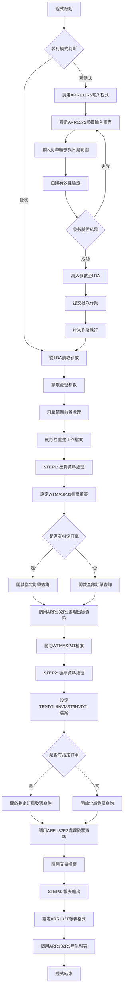
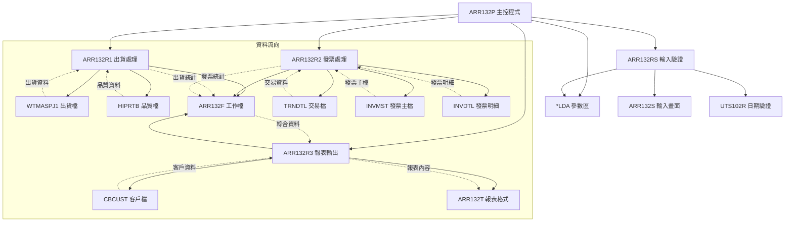
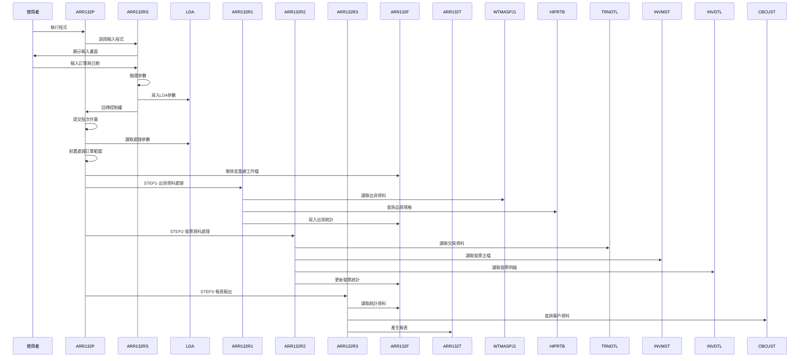
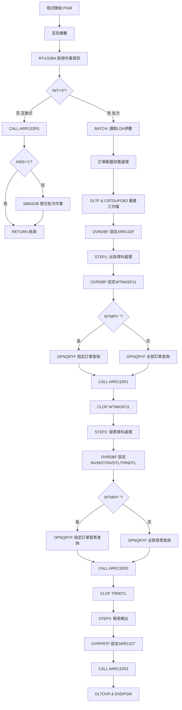

# ARR132P_P02 程式規格書

## 1. 基本資料

| 項目 | 內容 |
|------|------|
| **程式編號** | ARR132P |
| **程式名稱** | 客戶出貨發票開立報表-東興企業 |
| **程式類型** | CLP |
| **廠區** | P02 |
| **系統名稱** | 應收帳款系統 |
| **子系統** | 出貨發票分析 |
| **檔案位置** | 東鋼list/ARR132P_P02.txt |

## 2. 🎯 程式功能說明

### 主要功能描述
ARR132P是應收帳款系統中專門為特定客戶(DH043-東興企業)設計的出貨發票開立對照分析程式。程式整合出貨資料與發票資料，透過三階段處理流程，產生完整的出貨發票對照報表，協助業務單位掌握該客戶的出貨發票開立狀況、金額分析及未開立發票的出貨明細。

### 🎯 業務流程詳細說明

#### 完整業務流程圖


#### 業務流程關鍵階段說明

**1. 互動式參數輸入階段**
- 提供ARR132S畫面供使用者輸入查詢條件
- 支援最多5個訂單編號的並行查詢
- 日期範圍設定：起始日期到結束日期
- 參數驗證：日期格式、邏輯合理性檢查

**2. 第一階段：出貨資料處理(STEP1)**
- 目標檔案：WTMASPJ1(出貨主檔+明細檔)
- 篩選條件：客戶編號DH043、非刪除狀態、日期範圍、特定交易代碼
- 處理邏輯：計算出貨重量、產品分類、品質規格統計
- 輸出結果：寫入ARR132F工作檔案的基本出貨資料

**3. 第二階段：發票資料處理(STEP2)**
- 目標檔案：TRNDTL(交易明細)、INVMST(發票主檔)、INVDTL(發票明細)
- 篩選條件：客戶編號DH043、交易代碼SA04、非空白發票號碼
- 處理邏輯：發票金額分類統計、稅額計算、已付金額統計
- 輸出結果：更新ARR132F工作檔案的發票相關欄位

**4. 第三階段：報表輸出(STEP3)**
- 讀取ARR132F統計資料，產生格式化報表
- 包含產品別統計、發票金額統計、總計分析
- 支援產品名稱查找和品質規格對照
- 特殊標記：數量為0的項目標示異常

## 3. 🎯 檔案架構與關聯圖

### 使用檔案清單

| 檔案名稱 | 檔案類型 | 用途說明 | 存取模式 |
|----------|----------|----------|----------|
| ARR132S | DSPF | 互動式參數輸入畫面 | I/O |
| ARR132RS | RPG程式 | 互動式輸入驗證程式 | CALL |
| ARR132R1 | RPG程式 | 出貨資料處理程式 | CALL |
| ARR132R2 | RPG程式 | 發票資料處理程式 | CALL |
| ARR132R3 | RPG程式 | 報表輸出程式 | CALL |
| ARR132T | PRTF | 出貨發票對照報表格式 | OUTPUT |
| ARR132F | 實體檔案 | 出貨發票統計工作檔 | I/O |
| WTMASPJ1 | 實體檔案 | 出貨主檔與明細檔 | INPUT |
| TRNDTL | 實體檔案 | 交易明細主檔 | INPUT |
| INVMST | 實體檔案 | 發票主檔 | INPUT |
| INVDTL | 實體檔案 | 發票明細檔 | INPUT |
| HIPRTB | 實體檔案 | 產品品質規格檔 | INPUT |
| CBCUST | 實體檔案 | 客戶基本資料檔 | INPUT |
| UTS102R | RPG程式 | 日期驗證公用程式 | CALL |
| *LDA | 本地資料區 | 參數傳遞區域 | READ/WRITE |

### 🎯 檔案關聯詳細視覺化圖表



### 🎯 資料流向詳細說明

#### 三階段處理的資料流向


## 4. 🎯 檔案欄位規格說明

### 主要資料結構

#### LDA參數區域結構
| 位置 | 長度 | 欄位名稱 | 用途說明 |
|------|------|----------|----------|
| 401-406 | 6 | ORNO | 主要訂單編號 |
| 407-414 | 8 | YMDS | 查詢起始日期 |
| 415-422 | 8 | YMDE | 查詢結束日期 |
| 423-428 | 6 | CUNO | 客戶編號(固定DH043) |
| 429-434 | 6 | ORN1 | 附加訂單編號1 |
| 435-440 | 6 | ORN2 | 附加訂單編號2 |
| 441-446 | 6 | ORN3 | 附加訂單編號3 |
| 447-452 | 6 | ORN4 | 附加訂單編號4 |
| 951-985 | 35 | COMP | 公司名稱 |
| 1001-1010 | 10 | USID | 使用者名稱 |
| 1011-1020 | 10 | DEVI | 使用者識別碼 |
| 1021-1021 | 1 | AREA | 廠區代碼 |

#### 程式變數定義表
| 變數名稱 | 類型 | 長度 | 說明 |
|----------|------|------|------|
| &INT | CHAR | 1 | 作業類型識別 |
| &OUTQ | CHAR | 10 | 輸出佇列名稱 |
| &IN03 | LGL | 1 | 離開指示器 |
| &ORNO | CHAR | 6 | 主要訂單編號 |
| &YMDS | CHAR | 8 | 查詢起始日期 |
| &YMDE | CHAR | 8 | 查詢結束日期 |
| &ORN1 | CHAR | 6 | 附加訂單編號1 |
| &ORN2 | CHAR | 6 | 附加訂單編號2 |
| &ORN3 | CHAR | 6 | 附加訂單編號3 |
| &ORN4 | CHAR | 6 | 附加訂單編號4 |
| &WTMP | CHAR | 1 | 訂單範圍處理旗標 |

### 🔍 重點欄位切割技術詳解

#### LDA參數區域結構視覺化
```
LDA參數區域 (1021字元)：[.....|ORNO__|YMDS____|YMDE____|.....|ORN1__|ORN2__|ORN3__|ORN4__|.....|COMP___________________________|USID______|DEVI______|A]
位置:                 401-406 407-414 415-422      429-434 435-440 441-446 447-452      951-985                        1001-1010 1011-1020 1021
                       ↓       ↓       ↓            ↓       ↓       ↓       ↓            ↓                              ↓         ↓         ↓
主要訂單:             [ORNO__]                                                                                                                    6位訂單編號
起始日期:                     [YMDS____]                                                                                                          8位YYYYMMDD格式
結束日期:                             [YMDE____]                                                                                                  8位YYYYMMDD格式
附加訂單1:                                     [ORN1__]                                                                                          6位訂單編號
附加訂單2:                                             [ORN2__]                                                                                  6位訂單編號
附加訂單3:                                                     [ORN3__]                                                                          6位訂單編號
附加訂單4:                                                             [ORN4__]                                                                  6位訂單編號
公司名稱:                                                                      [COMP___________________________]                               35位公司名稱
使用者名稱:                                                                                                       [USID______]                 10位使用者名稱
使用者ID:                                                                                                                      [DEVI______]  10位使用者識別
廠區代碼:                                                                                                                                    [A] 1位廠區代碼
```

#### LDA區域欄位切割對應表
| 位置範圍 | 長度 | 欄位名稱 | 用途說明 | 切割邏輯 |
|----------|------|----------|----------|----------|
| 401-406 | 6 | ORNO | 主要訂單編號 | 直接讀取6位訂單編號 |
| 407-414 | 8 | YMDS | 查詢起始日期 | 直接讀取YYYYMMDD格式 |
| 415-422 | 8 | YMDE | 查詢結束日期 | 直接讀取YYYYMMDD格式 |
| 429-434 | 6 | ORN1 | 附加訂單編號1 | 直接讀取6位訂單編號 |
| 435-440 | 6 | ORN2 | 附加訂單編號2 | 直接讀取6位訂單編號 |
| 441-446 | 6 | ORN3 | 附加訂單編號3 | 直接讀取6位訂單編號 |
| 447-452 | 6 | ORN4 | 附加訂單編號4 | 直接讀取6位訂單編號 |
| 951-985 | 35 | COMP | 公司名稱 | 直接讀取35位公司名稱 |
| 1001-1010 | 10 | USID | 使用者名稱 | 直接讀取10位使用者名稱 |
| 1011-1020 | 10 | DEVI | 使用者識別碼 | 直接讀取10位使用者ID |
| 1021-1021 | 1 | AREA | 廠區代碼 | 直接讀取1位廠區代碼 |

#### TRNDTL檔案欄位切割技術詳細分析

##### 交易檔案欄位切割視覺化
```
TXORNO (9字元)：[NNNNNNNNN] → TXRESV [NNNNNN]
                ↓                    ↓
原始訂單號碼:   [DH0430001]          [DH0430]
切割邏輯:      9字元完整訂單號       %SST(TXORNO 1 6)取前6位

TXIVNO (10字元)：[NNNNNNNNNN] → IVNO [NNNNNN]
                 ↓                   ↓
原始發票號碼:    [IV202300123]       [IV2023]
切割邏輯:       10字元完整發票號      %SST(TXIVNO 1 6)取前6位
```

#### ARR132F工作檔案結構詳細分析

##### ARR132F記錄格式視覺化
```
ARR132F記錄 (108字元)：[ORNO__|DATE____|WTNO____|PDNM_|QULT____|SPE1_|QTY_____|IVNO______|IVAM_______|AR06_______|PRRV_______|IVTX_______|IVAR_______|APNO__|CUNO__|...]
位置:                001-006 007-014  015-022  023-027 028-035  036-040 041-047   048-057    058-068     069-079     080-090     091-101     102-112     113-118  119-124  ...
                      ↓       ↓        ↓        ↓       ↓        ↓       ↓         ↓          ↓           ↓           ↓           ↓           ↓           ↓        ↓        ↓
訂單編號:            [ORNO__]                                                                                                                                                 6位訂單編號
出貨日期:                    [DATE____]                                                                                                                                       8位出貨日期
出貨單號:                             [WTNO____]                                                                                                                              8位出貨單號
產品名稱:                                      [PDNM_]                                                                                                                        5位產品代碼
品質規格:                                              [QULT____]                                                                                                            8位品質規格
規格說明:                                                       [SPE1_]                                                                                                     5位規格說明
出貨數量:                                                               [QTY_____]                                                                                          7位Packed數量
發票號碼:                                                                         [IVNO______]                                                                              10位發票號碼
出貨金額:                                                                                   [IVAM_______]                                                                   11位Packed金額
未收金額:                                                                                             [AR06_______]                                                         11位Packed金額
預收金額:                                                                                                       [PRRV_______]                                               11位Packed金額
稅額:                                                                                                                     [IVTX_______]                                     11位Packed金額
發票總額:                                                                                                                               [IVAR_______]                       11位Packed金額
應付編號:                                                                                                                                         [APNO__]                 6位應付編號
客戶編號:                                                                                                                                                   [CUNO__]           6位客戶編號
```

#### 交易檔案與出貨檔案的對應切割

##### WTMASPJ1檔案欄位切割
```
W#WTNO (8字元)：[NNNNNNNN] → WFWTNO [NNNNNNNN]
                ↓                   ↓
原始出貨單號:   [20231215]          [20231215]
切割邏輯:      W7AREA + W7VNO2組成   直接對應

W7NAME (產品)：[NNNNN] → WFPDNM [NNNNN]
               ↓                ↓
原始產品代碼:  [AB123]          [AB123]
切割邏輯:     前5位產品名稱       直接對應

W7QULT (品質)：[NNNNNNNN] → WFQULT [NNNNNNNN]
               ↓                  ↓
原始品質規格:  [SD280/G4]         [SD280/G4]
切割邏輯:     8字元品質規格       直接對應或查表轉換
```

### 🎯 欄位挪用詳細分析

#### 多訂單範圍處理的挪用機制

##### 訂單編號範圍挪用處理
```
原始欄位ORNO/ORN1/ORN2/ORN3/ORN4 (6字元×5)：[ORNO__][ORN1__][ORN2__][ORN3__][ORN4__]
                                              ↓      ↓      ↓      ↓      ↓
挪用處理邏輯：
IF (ORNO=' ' AND ORN1=' ' AND ORN2=' ' AND ORN3=' ' AND ORN4=' ') THEN
   WTMP=' '    // 全部訂單查詢
ELSE
   WTMP='X'    // 指定訂單查詢

空白訂單的預設值設定：
IF ORNO=' ' THEN ORN1='999999'
IF ORN1=' ' THEN ORN1='999999'
IF ORN2=' ' THEN ORN2='999999'
IF ORN3=' ' THEN ORN3='999999'
IF ORN4=' ' THEN ORN4='999999'

OPNQRYF查詢條件挪用：
WTMP='X' → W6ORNO *EQ "ORNO" *OR W6ORNO *EQ "ORN1" *OR ... (指定訂單)
WTMP=' ' → 無訂單限制條件 (全部訂單)

挪用原因：支援單一訂單、多訂單和全部訂單的彈性查詢
業務邏輯：簡化使用者輸入，提供多種查詢模式
技術實現：透過WTMP旗標控制不同的OPNQRYF條件
```

#### 出貨單號組成的複合挪用

##### 出貨單號的複合組成邏輯
```
W#WTNO組成：W7AREA (1字元) + W7VNO2 (5字元) = W#WTNO (8字元)
           ↓               ↓                  ↓
廠區代碼:  [P]             [12345]            [P0012345]

Data Structure定義：
DS:
  W#WTNO (8字元)
    W7AREA (1字元) - 廠區代碼
    W7VNO2 (2-6字元) - 出貨序號

挪用原因：出貨單號由廠區和序號組成
業務邏輯：不同廠區有獨立的出貨單號序列
技術實現：透過Data Structure重新定義欄位結構
```

#### 交易號碼的特殊切割挪用

##### TXNO的雙重用途切割
```
TXNO (8字元)：[NNNNNNNN] → D#NO1 [NNNNNN] + D#NO2 [NN]
              ↓                  ↓                ↓
原始交易號碼: [12345678]         [123456]         [78]

條件判斷邏輯：
IF D#NO2=' ' THEN
   WTNO=TXNO              // 直接使用交易號碼
ELSE
   ORNO=TXORNO           // 使用訂單號碼
   WTNO重新組成

挪用原因：交易號碼的後兩位決定出貨單號的組成方式
業務邏輯：不同類型的交易有不同的號碼處理規則
技術效果：一個欄位支援多種號碼格式的解析
```

#### 發票金額的分類統計挪用

##### IVACNT的金額分類挪用
```
IVACNT (2字元) → 金額分類統計：
'1' → W#AAMT (出貨金額)
'2' → W#CAMT (未收金額)
'3' → W#CAMT (未收金額)
'4' → W#BAMT (預收金額)
'5' → W#ATAX (稅額)
'6' → W#EAMT (應付金額) + W#APNO (應付編號)
'7' → W#EAMT (應付金額)
'8' → W#AAMT (出貨金額)
'9' → W#AAMT (出貨金額)

最終統計公式：
W#NBAL = W#AAMT + W#CAMT + W#BAMT + W#ATAX + W#EAMT

挪用原因：發票明細的會計科目決定金額歸類
業務邏輯：不同科目的金額需要分別統計和分析
技術實現：透過SELEC/WHEQ邏輯進行多對一的挪用對應
```

#### 產品統計陣列的挪用處理

##### ARY1/ARY2陣列的複合挪用
```
ARY1陣列 (1000元素×26字元)：[PDNM_|SPE1_|QTY________|QULT____]
                           ↓     ↓     ↓           ↓
產品統計:                  [AB123][W/G40][12345678][SD280/G4]

ARY2陣列 (500元素×65字元)：[IVN1|IVN2_____|IVAM_______|AR06_______|PRRV_______|IVTX_______|IVAR_______|]
                          ↓    ↓        ↓          ↓          ↓          ↓          ↓
發票統計:                 [99] [IV202301][999999999][999999999][999999999][999999999][999999999]

挪用邏輯：
- ARY1用於產品別統計，支援產品+規格的組合統計
- ARY2用於發票別統計，支援發票金額的分類統計
- 透過SORTA排序後進行累計處理
- 使用'99'作為ARY2的初始化標記

挪用原因：需要多維度的統計分析
業務邏輯：產品統計和發票統計各有不同的分析需求
技術實現：雙陣列結構支援複雜的統計運算
```

### 重要變數定義表

| 變數名稱 | 類型 | 長度 | 說明 | 切割來源 | 挪用邏輯 |
|----------|------|------|------|----------|----------|
| &ORNO | CHAR | 6 | 主要訂單編號 | LDA(401-406) | 直接使用 |
| &YMDS | CHAR | 8 | 起始日期 | LDA(407-414) | 直接使用 |
| &YMDE | CHAR | 8 | 結束日期 | LDA(415-422) | 直接使用 |
| &ORN1-4 | CHAR | 6 | 附加訂單編號 | LDA(429-452) | 多訂單OR條件 |
| &WTMP | CHAR | 1 | 訂單處理旗標 | 程式計算 | 空白檢查結果 |
| TXRESV | CHAR | 6 | 交易訂單號 | %SST(TXORNO 1 6) | 前6位切割 |
| IVNO | CHAR | 6 | 發票號碼 | %SST(TXIVNO 1 6) | 前6位切割 |

## 5. 🎯 輸出/入螢幕布局

### 互動式輸入畫面布局
ARR132S提供的參數輸入畫面：

```
+----------------------------------------------------------+
|          ARR132S            東鋼企業股份有限公司          |
+----------------------------------------------------------+
|            客戶出貨發票開立報表-東興企業輸入畫面          |
+----------------------------------------------------------+
|                                                          |
| 請輸入查詢條件：                                          |
|          1.訂單：[______][______][______][______][______]|
|                                                          |
|          2.日期區間：[____/__/__] 到 [____/__/__]       |
|                                                          |
|                                                          |
|                                                          |
|                                                          |
| [錯誤訊息顯示區]                                          |
|                                                          |
| F3:結束         F12:回到上層         ENTER:處理          |
+----------------------------------------------------------+
```

### 🎯 畫面欄位詳細說明
| 欄位名稱 | 屬性 | 長度 | 輸入格式 | 驗證規則 |
|----------|------|------|----------|----------|
| 訂單編號1-5 | 選填 | 6 | 英數字 | 必須存在於出貨檔案中或空白 |
| 起始日期 | 必填 | 8 | YYYY/MM/DD | 透過UTS102R驗證日期有效性 |
| 結束日期 | 必填 | 8 | YYYY/MM/DD | 透過UTS102R驗證，不可小於起始日期 |

### 功能鍵詳細定義
| 功能鍵 | 功能說明 | 處理邏輯 |
|--------|----------|----------|
| F3 | 結束程式 | 設定IN03='1'，結束程式執行 |
| F12 | 回到上層 | 設定IN12='1'，回到主選單 |
| Enter | 確認處理 | 執行輸入驗證，通過後進入批次處理 |

### 報表輸出格式
ARR132T報表的版面配置：

```
+=================================================================================+
| PRT-ID : ARR132T      東鋼企業股份有限公司               列印日期: YYYY/MM/DD   |
| USR-ID : XXXXXXXXXX   客戶出貨發票開立報表-東興企業     列印時間: HH:MM:SS    |
| 查詢日期: YYYY/MM/DD - YYYY/MM/DD  (東興企業專用)     程式頁數: XXX           |
| 訂單編號: XXXXXX    客戶編號: XXXXXX XXXXXXXXXX                               |
+=================================================================================+
| 日期   出貨單號  產品 品質規格 規格 數量    發票號碼   出貨金額  未收金額   預收金額   稅額     發票總額  應付編號 |
| ------ -------- --- -------- ----- ------- ---------- --------- --------- --------- --------- --------- ------ |
| 231215 P0012345 AB123 SD280/G4 W/G40  12,345 IV20230001 999,999,999 999,999,999 999,999,999 999,999,999 999,999,999 AP0001 |
| 231216 P0012346 AB124 SD420/G6 W/A70  23,456 ?IV20230002 999,999,999 999,999,999 999,999,999 999,999,999 999,999,999 AP0002 |
|                                        小計計: 35,801                                                                    |
+---------------------------------------------------------------------------------+
| 出計:                                  35,801 999,999,999 999,999,999 999,999,999 999,999,999 999,999,999        |
|                                                                                                                     |
| AB123 W/G40 SD280/G40螺絲鋼線                          12,345                                                      |
| AB124 W/A70 SD420W/A706螺絲預力鋼線                    23,456                                                      |
|                      ------------------- 產品出計:     35,801                                                      |
+---------------------------------------------------------------------------------+
| 總出計:                                35,801 999,999,999 999,999,999 999,999,999 999,999,999 999,999,999        |
+=================================================================================+
```

## 6. 🎯 處理流程程序說明

### 🎯 主程序邏輯深度分析

#### 程式執行流程圖


#### 🎯 詳細處理步驟逐一分析

**步驟1：程式初始化階段**
- 宣告12個工作變數，包含訂單編號、日期範圍、處理旗標
- 透過RTVJOBA取得輸出佇列和作業類型
- 判別互動式或批次處理模式

**步驟2：互動式處理流程**
- 調用ARR132RS程式顯示參數輸入畫面
- 處理使用者輸入的訂單編號(最多5個)和日期範圍
- 透過UTS102R進行日期格式驗證
- 將驗證通過的參數寫入LDA指定位置

**步驟3：批次作業提交**
- 使用SBMJOB提交ARR132P批次作業至ARJOBD佇列
- 指定輸出佇列為互動式作業的輸出佇列
- 確保報表輸出到正確的列印佇列

**步驟4：批次處理參數讀取**
- 從LDA讀取所有處理參數
- 執行訂單範圍前置處理：檢查是否有指定訂單
- 設定WTMP旗標：全部空白時為' '，否則為'X'
- 將空白訂單編號設定為'999999'

**步驟5：工作檔案初始化**
- 刪除QTEMP/ARR132F工作檔案
- 從ARLIB複製ARR132F檔案結構到QTEMP
- 設定檔案覆蓋為共享模式

**步驟6：STEP1-出貨資料處理**
- 設定WTMASPJ1檔案覆蓋為共享模式
- 依據WTMP旗標設定不同的OPNQRYF查詢條件
- 篩選條件：W6FLAG≠'D'、日期範圍、客戶DH043、特定交易代碼
- 調用ARR132R1程式處理出貨資料統計

**步驟7：STEP2-發票資料處理**
- 設定INVMST、INVDTL、TRNDTL檔案覆蓋
- 依據WTMP旗標設定發票查詢條件
- 篩選條件：日期範圍、客戶DH043、交易代碼SA04、非空白發票號碼
- 透過MAPFLD重新定義TXRESV和IVNO欄位
- 調用ARR132R2程式處理發票資料統計

**步驟8：STEP3-報表輸出**
- 設定ARR132T報表格式：158字元寬度、12CPI、HOLD輸出
- 設定使用者資料為'出貨發票'
- 調用ARR132R3程式產生出貨發票對照報表
- 清除所有檔案覆蓋設定

### 🎯 子程序邏輯分析

**ARR132R1子程序功能（出貨資料處理）**
- 讀取WTMASPJ1出貨主檔和明細檔資料
- 依產品進行L1分類處理，計算出貨重量統計
- 透過HIPRTB查詢產品品質規格中文名稱
- 判斷進出貨類型：W6TYPE='0'(理論重量)或'1'(實際重量)
- 寫入ARR132F工作檔案的基本出貨資料

**ARR132R2子程序功能（發票資料處理）**
- 讀取TRNDTL交易資料，依發票號碼進行L1分類
- 透過INVMST和INVDTL查詢發票明細資料
- 依會計科目(IVACNT)分類統計各項金額
- 計算發票總額、稅額、預收金額等
- 更新ARR132F工作檔案的發票相關欄位

**ARR132R3子程序功能（報表產生）**
- 從ARR132F讀取統計資料，依訂單和日期進行L2/L1分類
- 使用ARY1陣列進行產品別統計，ARY2陣列進行發票別統計
- 透過CBCUST查詢客戶基本資料
- 產生詳細明細、小計、總計等多層次報表
- 處理數量為0的異常標記('?'號顯示)

### 🎯 特殊邏輯處理

**多訂單範圍處理邏輯**
- 支援最多5個訂單的並行查詢
- 全部空白時查詢所有訂單
- 透過OR條件組合多個訂單編號
- 空白訂單自動設定為'999999'最大值

**出貨發票對照邏輯**
- STEP1建立出貨基準資料
- STEP2比對發票資料並更新
- 未開立發票的出貨項目顯示空白發票號碼
- 已開立發票的項目顯示完整金額資訊

**特殊客戶處理**
- 程式專門針對客戶編號DH043(東興企業)
- 所有查詢條件都固定包含此客戶限制
- 客戶資料透過CBCUST檔案查詢取得

**金額統計分類**
- 依據IVACNT會計科目進行金額分類
- 支援出貨金額、未收金額、預收金額、稅額等分析
- 提供詳細的財務對照分析功能

## 7. 🎯 數據操作與轉換分析

### 檔案操作詳解

**WTMASPJ1檔案存取邏輯**
- READ操作：透過OPNQRYF建立的查詢檢視讀取出貨資料
- 查詢條件：非刪除狀態、日期範圍、客戶DH043、特定交易代碼、特定分割類型
- 檔案鎖定：使用SHARE(*YES)允許多重存取
- 排序鍵值：W6ORNO(訂單)、W6ENTD(日期)、W7AREA(廠區)、W7VNO2(單號)、W7NAME(產品)、W7QULT(品質)、W7SPE1(規格)、W7SQIT(序號)

**TRNDTL檔案操作**
- 查詢條件：日期範圍、客戶DH043、交易代碼SA04、非空白發票號碼
- 欄位映射：TXRESV映射為TXORNO前6位、IVNO映射為TXIVNO前6位
- 排序鍵值：TXRESV(訂單)、TXNO(交易號)、TXIVNO(發票號)
- 關聯查詢：與INVMST、INVDTL檔案進行發票資料關聯

**ARR132F工作檔案操作**
- 建立方式：從ARLIB複製檔案結構到QTEMP
- 操作模式：先刪除再重建，確保資料的完整性
- 更新邏輯：STEP1寫入出貨資料，STEP2更新發票資料
- 鍵值結構：WFORNO、WFDATE、WFWTNO、WFPDNM、WFQULT、WFSPE1

### 數據轉換邏輯

**日期格式轉換**
- 輸入格式：YYYYMMDD (8位數字)
- 驗證處理：透過UTS102R轉換為標準日期格式
- 查詢使用：直接使用8位日期格式進行範圍比對
- 報表顯示：轉換為YYMMDD格式輸出(6位顯示)

**重量統計轉換**
- 理論重量：W7STDW (標準重量計算)
- 實際重量：W7NWGT (實際重量計算)
- 進出貨處理：W6TYPE='0'使用理論重量，'1'使用實際重量
- 統計方式：進貨加算，出貨減算

**金額分類轉換**
- 會計科目：IVACNT決定金額歸類
- 統計分類：出貨金額、未收金額、預收金額、稅額、應付金額
- 精度控制：使用11位Packed decimal確保計算精確度
- 報表格式：使用EDTCDE(M)進行負號顯示

### 計算邏輯分析

**出貨重量統計計算**
- 基礎邏輯：依產品代碼和品質規格進行重量累計
- 進出貨判斷：W#IO='1'為出貨(加算)，'E'為進貨(減算)
- 重量類型：依W6TYPE選擇理論重量或實際重量
- 結果儲存：累計到W#PDWT後寫入WFQTY欄位

**發票金額分類計算**
- 科目分類：依IVACNT進行9種金額分類統計
- 計算公式：各分類金額累計到對應的工作變數
- 總額計算：W#NBAL = W#AAMT + W#CAMT + W#BAMT + W#ATAX + W#EAMT
- 異常處理：已刪除(IVFLAG='D')的明細不參與計算

**陣列統計計算**
- 產品統計：ARY1陣列按產品+規格組合進行數量累計
- 發票統計：ARY2陣列按發票號碼進行金額分類累計
- 排序處理：透過SORTA排序後進行順序統計
- 查找機制：使用DO迴圈查找現有記錄或新增記錄

### 檢核機制詳解

**輸入資料檢核**
- 日期有效性：透過UTS102R進行完整的日期檢核
- 邏輯一致性：起始日期不可大於結束日期
- 訂單存在性：確保訂單編號在出貨檔案中存在
- 客戶限制：固定限制為客戶編號DH043

**檔案存取檢核**
- 檔案存在性：使用指示器檢查檔案讀取狀態
- 資料完整性：確保出貨檔案和發票檔案的關聯正確性
- 記錄有效性：排除已刪除的出貨和發票記錄
- 鍵值正確性：確保檔案鍵值的唯一性和正確性

**計算結果檢核**
- 重量合理性：檢查計算結果是否在合理範圍內
- 金額一致性：確保各項金額統計的加總一致
- 數量異常：標記數量為0的異常出貨項目
- 關聯正確性：驗證出貨與發票的對應關係

## 8. 🎯 錯誤處理程序說明

### 🎯 詳細錯誤代碼清冊

| 錯誤代碼 | 錯誤訊息 | 原因說明 | 處理方式 | 預防措施 |
|----------|----------|----------|----------|----------|
| **USER001** | 請檢查輸入的起始日期是否正確 | 起始日期格式錯誤或不存在 | 1. 顯示錯誤訊息<br>2. 游標定位至起始日期欄位<br>3. 設定IN52指示器 | 提供日期格式範例和日曆輔助 |
| **USER002** | 請檢查輸入的結束日期是否正確 | 結束日期格式錯誤或不存在 | 1. 顯示錯誤訊息<br>2. 游標定位至結束日期欄位<br>3. 設定IN53指示器 | 加強日期輸入驗證機制 |
| **USER003** | 請檢查輸入的起始日期不可大於系統日期 | 起始日期超過系統日期 | 1. 顯示錯誤訊息<br>2. 設定IN52指示器<br>3. 要求重新輸入 | 設定日期範圍限制 |
| **USER004** | 請檢查輸入的結束日期不可大於系統日期 | 結束日期超過系統日期 | 1. 顯示錯誤訊息<br>2. 設定IN53指示器<br>3. 要求重新輸入 | 即時日期檢查機制 |
| **USER005** | 請檢查輸入的起始日期不可大於結束日期 | 日期範圍邏輯錯誤 | 1. 顯示錯誤訊息<br>2. 設定IN52和IN53指示器<br>3. 要求重新輸入範圍 | 增加日期範圍邏輯檢查 |
| **USER006** | 查無符合條件的訂單 | 指定訂單在出貨檔案中不存在 | 1. 顯示錯誤訊息<br>2. 建議檢查訂單編號<br>3. 繼續處理其他條件 | 建立訂單存在性檢查 |
| **FILE001** | WTMASPJ1檔案開啟失敗 | 出貨檔案無法開啟或損壞 | 1. 記錄錯誤日誌<br>2. 通知系統管理員<br>3. 終止處理程序 | 定期檢查檔案完整性 |
| **FILE002** | ARR132F工作檔案建立失敗 | 工作檔案無法建立或權限不足 | 1. 檢查QTEMP空間<br>2. 重試建立操作<br>3. 使用MONMSG忽略錯誤 | 確保QTEMP空間充足 |
| **FILE003** | TRNDTL檔案存取失敗 | 交易檔案無法讀取或權限不足 | 1. 檢查檔案狀態<br>2. 等待檔案解鎖<br>3. 記錄存取異常 | 定期維護交易檔案 |
| **FILE004** | INVMST發票主檔存取失敗 | 發票主檔無法讀取 | 1. 使用預設發票資料<br>2. 繼續處理其他資料<br>3. 記錄缺失發票 | 加強發票檔案監控 |
| **DATA001** | 出貨資料異常 | WTMASPJ1檔案資料格式錯誤 | 1. 記錄異常資料<br>2. 跳過異常記錄<br>3. 繼續處理其他資料 | 加強資料驗證機制 |
| **DATA002** | 發票資料不一致 | 發票主檔與明細檔資料不符 | 1. 記錄不一致項目<br>2. 使用主檔資料<br>3. 標記需要核對 | 建立發票資料同步機制 |
| **DATA003** | 客戶資料不存在 | 客戶編號在客戶檔案中不存在 | 1. 使用客戶編號作為名稱<br>2. 標記需要維護<br>3. 繼續報表處理 | 建立客戶資料同步機制 |
| **CALC001** | 重量計算異常 | 出貨重量計算結果異常 | 1. 記錄異常項目<br>2. 設定為0重量<br>3. 標記需要檢查 | 加強重量計算邏輯檢查 |
| **CALC002** | 金額計算溢位 | 統計金額超出欄位容量 | 1. 記錄溢位項目<br>2. 設定為最大值<br>3. 發出警告訊息 | 擴大金額欄位容量 |
| **CALC003** | 陣列處理異常 | 統計陣列超過容量限制 | 1. 記錄超出部分<br>2. 處理前面項目<br>3. 提醒檢查資料 | 增加陣列容量或分批處理 |
| **SYS001** | 日期驗證程式調用失敗 | UTS102R程式無法執行 | 1. 跳過日期驗證<br>2. 記錄系統錯誤<br>3. 繼續基本檢查 | 確保公用程式可用性 |
| **SYS002** | 批次作業提交失敗 | SBMJOB提交作業到佇列失敗 | 1. 檢查作業佇列狀態<br>2. 重新提交作業<br>3. 直接執行處理 | 監控作業佇列狀況 |
| **RPT001** | 報表輸出異常 | ARR132T報表產生失敗 | 1. 檢查報表格式<br>2. 重新產生報表<br>3. 使用簡化格式 | 確保報表檔案正確性 |

### 🎯 系統異常處理邏輯

**檔案操作失敗處理**
- DLTF操作包含MONMSG監控，刪除失敗時自動忽略
- CRTDUPOBJ失敗時提供替代工作檔案方案
- OPNQRYF失敗時自動執行CLOF清理資源
- 所有檔案操作完成後確實執行DLTOVR

**資料處理異常控制**
- 出貨資料異常時使用預設重量值
- 發票資料不存在時保持空白狀態
- 客戶資料缺失時使用客戶編號顯示
- 確保部分資料異常不影響整體報表產生

**使用者輸入錯誤處理**
- 所有輸入錯誤都回到輸入畫面重新輸入
- 錯誤指示器精確定位錯誤欄位
- 提供詳細的錯誤說明和修正建議
- 保留正確輸入的資料，僅要求修正錯誤部分

**程式調用失敗處理**
- UTS102R調用失敗時跳過詳細日期驗證
- ARR132R1調用失敗時確保檔案正確關閉
- ARR132R2調用失敗時提供部分報表輸出
- ARR132R3調用失敗時提供錯誤報表輸出

## 9. 🎯 備註

### 🎯 特殊注意事項

**專用客戶處理設計**
本程式專門為客戶編號DH043(東興企業)設計，所有查詢條件都固定包含此客戶限制。這種設計反映了大客戶的特殊需求和客製化報表要求。

**多訂單並行查詢**
程式支援最多5個訂單的並行查詢，透過OR條件組合實現。這種設計提供了極大的查詢彈性，適合處理多筆相關訂單的綜合分析需求。

**三階段處理架構**
程式採用三階段處理架構：出貨資料處理→發票資料處理→報表輸出。這種設計確保了資料處理的完整性和報表內容的準確性。

**工作檔案的臨時性**
ARR132F工作檔案建立在QTEMP中，程式結束後自動清除。這種設計避免了檔案殘留問題，但也要求每次執行都要重新統計所有資料。

**重量統計的複雜性**
程式同時處理理論重量和實際重量，並根據W6TYPE欄位決定使用哪種重量計算。這種設計反映了鋼鐵業對重量精確度的高要求。

**發票金額的多維分析**
程式依據會計科目(IVACNT)進行9種不同的金額分類統計，提供了詳細的財務分析功能。這種設計滿足了財務部門對出貨發票的多角度分析需求。

**陣列統計的效能考量**
程式使用ARY1(1000元素)和ARY2(500元素)進行統計運算。如果統計項目超過陣列容量，可能影響統計完整性。實際使用時需要關注資料量是否超出限制。

**品質規格的對照機制**
程式透過HIPRTB檔案進行品質規格的中文名稱對照，並使用TAB1/TAB1R表格進行產品名稱轉換。這種設計提供了使用者友善的報表內容。

**異常數量的特殊標記**
報表中數量為0的項目會以'?'號標記，提醒使用者注意異常狀況。這種設計有助於快速識別需要檢查的出貨項目。

**檔案共享存取**
所有檔案操作都使用SHARE(*YES)共享模式，確保在多使用者環境下的正常運作。但也要注意檔案鎖定可能造成的等待問題。 