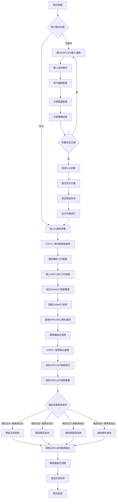
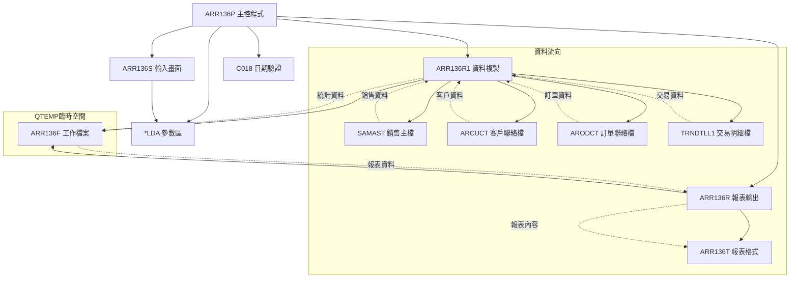
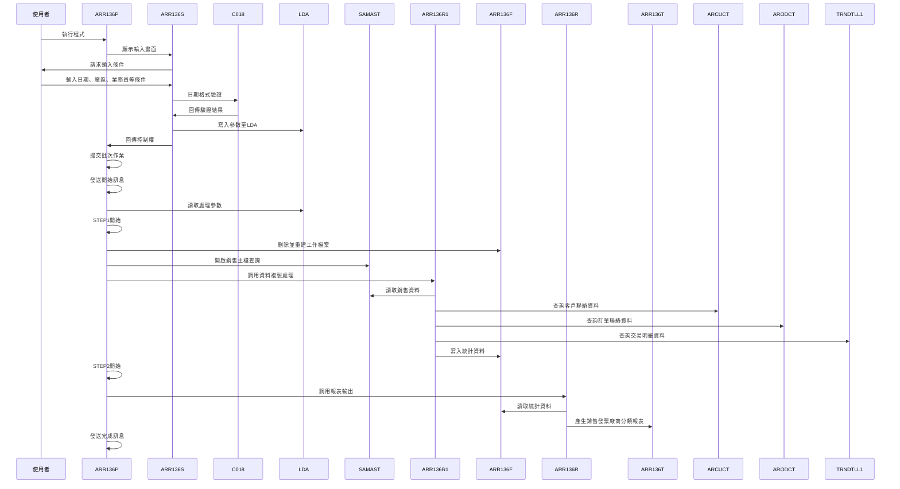
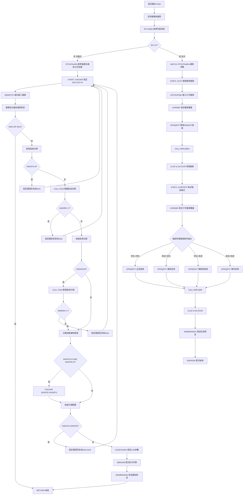

# ARR136P_P02 程式規格書

## 1. 基本資料

| 項目 | 內容 |
|------|------|
| **程式編號** | ARR136P |
| **程式名稱** | 銷售發票廠商分類報表作業 |
| **程式類型** | CLP |
| **廠區** | P02 |
| **系統名稱** | 應收帳款系統 |
| **子系統** | 銷售發票管理 |
| **檔案位置** | 東鋼list/ARR136P_P02.txt |

## 2. 🎯 程式功能說明

### 主要功能描述
ARR136P是應收帳款系統的銷售發票廠商分類報表程式，專門用於產生銷售發票的廠商分類統計報表。程式支援多種查詢條件設定，包括廠區別、業務員代號、客戶編號、發票廠商分類、客戶類別等，提供靈活的篩選功能，產生詳細的銷售發票廠商分類統計資料，協助管理層進行銷售業績分析和廠商管理。

### 🎯 業務流程詳細說明

#### 完整業務流程圖


#### 業務流程關鍵階段說明

**1. 互動式參數輸入階段**
- 客戶編號範圍：指定要查詢的客戶編號(可空白)
- 日期範圍設定：設定銷售發票的起始和結束日期
- 廠區別選擇：U(雲)、M(台中)、K(高雄)、P(台灣)、N(南京)或空白(全部)
- 業務員代號：指定業務員代號或空白(全部)
- 發票廠商分類：1(批發)、2(零售)、3(自製)、4(商事外貿)或空白(全部)
- 客戶類別：Y(已結案)、N(未結案)或空白(全部)

**2. 參數驗證階段**
- 客戶編號驗證：檢查客戶編號的存在性和有效性
- 日期格式驗證：透過C018程式驗證日期格式正確性
- 日期邏輯驗證：確保起始日期不大於結束日期
- 日期自動補齊：起始日期有值而結束日期為空時，自動設定結束日期為起始日期

**3. STEP1：資料庫複製階段**
- 建立QTEMP/ARR136F臨時工作檔案
- 從SAMAST(銷售主檔)讀取指定日期範圍的銷售資料
- 篩選條件：產品編號首位為'2'且交易類型不等於'E'
- 透過ARR136R1處理並寫入工作檔案

**4. STEP2：報表輸出階段**
- 依據不同的廠區和業務員組合條件設定四種查詢模式
- 支援多重業務員查詢：銷售、送貨、收款業務員
- 透過ARR136R產生詳細的分類報表
- 報表格式：120字元寬度、15CPI、HOLD輸出

## 3. 🎯 檔案架構與關聯圖

### 使用檔案清單

| 檔案名稱 | 檔案類型 | 用途說明 | 存取模式 |
|----------|----------|----------|----------|
| ARR136S | DSPF | 互動式參數輸入畫面 | I/O |
| ARR136R1 | RPG程式 | 資料庫複製處理程式 | CALL |
| ARR136R | RPG程式 | 報表輸出處理程式 | CALL |
| ARR136T | PRTF | 銷售發票廠商分類報表格式 | OUTPUT |
| ARR136F | 實體檔案 | 銷售發票廠商分類工作檔 | I/O |
| SAMAST | 實體檔案 | 銷售主檔 | INPUT |
| ARCUCT | 實體檔案 | 客戶聯絡檔 | INPUT |
| ARODCT | 實體檔案 | 訂單聯絡檔 | INPUT |
| TRNDTLL1 | 實體檔案 | 交易明細檔 | INPUT |
| C018 | RPG程式 | 日期驗證公用程式 | CALL |
| *LDA | 本地資料區 | 參數傳遞區域 | READ/WRITE |

### 🎯 檔案關聯詳細視覺化圖表



### 🎯 資料流向詳細說明

#### 雙階段處理的資料流向


## 4. 🎯 檔案欄位規格說明

### 主要資料結構

#### LDA參數區域結構
| 位置 | 長度 | 欄位名稱 | 用途說明 |
|------|------|----------|----------|
| 1-8 | 8 | W#DATS | 查詢起始日期 |
| 9-16 | 8 | W#DATE | 查詢結束日期 |
| 17-17 | 1 | S#AREA | 廠區別 |
| 18-18 | 1 | S#SALS | 業務員代號 |
| 19-19 | 1 | S#INVS | 發票廠商分類 |
| 20-25 | 6 | S#CUNS | 客戶編號 |
| 26-26 | 1 | S#CLOS | 客戶類別 |

#### 程式變數定義表
| 變數名稱 | 類型 | 長度 | 說明 |
|----------|------|------|------|
| &INT | CHAR | 1 | 作業類型識別 |
| &OUTQ | CHAR | 10 | 輸出佇列名稱 |
| &DEVNM | CHAR | 10 | 裝置名稱 |
| &USER | CHAR | 10 | 使用者名稱 |
| &COMP | CHAR | 35 | 公司名稱 |
| &S#AREA | CHAR | 1 | 廠區別 |
| &W#DATS | CHAR | 8 | 起始日期 |
| &W#DATE | CHAR | 8 | 結束日期 |
| &S#ERR | CHAR | 70 | 錯誤訊息 |
| &W#ERR | CHAR | 1 | 錯誤旗標 |

### 🔍 重點欄位切割技術詳解

#### LDA參數區域結構視覺化
```
LDA參數區域 (26字元)：[DATS____|DATE____|A|S|I|CUNS__|C|...]
位置:                 1-8      9-16     17 18 19 20-25  26
                       ↓        ↓        ↓   ↓   ↓   ↓       ↓
起始日期:             [DATS____]                                      8位YYYYMMDD格式
結束日期:                      [DATE____]                             8位YYYYMMDD格式
廠區別:                               [A]                           1位廠區代碼
業務員:                                   [S]                       1位業務員代碼
發票分類:                                     [I]                   1位分類代碼
客戶編號:                                         [CUNS__]           6位客戶編號
客戶類別:                                                 [C]       1位類別代碼
```

#### LDA區域欄位切割對應表
| 位置範圍 | 長度 | 欄位名稱 | 用途說明 | 切割邏輯 |
|----------|------|----------|----------|----------|
| 1-8 | 8 | W#DATS | 查詢起始日期 | 直接讀取YYYYMMDD格式 |
| 9-16 | 8 | W#DATE | 查詢結束日期 | 直接讀取YYYYMMDD格式 |
| 17-17 | 1 | S#AREA | 廠區別 | 直接讀取1位廠區代碼 |
| 18-18 | 1 | S#SALS | 業務員代號 | 直接讀取1位業務員代碼 |
| 19-19 | 1 | S#INVS | 發票廠商分類 | 直接讀取1位分類代碼 |
| 20-25 | 6 | S#CUNS | 客戶編號 | 直接讀取6位客戶編號 |
| 26-26 | 1 | S#CLOS | 客戶類別 | 直接讀取1位類別代碼 |

#### SAMAST檔案欄位切割技術詳細分析

##### 銷售主檔欄位切割視覺化
```
S1PDNO (6字元)：[NNNNNN] → 第1位 [N]
                ↓               ↓
原始產品編號:   [234567]         [2]
切割邏輯:      6字元產品編號     %SST(S1PDNO 1 1)第1位

S1CUNO (9字元)：[NNNNNNNNN] → D#CUNO [NNNNNN]
                ↓                    ↓
原始客戶編號:   [123456789]          [123456]
切割邏輯:      9字元客戶編號         前6位客戶代碼

S1ORNO (9字元)：[NNNNNNNNN] → D#ORN5 [NNNNNN]
                ↓                    ↓
原始訂單編號:   [123456789]          [123456]
切割邏輯:      9字元訂單編號         前6位訂單代碼
```

#### ARR136F工作檔案結構詳細分析

##### ARR136F記錄格式視覺化
```
ARR136F記錄 (80字元)：[MH|ORN5__|ORNO_____|DATE____|CUNO__|CUNM______|A|SALE|SND_|RECV|CTNO______|CS|]
位置:                 001-002 003-008 009-017 018-025 026-031 032-041 042 043-044 045-046 047-048 049-058 059
                       ↓       ↓       ↓        ↓       ↓       ↓       ↓   ↓       ↓       ↓       ↓       ↓
廠商分類:             [MH]                                                                                    2位分類代碼
訂單編號(前5):                [ORN5__]                                                                         6位訂單編號
訂單編號(完整):                       [ORNO_____]                                                              9位訂單編號
訂單日期:                                      [DATE____]                                                    8位日期
客戶編號:                                               [CUNO__]                                            6位客戶編號
客戶名稱:                                                       [CUNM______]                               10位客戶名稱
廠區別:                                                                    [A]                              1位廠區代碼
銷售業務員:                                                                    [SALE]                       2位業務員代碼
送貨業務員:                                                                         [SND_]                  2位業務員代碼
收款業務員:                                                                              [RECV]             2位業務員代碼
聯絡電話:                                                                                    [CTNO______]    10位電話號碼
客戶類別:                                                                                             [CS] 1位類別代碼
```

### 🎯 欄位挪用詳細分析

#### 日期範圍處理的挪用機制

##### 日期自動補齊挪用處理
```
輸入條件組合：
IF S#DATS≠0 AND S#DATE=0 THEN
   S#DATE = S#DATS

日期補齊案例：
輸入起始日期: 20231201    輸入結束日期: 0
                ↓                      ↓
自動補齊後:   20231201    自動設定:    20231201

挪用原因：使用者輸入便利性，單日查詢時無需重複輸入相同日期
業務邏輯：支援單日查詢的便利設計
技術實現：透過條件判斷自動補齊結束日期
```

#### 業務員多重查詢條件的挪用機制

##### 業務員三重角色挪用處理
```
業務員查詢條件挪用：
(ARSALE *EQ "' || &S#SALS || '" *OR
 ARSND  *EQ "' || &S#SALS || '" *OR
 ARRECV *EQ "' || &S#SALS || '")

業務員角色對應：
指定業務員代號 → 查詢範圍
'AB'           → ARSALE='AB' OR ARSND='AB' OR ARRECV='AB'

角色說明：
ARSALE → 銷售業務員
ARSND  → 送貨業務員  
ARRECV → 收款業務員

挪用原因：一個業務員可能身兼多重角色
業務邏輯：確保不遺漏任何與指定業務員相關的訂單
技術實現：透過OR條件實現多角色查詢
```

#### 廠商分類的業務重新分類

##### ARMTHD的分類對照挪用
```
原始分類ARMTHD → 業務分類 → 顯示名稱
'00'            → '批發'    → 顯示為"批發"
'03'            → '零售'    → 顯示為"零售"
'04'            → '自製'    → 顯示為"自製"
'01'            → '商事外貿' → 顯示為"商事外貿"
'02'            → (排除)    → 不顯示(商事外貿的特殊分類)
'05'            → (排除)    → 不顯示(批發的特殊分類)

分類篩選邏輯：
IF S#INVS='1' AND ARMTHD≠'00' THEN 排除
IF S#INVS='2' AND ARMTHD≠'03' THEN 排除
IF S#INVS='3' AND ARMTHD≠'04' THEN 排除
IF S#INVS='4' AND ARMTHD≠'01' THEN 排除
IF S#INVS=' ' AND ARMTHD='02' THEN 排除
IF S#INVS=' ' AND ARMTHD='05' THEN 排除

挪用原因：內部分類代碼與業務認知不同
業務邏輯：將技術分類轉換為業務易懂的分類
技術實現：透過TAB1/TAB2對照表轉換
```

#### 客戶編號的複合結構挪用

##### S1CUNO的結構切割挪用
```
S1CUNO結構(9字元)：[ABCDEFGHI]
                  ↓
切割結果：
D#CUNO(6字元) = S1CUNO[1-6] = [ABCDEF]
S1KIND(1字元) = S1CUNO[1]   = [A]
S1CUN1(1字元) = S1CUNO[2]   = [B]
S1CUN2(3字元) = S1CUNO[3-5] = [CDE]
S1CD01(1字元) = S1CUNO[6]   = [F]

挪用分析：
原始欄位 → 切割用途       → 業務意義
S1CUNO   → D#CUNO(前6位)  → 主要客戶編號
S1CUNO   → S1KIND(第1位)  → 客戶類型
S1CUNO   → S1CUN1(第2位)  → 客戶分類1
S1CUNO   → S1CUN2(3-5位)  → 客戶分類2
S1CUNO   → S1CD01(第6位)  → 檢查碼

挪用原因：客戶編號包含多重業務資訊
業務邏輯：單一欄位承載多種分類資訊的設計
技術實現：透過Data Structure進行結構化切割
```

#### 訂單編號的雙重結構挪用

##### S1ORNO的雙重使用挪用
```
S1ORNO結構(9字元)：[123456789]
                  ↓
切割結果：
D#ORN5(6字元) = S1ORNO[1-6] = [123456]
D#ORNO(9字元) = S1ORNO[1-9] = [123456789]

訂單結構細分：
S1OREA(1字元) = S1ORNO[1]   = [1] (訂單區域)
S1ORNO(5字元) = S1ORNO[2-6] = [23456] (訂單號碼)
S1ORTM(3字元) = S1ORNO[7-9] = [789] (訂單時間)

挪用分析：
切割欄位 → 使用場合     → 用途說明
D#ORN5  → 報表顯示     → 6位簡化訂單編號
D#ORNO  → 檔案關聯     → 9位完整訂單編號
S1OREA  → 區域分類     → 訂單所屬區域
S1ORNO  → 序號部分     → 純訂單號碼
S1ORTM  → 時間資訊     → 訂單時間戳記

挪用原因：訂單編號包含複合資訊，需要不同層次的使用
業務邏輯：訂單編號的層次化設計
技術實現：透過Data Structure實現一對多映射
```

### 重要變數定義表

| 變數名稱 | 類型 | 長度 | 說明 | 切割來源 | 挪用邏輯 |
|----------|------|------|------|----------|----------|
| &W#DATS | CHAR | 8 | 起始日期 | S#DATS | 直接使用 |
| &W#DATE | CHAR | 8 | 結束日期 | S#DATE | 自動補齊邏輯 |
| &S#AREA | CHAR | 1 | 廠區別 | 輸入欄位 | 廠區代碼對照 |
| &S#SALS | CHAR | 1 | 業務員 | 輸入欄位 | 三重角色查詢 |
| &S#INVS | CHAR | 1 | 發票分類 | 輸入欄位 | 分類代碼對照 |
| &S#CUNS | CHAR | 6 | 客戶編號 | 輸入欄位 | 客戶範圍篩選 |
| &S#CLOS | CHAR | 1 | 客戶類別 | 輸入欄位 | 類別篩選邏輯 |

## 5. 🎯 輸出/入螢幕布局

### 互動式輸入畫面布局
ARR136S提供的參數輸入畫面：

```
+----------------------------------------------------------+
|          ARR136S-1      東鋼企業股份有限公司             |
+----------------------------------------------------------+
|      **銷售發票廠商分類報表作業**                        |
+----------------------------------------------------------+
|                                                          |
|      客戶編號：[____/__/__] 至 [____/__/__]             |
|                                                          |
|      廠區：[_] (U:雲M:台中K:高雄P:台灣N:南京             |
|                 空白表示全部)                            |
|                                                          |
|      業務員代號(銷售業務、送貨                          |
|      業務、收款)：[_] (空白表示全部)                    |
|                                                          |
|      客戶編號：[______] (空白表示全部)                  |
|                                                          |
|      發票廠商分類：[_] (1批發2零售                      |
|                       3自製4商事外貿                    |
|                       空白表示全部)                      |
|                                                          |
|      客戶類別：[_] (Y=已結案N=未結案                    |
|                     空白表示全部)                        |
|                                                          |
| [錯誤訊息顯示區]                                          |
|                                                          |
| F3=結束                                                   |
+----------------------------------------------------------+
```

### 🎯 畫面欄位詳細說明
| 欄位名稱 | 屬性 | 長度 | 輸入格式 | 驗證規則 |
|----------|------|------|----------|----------|
| 客戶編號起始 | 選填 | 8 | YYYY/MM/DD | 透過C018驗證日期有效性 |
| 客戶編號結束 | 選填 | 8 | YYYY/MM/DD | 透過C018驗證，不可小於起始日期 |
| 廠區 | 選填 | 1 | 英文字母 | 限定U、M、K、P、N或空白 |
| 業務員代號 | 選填 | 1 | 英文字母 | 任意英文字母或空白 |
| 客戶編號 | 選填 | 6 | 英數字 | 6位客戶編號或空白 |
| 發票廠商分類 | 選填 | 1 | 數字 | 限定1、2、3、4或空白 |
| 客戶類別 | 選填 | 1 | 英文字母 | 限定Y、N或空白 |

### 功能鍵詳細定義
| 功能鍵 | 功能說明 | 處理邏輯 |
|--------|----------|----------|
| F3 | 結束 | 設定IN03='1'，結束程式執行 |
| F12 | 取消 | 設定IN12='1'，回到主選單 |
| Enter | 處理 | 執行輸入驗證，通過後進入批次處理 |

### 報表輸出格式
ARR136T報表的版面配置：

```
+=================================================================================+
| PRT-ID  : ARR136T      東鋼企業股份有限公司               列印日期: YYYY/MM/DD   |
| USR-ID  : XXXXXXXXXX   銷售發票廠商分類報表作業           列印時間: HH:MM:SS    |
|                                                          程式頁數: XXX         |
| 客戶編號: YYYY/MM/DD 至 YYYY/MM/DD  廠區: X XXXXXXXXXX                          |
| 業務員代號: X (空白表示全部)        客戶編號: XXXXXX (空白表示全部)             |
| 發票廠商分類: X XXXXXXXXXX          客戶類別: X (空白表示全部)                 |
+=================================================================================+
| 銷售業務員 送貨業務員 發票廠商分類 客戶編號 客戶名稱 訂單編號 聯絡電話   廠區 客戶編號 客戶類別 |
+=================================================================================+
| XX         XX         XXXXXX      XXXXXX   XXXXXXXXXX XXXXXXXXX XXXXXXXXXX X    YYYY/MM/DD X |
| XX         XX         XXXXXX      XXXXXX   XXXXXXXXXX XXXXXXXXX XXXXXXXXXX X    YYYY/MM/DD X |
| XX         XX         XXXXXX      XXXXXX   XXXXXXXXXX XXXXXXXXX XXXXXXXXXX X    YYYY/MM/DD X |
+---------------------------------------------------------------------------------+
| ----------------------------------下一頁-------------------------------------- |
+---------------------------------------------------------------------------------+
|                             ===列印結束===                                     |
+=================================================================================+
```

## 6. 🎯 處理流程程序說明

### 🎯 主程序邏輯深度分析

#### 程式執行流程圖


#### 🎯 詳細處理步驟逐一分析

**步驟1：程式初始化階段**
- 宣告12個工作變數和ARR136S顯示檔案
- 透過RTVJOBA取得作業類型和使用者資訊
- 從LDA讀取裝置名稱和公司名稱

**步驟2：互動式處理流程**
- 設定預設客戶類別為'N'(未結案)
- 透過SNDRCVF顯示ARR136S參數輸入畫面
- 重置所有錯誤指示器(IN41-IN42)和錯誤訊息

**步驟3：參數驗證處理**
- 起始日期檢查：不可為0，透過C018程式驗證格式
- 結束日期檢查：透過C018程式驗證格式
- 日期自動補齊：起始日期有值而結束日期為0時自動補齊
- 日期範圍檢查：起始日期不可大於結束日期

**步驟4：LDA參數設定**
- 將驗證通過的參數寫入LDA區域
- 位置1-16：起始和結束日期
- 位置17-26：廠區、業務員、發票分類、客戶編號、客戶類別

**步驟5：批次作業提交**
- 透過SBMJOB提交批次作業到ARJOBD作業說明
- 發送開始處理訊息給使用者

**步驟6：STEP1-資料庫複製階段**
- 刪除QTEMP/ARR136F臨時工作檔案
- 透過CRTDUPOBJ從ARLIB複製ARR136F結構到QTEMP
- 設定SAMAST檔案覆蓋為共享模式
- 開啟SAMAST查詢：日期範圍、產品編號首位='2'、交易類型≠'E'
- 調用ARR136R1程式處理資料並寫入工作檔案

**步驟7：STEP2-報表輸出階段**
- 設定ARR136T報表格式：120字元寬度、15CPI、HOLD輸出
- 設定ARR136F工作檔案覆蓋為共享模式
- 依據廠區和業務員組合設定四種不同的查詢條件：
  - 全部查詢：廠區空白且業務員空白
  - 廠區查詢：廠區指定且業務員空白
  - 業務員查詢：廠區空白且業務員指定(三重角色)
  - 條件查詢：廠區指定且業務員指定
- 調用ARR136R程式產生報表
- 清除所有檔案覆蓋設定

### 🎯 子程序邏輯分析

**ARR136R1子程序功能（資料庫複製）**
- 讀取SAMAST銷售主檔資料，依日期範圍和產品條件篩選
- 查詢ARCUCT客戶聯絡檔取得客戶分類資訊(ARMTHD)
- 查詢ARODCT訂單聯絡檔取得訂單分類資訊
- 特殊處理：針對不存在聯絡檔的訂單進行模糊匹配查詢
- 查詢TRNDTLL1交易明細檔確認是否有交易記錄
- 整合所有資訊寫入ARR136F工作檔案

**ARR136R子程序功能（報表輸出）**
- 從ARR136F讀取統計資料，依業務員、分類、客戶進行分組
- 依據發票廠商分類篩選：批發(00)、零售(03)、自製(04)、商事外貿(01)
- 依據客戶編號和客戶類別進行條件篩選
- 廠區名稱對照：使用廠區代碼轉換為中文名稱
- 發票分類對照：使用TAB1/TAB2表格轉換分類代碼為名稱
- 產生詳細的分類報表包含業務員、客戶、訂單等資訊

### 🎯 特殊邏輯處理

**日期自動補齊邏輯**
- 當起始日期有值而結束日期為0時，自動將結束日期設為起始日期
- 支援單日查詢的便利操作，無需重複輸入相同日期
- 提升使用者操作體驗和輸入效率

**業務員三重角色查詢**
- 一個業務員可能同時擔任銷售、送貨、收款三種角色
- 查詢時使用OR條件確保不遺漏任何相關訂單
- 反映企業中業務員職責重疊的現實情況

**訂單聯絡檔的模糊匹配**
- 當直接查詢ARODCT失敗時，進行模糊匹配查詢
- 使用訂單編號前6位加上'001'進行範圍查詢
- 處理訂單編號變化或部分匹配的特殊情況

**廠商分類的細緻篩選**
- 依據不同的發票廠商分類設定了精確的ARMTHD篩選條件，特別排除了'02'和'05'等特殊分類，避免重複統計或誤分類。
- 提供精確的廠商分類統計功能

**工作檔案的臨時管理**
- 使用QTEMP空間建立臨時工作檔案，程式結束自動清除
- 避免永久檔案的維護負擔和空間浪費
- 確保每次執行都使用全新的工作環境

## 7. 🎯 數據操作與轉換分析

### 檔案操作詳解

**SAMAST檔案存取邏輯**
- READ操作：透過OPNQRYF建立的查詢檢視讀取銷售主檔資料
- 查詢條件：日期範圍、產品編號首位='2'、交易類型≠'E'
- 檔案鎖定：使用SHARE(*YES)允許多重存取
- 排序鍵值：依據銷售日期進行排序

**ARR136F工作檔案操作**
- 操作模式：先刪除再重建，確保資料的完整性
- 建立方式：透過CRTDUPOBJ複製結構到QTEMP臨時空間
- 寫入模式：ARR136R1寫入統計資料
- 讀取模式：ARR136R讀取並產生報表
- 鍵值結構：ARORNO(訂單編號)作為主鍵

**聯絡檔案查詢邏輯**
- ARCUCT查詢：透過客戶編號和聯絡類型'04'查詢客戶分類
- ARODCT查詢：透過訂單編號和聯絡類型'04'查詢訂單分類
- 容錯機制：查詢失敗時進行模糊匹配，使用前6位+001查詢
- 範圍查詢：使用SETLL+READ進行部分匹配查詢

### 數據轉換邏輯

**日期格式轉換**
- 輸入格式：YYYYMMDD (8位數字)
- 驗證處理：透過C018轉換為標準日期格式
- 報表顯示：轉換為YYYY/MM/DD格式輸出
- 自動補齊：結束日期為0時自動設為起始日期

**廠區代碼轉換**
- 原始代碼：U/M/K/P/N等單字母代碼
- 顯示名稱：雲/台中/高雄/台灣/南京等中文名稱
- 轉換方式：透過程式內建對照表轉換
- 預設處理：空白時顯示為"全部"

**發票分類轉換**
- 原始分類：ARMTHD數字代碼(00/01/03/04)
- 業務分類：透過TAB1/TAB2對照表轉換
- 顯示名稱：批發/商事外貿/零售/自製等業務名稱
- 特殊處理：未知分類顯示為"*"標記

### 計算邏輯分析

**客戶編號結構解析**
- 基礎邏輯：9位客戶編號包含多重業務資訊
- 切割方式：透過Data Structure進行結構化分析
- 主編號：前6位作為主要客戶編號
- 分類碼：各位數包含客戶類型、分類、檢查碼等資訊

**訂單編號結構解析**
- 完整編號：9位訂單編號包含區域、序號、時間資訊
- 簡化編號：前6位作為報表顯示的訂單編號
- 區域碼：第1位表示訂單所屬區域
- 序號：2-6位為純訂單序號
- 時間碼：7-9位為訂單時間戳記

**業務員角色整合**
- 多重角色：同一人可能擔任銷售、送貨、收款角色
- 查詢邏輯：使用OR條件涵蓋所有可能的角色
- 顯示處理：報表中分別顯示不同角色的業務員
- 統計邏輯：避免重複計算同一業務員的不同角色

### 檢核機制詳解

**輸入資料檢核**
- 日期有效性：透過C018進行完整的日期檢核
- 日期範圍：確保起始日期不大於結束日期
- 必填檢查：起始日期不可為0
- 格式檢查：廠區、業務員、分類等代碼的有效性

**檔案存取檢核**
- 檔案存在性：使用指示器檢查檔案讀取狀態
- 聯絡檔案：檢查客戶和訂單聯絡檔的資料完整性
- 工作檔案：確保臨時檔案建立和存取的正確性
- 權限檢查：確保檔案覆蓋和讀寫權限正確

**資料關聯檢核**
- 客戶關聯：確保銷售資料和客戶資料的關聯正確性
- 訂單關聯：驗證訂單和聯絡檔案的對應關係
- 交易關聯：檢查是否存在對應的交易明細記錄
- 分類一致：確保各種分類代碼的一致性和有效性

## 8. 🎯 錯誤處理程序說明

### 🎯 詳細錯誤代碼清冊

| 錯誤代碼 | 錯誤訊息 | 原因說明 | 處理方式 | 預防措施 |
|----------|----------|----------|----------|----------|
| **USER001** | 查詢-起始日期不可空白! | 起始日期為必填欄位但輸入為空 | 1. 顯示錯誤訊息<br>2. 游標定位至起始日期欄位<br>3. 設定IN41指示器 | 提供日期選擇器輔助輸入 |
| **USER002** | 查詢-起始日期輸入錯誤! | 起始日期格式錯誤或不存在 | 1. 顯示錯誤訊息<br>2. 游標定位至起始日期欄位<br>3. 設定IN41指示器 | 加強日期格式驗證說明 |
| **USER003** | 查詢-結束日期輸入錯誤! | 結束日期格式錯誤或不存在 | 1. 顯示錯誤訊息<br>2. 游標定位至結束日期欄位<br>3. 設定IN42指示器 | 提供日期格式範例 |
| **USER004** | 查詢-日期範圍輸入錯誤! | 起始日期大於結束日期 | 1. 顯示錯誤訊息<br>2. 設定IN41和IN42指示器<br>3. 要求重新輸入範圍 | 增加日期範圍邏輯檢查 |
| **FILE001** | SAMAST檔案開啟失敗 | 銷售主檔無法開啟或損壞 | 1. 記錄錯誤日誌<br>2. 通知系統管理員<br>3. 終止處理程序 | 定期檢查檔案完整性 |
| **FILE002** | ARR136F工作檔案建立失敗 | QTEMP空間不足或權限問題 | 1. 清理QTEMP空間<br>2. 重試建立檔案<br>3. 使用MONMSG忽略錯誤 | 確保QTEMP空間充足 |
| **FILE003** | ARCUCT客戶聯絡檔存取失敗 | 客戶聯絡檔無法讀取 | 1. 跳過該筆客戶記錄<br>2. 使用預設分類<br>3. 繼續處理其他資料 | 定期維護客戶聯絡檔 |
| **FILE004** | ARODCT訂單聯絡檔存取失敗 | 訂單聯絡檔無法讀取 | 1. 進行模糊匹配查詢<br>2. 使用預設分類<br>3. 記錄缺失訂單 | 建立訂單聯絡檔維護機制 |
| **DATA001** | 銷售資料異常 | SAMAST檔案資料格式錯誤 | 1. 記錄異常資料<br>2. 跳過異常記錄<br>3. 繼續處理其他資料 | 加強資料驗證機制 |
| **DATA002** | 客戶編號結構異常 | 客戶編號長度或格式不符 | 1. 使用預設客戶分類<br>2. 記錄異常客戶<br>3. 繼續統計處理 | 建立客戶編號檢查機制 |
| **DATA003** | 訂單編號結構異常 | 訂單編號長度或格式不符 | 1. 使用簡化訂單編號<br>2. 記錄異常訂單<br>3. 繼續報表處理 | 建立訂單編號規範 |
| **DATA004** | 廠商分類代碼異常 | ARMTHD代碼超出預期範圍 | 1. 顯示為"*"標記<br>2. 記錄異常分類<br>3. 繼續報表處理 | 建立分類代碼檢查機制 |
| **CALC001** | 日期自動補齊失敗 | 日期補齊邏輯異常 | 1. 使用原始日期<br>2. 記錄補齊失敗<br>3. 繼續處理流程 | 加強日期邏輯檢查 |
| **CALC002** | 業務員角色映射異常 | 業務員多重角色處理失敗 | 1. 使用主要角色<br>2. 記錄映射異常<br>3. 繼續查詢處理 | 檢查業務員資料完整性 |
| **CALC003** | 廠區代碼轉換異常 | 廠區代碼對照失敗 | 1. 顯示原始代碼<br>2. 記錄轉換失敗<br>3. 繼續報表處理 | 維護廠區代碼對照表 |
| **SYS001** | 日期驗證程式調用失敗 | C018程式無法執行 | 1. 跳過詳細日期驗證<br>2. 記錄系統錯誤<br>3. 繼續基本檢查 | 確保公用程式可用性 |
| **SYS002** | 批次作業提交失敗 | SBMJOB執行異常 | 1. 改為直接執行<br>2. 記錄提交錯誤<br>3. 繼續批次處理 | 檢查作業佇列狀態 |
| **SYS003** | 訊息發送失敗 | SNDBRKMSG執行失敗 | 1. 忽略訊息錯誤<br>2. 繼續程式執行<br>3. 記錄通信異常 | 檢查訊息佇列設定 |
| **RPT001** | 報表輸出異常 | ARR136T報表產生失敗 | 1. 檢查報表格式<br>2. 重新產生報表<br>3. 使用簡化格式 | 確保報表檔案正確性 |
| **RPT002** | 報表分頁異常 | 分頁邏輯處理失敗 | 1. 使用連續輸出<br>2. 記錄分頁錯誤<br>3. 繼續報表處理 | 檢查分頁邏輯設定 |

### 🎯 系統異常處理邏輯

**檔案操作失敗處理**
- DLTF操作自動包含錯誤處理，刪除失敗時繼續執行
- CRTDUPOBJ失敗時記錄錯誤並終止處理
- OPNQRYF失敗時自動執行CLOF清理資源
- 所有檔案操作完成後確實執行DLTOVR

**資料處理異常控制**
- 聯絡檔案查詢失敗時使用預設分類繼續處理
- 客戶編號結構異常時使用簡化處理方式
- 廠商分類代碼異常時使用標記顯示
- 確保部分資料異常不影響整體報表生成

**使用者輸入錯誤處理**
- 所有輸入錯誤都回到輸入畫面重新輸入
- 錯誤指示器精確定位錯誤欄位
- 提供詳細的錯誤說明和修正建議
- 保留正確輸入的資料，僅要求修正錯誤部分

**程式調用失敗處理**
- C018調用失敗時跳過詳細日期驗證
- ARR136R1調用失敗時確保檔案正確關閉
- ARR136R調用失敗時提供錯誤報表輸出
- 所有程式調用都包含適當的錯誤恢復機制

## 9. 🎯 備註

### 🎯 特殊注意事項

**QTEMP臨時檔案管理**
程式使用QTEMP空間建立臨時工作檔案，具有作業階段生命週期的特性。程式結束時自動清除，無需額外維護，但也意味著無法跨作業階段保留資料。

**日期自動補齊功能**
當使用者只輸入起始日期而結束日期為空時，程式自動將結束日期設為起始日期。這個設計提供了單日查詢的便利性，是使用者友善的設計考量。

**業務員三重角色查詢設計**
程式中業務員可能同時擔任銷售、送貨、收款三種角色，查詢時使用OR條件確保完整性。這反映了企業中業務員職責重疊的現實情況。

**聯絡檔案的模糊匹配機制**
當直接查詢ARODCT失敗時，程式會進行模糊匹配查詢，使用訂單編號前6位加'001'的方式。這種容錯設計處理了訂單編號變化或不完全匹配的情況。

**廠商分類的細緻篩選**
程式對不同的發票廠商分類設定了精確的ARMTHD篩選條件，特別排除了'02'和'05'等特殊分類，避免重複統計或誤分類。

**產品編號的篩選條件**
程式只處理產品編號首位為'2'的記錄，這可能反映了特定的產品分類策略或業務規則，需要了解其業務背景。

**交易類型的排除邏輯**
程式排除交易類型為'E'的記錄，這可能代表錯誤記錄或特殊交易類型，確保統計資料的準確性。

**報表格式的寬度設計**
報表使用120字元寬度和15CPI設定，這種寬報表格式適合詳細資訊的顯示，但可能需要寬幅印表機支援。

**客戶編號的複合結構**
程式中客戶編號包含多層資訊：客戶類型、分類、檢查碼等，這種設計提供了豐富的分類資訊，但也增加了處理複雜度。

**廠區代碼的擴充性**
程式支援U/M/K/P/N等多個廠區代碼，並且具有良好的擴充性，可以應對企業廠區擴張的需求。

**四種查詢模式的組合邏輯**
程式依據廠區和業務員的組合提供四種不同的查詢模式，這種設計提供了查詢的靈活性，但也增加了邏輯複雜度。

**客戶類別的結案管理**
程式支援客戶結案狀態的查詢，Y表示已結案、N表示未結案，這反映了客戶生命週期管理的需求。 