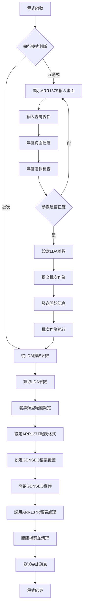
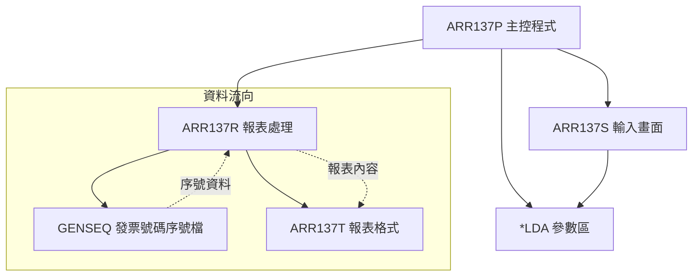
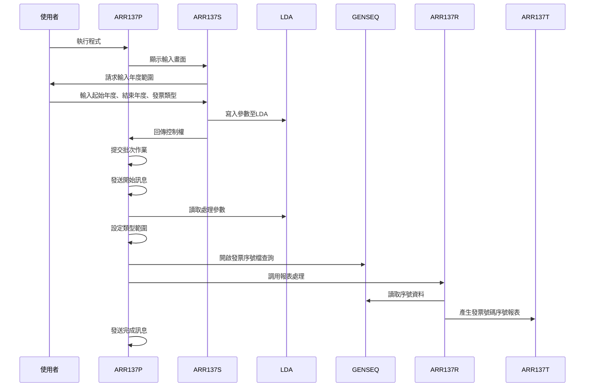
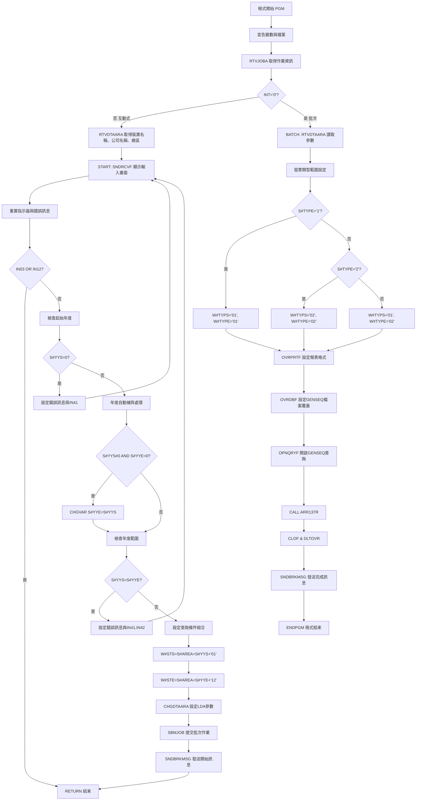

# ARR137P_P02 程式規格書

## 1. 基本資料

| 項目 | 內容 |
|------|------|
| **程式編號** | ARR137P |
| **程式名稱** | 發票號碼序號報表 |
| **程式類型** | CLP |
| **廠區** | P02 |
| **系統名稱** | 應收帳款系統 |
| **子系統** | 發票號碼管理 |
| **檔案位置** | 東鋼list/ARR137P_P02.txt |

## 2. 🎯 程式功能說明

### 主要功能描述
ARR137P是應收帳款系統的發票號碼序號報表程式，專門用於產生發票號碼序號的使用狀況統計報表。程式從GENSEQ(發票號碼序號檔)讀取資料，依據指定的年度範圍、廠區、發票統計類型進行篩選，產生詳細的發票號碼序號使用情況報表，顯示每年每月的起始號碼、結束號碼和目前號碼，協助管理層掌握發票號碼的使用狀況和剩餘數量。

### 🎯 業務流程詳細說明

#### 完整業務流程圖


#### 業務流程關鍵階段說明

**1. 互動式參數輸入階段**
- 年度範圍設定：設定要查詢的起始年度和結束年度(4位西元年)
- 廠區別顯示：顯示目前登入廠區(U:雲、M:台中、K:高雄、P:台灣)
- 發票統計類型：1(第三報)、2(原報)或空白(全部類型)

**2. 參數驗證階段**
- 起始年度檢查：不可為0
- 結束年度補齊：起始年度有值而結束年度為0時，自動設定結束年度為起始年度
- 年度範圍檢查：確保起始年度不大於結束年度

**3. 範圍條件設定階段**
- 年月範圍組合：廠區+年度+月份組成查詢鍵值
- 起始條件：廠區+起始年度+'01'
- 結束條件：廠區+結束年度+'12'
- 發票類型範圍：依據選擇設定GEKIND查詢範圍

**4. 報表產生階段**
- 從GENSEQ檔案讀取發票號碼序號資料
- 依據GEKIND(序號類型)和GEPRIN(序號前綴)進行排序
- 透過ARR137R處理並產生年度月份的序號使用狀況報表

## 3. 🎯 檔案架構與關聯圖

### 使用檔案清單

| 檔案名稱 | 檔案類型 | 用途說明 | 存取模式 |
|----------|----------|----------|----------|
| ARR137S | DSPF | 互動式參數輸入畫面 | I/O |
| ARR137R | RPG程式 | 報表處理程式 | CALL |
| ARR137T | PRTF | 發票號碼序號報表格式 | OUTPUT |
| GENSEQ | 實體檔案 | 發票號碼序號檔 | INPUT |
| *LDA | 本地資料區 | 參數傳遞區域 | READ/WRITE |

### 🎯 檔案關聯詳細視覺化圖表



### 🎯 資料流向詳細說明

#### 簡化處理的資料流向


## 4. 🎯 檔案欄位規格說明

### 主要資料結構

#### LDA參數區域結構
| 位置 | 長度 | 欄位名稱 | 用途說明 |
|------|------|----------|----------|
| 1-4 | 4 | W#YYS | 起始年度 |
| 5-8 | 4 | W#YYE | 結束年度 |
| 9-9 | 1 | S#AREA | 廠區別 |
| 10-10 | 1 | S#TYPE | 發票統計類型 |
| 11-20 | 10 | W#STS | 查詢起始條件 |
| 21-30 | 10 | W#STE | 查詢結束條件 |

#### 程式變數定義表
| 變數名稱 | 類型 | 長度 | 說明 |
|----------|------|------|------|
| &INT | CHAR | 1 | 作業類型識別 |
| &OUTQ | CHAR | 10 | 輸出佇列名稱 |
| &DEVNM | CHAR | 10 | 裝置名稱 |
| &USER | CHAR | 10 | 使用者名稱 |
| &COMP | CHAR | 35 | 公司名稱 |
| &S#AREA | CHAR | 1 | 廠區別 |
| &W#YYS | CHAR | 4 | 起始年度 |
| &W#YYE | CHAR | 4 | 結束年度 |
| &S#ERR | CHAR | 70 | 錯誤訊息 |
| &W#ERR | CHAR | 1 | 錯誤旗標 |
| &W#STS | CHAR | 10 | 查詢起始條件 |
| &W#STE | CHAR | 10 | 查詢結束條件 |
| &W#AREA | CHAR | 1 | 工作廠區 |
| &W#TYPS | CHAR | 2 | 發票類型起始 |
| &W#TYPE | CHAR | 2 | 發票類型結束 |

### 🔍 重點欄位切割技術詳解

#### 切割技術總覽與邏輯分析
ARR137P程式運用了多種AS/400的欄位切割技術，包括CLP程式的字串操作、RPG程式的Data Structure和UDS結構。核心切割邏輯包括：

**1. CLP層級的參數組合切割**
- CHGVAR字串串接：`&S#AREA *CAT &S#YYS *CAT '01'`
- RTVDTAARA位置讀取：`DTAARA(*LDA (1 4)) RTNVAR(&W#YYS)`
- CHGDTAARA位置寫入：`DTAARA(*LDA (1 4)) VALUE(&W#YYS)`

**2. RPG層級的DS結構切割**
- GEPRIN複合欄位的位置式切割
- 同一資料源的多重切割視角
- 無須額外程式邏輯的自動對應

**3. UDS的LDA區域切割**
- 跨程式的參數傳遞結構
- 固定位置的資料區域對應
- 參數完整性的結構化管理

#### LDA參數區域結構視覺化
```
LDA參數區域 (30字元)：[YYS_|YYE_|A|T|STS_______|STE_______|...]
位置:                 1-4   5-8   9 10 11-20      21-30
                       ↓     ↓     ↓   ↓   ↓          ↓
起始年度:             [YYS_]                                      4位西元年
結束年度:                   [YYE_]                                4位西元年
廠區別:                           [A]                             1位廠區代碼
發票類型:                             [T]                         1位類型代碼
查詢起始:                                 [STS_______]            10位組合條件
查詢結束:                                            [STE_______] 10位組合條件
```

#### LDA區域欄位切割對應表
| 位置範圍 | 長度 | 欄位名稱 | 用途說明 | 切割邏輯 |
|----------|------|----------|----------|----------|
| 1-4 | 4 | W#YYS | 起始年度 | 直接讀取4位西元年 |
| 5-8 | 4 | W#YYE | 結束年度 | 直接讀取4位西元年 |
| 9-9 | 1 | S#AREA | 廠區別 | 直接讀取1位廠區代碼 |
| 10-10 | 1 | S#TYPE | 發票統計類型 | 直接讀取1位類型代碼 |
| 11-20 | 10 | W#STS | 查詢起始條件 | 廠區+年度+'01'組合 |
| 21-30 | 10 | W#STE | 查詢結束條件 | 廠區+年度+'12'組合 |

##### LDA切割的UDS結構實現
```
RPG UDS (User Defined Structure) 定義：
I           UDS
I                                        1   40R#YYS    (起始年度)
I                                        5   80R#YYE    (結束年度)  
I                                        9   9 R#AREA   (廠區別)
I                                       10  10 R#TYP1   (發票類型)

UDS切割邏輯詳解：
*LDA區域總長度：1024字元，其中：
位置1-4:   起始年度 → R#YYS (4字元)
位置5-8:   結束年度 → R#YYE (4字元)
位置9:     廠區別   → R#AREA (1字元)
位置10:    發票類型 → R#TYP1 (1字元)

UDS語法說明：
- 1   40R#YYS：從LDA位置1開始讀取4個字元定義為R#YYS
- 5   80R#YYE：從LDA位置5開始讀取4個字元定義為R#YYE
- 9   9 R#AREA：從LDA位置9讀取1個字元定義為R#AREA
- 10  10 R#TYP1：從LDA位置10讀取1個字元定義為R#TYP1

實際切割案例：
*LDA內容 = "2024202501..."
  ↓
R#YYS = LDA[1-4] = "2024"  (起始年度)
R#YYE = LDA[5-8] = "2025"  (結束年度)
R#AREA = LDA[9] = "P"      (廠區別)
R#TYP1 = LDA[10] = "1"     (發票類型)
```

#### GENSEQ檔案欄位切割技術詳細分析

##### 發票序號檔欄位切割視覺化
```
GEPRIN (10字元)：[FFFFFFFFFF] → D#YY [YYYY] + D#MM [MM]
                 ↓                   ↓            ↓
原始序號前綴:    [P202401]           [2024]       [01]
切割邏輯:       10字元前綴          2-5位年度     6-7位月份

GEPRIN結構分析：
位置1:     廠區代碼 (P/T/M/K/H)
位置2-5:   西元年度 (YYYY)
位置6-7:   月份     (MM)
位置8-10:  保留欄位
```

##### Data Structure切割邏輯實現
```
RPG Data Structure定義：
I            DS
I                                        1  10 GEPRIN
I                                        2   50D#YY
I                                        6   7 D#MM

切割邏輯詳解：
GEPRIN欄位 (1-10位)：完整的序號前綴 [P202401XXX]
  ↓ 切割處理
D#YY欄位 (2-5位)：從GEPRIN提取年度 [2024]
D#MM欄位 (6-7位)：從GEPRIN提取月份 [01]

切割語法說明：
- 1  10 GEPRIN：定義GEPRIN為1-10位的完整欄位
- 2   50D#YY：從位置2開始到位置5的4個字元定義為D#YY(年度)
- 6   7 D#MM：從位置6開始到位置7的2個字元定義為D#MM(月份)

實際切割案例：
GEPRIN = "P202401XXX"
  ↓
D#YY = GEPRIN[2-5] = "2024"
D#MM = GEPRIN[6-7] = "01"
```

#### GENSEQ檔案結構詳細分析

##### GENSEQ記錄格式視覺化
```
GENSEQ記錄 (40字元)：[KD|PRIPRIRIPR|PR|STNO____|ENNO____|CUNO____|]
位置:                001-002 003-012   013-014 015-022 023-030 031-038
                      ↓       ↓         ↓       ↓       ↓       ↓
序號類型:            [KD]                                                    2位分類代碼
序號前綴:                    [PRIPRIRIPR]                                    10位前綴(廠區+年月)
字首:                                  [PR]                                 2位字首代碼
起始號碼:                                      [STNO____]                   8位起始序號
結束號碼:                                              [ENNO____]           8位結束序號
目前號碼:                                                      [CUNO____]   8位目前序號
```

### 🎯 欄位挪用詳細分析

#### 年度範圍處理的挪用機制

##### 年度自動補齊挪用處理
```
輸入條件組合：
IF S#YYS≠0 AND S#YYE=0 THEN
   S#YYE = S#YYS

年度補齊案例：
輸入起始年度: 2024      輸入結束年度: 0
                ↓                      ↓
自動補齊後:   2024      自動設定:    2024

挪用原因：使用者輸入便利性，單年度查詢時無需重複輸入相同年度
業務邏輯：支援單年度查詢的便利設計
技術實現：透過條件判斷自動補齊結束年度
```

#### 查詢條件組合的挪用機制

##### 年月範圍組合挪用處理
```
查詢條件組合挪用：
W#STS = S#AREA *CAT S#YYS *CAT '01'
W#STE = S#AREA *CAT S#YYE *CAT '12'

組合案例：
廠區: P      起始年度: 2024      結束年度: 2025
 ↓            ↓                  ↓
W#STS = 'P' + '2024' + '01' = 'P202401'
W#STE = 'P' + '2025' + '12' = 'P202512'

查詢範圍：
GEPRIN *GE 'P202401' *AND GEPRIN *LE 'P202512'

挪用原因：GEPRIN欄位包含廠區+年度+月份的複合資訊
業務邏輯：透過前綴組合實現年度範圍查詢
技術實現：字串串接組合查詢條件
```

#### 發票類型範圍的挪用機制

##### S#TYPE的類型範圍挪用處理
```
發票類型範圍挪用：
IF S#TYPE='1' THEN        // 第三報
   W#TYPS='01', W#TYPE='01'
   
IF S#TYPE='2' THEN        // 原報  
   W#TYPS='02', W#TYPE='02'
   
IF S#TYPE=' ' THEN        // 全部
   W#TYPS='01', W#TYPE='02'

類型對應表：
輸入值 → 起始範圍   結束範圍   涵蓋範圍
'1'    → '01'       '01'       僅第三報
'2'    → '02'       '02'       僅原報
' '    → '01'       '02'       全部類型

挪用原因：GEKIND使用2位數字代碼，而輸入使用1位選項
業務邏輯：簡化使用者輸入，支援範圍查詢
技術實現：條件判斷轉換為範圍值
```

#### GEPRIN的複合欄位挪用

##### GEPRIN的結構化切割挪用
```
GEPRIN結構(10字元)：[AAYYYYMMPPP]
                   ↓
切割結果：
D#YY(4字元) = GEPRIN[2-5] = [YYYY]
D#MM(2字元) = GEPRIN[6-7] = [MM]

前綴結構細分：
位置1:     廠區代碼 = GEPRIN[1]   = [A] (廠區識別)
位置2-5:   年度資訊 = GEPRIN[2-5] = [YYYY] (西元年度)
位置6-7:   月份資訊 = GEPRIN[6-7] = [MM] (月份01-12)
位置8-10:  預留欄位 = GEPRIN[8-10] = [PPP] (擴充用)

切割邏輯程式碼實現：
RPG Data Structure：
I            DS
I                                        1  10 GEPRIN
I                                        2   50D#YY
I                                        6   7 D#MM

切割處理邏輯：
C           W#YY      IFEQ 0              // 首次處理
C                     Z-ADDD#YY      W#YY // 設定工作年度
C                     MOVELGEPRE     W#PRE// 設定工作前綴
C                     ENDIF
C           W#YY      IFNE D#YY           // 年度變化檢查
C                     Z-ADDD#YY      R#YY // 更新報表年度
C                     MOVELGEPRE     W#PRE// 更新工作前綴
C                     ENDIF

月份分派邏輯：
C                     SELEC
C           D#MM      WHEQ '01'          // 一月份資料
C                     MOVELGEPRE     R#1MNM
C           D#MM      WHEQ '02'          // 二月份資料
C                     MOVELGEPRE     R#2MNM
... (依此類推到12月)

挪用分析：
原始欄位 → 切割用途     → 業務意義        → 技術實現
GEPRIN   → D#YY(2-5位)  → 年度比較控制    → DS位置切割
GEPRIN   → D#MM(6-7位)  → 月份分類顯示    → SELEC分派
GEPRIN   → 完整前綴     → 查詢鍵值條件    → OPNQRYF範圍

挪用原因：序號前綴包含時間和廠區資訊
業務邏輯：一個欄位承載多重時間維度的設計
技術實現：透過Data Structure進行位置切割 + SELEC條件分派
程式邏輯：年度控制L1分組 + 月份分派報表欄位
```

#### 月份別資料整理的挪用機制

##### D#MM的月份分類挪用處理
```
月份分類處理挪用：
D#MM='01' → R#1MNM, R#1SNO, R#1ENO, R#1CNO (一月份資料)
D#MM='02' → R#2MNM, R#2SNO, R#2ENO, R#2CNO (二月份資料)
...
D#MM='12' → R#CMNM, R#CSNO, R#CENO, R#CCNO (十二月份資料)

月份欄位對應：
月份 → 字首欄位   起始欄位   結束欄位   目前欄位
'01' → R#1MNM    R#1SNO    R#1ENO    R#1CNO
'02' → R#2MNM    R#2SNO    R#2ENO    R#2CNO
'03' → R#3MNM    R#3SNO    R#3ENO    R#3CNO
...
'10' → R#AMNM    R#ASNO    R#AENO    R#ACNO
'11' → R#BMNM    R#BSNO    R#BENO    R#BCNO
'12' → R#CMNM    R#CSNO    R#CENO    R#CCNO

挪用原因：報表需要按月份橫向顯示12個月的資料
業務邏輯：月份別的序號使用狀況統計
技術實現：SELEC/WHEQ進行月份條件分派
```

#### 序號範圍檢核的挪用機制

##### GECUNO範圍檢核挪用處理
```
序號檢核邏輯挪用：
IF GECUNO < GESTNO THEN R#xCNO = *BLANKS

檢核案例：
GESTNO: 00001000 (起始號碼)
GEENNO: 00001999 (結束號碼)  
GECUNO: 00000500 (目前號碼)

檢核結果：
500 < 1000 → 目前號碼小於起始號碼 → 顯示空白

挪用原因：目前號碼小於起始號碼表示尚未開始使用
業務邏輯：避免顯示無意義的負數或錯誤狀態
技術實現：條件檢查後設定為空白顯示
```

### 重要變數定義表

| 變數名稱 | 類型 | 長度 | 說明 | 切割來源 | 挪用邏輯 |
|----------|------|------|------|----------|----------|
| &W#YYS | CHAR | 4 | 起始年度 | S#YYS | 直接使用 |
| &W#YYE | CHAR | 4 | 結束年度 | S#YYE | 自動補齊邏輯 |
| &S#AREA | CHAR | 1 | 廠區別 | LDA(1021) | 系統自動取得 |
| &S#TYPE | CHAR | 1 | 發票類型 | 輸入欄位 | 類型範圍對照 |
| &W#STS | CHAR | 10 | 查詢起始 | 廠區+年度+月份組合 | 字串串接組合 |
| &W#STE | CHAR | 10 | 查詢結束 | 廠區+年度+月份組合 | 字串串接組合 |
| &W#TYPS | CHAR | 2 | 類型起始 | S#TYPE挪用 | 單值轉範圍起始 |
| &W#TYPE | CHAR | 2 | 類型結束 | S#TYPE挪用 | 單值轉範圍結束 |

## 5. 🎯 輸出/入螢幕布局

### 互動式輸入畫面布局
ARR137S提供的參數輸入畫面：

```
+----------------------------------------------------------+
|          ARR137S        東鋼企業股份有限公司             |
+----------------------------------------------------------+
|      **發票號碼序號報表**                                |
+----------------------------------------------------------+
|                                                          |
|      年度：[____] 至 [____]                             |
|                                                          |
|      廠區：[_] (U:雲M:台中K:高雄P:台灣)                 |
|                                                          |
|      發票統計：[_] (1.第三報2.原報                      |
|                     空白表示全部)                        |
|                                                          |
|                                                          |
|                                                          |
|                                                          |
|                                                          |
| [錯誤訊息顯示區]                                          |
|                                                          |
| F3=結束                                                   |
+----------------------------------------------------------+
```

### 🎯 畫面欄位詳細說明
| 欄位名稱 | 屬性 | 長度 | 輸入格式 | 驗證規則 |
|----------|------|------|----------|----------|
| 起始年度 | 必填 | 4 | YYYY | 4位西元年，不可為0 |
| 結束年度 | 選填 | 4 | YYYY | 4位西元年，為0時自動設為起始年度 |
| 廠區 | 顯示 | 1 | 英文字母 | 系統自動從LDA取得，唯讀顯示 |
| 發票統計 | 選填 | 1 | 數字 | 限定1、2或空白 |

### 功能鍵詳細定義
| 功能鍵 | 功能說明 | 處理邏輯 |
|--------|----------|----------|
| F3 | 結束 | 設定IN03='1'，結束程式執行 |
| F12 | 取消 | 設定IN12='1'，回到主選單 |
| Enter | 處理 | 執行輸入驗證，通過後進入批次處理 |

### 報表輸出格式
ARR137T報表的版面配置：

```
+======================================================================================+
| PRT-ID  : ARR137T           東鋼企業股份有限公司           列印日期: YYYY/MM/DD      |
| USR-ID  : XXXXXXXXXX        發票號碼序號報表               列印時間: HH:MM:SS       |
|                                                           程式頁數: XXX            |
+======================================================================================+
| 廠區: X  年度: YYYY 至 YYYY  發票統計: XXXXXX                                      |
+======================================================================================+
| YYYY   一月(XX) 二月(XX) 三月(XX) 四月(XX) 五月(XX) 六月(XX) 七月(XX) 八月(XX) 九月(XX) 十月(XX) 十一月(XX) 十二月(XX) |
+======================================================================================+
| 起始   XXXXXXXX XXXXXXXX XXXXXXXX XXXXXXXX XXXXXXXX XXXXXXXX XXXXXXXX XXXXXXXX XXXXXXXX XXXXXXXX XXXXXXXX  XXXXXXXX |
| 結束   XXXXXXXX XXXXXXXX XXXXXXXX XXXXXXXX XXXXXXXX XXXXXXXX XXXXXXXX XXXXXXXX XXXXXXXX XXXXXXXX XXXXXXXX  XXXXXXXX |
| 目前   XXXXXXXX XXXXXXXX XXXXXXXX XXXXXXXX XXXXXXXX XXXXXXXX XXXXXXXX XXXXXXXX XXXXXXXX XXXXXXXX XXXXXXXX  XXXXXXXX |
+======================================================================================+
| YYYY   一月(XX) 二月(XX) 三月(XX) 四月(XX) 五月(XX) 六月(XX) 七月(XX) 八月(XX) 九月(XX) 十月(XX) 十一月(XX) 十二月(XX) |
+======================================================================================+
| 起始   XXXXXXXX XXXXXXXX XXXXXXXX XXXXXXXX XXXXXXXX XXXXXXXX XXXXXXXX XXXXXXXX XXXXXXXX XXXXXXXX XXXXXXXX  XXXXXXXX |
| 結束   XXXXXXXX XXXXXXXX XXXXXXXX XXXXXXXX XXXXXXXX XXXXXXXX XXXXXXXX XXXXXXXX XXXXXXXX XXXXXXXX XXXXXXXX  XXXXXXXX |
| 目前   XXXXXXXX XXXXXXXX XXXXXXXX XXXXXXXX XXXXXXXX XXXXXXXX XXXXXXXX XXXXXXXX XXXXXXXX XXXXXXXX XXXXXXXX  XXXXXXXX |
+======================================================================================+
|                             ===列印結束===                                          |
+======================================================================================+
```

## 6. 🎯 處理流程程序說明

### 🎯 主程序邏輯深度分析

#### 程式執行流程圖


#### 🎯 詳細處理步驟逐一分析

**步驟1：程式初始化階段**
- 宣告15個工作變數和ARR137S顯示檔案
- 透過RTVJOBA取得作業類型和使用者資訊
- 從LDA讀取裝置名稱、公司名稱、和廠區資訊

**步驟2：互動式處理流程**
- 透過SNDRCVF顯示ARR137S參數輸入畫面
- 重置所有錯誤指示器(IN41-IN42)和錯誤訊息
- 廠區資訊自動從系統LDA讀取，使用者無需輸入

**步驟3：參數驗證處理**
- 起始年度檢查：不可為0，必須輸入4位西元年
- 年度自動補齊：起始年度有值而結束年度為0時自動補齊
- 年度範圍檢查：起始年度不可大於結束年度

**步驟4：查詢條件組合**
- W#STS組合：廠區+起始年度+'01'(一月)
- W#STE組合：廠區+結束年度+'12'(十二月)
- 形成GEPRIN欄位的查詢範圍條件

**步驟5：LDA參數設定**
- 將驗證通過的參數寫入LDA區域
- 位置1-8：起始和結束年度
- 位置9-10：廠區和發票類型
- 位置11-30：組合的查詢條件

**步驟6：批次作業提交**
- 透過SBMJOB提交批次作業到ARJOBD作業說明
- 發送開始處理訊息給使用者

**步驟7：批次處理階段-發票類型範圍設定**
- 類型'1'：W#TYPS='01', W#TYPE='01'(僅第三報)
- 類型'2'：W#TYPS='02', W#TYPE='02'(僅原報)
- 類型空白：W#TYPS='01', W#TYPE='02'(全部類型)

**步驟8：報表產生階段**
- 設定ARR137T報表格式：132字元寬度、10CPI、HOLD輸出
- 設定GENSEQ檔案覆蓋為共享模式
- 開啟GENSEQ查詢：GEKIND類型範圍、GEPRIN前綴範圍
- 調用ARR137R程式產生序號統計報表
- 清除所有檔案覆蓋設定

### 🎯 子程序邏輯分析

**ARR137R子程序功能（報表產生）**
- 從GENSEQ讀取發票號碼序號資料，依GEKIND分組處理
- 透過GEPRIN欄位切割取得年度(D#YY)和月份(D#MM)資訊
- 依據年度變化控制報表分頁和標題輸出
- 依據月份(01-12)分派資料到對應的報表欄位
- 序號檢核：目前號碼小於起始號碼時顯示空白
- 產生年度別、月份別的序號使用狀況統計報表

### 🎯 特殊邏輯處理

**年度自動補齊邏輯**
- 當起始年度有值而結束年度為0時，自動將結束年度設為起始年度
- 支援單年度查詢的便利操作，無需重複輸入相同年度
- 提升使用者操作體驗和輸入效率

**查詢條件組合邏輯**
- 透過字串串接組合廠區、年度、月份形成GEPRIN查詢條件
- 起始條件：廠區+年度+'01'，結束條件：廠區+年度+'12'
- 確保查詢範圍涵蓋指定年度範圍的全部月份

**發票類型範圍設定**
- 將單一選項轉換為GEKIND的範圍查詢條件
- 支援特定類型和全部類型的彈性查詢需求
- 簡化使用者輸入介面

**月份分派處理邏輯**
- 透過GEPRIN切割的月份資訊(D#MM)進行12個月的分派
- 使用SELEC/WHEQ結構進行月份條件判斷
- 每個月份對應不同的報表欄位組合

**序號狀態檢核邏輯**
- 檢查目前號碼是否小於起始號碼
- 異常狀態時設定為空白，避免顯示錯誤資訊
- 確保報表資料的正確性和可讀性

**年度分組報表邏輯**
- 依據年度變化控制L1分組處理
- 每年度輸出一行包含12個月的序號狀況
- 支援跨年度的連續統計報表

## 7. 🎯 數據操作與轉換分析

### 檔案操作詳解

**GENSEQ檔案存取邏輯**
- READ操作：透過OPNQRYF建立的查詢檢視讀取發票序號資料
- 查詢條件：GEKIND類型範圍、GEPRIN前綴範圍
- 檔案鎖定：使用SHARE(*YES)允許多重存取
- 排序鍵值：GEKIND(序號類型)、GEPRIN(序號前綴)

**資料篩選邏輯**
- 類型篩選：依據發票統計類型篩選第三報或原報
- 時間篩選：透過GEPRIN前綴範圍篩選指定年度月份
- 廠區篩選：透過GEPRIN前綴的廠區代碼篩選
- 有效性篩選：排除無效或異常的序號記錄

### 數據轉換邏輯

**年度格式轉換**
- 輸入格式：YYYY (4位西元年)
- 驗證處理：檢查年度的合理性和有效性
- 組合使用：與廠區、月份組合形成查詢條件
- 報表顯示：直接使用4位西元年格式輸出

**月份代碼轉換**
- 原始代碼：GEPRIN第6-7位的01-12月份代碼
- 分派處理：透過SELEC/WHEQ轉換為對應的報表欄位
- 顯示處理：月份對應到報表的12個欄位位置
- 中文名稱：一月、二月...十二月的中文顯示

**序號狀態轉換**
- 原始資料：GESTNO(起始)、GEENNO(結束)、GECUNO(目前)
- 狀態檢核：目前號碼與起始號碼的比較檢核
- 顯示轉換：異常狀態轉換為空白顯示
- 格式轉換：8位數字格式的序號顯示

### 計算邏輯分析

**查詢範圍計算**
- 起始條件：廠區代碼 + 起始年度 + '01'
- 結束條件：廠區代碼 + 結束年度 + '12'
- 範圍邏輯：GEPRIN *GE 起始條件 *AND GEPRIN *LE 結束條件
- 涵蓋範圍：指定年度範圍內的全部月份

**月份欄位分派計算**
- 基礎邏輯：依據D#MM月份值分派到對應報表欄位
- 欄位對應：01→第1欄、02→第2欄...12→第12欄
- 資料整合：字首、起始、結束、目前序號的完整資訊
- 檢核邏輯：目前號碼的有效性檢查

**年度分組計算**
- 分組控制：依據D#YY年度進行L1分組
- 分頁控制：年度變化時輸出當年度統計並換頁
- 累計邏輯：每個年度包含12個月的完整資訊
- 標題控制：每個年度的報表標題和欄位標頭

### 檢核機制詳解

**輸入資料檢核**
- 年度有效性：起始年度不可為0，必須為4位數字
- 年度範圍：確保起始年度不大於結束年度
- 自動補齊：結束年度為0時的自動處理
- 類型檢查：發票統計類型的有效值檢查

**檔案存取檢核**
- 檔案存在性：使用指示器檢查GENSEQ檔案讀取狀態
- 資料完整性：確保序號檔案的資料結構正確性
- 範圍檢查：驗證查詢條件的合理性
- 權限檢查：確保檔案覆蓋和讀取權限正確

**資料邏輯檢核**
- 序號邏輯：檢查起始、結束、目前序號的邏輯關係
- 時間邏輯：驗證年度月份的時間順序正確性
- 廠區一致：確保廠區代碼的一致性
- 類型一致：驗證發票類型的分類正確性

## 8. 🎯 錯誤處理程序說明

### 🎯 詳細錯誤代碼清冊

| 錯誤代碼 | 錯誤訊息 | 原因說明 | 處理方式 | 預防措施 |
|----------|----------|----------|----------|----------|
| **USER001** | 查詢-年度不可空白! | 起始年度為必填欄位但輸入為空 | 1. 顯示錯誤訊息<br>2. 游標定位至起始年度欄位<br>3. 設定IN41指示器 | 提供年度輸入說明 |
| **USER002** | 查詢-年度範圍輸入錯誤! | 起始年度大於結束年度 | 1. 顯示錯誤訊息<br>2. 設定IN41和IN42指示器<br>3. 要求重新輸入範圍 | 增加年度範圍邏輯檢查 |
| **FILE001** | GENSEQ檔案開啟失敗 | 發票序號檔無法開啟或損壞 | 1. 記錄錯誤日誌<br>2. 通知系統管理員<br>3. 終止處理程序 | 定期檢查檔案完整性 |
| **FILE002** | GENSEQ檔案無資料 | 指定條件查詢無符合資料 | 1. 顯示無資料訊息<br>2. 產生空白報表<br>3. 建議檢查查詢條件 | 提供查詢條件說明 |
| **DATA001** | 序號資料異常 | GENSEQ檔案資料格式錯誤 | 1. 記錄異常資料<br>2. 跳過異常記錄<br>3. 繼續處理其他資料 | 加強資料驗證機制 |
| **DATA002** | 年度月份解析異常 | GEPRIN欄位格式不符預期 | 1. 使用預設格式<br>2. 記錄異常前綴<br>3. 繼續報表處理 | 建立前綴格式檢查 |
| **DATA003** | 序號邏輯異常 | 起始、結束、目前序號邏輯錯誤 | 1. 標記異常狀態<br>2. 顯示原始資料<br>3. 記錄邏輯錯誤 | 建立序號邏輯檢查 |
| **CALC001** | 年度自動補齊失敗 | 年度補齊邏輯異常 | 1. 使用原始年度<br>2. 記錄補齊失敗<br>3. 繼續處理流程 | 加強年度邏輯檢查 |
| **CALC002** | 查詢條件組合失敗 | 字串串接處理異常 | 1. 使用預設條件<br>2. 記錄組合失敗<br>3. 繼續查詢處理 | 檢查字串處理邏輯 |
| **CALC003** | 月份分派異常 | 月份欄位分派邏輯錯誤 | 1. 跳過該筆資料<br>2. 記錄分派錯誤<br>3. 繼續月份處理 | 驗證月份分派邏輯 |
| **SYS001** | 批次作業提交失敗 | SBMJOB執行異常 | 1. 改為直接執行<br>2. 記錄提交錯誤<br>3. 繼續批次處理 | 檢查作業佇列狀態 |
| **SYS002** | 訊息發送失敗 | SNDBRKMSG執行失敗 | 1. 忽略訊息錯誤<br>2. 繼續程式執行<br>3. 記錄通信異常 | 檢查訊息佇列設定 |
| **RPT001** | 報表輸出異常 | ARR137T報表產生失敗 | 1. 檢查報表格式<br>2. 重新產生報表<br>3. 使用簡化格式 | 確保報表檔案正確性 |
| **RPT002** | 報表分頁異常 | 年度分組處理失敗 | 1. 使用連續輸出<br>2. 記錄分頁錯誤<br>3. 繼續報表處理 | 檢查分組邏輯設定 |

### 🎯 系統異常處理邏輯

**檔案操作失敗處理**
- OPNQRYF操作失敗時自動執行CLOF清理資源
- GENSEQ檔案無法開啟時記錄錯誤並終止處理
- 查詢無資料時產生空白報表並提示使用者
- 所有檔案操作完成後確實執行DLTOVR

**資料處理異常控制**
- 序號資料異常時跳過該筆記錄繼續處理
- GEPRIN格式異常時使用預設處理方式
- 序號邏輯錯誤時標記異常但繼續顯示
- 確保部分資料異常不影響整體報表生成

**使用者輸入錯誤處理**
- 所有輸入錯誤都回到輸入畫面重新輸入
- 錯誤指示器精確定位錯誤欄位
- 提供詳細的錯誤說明和修正建議
- 保留正確輸入的資料，僅要求修正錯誤部分

**程式調用失敗處理**
- ARR137R調用失敗時確保檔案正確關閉
- 批次作業提交失敗時改為直接執行
- 報表處理失敗時提供簡化格式輸出
- 所有程式調用都包含適當的錯誤恢復機制

## 9. 🎯 備註

### 🎯 特殊注意事項

**發票號碼序號的業務意義**
程式處理的GENSEQ檔案是發票號碼管理的核心檔案，記錄每個廠區每個月份的發票號碼配置範圍。起始號碼、結束號碼決定了可用範圍，目前號碼顯示使用進度。

**年度自動補齊的便利設計**
當使用者只輸入起始年度而結束年度為空時，程式自動將結束年度設為起始年度。這個設計特別適合查詢單一年度的序號使用狀況，提升操作便利性。

**GEPRIN欄位的複合設計**
GEPRIN欄位包含廠區代碼、年度、月份等複合資訊，這種設計使得一個欄位就能承載多維的時間和地理資訊，但也增加了欄位切割的複雜度。

**月份別報表的橫向設計**
報表採用橫向設計，一行顯示一年12個月的序號狀況。這種設計便於年度內的月份比較，但需要較寬的報表格式(132字元)。

**序號狀態檢核邏輯**
程式檢查目前號碼是否小於起始號碼，如果是則顯示空白。這種邏輯處理避免顯示無意義的負數或錯誤狀態，確保報表資料的合理性。

**廠區資訊的自動取得**
程式自動從LDA(1021)位置讀取廠區資訊，使用者無需手動輸入。這種設計確保查詢範圍與使用者權限一致，避免跨廠區的無權限查詢。

**發票類型的分類意義**
第三報(01)和原報(02)的分類反映了發票處理的不同階段或用途。程式支援分別查詢或合併查詢，提供靈活的統計分析功能。

**查詢條件的組合邏輯**
程式透過字串串接組合廠區、年度、月份形成GEPRIN的查詢範圍。這種組合邏輯確保查詢涵蓋指定年度範圍的完整月份。

**報表格式的寬度需求**
132字元的報表寬度是為了容納12個月份的序號資訊。這種寬格式需要特殊的印表機支援或橫向列印設定。

**L1分組的年度控制**
程式使用L1分組依據年度變化控制報表輸出。每個年度結束時輸出該年度的完整12個月資料，提供清晰的年度分組統計。

**序號範圍的配置管理**
起始號碼到結束號碼定義了發票號碼的可用範圍，目前號碼顯示已使用的進度。這種配置管理確保發票號碼的有序分配和使用追蹤。

**類型範圍查詢的彈性設計**
程式將單一類型選項轉換為範圍查詢條件，支援特定類型查詢和全類型查詢，提供統計分析的彈性需求。 