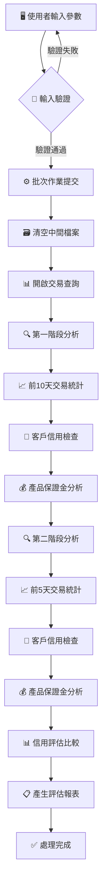
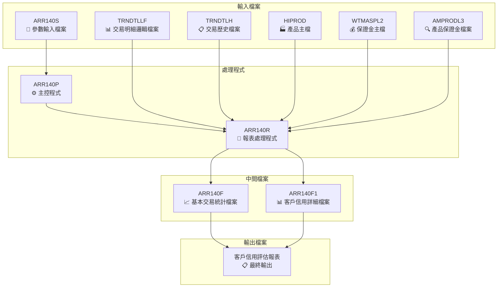
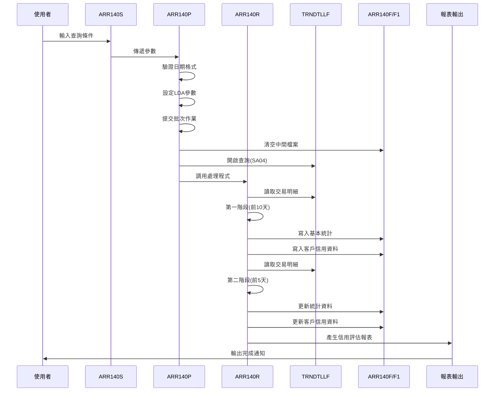
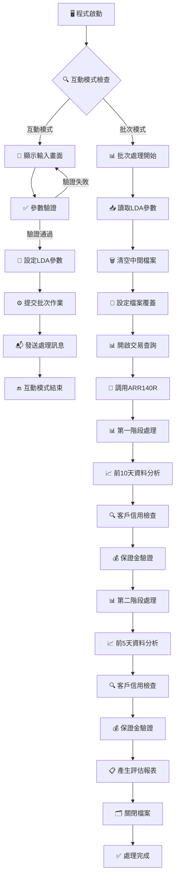

# ARR140P_U01 程式規格書

## 1. 基本資料

| 項目 | 內容 |
|------|------|
| **程式編號** | ARR140P |
| **程式名稱** | 客戶信用評估報表作業 |
| **程式類型** | CLP |
| **廠區** | U01 |
| **系統名稱** | 應收帳款系統 |
| **子系統** | 客戶信用評估子系統 |
| **檔案位置** | 東鋼list/ARR140P_U01.txt |

## 2. 🎯 程式功能說明

### 📋 核心功能

ARR140P_U01是一個專門的客戶信用評估與風險分析報表系統，主要功能為：

1. **雙時期交易比較分析**
   - 針對指定日期區間進行客戶交易分析
   - 比較前10天和前5天的交易模式差異
   - 評估客戶信用變化趨勢

2. **客戶信用風險評估**
   - 分析客戶交易頻率和金額變化
   - 檢查客戶付款模式和信用記錄
   - 評估產品保證金風險

3. **多維度資料關聯分析**
   - 整合交易明細、客戶資料、產品資訊
   - 進行產品保證金檢查和風險評估
   - 提供完整的客戶信用評估報告

### 🔄 業務流程



### 🎯 關鍵特色

**智能日期區間處理**
- 支援起始和結束日期的靈活輸入
- 自動補齊結束日期功能
- 嚴格的日期格式和範圍驗證

**雙階段信用分析**
- 第一階段：分析前10天交易記錄(TYPE='1')
- 第二階段：分析前5天交易記錄(TYPE='2')
- 比較兩階段差異進行信用風險評估

**產品保證金風險管控**
- 整合產品主檔和保證金檔案
- 檢查特殊產品('E')的保證金狀況
- 進行產品保證金一致性驗證

**多檔案關聯查詢**
- TRNDTLLF：交易明細邏輯檔案
- TRNDTLH：交易歷史檔案
- HIPROD：產品主檔
- WTMASPL2：保證金主檔
- AMPRODL3：產品保證金檔案

## 3. 🎯 檔案架構與關聯圖

### 🗂️ 檔案關聯架構



### 🔄 資料流程序列圖



## 4. 🎯 檔案欄位規格說明

### 🔧 主要資料結構

#### **LDA參數區域結構**

| 位置 | 長度 | 欄位名稱 | 型態 | 說明 |
|------|------|----------|------|------|
| 1-8 | 8 | W#DAT1 | CHAR | 起始查詢日期 (YYYYMMDD) |
| 11-18 | 8 | W#DAT2 | CHAR | 結束查詢日期 (YYYYMMDD) |
| 21 | 1 | AREA | CHAR | 廠區代碼 |
| 1011-1020 | 10 | S#DEVN | CHAR | 設備名稱 |
| 1021 | 1 | AREA | CHAR | 廠區代碼(備份) |

#### **程式變數定義表**

| 變數名稱 | 型態 | 長度 | 用途說明 |
|----------|------|------|----------|
| DSPID | CHAR | 10 | 顯示設備ID |
| INT | CHAR | 1 | 互動式標識 |
| OUTQ | CHAR | 10 | 輸出佇列名稱 |
| W#ERR | CHAR | 1 | 錯誤標識 |
| W#DAT1 | CHAR | 8 | 起始日期工作變數 |
| W#DAT2 | CHAR | 8 | 結束日期工作變數 |
| IN03 | LGL | 1 | F3功能鍵指示器 |
| AREA | CHAR | 1 | 廠區代碼 |

### 🔍 重點欄位切割技術詳解

#### **LDA參數區域結構視覺化**

##### LDA參數區域切割視覺化：
```
LDA記錄：[YYYYMMDD..YYYYMMDD.A................................................DDDDDDDDDD.A...]
位置:    001-008   011-018  021                                        1011-1020  1021
         ↓         ↓        ↓                                          ↓          ↓
起始日期: [20241220]                                                                     8字元起始查詢日期
結束日期:           [20241230]                                                           8字元結束查詢日期
廠區代碼:                   [U]                                                          1字元廠區識別
設備名稱:                                                              [TERM001WS]     10字元設備名稱
廠區備份:                                                                         [U]  1字元廠區備份
```

##### LDA切割邏輯說明
**切割策略**：LDA固定位置切割法，透過CHGDTAARA/RTVDTAARA指令進行精確位置的資料讀寫
- **起始日期區**：位置1-8存放8字元起始查詢日期(YYYYMMDD格式)
- **結束日期區**：位置11-18存放8字元結束查詢日期(YYYYMMDD格式)  
- **廠區代碼區**：位置21存放1字元廠區識別代碼
- **設備名稱區**：位置1011-1020存放10字元工作站設備名稱
- **廠區備份區**：位置1021存放1字元廠區代碼備份

#### **交易編號欄位切割技術詳細分析**

##### TXVUNO憑證號碼欄位切割視覺化：
```
TXVUNO記錄：[ABC3DEF]
位置:       001-3 4-7
            ↓     ↓
前3位切割:  [ABC]       D#VUN1 (前3位憑證代碼)
第3位重取:    [C]       D#VUNA (第3位重複取值)  
後4位切割:      [DEF]   D#VUN3 (後4位序號)
```

##### F4VUNO重組欄位切割視覺化：
```
F4VUNO記錄：[ABC0DEF_]
位置:       001-3 4 5-8
            ↓     ↓ ↓
前3位對應:  [ABC]       D1VUN1 ← D#VUN1 (前3位複製)
補零處理:       [0]     D1VUN2 ← '0' (第4位固定補'0')
後4位對應:        [DEF_] D1VUN3 ← D#VUN3 (後4位複製+擴充)
```

##### TXVUNO切割邏輯說明
**切割策略**：7位→8位標準化轉換，透過RPG Data Structure進行位置精確切割
- **原始格式**：TXVUNO 7位憑證號碼
- **切割階段**：D#VUN1(1-3) + D#VUNA(3) + D#VUN3(4-7)
- **重組階段**：D1VUN1(1-3) + '0'(4) + D1VUN3(5-8)  
- **標準化**：統一為8位F4VUNO格式便於系統處理

##### TXNO交易號碼保證金檢查切割視覺化：
```
TXNO記錄：[U12345678]
位置:     001 002-3 004-8
          ↓   ↓     ↓
廠區代碼: [U]         D#TXN1 (第1位廠區識別)
交易類別:     [12]    D#TXN2 (第2-3位交易類別)
序號部分:         [345678] D#TXN3 (第4-8位序號部分)
```

##### 保證金檢查資料流切割視覺化：
```
保證金檢查流程：
D#TXNO → WTMASPL2查詢 → W#STNO狀態判斷
   ↓            ↓              ↓
[U12345678] → 保證金主檔 → ['E'或其他]
                            ↓
                     ┌─────────┴─────────┐
                     ↓                   ↓
              W#STNO='E'          W#STNO≠'E'
              特殊產品處理         一般產品處理
                     ↓                   ↓
            W1STNO←W6STNO前4位    AMPRODL3查詢→W1STNO
```

##### TXNO切割邏輯說明
**切割策略**：交易號碼多層級解析，透過位置切割進行保證金風險分析
- **廠區識別**：D#TXN1提取第1位廠區代碼
- **類別判斷**：D#TXN2提取第2-3位交易類別  
- **序號分析**：D#TXN3提取第4-8位序號部分
- **保證金檢查**：依據切割結果查詢WTMASPL2進行風險評估

#### **雙階段處理欄位切割對應表**
| 切割來源 | 切割目標 | 切割位置 | 切割邏輯 | 技術實現 |
|----------|----------|----------|----------|----------|
| **LDA參數** | W#DAT1 | 位置1-8 | 起始日期參數傳遞 | CHGDTAARA/RTVDTAARA |
| **LDA參數** | W#DAT2 | 位置11-18 | 結束日期參數傳遞 | CHGDTAARA/RTVDTAARA |
| **LDA參數** | AREA | 位置21 | 廠區代碼參數傳遞 | CHGDTAARA/RTVDTAARA |
| **TXVUNO** | D#VUN1 | 位置1-3 | 憑證前3位切割 | RPG Data Structure |
| **TXVUNO** | D#VUNA | 位置3 | 憑證第3位重取 | RPG Data Structure |
| **TXVUNO** | D#VUN3 | 位置4-7 | 憑證後4位切割 | RPG Data Structure |
| **F4VUNO** | D1VUN1 | 位置1-3 | 重組前3位對應 | MOVEL操作 |
| **F4VUNO** | D1VUN2 | 位置4 | 重組補零處理 | MOVEL '0' |
| **F4VUNO** | D1VUN3 | 位置5-8 | 重組後4位對應 | MOVEL操作 |
| **TXNO** | D#TXN1 | 位置1 | 廠區代碼提取 | RPG Data Structure |
| **TXNO** | D#TXN2 | 位置2-3 | 交易類別提取 | RPG Data Structure |
| **TXNO** | D#TXN3 | 位置4-8 | 序號部分提取 | RPG Data Structure |
| **WTMASPL2** | W#STNO | 查詢結果 | 保證金狀態取得 | KEY04 CHAIN |
| **AMPRODL3** | APSTNO | 查詢結果 | 產品保證金代碼 | KEY05 CHAIN |
| **階段標識** | F4TYPE | '1'/'2' | 雙階段類型標記 | MOVEL操作 |
| **階段標識** | W#TYPE | '1'/'2' | 檔案查詢類型標記 | MOVEL操作 |

### 🎯 欄位挪用詳細分析

#### **雙時期類型標識的挪用機制**

**第一階段處理(前10天資料)**
- `F4TYPE` = '1': 標識前10天的交易分析
- `W#TYPE` = '1': 用於ARR140F1檔案的鍵值查詢
- 分析深度：往前10天的交易記錄

**第二階段處理(前5天資料)**
- `F4TYPE` = '2': 標識前5天的交易分析  
- `W#TYPE` = '2': 用於ARR140F1檔案的鍵值查詢
- 分析深度：往前5天的交易記錄

#### **產品保證金檢查的挪用分析**

**保證金檢查流程**
```
產品代碼 → WTMASPL2檔案查詢 → W#STNO狀態
├─ W#STNO ≠ 'E' → AMPRODL3檔案查詢 → APSTNO
│  ├─ 找到記錄 → W1STNO/W2STNO = APSTNO
│  └─ 未找到 → W1STNO/W2STNO = *BLANKS
└─ W#STNO = 'E' → W1STNO/W2STNO = W6STNO(前4位)
```

**保證金一致性檢查**
- 比較W1STNO(第一次查詢)與W2STNO(第二次查詢)
- 若W1STNO ≠ W2STNO則跳過該筆記錄(ITER)
- 確保保證金資料的一致性

#### **日期計數器的挪用邏輯**

**第一階段計數器**
- `F4NUM` = 10: 從指定日期往前10天
- 每讀取一筆新的交易號碼，計數器減1
- 當計數器 < 1時結束第一階段處理

**第二階段計數器**
- `W#NUM` = 5: 從指定日期往前5天  
- 每讀取一筆新的交易號碼，計數器減1
- 當計數器 < 1時結束第二階段處理

### 🔧 切割邏輯說明與技術實現

#### **CLP程式參數傳遞邏輯**

**LDA參數設定實現**
```
CLP主程式(ARR140P)中的LDA參數傳遞：

CHGDTAARA  DTAARA(*LDA (1   8)) VALUE(&W#DAT1)     // 起始日期
CHGDTAARA  DTAARA(*LDA (11  8)) VALUE(&W#DAT2)     // 結束日期
CHGDTAARA  DTAARA(*LDA (21  1)) VALUE(&AREA)       // 廠區代碼

RPG程式(ARR140R)中的UDS接收：
I           UDS
I                                        1   80W#DAT1      // 起始日期接收
I                                       11  180W#DAT2      // 結束日期接收  
I                                       21  21 AREA        // 廠區代碼接收
```

#### **RPG Data Structure切割邏輯實現**

**TXVUNO憑證號碼切割邏輯**
```
RPG程式中的Data Structure定義：

I            DS                                               // 定義資料結構
I                                        1   7 TXVUNO        // 原始憑證號碼
I                                        1   3 D#VUN1        // 前3位切割
I                                        3   3 D#VUNA        // 第3位重複取值
I                                        4   7 D#VUN3        // 後4位切割

重組處理邏輯：
I            DS                                               // 重組資料結構  
I                                        1   8 F4VUNO        // 目標8位格式
I                                        1   3 D1VUN1        // 前3位對應
I                                        4   4 D1VUN2        // 第4位補'0'
I                                        5   8 D1VUN3        // 後4位對應

實際處理程式碼：
C                     MOVELD#VUN1    D1VUN1                  // 前3位複製
C                     MOVEL'0'       D1VUN2                  // 第4位補'0'  
C                     MOVELD#VUN3    D1VUN3                  // 後4位複製
```

**TXNO交易號碼保證金檢查切割**
```
RPG程式中的切割邏輯：

I            DS                                               // 交易號碼切割結構
I                                        1   8 D#TXNO        // 完整交易號碼
I                                        1   1 D#TXN1        // 廠區代碼(第1位)
I                                        2   3 D#TXN2        // 交易類別(第2-3位)
I                                        4   80D#TXN3        // 序號部分(第4-8位)

保證金檢查實現：
C                     MOVEL'U'       D#AREA                  // 設定廠區為U
C                     MOVELTXNO      D#TXNO                  // 複製交易號碼
C           KEY04     CHAINWTMASPL2            N51           // 查詢保證金主檔
C           *IN51     IFEQ *OFF                              // 找到記錄時
C           W#STNO    IFNE 'E'                               // 非特殊產品
C           KEY05     CHAINAMPRODL3            N52           // 查詢產品保證金檔
C  N52                MOVELAPSTNO    W1STNO                  // 取得保證金代碼
C   52                MOVEL*BLANKS   W1STNO                  // 未找到時清空
C                     ENDIF
C           W#STNO    IFEQ 'E'                               // 特殊產品處理
C                     MOVELW6STNO    W1STNO  4               // 使用W6STNO前4位
C                     ENDIF
```

#### **OPNQRYF查詢參數切割邏輯**

**MAPFLD日期轉換技術**
```
CLP主程式中的查詢設定：

OPNQRYF    FILE((TRNDTLLF)) QRYSLT('                  +
              (ACDT *GE "' || &W#DAT1 || '") *AND    +      // 起始日期條件
              (ACDT *LE "' || &W#DAT2 || '") *AND    +      // 結束日期條件  
              (TXCODE *EQ "SA04")')                  +      // 交易類型過濾
             KEYFLD((TXDATE) (TXNO) (TXITEM)) +             // 排序鍵值
             MAPFLD((ACDT  TXDATE *CHAR 8))                 // 日期格式轉換

技術說明：
1. ACDT：查詢用字元日期欄位(透過MAPFLD建立)
2. TXDATE：原始數值日期欄位
3. *CHAR 8：將數值日期轉為8位字元格式
4. 查詢範圍：&W#DAT1 到 &W#DAT2
```

#### **雙階段處理切割邏輯實現**

**第一階段處理邏輯(前10天)**
```
RPG主程式處理邏輯：

C                     Z-ADD10        F4NUM                   // 設定10天計數器
C           W#DAT1    SETGTTXREC                            // 設定起始位置
C                     MOVEL*OFF      *IN50                  // 初始化結束指示器
C           *IN50     DOWEQ*OFF                             // 主處理迴圈
C           W#DAT1    REDPETXREC                    50      // 讀取交易記錄
C   50                LEAVE                                  // 檔案結束時退出

交易號碼變更檢查：
C           TXNO      IFNE W#TXNO                           // 新交易號碼檢查
C           W#TXNO    ANDNE*BLANKS                          // 非初始狀態
C                     SUB  1         F4NUM                  // 計數器減1
C                     MOVELTXNO      W#TXNO                 // 更新當前交易號
C                     ENDIF

天數限制檢查：
C           F4NUM     IFLT 1                                // 計數器<1檢查
C                     LEAVE                                 // 結束第一階段
C                     ENDIF

資料處理：
C                     MOVEL'1'       F4TYPE                 // 設定第一階段標識
C                     WRITERAR140F                          // 寫入基本統計檔
```

**第二階段處理邏輯(前5天)**
```
第二階段切換邏輯：

C           W#DAT2    SETLLTXREC                            // 設定結束位置
C                     Z-ADD5         W#NUM   20             // 設定5天計數器
C                     MOVEL*BLANKS   W#TXNO                 // 重置交易號碼
C           *IN50     DOWEQ*OFF                             // 第二階段迴圈
C           W#DAT2    READETXREC                    50      // 反向讀取

計數邏輯：
C           W#TXNO    IFEQ *BLANKS                          // 初始狀態處理
C                     Z-ADD1         F4NUM                  // 初始計數器
C                     ENDIF
C           TXNO      IFNE W#TXNO                           // 交易號變更檢查
C           W#TXNO    ANDNE*BLANKS
C                     SUB  1         W#NUM                  // 第二階段計數器減1
C                     ADD  1         F4NUM                  // 序號計數器加1
C                     MOVELTXNO      W#TXNO
C                     ENDIF

階段標識：
C                     MOVEL'2'       F4TYPE                 // 設定第二階段標識
C                     WRITERAR140F                          // 寫入統計檔案
```

#### **保證金一致性檢查邏輯實現**

**保證金雙重驗證機制**
```
保證金檢查邏輯(第一次)：
C                     MOVELTXNO      D#TXNO                 // 設定交易號碼
C           KEY04     CHAINWTMASPL2            N51          // 查詢保證金主檔
C           *IN51     IFEQ *OFF                             // 記錄存在時
C           W#STNO    IFNE 'E'                              // 一般產品處理
C           KEY05     CHAINAMPRODL3            N52          // 查詢產品保證金檔  
C  N52                MOVELAPSTNO    W1STNO                 // 第一次結果
C   52                MOVEL*BLANKS   W1STNO                 // 查詢失敗處理
C                     ENDIF

保證金檢查邏輯(第二次-同樣邏輯)：
C                     MOVELTXNO      D#TXNO                 // 重新設定交易號
C           KEY04     CHAINWTMASPL2            N51          // 重新查詢主檔
C           *IN51     IFEQ *OFF
C           W#STNO    IFNE 'E' 
C           KEY05     CHAINAMPRODL3            N52
C  N52                MOVELAPSTNO    W2STNO                 // 第二次結果
C   52                MOVEL*BLANKS   W2STNO
C                     ENDIF

一致性檢查邏輯：
C           W1STNO    IFNE W2STNO                           // 比較兩次結果
C                     ITER                                  // 不一致時跳過記錄
C                     ENDIF                                 // 確保資料一致性
```

#### **客戶信用檔案關聯邏輯**

**ARR140F1檔案操作邏輯**
```
複合鍵值查詢邏輯：

C           KEY02     KLIST                                 // 定義複合鍵值
C                     KFLD           W#TYPE                 // 階段類型
C                     KFLD           F4VUNO                 // 憑證號碼
C                     KFLD           TXNO                   // 交易號碼  
C                     KFLD           TXITEM                 // 交易項目
C                     KFLD           TXCUNO                 // 客戶代號
C                     KFLD           W#PDN5                 // 產品代碼
C                     KFLD           TXUPRC                 // 單價

檔案操作邏輯：
C           KEY02     CHAINARR140F1             55          // 查詢現有記錄
C   55                CLEARRAR140F1                        // 記錄不存在時清空
C                     MOVELF4VUNO    F1VUNO                 // 設定憑證號碼
C                     MOVELTXNO      F1TXNO                 // 設定交易號碼
C                     Z-ADDTXITEM    F1ITEM                 // 設定項目編號
C                     MOVELTXCUNO    F1CUNO                 // 設定客戶代號
C                     MOVELTXPDNM    F1PDNM                 // 設定產品代碼
C                     MOVEL'1'       F1TYPE                 // 設定階段標識(第一階段)
C   55                WRITERAR140F1                        // 新增記錄
```

### 📊 重要變數定義表

| 變數名稱 | 型態 | 長度 | 初始值 | 用途說明 |
|----------|------|------|--------|----------|
| W#TXNO | CHAR | 8 | *BLANKS | 當前處理的交易號碼 |
| F4NUM | NUMERIC | 2 | 10 | 第一階段天數計數器 |
| W#NUM | NUMERIC | 2 | 5 | 第二階段天數計數器 |
| W#TYPE | CHAR | 1 | 變化 | 處理階段類型('1'/'2') |
| W#VUNO | CHAR | 7 | - | 交易憑證號碼工作變數 |
| W#PDN5 | CHAR | 5 | - | 產品代碼工作變數 |
| W#PDNM | CHAR | 5 | - | 產品名稱工作變數 |
| W1STNO | CHAR | 4 | - | 第一次保證金查詢結果 |
| W2STNO | CHAR | 4 | - | 第二次保證金查詢結果 |
| D#AREA | CHAR | 1 | 'U' | 廠區代碼(固定為U) |

## 5. 🎯 輸出/入螢幕布局

### 📝 輸入畫面規格 (ARR140S)

#### **畫面布局**

```
┌─────────────────────────────────────────────────────────────────────────────┐
│ 2024/12/30            東莞鋼鐵股份有限公司                        ARR140S   │
│ userid                  客戶信用評估報表作業                       devname   │
│                                                                             │
│                                                                             │
│                                                                             │
│                                                                             │
│                                                                             │
│                                                                             │
│        日期: ________  ~  ________                                         │
│                                                                             │
│        建議輸入最近10天完整的天數，範例5天的天數                           │
│                                                                             │
│                                                                             │
│                                                                             │
│                                                                             │
│                                                                             │
│                                                                             │
│                                                                             │
│                                                                             │
│                                                                             │
│                                                                             │
│ ________________________________________________________________           │
│     ENTER:確認                PF03:離開                                     │
└─────────────────────────────────────────────────────────────────────────────┘
```

#### **欄位詳細規格**

| 欄位名稱 | 位置 | 型態 | 長度 | 屬性 | 說明 |
|----------|------|------|------|------|------|
| **S#DAT1** | 9,22 | 8S 0 | 8 | 輸入欄位 | 起始日期(YYYYMMDD格式) |
| **S#DAT2** | 9,34 | 8S 0 | 8 | 輸入欄位 | 結束日期(YYYYMMDD格式) |
| **S#USER** | 2,2 | 10A | 10 | 輸出欄位 | 使用者代碼 |
| **S#DEVN** | 2,70 | 10A | 10 | 輸出欄位 | 設備名稱 |
| **S#ERR** | 23,2 | 70A | 70 | 輸出欄位 | 錯誤訊息區域(高亮顯示) |

#### **功能鍵說明**

| 功能鍵 | 說明 | 對應指示器 |
|--------|------|------------|
| **ENTER** | 確認輸入，執行查詢處理 | - |
| **F03** | 離開程式 | IN03 |
| **F12** | 回到前一個畫面 | IN12 |

#### **錯誤指示器說明**

| 指示器 | 欄位 | 錯誤類型 | 顯示效果 |
|--------|------|----------|----------|
| **IN41** | S#DAT1 | 起始日期錯誤 | 反白+閃爍 |
| **IN42** | S#DAT2 | 結束日期錯誤 | 反白+閃爍 |

### 📊 報表輸出格式

#### **客戶信用評估報表布局**

```
┌─────────────────────────────────────────────────────────────────────────────┐
│                          客戶信用評估報表                                     │
│ 程式代號: ARR140P              查詢期間: 2024/12/20 ~ 2024/12/30             │
│ 列印日期: 2024/12/30 15:30:25  廠區: U01                         頁次: 1    │
├─────────────────────────────────────────────────────────────────────────────┤
│                                                                             │
│ 第一階段分析(前10天交易統計)                                                 │
│ ┌─────┬────────┬─────┬──────┬───────┬─────┬───────┐        │
│ │序號 │  交易日期  │交易號│ 產品名 │  客戶名  │ 數量 │  金額  │        │
│ ├─────┼────────┼─────┼──────┼───────┼─────┼───────┤        │
│ │  1  │ 2024/12/25 │ TX001│ P001  │ ABC公司  │ 100 │ 50,000│        │
│ │  2  │ 2024/12/24 │ TX002│ P002  │ XYZ企業  │ 200 │ 80,000│        │
│ └─────┴────────┴─────┴──────┴───────┴─────┴───────┘        │
│                                                                             │
│ 第二階段分析(前5天交易統計)                                                  │
│ ┌─────┬────────┬─────┬──────┬───────┬─────┬───────┐        │
│ │序號 │  交易日期  │交易號│ 產品名 │  客戶名  │ 數量 │  金額  │        │
│ ├─────┼────────┼─────┼──────┼───────┼─────┼───────┤        │
│ │  1  │ 2024/12/29 │ TX003│ P001  │ ABC公司  │ 150 │ 75,000│        │
│ │  2  │ 2024/12/28 │ TX004│ P003  │ DEF集團  │ 300 │ 90,000│        │
│ └─────┴────────┴─────┴──────┴───────┴─────┴───────┘        │
│                                                                             │
│ 客戶信用變化分析:                                                           │
│ • ABC公司: 交易頻率增加50%, 金額增長50%, 信用狀況良好                       │
│ • XYZ企業: 近期無交易記錄, 建議關注                                        │
│ • DEF集團: 新增客戶, 交易金額較大, 建議加強監控                            │
└─────────────────────────────────────────────────────────────────────────────┘
```

## 6. 🎯 處理流程程序說明

### 🔄 主要處理流程



### 📝 詳細處理步驟

**步驟1：程式初始化**
- 宣告程式變數和檔案參考
- 檢查執行模式(互動式/批次)
- 取得使用者資訊和輸出佇列

**步驟2：互動式參數輸入** 
- 透過SNDRCVF顯示ARR140S參數輸入畫面
- 重置所有錯誤指示器(IN41-IN42)和錯誤訊息
- 支援日期範圍輸入和廠區設定

**步驟3：參數驗證處理**
- 起始日期檢查：必須輸入有效日期，不可為0
- 日期格式驗證：透過C018程式驗證起始和結束日期格式
- 日期自動補齊：起始日期有值而結束日期為0時自動補齊
- 日期範圍檢查：起始日期不可大於結束日期

**步驟4：LDA參數設定**
- 將驗證通過的參數寫入LDA區域
- 位置1-8：起始查詢日期
- 位置11-18：結束查詢日期  
- 位置21：廠區代碼

**步驟5：批次作業提交**
- 透過SBMJOB提交批次作業到ARJOBD作業說明
- 發送開始處理訊息給使用者

**步驟6：批次處理階段**
- 從LDA讀取處理參數
- 清空ARR140F和ARR140F1中間檔案
- 設定TRNDTLLF檔案為共享模式

**步驟7：交易資料查詢設定**
- 開啟TRNDTLLF查詢：日期範圍、SA04交易類型
- 使用MAPFLD轉換TXDATE為字元日期格式
- 依交易日期、交易號碼、項目排序

**步驟8：第一階段處理(前10天)**
- 從起始日期開始往前讀取10天交易資料
- 進行客戶信用和產品保證金分析
- 寫入ARR140F基本統計檔案
- 寫入ARR140F1客戶信用詳細檔案

**步驟9：第二階段處理(前5天)**
- 從結束日期開始往前讀取5天交易資料
- 進行客戶信用和產品保證金分析
- 更新ARR140F和ARR140F1統計資料

**步驟10：信用評估分析**
- 比較兩階段的客戶交易差異
- 分析客戶信用變化趨勢
- 評估產品保證金風險狀況

### 🎯 子程序邏輯分析

**ARR140R子程序功能（客戶信用評估處理）**
- 雙階段交易資料處理：分別處理前10天和前5天的交易記錄
- 客戶信用檢查：透過TRNDTLH檔案檢查客戶歷史信用記錄
- 產品保證金驗證：整合WTMASPL2和AMPRODL3進行保證金檢查
- 資料一致性確保：確保保證金資料在兩次查詢中的一致性

**日期區間控制邏輯**
- 使用F4NUM(10)和W#NUM(5)控制兩階段的天數限制
- 透過交易號碼變更觸發計數器遞減
- 達到天數限制時結束該階段處理

**客戶信用評估邏輯**
- 整合交易明細、客戶資料、產品資訊
- 分析交易頻率、金額變化、付款模式
- 產生客戶信用風險評估報告

### 🎯 特殊邏輯處理

**產品保證金檢查邏輯**
- 首先查詢WTMASPL2檔案取得W#STNO狀態
- 若W#STNO≠'E'則查詢AMPRODL3檔案取得APSTNO
- 若W#STNO='E'則使用W6STNO的前4位作為保證金代碼
- 比較兩次查詢結果確保資料一致性

**客戶信用歷史檢查邏輯**
- 透過TRNDTLH檔案查詢客戶歷史交易記錄
- 比對交易日期確保資料的時間一致性
- 分析客戶付款模式和信用變化趨勢

**雙階段比較分析邏輯**
- 第一階段(TYPE='1')：分析前10天的客戶交易模式
- 第二階段(TYPE='2')：分析前5天的客戶交易變化
- 比較兩階段差異評估客戶信用風險變化

## 7. 🎯 數據操作與轉換分析

### 檔案操作詳解

**TRNDTLLF檔案存取邏輯**
- READ操作：透過OPNQRYF建立的查詢檢視讀取交易明細資料
- 查詢條件：SA04交易類型、日期範圍條件
- 檔案鎖定：使用SHARE(*YES)允許多重存取
- 排序鍵值：交易日期、交易號碼、項目編號

**ARR140F檔案存取邏輯**
- WRITE操作：寫入基本交易統計資料
- 鍵值結構：類型、序號、日期、交易號碼、產品名稱、單價
- 存取模式：順序寫入，支援重複鍵值
- 資料用途：基本交易統計和信用評估基礎

**ARR140F1檔案存取邏輯**
- WRITE/UPDATE操作：客戶信用詳細資料管理
- 鍵值結構：類型、憑證號、交易號、項目、客戶、產品、單價
- 存取模式：隨機存取和更新，支援CHAIN查詢
- 資料用途：客戶信用詳細分析和風險評估

### 數據轉換邏輯

**日期格式轉換**
- 輸入格式：YYYYMMDD (8S 0數值格式)
- 查詢格式："YYYYMMDD" (*CHAR 8字元格式)
- 顯示格式：YYYY/MM/DD (帶斜線分隔)
- C018驗證：確保日期格式正確性和有效性

**交易憑證號碼轉換**
- 原始格式：TXVUNO (7位)
- 切割處理：D#VUN1(1-3) + D#VUNA(3) + D#VUN3(4-7)
- 重組格式：F4VUNO (8位) = D1VUN1(1-3) + '0' + D1VUN3(5-8)
- 用途：憑證號碼標準化和檔案關聯

**產品保證金代碼處理**
- TXNO切割：D#TXN1(廠區) + D#TXN2(類別) + D#TXN3(序號)
- 保證金查詢：WTMASPL2 → W#STNO狀態檢查
- 特殊處理：W#STNO='E'時使用W6STNO前4位
- 一致性檢查：W1STNO與W2STNO的比對驗證

### 計算邏輯分析

**雙階段天數計算**
- 第一階段：F4NUM=10，從起始日期往前計算10天
- 第二階段：W#NUM=5，從結束日期往前計算5天
- 計數邏輯：每遇到新交易號碼時計數器遞減
- 終止條件：計數器 < 1時結束該階段處理

**客戶信用統計計算**
- 交易金額累計：ADD TXAMT到對應統計欄位
- 交易數量統計：ADD TXQTY到數量統計
- 頻率分析：統計客戶在兩個時期的交易次數
- 變化分析：比較兩階段的交易模式差異

**保證金風險計算**
- 保證金狀態檢查：透過WTMASPL2檢查產品保證金要求
- 風險評估：分析'E'類特殊產品的保證金風險
- 一致性驗證：確保保證金資料在查詢過程中的一致性
- 風險分級：依據保證金狀況進行客戶風險分級

### 檢核機制詳解

**輸入資料檢核**
- 日期有效性：起始日期必須輸入，格式必須正確
- 日期範圍：確保起始日期不大於結束日期
- 日期自動補齊：結束日期為0時自動設定為起始日期
- 廠區有效性：檢查廠區代碼的合法性

**檔案存取檢核**
- 檔案存在性：使用指示器檢查各檔案的讀取狀態
- 查詢結果驗證：確保OPNQRYF查詢設定正確
- 資料完整性：驗證中間檔案的資料結構正確性
- 權限檢查：確保檔案覆蓋和讀寫權限正確

**資料邏輯檢核**
- 交易類型：確保只處理SA04類型的交易
- 日期順序：驗證交易日期的時間序列正確性
- 客戶一致性：確保客戶資料在關聯查詢中的一致性
- 產品有效性：驗證產品代碼的有效性和存在性

**信用評估檢核**
- 保證金一致性：檢查保證金資料的前後一致性
- 客戶歷史檢查：驗證客戶歷史信用記錄的完整性
- 統計計算驗證：確保各項統計計算的正確性
- 風險評估邏輯：驗證客戶信用風險評估的合理性

## 8. 🎯 錯誤處理程序說明

### 🎯 詳細錯誤代碼清冊

| 錯誤代碼 | 錯誤訊息 | 原因說明 | 處理方式 | 預防措施 |
|----------|----------|----------|----------|----------|
| **USER001** | 查詢-起始日期不可空白! | 起始日期為必填欄位但輸入為空 | 1. 顯示錯誤訊息<br>2. 游標定位至起始日期欄位<br>3. 設定IN41指示器 | 提供日期輸入格式說明 |
| **USER002** | 查詢-輸入日期格式錯誤! | 日期格式不符YYYYMMDD格式 | 1. 顯示錯誤訊息<br>2. 設定IN41或IN42指示器<br>3. 要求重新輸入日期 | 增加日期格式檢查和提示 |
| **USER003** | 查詢-日期範圍輸入錯誤! | 起始日期大於結束日期 | 1. 顯示錯誤訊息<br>2. 設定IN41和IN42指示器<br>3. 要求重新輸入範圍 | 增加日期範圍邏輯檢查 |
| **FILE001** | TRNDTLLF檔案開啟失敗 | 交易明細邏輯檔無法開啟 | 1. 記錄錯誤日誌<br>2. 通知系統管理員<br>3. 終止處理程序 | 定期檢查檔案完整性 |
| **FILE002** | ARR140F檔案開啟失敗 | 基本統計檔無法開啟或損壞 | 1. 記錄錯誤日誌<br>2. 重新建立檔案<br>3. 重新執行處理 | 確保中間檔案權限正確 |
| **FILE003** | ARR140F1檔案開啟失敗 | 客戶信用檔無法開啟或損壞 | 1. 記錄錯誤日誌<br>2. 重新建立檔案<br>3. 重新執行處理 | 確保中間檔案權限正確 |
| **FILE004** | TRNDTLLF檔案無資料 | 指定條件查詢無符合資料 | 1. 顯示"無符合資料"<br>2. 產生空白報表<br>3. 建議檢查查詢條件 | 提供查詢條件說明 |
| **DATA001** | 交易資料異常 | TRNDTLLF檔案資料格式錯誤 | 1. 記錄異常資料<br>2. 跳過異常記錄<br>3. 繼續處理其他資料 | 加強資料驗證機制 |
| **DATA002** | 客戶資料異常 | 客戶相關資料格式錯誤 | 1. 使用預設值<br>2. 記錄異常客戶<br>3. 繼續信用評估 | 建立客戶資料檢查 |
| **DATA003** | 產品資料異常 | 產品代碼或資料格式錯誤 | 1. 使用原始代碼<br>2. 記錄異常產品<br>3. 繼續產品分析 | 建立產品資料檢查 |
| **CALC001** | 日期自動補齊失敗 | 日期補齊邏輯異常 | 1. 使用原始日期<br>2. 記錄補齊失敗<br>3. 繼續處理流程 | 加強日期邏輯檢查 |
| **CALC002** | 信用評估計算失敗 | 客戶信用評估邏輯異常 | 1. 使用預設評估<br>2. 記錄計算錯誤<br>3. 繼續信用處理 | 檢查評估邏輯設定 |
| **CALC003** | 保證金檢查異常 | 保證金計算邏輯錯誤 | 1. 跳過保證金檢查<br>2. 記錄檢查錯誤<br>3. 繼續信用評估 | 驗證保證金邏輯 |
| **CALC004** | 天數計算異常 | 雙階段天數計算錯誤 | 1. 重設計數器<br>2. 記錄計算錯誤<br>3. 繼續階段處理 | 檢查計數器邏輯 |
| **SYS001** | 批次作業提交失敗 | SBMJOB執行異常 | 1. 改為直接執行<br>2. 記錄提交錯誤<br>3. 繼續批次處理 | 檢查作業佇列狀態 |
| **SYS002** | 訊息發送失敗 | SNDBRKMSG執行失敗 | 1. 忽略訊息錯誤<br>2. 繼續程式執行<br>3. 記錄通信異常 | 檢查訊息佇列設定 |
| **RPT001** | 報表輸出異常 | 客戶信用報表產生失敗 | 1. 檢查報表格式<br>2. 重新產生報表<br>3. 使用簡化格式 | 確保報表檔案正確性 |
| **RPT002** | 統計分析異常 | 雙階段統計分析失敗 | 1. 使用單階段分析<br>2. 記錄分析錯誤<br>3. 繼續報表處理 | 檢查分析邏輯設定 |
| **CRED001** | 客戶信用檢查失敗 | 客戶信用評估處理異常 | 1. 使用預設信用等級<br>2. 記錄評估錯誤<br>3. 繼續信用處理 | 驗證信用評估邏輯 |
| **CRED002** | 保證金一致性錯誤 | 保證金前後查詢不一致 | 1. 跳過該筆記錄<br>2. 記錄一致性錯誤<br>3. 繼續處理下筆 | 檢查保證金檔案穩定性 |

### 🎯 系統異常處理邏輯

**檔案操作失敗處理**
- OPNQRYF操作失敗時自動執行CLOF清理資源
- TRNDTLLF檔案無法開啟時記錄錯誤並終止處理
- ARR140F/ARR140F1檔案異常時嘗試重新建立檔案
- 查詢無資料時產生無資料報表並提示使用者
- 所有檔案操作完成後確實執行DLTOVR

**雙階段處理異常控制**
- 第一階段失敗時清理中間檔案並記錄錯誤
- 第二階段失敗時保留第一階段資料供參考
- 階段間的資料一致性檢查和恢復機制
- 確保部分階段失敗不影響整體信用評估

**使用者輸入錯誤處理**
- 所有輸入錯誤都回到輸入畫面重新輸入
- 錯誤指示器精確定位錯誤欄位(IN41/IN42)
- 提供詳細的錯誤說明和修正建議
- 保留正確輸入的資料，僅要求修正錯誤部分

**程式調用失敗處理**
- C018日期驗證失敗時提供清楚的錯誤訊息
- ARR140R調用失敗時確保檔案正確關閉
- 批次作業提交失敗時改為直接執行
- 所有程式調用都包含適當的錯誤恢復機制

**客戶信用評估異常處理**
- 保證金檢查異常時跳過該筆記錄繼續處理
- 客戶資料異常時使用預設值繼續評估
- 產品資料異常時記錄問題但不中斷流程
- 信用評估計算異常時提供預設評估結果

## 9. 🎯 備註

### 🎯 特殊注意事項

**客戶信用評估的業務意義**
程式的核心功能是透過雙時期交易資料比較分析，評估客戶的信用變化趨勢和風險狀況。第一階段分析前10天的交易記錄，第二階段分析前5天的交易記錄，透過兩階段的對比分析，可以有效識別客戶信用狀況的變化。

**雙階段處理的設計邏輯**
採用兩階段處理模式提供更精確的客戶信用評估。前10天的資料提供較長期的交易模式分析，前5天的資料反映最近的交易變化，兩者結合可以更準確地評估客戶的信用趨勢和風險變化。

**產品保證金風險管控**
程式整合WTMASPL2和AMPRODL3檔案進行產品保證金檢查，特別關注'E'類特殊產品的保證金狀況。透過一致性檢查(W1STNO與W2STNO比對)確保保證金資料的可靠性，降低信用評估的風險。

**交易憑證號碼標準化**
程式對TXVUNO(7位)進行切割和重組處理，轉換為標準的F4VUNO(8位)格式。這種標準化處理確保憑證號碼在系統中的一致性，便於後續的資料關聯和查詢操作。

**客戶歷史信用檢查**
透過TRNDTLH檔案進行客戶歷史信用記錄檢查，確保信用評估不僅基於當期交易，還考慮客戶的歷史信用表現。這種全面的信用檢查提高評估結果的準確性和可靠性。

**廠區別風險管理**
程式支援廠區代碼設定，能夠針對不同廠區進行獨立的客戶信用評估。這種設計考慮到不同廠區可能有不同的客戶群體和風險特徵，提供更精確的風險管理。

**天數控制的靈活設計**
程式透過F4NUM(10天)和W#NUM(5天)進行天數控制，每遇到新的交易號碼時計數器遞減，達到限制時結束該階段。這種設計確保分析的時間範圍準確，避免資料過多或過少影響評估結果。

**資料一致性保證機制**
程式在保證金檢查過程中實施嚴格的一致性檢查，比較兩次查詢結果(W1STNO與W2STNO)，若不一致則跳過該筆記錄。這種機制確保信用評估基於可靠的資料基礎。

**多檔案關聯查詢最佳化**
程式使用多個KLIST進行複雜的檔案關聯查詢，包括KEY01到KEY05的不同查詢策略。這種設計最佳化查詢效能，確保在大量資料中快速定位相關記錄。

**錯誤處理的完善設計**
程式實施多層次的錯誤處理機制，從輸入驗證到檔案操作，再到業務邏輯處理，每個層次都有相應的錯誤檢查和恢復機制，確保系統的穩定性和可靠性。

**日期驗證的嚴格要求**
程式使用C018專用日期驗證程式，確保輸入日期的格式正確性和有效性。支援起始和結束日期的獨立驗證，錯誤時精確定位到對應欄位，提高使用者體驗。

**MAPFLD技術的應用**
透過OPNQRYF的MAPFLD功能，將TXDATE數值日期轉換為字元格式進行範圍查詢，提高查詢效率和準確性。這種技術應用確保日期查詢的正確性和效能。

**中間檔案的管理策略**
ARR140F和ARR140F1作為雙階段處理的資料儲存，每次執行前清空檔案確保資料純淨性。檔案結構設計支援複雜的客戶信用分析需求，提供豐富的統計和分析功能。

**批次處理的完整訊息機制**
提供開始處理的訊息通知，讓使用者了解處理進度。訊息發送到使用者的個人訊息佇列，確保訊息能正確接收，提升使用者對系統處理狀況的掌握。 