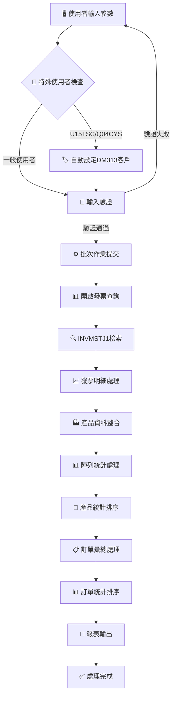
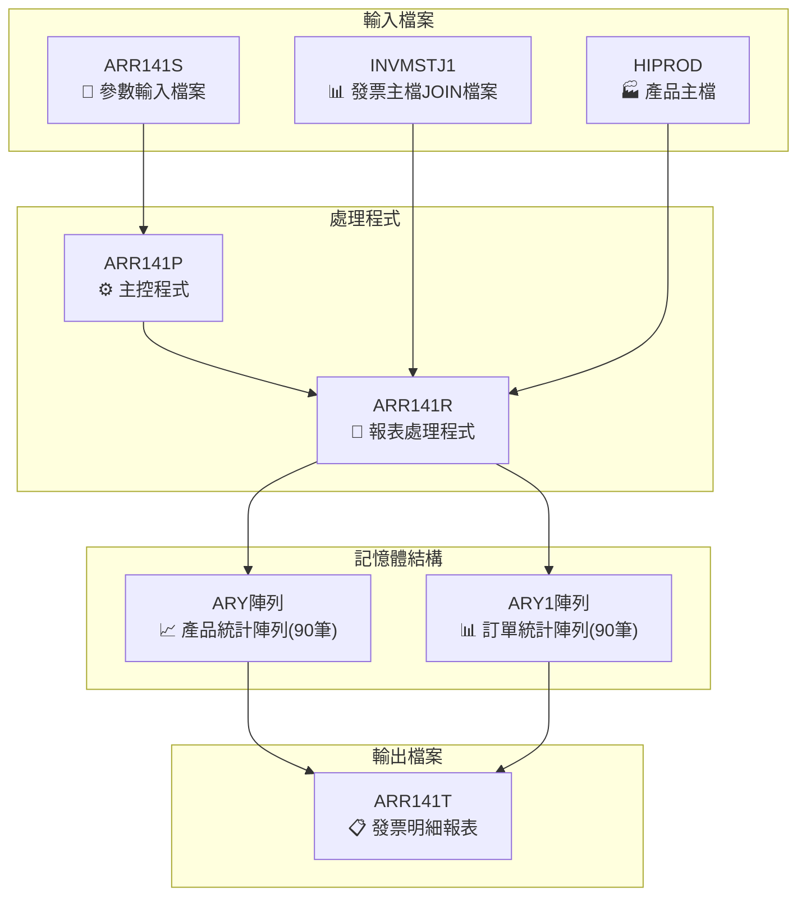
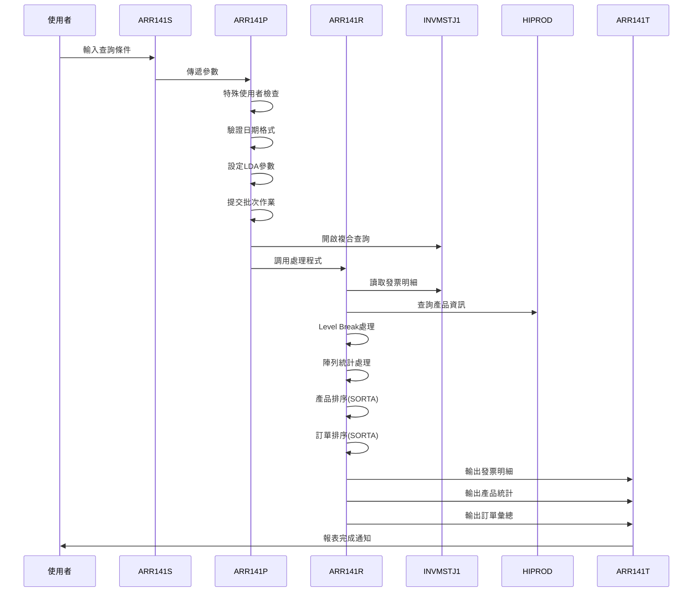
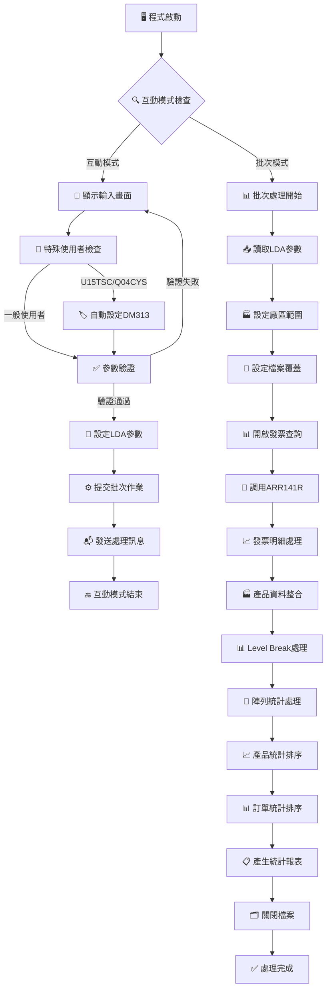

# ARR141P_U01 程式規格書

## 1. 基本資料

| 項目 | 內容 |
|------|------|
| **程式編號** | ARR141P |
| **程式名稱** | 客戶發票列印作業 |
| **程式類型** | CLP |
| **廠區** | U01 |
| **系統名稱** | 應收帳款系統 |
| **子系統** | 發票列印子系統 |
| **檔案位置** | 東鋼list/ARR141P_U01.txt |

## 2. 🎯 程式功能說明

### 📋 核心功能

ARR141P_U01是一個專門的客戶發票列印與統計分析系統，主要功能為：

1. **客戶發票明細列印**
   - 根據客戶代號、日期範圍查詢發票資料
   - 支援多廠區(U、K、P、M、H、I)發票處理
   - 產生詳細的發票明細清單

2. **產品統計分析功能**
   - 按產品代碼進行數量和金額統計
   - 使用陣列排序產生產品彙總報表
   - 提供產品銷售績效分析

3. **訂單彙總分析功能**
   - 按訂單號碼進行交易彙總
   - 提供訂單層級的數量和金額統計
   - 支援訂單執行狀況分析

4. **特殊使用者權限控制**
   - 特定使用者自動設定預設客戶
   - 支援H、K廠區特殊客戶處理
   - 彈性的權限管理機制

### 🔄 業務流程



### 🎯 關鍵特色

**智能客戶權限管理**
- 特殊使用者(U15TSC、Q04CYS)自動設定預設客戶DM313
- H、K廠區客戶預設為DH176
- 支援多廠區客戶權限控制

**複合查詢條件設計**
- 支援三種日期查詢：發票日期(ACDT)、入帳日期(INDT)、保留日期(IVRESV)
- 彈性的廠區範圍設定(空白=全部廠區)
- 排除特定帳別(6、7)和作廢發票

**雙層統計分析**
- 第一層：產品統計(ARY陣列，90筆)
- 第二層：訂單統計(ARY1陣列，90筆)
- 支援陣列排序和階層彙總

**多檔案關聯查詢**
- INVMSTJ1：發票主檔JOIN檔案
- HIPROD：產品主檔
- 複雜的JOIN查詢和欄位對應

## 3. 🎯 檔案架構與關聯圖

### 🗂️ 檔案關聯架構



### 🔄 資料流程序列圖



## 4. 🎯 檔案欄位規格說明

### 🔧 主要資料結構

#### **LDA參數區域結構**

| 位置 | 長度 | 欄位名稱 | 型態 | 說明 |
|------|------|----------|------|------|
| 1-8 | 8 | T#DAT1 | CHAR | 起始發票日期 (YYYYMMDD) |
| 11-18 | 8 | T#DAT2 | CHAR | 結束發票日期 (YYYYMMDD) |
| 21 | 1 | T#FACT | CHAR | 廠區代碼 |
| 31-36 | 6 | T#CUNO | CHAR | 客戶代號 |
| 1001-1010 | 10 | T#USID | CHAR | 使用者ID |
| 1011-1020 | 10 | S#DEVN | CHAR | 設備名稱 |

#### **程式變數定義表**

| 變數名稱 | 型態 | 長度 | 用途說明 |
|----------|------|------|----------|
| DSPID | CHAR | 10 | 顯示設備ID |
| INT | CHAR | 1 | 互動式標識 |
| OUTQ | CHAR | 10 | 輸出佇列名稱 |
| W#ERR | CHAR | 1 | 錯誤標識 |
| W#DAT1 | CHAR | 8 | 起始日期工作變數 |
| W#DAT2 | CHAR | 8 | 結束日期工作變數 |
| W#ARES | CHAR | 1 | 起始廠區範圍 |
| W#AREE | CHAR | 1 | 結束廠區範圍 |
| W#USER | CHAR | 10 | 使用者ID工作變數 |
| W#YYMS | CHAR | 5 | 起始年月(保留日期) |
| W#YYME | CHAR | 5 | 結束年月(保留日期) |

### 🔍 重點欄位切割技術詳解

#### **LDA參數區域切割視覺化**

##### LDA參數區域切割視覺化：
```
LDA記錄：[YYYYMMDD..YYYYMMDD.F.....CCCCCC.........................................UUUUUUUUUU]
位置:    001-008   011-018  021    031-036                                       1001-1010
         ↓         ↓        ↓      ↓                                             ↓
起始日期: [20241220]                                                                     8字元發票起始日期
結束日期:           [20241230]                                                           8字元發票結束日期
廠區代碼:                   [U]                                                          1字元廠區識別
客戶代號:                          [DM313_]                                              6字元客戶代號
使用者ID:                                                                       [USER123456] 10字元使用者識別
```

##### LDA切割邏輯說明
**切割策略**：LDA多區域分段切割法，透過CHGDTAARA/RTVDTAARA指令進行不同位置的資料讀寫
- **日期區域**：位置1-8和11-18存放起始和結束發票日期
- **廠區區域**：位置21存放廠區代碼
- **客戶區域**：位置31-36存放客戶代號
- **使用者區域**：位置1001-1010存放使用者識別碼
- **設備區域**：位置1011-1020存放設備名稱

#### **INVMSTJ1複合查詢欄位切割視覺化**

##### 發票主檔JOIN結構切割視覺化：
```
INVMSTJ1記錄：[FLAG|TYPE|DCD|DT|INVNO_____|CUNO|CUNM______|ORNO|INDT|KIND|...]
位置:         001  002  003 004 005-014    015  016-025    026  027  028
              ↓    ↓    ↓   ↓   ↓          ↓    ↓          ↓    ↓    ↓
處理旗標:     [F]                                                         1字元處理狀態
發票類型:          [T]                                                     1字元發票類型
作廢代碼:               [D]                                                1字元作廢標記
作廢日期:                   [YYYYMMDD]                                     8字元作廢日期
發票號碼:                            [INV0001234]                          10字元發票號碼
客戶代號:                                        [DM313]                  6字元客戶代號
客戶名稱:                                               [東興企業____]    10字元客戶名稱
訂單號碼:                                                            [OR123] 6字元訂單號碼
```

##### INVMSTJ1查詢切割邏輯詳細分析

**複合查詢條件的欄位切割處理**
```
查詢條件切割：
1. 客戶條件: INCUNO *EQ &S#CUNO → 精確客戶比對
2. 日期條件組合:
   - 發票日期: ACDT (IVACDT→*CHAR 8) 
   - 入帳日期: INDT (ININDT→*CHAR 8)
   - 保留日期: IVRESV (年月格式)
3. 排除條件:
   - 作廢標記: INDECD *EQ " " (非作廢)
   - 帳別排除: IVACNT *NE "6" *AND IVACNT *NE "7"
4. 廠區範圍: INAREA *GE &W#ARES *AND INAREA *LE &W#AREE
```

#### **陣列統計結構切割視覺化**

##### ARY產品統計陣列切割視覺化：
```
ARY陣列記錄：[PDNM|QTY______|AMT_________|...]
位置:        001-5 006-013  014-025
             ↓     ↓        ↓
產品代碼:    [P001]          D#PDN1 (5字元產品代碼)
統計數量:          [12345678] D#QTY (8字元數量)
統計金額:                   [123456789012] D#AMT (12字元金額)
```

##### ARY1訂單統計陣列切割視覺化：
```
ARY1陣列記錄：[ORNO|PDNM|QTY______|AMT_________|...]
位置:         001-6 007-11 012-019  020-031
              ↓     ↓      ↓        ↓
訂單號碼:     [OR123]       D2ORNO (6字元訂單號碼)
產品代碼:           [P001]  D2PDN1 (5字元產品代碼)
統計數量:                  [12345678] D2QTY (8字元數量)
統計金額:                           [123456789012] D2AMT (12字元金額)
```

#### **雙階段陣列處理欄位切割對應表**
| 切割來源 | 切割目標 | 切割位置 | 切割邏輯 | 技術實現 |
|----------|----------|----------|----------|----------|
| **LDA參數** | T#DAT1 | 位置1-8 | 起始日期參數傳遞 | CHGDTAARA/RTVDTAARA |
| **LDA參數** | T#DAT2 | 位置11-18 | 結束日期參數傳遞 | CHGDTAARA/RTVDTAARA |
| **LDA參數** | T#FACT | 位置21 | 廠區代碼參數傳遞 | CHGDTAARA/RTVDTAARA |
| **LDA參數** | T#CUNO | 位置31-36 | 客戶代號參數傳遞 | CHGDTAARA/RTVDTAARA |
| **LDA參數** | T#USID | 位置1001-1010 | 使用者ID參數傳遞 | CHGDTAARA/RTVDTAARA |
| **特殊使用者** | S#CUNO | DM313 | 特殊使用者客戶設定 | IF COND檢查 |
| **廠區邏輯** | W#ARES/W#AREE | 範圍設定 | 廠區範圍切割邏輯 | 空白=全部，指定=單一 |
| **INVMSTJ1** | ACDT | MAPFLD轉換 | 發票日期格式轉換 | IVACDT→*CHAR 8 |
| **INVMSTJ1** | INDT | MAPFLD轉換 | 入帳日期格式轉換 | ININDT→*CHAR 8 |
| **ARY陣列** | D#PDN1 | 位置1-5 | 產品代碼切割 | RPG Data Structure |
| **ARY陣列** | D#QTY | 位置6-13 | 產品數量切割 | RPG Data Structure |
| **ARY陣列** | D#AMT | 位置14-25 | 產品金額切割 | RPG Data Structure |
| **ARY1陣列** | D2ORNO | 位置1-6 | 訂單號碼切割 | RPG Data Structure |
| **ARY1陣列** | D2PDN1 | 位置7-11 | 訂單產品切割 | RPG Data Structure |
| **ARY1陣列** | D2QTY | 位置12-19 | 訂單數量切割 | RPG Data Structure |
| **ARY1陣列** | D2AMT | 位置20-31 | 訂單金額切割 | RPG Data Structure |

### 🎯 欄位挪用詳細分析

#### **特殊使用者權限挪用機制**

**自動客戶設定邏輯**
- `U15TSC`或`Q04CYS`使用者 → 自動設定`S#CUNO='DM313'`
- 其他使用者 → 需手動輸入客戶代號
- H、K廠區預設客戶：DH176

**廠區範圍挪用邏輯**
- 廠區空白：`W#ARES=' '`, `W#AREE='9'` (全部廠區)
- 廠區指定：`W#ARES=S#FACT`, `W#AREE=S#FACT` (單一廠區)

#### **複合日期查詢挪用分析**

**三重日期查詢邏輯**
```
日期查詢條件挪用：
((ACDT *GE W#DAT1 *AND ACDT *LE W#DAT2) *OR     // 發票日期範圍
 (INDT *GE W#DAT1 *AND INDT *LE W#DAT2) *OR     // 入帳日期範圍  
 (IVRESV *GE W#YYMS *AND IVRESV *LE W#YYME))    // 保留年月範圍
```

**年月切割處理**
- `W#YYMS` = `%SST(W#DAT1,2,5)` (起始日期的年月)
- `W#YYME` = `%SST(W#DAT2,2,5)` (結束日期的年月)

#### **陣列統計挪用邏輯**

**ARY產品統計陣列挪用**
- 90個陣列元素，每個25字元
- `D#PDN1`(5) + `D#QTY`(8) + `D#AMT`(12) = 25字元
- 使用SORTA進行產品代碼排序

**ARY1訂單統計陣列挪用**
- 90個陣列元素，每個31字元  
- `D2ORNO`(6) + `D2PDN1`(5) + `D2QTY`(8) + `D2AMT`(12) = 31字元
- 使用SORTA進行訂單號碼排序

### 🔧 切割邏輯說明與技術實現

#### **CLP程式特殊使用者檢查邏輯**

**特殊使用者識別實現**
```
CLP主程式(ARR141P)中的特殊使用者處理：

RTVDTAARA  DTAARA(*LDA (1001 10)) RTNVAR(&W#USER)    // 取得使用者ID

IF COND(&W#USER *EQ 'U15TSC' *OR &W#USER *EQ 'Q04CYS') THEN(DO)
   CHGVAR   VAR(&S#CUNO)  VALUE('DM313')             // 自動設定客戶
ENDDO

LDA參數設定：
CHGDTAARA  DTAARA(*LDA (1   8)) VALUE(&W#DAT1)       // 起始日期
CHGDTAARA  DTAARA(*LDA (11  8)) VALUE(&W#DAT2)       // 結束日期  
CHGDTAARA  DTAARA(*LDA (21  1)) VALUE(&S#FACT)       // 廠區代碼
CHGDTAARA  DTAARA(*LDA (31  6)) VALUE(&S#CUNO)       // 客戶代號
```

#### **複合查詢條件切割邏輯實現**

**OPNQRYF複雜查詢設定**
```
CLP主程式中的複合查詢邏輯：

OPNQRYF    FILE((INVMSTJ1)) QRYSLT('                  +
              (INCUNO *EQ "' || &S#CUNO || '") *AND +          // 客戶條件
              (((ACDT *GE "' || &W#DAT1 || '") *AND +          // 發票日期
                (ACDT *LE "' || &W#DAT2 || '")) *OR +          
               ((INDT *GE "' || &W#DAT1 || '" ) *AND +         // 入帳日期
                (INDT *LE "' || &W#DAT2 || '"))  *OR +
               ((IVRESV *GE "' || &W#YYMS || '") *AND +        // 保留年月
                (IVRESV *LE "' || &W#YYME || '"))) *AND +
              (INDECD *EQ " ") *AND +                          // 非作廢
              (IVACNT *NE "6" *AND IVACNT *NE "7") *AND +      // 排除帳別
              (INAREA *GE "' || &W#ARES || '") *AND +          // 廠區範圍
              (INAREA *LE "' || &W#AREE || '")')  +
             KEYFLD((INAREA) (INCUNO) (ININDT) (INNO) (IVACNT)) +
             MAPFLD((INDT  ININDT *CHAR 8) +                   // 日期轉換
                    (ACDT  IVACDT *CHAR 8))
```

#### **RPG陣列統計邏輯實現**

**ARY產品統計陣列處理**
```
RPG程式中的陣列定義：

E                    ARY        90 25                          // 產品統計陣列
I            DS                                               // 產品統計結構
I                                        1  25 D#ARY          // 陣列記錄
I                                        1   5 D#PDN1         // 產品代碼
I                                        6  130D#QTY          // 數量(8S0)
I                                       14  250D#AMT          // 金額(12S0)

陣列處理邏輯：
C                     MOVEL*ALL'9'   ARY                      // 初始化陣列
C                     Z-ADD1         I                        // 初始化索引
C                     SORTAARY                               // 陣列排序
C           1         DO   90        I                        // 迴圈處理
C                     MOVE ARY,I     D#ARY                   // 取得陣列元素
C           D#PDN1    IFNE '99999'                           // 非結束標記
C                     MOVELD#PDN1    R1PDCD                  // 設定產品代碼
C                     Z-ADDD#QTY     T1QTY                   // 累計數量
C                     Z-ADDD#AMT     T1AMT                   // 累計金額
C                     WRITEAR141T3                           // 輸出統計
C                     ELSE                                    
C                     LEAVE                                   // 結束迴圈
C                     ENDIF
C                     ENDDO
```

**ARY1訂單統計陣列處理**
```
ARY1訂單統計陣列定義：

E                    ARY1       90 31                          // 訂單統計陣列
I            DS                                               // 訂單統計結構
I                                        1  31 D#ARY1         // 陣列記錄
I                                        1   6 D2ORNO         // 訂單號碼
I                                        7  11 D2PDN1         // 產品代碼
I                                       12  190D2QTY          // 數量(8S0)
I                                       20  310D2AMT          // 金額(12S0)

訂單統計處理邏輯：
C                     MOVEL*ALL'9'   ARY1                    // 初始化陣列
C                     Z-ADD1         I                        // 初始化索引
C                     SORTAARY1                              // 陣列排序
C           1         DO   90        I                        // 迴圈處理
C                     MOVE ARY1,I    D#ARY1                  // 取得陣列元素
C           D2ORNO    IFNE '999999'                          // 非結束標記
C           D2PDN1    ANDNE'99999'                           // 非結束標記
C                     MOVELD2ORNO    T2ORNO                  // 設定訂單號碼
C                     MOVELD2PDN1    T2PDCD                  // 設定產品代碼
C                     Z-ADDD2QTY     T2QTY                   // 累計數量
C                     Z-ADDD2AMT     T2AMT                   // 累計金額
C                     WRITEAR141T7                           // 輸出統計
C                     ENDIF
C                     ENDDO
```

#### **Level Break處理邏輯實現**

**客戶/廠區Level Break邏輯**
```
Level Break控制邏輯：

I                                              IVNO  L1       // Level Break欄位

Level Break處理：
CL1                   EXSR L1SR                              // Level Break子程序

L1SR子程序邏輯：
C           L1SR      BEGSR                                 
C                     MOVE *OFF      *IN69                  // 重置頁面標記
C                     WRITEAR141T2                          // 輸出小計
C                     WRITEAR141T6                          // 輸出分隔線
C                     CLEARAR141T2                          // 清空小計欄位
C                     ENDSR
```

### 📊 重要變數定義表

| 變數名稱 | 型態 | 長度 | 初始值 | 用途說明 |
|----------|------|------|--------|----------|
| W#AREA | CHAR | 1 | *BLANKS | 當前處理廠區 |
| W#CUNO | CHAR | 6 | *BLANKS | 當前處理客戶 |
| W#OEOF | CHAR | 2 | - | 訂單結束標記 |
| D#OE | CHAR | 1 | - | 訂單結束第1位 |
| D#OF | CHAR | 1 | - | 訂單結束第2位 |
| R#PDNM | CHAR | 20 | - | 產品名稱顯示 |
| T#LIN1 | CHAR | 132 | *ALL'=' | 報表分隔線1 |
| T#LIN2 | CHAR | 132 | *ALL'=' | 報表分隔線2 |
| T#LIN3 | CHAR | 132 | *ALL'-' | 報表分隔線3 |
| *IN69 | IND | 1 | *OFF | 頁面控制指示器 |
| *IN51 | IND | 1 | *OFF | 產品統計控制 |
| *IN52 | IND | 1 | *OFF | 訂單統計控制 |
| W#QTY | NUMERIC | 8 | 0 | 訂單數量累計 |
| W#AMT | NUMERIC | 12 | 0 | 訂單金額累計 |

## 5. 🎯 輸出/入螢幕布局

### 📝 輸入畫面規格 (ARR141S)

#### **畫面布局**

```
┌─────────────────────────────────────────────────────────────────────────────┐
│ 2024/12/30            東莞鋼鐵股份有限公司                        ARR141S   │
│ userid                   客戶發票列印作業                          devname   │
│                                                                             │
│                                                                             │
│                                                                             │
│                                                                             │
│        客戶代號: ______                                                     │
│                                                                             │
│        發票日期: ________  ~  ________                                      │
│                                                                             │
│        廠區: _ (U=雲林 K=高雄 P=高雄二 M=馬來 H=河南)                      │
│               I=江蘇 (廠區空白=全部)                                       │
│        H、K廠區客戶是DH176                                                  │
│               預設廠區的客戶是DM313                                         │
│                                                                             │
│                                                                             │
│                                                                             │
│                                                                             │
│                                                                             │
│                                                                             │
│                                                                             │
│ ________________________________________________________________           │
│     ENTER:確認                PF03:離開                                     │
└─────────────────────────────────────────────────────────────────────────────┘
```

#### **欄位詳細規格**

| 欄位名稱 | 位置 | 型態 | 長度 | 屬性 | 說明 |
|----------|------|------|------|------|------|
| **S#CUNO** | 7,22 | 6A | 6 | 輸入欄位 | 客戶代號 |
| **S#DAT1** | 9,22 | 8S 0 | 8 | 輸入欄位 | 起始發票日期(YYYYMMDD格式) |
| **S#DAT2** | 9,34 | 8S 0 | 8 | 輸入欄位 | 結束發票日期(YYYYMMDD格式) |
| **S#FACT** | 11,22 | 1A | 1 | 輸入欄位 | 廠區代碼(U/K/P/M/H/I) |
| **S#USER** | 2,2 | 10A | 10 | 輸出欄位 | 使用者代碼 |
| **S#DEVN** | 2,70 | 10A | 10 | 輸出欄位 | 設備名稱 |
| **S#ERR** | 23,2 | 70A | 70 | 輸出欄位 | 錯誤訊息區域(高亮顯示) |

#### **功能鍵說明**

| 功能鍵 | 說明 | 對應指示器 |
|--------|------|------------|
| **ENTER** | 確認輸入，執行發票列印處理 | - |
| **F03** | 離開程式 | IN03 |
| **F12** | 回到前一個畫面 | IN12 |

#### **錯誤指示器說明**

| 指示器 | 欄位 | 錯誤類型 | 顯示效果 |
|--------|------|----------|----------|
| **IN41** | S#DAT1 | 起始日期錯誤 | 反白+閃爍 |
| **IN42** | S#DAT2 | 結束日期錯誤 | 反白+閃爍 |
| **IN43** | S#CUNO | 客戶代號錯誤 | 反白+閃爍 |

### 📊 報表輸出格式

#### **客戶發票明細報表布局**

```
┌─────────────────────────────────────────────────────────────────────────────┐
│ 報表代號: ARR141T             東莞鋼鐵股份有限公司                列印日期: 2024/12/30│
│ 列印人員: userid                 客戶發票列印作業                 列印時間: 15:30:25  │
│                                                                    頁數: 1     │
│ 客戶代號: DM313    查詢期間: 2024/12/20 ~ 2024/12/30  開發廠區: U (廠區別說明)  │
│ ═══════════════════════════════════════════════════════════════════════════  │
│                                                                              │
│ 項目                                                                         │
│ ════════════════════════════════════════════════════════════════════════════ │
│ 廠區 客戶代號 發票日期    發票號碼     訂單號碼 帳別 產品代碼產品名稱           數量    單價      金額 │
│ ════════════════════════════════════════════════════════════════════════════ │
│ U    DM313   2024/12/25  INV0001234    OR123   1    P001  高級鋼材          100     500    50,000 │
│ U    DM313   2024/12/26  INV0001235    OR124   1    P002  特殊合金           50    1000    50,000 │
│ U    DM313   2024/12/27  INV0001236    OR125   1    P001  高級鋼材           75     500    37,500 │
│                                                                   小計金額: 137,500 │
│                                                                              │
│ ════════════════════════════════════════════════════════════════════════════ │
│                                    產品統計:                                 │
│                                         P001           175        87,500     │
│                                         P002            50        50,000     │
│ ════════════════════════════════════════════════════════════════════════════ │
│                                                                              │
│                                    訂單統計:                                 │
│                                    OR123 P001            100        50,000   │
│                                    OR124 P002             50        50,000   │
│                                    OR125 P001             75        37,500   │
│                                    小計                                       │
│                                    ────────────────────────────────────────  │
│                                    OR123 P001            100        50,000   │
│                                    總計                   225       137,500   │
└─────────────────────────────────────────────────────────────────────────────┘
```

## 6. 🎯 處理流程程序說明

### 🔄 主要處理流程



### 📝 詳細處理步驟

**步驟1：程式初始化**
- 宣告程式變數和檔案參考
- 檢查執行模式(互動式/批次)
- 取得使用者資訊和輸出佇列

**步驟2：特殊使用者檢查**
- 從LDA讀取使用者ID
- 檢查是否為特殊使用者(U15TSC、Q04CYS)
- 特殊使用者自動設定客戶代號為DM313

**步驟3：互動式參數輸入**
- 透過SNDRCVF顯示ARR141S參數輸入畫面
- 重置所有錯誤指示器(IN41-IN43)和錯誤訊息
- 支援客戶代號、日期範圍、廠區輸入

**步驟4：參數驗證處理**
- 客戶代號檢查：必須輸入有效客戶代號
- 起始日期檢查：必須輸入有效日期，不可為0
- 日期格式驗證：透過C018程式驗證起始和結束日期格式
- 日期自動補齊：起始日期有值而結束日期為0時自動補齊
- 日期範圍檢查：起始日期不可大於結束日期

**步驟5：LDA參數設定**
- 將驗證通過的參數寫入LDA區域
- 位置1-8：起始發票日期
- 位置11-18：結束發票日期
- 位置21：廠區代碼
- 位置31-36：客戶代號

**步驟6：批次作業提交**
- 透過SBMJOB提交批次作業到ARJOBD作業說明
- 發送開始處理訊息給使用者

**步驟7：批次處理階段**
- 從LDA讀取處理參數
- 計算年月範圍(W#YYMS、W#YYME)
- 設定廠區範圍(W#ARES、W#AREE)

**步驟8：檔案設定階段**
- 設定INVMSTJ1檔案為共享模式
- 設定ARR141T報表格式：132字元、15CPI、HOLD輸出

**步驟9：複合查詢設定**
- 開啟INVMSTJ1複合查詢：客戶、三重日期條件、廠區範圍
- 使用MAPFLD轉換日期格式
- 排除作廢發票和特定帳別
- 依廠區、客戶、日期、發票號碼、帳別排序

**步驟10：發票明細處理**
- 調用ARR141R進行發票明細處理
- 讀取INVMSTJ1資料並整合HIPROD產品資訊
- Level Break處理(依IVNO發票號碼)
- 輸出發票明細至ARR141T

**步驟11：陣列統計處理**
- 初始化ARY和ARY1陣列(90筆)
- 產品統計：累計產品代碼、數量、金額
- 訂單統計：累計訂單號碼、產品、數量、金額

**步驟12：排序與輸出**
- 對ARY陣列進行產品代碼排序(SORTA)
- 對ARY1陣列進行訂單號碼排序(SORTA)
- 輸出產品統計報表(AR141T3)
- 輸出訂單統計報表(AR141T7、AR141T8)

### 🎯 子程序邏輯分析

**ARR141R子程序功能（發票列印處理）**
- 發票明細處理：讀取INVMSTJ1資料並格式化輸出
- 產品資料整合：查詢HIPROD取得產品名稱和規格
- Level Break控制：依發票號碼進行分組處理
- 陣列統計累計：將產品和訂單資料累計至陣列

**INISR初始化子程序**
- 設定報表分隔線(T#LIN1、T#LIN2、T#LIN3)
- 初始化陣列結構(ARY、ARY1)
- 清空報表記錄格式
- 輸出報表標題(AR141TH)

**DTLSR明細處理子程序**
- 處理每筆發票明細記錄
- 檢查廠區和客戶變更
- 格式化明細資料並輸出
- 累計統計資料至陣列

**L1SR Level Break子程序**
- 處理發票號碼變更的Level Break
- 輸出小計金額(AR141T2)
- 輸出分隔線
- 重置累計變數

**LRSR最後記錄子程序**
- 處理陣列統計資料
- 執行陣列排序(SORTA)
- 輸出產品統計報表
- 輸出訂單統計報表
- 計算並輸出總計

### 🎯 特殊邏輯處理

**特殊使用者權限邏輯**
- 檢查使用者ID是否為U15TSC或Q04CYS
- 符合條件時自動設定客戶代號為DM313
- 其他使用者需手動輸入客戶代號

**廠區範圍設定邏輯**
- 廠區空白時：設定全廠區範圍(' '到'9')
- 廠區指定時：設定單一廠區範圍
- 支援U、K、P、M、H、I等多廠區

**複合日期查詢邏輯**
- 三重日期條件：發票日期(ACDT)、入帳日期(INDT)、保留年月(IVRESV)
- 使用OR邏輯連接三個日期條件
- 年月條件使用%SST切割日期的年月部分

**陣列統計邏輯**
- 90個元素的定長陣列結構
- 使用Data Structure進行欄位切割
- SORTA排序確保輸出順序
- '99999'作為陣列結束標記

## 7. 🎯 數據操作與轉換分析

### 檔案操作詳解

**INVMSTJ1檔案存取邏輯**
- READ操作：透過OPNQRYF建立的複合查詢檢視讀取發票資料
- 查詢條件：客戶代號、三重日期條件、廠區範圍、排除條件
- 檔案鎖定：使用SHARE(*YES)允許多重存取
- 排序鍵值：廠區、客戶、發票日期、發票號碼、帳別

**HIPROD檔案存取邏輯**
- CHAIN操作：依產品代碼查詢產品主檔
- 取得產品名稱和規格資訊
- 存取模式：隨機存取，支援產品資料整合
- 錯誤處理：產品不存在時使用預設名稱

**ARR141T報表檔案操作邏輯**
- WRITE操作：多種報表格式輸出
- 格式類型：標題(AR141TH)、明細(AR141T1)、小計(AR141T2)、統計(AR141T3/T7/T8)
- 頁面控制：使用*IN69控制頁面標題輸出
- 報表設定：132字元寬度、15CPI、HOLD輸出

### 數據轉換邏輯

**日期格式轉換**
- 輸入格式：YYYYMMDD (8S 0數值格式)
- 查詢格式："YYYYMMDD" (*CHAR 8字元格式)
- 顯示格式：YYYY/MM/DD (帶斜線分隔)
- 年月格式：YYMM (5字元年月)
- C018驗證：確保日期格式正確性和有效性

**客戶權限轉換**
- 使用者ID檢查：U15TSC、Q04CYS → DM313客戶
- 廠區對應：H、K廠區 → DH176客戶
- 一般使用者：手動輸入客戶代號
- 權限驗證：確保使用者只能查詢授權客戶

**廠區範圍轉換**
- 空白廠區：' ' → W#ARES=' ', W#AREE='9'
- 指定廠區：S#FACT → W#ARES=S#FACT, W#AREE=S#FACT
- 支援廠區：U、K、P、M、H、I
- 查詢條件：INAREA *GE W#ARES *AND INAREA *LE W#AREE

**陣列資料轉換**
- ARY陣列：產品統計(25字元) → 產品代碼(5) + 數量(8) + 金額(12)
- ARY1陣列：訂單統計(31字元) → 訂單號碼(6) + 產品代碼(5) + 數量(8) + 金額(12)
- 結束標記：'99999'表示陣列資料結束
- 排序轉換：SORTA對陣列進行排序處理

### 計算邏輯分析

**複合查詢條件計算**
- 客戶條件：INCUNO *EQ S#CUNO
- 日期條件組合：(ACDT範圍) OR (INDT範圍) OR (IVRESV範圍)
- 排除條件：INDECD=' ' AND IVACNT≠'6' AND IVACNT≠'7'
- 廠區條件：INAREA範圍查詢

**陣列統計計算**
- 產品統計：依產品代碼累計數量和金額
- 訂單統計：依訂單號碼和產品組合累計
- 陣列索引：使用變數I進行陣列元素定位
- 累計邏輯：ADD操作進行數量和金額累加

**Level Break計算**
- Level Break欄位：IVNO(發票號碼)
- 小計計算：每個發票號碼的金額小計
- 頁面控制：Level Break時重新輸出頁面標題
- 累計重置：Level Break後重置累計變數

**報表格式計算**
- 頁面控制：使用*IN69控制頁面標題輸出
- 行間距：SPACEA、SPACEB控制報表行間距
- 欄位對齊：使用EDTCDE進行數值格式化
- 分隔線：使用*ALL填充字元產生分隔線

### 檢核機制詳解

**輸入資料檢核**
- 客戶代號：必須輸入，不可空白
- 日期有效性：起始日期必須輸入，格式必須正確
- 日期範圍：確保起始日期不大於結束日期
- 廠區有效性：限定U、K、P、M、H、I或空白
- 日期自動補齊：結束日期為0時自動設定為起始日期

**檔案存取檢核**
- 檔案存在性：使用指示器檢查INVMSTJ1和HIPROD檔案讀取狀態
- 查詢結果驗證：確保OPNQRYF查詢設定正確
- JOIN檔案完整性：驗證INVMST和INVDTL的JOIN結果
- 權限檢查：確保檔案覆蓋和讀寫權限正確

**資料邏輯檢核**
- 客戶權限：驗證使用者是否有權限查詢指定客戶
- 發票狀態：確保只處理非作廢發票(INDECD=' ')
- 帳別檢查：排除特定帳別(6、7)的發票資料
- 產品有效性：驗證產品代碼的有效性和存在性

**統計計算檢核**
- 陣列邊界檢查：確保陣列索引不超過90個元素
- 統計一致性：驗證明細金額與統計金額的一致性
- 排序正確性：檢查SORTA排序結果的正確性
- 結束標記檢查：確保'99999'結束標記的正確使用

## 8. 🎯 錯誤處理程序說明

### 🎯 詳細錯誤代碼清冊

| 錯誤代碼 | 錯誤訊息 | 原因說明 | 處理方式 | 預防措施 |
|----------|----------|----------|----------|----------|
| **USER001** | 查詢-客戶代號不可空白! | 客戶代號為必填欄位但輸入為空 | 1. 顯示錯誤訊息<br>2. 游標定位至客戶代號欄位<br>3. 設定IN43指示器 | 提供客戶代號輸入說明 |
| **USER002** | 查詢-起始日期不可空白! | 起始日期為必填欄位但輸入為空 | 1. 顯示錯誤訊息<br>2. 游標定位至起始日期欄位<br>3. 設定IN41指示器 | 提供日期輸入格式說明 |
| **USER003** | 查詢-輸入日期格式錯誤! | 日期格式不符YYYYMMDD格式 | 1. 顯示錯誤訊息<br>2. 設定IN41或IN42指示器<br>3. 要求重新輸入日期 | 增加日期格式檢查和提示 |
| **USER004** | 查詢-日期範圍輸入錯誤! | 起始日期大於結束日期 | 1. 顯示錯誤訊息<br>2. 設定IN41和IN42指示器<br>3. 要求重新輸入範圍 | 增加日期範圍邏輯檢查 |
| **USER005** | 廠區代碼輸入錯誤! | 廠區代碼不在允許範圍內 | 1. 顯示錯誤訊息<br>2. 提供有效廠區清單<br>3. 要求重新選擇廠區 | 提供廠區代碼說明 |
| **FILE001** | INVMSTJ1檔案開啟失敗 | 發票主檔JOIN檔無法開啟 | 1. 記錄錯誤日誌<br>2. 通知系統管理員<br>3. 終止處理程序 | 定期檢查檔案完整性 |
| **FILE002** | HIPROD檔案開啟失敗 | 產品主檔無法開啟或損壞 | 1. 記錄錯誤日誌<br>2. 使用預設產品名稱<br>3. 繼續處理流程 | 確保產品檔案權限正確 |
| **FILE003** | INVMSTJ1檔案無資料 | 指定條件查詢無符合資料 | 1. 顯示"無符合資料"<br>2. 產生空白報表<br>3. 建議檢查查詢條件 | 提供查詢條件說明 |
| **DATA001** | 發票資料異常 | INVMSTJ1檔案資料格式錯誤 | 1. 記錄異常資料<br>2. 跳過異常記錄<br>3. 繼續處理其他資料 | 加強資料驗證機制 |
| **DATA002** | 客戶資料異常 | 客戶相關資料格式錯誤 | 1. 使用客戶代號作為名稱<br>2. 記錄異常客戶<br>3. 繼續發票處理 | 建立客戶資料檢查 |
| **DATA003** | 產品資料異常 | 產品代碼或資料格式錯誤 | 1. 使用產品代碼作為名稱<br>2. 記錄異常產品<br>3. 繼續產品統計 | 建立產品資料檢查 |
| **CALC001** | 日期自動補齊失敗 | 日期補齊邏輯異常 | 1. 使用原始日期<br>2. 記錄補齊失敗<br>3. 繼續處理流程 | 加強日期邏輯檢查 |
| **CALC002** | 陣列統計計算失敗 | 陣列統計邏輯異常 | 1. 重新初始化陣列<br>2. 記錄計算錯誤<br>3. 繼續統計處理 | 檢查陣列邏輯設定 |
| **CALC003** | Level Break計算異常 | Level Break邏輯錯誤 | 1. 重置Level Break<br>2. 記錄計算錯誤<br>3. 繼續明細處理 | 驗證Level Break邏輯 |
| **CALC004** | 陣列排序失敗 | SORTA排序處理異常 | 1. 使用原始順序<br>2. 記錄排序錯誤<br>3. 繼續報表輸出 | 檢查陣列資料格式 |
| **SYS001** | 批次作業提交失敗 | SBMJOB執行異常 | 1. 改為直接執行<br>2. 記錄提交錯誤<br>3. 繼續批次處理 | 檢查作業佇列狀態 |
| **SYS002** | 訊息發送失敗 | SNDBRKMSG執行失敗 | 1. 忽略訊息錯誤<br>2. 繼續程式執行<br>3. 記錄通信異常 | 檢查訊息佇列設定 |
| **RPT001** | 報表輸出異常 | ARR141T報表產生失敗 | 1. 檢查報表格式<br>2. 重新產生報表<br>3. 使用簡化格式 | 確保報表檔案正確性 |
| **RPT002** | 頁面控制異常 | 頁面標題控制失敗 | 1. 重新設定頁面標記<br>2. 記錄控制錯誤<br>3. 繼續報表處理 | 檢查頁面控制邏輯 |
| **STAT001** | 產品統計異常 | 產品統計處理失敗 | 1. 跳過統計處理<br>2. 記錄統計錯誤<br>3. 繼續明細輸出 | 驗證產品統計邏輯 |
| **STAT002** | 訂單統計異常 | 訂單統計處理失敗 | 1. 跳過統計處理<br>2. 記錄統計錯誤<br>3. 繼續明細輸出 | 驗證訂單統計邏輯 |

### 🎯 系統異常處理邏輯

**檔案操作失敗處理**
- OPNQRYF操作失敗時自動執行CLOF清理資源
- INVMSTJ1檔案無法開啟時記錄錯誤並終止處理
- HIPROD檔案異常時使用預設產品名稱繼續處理
- 查詢無資料時產生無資料報表並提示使用者
- 所有檔案操作完成後確實執行DLTOVR

**陣列處理異常控制**
- 陣列邊界檢查：確保索引不超過90個元素
- 陣列初始化失敗時重新初始化
- SORTA排序失敗時使用原始順序
- 陣列統計異常時跳過統計輸出明細
- 確保陣列異常不影響明細處理

**使用者輸入錯誤處理**
- 所有輸入錯誤都回到輸入畫面重新輸入
- 錯誤指示器精確定位錯誤欄位(IN41/IN42/IN43)
- 提供詳細的錯誤說明和修正建議
- 保留正確輸入的資料，僅要求修正錯誤部分

**程式調用失敗處理**
- C018日期驗證失敗時提供清楚的錯誤訊息
- ARR141R調用失敗時確保檔案正確關閉
- 批次作業提交失敗時改為直接執行
- 所有程式調用都包含適當的錯誤恢復機制

**特殊使用者權限異常處理**
- 使用者ID無法讀取時使用預設處理
- 特殊使用者設定失敗時要求手動輸入
- 客戶權限檢查失敗時記錄安全事件
- 確保權限異常不影響一般使用者操作

## 9. 🎯 備註

### 🎯 特殊注意事項

**客戶發票列印的業務意義**
程式的核心功能是提供指定客戶的發票明細列印和統計分析。透過複合查詢條件(客戶、日期、廠區)，協助業務人員快速取得客戶的發票資料，並提供產品和訂單層級的統計分析，支援客戶服務和業務分析需求。

**特殊使用者權限管理設計**
程式實施特殊的使用者權限控制機制，特定使用者(U15TSC、Q04CYS)自動設定預設客戶DM313，H、K廠區客戶預設為DH176。這種設計確保不同使用者只能查詢授權範圍內的客戶資料，提高資料安全性。

**複合查詢條件的設計邏輯**
程式使用三重日期查詢條件：發票日期(ACDT)、入帳日期(INDT)、保留年月(IVRESV)，透過OR邏輯連接，提供最大的查詢彈性。使用者可以根據不同的業務需求選擇適當的日期條件進行查詢。

**INVMSTJ1 JOIN檔案的技術應用**
程式使用INVMSTJ1作為發票主檔(INVMST)和明細檔(INVDTL)的JOIN檔案，透過JFLD(INNO IVNO)進行關聯，提供完整的發票資訊。這種JOIN設計簡化了程式邏輯，提高查詢效率。

**雙層陣列統計的創新設計**
程式採用雙層陣列統計架構：ARY陣列(90筆×25字元)進行產品統計，ARY1陣列(90筆×31字元)進行訂單統計。透過SORTA排序功能，提供結構化的統計分析報表，滿足不同層級的業務分析需求。

**廠區管理的彈性支援**
程式支援6個廠區(U、K、P、M、H、I)的發票處理，並提供彈性的廠區範圍設定。空白廠區表示查詢全部廠區，指定廠區僅查詢該廠區資料，適應多廠區營運的管理需求。

**Level Break處理的精確控制**
程式使用IVNO(發票號碼)作為Level Break欄位，提供發票層級的小計功能。每當發票號碼變更時，自動輸出該發票的金額小計和分隔線，提高報表的可讀性和分析價值。

**MAPFLD技術在日期處理的應用**
程式透過OPNQRYF的MAPFLD功能，將IVACDT和ININDT數值日期欄位轉換為ACDT和INDT字元格式，便於進行日期範圍查詢。這種技術應用提高查詢效率和準確性。

**陣列結束標記的設計規範**
程式使用'99999'作為陣列資料的結束標記，當遇到此標記時結束陣列處理迴圈。這種設計確保陣列處理的正確性，避免處理空白或無效的陣列元素。

**多重報表格式的輸出設計**
程式支援多種報表格式：AR141TH(標題)、AR141T1(明細)、AR141T2(小計)、AR141T3(產品統計)、AR141T7(訂單統計)、AR141T8(訂單彙總)，提供豐富的報表輸出選項，滿足不同的業務報表需求。

**錯誤處理的完善設計**
程式實施多層次的錯誤處理機制，從輸入驗證到檔案操作，再到統計處理，每個層次都有相應的錯誤檢查和恢復機制。特別是陣列處理異常時能夠繼續輸出明細資料，確保系統的穩定性和可用性。

**日期驗證的嚴格要求**
程式使用C018專用日期驗證程式，確保輸入日期的格式正確性和有效性。支援起始和結束日期的獨立驗證，錯誤時精確定位到對應欄位，並提供日期自動補齊功能提升使用者體驗。

**頁面控制的智能設計**
程式使用*IN69指示器進行頁面控制，確保每頁都有適當的標題資訊。Level Break時重新輸出頁面標題，統計輸出時也會輸出標題，提供完整的報表格式控制。

**批次處理的完整訊息機制**
提供開始處理的訊息通知，讓使用者了解處理進度。訊息發送到使用者的個人訊息佇列，確保訊息能正確接收，提升使用者對系統處理狀況的掌握。

**資料安全的考量設計**
程式排除作廢發票(INDECD≠' ')和特定帳別(6、7)的資料，確保只處理有效的發票資料。同時透過使用者權限控制，確保不同使用者只能查詢授權範圍內的客戶資料，維護資料安全性。 